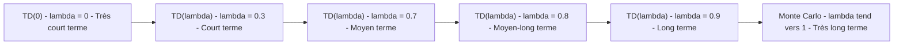
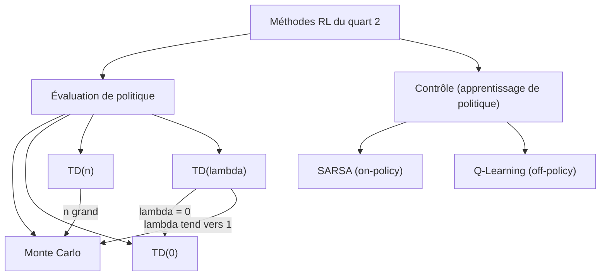

<a id="top"></a>

# Pratique 2 de révision — Troisième quart du cours

# Monte Carlo, TD-Learning, TD(λ), SARSA et Q-Learning

> Document consolidé regroupant et améliorant l'ensemble du contenu de cette pratique : rappels théoriques, comparaisons fines, études de cas industrielles, quiz, questions de réflexion, et liens vers les notebooks de code.

---

## Table des matières

| # | Section |
|---|---|
| — | [Équations de référence](#equations-reference) |
| 1 | [Pourquoi cette révision ?](#section-1) |
| 2 | [Rappel rapide — Monte Carlo et programmation dynamique](#section-2) |
| 3 | [Rappel rapide — TD(0), TD(n), TD(λ)](#section-3) |
| 4 | [TD(n) vs TD(λ) — la confusion à ne plus jamais faire](#section-4) |
| 5 | [TD(λ) en profondeur — analogies pédagogiques](#section-5) |
| 5a | &nbsp;&nbsp;&nbsp;↳ [Analogie 1 — Évaluer un employé (Samir)](#section-5) |
| 5b | &nbsp;&nbsp;&nbsp;↳ [Analogie 2 — Noter une série Netflix](#section-5) |
| 5c | &nbsp;&nbsp;&nbsp;↳ [Traces d'éligibilité — intuition visuelle](#section-5) |
| 6 | [SARSA et Q-Learning — rappel](#section-6) |
| 7 | [Études de cas — Série 1 (Monte Carlo vs TD-Learning)](#section-7) |
| 8 | [Études de cas — Série 2 (les 5 méthodes en compétition)](#section-8) |
| 9 | [Choix de méthode par élimination — méthode systématique](#section-9) |
| 10 | [Tableau récapitulatif des 6 études de cas industriels](#section-10) |
| 11 | [Quiz 1 — Monte Carlo (20 questions)](#section-11) |
| 12 | [Quiz 2 — TD-Learning (20 questions)](#section-12) |
| 13 | [Questions de réflexion — Monte Carlo](#section-13) |
| 14 | [Questions de réflexion — TD-Learning](#section-14) |
| 15 | [Pratique de codage — Notebooks Colab](#section-15) |
| 16 | [Corrigés indicatifs](#section-16) |
| 17 | [Synthèse — Ce qu'il faut absolument retenir](#section-17) |

---

<a id="equations-reference"></a>

## Équations de référence

### Description des termes

| Symbole | Nom | Rôle |
|---|---|---|
| $V(s)$ | Valeur d'un état | Récompense future espérée si on part de $s$ |
| $Q(s,a)$ | Valeur état-action | Récompense future espérée si on prend $a$ depuis $s$ |
| $R\_{t+1}$ | Récompense immédiate | Signal observé après l'action |
| $\gamma \in [0,1]$ | Facteur de discount | Importance des récompenses futures |
| $\alpha \in [0,1]$ | Taux d'apprentissage | Vitesse de mise à jour |
| $\lambda \in [0,1]$ | Coefficient de décroissance | Mémoire de l'historique dans TD(λ) |
| $\delta_t$ | Erreur TD | Différence cible − estimé courant |
| $G_t^{(n)}$ | Retour à n pas | $n$ récompenses observées + bootstrap |
| $G_t^{\lambda}$ | Retour λ-pondéré | Combinaison de tous les retours $G_t^{(n)}$ |

---

### Équations principales

**(Éq. 1) — Monte Carlo (mise à jour incrémentale)**

$$V(S_t) \leftarrow V(S_t) + \alpha \left[ G_t - V(S_t) \right]$$

où $G_t = R\_{t+1} + \gamma R\_{t+2} + \gamma^2 R\_{t+3} + \ldots + \gamma^{T-t-1} R_T$ est le **retour total observé** jusqu'à la fin de l'épisode.

---

**(Éq. 2) — TD(0)**

$$V(S_t) \leftarrow V(S_t) + \alpha \left[ R\_{t+1} + \gamma V(S\_{t+1}) - V(S_t) \right]$$

---

**(Éq. 3) — TD(n)**

$$V(S_t) \leftarrow V(S_t) + \alpha \left[ G_t^{(n)} - V(S_t) \right]$$

avec $G_t^{(n)} = R\_{t+1} + \gamma R\_{t+2} + \ldots + \gamma^{n-1} R\_{t+n} + \gamma^n V(S\_{t+n})$

---

**(Éq. 4) — TD(λ) — vue forward (théorique)**

$$G_t^{\lambda} = (1-\lambda) \sum\_{n=1}^{\infty} \lambda^{n-1} G_t^{(n)}$$

$$V(S_t) \leftarrow V(S_t) + \alpha \left[ G_t^{\lambda} - V(S_t) \right]$$

---

**(Éq. 5) — TD(λ) — vue backward (avec traces d'éligibilité)**

$$e_t(s) = \gamma \lambda e\_{t-1}(s) + \mathbf{1}\{s = S_t\}$$

$$V(s) \leftarrow V(s) + \alpha \delta_t e_t(s)$$

où $\delta_t = R\_{t+1} + \gamma V(S\_{t+1}) - V(S_t)$ est l'erreur TD.

---

**(Éq. 6) — SARSA (on-policy)**

$$Q(S_t, A_t) \leftarrow Q(S_t, A_t) + \alpha \left[ R\_{t+1} + \gamma Q(S\_{t+1}, A\_{t+1}) - Q(S_t, A_t) \right]$$

---

**(Éq. 7) — Q-Learning (off-policy)**

$$Q(S_t, A_t) \leftarrow Q(S_t, A_t) + \alpha \left[ R\_{t+1} + \gamma \max\_{a'} Q(S\_{t+1}, a') - Q(S_t, A_t) \right]$$

---

<a id="section-1"></a>

<details>
<summary>1 — Pourquoi cette révision ?</summary>

<br/>

Le **deuxième quart du cours** vous a fait découvrir cinq familles de méthodes d'apprentissage par renforcement :

1. **Monte Carlo** — apprentissage à partir d'**épisodes complets**
2. **TD(0)** — apprentissage **à chaque pas** avec un seul horizon
3. **TD(n)** — apprentissage **après n pas** avec un horizon fixe
4. **TD(λ)** — apprentissage en **combinant tous les horizons** avec une pondération
5. **SARSA et Q-Learning** — méthodes de **contrôle** (apprendre une politique, pas seulement évaluer)

Cette pratique vous permet de :

- **Vérifier** votre compréhension des concepts par des quiz à choix multiples (40 questions au total).
- **Approfondir** par des questions de réflexion ouvertes.
- **Appliquer** vos connaissances sur **6 études de cas industrielles concrètes** (gestion d'énergie, drones, supermarché, jeu vidéo, serveurs, marchés financiers).
- **Coder** chaque méthode en Python via des notebooks Colab fournis.

Vous devriez sortir de cette pratique en étant capable, devant n'importe quel problème industriel, de **choisir la méthode RL la plus adaptée** et de **justifier votre choix**.

</details>

<p align="right"><a href="#top">Retour en haut</a></p>

---

<a id="section-2"></a>

<details>
<summary>2 — Rappel rapide — Monte Carlo et programmation dynamique</summary>

<br/>

### Monte Carlo (MC)

**Définition :** méthode qui apprend uniquement à partir d'**expériences complètes** — on attend la **fin de l'épisode** pour calculer le retour total $G_t$ et mettre à jour les valeurs.

**Caractéristique clé :** **pas de modèle requis**, mais on doit **attendre la fin** pour apprendre.

#### Exemple — un match de la Coupe du Monde

> *« Pour dire quelle équipe a bien joué et juger la performance de chaque joueur, je ne peux pas décider après 5 minutes : je dois attendre la fin du match (90 minutes + prolongations + tirs au but si nécessaire). C'est seulement à la fin, en voyant le score final et toute la performance, que je peux évaluer les deux équipes. »*

#### Exemple — un film au cinéma

> *« Pour dire si c'est un bon film ou pas, je ne peux pas trancher après les 10 premières minutes. Beaucoup de films démarrent lentement et deviennent excellents à la fin (ou l'inverse). Je dois regarder le film en entier pour donner une vraie note. »*

---

### Programmation dynamique (DP)

**Définition :** méthode **planificatrice** qui calcule les valeurs **directement** à partir des équations de Bellman, en utilisant un **modèle complet** de l'environnement (probabilités de transition $P(s' \mid s, a)$ et récompenses $R(s, a)$ connues).

**Caractéristique clé :** **diviser un gros problème en petits sous-problèmes** plus simples, et combiner leurs solutions.

#### Idée centrale — diviser pour régner

> *« Un gros problème compliqué = la somme de plusieurs petits sous-problèmes plus simples, dont les solutions se combinent. »*

#### Exemple — faire un doctorat (PhD)

> *« Faire un doctorat en 5 ans est un projet énorme. Personne ne le résout d'un seul coup. On le divise en sous-problèmes : (1) trouver un sujet, (2) faire la revue de littérature, (3) publier 3 articles, (4) écrire la thèse, (5) la soutenir. Chaque sous-problème est lui-même divisé. La solution finale combine toutes les solutions. »*

#### Exemple — le GPS

> *« Pour aller de Montréal à Vancouver, le GPS divise le trajet : « Quel est le meilleur trajet de Montréal à chaque ville intermédiaire ? Puis de chaque ville intermédiaire à Vancouver ? » Il combine ensuite ces sous-trajets optimaux. »*

---

### TD-Learning combine les deux

| | Monte Carlo | Programmation dynamique | **TD-Learning** |
|---|---|---|---|
| Modèle requis ? | Non | **Oui** | Non |
| Attendre la fin ? | **Oui** | Non | Non |
| Bootstrap ? | Non | Oui | Oui |
| Type d'apprentissage | Empirique, lent | Théorique, calculé | Empirique, rapide |

> **TD-Learning prend le meilleur des deux :** de Monte Carlo, il n'a pas besoin de modèle. De Programmation dynamique, il utilise le bootstrap (n'attend pas la fin de l'épisode).

</details>

<p align="right"><a href="#top">Retour en haut</a></p>

---

<a id="section-3"></a>

<details>
<summary>3 — Rappel rapide — TD(0), TD(n), TD(λ)</summary>

<br/>

### Les trois philosophies de mise à jour

#### TD(0) — très rapide

On met à jour **immédiatement** avec ce qu'on connaît maintenant : la récompense reçue + l'estimation de la valeur de l'état suivant.

$$V(S_t) \leftarrow V(S_t) + \alpha \left[ R\_{t+1} + \gamma V(S\_{t+1}) - V(S_t) \right]$$

- **Avantages :** très rapide, peu coûteux, parfait pour les environnements rapides
- **Limites :** ne voit pas plus loin que 1 pas, sous-utilise les informations futures

---

#### TD(n) — moyennement patient

On attend d'avoir **n récompenses** avant de mettre à jour.

$$V(S_t) \leftarrow V(S_t) + \alpha \left[ G_t^{(n)} - V(S_t) \right]$$

avec $G_t^{(n)} = \sum\_{k=1}^{n} \gamma^{k-1} R\_{t+k} + \gamma^n V(S\_{t+n})$

- **Avantages :** meilleure précision si n augmente, combine récompenses réelles + bootstrap
- **Limites :** si n est grand, l'agent doit attendre avant d'apprendre ; variance plus élevée ; mémoire plus grande
- **Choix de n :** délicat — petit n = trop myope, grand n = trop lent

---

#### TD(λ) — très intelligent

On **mélange toutes les mises à jour possibles**, court terme + moyen terme + long terme, avec une pondération λ.

$$G_t^{\lambda} = (1-\lambda) \sum\_{n=1}^{\infty} \lambda^{n-1} G_t^{(n)}$$

- **λ = 0** → comportement TD(0) (très court terme)
- **λ proche de 1** → mélange proche de Monte Carlo (très long terme)
- **0 < λ < 1** → un peu de TD(1), TD(2), TD(3), etc.

C'est comme si **TD(0), TD(1), TD(2), TD(3)… travaillaient ensemble**, avec des poids dégressifs.

---

### Tableau comparatif complet

| Méthode | Horizon | Mise à jour | Biais | Variance | Rapidité | Utilité principale |
|---|---|---|---|---|---|---|
| **TD(0)** | 1 pas | immédiate | élevé | faible | très rapide | environnements rapides |
| **TD(n)** | n pas | retardée | moyen | plus élevée | moyenne | prédictions à horizon court/moyen |
| **TD(λ)** | tous n | incrémentale | compromis | compromis | très bonne | environnements complexes, non stationnaires |

---

### À retenir en gros

> ### **TD(1) → 1 horizon**
> ### **TD(2) → 2 horizons**
> ### **TD(3) → 3 horizons**
> ### **…**
> ### **TD(n) → n horizons** (nombre **entier** de pas regardés)
> ### **TD(λ) → pondération d'horizons** (combinaison de **tous** les horizons avec des poids λ, λ², λ³, ...)

</details>

<p align="right"><a href="#top">Retour en haut</a></p>

---

<a id="section-4"></a>

<details>
<summary>4 — TD(n) vs TD(λ) — la confusion à ne plus jamais faire</summary>

<br/>

### Le piège

Beaucoup d'étudiants confondent **TD(n)** et **TD(λ)** parce que les notations se ressemblent. **Il faut absolument séparer les deux.**

---

### TD(n) — n est un **nombre entier de pas**

Avec **TD(n)**, on décide **à l'avance** sur combien de pas on regarde le futur.

> Exemple TD(3) : *« Pour mettre à jour la note d'aujourd'hui, je regarde exactement 3 jours dans le futur, puis j'ajuste la note. »*

Ici, **n est clairement un nombre de pas**.
On parle de TD(1), TD(2), TD(3), TD(4), etc., avec **n entier**.

> **TD(3) = je regarde un bloc fixe de 3 pas, les autres ne comptent pas du tout dans cette mise à jour.**

---

### TD(λ) — λ est un **coefficient de décroissance** (réel ∈ [0, 1])

Avec **TD(λ)**, on **ne choisit pas** un nombre fixe de pas, on dit plutôt :

> *« Je vais tenir compte de tous les pas passés, mais avec une importance qui diminue progressivement. »*

Exemple **TD(λ = 0,3)** :

> *« Je prends en compte tous les pas, mais avec des poids qui décroissent : 1 pour le pas le plus récent, 0,3 pour le suivant, 0,3² pour celui d'avant, 0,3³ pour encore avant, etc. »*

Ici, **0,3 n'est pas un nombre de pas**, c'est un **coefficient de décroissance entre 0 et 1**.

---

### Tableau comparatif

| Aspect | **TD(n)** | **TD(λ)** |
|---|---|---|
| Type du paramètre | **Entier** $n \in \{1, 2, 3, \ldots\}$ | **Réel** $\lambda \in [0, 1]$ |
| Lecture intuitive | « Bloc fixe de n pas » | « Mémoire qui s'efface progressivement » |
| Ce qu'on prend en compte | **Exactement** n pas, **rien** au-delà | **Tous** les pas, mais avec poids décroissants |
| Cas limites | TD(1), TD(2), …, $n \to \infty$ ≈ Monte Carlo | $\lambda = 0$ ≈ TD(0), $\lambda \to 1$ ≈ Monte Carlo |
| Ex. d'écriture | TD(3) | TD(0,3) |
| Confusion à éviter | TD(0,3) **n'est pas** TD(3) | TD(3) **n'est pas** TD(λ = 3) (impossible : λ ≤ 1) |

---

### Différences détaillées

#### a) Horizon

- **TD(n)** : un seul horizon fixe n.
  *« Je regarde exactement n pas dans le futur. »*
- **TD(λ)** : **tous** les horizons (1, 2, 3, …), avec poids décroissant $\lambda^{n-1}$.
  *« Je regarde court, moyen et long terme en même temps, avec une décroissance contrôlée. »*

#### b) Paramétrage

- **TD(n)** : on choisit un **entier** n. Mauvais choix = méthode fragile.
- **TD(λ)** : on choisit un **réel** λ ∈ [0, 1]. Cela donne un contrôle continu entre TD(0) et Monte Carlo.

#### c) Biais et variance

- **TD(n)** : petit n = plus de biais, moins de variance ; grand n = moins de biais, plus de variance
- **TD(λ)** : compromis lissé en combinant plusieurs n, souvent **plus stable** que de choisir un seul n

#### d) Implémentation pratique

- **TD(n)** (forward) : il faut stocker les n prochaines récompenses avant de mettre à jour → **délai**
- **TD(λ)** (backward avec traces d'éligibilité) : mise à jour **à chaque pas** → naturellement adapté à l'apprentissage en ligne

---

### Phrase à graver

> **« TD(n), c'est un nombre de pas. TD(λ), c'est une vitesse d'oubli. »**

</details>

<p align="right"><a href="#top">Retour en haut</a></p>

---

<a id="section-5"></a>

<details>
<summary>5 — TD(λ) en profondeur — analogies pédagogiques</summary>

<br/>

### 5a — Analogie 1 — Évaluer un employé (Samir)

Imagine que tu veux évaluer la **performance de Samir** au fil du temps. Chaque semaine, il produit un résultat :

| Semaine | Performance |
|---|---|
| Semaine 1 | pas très bon |
| Semaine 2 | moyen |
| Semaine 3 | très bon |
| Semaine 4 | très bon |
| Semaine 5 | catastrophique (bug majeur) |
| Semaine 6 | correct |

**Comment mettre à jour la note de Samir ?**

#### Avec TD(0)

*« Je note Samir uniquement sur la dernière semaine. »*

Si la semaine 5 est catastrophique, tu baisses la note **fortement et immédiatement**, même si Samir était excellent les semaines précédentes.

→ Très réactif, mais **souvent injuste ou instable**.

#### Avec TD(2) ou TD(3)

*« Je note Samir en regardant les deux ou trois dernières semaines. »*

Par exemple TD(3) : les semaines 3, 4, 5 influencent la note. Une seule mauvaise semaine (5) modifie la note, mais les bonnes semaines (3-4) **amortissent le choc**.

→ Mieux, mais **tu dois choisir à l'avance** combien de semaines regarder. Mauvais choix = mauvaise évaluation.

#### Avec TD(λ)

*« Je prends en compte toutes les semaines passées, mais avec une importance décroissante. »*

- La semaine juste avant : très importante
- La semaine précédente : un peu moins
- Celle encore avant : encore moins
- Et ainsi de suite

La décroissance est contrôlée par λ :

| λ | Comportement |
|---|---|
| **λ = 0** | seule la dernière semaine compte (= TD(0)) |
| **λ = 0,3** | la dernière semaine domine, les autres comptent peu |
| **λ = 0,5** | la dernière compte beaucoup, celle d'avant un peu, la 3ᵉ beaucoup moins |
| **λ = 0,9** | tu prends en compte quasiment tout l'historique, avec une décroissance lente |

#### Exemple numérique simple

Supposons :

- Semaine 4 : Samir obtient 9/10
- Semaine 5 : Samir obtient 2/10 (mauvaise)
- Semaine 6 : Samir obtient 7/10

Tu mets à jour sa note après la semaine 6.

Avec **TD(λ = 0,5)** :

- Semaine 6 : poids 1
- Semaine 5 : poids 0,5
- Semaine 4 : poids 0,25

Donc **même si la semaine 5 était très mauvaise**, elle ne ruine pas toute l'évaluation, car :

1. les bonnes semaines précédentes comptent encore un peu
2. la nouvelle semaine 6 corrige immédiatement
3. la mauvaise semaine 5 est pondérée par λ

→ C'est exactement l'intelligence de TD(λ).

---

### Calcul détaillé sur 4 jours futurs (Samir)

Supposons que Samir ait les performances suivantes sur les 4 prochains jours :

- Jour +1 : 40 / 100
- Jour +2 : 80 / 100
- Jour +3 : 90 / 100
- Jour +4 : 60 / 100

Comparons les méthodes (intuition « moyenne pondérée », sans formule RL exacte).

#### TD(0) — uniquement Jour +1

Pour la mise à jour d'aujourd'hui, on ne regarde que Jour +1.

→ Cible utilisée ≈ **40 / 100**

Si Samir se plante demain, la note chute immédiatement vers 40, même s'il se rattrape ensuite.

#### TD(3) — moyenne sur 3 jours

On prend les jours +1, +2, +3, tous avec le même poids :

```
cible ≈ (40 + 80 + 90) / 3 = 70 / 100
```

Une mauvaise journée (40) est compensée par les jours +2 et +3.

#### TD(λ = 0,3)

Poids approximatifs (non normalisés) :

- Jour +1 : 0,70
- Jour +2 : 0,21
- Jour +3 : 0,06
- Jour +4 : 0,02

```
cible ≈ 0,70 × 40 + 0,21 × 80 + 0,06 × 90 + 0,02 × 60
      ≈ 28 + 16,8 + 5,4 + 1,2
      ≈ 51 / 100
```

Ici, la mauvaise note du Jour +1 tire fortement vers le bas, parce que le poids 0,70 est dominant.

#### TD(λ = 0,7)

Poids approximatifs :

- Jour +1 : 0,30
- Jour +2 : 0,21
- Jour +3 : 0,15
- Jour +4 : 0,10

```
cible_brute ≈ 0,30 × 40 + 0,21 × 80 + 0,15 × 90 + 0,10 × 60
            = 12 + 16,8 + 13,5 + 6
            = 48,3
```

Somme des poids = 0,76. Normalisé : `48,3 / 0,76 ≈ 63,6 / 100`.

#### Tableau récapitulatif — Samir sur 4 jours

| Méthode | Paramètre | Horizon (intuition) | Sensibilité court terme | Stabilité long terme | Cible approx. |
|---|---|---|---|---|---|
| **TD(0)** | – | Un seul jour : Jour +1 | Très réactive | Aucune | ≈ **40** |
| **TD(3)** | – | Horizon fixe : Jours +1, +2, +3 | Moyenne | Bonne sur 3 jours | ≈ **70** |
| **TD(λ = 0,3)** | 0,3 | Tous, mais Jour +1 domine | Très forte | Faible | ≈ **51** |
| **TD(λ = 0,7)** | 0,7 | Tous, poids plus équilibrés | Sensible mais lissée | Bonne | ≈ **64** |
| **TD(λ = 0,9)** | 0,9 | Trajectoire complète prise en compte | Peu sensible aux accidents | Très forte | ≈ **66** |

---

### 5b — Analogie 2 — Noter une série Netflix

Tu regardes une série Netflix et tu veux donner une note à l'épisode 1.

#### Trois stratégies extrêmes

1. **TD(0)** :
   Tu notes l'épisode 1 **après seulement les 5 premières minutes**.
   → Très rapide, mais tu risques de te tromper.

2. **Monte Carlo** :
   Tu attends d'avoir vu **toute la saison** avant de noter l'épisode 1.
   → Très précis, mais beaucoup trop lent.

3. **TD(n)** :
   Tu décides : *« Je regarde exactement 3 épisodes (1, 2, 3), puis je donne une note à l'épisode 1. »*
   → C'est mieux, mais tu dois choisir ce « 3 » à l'avance.

#### TD(λ) fait quelque chose de plus intelligent

> *« Je vais tenir compte de l'épisode 2, un peu de l'épisode 3, un peu moins de l'épisode 4, encore moins du 5, etc., en diminuant progressivement leur importance. »*

C'est un **mélange pondéré** de « regarder un peu », « regarder moyen » et « regarder plus loin ».

#### Le rôle de λ — un curseur de patience

- **λ = 0** : tu n'utilises que ce qui se passe immédiatement → TD(0)
- **λ proche de 1** : tu donnes de l'importance à des événements lointains → comportement Monte Carlo
- **0 < λ < 1** : compromis (court + moyen + un peu de long terme)

> **petit λ** : *« je suis impatient, je veux apprendre très vite, même si c'est approximatif »*
> **grand λ** : *« je suis plus patient, je veux tenir compte d'une histoire plus longue »*

---

### 5c — Traces d'éligibilité — intuition visuelle

TD(λ) est implémenté en pratique avec les **traces d'éligibilité**.

L'idée : l'algorithme garde une **trace** des états récemment visités.

- Plus un état est récent, plus sa trace est **forte**.
- Plus il est ancien, plus sa trace **s'efface**.

Quand une nouvelle récompense arrive (bonne ou mauvaise), l'algorithme :

1. calcule l'**erreur TD** entre ce qu'il attendait et ce qui s'est passé,
2. **propage** cette erreur vers les états passés, **avec une intensité décroissante** (les états récents reçoivent une plus grande correction).

Cette « intensité décroissante » est contrôlée par λ.

#### Formule

$$e_t(s) = \gamma \lambda e\_{t-1}(s) + \mathbf{1}\{s = S_t\}$$

$$V(s) \leftarrow V(s) + \alpha \delta_t e_t(s)$$

où $\delta_t = R\_{t+1} + \gamma V(S\_{t+1}) - V(S_t)$ est l'erreur TD au temps t.

Plus un état a été visité récemment, plus il reçoit une mise à jour lorsque l'erreur TD apparaît.

---

### Comparaison des approches sur un même axe temporel



</details>

<p align="right"><a href="#top">Retour en haut</a></p>

---

<a id="section-6"></a>

<details>
<summary>6 — SARSA et Q-Learning — rappel</summary>

<br/>

TD(0), TD(n) et TD(λ) sont des méthodes **d'évaluation** : elles estiment $V(s)$. Pour **prendre des décisions**, il faut $Q(s, a)$ — c'est ce que font SARSA et Q-Learning.

### SARSA (on-policy)

**Acronyme :** **S**tate, **A**ction, **R**eward, **S**tate', **A**ction'

$$Q(S_t, A_t) \leftarrow Q(S_t, A_t) + \alpha \left[ R\_{t+1} + \gamma Q(S\_{t+1}, A\_{t+1}) - Q(S_t, A_t) \right]$$

> **SARSA met à jour Q avec l'action $A\_{t+1}$ qui sera réellement effectuée par la politique courante (par ex. ε-greedy).**

**Caractère on-policy :** SARSA apprend la valeur de la politique **réellement suivie**, exploration ε comprise.

---

### Q-Learning (off-policy)

$$Q(S_t, A_t) \leftarrow Q(S_t, A_t) + \alpha \left[ R\_{t+1} + \gamma \max\_{a'} Q(S\_{t+1}, a') - Q(S_t, A_t) \right]$$

> **Q-Learning utilise $\max\_{a'} Q(S\_{t+1}, a')$ : il met à jour comme si l'agent allait toujours choisir la meilleure action ensuite, même si dans la réalité il explore.**

**Caractère off-policy :** la politique cible (greedy sur Q) diffère de la politique de comportement (ε-greedy).

---

### Différence clé en une ligne

$$\boxed{\;\text{SARSA} : r + \gamma Q(s', a'\_{\text{suivie}}) \quad\text{vs}\quad \text{Q-Learning} : r + \gamma \max\_{a'} Q(s', a')\;}$$

---

### Tableau récapitulatif

| | TD(0) | SARSA | Q-Learning |
|---|---|---|---|
| Met à jour | $V(s)$ | $Q(s, a)$ | $Q(s, a)$ |
| Type | évaluation | **contrôle on-policy** | **contrôle off-policy** |
| Action utilisée pour bootstrapper | aucune | $a'$ **réellement suivie** | $\arg\max\_{a'}$ |
| Comportement appris | passif | prudent (suit la politique réelle) | optimal théorique |

</details>

<p align="right"><a href="#top">Retour en haut</a></p>

---

<a id="section-7"></a>

<details>
<summary>7 — Études de cas — Série 1 (Monte Carlo vs TD-Learning)</summary>

<br/>

> **Pour chacune des 5 études de cas suivantes, vous devez :**
> 1. Choisir entre **Monte Carlo** et **TD-Learning**.
> 2. Justifier votre choix par les caractéristiques de l'environnement.
> 3. Identifier les limitations de la méthode choisie.

---

### Étude de cas 1.1 — Prévision des températures pour les cultures agricoles

Un groupe de chercheurs souhaite optimiser la production agricole en prévoyant les températures sur plusieurs mois. L'objectif est de fournir une estimation de température pour chaque jour, à partir de données historiques, afin de planifier les périodes de plantation et de récolte.

**Questions :**

1. Étant donné la nature de la prévision sur une **série temporelle** (chaque jour dépend des précédents), recommanderiez-vous TD-Learning ou Monte Carlo ? Justifiez.
2. Quelles seraient les limitations de la méthode choisie pour ce type de prédiction climatique ?

---

### Étude de cas 1.2 — Simulation de ventes en ligne avec remises

Un site e-commerce cherche à simuler les ventes pour différents scénarios de remises. L'objectif est de prédire l'**impact des remises sur les ventes** en observant les comportements des clients lors de précédentes périodes de promotions.

**Questions :**

1. Si le site souhaite estimer la **valeur moyenne des ventes** au cours d'une promotion, quel algorithme recommanderiez-vous entre Monte Carlo et TD-Learning ?
2. Quelles seraient les raisons d'éviter l'autre méthode dans ce cas précis ?

---

### Étude de cas 1.3 — Prévision des événements météorologiques extrêmes

Une organisation météorologique souhaite créer un modèle pour estimer la **probabilité d'événements extrêmes** (tempêtes, vagues de chaleur) en fonction des données des dernières années. Avec l'intensification des phénomènes due au changement climatique, ils veulent un modèle adaptable qui prend en compte les extrêmes croissants.

**Questions :**

1. Entre Monte Carlo et TD-Learning, lequel recommanderiez-vous pour prévoir des événements extrêmes en fonction de tendances annuelles ? Expliquez comment la méthode choisie pourrait s'adapter aux changements climatiques.
2. Quel pourrait être un inconvénient de la méthode choisie ?

---

### Étude de cas 1.4 — Navigation d'un robot dans un entrepôt

Un robot est programmé pour déplacer des marchandises dans un entrepôt. Il reçoit des récompenses en fonction de la **distance parcourue** et des **obstacles évités**. Les environnements peuvent être différents d'un trajet à l'autre, car les obstacles changent de position.

**Questions :**

1. Pour un environnement où chaque trajet est unique, est-il plus judicieux d'utiliser TD-Learning ou Monte Carlo ?
2. Quelles seraient les conditions dans lesquelles l'autre méthode serait plus efficace ?

---

### Étude de cas 1.5 — Prévision des comportements d'achat

Une entreprise souhaite modéliser les **comportements d'achat des consommateurs** au fil du temps pour maximiser les profits en s'adaptant aux changements dans les habitudes de consommation. Elle dispose de données sur les achats historiques, et chaque nouvel achat est influencé par les actions précédentes de la campagne marketing.

**Questions :**

1. Recommanderiez-vous TD-Learning ou Monte Carlo pour modéliser les comportements d'achat au fil du temps ?
2. Quel avantage aurait votre méthode pour s'adapter à des habitudes de consommation évoluant constamment ?

---

### Pistes de réponse — Série 1

Pour vous orienter avant de consulter le corrigé :

- **Monte Carlo** est plus adapté quand des **épisodes complets** sont disponibles et peuvent être analysés en moyenne (événements indépendants, sans dépendance temporelle immédiate).
- **TD-Learning** convient mieux dans les environnements où une **mise à jour progressive** est utile pour s'adapter aux changements continus dans les séquences de données.

</details>

<p align="right"><a href="#top">Retour en haut</a></p>

---

<a id="section-8"></a>

<details>
<summary>8 — Études de cas — Série 2 (les 5 méthodes en compétition)</summary>

<br/>

> **Pour chacune des 6 études de cas suivantes, choisissez parmi : TD(0), TD(λ), Q-Learning, SARSA, Monte Carlo.**
> Justifiez votre choix selon les caractéristiques de l'environnement (stabilité, complexité, dynamique, etc.).

---

### Étude de cas 2.1 — Gestion de l'énergie dans une maison intelligente

Une maison intelligente doit, **chaque heure**, choisir parmi trois sources d'énergie :

1. l'énergie renouvelable disponible (solaire, éolien),
2. l'énergie provenant du réseau principal, dont le prix varie au cours de la journée,
3. les batteries domestiques, dont la capacité et la vitesse de chargement sont limitées.

Le prix de l'électricité dépend de :

- la période de la journée (heures pleines, heures creuses),
- la demande locale ou régionale,
- les prévisions météorologiques,
- les variations imprévisibles du marché.

Le problème est **dynamique, non stationnaire**, et dépend d'un horizon temporel glissant.

#### Réponse — TD(λ)

TD(λ) combine plusieurs niveaux d'information temporelle :

- le présent immédiat (comme TD(0)),
- les signaux des heures précédentes (comme TD(1), TD(2), etc.),
- un horizon complet pondéré par λ.

**Pourquoi pas les autres ?**

- **TD(0)** : trop court terme, ignore l'évolution progressive des conditions.
- **Monte Carlo** : exige un épisode complet (journée), incompatible avec des décisions horaires.
- **Q-Learning** : cherche une politique optimale qui n'existe pas dans un environnement non stationnaire.
- **SARSA** : prudent, mais l'objectif n'est pas la sécurité — c'est l'efficacité énergétique.

**Avantage de TD(λ) :** mise à jour incrémentale après chaque heure, pondération décroissante des événements passés, analyse multi-horizon.

---

### Étude de cas 2.2 — Navigation d'un drone en environnement changeant

Un drone doit livrer des colis dans un environnement **dynamique** : obstacles mobiles (oiseaux, autres drones), conditions de vent variables. Récompense positive pour livraison réussie, pénalité pour collision.

#### Réponse — SARSA combiné avec TD(λ)

**Pourquoi cette combinaison ?**

1. L'environnement est **stochastique** (vent, obstacles imprévisibles) → Q-Learning serait trop optimiste.
2. La **prudence et la sécurité** du drone sont essentielles → SARSA apprend la politique réellement suivie (plus prudente).
3. L'agent doit **adapter sa politique en continu** → TD(λ) permet des mises à jour incrémentales sans attendre la fin de l'épisode.

**Pourquoi pas les autres ?**

- **TD(0)** : trop local, mauvaise anticipation des dépendances temporelles (rafale de vent).
- **Q-Learning** : favorise l'action « max Q » même si dangereuse → risque de collision.
- **Monte Carlo** : impossible d'attendre la fin d'un vol pour mettre à jour.
- **TD(n)** : moins flexible que TD(λ) car horizon fixe.

---

### Étude de cas 2.3 — Anticipation des demandes dans un supermarché

Un supermarché optimise ses commandes en fonction des **comportements de consommation** et des **événements saisonniers**. La demande fluctue (produits estivaux en été, etc.). L'environnement est **non stationnaire** : les habitudes évoluent, les saisons changent, les promotions perturbent la demande.

#### Réponse — TD(λ)

TD(λ) permet :

- d'**adapter progressivement** les estimations aux tendances de consommation
- d'être **sensible aux dépendances temporelles** (les ventes d'aujourd'hui dépendent des jours précédents)
- de **ne pas attendre la fin d'une saison** entière pour mettre à jour

**Pourquoi pas les autres ?**

- **TD(0)** : trop sensible au bruit (une journée exceptionnelle perturbe les estimations).
- **Monte Carlo** : mise à jour trop tardive (fin de saison), incapable de réagir à un produit qui devient viral en quelques jours.
- **Q-Learning** : suppose un environnement stable, ce qui n'est pas le cas.
- **SARSA** : la prudence n'est pas l'enjeu central ici.

**Avantage spécifique :** TD(λ) distingue une **fluctuation ponctuelle** (un seul jour anormal) d'un **changement réel de tendance** (hausse sur plusieurs jours).

---

### Étude de cas 2.4 — Apprentissage d'un jeu vidéo de combat

Un agent IA doit anticiper les mouvements d'un **adversaire virtuel**. Chaque mouvement (attaquer, esquiver) a une probabilité de succès qui dépend des actions précédentes de l'IA et de l'adversaire.

#### Réponse — Q-Learning (si adversaire stable) ou SARSA (si adversaire non déterministe)

**Cas adversaire stable → Q-Learning :**

- Permet d'extraire la politique optimale théorique
- Exploite les faiblesses fixes de l'adversaire
- Apprend des actions agressives qui maximisent la récompense à long terme

**Cas adversaire non déterministe → SARSA :**

- Politique plus prudente (basée sur les actions réellement effectuées)
- Adaptation stable face à un comportement variable
- Évite les stratégies sur-optimistes basées sur des situations idéales

**Pourquoi pas les autres ?**

- **TD(0)** : trop local pour capturer les longues séquences d'actions.
- **Monte Carlo** : variance trop élevée dans les jeux adversariaux, mises à jour tardives.

---

### Étude de cas 2.5 — Répartition de la charge dans un réseau de serveurs

Une entreprise optimise la répartition de la charge sur un **réseau de serveurs** pour maximiser l'efficacité et minimiser les coûts d'énergie. La charge varie en temps réel.

#### Réponse — TD(λ) (ou SARSA si haute incertitude)

**TD(λ)** capture les dépendances temporelles à court et moyen terme (évolution de charge sur quelques minutes).

**SARSA** est préféré si on veut une politique conservatrice qui évite des décisions trop risquées.

**Pourquoi pas les autres ?**

- **TD(0)** : provoque du *thrashing* (réallocation trop fréquente), manque la tendance.
- **Monte Carlo** : un épisode peut durer une journée → inutilisable.
- **Q-Learning** : politique trop agressive, risque de surcharge instantanée.

---

### Étude de cas 2.6 — Prédiction des mouvements de marché financier

Un trader algorithmique prédit les variations futures du marché à partir de données historiques de prix, de signaux récents, de news, et de microstructures de marché. Le marché est **non stationnaire** et **volatil**.

#### Réponse — TD(λ)

**Pourquoi TD(λ) ?**

- Le marché exige une mise à jour **en temps réel** (online).
- Les mouvements de prix dépendent de l'**historique récent** (momentum, micro-tendances).
- TD(λ) prend en compte une **trace déclinante du passé**.
- Il **équilibre instantané + mémoire courte** grâce au paramètre λ.
- Il **réduit la variance** sans sacrifier la réactivité.
- Il **gère bien les régimes non stationnaires**.

**Pourquoi pas les autres ?**

- **TD(0)** : trop court (1 pas), ignore les dépendances multi-temps.
- **Monte Carlo** : attend la fin d'un épisode (journée entière) → impossible.
- **Q-Learning et SARSA** : le trading n'est pas un problème « agent → action → récompense », c'est un problème de **prédiction continue** de fonction de valeur.

</details>

<p align="right"><a href="#top">Retour en haut</a></p>

---

<a id="section-9"></a>

<details>
<summary>9 — Choix de méthode par élimination — méthode systématique</summary>

<br/>

### Méthode en 3 étapes

Pour chaque problème industriel, vous pouvez systématiquement :

1. **Élimination radicale** — éliminer les méthodes manifestement incompatibles avec le contexte.
2. **Méthodes encore possibles** — identifier les candidates restantes.
3. **Méthode recommandée** — choisir la plus adaptée et justifier.

---

### Cas 1 — Gestion de l'énergie (maison intelligente)

**Élimination radicale :**

- **Monte Carlo** : éliminé. Impossible d'attendre la fin d'une journée pour mettre à jour le modèle.
- **Q-Learning** : éliminé. Le problème n'est pas centré sur des actions optimales dans un environnement interactif complexe, mais sur une prédiction et un ajustement continu.
- **SARSA** : éliminé. La prudence n'a pas d'intérêt ici. Le risque n'est pas lié à un agent face à des états dangereux, mais à de la prédiction énergétique.

**Méthodes possibles :** TD(0), TD(λ).

**Méthode recommandée :** **TD(λ)** — capture les variations instantanées et les tendances récentes.

---

### Cas 2 — Drone en environnement changeant

**Élimination radicale :**

- **Monte Carlo** : éliminé. Impossible d'attendre la fin du vol.
- **TD(0)** : éliminé. Une seule observation est insuffisante dans un environnement physique dynamique.
- **Q-Learning** : éliminé. Hors politique agressif, instable en environnement non stationnaire.

**Méthodes possibles :** SARSA, TD(λ).

**Méthode recommandée :** **TD(λ)** (combiné avec une politique SARSA-like pour la prudence) — mises à jour incrémentales adaptées aux signaux qui se propagent sur plusieurs pas.

---

### Cas 3 — Supermarché

**Élimination radicale :**

- **TD(0)** : éliminé. Le comportement de consommation ne se décide pas sur un seul pas temporel.
- **Monte Carlo** : éliminé. Les épisodes saisonniers durent des semaines.
- **SARSA** : éliminé. Pas d'enjeu de prudence, pas d'interaction agent-environnement.
- **Q-Learning** : éliminé. Pas un problème d'action optimale, mais d'anticipation continue.

**Méthodes possibles :** TD(λ).

**Méthode recommandée :** **TD(λ)** — actualise continuellement, capte tendances saisonnières et micro-tendances.

---

### Cas 4 — Jeu vidéo de combat

**Élimination radicale :**

- **Monte Carlo** : éliminé. Adaptation instantanée requise.
- **TD(0)** : éliminé. Trop court pour les séquences d'actions adverses.

**Méthodes possibles :** Q-Learning, SARSA.

**Méthode recommandée :** **SARSA** si adversaire non déterministe, **Q-Learning** si adversaire stable.

---

### Cas 5 — Réseau de serveurs

**Élimination radicale :**

- **Monte Carlo** : éliminé. Impossible d'attendre la fin de la journée.
- **Q-Learning** : éliminé. Politiques agressives instables dans un centre de données.
- **SARSA** : non éliminé mais sous-optimal. Possible mais insuffisant pour capturer les tendances temporelles.

**Méthodes possibles :** TD(0), TD(λ).

**Méthode recommandée :** **TD(λ)** — combine réactivité et capture de tendances.

---

### Cas 6 — Marché financier

**Élimination radicale :**

- **Monte Carlo** : éliminé. Le modèle doit réagir immédiatement.
- **Q-Learning** : éliminé. Pas un problème d'action optimale mais de prédiction continue.
- **SARSA** : éliminé. Pas un environnement interactif requérant une politique prudente.
- **TD(0)** : non éliminé mais insuffisant. Réagit vite mais ne capture pas les dépendances multi-temps.

**Méthodes possibles :** TD(λ).

**Méthode recommandée :** **TD(λ)** — met à jour à chaque nouvelle donnée tout en intégrant un historique pondéré.

</details>

<p align="right"><a href="#top">Retour en haut</a></p>

---

<a id="section-10"></a>

<details>
<summary>10 — Tableau récapitulatif des 6 études de cas industriels</summary>

<br/>

| Étude de cas | Méthodes éliminées radicalement | Méthodes encore possibles | Méthode recommandée | Justification finale |
|---|---|---|---|---|
| **1. Gestion de l'énergie (maison intelligente)** | Monte Carlo (retard immense), Q-Learning (type contrôle inutile), SARSA (prudence non pertinente) | TD(0), TD(λ) | **TD(λ)** | Capture les tendances temporelles tout en restant réactif aux variations du coût et de la météo. |
| **2. Drone en environnement changeant** | Monte Carlo (mise à jour trop tardive), TD(0) (vision trop courte), Q-Learning (instable en environnement non stationnaire) | SARSA, TD(λ) | **TD(λ)** | Mise à jour incrémentale adaptée aux conditions dynamiques et obstacles mouvants. |
| **3. Prévision de demande en supermarché** | TD(0) (trop court terme), Monte Carlo (épisodes trop longs), SARSA (non pertinent), Q-Learning (problème non décisionnel) | TD(λ) | **TD(λ)** | Suivi continu des tendances saisonnières avec mémoire pondérée du passé récent. |
| **4. Jeu vidéo de combat (agent vs adversaire)** | Monte Carlo (retard trop long), TD(0) (incapacité à capturer séquences adverses) | Q-Learning, SARSA | **SARSA** | S'adapte aux adversaires non déterministes en apprenant une politique alignée avec ses actions réelles. |
| **5. Répartition de charge (serveurs)** | Monte Carlo (trop lent), Q-Learning (risque agressif), SARSA (prudence mais pas optimal), TD(0) (trop limité) | TD(λ) | **TD(λ)** | Combine réactivité en temps réel et prise en compte des variations structurelles de la charge. |
| **6. Marchés financiers (prédiction)** | Monte Carlo (retard immense), SARSA (non pertinent), Q-Learning (pas un problème d'actions optimales), TD(0) (pas assez riche) | TD(λ) | **TD(λ)** | Gère mieux la volatilité grâce à une trace d'historique pondérée, essentielle dans les marchés instables. |

---

### Résumé global en une phrase

> Dans les six cas industriels proposés, **TD(λ) domine la majorité des scénarios** grâce à sa capacité d'intégrer simultanément la réactivité de TD(0) et la mémoire des tendances récentes, tandis que Monte Carlo, Q-Learning et SARSA ne répondent pas aux contraintes temporelles ou structurelles des systèmes réels — sauf dans le cas du jeu vidéo où SARSA est préféré.

</details>

<p align="right"><a href="#top">Retour en haut</a></p>

---

<a id="section-11"></a>

<details>
<summary>11 — Quiz 1 — Monte Carlo (20 questions)</summary>

<br/>

> **Instructions :** choisissez **la meilleure réponse**. Justifiez en une ou deux phrases lorsque c'est possible.

---

**Q1.** Qu'est-ce que la méthode de Monte Carlo dans le contexte de l'apprentissage par renforcement ?

a) Une technique utilisant un modèle prédictif de l'environnement
b) Une méthode basée sur l'échantillonnage aléatoire répété pour estimer des valeurs
c) Une méthode qui calcule les valeurs d'état en temps réel
d) Une approche déterministe pour calculer des politiques optimales

---

**Q2.** Quel est l'objectif principal de la prédiction Monte Carlo ?

a) Déterminer la meilleure action pour chaque état
b) Calculer le rendement attendu pour une politique donnée
c) Évaluer la politique optimale
d) Calculer les transitions d'état

---

**Q3.** Dans la méthode **Every-Visit**, la valeur d'un état est mise à jour :

a) Uniquement la première fois que l'état est visité
b) À chaque fois que l'état est visité dans chaque épisode
c) Seulement si l'épisode se termine dans cet état
d) Après plusieurs épisodes

---

**Q4.** Dans la méthode **First-Visit**, la valeur d'un état est mise à jour :

a) À chaque visite de cet état dans chaque épisode
b) Seulement la première fois qu'il est visité dans chaque épisode
c) Après avoir visité tous les états
d) À chaque fois que l'épisode se termine dans cet état

---

**Q5.** Quelle équation représente la mise à jour de la fonction de valeur dans la méthode Every-Visit ?

a) $V(s) = V(s) + \alpha G$
b) $V(s) \approx \frac{1}{N(s)} \sum\_{i=1}^{N(s)} G_i(s)$
c) $V(s) = \alpha [G - V(s)]$
d) $V(s) = \max G(s)$

---

**Q6.** Dans les méthodes Monte Carlo, qu'est-ce que le rendement $G$ ?

a) La valeur instantanée de l'état
b) La récompense cumulée observée pour un état jusqu'à la fin de l'épisode
c) La moyenne de toutes les valeurs d'état précédentes
d) La récompense immédiate de l'action

---

**Q7.** Pourquoi les méthodes Monte Carlo nécessitent-elles des épisodes entiers ?

a) Pour garantir que tous les états sont explorés
b) Parce qu'elles mettent à jour les valeurs à la fin de chaque épisode
c) Pour échantillonner toutes les transitions possibles
d) Pour maximiser la récompense immédiate

---

**Q8.** Qu'est-ce que la politique epsilon-greedy ?

a) Une politique qui sélectionne uniquement les actions optimales
b) Une politique où une action aléatoire est choisie avec probabilité $\varepsilon$
c) Une politique qui ne choisit jamais d'actions aléatoires
d) Une politique qui maximise uniquement les récompenses futures

---

**Q9.** Dans une politique epsilon-greedy, que se passe-t-il si $\varepsilon$ est proche de 0 ?

a) L'agent explore souvent de nouvelles actions
b) L'agent exploite principalement les actions optimales
c) L'agent choisit toujours des actions aléatoires
d) L'agent ignore les valeurs de récompense

---

**Q10.** Que signifie « apprentissage **sur politique** » (on-policy) en Monte Carlo ?

a) L'agent apprend en suivant la même politique pour le comportement et la mise à jour
b) L'agent utilise des politiques différentes pour le comportement et la mise à jour
c) L'agent apprend sans aucune politique
d) L'agent modifie sa politique de manière aléatoire

---

**Q11.** Que signifie « apprentissage **hors politique** » (off-policy) ?

a) L'agent utilise une politique unique pour le comportement et la mise à jour
b) L'agent suit une politique différente de la politique de comportement pour la mise à jour
c) L'agent maximise la récompense immédiate uniquement
d) L'agent se base uniquement sur des épisodes complets

---

**Q12.** Dans l'apprentissage hors politique, pourquoi utilise-t-on l'**échantillonnage d'importance** ?

a) Pour maximiser la récompense immédiate
b) Pour corriger la différence entre la politique de comportement et la politique cible
c) Pour diminuer la complexité de calcul
d) Pour éviter d'explorer de nouvelles actions

---

**Q13.** Quelle est l'équation de mise à jour pour l'échantillonnage d'importance ?

a) $Q(s, a) \leftarrow Q(s, a) + \alpha (G - Q(s, a))$
b) $Q(s, a) \leftarrow Q(s, a) + \alpha \frac{\pi(a \mid s)}{\mu(a \mid s)} (G - Q(s, a))$
c) $Q(s, a) \leftarrow Q(s, a) + \alpha \max(G)$
d) $Q(s, a) = G(s)$

---

**Q14.** Pourquoi les méthodes de Monte Carlo sont-elles dites « **sans modèle** » ?

a) Elles nécessitent un modèle d'état-action
b) Elles estiment les valeurs sans connaissance préalable de la dynamique de l'environnement
c) Elles utilisent un modèle complexe de prédiction
d) Elles dépendent d'un modèle probabiliste

---

**Q15.** Quelle est l'étape initiale dans l'algorithme de Monte Carlo ?

a) Déterminer l'action optimale pour chaque état
b) Générer des épisodes en suivant la politique actuelle
c) Mettre à jour toutes les valeurs d'état
d) Calculer la récompense cumulée pour chaque action

---

**Q16.** Quel est le rôle du facteur de discount $\gamma$ dans Monte Carlo ?

a) Il réduit le taux d'apprentissage
b) Il diminue l'importance des récompenses futures
c) Il ajuste la politique pour chaque état
d) Il augmente la probabilité d'exploration

---

**Q17.** Que fait un agent Monte Carlo en **contrôle on-policy** ?

a) Il utilise une politique optimale pour chaque état
b) Il suit la politique actuelle pour explorer et améliorer ses actions
c) Il explore aléatoirement toutes les actions possibles
d) Il applique uniquement la récompense immédiate

---

**Q18.** Quel est le but du contrôle Monte Carlo ?

a) Maximiser les récompenses futures dans un modèle de dynamique connu
b) Trouver la politique optimale en apprenant à partir des épisodes
c) Diminuer le nombre d'épisodes nécessaires pour l'apprentissage
d) Éviter de visiter les états non optimaux

---

**Q19.** Dans les méthodes de contrôle Monte Carlo, que représente $Q(s, a)$ ?

a) Le nombre total d'actions dans l'état $s$
b) La valeur d'action estimée pour l'état $s$ et l'action $a$
c) La somme des récompenses futures possibles
d) La probabilité de choisir l'action $a$ dans l'état $s$

---

**Q20.** Quelle est la principale différence entre Monte Carlo et TD ?

a) Monte Carlo met à jour après chaque action, contrairement à TD
b) Monte Carlo nécessite des épisodes entiers pour la mise à jour
c) Monte Carlo utilise un modèle de prédiction
d) Monte Carlo est basé sur des estimations temporelles

</details>

<p align="right"><a href="#top">Retour en haut</a></p>

---

<a id="section-12"></a>

<details>
<summary>12 — Quiz 2 — TD-Learning (20 questions)</summary>

<br/>

#### 1. Introduction au TD-Learning

**Q1.** Qu'est-ce que le TD-Learning ?

a) Une méthode d'apprentissage par renforcement utilisant des modèles
b) Une méthode d'apprentissage par renforcement qui combine Monte Carlo et programmation dynamique
c) Une méthode d'apprentissage supervisé pour les données tabulaires
d) Un algorithme de régression linéaire

---

**Q2.** Comment le TD-Learning met-il à jour les valeurs ?

a) À chaque étape, sans attendre la fin d'un épisode
b) Après chaque épisode complet
c) En fonction d'une récompense fixe
d) Uniquement en cas d'échec de l'agent

---

**Q3.** Quelle est la principale différence entre TD-Learning et Monte Carlo ?

a) Monte Carlo utilise des approximations, alors que TD utilise des modèles exacts
b) Monte Carlo nécessite la fin d'un épisode pour la mise à jour, alors que TD met à jour à chaque étape
c) TD-Learning est une méthode de classification
d) TD-Learning utilise uniquement des estimations passées

---

**Q4.** Quel est l'avantage principal de TD-Learning dans des environnements longs ou continus ?

a) Il permet un apprentissage en temps réel
b) Il fonctionne uniquement avec des données statiques
c) Il utilise des récompenses fixes
d) Il nécessite un modèle complet de l'environnement

---

#### 2. Concepts clés du TD-Learning

**Q5.** Dans l'équation de mise à jour TD(0), que représente $V(S_t)$ ?

a) La récompense immédiate
b) La valeur de l'état actuel
c) Le taux d'apprentissage
d) Le facteur de discount

---

**Q6.** Que représente le taux d'apprentissage $\alpha$ dans TD-Learning ?

a) La vitesse à laquelle l'agent apprend des nouvelles informations
b) La fréquence des actions
c) La distance entre les états
d) La vitesse de déplacement de l'agent

---

**Q7.** À quoi sert le facteur de discount $\gamma$ dans TD-Learning ?

a) À réduire l'importance des récompenses futures
b) À augmenter l'importance des récompenses passées
c) À diminuer le taux d'apprentissage
d) À maximiser les récompenses immédiates

---

**Q8.** Dans l'équation TD(0), que signifie un $\gamma$ proche de 1 ?

a) Les récompenses futures sont négligées
b) Les récompenses futures sont très valorisées
c) La mise à jour se fait uniquement en fin d'épisode
d) L'apprentissage se concentre uniquement sur l'état actuel

---

**Q9.** Dans TD-Learning, quel est l'effet d'un $\alpha$ élevé ?

a) L'agent apprend lentement
b) L'agent s'adapte rapidement aux nouvelles informations
c) La mise à jour des valeurs est retardée
d) L'apprentissage est complètement arrêté

---

#### 3. Fonctionnement de TD(0) et Q-Learning

**Q10.** Que met à jour l'algorithme TD(0) ?

a) La valeur d'une action spécifique
b) La valeur d'un état uniquement
c) La probabilité de transition
d) La récompense immédiate

---

**Q11.** Comment fonctionne l'équation de mise à jour de TD(0) ?

a) $V(S_t) \leftarrow V(S_t) + \alpha [R\_{t+1} + \gamma V(S\_{t+1}) - V(S_t)]$
b) $V(S_t) \leftarrow V(S_t) + \alpha \times R\_{t+1}$
c) $V(S_t) \leftarrow \gamma [V(S_t) - V(S\_{t-1})]$
d) $V(S_t) \leftarrow V(S_t) - \alpha [R\_{t+1}]$

---

**Q12.** Que met à jour le Q-Learning par rapport à TD(0) ?

a) Les paires état-action
b) Les probabilités de transition
c) Les valeurs d'état uniquement
d) Le facteur de discount

---

**Q13.** Quelle est l'équation de mise à jour du Q-Learning ?

a) $Q(S_t, A_t) \leftarrow Q(S_t, A_t) + \alpha [R\_{t+1} + \gamma \max\_{a} Q(S\_{t+1}, a) - Q(S_t, A_t)]$
b) $Q(S_t, A_t) \leftarrow Q(S_t, A_t) \times R\_{t+1}$
c) $Q(S_t, A_t) \leftarrow Q(S_t, A_t) + \gamma R\_{t+1}$
d) $Q(S_t, A_t) \leftarrow Q(S_t, A_t) - \alpha \max R\_{t+1}$

---

**Q14.** Quelle est la principale différence entre TD(0) et Q-Learning ?

a) TD(0) met à jour les valeurs d'état, tandis que Q-Learning met à jour les paires état-action
b) Q-Learning utilise un modèle de l'environnement
c) TD(0) est basé sur les méthodes Monte Carlo
d) Q-Learning met à jour uniquement après un épisode

---

#### 4. Comparaison avec Bellman et méthodes sans modèle

**Q15.** Quelle méthode nécessite un modèle complet de l'environnement ?

a) TD-Learning
b) Q-Learning
c) Équation de Bellman (programmation dynamique)
d) Apprentissage supervisé

---

**Q16.** En quoi l'équation de Bellman diffère-t-elle de TD-Learning ?

a) L'équation de Bellman n'utilise pas de taux d'apprentissage
b) L'équation de Bellman nécessite des probabilités de transition pour calculer la valeur d'un état
c) Le TD-Learning utilise un modèle de transition complet
d) L'équation de Bellman met à jour uniquement les actions

---

**Q17.** Pourquoi Q-Learning est-il considéré comme une méthode **sans modèle** ?

a) Parce qu'il utilise uniquement des récompenses immédiates
b) Parce qu'il n'a pas besoin de connaître les transitions entre états pour apprendre
c) Parce qu'il apprend après chaque épisode
d) Parce qu'il utilise un facteur de discount constant

---

**Q18.** Quel est un avantage de TD-Learning par rapport aux méthodes basées sur modèle ?

a) Il peut apprendre sans connaître les transitions entre états
b) Il utilise des estimations exactes dès le départ
c) Il nécessite moins de temps d'apprentissage
d) Il est plus rapide que Monte Carlo

---

#### 5. Applications et avantages

**Q19.** Pourquoi TD-Learning est-il particulièrement utile dans des environnements **temps réel** ?

a) Car il met à jour les valeurs immédiatement après chaque étape
b) Car il attend la fin de l'épisode pour apprendre
c) Car il nécessite un modèle complet de l'environnement
d) Car il maximise les récompenses immédiates

---

**Q20.** Dans quel cas TD-Learning est-il plus efficace que Monte Carlo ?

a) Dans des environnements où les épisodes sont très longs ou continus
b) Lorsqu'un modèle de transition est connu
c) Lorsqu'il y a peu de récompenses dans l'environnement
d) Dans des environnements statiques avec peu de variations

</details>

<p align="right"><a href="#top">Retour en haut</a></p>

---

<a id="section-13"></a>

<details>
<summary>13 — Questions de réflexion — Monte Carlo</summary>

<br/>

### Partie 1 — Questions directes

1. *Définissez la méthode de Monte Carlo dans le contexte de l'apprentissage par renforcement.*

2. *Quelle est la différence entre la méthode **Every-Visit** et la méthode **First-Visit** pour estimer la fonction de valeur d'un état ?*

3. *Expliquez les étapes du processus de prédiction Monte Carlo pour estimer la valeur d'un état.*

4. *Qu'est-ce que la politique epsilon-greedy et comment aide-t-elle à équilibrer exploration et exploitation ?*

5. *Quelle est l'équation de mise à jour de la fonction de valeur pour la méthode Every-Visit ?*

---

### Partie 2 — Questions de réflexion approfondie

1. *Expliquez en quoi l'apprentissage **hors politique** diffère de l'apprentissage **sur politique**, et pourquoi l'échantillonnage d'importance est utilisé.*

2. *Quel est le rôle du taux d'apprentissage $\alpha$ dans la mise à jour de la fonction de valeur d'action $Q$ lors d'un contrôle Monte Carlo hors politique ?*

3. *Comment le choix de la valeur de $\varepsilon$ influence-t-il le comportement de la politique epsilon-greedy ?*

4. *Pourquoi les méthodes Monte Carlo nécessitent-elles l'observation d'épisodes entiers ?*

5. *Dans l'algorithme de contrôle Monte Carlo (sur politique), comment la politique optimale est-elle obtenue à partir de $Q(s, a)$ ?*

</details>

<p align="right"><a href="#top">Retour en haut</a></p>

---

<a id="section-14"></a>

<details>
<summary>14 — Questions de réflexion — TD-Learning</summary>

<br/>

### Partie 1 — Questions directes

1. **Définissez l'apprentissage par différence temporelle (TD) dans le contexte de l'apprentissage par renforcement.**
   - *Sous-question : quels sont les principaux avantages des méthodes TD par rapport aux méthodes Monte Carlo ?*

2. **Quelle est la règle de mise à jour TD(0) pour estimer la valeur d'un état ?**
   - *Sous-question : quel est le rôle de chaque terme dans cette règle de mise à jour ?*

3. **Expliquez la différence entre SARSA et Q-Learning.**
   - *Sous-question : pourquoi SARSA est-il considéré comme une méthode sur politique et Q-Learning comme une méthode hors politique ?*

4. **Qu'est-ce qu'une politique epsilon-greedy et comment est-elle utilisée dans les algorithmes TD ?**
   - *Sous-question : que se passerait-il si $\varepsilon$ était très faible ou très élevé dans un algorithme SARSA ?*

5. **Quelle est la règle de mise à jour dans l'algorithme SARSA ?**
   - *Sous-question : que signifie le terme $Q(S\_{t+1}, A\_{t+1})$ dans cette règle ?*

---

### Partie 2 — Questions de réflexion approfondie

1. **Pourquoi les méthodes de contrôle TD peuvent-elles être appliquées sans attendre la fin de l'épisode ?**
   - *Sous-question : quels types de situations bénéficient particulièrement de cette caractéristique ?*

2. **Expliquez le rôle du taux d'apprentissage $\alpha$ dans les algorithmes TD comme SARSA et Q-Learning.**
   - *Sous-question : comment un choix inapproprié de $\alpha$ pourrait-il affecter la convergence de l'algorithme ?*

3. **Dans l'algorithme Q-Learning, pourquoi utilise-t-on la valeur Q **maximale** de l'état suivant pour mettre à jour la valeur Q actuelle ?**
   - *Sous-question : quels sont les effets d'utiliser la valeur maximale par rapport à une valeur moyenne ?*

4. **En quoi SARSA est-il plus sensible aux choix de la politique actuelle par rapport à Q-Learning ?**
   - *Sous-question : donnez un exemple de situation où SARSA et Q-Learning produiraient des comportements différents pour un même environnement.*

5. **Comment l'utilisation d'une politique epsilon-greedy dans SARSA et Q-Learning aide-t-elle à résoudre le dilemme exploration/exploitation ?**
   - *Sous-question : pourquoi pourrait-il être nécessaire de réduire progressivement $\varepsilon$ dans un contexte d'apprentissage à long terme ?*

</details>

<p align="right"><a href="#top">Retour en haut</a></p>

---

<a id="section-15"></a>

<details>
<summary>15 — Pratique de codage — Notebooks Colab</summary>

<br/>

> **Vous allez** mettre en pratique chaque algorithme directement en Python sur Google Colab. Trois notebooks sont fournis dans ce dossier.

---

### Notebook 1 — Quiz final interactif

**Fichier :** `05-Quiz-final.ipynb`

Ce notebook regroupe toutes les questions des Quiz 1 et 2 de manière interactive. **Vous allez** :

1. Ouvrir le notebook dans Colab.
2. Répondre aux 40 questions à choix multiples directement dans des cellules.
3. Consulter votre score final et les explications.

---

### Notebook 2 — Coder Monte Carlo de zéro

**Fichier :** `06-Revision-et-coder-Monte_Carlo.ipynb`

**Vous allez** implémenter pas à pas :

1. La méthode **First-Visit Monte Carlo** pour évaluer une politique aléatoire sur un GridWorld.
2. La méthode **Every-Visit Monte Carlo**.
3. Une comparaison entre les deux sur un même environnement.
4. Le **contrôle Monte Carlo on-policy** avec exploration epsilon-greedy.

---

### Notebook 3 — Coder TD-Learning de zéro

**Fichier :** `07-Revision-et-coder-Temporal_Difference.ipynb`

**Vous allez** implémenter :

1. **TD(0)** sur un GridWorld minimal.
2. **TD(n)** avec n variable (1, 3, 5).
3. **TD(λ)** avec traces d'éligibilité.
4. **SARSA** sur FrozenLake.
5. **Q-Learning** sur FrozenLake.
6. **Comparaison SARSA vs Q-Learning** sur Cliff Walking.

---

### Données partagées (Drive)

Lien vers les ressources complémentaires :
[https://drive.google.com/drive/folders/14JSCBhmjeIzvrZfVE--4SPPCXIBk2JwY?usp=sharing](https://drive.google.com/drive/folders/14JSCBhmjeIzvrZfVE--4SPPCXIBk2JwY?usp=sharing)

---

### Ce que vous devez livrer

À la fin des trois notebooks :

1. **Tous les codes s'exécutent** sans erreur.
2. **Pour chaque algorithme**, vous avez **modifié les hyperparamètres** ($\alpha$, $\gamma$, $\varepsilon$, $\lambda$) et observé l'impact.
3. Vous avez écrit, dans les cellules markdown, vos **observations** et vos **interprétations**.
4. Vous avez répondu à la question finale : *« Sur quel type d'environnement utiliseriez-vous chaque méthode ? Justifiez en vous appuyant sur les études de cas du chapitre. »*

</details>

<p align="right"><a href="#top">Retour en haut</a></p>

---

<a id="section-16"></a>

<details>
<summary>16 — Corrigés indicatifs</summary>

<br/>

### Quiz 1 — Monte Carlo (réponses)

| Question | Réponse |
|---:|---|
| Q1 | **b** — Échantillonnage répété pour estimer des valeurs |
| Q2 | **b** — Calculer le rendement attendu pour une politique |
| Q3 | **b** — Every-Visit : à chaque visite |
| Q4 | **b** — First-Visit : seulement la première fois |
| Q5 | **b** — Moyenne des $G_i$ |
| Q6 | **b** — Récompense cumulée jusqu'à fin d'épisode |
| Q7 | **b** — Mise à jour à fin d'épisode |
| Q8 | **b** — Action aléatoire avec proba $\varepsilon$ |
| Q9 | **b** — Exploitation principalement |
| Q10 | **a** — Même politique pour comportement et mise à jour |
| Q11 | **b** — Politiques différentes |
| Q12 | **b** — Corriger l'écart entre politiques |
| Q13 | **b** — Avec ratio $\pi/\mu$ |
| Q14 | **b** — Sans connaissance de la dynamique |
| Q15 | **b** — Générer des épisodes |
| Q16 | **b** — Diminue l'importance des futures |
| Q17 | **b** — Suit la politique actuelle |
| Q18 | **b** — Trouver la politique optimale |
| Q19 | **b** — Valeur d'action estimée |
| Q20 | **b** — Monte Carlo nécessite épisodes entiers |

---

### Quiz 2 — TD-Learning (réponses)

| Question | Réponse |
|---:|---|
| Q1 | **b** — Combine Monte Carlo et programmation dynamique |
| Q2 | **a** — À chaque étape |
| Q3 | **b** — Monte Carlo attend la fin, TD met à jour à chaque étape |
| Q4 | **a** — Apprentissage en temps réel |
| Q5 | **b** — Valeur de l'état actuel |
| Q6 | **a** — Vitesse d'apprentissage |
| Q7 | **a** — Réduit l'importance des récompenses futures |
| Q8 | **b** — Récompenses futures très valorisées |
| Q9 | **b** — Adaptation rapide |
| Q10 | **b** — Valeur d'un état uniquement |
| Q11 | **a** — Forme erreur TD classique |
| Q12 | **a** — Paires état-action |
| Q13 | **a** — Avec $\max\_{a}$ |
| Q14 | **a** — TD(0) sur états, Q-Learning sur (état, action) |
| Q15 | **c** — Bellman/programmation dynamique |
| Q16 | **b** — Bellman nécessite les probabilités de transition |
| Q17 | **b** — Pas besoin de connaître les transitions |
| Q18 | **a** — Apprend sans modèle |
| Q19 | **a** — Mise à jour immédiate |
| Q20 | **a** — Environnements longs ou continus |

---

### Études de cas — Série 1 (réponses indicatives)

| Cas | Méthode recommandée | Raison principale |
|---|---|---|
| 1.1 Températures | **TD-Learning** | Série temporelle, dépendances entre jours |
| 1.2 Ventes en ligne | **Monte Carlo** | Périodes complètes (promotions), besoin de valeur moyenne |
| 1.3 Événements météo extrêmes | **TD-Learning** | Adaptable à l'évolution climatique |
| 1.4 Robot dans entrepôt | **TD-Learning** | Trajets uniques, besoin de réactivité |
| 1.5 Comportements d'achat | **TD-Learning** | Habitudes évoluent continuellement |

---

### Études de cas — Série 2 (réponses indicatives)

| Cas | Méthode recommandée |
|---|---|
| 2.1 Énergie maison | **TD(λ)** |
| 2.2 Drone | **TD(λ) + SARSA** |
| 2.3 Supermarché | **TD(λ)** |
| 2.4 Jeu vidéo combat | **SARSA** (adversaire imprévisible) ou **Q-Learning** (adversaire stable) |
| 2.5 Serveurs | **TD(λ)** |
| 2.6 Marché financier | **TD(λ)** |

</details>

<p align="right"><a href="#top">Retour en haut</a></p>

---

<a id="section-17"></a>

<details>
<summary>17 — Synthèse — Ce qu'il faut absolument retenir</summary>

<br/>

### Les 10 points-clés du deuxième quart du cours

1. **Monte Carlo** apprend à partir d'**épisodes complets** — il faut attendre la fin pour mettre à jour. Pas de modèle requis. Adapté aux problèmes où on peut observer le **résultat final** (un match, un film, une saison).

2. **TD-Learning** apprend **à chaque pas** par bootstrap (utilisation d'estimations actuelles). Il **combine les avantages** de Monte Carlo (sans modèle) et de la programmation dynamique (utilise des estimations).

3. **TD(0)** : un seul horizon (le pas suivant). Très rapide, parfois trop myope.

4. **TD(n)** : n horizons fixes. n est un **entier**. Trade-off : petit n = trop court ; grand n = trop lent.

5. **TD(λ)** : combinaison pondérée de **tous les horizons**. λ est un **réel ∈ [0, 1]** qui contrôle la **vitesse d'oubli** :
   - λ = 0 → TD(0)
   - λ → 1 → Monte Carlo
   - λ ∈ ]0, 1[ → compromis adaptable

6. **SARSA (on-policy)** met à jour Q avec l'action $a'$ **réellement suivie**. Apprend une politique **prudente**.

7. **Q-Learning (off-policy)** met à jour Q avec $\max\_{a'} Q(s', a')$. Apprend la politique **optimale théorique**, indépendamment de l'exploration.

8. **Méthode systématique** pour choisir un algorithme dans un contexte industriel : **élimination radicale** des méthodes incompatibles, puis sélection parmi les candidates restantes.

9. **TD(λ)** est dominant dans la majorité des contextes industriels (énergie, drones, supermarché, serveurs, finance) parce qu'il combine **réactivité** et **mémoire des tendances**.

10. **SARSA** est privilégié quand la **prudence** est essentielle (cobots, cybersécurité, jeu vidéo avec adversaire imprévisible). **Q-Learning** est privilégié quand on cherche une **politique optimale agressive** dans un environnement stable.

---

### Carte mentale du chapitre



---

### Phrases à graver

> **« Monte Carlo attend la fin du film pour le noter. TD-Learning apprend à chaque scène. »**

> **« TD(n), c'est un nombre de pas. TD(λ), c'est une vitesse d'oubli. »**

> **« SARSA est prudent (politique réelle). Q-Learning est ambitieux (politique optimale). »**

> **« Dans le doute, TD(λ) est souvent la bonne réponse. »**

</details>

<p align="right"><a href="#top">Retour en haut</a></p>
