<a id="top"></a>

# Apprentissage par Renforcement — Introduction et Comparaison des Approches

## Table des matières

| # | Section |
|---|---|
| 1 | [Qu'est-ce que l'apprentissage par renforcement ?](#section-1) |
| 1a | &nbsp;&nbsp;&nbsp;↳ [Définition et objectifs](#section-1) |
| 2 | [Les concepts clés du RL](#section-2) |
| 2a | &nbsp;&nbsp;&nbsp;↳ [État, action, récompense, politique](#section-2) |
| 2b | &nbsp;&nbsp;&nbsp;↳ [Le cadre MDP](#section-2) |
| 3 | [Le mécanisme d'apprentissage — le cycle agent-environnement](#section-3) |
| 4 | [Les principes fondamentaux du RL](#section-4) |
| 4a | &nbsp;&nbsp;&nbsp;↳ [Essai et erreur](#section-4) |
| 4b | &nbsp;&nbsp;&nbsp;↳ [Décisions séquentielles](#section-4) |
| 4c | &nbsp;&nbsp;&nbsp;↳ [Maximisation des récompenses cumulées](#section-4) |
| 4d | &nbsp;&nbsp;&nbsp;↳ [Le dilemme exploration vs exploitation](#section-4) |
| 5 | [Les applications concrètes du RL](#section-5) |
| 5a | &nbsp;&nbsp;&nbsp;↳ [Jeux vidéo, robotique, santé, finance...](#section-5) |
| 6 | [Comparaison — Supervisé, Non Supervisé et RL](#section-6) |
| 6a | &nbsp;&nbsp;&nbsp;↳ [Tableau comparatif détaillé](#section-6) |
| 6b | &nbsp;&nbsp;&nbsp;↳ [Quand choisir le RL ?](#section-6) |
| 7 | [Quiz 1 — Introduction au RL](#section-7) |
| 8 | [Quiz 2 — Applications du RL](#section-8) |
| 9 | [Quiz 3 — Comparaison des approches d'apprentissage](#section-9) |
| 10 | [Pratique 1 — Apprentissage par essais et erreurs avec récompenses différées](#section-10) |
| 10a | &nbsp;&nbsp;&nbsp;↳ [Correction de la Pratique 1](#section-10) |
| 11 | [Pratique 2 — Choix de l'approche (supervisé, non supervisé ou RL)](#section-11) |
| 11a | &nbsp;&nbsp;&nbsp;↳ [Correction de la Pratique 2](#section-11) |
| 12 | [Pratique 3 — Pourquoi le RL ? Analyse par domaine](#section-12) |
| 13 | [Ressources supplémentaires — Vidéos, Projets et Outils](#section-13) |
| 14 | [Synthèse du cours](#section-14) |

---

<a id="section-1"></a>

<details>
<summary>1 — Qu'est-ce que l'apprentissage par renforcement ?</summary>

<br/>

L'**apprentissage par renforcement** (*Reinforcement Learning*, ou **RL**) est une branche de l'intelligence artificielle où un **agent** apprend à prendre des décisions optimales en interagissant directement avec un **environnement**.

Contrairement à l'apprentissage supervisé — qui fournit des exemples étiquetés à l'avance — le RL ne donne aucune solution toute faite à l'agent. Celui-ci doit **découvrir lui-même la meilleure stratégie** en essayant différentes actions et en observant les conséquences sous forme de **récompenses** ou de **pénalités**.

> _La différence avec un apprentissage classique ? Plutôt que d'apprendre à partir de données figées, l'agent apprend **par essais et erreurs**, exactement comme un enfant qui apprend à marcher : il essaie, tombe, se relève, et s'améliore progressivement._

---

### Une intuition simple : l'enfant et le feu

Imaginez un enfant qui approche la main d'une flamme pour la première fois. Personne ne lui a dit que c'est dangereux — il n'existe aucune « donnée étiquetée » lui indiquant « flamme = brûlure ». Pourtant, en une seule expérience, il reçoit une **pénalité** (la douleur) et apprend à **ne plus recommencer**.

C'est exactement le principe du RL :

- L'enfant = **l'agent**
- La flamme et la pièce = **l'environnement**
- Approcher la main = **l'action**
- La douleur = **la récompense négative (pénalité)**
- Ne plus approcher la main = **la politique apprise**

---

### Définition formelle

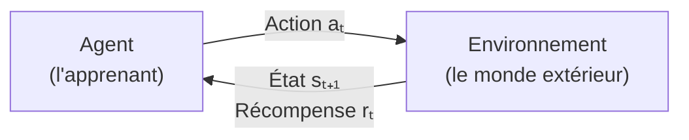

L'agent cherche à **maximiser le retour cumulé** (*return*) — c'est-à-dire la **somme des récompenses obtenues sur le long terme** — plutôt que de viser uniquement un gain immédiat.

> _Un peu comme dans un jeu d'échecs : un bon joueur ne cherche pas à capturer un pion immédiatement s'il doit sacrifier sa reine pour ça. Il optimise sa stratégie sur la durée entière de la partie._

---

### Comparaison rapide avec les autres types d'apprentissage

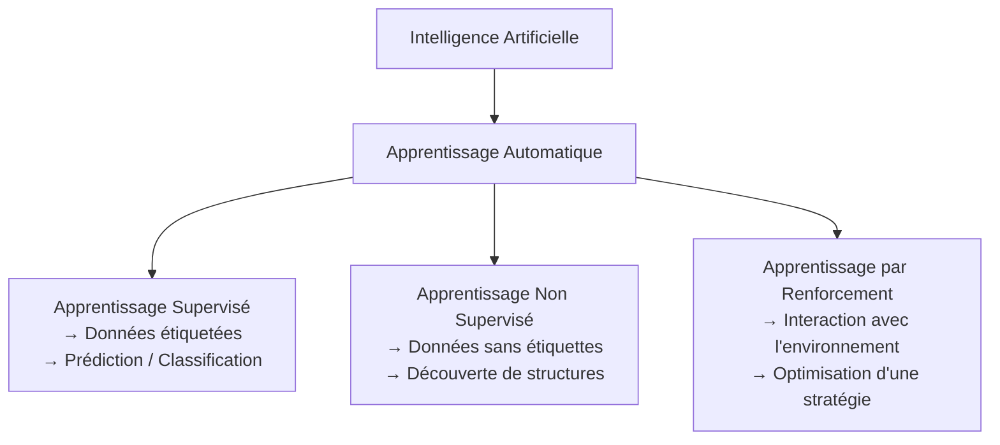

| Type | Données nécessaires | Objectif |
|---|---|---|
| **Supervisé** | Données étiquetées (ex. image + label) | Prédire / Classifier |
| **Non supervisé** | Données non étiquetées | Découvrir des groupes ou patterns |
| **Renforcement (RL)** | Interactions avec l'environnement | Maximiser une récompense cumulative |

</details>

<p align="right"><a href="#top">↑ Retour en haut</a></p>

---

<a id="section-2"></a>

<details>
<summary>2 — Les concepts clés du RL</summary>

<br/>

Avant d'aller plus loin, il est essentiel de bien comprendre les **cinq briques fondamentales** qui composent tout système de RL. Ces éléments se retrouvent dans absolument tous les algorithmes RL, des plus simples aux plus avancés.

---

### Les cinq concepts fondamentaux

| Concept | Notation | Description | Exemple concret |
|---|---|---|---|
| **État** (*state*) | sₜ | La situation actuelle perçue par l'agent | Position du robot dans une pièce |
| **Action** | aₜ | Le choix effectué par l'agent à l'instant t | Avancer, reculer, tourner à gauche |
| **Récompense** (*reward*) | rₜ | Le signal de feedback reçu après une action | +1 si le robot s'approche de la cible, -1 si collision |
| **Politique** (*policy*) | π | La stratégie : comment choisir une action selon l'état | Si obstacle à gauche → tourner à droite |
| **Fonction de valeur** (*value function*) | V(s) | L'estimation du retour cumulé attendu depuis un état donné | Être proche de la cible vaut +10 en espérance |

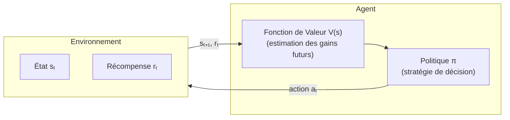

---

### Le cadre formel : le Processus de Décision Markovien (MDP)

Tous ces éléments s'inscrivent dans un cadre mathématique précis appelé **Processus de Décision Markovien** (*Markov Decision Process*, ou **MDP**).

Un MDP est défini par le tuple **(S, A, R, P, γ)** :

| Symbole | Signification |
|---|---|
| **S** | Ensemble des états possibles |
| **A** | Ensemble des actions possibles |
| **R** | Fonction de récompense |
| **P** | Probabilités de transition entre états |
| **γ** (gamma) | Facteur d'actualisation (0 ≤ γ ≤ 1) — pondère l'importance des récompenses futures |

> _La **propriété de Markov** est centrale : pour prendre la décision optimale, l'agent n'a besoin que de l'**état actuel**, et non de tout l'historique passé. « Le présent suffit à prédire l'avenir. »_

---

### Le facteur d'actualisation γ (gamma)

Le facteur **γ** contrôle l'importance accordée aux récompenses futures par rapport aux récompenses immédiates.

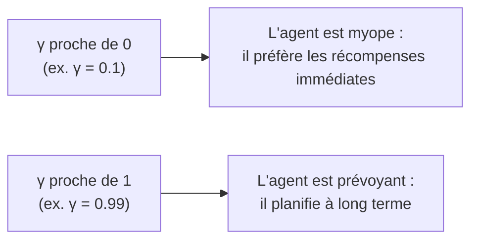

> _Exemple : un agent avec γ = 0 choisira toujours la récompense de +1 maintenant plutôt que +100 dans 5 étapes. Un agent avec γ = 0.99 sera capable de patienter pour obtenir une grande récompense future._

</details>

<p align="right"><a href="#top">↑ Retour en haut</a></p>

---

<a id="section-3"></a>

<details>
<summary>3 — Le mécanisme d'apprentissage — le cycle agent-environnement</summary>

<br/>

L'apprentissage par renforcement repose sur un **cycle continu d'interactions** entre l'agent et l'environnement. Ce cycle se répète à chaque instant t jusqu'à ce que l'agent ait suffisamment appris.

---

### Le cycle en 4 étapes

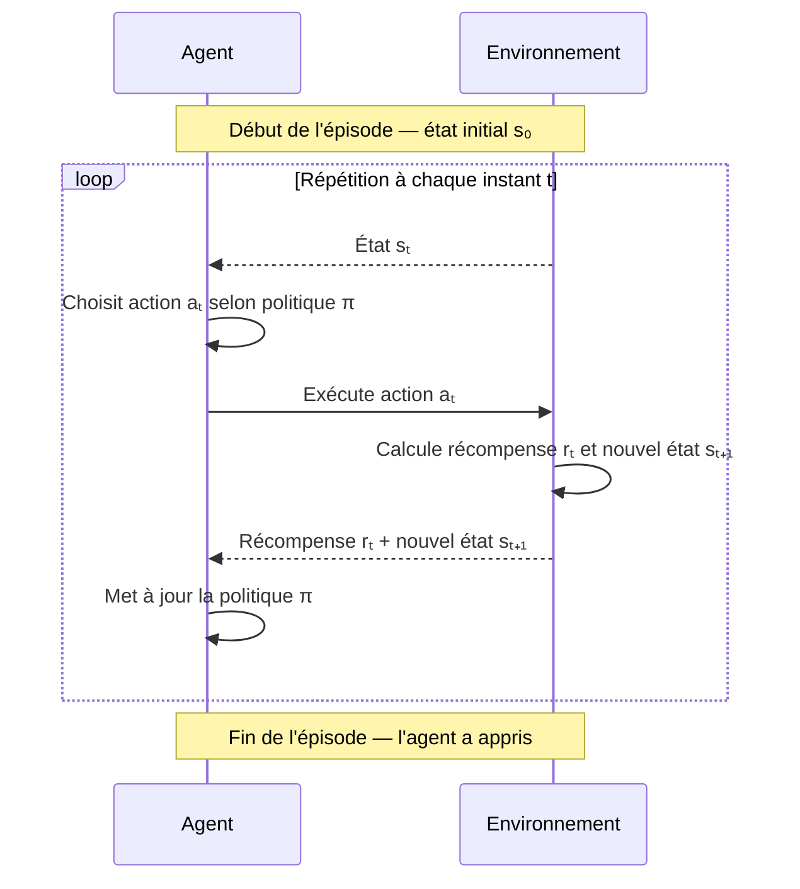

**Les 4 étapes du cycle :**

1. L'agent **observe l'état actuel** sₜ de l'environnement.
2. Il **choisit une action** aₜ en suivant sa politique π.
3. L'environnement retourne une **récompense** rₜ et un **nouvel état** sₜ₊₁.
4. L'agent **met à jour sa politique** pour de meilleures décisions futures.

---

### Illustration concrète : l'agent dans un labyrinthe

Prenons un exemple visuel pour ancrer ces concepts :

```
┌───────────────────┐
│  S                │   S = départ de l'agent
│  →  →  →  ↓      │   → ou ↓ = actions (déplacements)
│           ↓      │
│  ✗  ✗  ✗  ↓      │   ✗ = pièges (pénalité -10)
│           →  💎  │   💎 = diamant (récompense +100)
└───────────────────┘
```

- L'**état** sₜ est la position actuelle dans le labyrinthe.
- Chaque **déplacement** (haut, bas, gauche, droite) est une **action**.
- Se rapprocher du diamant = **récompense positive (+1)** ; tomber dans un piège = **pénalité (-10)**.
- La **politique** π dicte quelle direction prendre depuis chaque case.
- À force d'essais, l'agent découvre le **chemin optimal**.

> _Pense à un robot aspirateur : au début, il explore la maison au hasard. Petit à petit, il apprend où sont les obstacles et optimise ses trajets pour nettoyer plus vite et plus efficacement._

---

### Un épisode vs un processus continu

| Mode | Description | Exemple |
|---|---|---|
| **Épisodique** | L'apprentissage se fait en épisodes avec un début et une fin clairement définis | Jouer à un jeu vidéo : une partie = un épisode |
| **Continu** | Il n'y a pas de fin — l'agent apprend indéfiniment | Un robot de livraison qui tourne 24h/24 |

</details>

<p align="right"><a href="#top">↑ Retour en haut</a></p>

---

<a id="section-4"></a>

<details>
<summary>4 — Les principes fondamentaux du RL</summary>

<br/>

Le RL repose sur quatre grands principes qui le distinguent radicalement des autres approches d'apprentissage automatique.

---

### 4.1 — Essai et erreur

L'agent **n'a aucune connaissance initiale** de la bonne stratégie. Il explore différentes actions et apprend **progressivement** lesquelles produisent les meilleurs résultats.

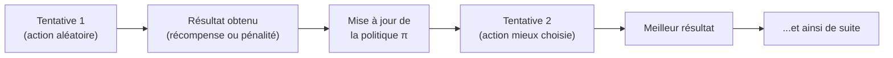

> _C'est exactement comme apprendre à faire du vélo : au début, on tombe plusieurs fois. Mais à force d'essayer, on comprend comment maintenir l'équilibre. Personne ne peut t'expliquer précisément la sensation — tu dois l'expérimenter toi-même._

---

### 4.2 — Décisions séquentielles

Chaque action **modifie l'état de l'environnement** et donc les options disponibles pour la suite. Les conséquences d'une action peuvent se manifester **bien plus tard dans le temps**.

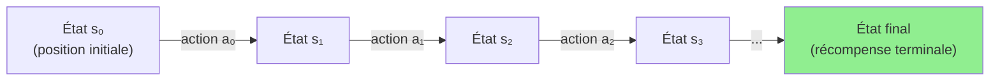

> _Imagine un jeu d'échecs : chaque coup change le plateau. Un sacrifice de cavalier maintenant peut mener à un mat en 5 coups plus tard. L'agent RL doit apprendre à « voir » ces conséquences à long terme._

---

### 4.3 — Maximisation des récompenses cumulées

L'agent ne cherche pas uniquement à **gagner rapidement** — il optimise ses actions pour obtenir un **maximum de récompenses sur la durée**.

La **formule du retour cumulé** (return) est :

```
Gₜ = rₜ + γ·rₜ₊₁ + γ²·rₜ₊₂ + γ³·rₜ₊₃ + ...
```

Où **γ (gamma)** est le facteur d'actualisation qui pondère l'importance des récompenses futures.

> _Pour un investisseur : ne pas chercher un profit immédiat sur une action risquée, mais construire un portefeuille solide et rentable sur 10 ans._

---

### 4.4 — Le dilemme exploration vs exploitation

C'est l'un des défis **les plus importants** du RL. L'agent doit trouver le bon équilibre entre :

- **Exploiter** ce qu'il connaît déjà pour maximiser la récompense immédiate.
- **Explorer** de nouvelles actions pour potentiellement découvrir de meilleures stratégies.

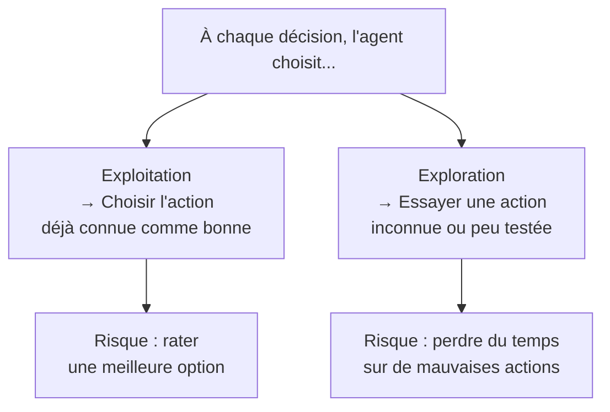

| Stratégie | Avantage | Risque |
|---|---|---|
| **Trop exploiter** | Récompenses stables et prévisibles | Ne jamais découvrir une meilleure stratégie |
| **Trop explorer** | Découverte de nouvelles possibilités | Mauvaises performances à court terme |
| **Équilibre (ε-greedy)** | Exploite avec probabilité (1-ε), explore avec probabilité ε | Nécessite de bien calibrer ε |

> _Imagine que tu connais un excellent restaurant (exploitation). Si tu n'essaies jamais de nouveaux restaurants (exploration), tu pourrais passer à côté du meilleur repas de ta vie. Mais si tu essaies un nouveau restaurant à chaque sortie, tu risques souvent d'être déçu._

</details>

<p align="right"><a href="#top">↑ Retour en haut</a></p>

---

<a id="section-5"></a>

<details>
<summary>5 — Les applications concrètes du RL</summary>

<br/>

L'apprentissage par renforcement est souvent associé aux jeux vidéo, mais son impact va **bien au-delà**. Il est aujourd'hui utilisé dans de nombreux secteurs stratégiques pour optimiser des processus complexes, améliorer la prise de décision et automatiser des tâches intelligentes.

> _L'idée principale : le RL n'est pas juste une prouesse technologique pour battre des humains à des jeux. C'est devenu un outil essentiel pour résoudre des problèmes du monde réel._

---

### 5.1 — Jeux vidéo : la vitrine du RL

Les jeux vidéo ont été le **terrain d'expérimentation idéal** pour le RL : l'environnement est simulé, les règles sont claires et les récompenses sont bien définies (gagner ou perdre).

L'exemple emblématique : **Google DeepMind** a créé des IA qui ont surpassé les meilleurs joueurs humains à **Go** (AlphaGo), **Chess** (AlphaZero) et **StarCraft II** (AlphaStar).

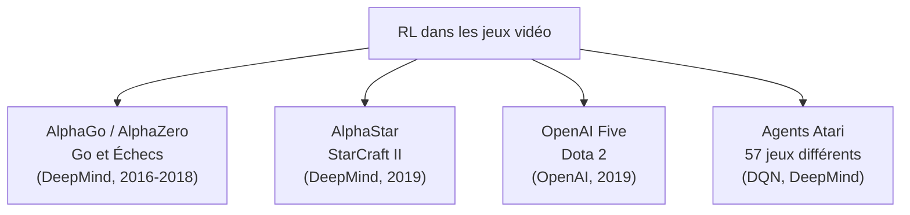

> _Ces exploits sont fascinants, mais ce ne sont que des terrains d'entraînement. L'objectif réel du RL est d'apprendre à résoudre des problèmes complexes dans des environnements dynamiques du monde réel._

---

### 5.2 — Voitures autonomes

Les véhicules autonomes (Tesla, Waymo) utilisent le RL pour :

- **Ajuster leur trajectoire** en fonction de la route et des obstacles.
- **S'adapter aux situations imprévues** : piéton qui traverse soudainement, verglas, etc.
- **Apprendre en continu** grâce à des simulations (milliards de kilomètres virtuels).

> _Au lieu de programmer chaque situation possible (impossible !), on laisse le véhicule apprendre par lui-même à partir de l'expérience accumulée._

---

### 5.3 — Robotique industrielle

Dans les usines modernes, les robots entraînés avec le RL peuvent :

- **Assembler des pièces avec précision** en ajustant leurs mouvements à chaque essai.
- **Réduire les erreurs de production** en apprenant de leurs propres échecs.
- **S'adapter aux variations** de matériaux, cadences et configurations.

> _C'est un peu comme un ouvrier qui s'améliore au fil des jours, sauf que le robot apprend beaucoup plus vite et ne se fatigue jamais._

---

### 5.4 — Optimisation énergétique

Le RL joue un rôle clé dans la **gestion intelligente de l'énergie** :

- **Bâtiments intelligents** : chauffage/climatisation qui s'adapte aux habitudes des occupants.
- **Réseaux électriques** : éviter les surcharges et mieux répartir l'électricité.
- **Google DeepMind** a réduit la consommation d'énergie de ses data centers de **40%** grâce au RL.

---

### 5.5 — Finance et trading algorithmique

Les institutions financières utilisent le RL pour :

- **Analyser les tendances de marché** et détecter des opportunités d'investissement.
- **Simuler des stratégies** avant de les appliquer en conditions réelles.
- **Ajuster automatiquement** les décisions selon les risques et les fluctuations.

> _Imagine un trader qui ne dort jamais et qui apprend en continu à maximiser ses profits, en s'adaptant à chaque instant aux nouvelles conditions du marché._

---

### 5.6 — Santé et médecine

Le RL transforme le domaine médical :

- **Personnalisation des traitements** : ajuster les doses selon la réaction du patient.
- **Optimisation des diagnostics** : détecter des anomalies dans des images médicales.
- **Planification chirurgicale** : robots chirurgicaux assistés par RL pour plus de précision.
- **Chimiothérapie** : adapter les protocoles pour maximiser l'efficacité et minimiser les effets secondaires.

---

### 5.7 — Télécommunications et réseaux

- **Routage du trafic Internet** : réduire les latences et congestions.
- **Gestion des data centers** : économiser de l'énergie en optimisant les ressources.
- **Réseaux mobiles 5G** : adapter dynamiquement les protocoles de communication.

---

### 5.8 — Marketing digital et recommandations

- **Netflix** : recommander des films et séries pour maximiser l'engagement.
- **Amazon** : proposer des produits personnalisés selon le comportement d'achat.
- **Google Ads** : optimiser l'affichage publicitaire en temps réel.

> _La prochaine fois que Netflix vous propose exactement le film qu'il vous fallait, sachez qu'un agent RL a appris vos préférences._

---

### Carte des applications du RL

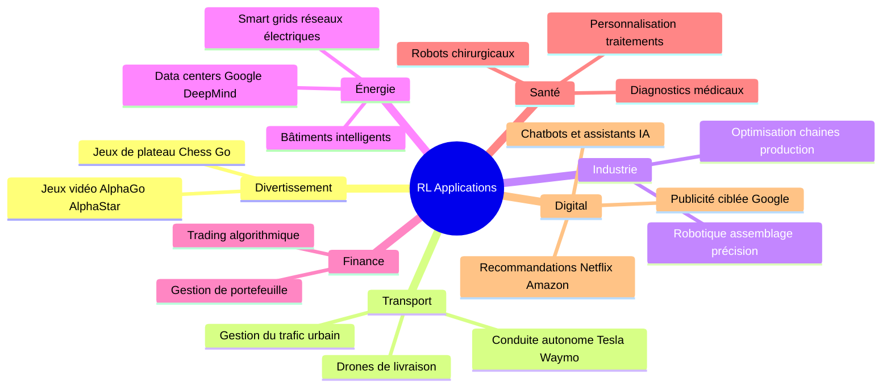

</details>

<p align="right"><a href="#top">↑ Retour en haut</a></p>

---

<a id="section-6"></a>

<details>
<summary>6 — Comparaison — Supervisé, Non Supervisé et RL</summary>

<br/>

Comprendre les différences entre ces trois grandes familles d'apprentissage automatique est essentiel pour **choisir la bonne approche** selon le problème à résoudre.

---

### Vue d'ensemble des trois approches

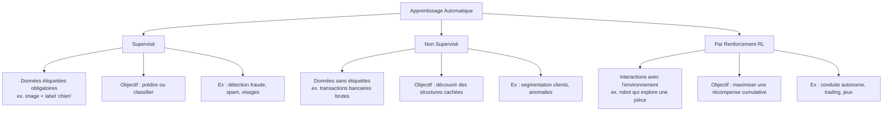

---

### Tableau comparatif détaillé

| **Critère** | **Supervisé** | **Non Supervisé** | **RL** |
|---|---|---|---|
| **Données** | Données **étiquetées** (image + label) | Données **non étiquetées** (patterns cachés) | **Interactions** avec l'environnement — pas d'étiquettes |
| **Objectif** | **Prédire** ou **classifier** à partir du passé | **Découvrir** des groupes ou structures cachées | **Maximiser** une récompense cumulative sur plusieurs décisions |
| **Exemple de tâches** | Reconnaissance d'images, prévision de ventes | Clustering clients, réduction de dimension | Conduite autonome, jeux vidéo, trading |
| **Nature des décisions** | Basées sur des exemples fixes et historiques | Pas de prise de décision active | Décisions **séquentielles** influençant l'état futur |
| **Interaction avec l'environnement** | **Aucune** (données statiques) | **Aucune** (exploration passive des données) | **Continue** — ajustement basé sur les résultats |
| **Environnement** | **Statique** — ensemble de données fixe | **Statique** — données ne changent pas | **Dynamique** — évolue selon les actions de l'agent |
| **Récompense** | Pas de notion de récompense | Pas de notion de récompense | Récompense à chaque étape (positive ou négative) |
| **Exemples d'applications** | Reconnaissance faciale, détection de fraudes bancaires | Segmentation de marché, détection d'anomalies cybersécurité | Robotique, trading algorithmique, feux de circulation intelligents |

---

### Analogie pédagogique

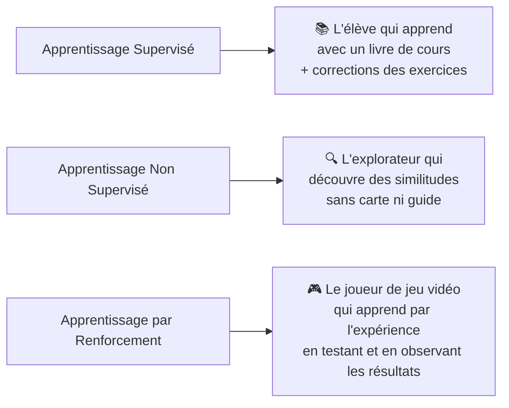

---

### Quand choisir le RL ?

Le RL est préféré lorsque :

1. **Les bonnes réponses ne sont pas connues à l'avance** → Ex. dans le trading ou la médecine, où chaque situation est unique.
2. **Les actions de l'agent influencent l'environnement** → Ex. dans un réseau électrique, chaque ajustement modifie la distribution globale.
3. **Le problème évolue dynamiquement** → Ex. les voitures autonomes doivent réagir en temps réel à des événements imprévisibles.
4. **On veut optimiser sur le long terme** → Ex. un agent RL peut sacrifier une petite récompense immédiate pour une grande récompense future.

| Critère | Supervisé | Non Supervisé | RL |
|---|---|---|---|
| **Données étiquetées disponibles** | ✅ Oui | ❌ Non | ❌ Non (pas besoin) |
| **Problème statique et bien défini** | ✅ Idéal | ✅ Idéal | ❌ Pas idéal |
| **Environnement dynamique** | ❌ Limité | ❌ Limité | ✅ Idéal |
| **Décisions séquentielles à long terme** | ❌ Non adapté | ❌ Non adapté | ✅ Conçu pour ça |
| **Adaptation en temps réel** | ❌ Modèle figé | ❌ Modèle figé | ✅ Oui |

</details>

<p align="right"><a href="#top">↑ Retour en haut</a></p>

---

<a id="section-7"></a>

<details>
<summary>7 — Quiz 1 — Introduction au RL</summary>

<br/>

Ce quiz évalue votre compréhension des bases de l'apprentissage par renforcement. Répondez à chaque question, puis cliquez sur **💡 Voir la solution** pour vérifier votre réponse.

---

#### 1. Définition et concepts de base

**Question 1 :** Quelle est la principale différence entre l'apprentissage supervisé et l'apprentissage par renforcement ?


a) L'apprentissage par renforcement utilise des données étiquetées

b) L'apprentissage supervisé repose sur l'interaction avec un environnement

c) L'apprentissage par renforcement repose sur des essais et erreurs

d) L'apprentissage par renforcement ne nécessite pas de données

<details>
<summary>💡 Voir la solution</summary>

✅ **Réponse : c)**

Le RL repose sur les **essais et erreurs** : l'agent essaie des actions, observe les résultats et ajuste sa stratégie. Il n'a pas besoin de données étiquetées fournies à l'avance, contrairement à l'apprentissage supervisé.

</details>

---

**Question 2 :** Quel est le principal objectif d'un agent dans l'apprentissage par renforcement ?


a) Maximiser la récompense immédiate

b) Minimiser le nombre d'actions effectuées

c) Maximiser les récompenses cumulées sur le long terme

d) Suivre un ensemble de règles prédéfinies

<details>
<summary>💡 Voir la solution</summary>

✅ **Réponse : c)**

L'agent ne cherche pas uniquement une récompense immédiate — il optimise sa stratégie pour **maximiser la somme des récompenses sur la durée**. C'est ce qu'on appelle le **retour cumulé** (return).

</details>

---

#### 2. Mécanisme d'apprentissage

**Question 3 :** Quelles sont les trois étapes du cycle d'apprentissage par renforcement ?


a) Prendre une action, recevoir une récompense, arrêter l'apprentissage

b) Prendre une action, observer le nouvel état, ajuster la stratégie

c) Observer l'environnement, mémoriser les données, agir

d) Collecter des données, entraîner un modèle, tester les résultats

<details>
<summary>💡 Voir la solution</summary>

✅ **Réponse : b)**

Le cycle fondamental du RL est : **action → observation du nouvel état → ajustement de la stratégie**. Ce cycle se répète en continu jusqu'à ce que l'agent converge vers une politique optimale.

</details>

---

**Question 4 :** Dans le cadre du RL, que représente l'**environnement** ?


a) Un ensemble de données utilisées pour entraîner un modèle

b) Un système interactif où l'agent évolue et prend des décisions

c) Une liste d'actions possibles

d) Une fonction qui retourne toujours une récompense positive

<details>
<summary>💡 Voir la solution</summary>

✅ **Réponse : b)**

L'environnement est le **système interactif** avec lequel l'agent interagit. C'est lui qui retourne l'état suivant et la récompense après chaque action. Il peut être un jeu vidéo, un simulateur physique, un marché financier, etc.

</details>

---

#### 3. Principes fondamentaux

**Question 5 :** Pourquoi parle-t-on d'**essai et erreur** en RL ?


a) L'agent essaye différentes actions et apprend en fonction des résultats obtenus

b) L'agent connaît déjà la solution et la teste plusieurs fois

c) L'agent suit un algorithme fixe sans exploration

d) L'agent choisit toujours l'action qui a donné la meilleure récompense immédiate

<details>
<summary>💡 Voir la solution</summary>

✅ **Réponse : a)**

L'agent **n'a aucune connaissance initiale** de la bonne stratégie. Il teste différentes actions, observe les récompenses ou pénalités reçues, et met à jour sa politique progressivement. C'est exactement le même processus qu'un enfant qui apprend à marcher.

</details>

---

**Question 6 :** Pourquoi le RL est-il particulièrement adapté aux **décisions séquentielles** ?


a) Parce que chaque décision influence uniquement l'environnement à court terme

b) Parce que l'agent apprend uniquement à partir d'exemples fournis par un humain

c) Parce que chaque action affecte l'environnement et les futures décisions de l'agent

d) Parce que l'agent reçoit une récompense uniquement à la dernière étape

<details>
<summary>💡 Voir la solution</summary>

✅ **Réponse : c)**

Dans le RL, **chaque action modifie l'état de l'environnement** et donc les options disponibles pour les décisions suivantes. C'est pourquoi il est idéal pour les jeux d'échecs, la robotique ou la conduite autonome, où chaque mouvement a des conséquences futures.

</details>

---

**Question 7 :** Qu'entend-on par **maximisation des récompenses cumulées** ?


a) L'agent cherche uniquement la récompense immédiate la plus élevée

b) L'agent optimise son comportement pour obtenir le plus de récompenses sur la durée

c) L'agent doit recevoir une récompense à chaque action pour fonctionner

d) L'agent choisit toujours des actions aléatoires pour explorer toutes les possibilités

<details>
<summary>💡 Voir la solution</summary>

✅ **Réponse : b)**

Le RL optimise les récompenses **sur la durée**, pas seulement à court terme. Un agent peut même accepter une pénalité immédiate si cela lui permet d'obtenir une grande récompense future — c'est le principe de la **planification à long terme**.

</details>

---

#### 4. Illustration et application

**Question 8 :** Dans l'exemple du labyrinthe, qu'apprend l'agent à force d'interactions ?


a) Que certaines actions sont interdites

b) Que chaque déplacement le rapproche ou l'éloigne du diamant

c) Que toutes les actions mènent au même résultat

d) Qu'il doit mémoriser chaque position visitée

<details>
<summary>💡 Voir la solution</summary>

✅ **Réponse : b)**

L'agent apprend progressivement que **certains déplacements le rapprochent du diamant** (récompense positive) et d'autres l'en éloignent ou le font tomber dans un piège (pénalité). Sa politique converge vers le chemin optimal.

</details>

---

**Question 9 :** Pourquoi compare-t-on le RL au fonctionnement d'un **robot aspirateur** ?


a) Parce qu'il suit toujours un chemin prédéfini

b) Parce qu'il apprend à optimiser ses déplacements en testant différentes routes

c) Parce qu'il ne change jamais son comportement après une erreur

d) Parce qu'il utilise des capteurs pour éviter les obstacles

<details>
<summary>💡 Voir la solution</summary>

✅ **Réponse : b)**

Un robot aspirateur intelligent n'a pas de carte prédéfinie de la maison. Il **explore, détecte les obstacles, et apprend progressivement à optimiser ses trajets** pour nettoyer plus efficacement — exactement le principe du RL.

</details>

---

**Question 10 :** Dans quels domaines le RL est-il particulièrement utilisé ?


a) Jeux vidéo, robotique, finance, logistique

b) Traitement d'images, reconnaissance vocale

c) Gestion de bases de données, compression de fichiers

d) Traduction automatique, création de contenu

<details>
<summary>💡 Voir la solution</summary>

✅ **Réponse : a)**

Le RL excelle dans les domaines où les **décisions séquentielles** et l'**adaptation à des environnements dynamiques** sont essentielles : jeux vidéo (AlphaGo, AlphaStar), robotique industrielle, trading algorithmique, conduite autonome, et gestion logistique.

</details>

</details>

<p align="right"><a href="#top">↑ Retour en haut</a></p>

---

<a id="section-8"></a>

<details>
<summary>8 — Quiz 2 — Applications du RL</summary>

<br/>

Ce quiz évalue votre compréhension des applications du RL et explique pourquoi il est privilégié par rapport à l'apprentissage supervisé ou non supervisé dans certaines situations. Répondez à chaque question, puis cliquez sur **💡 Voir la solution** pour vérifier.

---

#### 1. RL et jeux vidéo

**Question 1 :** Pourquoi le RL est-il particulièrement efficace pour entraîner une IA à jouer à des jeux vidéo ?


a) Parce que les jeux fournissent un environnement simulé où l'agent peut tester des stratégies sans conséquence réelle

b) Parce que les jeux vidéo ont des règles fixes et immuables

c) Parce que l'IA est préprogrammée pour connaître toutes les règles à l'avance

d) Parce que l'agent reçoit des données étiquetées lui indiquant la bonne action à chaque étape

<details>
<summary>💡 Voir la solution</summary>

✅ **Réponse : a)**

L'environnement simulé des jeux permet à l'agent de tester des milliers de stratégies **sans conséquence réelle**. Contrairement à l'apprentissage supervisé qui nécessite des données étiquetées, le RL apprend par interaction directe avec l'environnement.

</details>

---

**Question 2 :** Quel exploit célèbre du RL a démontré son efficacité dans les jeux vidéo ?


a) Une IA battant les humains à Tetris

b) Une IA surpassant les champions humains à StarCraft II

c) Une IA créant un jeu vidéo à partir de zéro

d) Une IA utilisant des stratégies aléatoires pour gagner à Mario Kart

<details>
<summary>💡 Voir la solution</summary>

✅ **Réponse : b)**

**AlphaStar** de DeepMind a battu les meilleurs joueurs humains à StarCraft II grâce à un apprentissage basé sur l'expérience. Cela aurait été impossible avec un modèle supervisé qui aurait dû anticiper chaque stratégie possible à l'avance.

</details>

---

#### 2. RL et véhicules autonomes

**Question 3 :** Comment le RL aide-t-il les véhicules autonomes à améliorer leur conduite ?


a) En ajustant dynamiquement leur trajectoire en fonction de l'environnement

b) En suivant uniquement un ensemble de règles fixes prédéfinies

c) En évitant complètement l'interaction avec d'autres véhicules

d) En fonctionnant uniquement avec des données pré-enregistrées sans apprentissage en temps réel

<details>
<summary>💡 Voir la solution</summary>

✅ **Réponse : a)**

Les véhicules autonomes doivent s'adapter aux conditions changeantes (météo, piétons, trafic imprévu). L'apprentissage supervisé ne suffit pas car les données seraient figées. Le RL **apprend en interagissant** et ajuste sa trajectoire en temps réel.

</details>

---

**Question 4 :** Quelle est la principale différence entre un véhicule autonome basé sur le RL et un véhicule programmé avec des règles fixes ?


a) Le RL permet au véhicule d'adapter son comportement en fonction des situations rencontrées

b) Le RL oblige le véhicule à suivre un itinéraire prédéfini

c) Le RL empêche le véhicule de rouler dans des conditions météorologiques extrêmes

d) Le RL empêche la voiture de prendre des décisions autonomes

<details>
<summary>💡 Voir la solution</summary>

✅ **Réponse : a)**

Le RL permet une **adaptation dynamique** à chaque situation rencontrée. Les règles fixes ne peuvent pas couvrir l'infinité des situations réelles — le RL apprend à gérer même les cas jamais vus auparavant.

</details>

---

#### 3. RL et robotique industrielle

**Question 5 :** Dans quel domaine industriel le RL est-il le plus utilisé ?


a) L'optimisation des flux de production et l'assemblage de pièces

b) La création de nouveaux robots sans intervention humaine

c) La réparation automatique des pannes sans diagnostic

d) L'élimination du besoin d'ingénieurs en automatisation

<details>
<summary>💡 Voir la solution</summary>

✅ **Réponse : a)**

L'apprentissage supervisé exigerait un modèle fixe pour chaque tâche — irréaliste en production. Le RL permet aux robots d'**adapter leurs gestes** en fonction des variations dans l'assemblage, améliorant leur précision au fil du temps.

</details>

---

**Question 6 :** Pourquoi le RL est-il particulièrement utile dans les chaînes de production automatisées ?


a) Parce qu'il permet aux robots d'ajuster leurs mouvements en fonction des erreurs passées

b) Parce qu'il permet aux robots de fonctionner sans électricité

c) Parce qu'il réduit la nécessité d'avoir un opérateur humain

d) Parce qu'il empêche toute panne technique

<details>
<summary>💡 Voir la solution</summary>

✅ **Réponse : a)**

Le RL permet aux robots d'**apprendre de leurs propres erreurs** et d'améliorer leur précision au fil du temps. Aucun modèle supervisé statique ne peut faire cela efficacement, car les conditions de production varient constamment.

</details>

---

#### 4. RL et optimisation énergétique

**Question 7 :** Comment le RL permet-il de réduire la consommation énergétique des bâtiments intelligents ?


a) En ajustant automatiquement le chauffage et la climatisation en fonction des habitudes des occupants

b) En forçant les utilisateurs à réduire leur consommation d'énergie

c) En éliminant totalement le besoin de chauffage et de climatisation

d) En conservant les réglages fixes définis par l'ingénieur initial

<details>
<summary>💡 Voir la solution</summary>

✅ **Réponse : a)**

Un système à règles fixes serait inefficace car il ne pourrait pas **apprendre des habitudes** des occupants. Le RL optimise dynamiquement les paramètres du bâtiment — Google DeepMind a ainsi réduit la consommation de ses data centers de **40%** grâce au RL.

</details>

---

**Question 8 :** Comment le RL est-il appliqué dans les réseaux électriques intelligents ?


a) En optimisant la répartition de l'énergie en temps réel pour éviter les surcharges

b) En remplaçant tous les réseaux existants par de nouvelles infrastructures

c) En stockant l'énergie sans la redistribuer

d) En évitant toute fluctuation de tension dans les centrales électriques

<details>
<summary>💡 Voir la solution</summary>

✅ **Réponse : a)**

Les réseaux électriques gèrent une demande **fluctuante en temps réel**. Le RL est idéal car il ajuste dynamiquement la répartition de l'énergie, teste différentes stratégies et s'améliore en fonction des résultats — impossible avec des données statiques supervisées.

</details>

---

#### 5. RL et finance / santé

**Question 9 :** Comment les algorithmes de trading utilisent-ils le RL ?


a) En analysant les tendances de marché et en ajustant dynamiquement les décisions d'investissement

b) En suivant des règles fixes sans prendre en compte les fluctuations du marché

c) En se basant uniquement sur des modèles mathématiques statiques

d) En investissant uniquement dans les entreprises les plus connues

<details>
<summary>💡 Voir la solution</summary>

✅ **Réponse : a)**

Les marchés financiers sont **imprévisibles**. Un algorithme supervisé ne peut pas s'adapter à des événements imprévus (crise, décision politique). Le RL apprend des tendances en temps réel et prend en compte **l'impact à long terme** de chaque décision d'investissement.

</details>

---

**Question 10 :** Comment le RL est-il utilisé pour personnaliser les traitements médicaux ?


a) En ajustant les doses de médicaments en fonction de la réaction du patient

b) En appliquant un traitement unique à tous les patients

c) En automatisant totalement les décisions des médecins

d) En remplaçant l'analyse humaine par un programme statique

<details>
<summary>💡 Voir la solution</summary>

✅ **Réponse : a)**

Chaque patient réagit différemment aux traitements. Un modèle supervisé statique ne peut pas s'adapter en temps réel. Le RL **ajuste les doses progressivement** en observant la réaction du patient, minimisant les effets secondaires tout en maximisant l'efficacité du traitement.

</details>

</details>

<p align="right"><a href="#top">↑ Retour en haut</a></p>

---

<a id="section-9"></a>

<details>
<summary>9 — Quiz 3 — Comparaison des approches d'apprentissage</summary>

<br/>

Ce quiz teste votre compréhension des différences entre les trois types d'apprentissage automatique et explique pourquoi le RL est privilégié pour les environnements dynamiques. Répondez à chaque question, puis cliquez sur **💡 Voir la solution** pour vérifier.

---

**Question 1 :** Quelle est la principale différence entre l'apprentissage supervisé et le RL ?


a) L'apprentissage supervisé nécessite des données étiquetées, tandis que le RL fonctionne avec des données non étiquetées.

b) L'apprentissage supervisé optimise une fonction de perte, tandis que le RL optimise une récompense cumulative.

c) L'apprentissage supervisé ne nécessite pas d'entraînement, alors que le RL en a besoin.

d) Le RL est un sous-domaine de l'apprentissage supervisé.

<details>
<summary>💡 Voir la solution</summary>

✅ **Réponse : b)**

En **apprentissage supervisé**, le modèle ajuste ses paramètres pour **minimiser une erreur** entre ses prédictions et les sorties attendues. En **RL**, l'agent apprend progressivement en essayant différentes actions et en cherchant à **maximiser la somme des récompenses** sur une longue période.

</details>

---

**Question 2 :** Quel type d'apprentissage utilise des données étiquetées ?


a) Apprentissage supervisé

b) Apprentissage non supervisé

c) Apprentissage par renforcement

d) Tous les types d'apprentissage

<details>
<summary>💡 Voir la solution</summary>

✅ **Réponse : a)**

Un modèle supervisé **nécessite une grande quantité de données annotées** (ex. images avec les labels "chien" ou "chat"). En revanche, le RL n'a pas besoin d'étiquettes puisqu'il apprend en **recevant des feedbacks** sous forme de récompenses.

</details>

---

**Question 3 :** Dans quel type d'apprentissage un modèle découvre-t-il des **structures cachées** sans intervention humaine ?


a) Apprentissage supervisé

b) Apprentissage non supervisé

c) Apprentissage par renforcement

d) Aucun

<details>
<summary>💡 Voir la solution</summary>

✅ **Réponse : b)**

L'apprentissage non supervisé explore **seul** les relations entre les données. Un exemple classique : le clustering de clients en marketing, où l'algorithme **groupe des profils similaires** sans connaître leurs catégories au préalable.

</details>

---

**Question 4 :** Quel est l'objectif principal du RL ?


a) Classifier des données

b) Découvrir des regroupements

c) Maximiser une récompense cumulative sur plusieurs décisions

d) Minimiser l'erreur de prédiction d'une sortie

<details>
<summary>💡 Voir la solution</summary>

✅ **Réponse : c)**

L'agent RL **ne se contente pas de résoudre un problème immédiatement** — il planifie ses actions pour obtenir le meilleur résultat **à long terme**. Dans un jeu vidéo par exemple, il adapte ses décisions pour maximiser ses victoires sur plusieurs parties.

</details>

---

**Question 5 :** Quelle caractéristique distingue l'**apprentissage non supervisé** des autres méthodes ?


a) Il utilise des récompenses pour améliorer ses décisions

b) Il effectue une classification en fonction de données historiques

c) Il apprend sans étiquettes et identifie des **modèles cachés**

d) Il optimise une séquence d'actions à long terme

<details>
<summary>💡 Voir la solution</summary>

✅ **Réponse : c)**

L'apprentissage non supervisé **n'a pas de labels explicites** pour guider son apprentissage. Il cherche des **similarités** et des **regroupements** dans les données — sans qu'on lui indique à l'avance ce qu'il doit trouver.

</details>

---

**Question 6 :** Quel type d'apprentissage **interagit avec un environnement** et ajuste ses actions en fonction des résultats obtenus ?


a) Apprentissage supervisé

b) Apprentissage non supervisé

c) Apprentissage par renforcement

d) Aucun des trois

<details>
<summary>💡 Voir la solution</summary>

✅ **Réponse : c)**

Contrairement aux autres approches qui utilisent des **bases de données fixes**, le RL **agit** sur son environnement et reçoit un retour (récompense ou pénalité) en conséquence. C'est cette boucle d'interaction continue qui le distingue fondamentalement.

</details>

---

**Question 7 :** Quel domaine **ne peut pas** être résolu efficacement avec l'apprentissage supervisé seul ?


a) Reconnaissance faciale

b) Prévision des ventes

c) Conduite autonome

d) Détection de spams

<details>
<summary>💡 Voir la solution</summary>

✅ **Réponse : c)**

Un modèle supervisé pourrait reconnaître des panneaux de signalisation, mais ne pourrait **pas gérer des situations imprévues** sur la route (enfant qui surgit, verglas, intersection inconnue). Le RL apprend en testant différentes décisions pour maximiser la sécurité à chaque instant.

</details>

---

**Question 8 :** Quel type d'apprentissage est utilisé pour optimiser le **trading algorithmique** en temps réel ?


a) Apprentissage supervisé

b) Apprentissage non supervisé

c) Apprentissage par renforcement

d) Aucun des trois

<details>
<summary>💡 Voir la solution</summary>

✅ **Réponse : c)**

Les algorithmes de trading utilisent le RL pour **s'adapter en permanence** aux fluctuations du marché et optimiser leurs décisions en temps réel. Le supervisé serait trop rigide — il ne pourrait pas réagir à des événements non présents dans les données d'entraînement.

</details>

---

**Question 9 :** Pourquoi le RL est-il préférable dans des environnements dynamiques ?


a) Il prédit mieux les résultats que l'apprentissage supervisé

b) Il ajuste ses décisions en fonction des changements de l'environnement

c) Il fonctionne sans algorithme d'optimisation

d) Il ne nécessite pas de phase d'entraînement

<details>
<summary>💡 Voir la solution</summary>

✅ **Réponse : b)**

Contrairement aux autres approches, le RL **ne fonctionne pas avec des données statiques** — il apprend au fil du temps et s'adapte aux conditions dynamiques. C'est cette capacité d'**adaptation continue** qui le rend incontournable pour les environnements en constante évolution.

</details>

---

**Question 10 :** Comment le RL améliore-t-il les performances d'un robot industriel par rapport aux autres méthodes ?


a) Il regroupe les tâches similaires grâce au clustering

b) Il apprend en exécutant des actions et en ajustant ses mouvements selon les résultats

c) Il suit un ensemble de règles fixes définies à l'avance

d) Il prédit les erreurs à l'avance sans interaction avec son environnement

<details>
<summary>💡 Voir la solution</summary>

✅ **Réponse : b)**

Dans l'industrie, un robot RL peut **tester différentes façons de saisir un objet** et trouver progressivement la meilleure méthode. Contrairement aux autres méthodes, il ne suit pas de règles fixes mais apprend en **expérimentant** et en **corrigeant ses erreurs** au fil du temps.

</details>

</details>

<p align="right"><a href="#top">↑ Retour en haut</a></p>

---

<a id="section-10"></a>

<details>
<summary>10 — Pratique 1 — Apprentissage par essais et erreurs avec récompenses différées</summary>

<br/>

### Consigne

Décrivez un exemple concret où un agent (humain ou machine) apprend par essais et erreurs avec des **récompenses différées**.

Expliquez :
- Le processus d'apprentissage
- Les erreurs rencontrées
- Les ajustements effectués
- Comment les récompenses différées influencent l'évolution de l'agent

---

### Exemple fourni — Un enfant qui apprend à faire du vélo

**Un enfant qui apprend à faire du vélo sans roulettes**

Au début, l'enfant tombe fréquemment. Il a du mal à maintenir son équilibre et à coordonner le pédalage avec le guidon. Ses premières tentatives sont marquées par des erreurs et des ajustements progressifs.

- **Essais et erreurs** : L'enfant expérimente différentes façons de poser ses pieds sur les pédales, ajuste sa posture et teste l'inclinaison de son corps pour éviter de tomber.
- **Ajustements** : Il apprend qu'il doit garder une certaine vitesse pour stabiliser le vélo et utiliser son corps pour équilibrer les mouvements.
- **Récompense différée** : Après plusieurs jours ou semaines de pratique, il parvient enfin à rouler sans aide. La récompense (le plaisir et la fierté de savoir faire du vélo) arrive après de nombreux essais infructueux.

Cet exemple illustre le RL où l'agent (l'enfant) ne reçoit pas de récompense immédiate, mais progresse grâce à l'accumulation d'expériences et de corrections successives.

---

### Correction détaillée — Mise en correspondance avec le RL

| Concept RL | Dans cet exemple |
|---|---|
| **Agent** | L'enfant |
| **Environnement** | La rue, le vélo, la gravité |
| **État (sₜ)** | Position et vitesse du vélo à chaque instant |
| **Action (aₜ)** | Pédalage, orientation du guidon, inclinaison du corps |
| **Récompense (rₜ)** | Rouler sans tomber = +1 / Tomber = -1 |
| **Récompense différée** | Savoir faire du vélo arrive après plusieurs jours d'essais |
| **Politique (π)** | La technique apprise : vitesse minimale + équilibre corporel |

---

### Autres exemples valides que vous pouvez utiliser

**1. Un étudiant qui prépare un examen :**
- Essais et erreurs : il teste différentes méthodes de révision.
- Récompense différée : la note arrive des semaines plus tard.
- Ajustements : il adapte ses méthodes en fonction de ses résultats intermédiaires.

**2. Un joueur de basket qui apprend le tir à 3 points :**
- Essais et erreurs : il modifie l'angle, la force, la trajectoire.
- Récompense différée : la régularité dans les matchs arrive après des mois d'entraînement.
- Ajustements : il affine sa posture selon les retours du coach et ses propres observations.

**3. Un algorithme RL pour le trading :**
- Essais et erreurs : il teste différentes stratégies d'achat/vente.
- Récompense différée : les profits ou pertes n'apparaissent qu'après plusieurs transactions.
- Ajustements : il met à jour sa politique en fonction des résultats observés sur plusieurs semaines.

</details>

<p align="right"><a href="#top">↑ Retour en haut</a></p>

---

<a id="section-11"></a>

<details>
<summary>11 — Pratique 2 — Choix de l'approche (supervisé, non supervisé ou RL)</summary>

<br/>

### Objectifs d'apprentissage

À la fin de cette pratique, vous serez capable de :

- Identifier quelle méthode d'apprentissage automatique convient le mieux à des situations réelles spécifiques.
- Justifier clairement votre choix en fonction des caractéristiques des données et du problème à résoudre.
- Renforcer votre compréhension à travers des scénarios concrets rencontrés dans l'industrie.

---

### Instructions

Pour chaque scénario proposé :

1. **Choisissez** le type d'apprentissage automatique le plus approprié :
   - Apprentissage supervisé
   - Apprentissage non supervisé
   - Apprentissage par renforcement (RL)

2. **Justifiez** brièvement votre choix en expliquant pourquoi cette méthode est la plus adaptée.

---

### Scénarios d'étude de cas

**Cas 1 : Détection de fraudes bancaires**
Une banque possède un large historique de transactions, chacune clairement identifiée comme frauduleuse ou normale. Elle veut détecter automatiquement les fraudes futures.

- **Votre choix** : ...............................................................
- **Justification** : ...............................................................

---

**Cas 2 : Regroupement clients – grande distribution**
Un supermarché souhaite regrouper ses clients selon leurs comportements d'achat pour proposer des promotions ciblées, mais ne dispose d'aucune catégorie prédéfinie.

- **Votre choix** : ...............................................................
- **Justification** : ...............................................................

---

**Cas 3 : Navigation autonome d'un robot industriel**
Un robot doit apprendre à naviguer dans un entrepôt complexe rempli d'obstacles. Il reçoit des récompenses quand il réussit à trouver un chemin optimal et des pénalités lorsqu'il rencontre un obstacle.

- **Votre choix** : ...............................................................
- **Justification** : ...............................................................

---

**Cas 4 : Reconnaissance faciale dans une entreprise**
Une entreprise a une grande collection de photos de ses employés, toutes étiquetées avec les noms correspondants. Elle veut automatiser l'identification.

- **Votre choix** : ...............................................................
- **Justification** : ...............................................................

---

**Cas 5 : Optimisation des feux de circulation urbains**
Une ville veut optimiser en temps réel les cycles des feux de signalisation pour réduire les embouteillages selon les conditions actuelles du trafic.

- **Votre choix** : ...............................................................
- **Justification** : ...............................................................

---

**Cas 6 : Analyse d'images médicales**
Un hôpital souhaite identifier automatiquement des anomalies (comme des tumeurs) sur des images médicales, sans avoir d'indications préalables sur les régions à cibler.

- **Votre choix** : ...............................................................
- **Justification** : ...............................................................

---

**Cas 7 : Recommandation dynamique sur plateforme vidéo**
Une plateforme vidéo désire recommander des contenus adaptés à chaque utilisateur, avec un système qui apprend en continu selon leurs interactions récentes.

- **Votre choix** : ...............................................................
- **Justification** : ...............................................................

---

**Cas 8 : Classification automatique du spam**
Un fournisseur d'email veut trier automatiquement les messages entrants comme spam ou légitime. Il dispose d'une grande base d'emails déjà identifiés.

- **Votre choix** : ...............................................................
- **Justification** : ...............................................................

---

**Cas 9 : IA pour jeu vidéo stratégique en temps réel**
Une entreprise développe une IA capable de jouer contre des adversaires humains dans un jeu complexe. L'IA doit optimiser ses choix stratégiques en permanence.

- **Votre choix** : ...............................................................
- **Justification** : ...............................................................

---

**Cas 10 : Classification automatique d'articles de presse**
Une société d'analyse média veut regrouper automatiquement des milliers d'articles en sujets précis, sans avoir préalablement identifié ces catégories.

- **Votre choix** : ...............................................................
- **Justification** : ...............................................................

---

### Correction complète — Pratique 2

| **Cas** | **Type d'Apprentissage** | **Justification** |
|---|---|---|
| Détection de fraudes bancaires | **Supervisé** | Historique de transactions étiquetées (fraude ou non-fraude). Classification directe. |
| Regroupement clients | **Non supervisé** | Aucune étiquette préexistante. Objectif : clustering par comportement d'achat. |
| Navigation d'un robot industriel | **RL** | Prise de décisions séquentielles, récompenses/pénalités, adaptation à l'environnement dynamique. |
| Reconnaissance faciale | **Supervisé** | Photos étiquetées avec les noms. CNN entraîné sur ces données étiquetées. |
| Feux de circulation intelligents | **RL** | Optimisation dynamique en temps réel selon les conditions du trafic. |
| Analyse d'images médicales | **Non supervisé** | Pas d'annotations précises. Détection d'anomalies sans supervision (autoencodeurs). |
| Recommandation dynamique | **RL** | Ajustement en continu selon les interactions en temps réel des utilisateurs. |
| Classification du spam | **Supervisé** | Base de données annotée (spam ou non-spam). Naïve Bayes, SVM, réseaux de neurones. |
| IA pour jeu vidéo stratégique | **RL** | Prise de décisions stratégiques successives, adaptation aux adversaires humains. |
| Classification d'articles de presse | **Non supervisé** | Aucune catégorie prédéfinie. Clustering et LDA pour regrouper par sujet. |

</details>

<p align="right"><a href="#top">↑ Retour en haut</a></p>

---

<a id="section-12"></a>

<details>
<summary>12 — Pratique 3 — Pourquoi le RL ? Analyse par domaine</summary>

<br/>

### Objectifs d'apprentissage

À la fin de cet exercice, vous serez capable de :

- Expliquer pourquoi l'apprentissage par renforcement est la meilleure approche pour certaines applications.
- Comparer le RL avec l'apprentissage supervisé et non supervisé dans des contextes réels.
- Justifier l'utilisation du RL en tenant compte des contraintes et des objectifs d'optimisation.

---

### Analyse par domaine

**2.1 — Mobilité intelligente et conduite autonome**

**Problème :** Les véhicules autonomes doivent gérer des situations imprévues : circulation dense, obstacles soudains, conditions météorologiques changeantes.

**Pourquoi le RL ?**
Le RL permet aux véhicules d'apprendre à partir de l'expérience et de s'adapter aux environnements dynamiques en temps réel.
- Il optimise les décisions **séquentielles** (freiner, accélérer, éviter un obstacle).
- Il maximise une **récompense cumulative** (minimiser le temps de trajet tout en assurant la sécurité).
- Il permet une **adaptation continue** aux conditions nouvelles et aux imprévus.

Contrairement à l'apprentissage supervisé, qui nécessiterait des milliers de scénarios étiquetés impossibles à anticiper tous, le RL apprend par essais et erreurs en interagissant directement avec son environnement.

---

**2.2 — Automatisation et robotique avancée**

**Problème :** Un robot industriel doit accomplir des tâches variées (manipulation d'objets, navigation) dans un environnement en constante évolution.

**Pourquoi le RL ?**
- Il permet d'**adapter ses actions** aux changements de l'environnement.
- Il optimise ses actions pour maximiser une **récompense** (efficacité énergétique, rapidité).
- Il est plus flexible que le supervisé, qui nécessiterait des jeux de données gigantesques.

---

**2.3 — Finance et optimisation des investissements**

**Problème :** Les marchés financiers sont imprévisibles. Un algorithme de trading doit décider quand acheter, vendre ou conserver pour maximiser les profits.

**Pourquoi le RL ?**
- Il permet d'**apprendre des tendances en temps réel**.
- Il prend en compte l'**impact à long terme** des décisions sur le portefeuille.
- Il peut **tester différentes stratégies** en simulation avant de les appliquer.

---

**2.4 — Gestion énergétique et smart grids**

**Problème :** Les bâtiments intelligents et réseaux électriques doivent ajuster leur consommation selon l'occupation, les conditions climatiques et la demande sur le réseau.

**Pourquoi le RL ?**
- Il ajuste **dynamiquement** le chauffage, la climatisation et l'éclairage.
- Il réduit les **pics de consommation** pour éviter la surcharge du réseau.
- Il maximise l'efficacité énergétique en prenant des **décisions optimales à long terme**.

---

**2.5 — Personnalisation des expériences utilisateur et marketing digital**

**Problème :** Les plateformes de contenu doivent recommander des produits ou vidéos de manière personnalisée pour maximiser l'engagement.

**Pourquoi le RL ?**
- Il **teste différentes suggestions** et mesure l'engagement (clics, durée de visionnage).
- Il maximise une **récompense cumulative** (fidélisation des utilisateurs).
- Il permet une **adaptation dynamique**, impossible avec un modèle supervisé statique.

---

**2.6 — Soins de santé et traitements personnalisés**

**Problème :** Les traitements médicaux doivent être adaptés à chaque patient selon sa réponse aux médicaments.

**Pourquoi le RL ?**
- Il teste **différentes doses** et apprend à **optimiser le traitement** sans intervention humaine.
- Il minimise **les effets secondaires** en trouvant un équilibre optimal.
- Les besoins d'un patient évoluent dans le temps — un modèle statique supervisé est insuffisant.

---

**2.7 — Gestion du trafic et optimisation urbaine**

**Problème :** Les villes doivent fluidifier la circulation en optimisant les feux de signalisation en temps réel.

**Pourquoi le RL ?**
- Il permet **d'adapter les cycles des feux** selon le trafic en temps réel.
- Il apprend **par essais et erreurs** en testant différentes stratégies et en mesurant leur impact.
- Il réduit les **temps d'attente globaux** et améliore la fluidité sur le long terme.

---

### Synthèse des réponses

| **Domaine** | **Pourquoi utiliser le RL ?** |
|---|---|
| **Conduite autonome** | Apprentissage dynamique, décision séquentielle, adaptation aux imprévus. |
| **Robotique avancée** | Adaptation aux environnements en évolution, optimisation des tâches. |
| **Trading algorithmique** | Décisions en temps réel, prise en compte de l'impact futur. |
| **Gestion énergétique** | Optimisation selon les variations en temps réel, réduction des pics. |
| **Marketing digital** | Ajustement dynamique des recommandations, maximisation de l'engagement. |
| **Soins de santé** | Personnalisation des traitements, optimisation des doses en fonction du patient. |
| **Gestion du trafic** | Adaptation en temps réel, fluidification, réduction des temps d'attente. |

</details>

<p align="right"><a href="#top">↑ Retour en haut</a></p>

---

<a id="section-13"></a>

<details>
<summary>13 — Ressources supplémentaires — Vidéos, Projets et Outils</summary>

<br/>

L'apprentissage par renforcement est un domaine vaste et en constante évolution. Voici une sélection de **vidéos, projets et outils** essentiels pour approfondir vos connaissances.

---

### 1 — Vidéos d'applications du RL

**1.1 — Learning to Run Competition (NIPS 2017)**
- Une compétition où des algorithmes RL doivent apprendre à faire courir un modèle biomécanique.
- Objectif : entraîner une IA à optimiser la locomotion d'un agent humain simulé.
- 🔗 [Learning to Run — AI Challenge](https://www.crowdai.org/challenges/nips-2017-learning-to-run)

**1.2 — Présentation RL par NNAISENSE**
- Introduction approfondie au fonctionnement du RL et à ses applications industrielles.
- 🔗 [Présentation RL par NNAISENSE](https://www.nnaisense.com/)

**1.3 — Exemple d'Application du RL — AI Warehouse**
- Démonstration d'un système de gestion de stocks dans un entrepôt basé sur le RL.
- Le RL est utilisé pour optimiser les déplacements des robots en charge de la logistique.
- 🔗 [AI Warehouse RL Demo](https://ai-warehouse.com/)

**1.4 — Challenge AI Crowd — Learning to Run (NIPS 2017)**
- Un défi pour entraîner un agent RL à contrôler un humanoïde dans un environnement dynamique.
- 🔗 [AI Crowd Learning to Run](https://www.aicrowd.com/challenges/nips-2017-learning-to-run)

---

### 2 — Projets RL à explorer

**2.1 — Librairie Gymnasium (anciennement OpenAI Gym)**
- La référence pour tester et expérimenter des environnements standardisés pour le RL.
- Environnements disponibles :
  - Jeux vidéo (Atari, CartPole, MountainCar)
  - Robotique (bras manipulateurs, locomotion)
  - Problèmes d'optimisation et de contrôle
- 🔗 [Documentation officielle Gymnasium](https://gymnasium.farama.org/)

```python
import gymnasium as gym

# Créer l'environnement CartPole
env = gym.make("CartPole-v1", render_mode="human")

# Réinitialiser l'environnement
observation, info = env.reset()

for _ in range(1000):
    # Action aléatoire (à remplacer par la politique de l'agent)
    action = env.action_space.sample()
    observation, reward, terminated, truncated, info = env.step(action)

    if terminated or truncated:
        observation, info = env.reset()

env.close()
```

**2.2 — Projet RL de démonstration**
- Projet open-source qui explore différents algorithmes RL appliqués à des jeux vidéo et simulations.
- Idéal pour comprendre comment entraîner un agent RL à partir d'un environnement interactif.
- 🔗 [Johnny Code RL Project](https://github.com/johnnycode/rl-project)

---

### 3 — Algorithmes RL essentiels à connaître

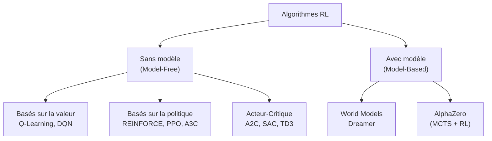

| Algorithme | Type | Application typique |
|---|---|---|
| **Q-Learning** | Value-based | Labyrinthes, jeux simples |
| **DQN** (Deep Q-Network) | Value-based + Deep Learning | Jeux Atari, robotique simple |
| **PPO** (Proximal Policy Optimization) | Policy-based | Jeux complexes, simulation physique |
| **A3C / A2C** | Actor-Critic | Jeux en temps réel, robotique |
| **SAC** (Soft Actor-Critic) | Actor-Critic | Contrôle continu, robotique avancée |
| **AlphaZero** | Model-based | Go, Échecs, Shogi |

</details>

<p align="right"><a href="#top">↑ Retour en haut</a></p>

---

<a id="section-14"></a>

<details>
<summary>14 — Synthèse du cours</summary>

<br/>

### Ce que vous avez appris dans ce cours

---

#### Chapitre 1 — Introduction au RL

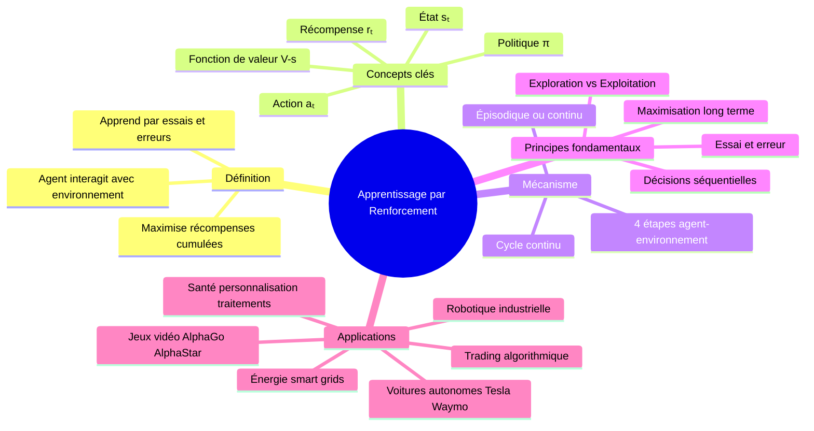

---

#### Chapitre 2 — Comparaison des approches

| Critère | Supervisé | Non Supervisé | RL |
|---|---|---|---|
| **Données** | Étiquetées | Non étiquetées | Interactions |
| **Objectif** | Prédire/Classifier | Découvrir structures | Maximiser récompense |
| **Environnement** | Statique | Statique | Dynamique |
| **Décisions séquentielles** | Non | Non | Oui |
| **Adaptation en temps réel** | Non | Non | Oui |

---

#### Points à retenir absolument

1. **Le RL = agent + environnement + récompense.** Ce triangle est au cœur de tout système RL.

2. **Le RL apprend sans données étiquetées.** Il génère lui-même son expérience en interagissant avec l'environnement.

3. **Le dilemme exploration/exploitation** est universel dans le RL. Tout algorithme doit trouver un équilibre entre exploiter ce qui fonctionne et explorer de nouvelles possibilités.

4. **Le RL est idéal pour les problèmes dynamiques.** Quand les décisions influencent l'avenir et que l'environnement évolue, le RL surpasse les autres approches.

5. **Le RL n'est pas magique.** Il nécessite de bien définir l'environnement, les états, les actions et surtout la **fonction de récompense** — une mauvaise récompense produit un mauvais comportement.

---

#### Ce qui arrive dans la suite du cours

Dans les prochains chapitres, nous plongerons dans les **composants fondamentaux** du RL :

- Les **Processus de Décision Markoviens (MDP)** en détail
- Les **algorithmes de base** : Q-Learning, SARSA
- Le **Deep Reinforcement Learning** : DQN, PPO, A3C
- Les **environnements pratiques** avec Gymnasium
- Les **projets de session** : coder votre propre agent RL

</details>

<p align="right"><a href="#top">↑ Retour en haut</a></p>

---

<p align="center">
  <em>Tous droits réservés. Toute reproduction, diffusion, utilisation ou adaptation de ce cours, en tout ou en partie, est strictement interdite sans l'autorisation écrite préalable de Dr. Haythem REHOUMA.</em>
</p>

<p align="center">
  <strong>Cours créé par Dr. Haythem REHOUMA — Apprentissage par Renforcement</strong>
</p>

<br/>

<p align="center">
  <a href="#top" style="display: inline-block; background: #2563eb; color: #ffffff; text-decoration: none; font-size: 1.1rem; font-weight: 700; padding: 14px 40px; border-radius: 10px; letter-spacing: 0.3px;">
    ↑ Retour en haut du cours
  </a>
</p>
