<a id="top"></a>

# Chapitre 2 - Différences entre l'Apprentissage par Renforcement, Supervisé et Non Supervisé

## Table des matières

| # | Section |
|---|---|
| 1 | [Les trois paradigmes de l'apprentissage automatique](#section-1) |
| 1a | &nbsp;&nbsp;&nbsp;↳ [Vue d'ensemble et positionnement](#section-1) |
| 2 | [L'apprentissage supervisé — fonctionnement et mécanisme](#section-2) |
| 2a | &nbsp;&nbsp;&nbsp;↳ [Définition, données, objectif](#section-2) |
| 2b | &nbsp;&nbsp;&nbsp;↳ [Classification vs régression](#section-2) |
| 2c | &nbsp;&nbsp;&nbsp;↳ [Limites de l'approche supervisée](#section-2) |
| 3 | [L'apprentissage non supervisé — fonctionnement et mécanisme](#section-3) |
| 3a | &nbsp;&nbsp;&nbsp;↳ [Définition et objectifs](#section-3) |
| 3b | &nbsp;&nbsp;&nbsp;↳ [Clustering, réduction dimensionnelle, détection d'anomalies](#section-3) |
| 3c | &nbsp;&nbsp;&nbsp;↳ [Limites de l'approche non supervisée](#section-3) |
| 4 | [L'apprentissage par renforcement — ce qui le différencie fondamentalement](#section-4) |
| 4a | &nbsp;&nbsp;&nbsp;↳ [L'interaction active avec l'environnement](#section-4) |
| 4b | &nbsp;&nbsp;&nbsp;↳ [La notion de récompense cumulative](#section-4) |
| 4c | &nbsp;&nbsp;&nbsp;↳ [Les décisions séquentielles](#section-4) |
| 5 | [Tableau comparatif approfondi — les trois paradigmes](#section-5) |
| 5a | &nbsp;&nbsp;&nbsp;↳ [Comparaison par critères techniques](#section-5) |
| 5b | &nbsp;&nbsp;&nbsp;↳ [Analogies pédagogiques](#section-5) |
| 6 | [Critères de choix — quand utiliser quelle approche](#section-6) |
| 6a | &nbsp;&nbsp;&nbsp;↳ [Arbre de décision pour le choix de paradigme](#section-6) |
| 6b | &nbsp;&nbsp;&nbsp;↳ [Tableau de sélection par cas d'usage](#section-6) |
| 7 | [Cas hybrides et combinaisons d'approches](#section-7) |
| 8 | [Quiz 1 — Identifier les paradigmes](#section-8) |
| 9 | [Quiz 2 — Choisir la bonne approche](#section-9) |
| 10 | [Quiz 3 — Comparaison avancée](#section-10) |
| 11 | [Pratique 1 — Classifier des problèmes réels](#section-11) |
| 11a | &nbsp;&nbsp;&nbsp;↳ [Correction de la Pratique 1](#section-11) |
| 12 | [Pratique 2 — Concevoir une solution adaptée](#section-12) |
| 12a | &nbsp;&nbsp;&nbsp;↳ [Correction de la Pratique 2](#section-12) |
| 13 | [Ressources supplémentaires](#section-13) |
| 14 | [Synthèse du chapitre](#section-14) |

---

<a id="section-1"></a>

<details>
<summary>1 — Les trois paradigmes de l'apprentissage automatique</summary>

<br/>

L'**apprentissage automatique** (*Machine Learning*) se divise en trois grandes familles, chacune répondant à des types de problèmes fondamentalement différents. Comprendre ces distinctions est essentiel pour choisir la bonne approche selon la nature des données et l'objectif à atteindre.

---

### Les trois familles de l'apprentissage automatique

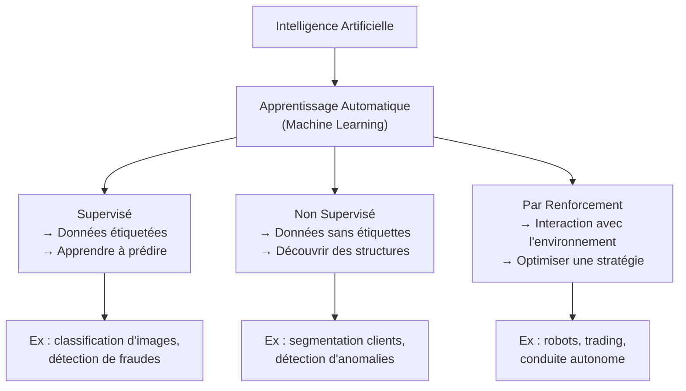

---

### La question fondamentale de chaque paradigme

| Paradigme | Question centrale |
|---|---|
| **Supervisé** | « Étant donné ces exemples passés étiquetés, que puis-je prédire pour un nouvel exemple ? » |
| **Non Supervisé** | « Quelles structures ou groupements cachés existent dans ces données brutes ? » |
| **Renforcement** | « Quelle séquence d'actions me permettra d'obtenir le maximum de récompenses à long terme ? » |

---

### Pourquoi cette distinction est cruciale

Choisir le mauvais paradigme conduit inévitablement à un système inefficace, coûteux ou incapable de résoudre le problème réel. Par exemple :

- Tenter de conduire une voiture autonome avec uniquement de l'apprentissage supervisé serait insuffisant — on ne peut pas étiqueter manuellement chaque situation de conduite possible.
- Tenter de détecter des fraudes bancaires avec uniquement le RL serait inutilement complexe — on dispose déjà d'un historique étiquetté.

> _Chaque paradigme a été conçu pour un type de problème précis. Maîtriser ces différences, c'est savoir quelle « clé » utiliser pour ouvrir quelle « porte »._

</details>

<p align="right"><a href="#top">↑ Retour en haut</a></p>

---

<a id="section-2"></a>

<details>
<summary>2 — L'apprentissage supervisé — fonctionnement et mécanisme</summary>

<br/>

L'**apprentissage supervisé** (*Supervised Learning*) est le paradigme le plus utilisé en apprentissage automatique. Son principe : apprendre à partir d'un ensemble de **données étiquetées** — c'est-à-dire des exemples dont on connaît déjà la réponse correcte.

---

### Le principe fondamental

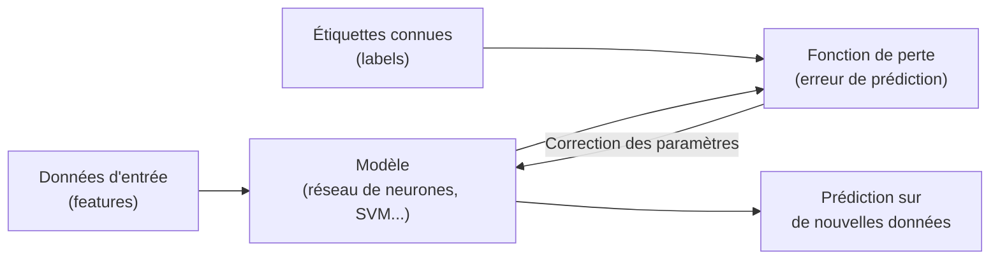

**Le processus en 4 étapes :**
1. On fournit au modèle des **paires (entrée, sortie attendue)**.
2. Le modèle fait une **prédiction** pour chaque entrée.
3. On calcule l'**erreur** entre la prédiction et la sortie attendue.
4. On **corrige le modèle** pour minimiser cette erreur (rétropropagation, descente de gradient).

---

### Classification vs Régression

Les deux grandes tâches de l'apprentissage supervisé sont :

| Tâche | Description | Exemple |
|---|---|---|
| **Classification** | Prédire une **catégorie discrète** | Chat ou chien ? Spam ou non-spam ? |
| **Régression** | Prédire une **valeur numérique continue** | Prix d'une maison, température demain |

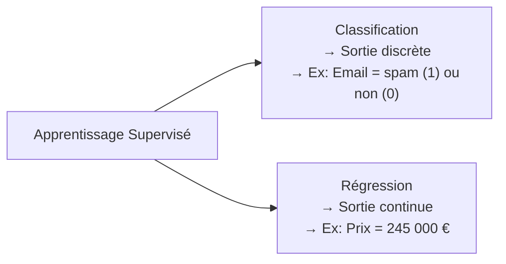

---

### Exemples concrets d'applications

| Domaine | Application supervisée | Données étiquetées |
|---|---|---|
| **Vision par ordinateur** | Détection de tumeurs sur radiographies | Images annotées par des médecins |
| **NLP** | Classification de sentiments (positif/négatif) | Avis clients avec note associée |
| **Finance** | Détection de fraudes bancaires | Transactions historiques (fraude/non-fraude) |
| **Email** | Filtre anti-spam | Milliers d'emails classifiés manuellement |
| **Médical** | Diagnostic de maladie à partir de symptômes | Dossiers patients + diagnostics confirmés |

---

### Algorithmes supervisés courants

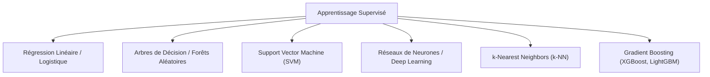

---

### Les limites de l'apprentissage supervisé

| Limite | Description |
|---|---|
| **Dépendance aux données étiquetées** | L'étiquetage est coûteux, lent et parfois impossible à grande échelle |
| **Données statiques** | Le modèle apprend sur des données passées — incapable de s'adapter à un environnement qui change |
| **Pas de prise de décision séquentielle** | Ne peut pas planifier une suite d'actions interdépendantes |
| **Manque de généralisation** | Mauvaises performances sur des situations très différentes des données d'entraînement |

> _Imaginez vouloir apprendre à un conducteur toutes les situations possibles sur la route en lui montrant des photos étiquetées. L'exercice est colossal et il manquera forcément des cas — c'est précisément pourquoi le supervisé est insuffisant pour la conduite autonome._

</details>

<p align="right"><a href="#top">↑ Retour en haut</a></p>

---

<a id="section-3"></a>

<details>
<summary>3 — L'apprentissage non supervisé — fonctionnement et mécanisme</summary>

<br/>

L'**apprentissage non supervisé** (*Unsupervised Learning*) opère sur des **données sans étiquettes**. Aucune « bonne réponse » n'est fournie au modèle — celui-ci doit découvrir lui-même les **structures, patterns et groupements cachés** dans les données.

---

### Le principe fondamental

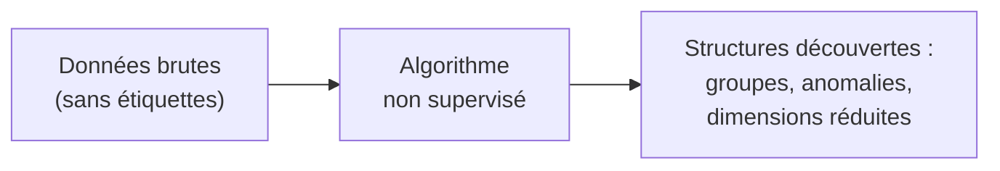

Contrairement au supervisé, il n'y a **pas de correction basée sur une erreur connue** — l'algorithme cherche des similarités et des différences intrinsèques aux données.

---

### Les trois grandes tâches non supervisées

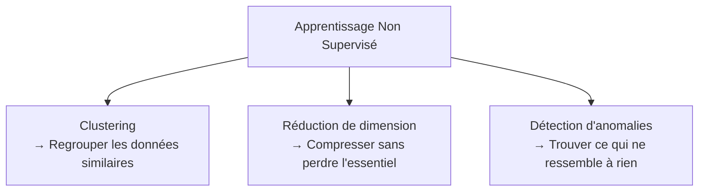

#### 3.1 — Clustering

Le **clustering** regroupe des données similaires sans connaître les catégories à l'avance.

| Algorithme | Fonctionnement | Cas d'usage |
|---|---|---|
| **K-Means** | Divise en k groupes selon la distance au centroïde | Segmentation clients, compression d'images |
| **DBSCAN** | Regroupe par densité — détecte les outliers | Analyse géospatiale, détection d'anomalies |
| **CAH** | Hiérarchie de clusters sous forme d'arbre | Biologie, génomique, phylogénétique |

> _Un supermarché qui analyse les habitudes d'achat sans étiquettes préalables découvrira naturellement des groupes : les familles nombreuses, les célibataires pressés, les végétariens — sans jamais avoir demandé aux clients de se catégoriser._

#### 3.2 — Réduction de dimension

La **réduction de dimension** compresse les données en conservant l'essentiel de l'information.

| Technique | Description | Utilisation |
|---|---|---|
| **PCA** (Analyse en Composantes Principales) | Projette sur les axes de variance maximale | Visualisation, prétraitement |
| **t-SNE** | Projection non linéaire pour la visualisation | Visualisation de données haute dimension |
| **Autoencodeurs** | Réseau neuronal qui apprend une représentation compressée | Compression d'images, débruitage |

#### 3.3 — Détection d'anomalies

Identifier des points de données qui ne correspondent à aucun pattern connu.

- **Isolation Forest** : isole les anomalies en les séparant rapidement.
- **Autoencodeurs** : une anomalie produit une erreur de reconstruction élevée.
- **One-Class SVM** : apprend le contour de la classe « normale ».

---

### Exemples concrets d'applications

| Domaine | Application | Objectif |
|---|---|---|
| **Marketing** | Segmentation de clients | Identifier des profils pour des campagnes ciblées |
| **Cybersécurité** | Détection d'intrusions réseau | Repérer des comportements anormaux sans modèle préétabli |
| **Génomique** | Regroupement de gènes similaires | Trouver des liens biologiques cachés |
| **Finance** | Détection de transactions frauduleuses atypiques | Anomalies non étiquetées dans les flux bancaires |
| **NLP** | Modélisation de sujets (LDA, BERTopic) | Découvrir les thèmes principaux d'un corpus de textes |

---

### Les limites de l'apprentissage non supervisé

| Limite | Description |
|---|---|
| **Interprétation difficile** | Les groupes trouvés n'ont pas de signification automatique — un humain doit les interpréter |
| **Pas d'objectif clair** | Sans étiquettes, il est difficile d'évaluer si le résultat est « bon » |
| **Pas de prise de décision** | Découvre des structures, mais n'agit pas — ne peut pas piloter un système |
| **Sensible aux paramètres** | Le nombre de clusters (K-Means) ou les seuils (DBSCAN) influencent fortement les résultats |

> _L'apprentissage non supervisé est un excellent explorateur — il révèle ce que les données cachent — mais c'est un mauvais décideur : il ne sait pas quoi faire avec ce qu'il a trouvé._

</details>

<p align="right"><a href="#top">↑ Retour en haut</a></p>

---

<a id="section-4"></a>

<details>
<summary>4 — L'apprentissage par renforcement — ce qui le différencie fondamentalement</summary>

<br/>

L'**apprentissage par renforcement** (*Reinforcement Learning*) ne ressemble à aucun des deux paradigmes précédents. Sa différence fondamentale : l'agent **interagit activement** avec un environnement, reçoit des **retours sous forme de récompenses**, et doit **planifier une suite de décisions** pour maximiser ses gains à long terme.

---

### 4.1 — L'interaction active avec l'environnement

Contrairement au supervisé et au non supervisé qui opèrent sur des données **statiques et passives**, le RL génère lui-même ses données par l'**action**.

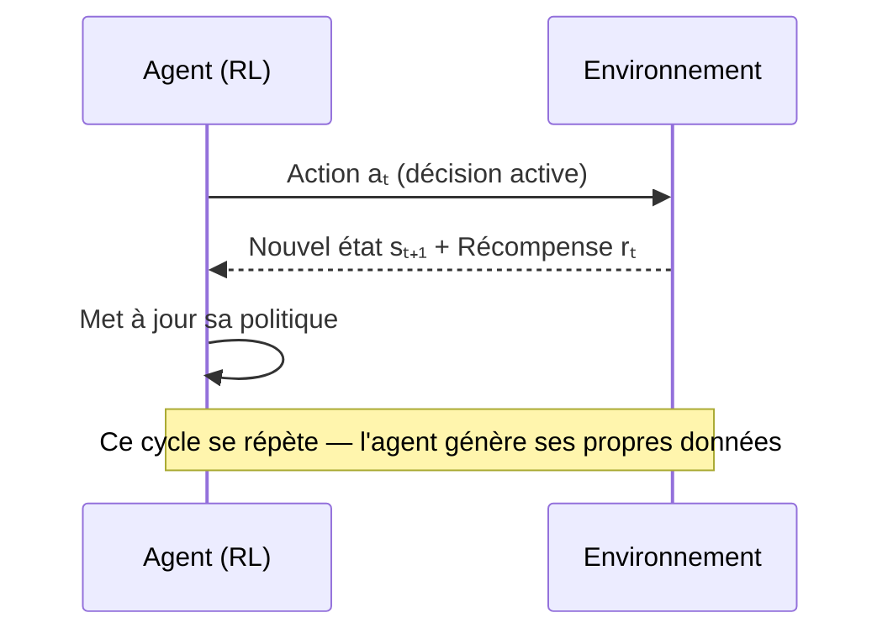

| Paradigme | Rapport aux données |
|---|---|
| **Supervisé** | Consomme des données étiquetées **fournies par un humain** |
| **Non Supervisé** | Analyse des données brutes **fournies passivement** |
| **RL** | **Génère activement** ses propres données en interagissant avec l'environnement |

---

### 4.2 — La notion de récompense cumulative

Ce qui distingue profondément le RL des autres paradigmes, c'est l'**objectif de maximisation à long terme**.

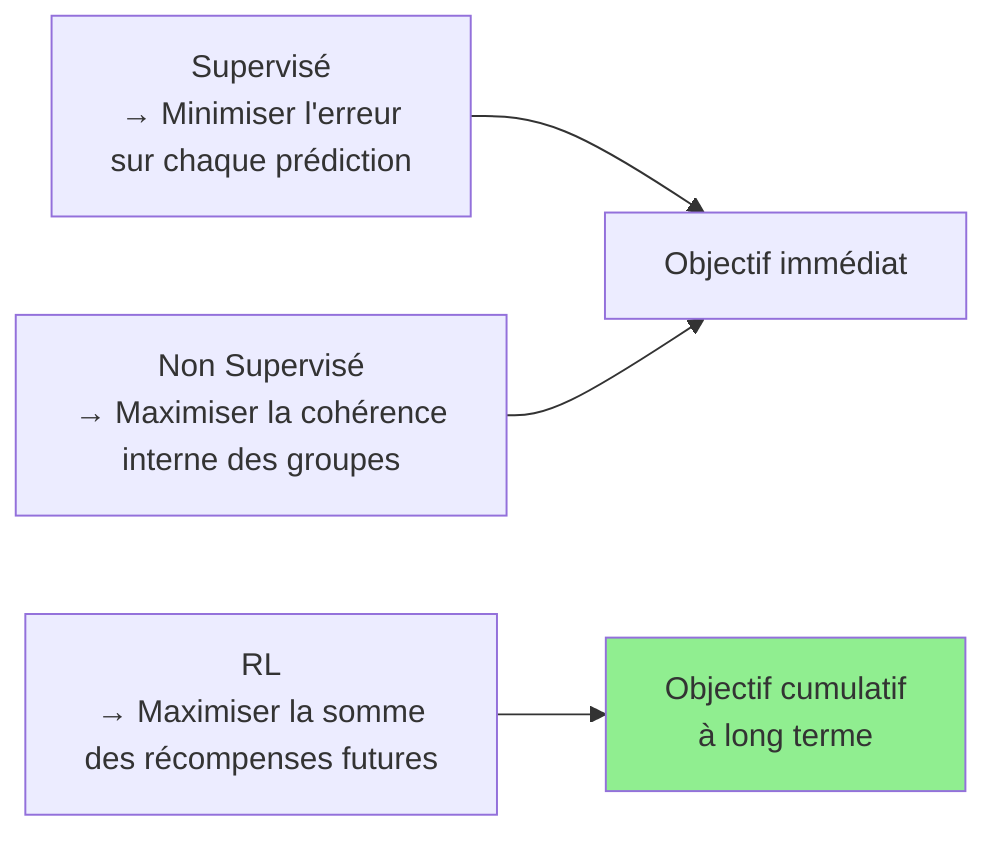

La formule du **retour cumulé** :

```
Gₜ = rₜ + γ·rₜ₊₁ + γ²·rₜ₊₂ + γ³·rₜ₊₃ + ...
```

Un agent RL peut délibérément accepter une **pénalité à court terme** si cela lui permet d'obtenir une **grande récompense future** — une capacité absente des deux autres paradigmes.

> _En trading : un modèle supervisé prédirait si une action monte ou descend. Un agent RL, lui, déciderait **quand acheter, quand attendre, quand vendre** en tenant compte de l'impact de chaque décision sur le portefeuille global à long terme._

---

### 4.3 — Les décisions séquentielles interdépendantes

Le RL est conçu pour les problèmes où **chaque décision influence les décisions suivantes** — une propriété absente du supervisé et du non supervisé.

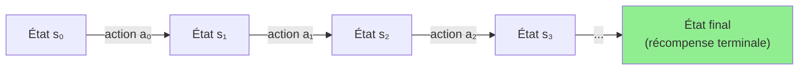

- Dans un jeu d'échecs, chaque coup dépend de tous les précédents.
- Dans la conduite autonome, chaque décision (freiner, accélérer) modifie la situation de la route.
- Dans la gestion énergétique, chaque ajustement influence la consommation future.

> _C'est exactement comme jouer aux échecs contre un adversaire fort : vous ne cherchez pas le meilleur coup isolément, mais la meilleure **séquence de coups** sur toute la partie. C'est cette vision à long terme que le RL maîtrise et que le supervisé ignore._

---

### Ce que le RL fait que les autres ne font pas

| Capacité | Supervisé | Non Supervisé | RL |
|---|---|---|---|
| Apprendre sans données étiquetées | Non | Oui | Oui |
| S'adapter à un environnement dynamique | Non | Non | Oui |
| Planifier sur plusieurs étapes | Non | Non | Oui |
| Prendre des décisions séquentielles | Non | Non | Oui |
| Générer ses propres données d'entraînement | Non | Non | Oui |
| Optimiser sur le long terme | Non | Non | Oui |

</details>

<p align="right"><a href="#top">↑ Retour en haut</a></p>

---

<a id="section-5"></a>

<details>
<summary>5 — Tableau comparatif approfondi — les trois paradigmes</summary>

<br/>

Cette section offre une vision synthétique et complète des différences entre les trois paradigmes, du plus simple au plus nuancé.

---

### Comparaison par critères techniques

| **Critère** | **Supervisé** | **Non Supervisé** | **Renforcement (RL)** |
|---|---|---|---|
| **Type de données** | Paires (entrée, étiquette) | Données brutes sans label | Interactions (état, action, récompense) |
| **Supervision humaine** | Forte — étiquetage manuel requis | Aucune — exploration autonome | Indirecte — via la fonction de récompense |
| **Objectif d'apprentissage** | Minimiser une erreur de prédiction | Maximiser la cohérence interne | Maximiser la récompense cumulative |
| **Nature de l'environnement** | Statique | Statique | Dynamique et interactif |
| **Type de sortie** | Prédiction (label ou valeur) | Structure (groupe, représentation) | Politique de décision (quelle action choisir) |
| **Décisions séquentielles** | Non | Non | Oui — l'essentiel du RL |
| **Interaction avec le monde** | Aucune | Aucune | Continue et active |
| **Exemples d'algorithmes** | SVM, CNN, XGBoost | K-Means, PCA, DBSCAN | Q-Learning, DQN, PPO, SAC |
| **Évaluation** | Accuracy, F1, RMSE (sur données de test) | Silhouette score, cohésion interne | Récompense cumulative moyenne par épisode |
| **Quantité de données requise** | Grande (images, texte étiquetés) | Moyenne à grande (non étiquetées) | Variable — l'agent génère ses propres données |
| **Cas d'usage typiques** | Détection de spam, reconnaissance d'image | Segmentation, anomalies | Robotique, jeux, systèmes de contrôle |

---

### Analogies pédagogiques

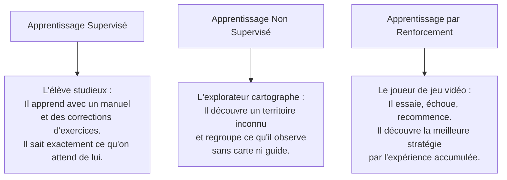

---

### Le flux d'information dans chaque paradigme

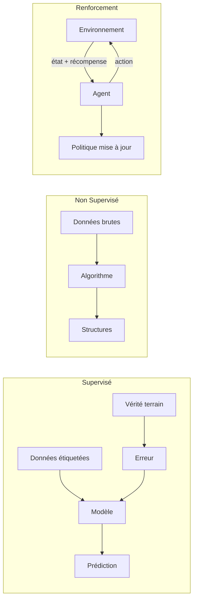

---

### Résumé visuel en mindmap

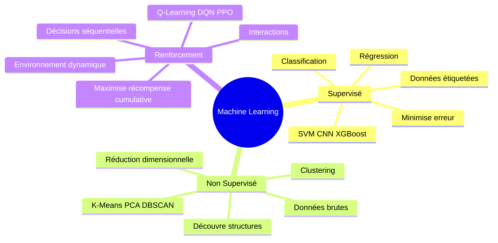

</details>

<p align="right"><a href="#top">↑ Retour en haut</a></p>

---

<a id="section-6"></a>

<details>
<summary>6 — Critères de choix — quand utiliser quelle approche</summary>

<br/>

Choisir entre supervisé, non supervisé et RL ne dépend pas du hasard — il existe des critères clairs qui guident ce choix.

---

### Arbre de décision pour le choix de paradigme

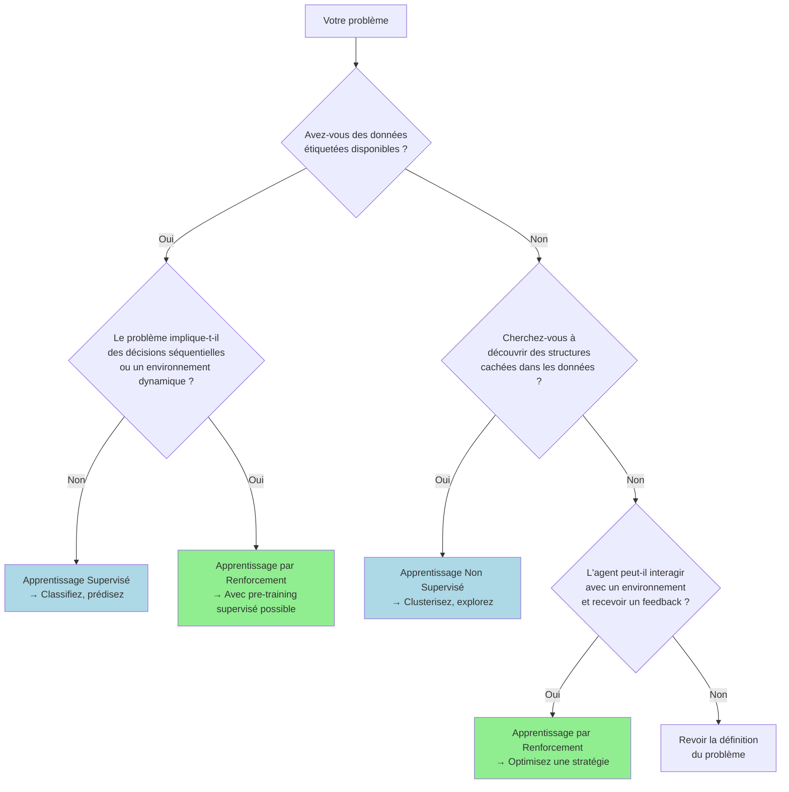

---

### Questions diagnostiques à se poser

Avant de choisir, répondez à ces cinq questions :

| # | Question | Supervisé | Non Supervisé | RL |
|---|---|---|---|---|
| 1 | Ai-je des données étiquetées ? | Oui | Non | Non nécessaire |
| 2 | Mon problème implique-t-il des décisions séquentielles ? | Non | Non | Oui |
| 3 | L'environnement change-t-il selon mes actions ? | Non | Non | Oui |
| 4 | Cherche-je à prédire une valeur ou une classe ? | Oui | Non | Non |
| 5 | Cherche-je à découvrir des structures cachées ? | Non | Oui | Non |

---

### Tableau de sélection par cas d'usage

| Cas d'usage | Meilleure approche | Pourquoi |
|---|---|---|
| Filtrer les emails spam | Supervisé | Base d'emails étiquetés disponible, problème de classification simple |
| Segmenter les clients d'un supermarché | Non Supervisé | Pas de catégories prédéfinies, objectif de découverte |
| Conduire une voiture autonome | RL | Décisions séquentielles, environnement dynamique imprévisible |
| Reconnaître des visages sur photos | Supervisé | Photos étiquetées avec identités, classification d'images |
| Détecter des fraudes sans historique | Non Supervisé | Pas d'exemples de fraudes connus, détection d'anomalies |
| Jouer et gagner à des échecs | RL | Décisions séquentielles, adversaire dynamique |
| Prédire le prix d'une maison | Supervisé | Données historiques avec prix connus, régression |
| Optimiser les feux de circulation | RL | Adaptation en temps réel, récompense = fluidité du trafic |
| Analyser les thèmes d'un corpus de textes | Non Supervisé | Pas de catégories définies à l'avance, découverte de sujets |
| Personnaliser les recommandations en continu | RL | Adaptation aux interactions utilisateur en temps réel |

---

### Quand le choix est difficile : les zones grises

Certains problèmes peuvent être abordés par plusieurs paradigmes — le choix dépend alors des **contraintes pratiques** :

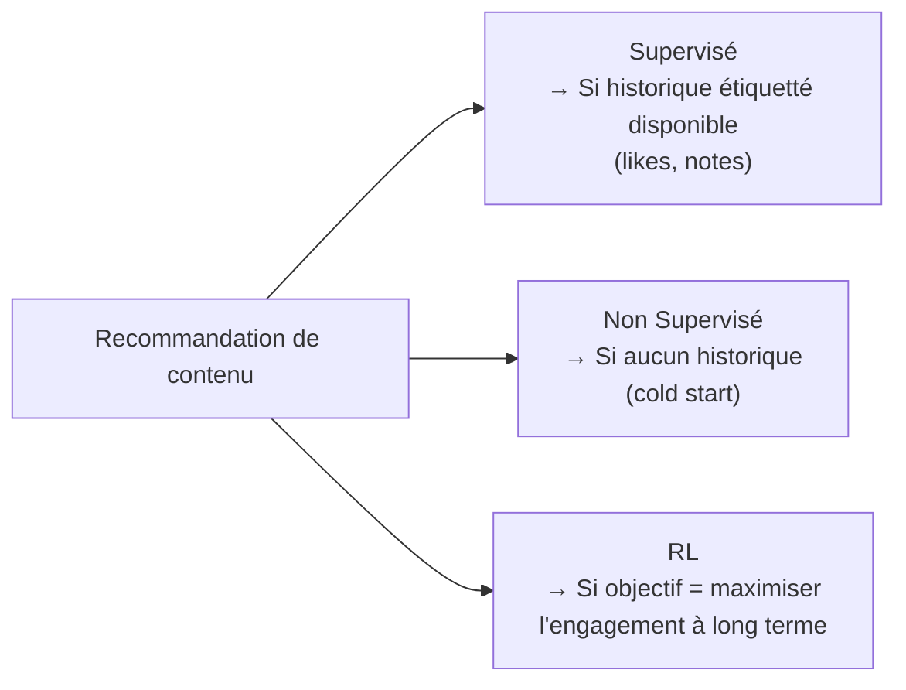

> _Dans la pratique, les systèmes les plus performants combinent souvent plusieurs approches. Netflix utilise du non supervisé pour le clustering, du supervisé pour la prédiction de ratings, et du RL pour optimiser l'engagement global._

</details>

<p align="right"><a href="#top">↑ Retour en haut</a></p>

---

<a id="section-7"></a>

<details>
<summary>7 — Cas hybrides et combinaisons d'approches</summary>

<br/>

Dans la pratique industrielle, les trois paradigmes ne s'excluent pas mutuellement. Les systèmes les plus performants les **combinent intelligemment** selon les besoins de chaque étape du pipeline.

---

### Les combinaisons les plus courantes

#### 7.1 — Supervisé + RL : le pre-training

L'agent RL commence avec des connaissances initiales issues d'un modèle supervisé, puis s'affine par RL.

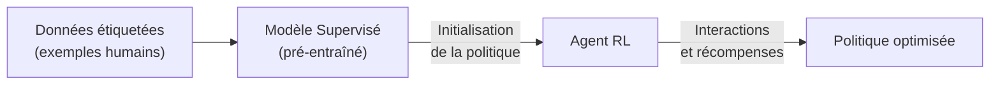

**Exemple : AlphaGo de DeepMind**
- Phase 1 : Apprentissage supervisé sur des millions de parties humaines.
- Phase 2 : Apprentissage par renforcement — l'IA joue contre elle-même pour s'améliorer au-delà du niveau humain.

---

#### 7.2 — Non Supervisé + RL : la représentation de l'état

Le clustering ou la réduction de dimension simplifie la représentation de l'état avant que l'agent RL ne prenne une décision.

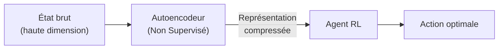

**Exemple : robotique avec caméra**
- Un robot reçoit des images haute résolution (état brut).
- Un autoencodeur compresse ces images en vecteurs de faible dimension.
- L'agent RL prend ses décisions sur ces vecteurs compressés — bien plus efficacement.

---

#### 7.3 — Les trois ensemble : les systèmes de recommandation avancés

| Étape | Paradigme | Rôle |
|---|---|---|
| Profilage initial | Non Supervisé | Clustering des utilisateurs similaires (cold start) |
| Prédiction de préférence | Supervisé | Prédire si un contenu va plaire (historique étiquetté) |
| Optimisation de l'engagement | RL | Maximiser le temps de visionnage sur le long terme |

---

### Exemples industriels de combinaisons

| Entreprise | Système | Combinaison utilisée |
|---|---|---|
| **DeepMind / Google** | AlphaGo / AlphaZero | Supervisé (pré-entraînement) + RL (self-play) |
| **OpenAI** | ChatGPT (RLHF) | Supervisé (SFT) + RL avec retour humain |
| **Netflix** | Moteur de recommandation | Non Supervisé (clustering) + Supervisé (prédiction) + RL (optimisation) |
| **Tesla** | Autopilot | Supervisé (détection d'objets) + RL (décisions de conduite) |
| **Amazon** | Gestion des entrepôts | Non Supervisé (optimisation logistique) + RL (navigation robots) |

> _Le RLHF (Reinforcement Learning from Human Feedback) utilisé pour entraîner les grands modèles de langage comme GPT est l'exemple parfait : le modèle apprend d'abord avec du supervisé, puis un agent RL optimise ses réponses selon les préférences humaines._

</details>

<p align="right"><a href="#top">↑ Retour en haut</a></p>

---

<a id="section-8"></a>

<details>
<summary>8 — Quiz 1 — Identifier les paradigmes</summary>

<br/>

Ce quiz évalue votre capacité à identifier le bon paradigme d'apprentissage automatique selon la description d'un problème. Répondez à chaque question, puis cliquez sur **💡 Voir la solution** pour vérifier votre réponse.

---

#### 1. Identification des paradigmes

**Question 1 :** Un médecin veut qu'un algorithme classe automatiquement des radiographies comme « normale » ou « anomalie détectée ». Il dispose de 10 000 radiographies déjà annotées par ses collègues. Quel paradigme utiliser ?

a) Apprentissage par renforcement


b) Apprentissage non supervisé


c) Apprentissage supervisé


d) Combinaison de tous les paradigmes

<details>
<summary>💡 Voir la solution</summary>

✅ **Réponse : c)**

Les données sont étiquetées (normale / anomalie) et le problème est une classification binaire classique. C'est le cas d'usage idéal de l'apprentissage supervisé — ici un CNN (réseau de neurones convolutionnel) entraîné sur ces paires (image, label).

</details>

---

**Question 2 :** Une banque reçoit des millions de transactions par jour et souhaite identifier des groupes de comportements inhabituels, sans savoir à l'avance quels types de fraudes existent. Quel paradigme utiliser ?

a) Apprentissage supervisé


b) Apprentissage par renforcement


c) Apprentissage non supervisé


d) Aucun des trois

<details>
<summary>💡 Voir la solution</summary>

✅ **Réponse : c)**

Sans étiquettes et sans catégories prédéfinies, l'apprentissage non supervisé est idéal. Des algorithmes comme DBSCAN ou Isolation Forest identifient les transactions qui ne ressemblent à aucun pattern connu — sans avoir besoin d'exemples de fraudes passées.

</details>

---

**Question 3 :** Un robot dans un entrepôt doit apprendre à transporter des colis en évitant les obstacles. Il reçoit une récompense de +1 chaque fois qu'il livre un colis sans collision. Quel paradigme utiliser ?

a) Apprentissage non supervisé


b) Apprentissage supervisé


c) Apprentissage par renforcement


d) Régression linéaire

<details>
<summary>💡 Voir la solution</summary>

✅ **Réponse : c)**

Le robot interagit avec un environnement dynamique, prend des décisions séquentielles (naviguer, éviter, livrer) et reçoit un feedback sous forme de récompense. C'est exactement le scénario pour lequel le RL a été conçu.

</details>

---

**Question 4 :** Un e-commerce veut regrouper ses clients en profils d'acheteurs similaires pour personnaliser ses campagnes marketing, sans avoir défini de catégories au préalable. Quel paradigme ?

a) Apprentissage supervisé


b) Apprentissage par renforcement


c) Apprentissage non supervisé


d) Apprentissage semi-supervisé

<details>
<summary>💡 Voir la solution</summary>

✅ **Réponse : c)**

Pas d'étiquettes, pas de catégories préexistantes — objectif de découverte de groupes similaires. K-Means ou DBSCAN appliqué sur le comportement d'achat (panier moyen, fréquence, catégories favorites) permettra de segmenter les clients naturellement.

</details>

---

**Question 5 :** Une plateforme de streaming veut qu'une IA apprenne à recommander des films en maximisant le temps de visionnage total des utilisateurs sur 30 jours, en s'adaptant continuellement à leurs comportements. Quel paradigme ?

a) Apprentissage non supervisé


b) Apprentissage supervisé


c) Apprentissage par renforcement


d) Régression logistique

<details>
<summary>💡 Voir la solution</summary>

✅ **Réponse : c)**

L'objectif est d'optimiser une récompense cumulative (temps de visionnage sur 30 jours) en prenant des décisions séquentielles (quelle recommandation afficher maintenant) qui influencent le comportement futur de l'utilisateur. C'est le cas typique du RL pour les systèmes de recommandation.

</details>

---

#### 2. Identification avancée

**Question 6 :** Pour entraîner un modèle de prédiction de prix de maisons à partir de 500 000 ventes immobilières avec prix connus, quel paradigme est le plus approprié ?

a) RL — maximiser la récompense de vente


b) Non Supervisé — découvrir des groupes de maisons


c) Supervisé — régression sur données étiquetées


d) RL avec pre-training supervisé

<details>
<summary>💡 Voir la solution</summary>

✅ **Réponse : c)**

On dispose de paires (caractéristiques de la maison, prix de vente). L'objectif est de prédire un prix pour de nouvelles maisons. C'est une régression supervisée classique — XGBoost ou un réseau de neurones y excelleront.

</details>

---

**Question 7 :** Un algorithme doit apprendre à jouer à un jeu d'échecs en atteignant le niveau grand-maître. Aucune donnée d'entraînement n'est fournie initialement — il commence de zéro. Quel paradigme ?

a) Supervisé — apprentissage sur des parties historiques


b) Non Supervisé — découverte des ouvertures


c) RL — apprentissage par essais et erreurs


d) Régression — prédire le meilleur coup

<details>
<summary>💡 Voir la solution</summary>

✅ **Réponse : c)**

Sans données initiales, l'agent RL joue contre lui-même (self-play), reçoit une récompense de +1 pour une victoire, 0 pour un nul, -1 pour une défaite, et converge vers une stratégie optimale. C'est exactement le fonctionnement d'AlphaZero.

</details>

---

**Question 8 :** On veut analyser 100 000 articles de presse pour identifier automatiquement les grands thèmes abordés (politique, économie, sport...) sans avoir fourni ces catégories à l'avance. Quel paradigme ?

a) Supervisé — classification de textes


b) Non Supervisé — topic modeling (LDA, BERTopic)


c) RL — optimisation de la lecture


d) Aucun paradigme d'apprentissage automatique

<details>
<summary>💡 Voir la solution</summary>

✅ **Réponse : b)**

Découvrir des thèmes sans catégories prédéfinies = apprentissage non supervisé. Des algorithmes de **topic modeling** comme LDA (Latent Dirichlet Allocation) ou BERTopic identifient les thèmes naturels qui émergent du corpus de textes.

</details>

---

**Question 9 :** Une entreprise d'énergie veut optimiser en temps réel la distribution d'électricité dans un réseau intelligent (smart grid), en s'adaptant aux pics de consommation et aux pannes partielles. Quel paradigme ?

a) Supervisé — prédire la consommation future


b) Non Supervisé — détecter des anomalies de réseau


c) RL — prendre des décisions séquentielles d'allocation


d) Tous les trois simultanément

<details>
<summary>💡 Voir la solution</summary>

✅ **Réponse : c)**

La gestion d'un réseau électrique est un problème de **contrôle séquentiel** : chaque décision d'allocation influence l'état futur du réseau. L'environnement est dynamique (fluctuations de consommation, pannes imprévues). Le RL permet d'optimiser les décisions en temps réel pour maximiser la stabilité et l'efficacité du réseau.

</details>

---

**Question 10 :** OpenAI a utilisé une technique appelée RLHF pour entraîner ChatGPT. Dans RLHF, des humains notent les réponses du modèle, et un agent apprend à maximiser ces notes. Quel paradigme est le RL ici ?

a) Non Supervisé — le modèle découvre les bonnes réponses


b) Supervisé — les notes humaines sont les étiquettes


c) RL — maximiser la récompense des préférences humaines


d) Hybride — supervisé uniquement

<details>
<summary>💡 Voir la solution</summary>

✅ **Réponse : c)**

Dans RLHF, les notes humaines constituent la **fonction de récompense**. L'agent (le modèle de langage) apprend à maximiser cette récompense en générant des réponses de plus en plus appréciées par les évaluateurs humains. C'est du RL pur — avec une récompense définie par des préférences humaines.

</details>

</details>

<p align="right"><a href="#top">↑ Retour en haut</a></p>

---

<a id="section-9"></a>

<details>
<summary>9 — Quiz 2 — Choisir la bonne approche</summary>

<br/>

Ce quiz teste votre capacité à justifier le choix d'un paradigme face à des contraintes concrètes. Répondez, puis cliquez sur **Voir la solution**.

---

**Question 1 :** Quelle est la condition **indispensable** pour utiliser l'apprentissage supervisé ?

a) Un environnement interactif et dynamique


b) Un grand nombre de données non étiquetées


c) Des paires (entrée, sortie attendue) pour entraîner le modèle


d) Une fonction de récompense bien définie

<details>
<summary>💡 Voir la solution</summary>

✅ **Réponse : c)**

L'apprentissage supervisé **ne peut pas fonctionner sans données étiquetées**. C'est sa condition sine qua non. Si l'étiquetage est impossible ou trop coûteux, il faut envisager une autre approche.

</details>

---

**Question 2 :** Pourquoi l'apprentissage non supervisé est-il préférable lorsqu'on travaille sur de la **détection d'anomalies** dans un nouveau domaine ?

a) Parce qu'il apprend plus vite que le supervisé


b) Parce qu'il ne nécessite pas de connaître les types d'anomalies à l'avance


c) Parce qu'il génère lui-même des exemples d'anomalies


d) Parce qu'il utilise des récompenses pour identifier les anomalies

<details>
<summary>💡 Voir la solution</summary>

✅ **Réponse : b)**

Dans un nouveau domaine, on ne sait pas **quels types d'anomalies existent**. Le non supervisé apprend ce qu'est le comportement « normal », puis signale tout ce qui s'en écarte — sans avoir besoin d'exemples d'anomalies étiquetées à l'avance.

</details>

---

**Question 3 :** Pour un jeu vidéo où l'IA doit battre des joueurs humains, pourquoi le RL est-il supérieur au supervisé ?

a) Parce que le RL est toujours plus rapide à entraîner


b) Parce que le RL peut générer ses propres données en jouant contre lui-même, sans limite


c) Parce que le supervisé ne peut pas être appliqué aux jeux vidéo


d) Parce que le RL ne nécessite aucun paramétrage

<details>
<summary>💡 Voir la solution</summary>

✅ **Réponse : b)**

Le RL via **self-play** peut s'entraîner pendant des milliards de parties contre lui-même, accumulant une expérience qui dépasse de loin ce qu'un humain pourrait étiqueter. AlphaZero a joué 44 millions de parties d'échecs contre lui-même en 9 heures — impossible avec du supervisé.

</details>

---

**Question 4 :** Dans quel cas l'apprentissage non supervisé serait-il **un mauvais choix** ?

a) Quand on veut découvrir des clusters dans des données clients


b) Quand on veut prédire précisément si un email est un spam


c) Quand on n'a pas d'étiquettes pour les données


d) Quand on veut réduire la dimension des données

<details>
<summary>💡 Voir la solution</summary>

✅ **Réponse : b)**

La détection de spam nécessite une **décision binaire précise** (spam ou non-spam) sur de nouvelles données. Avec un historique d'emails étiquetés disponible, le supervisé donne une précision bien supérieure. Le non supervisé ne peut pas garantir cette précision sans supervision.

</details>

---

**Question 5 :** Quelle est la principale raison pour laquelle le RL est **difficile à appliquer** dans certains contextes réels ?

a) Il nécessite obligatoirement des données étiquetées


b) Il est incapable d'apprendre dans des environnements simples


c) Définir une bonne fonction de récompense est complexe et critique


d) Il ne fonctionne qu'avec des images et non avec des données textuelles

<details>
<summary>💡 Voir la solution</summary>

✅ **Réponse : c)**

Une **mauvaise fonction de récompense** produit un agent qui « triche » — il maximise la récompense sans atteindre l'objectif réel. C'est le problème du **reward hacking** : un robot RL dont la récompense est « nombre de points » pourrait apprendre à faire des cercles plutôt qu'à jouer correctement.

</details>

---

**Question 6 :** Pourquoi le RL est-il idéal pour la **gestion de portefeuille boursier** à long terme, contrairement au supervisé ?

a) Parce que le RL ne nécessite pas de données financières historiques


b) Parce que le RL optimise une séquence de décisions (acheter/vendre/attendre) sur la durée


c) Parce que le RL prédit mieux les prix des actions individuelles


d) Parce que le supervisé est incapable d'analyser des données financières

<details>
<summary>💡 Voir la solution</summary>

✅ **Réponse : b)**

La gestion de portefeuille est un problème de **décisions séquentielles interdépendantes** : acheter maintenant peut influencer la capacité à acheter plus tard. Le supervisé prédirait les prix individuels, mais ne pourrait pas optimiser la **stratégie globale sur plusieurs mois**.

</details>

---

**Question 7 :** Une startup veut construire un chatbot capable de s'améliorer continuellement grâce aux retours des utilisateurs (pouces levés/baissés). Quel paradigme est le plus adapté pour la phase d'amélioration continue ?

a) Supervisé — entraîner sur les conversations étiquetées


b) Non Supervisé — découvrir des patterns de conversation


c) RL — maximiser les retours positifs des utilisateurs


d) Aucun — les retours ne peuvent pas être exploités

<details>
<summary>💡 Voir la solution</summary>

✅ **Réponse : c)**

Les retours utilisateurs (pouces levés/baissés) constituent une **fonction de récompense naturelle**. Le RL (de type RLHF) permet au chatbot d'apprendre à générer des réponses maximisant les feedbacks positifs — exactement le mécanisme utilisé par OpenAI pour ChatGPT.

</details>

---

**Question 8 :** Un hôpital veut identifier les patients à risque élevé de réhospitalisation dans les 30 jours suivant leur sortie. Il dispose de 5 ans de dossiers médicaux complets avec les réhospitalisations enregistrées. Quel paradigme ?

a) Non Supervisé — découvrir les types de patients


b) Supervisé — prédire la réhospitalisation à partir des dossiers historiques


c) RL — optimiser les décisions médicales


d) Hybride obligatoire

<details>
<summary>💡 Voir la solution</summary>

✅ **Réponse : b)**

5 ans de dossiers avec l'information « réhospitalisé ou non dans les 30 jours » constituent un ensemble de données étiquetées parfait. Un modèle supervisé (Random Forest, XGBoost) peut apprendre à prédire cette probabilité avec haute précision.

</details>

---

**Question 9 :** Quelle propriété fondamentale distingue le RL des deux autres paradigmes lorsqu'on parle de **données d'entraînement** ?

a) Le RL utilise uniquement des données structurées


b) Le RL génère lui-même ses données en interagissant avec l'environnement


c) Le RL ne peut apprendre que sur des données textuelles


d) Le RL nécessite toujours des données étiquetées par des experts

<details>
<summary>💡 Voir la solution</summary>

✅ **Réponse : b)**

C'est la propriété la plus fondamentale du RL : l'agent **génère activement ses propres données d'expérience** en agissant sur l'environnement. Il n'est donc pas limité par la quantité de données préexistantes — il peut s'entraîner indéfiniment dans un simulateur.

</details>

---

**Question 10 :** Pour optimiser les trajets de milliers de robots dans un entrepôt Amazon, évitant les collisions et minimisant les temps de livraison, quel paradigme est le plus adapté ?

a) Supervisé — prédire le meilleur trajet à partir d'historiques


b) Non Supervisé — regrouper les robots par zones


c) RL multi-agent — chaque robot apprend sa politique en interagissant avec les autres


d) Régression logistique sur les positions

<details>
<summary>💡 Voir la solution</summary>

✅ **Réponse : c)**

Ce problème nécessite du **RL multi-agent** : chaque robot apprend sa politique de déplacement, mais l'environnement inclut les autres robots. Les décisions de chaque agent influencent l'environnement des autres — une interdépendance impossible à modéliser avec le supervisé ou le non supervisé.

</details>

</details>

<p align="right"><a href="#top">↑ Retour en haut</a></p>

---

<a id="section-10"></a>

<details>
<summary>10 — Quiz 3 — Comparaison avancée</summary>

<br/>

Ce quiz approfondit les nuances techniques entre les trois paradigmes. Questions de niveau avancé.

---

**Question 1 :** Dans l'apprentissage supervisé, qu'est-ce que la **fonction de perte** et quel est son rôle ?

a) Une récompense reçue après chaque action correcte


b) Une mesure de l'écart entre la prédiction du modèle et la vérité terrain — elle guide la correction du modèle


c) Un critère de regroupement des données similaires


d) Une fonction qui définit les transitions entre états

<details>
<summary>💡 Voir la solution</summary>

✅ **Réponse : b)**

La **fonction de perte** (loss function) mesure à quel point les prédictions du modèle sont éloignées des vraies valeurs. La descente de gradient utilise cette information pour ajuster les paramètres du modèle et réduire progressivement cette erreur.

</details>

---

**Question 2 :** Quelle est la différence fondamentale entre la **fonction de perte** (supervisé) et la **fonction de récompense** (RL) ?

a) Elles sont identiques — juste des noms différents


b) La fonction de perte minimise une erreur connue immédiatement, tandis que la récompense peut être différée et cumulative


c) La fonction de récompense est toujours positive, la perte toujours négative


d) La fonction de perte s'applique uniquement aux réseaux de neurones

<details>
<summary>💡 Voir la solution</summary>

✅ **Réponse : b)**

La fonction de perte donne un **signal immédiat et précis** (erreur = prédiction - vérité). La récompense en RL peut être **différée** (le résultat n'est connu que plus tard) et **clairsemée** (pas de signal à chaque étape) — ce qui rend le RL bien plus difficile à entraîner.

</details>

---

**Question 3 :** Qu'est-ce que le **credit assignment problem** en RL et pourquoi n'existe-t-il pas en apprentissage supervisé ?

a) Le problème de trouver quelle action parmi une séquence a réellement contribué à la récompense obtenue


b) Le problème de déterminer quelle étiquette attribuer à une donnée


c) Le problème de répartir équitablement les données d'entraînement


d) Le problème de choisir le bon algorithme de clustering

<details>
<summary>💡 Voir la solution</summary>

✅ **Réponse : a)**

En RL, si un agent gagne après 100 actions, quelle action (ou quelles actions) a réellement mérité la récompense ? C'est le **credit assignment problem**. En supervisé, chaque prédiction reçoit immédiatement son signal d'erreur — le problème n'existe pas.

</details>

---

**Question 4 :** En apprentissage non supervisé, qu'est-ce que le **silhouette score** et à quoi sert-il ?

a) Un score qui mesure si les classes prédites correspondent aux vraies étiquettes


b) Une mesure de la qualité d'un clustering : cohésion interne vs séparation entre clusters


c) Un indicateur de la récompense cumulative obtenue par un agent RL


d) Une métrique de la précision d'un modèle de régression

<details>
<summary>💡 Voir la solution</summary>

✅ **Réponse : b)**

Le **silhouette score** (-1 à +1) mesure si les données d'un cluster sont bien séparées des autres clusters et bien regroupées entre elles. Un score proche de +1 indique un clustering de qualité, proche de -1 indique que les données seraient mieux dans un autre cluster.

</details>

---

**Question 5 :** Pourquoi dit-on que le RL souffre d'un problème **d'exploration vs exploitation** que le supervisé et le non supervisé ne connaissent pas ?

a) Parce que le RL a besoin de beaucoup plus de données que les autres


b) Parce que l'agent doit choisir entre exploiter ce qui fonctionne ou tester de nouvelles actions potentiellement meilleures


c) Parce que le RL est incapable d'explorer automatiquement les données


d) Parce que l'exploration n'est utile que pour les environnements simulés

<details>
<summary>💡 Voir la solution</summary>

✅ **Réponse : b)**

Le supervisé et le non supervisé opèrent sur des **données fixes** — pas de choix d'action, pas de dilemme. Le RL, lui, doit constamment arbitrer : exploiter la meilleure action connue (exploitation) ou tester des actions inconnues qui pourraient être meilleures (exploration). Trop d'exploitation = rater de meilleures stratégies. Trop d'exploration = mauvaises performances immédiates.

</details>

---

**Question 6 :** Pourquoi le non supervisé est-il dit **non évaluable objectivement** comparé au supervisé ?

a) Parce qu'il ne produit aucun résultat mesurable


b) Parce que sans vérité terrain (étiquettes), il est difficile de dire si le résultat est « correct »


c) Parce que ses algorithmes convergent toujours vers le même résultat


d) Parce qu'il ne peut pas être appliqué à des données réelles

<details>
<summary>💡 Voir la solution</summary>

✅ **Réponse : b)**

En supervisé, on compare les prédictions aux vraies étiquettes — l'évaluation est objective (accuracy, F1...). En non supervisé, il n'y a pas de « bonne réponse » — on utilise des métriques internes (silhouette, inertie) mais l'interprétation reste subjective et requiert une validation humaine.

</details>

---

**Question 7 :** Qu'est-ce qui différencie le RL du supervisé concernant la **stationnarité des données** ?

a) Le supervisé apprend sur des données dynamiques, le RL sur des données statiques


b) Le RL opère dans des environnements non stationnaires où les données changent en fonction des actions, contrairement au supervisé


c) Ils traitent tous les deux des données stationnaires


d) La stationnarité n'est pas un critère de différenciation

<details>
<summary>💡 Voir la solution</summary>

✅ **Réponse : b)**

En supervisé, les données d'entraînement sont **fixes** (stationnaires). En RL, les données changent en fonction des actions de l'agent — l'environnement évolue. Cela crée des problèmes de **non-stationnarité** qui compliquent l'apprentissage et nécessitent des techniques spécifiques (experience replay, target networks en DQN).

</details>

---

**Question 8 :** Dans le contexte du RLHF (utilisé pour ChatGPT), quel rôle joue le **reward model** ?

a) Il remplace entièrement la phase d'entraînement supervisé


b) Il prédit la récompense (préférence humaine) à partir d'une réponse, permettant à l'agent RL de s'entraîner sans humain à chaque étape


c) Il génère automatiquement des données étiquetées pour le supervisé


d) Il détecte les anomalies dans les conversations des utilisateurs

<details>
<summary>💡 Voir la solution</summary>

✅ **Réponse : b)**

Le reward model est un modèle supervisé entraîné sur des préférences humaines (A est meilleur que B). Il apprend à **prédire la récompense** qu'un humain donnerait à une réponse. L'agent RL s'entraîne ensuite contre ce reward model — sans avoir besoin d'un humain à chaque itération.

</details>

---

**Question 9 :** Quelle est la différence entre la **politique greedy** et la **politique epsilon-greedy** en RL ?

a) La politique greedy choisit toujours aléatoirement, epsilon-greedy choisit la meilleure action


b) La politique greedy choisit toujours la meilleure action connue, epsilon-greedy introduit une probabilité epsilon d'explorer une action aléatoire


c) Elles sont identiques avec des noms différents


d) La politique epsilon-greedy n'est utilisée que dans l'apprentissage supervisé

<details>
<summary>💡 Voir la solution</summary>

✅ **Réponse : b)**

La politique **greedy** exploite toujours la meilleure action connue — risque de rester bloqué dans un optimum local. La politique **epsilon-greedy** ajoute une probabilité ε d'explorer aléatoirement — permettant à l'agent de découvrir de meilleures stratégies. Plus ε est élevé, plus l'exploration est importante.

</details>

---

**Question 10 :** En quoi la **convergence** d'un algorithme RL est-elle fondamentalement différente de celle d'un algorithme supervisé ?

a) Un algorithme supervisé ne converge jamais, contrairement au RL


b) En supervisé, la convergence est vers un minimum de perte sur données fixes. En RL, la convergence est vers une politique optimale dans un environnement non stationnaire — bien plus difficile à garantir


c) Ils convergent de la même façon, via la descente de gradient


d) La convergence n'est pas un critère en RL

<details>
<summary>💡 Voir la solution</summary>

✅ **Réponse : b)**

La convergence supervisée est relativement bien maîtrisée (fonctions de perte convexes, données fixes). En RL, l'environnement non stationnaire et les interdépendances entre actions rendent la convergence bien plus difficile à garantir. Q-Learning converge sous certaines conditions, mais les algorithmes Deep RL (DQN, PPO) sont souvent instables sans techniques spécifiques (experience replay, clipping...).

</details>

</details>

<p align="right"><a href="#top">↑ Retour en haut</a></p>

---

<a id="section-11"></a>

<details>
<summary>11 — Pratique 1 — Classifier des problèmes réels</summary>

<br/>

### Objectifs d'apprentissage

À la fin de cette pratique, vous serez capable de :

- Identifier rapidement le paradigme d'apprentissage automatique adapté à un problème donné.
- Justifier votre choix en utilisant les critères techniques vus dans ce chapitre.
- Distinguer les cas évidents des cas ambigus nécessitant une approche hybride.

---

### Instructions

Pour chacun des 12 scénarios ci-dessous :

1. **Identifiez** le paradigme le plus approprié : Supervisé (S), Non Supervisé (NS) ou Renforcement (RL).
2. **Justifiez** brièvement votre choix (2-3 phrases).
3. **Proposez** un algorithme ou une technique spécifique si possible.

---

### Scénarios

**Scénario 1 :** Un opérateur télécom veut détecter automatiquement les appels frauduleux en analysant les patterns de durée, fréquence et destination des appels. Il dispose d'un historique de 2 millions d'appels étiquetés (frauduleux / normal).

- **Votre paradigme** : ...
- **Justification** : ...
- **Algorithme proposé** : ...

---

**Scénario 2 :** Une ville installe des capteurs dans tous ses bâtiments publics. Elle veut identifier des comportements anormaux de consommation énergétique, sans savoir à l'avance quels types d'anomalies existent.

- **Votre paradigme** : ...
- **Justification** : ...
- **Algorithme proposé** : ...

---

**Scénario 3 :** Un laboratoire pharmaceutique veut développer un agent IA capable de découvrir de nouvelles molécules médicamenteuses en testant des combinaisons chimiques et en observant leur efficacité sur des cellules.

- **Votre paradigme** : ...
- **Justification** : ...
- **Algorithme proposé** : ...

---

**Scénario 4 :** Un journal en ligne veut proposer à chaque lecteur des articles personnalisés. Pour les nouveaux utilisateurs (sans historique), il veut les regrouper avec des profils similaires pour faire des recommandations initiales.

- **Votre paradigme** : ...
- **Justification** : ...
- **Algorithme proposé** : ...

---

**Scénario 5 :** Une entreprise de logistique veut prédire avec 48h d'avance si un colis sera livré à temps ou en retard, à partir des données de 500 000 livraisons passées avec leur statut final.

- **Votre paradigme** : ...
- **Justification** : ...
- **Algorithme proposé** : ...

---

**Scénario 6 :** Un bras robotisé dans une usine doit apprendre à saisir des objets de formes variées sans les endommager. Chaque saisie réussie lui donne +1, chaque objet endommagé lui donne -10.

- **Votre paradigme** : ...
- **Justification** : ...
- **Algorithme proposé** : ...

---

**Scénario 7 :** Une application de santé veut analyser des milliers de journaux de patients pour identifier naturellement des groupes de symptômes récurrents, sans aucune étiquette médicale préexistante.

- **Votre paradigme** : ...
- **Justification** : ...
- **Algorithme proposé** : ...

---

**Scénario 8 :** Un assistant vocal doit apprendre à comprendre et répondre aux requêtes orales en français. On dispose de 100 000 paires (audio, transcription) vérifiées par des annotateurs humains.

- **Votre paradigme** : ...
- **Justification** : ...
- **Algorithme proposé** : ...

---

**Scénario 9 :** Une IA de trading doit gérer un portefeuille de 50 actions sur 1 an, en décidant chaque jour d'acheter, vendre ou conserver chaque action, avec pour objectif de maximiser le profit total sur l'année.

- **Votre paradigme** : ...
- **Justification** : ...
- **Algorithme proposé** : ...

---

**Scénario 10 :** Un moteur de recherche veut classer automatiquement des milliards de pages web par thèmes (actualités, sport, science, tech...) sans avoir défini ces catégories à l'avance.

- **Votre paradigme** : ...
- **Justification** : ...
- **Algorithme proposé** : ...

---

**Scénario 11 :** Un réseau de distribution d'eau veut apprendre à ajuster en temps réel la pression dans les canalisations pour éviter les ruptures, tout en minimisant la consommation d'énergie des pompes.

- **Votre paradigme** : ...
- **Justification** : ...
- **Algorithme proposé** : ...

---

**Scénario 12 :** Une plateforme RH veut prédire quels employés sont susceptibles de quitter l'entreprise dans les 6 prochains mois, à partir de 3 ans de données RH (absences, évaluations, promotions) avec les départs enregistrés.

- **Votre paradigme** : ...
- **Justification** : ...
- **Algorithme proposé** : ...

---

### Correction complète — Pratique 1

| # | Paradigme | Justification | Algorithme proposé |
|---|---|---|---|
| 1 | **Supervisé** | Données étiquetées (fraude/normal), classification binaire | Random Forest, XGBoost, réseau de neurones |
| 2 | **Non Supervisé** | Pas d'étiquettes, détection d'anomalies sans catégories préexistantes | Isolation Forest, Autoencodeur, DBSCAN |
| 3 | **RL** | Découverte par essais, interactions avec un environnement (cellules), récompense = efficacité | AlphaFold-style RL, DQN sur espace chimique |
| 4 | **Non Supervisé** | Nouveaux utilisateurs sans historique, regroupement de profils similaires (cold start) | K-Means, collaborative filtering non supervisé |
| 5 | **Supervisé** | Données étiquetées disponibles (livré à temps / en retard), classification ou régression | Gradient Boosting, XGBoost, régression logistique |
| 6 | **RL** | Décisions séquentielles (tenter différentes prises), récompenses/pénalités, environnement dynamique | PPO, SAC (Soft Actor-Critic) |
| 7 | **Non Supervisé** | Aucune étiquette médicale, découverte de patterns dans des textes de patients | LDA (Latent Dirichlet Allocation), BERTopic |
| 8 | **Supervisé** | Paires étiquetées (audio, transcription) disponibles, tâche de reconnaissance vocale | Modèle Whisper-style, transformer supervisé |
| 9 | **RL** | Décisions séquentielles quotidiennes, maximisation d'un objectif cumulatif sur 1 an, environnement dynamique | PPO, DDPG (Deep Deterministic Policy Gradient) |
| 10 | **Non Supervisé** | Pas de catégories définies, découverte de thèmes dans un corpus massif | LDA, BERTopic, clustering k-means sur embeddings |
| 11 | **RL** | Contrôle séquentiel en temps réel, récompense = stabilité + économie d'énergie, environnement dynamique | Q-Learning, DQN, PPO |
| 12 | **Supervisé** | 3 ans de données étiquetées (parti / resté), classification binaire de risque de départ | Régression logistique, Random Forest, XGBoost |

</details>

<p align="right"><a href="#top">↑ Retour en haut</a></p>

---

<a id="section-12"></a>

<details>
<summary>12 — Pratique 2 — Concevoir une solution adaptée</summary>

<br/>

### Objectifs d'apprentissage

À la fin de cette pratique, vous serez capable de :

- Concevoir une architecture complète de solution ML en justifiant chaque choix de paradigme.
- Combiner intelligemment plusieurs paradigmes lorsque le problème le requiert.
- Penser en termes de pipeline complet : données → paradigme → algorithme → évaluation.

---

### Instructions

Pour chaque cas d'usage ci-dessous, concevez une solution complète en précisant :

1. Le(s) paradigme(s) utilisé(s) et à quelle étape.
2. Les algorithmes ou techniques recommandés.
3. La définition de la récompense (si RL) ou des étiquettes (si supervisé).
4. La métrique d'évaluation.

---

### Cas d'usage 1 : Système de recommandation pour une librairie en ligne

**Contexte :** Une librairie en ligne veut recommander des livres. Elle a des historiques d'achat étiquetés pour les anciens clients, mais doit aussi gérer les nouveaux utilisateurs. À long terme, elle veut maximiser le nombre de livres achetés par utilisateur sur 3 mois.

**Votre solution** :

| Étape | Paradigme | Technique | Objectif |
|---|---|---|---|
| Nouveaux utilisateurs | | | |
| Prédiction initiale | | | |
| Optimisation long terme | | | |
| Évaluation | | | |

---

### Cas d'usage 2 : Système de détection et réponse aux cyberattaques

**Contexte :** Une entreprise de cybersécurité veut créer un système qui :
- Détecte les menaces inconnues dans les flux réseau.
- Isole automatiquement les machines compromises.
- S'améliore à chaque incident détecté.

**Votre solution** :

| Étape | Paradigme | Technique | Objectif |
|---|---|---|---|
| Détection des anomalies | | | |
| Décision d'isolation | | | |
| Amélioration continue | | | |
| Évaluation | | | |

---

### Correction détaillée — Cas 1 : Librairie en ligne

| Étape | Paradigme | Technique | Objectif |
|---|---|---|---|
| Nouveaux utilisateurs (cold start) | **Non Supervisé** | K-Means sur préférences de genres littéraires | Regrouper le nouveau client avec des profils similaires |
| Prédiction des préférences | **Supervisé** | Filtrage collaboratif (matrix factorization) | Prédire la note qu'un client donnerait à un livre |
| Optimisation engagement | **RL** | DQN ou PPO — récompense = achat dans les 30 jours | Maximiser les achats cumulés sur 3 mois |
| Évaluation | Mixte | CTR, taux de conversion, récompense cumulative | Mesurer l'efficacité à chaque étape |

---

### Correction détaillée — Cas 2 : Cybersécurité

| Étape | Paradigme | Technique | Objectif |
|---|---|---|---|
| Détection des anomalies | **Non Supervisé** | Isolation Forest, Autoencodeur | Identifier les comportements réseaux anormaux sans étiquettes |
| Décision d'isolation | **RL** | Q-Learning — récompense = menace neutralisée avant propagation | Décider quand et comment isoler une machine compromise |
| Amélioration continue | **RL** | Mise à jour de la politique après chaque incident réel | Apprendre des nouvelles techniques d'attaque détectées |
| Évaluation | Mixte | Taux de faux positifs, temps de réponse, incidents évités | Mesurer la précision et la réactivité du système |

> _Ce type d'architecture hybride (Non Supervisé + RL) est au cœur des systèmes de cybersécurité modernes comme Darktrace, qui détecte les anomalies sans étiquettes puis décide automatiquement des contre-mesures à appliquer._

</details>

<p align="right"><a href="#top">↑ Retour en haut</a></p>

---

<a id="section-13"></a>

<details>
<summary>13 — Ressources supplémentaires</summary>

<br/>

Pour approfondir les différences entre les paradigmes de l'apprentissage automatique, voici une sélection de ressources essentielles.

---

### 1 — Références académiques et livres

| Ressource | Contenu | Niveau |
|---|---|---|
| **Sutton & Barto — Reinforcement Learning: An Introduction** | La référence absolue du RL, disponible gratuitement en PDF | Intermédiaire à avancé |
| **Bishop — Pattern Recognition and Machine Learning** | Supervisé et non supervisé en profondeur | Avancé |
| **Goodfellow, Bengio, Courville — Deep Learning** | Deep learning pour les trois paradigmes | Intermédiaire à avancé |

---

### 2 — Cours en ligne

| Plateforme | Cours | Paradigmes couverts |
|---|---|---|
| **Coursera** | Machine Learning Specialization (Andrew Ng) | Supervisé, Non Supervisé |
| **Coursera** | Reinforcement Learning Specialization (Alberta) | RL complet |
| **fast.ai** | Practical Deep Learning | Supervisé principalement |
| **DeepMind** | RL Lecture Series (YouTube) | RL avancé |

---

### 3 — Bibliothèques Python essentielles

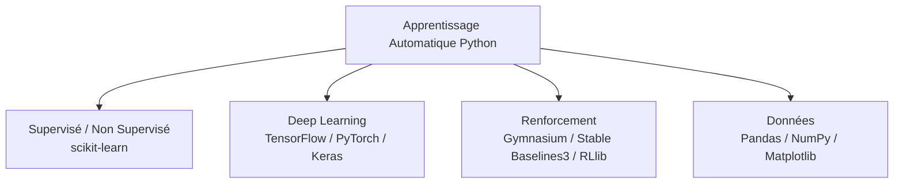

```python
# Exemples d'imports par paradigme

# Supervisé
from sklearn.ensemble import RandomForestClassifier
from sklearn.linear_model import LogisticRegression

# Non Supervisé
from sklearn.cluster import KMeans, DBSCAN
from sklearn.decomposition import PCA

# Renforcement
import gymnasium as gym
from stable_baselines3 import PPO, DQN, SAC
```

---

### 4 — Projets pratiques recommandés par paradigme

| Paradigme | Projet recommandé | Difficulté |
|---|---|---|
| **Supervisé** | Détection de fraude Kaggle (Credit Card Fraud) | Débutant |
| **Supervisé** | Classification d'images CIFAR-10 avec CNN | Intermédiaire |
| **Non Supervisé** | Segmentation clients avec K-Means (Mall Customers) | Débutant |
| **Non Supervisé** | Détection d'anomalies dans des logs serveur | Intermédiaire |
| **RL** | CartPole-v1 avec Q-Learning (Gymnasium) | Débutant |
| **RL** | LunarLander-v2 avec PPO (Stable Baselines3) | Intermédiaire |
| **Hybride** | Système de recommandation avec RL | Avancé |

</details>

<p align="right"><a href="#top">↑ Retour en haut</a></p>

---

<a id="section-14"></a>

<details>
<summary>14 — Synthèse du chapitre</summary>

<br/>

### Ce que vous avez appris dans ce chapitre

---

#### Les trois paradigmes en un coup d'oeil

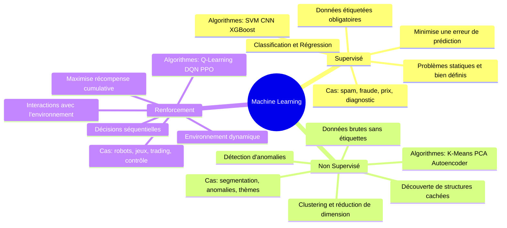

---

#### Tableau récapitulatif final

| **Critère de décision** | **Supervisé** | **Non Supervisé** | **RL** |
|---|---|---|---|
| Données étiquetées disponibles | Oui | Non | Non nécessaire |
| Découverte de structures inconnues | Non | Oui | Non |
| Décisions séquentielles | Non | Non | Oui |
| Environnement dynamique | Non | Non | Oui |
| Objectif d'optimisation à long terme | Non | Non | Oui |
| Génère ses propres données d'expérience | Non | Non | Oui |
| Évaluation objective possible | Oui (accuracy, F1) | Difficile (silhouette) | Oui (récompense cumulative) |

---

#### Points à retenir absolument

1. **Les trois paradigmes répondent à des questions fondamentalement différentes.** Supervisé = prédire, Non Supervisé = découvrir, RL = décider.

2. **Le choix du paradigme se fait avant tout algorithme.** Choisir le mauvais paradigme, c'est construire la mauvaise solution — peu importe l'algorithme utilisé.

3. **Le RL est le seul paradigme capable de décisions séquentielles à long terme.** C'est sa force distinctive et ce qui le rend incontournable pour les systèmes de contrôle.

4. **Les systèmes les plus performants combinent souvent plusieurs paradigmes.** ChatGPT (RLHF), AlphaGo (Supervisé + RL), les moteurs de recommandation (NS + Supervisé + RL) en sont les preuves.

5. **Pas de données étiquetées ne signifie pas blocage.** Le non supervisé et le RL fonctionnent tous deux sans étiquettes humaines — avec des objectifs différents.

---

#### Ce qui arrive dans la suite du cours

Dans le prochain chapitre, nous plongerons dans les **composants fondamentaux du RL** :

- L'agent, l'environnement, les états, les actions et les récompenses en détail.
- La politique et la fonction de valeur — les deux piliers de tout algorithme RL.
- Le modèle de l'environnement et la distinction Model-Free vs Model-Based.
- Les premières implémentations pratiques avec Gymnasium.

</details>

<p align="right"><a href="#top">↑ Retour en haut</a></p>

---

<p align="center">
  <em>Tous droits réservés. Toute reproduction, diffusion, utilisation ou adaptation de ce cours, en tout ou en partie, est strictement interdite sans l'autorisation écrite préalable de Dr. Haythem REHOUMA.</em>
</p>

<p align="center">
  <strong>Cours créé par Dr. Haythem REHOUMA — Apprentissage par Renforcement</strong>
</p>

<br/>

<p align="center">
  <a href="#top" style="display: inline-block; background: #2563eb; color: #ffffff; text-decoration: none; font-size: 1.1rem; font-weight: 700; padding: 14px 40px; border-radius: 10px; letter-spacing: 0.3px;">
    ↑ Retour en haut du cours
  </a>
</p>
