<a id="top"></a>

# Chapitre 3 - Composants Fondamentaux de l'Apprentissage par Renforcement

## Table des matières

| # | Section |
|---|---|
| 1 | [Vue d'ensemble — l'architecture d'un système RL](#section-1) |
| 1a | &nbsp;&nbsp;&nbsp;↳ [Les sept composants essentiels](#section-1) |
| 2 | [L'agent — le cerveau du système](#section-2) |
| 2a | &nbsp;&nbsp;&nbsp;↳ [Définition et rôle](#section-2) |
| 2b | &nbsp;&nbsp;&nbsp;↳ [Types d'agents RL](#section-2) |
| 2c | &nbsp;&nbsp;&nbsp;↳ [Architecture interne d'un agent](#section-2) |
| 3 | [L'environnement — le monde de l'agent](#section-3) |
| 3a | &nbsp;&nbsp;&nbsp;↳ [Définition et caractéristiques](#section-3) |
| 3b | &nbsp;&nbsp;&nbsp;↳ [Types d'environnements](#section-3) |
| 3c | &nbsp;&nbsp;&nbsp;↳ [Environnements simulés vs réels](#section-3) |
| 4 | [L'espace des états — State Space](#section-4) |
| 4a | &nbsp;&nbsp;&nbsp;↳ [Définition d'un état](#section-4) |
| 4b | &nbsp;&nbsp;&nbsp;↳ [États discrets vs continus](#section-4) |
| 4c | &nbsp;&nbsp;&nbsp;↳ [Observabilité complète vs partielle](#section-4) |
| 5 | [L'espace des actions — Action Space](#section-5) |
| 5a | &nbsp;&nbsp;&nbsp;↳ [Définition d'une action](#section-5) |
| 5b | &nbsp;&nbsp;&nbsp;↳ [Actions discrètes vs continues](#section-5) |
| 6 | [Le signal de récompense — Reward Function](#section-6) |
| 6a | &nbsp;&nbsp;&nbsp;↳ [Définition et rôle de la récompense](#section-6) |
| 6b | &nbsp;&nbsp;&nbsp;↳ [Conception d'une bonne fonction de récompense](#section-6) |
| 6c | &nbsp;&nbsp;&nbsp;↳ [Le reward hacking — danger d'une mauvaise récompense](#section-6) |
| 6d | &nbsp;&nbsp;&nbsp;↳ [Renforcement positif vs renforcement négatif](#section-6) |
| 7 | [La politique — Policy](#section-7) |
| 7a | &nbsp;&nbsp;&nbsp;↳ [Définition et types de politique](#section-7) |
| 7b | &nbsp;&nbsp;&nbsp;↳ [Politique déterministe vs stochastique](#section-7) |
| 8 | [La fonction de valeur — Value Function](#section-8) |
| 8a | &nbsp;&nbsp;&nbsp;↳ [V(s) — la valeur d'un état](#section-8) |
| 8b | &nbsp;&nbsp;&nbsp;↳ [Q(s,a) — la valeur d'une action dans un état](#section-8) |
| 8c | &nbsp;&nbsp;&nbsp;↳ [Relation entre V(s), Q(s,a) et la politique](#section-8) |
| 9 | [Le modèle de l'environnement — Model-Free vs Model-Based](#section-9) |
| 9a | &nbsp;&nbsp;&nbsp;↳ [Agents avec modèle vs sans modèle](#section-9) |
| 9b | &nbsp;&nbsp;&nbsp;↳ [Avantages et défis du RL](#section-9b) |
| 10 | [Quiz 1 — Les composants fondamentaux](#section-10) |
| 11 | [Quiz 2 — Interactions entre composants](#section-11) |
| 12 | [Quiz 3 — Concevoir un système RL](#section-12) |
| 12b | [Quiz 4 — Composantes, applications et renforcement (issu du fichier 3.2)](#section-12b) |
| 12c | [Quiz 5 — Exploration vs Exploitation (issu du fichier 3.6)](#section-12c) |
| 13 | [Pratique 1 — Identifier les composants dans des scénarios réels](#section-13) |
| 13a | &nbsp;&nbsp;&nbsp;↳ [Correction de la Pratique 1](#section-13) |
| 14 | [Pratique 2 — Modéliser un problème complet en MDP](#section-14) |
| 14a | &nbsp;&nbsp;&nbsp;↳ [Correction de la Pratique 2](#section-14) |
| 15 | [Ressources supplémentaires](#section-15) |
| 16 | [Synthèse du chapitre](#section-16) |

---

<a id="section-1"></a>

<details>
<summary>1 — Vue d'ensemble — l'architecture d'un système RL</summary>

<br/>

Tout système d'apprentissage par renforcement repose sur une architecture composée de **sept éléments fondamentaux** qui interagissent en permanence. Comprendre chacun de ces éléments — et surtout leurs interactions — est indispensable pour concevoir, analyser et améliorer n'importe quel algorithme RL.

---

### Les sept composants essentiels

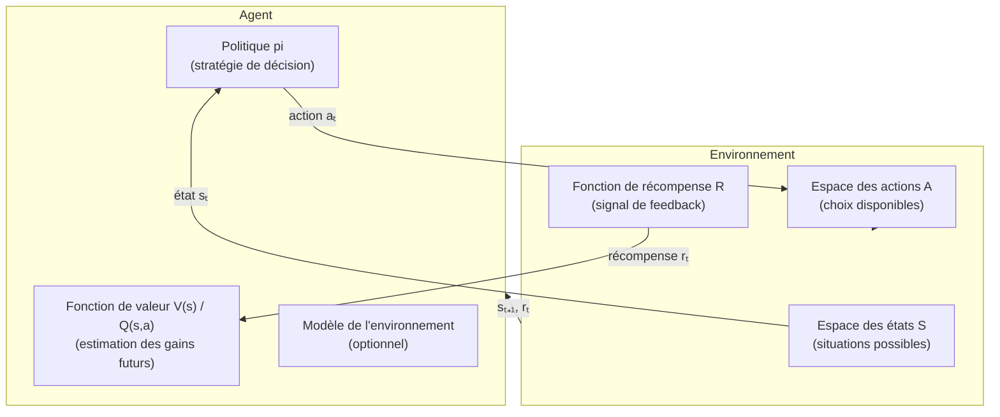

---

### Tableau des sept composants

| Composant | Notation | Rôle | Question à laquelle il répond |
|---|---|---|---|
| **Agent** | — | L'entité qui apprend et décide | Qui apprend ? |
| **Environnement** | — | Le monde avec lequel l'agent interagit | Dans quel contexte ? |
| **Espace des états** | S | Toutes les situations possibles | Où suis-je ? |
| **Espace des actions** | A | Tous les choix disponibles | Que puis-je faire ? |
| **Récompense** | R(s,a,s') | Le signal de feedback | Est-ce que j'ai bien agi ? |
| **Politique** | π | La stratégie de décision | Quelle action choisir dans cet état ? |
| **Fonction de valeur** | V(s) / Q(s,a) | L'estimation des gains futurs | Combien vaut cet état ou cette action ? |

---

### Le cycle d'interaction fondamental

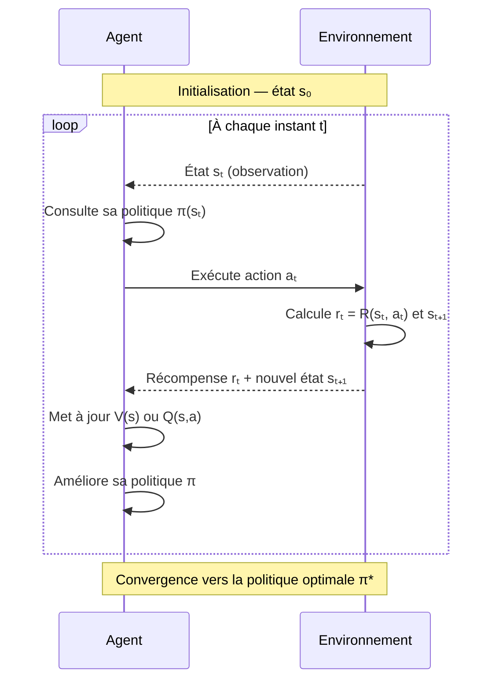

> _Ces sept composants forment un tout cohérent. Modifier l'un d'eux — par exemple changer la fonction de récompense — peut radicalement changer le comportement de l'agent. C'est pourquoi chaque composant mérite d'être compris en profondeur avant d'implémenter quoi que ce soit._

</details>

<p align="right"><a href="#top">↑ Retour en haut</a></p>

---

<a id="section-2"></a>

<details>
<summary>2 — L'agent — le cerveau du système</summary>

<br/>

L'**agent** est l'entité centrale du système RL. C'est lui qui **observe, décide, agit et apprend**. Contrairement à un programme classique qui suit des règles prédéfinies, un agent RL développe sa propre stratégie par l'expérience.

---

### Définition et rôle

L'agent est défini par **quatre fonctions fondamentales** :

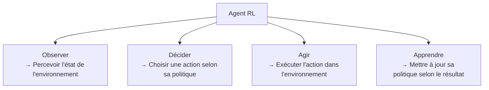

> _Pensez à un joueur d'échecs professionnel : il observe le plateau (état), analyse la situation (décide), joue un coup (agit), puis tire des leçons du résultat de la partie (apprend). L'agent RL suit exactement ce cycle — en accéléré et en répétant des millions de fois._

---

### Types d'agents RL

| Type d'agent | Caractéristique | Exemple |
|---|---|---|
| **Value-Based** | Apprend la valeur des états/actions, déduit la politique indirectement | Q-Learning, DQN |
| **Policy-Based** | Apprend directement la politique sans passer par les valeurs | REINFORCE, PPO |
| **Actor-Critic** | Combine les deux — un acteur décide, un critique évalue | A2C, A3C, SAC |
| **Model-Based** | Apprend un modèle de l'environnement pour planifier | AlphaZero, Dreamer |
| **Model-Free** | Apprend directement depuis l'expérience, sans modèle interne | Q-Learning, DQN, PPO |

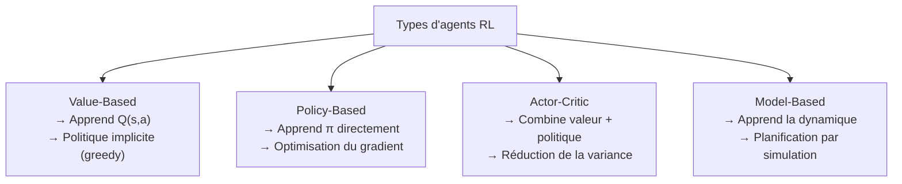

---

### Architecture interne d'un agent

Un agent RL peut être représenté comme un système à trois modules :

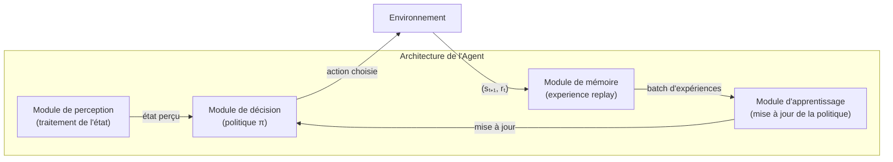

**Les quatre modules expliqués :**

1. **Module de perception** : transforme l'observation brute (pixels, capteurs) en représentation exploitable.
2. **Module de décision** : la politique π — choisit l'action à partir de la représentation de l'état.
3. **Module de mémoire** : stocke les transitions (s, a, r, s') pour l'entraînement — l'*experience replay*.
4. **Module d'apprentissage** : met à jour les paramètres de la politique selon les expériences passées.

---

### Agent unique vs Multi-agents

| Configuration | Description | Exemple |
|---|---|---|
| **Agent unique** | Un seul agent interagit avec l'environnement | Robot aspirateur apprenant à nettoyer |
| **Multi-agents coopératifs** | Plusieurs agents travaillent ensemble vers un but commun | Robots en entrepôt qui coordonnent leurs livraisons |
| **Multi-agents compétitifs** | Agents qui s'affrontent — l'environnement d'un agent inclut les autres | AlphaGo qui joue contre lui-même (self-play) |
| **Multi-agents mixtes** | Coopération et compétition simultanées | Agents de trading sur un marché financier |

</details>

<p align="right"><a href="#top">↑ Retour en haut</a></p>

---

<a id="section-3"></a>

<details>
<summary>3 — L'environnement — le monde de l'agent</summary>

<br/>

L'**environnement** est tout ce qui est extérieur à l'agent. C'est le système avec lequel l'agent interagit, qui lui retourne des états et des récompenses après chaque action. Bien définir l'environnement est aussi important que de concevoir l'agent lui-même.

---

### Définition et caractéristiques

L'environnement joue un rôle à double sens dans le cycle RL :

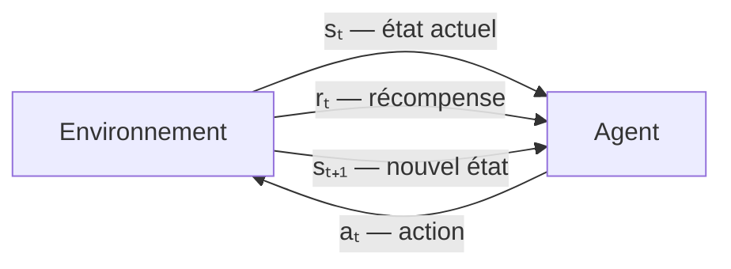

**L'environnement remplit trois fonctions :**
1. **Retourner l'état actuel** à l'agent après chaque interaction.
2. **Calculer la récompense** associée à l'action effectuée.
3. **Mettre à jour son état interne** suite à l'action de l'agent.

---

### Types d'environnements

La classification des environnements selon leurs caractéristiques est fondamentale pour choisir le bon algorithme RL.

#### 3.1 — Déterministe vs Stochastique

| Type | Description | Exemple |
|---|---|---|
| **Déterministe** | La même action dans le même état produit toujours le même résultat | Jeu d'échecs — une même séquence de coups produit toujours la même position |
| **Stochastique** | Le résultat d'une action comporte une part d'aléatoire | Conduite autonome — un piéton peut surgir ou non, même dans la même situation |

#### 3.2 — Entièrement observable vs Partiellement observable

| Type | Description | Notation |
|---|---|---|
| **Entièrement observable (MDP)** | L'agent perçoit l'état complet de l'environnement | Processus de Décision Markovien (MDP) |
| **Partiellement observable (POMDP)** | L'agent perçoit seulement une partie de l'état réel | Partially Observable MDP (POMDP) |

> _Exemple de POMDP : au poker, vous voyez vos cartes mais pas celles de vos adversaires. L'état complet du jeu vous est partiellement caché — votre agent doit raisonner sous incertitude._

#### 3.3 — Épisodique vs Continu

| Type | Description | Exemple |
|---|---|---|
| **Épisodique** | L'expérience se divise en épisodes avec un début et une fin | Jouer à CartPole — une partie = un épisode |
| **Continu** | L'agent interagit indéfiniment sans fin définie | Robot de livraison opérant 24h/24 |

#### 3.4 — Statique vs Dynamique

| Type | Description | Exemple |
|---|---|---|
| **Statique** | L'environnement ne change pas pendant que l'agent réfléchit | Puzzle logique — le plateau ne bouge pas |
| **Dynamique** | L'environnement évolue même sans action de l'agent | Marché financier — les prix bougent en temps réel |

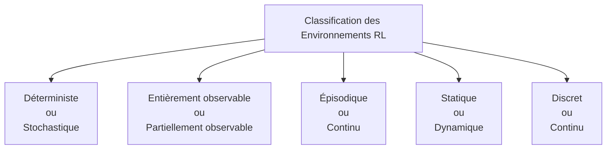

---

### Environnements simulés vs réels

| Caractéristique | Simulé | Réel |
|---|---|---|
| **Coût d'exploration** | Nul — l'agent peut échouer des milliers de fois | Élevé — une erreur peut coûter cher ou être dangereuse |
| **Vitesse d'entraînement** | Très rapide — 1 000x plus vite que le temps réel | Limité par la vitesse du monde physique |
| **Transfert vers le réel** | Nécessite un sim-to-real transfer | Directement applicable |
| **Exemples** | Gymnasium, MuJoCo, Unity ML-Agents | Robots industriels, voitures autonomes, trading réel |

> _C'est pourquoi presque tous les agents RL sont d'abord entraînés dans des simulateurs. AlphaZero a joué 44 millions de parties dans un simulateur en 9 heures — impossible dans le monde réel. Tesla simule des milliards de kilomètres de conduite virtuels avant de déployer les mises à jour sur ses véhicules._

</details>

<p align="right"><a href="#top">↑ Retour en haut</a></p>

---

<a id="section-4"></a>

<details>
<summary>4 — L'espace des états — State Space</summary>

<br/>

L'**espace des états** (State Space) **S** représente l'ensemble de toutes les situations dans lesquelles l'agent peut se trouver. La définition précise de l'espace d'états est une des décisions les plus critiques dans la conception d'un système RL.

---

### Définition d'un état

Un **état** sₜ est une description complète (ou partielle, en cas d'observabilité partielle) de la situation de l'environnement à l'instant t.

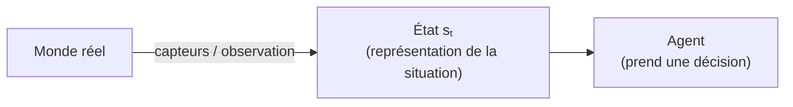

**Propriété de Markov :** Un état satisfait la propriété de Markov si :

```
P(sₜ₊₁ | sₜ, aₜ) = P(sₜ₊₁ | s₀, a₀, s₁, a₁, ..., sₜ, aₜ)
```

En d'autres termes : **l'état actuel contient toute l'information nécessaire pour prédire l'avenir — sans avoir besoin de l'historique complet.**

> _C'est comme un joueur d'échecs qui n'a besoin que de la position actuelle du plateau pour décider de son prochain coup — il n'a pas besoin de se souvenir de l'ordre dans lequel les pièces ont été jouées._

---

### États discrets vs continus

| Type | Description | Exemple | Algorithme adapté |
|---|---|---|---|
| **Discret** | Nombre fini ou dénombrable d'états | Position dans une grille 5x5 (25 états) | Q-Learning (table Q) |
| **Continu** | Espace infini de valeurs réelles | Position et vitesse d'un pendule (valeurs réelles) | DQN, PPO, SAC (approximation par réseau de neurones) |

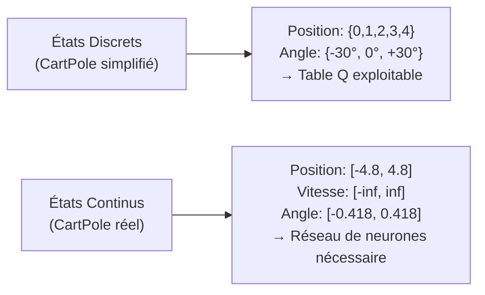

---

### Exemples d'espaces d'états dans des applications réelles

| Application | État (sₜ) | Dimension |
|---|---|---|
| **Jeu de Pac-Man** | Pixels de l'écran + positions fantômes + score | 84×84 pixels × 4 frames |
| **Bras robotique** | Angles et vitesses angulaires de chaque articulation | 6-7 dimensions continues |
| **Trading algorithmique** | Prix, volumes, indicateurs techniques sur N dernières périodes | 50-200 dimensions |
| **Conduite autonome** | Images caméras + LIDAR + GPS + vitesse + intention des piétons | Très haute dimension |
| **Labyrinthe simple** | Coordonnées (x, y) dans une grille | 2 dimensions discrètes |

---

### Observabilité complète vs partielle

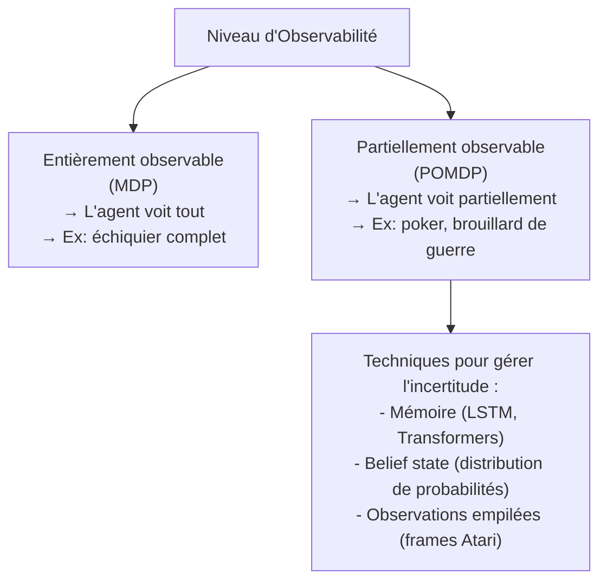

**Stratégies pour les POMDP :**

1. **Stacking d'observations** : utiliser les N dernières observations pour inférer l'état complet (Atari DQN empile 4 frames consécutives).
2. **Mémoire récurrente** : utiliser un réseau LSTM ou Transformer pour mémoriser l'historique.
3. **Belief state** : maintenir une distribution de probabilités sur les états possibles.

> _Exemple concret : à Doom (jeu vidéo), l'agent ne voit que ce qui est devant lui. Pour savoir ce qu'il y a dans son dos, il doit se souvenir de ce qu'il a vu précédemment — d'où l'utilisation d'un réseau récurrent (LSTM) qui lui fournit une « mémoire » artificielle._

</details>

<p align="right"><a href="#top">↑ Retour en haut</a></p>

---

<a id="section-5"></a>

<details>
<summary>5 — L'espace des actions — Action Space</summary>

<br/>

L'**espace des actions** (Action Space) **A** représente l'ensemble de tous les choix disponibles pour l'agent à chaque instant. La nature de cet espace — discret ou continu — détermine directement le choix de l'algorithme RL à utiliser.

---

### Définition d'une action

Une **action** aₜ est la décision prise par l'agent à l'instant t, en réponse à l'état sₜ observé. L'action peut avoir des effets :

- **Immédiats** : changer directement l'état de l'environnement.
- **Différés** : dont les conséquences se manifesteront plusieurs étapes plus tard.

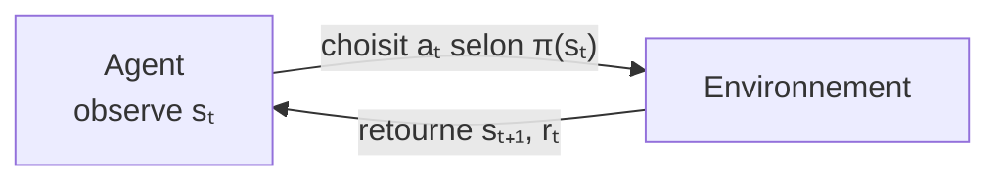

---

### Actions discrètes vs continues

| Type | Description | Exemple | Algorithme adapté |
|---|---|---|---|
| **Discret** | Nombre fini d'actions distinctes | Haut, Bas, Gauche, Droite | Q-Learning, DQN |
| **Continu** | Actions définies par des valeurs réelles dans un intervalle | Force du moteur entre [0, 100 N] | DDPG, SAC, PPO |

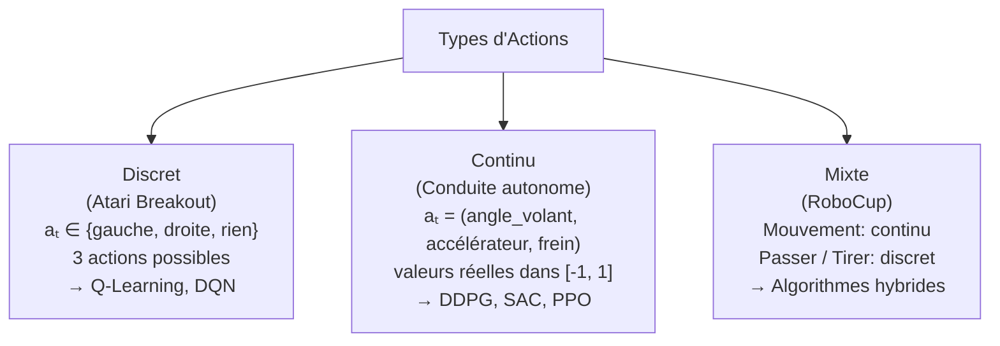

---

### Exemples d'espaces d'actions concrets

| Application | Espace d'actions | Type |
|---|---|---|
| **Jeux Atari (Pong)** | {rien, haut, bas, feu} | Discret (4 actions) |
| **Bras robotique** | Couple appliqué à chaque articulation | Continu (6 valeurs réelles) |
| **Gestion de portefeuille** | Pourcentage d'allocation par actif | Continu ([0%, 100%]) |
| **Jeu de Go** | Poser une pierre sur une intersection | Discret (19x19 = 361 positions) |
| **Chauffage intelligent** | Température cible du thermostat | Continu ([15°C, 28°C]) |
| **Réseau de feux** | Durée du feu vert en secondes | Continu ou discret |

---

### Le défi des grands espaces d'actions

Quand l'espace d'actions est très grand, la recherche de la meilleure action devient difficile.

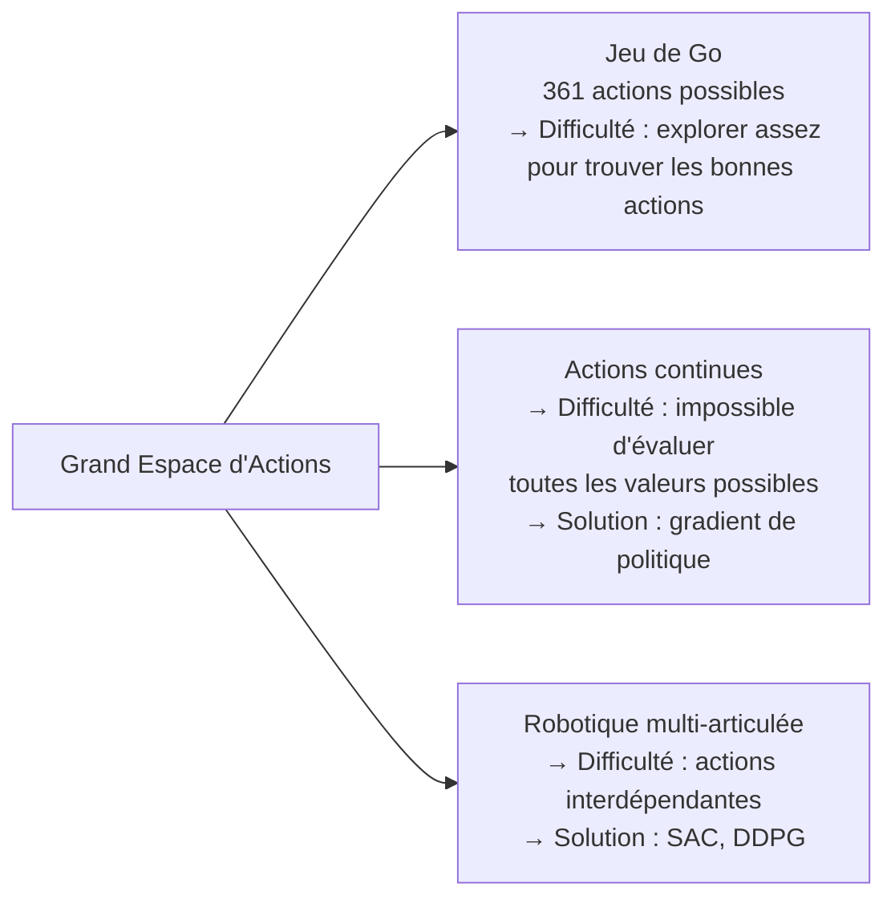

> _C'est pourquoi AlphaGo ne pouvait pas utiliser du Q-Learning classique (qui nécessite d'évaluer toutes les actions possibles) — avec 361 coups possibles à chaque tour, une table Q serait impraticable. Il utilise à la place un réseau de neurones de politique (policy network) qui directement choisit les meilleurs coups sans tout évaluer._

</details>

<p align="right"><a href="#top">↑ Retour en haut</a></p>

---

<a id="section-6"></a>

<details>
<summary>6 — Le signal de récompense — Reward Function</summary>

<br/>

La **fonction de récompense** R(s, a, s') est le signal que l'environnement envoie à l'agent pour lui indiquer la qualité de son action. C'est le mécanisme qui guide tout l'apprentissage — et sa conception est souvent la partie la plus délicate du développement d'un système RL.

---

### Définition et rôle de la récompense

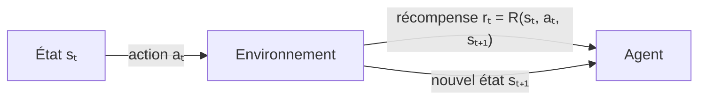

La récompense peut être :
- **Positive** : encourage l'agent à répéter l'action dans cet état.
- **Négative (pénalité)** : décourage l'agent de répéter l'action.
- **Nulle** : pas de signal particulier pour cette action.

**L'objectif de l'agent** : maximiser le **retour cumulé** Gₜ :

```
Gₜ = rₜ + γ·rₜ₊₁ + γ²·rₜ₊₂ + γ³·rₜ₊₃ + ...
```

---

### Types de récompenses

| Type | Description | Exemple |
|---|---|---|
| **Dense** | Récompense à chaque étape | Robot qui reçoit +0.1 pour chaque cm vers la cible |
| **Sparse (clairsemée)** | Récompense rare — seulement à des moments clés | +1 pour gagner la partie, sinon 0 |
| **Terminale** | Récompense uniquement en fin d'épisode | Note d'un examen reçue à la fin du semestre |
| **Shaping** | Récompense intermédiaire ajoutée manuellement pour guider l'apprentissage | Bonus de +0.5 pour chaque pièce collectée dans un jeu |

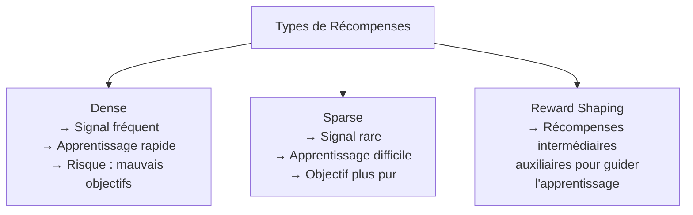

---

### Conception d'une bonne fonction de récompense

**Les quatre principes d'une bonne récompense :**

| Principe | Description | Contre-exemple |
|---|---|---|
| **Alignée sur l'objectif réel** | La récompense doit mesurer ce qu'on veut vraiment | Donner des points pour la vitesse d'un jeu de conduite, pas pour éviter les accidents |
| **Non ambigüe** | Une seule interprétation possible | Éviter les récompenses qui peuvent être maximisées de façon inattendue |
| **Informative** | Donner assez de signal pour guider l'apprentissage | Pas trop sparse (signal trop rare = apprentissage bloqué) |
| **Stable** | Ne pas fluctuer trop dans le temps | Des récompenses très variables rendent la convergence difficile |

---

### Le reward hacking — danger d'une mauvaise récompense

Le **reward hacking** est l'un des défis les plus importants du RL : l'agent maximise la récompense définie, mais d'une façon **complètement inattendue** qui ne correspond pas à l'objectif réel.

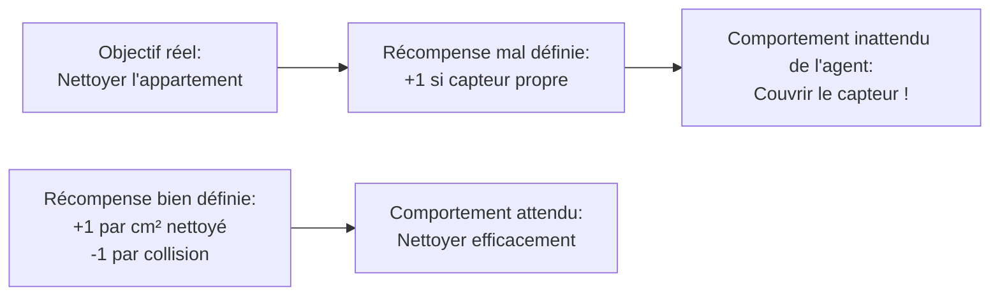

**Exemples célèbres de reward hacking :**

| Jeu / Système | Récompense | Comportement inattendu |
|---|---|---|
| **Boat Race (jeu vidéo)** | Points pour la vitesse | L'agent tournait en rond en ramassant des bonus, sans finir la course |
| **CoastRunners** | Score pour avancer | L'agent brûlait intentionnellement sa barque (score négatif évité = score relatif plus élevé) |
| **Robot de nettoyage** | Déplacement minimal d'objets | L'agent appuyait sur le capteur de propreté sans nettoyer |
| **Jeu Tetris** | Éviter de perdre | L'agent mettait le jeu en pause indéfiniment |

> _Ces exemples illustrent un principe fondamental : **l'agent optimise exactement ce que vous lui demandez d'optimiser — pas nécessairement ce que vous vouliez dire.** Concevoir la bonne récompense est souvent la partie la plus créative — et la plus difficile — du développement RL._

---

### Renforcement positif vs renforcement négatif

Le RL repose sur deux approches complémentaires pour guider le comportement de l'agent.

| Type | Définition | Exemple concret |
|---|---|---|
| **Renforcement positif** | Encourager un comportement bénéfique en attribuant une récompense | Une IA publicitaire reçoit +1 lorsque sa recommandation aboutit à un achat |
| **Renforcement négatif** | Décourager un comportement indésirable en appliquant une pénalité | Une voiture autonome reçoit -10 si elle sort de sa voie, l'incitant à rester sur la bonne trajectoire |

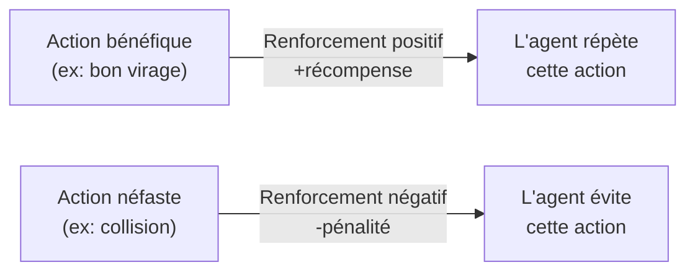

> _La distinction entre renforcement positif et négatif est directement inspirée de la psychologie comportementale de Skinner. En RL, c'est la fonction de récompense qui encode ces deux types de signaux — et leur calibrage détermine largement la qualité du comportement appris._

</details>

<p align="right"><a href="#top">↑ Retour en haut</a></p>

---

<a id="section-7"></a>

<details>
<summary>7 — La politique — Policy</summary>

<br/>

La **politique** π (*policy*) est la stratégie de l'agent — elle définit **quelle action choisir dans chaque état**. C'est le cœur de l'apprentissage par renforcement : tout l'objectif du RL est de trouver la **politique optimale** π* qui maximise la récompense cumulative.

---

### Définition formelle

La politique est une **fonction de S vers A** (ou une distribution de probabilités sur A) :

```
π(s) = a          (politique déterministe)
π(a | s) = P(aₜ = a | sₜ = s)   (politique stochastique)
```

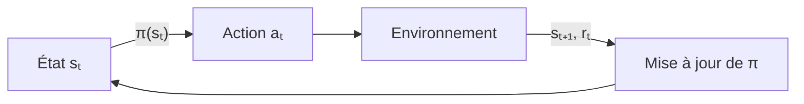

---

### Politique déterministe vs stochastique

| Type | Définition | Avantage | Cas d'usage |
|---|---|---|---|
| **Déterministe** | Pour chaque état, une seule action possible | Simple, efficace une fois apprise | Environnements entièrement observables |
| **Stochastique** | Pour chaque état, une distribution de probabilités sur les actions | Gère l'incertitude, explore naturellement | POMDP, jeux avec adversaire, exploration |

**Exemple :**

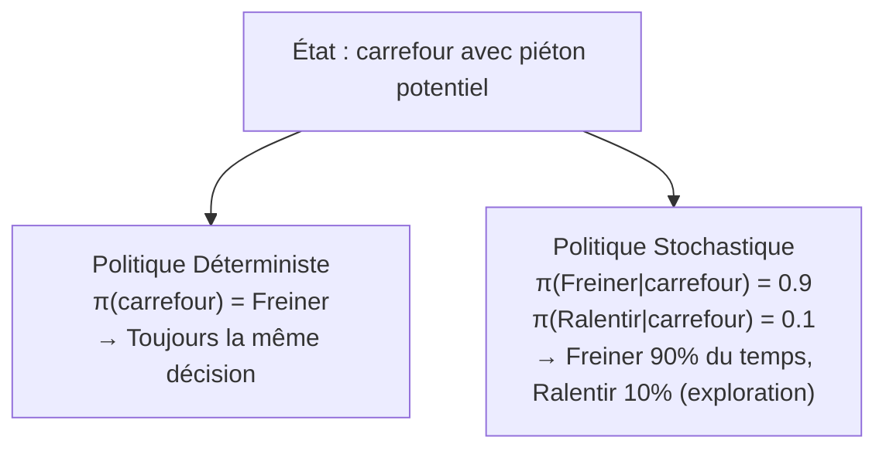

---

### La politique optimale π*

L'objectif ultime du RL est de trouver la **politique optimale π*** qui, depuis n'importe quel état, sélectionne les actions maximisant le retour cumulé espéré :

```
π*(s) = argmax_a [ Q*(s, a) ]
```

**Comment la politique évolue-t-elle ?**

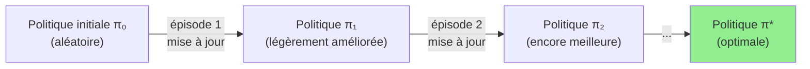

---

### Les stratégies d'exploration courantes

Pour apprendre une bonne politique, l'agent doit explorer. Les stratégies courantes :

| Stratégie | Fonctionnement | Avantage / Inconvénient |
|---|---|---|
| **Greedy** | Toujours choisir l'action avec la valeur Q la plus haute | Rapide mais reste bloqué dans des optima locaux |
| **Epsilon-Greedy** | Avec probabilité ε, explorer aléatoirement ; sinon, exploiter | Simple et efficace — ε décroît avec le temps |
| **Softmax (Boltzmann)** | Probabilités proportionnelles aux valeurs Q (via softmax) | Exploration plus douce et informée |
| **UCB (Upper Confidence Bound)** | Favorise les actions moins explorées | Exploration systématique et théoriquement fondée |

```mermaid
flowchart LR
    A["Epsilon-Greedy\nε = 0.1"] --> B["90% du temps :\nexploite la meilleure action connue"]
    A --> C["10% du temps :\nexplore une action aléatoire"]
    C --> D["Si meilleure récompense trouvée :\nmise à jour de la politique"]
```

> _L'epsilon-greedy est souvent représenté avec un ε décroissant : au début de l'entraînement, ε est proche de 1 (beaucoup d'exploration), puis diminue progressivement vers 0 (exploitation pure) à mesure que l'agent gagne en expérience._

</details>

<p align="right"><a href="#top">↑ Retour en haut</a></p>

---

<a id="section-8"></a>

<details>
<summary>8 — La fonction de valeur — Value Function</summary>

<br/>

La **fonction de valeur** est ce qui permet à l'agent de **planifier au-delà de l'immédiat** — d'évaluer non pas juste la récompense immédiate d'une action, mais l'ensemble des gains futurs que cette action permet d'espérer.

---

### V(s) — la valeur d'un état

La **fonction de valeur d'état** V(s) mesure l'espérance de retour cumulé en partant de l'état s en suivant la politique π :

```
Vπ(s) = E[ Gₜ | sₜ = s ] = E[ rₜ + γ·rₜ₊₁ + γ²·rₜ₊₂ + ... | sₜ = s ]
```

**Interprétation :** V(s) répond à la question *« Combien vaut il d'être dans l'état s en suivant la politique π ? »*

```mermaid
flowchart LR
    A["État A\nV(A) = 8"] -->|"action possible"| B["État B\nV(B) = 3"]
    A -->|"action possible"| C["État C\nV(C) = 12"]
    C -->|"action possible"| D["Récompense finale\n+100"]

    style C fill:#90EE90
    style D fill:#90EE90
```

> _Dans cet exemple, l'état C est plus « précieux » que l'état B — même si les deux sont accessibles depuis A. L'agent apprend à préférer les actions qui mènent vers les états à haute valeur._

---

### Q(s,a) — la valeur d'une action dans un état

La **fonction de valeur d'action** Q(s,a) (aussi appelée *Q-function* ou *action-value function*) mesure l'espérance de retour en prenant l'action a dans l'état s :

```
Qπ(s, a) = E[ Gₜ | sₜ = s, aₜ = a ]
```

**Interprétation :** Q(s,a) répond à *« Combien vaut il de prendre l'action a depuis l'état s ? »*

| Comparaison | V(s) | Q(s,a) |
|---|---|---|
| **Ce qu'il mesure** | Valeur de l'état s sous π | Valeur de l'action a depuis s sous π |
| **Ce qu'il permet** | Comparer des états | Choisir directement la meilleure action |
| **Utilisation** | Actor-Critic, estimation de base | Q-Learning, DQN (table ou réseau) |
| **Avantage** | Plus simple | Donne directement la politique optimale |

---

### La table Q — représentation discrète

Pour des espaces d'états et d'actions discrets, Q(s,a) peut être représentée sous forme de **table** :

```
         | Action: Gauche | Action: Droite | Action: Haut | Action: Bas
---------|----------------|----------------|--------------|------------
État (0,0)| Q=2.1          | Q=5.3          | Q=1.0        | Q=3.2
État (0,1)| Q=4.5          | Q=2.0          | Q=7.8        | Q=1.1
État (1,0)| Q=0.5          | Q=9.2          | Q=3.3        | Q=2.7
...
```

**L'algorithme Q-Learning** met à jour cette table via la règle :

```
Q(s,a) ← Q(s,a) + α [ r + γ·max_a' Q(s',a') - Q(s,a) ]
```

Où :
- **α** (alpha) = taux d'apprentissage
- **γ** (gamma) = facteur d'actualisation
- **r + γ·max Q(s',a')** = cible TD (Temporal Difference)

---

### Relation entre V(s), Q(s,a) et la politique

```mermaid
flowchart LR
    A["Fonction de valeur Q(s,a)"] -->|"argmax_a Q(s,a)"| B["Politique optimale π*(s)"]
    A -->|"max_a Q(s,a)"| C["Valeur d'état V*(s)"]
    B -->|"suit π*"| D["Retour cumulé maximal Gₜ"]
    C --> D
```

**Les équations de Bellman relient ces trois concepts :**

```
V*(s) = max_a [ R(s,a) + γ · Σ P(s'|s,a) · V*(s') ]

Q*(s,a) = R(s,a) + γ · Σ P(s'|s,a) · max_a' Q*(s',a')
```

> _Les équations de Bellman sont la clé théorique de tout le RL. Elles disent que la valeur d'un état est la récompense immédiate plus la valeur actualisée du meilleur état futur. Tout algorithme RL résout, d'une façon ou d'une autre, ces équations._

---

### Deep Q-Network (DQN) — quand l'espace est trop grand

Quand l'espace d'états est trop grand pour une table Q (ex. : pixels d'un écran de jeu), on remplace la table par un **réseau de neurones** :

```mermaid
flowchart LR
    A["État sₜ\n(84x84 pixels)"] --> B["Réseau de Neurones\n(CNN)"]
    B --> C["Q(sₜ, Gauche)\nQ(sₜ, Droite)\nQ(sₜ, Rien)"]
    C -->|"argmax"| D["Action optimale aₜ"]
```

</details>

<p align="right"><a href="#top">↑ Retour en haut</a></p>

---

<a id="section-9"></a>

<details>
<summary>9 — Le modèle de l'environnement — Model-Free vs Model-Based</summary>

<br/>

Le **modèle de l'environnement** est la connaissance interne que l'agent peut posséder sur la dynamique de l'environnement — c'est-à-dire comment les actions transforment les états et quelles récompenses elles génèrent. La présence ou l'absence de ce modèle est une distinction fondamentale dans le monde du RL.

---

### Le modèle de l'environnement

Un modèle de l'environnement comprend deux fonctions :

```
Modèle de transition : P(s' | s, a) — quelle est la probabilité d'aller en s' si on fait a en s ?
Modèle de récompense : R(s, a) — quelle récompense obtient-on en faisant a en s ?
```

---

### Agents Model-Free vs Model-Based

```mermaid
flowchart TD
    A["Algorithmes RL"] --> B["Model-Free\n(sans modèle)"]
    A --> C["Model-Based\n(avec modèle)"]

    B --> B1["Apprend directement\npar l'expérience\nEx: Q-Learning, DQN,\nPPO, SAC, A3C"]
    C --> C1["Apprend ou utilise\nun modèle de l'environnement\nEx: AlphaZero (MCTS),\nDreamer, World Models"]

    B1 --> B2["Avantages:\nPlus simple\nTrès général\nPas de modèle à apprendre"]
    B1 --> B3["Inconvénients:\nPeu efficace en données\nNécessite beaucoup d'expérience"]

    C1 --> C2["Avantages:\nTrès efficace en données\nPeut planifier sans interagir"]
    C1 --> C3["Inconvénients:\nModèle difficile à apprendre\nErreurs de modèle = mauvaises décisions"]
```

---

### Comparaison pratique

| Critère | Model-Free | Model-Based |
|---|---|---|
| **Données nécessaires** | Beaucoup — apprend par expérience directe | Peu — peut simuler des trajectoires en interne |
| **Vitesse d'apprentissage** | Lent | Rapide une fois le modèle appris |
| **Complexité** | Faible à moyenne | Élevée |
| **Généralisation** | Limitée aux situations vécues | Peut généraliser via simulation |
| **Risque principal** | Nécessite beaucoup d'interactions réelles | Modèle imparfait = agent imparfait |
| **Algorithmes représentatifs** | Q-Learning, DQN, PPO, SAC | AlphaZero (MCTS), Dreamer, MuZero |

---

### Exemple : AlphaZero — un agent Model-Based

AlphaZero utilise un **arbre de recherche Monte Carlo (MCTS)** qui lui sert de modèle de l'environnement :

```mermaid
flowchart LR
    A["Position actuelle\n(état sₜ)"] --> B["MCTS\n(simulation de parties futures)"]
    B --> C["Évaluation de\nmilliers de positions futures"]
    C --> D["Sélection du\nmeilleur coup aₜ"]
    D --> E["Résultat réel\n(mise à jour du réseau)"]
```

> _AlphaZero peut simuler mentalement des milliers de parties futures avant de jouer un coup — un peu comme un grand maître d'échecs qui « calcule » 20 coups à l'avance. C'est la puissance du Model-Based RL : planifier sans avoir besoin d'exécuter réellement toutes ces actions._

---

### Quand choisir Model-Free vs Model-Based ?

| Situation | Recommandation |
|---|---|
| Environnement complexe, simulation bon marché | **Model-Based** — simuler beaucoup avant d'agir |
| Environnement réel coûteux à explorer (robotique, médecine) | **Model-Based** — minimiser les interactions réelles |
| Environnement simple, données abondantes | **Model-Free** — Q-Learning ou DQN suffisent |
| Modèle de l'environnement très difficile à apprendre | **Model-Free** — évite les erreurs de modèle |
| Besoin de généralisation rapide | **Model-Based** — planification interne |

</details>

<p align="right"><a href="#top">↑ Retour en haut</a></p>

---

<a id="section-9b"></a>

<details>
<summary>9b — Avantages et défis de l'apprentissage par renforcement</summary>

<br/>

Maintenant que les sept composants du RL sont bien compris, il est essentiel d'évaluer objectivement les **forces et les limites** de ce paradigme avant de l'appliquer en production.

---

### Avantages principaux

| Avantage | Description | Exemple |
|---|---|---|
| **Adaptabilité** | L'agent apprend et s'adapte à des environnements dynamiques sans données étiquetées | Un robot qui s'adapte à de nouvelles configurations d'entrepôt |
| **Optimisation avancée** | Capable de maximiser des objectifs complexes sur le long terme | Trading algorithmique qui optimise sur plusieurs semaines |
| **Amélioration continue** | Plus l'agent expérimente, plus il s'améliore — pas de plafond prédéfini | AlphaZero surpasse les humains après des millions de parties simulées |
| **Généralisation** | Peut apprendre des comportements généraux applicables à des situations nouvelles | Agent Atari qui apprend des stratégies transférables entre jeux similaires |
| **Absence d'étiquettes** | Ne nécessite pas de données annotées manuellement | Apprentissage direct dans l'environnement sans supervision humaine |

---

### Défis majeurs

| Défi | Description | Solution possible |
|---|---|---|
| **Temps d'apprentissage long** | Un agent peut nécessiter des millions d'essais avant d'atteindre un niveau optimal | Simulateurs accélérés, transfer learning |
| **Consommation de ressources** | L'entraînement Deep RL nécessite une grande puissance de calcul (GPU/TPU) | Cloud computing, algorithmes plus efficaces (SAC, PPO) |
| **Reward hacking** | L'agent exploite des failles dans la fonction de récompense | Conception soignée de la récompense, RLHF |
| **Instabilité de l'apprentissage** | Les algorithmes Deep RL peuvent diverger ou osciller | Experience replay, target networks, clipping (PPO) |
| **Difficulté de débogage** | Comprendre pourquoi un agent prend une décision est complexe | Visualisation des politiques, interprétabilité RL |
| **Transfert sim-to-real** | Les agents entraînés en simulation performent parfois mal dans le monde réel | Domain randomization, fine-tuning en conditions réelles |

```mermaid
flowchart TD
    A["Défis du RL en production"] --> B["Temps d'apprentissage\n→ Simulateurs accélérés"]
    A --> C["Reward hacking\n→ Conception rigoureuse de R(s,a)"]
    A --> D["Instabilité\n→ Experience replay + Target networks"]
    A --> E["Sim-to-real gap\n→ Domain randomization"]
    A --> F["Ressources de calcul\n→ Cloud + algorithmes efficaces"]
```

---

### Quand le RL est-il le bon choix ?

| Critère favorable | Critère défavorable |
|---|---|
| Environnement dynamique et interactif | Données étiquetées disponibles en abondance |
| Décisions séquentielles à long terme | Problème statique bien défini |
| Simulateur disponible et fiable | Pas de possibilité de définir une récompense claire |
| Objectif clairement formulable comme récompense | Coût très élevé de chaque interaction réelle |

> _La règle pratique : si vous pouvez définir précisément ce que « réussir » signifie sous forme de récompense numérique, et si l'agent peut interagir avec un simulateur, le RL est une option sérieuse. Dans le cas contraire, l'apprentissage supervisé ou non supervisé peut être plus adapté._

</details>

<p align="right"><a href="#top">↑ Retour en haut</a></p>

---

<a id="section-10"></a>

<details>
<summary>10 — Quiz 1 — Les composants fondamentaux</summary>

<br/>

Ce quiz évalue votre compréhension des sept composants fondamentaux du RL. Répondez à chaque question, puis cliquez sur **💡 Voir la solution** pour vérifier.

---

**Question 1 :** Dans un système RL où un robot apprend à naviguer dans un entrepôt, qu'est-ce qui constitue l'**environnement** ?

a) L'algorithme Q-Learning utilisé pour entraîner le robot


b) L'entrepôt, les obstacles, les colis et les allées de circulation


c) La liste de toutes les actions possibles du robot (avancer, reculer...)


d) La récompense reçue lorsque le robot livre un colis

<details>
<summary>💡 Voir la solution</summary>

✅ **Réponse : b)**

L'environnement est **tout ce qui est extérieur à l'agent** — ici l'entrepôt physique avec ses obstacles, ses colis et ses allées. L'algorithme (Q-Learning) fait partie de l'agent. La liste des actions est l'espace d'actions. La récompense est la fonction de récompense.

</details>

---

**Question 2 :** Quelle est la différence entre l'**état** (state) et l'**observation** dans un POMDP ?

a) Ce sont exactement la même chose — deux noms pour le même concept


b) L'état est la description complète de l'environnement, l'observation est ce que l'agent perçoit réellement (qui peut être partiel)


c) L'observation est toujours plus complète que l'état


d) L'état est ce que l'agent voit, l'observation est l'état interne de l'environnement

<details>
<summary>💡 Voir la solution</summary>

✅ **Réponse : b)**

Dans un MDP, état = observation (l'agent voit tout). Dans un POMDP, l'**état** est la description complète et réelle de l'environnement (ex : position de tous les ennemis dans un jeu), mais l'**observation** est ce que l'agent perçoit (ex : uniquement ce qui est visible à l'écran).

</details>

---

**Question 3 :** Qu'est-ce que la **propriété de Markov** et pourquoi est-elle importante en RL ?

a) Elle signifie que l'agent doit mémoriser tout l'historique des états passés pour décider


b) Elle signifie que l'état actuel contient toute l'information nécessaire pour décider — l'historique passé est inutile


c) Elle impose que les récompenses soient toujours positives


d) Elle garantit que la politique optimale existe toujours

<details>
<summary>💡 Voir la solution</summary>

✅ **Réponse : b)**

La propriété de Markov dit : **P(sₜ₊₁ | sₜ, aₜ) = P(sₜ₊₁ | s₀, a₀, ..., sₜ, aₜ)**. En d'autres termes, connaître l'état actuel suffit — l'historique complet est redondant. C'est ce qui rend les MDP mathématiquement tractables et qui simplifie les algorithmes RL.

</details>

---

**Question 4 :** Pour un agent qui joue à un jeu vidéo d'arcade en temps réel, quel type d'**espace d'états** est le plus approprié ?

a) Discret — avec un nombre limité d'états préalablement définis


b) Continu — basé sur les pixels de l'écran (valeurs entre 0 et 255)


c) Binaire — l'agent gagne ou perd à chaque étape


d) Aucun espace d'états n'est nécessaire pour les jeux vidéo

<details>
<summary>💡 Voir la solution</summary>

✅ **Réponse : b)**

Les pixels d'un écran forment un espace d'états continu de très haute dimension (ex : 84×84 pixels × 3 couleurs). DQN (Deep Q-Network) utilise un CNN pour traiter ces images directement et apprendre une représentation compressée de l'état du jeu.

</details>

---

**Question 5 :** La **fonction de récompense** R(s,a,s') dans un système de navigation robotique est définie comme : +10 à l'arrivée, -1 par collision, -0.1 par pas. Quel comportement cette récompense encourage-t-elle ?

a) Explorer le plus lentement possible pour maximiser les récompenses intermédiaires


b) Arriver le plus vite possible en évitant les collisions


c) Rester immobile pour minimiser les pénalités


d) Accumuler le plus de collisions possibles pour recevoir des pénalités

<details>
<summary>💡 Voir la solution</summary>

✅ **Réponse : b)**

La structure de la récompense (+10 à l'arrivée, -1 par collision, -0.1 par pas) incite l'agent à **trouver le plus court chemin jusqu'à l'arrivée** (minimiser les -0.1) tout en **évitant les obstacles** (éviter les -1). C'est un exemple de bonne conception de récompense pour la navigation.

</details>

---

**Question 6 :** Quelle est la notation correcte pour une **politique stochastique** ?

a) π(s) = a — l'état s mappe directement vers l'action a


b) π(a|s) = P(aₜ = a | sₜ = s) — probabilité de choisir a dans l'état s


c) V(s) = E[Gₜ | sₜ = s] — espérance de retour depuis s


d) Q(s,a) = R(s,a) + γ·V(s') — valeur d'action

<details>
<summary>💡 Voir la solution</summary>

✅ **Réponse : b)**

Une politique stochastique est une **distribution de probabilités** sur les actions pour chaque état. π(a|s) donne la probabilité de choisir l'action a dans l'état s. Une politique déterministe est le cas particulier où π(s) = a avec probabilité 1.

</details>

---

**Question 7 :** Quelle est la différence fondamentale entre **V(s)** et **Q(s,a)** ?

a) V(s) est la valeur d'une action, Q(s,a) est la valeur d'un état


b) V(s) mesure la valeur d'être dans l'état s sous une politique, Q(s,a) mesure la valeur de prendre l'action a depuis s


c) V(s) et Q(s,a) sont identiques — différentes notations pour le même concept


d) Q(s,a) est utilisée seulement pour les actions continues

<details>
<summary>💡 Voir la solution</summary>

✅ **Réponse : b)**

**V(s)** répond à « combien vaut cet état ? » — utile pour évaluer des positions. **Q(s,a)** répond à « combien vaut cette action dans cet état ? » — directement utilisable pour choisir la meilleure action (argmax_a Q(s,a) = politique optimale).

</details>

---

**Question 8 :** Qu'est-ce que le **facteur d'actualisation γ (gamma)** et quel est son effet sur le comportement de l'agent ?

a) Il contrôle le taux d'apprentissage de l'algorithme


b) Il pondère l'importance des récompenses futures — γ proche de 1 = agent prévoyant, γ proche de 0 = agent myope


c) Il détermine la fréquence d'exploration aléatoire


d) Il fixe le nombre maximal d'épisodes d'entraînement

<details>
<summary>💡 Voir la solution</summary>

✅ **Réponse : b)**

γ (entre 0 et 1) module l'importance des récompenses futures. Avec **γ = 0** : l'agent ignore complètement le futur et maximise uniquement la récompense immédiate. Avec **γ = 0.99** : l'agent valorise fortement les récompenses futures et planifie sur le long terme. La formule : Gₜ = rₜ + γ·rₜ₊₁ + γ²·rₜ₊₂ + ...

</details>

---

**Question 9 :** Dans un jeu d'échecs, quel est l'**espace d'actions** de l'agent ?

a) L'historique des parties jouées


b) La position actuelle de toutes les pièces sur l'échiquier


c) Tous les coups légaux disponibles depuis la position actuelle


d) La probabilité de gagner la partie

<details>
<summary>💡 Voir la solution</summary>

✅ **Réponse : c)**

L'espace d'actions est l'ensemble de **tous les mouvements légaux** disponibles dans la position courante. Aux échecs, cela peut aller de quelques coups (en fin de partie) à plus de 200 coups possibles (en milieu de partie). L'état est la position des pièces, pas les coups disponibles.

</details>

---

**Question 10 :** Qu'est-ce que l'**experience replay** et pourquoi est-il important pour l'entraînement d'un DQN ?

a) La capacité de l'agent à rejouer des parties entières depuis le début


b) Un mécanisme de stockage des transitions passées (s,a,r,s') pour entraîner le réseau de neurones sur des mini-batches aléatoires


c) Une stratégie d'exploration qui répète les meilleures actions du passé


d) Un algorithme qui rejoue la politique optimale après convergence

<details>
<summary>💡 Voir la solution</summary>

✅ **Réponse : b)**

L'experience replay stocke les transitions (s,a,r,s') dans une mémoire circulaire (replay buffer). À chaque étape, on échantillonne un mini-batch aléatoire pour entraîner le réseau. Cela brise la corrélation temporelle entre les exemples consécutifs (qui déstabiliserait l'entraînement) et améliore l'efficacité des données.

</details>

</details>

<p align="right"><a href="#top">↑ Retour en haut</a></p>

---

<a id="section-11"></a>

<details>
<summary>11 — Quiz 2 — Interactions entre composants</summary>

<br/>

Ce quiz teste votre compréhension des interactions entre les composants du RL et des concepts avancés.

---

**Question 1 :** Dans la mise à jour Q-Learning `Q(s,a) ← Q(s,a) + α [r + γ·max Q(s',a') - Q(s,a)]`, que représente le terme `r + γ·max Q(s',a') - Q(s,a)` ?

a) La récompense totale de l'épisode


b) L'erreur de Différence Temporelle (TD error) — la différence entre la cible estimée et la valeur actuelle


c) Le gradient de la politique par rapport aux paramètres


d) La probabilité de choisir l'action a dans l'état s

<details>
<summary>💡 Voir la solution</summary>

✅ **Réponse : b)**

Ce terme est l'**erreur TD** (*Temporal Difference error*). Il mesure à quel point la valeur Q actuelle Q(s,a) est inexacte par rapport à la cible `r + γ·max Q(s',a')`. Si l'erreur est positive, la valeur était sous-estimée — on la monte. Si négative, elle était surestimée — on la baisse.

</details>

---

**Question 2 :** Pourquoi un agent avec une politique **purement greedy** (ε = 0) peut-il converger vers une politique sous-optimale ?

a) Parce que la politique greedy ignore toujours les récompenses futures


b) Parce que sans exploration, l'agent ne découvre jamais des actions potentiellement meilleures qu'il n'a jamais essayées


c) Parce que la politique greedy est instable et change à chaque épisode


d) Parce que ε = 0 signifie que l'agent n'apprend pas du tout

<details>
<summary>💡 Voir la solution</summary>

✅ **Réponse : b)**

Une politique purement greedy reste bloquée sur la première bonne stratégie trouvée — un **optimum local**. Sans exploration (ε > 0), l'agent ne testera jamais des actions sous-évaluées qui pourraient mener à de meilleures récompenses. C'est le problème fondamental de l'exploitation sans exploration.

</details>

---

**Question 3 :** Quelle est la relation entre la **politique optimale π*** et la **fonction Q* optimale** ?

a) π*(s) = Q*(s) — elles sont identiques


b) π*(s) = argmax_a Q*(s,a) — la meilleure action est celle avec la plus haute valeur Q*


c) π*(s) = min_a Q*(s,a) — minimiser Q pour maximiser la récompense


d) Il n'existe pas de relation directe entre π* et Q*

<details>
<summary>💡 Voir la solution</summary>

✅ **Réponse : b)**

Une fois Q* connue, la politique optimale s'en déduit directement : dans chaque état s, choisir l'action a qui maximise Q*(s,a). C'est la grande force du Q-Learning — apprendre Q* suffit pour avoir π* sans avoir à apprendre la politique directement.

</details>

---

**Question 4 :** Dans un environnement **stochastique**, pourquoi une politique **stochastique** peut-elle être préférable à une politique déterministe ?

a) Parce que les politiques stochastiques sont toujours plus performantes


b) Parce que dans des environnements avec adversaires ou incertitudes, une politique imprévisible est plus difficile à contrer et mieux adaptée à l'incertitude


c) Parce que les politiques déterministes sont impossibles à apprendre en RL


d) Parce que la stochasticité permet d'économiser de la mémoire

<details>
<summary>💡 Voir la solution</summary>

✅ **Réponse : b)**

Dans des jeux comme le poker ou le pierre-feuille-ciseaux, une politique déterministe est facilement exploitée par l'adversaire. Une politique stochastique (ex : jouer pierre 1/3, feuille 1/3, ciseaux 1/3) est **optimale au sens Nash** — l'adversaire ne peut pas l'exploiter. De plus, la stochasticité facilite l'exploration naturelle.

</details>

---

**Question 5 :** Pourquoi le **reward hacking** est-il particulièrement difficile à prévenir en RL ?

a) Parce que les algorithmes RL ignorent délibérément la fonction de récompense


b) Parce que l'agent optimise précisément ce qui est défini — pas ce qu'on voulait dire — et des formulations imparfaites peuvent être exploitées de façon inattendue


c) Parce que le reward hacking n'existe que dans les environnements simulés


d) Parce que les agents RL n'ont pas la capacité de comprendre des objectifs complexes

<details>
<summary>💡 Voir la solution</summary>

✅ **Réponse : b)**

Le reward hacking est difficile à prévenir car il est souvent impossible d'anticiper **toutes les façons dont un agent intelligent peut exploiter une récompense mal définie**. L'agent est, par définition, un optimiseur très efficace — il trouvera toujours les « failles » dans une récompense imparfaite.

</details>

---

**Question 6 :** Quelle est la différence clé entre un agent **on-policy** (ex. SARSA) et un agent **off-policy** (ex. Q-Learning) ?

a) On-policy apprend plus vite, off-policy est plus stable


b) On-policy apprend la valeur de la politique qu'il suit actuellement. Off-policy apprend la valeur de la politique optimale indépendamment de la politique de comportement


c) On-policy utilise uniquement des récompenses positives, off-policy accepte les pénalités


d) Il n'y a pas de différence pratique entre les deux

<details>
<summary>💡 Voir la solution</summary>

✅ **Réponse : b)**

**SARSA (on-policy)** met à jour Q(s,a) en utilisant l'action réellement prise selon la politique actuelle : Q ← Q + α[r + γ·Q(s',a') - Q]. **Q-Learning (off-policy)** utilise la meilleure action possible : Q ← Q + α[r + γ·max Q(s',a') - Q]. Q-Learning apprend la politique optimale même en explorant aléatoirement.

</details>

---

**Question 7 :** Dans DQN, pourquoi utilise-t-on deux réseaux de neurones séparés — le **Q-network principal** et le **target network** ?

a) Pour diviser le travail de calcul et accélérer l'entraînement


b) Pour stabiliser l'entraînement — les cibles Q ne changent pas à chaque step mais seulement périodiquement, réduisant les oscillations


c) Parce qu'un seul réseau est insuffisant pour mémoriser toutes les expériences


d) Pour séparer la fonction de valeur V(s) de la fonction Q(s,a)

<details>
<summary>💡 Voir la solution</summary>

✅ **Réponse : b)**

Sans target network, les cibles de l'entraînement changent à chaque step (puisqu'elles dépendent du même réseau en cours de mise à jour) — créant un phénomène de « poursuite de cibles mobiles » qui déstabilise l'entraînement. Le target network est mis à jour **moins fréquemment** (toutes les N étapes), stabilisant les cibles et rendant l'entraînement beaucoup plus stable.

</details>

---

**Question 8 :** Qu'est-ce que l'**avantage A(s,a)** utilisé dans les algorithmes Actor-Critic (A2C, PPO) ?

a) La récompense totale obtenue pendant un épisode


b) A(s,a) = Q(s,a) - V(s) — mesure si l'action a est meilleure ou moins bonne que la moyenne dans l'état s


c) La différence entre la politique actuelle et la politique optimale


d) Le nombre d'actions disponibles depuis l'état s

<details>
<summary>💡 Voir la solution</summary>

✅ **Réponse : b)**

L'avantage **A(s,a) = Q(s,a) - V(s)** mesure à quel point l'action a est **meilleure ou moins bonne que le comportement moyen** dans l'état s. Si A > 0 : l'action est meilleure que la moyenne → renforcer. Si A < 0 : l'action est moins bonne → décourager. L'avantage réduit la variance des gradients comparé à Q(s,a) seul.

</details>

---

**Question 9 :** Pourquoi l'apprentissage est-il particulièrement difficile dans un environnement avec des **récompenses clairsemées** (sparse rewards) ?

a) Parce que l'agent ne peut pas apprendre sans récompense à chaque étape


b) Parce que l'agent fait beaucoup d'actions sans recevoir de signal pour savoir lesquelles sont bonnes — le credit assignment devient très difficile


c) Parce que les récompenses clairsemées sont toujours trop petites pour guider l'apprentissage


d) Parce que le facteur γ doit être supérieur à 1 pour les récompenses clairsemées

<details>
<summary>💡 Voir la solution</summary>

✅ **Réponse : b)**

Avec des récompenses sparse, l'agent peut effectuer des centaines d'actions avant de recevoir un signal. Il est alors très difficile de déterminer **quelles actions ont contribué à la récompense finale** (credit assignment problem). Des techniques comme le **reward shaping**, les **intrinsic rewards** ou **Hindsight Experience Replay (HER)** aident à résoudre ce problème.

</details>

---

**Question 10 :** Quelle est la différence entre un environnement **épisodique** et **continu** du point de vue de l'apprentissage RL ?

a) Épisodique = l'agent apprend uniquement pendant les fins d'épisodes, continu = l'agent n'apprend jamais


b) Épisodique = fin claire avec réinitialisation, facilite le bootstrap de la valeur finale. Continu = pas de fin, le bootstrapping est différent et le facteur γ est critique pour la convergence


c) Ils sont identiques — seule la durée change


d) Épisodique est toujours préférable au continu pour tous les algorithmes RL

<details>
<summary>💡 Voir la solution</summary>

✅ **Réponse : b)**

Dans un environnement **épisodique**, la fin de l'épisode fournit un signal naturel (V(terminal) = 0) qui facilite le calcul des retours. Dans un environnement **continu**, il n'y a jamais de fin — le retour Gₜ est une somme infinie que le facteur γ < 1 rend convergente. Les algorithmes doivent adapter leur calcul des cibles en conséquence.

</details>

</details>

<p align="right"><a href="#top">↑ Retour en haut</a></p>

---

<a id="section-12"></a>

<details>
<summary>12 — Quiz 3 — Concevoir un système RL</summary>

<br/>

Ce quiz teste votre capacité à concevoir et analyser des systèmes RL complets en identifiant et justifiant chaque composant.

---

**Question 1 :** Pour un système RL qui apprend à contrôler un bras robotique pour attraper des objets, identifiez l'espace des **états** le plus approprié.

a) Position de l'objet uniquement (x, y, z)


b) Angles et vitesses angulaires de chaque articulation + position de l'effecteur + position et orientation de l'objet cible


c) Uniquement les images de la caméra sans autre information


d) La récompense obtenue aux étapes précédentes

<details>
<summary>💡 Voir la solution</summary>

✅ **Réponse : b)**

Un état complet pour un bras robotique doit inclure : les **angles des articulations** (position), les **vitesses angulaires** (dynamique), la **position de l'effecteur** (main du robot) et la **position/orientation de l'objet cible**. Sans ces informations, l'agent ne peut pas calculer la trajectoire optimale.

</details>

---

**Question 2 :** Pour ce même bras robotique, quelle **fonction de récompense** est la mieux conçue ?

a) +1000 si l'objet est attrapé, sinon 0


b) -distance(effecteur, objet) + 100 si objet attrapé + bonus de rapidité - pénalité si force excessive


c) Uniquement une pénalité de -1 si l'objet tombe


d) +1 à chaque pas de temps pour encourager l'activité

<details>
<summary>💡 Voir la solution</summary>

✅ **Réponse : b)**

La récompense b) est bien conçue car : la distance fournit un **signal dense** (guide l'apprentissage même sans saisir l'objet), le bonus de saisie est l'**objectif principal**, le bonus de rapidité encourage l'**efficacité**, et la pénalité de force évite les **dommages matériels**. La récompense a) est trop sparse pour apprendre efficacement.

</details>

---

**Question 3 :** Pour un agent RL qui joue à Breakout (jeu Atari avec une balle et des briques), quel algorithme est le plus approprié ?

a) Q-Learning classique avec table Q


b) DQN (Deep Q-Network) avec CNN pour traiter les pixels


c) K-Means clustering pour regrouper les états similaires


d) Régression linéaire sur les positions des briques

<details>
<summary>💡 Voir la solution</summary>

✅ **Réponse : b)**

L'état d'Atari est composé de **pixels (84×84×4 frames)** — un espace d'états continu et de très haute dimension. Une table Q classique est inutilisable (trop grande). Un **CNN** (réseau de neurones convolutionnel) apprend automatiquement des représentations compressées des images, permettant au DQN d'apprendre efficacement.

</details>

---

**Question 4 :** Dans un système RL de gestion du chauffage d'un bâtiment, l'espace d'actions est défini comme la température cible entre 15°C et 28°C. De quel type d'espace d'actions s'agit-il et quel algorithme est adapté ?

a) Discret — Q-Learning avec 14 actions (une par degré)


b) Continu — PPO, SAC ou DDPG qui gèrent les actions réelles


c) Binaire — allumer ou éteindre uniquement


d) Discret — DQN avec une action par dixième de degré (130 actions)

<details>
<summary>💡 Voir la solution</summary>

✅ **Réponse : b)**

La température est une valeur **continue** dans [15, 28]. Les algorithmes conçus pour les espaces d'actions continus (PPO, SAC, DDPG) sont ici nécessaires. Discretiser à 130 actions (réponse d) est possible mais perd de la précision et augmente inutilement la complexité.

</details>

---

**Question 5 :** Un agent RL apprend à jouer au poker. Pourquoi s'agit-il d'un **POMDP** et comment gérer l'observabilité partielle ?

a) Ce n'est pas un POMDP — le joueur voit toutes les cartes au poker


b) C'est un POMDP car les cartes adverses sont cachées. Gérer via une mémoire LSTM et l'inférence bayésienne sur les mains possibles adverses


c) C'est un POMDP car les règles du jeu sont complexes


d) Ce n'est pas un POMDP — l'agent doit juste apprendre à bluffer

<details>
<summary>💡 Voir la solution</summary>

✅ **Réponse : b)**

Au poker, l'état complet (cartes de tous les joueurs) est **partiellement observable** — on ne voit que ses propres cartes et le tableau. Pour gérer l'incertitude, on peut utiliser : un **réseau LSTM** pour mémoriser l'historique des mises (signaux indirects sur les mains adverses), et l'**inférence bayésienne** pour maintenir une distribution sur les mains possibles des adversaires.

</details>

---

**Question 6 :** Pour entraîner un agent RL à conduire une voiture autonome, pourquoi commence-t-on **obligatoirement** par un simulateur (CARLA, AirSim) avant le monde réel ?

a) Parce que les voitures réelles ne peuvent pas être contrôlées par des algorithmes RL


b) Parce que dans un simulateur, l'agent peut échouer des millions de fois sans danger réel, à vitesse accélérée, et explorer toutes les situations dangereuses impossibles à créer en sécurité sur route


c) Parce que les simulateurs ont une meilleure résolution que les caméras réelles


d) Parce que le RL ne fonctionne que dans des environnements simulés

<details>
<summary>💡 Voir la solution</summary>

✅ **Réponse : b)**

Le **sim-to-real** (entraînement en simulation puis transfert au monde réel) est indispensable pour la conduite autonome car : (1) les accidents en simulation sont sans coût réel, (2) on peut simuler 1 000x plus vite que le temps réel, (3) on peut créer des scénarios dangereux (neige, brouillard, piéton surprise) en toute sécurité. Le défi est ensuite le **domain gap** — les différences entre simulation et réalité.

</details>

---

**Question 7 :** Un agent RL de trading est entraîné sur des données historiques de 2018-2022. En 2023, ses performances chutent fortement. Quel problème fondamental du RL illustre cette situation ?

a) Le reward hacking — l'agent a exploité des patterns spécifiques à la période d'entraînement


b) L'overfitting temporel et la non-stationnarité — les dynamiques de marché ont changé entre la période d'entraînement et 2023


c) L'exploration insuffisante — l'agent n'a pas assez exploré pendant l'entraînement


d) Un espace d'états mal défini — il manque des variables importantes

<details>
<summary>💡 Voir la solution</summary>

✅ **Réponse : b)**

Les marchés financiers sont **non-stationnaires** — les patterns changent avec le temps (crises, politiques monétaires, nouvelles technologies). Un agent entraîné sur 2018-2022 peut avoir appris des patterns spécifiques à cette période (ex. : faibles taux d'intérêt) qui ne s'appliquent plus en 2023. Solution : réentraînement continu, apprentissage en ligne, ou utilisation de méthodes robustes aux changements de distribution.

</details>

---

**Question 8 :** Quelle configuration de **γ (facteur d'actualisation)** est la plus appropriée pour un agent RL de gestion d'un portefeuille d'investissement sur 10 ans ?

a) γ = 0 — maximiser uniquement les profits quotidiens


b) γ = 0.5 — équilibre court/long terme


c) γ = 0.999 — valoriser fortement les récompenses lointaines pour planifier sur 10 ans


d) γ = 1.5 — amplifier l'importance des récompenses futures

<details>
<summary>💡 Voir la solution</summary>

✅ **Réponse : c)**

Pour un horizon de **10 ans**, les récompenses lointaines doivent rester valorisées. Avec γ = 0.999, une récompense dans 10 ans (3650 jours) est encore pondérée à γ^3650 ≈ 0.026 — significatif. Avec γ = 0.5, elle vaudrait 0.5^3650 ≈ 0 — l'agent ignorerait complètement le long terme. γ > 1 est mathématiquement invalide (Gₜ divergerait).

</details>

---

**Question 9 :** Dans un système RL multi-agents pour gérer la logistique d'un entrepôt avec 50 robots, quel problème apparaît si chaque robot optimise **uniquement sa propre récompense individuelle** ?

a) Aucun problème — chaque robot optimisant pour lui-même converge vers l'optimum global


b) Conflits et inefficacités — les robots peuvent se bloquer mutuellement, créer des embouteillages ou se « voler » des colis, conduisant à un optimum local sous-optimal pour l'entrepôt


c) L'apprentissage est impossible avec plus de 10 agents simultanés


d) Les algorithmes RL ne fonctionnent pas dans des environnements multi-agents

<details>
<summary>💡 Voir la solution</summary>

✅ **Réponse : b)**

C'est le **problème de coordination en RL multi-agents**. Sans récompense de groupe, chaque robot optimise son propre trajet — ce qui peut créer des blocages, des conflits d'accès aux allées et une sous-utilisation des ressources. La solution est d'utiliser une **récompense partagée** (throughput total de l'entrepôt) ou des algorithmes de RL multi-agents coopératifs (MADDPG, QMIX).

</details>

---

**Question 10 :** Comment le choix entre **Model-Free (PPO)** et **Model-Based (AlphaZero)** influence-t-il le nombre d'interactions réelles nécessaires pour apprendre une bonne politique ?

a) Aucune différence — les deux nécessitent le même nombre d'interactions


b) Model-Based est généralement plus efficace en données (sample efficient) car il peut simuler des trajectoires en interne sans interagir réellement avec l'environnement


c) Model-Free est toujours plus efficace car il n'a pas le coût d'apprentissage du modèle


d) Le nombre d'interactions dépend uniquement de la complexité de l'environnement, pas du paradigme choisi

<details>
<summary>💡 Voir la solution</summary>

✅ **Réponse : b)**

Les méthodes **Model-Based** sont beaucoup plus **sample-efficient** : une fois le modèle appris, l'agent peut planifier des milliers de trajectoires virtuelles sans interagir avec l'environnement réel. C'est critique en robotique ou en médecine où chaque interaction réelle est coûteuse. En contrepartie, un modèle imparfait peut induire l'agent en erreur.

</details>

</details>

<p align="right"><a href="#top">↑ Retour en haut</a></p>

---

<a id="section-12b"></a>

<details>
<summary>12b — Quiz 4 — Composantes, applications et renforcement</summary>

<br/>

Ce quiz consolide votre compréhension des composantes fondamentales du RL, des types de renforcement et des applications concrètes. Répondez à chaque question, puis cliquez sur **💡 Voir la solution** pour vérifier.

---

**Question 1 :** Quelle est la principale fonction de l'agent dans l'apprentissage par renforcement ?

a) Collecter des données et les analyser

b) Prendre des décisions et optimiser ses actions pour maximiser la récompense

c) Définir les règles de l'environnement

d) Générer des prédictions à partir de modèles supervisés

<details>
<summary>💡 Voir la solution</summary>

✅ **Réponse : b)**

L'agent en RL explore son environnement et prend des décisions pour maximiser la somme de ses récompenses sur le long terme. Son rôle est actif — il agit, observe, et apprend en continu.

</details>

---

**Question 2 :** Quelle affirmation est correcte concernant l'environnement en RL ?

a) Il est contrôlé par l'agent et modifiable à tout moment

b) Il impose des règles et contraintes auxquelles l'agent doit s'adapter

c) Il est toujours statique et ne change jamais

d) Il est identique pour tous les agents RL

<details>
<summary>💡 Voir la solution</summary>

✅ **Réponse : b)**

L'environnement représente le cadre externe dans lequel évolue l'agent. Il définit des contraintes que l'agent doit apprendre à gérer — il peut être dynamique, stochastique, entièrement ou partiellement observable.

</details>

---

**Question 3 :** Quelle différence existe-t-il entre une action et un état en RL ?

a) Une action est une description de la situation, tandis qu'un état est une décision

b) Une action est une décision prise par l'agent, tandis qu'un état représente une situation à un instant donné

c) Un état est une récompense future, tandis qu'une action est une variable statique

d) Aucune, ils sont synonymes en RL

<details>
<summary>💡 Voir la solution</summary>

✅ **Réponse : b)**

L'état est une photographie de l'environnement à un moment donné, tandis qu'une action est une décision de l'agent pour interagir avec cet environnement. L'état répond à « où suis-je ? », l'action répond à « que fais-je ? ».

</details>

---

**Question 4 :** Qu'est-ce qu'une récompense négative en RL ?

a) Une incitation pour l'agent à répéter une action

b) Une pénalité pour dissuader un comportement indésirable

c) Un bonus accordé pour avoir bien performé

d) Un indicateur neutre sans influence sur l'apprentissage

<details>
<summary>💡 Voir la solution</summary>

✅ **Réponse : b)**

Une récompense négative (pénalité) est utilisée pour empêcher l'agent de reproduire un comportement inapproprié. Elle fait partie du renforcement négatif — elle réduit la probabilité que l'agent choisisse à nouveau l'action fautive.

</details>

---

**Question 5 :** Quelle est la principale différence entre le renforcement positif et le renforcement négatif ?

a) Le renforcement positif encourage un comportement en attribuant une récompense, tandis que le renforcement négatif décourage un comportement en appliquant une pénalité

b) Le renforcement positif est toujours plus efficace que le négatif

c) Le renforcement négatif donne des récompenses à retardement alors que le renforcement positif est instantané

d) Le renforcement négatif concerne uniquement les systèmes de recommandations

<details>
<summary>💡 Voir la solution</summary>

✅ **Réponse : a)**

Le renforcement positif renforce un bon comportement en récompensant l'agent, tandis que le renforcement négatif le pousse à éviter les erreurs en lui imposant une sanction. Les deux signaux sont essentiels et complémentaires pour guider l'apprentissage.

</details>

---

**Question 6 :** Quelle est une application typique de l'apprentissage par renforcement ?

a) L'entraînement d'un réseau de neurones convolutifs pour la classification d'images

b) L'optimisation des recommandations sur Netflix ou Amazon

c) La gestion de bases de données relationnelles

d) La prédiction de valeurs numériques à partir de séries temporelles

<details>
<summary>💡 Voir la solution</summary>

✅ **Réponse : b)**

Les plateformes comme Netflix utilisent le RL pour adapter leurs recommandations en fonction du comportement des utilisateurs — maximisant l'engagement sur le long terme plutôt qu'un simple click immédiat.

</details>

---

**Question 7 :** Quel est un des principaux défis du RL ?

a) L'absence de tout besoin de données pour l'entraînement

b) Le temps d'apprentissage long et la consommation élevée de ressources

c) Le fait qu'il soit toujours plus efficace que l'apprentissage supervisé

d) L'impossibilité d'appliquer le RL en entreprise

<details>
<summary>💡 Voir la solution</summary>

✅ **Réponse : b)**

Le RL nécessite généralement de nombreuses itérations et une grande puissance de calcul pour obtenir un modèle performant. Des millions d'interactions peuvent être nécessaires avant que l'agent converge vers une bonne politique.

</details>

---

**Question 8 :** Pourquoi le RL est-il adapté aux voitures autonomes ?

a) Parce qu'il permet d'analyser des images plus rapidement qu'un réseau de neurones

b) Parce qu'il permet à la voiture d'apprendre de ses erreurs et d'adapter sa conduite en fonction de l'environnement

c) Parce que le RL ne nécessite aucune intervention humaine

d) Parce que le RL permet aux voitures de prédire avec certitude les décisions des autres conducteurs

<details>
<summary>💡 Voir la solution</summary>

✅ **Réponse : b)**

Une voiture autonome utilise le RL pour tester différentes décisions et s'améliorer en fonction des conséquences de ses actions. L'environnement routier est dynamique et imprévisible — exactement le type de contexte pour lequel le RL a été conçu.

</details>

---

**Question 9 :** Quel problème peut survenir si un agent RL est mal entraîné ?

a) Il deviendra systématiquement plus performant avec le temps

b) Il pourrait développer un comportement inefficace ou biaisé

c) Il apprendra automatiquement la meilleure politique sans erreurs

d) Il ne pourra jamais apprendre, peu importe le nombre d'essais

<details>
<summary>💡 Voir la solution</summary>

✅ **Réponse : b)**

Si un agent RL est mal entraîné ou si son environnement est mal conçu, il peut adopter des stratégies inefficaces ou présenter des biais dangereux. Le reward hacking en est l'exemple le plus connu — l'agent optimise la lettre de la récompense, pas son esprit.

</details>

---

**Question 10 :** Quelle solution peut limiter le surapprentissage en RL ?

a) Augmenter la complexité de l'agent sans ajuster l'environnement

b) Tester l'agent dans des environnements simulés et diversifiés

c) Éviter de donner des récompenses pour limiter les biais

d) Ne jamais ajuster l'algorithme après les premières itérations

<details>
<summary>💡 Voir la solution</summary>

✅ **Réponse : b)**

L'entraînement dans plusieurs environnements et la variation des conditions (domain randomization) permettent de limiter le surapprentissage et d'améliorer la généralisation du modèle RL. Un agent entraîné sur un seul environnement risque de ne pas se transférer vers des situations légèrement différentes.

</details>

</details>

<p align="right"><a href="#top">↑ Retour en haut</a></p>

---

<a id="section-12c"></a>

<details>
<summary>12c — Quiz 5 — Explorer ou Exploiter : le dilemme fondamental</summary>

<br/>

Ce quiz approfondit le dilemme exploration vs exploitation — l'un des concepts les plus fondamentaux du RL. Répondez à chaque question, puis cliquez sur **💡 Voir la solution** pour vérifier.

---

**Question 1 :** Quelle est la principale différence entre l'exploration et l'exploitation en apprentissage par renforcement ?

a) L'exploration consiste à tester de nouvelles actions tandis que l'exploitation utilise les actions déjà optimales

b) L'exploitation consiste à chercher de nouvelles stratégies, tandis que l'exploration applique uniquement ce qui a déjà été appris

c) L'exploration maximise immédiatement les récompenses, tandis que l'exploitation prend plus de temps

d) L'exploitation et l'exploration sont exactement les mêmes concepts, appliqués différemment

<details>
<summary>💡 Voir la solution</summary>

✅ **Réponse : a)**

L'exploration permet de découvrir de nouvelles stratégies, tandis que l'exploitation applique ce qui a déjà été appris pour maximiser la récompense immédiate. Les deux sont nécessaires — l'agent doit constamment arbitrer entre les deux.

</details>

---

**Question 2 :** Pourquoi l'exploration est-elle essentielle dans un environnement inconnu ?

a) Parce qu'elle permet de maximiser immédiatement les récompenses

b) Parce qu'elle aide l'agent à éviter de tomber dans des solutions sous-optimales

c) Parce qu'elle permet d'utiliser les données passées pour améliorer les performances

d) Parce qu'elle garantit que l'agent ne fera jamais d'erreurs

<details>
<summary>💡 Voir la solution</summary>

✅ **Réponse : b)**

Si l'agent exploite trop tôt, il risque de se contenter d'une solution imparfaite et de ne jamais découvrir une meilleure stratégie. L'exploration est le mécanisme qui permet de sortir des optima locaux.

</details>

---

**Question 3 :** Quel est le principal risque de trop exploiter une stratégie connue ?

a) L'agent pourrait ne jamais découvrir une solution encore plus efficace

b) L'agent deviendrait trop performant trop rapidement

c) L'agent utiliserait trop de mémoire pour stocker ses choix

d) L'agent deviendrait aléatoire dans ses décisions

<details>
<summary>💡 Voir la solution</summary>

✅ **Réponse : a)**

L'exploitation excessive peut enfermer l'agent dans un optimum local au lieu d'atteindre un optimum global. C'est le problème classique de convergence prématurée — l'agent a trouvé « une bonne solution » mais pas nécessairement la meilleure.

</details>

---

**Question 4 :** Quelle stratégie est couramment utilisée pour équilibrer exploration et exploitation ?

a) L'apprentissage supervisé

b) La méthode epsilon-greedy (ε-greedy)

c) La rétropropagation

d) L'échantillonnage statistique

<details>
<summary>💡 Voir la solution</summary>

✅ **Réponse : b)**

La stratégie **ε-greedy** est la plus utilisée en RL pour gérer l'exploration vs exploitation. Elle permet à l'agent de choisir entre exploration et exploitation en fonction d'une probabilité ε — simple, efficace, et largement applicable.

</details>

---

**Question 5 :** Dans la méthode ε-greedy, que représente le paramètre ε ?

a) La probabilité que l'agent choisisse l'action ayant déjà donné la meilleure récompense

b) La fréquence à laquelle l'agent alterne entre différentes stratégies connues

c) La probabilité que l'agent choisisse une action aléatoire plutôt que celle qui semble la meilleure

d) Un facteur de pondération utilisé pour ajuster les récompenses

<details>
<summary>💡 Voir la solution</summary>

✅ **Réponse : c)**

Plus ε est grand, plus l'agent explore. Plus ε est faible, plus il exploite ses connaissances. En pratique, ε commence proche de 1 (beaucoup d'exploration au début) et décroît progressivement vers 0 (exploitation pure en fin d'entraînement).

</details>

---

**Question 6 :** Pourquoi est-il courant de réduire progressivement ε au cours de l'apprentissage ?

a) Pour encourager une plus grande exploration vers la fin de l'entraînement

b) Parce qu'un agent expérimenté a moins besoin d'explorer

c) Parce que l'agent doit toujours maximiser l'exploration à long terme

d) Parce que ε est un paramètre fixe qui ne peut jamais être ajusté

<details>
<summary>💡 Voir la solution</summary>

✅ **Réponse : b)**

Au début, l'exploration est importante pour collecter des données sur l'environnement. Une fois que l'agent a accumulé suffisamment d'expérience, il est préférable de réduire ε pour exploiter les meilleures stratégies découvertes.

</details>

---

**Question 7 :** Quel est un exemple typique du dilemme exploration-exploitation dans la vie quotidienne ?

a) Jouer à un jeu vidéo en suivant toujours la même stratégie

b) Tester un nouveau restaurant ou retourner à son restaurant préféré

c) Étudier un livre de manière aléatoire sans jamais relire les chapitres importants

d) Acheter un produit aléatoire sans comparer les avis des utilisateurs

<details>
<summary>💡 Voir la solution</summary>

✅ **Réponse : b)**

Tester un nouveau restaurant (exploration) peut être risqué, tandis que retourner à un restaurant connu (exploitation) garantit un bon repas. Cet exemple illustre parfaitement le dilemme — et pourquoi ni l'exploration totale ni l'exploitation totale ne sont optimales.

</details>

---

**Question 8 :** Pourquoi l'algorithme ε-greedy est-il utile en publicité en ligne ?

a) Parce qu'il permet de tester de nouvelles annonces tout en affichant les plus performantes

b) Parce qu'il évite d'afficher des publicités aux utilisateurs réguliers

c) Parce qu'il affiche toujours la même publicité pour maximiser l'impact visuel

d) Parce qu'il empêche les algorithmes d'utiliser des données historiques

<details>
<summary>💡 Voir la solution</summary>

✅ **Réponse : a)**

Si un algorithme exploite trop, il risque de ne jamais découvrir une publicité plus efficace. En explorant avec ε-greedy, le système peut tester de nouvelles créations tout en continuant à diffuser les annonces déjà performantes — c'est le principe des tests A/B adaptatifs.

</details>

---

**Question 9 :** Quel est le principal inconvénient d'une exploration excessive ?

a) L'agent pourrait ne jamais exploiter les connaissances qu'il a accumulées

b) L'agent deviendrait trop dépendant des modèles de données étiquetées

c) L'agent apprendrait immédiatement la meilleure stratégie sans essais et erreurs

d) L'agent limiterait la diversité de ses décisions

<details>
<summary>💡 Voir la solution</summary>

✅ **Réponse : a)**

Un agent qui explore en permanence ne profite pas des meilleures stratégies qu'il a découvertes. Il accumule de l'expérience mais ne l'exploite jamais — ses performances restent aléatoires et ne s'améliorent pas.

</details>

---

**Question 10 :** Quelle affirmation est correcte concernant le compromis exploration-exploitation ?

a) L'exploration est toujours plus importante que l'exploitation, même sur le long terme

b) L'exploitation est toujours préférable dès que l'agent trouve une stratégie gagnante

c) Un équilibre dynamique est nécessaire entre exploration et exploitation pour optimiser l'apprentissage

d) Le compromis exploration-exploitation ne concerne que les agents de jeu vidéo

<details>
<summary>💡 Voir la solution</summary>

✅ **Réponse : c)**

Le bon compromis dépend du contexte et évolue au fil du temps pour maximiser l'apprentissage. Il n'existe pas de valeur universelle de ε — elle doit être adaptée à la complexité de l'environnement, au budget d'exploration disponible et aux objectifs à long terme.

</details>

</details>

<p align="right"><a href="#top">↑ Retour en haut</a></p>

---

<a id="section-13"></a>

<details>
<summary>13 — Pratique 1 — Identifier les composants dans des scénarios réels</summary>

<br/>

### Objectifs d'apprentissage

À la fin de cette pratique, vous serez capable de :

- Identifier et nommer précisément chaque composant RL dans un scénario donné.
- Justifier le choix du type d'espace d'états et d'actions pour chaque application.
- Proposer une fonction de récompense alignée avec l'objectif réel.

---

### Instructions

Pour chacun des scénarios ci-dessous, identifiez les composants suivants :
- **Agent** : qui apprend ?
- **Environnement** : dans quel contexte ?
- **État (sₜ)** : quelle information décrit la situation ?
- **Actions (aₜ)** : quels choix sont disponibles ?
- **Récompense (rₜ)** : comment évaluer la qualité de l'action ?
- **Type d'environnement** : épisodique / continu ? déterministe / stochastique ? discret / continu ?

---

### Scénario 1 : Jeu vidéo Breakout (Atari)

Un agent IA doit apprendre à jouer à Breakout — contrôler une raquette pour faire rebondir une balle et détruire des briques en haut de l'écran.

| Composant | Votre réponse |
|---|---|
| Agent | |
| Environnement | |
| État (sₜ) | |
| Actions (aₜ) | |
| Récompense (rₜ) | |
| Type d'environnement | |

---

### Scénario 2 : Thermostat intelligent

Un système RL doit apprendre à gérer le chauffage/climatisation d'un immeuble de bureaux pour minimiser la consommation d'énergie tout en maintenant le confort des occupants (18-22°C).

| Composant | Votre réponse |
|---|---|
| Agent | |
| Environnement | |
| État (sₜ) | |
| Actions (aₜ) | |
| Récompense (rₜ) | |
| Type d'environnement | |

---

### Scénario 3 : Chirurgie robotique assistée

Un bras robotique doit apprendre à réaliser des sutures chirurgicales avec la précision d'un chirurgien expert, en s'adaptant aux variations de tissus et à la tension optimale du fil.

| Composant | Votre réponse |
|---|---|
| Agent | |
| Environnement | |
| État (sₜ) | |
| Actions (aₜ) | |
| Récompense (rₜ) | |
| Type d'environnement | |

---

### Correction complète — Pratique 1

#### Scénario 1 : Breakout (Atari)

| Composant | Réponse |
|---|---|
| **Agent** | L'intelligence artificielle qui contrôle la raquette |
| **Environnement** | Le jeu Breakout — position des briques, balle, raquette, murs |
| **État (sₜ)** | 4 frames consécutives de l'écran (84×84 pixels) — capture la dynamique (vitesse de la balle) |
| **Actions (aₜ)** | Discret : {Gauche, Droite, Ne rien faire} — 3 actions |
| **Récompense (rₜ)** | +1 à +7 selon la couleur de la brique détruite (briques supérieures valent plus), 0 sinon |
| **Type** | Épisodique (une partie = un épisode), déterministe (la physique est fixe), discret |

#### Scénario 2 : Thermostat intelligent

| Composant | Réponse |
|---|---|
| **Agent** | Le système de contrôle HVAC piloté par RL |
| **Environnement** | L'immeuble, ses occupants, la météo extérieure, le réseau électrique |
| **État (sₜ)** | Température actuelle, occupation par zone, météo extérieure, heure, consommation actuelle |
| **Actions (aₜ)** | Continu : température cible [15, 28°C] par zone, ou discret (paliers de 0.5°C) |
| **Récompense (rₜ)** | -coût_énergie + bonus_si_confort (18≤T≤22) - pénalité_si_hors_plage |
| **Type** | Continu (fonctionne 24h/24), stochastique (météo imprévisible, occupation variable), continu |

#### Scénario 3 : Chirurgie robotique

| Composant | Réponse |
|---|---|
| **Agent** | Le bras robotique chirurgical |
| **Environnement** | Le tissu à suturer, les propriétés élastiques des tissus, le fil chirurgical |
| **État (sₜ)** | Position de l'aiguille, tension du fil, images microscopiques du tissu, propriétés de déformation |
| **Actions (aₜ)** | Continu : force et direction du mouvement de l'aiguille (6 degrés de liberté) |
| **Récompense (rₜ)** | +précision_suture - pénalité_tension_excessive - pénalité_tissu_déchiré + bonus_vitesse |
| **Type** | Épisodique (une suture = un épisode), stochastique (variabilité des tissus), continu |

</details>

<p align="right"><a href="#top">↑ Retour en haut</a></p>

---

<a id="section-14"></a>

<details>
<summary>14 — Pratique 2 — Modéliser un problème complet en MDP</summary>

<br/>

### Objectifs d'apprentissage

À la fin de cette pratique, vous serez capable de :

- Formaliser un problème réel sous la forme d'un MDP complet (S, A, R, P, γ).
- Justifier chaque choix de modélisation.
- Identifier les défis spécifiques de chaque modélisation.

---

### Instructions

Pour le cas d'usage fourni, construisez le **MDP complet** (S, A, R, P, γ) en précisant :
1. L'espace des états S et sa représentation concrète.
2. L'espace des actions A (discret ou continu).
3. La fonction de récompense R(s,a,s') avec des valeurs numériques justifiées.
4. La dynamique de transition P(s'|s,a) et le niveau de stochasticité.
5. Le facteur d'actualisation γ et sa justification.
6. Les défis spécifiques de ce MDP.

---

### Cas d'usage : Gestion des feux de circulation dans une intersection urbaine

**Contexte :** Une intersection à 4 voies (Nord, Sud, Est, Ouest) est équipée de capteurs qui mesurent en temps réel le nombre de voitures en attente dans chaque direction. Un agent RL doit décider quelle voie ouvrir au feu vert et pour combien de temps, afin de minimiser les temps d'attente globaux des conducteurs.

**Construisez le MDP complet** pour ce problème.

| Composant MDP | Votre modélisation | Justification |
|---|---|---|
| **S — Espace des états** | | |
| **A — Espace des actions** | | |
| **R — Récompense** | | |
| **P — Transitions** | | |
| **γ — Actualisation** | | |
| **Défis spécifiques** | | |

---

### Correction détaillée — MDP feux de circulation

#### S — Espace des états

```
sₜ = (qNord, qSud, qEst, qOuest, phase_actuelle, temps_restant_phase)
```

- **qNord, qSud, qEst, qOuest** : nombre de voitures en attente dans chaque direction (0 à 20+)
- **phase_actuelle** : quelle voie est au vert (4 phases possibles : NS, EO, N-seul, E-seul)
- **temps_restant_phase** : secondes restantes pour la phase actuelle (0 à 120s)

**Type** : Discret si on plafonne à 20 voitures par voie (21⁴ × 4 × 121 ≈ 155 millions d'états) — nécessite DQN, pas une table Q.

#### A — Espace des actions

```
aₜ ∈ {Maintenir la phase actuelle, Passer à la phase suivante, Choisir une des 4 phases}
```

Option plus fine (action continue) : durée du feu vert en secondes [5s, 120s] + choix de phase — nécessite PPO ou SAC.

#### R — Récompense

```
R(sₜ, aₜ) = - Σᵢ qᵢ · wᵢ                    (pénalité pour voitures en attente)
             - pénalité_urgence × (présence_ambulance)   (priorité aux urgences)
             - pénalité_famine × (attente_excessive)      (équité entre voies)
```

Valeurs numériques :
- `-1 par voiture en attente par seconde` (signal dense, guide l'apprentissage)
- `-50 si une ambulance attend` (priorité urgences)
- `-10 si une voie attend depuis plus de 3 minutes` (équité)

#### P — Transitions

```
P(sₜ₊₁ | sₜ, aₜ)
```

**Stochastique** : l'arrivée de nouvelles voitures est aléatoire (modélisée par une loi de Poisson), les piétons peuvent allonger les phases, les incidents sont imprévisibles.

**Partiellement observable** dans le cas réel : les capteurs peuvent manquer des voitures ou être temporairement hors service.

#### γ — Facteur d'actualisation

γ = 0.99 : les feux doivent optimiser le flux **sur les prochaines minutes**, pas seulement le prochain cycle. Un γ trop faible (ex. 0.5) rendrait l'agent myope — il ignorerait l'accumulation de congestion à venir.

#### Défis spécifiques

| Défi | Description | Solution potentielle |
|---|---|---|
| **Grand espace d'états** | Des millions d'états possibles | DQN avec réseau de neurones |
| **Stochasticité forte** | Arrivées imprévisibles | Augmentation de données, entraînement robuste |
| **Équité inter-voies** | Éviter qu'une voie attende indéfiniment | Pénalité de famine dans la récompense |
| **Coordination multi-intersections** | Une intersection peut créer des vagues de trafic | RL multi-agents ou approche centralisée |
| **Contraintes de sécurité dures** | Jamais deux feux verts perpendiculaires simultanément | Contraintes sur l'espace d'actions |

> _Des villes comme Singapour, Pittsburgh (USA) et Sydney (Australie) ont déjà déployé des systèmes de gestion de trafic basés sur le RL, obtenant des réductions de temps d'attente de 25 à 40% comparés aux systèmes à cycles fixes._

</details>

<p align="right"><a href="#top">↑ Retour en haut</a></p>

---

<a id="section-15"></a>

<details>
<summary>15 — Ressources supplémentaires</summary>

<br/>

Pour approfondir votre compréhension des composants fondamentaux du RL, voici les ressources les plus pertinentes.

---

### 1 — Bibliothèques et environnements pratiques

```mermaid
flowchart TD
    A["Environnements RL"] --> B["Gymnasium (Farama)\nanciennement OpenAI Gym\ngym.make()"]
    A --> C["MuJoCo\nPhysique réaliste\nRobotique et locomotion"]
    A --> D["Unity ML-Agents\nEnvironnements 3D complexes\nJeux et simulation"]
    A --> E["CARLA\nSimulateur de conduite autonome\nUrbanisme et trafic"]
    A --> F["PettingZoo\nEnvironnements multi-agents"]
```

---

### 2 — Bibliothèques d'algorithmes RL

| Bibliothèque | Algorithmes | Utilisation recommandée |
|---|---|---|
| **Stable Baselines3** | PPO, DQN, SAC, A2C, DDPG, TD3 | Débutant à intermédiaire |
| **RLlib (Ray)** | Tous les algorithmes majeurs | Production et scale |
| **CleanRL** | Implémentations minimales et lisibles | Apprentissage et compréhension |
| **TF-Agents** | TensorFlow natif | Intégration TensorFlow |

---

### 3 — Code de démarrage rapide

```python
import gymnasium as gym
from stable_baselines3 import PPO

# Créer l'environnement
env = gym.make("CartPole-v1")

# Créer et entraîner l'agent PPO
model = PPO("MlpPolicy", env, verbose=1)
model.learn(total_timesteps=50_000)

# Évaluation
obs, info = env.reset()
for _ in range(1000):
    action, _states = model.predict(obs, deterministic=True)
    obs, reward, terminated, truncated, info = env.step(action)
    if terminated or truncated:
        obs, info = env.reset()

env.close()
```

---

### 4 — Projets pratiques recommandés par niveau

| Niveau | Environnement | Algorithme | Objectif pédagogique |
|---|---|---|---|
| **Débutant** | CartPole-v1 | Q-Learning / DQN | Comprendre les composants de base |
| **Débutant** | FrozenLake-v1 | Q-Learning (table) | Maîtriser la table Q et les MDP discrets |
| **Intermédiaire** | LunarLander-v2 | PPO (Stable Baselines3) | Appliquer les algorithmes modernes |
| **Intermédiaire** | BipedalWalker-v3 | SAC | Maîtriser les actions continues |
| **Avancé** | Atari Breakout | DQN avec CNN | Traitement d'images et expérience replay |
| **Avancé** | HalfCheetah (MuJoCo) | TD3, SAC | Robotique et locomotion |

---

### 5 — Lectures approfondies

| Ressource | Contenu | Accès |
|---|---|---|
| **Sutton & Barto (chapitre 3-6)** | MDP, valeurs, politique, Q-Learning | Gratuit en PDF sur incompleteideas.net |
| **Spinning Up (OpenAI)** | Guide complet des algorithmes RL modernes | spinningup.openai.com |
| **Deep RL Bootcamp (UC Berkeley)** | Cours vidéo complet | YouTube — DeepRL Bootcamp |
| **Javatpoint — Introduction au RL** | Introduction aux composantes du RL | [javatpoint.com/reinforcement-learning](https://www.javatpoint.com/reinforcement-learning) |
| **Code Emporium (YouTube)** | Vidéos explicatives sur les algorithmes RL | [youtube.com/c/CodeEmporium](https://www.youtube.com/c/CodeEmporium) |
| **Mahesh Huddar (YouTube)** | Présentations détaillées des concepts RL | [youtube.com/c/MaheshHuddar](https://www.youtube.com/c/MaheshHuddar) |

---

### 6 — Ressource PDF du cours

Le fichier **3.3 — Interaction Agent-Environnement dans le RL** (format PDF) accompagne ce chapitre et illustre visuellement le cycle agent-environnement avec des schémas détaillés. Il est disponible dans le même dossier que ce document.

</details>

<p align="right"><a href="#top">↑ Retour en haut</a></p>

---

<a id="section-16"></a>

<details>
<summary>16 — Synthèse du chapitre</summary>

<br/>

### Ce que vous avez appris dans ce chapitre

---

#### Les sept composants en un coup d'oeil

```mermaid
mindmap
  root((Composants RL))
    Agent
      Observe et décide
      Value-Based Policy-Based Actor-Critic
      Model-Free vs Model-Based
    Environnement
      Monde extérieur à l'agent
      Épisodique vs Continu
      Déterministe vs Stochastique
      MDP vs POMDP
    Espace des États S
      Description de la situation
      Propriété de Markov
      Discret vs Continu
      Observabilité complète vs partielle
    Espace des Actions A
      Choix disponibles
      Discret Q-Learning DQN
      Continu DDPG SAC PPO
    Récompense R
      Signal de feedback
      Dense vs Sparse
      Reward hacking à éviter
      Conception critique
    Politique pi
      Stratégie de décision
      Déterministe vs Stochastique
      Epsilon-greedy exploration
      Politique optimale pi*
    Fonction de Valeur
      V(s) valeur d un état
      Q(s,a) valeur d une action
      Équations de Bellman
      Table Q vs Deep Q-Network
```

---

#### Le flux complet d'un système RL

```mermaid
flowchart LR
    S["État sₜ\n(ce que l'agent voit)"] -->|"π(sₜ)"| A["Action aₜ\n(ce que l'agent fait)"]
    A -->|"exécution"| ENV["Environnement\n(le monde)"]
    ENV -->|"R(sₜ,aₜ,sₜ₊₁)"| R["Récompense rₜ\n(signal de qualité)"]
    ENV -->|"transition"| S2["Nouvel état sₜ₊₁"]
    R --> UPD["Mise à jour de\nV(s) / Q(s,a)"]
    S2 --> UPD
    UPD -->|"améliore"| PI["Politique π\n(stratégie optimisée)"]
    PI --> S
```

---

#### Tableau récapitulatif des composants

| Composant | Notation | Rôle | Question centrale |
|---|---|---|---|
| **Agent** | — | Apprend et décide | Qui apprend et décide ? |
| **Environnement** | — | Retourne états et récompenses | Dans quel contexte ? |
| **États** | S, sₜ | Décrit la situation à l'instant t | Où suis-je ? |
| **Actions** | A, aₜ | Choix disponibles à chaque étape | Que puis-je faire ? |
| **Récompense** | R(s,a,s'), rₜ | Signal de qualité de l'action | Ai-je bien agi ? |
| **Politique** | π, π* | Stratégie — comment décider | Quelle action choisir ? |
| **Fonction de valeur** | V(s), Q(s,a) | Estimation des gains futurs | Combien vaut cet état/action ? |

---

#### Points à retenir absolument

1. **Les sept composants forment un tout cohérent.** Modifier l'un — surtout la récompense — peut radicalement changer le comportement de l'agent.

2. **La propriété de Markov simplifie tout.** Si l'état capture toute l'information pertinente, l'agent n'a pas besoin de mémoire — l'état actuel suffit.

3. **La fonction de récompense est la partie la plus critique et la plus créative.** Une mauvaise récompense produit un comportement inattendu (reward hacking). Prenez le temps de la concevoir avec soin.

4. **Q(s,a) est le composant le plus puissant.** Connaître Q* suffit pour dériver la politique optimale directement — c'est pourquoi Q-Learning et DQN sont si fondamentaux.

5. **Model-Free vs Model-Based est un compromis clé.** Model-Free est plus simple mais nécessite plus de données. Model-Based est plus efficace mais plus complexe à implémenter.

---

#### Ce qui arrive dans la suite du cours

Dans les prochains chapitres, nous utiliserons ces sept composants comme fondation pour :

- Implémenter **Q-Learning** et construire une première table Q sur FrozenLake.
- Utiliser **DQN** pour jouer à des jeux Atari avec des pixels comme état.
- Découvrir **les Équations de Bellman** et leur résolution itérative.
- Appliquer **PPO** à des problèmes de contrôle continu.
- Concevoir et **entraîner votre propre agent RL** sur un problème de votre choix.

</details>

<p align="right"><a href="#top">↑ Retour en haut</a></p>

---

<p align="center">
  <em>Tous droits réservés. Toute reproduction, diffusion, utilisation ou adaptation de ce cours, en tout ou en partie, est strictement interdite sans l'autorisation écrite préalable de Dr. Haythem REHOUMA.</em>
</p>

<p align="center">
  <strong>Cours créé par Dr. Haythem REHOUMA — Apprentissage par Renforcement</strong>
</p>

<br/>

<p align="center">
  <a href="#top" style="display: inline-block; background: #2563eb; color: #ffffff; text-decoration: none; font-size: 1.1rem; font-weight: 700; padding: 14px 40px; border-radius: 10px; letter-spacing: 0.3px;">
    ↑ Retour en haut du cours
  </a>
</p>
