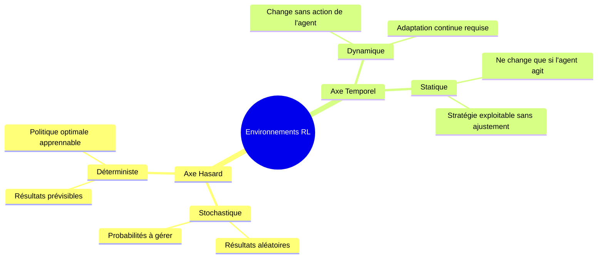
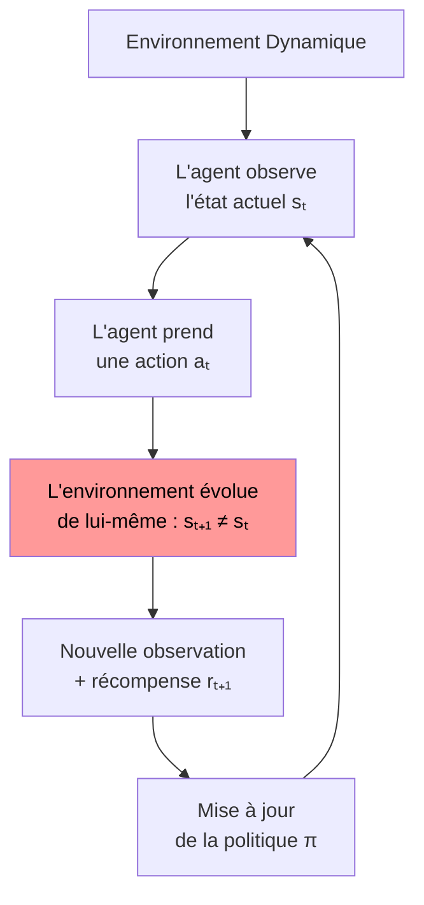
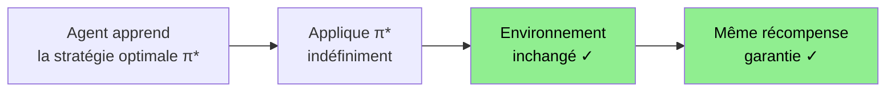
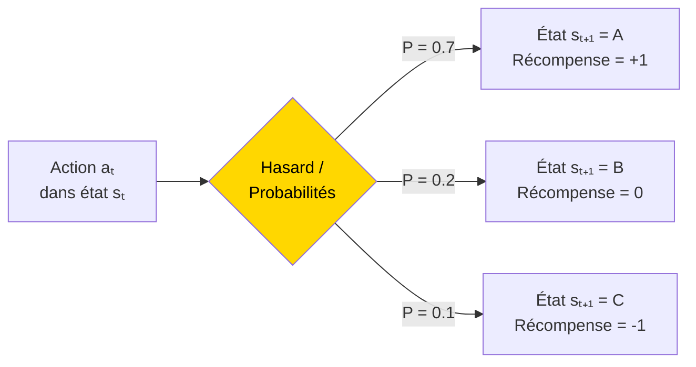
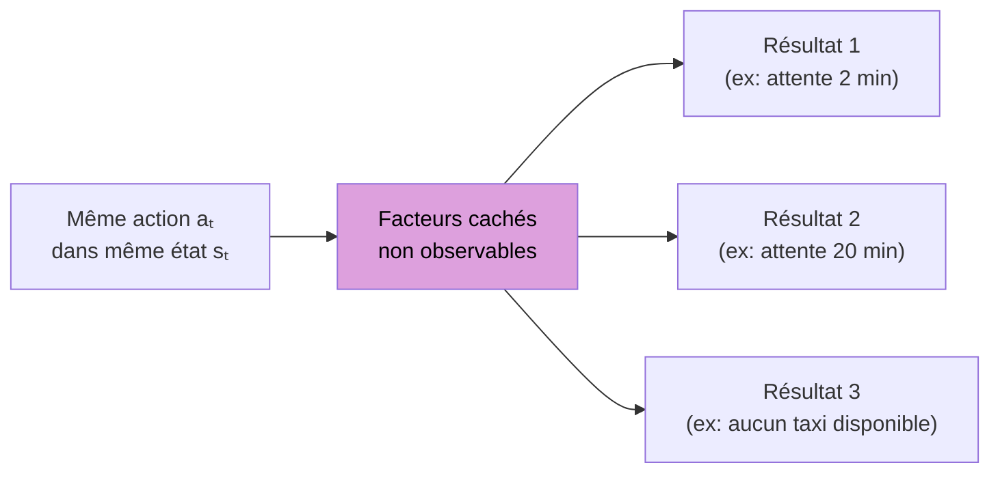
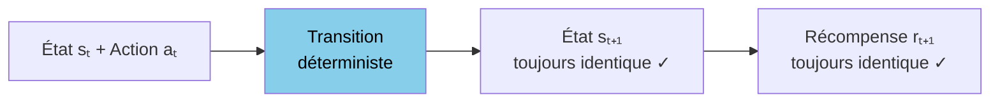
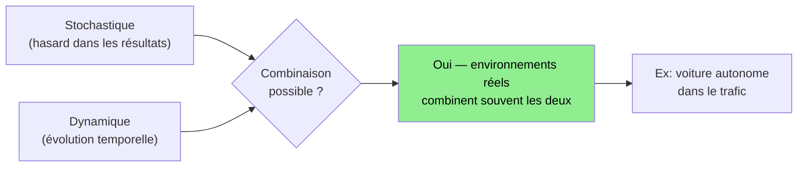
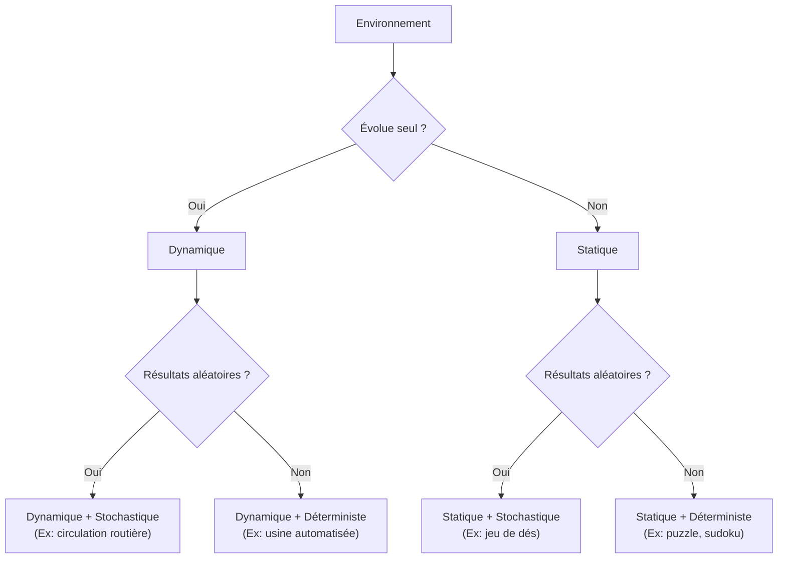
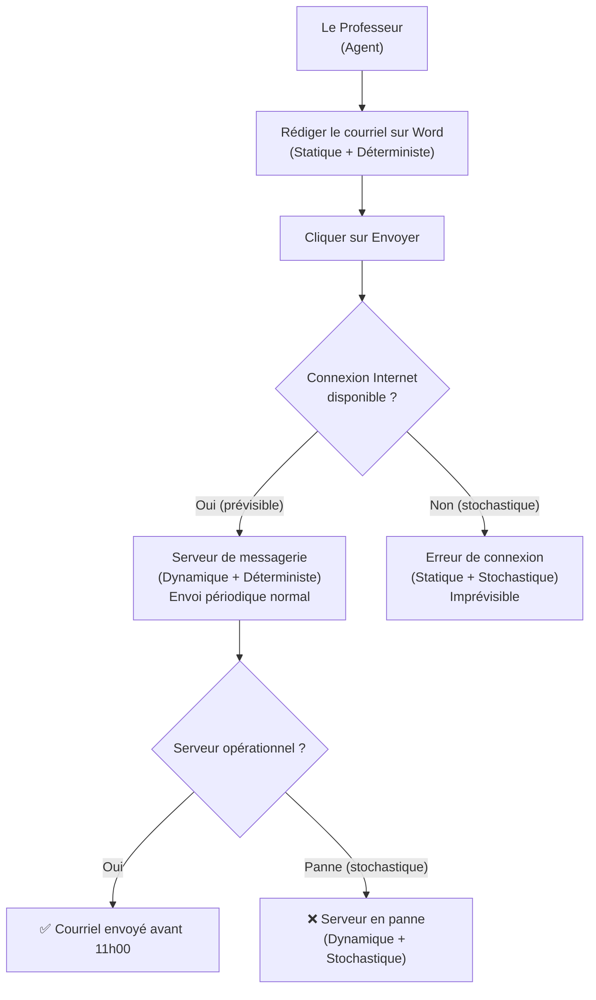
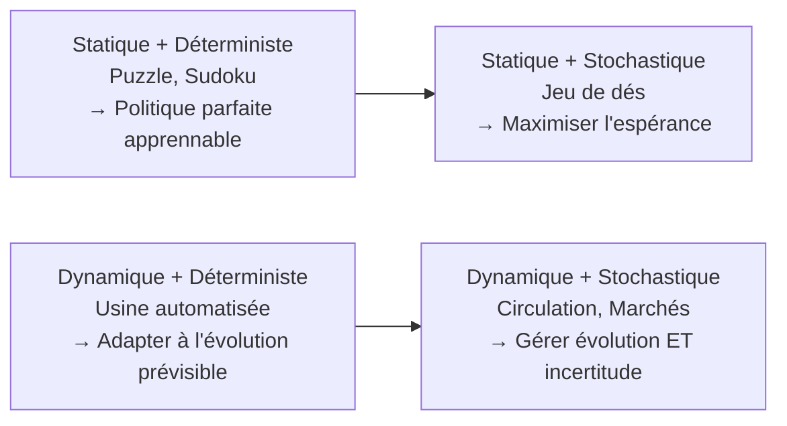

# Chapitre 4 - Les Environnements en Apprentissage par Renforcement

## Table des matières

| # | Section |
|---|---|
| 1 | [Vue d'ensemble — les quatre dimensions d'un environnement](#section-1) |
| 2 | [Environnement Dynamique](#section-2) |
| 2a | &nbsp;&nbsp;&nbsp;↳ [Définition et importance](#section-2) |
| 2b | &nbsp;&nbsp;&nbsp;↳ [Caractéristiques fondamentales](#section-2) |
| 2c | &nbsp;&nbsp;&nbsp;↳ [Exemples concrets et cas d'usage](#section-2) |
| 2d | &nbsp;&nbsp;&nbsp;↳ [Enjeux et défis de l'apprentissage](#section-2) |
| 3 | [Environnement Statique](#section-3) |
| 3a | &nbsp;&nbsp;&nbsp;↳ [Définition et caractéristiques](#section-3) |
| 4 | [Environnement Stochastique](#section-4) |
| 4a | &nbsp;&nbsp;&nbsp;↳ [Définition et propriétés](#section-4) |
| 4b | &nbsp;&nbsp;&nbsp;↳ [Exemples détaillés](#section-4) |
| 5 | [Environnement Non-Déterministe](#section-5) |
| 6 | [Environnement Déterministe](#section-6) |
| 7 | [Stochastique vs Dynamique — une distinction essentielle](#section-7) |
| 7a | &nbsp;&nbsp;&nbsp;↳ [Différences clés](#section-7) |
| 7b | &nbsp;&nbsp;&nbsp;↳ [Environnements combinant les deux](#section-7) |
| 8 | [Comparaison complète et combinaisons](#section-8) |
| 8a | &nbsp;&nbsp;&nbsp;↳ [Les quatre combinaisons possibles](#section-8) |
| 8b | &nbsp;&nbsp;&nbsp;↳ [Stratégies RL selon le type d'environnement](#section-8) |
| 9 | [Quiz 1 — Types d'environnements fondamentaux](#section-9) |
| 10 | [Quiz 2 — Stochastique, Déterministe, Dynamique, Non-Déterministe](#section-10) |
| 11 | [Pratique 1 — Identifier le type d'environnement (20 scénarios)](#section-11) |
| 11a | &nbsp;&nbsp;&nbsp;↳ [Correction de la Pratique 1](#section-11) |
| 12 | [Pratique 2 — Scénarios du quotidien (Montréal, Cuba)](#section-12) |
| 13 | [Pratique 3 — Le Professeur qui envoie un courriel](#section-13) |
| 14 | [Ressources supplémentaires](#section-14) |
| 15 | [Synthèse du chapitre](#section-15) |

---

1 — Vue d'ensemble — les quatre dimensions d'un environnement

 

Tout système d'apprentissage par renforcement repose sur un **agent qui interagit avec un environnement**. Mais tous les environnements ne fonctionnent pas de la même façon — et comprendre leur nature est indispensable pour choisir le bon algorithme et la bonne stratégie d'apprentissage.

Un environnement peut être caractérisé selon **deux axes orthogonaux** :

| Axe | Dimension 1 | Dimension 2 |
|---|---|---|
| **Impact du hasard sur les résultats** | **Stochastique** — résultats variables selon des probabilités | **Déterministe** — même action → même résultat |
| **Évolution dans le temps** | **Dynamique** — l'environnement change indépendamment de l'agent | **Statique** — l'environnement ne change que si l'agent agit |

> _Un même environnement réel combine souvent plusieurs de ces dimensions. Une voiture autonome évolue dans un environnement à la fois **dynamique** (le trafic change) et **stochastique** (le comportement des autres conducteurs est imprévisible)._

---

### Les sept questions à poser pour qualifier un environnement

| Question | Réponse → Dynamique | Réponse → Statique |
|---|---|---|
| L'environnement change-t-il si l'agent ne fait rien ? | Oui | Non |
| Les règles évoluent-elles dans le temps ? | Oui | Non |
| Y a-t-il des facteurs externes qui modifient l'état ? | Oui | Non |

| Question | Réponse → Stochastique | Réponse → Déterministe |
|---|---|---|
| La même action peut-elle donner des résultats différents ? | Oui | Non |
| Y a-t-il du hasard dans les transitions d'état ? | Oui | Non |
| L'agent doit-il raisonner en probabilités ? | Oui | Non |

> _La connaissance du type d'environnement n'est pas anecdotique — elle détermine directement **quel algorithme RL choisir**, **comment concevoir la fonction de récompense**, et **combien d'expériences** l'agent devra accumuler avant de converger._

<a href="#top">↑ Retour en haut</a>

---

2 — Environnement Dynamique

 

### Définition et importance

Un **environnement dynamique** est un cadre dans lequel les **conditions évoluent constamment**, obligeant l'agent à **s'adapter en temps réel**. Contrairement aux environnements statiques, les règles changent — une stratégie efficace aujourd'hui peut devenir obsolète demain.

> _Exemple du quotidien : Un conducteur sur l'autoroute doit s'adapter en temps réel aux autres véhicules, aux limitations de vitesse changeantes et aux conditions météorologiques imprévues._

**Cas d'usage en IA :** Un véhicule autonome ne peut pas prédire exactement le comportement des autres conducteurs, les feux de circulation ou les obstacles soudains. Il doit **ajuster sa conduite** en fonction des informations reçues en temps réel.

---

### Caractéristiques fondamentales

| Caractéristique | Description | Exemple |
|---|---|---|
| **Évolution continue** | L'environnement change même si l'agent n'agit pas | Marché financier fluctuant en permanence |
| **Incertitude et imprévisibilité** | L'agent ne voit pas toujours toutes les informations | Drone qui ne voit pas les obstacles derrière un bâtiment |
| **Réactions en temps réel** | Une décision tardive peut causer des conséquences négatives | Joueur de tennis qui doit ajuster son coup instantanément |
| **Influence des facteurs externes** | Des événements hors du contrôle de l'agent modifient l'état | Panne électrique dans une usine automatisée |
| **Complexité accrue de l'apprentissage** | L'agent doit détecter des tendances pour anticiper | Système de recommandation qui suit l'évolution des goûts |

---

### Exemples concrets et cas d'usage

**Transport et Mobilité**
- **Véhicules autonomes** : Adaptation aux conditions routières et météorologiques en temps réel.
- **Trafic aérien** : Gestion des itinéraires en fonction du climat et de la densité du trafic.

**Finance et Économie**
- **Trading algorithmique** : Ajustement des stratégies d'investissement en fonction de l'évolution des marchés.
- **Gestion de la demande énergétique** : Prédiction et ajustement en fonction de la consommation et des conditions climatiques.

**Jeux et Simulations**
- **Jeux vidéo en ligne** : Adaptation aux stratégies adverses et aux conditions dynamiques du jeu.
- **Robotique industrielle** : Ajustement des mouvements en fonction des objets en mouvement sur une chaîne de production.

---

### Enjeux et défis de l'apprentissage

| Défi | Description | Exemple |
|---|---|---|
| **Détection et anticipation** | L'agent doit identifier les tendances pour prédire les évolutions | Application météo analysant les tendances climatiques |
| **Adaptabilité et flexibilité** | L'agent doit modifier sa stratégie si les conditions changent | Chef cuisinier qui adapte sa recette selon les ingrédients disponibles |
| **Gestion des incertitudes** | Prendre des décisions avec des informations limitées | Investisseur face à des tendances économiques incertaines |

> _La comparaison entre dynamique et statique est fondamentale : dans un environnement **statique**, l'agent peut se permettre d'apprendre une stratégie parfaite et de l'appliquer indéfiniment. Dans un environnement **dynamique**, il doit rester en apprentissage permanent._

| Critère | Environnement Dynamique | Environnement Statique |
|---|---|---|
| Évolution des conditions | Les règles et états changent avec le temps | Les règles et états restent fixes |
| Niveau d'incertitude | Élevé — les résultats ne sont pas garantis | Faible — chaque action produit toujours le même effet |
| Exemple | Marché financier, conduite autonome | Jeu de Sudoku, puzzle |

<a href="#top">↑ Retour en haut</a>

---

3 — Environnement Statique

 

### Définition et caractéristiques

Un **environnement statique** ne change pas au fil du temps. Les règles et les conditions restent constantes, **indépendamment des actions de l'agent**. Une fois l'environnement compris, l'agent peut **optimiser ses décisions** sans craindre d'imprévisibilité.

> _Exemple du quotidien : Un escalier. Que vous le montiez ou le descendiez, il ne bougera jamais. Vous pouvez toujours utiliser la même stratégie._

**Cas d'usage en IA :** Un robot qui trie des colis sur un tapis roulant fixe. Si la position des colis et la vitesse du tapis sont toujours les mêmes, il peut apprendre un schéma d'action optimal et l'appliquer systématiquement.

| Caractéristique | Valeur |
|---|---|
| **Immuable** | L'environnement ne change pas indépendamment de l'agent |
| **Prévisible** | Une stratégie efficace peut être réutilisée sans ajustements |
| **Avantage pour le RL** | L'agent peut converger vers une politique optimale stable |
| **Limite** | Peu représentatif des environnements réels complexes |

**Exemples d'environnements statiques :**

| Domaine | Exemple | Caractéristique |
|---|---|---|
| Jeux | Sudoku, puzzle, labyrinthe fixe | Les règles ne changent jamais |
| Robotique | Tri de colis sur tapis fixe | L'environnement physique ne bouge pas |
| Simulation | Grille-monde (GridWorld) en RL | États et transitions fixes |
| Sport | Course sur piste fixe | La piste ne change pas |

> _Dans la pratique, un environnement parfaitement statique est rare dans le monde réel. Mais de nombreux problèmes peuvent être **approximés comme statiques** si les changements sont suffisamment lents ou négligeables par rapport à la durée d'apprentissage._

<a href="#top">↑ Retour en haut</a>

---

4 — Environnement Stochastique

 

### Définition et propriétés

Un **environnement stochastique** introduit une part de **hasard**. Même si l'agent prend la même action dans un état donné, **le résultat peut varier** selon des probabilités.

> _Exemple du quotidien : Jouer à la roulette dans un casino. Même si vous misez toujours sur le même numéro, le résultat est aléatoire._

**Propriétés clés :**

| Propriété | Description |
|---|---|
| **Présence de hasard** | Une même action peut produire des résultats différents selon une distribution de probabilités |
| **Résultats variables** | L'agent ne peut pas prédire avec certitude l'effet d'une action |
| **Décisions probabilistes** | L'agent doit maximiser les gains **en moyenne**, pas en cherchant un résultat certain |
| **Gestion du risque** | L'agent doit prendre en compte les probabilités de succès et d'échec |

---

### Exemples détaillés

**Exemple 1 : Un lancer de dé**
- Un agent joue à un jeu où lancer un dé lui permet d'avancer sur un plateau.
- Même en répétant exactement la même action (« lancer le dé »), il obtiendra un résultat entre 1 et 6, choisi aléatoirement.
- L'environnement est **statique** (le plateau ne change pas), mais **stochastique** (les résultats sont imprévisibles).

> _Dans un casino, même en suivant une stratégie parfaite, le hasard influence les gains et les pertes._

**Exemple 2 : Robot de nettoyage avec capteurs défectueux**
- Un robot doit nettoyer une pièce, mais son capteur de saleté est parfois défectueux.
- Il peut croire à tort qu'une zone est propre alors qu'elle est encore sale.
- L'environnement est **stochastique** car la perception du robot contient une part d'incertitude.

> _Un médecin utilisant un scanner défectueux peut recevoir des résultats faussés, ce qui complique son diagnostic._

**Exemple 3 : Marchés financiers**
- Les prix des actions varient en fonction de l'offre, de la demande, des annonces économiques et de facteurs géopolitiques.
- Même avec une analyse parfaite, l'évolution exacte du prix reste imprévisible.

| Type d'environnement | L'environnement change seul ? | Les résultats sont aléatoires ? |
|---|---|---|
| **Statique + Déterministe** | Non | Non |
| **Statique + Stochastique** | Non | Oui |
| **Dynamique + Déterministe** | Oui | Non |
| **Dynamique + Stochastique** | Oui | Oui |

<a href="#top">↑ Retour en haut</a>

---

5 — Environnement Non-Déterministe

 

Dans un **environnement non-déterministe**, une **même action** peut **mener à plusieurs résultats différents** en fonction de facteurs invisibles ou non observables par l'agent. La distinction avec le stochastique est subtile mais importante :

| Aspect | Stochastique | Non-Déterministe |
|---|---|---|
| **Source de variabilité** | Hasard probabiliste (distributions connues) | Facteurs cachés ou règles complexes (sans forcément de hasard pur) |
| **Modélisation** | L'agent connaît P(s'|s,a) | L'agent ne peut pas modéliser les probabilités exactes |
| **Exemples** | Lancer de dés, capteurs bruyants | Comportement humain imprévisible, règles complexes cachées |

> _Exemple du quotidien : Commander un taxi à l'aéroport. Selon la disponibilité des chauffeurs, le temps d'attente peut être de 2 minutes ou 20 minutes, sans que vous puissiez le prévoir avec certitude._

**Cas d'usage en IA :** Un assistant virtuel qui recommande des films. Deux utilisateurs avec des profils similaires peuvent obtenir des recommandations différentes, car des facteurs invisibles (historique caché, préférences changeantes) influencent les résultats.

**Stratégie de l'agent :** En environnement non-déterministe, l'agent doit **évaluer et anticiper différents scénarios potentiels** avant d'agir — il ne peut pas se contenter d'une stratégie unique et figée.

<a href="#top">↑ Retour en haut</a>

---

6 — Environnement Déterministe

 

Un **environnement déterministe** garantit que la **même action dans le même état mène toujours au même résultat**. Il n'y a pas de hasard — la transition P(s'|s,a) = 1 pour un seul état suivant s'.

> _Exemple du quotidien : Un jeu d'échecs standard. Si les deux joueurs répètent exactement les mêmes coups, la partie évolue toujours de façon identique._

**Avantages pour l'apprentissage RL :**

| Avantage | Description |
|---|---|
| **Convergence garantie** | L'agent peut apprendre une politique parfaite avec suffisamment d'expériences |
| **Pas de bruit** | Les signaux de récompense sont fiables et stables |
| **Planification précise** | L'agent peut simuler des trajectoires futures avec certitude |
| **Interprétabilité** | Il est plus facile de comprendre pourquoi l'agent prend une décision |

**Exemples :**

| Domaine | Exemple | Pourquoi déterministe ? |
|---|---|---|
| Jeux | Échecs, Go, Sudoku | Mêmes coups → même évolution |
| Robotique simple | Robot sur tapis de production fixe | Chaque commande produit le même mouvement |
| Simulation | GridWorld classique sans bruit | Transitions d'états prédéfinies |
| Calcul | Tri d'un tableau (algorithme) | Même entrée → même sortie garantie |

> _Attention : Dans le monde réel, les environnements purement déterministes sont rares. On parle souvent d'**approximation déterministe** lorsque le bruit est suffisamment faible pour être ignoré._

<a href="#top">↑ Retour en haut</a>

---

7 — Stochastique vs Dynamique — une distinction essentielle

 

Ces deux concepts sont souvent confondus, mais ils caractérisent des aspects **indépendants** d'un environnement. Les comprendre correctement est fondamental pour concevoir un agent RL efficace.

---

### Différences clés

| Critère | Environnement Stochastique | Environnement Dynamique |
|---|---|---|
| **Définition** | Les résultats d'une action varient en raison du hasard | L'environnement change avec le temps |
| **Influence sur l'agent** | L'agent doit apprendre à gérer l'incertitude | L'agent doit s'adapter aux évolutions |
| **Changements indépendants de l'agent ?** | Non — l'environnement reste le même, mais les résultats varient | Oui — l'environnement évolue même si l'agent n'agit pas |
| **Prévisibilité** | Résultats aléatoires mais avec des distributions connues | Peut être prévisible (cycle jour/nuit) ou imprévisible (accidents) |
| **Exemple** | Tirage d'une carte dans un jeu de poker | Conditions météo changeant au fil du temps |

> _Jouer à la roulette est un processus **stochastique**, mais gérer un restaurant avec une clientèle changeante est un défi **dynamique**._

---

### Définition approfondie : Environnement Stochastique

Un environnement stochastique est marqué par la **présence de hasard ou de probabilités** dans les résultats.

**Propriétés clés :**
- Présence de hasard : une même action peut produire des résultats différents.
- Résultats variables : l'agent **ne peut pas prédire avec certitude** l'effet d'une action.
- Décisions basées sur des estimations : l'agent doit apprendre à **maximiser les gains en moyenne**.

**Exemples :**

**Lancer de dé :** Un agent joue à un jeu où lancer un dé lui permet d'avancer sur un plateau. Même en répétant exactement la même action, il obtiendra un résultat entre 1 et 6 aléatoirement. L'environnement est **statique** (le plateau ne change pas) mais **stochastique** (résultats imprévisibles).

**Robot de nettoyage avec capteurs défectueux :** Son capteur de saleté est parfois défectueux, introduisant de l'incertitude dans ses perceptions.

---

### Définition approfondie : Environnement Dynamique

Un environnement dynamique est marqué par l'**évolution de ses conditions dans le temps**.

**Propriétés clés :**
- Changements indépendants de l'agent : l'environnement évolue même si l'agent ne fait rien.
- Nécessité d'adaptation : l'agent doit ajuster ses stratégies en permanence.
- Peut être prévisible (cycle jour/nuit) ou imprévisible (pannes, accidents).

**Exemples :**

**Circulation routière :** Une voiture autonome doit s'adapter à un trafic en perpétuel changement — feux, autres véhicules, météo.

**Marchés financiers :** Un algorithme de trading ajuste ses stratégies en fonction des fluctuations boursières — l'environnement change indépendamment de ses actions.

---

### Environnements combinant les deux

Certains environnements possèdent **les deux caractéristiques** — c'est le cas le plus fréquent dans le monde réel.

**Exemple : Voiture autonome dans la circulation**

| Aspect Dynamique | Aspect Stochastique |
|---|---|
| La densité du trafic évolue en permanence | Un conducteur peut freiner de manière inattendue |
| Les feux tricolores alternent | Un piéton peut traverser sans prévenir |
| Des travaux routiers peuvent apparaître soudainement | Une rafale de vent peut perturber la trajectoire |

> _Un médecin urgentiste doit à la fois s'adapter à des urgences imprévues (dynamique) et gérer l'incertitude liée aux diagnostics médicaux (stochastique)._

**Pourquoi cette distinction est essentielle en RL :**

- **Environnement stochastique** : L'agent doit prendre des décisions probabilistes et accepter une part d'incertitude. Il doit tester différentes stratégies pour maximiser les résultats en moyenne.
- **Environnement dynamique** : L'agent doit réagir rapidement aux changements du contexte et adapter ses décisions aux nouvelles conditions.
- **Environnement combiné** : L'agent doit gérer à la fois l'incertitude et les évolutions.

<a href="#top">↑ Retour en haut</a>

---

8 — Comparaison complète et combinaisons

 

### Les quatre combinaisons possibles

Dans la réalité, les environnements combinent souvent plusieurs caractéristiques. Voici les quatre combinaisons fondamentales avec leurs implications pour le RL.

---

**Combinaison 1 : Stochastique + Dynamique**

Exemple : La circulation routière
- La densité du trafic change constamment (**dynamique**).
- Le comportement des autres conducteurs est imprévisible (**stochastique**).
- Une voiture autonome doit adapter sa conduite à des conditions **en constante évolution** et **intégrer une part d'incertitude**.

> _Un joueur de bourse ajuste ses investissements selon l'évolution des marchés (dynamique), tout en anticipant des fluctuations imprévisibles (stochastique)._

---

**Combinaison 2 : Déterministe + Dynamique**

Exemple : Une usine automatisée avec une chaîne de montage
- Les étapes de production sont fixes (**déterministe**).
- Le flux de travail évolue avec l'arrivée de nouvelles pièces (**dynamique**).
- Un robot de production doit ajuster ses actions en fonction du rythme des machines, tout en sachant que chaque tâche suit un processus standardisé.

> _Un chef cuisinier suit toujours une recette précise (déterministe), mais doit s'adapter au nombre de clients et aux produits disponibles (dynamique)._

---

**Combinaison 3 : Stochastique + Statique**

Exemple : Un jeu de dés
- Le lancer de dé est aléatoire (**stochastique**).
- L'environnement ne change pas (**statique**).
- Un agent RL dans un jeu de société doit optimiser ses choix **malgré l'incertitude des résultats des dés**.

> _Un joueur de casino doit gérer ses mises en fonction d'un jeu aux règles fixes (statique), mais avec un résultat aléatoire (stochastique)._

---

**Combinaison 4 : Déterministe + Statique**

Exemple : Un puzzle
- L'environnement est fixe (**statique**).
- Chaque pièce a un emplacement unique (**déterministe**).
- L'agent peut apprendre une stratégie parfaite sans avoir à s'adapter à des changements extérieurs.

> _Un marathonien qui court toujours sur la même piste (statique) sait exactement comment optimiser ses performances (déterministe)._

---

---

### Stratégies RL selon le type d'environnement

| Type d'environnement | Stratégie d'apprentissage en RL | Algorithmes typiques |
|---|---|---|
| **Stochastique** | Approches probabilistes — maximiser l'espérance de récompense | Q-Learning avec exploration, Monte Carlo |
| **Déterministe** | Politique parfaite apprennable — algorithmes de planification | Value Iteration, Policy Iteration |
| **Dynamique** | Adaptation continue — réapprentissage ou meta-learning | Online RL, Continual Learning |
| **Non-déterministe** | Évaluation de scénarios multiples — planification sous incertitude | POMDP solvers, Bayesian RL |

> _En pratique, la plupart des environnements réels sont à la fois **dynamiques et stochastiques** — ce qui justifie l'utilisation d'algorithmes comme DQN, PPO ou SAC qui gèrent naturellement ces deux dimensions._

<a href="#top">↑ Retour en haut</a>

---

9 — Quiz 1 — Types d'environnements fondamentaux

 

Ce quiz évalue votre compréhension des différents types d'environnements en RL. Répondez à chaque question, puis cliquez sur **💡 Voir la solution** pour vérifier.

---

**Question 1 :** Qu'est-ce qui différencie principalement un **environnement dynamique** d'un **environnement statique** ?

a) Le type de récompense associée aux actions

b) Le fait qu'il existe un degré de hasard dans les résultats

c) L'évolution ou la non-évolution de l'environnement au fil du temps

d) La nécessité ou non d'un algorithme de planification

💡 Voir la solution

✅ **Réponse : c)**

Un environnement **dynamique** se modifie au fil du temps (trafic routier, météo variable, etc.), tandis qu'un environnement **statique** reste identique si l'agent n'agit pas (par exemple, un escalier qui ne bouge jamais). Le hasard (option b) correspond à la dimension stochastique, qui est indépendante de cette distinction.

---

**Question 2 :** Dans un **environnement stochastique**, même si l'agent répète la même action dans le même état, pourquoi les résultats peuvent-ils varier ?

a) Parce que l'agent ne dispose pas du bon algorithme

b) Parce que des facteurs probabilistes ou du hasard influent sur l'issue

c) Parce que l'environnement n'a pas de règles définies

d) Parce que les actions de l'agent sont ignorées par l'environnement

💡 Voir la solution

✅ **Réponse : b)**

Dans un environnement stochastique, même une action répétée dans les mêmes conditions peut donner des résultats différents, en raison de phénomènes aléatoires (lancer de dés, fluctuations de capteurs, etc.). La stochasticité est une propriété de l'environnement, pas de l'algorithme de l'agent.

---

**Question 3 :** Comment caractériser un **environnement non-déterministe** ?

a) Les actions de l'agent conduisent toujours au même résultat

b) Les règles de l'environnement sont modifiées après chaque action

c) Des facteurs cachés ou complexes peuvent générer plusieurs issues pour une même action

d) Il ne contient aucune part d'incertitude

💡 Voir la solution

✅ **Réponse : c)**

Un environnement **non-déterministe** ne garantit pas un même résultat pour une action identique, mais cette variabilité n'est pas forcément due au pur hasard (comme dans le stochastique). Elle peut résulter de règles complexes ou d'informations non observables par l'agent.

---

**Question 4 :** Quel est le **défi principal** pour un agent évoluant dans un environnement dynamique ?

a) Apprendre des actions strictement codées sans adaptation

b) Surveiller constamment les changements et adapter ses actions en temps réel

c) Arrêter l'apprentissage dès qu'une stratégie semble fonctionner

d) Ignorer les facteurs extérieurs, puisque seule la récompense importe

💡 Voir la solution

✅ **Réponse : b)**

Dans un environnement **dynamique**, l'agent doit répondre aux modifications rapides ou progressives de l'environnement (trafic routier, variations de marchés, comportements adverses). L'inaction ou l'absence d'adaptation conduit à une baisse de performance.

---

**Question 5 :** Dans un **environnement statique**, quelle approche est souvent **possible** pour l'agent ?

a) Réinitialiser constamment ses connaissances

b) Éviter toute forme d'optimisation

c) Exploiter pleinement ses acquis sans craindre de changements imprévus

d) Se baser uniquement sur des algorithmes de supervision classique

💡 Voir la solution

✅ **Réponse : c)**

Si l'environnement est **statique**, les règles, obstacles et conditions ne changent pas. L'agent peut donc se permettre de peaufiner une stratégie optimale et la réutiliser à l'identique sans redouter l'apparition de nouvelles contraintes.

---

**Question 6 :** Pourquoi parle-t-on de **gestion du risque** dans un **environnement stochastique** ?

a) Parce que les actions répétitives ne sont pas autorisées

b) Parce que l'agent doit prendre en compte les probabilités de succès ou d'échec

c) Parce que l'agent ne reçoit jamais de récompenses négatives

d) Parce que les règles de l'environnement sont toujours déterministes

💡 Voir la solution

✅ **Réponse : b)**

Un environnement stochastique implique une part d'aléatoire. L'agent doit tenir compte des **probabilités** d'issue favorable ou défavorable, et évaluer les risques avant de prendre une décision. Il optimise son **espérance** de récompense, pas sa récompense certaine.

---

**Question 7 :** Dans un **environnement non-déterministe**, comment l'agent peut-il faire face à la **multiplicité des résultats possibles** ?

a) En utilisant une stratégie unique et figée

b) En ignorant toutes les options sauf la première disponible

c) En évaluant et en anticipant différents scénarios potentiels avant d'agir

d) En arrêtant complètement d'explorer de nouvelles options

💡 Voir la solution

✅ **Réponse : c)**

Dans un environnement non-déterministe, une même action peut mener à différentes conséquences. L'agent doit donc imaginer ou anticiper ces **scénarios** et choisir la stratégie la moins risquée ou la plus prometteuse en termes d'espérance de valeur.

---

**Question 8 :** Quelle phrase illustre le mieux un **environnement dynamique et stochastique** ?

a) Les règles sont fixes, et chaque action conduit toujours à la même conséquence

b) Les règles ne changent pas, mais un lancer de dé détermine le résultat

c) La météo peut varier à tout moment, et un coup de vent soudain peut modifier la trajectoire d'un drone

d) Les chemins d'un labyrinthe sont multiples, mais les murs ne bougent jamais

💡 Voir la solution

✅ **Réponse : c)**

Cet exemple combine un contexte **dynamique** (la météo change) avec un élément **stochastique** (la rafale de vent inattendue). L'option b (jeu de dés sur plateau fixe) est stochastique mais statique. L'option d (labyrinthe à murs fixes) est statique et possiblement stochastique.

---

**Question 9 :** En RL, pourquoi le contexte **dynamique** rend-il la tâche de l'agent plus difficile ?

a) Parce qu'il est impossible de recevoir des récompenses

b) Parce que l'agent doit continuellement réévaluer sa stratégie face à un environnement en mutation

c) Parce que plus d'actions signifient automatiquement moins de récompenses

d) Parce que le choix de l'algorithme de RL importe peu

💡 Voir la solution

✅ **Réponse : b)**

Lorsque l'environnement évolue en continu, une politique qui fonctionne à un instant T peut devenir obsolète ensuite. L'agent doit adapter ou réapprendre ses comportements pour rester performant — c'est le défi du **continual learning** ou de l'**online reinforcement learning**.

---

**Question 10 :** Un environnement qui **ne change pas dans le temps**, mais qui inclut une **part de hasard** dans ses résultats, peut être qualifié de :

a) Statique et stochastique

b) Dynamique et déterministe

c) Non-déterministe et dynamique

d) Déterministe et statique

💡 Voir la solution

✅ **Réponse : a)**

Un environnement **statique** ne change pas dans le temps, mais peut être **stochastique** si chaque action est soumise à une part d'aléatoire. Exemple classique : un jeu de dés sur un plateau immuable — le plateau est statique, mais le résultat du dé est stochastique.

<a href="#top">↑ Retour en haut</a>

---

10 — Quiz 2 — Stochastique, Déterministe, Dynamique, Non-Déterministe

 

Ce quiz approfondit la distinction entre les quatre types d'environnements. Répondez à chaque question, puis cliquez sur **💡 Voir la solution** pour vérifier.

---

**Question 1 :** Dans un environnement stochastique, pourquoi peut-il exister plusieurs résultats possibles pour une même action ?

a) À cause d'éléments probabilistes ou de hasard

b) Parce que l'agent n'a pas le droit de refaire la même action

c) Parce que l'environnement est identique, mais les règles changent

d) Parce que l'agent n'a aucune information sur l'environnement

💡 Voir la solution

✅ **Réponse : a)**

Un environnement **stochastique** contient une part de hasard ou de probabilités, conduisant à des résultats variables pour une même action. L'agent doit apprendre à optimiser son comportement en termes d'espérance, pas de certitude.

---

**Question 2 :** Un environnement déterministe garantit…

a) Des résultats imprévisibles si l'agent modifie son comportement

b) Que la même action mène toujours au même résultat, dans les mêmes conditions

c) Des variations dues à des facteurs cachés

d) Une évolution constante de ses règles

💡 Voir la solution

✅ **Réponse : b)**

Un environnement **déterministe** ne laisse pas de place à l'imprévu : répéter la même action dans des conditions identiques produit un effet identique. Cela permet à l'agent d'apprendre une politique parfaite et stable.

---

**Question 3 :** Dans un environnement non-déterministe, quelle est la principale source d'imprévisibilité ?

a) La présence de mécanismes purement aléatoires

b) L'évolution constante et prévisible des conditions

c) Des facteurs inconnus ou des règles complexes, sans forcément de hasard probabiliste

d) Le fait que les récompenses sont toujours négatives

💡 Voir la solution

✅ **Réponse : c)**

Un environnement **non-déterministe** peut avoir plusieurs issues possibles pour une même action, mais ce n'est pas nécessairement lié à du hasard pur. Cela peut provenir d'informations cachées ou de règles trop complexes pour être prédites parfaitement.

---

**Question 4 :** Qu'est-ce qui caractérise un environnement dynamique ?

a) Il reste identique même lorsque l'agent n'agit pas

b) Il intègre une dimension de probabilité dans tous les résultats

c) Il évolue au fil du temps, indépendamment des actions de l'agent

d) Il nécessite obligatoirement un algorithme de tri

💡 Voir la solution

✅ **Réponse : c)**

Dans un environnement **dynamique**, les conditions changent qu'un agent agisse ou non — par exemple la météo, le trafic, ou les marchés financiers. L'agent doit adapter en permanence sa stratégie à ce contexte changeant.

---

**Question 5 :** Un système d'échecs où le plateau ne change pas tant que le joueur ne bouge pas ses pièces est un exemple de…

a) Stochastique et dynamique

b) Statique et déterministe

c) Non-déterministe et statique

d) Dynamique et déterministe

💡 Voir la solution

✅ **Réponse : b)**

Le plateau d'échecs ne change pas de lui-même (**statique**), et si les mêmes coups sont rejoués, le jeu évolue toujours de la même manière (**déterministe**). C'est un exemple classique d'environnement simple et bien défini pour les algorithmes RL.

---

**Question 6 :** Pourquoi un environnement peut-il être à la fois stochastique et dynamique ?

a) Parce que les facteurs probables et l'évolution dans le temps sont deux dimensions indépendantes

b) Parce que tout ce qui est dynamique est forcément stochastique

c) Parce que les changements dans le temps annulent les probabilités de résultats

d) Parce que l'agent a une connaissance parfaite de l'environnement

💡 Voir la solution

✅ **Réponse : a)**

La **stochasticité** concerne l'aléatoire dans les résultats d'actions, tandis que le **dynamisme** renvoie à l'évolution de l'environnement dans le temps. Les deux dimensions sont indépendantes et peuvent coexister — c'est le cas de la plupart des environnements réels.

---

**Question 7 :** Quel exemple illustre un environnement statique et stochastique ?

a) Une usine automatisée où chaque étape suit un processus fixe et où les commandes varient

b) Un lancer de dé sur un plateau de jeu qui ne se modifie pas

c) Un marché boursier qui fluctue en fonction d'événements mondiaux

d) Une ville où le trafic routier change en permanence

💡 Voir la solution

✅ **Réponse : b)**

Le plateau est **statique** (il ne change pas), mais le lancer de dé est **stochastique** (les résultats sont probabilistes). L'option c est stochastique ET dynamique. L'option d est dynamique. L'option a est dynamique ET déterministe.

---

**Question 8 :** En quoi un environnement déterministe diffère-t-il d'un environnement non-déterministe ?

a) Dans un environnement déterministe, les résultats sont toujours influencés par des facteurs inconnus

b) Dans un environnement non-déterministe, on peut connaître parfaitement les probabilités associées à chaque action

c) Un environnement déterministe garantit un résultat unique pour une action donnée, alors qu'un environnement non-déterministe permet plusieurs issues sans recourir nécessairement au hasard

d) Un environnement déterministe inclut toujours une part de hasard

💡 Voir la solution

✅ **Réponse : c)**

Le déterminisme implique qu'une seule issue est possible pour chaque action, tandis que le non-déterminisme admet plusieurs issues non forcément attribuables à un pur aléa. Cette distinction est subtile mais importante pour choisir le bon algorithme de planification.

---

**Question 9 :** Quel est le défi principal lorsque l'agent évolue dans un environnement dynamique ?

a) Gérer les incertitudes liées au hasard

b) Ne pas répéter deux fois la même action

c) Adapter en continu sa stratégie à des conditions externes changeantes

d) Tirer profit d'une politique fixe sans réapprentissage

💡 Voir la solution

✅ **Réponse : c)**

Dans un environnement **dynamique**, l'agent doit prendre en compte les variations de l'environnement et mettre à jour ses politiques en permanence. Une politique figée devient rapidement sous-optimale face à un environnement en mutation.

---

**Question 10 :** Pourquoi est-il crucial de connaître la nature de l'environnement en apprentissage par renforcement ?

a) Pour sélectionner la méthode d'apprentissage et la stratégie la mieux adaptée

b) Pour éliminer toute forme de hasard dans les décisions

c) Pour s'assurer que les récompenses soient toujours positives

d) Pour empêcher l'agent de s'adapter aux changements

💡 Voir la solution

✅ **Réponse : a)**

Savoir si l'environnement est stochastique, déterministe, dynamique ou non-déterministe permet de choisir l'algorithme de RL approprié et d'ajuster la stratégie. Un algorithme conçu pour des environnements déterministes sera peu robuste dans un environnement stochastique réel.

<a href="#top">↑ Retour en haut</a>

---

11 — Pratique 1 — Identifier le type d'environnement (20 scénarios)

 

Pour chaque exemple, le contexte est précisé explicitement afin que vous puissiez facilement identifier :
- **Qui est l'agent** (celui qui interagit avec l'environnement)
- **Qu'est-ce que l'environnement** (ce qui change ou non autour de l'agent)
- **Ce qui est connu/prévisible** (déterministe) ou **inconnu/imprévisible** (stochastique)
- **Ce qui change indépendamment ou non** des actions de l'agent (dynamique ou statique)

**Consigne :** Pour chaque cas, déterminez précisément si l'environnement décrit est :
- **Statique déterministe**
- **Statique stochastique**
- **Dynamique déterministe**
- **Dynamique stochastique**

Justifiez brièvement votre choix.

---

| # | Scénario | Agent | Environnement | Votre réponse |
|---|---|---|---|---|
| 1 | Renouvellement hypothécaire à taux fixe mais changeant chaque 5 ans | Propriétaire | Marché hypothécaire avec taux révisé tous les 5 ans — taux futur inconnu | ………… |
| 2 | Tweet imprévisible de Donald Trump affectant immédiatement le marché financier | Investisseur boursier | Marché boursier influencé par des tweets aléatoires et inattendus | ………… |
| 3 | Abonnement Netflix mensuel à tarif fixe garanti pendant 12 mois | Abonné Netflix | Tarif Netflix immuable durant l'année d'abonnement | ………… |
| 4 | Coupure électrique programmée annoncée par Hydro-Québec | Résident | Réseau électrique — interruption prévue et annoncée à l'avance | ………… |
| 5 | Coupure électrique soudaine imprévue (tempête) | Résident | Réseau électrique coupé soudainement à cause d'une météo imprévisible | ………… |
| 6 | Date fixe connue à l'avance de fermeture annuelle de votre compte bancaire | Titulaire du compte | Banque avec date fixe et prédéfinie pour fermer les comptes | ………… |
| 7 | Tweet imprévisible d'Elon Musk sur le Bitcoin | Investisseur en cryptomonnaie | Valeur du Bitcoin influencée soudainement par des tweets | ………… |
| 8 | Lancer un dé pour déterminer le dividende annuel (aucun dividende sans action) | Investisseur | Dividende payé après action, montant aléatoire déterminé par le dé | ………… |
| 9 | Compte d'épargne à intérêt fixe garanti pendant 10 ans | Titulaire du compte | Banque avec taux fixe connu et garanti, sans changement spontané | ………… |
| 10 | Élections présidentielles américaines tous les 4 ans (date fixe, résultat imprévisible) | Investisseur | Date de l'élection connue — résultat totalement imprévisible | ………… |
| 11 | Faillite inattendue d'une grande entreprise cotée en bourse | Investisseur actionnaire | Marché boursier impacté par une faillite surprise | ………… |
| 12 | Jeu de roulette au casino (rien ne se passe sans votre mise) | Joueur | Résultat aléatoire après la mise seulement — aucun changement sans action | ………… |
| 13 | Coucher du soleil chaque jour selon un calendrier astronomique précis | Photographe | Soleil se couchant à une heure précise, indépendante des actions de l'agent | ………… |
| 14 | Changement imprévisible du prix de l'essence chaque semaine | Automobiliste | Prix de l'essence modifié régulièrement sans préavis | ………… |
| 15 | Prix fixe garanti annuel d'abonnement au gym | Abonné | Tarif d'abonnement annuel fixe, sans variation durant l'année | ………… |
| 16 | Hausse surprise du tarif mensuel de votre fournisseur internet | Abonné internet | Fournisseur augmentant soudainement le tarif sans avertissement | ………… |
| 17 | Lancer d'une pièce de monnaie (pile ou face) quand vous décidez de jouer | Joueur | Résultat du lancer aléatoire — sans lancer, rien ne se passe | ………… |
| 18 | Versement mensuel d'un loyer fixe pendant toute la durée d'un bail | Locataire | Montant du loyer fixe garanti par contrat | ………… |
| 19 | Pluie imprévue affectant votre barbecue extérieur planifié | Personne organisant le barbecue | Conditions météo aléatoires et imprévisibles | ………… |
| 20 | Trafic routier dense à heure fixe tous les jours ouvrables | Conducteur quotidien | Embouteillage quotidien systématique à heure précise | ………… |

---

💡 Voir la correction complète

✅ **Corrections :**

| # | Réponse | Justification |
|---|---|---|
| 1 | **Dynamique stochastique** | Le taux évolue indépendamment du propriétaire (dynamique) et le taux futur est imprévisible (stochastique) |
| 2 | **Dynamique stochastique** | Le marché évolue sans l'agent (dynamique) et les tweets sont imprévisibles (stochastique) |
| 3 | **Statique déterministe** | Le tarif ne change pas seul (statique) et le montant est connu avec certitude (déterministe) |
| 4 | **Dynamique déterministe** | Le réseau évolue sans l'agent (dynamique) mais la coupure est annoncée et prévisible (déterministe) |
| 5 | **Dynamique stochastique** | La coupure survient indépendamment (dynamique) et le moment est totalement imprévisible (stochastique) |
| 6 | **Dynamique déterministe** | La fermeture survient sans action de l'agent (dynamique) mais la date est fixe et connue (déterministe) |
| 7 | **Dynamique stochastique** | Le prix du Bitcoin évolue sans l'agent (dynamique) et les tweets sont imprévisibles (stochastique) |
| 8 | **Statique stochastique** | Rien ne se passe sans action de l'agent (statique) mais le montant est aléatoire — dé (stochastique) |
| 9 | **Statique déterministe** | Le taux ne change pas seul (statique) et le montant est connu et garanti (déterministe) |
| 10 | **Dynamique stochastique** | La date arrive indépendamment (dynamique) et le résultat électoral est imprévisible (stochastique) |
| 11 | **Dynamique stochastique** | La faillite survient indépendamment (dynamique) et était imprévisible (stochastique) |
| 12 | **Statique stochastique** | Rien ne se passe sans mise (statique) mais le résultat de la roulette est aléatoire (stochastique) |
| 13 | **Dynamique déterministe** | Le soleil se couche indépendamment (dynamique) mais l'heure est parfaitement prévisible (déterministe) |
| 14 | **Dynamique stochastique** | Le prix change sans l'automobiliste (dynamique) et les variations sont imprévisibles (stochastique) |
| 15 | **Statique déterministe** | Le tarif ne change pas seul (statique) et le montant est connu et fixe (déterministe) |
| 16 | **Dynamique stochastique** | Le tarif change sans l'abonné (dynamique) et la hausse était imprévisible (stochastique) |
| 17 | **Statique stochastique** | Rien ne se passe sans action du joueur (statique) mais le résultat est aléatoire (stochastique) |
| 18 | **Statique déterministe** | Le loyer ne change pas seul (statique) et le montant est fixe et contractuel (déterministe) |
| 19 | **Dynamique stochastique** | La météo change indépendamment (dynamique) et la pluie était imprévisible (stochastique) |
| 20 | **Dynamique déterministe** | Le trafic arrive indépendamment (dynamique) mais l'heure d'embouteillage est prévisible (déterministe) |

<a href="#top">↑ Retour en haut</a>

---

12 — Pratique 2 — Scénarios du quotidien (Montréal, Cuba)

 

Le but de cet exercice est d'approfondir votre compréhension des concepts de **statique vs dynamique** et **déterministe vs stochastique** à travers des situations réelles du quotidien.

**Objectifs :**
- Comprendre et manipuler ces notions dans des contextes concrets.
- Analyser un environnement pour repérer ce qui change (ou non) et ce qui est prévisible (ou non).
- Créer des scénarios originaux personnels.

---

### Étude de cas 1 : Conduire pour aller au travail à Montréal

**Analyse :**

| Dimension | Éléments identifiés | Pourquoi ? |
|---|---|---|
| **Dynamique** | Changements de vitesse, feux de circulation, déviations pour travaux | Le décor évolue tout seul — il ne reste pas « figé » tant que vous n'avez pas fait votre action |
| **Stochastique** | Un cycliste surgissant, un animal traversant, un piéton impatient, les nids de poule de Montréal | On sait que des événements inattendus peuvent arriver, mais on ne sait pas **exactement** lesquels ni à quel moment |

> _Résultat : même si vous connaissez la route par cœur, la circulation et les incidents imprévus rendent le trajet **ni totalement contrôlable, ni complètement prévisible**._

**Classification :** Environnement **dynamique stochastique**

---

### Étude de cas 2 : Voyager à Cuba en plein hiver

**Analyse :**

| Dimension | Éléments identifiés | Pourquoi ? |
|---|---|---|
| **Dynamique** | Météo changeante, horaires de transport modifiés, activités fermées sans préavis | L'environnement ne reste pas statique — il évolue tout au long du séjour indépendamment de votre volonté |
| **Stochastique** | Coupures d'électricité ou d'eau chaude, grèves du personnel, fêtes locales improvisées, changements de taux de change | Ces situations peuvent survenir mais vous ne pouvez pas prédire **exactement** quand ni quel impact elles auront |

> _Le voyage à Cuba illustre un environnement **dynamique** (il évolue de lui-même) et **stochastique** (de nombreux éléments sont soumis au hasard ou à des imprévus)._

**Classification :** Environnement **dynamique stochastique**

_Note pédagogique : Cet exemple est donné uniquement à titre pédagogique pour illustrer des concepts d'intelligence artificielle. Les imprévus mentionnés sont des situations que l'on peut rencontrer dans de nombreuses destinations de voyage. L'objectif est simplement d'aider à comprendre la différence entre des environnements dynamiques, déterministes, stochastiques et statiques._

---

### Énoncé d'exercice

**1. Analyse d'un scénario fourni**
Choisissez l'un des deux cas ci-dessus (Montréal ou Cuba) et identifiez dans le scénario tous les éléments **dynamiques** (ceux qui changent ou évoluent d'eux-mêmes) et les éléments **stochastiques** (ceux qui sont imprévisibles ou soumis au hasard). Justifiez vos choix en expliquant **pourquoi** vous les classez dans l'une ou l'autre catégorie.

**2. Création de scénarios personnels**
Proposez **deux** situations de la vie quotidienne (ex : faire ses courses un dimanche de soldes, se rendre à un événement sportif, partir en voyage...). Pour chacune, déterminez si l'environnement est **statique** ou **dynamique** et s'il est **déterministe** ou **stochastique**. Expliquez clairement vos raisons.

**3. Discussion**
Comparez vos scénarios avec ceux de vos camarades. Relevez les **différences** et les **points communs**. Discutez de la façon dont ces caractéristiques influencent la **prise de décision** ou la **stratégie** à adopter dans chaque cas.

<a href="#top">↑ Retour en haut</a>

---

13 — Pratique 3 — Le Professeur qui envoie un courriel avant 11h00

 

### Scénario

Vous êtes un professeur qui doit **envoyer un courriel important à ses étudiants avant 11h00**. L'envoi du courriel est l'action que vous devez accomplir.

- **Agent :** Le Professeur
- **Environnement :** Votre bureau physique, votre ordinateur, votre connexion Internet, et le serveur de messagerie

---

### Tableau d'analyse de l'environnement

**Type Statique (Ne change pas seul)**

| | Déterministe (Prédictible) | Stochastique (Aléatoire) |
|---|---|---|
| **Éléments statiques** | Votre bureau physique (chaise, bureau, ordinateur, Word) — rien ne change indépendamment de l'agent | Votre bureau physique et la connexion Internet — l'environnement en soi est stable |
| **Exemple** | Rédiger le courriel sur Word sans connexion Internet | Connexion Internet qui tombe juste au moment d'envoyer le courriel |
| **Pourquoi statique ?** | Le professeur contrôle totalement son environnement — tout reste identique tant qu'il n'agit pas | L'environnement reste stable tant que la connexion Internet est fonctionnelle |
| **Pourquoi déterministe / stochastique ?** | **Déterministe :** Rédiger le courriel est une action 100% prévisible | **Stochastique :** L'Internet peut tomber sans prévenir quand on clique sur "Envoyer" |

**Type Dynamique (Change indépendamment de l'agent)**

| | Déterministe (Prédictible) | Stochastique (Aléatoire) |
|---|---|---|
| **Éléments dynamiques** | Le serveur de messagerie, qui traite les envois périodiquement indépendamment de l'agent | Le serveur de messagerie, qui peut tomber en panne de façon imprévisible |
| **Exemple** | Envoi programmé par le serveur de messagerie | Le serveur de messagerie tombe en panne sans prévenir |
| **Pourquoi dynamique ?** | Le serveur fonctionne de manière autonome, peu importe les actions du professeur | Le serveur peut tomber en panne indépendamment de l'agent |
| **Pourquoi déterministe / stochastique ?** | **Déterministe :** Le fonctionnement est prévisible (envoi périodique à heure fixe) | **Stochastique :** La panne du serveur est imprévisible et peut arriver à tout moment |

---

### Résumé des éléments de l'environnement

**Éléments statiques :**
- Votre bureau physique (ordinateur, chaise, bureau, Word) — rien ne change si vous n'agissez pas.
- Votre bureau physique (ordinateur, Internet) — rien ne change sauf si l'Internet tombe en panne (**stochastique**).

**Éléments dynamiques :**
- Le serveur de messagerie qui fonctionne indépendamment du professeur (**dynamique**).
- Le serveur de messagerie qui peut tomber en panne de manière imprévisible (**stochastique**).

---

### Votre tâche

1. Complétez le tableau en expliquant **chaque exemple** avec vos propres mots.
2. Proposez un **nouveau scénario amusant** où l'environnement peut être **statique/dynamique** et **déterministe/stochastique** (ex : commander une pizza en ligne, aller au cinéma...).
3. Expliquez comment un **agent intelligent pourrait apprendre à mieux s'adapter** dans chaque situation.

<a href="#top">↑ Retour en haut</a>

---

14 — Ressources supplémentaires

 

### 1 — Références fondamentales

| Ressource | Contenu | Accès |
|---|---|---|
| **Sutton & Barto — Reinforcement Learning: An Introduction** | Chapitres 3-4 : formalisme MDP, types d'environnements | [incompleteideas.net](http://incompleteideas.net/book/the-book-2nd.html) — Gratuit en PDF |
| **OpenAI Spinning Up** | Guide des environnements RL modernes et des algorithmes associés | [spinningup.openai.com](https://spinningup.openai.com) |
| **OpenAI Gym / Gymnasium** | Bibliothèque d'environnements RL standardisés pour tester des agents | [gymnasium.farama.org](https://gymnasium.farama.org) |

---

### 2 — Environnements RL classiques par type

| Environnement | Type | Algorithme typique | Complexité |
|---|---|---|---|
| **GridWorld** | Statique + Déterministe | Value Iteration, Q-Learning | Faible |
| **FrozenLake** | Statique + Stochastique | Q-Learning avec exploration | Faible |
| **CartPole** | Dynamique + Déterministe | DQN, PPO | Moyenne |
| **MuJoCo (robotique)** | Dynamique + Stochastique | SAC, TD3, PPO | Élevée |
| **Atari Games** | Dynamique + Stochastique | DQN, Rainbow | Élevée |
| **StarCraft II** | Dynamique + Stochastique + Non-déterministe | AlphaStar (PPO + LSTM) | Très élevée |

---

### 3 — Ressources vidéo

| Ressource | Contenu | Lien |
|---|---|---|
| **David Silver — Lecture 1: Introduction to RL** | Introduction aux environnements et types de problèmes RL | YouTube — DeepMind |
| **Javatpoint — Introduction au RL** | Vue d'ensemble des composantes et types d'environnements | [javatpoint.com/reinforcement-learning](https://www.javatpoint.com/reinforcement-learning) |
| **Code Emporium (YouTube)** | Vidéos explicatives sur les algorithmes RL | [youtube.com/c/CodeEmporium](https://www.youtube.com/c/CodeEmporium) |

<a href="#top">↑ Retour en haut</a>

---

15 — Synthèse du chapitre

 

### Points clés à retenir

| Concept | Définition essentielle | Exemple mémorable |
|---|---|---|
| **Dynamique** | L'environnement change sans que l'agent agisse | Trafic routier, marchés financiers |
| **Statique** | L'environnement ne change que si l'agent agit | Puzzle, jeu d'échecs, labyrinthe fixe |
| **Stochastique** | La même action peut donner des résultats différents | Lancer de dés, capteurs bruités |
| **Déterministe** | La même action donne toujours le même résultat | Sudoku, algorithme de tri |
| **Non-déterministe** | Plusieurs résultats possibles sans hasard probabiliste pur | Recommandations avec profils cachés |

---

### Les quatre combinaisons

---

### Impact sur le choix de l'algorithme RL

| Type d'environnement | Défi principal | Approche recommandée |
|---|---|---|
| Statique + Déterministe | Trouver la politique optimale | Value/Policy Iteration, Q-Learning |
| Statique + Stochastique | Gérer le hasard dans les transitions | Monte Carlo, Q-Learning avec α adaptatif |
| Dynamique + Déterministe | S'adapter aux changements prévisibles | Online RL, meta-learning |
| Dynamique + Stochastique | Gérer l'évolution ET l'incertitude | DQN, PPO, SAC — approches robustes |

---

### Note pédagogique

> _Comprendre la nature de l'environnement avant de choisir un algorithme RL est aussi important que de choisir le bon outil avant de commencer un travail. Un algorithme parfait pour un environnement statique déterministe peut complètement échouer dans un environnement dynamique stochastique. La classification de votre environnement est la première étape de tout projet RL sérieux._

<a href="#top">↑ Retour en haut</a>

---

  <em>Tous droits réservés. Toute reproduction, diffusion, utilisation ou adaptation de ce cours, en tout ou en partie, est strictement interdite sans l'autorisation écrite préalable de Dr. Haythem REHOUMA.</em>

  <strong>Cours créé par Dr. Haythem REHOUMA — Apprentissage par Renforcement</strong>

 

  <a href="#top" style="display: inline-block; background: #2563eb; color: #ffffff; text-decoration: none; font-size: 1.1rem; font-weight: 700; padding: 14px 40px; border-radius: 10px; letter-spacing: 0.3px;">
    ↑ Retour en haut du cours
  </a>

