<a id="top"></a>

# Chapitre 5 - Introduction au Processus Décisionnel de Markov (MDP)

## Table des matières

| # | Section |
|---|---|
| 1 | [Vue d'ensemble — Qu'est-ce qu'un MDP ?](#section-1) |
| 2 | [Les cinq composants fondamentaux d'un MDP](#section-2) |
| 2a | &nbsp;&nbsp;&nbsp;↳ [États (S)](#section-2) |
| 2b | &nbsp;&nbsp;&nbsp;↳ [Actions (A)](#section-2) |
| 2c | &nbsp;&nbsp;&nbsp;↳ [Probabilités de transition P(s'\|s,a)](#section-2) |
| 2d | &nbsp;&nbsp;&nbsp;↳ [Récompenses (R)](#section-2) |
| 2e | &nbsp;&nbsp;&nbsp;↳ [Politique (π)](#section-2) |
| 3 | [La Propriété de Markov](#section-3) |
| 3a | &nbsp;&nbsp;&nbsp;↳ [Définition et intuition](#section-3) |
| 3b | &nbsp;&nbsp;&nbsp;↳ [L'équation de probabilité des états P(s'\|s,a)](#section-3) |
| 4 | [Exemple complet — Le labyrinthe 5×5](#section-4) |
| 4a | &nbsp;&nbsp;&nbsp;↳ [Description du labyrinthe](#section-4) |
| 4b | &nbsp;&nbsp;&nbsp;↳ [Application des 5 composants](#section-4) |
| 5 | [Les Politiques (Policy)](#section-5) |
| 5a | &nbsp;&nbsp;&nbsp;↳ [Définition et types](#section-5) |
| 5b | &nbsp;&nbsp;&nbsp;↳ [Politique optimale π*](#section-5) |
| 5c | &nbsp;&nbsp;&nbsp;↳ [Comparaison : déterministe vs aléatoire](#section-5) |
| 6 | [Concept de l'Utilité](#section-6) |
| 6a | &nbsp;&nbsp;&nbsp;↳ [Définition et formule U(s)](#section-6) |
| 6b | &nbsp;&nbsp;&nbsp;↳ [Le facteur d'actualisation γ](#section-6) |
| 7 | [Utilité cumulative et le Marshmallow Test](#section-7) |
| 7a | &nbsp;&nbsp;&nbsp;↳ [L'expérience de Stanford](#section-7) |
| 7b | &nbsp;&nbsp;&nbsp;↳ [Calcul de l'utilité différée](#section-7) |
| 8 | [Problème des utilités infinies et solutions](#section-8) |
| 8a | &nbsp;&nbsp;&nbsp;↳ [Le problème](#section-8) |
| 8b | &nbsp;&nbsp;&nbsp;↳ [Les trois solutions](#section-8) |
| 9 | [Terminologie RL complète](#section-9) |
| 10 | [Quiz — Propriété de Markov et MDP](#section-10) |
| 11 | [Ressources supplémentaires](#section-11) |
| 12 | [Synthèse du chapitre](#section-12) |

---

<a id="section-1"></a>

<details>
<summary>1 — Vue d'ensemble — Qu'est-ce qu'un MDP ?</summary>

<br/>

Les **Processus de Décision Markoviens (MDP)** constituent le **cadre mathématique fondamental** de l'apprentissage par renforcement. Ils permettent de modéliser des situations où un agent doit prendre des **décisions séquentielles** dans un environnement **incertain ou stochastique**, en vue de **maximiser une récompense cumulée sur le long terme**.

> _Imaginez un robot qui doit traverser un labyrinthe pour trouver un trésor. À chaque salle, il peut aller à gauche, à droite, en haut ou en bas. Certaines salles contiennent des pièges (récompenses négatives), d'autres des indices précieux (récompenses positives). L'objectif est de trouver le **meilleur chemin** qui rapporte le plus de points. C'est exactement ce que les MDP modélisent._

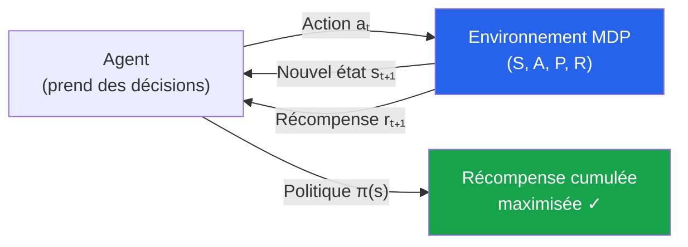

**Pourquoi les MDP sont-ils importants ?**

| Aspect | Valeur |
|---|---|
| **Formalisme universel** | Presque tout problème RL peut être formulé comme un MDP |
| **Base théorique** | Justifie des algorithmes comme Q-Learning, Value Iteration, Policy Gradient |
| **Gestion de l'incertitude** | Modélise explicitement les transitions probabilistes |
| **Optimisation séquentielle** | Permet de planifier sur plusieurs étapes, pas seulement l'instant présent |

> _Les MDP ont été introduits par **Richard Bellman** dans les années 1950, bien avant l'ère du deep learning. Aujourd'hui, ils restent le socle mathématique sur lequel reposent GPT, AlphaZero, et tous les algorithmes RL modernes._

</details>

<p align="right"><a href="#top">↑ Retour en haut</a></p>

---

<a id="section-2"></a>

<details>
<summary>2 — Les cinq composants fondamentaux d'un MDP</summary>

<br/>

Un MDP est entièrement défini par **cinq éléments** notés **(S, A, P, R, π)**.

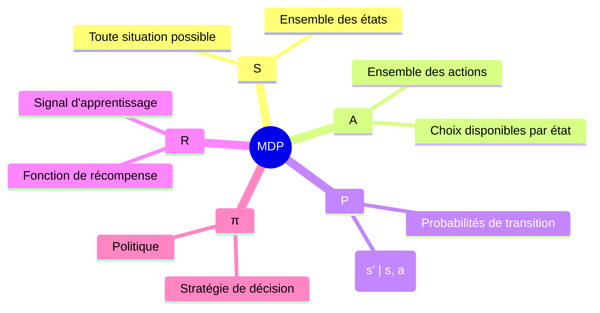

---

### États (S)

Les **États** représentent toutes les situations possibles dans lesquelles l'agent peut se trouver. Chaque état contient **toutes les informations nécessaires** pour prendre une décision (propriété de Markov).

> _Dans un jeu vidéo, chaque salle où le personnage se trouve est un état. Si le personnage est actuellement dans la salle n°5, c'est son état actuel : **s = 5**._

| Type d'état | Description | Exemple |
|---|---|---|
| **Discret** | Nombre fini et dénombrable d'états | Cases d'un labyrinthe, positions sur un plateau |
| **Continu** | Espace infini non dénombrable | Position x,y d'un robot, vitesse d'un véhicule |
| **Terminal** | État final — l'épisode se termine | Sortie du labyrinthe, fin d'une partie |

---

### Actions (A)

Les **Actions** sont les choix disponibles pour l'agent à partir d'un état donné. Chaque action entreprise influence l'état futur de l'agent.

> _Dans le jeu vidéo, les actions possibles sont : Aller en haut, Aller en bas, Aller à gauche, Aller à droite. L'agent doit choisir judicieusement parmi ces actions pour progresser vers le trésor._

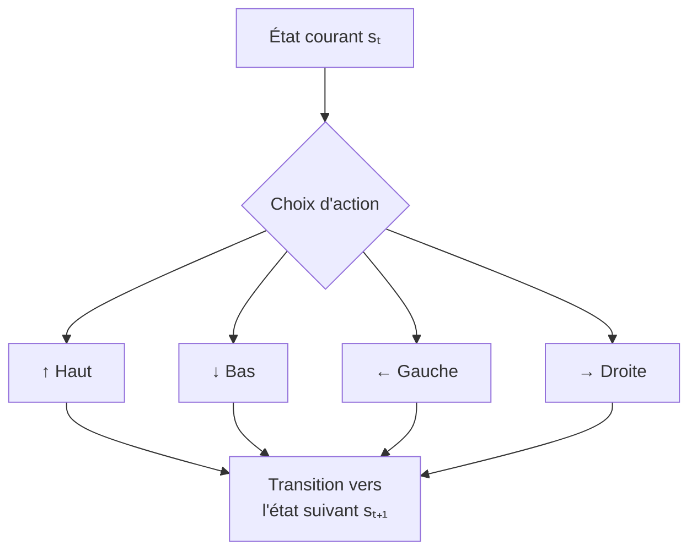

---

### Probabilités de transition P(s'|s,a)

Les **Probabilités de transition** déterminent la probabilité de passer d'un état actuel **s** à un nouvel état **s'** après avoir pris l'action **a**. Elles capturent l'**incertitude de l'environnement** : l'action entreprise ne garantit pas toujours le résultat attendu.

> _Imaginons un robot dans la pièce n°7 qui décide de monter (action H) :_
> - _Il a **80 %** de chances d'arriver dans la pièce n°2 (résultat attendu)._
> - _Il a **20 %** de chances de glisser et se retrouver dans la pièce n°1._

**Notation formelle :**

$$P(s' | s, a) = \text{Probabilité d'arriver en } s' \text{ en prenant l'action } a \text{ depuis l'état } s$$

**Propriété de sommation :** Pour tout état s et action a, la somme des probabilités de transition vers tous les états suivants est toujours 1 :

$$\sum_{s' \in S} P(s' | s, a) = 1$$

---

### Récompenses (R)

Les **Récompenses** sont des valeurs numériques attribuées après chaque transition. Elles indiquent si l'action entreprise est bénéfique ou non — c'est le **signal d'apprentissage principal** de l'agent.

> _Notre robot navigue dans le labyrinthe :_
> - _Atteindre la sortie : **+100 points**_
> - _Heurter un mur : **-10 points**_
> - _Se déplacer sans but précis : **-1 point** par mouvement_
> - _Trouver un indice précieux : **+50 points**_

| Type de récompense | Effet | Exemple |
|---|---|---|
| **Positive (récompense)** | Encourage la répétition de l'action | Atteindre un objectif, marquer un point |
| **Négative (pénalité)** | Décourage la répétition de l'action | Collision, erreur, sortie de route |
| **Nulle** | Action neutre sans signal | Rester stationnaire dans un état neutre |
| **Sparse** | Récompense rare et espacée | Bonus uniquement à la fin de l'épisode |

---

### Politique (π)

La **Politique** est la stratégie que l'agent adopte pour choisir ses actions en fonction de l'état. L'objectif est de trouver la **politique optimale π*** qui maximise les récompenses cumulées sur le long terme.

$$\pi(s) = a \quad \text{(Politique déterministe : associe un état à une action unique)}$$

$$\pi(a | s) = P(a | s) \quad \text{(Politique stochastique : distribution de probabilités sur les actions)}$$

> _La politique optimale pour notre robot : trouver le chemin le plus sûr et le plus rapide pour atteindre la sortie, tout en évitant les pièges et en maximisant les gains._

</details>

<p align="right"><a href="#top">↑ Retour en haut</a></p>

---

<a id="section-3"></a>

<details>
<summary>3 — La Propriété de Markov</summary>

<br/>

### Définition et intuition

La **Propriété de Markov** est le fondement théorique des MDP. Elle stipule que :

> **L'avenir dépend uniquement de l'état actuel et de l'action prise — pas de la manière dont cet état a été atteint.**

En d'autres termes, **l'historique des états passés n'a aucune influence** sur les décisions futures, à condition que l'état actuel soit connu.

$$P(s_{t+1} | s_t, a_t, s_{t-1}, a_{t-1}, \ldots, s_0, a_0) = P(s_{t+1} | s_t, a_t)$$

> _Le robot est dans la pièce n°7 et décide de monter. Le résultat dépend uniquement de **l'endroit où il est maintenant (pièce 7)** et de **l'action (monter)**. Pas besoin de savoir s'il est arrivé dans la pièce 7 par la gauche, par le bas, ou directement depuis le départ._

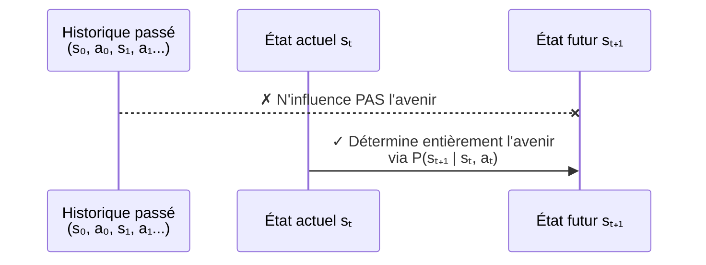

**Intuition quotidienne :** Lorsque vous jouez aux échecs, la position actuelle des pièces est tout ce dont vous avez besoin pour décider de votre prochain coup. L'historique de la partie (comment chaque pièce a été placée là) est irrelevant pour la décision présente.

---

### L'équation de probabilité des états P(s'|s,a)

$$P(s' | s, a)$$

| Symbole | Signification |
|---|---|
| **s** | État actuel (ex : pièce n°7) |
| **a** | Action entreprise (ex : monter) |
| **s'** | Nouvel état après la transition (ex : pièce n°2) |
| **P(s'\|s,a)** | Probabilité que l'agent passe à l'état s' en prenant l'action a depuis l'état s |

**Exemple précis du labyrinthe :**

Le robot est dans la pièce n°7 et décide de prendre l'action H (monter) :

$$P(2 | 7, H) = 0.8 \quad \text{(80\% de chances d'arriver en pièce 2)}$$

$$P(1 | 7, H) = 0.2 \quad \text{(20\% de chances de glisser et arriver en pièce 1)}$$

$$P(2 | 7, H) + P(1 | 7, H) = 0.8 + 0.2 = 1.0 \checkmark$$

> _Ces probabilités modélisent les erreurs possibles dans les actions prises par l'agent — par exemple, un robot dont les roues glissent sur un sol humide, ou dont les capteurs ne sont pas parfaits._

</details>

<p align="right"><a href="#top">↑ Retour en haut</a></p>

---

<a id="section-4"></a>

<details>
<summary>4 — Exemple complet — Le labyrinthe 5×5</summary>

<br/>

### Description du labyrinthe

Le labyrinthe 5×5 est un exemple classique utilisé pour illustrer tous les composants d'un MDP. Le robot doit se déplacer de la case de départ jusqu'à la sortie (★) en maximisant ses points.

```
+----+----+----+----+----+
|  1 |  2 |  3 |  4 |  5 |
+----+----+----+----+----+
|  6 |  R |  8 |  9 | 10 |
+----+----+----+----+----+
| 11 | 12 | 13 | 14 | 15*|
+----+----+----+----+----+
| 16 | 17 | 18 | 19 | 20 |
+----+----+----+----+----+
| 21 | 22 | 23 | 24 | 25★|
+----+----+----+----+----+
```

- **R** = Position initiale du robot (pièce 7)
- **15*** = Indice précieux (+50 points)
- **25★** = Sortie / état terminal (+100 points)

**Règles du labyrinthe :**
- Chaque pièce numérotée est un **état**
- Actions possibles : **H (Haut), B (Bas), G (Gauche), D (Droite)**
- Atteindre la sortie (état 25) : **+100 points**
- Heurter un mur (mouvement impossible) : **-10 points**
- Se déplacer inutilement : **-1 point** par mouvement
- Trouver l'indice précieux (état 15) : **+50 points**

---

### Application des 5 composants

| Composant | Valeur dans le labyrinthe | Exemple concret |
|---|---|---|
| **États S** | {1, 2, 3, ..., 25} — 25 pièces | État 7 = pièce en 2ème ligne, 2ème colonne |
| **Actions A** | {H, B, G, D} — 4 directions | Depuis l'état 7 : H mène vers 2, B vers 12, G vers 6, D vers 8 |
| **Transitions P** | Stochastiques — 80/20 | P(2\|7,H)=0.8, P(1\|7,H)=0.1, P(3\|7,H)=0.1 |
| **Récompenses R** | -1 (mouvement), -10 (mur), +50 (indice), +100 (sortie) | R(7, D, 8) = -1 ; R(14, D, 15) = +50 |
| **Politique π** | Chemin optimal de 7 à 25 | π(7)=D, π(8)=D, π(9)=B, π(14)=D, π(15)=B, π(20)=B |

**Transitions probabilistes depuis l'état 7, action H (Haut) :**

$$P(2 | 7, H) = 0.8 \quad P(1 | 7, H) = 0.1 \quad P(3 | 7, H) = 0.1$$

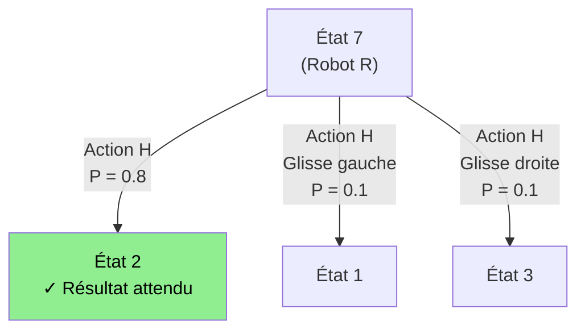

**Visualisation du déplacement optimal :**

Le robot commence en **état 7** et veut atteindre **l'état 25 (★)** :

| Étape | Action | État suivant | Récompense |
|---|---|---|---|
| 1 | D (Droite) | 7 → 8 | -1 |
| 2 | D (Droite) | 8 → 9 | -1 |
| 3 | B (Bas) | 9 → 14 | -1 |
| 4 | D (Droite) | 14 → 15* (Indice) | **+50** |
| 5 | B (Bas) | 15 → 20 | -1 |
| 6 | B (Bas) | 20 → 25★ (Sortie) | **+100** |
| **Total** | | | **146 points** |

</details>

<p align="right"><a href="#top">↑ Retour en haut</a></p>

---

<a id="section-5"></a>

<details>
<summary>5 — Les Politiques (Policy)</summary>

<br/>

### Définition et types

Une **politique** (policy **π**) est une **stratégie ou règle** qui détermine **comment un agent doit choisir ses actions** en fonction de l'état dans lequel il se trouve. C'est la méthode principale qui guide le comportement de l'agent pour atteindre ses objectifs.

| Type de politique | Définition | Notation | Exemple |
|---|---|---|---|
| **Déterministe** | Chaque état est associé à **une action précise** | π(s) = a | Si état=7, toujours aller à droite |
| **Stochastique** | Chaque état est associé à une **distribution de probabilités** sur les actions | π(a\|s) = P(a\|s) | Si état=7, 70% droite, 20% bas, 10% haut |

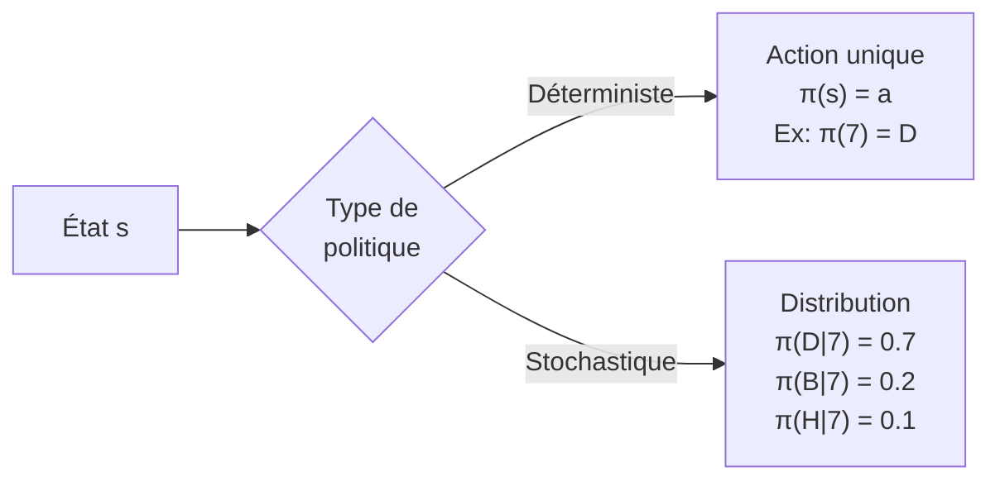

---

### Politique optimale π*

La **politique optimale π*** est celle qui **maximise la récompense cumulative attendue** pour l'agent sur le long terme. L'objectif de tout algorithme RL est de trouver π*.

**Utilité des politiques :**

| Bénéfice | Description |
|---|---|
| **Guidage** | Savoir exactement quoi faire à chaque état |
| **Optimisation** | Maximiser les récompenses cumulées sur le long terme |
| **Cohérence** | Prendre des décisions efficaces plutôt qu'agir au hasard |
| **Transférabilité** | Une bonne politique peut être réutilisée dans des états similaires |

---

### Comparaison : politique déterministe vs politique aléatoire

Le même labyrinthe, deux politiques différentes — résultats très différents :

**Politique 1 — Déterministe (Optimale)**

L'agent suit toujours le même chemin optimal : **7 → 8 → 9 → 14 → 15* → 20 → 25★**

| Étape | Mouvement | Récompense |
|---|---|---|
| 7 → 8 | D | -1 |
| 8 → 9 | D | -1 |
| 9 → 14 | B | -1 |
| 14 → 15* | D | **+50** |
| 15 → 20 | B | -1 |
| 20 → 25★ | B | **+100** |
| **Total** | | **146 points** |

**Politique 2 — Stochastique (Aléatoire)**

L'agent choisit ses actions au hasard, heurtant des murs et se perdant :

| Étape | Mouvement | Récompense |
|---|---|---|
| 7 → Mur | H | **-10** |
| 7 → 8 | D | -1 |
| 8 → Mur | H | **-10** |
| 8 → 7 | G | -1 |
| ... (retours, erreurs) | ... | -9 |
| 14 → 15* | D | **+50** |
| 15 → 20 | B | -1 |
| 20 → 25★ | B | **+100** |
| **Total** | | **118 points** |

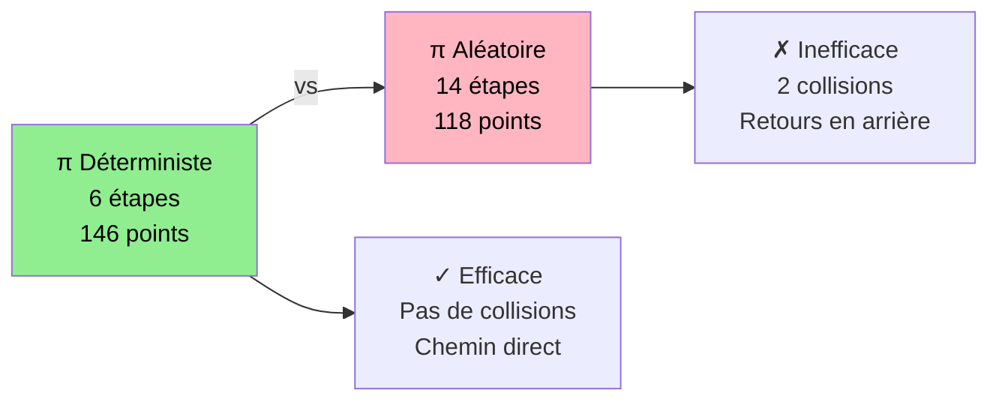

> _Cet exemple illustre directement pourquoi la recherche d'une **politique optimale π*** est l'objectif central de tout algorithme RL : la différence entre une bonne et une mauvaise politique se traduit directement en performance mesurable._

</details>

<p align="right"><a href="#top">↑ Retour en haut</a></p>

---

<a id="section-6"></a>

<details>
<summary>6 — Concept de l'Utilité</summary>

<br/>

### Définition et formule U(s)

L'apprentissage par renforcement **orienté utilité** vise à maximiser non seulement les récompenses immédiates, mais surtout la **somme pondérée des récompenses futures**. L'agent cherche à maximiser une **fonction d'utilité** qui prend en compte l'impact de ses décisions sur le long terme.

> _Un robot ne doit pas seulement penser à gagner quelques points maintenant, mais à accumuler le maximum de points jusqu'à la sortie. Ce n'est pas la récompense immédiate qui compte, mais la **somme totale** de toutes les récompenses jusqu'à la fin du parcours._

**Formule de l'utilité :**

$$U(s) = R_{t+1} + \gamma R_{t+2} + \gamma^2 R_{t+3} + \gamma^3 R_{t+4} + \ldots = \sum_{k=0}^{\infty} \gamma^k R_{t+k+1}$$

| Symbole | Signification |
|---|---|
| **U(s)** | L'utilité de l'état s — valeur totale attendue |
| **γ (gamma)** | Facteur d'actualisation (0 < γ < 1) |
| **Rₜ** | Récompense obtenue au temps t |

---

### Le facteur d'actualisation γ

Le **facteur d'actualisation γ** (gamma) contrôle l'importance relative des récompenses futures par rapport aux récompenses immédiates.

| Valeur de γ | Comportement de l'agent | Implication |
|---|---|---|
| **γ → 0** (proche de 0) | Myope — valorise uniquement les récompenses immédiates | Stratégie court-terme, peut manquer de bonnes décisions à long terme |
| **γ = 0.9** (valeur typique) | Équilibre récompenses présentes et futures | Bon compromis utilisé dans la plupart des applications |
| **γ → 1** (proche de 1) | Prévoyant — récompenses futures presque aussi importantes que présentes | Stratégie long-terme, risque de lenteur de convergence |

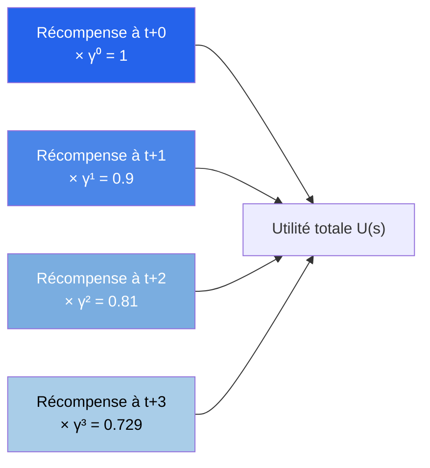

**Pourquoi utiliser γ ?**

- **Réduire l'impact des récompenses lointaines** : plus une récompense est lointaine, moins elle a de valeur pour l'agent
- **Assurer une valeur cumulative finie** : sans actualisation, l'utilité pourrait être infinie
- **Favoriser l'atteinte rapide des objectifs** : plus γ est petit, plus l'agent est pressé

> _Si vous êtes affamé maintenant, un repas servi dans deux heures n'a pas la même valeur qu'un repas servi immédiatement. Le facteur γ encode mathématiquement cette préférence pour le présent._

**Trois points clés sur l'utilité :**

1. **Optimisation des performances** : L'agent ne se contente pas d'une récompense immédiate — il cherche la meilleure récompense totale sur le long terme. Comme un joueur de basket qui construit une stratégie pour gagner le match, pas seulement pour marquer le prochain panier.

2. **Prise de décision séquentielle** : Chaque action influence les récompenses futures. Comme aux échecs : chaque mouvement compte, mais l'important est de planifier plusieurs coups à l'avance.

3. **Exploration et exploitation** : L'agent doit équilibrer l'exploration (tester de nouvelles actions) et l'exploitation (utiliser ce qu'il sait déjà). Comme visiter un nouveau restaurant ou retourner à son habituel — parfois risquer l'exploration mène à de meilleures découvertes.

</details>

<p align="right"><a href="#top">↑ Retour en haut</a></p>

---

<a id="section-7"></a>

<details>
<summary>7 — Utilité cumulative et le Marshmallow Test</summary>

<br/>

### L'expérience de Stanford

Le **Marshmallow Test** est une expérience de psychologie conçue par **Walter Mischel** dans les années 1960 à l'Université Stanford. Son objectif : étudier la **capacité à différer la gratification** et son impact sur le succès futur.

**Déroulement de l'expérience :**
- **Participants :** Enfants de 4 à 6 ans.
- **Protocole :** L'enfant est assis devant une table avec un marshmallow.
- **Choix :** Manger le marshmallow maintenant, **OU** attendre 15 minutes pour en avoir deux.

**Résultats :**
- Les enfants qui **attendaient** obtenaient de meilleurs résultats scolaires, une meilleure santé et une meilleure stabilité financière plus tard.
- Ceux qui ne pouvaient pas attendre privilégiaient l'**utilité immédiate** au détriment de l'**utilité cumulative**.

---

### Calcul de l'utilité différée

**Choix A — Immédiat :** 1 marshmallow maintenant

$$U_{immédiat} = 10 \times d(0) = 10 \times 1 = 10$$

**Choix B — Différé :** 2 marshmallows après 15 minutes (taux d'actualisation r = 5%)

$$d(15) = \frac{1}{(1 + 0.05)^{15}} \approx 0.481$$

$$U_{différé} = 25 \times 0.481 \approx 12.025$$

**Comparaison :**

| Option | Valeur nominale | Facteur d'actualisation | Utilité perçue | Décision |
|---|---|---|---|---|
| 1 marshmallow maintenant | 10 | d(0) = 1.0 | **10** | Impatient |
| 2 marshmallows dans 15 min | 25 | d(15) ≈ 0.481 | **12.025** | Patient (optimal) |

> _Même actualisée, la récompense différée est supérieure. Mais si le taux d'actualisation est très élevé (manque de confiance, instabilité), l'enfant peut rationnellement choisir la récompense immédiate._

---

### Formule générale de l'utilité cumulative

$$U_{cumulatif} = \sum_{t=0}^{T} U_t \cdot d(t) \quad \text{où} \quad d(t) = \frac{1}{(1 + r)^t}$$

**Exercice d'application :**

Avec r = 5%, quelle est l'utilité cumulative de **3 marshmallows** après **10 minutes** ?

$$d(10) = \frac{1}{(1.05)^{10}} = \frac{1}{1.62889} \approx 0.6139$$

$$U_{différé} = 3 \times 0.6139 \approx 1.84 \text{ points}$$

> _Interprétation : attendre 10 minutes fait percevoir les 3 marshmallows comme valant seulement 1.84 points au lieu de 3. Plus le taux d'actualisation est élevé, plus la récompense différée perd de sa valeur perçue._

**Facteurs influençant le comportement :**

| Facteur | Impact | Exemple |
|---|---|---|
| **Taux d'actualisation élevé** | Préfère les récompenses immédiates | Enfants impatients |
| **Contexte socio-économique instable** | Préfère l'immédiat par manque de confiance en les promesses futures | Milieux défavorisés |
| **Stratégies d'autodiscipline** | Augmente la capacité à attendre | Se distraire, fermer les yeux, imaginer que le marshmallow est une pierre |

**Lien avec le RL :** Un agent RL avec un faible γ (γ proche de 0) se comporte comme un enfant qui mange le marshmallow immédiatement — il optimise sur le court terme. Un agent avec γ proche de 1 est plus "patient" et cherche les meilleures récompenses à long terme.

</details>

<p align="right"><a href="#top">↑ Retour en haut</a></p>

---

<a id="section-8"></a>

<details>
<summary>8 — Problème des utilités infinies et solutions</summary>

<br/>

### Le problème

Si l'environnement permet d'accumuler des récompenses **indéfiniment** (jeu sans fin), la valeur cumulative peut devenir **infinie**, ce qui rend l'optimisation impossible.

**Exemple :** Un robot qui tourne en rond en gagnant +1 point à chaque mouvement accumule ∞ points — mais il n'accomplit jamais sa mission réelle.

> _C'est comme un joueur qui gagne toujours de petites sommes au casino sans jamais quitter. Il accumule de l'argent, mais ne gagne jamais vraiment le gros lot._

$$U = +1 + 1 + 1 + 1 + \ldots = +\infty \quad \text{(PROBLÈME : non comparable)}$$

---

### Les trois solutions

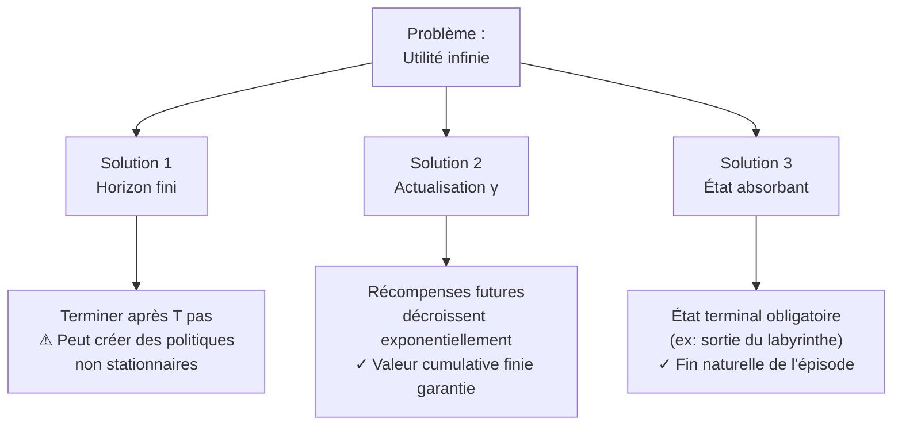

**Solution 1 — Horizon fini :**
- Fixer une limite de temps (nombre maximal de pas T) après laquelle l'épisode se termine automatiquement.
- Exemple : Le labyrinthe se termine après **20 mouvements maximum**.
- ⚠ **Inconvénient :** Peut générer des **politiques non stationnaires** — la stratégie dépend du temps restant, pas seulement de l'état actuel.

**Solution 2 — Actualisation (Discounting) :**
- Utiliser un facteur d'actualisation γ (0 < γ < 1) pour réduire progressivement l'importance des récompenses futures.
- La série géométrique converge : pour tout γ < 1 et récompense bornée R_max :

$$U = \sum_{t=0}^{\infty} \gamma^t R_{max} = \frac{R_{max}}{1 - \gamma} < \infty$$

- ✓ **Avantage :** Garantit toujours une valeur finie — même dans un environnement sans fin.

**Solution 3 — État absorbant (Terminal State) :**
- Ajouter un état terminal obligatoire où l'agent finit par arriver.
- Exemple : Dans le labyrinthe, atteindre l'état 25 (★) termine automatiquement l'épisode.
- ✓ **Avantage :** Fin naturelle, pas besoin d'artifice mathématique.

> _C'est comme un jeu vidéo où vous devez atteindre un boss final pour terminer le niveau. Sans cet état terminal, vous pourriez toujours gagner des points, mais vous n'accomplirez jamais vraiment votre mission._

| Solution | Avantage | Inconvénient | Utilisation typique |
|---|---|---|---|
| Horizon fini | Simple à implémenter | Politiques non stationnaires | Jeux à tours limités |
| Actualisation γ | Garantit convergence mathématique | Choix de γ difficile | Q-Learning, DQN, PPO |
| État absorbant | Fin naturelle | Besoin d'un état terminal défini | Labyrinthes, jeux de plateau |

</details>

<p align="right"><a href="#top">↑ Retour en haut</a></p>

---

<a id="section-9"></a>

<details>
<summary>9 — Terminologie RL complète</summary>

<br/>

Ce tableau de référence regroupe l'ensemble des termes fondamentaux de l'apprentissage par renforcement, avec définitions et exemples concrets tirés d'un environnement GridWorld.

| Terme | Définition | Exemple concret |
|---|---|---|
| **Agent** | L'entité qui prend des décisions dans l'environnement | Un robot, une voiture autonome, ou une IA jouant à un jeu vidéo |
| **Environnement** | Le monde dans lequel l'agent évolue et interagit | Le plateau de jeu (GridWorld), la route pour une voiture autonome |
| **État (State)** | La situation actuelle de l'agent dans l'environnement, à un instant donné | La case (1,3) où se trouve l'agent dans le GridWorld |
| **Action** | Ce que l'agent peut faire dans un état donné pour modifier son environnement | Se déplacer vers la gauche, droite, haut ou bas |
| **Récompense (Reward)** | Feedback que l'agent reçoit après avoir pris une action — peut être positif ou négatif | +1 pour atteindre le diamant, -1 pour entrer dans une case avec pénalité |
| **Transition** | Le passage d'un état à un autre après avoir pris une action | Depuis (1,1), aller à droite mène à (1,2) |
| **Politique (Policy)** | Stratégie de décision de l'agent — quelle action prendre selon l'état | "Toujours se déplacer vers le diamant en évitant les pénalités" |
| **Valeur (Value)** | Estimation de la récompense à long terme associée à un état, en tenant compte des actions futures | Un état proche du diamant a une haute valeur |
| **Valeur-Q (Q-Value)** | La qualité d'une action spécifique dans un état donné, tenant compte des récompenses futures | Q(état proche du diamant, aller vers le diamant) est élevée |
| **Exploration** | Tester de nouvelles actions pour découvrir des récompenses inconnues | L'agent teste toutes les directions jusqu'à trouver la récompense +1 |
| **Exploitation** | Utiliser les connaissances acquises pour maximiser les récompenses | Une fois la case +1 trouvée, l'agent s'y dirige toujours directement |
| **Facteur de réduction γ** | Paramètre mesurant l'importance des récompenses futures vs immédiates | γ faible = court-terme ; γ élevé = long-terme |
| **Épisode** | Un cycle complet d'interactions, de l'état initial jusqu'à l'état final | Du "Start" (1,1) jusqu'au diamant ou à la pénalité finale |
| **Fonction de récompense** | Fonction qui attribue une récompense pour chaque action dans un état donné | R(2,4) = -1 ; R(3,4) = +1 |
| **Fonction de transition** | Modélise comment les actions changent les états | Depuis (1,3), aller à droite conduit à (1,4) |
| **Utilité (Utility)** | Valeur d'un état tenant compte des récompenses futures probables et de leur probabilité | Similaire à la Valeur, mais intègre les probabilités d'atteindre les états futurs |
| **Politique optimale π*** | La politique qui maximise la récompense attendue à long terme | Se déplacer deux fois à droite puis une fois en haut maximise la récompense |
| **MDP** | Cadre mathématique formel : (S, A, P, R, γ) | Le labyrinthe 5×5 est un MDP complet |
| **Propriété de Markov** | L'avenir dépend uniquement de l'état actuel, pas de l'historique | La décision en pièce 7 ne dépend pas du chemin parcouru pour y arriver |

---

### Séquence pédagogique des concepts

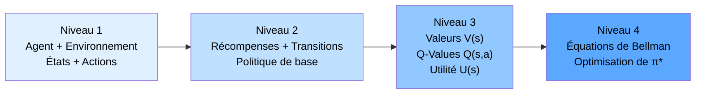

> _La progression logique pour maîtriser le RL : commencer par les interactions de base (agent/environnement/états/actions), puis les récompenses et transitions, ensuite les fonctions de valeur, et enfin l'optimisation de politique via les équations de Bellman (chapitres suivants)._

</details>

<p align="right"><a href="#top">↑ Retour en haut</a></p>

---

<a id="section-10"></a>

<details>
<summary>10 — Quiz — Propriété de Markov et MDP</summary>

<br/>

Ce quiz utilise le labyrinthe 5×5 comme contexte. Répondez à chaque question, puis cliquez sur **💡 Voir la solution** pour vérifier.

```
+----+----+----+----+----+
|  1 |  2 |  3 |  4 |  5 |
+----+----+----+----+----+
|  6 |  R |  8 |  9 | 10 |
+----+----+----+----+----+
| 11 | 12 | 13 | 14 | 15*|
+----+----+----+----+----+
| 16 | 17 | 18 | 19 | 20 |
+----+----+----+----+----+
| 21 | 22 | 23 | 24 | 25★|
+----+----+----+----+----+
```

Règles : Atteindre l'état 25 : **+100 pts** | Heurter un mur : **-10 pts** | Déplacement inutile : **-1 pt**

---

**Question 1 :** La Propriété de Markov stipule que l'avenir dépend à la fois de l'état actuel, de l'action prise, ET des états précédents. Vrai ou Faux ?

a) Vrai

b) Faux

<details>
<summary>💡 Voir la solution</summary>

✅ **Réponse : b) Faux**

La Propriété de Markov indique que l'avenir dépend **uniquement** de l'état actuel et de l'action entreprise. Les états précédents n'ont **aucune influence** sur l'avenir si l'état actuel est connu. C'est la propriété "sans mémoire" des MDP.

</details>

---

**Question 2 :** Un **état (S)** dans un MDP représente :

a) Une action que l'agent peut entreprendre

b) La stratégie optimale pour atteindre un objectif

c) Une situation possible dans laquelle l'agent se trouve

d) La récompense obtenue après chaque action

<details>
<summary>💡 Voir la solution</summary>

✅ **Réponse : c)**

Un état représente un instant précis dans le temps qui décrit complètement la situation actuelle de l'agent. Dans le labyrinthe, chaque pièce numérotée (1 à 25) est un état — il décrit où se trouve le robot à ce moment précis.

</details>

---

**Question 3 :** La politique **(π)** est :

a) Une fonction qui détermine l'action optimale à prendre pour chaque état

b) Un ensemble de récompenses cumulées

c) La probabilité de transition entre deux états

d) Une formule pour calculer la récompense immédiate

<details>
<summary>💡 Voir la solution</summary>

✅ **Réponse : a)**

La politique est la stratégie de l'agent qui définit quelle action entreprendre en fonction de l'état où il se trouve. Elle peut être déterministe (une action par état) ou stochastique (une distribution de probabilités sur les actions).

</details>

---

**Question 4 :** Si un robot est dans l'état **7** et décide de prendre l'action **H (monter)**, avec P(2|7,H) = 0.8 et P(1|7,H) = 0.2, que signifie P(2|7,H) = 0.8 ?

a) Le robot a 80% de chances de rester en état 7

b) Le robot a 80% de chances d'arriver en état 2

c) Le robot recevra une récompense de 0.8

d) La politique recommande l'action H avec une probabilité de 0.8

<details>
<summary>💡 Voir la solution</summary>

✅ **Réponse : b)**

P(2|7,H) = 0.8 signifie que **la probabilité de passer à l'état 2 en prenant l'action H depuis l'état 7 est de 80%**. Les 20% restants correspondent à P(1|7,H) = 0.2 — le robot peut glisser vers l'état 1. La somme P(2|7,H) + P(1|7,H) = 1.0 ✓

</details>

---

**Question 5 :** Si le robot tente de se déplacer vers la gauche depuis **l'état 1**, quelle sera la récompense ? Pourquoi ?

a) -1 point — déplacement normal

b) +1 point — l'agent explore une nouvelle zone

c) -10 points — le robot heurte un mur

d) 0 point — aucun effet

<details>
<summary>💡 Voir la solution</summary>

✅ **Réponse : c)**

L'état 1 est dans le coin supérieur gauche du labyrinthe. Il n'y a pas de case à sa gauche — c'est un mur. Toute tentative de traverser un mur génère une pénalité de **-10 points** selon les règles du labyrinthe.

</details>

---

**Question 6 :** La Propriété de Markov signifie que :

a) L'avenir dépend uniquement de l'état actuel et de l'action prise

b) L'avenir dépend uniquement des actions passées

c) L'avenir dépend de tous les états précédents

d) L'avenir ne dépend que des récompenses immédiates

<details>
<summary>💡 Voir la solution</summary>

✅ **Réponse : a)**

La Propriété de Markov stipule que l'**histoire n'a pas d'importance** — seul l'état actuel compte. P(sₜ₊₁ | sₜ, aₜ) est suffisant pour décrire toutes les transitions futures, sans avoir besoin des états s₀, s₁, ..., sₜ₋₁.

</details>

---

**Question 7 :** Pour un agent qui reçoit les récompenses suivantes : **-1, -1, +50, -1, +100**, sa récompense cumulative brute est de :

a) 100

b) 146

c) 148

d) 152

<details>
<summary>💡 Voir la solution</summary>

✅ **Réponse : b)**

Récompense cumulative = -1 + (-1) + 50 + (-1) + 100 = **146 points**. C'est la somme arithmétique sans facteur d'actualisation — la récompense totale brute du chemin optimal dans le labyrinthe.

</details>

---

**Question 8 :** Avec un facteur d'actualisation **γ = 0.9**, quelle est l'utilité actualisée des récompenses **-1, -1, +50, -1, +100** ?

$$U = -1 + 0.9(-1) + 0.9^2(50) + 0.9^3(-1) + 0.9^4(100)$$

a) 103.5

b) 124.2

c) 146.0

d) 98.3

<details>
<summary>💡 Voir la solution</summary>

✅ **Réponse : a) ≈ 103.5**

Calcul détaillé :
- t=0 : -1 × 1 = **-1**
- t=1 : -1 × 0.9 = **-0.9**
- t=2 : +50 × 0.81 = **+40.5**
- t=3 : -1 × 0.729 = **-0.729**
- t=4 : +100 × 0.6561 = **+65.61**

Total ≈ **103.481 points**

L'actualisation réduit la valeur des récompenses futures — d'où un score inférieur aux 146 points bruts.

</details>

---

**Question 9 :** Quelle est la **meilleure politique** pour atteindre l'état 25 (★) à partir de l'état 7 ?

a) 7 → H → 2 → D → 3 → B → 8 → D → 9 → B → 14 → D → 15 → B → 20 → B → 25

b) 7 → D → 8 → D → 9 → B → 14 → D → 15 → B → 20 → B → 25

c) 7 → B → 12 → B → 17 → B → 22 → D → 23 → D → 24 → D → 25

d) 7 → G → 6 → B → 11 → D → 12 → D → 13 → D → 14 → D → 15 → B → 20 → B → 25

<details>
<summary>💡 Voir la solution</summary>

✅ **Réponse : b)**

Le chemin **7 → 8 → 9 → 14 → 15 → 20 → 25** est optimal car :
- Il utilise seulement **6 déplacements** (-4 points de pénalité)
- Il passe par l'**indice précieux en pièce 15** (+50 points)
- Il atteint la **sortie** (+100 points)
- **Score total : 146 points** — le meilleur possible dans ce labyrinthe

</details>

---

**Question 10 :** Si l'agent est dans l'état **8** et décide d'aller à droite (D) avec P(9|8,D)=0.8, P(7|8,D)=0.1, P(10|8,D)=0.1 — quelle est la probabilité que l'agent finisse dans un état DIFFÉRENT de l'état 9 ?

a) 0.8

b) 0.1

c) 0.2

d) 0.9

<details>
<summary>💡 Voir la solution</summary>

✅ **Réponse : c) 0.2**

La probabilité d'arriver dans un état **différent de 9** est : P(7|8,D) + P(10|8,D) = 0.1 + 0.1 = **0.2 (20%)**. L'agent a 80% de chances d'atteindre sa destination prévue (état 9), et 20% de glisser vers un état non désiré (7 ou 10). C'est la nature stochastique de l'environnement.

</details>

</details>

<p align="right"><a href="#top">↑ Retour en haut</a></p>

---

<a id="section-11"></a>

<details>
<summary>11 — Ressources supplémentaires</summary>

<br/>

### Références fondamentales

| Ressource | Contenu | Accès |
|---|---|---|
| **Sutton & Barto — Chapitre 3** | Formalisme MDP complet, équations de Bellman | [incompleteideas.net](http://incompleteideas.net/book/the-book-2nd.html) — Gratuit en PDF |
| **David Silver — Lecture 2: MDPs** | Introduction aux MDP et propriété de Markov | YouTube — DeepMind |
| **OpenAI Gymnasium — FrozenLake** | Environnement MDP stochastique simple à explorer | [gymnasium.farama.org](https://gymnasium.farama.org) |

### Implémentation Python du labyrinthe

```python
import numpy as np

# Définition du MDP du labyrinthe 5×5
n_states = 25      # États : 1 à 25
n_actions = 4      # Actions : 0=Haut, 1=Bas, 2=Gauche, 3=Droite

# Récompenses
rewards = {
    24: +100,   # État 25 (index 24) = sortie
    14: +50,    # État 15 (index 14) = indice précieux
}
default_reward = -1   # Déplacement normal
wall_penalty = -10    # Collision avec un mur

# Facteur d'actualisation
gamma = 0.9

# Calcul de l'utilité actualisée
def compute_utility(rewards_sequence, gamma=0.9):
    """Calcule l'utilité actualisée d'une séquence de récompenses."""
    utility = 0
    for t, r in enumerate(rewards_sequence):
        utility += (gamma ** t) * r
    return utility

# Exemple du chemin optimal : -1, -1, -1, +50, -1, +100
optimal_path_rewards = [-1, -1, -1, 50, -1, 100]
print(f"Utilité brute : {sum(optimal_path_rewards)}")  # 146
print(f"Utilité actualisée (γ=0.9) : {compute_utility(optimal_path_rewards):.3f}")  # ~103.5
```

### Environnements MDP classiques

| Environnement | Type de MDP | Complexité | Algorithme recommandé |
|---|---|---|---|
| **GridWorld / FrozenLake** | Discret, stochastique | Faible | Q-Learning, Value Iteration |
| **CartPole** | Continu, déterministe | Moyenne | DQN, PPO |
| **MountainCar** | Continu, déterministe | Moyenne | DDPG, SAC |
| **Atari Breakout** | Discret, stochastique | Élevée | DQN, Rainbow |
| **MuJoCo Ant** | Continu, stochastique | Très élevée | SAC, TD3 |

</details>

<p align="right"><a href="#top">↑ Retour en haut</a></p>

---

<a id="section-12"></a>

<details>
<summary>12 — Synthèse du chapitre</summary>

<br/>

### Points clés à retenir

| Concept | Définition essentielle | Formule / Notation |
|---|---|---|
| **MDP** | Cadre mathématique pour la prise de décision séquentielle sous incertitude | (S, A, P, R, γ) |
| **Propriété de Markov** | L'avenir dépend uniquement de l'état actuel, pas de l'historique | P(sₜ₊₁\|sₜ,aₜ,…,s₀) = P(sₜ₊₁\|sₜ,aₜ) |
| **Transition P(s'\|s,a)** | Probabilité d'atteindre s' en prenant a depuis s | ΣP(s'\|s,a) = 1 |
| **Politique π** | Stratégie de décision — quelle action prendre selon l'état | π(s)=a ou π(a\|s)=P(a\|s) |
| **Politique optimale π*** | Politique qui maximise la récompense cumulée à long terme | argmax_π E[U(s)] |
| **Utilité U(s)** | Somme actualisée des récompenses futures | U(s) = Σ γᵏ Rₜ₊ₖ₊₁ |
| **Facteur γ** | Importance des récompenses futures vs immédiates | 0 < γ < 1 |

---

### Les cinq composants d'un MDP

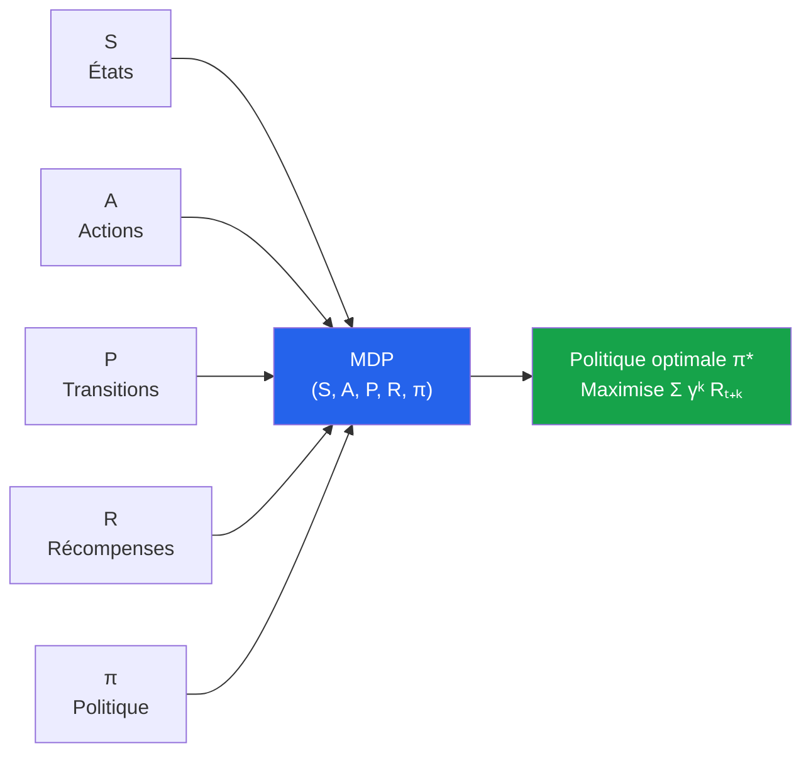

---

### Connexion avec les chapitres suivants

| Chapitre | Ce qui sera approfondi | Lien avec les MDP |
|---|---|---|
| **Chapitre 6** | Révision pratique du premier quart | Application des concepts 1-5 |
| **Chapitre 9** | Équations de Bellman | Calcul formel de V(s) et Q(s,a) à partir du MDP |
| **Chapitre 10** | Q-Learning pratique | Premier algorithme RL utilisant directement le MDP |
| **Chapitre 14** | Programmation dynamique & MC | Résolution exacte des MDP |

> _Le MDP est la fondation de tout ce qui vient ensuite. Chaque algorithme RL — Q-Learning, DQN, PPO, AlphaZero — est une façon différente de résoudre un MDP. Maîtriser ce chapitre, c'est maîtriser le langage commun de tout l'apprentissage par renforcement._

</details>

<p align="right"><a href="#top">↑ Retour en haut</a></p>

---

<p align="center">
  <em>Tous droits réservés. Toute reproduction, diffusion, utilisation ou adaptation de ce cours, en tout ou en partie, est strictement interdite sans l'autorisation écrite préalable de Dr. Haythem REHOUMA.</em>
</p>

<p align="center">
  <strong>Cours créé par Dr. Haythem REHOUMA — Apprentissage par Renforcement</strong>
</p>

<br/>

<p align="center">
  <a href="#top" style="display: inline-block; background: #2563eb; color: #ffffff; text-decoration: none; font-size: 1.1rem; font-weight: 700; padding: 14px 40px; border-radius: 10px; letter-spacing: 0.3px;">
    ↑ Retour en haut du cours
  </a>
</p>
