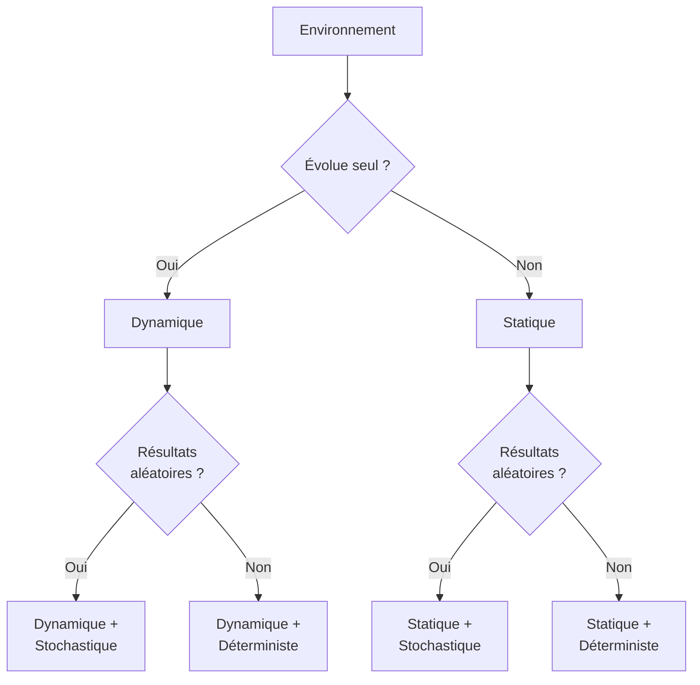
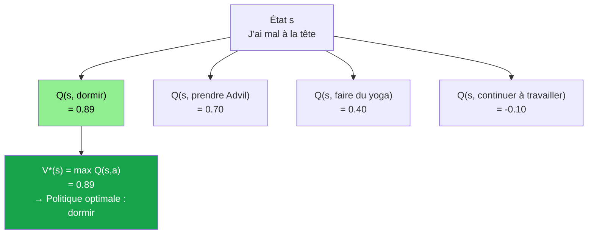

<a id="top"></a>

# Chapitre 6 - Pratique 1 : Révision du Premier Quart du Cours

## Table des matières

| # | Section |
|---|---|
| 1 | [Feuille de révision — Termes essentiels à maîtriser](#section-1) |
| 2 | [Quiz 1 — États, Actions, Récompenses et Politique](#section-2) |
| 3 | [Quiz 2 — Modélisation de l'Environnement (Partie 1)](#section-3) |
| 4 | [Quiz 3 — Modélisation de l'Environnement (Partie 2)](#section-4) |
| 5 | [Quiz 4 — Utilités Infinies (Partie 1)](#section-5) |
| 6 | [Exercices 1 — Utilités Infinies (Partie 2)](#section-6) |
| 7 | [Quiz 5 — Discounting — Théorie et Application (Partie 1)](#section-7) |
| 8 | [Exercices 2 — Discounting (Partie 2)](#section-8) |
| 9 | [Quiz 6 — Politiques de Décision (Partie 1)](#section-9) |
| 10 | [Exercices 3 — Politiques de Décision (Partie 2)](#section-10) |
| 11 | [Aperçu — Q-states, V* et ε-greedy](#section-11) |
| 12 | [Synthèse de la révision](#section-12) |

---

<a id="section-1"></a>

<details>
<summary>1 — Feuille de révision — Termes essentiels à maîtriser</summary>

<br/>

Avant de commencer les exercices, voici une feuille de révision complète des termes fondamentaux couverts dans les chapitres 1 à 5.

---

### Concepts fondamentaux du RL (Chapitres 1-2)

| Terme | Définition courte |
|---|---|
| **Apprentissage par Renforcement (RL)** | Paradigme où un agent apprend par essais et erreurs en maximisant une récompense cumulée |
| **Agent** | L'entité qui prend des décisions et interagit avec l'environnement |
| **Environnement** | Le monde dans lequel l'agent évolue |
| **Épisode** | Un cycle complet d'interactions de l'état initial jusqu'à l'état terminal |
| **Exploration** | Tester de nouvelles actions pour découvrir leurs effets |
| **Exploitation** | Utiliser les connaissances acquises pour maximiser les récompenses |
| **ε-greedy** | Stratégie d'équilibre exploration/exploitation — probabilité ε d'explorer, 1-ε d'exploiter |

---

### Composants du MDP (Chapitres 3-5)

| Terme | Notation | Définition courte |
|---|---|---|
| **État** | S | Situation actuelle de l'agent dans l'environnement |
| **Action** | A | Décision que l'agent peut prendre dans un état |
| **Récompense** | R | Signal numérique après une action (+ ou -) |
| **Probabilité de transition** | P(s'\|s,a) | Probabilité de passer à s' en prenant a depuis s |
| **Politique** | π | Stratégie de décision — quelle action prendre selon l'état |
| **Politique optimale** | π* | Politique qui maximise la récompense cumulée à long terme |
| **Utilité** | U(s) | Somme actualisée des récompenses futures depuis l'état s |
| **Facteur d'actualisation** | γ (gamma) | Poids des récompenses futures (0 < γ < 1) |
| **État absorbant** | Terminal | État final qui termine l'épisode |

---

### Types d'environnements (Chapitre 4)



---

### Formule de l'utilité actualisée

$$U(s) = r_0 \cdot \gamma^0 + r_1 \cdot \gamma^1 + r_2 \cdot \gamma^2 + \ldots + r_n \cdot \gamma^n = \sum_{t=0}^{n} \gamma^t \cdot r_t$$

---

### Aperçu des concepts avancés (à venir)

| Terme | Définition préliminaire |
|---|---|
| **Q-state** | Combinaison état + action : Q(s, a) — valeur d'une action dans un état |
| **Valeur d'état V(s)** | Meilleure valeur attendue depuis l'état s : V*(s) = max Q(s, a) |
| **Valeur Q-state Q(s,a)** | Récompense attendue en prenant l'action a depuis l'état s, puis en suivant π* |
| **Target policy** | Stratégie optimale visée (π*) |
| **Behaviour policy** | Stratégie utilisée pendant l'exploration (ex: ε-greedy) |

> _Exemple concret : "J'ai mal à la tête" est un état s. Les actions possibles sont : dormir (a1), prendre de l'Advil (a2), faire du yoga (a3). La valeur Q(s, a1) = 0.89 signifie que dormir est la meilleure option. V*(s) = max Q(s, a) = 0.89 (la valeur de l'état = la meilleure action disponible)._

</details>

<p align="right"><a href="#top">↑ Retour en haut</a></p>

---

<a id="section-2"></a>

<details>
<summary>2 — Quiz 1 — États, Actions, Récompenses et Politique</summary>

<br/>

Ce quiz révise les composants fondamentaux du RL. Répondez à chaque question, puis cliquez sur **💡 Voir la solution** pour vérifier.

---

**Question 1 :** Un robot se trouve dans un entrepôt. Il peut se déplacer dans différentes zones de stockage pour chercher des boîtes. Chaque zone est définie par une position unique. Qu'est-ce qu'un **état** dans cette situation ?

a) La décision de se déplacer vers une nouvelle zone

b) La position actuelle du robot dans l'entrepôt

c) Le nombre de boîtes que le robot a collectées

d) La direction vers laquelle le robot se dirige

<details>
<summary>💡 Voir la solution</summary>

✅ **Réponse : b)**

Un état représente la **situation actuelle** de l'agent — ici, sa position dans l'entrepôt. L'état doit contenir toutes les informations nécessaires à la prise de décision (propriété de Markov). Le nombre de boîtes collectées pourrait faire partie de l'état dans un MDP plus complet.

</details>

---

**Question 2 :** Dans un jeu vidéo, un personnage doit ramasser des objets. À chaque instant, il peut choisir de se déplacer vers le haut, le bas, la gauche ou la droite. Quelle est l'**action** que le personnage peut effectuer ?

a) Ramasser un objet

b) Se déplacer vers une direction (haut, bas, gauche ou droite)

c) Gagner une vie supplémentaire

d) Sauvegarder sa progression dans le jeu

<details>
<summary>💡 Voir la solution</summary>

✅ **Réponse : b)**

Une action représente une **décision de l'agent** pour interagir avec l'environnement. Ici, le personnage peut se déplacer dans quatre directions — c'est l'espace d'actions A = {Haut, Bas, Gauche, Droite}. "Ramasser un objet" ou "gagner une vie" sont des conséquences d'états, pas des actions directes dans ce contexte.

</details>

---

**Question 3 :** Un drone apprend à voler à travers des obstacles. Lorsqu'il évite un obstacle, il reçoit +1. S'il entre en collision, il perd -1. Quelle est la **récompense** dans cette situation ?

a) La vitesse à laquelle le drone se déplace

b) Le nombre d'obstacles que le drone a évités

c) Le point gagné (+1) ou perdu (-1) après avoir évité ou heurté un obstacle

d) La durée pendant laquelle le drone reste en vol

<details>
<summary>💡 Voir la solution</summary>

✅ **Réponse : c)**

La récompense est le **feedback numérique** que l'agent reçoit après avoir pris une action. Elle guide l'apprentissage : +1 encourage l'agent à répéter l'évitement, -1 l'incite à éviter les collisions. La vitesse et la durée peuvent être des caractéristiques de l'état, mais ne sont pas la récompense elle-même.

</details>

---

**Question 4 :** Un joueur déplace son personnage dans un labyrinthe. Le personnage passe d'une case à une autre en fonction de la direction choisie. Qu'est-ce qu'une **transition** dans cette situation ?

a) Le joueur choisit la direction dans laquelle se déplacer

b) Le passage d'une case à une autre après avoir pris une direction

c) La victoire du joueur à la fin du labyrinthe

d) Le temps que le joueur met pour terminer le labyrinthe

<details>
<summary>💡 Voir la solution</summary>

✅ **Réponse : b)**

Une transition représente le **changement d'état** en fonction de l'action effectuée : (s, a) → s'. Dans un MDP stochastique, cette transition est modélisée par la probabilité P(s'|s,a). Le choix de direction (option a) est l'action, pas la transition.

</details>

---

**Question 5 :** Dans un jeu, un robot doit collecter des diamants tout en évitant des zones dangereuses. Il peut choisir différentes stratégies pour maximiser les diamants collectés. Qu'est-ce que la **politique** du robot ?

a) Le nombre de diamants que le robot a collectés

b) Les directions dans lesquelles le robot se déplace pour collecter les diamants

c) La stratégie que le robot suit pour maximiser ses récompenses en collectant des diamants et en évitant les zones dangereuses

d) La vitesse à laquelle le robot se déplace

<details>
<summary>💡 Voir la solution</summary>

✅ **Réponse : c)**

La politique π est la **stratégie globale** de l'agent — elle associe chaque état à une action (ou une distribution sur les actions). Elle guide toutes les décisions de l'agent pour atteindre ses objectifs à long terme. Les directions spécifiques prises (option b) sont les actions individuelles dictées par la politique, pas la politique elle-même.

</details>

---

**Question 6 :** Un agent robot commence à un point de départ dans une pièce et doit naviguer pour atteindre une sortie. En chemin, il peut rencontrer des obstacles ou des objets à collecter. Qu'est-ce qu'un **épisode** dans cette situation ?

a) Le parcours complet de l'agent depuis le point de départ jusqu'à la sortie

b) La direction prise par l'agent à un instant donné

c) Le nombre d'obstacles rencontrés par l'agent

d) La distance totale parcourue par l'agent

<details>
<summary>💡 Voir la solution</summary>

✅ **Réponse : a)**

Un épisode correspond à un **cycle complet d'interactions** de l'agent avec l'environnement, de l'état initial jusqu'à un état terminal (ici, la sortie). À la fin d'un épisode, l'agent peut recommencer avec une nouvelle tentative — c'est ainsi qu'il apprend par essais et erreurs.

</details>

---

**Question 7 :** Un robot doit apprendre à choisir entre deux chemins. Le premier chemin est plus court mais a une forte probabilité d'obstacles. Le second est plus long mais sûr. Que signifie **explorer** dans cette situation ?

a) Choisir le chemin déjà connu qui maximise les récompenses

b) Essayer différents chemins pour découvrir lequel est le meilleur

c) Éviter les obstacles à tout prix

d) Arrêter de chercher une solution

<details>
<summary>💡 Voir la solution</summary>

✅ **Réponse : b)**

**Explorer** signifie tester de nouvelles actions pour découvrir de nouvelles informations sur l'environnement — ici, tester les deux chemins pour identifier lequel rapporte le plus. L'option a décrit l'**exploitation** (utiliser ce qu'on sait déjà). L'équilibre exploration/exploitation est fondamental en RL.

</details>

</details>

<p align="right"><a href="#top">↑ Retour en haut</a></p>

---

<a id="section-3"></a>

<details>
<summary>3 — Quiz 2 — Modélisation de l'Environnement (Partie 1)</summary>

<br/>

Ce quiz révise les types d'environnements. Répondez à chaque question, puis cliquez sur **💡 Voir la solution** pour vérifier.

---

**Question 1 :** Dans un jeu vidéo, chaque fois que le joueur appuie sur la touche pour avancer, le personnage se déplace toujours d'une case vers l'avant — sans exception. Comment qualifier cet environnement ?

a) Stochastique

b) Dynamique

c) Déterministe

d) Non déterministe

<details>
<summary>💡 Voir la solution</summary>

✅ **Réponse : c)**

Un environnement **déterministe** garantit que la même action dans le même état produit toujours le même résultat. Ici, chaque appui sur la touche déplace le personnage d'une case — résultat parfaitement prévisible, sans aléatoire.

</details>

---

**Question 2 :** Un robot navigue dans une pièce où des obstacles apparaissent et disparaissent de manière aléatoire. Même si le robot choisit la même direction à plusieurs reprises, le chemin peut être bloqué ou dégagé de façon imprévisible. Comment qualifier cet environnement ?

a) Dynamique

b) Déterministe

c) Stochastique

d) Non déterministe

<details>
<summary>💡 Voir la solution</summary>

✅ **Réponse : c)**

Un environnement **stochastique** a des résultats influencés par des éléments aléatoires — ici, la position des obstacles change aléatoirement. Même action, résultats différents selon les probabilités. L'agent doit apprendre à gérer l'incertitude et à maximiser les gains en espérance.

</details>

---

**Question 3 :** Une voiture autonome roule sur une autoroute. Les autres voitures se déplacent constamment, et la voiture autonome doit s'adapter en permanence à la vitesse et aux positions des véhicules autour d'elle. Comment qualifier cet environnement ?

a) Stochastique

b) Dynamique

c) Déterministe

d) Non déterministe

<details>
<summary>💡 Voir la solution</summary>

✅ **Réponse : b)**

Un environnement **dynamique** change au fil du temps, indépendamment des actions de l'agent. Ici, le trafic évolue constamment — la voiture autonome doit s'adapter aux changements qui surviennent avec ou sans ses propres actions. La clé : l'environnement bouge de lui-même.

</details>

---

**Question 4 :** Dans un jeu de société, un joueur lance un dé à six faces. Le résultat est toujours entre 1 et 6, mais le chiffre exact est incertain. Comment qualifier cet environnement ?

a) Dynamique

b) Non déterministe

c) Déterministe

d) Stochastique

<details>
<summary>💡 Voir la solution</summary>

✅ **Réponse : b) ou d)**

Les deux réponses sont valides ici selon la nuance : l'environnement est **non déterministe** (plusieurs issues possibles pour une même action) et **stochastique** (probabilités connues : 1/6 pour chaque face). Dans ce cours, le lancer de dé est souvent utilisé comme exemple des deux concepts. L'environnement est statique (le plateau ne change pas seul) mais non déterministe/stochastique dans ses résultats.

</details>

---

**Question 5 :** Un agent dans un simulateur de labyrinthe doit trouver son chemin jusqu'à la sortie. Aucune modification n'est apportée au labyrinthe une fois créé — les murs et les obstacles restent en place tout au long de l'épisode. Comment qualifier cet environnement ?

a) Statique

b) Dynamique

c) Stochastique

d) Non déterministe

<details>
<summary>💡 Voir la solution</summary>

✅ **Réponse : a)**

Un environnement **statique** ne change pas avec le temps. Ici, le labyrinthe reste identique pendant toute la durée de l'épisode — les murs ne bougent pas sans action de l'agent. C'est l'opposé d'un environnement dynamique. Attention : statique ne veut pas dire déterministe — un labyrinthe statique peut avoir des transitions stochastiques.

</details>

---

**Question 6 :** Un agent est chargé de ramasser des objets dans une usine robotisée. À chaque action de l'agent, les tapis roulants se déplacent de manière prévisible et les objets avancent selon un modèle fixe. Comment qualifier cet environnement ?

a) Déterministe Dynamique

b) Stochastique Statique

c) Dynamique Non déterministe

d) Déterministe Statique

<details>
<summary>💡 Voir la solution</summary>

✅ **Réponse : a)**

L'environnement est **dynamique** (les tapis roulants bougent indépendamment de l'agent) et **déterministe** (leur mouvement est prévisible selon un modèle fixe). C'est la combinaison "dynamique + déterministe" — l'agent doit s'adapter aux changements, mais peut les anticiper avec certitude.

</details>

---

**Question 7 :** Un drone apprend à voler dans un environnement où la météo change régulièrement. Parfois, quand il choisit de monter, le vent change soudainement et le fait dévier. Ces changements sont influencés par le climat général mais ne sont pas complètement aléatoires. Comment qualifier cet environnement ?

a) Non déterministe Dynamique

b) Stochastique Statique

c) Déterministe Dynamique

d) Non déterministe Statique

<details>
<summary>💡 Voir la solution</summary>

✅ **Réponse : a)**

L'environnement combine un aspect **dynamique** (la météo évolue dans le temps, indépendamment du drone) et un aspect **non déterministe** (les changements de vent ne suivent pas de probabilités pures — ils sont influencés par des facteurs complexes et partiellement imprévisibles). C'est le cas typique d'un environnement réel complexe.

</details>

</details>

<p align="right"><a href="#top">↑ Retour en haut</a></p>

---

<a id="section-4"></a>

<details>
<summary>4 — Quiz 3 — Modélisation de l'Environnement (Partie 2)</summary>

<br/>

Ce quiz consolide la compréhension des types d'environnements avec des définitions directes et une mise en situation concrète.

---

**Question 1 :** Qu'est-ce qu'un environnement **déterministe** ?

a) Un environnement où une action donnée produit toujours le même résultat

b) Un environnement où les résultats des actions sont imprévisibles

c) Un environnement qui change constamment

<details>
<summary>💡 Voir la solution</summary>

✅ **Réponse : a)**

Dans un environnement **déterministe**, chaque action dans un état donné produit toujours le même résultat — sans aléatoire, sans surprise. P(s'|s,a) = 1 pour un seul état suivant s'. C'est le cas le plus simple pour un agent RL : il peut apprendre une politique parfaite.

</details>

---

**Question 2 :** Qu'est-ce qu'un environnement **stochastique** ?

a) Un environnement où les actions n'ont aucune conséquence

b) Un environnement où les résultats des actions sont probabilistes

c) Un environnement où toutes les actions mènent au même état

<details>
<summary>💡 Voir la solution</summary>

✅ **Réponse : b)**

Dans un environnement **stochastique**, les résultats des actions suivent des distributions de probabilités. P(s'|s,a) peut être non nul pour plusieurs états s' — l'agent ne peut pas prédire avec certitude ce qui va se passer, mais peut estimer les probabilités.

</details>

---

**Question 3 :** Qu'est-ce qu'un environnement **dynamique** ?

a) Un environnement qui reste constant dans le temps

b) Un environnement qui change indépendamment des actions de l'agent

c) Un environnement où chaque action est immédiatement récompensée

<details>
<summary>💡 Voir la solution</summary>

✅ **Réponse : b)**

Un environnement **dynamique** évolue dans le temps, même si l'agent ne fait rien. L'état change sans action de l'agent — comme le trafic, la météo, ou les marchés financiers. L'agent doit continuellement réévaluer sa stratégie.

</details>

---

**Question 4 — Mise en situation :** Un robot dans un entrepôt peut faire face à trois types d'environnements. Associez chaque description à son type :

- **A)** Chaque commande de déplacement mène exactement à la position prévue.
- **B)** Le robot peut glisser ou rencontrer des obstacles, modifiant sa trajectoire prévue.
- **C)** Les étagères de l'entrepôt se déplacent de manière autonome, modifiant le chemin optimal.

Quel type correspond à chaque description ?

<details>
<summary>💡 Voir la solution</summary>

✅ **Réponses :**

- **A) → Déterministe** : Même commande → même résultat. L'agent peut planifier avec certitude.
- **B) → Stochastique** : Le robot peut glisser — résultats variables pour la même commande. L'agent doit gérer le hasard.
- **C) → Dynamique** : Les étagères bougent indépendamment de l'agent. L'agent doit s'adapter aux changements de l'environnement.

</details>

---

**Question 5 :** Quel type d'environnement nécessite que l'agent **s'adapte constamment aux changements** ?

a) Déterministe

b) Stochastique

c) Dynamique

<details>
<summary>💡 Voir la solution</summary>

✅ **Réponse : c)**

Un environnement **dynamique** impose une adaptation constante car l'environnement évolue indépendamment de l'agent. Une stratégie optimale à l'instant T peut devenir sous-optimale à T+1 si l'environnement a changé. Cela contraste avec les environnements statiques où une politique apprise reste valide.

</details>

</details>

<p align="right"><a href="#top">↑ Retour en haut</a></p>

---

<a id="section-5"></a>

<details>
<summary>5 — Quiz 4 — Utilités Infinies (Partie 1)</summary>

<br/>

Ce quiz révise le problème des utilités infinies et ses solutions. Répondez à chaque question, puis cliquez sur **💡 Voir la solution** pour vérifier.

---

**Question 1 :** Qu'est-ce qu'une **utilité infinie** dans le contexte du RL ?

a) Une récompense qui ne peut jamais être atteinte

b) Une situation où les récompenses cumulées peuvent devenir infinies si le jeu ne se termine jamais

c) Une stratégie optimale pour maximiser les gains

<details>
<summary>💡 Voir la solution</summary>

✅ **Réponse : b)**

Dans un environnement sans état terminal (jeu infini), l'agent peut accumuler des récompenses indéfiniment, rendant la somme totale infinie. Cela rend impossible la comparaison entre politiques — si U(π₁) = ∞ et U(π₂) = ∞, comment savoir laquelle est meilleure ? Ce problème nécessite des solutions spécifiques.

</details>

---

**Question 2 :** Quelle est une solution pour gérer les **utilités infinies** ?

a) Ignorer les récompenses futures

b) Utiliser un horizon fini pour terminer les épisodes après un nombre fixe de pas

c) Réduire la taille de l'environnement

<details>
<summary>💡 Voir la solution</summary>

✅ **Réponse : b)**

Un **horizon fini** termine l'épisode après T pas — garantissant une somme finie. Exemple : le labyrinthe se termine après 20 mouvements maximum. ⚠ Inconvénient : peut générer des politiques non stationnaires (la stratégie dépend du temps restant, pas seulement de l'état).

</details>

---

**Question 3 :** Qu'est-ce que l'**actualisation (discounting)** ?

a) Ignorer les récompenses immédiates

b) Utiliser un facteur γ (0 < γ < 1) pour donner plus d'importance aux récompenses immédiates et réduire l'impact des récompenses futures

c) Augmenter la probabilité de succès des actions

<details>
<summary>💡 Voir la solution</summary>

✅ **Réponse : b)**

L'**actualisation** utilise un facteur γ pour pondérer les récompenses futures : une récompense à t+k vaut γᵏ fois sa valeur nominale. Pour tout γ < 1, la somme infinie converge : Σ γᵗ Rmax = Rmax/(1-γ) < ∞. C'est la solution la plus utilisée en pratique.

$$U = \sum_{t=0}^{\infty} \gamma^t r_t \quad \text{converge si } \gamma < 1 \text{ et } r_t \text{ borné}$$

</details>

---

**Question 4 — Mise en situation :** Un jeu vidéo peut continuer indéfiniment. Associez chaque solution à sa description :

- **Horizon fini** : Le jeu se termine automatiquement après 1000 étapes.
- **Actualisation** : Les récompenses futures sont réduites par un facteur de 0.9 à chaque étape.
- **État absorbant** : Le jeu garantit qu'un état final (boss final) est atteint après un certain temps.

Laquelle de ces solutions garantit une **convergence mathématique** même dans un environnement théoriquement infini ?

<details>
<summary>💡 Voir la solution</summary>

✅ **Réponse : L'Actualisation (discounting)**

L'actualisation avec γ < 1 est la seule solution qui garantit mathématiquement une valeur cumulative finie, même sans limite de temps ni d'état terminal. La série géométrique Σγᵗ converge toujours si 0 < γ < 1. L'horizon fini et l'état absorbant nécessitent une fin prédéfinie de l'épisode.

</details>

---

**Question 5 :** Pourquoi utiliser un **état absorbant** ?

a) Pour éviter que le joueur ne gagne trop de points

b) Pour garantir que chaque politique atteindra éventuellement un état terminal, évitant ainsi des cycles infinis

c) Pour augmenter la difficulté du jeu

<details>
<summary>💡 Voir la solution</summary>

✅ **Réponse : b)**

Un **état absorbant** (état terminal) garantit une fin naturelle à l'épisode — une fois atteint, l'agent reste dans cet état pour toujours avec récompense 0. Exemple : la sortie du labyrinthe (état 25★). Cela évite les cycles infinis et donne une fin naturelle sans artifice mathématique.

</details>

</details>

<p align="right"><a href="#top">↑ Retour en haut</a></p>

---

<a id="section-6"></a>

<details>
<summary>6 — Exercices 1 — Utilités Infinies (Partie 2)</summary>

<br/>

Ces exercices approfondissent la compréhension des utilités infinies avec des calculs et de la réflexion.

---

**Exercice 1 — Réflexion :**

Imaginez un jeu où un agent reçoit une récompense de +1 à chaque étape, sans fin. Pourquoi est-il problématique de calculer l'utilité totale sans ajustement ? Proposez une solution.

<details>
<summary>💡 Voir la solution</summary>

✅ **Réponse :**

**Problème :** Sans ajustement, U = 1 + 1 + 1 + ... = +∞. Toutes les politiques donnent une utilité infinie — il est donc impossible de les comparer et de trouver π*.

**Solutions possibles :**
1. **Horizon fini** : Limiter à T étapes → U = T (fini)
2. **Actualisation** : U = 1 + 0.9 + 0.81 + ... = 1/(1-0.9) = 10 (fini)
3. **État absorbant** : Créer un état terminal que l'agent doit atteindre

</details>

---

**Exercice 2 — Calcul avec actualisation :**

Avec un facteur d'actualisation **γ = 0.9**, calculez l'utilité cumulée pour les **5 premières étapes** d'un agent recevant +1 à chaque étape.

$$U = \sum_{t=0}^{4} 0.9^t \times 1$$

<details>
<summary>💡 Voir la solution</summary>

✅ **Réponse :**

$$U = 0.9^0 + 0.9^1 + 0.9^2 + 0.9^3 + 0.9^4$$

$$= 1 + 0.9 + 0.81 + 0.729 + 0.6561 = \mathbf{4.0951}$$

**Interprétation :** Au lieu d'accumuler 5 points bruts, l'actualisation donne une valeur de 4.09 — les récompenses futures valent moins que les immédiates. Plus γ est petit, plus l'écart est grand.

</details>

---

**Exercice 3 — Mise en situation :**

Un robot doit nettoyer une pièce. Il reçoit **+10** pour chaque zone nettoyée et **-5** pour chaque collision. Avec un **horizon fini de 10 étapes**, proposez une stratégie optimale.

<details>
<summary>💡 Voir la solution</summary>

✅ **Réponse :**

Avec 10 étapes limitées, le robot doit **maximiser les zones nettoyées tout en minimisant les collisions**. Stratégie optimale :

- Planifier le chemin avec le **plus de zones accessibles** dans les 10 étapes
- **Éviter toute collision** (-5 efface la moitié d'une récompense de nettoyage)
- Prioriser les zones proches pour éviter les déplacements inutiles
- **Score optimal théorique :** Si le robot nettoie 5 zones et évite toutes les collisions → 5 × 10 = 50 points

L'horizon fini force l'agent à planifier efficacement — chaque étape gaspillée est une perte définitive.

</details>

---

**Exercice 4 — État absorbant :**

Décrivez un scénario réel où l'utilisation d'un état absorbant serait bénéfique. Expliquez comment il prévient les utilités infinies.

<details>
<summary>💡 Voir la solution</summary>

✅ **Réponse :**

**Scénario : Robot de livraison en entrepôt**

L'état absorbant est **"livraison complète"** — quand le robot dépose le dernier colis à destination.

**Comment ça prévient les utilités infinies :**
- Sans état absorbant, le robot pourrait tourner en rond en accumulant des petites récompenses de +0.1 par mouvement → U → ∞
- Avec l'état absorbant "livraison complète", l'épisode se termine naturellement et l'agent reçoit une récompense finale +100
- Toutes les politiques peuvent être comparées sur la base du score total de l'épisode

**Autres exemples :** Sortie d'un labyrinthe, fin d'une partie d'échecs, atteinte d'un objectif de navigation.

</details>

---

**Exercice 5 — Comparaison des solutions :**

Comparez les avantages et inconvénients de l'**horizon fini** et de l'**actualisation** comme solutions aux utilités infinies.

<details>
<summary>💡 Voir la solution</summary>

✅ **Réponse :**

| Critère | Horizon fini | Actualisation (γ) |
|---|---|---|
| **Convergence** | Toujours finie (T étapes max) | Toujours finie si γ < 1 |
| **Politiques** | Peut créer des politiques non stationnaires (dépendent du temps restant) | Politiques stationnaires — ne dépendent que de l'état actuel |
| **Simplicité** | Simple à implémenter | Nécessite de choisir γ approprié |
| **Réalisme** | Peut arbitrairement couper un épisode | Plus naturel — modélise la préférence pour le présent |
| **Utilisation** | Jeux à durée limitée, échéances | Q-Learning, DQN, PPO, la plupart des algorithmes RL |
| **Problème principal** | La stratégie change selon le temps restant | Le choix de γ influence fortement le comportement |

**Conclusion :** En pratique, l'actualisation avec γ (généralement 0.9 à 0.99) est préférée car elle maintient des politiques stationnaires et modélise naturellement la préférence temporelle.

</details>

</details>

<p align="right"><a href="#top">↑ Retour en haut</a></p>

---

<a id="section-7"></a>

<details>
<summary>7 — Quiz 5 — Discounting — Théorie et Application (Partie 1)</summary>

<br/>

Ce quiz révise le concept d'actualisation avec calculs et raisonnement. Répondez à chaque question, puis cliquez sur **💡 Voir la solution** pour vérifier.

---

**Question 1 :** Qu'est-ce que l'**actualisation (discounting)** dans le RL ?

a) Ignorer les récompenses futures

b) Réduire l'impact des récompenses futures en utilisant un facteur γ (0 < γ < 1)

c) Augmenter la probabilité de succès des actions

<details>
<summary>💡 Voir la solution</summary>

✅ **Réponse : b)**

L'actualisation attribue un poids décroissant aux récompenses futures : une récompense au pas t vaut γᵗ fois sa valeur nominale. Cela modélise le fait que les récompenses immédiates ont plus de valeur que les récompenses lointaines — et garantit que la somme totale est finie.

</details>

---

**Question 2 :** Quel est l'effet d'un facteur d'actualisation **γ proche de 0** ?

a) Mettre plus d'accent sur les récompenses futures

b) Mettre plus d'accent sur les récompenses immédiates

c) Ne pas affecter la stratégie de l'agent

<details>
<summary>💡 Voir la solution</summary>

✅ **Réponse : b)**

Un γ proche de 0 signifie que γᵗ → 0 très rapidement pour t > 0 — seule la récompense immédiate compte vraiment. L'agent devient "myope" et optimise sur le court terme. À l'inverse, γ proche de 1 rend l'agent "patient" et orienté long terme. Le choix de γ est donc une décision de conception importante.

</details>

---

**Question 3 :** Comment calcule-t-on l'utilité cumulative avec l'actualisation ?

a) En additionnant simplement toutes les récompenses

b) En utilisant la formule : $$U = \sum_{t=0}^{\infty} \gamma^t r_t$$

c) En multipliant toutes les récompenses par un facteur constant

<details>
<summary>💡 Voir la solution</summary>

✅ **Réponse : b)**

La formule de l'utilité actualisée est :
$$U = r_0 + \gamma r_1 + \gamma^2 r_2 + \gamma^3 r_3 + \ldots = \sum_{t=0}^{\infty} \gamma^t r_t$$

Chaque récompense est pondérée par γᵗ — le coefficient diminue exponentiellement avec le temps. L'option a (sans actualisation) donne la récompense brute non actualisée.

</details>

---

**Question 4 — Calcul :** Un agent reçoit une séquence de récompenses **[2, 3, 5]** avec **γ = 0.8**. Calculez l'utilité cumulative.

$$U = r_0 + \gamma \cdot r_1 + \gamma^2 \cdot r_2$$

<details>
<summary>💡 Voir la solution</summary>

✅ **Réponse : 7.6**

$$U = 2 + 0.8 \times 3 + 0.8^2 \times 5$$

$$= 2 + 2.4 + 0.64 \times 5$$

$$= 2 + 2.4 + 3.2 = \mathbf{7.6}$$

Sans actualisation : 2 + 3 + 5 = 10. Avec γ = 0.8, on obtient 7.6 — les récompenses futures sont "réduites" par le facteur d'actualisation.

</details>

---

**Question 5 :** Pourquoi utilise-t-on l'actualisation dans le RL ?

a) Pour simplifier les calculs

b) Pour éviter des utilités infinies et favoriser un équilibre entre récompenses immédiates et futures

c) Pour augmenter la difficulté des problèmes

<details>
<summary>💡 Voir la solution</summary>

✅ **Réponse : b)**

L'actualisation remplit deux rôles essentiels : (1) **éviter les utilités infinies** en garantissant la convergence mathématique de la somme infinie, et (2) **modéliser la préférence temporelle** — les récompenses immédiates valent plus que les lointaines, reflétant le comportement naturel des agents (humains ou machines).

</details>

</details>

<p align="right"><a href="#top">↑ Retour en haut</a></p>

---

<a id="section-8"></a>

<details>
<summary>8 — Exercices 2 — Discounting (Partie 2)</summary>

<br/>

Ces exercices approfondissent le discounting avec des calculs, comparaisons et réflexions.

---

**Exercice 1 — Calcul :**

Un agent reçoit la séquence de récompenses **[4, 3, 2, 1]** avec **γ = 0.9**. Calculez l'utilité cumulative.

<details>
<summary>💡 Voir la solution</summary>

✅ **Réponse :**

$$U = 4 + 0.9 \times 3 + 0.9^2 \times 2 + 0.9^3 \times 1$$

$$= 4 + 2.7 + 0.81 \times 2 + 0.729 \times 1$$

$$= 4 + 2.7 + 1.62 + 0.729 = \mathbf{9.049}$$

Sans actualisation : 4 + 3 + 2 + 1 = 10. L'actualisation réduit l'utilité de 10 à 9.049 car les récompenses futures (3, 2, 1) sont légèrement dévaluées.

</details>

---

**Exercice 2 — Réflexion :**

Expliquez pourquoi un **facteur d'actualisation proche de 0** favorise les récompenses immédiates par rapport aux récompenses futures.

<details>
<summary>💡 Voir la solution</summary>

✅ **Réponse :**

Un γ proche de 0 fait que γᵗ → 0 très rapidement pour t ≥ 1 :

- γ = 0.01 → γ¹ = 0.01, γ² = 0.0001 → récompenses futures quasi nulles
- L'utilité devient U ≈ r₀ + 0 + 0 + ... ≈ r₀ (seulement la récompense immédiate)

**Conséquence comportementale :** L'agent ignore les conséquences à long terme de ses actions et prend des décisions "myopes" qui maximisent le gain immédiat. Cela peut mener à des comportements sous-optimaux si les meilleures récompenses sont dans le futur.

</details>

---

**Exercice 3 — Mise en situation :**

Dans un jeu, chaque action réussie rapporte **+5 points**, chaque échec coûte **-2 points**. Comment le choix de γ influence-t-il la stratégie de l'agent ?

<details>
<summary>💡 Voir la solution</summary>

✅ **Réponse :**

| Valeur de γ | Comportement de l'agent | Stratégie adoptée |
|---|---|---|
| **γ faible (0.1-0.3)** | Myope, court-terme | Prend les +5 immédiats même si cela risque des -2 futurs multiples |
| **γ moyen (0.7-0.9)** | Équilibré | Considère les conséquences sur quelques étapes futures |
| **γ élevé (0.95-0.99)** | Prévoyant, long-terme | Accepte un -2 maintenant si ça génère plusieurs +5 dans le futur |

**Conclusion :** Un γ élevé incite l'agent à prendre des risques calculés pour des gains futurs ; un γ bas le rend plus conservateur et immédiatiste.

</details>

---

**Exercice 4 — Comparaison de séquences :**

Comparez les utilités cumulatives pour **[5, 5, 5]** et **[10, 0, 0]** avec **γ = 0.8**. Quelle séquence est préférée par un agent actualisé ?

<details>
<summary>💡 Voir la solution</summary>

✅ **Réponse :**

**Séquence [5, 5, 5] :**
$$U = 5 + 0.8 \times 5 + 0.8^2 \times 5 = 5 + 4 + 3.2 = \mathbf{12.2}$$

**Séquence [10, 0, 0] :**
$$U = 10 + 0.8 \times 0 + 0.8^2 \times 0 = \mathbf{10.0}$$

**Conclusion :** La séquence [5, 5, 5] est préférée (12.2 > 10.0). La répartition régulière des récompenses sur plusieurs étapes donne une utilité plus élevée que concentrer tout le gain au début, même si la somme brute est identique (15 vs 10). 

**Remarque :** Sans actualisation (γ = 1) : [5,5,5] = 15 vs [10,0,0] = 10 — [5,5,5] est toujours préféré.

</details>

---

**Exercice 5 — Application intégrée :**

Décrivez un scénario où un **état absorbant** et l'**actualisation** sont tous les deux nécessaires. Expliquez le rôle de chacun.

<details>
<summary>💡 Voir la solution</summary>

✅ **Réponse :**

**Scénario : Agent de trading algorithmique**

- **État absorbant :** Fin de la journée de bourse (16h00) — l'agent doit avoir fermé toutes ses positions. Cet état terminal garantit que l'épisode se termine naturellement chaque jour.

- **Actualisation :** Les profits réalisés en début de journée (t=0) valent plus que ceux de fin de journée (t=T) — modèle du coût d'opportunité et de la valeur temporelle de l'argent.

**Rôle combiné :**
- L'état absorbant évite que l'agent accumule des profits fictifs indéfiniment
- L'actualisation priorise les décisions rentables tôt dans la journée
- Ensemble, ils définissent un MDP bien posé avec une politique apprennable

</details>

</details>

<p align="right"><a href="#top">↑ Retour en haut</a></p>

---

<a id="section-9"></a>

<details>
<summary>9 — Quiz 6 — Politiques de Décision (Partie 1)</summary>

<br/>

Ce quiz révise les politiques en RL. Répondez à chaque question, puis cliquez sur **💡 Voir la solution** pour vérifier.

---

**Question 1 :** Qu'est-ce qu'une **policy** dans le contexte du RL ?

a) Une fonction qui détermine l'action à choisir pour chaque état

b) Une liste de récompenses reçues par l'agent

c) Un ensemble d'états possibles dans l'environnement

<details>
<summary>💡 Voir la solution</summary>

✅ **Réponse : a)**

Une **policy (politique)** est une fonction π qui associe chaque état à une action (ou une distribution d'actions) : π: S → A. C'est la "règle de décision" complète de l'agent — elle définit le comportement de l'agent dans n'importe quel état possible.

</details>

---

**Question 2 :** Quelle est la différence entre une **policy déterministe** et une **policy stochastique** ?

a) Une policy déterministe choisit une action aléatoire, tandis qu'une policy stochastique choisit toujours la même action

b) Une policy déterministe choisit toujours la même action pour un état donné, tandis qu'une policy stochastique utilise des probabilités pour choisir parmi plusieurs actions possibles

c) Les deux sont identiques

<details>
<summary>💡 Voir la solution</summary>

✅ **Réponse : b)**

| Type | Notation | Comportement |
|---|---|---|
| **Déterministe** | π(s) = a | Même état → toujours même action |
| **Stochastique** | π(a\|s) = P(a\|s) | Même état → distribution de probabilités sur les actions |

Les politiques stochastiques sont utiles pour l'exploration — elles permettent à l'agent d'essayer différentes actions plutôt que d'être figé sur une seule.

</details>

---

**Question 3 :** Qu'est-ce qu'une **optimal policy** (π*) ?

a) Une policy qui minimise les récompenses reçues

b) Une policy qui maximise la récompense cumulative attendue sur le long terme

c) Une policy qui ignore les états futurs

<details>
<summary>💡 Voir la solution</summary>

✅ **Réponse : b)**

La **politique optimale π*** est celle qui maximise la récompense cumulative attendue depuis n'importe quel état de départ :

$$\pi^* = \arg\max_{\pi} \mathbb{E}\left[\sum_{t=0}^{\infty} \gamma^t R_{t+1} \mid \pi\right]$$

Trouver π* est l'objectif central de tout algorithme RL.

</details>

---

**Question 4 — Mise en situation :** Un agent doit choisir entre deux chemins : le chemin A offre une récompense immédiate de 5, le chemin B offre une récompense de 10 après deux étapes. Si le facteur d'actualisation est **élevé (γ = 0.95)**, quelle stratégie est optimale ?

<details>
<summary>💡 Voir la solution</summary>

✅ **Réponse : Chemin B**

Avec γ = 0.95 (élevé = agent patient) :
- **Chemin A :** U_A = 5 (immédiat)
- **Chemin B :** U_B = 0.95² × 10 = 0.9025 × 10 = **9.025**

9.025 > 5 → Le chemin B est optimal.

Si γ était très faible (γ = 0.3) :
- U_B = 0.3² × 10 = 0.9 < 5 → Le chemin A serait préféré

**Leçon :** Le choix de γ change fondamentalement la politique optimale — un agent patient préfère attendre pour de meilleures récompenses.

</details>

---

**Question 5 :** Pourquoi est-il important de trouver une **optimal policy** ?

a) Pour garantir que l'agent explore tous les états possibles

b) Pour maximiser les gains et atteindre les objectifs de manière efficace

c) Pour réduire le nombre d'actions disponibles

<details>
<summary>💡 Voir la solution</summary>

✅ **Réponse : b)**

L'optimal policy π* garantit que l'agent prend les meilleures décisions possibles dans chaque situation — maximisant les gains à long terme. Sans π*, l'agent peut se retrouver dans des optima locaux, manquer des opportunités de gain, ou adopter des comportements inefficaces. C'est pourquoi tous les algorithmes RL (Q-Learning, DQN, PPO) convergent vers π*.

</details>

</details>

<p align="right"><a href="#top">↑ Retour en haut</a></p>

---

<a id="section-10"></a>

<details>
<summary>10 — Exercices 3 — Politiques de Décision (Partie 2)</summary>

<br/>

Ces exercices approfondissent les politiques avec des définitions, calculs et comparaisons.

---

**Exercice 1 — Définition :**

Décrivez une **policy déterministe** et une **policy stochastique** avec un exemple concret pour chacune.

<details>
<summary>💡 Voir la solution</summary>

✅ **Réponse :**

**Policy déterministe :** Associe chaque état à une **action unique et fixe**.
- Exemple : Un robot dans un labyrinthe qui suit toujours la règle "toujours aller à droite quand c'est possible, sinon en bas". Même état = même action, toujours.
- Notation : π(s) = a

**Policy stochastique :** Associe chaque état à une **distribution de probabilités** sur les actions.
- Exemple : Dans le même labyrinthe, si l'état est "couloir", choisir droite avec P=0.7, bas avec P=0.2, haut avec P=0.1.
- Notation : π(a|s) = P(a|s)
- Utilité : Permet l'exploration — l'agent n'est pas figé sur une seule action

</details>

---

**Exercice 2 — Labyrinthe :**

Un agent dans un labyrinthe peut aller vers le haut, le bas, la gauche ou la droite. Proposez une **policy déterministe** pour atteindre la sortie en partant du **coin inférieur gauche** vers le **coin supérieur droit**.

<details>
<summary>💡 Voir la solution</summary>

✅ **Réponse :**

**Policy déterministe proposée :** "Toujours monter jusqu'à atteindre la ligne supérieure, puis aller à droite jusqu'à la sortie."

```
Sortie ★ → → → 
↑            ↑
↑            ↑
↑            ↑
Départ → → → ↑
```

**Séquence d'actions :**
- États de la colonne gauche : π(s) = Haut
- États de la ligne supérieure : π(s) = Droite
- État sortie : π(s) = Terminal (fin)

**Limitation :** Cette policy est optimale dans un labyrinthe sans obstacles. Avec des murs, il faudrait une policy plus complexe qui contourne les obstacles.

</details>

---

**Exercice 3 — Impact de γ sur la policy :**

Un agent doit choisir entre Action A (récompense immédiate de +5) et Action B (récompense de +10 après deux étapes). Comparez la policy optimale avec **γ élevé** et avec **γ bas**.

<details>
<summary>💡 Voir la solution</summary>

✅ **Réponse :**

**Avec γ élevé (ex: γ = 0.9) — Agent patient :**
- U_A = 5
- U_B = 0.9² × 10 = 8.1
- **Policy optimale : choisir Action B** (8.1 > 5)

**Avec γ bas (ex: γ = 0.3) — Agent myope :**
- U_A = 5
- U_B = 0.3² × 10 = 0.9
- **Policy optimale : choisir Action A** (5 > 0.9)

**Leçon clé :** γ n'est pas juste un paramètre mathématique — il encode le **comportement temporel** de l'agent. Un γ élevé crée un agent stratégique et patient ; un γ bas crée un agent opportuniste et immédiatiste.

</details>

---

**Exercice 4 — Comparaison déterministe vs stochastique :**

Comparez les avantages et inconvénients d'une **policy déterministe** par rapport à une **policy stochastique** dans un environnement incertain.

<details>
<summary>💡 Voir la solution</summary>

✅ **Réponse :**

| Critère | Policy Déterministe | Policy Stochastique |
|---|---|---|
| **Simplicité** | Simple à implémenter et comprendre | Plus complexe — nécessite une distribution de probabilités |
| **Prévisibilité** | Comportement entièrement prévisible | Comportement variable — peut surprendre l'adversaire |
| **Exploration** | Aucune — l'agent suit toujours la même règle | Naturelle — l'agent essaie parfois des actions différentes |
| **Performance finale** | Optimale dans des environnements bien connus | Sous-optimale en exploitation pure (aléatoire inutile) |
| **Robustesse** | Peu robuste face à un environnement changeant | Plus robuste — s'adapte naturellement via les probabilités |
| **Idéale pour** | Exploitation pure, environnements stables | Exploration, environnements incertains, adversaires |

**Conclusion :** En pratique, les algorithmes RL utilisent souvent une policy stochastique **pendant l'entraînement** (exploration) et convergent vers une policy déterministe **en production** (exploitation optimale).

</details>

---

**Exercice 5 — Réflexion :**

Pourquoi est-il important pour un agent d'adapter sa policy en fonction des changements dans l'environnement ? Donnez un exemple pratique.

<details>
<summary>💡 Voir la solution</summary>

✅ **Réponse :**

**Pourquoi adapter la policy :**
Une policy apprise dans un environnement fixe peut devenir sous-optimale si l'environnement change. Une policy figée ne peut pas exploiter de nouvelles opportunités ni éviter de nouveaux dangers.

**Exemple pratique : Robot aspirateur**

- **Situation initiale :** Le robot apprend la disposition des meubles → policy optimale π₁ pour nettoyer efficacement en 20 minutes.
- **Changement :** Un nouveau canapé est placé dans la pièce.
- **Sans adaptation :** Le robot suit π₁ → se bloque contre le canapé → -10 points par collision → performance dégradée.
- **Avec adaptation :** Le robot met à jour sa policy π₂ → contourne le nouveau canapé → performance maintenue.

**Mécanismes d'adaptation en RL :**
- Apprentissage en ligne (Online RL) — mise à jour continue de la policy
- ε-greedy — exploration régulière pour détecter les changements
- Continual Learning — algorithmes spécialement conçus pour les environnements évolutifs

</details>

</details>

<p align="right"><a href="#top">↑ Retour en haut</a></p>

---

<a id="section-11"></a>

<details>
<summary>11 — Aperçu — Q-states, V* et ε-greedy</summary>

<br/>

Cette section introduit les concepts avancés qui seront développés dans les chapitres suivants. Il s'agit d'une **prévisualisation** pour préparer la deuxième partie du cours.

---

### Valeur d'état V(s) vs Valeur Q-state Q(s,a)

| Concept | Notation | Définition | Exemple |
|---|---|---|---|
| **État** | s | Situation actuelle de l'agent | "J'ai mal à la tête" |
| **Action** | a | Décision possible | a₁ = dormir, a₂ = prendre Advil, a₃ = faire du yoga |
| **Q-state** | (s, a) | Paire état + action | ("J'ai mal à la tête", "dormir") |
| **Valeur Q(s,a)** | Q(s,a) | Récompense cumulée attendue en prenant a depuis s puis en suivant π* | Q("mal à la tête", "dormir") = 0.89 |
| **Valeur V(s)** | V*(s) | Meilleure valeur Q possible depuis l'état s | V*("mal à la tête") = max Q(s,a) = 0.89 |

**La relation fondamentale :**

$$V^*(s) = \max_a Q(s, a)$$

La valeur d'un état est la valeur du **meilleur Q-state disponible** depuis cet état.

---

### Exemple concret : Décision face à un mal de tête



---

### Exemple avec coordonnées de position

**État s = (3,1)** dans un GridWorld, **actions = {avant, arrière, gauche, droite}**

| Q-state | Valeur Q |
|---|---|
| Q((3,1), avant) | 0.59 |
| Q((3,1), arrière) | 0.53 |
| Q((3,1), droite) | **0.64** ← meilleure action |
| Q((3,1), gauche) | 0.57 |

$$V^*((3,1)) = \max_a Q((3,1), a) = Q((3,1), \text{droite}) = 0.64$$

**→ La politique optimale recommande : aller à droite depuis (3,1)**

---

### Target Policy vs Behaviour Policy

En RL, il existe souvent deux politiques distinctes :

| Politique | Rôle | Caractéristiques |
|---|---|---|
| **Target Policy (π*)** | Stratégie optimale visée | Déterministe, exploite les meilleures actions connues |
| **Behaviour Policy (πb)** | Stratégie utilisée pendant l'apprentissage | Stochastique, inclut une part d'exploration |

> _L'agent commence avec une behaviour policy (exploration aléatoire) et converge progressivement vers la target policy (exploitation optimale). C'est le principe de l'**ε-greedy** : ε% du temps l'agent explore (action aléatoire), (1-ε)% du temps il exploite la meilleure action connue._

---

### L'algorithme ε-greedy

$$\pi_\varepsilon(s) = \begin{cases} \text{action aléatoire} & \text{avec probabilité } \varepsilon \\ \arg\max_a Q(s,a) & \text{avec probabilité } 1-\varepsilon \end{cases}$$

**Stratégie typique :** Commencer avec ε = 1 (exploration totale) et diminuer progressivement vers ε = 0.01 (exploitation quasi-totale) au fil de l'entraînement.

> _Ces concepts seront développés en détail dans les chapitres 7 (Apprentissage Online vs Offline), 8 (Value-Based vs Policy-Based), 9 (Équations de Bellman) et 10 (Q-Learning pratique)._

</details>

<p align="right"><a href="#top">↑ Retour en haut</a></p>

---

<a id="section-12"></a>

<details>
<summary>12 — Synthèse de la révision</summary>

<br/>

### Ce que vous avez révisé dans ce chapitre

| Chapitre source | Concepts révisés | Quiz / Exercices |
|---|---|---|
| **Chapitres 1-2** | RL vs Supervisé vs Non-supervisé, Exploration/Exploitation | Quiz 1 (États, Actions, Récompenses) |
| **Chapitre 4** | Types d'environnements (Statique/Dynamique, Déterministe/Stochastique) | Quiz 2 + Quiz 3 |
| **Chapitre 5** | Utilités infinies, Solutions (horizon fini, actualisation, état absorbant) | Quiz 4 + Exercices 1 |
| **Chapitre 5** | Discounting — formule, γ, calculs | Quiz 5 + Exercices 2 |
| **Chapitre 5** | Politiques (π, π*, déterministe, stochastique) | Quiz 6 + Exercices 3 |
| **Aperçu Chap. 7-10** | Q-states, V*, ε-greedy, Target/Behaviour policy | Section 11 |

---

### Checklist de maîtrise

Avant de passer aux chapitres suivants, assurez-vous de pouvoir :

- [ ] Définir État, Action, Récompense, Transition, Politique, Épisode
- [ ] Distinguer environnement dynamique vs statique, stochastique vs déterministe
- [ ] Expliquer le problème des utilités infinies et nommer les 3 solutions
- [ ] Calculer une utilité actualisée avec la formule **U = Σ γᵗ rₜ**
- [ ] Distinguer politique déterministe et stochastique
- [ ] Expliquer pourquoi π* maximise la récompense cumulée à long terme
- [ ] Décrire le concept de Q-state et la relation V*(s) = max Q(s,a)
- [ ] Expliquer le principe ε-greedy et pourquoi ε diminue avec le temps

---

### Formules essentielles à retenir

$$\text{Utilité actualisée :} \quad U(s) = \sum_{t=0}^{\infty} \gamma^t r_t \quad (0 < \gamma < 1)$$

$$\text{Valeur d'état :} \quad V^*(s) = \max_a Q(s, a)$$

$$\text{ε-greedy :} \quad \pi_\varepsilon(s) = \begin{cases} \text{aléatoire} & p = \varepsilon \\ \arg\max_a Q(s,a) & p = 1-\varepsilon \end{cases}$$

$$\text{Propriété de Markov :} \quad P(s_{t+1} | s_t, a_t) = P(s_{t+1} | s_t, a_t, s_{t-1}, \ldots)$$

</details>

<p align="right"><a href="#top">↑ Retour en haut</a></p>

---

<p align="center">
  <em>Tous droits réservés. Toute reproduction, diffusion, utilisation ou adaptation de ce cours, en tout ou en partie, est strictement interdite sans l'autorisation écrite préalable de Dr. Haythem REHOUMA.</em>
</p>

<p align="center">
  <strong>Cours créé par Dr. Haythem REHOUMA — Apprentissage par Renforcement</strong>
</p>

<br/>

<p align="center">
  <a href="#top" style="display: inline-block; background: #2563eb; color: #ffffff; text-decoration: none; font-size: 1.1rem; font-weight: 700; padding: 14px 40px; border-radius: 10px; letter-spacing: 0.3px;">
    ↑ Retour en haut du cours
  </a>
</p>
