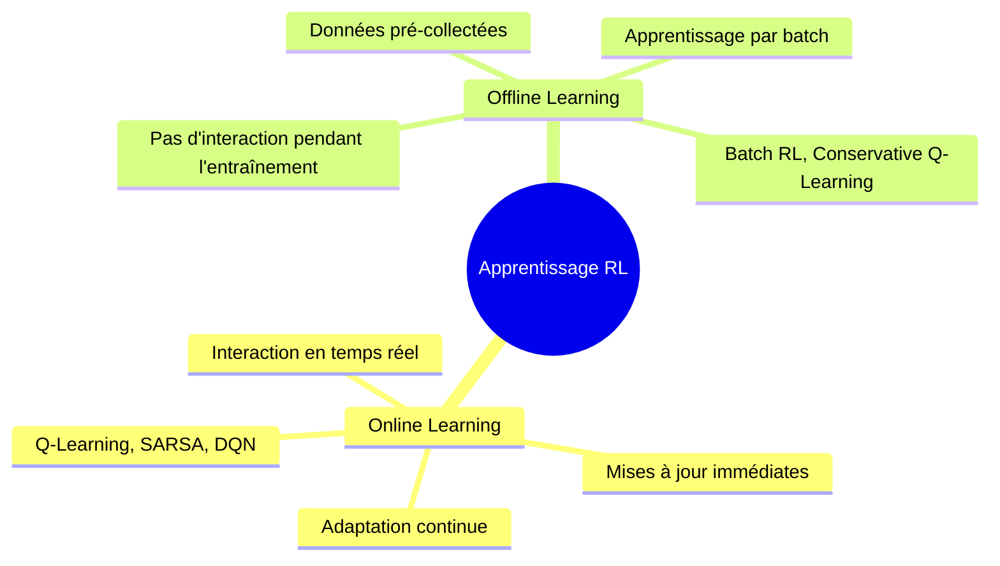
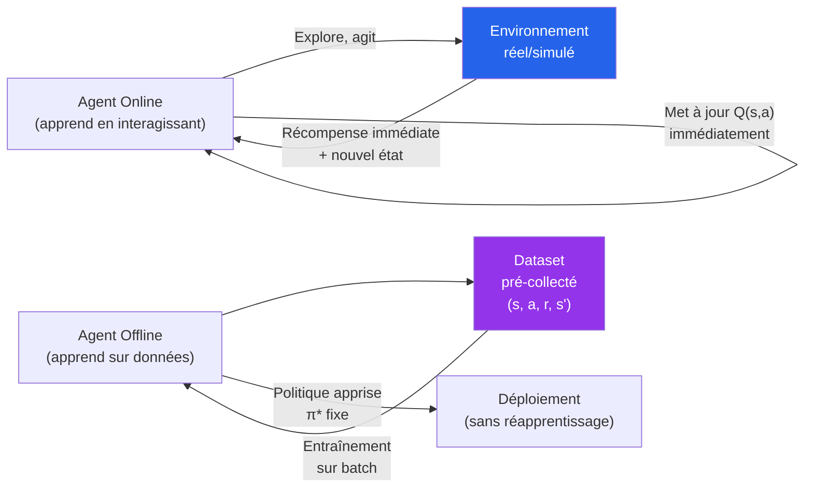
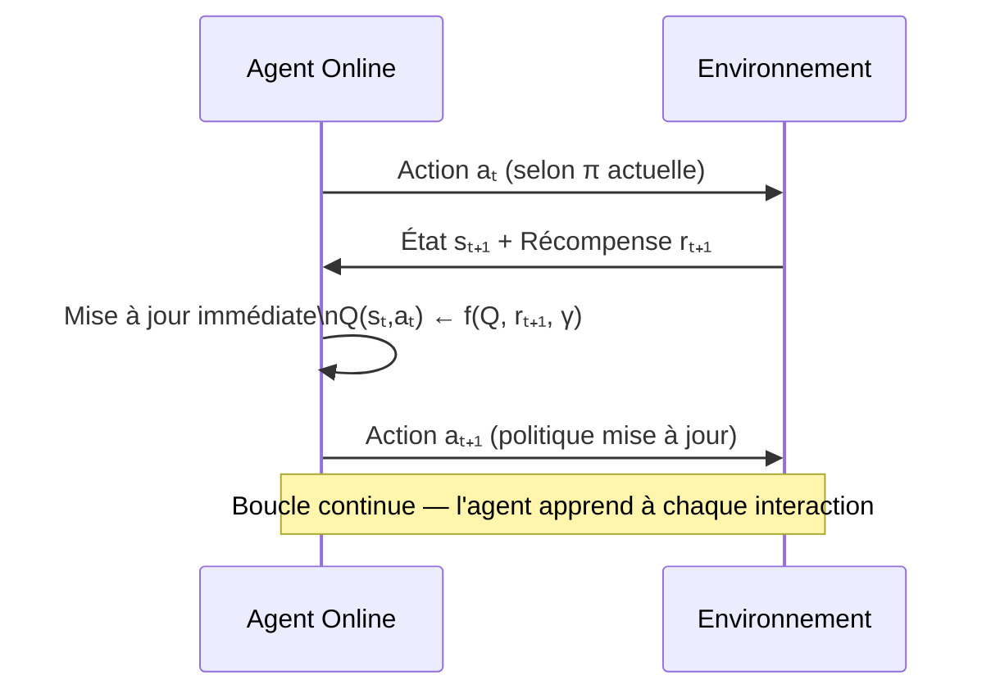
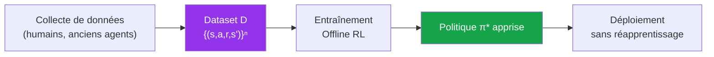
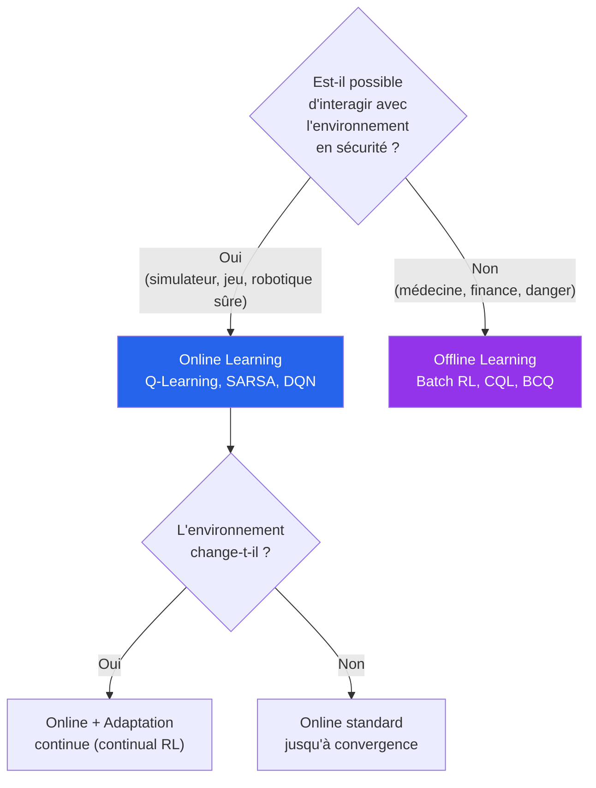
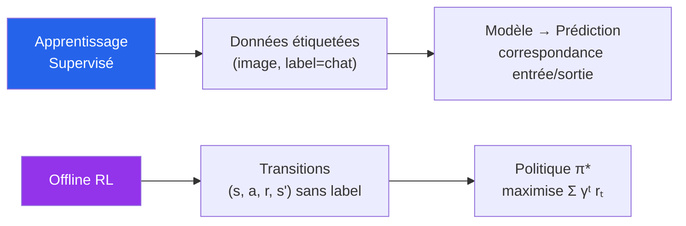
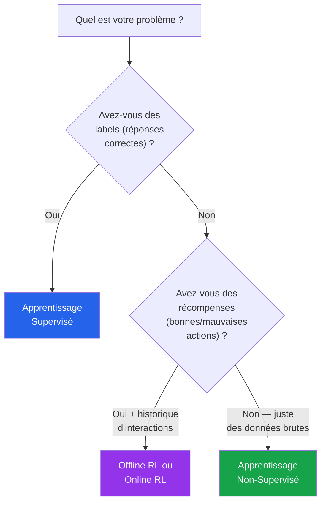
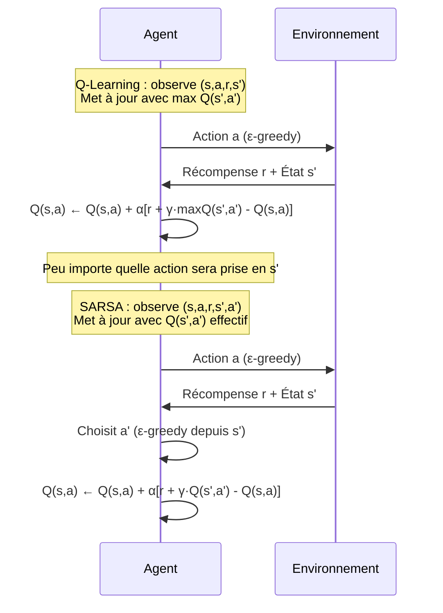
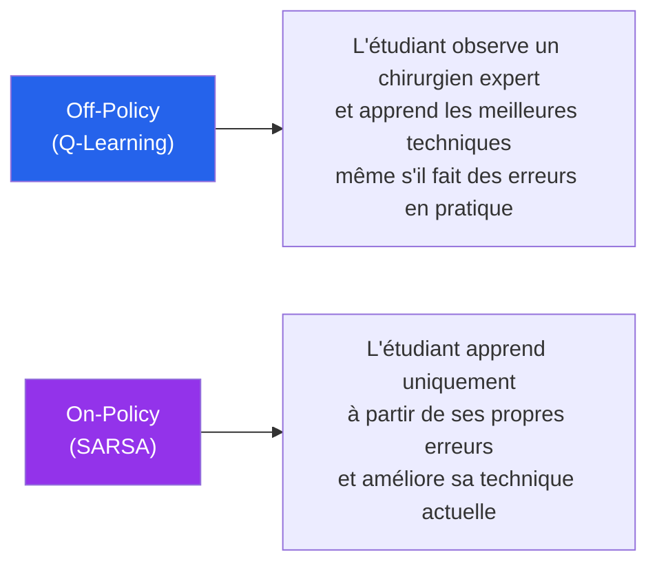
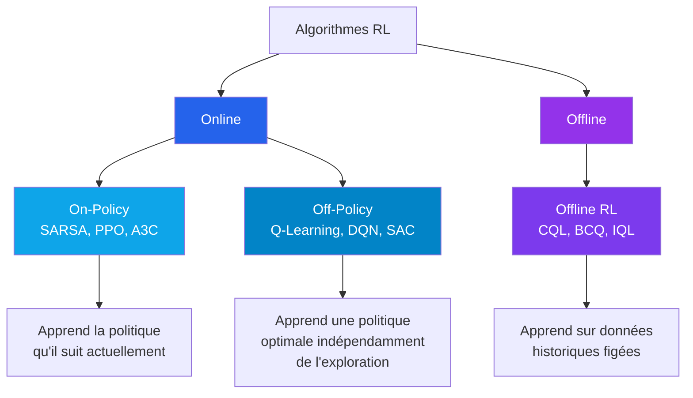

<a id="top"></a>

# Chapitre 7 - Apprentissage en Ligne vs Hors-Ligne (Online vs Offline)

## Table des matières

| # | Section |
|---|---|
| 1 | [Vue d'ensemble — Deux paradigmes d'apprentissage](#section-1) |
| 2 | [Apprentissage en Ligne (Online Learning)](#section-2) |
| 2a | &nbsp;&nbsp;&nbsp;↳ [Définition et caractéristiques](#section-2) |
| 2b | &nbsp;&nbsp;&nbsp;↳ [Exemples concrets](#section-2) |
| 2c | &nbsp;&nbsp;&nbsp;↳ [Online Learning au-delà du RL](#section-2) |
| 3 | [Apprentissage Hors-Ligne (Offline Learning)](#section-3) |
| 3a | &nbsp;&nbsp;&nbsp;↳ [Définition et caractéristiques](#section-3) |
| 3b | &nbsp;&nbsp;&nbsp;↳ [Exemples concrets](#section-3) |
| 4 | [Comparaison Online vs Offline](#section-4) |
| 5 | [Offline RL vs Apprentissage Supervisé](#section-5) |
| 5a | &nbsp;&nbsp;&nbsp;↳ [Points communs](#section-5) |
| 5b | &nbsp;&nbsp;&nbsp;↳ [Différences fondamentales](#section-5) |
| 6 | [Comparaison complète — Offline RL, Supervisé et Non-Supervisé](#section-6) |
| 7 | [Algorithmes Online RL — Q-Learning, SARSA, DQN](#section-7) |
| 7a | &nbsp;&nbsp;&nbsp;↳ [Q-Learning — Off-Policy](#section-7) |
| 7b | &nbsp;&nbsp;&nbsp;↳ [SARSA — On-Policy](#section-7) |
| 7c | &nbsp;&nbsp;&nbsp;↳ [Deep Q-Learning (DQN)](#section-7) |
| 8 | [On-Policy vs Off-Policy](#section-8) |
| 9 | [Quiz — Online vs Offline et algorithmes RL](#section-9) |
| 10 | [Ressources supplémentaires](#section-10) |
| 11 | [Synthèse du chapitre](#section-11) |

---

<a id="section-1"></a>

<details>
<summary>1 — Vue d'ensemble — Deux paradigmes d'apprentissage</summary>

<br/>

L'apprentissage par renforcement peut s'effectuer selon deux grandes approches qui diffèrent fondamentalement dans leur rapport aux données et à l'environnement.



---

### La question centrale

> **Quand l'agent apprend-il ?** Pendant l'interaction (en ligne) ou après avoir collecté des données (hors-ligne) ?

| Dimension | Online | Offline |
|---|---|---|
| **Quand apprend-il ?** | En temps réel, pendant l'interaction | Après collecte, sur données figées |
| **Qui génère les données ?** | L'agent lui-même | Un historique préexistant |
| **Peut-il explorer ?** | Oui — librement | Non — limité aux données disponibles |
| **Coût d'une erreur ?** | Immédiat et récupérable | Nul (simulation) ou indéfini |



</details>

<p align="right"><a href="#top">↑ Retour en haut</a></p>

---

<a id="section-2"></a>

<details>
<summary>2 — Apprentissage en Ligne (Online Learning)</summary>

<br/>

### Définition et caractéristiques

L'**apprentissage en ligne** consiste à entraîner un agent **en temps réel** — l'apprentissage se fait au fur et à mesure que l'agent interagit avec l'environnement. Chaque interaction met immédiatement à jour la politique ou la fonction de valeur de l'agent.

| Caractéristique | Description |
|---|---|
| **Mises à jour immédiates** | L'agent ajuste sa stratégie après chaque expérience (s, a, r, s') |
| **Apprentissage continu** | L'entraînement ne s'arrête pas — l'agent apprend en permanence |
| **Adaptation rapide** | Si l'environnement change, l'agent s'ajuste en temps réel |
| **Exploration active** | L'agent explore et exploite simultanément (ε-greedy) |
| **Mémoire courte possible** | Peut apprendre sans stocker tout l'historique |



---

### Exemples concrets

**En Apprentissage par Renforcement :**

| Application | Pourquoi Online ? |
|---|---|
| **Robot qui apprend à marcher** | Teste différentes postures en temps réel, ajuste après chaque chute |
| **Système de recommandation (YouTube, Netflix)** | Adapte les suggestions à chaque clic, visionnage ou like en temps réel |
| **Agent jouant à des jeux vidéo** | Joue des milliers de parties, met à jour sa Q-function après chaque action |
| **Trading algorithmique** | Ajuste ses décisions d'achat/vente à chaque tick du marché |

---

### Online Learning au-delà du RL

L'apprentissage en ligne ne se limite pas au RL — il existe dans tous les paradigmes :

**Apprentissage Supervisé en Ligne :**
- **Perceptron en ligne** : Les poids sont mis à jour après chaque exemple mal classifié
- **Stochastic Gradient Descent (SGD)** : Traite une seule instance à chaque étape — adapté aux flux de données continus
- _Exemple : Système de détection de spam qui ajuste son modèle à chaque nouvel email reçu_

**Apprentissage Non-Supervisé en Ligne :**
- **K-Means Incrémental** : Met à jour les centroïdes au fur et à mesure des nouvelles données
- **Auto-encodeurs en ligne** : Ajustent leurs poids progressivement sur les nouvelles données
- _Exemple : Clustering continu des comportements d'utilisateurs sur un site web_

> _L'apprentissage en ligne est particulièrement utile quand : (1) les données arrivent en flux continu, (2) l'environnement change constamment, ou (3) il est nécessaire d'adapter le modèle en temps réel sans tout réentraîner._

</details>

<p align="right"><a href="#top">↑ Retour en haut</a></p>

---

<a id="section-3"></a>

<details>
<summary>3 — Apprentissage Hors-Ligne (Offline Learning)</summary>

<br/>

### Définition et caractéristiques

L'**apprentissage hors-ligne** consiste à entraîner un agent en utilisant un **ensemble de données pré-collectées**. L'agent n'interagit pas directement avec l'environnement pendant l'apprentissage — il analyse des transitions enregistrées sous la forme :

```
(État initial s, Action prise a, Récompense reçue r, État suivant s')
```

| Caractéristique | Description |
|---|---|
| **Données fixes** | L'apprentissage se fait sur un dataset qui ne change pas |
| **Mises à jour différées** | L'agent apprend après avoir traité un batch de données |
| **Pas d'exploration** | Limité aux trajectoires déjà présentes dans le dataset |
| **Sécurité** | Aucun risque pendant l'entraînement — l'agent n'interagit pas avec l'environnement réel |
| **Scalabilité** | Peut utiliser de très grands datasets historiques |



---

### Exemples concrets

| Application | Pourquoi Offline ? |
|---|---|
| **Conduite autonome simulée** | Entraîné sur des millions de km de trajectoires enregistrées — impossible d'exposer une vraie voiture à toutes les situations |
| **Diagnostic médical** | Apprend sur des historiques de patients — les expériences directes seraient éthiquement impossibles |
| **Détection de fraude financière** | Entraîné sur l'historique d'opérations bancaires — pas d'interaction en temps réel nécessaire |
| **Politique de traitement en oncologie** | Apprend les meilleures séquences de traitements à partir de dossiers médicaux historiques |

> _L'apprentissage hors-ligne est essentiel quand les interactions directes avec l'environnement sont : **coûteuses** (robotique physique), **risquées** (médecine, aviation), **lentes** (expériences cliniques) ou **impossibles** (événements historiques non reproductibles)._

</details>

<p align="right"><a href="#top">↑ Retour en haut</a></p>

---

<a id="section-4"></a>

<details>
<summary>4 — Comparaison Online vs Offline</summary>

<br/>

### Tableau comparatif complet

| Critère | Apprentissage en Ligne (Online) | Apprentissage Hors-Ligne (Offline) |
|---|---|---|
| **Source des données** | Générées en temps réel par l'agent | Pré-collectées avant l'entraînement |
| **Interaction avec l'environnement** | Oui — pendant l'apprentissage | Non — seulement pour la collecte initiale |
| **Mises à jour** | Immédiates après chaque interaction | Différées — après traitement du batch |
| **Adaptabilité** | Très élevée — s'adapte aux changements | Faible — limitée par les données disponibles |
| **Exploration** | Active et continue (ε-greedy) | Absente — limitée aux données existantes |
| **Risque** | Peut faire des erreurs coûteuses en temps réel | Aucun risque pendant l'entraînement |
| **Coût de collecte** | Élevé si chaque interaction est coûteuse | Moins coûteux si l'historique est disponible |
| **Algorithmes principaux** | Q-Learning, SARSA, DQN, PPO (on-policy) | Batch Q-Learning, BCQ, CQL, IQL |
| **Domaines d'application** | Jeux, robotique, systèmes dynamiques, recommandation temps réel | Santé, finance, conduite autonome, sécurité |

---

### Quand choisir quelle méthode ?

| Situation | Méthode recommandée | Raison |
|---|---|---|
| Simulateur disponible, erreurs sans coût | **Online** | Peut explorer librement |
| Environnement réel risqué (médecine, industrie) | **Offline** | Pas d'interactions risquées |
| Données historiques abondantes | **Offline** | Exploiter l'existant |
| Environnement hautement dynamique | **Online** | Adaptation continue nécessaire |
| Temps d'entraînement critique | **Offline** | Batch plus contrôlable |
| Besoin de généralisation rapide | **Online** | Exploration active |



</details>

<p align="right"><a href="#top">↑ Retour en haut</a></p>

---

<a id="section-5"></a>

<details>
<summary>5 — Offline RL vs Apprentissage Supervisé</summary>

<br/>

Une question fréquente : **L'apprentissage hors-ligne est-il identique à l'apprentissage supervisé ?**

La réponse courte : **Non — mais ils partagent certains points communs.**

---

### Points communs

| Point commun | Description |
|---|---|
| **Données pré-collectées** | Dans les deux cas, les données sont disponibles avant l'entraînement |
| **Pas d'interaction en temps réel** | L'agent/modèle n'interagit pas avec l'environnement pendant l'entraînement |
| **Apprentissage par batch** | Les deux peuvent utiliser des lots de données pour les mises à jour |

> _Exemple d'apprentissage supervisé : Entraîner un réseau de neurones pour reconnaître des chiffres écrits à la main (MNIST). Chaque image est associée à une étiquette indiquant le chiffre correct (0-9)._

---

### Différences fondamentales

| Critère | Apprentissage Supervisé | Offline RL (Apprentissage Hors-Ligne) |
|---|---|---|
| **Type de données** | Exemples **étiquetés** — (entrée, réponse correcte) | Transitions **sans label** — (s, a, r, s') |
| **Objectif** | Apprendre une correspondance entrée→sortie | Maximiser une récompense cumulative sur le long terme |
| **Signal d'apprentissage** | Labels fixes et prédéfinis | Récompenses issues d'interactions passées |
| **Type de sortie** | Classification ou régression | Politique de décision (quelle action prendre) |
| **Optimisation** | Minimiser une fonction de perte (MSE, cross-entropy) | Maximiser une fonction de récompense cumulative |
| **Dépendance temporelle** | Généralement indépendante (chaque exemple est isolé) | Séquentielle — chaque décision influence les futures |



---

### En quoi c'est différent de l'apprentissage non-supervisé ?

L'**apprentissage non-supervisé** découvre des structures cachées dans des données **sans aucun signal de retour** (clustering, réduction de dimension).

L'**Offline RL** n'est pas non-supervisé car il utilise des **récompenses explicites** pour évaluer la qualité des actions entreprises — le signal existe, il est juste différé et cumulatif.

| Paradigme | Signal d'apprentissage | Objectif |
|---|---|---|
| **Supervisé** | Labels (réponses correctes) | Prédire la bonne sortie |
| **Non-supervisé** | Aucun | Découvrir des structures dans les données |
| **Offline RL** | Récompenses (bonnes/mauvaises actions) | Maximiser la récompense cumulée |
| **Online RL** | Récompenses immédiates | Maximiser la récompense cumulée (en temps réel) |

</details>

<p align="right"><a href="#top">↑ Retour en haut</a></p>

---

<a id="section-6"></a>

<details>
<summary>6 — Comparaison complète — Offline RL, Supervisé et Non-Supervisé</summary>

<br/>

### Les trois paradigmes côte à côte

| Critère | Apprentissage Supervisé | Apprentissage Non-Supervisé | Offline RL |
|---|---|---|---|
| **Données** | Étiquetées (input, label) | Non étiquetées | Transitions (s, a, r, s') |
| **But** | Prédire une sortie correcte | Découvrir des patterns | Maximiser la récompense cumulée |
| **Signal** | Labels précis | Aucun | Récompenses passées |
| **Interaction** | Non | Non | Non (mais données issues d'interactions) |
| **Optimisation** | Minimiser une loss (MSE, CE) | Maximiser une cohérence (clustering, reconstruction) | Maximiser Σ γᵗ rₜ |
| **Sortie** | Classificateur / Régresseur | Clusters / Représentations | Politique de décision π* |
| **Séquentiel ?** | Non | Non | Oui — décisions séquentielles |
| **Exemple** | MNIST (chiffres écrits) | K-Means sur données clients | Conduite autonome sur trajectoires enregistrées |

---

### Pourquoi ces distinctions comptent en pratique



> _La confusion entre ces paradigmes est fréquente car ils partagent certaines techniques (réseaux de neurones, descente de gradient). La différence fondamentale est dans le **type de signal** utilisé pour apprendre et dans le **type de sortie** produite._

</details>

<p align="right"><a href="#top">↑ Retour en haut</a></p>

---

<a id="section-7"></a>

<details>
<summary>7 — Algorithmes Online RL — Q-Learning, SARSA, DQN</summary>

<br/>

Les algorithmes d'apprentissage en ligne en RL mettent à jour leur estimation de la fonction de valeur **immédiatement après chaque interaction**. Voici les trois algorithmes fondamentaux.

---

### Q-Learning — Off-Policy

Le **Q-Learning** est l'algorithme de référence du RL en ligne. Il met à jour la **fonction Q(s,a)** — la valeur de prendre l'action a depuis l'état s — après chaque interaction.

**Règle de mise à jour :**

$$Q(s, a) \leftarrow (1 - \alpha) \cdot Q(s, a) + \alpha \left[ r + \gamma \max_{a'} Q(s', a') \right]$$

Ou de manière équivalente :

$$Q(s, a) \leftarrow Q(s, a) + \alpha \left[ r + \gamma \max_{a'} Q(s', a') - Q(s, a) \right]$$

| Symbole | Signification |
|---|---|
| **α** | Taux d'apprentissage (learning rate) — importance donnée aux nouvelles informations |
| **γ** | Facteur d'actualisation — importance des récompenses futures |
| **r** | Récompense immédiate après l'action a dans l'état s |
| **s'** | Nouvel état atteint après l'action a |
| **max Q(s',a')** | Meilleure valeur Q possible depuis le nouvel état s' |

**Pourquoi Q-Learning est Off-Policy :**

Q-Learning apprend la politique optimale **indépendamment de la politique actuellement suivie par l'agent**. Même si l'agent explore aléatoirement (via ε-greedy), la mise à jour utilise le `max` — c'est-à-dire la **meilleure action théorique** depuis s', pas l'action réellement choisie.

> _L'agent peut se comporter de manière exploratoire (behaviour policy = ε-greedy) tout en apprenant une politique optimale déterministe (target policy = greedy). Ces deux politiques sont différentes — d'où le terme "off-policy"._

---

### SARSA — On-Policy

**SARSA** (State-Action-Reward-State-Action) est similaire au Q-Learning, mais met à jour Q(s,a) en fonction de **l'action réellement choisie** par la politique actuelle — pas de l'action optimale hypothétique.

**Règle de mise à jour :**

$$Q(s, a) \leftarrow Q(s, a) + \alpha \left[ r + \gamma Q(s', a') - Q(s, a) \right]$$

Ou de manière équivalente :

$$Q(s, a) \leftarrow (1 - \alpha) \cdot Q(s, a) + \alpha \left[ r + \gamma Q(s', a') \right]$$

**Différence clé avec Q-Learning :**

| Aspect | Q-Learning | SARSA |
|---|---|---|
| **Type** | Off-Policy | On-Policy |
| **Mise à jour** | Utilise max Q(s', a') — meilleure action possible | Utilise Q(s', a') — action réellement choisie |
| **Politique apprise** | Optimale (indépendante du comportement) | Suit la politique courante |
| **Stabilité** | Peut être instable dans environnements très stochastiques | Plus stable — suit la politique effectivement utilisée |
| **Exploration** | Apprend πoptimale même en explorant | Apprend à partir de la politique d'exploration courante |



---

### Deep Q-Learning (DQN)

Le **DQN** (Deep Q-Network) remplace la table Q par un **réseau de neurones profond** pour approximer Q(s,a). Cela permet de gérer des environnements avec un **espace d'états immense** (images, états continus) où une table Q serait impossible à stocker.

**Fonctionnement :**
- Le réseau reçoit l'état s en entrée et produit Q(s,a) pour toutes les actions en sortie
- Les poids du réseau sont mis à jour après chaque interaction (ou mini-batch)
- Deux innovations clés : **Experience Replay** (mémoire de transitions) et **Target Network** (réseau stable pour calculer les cibles)

| Composant | Rôle |
|---|---|
| **Réseau principal** | Estime Q(s,a) — mis à jour à chaque étape |
| **Target Network** | Copie figée du réseau principal — mise à jour périodique |
| **Experience Replay** | Stocke les transitions (s,a,r,s') et entraîne sur des mini-batchs aléatoires |

> _DQN a été rendu célèbre par DeepMind en 2013 quand il a atteint un niveau surhumain sur 49 jeux Atari en partant uniquement des pixels de l'écran. C'est le premier algorithme RL à avoir réussi ce feat à large échelle._

</details>

<p align="right"><a href="#top">↑ Retour en haut</a></p>

---

<a id="section-8"></a>

<details>
<summary>8 — On-Policy vs Off-Policy</summary>

<br/>

La distinction **On-Policy vs Off-Policy** est l'une des plus importantes en RL — elle détermine si l'agent apprend à partir de **sa propre politique actuelle** ou d'une **politique différente**.

| Concept | Définition | Implication |
|---|---|---|
| **On-Policy** | L'agent apprend à évaluer ET améliorer la politique qu'il suit actuellement | La politique d'exploration et la politique cible sont **identiques** |
| **Off-Policy** | L'agent apprend une politique différente de celle qu'il utilise pour explorer | La politique d'exploration (behaviour) ≠ politique cible (target) |

---

### Le lien avec Online/Offline

| Type | On/Off Policy | Description |
|---|---|---|
| **Q-Learning** | Off-Policy + Online | Apprend πoptimale en explorant avec ε-greedy |
| **SARSA** | On-Policy + Online | Apprend la politique ε-greedy elle-même |
| **DQN** | Off-Policy + Online | Comme Q-Learning mais avec réseaux de neurones |
| **Offline RL (CQL, BCQ)** | Off-Policy + Offline | Apprend une politique sur données collectées par d'autres |

---

### Analogie : Le chirurgien et l'étudiant en médecine



**Quand préférer On-Policy vs Off-Policy :**

| Situation | Recommandation |
|---|---|
| Environnement stable, politique d'exploration efficace | **Off-Policy** (Q-Learning) — convergence plus rapide |
| Environnement stochastique, politique conservatrice nécessaire | **On-Policy** (SARSA) — plus stable |
| Données collectées par des humains experts | **Off-Policy Offline** (CQL, BCQ) |
| Apprentissage en temps réel, adaptation continue | **On-Policy Online** (SARSA, PPO) |

> _Important : Q-Learning peut être utilisé **en ligne** (mise à jour après chaque interaction) ET **hors-ligne** (entraînement sur un batch de transitions). La notion On/Off-Policy est distincte de la notion Online/Offline — ne pas les confondre !_

</details>

<p align="right"><a href="#top">↑ Retour en haut</a></p>

---

<a id="section-9"></a>

<details>
<summary>9 — Quiz — Online vs Offline et algorithmes RL</summary>

<br/>

Ce quiz évalue votre compréhension des concepts du chapitre 7. Répondez à chaque question, puis cliquez sur **💡 Voir la solution** pour vérifier.

---

**Question 1 :** Quelle est la caractéristique principale de l'**apprentissage en ligne (Online Learning)** ?

a) L'agent apprend exclusivement à partir de données pré-collectées

b) L'agent met à jour sa politique immédiatement après chaque interaction avec l'environnement

c) L'agent n'interagit jamais directement avec l'environnement

d) L'agent utilise uniquement des réseaux de neurones pour apprendre

<details>
<summary>💡 Voir la solution</summary>

✅ **Réponse : b)**

L'apprentissage en ligne se caractérise par des **mises à jour immédiates** — après chaque interaction (s, a, r, s'), l'agent met à jour immédiatement sa fonction de valeur ou sa politique. Cela permet une adaptation continue et en temps réel à l'environnement.

</details>

---

**Question 2 :** Dans quel contexte l'**apprentissage hors-ligne (Offline Learning)** est-il préférable ?

a) Lorsque l'environnement est simple et sans risques

b) Lorsque les interactions avec l'environnement réel sont coûteuses, risquées ou impossibles

c) Lorsque l'agent a besoin d'une adaptation rapide aux changements

d) Lorsque les données historiques sont indisponibles

<details>
<summary>💡 Voir la solution</summary>

✅ **Réponse : b)**

L'apprentissage hors-ligne est préférable quand les interactions directes sont **coûteuses** (robotique physique), **risquées** (médecine, aviation), ou **impossibles** (événements historiques non reproductibles). L'agent apprend sur des données déjà collectées, sans risque pendant l'entraînement.

</details>

---

**Question 3 :** Quelle est la différence fondamentale entre l'**Offline RL** et l'**apprentissage supervisé** ?

a) L'Offline RL utilise des labels explicites, l'apprentissage supervisé n'en a pas

b) L'Offline RL n'utilise pas de données, l'apprentissage supervisé si

c) L'Offline RL maximise une récompense cumulée séquentielle, l'apprentissage supervisé apprend une correspondance entrée-sortie fixe

d) Les deux sont identiques — ce sont des synonymes

<details>
<summary>💡 Voir la solution</summary>

✅ **Réponse : c)**

La différence fondamentale : l'Offline RL travaille sur des **transitions (s, a, r, s') sans label explicite** et cherche à maximiser une récompense cumulée sur plusieurs étapes. L'apprentissage supervisé a des **labels précis** et apprend une correspondance directe entrée→sortie sans notion de séquentialité ni de récompense.

</details>

---

**Question 4 :** Dans l'algorithme **Q-Learning**, à quoi correspond le terme `max Q(s', a')` dans la formule de mise à jour ?

$$Q(s, a) \leftarrow Q(s, a) + \alpha \left[ r + \gamma \max_{a'} Q(s', a') - Q(s, a) \right]$$

a) La valeur de l'action aléatoire choisie par l'agent

b) La valeur de la meilleure action possible depuis le nouvel état s'

c) La récompense immédiate obtenue après l'action a

d) Le facteur d'actualisation appliqué aux récompenses futures

<details>
<summary>💡 Voir la solution</summary>

✅ **Réponse : b)**

`max Q(s', a')` représente **la meilleure valeur Q possible depuis le nouvel état s'** — peu importe l'action que l'agent choisira réellement. C'est ce qui rend Q-Learning **Off-Policy** : il apprend en supposant que l'agent prendra toujours la meilleure action future, même si en pratique il explore aléatoirement.

</details>

---

**Question 5 :** Quelle est la différence entre **Q-Learning** et **SARSA** ?

a) Q-Learning est hors-ligne (Offline), SARSA est en ligne (Online)

b) Q-Learning utilise la meilleure action possible (max) pour la mise à jour, SARSA utilise l'action réellement choisie par la politique courante

c) Q-Learning nécessite un réseau de neurones, SARSA utilise une table

d) SARSA optimise pour les récompenses immédiates, Q-Learning pour les récompenses futures

<details>
<summary>💡 Voir la solution</summary>

✅ **Réponse : b)**

La différence clé : **Q-Learning** est Off-Policy — il utilise `max Q(s',a')` (meilleure action théorique) indépendamment de ce que l'agent fait vraiment. **SARSA** est On-Policy — il utilise `Q(s',a')` où a' est l'action **réellement choisie** par la politique courante. SARSA apprend donc la politique qu'il suit effectivement.

</details>

---

**Question 6 :** Qu'est-ce qui distingue un algorithme **On-Policy** d'un algorithme **Off-Policy** ?

a) On-Policy apprend hors-ligne, Off-Policy apprend en ligne

b) On-Policy apprend la politique qu'il suit actuellement, Off-Policy apprend une politique différente de celle utilisée pour explorer

c) On-Policy utilise des réseaux de neurones, Off-Policy utilise des tables

d) Il n'y a pas de différence — les deux termes sont synonymes

<details>
<summary>💡 Voir la solution</summary>

✅ **Réponse : b)**

**On-Policy** : la politique d'exploration (behaviour policy) et la politique cible (target policy) sont la même. L'agent améliore la politique qu'il utilise pour se comporter. **Off-Policy** : les deux politiques sont différentes — l'agent peut explorer aléatoirement tout en apprenant une politique optimale différente. Q-Learning est Off-Policy, SARSA est On-Policy.

</details>

---

**Question 7 :** Pourquoi le **DQN** (Deep Q-Network) a-t-il été une avancée majeure par rapport au Q-Learning standard ?

a) Il est plus rapide à entraîner

b) Il permet de gérer des environnements avec un espace d'états très grand (ex: images) en remplaçant la table Q par un réseau de neurones

c) Il n'utilise pas de facteur d'actualisation γ

d) Il est exclusivement utilisé en apprentissage hors-ligne

<details>
<summary>💡 Voir la solution</summary>

✅ **Réponse : b)**

Le Q-Learning standard utilise une **table Q** — impossible à stocker pour des états comme des images Atari (224×224 pixels × 4 frames = des milliards d'états possibles). Le DQN remplace cette table par un **réseau de neurones profond** qui approxime Q(s,a) pour n'importe quel état, permettant de résoudre des problèmes beaucoup plus complexes.

</details>

---

**Question 8 :** Un système de recommandation de films adapte ses suggestions en fonction de chaque clic et visionnage de l'utilisateur en temps réel. Quel type d'apprentissage utilise-t-il ?

a) Apprentissage hors-ligne (Offline Learning)

b) Apprentissage supervisé

c) Apprentissage en ligne (Online Learning)

d) Apprentissage non-supervisé

<details>
<summary>💡 Voir la solution</summary>

✅ **Réponse : c)**

Le système adapte ses recommandations **immédiatement après chaque interaction** (clic, visionnage, like) — c'est la définition de l'**apprentissage en ligne**. Netflix et YouTube utilisent des variantes de RL online pour optimiser l'engagement des utilisateurs en temps réel.

</details>

---

**Question 9 :** Calculez la mise à jour Q-Learning pour les valeurs suivantes : Q(s,a) = 5, r = 2, γ = 0.9, max Q(s',a') = 8, α = 0.1.

$$Q(s, a) \leftarrow Q(s, a) + \alpha \left[ r + \gamma \max_{a'} Q(s', a') - Q(s, a) \right]$$

<details>
<summary>💡 Voir la solution</summary>

✅ **Réponse : Q(s,a) = 5.42**

Calcul étape par étape :
1. Cible TD : r + γ · max Q(s',a') = 2 + 0.9 × 8 = 2 + 7.2 = **9.2**
2. Erreur TD : Cible - Q(s,a) = 9.2 - 5 = **4.2**
3. Mise à jour : Q(s,a) + α × Erreur TD = 5 + 0.1 × 4.2 = **5.42**

L'erreur TD positive (9.2 > 5) indique que l'agent a **sous-estimé** la valeur de cette paire (s,a) — la mise à jour l'augmente vers la cible réelle.

</details>

---

**Question 10 :** Un agent de santé apprend les meilleures séquences de traitements en analysant des milliers de dossiers médicaux historiques. Quelle approche utilise-t-il et pourquoi ?

a) Online Learning — pour adapter le traitement en temps réel à chaque patient

b) Offline Learning — car les expériences directes sur les patients seraient éthiquement inacceptables

c) Apprentissage supervisé — car les dossiers médicaux ont des labels précis

d) Apprentissage non-supervisé — car il n'y a pas de récompenses définies

<details>
<summary>💡 Voir la solution</summary>

✅ **Réponse : b)**

L'**Offline RL** est idéal ici : les interactions directes avec des patients pour "explorer" différentes stratégies thérapeutiques seraient éthiquement inacceptables. L'agent apprend à partir de trajectoires historiques (état du patient, traitement administré, évolution) sans jamais interagir directement avec un patient réel pendant l'entraînement.

</details>

</details>

<p align="right"><a href="#top">↑ Retour en haut</a></p>

---

<a id="section-10"></a>

<details>
<summary>10 — Ressources supplémentaires</summary>

<br/>

### Références fondamentales

| Ressource | Contenu | Accès |
|---|---|---|
| **Sutton & Barto — Chapitres 5-6** | Q-Learning, SARSA, TD-Learning | [incompleteideas.net](http://incompleteideas.net/book/the-book-2nd.html) |
| **DQN Paper (Mnih et al., 2015)** | Human-level control through deep reinforcement learning | [Nature](https://www.nature.com/articles/nature14236) |
| **Offline RL Tutorial (Levine et al.)** | Comprendre l'Offline RL en profondeur | arxiv.org/abs/2005.01643 |
| **OpenAI Spinning Up — Q-Learning** | Implémentation Q-Learning en Python | spinningup.openai.com |

### Comparaison rapide des algorithmes

| Algorithme | Type | Online/Offline | Espace d'états | Cas d'usage |
|---|---|---|---|---|
| **Q-Learning** | Off-Policy | Les deux | Discret (petit) | Labyrinthes, GridWorld |
| **SARSA** | On-Policy | Online | Discret (petit) | Environnements stochastiques |
| **DQN** | Off-Policy | Online | Continu/Images | Jeux Atari, robotique |
| **PPO** | On-Policy | Online | Continu | Robotique, contrôle |
| **SAC** | Off-Policy | Online | Continu | Robotique physique |
| **CQL/BCQ** | Off-Policy | **Offline** | Tous | Médecine, finance |

</details>

<p align="right"><a href="#top">↑ Retour en haut</a></p>

---

<a id="section-11"></a>

<details>
<summary>11 — Synthèse du chapitre</summary>

<br/>

### Points clés à retenir

| Concept | Définition essentielle |
|---|---|
| **Online Learning** | Apprentissage en temps réel — mise à jour immédiate après chaque interaction |
| **Offline Learning** | Apprentissage sur données pré-collectées — pas d'interaction pendant l'entraînement |
| **Offline RL ≠ Supervisé** | Pas de labels — transitions (s,a,r,s') — optimisation séquentielle |
| **On-Policy** | Apprend la politique qu'il suit (SARSA) |
| **Off-Policy** | Apprend une politique différente de celle utilisée (Q-Learning) |
| **Q-Learning** | Off-Policy, utilise max Q(s',a') — optimise la politique cible |
| **SARSA** | On-Policy, utilise Q(s',a') effectif — suit la politique courante |
| **DQN** | Q-Learning + réseau de neurones — pour grands espaces d'états |

---

### La grande carte des algorithmes RL



---

### Connexion avec les chapitres suivants

| Chapitre | Contenu | Lien avec ce chapitre |
|---|---|---|
| **Chapitre 8** | Value-Based vs Policy-Based | Approfondit les types d'algorithmes (On/Off Policy) |
| **Chapitre 9** | Équations de Bellman | Base mathématique du Q-Learning et SARSA |
| **Chapitre 10** | Q-Learning pratique | Implémentation de l'algorithme vu dans ce chapitre |
| **Chapitre 17** | DQN | Développement complet du Deep Q-Network |

</details>

<p align="right"><a href="#top">↑ Retour en haut</a></p>

---

<p align="center">
  <em>Tous droits réservés. Toute reproduction, diffusion, utilisation ou adaptation de ce cours, en tout ou en partie, est strictement interdite sans l'autorisation écrite préalable de Dr. Haythem REHOUMA.</em>
</p>

<p align="center">
  <strong>Cours créé par Dr. Haythem REHOUMA — Apprentissage par Renforcement</strong>
</p>

<br/>

<p align="center">
  <a href="#top" style="display: inline-block; background: #2563eb; color: #ffffff; text-decoration: none; font-size: 1.1rem; font-weight: 700; padding: 14px 40px; border-radius: 10px; letter-spacing: 0.3px;">
    ↑ Retour en haut du cours
  </a>
</p>
