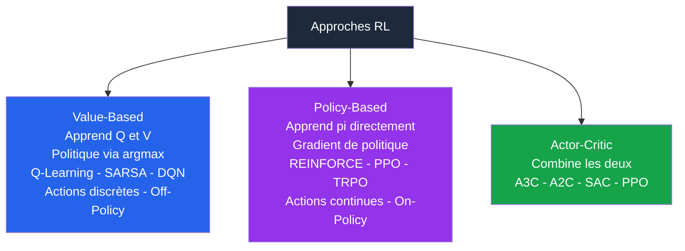
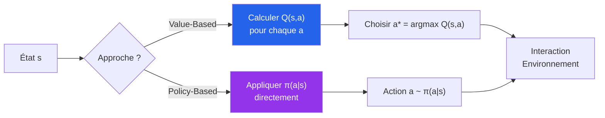
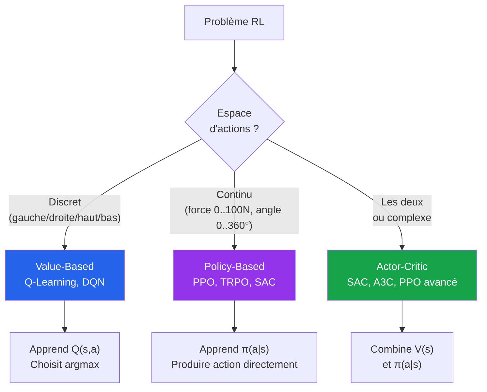
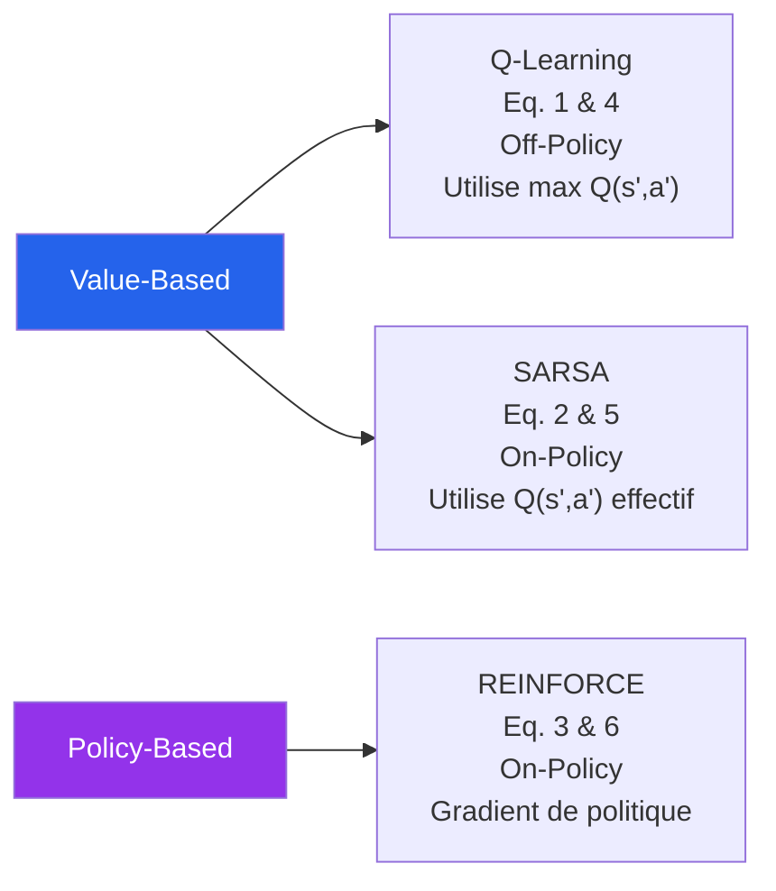
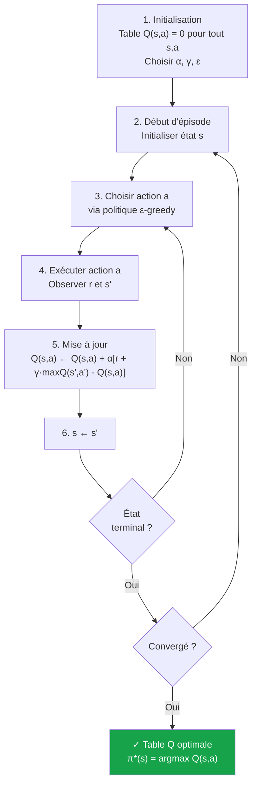
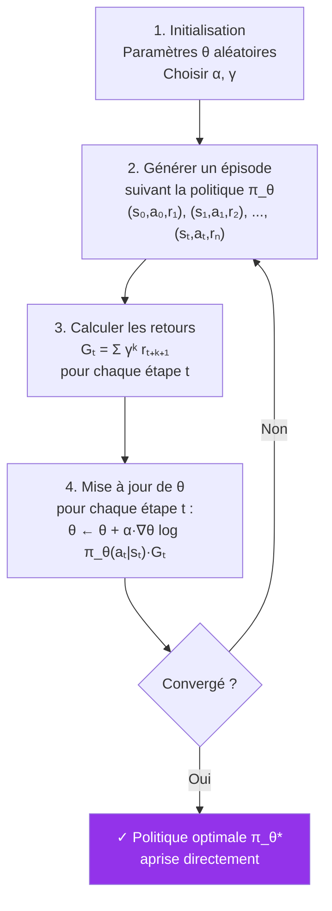
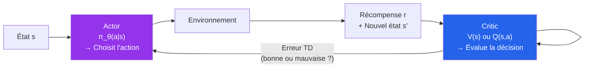
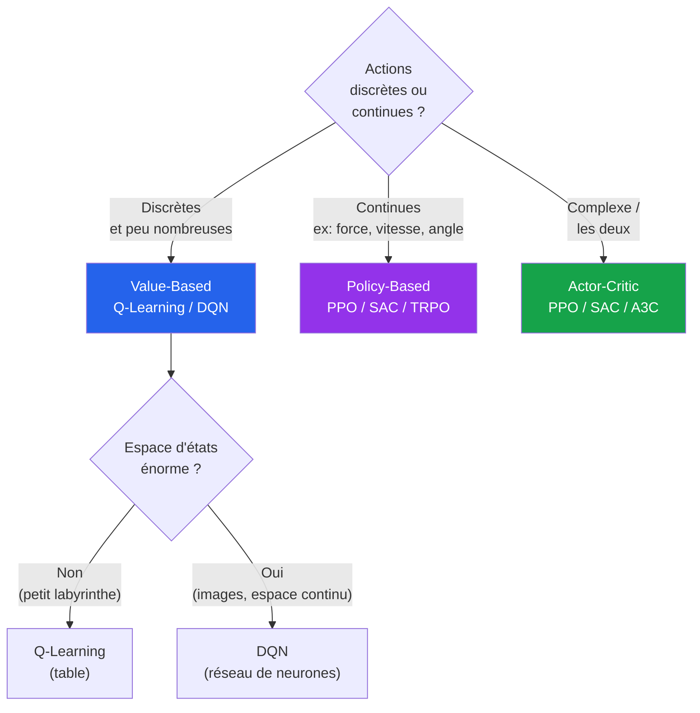
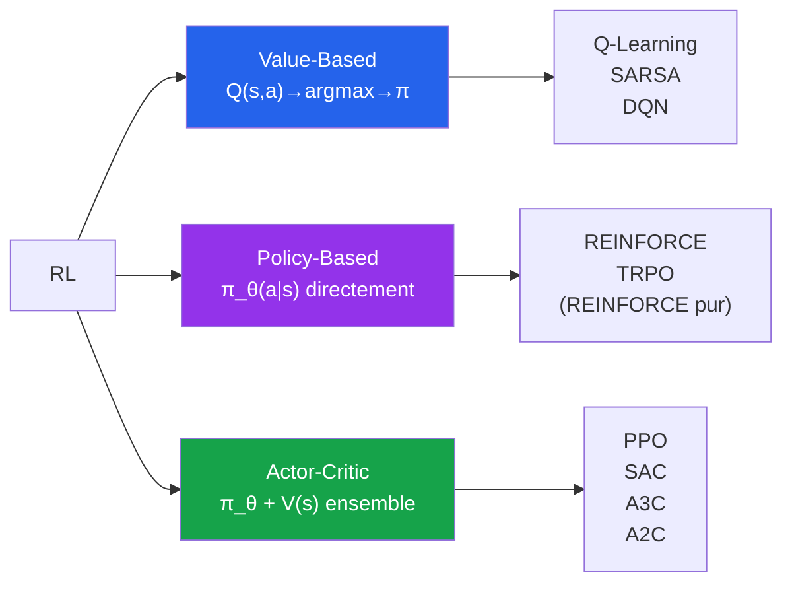

# Chapitre 8 - Différence entre Approches Value-Based et Policy-Based

## Table des matières

| # | Section |
|---|---|
| 1 | [Vue d'ensemble — Deux familles d'algorithmes RL](#section-1) |
| 2 | [Méthodes Value-Based — Apprendre la valeur des actions](#section-2) |
| 2a | &nbsp;&nbsp;&nbsp;↳ [Concept et fonctionnement](#section-2) |
| 2b | &nbsp;&nbsp;&nbsp;↳ [Algorithmes principaux](#section-2) |
| 2c | &nbsp;&nbsp;&nbsp;↳ [Avantages et inconvénients](#section-2) |
| 3 | [Méthodes Policy-Based — Apprendre directement la stratégie](#section-3) |
| 3a | &nbsp;&nbsp;&nbsp;↳ [Concept et fonctionnement](#section-3) |
| 3b | &nbsp;&nbsp;&nbsp;↳ [Algorithmes principaux](#section-3) |
| 3c | &nbsp;&nbsp;&nbsp;↳ [Avantages et inconvénients](#section-3) |
| 4 | [Comparaison directe Value-Based vs Policy-Based](#section-4) |
| 5 | [Les équations fondamentales](#section-5) |
| 5a | &nbsp;&nbsp;&nbsp;↳ [Q-Learning (standard et refactorisé)](#section-5) |
| 5b | &nbsp;&nbsp;&nbsp;↳ [SARSA (standard et refactorisé)](#section-5) |
| 5c | &nbsp;&nbsp;&nbsp;↳ [Gradient de Politique REINFORCE (standard et refactorisé)](#section-5) |
| 6 | [Démonstration — Q-Learning pas à pas](#section-6) |
| 7 | [Démonstration — REINFORCE pas à pas](#section-7) |
| 8 | [Actor-Critic — Le meilleur des deux mondes](#section-8) |
| 9 | [Quand choisir quelle approche ?](#section-9) |
| 10 | [Quiz — Value-Based vs Policy-Based](#section-10) |
| 11 | [Ressources supplémentaires](#section-11) |
| 12 | [Synthèse du chapitre](#section-12) |

---

1 — Vue d'ensemble — Deux familles d'algorithmes RL

 

En apprentissage par renforcement, tous les algorithmes cherchent à trouver la **politique optimale π*** — mais ils diffèrent fondamentalement dans **la façon d'y parvenir**.

> **Question centrale :** Pour maximiser mes récompenses, dois-je d'abord **évaluer la valeur de chaque action** (Value-Based), ou dois-je **apprendre directement quelle action faire** (Policy-Based) ?

---

### L'intuition fondamentale

| Approche | Question posée | Méthode |
|---|---|---|
| **Value-Based** | "Quelle est la **valeur** de cette action dans cet état ?" | Calcule Q(s,a), puis choisit le max |
| **Policy-Based** | "Quelle **action** dois-je directement prendre dans cet état ?" | Apprend π(a\|s) sans passer par les valeurs |

> _Analogie : Un joueur d'échecs Value-Based **évalue chaque coup** (ce coup vaut 8.5, cet autre 7.2) avant de jouer celui avec le meilleur score. Un joueur Policy-Based a appris intuitivement **quel coup jouer** dans chaque position, sans calculer explicitement leur valeur._

<a href="#top">↑ Retour en haut</a>

---

2 — Méthodes Value-Based — Apprendre la valeur des actions

 

### Concept et fonctionnement

Les méthodes **Value-Based** apprennent une **fonction de valeur** qui estime l'utilité d'être dans un état ou d'exécuter une action depuis cet état. La politique optimale est ensuite **dérivée implicitement** en sélectionnant l'action de valeur maximale.

> _Une méthode Value-Based dit : « Si je suis dans cet état et que je fais cette action, quelle récompense totale puis-je espérer à long terme ? » Par exemple dans un jeu : « Si je suis dans telle position et que je saute, vais-je gagner beaucoup de points ? » — puis l'agent choisit toujours l'action avec la **valeur estimée la plus élevée**._

#### Les deux fonctions de valeur

| Fonction | Notation | Définition |
|---|---|---|
| **Fonction valeur d'état** | V(s) | Récompense cumulée attendue depuis l'état s en suivant π |
| **Fonction valeur d'action** | Q(s,a) | Récompense cumulée attendue en prenant a depuis s puis suivant π |

$$V^\pi(s) = \mathbb{E}\left[\sum_{t=0}^{\infty} \gamma^t r_{t+1} \mid s_0 = s, \pi\right]$$

$$Q^\pi(s, a) = \mathbb{E}\left[\sum_{t=0}^{\infty} \gamma^t r_{t+1} \mid s_0 = s, a_0 = a, \pi\right]$$

#### De la valeur à la politique

$$\pi^{\ast}(s) = \arg\max_a Q^{\ast}(s, a)$$

---

### Algorithmes principaux

| Algorithme | Type | Caractéristique principale |
|---|---|---|
| **Q-Learning** | Off-Policy, Tabular | Apprend Q(s,a) via une table — met à jour avec le max des Q futurs |
| **SARSA** | On-Policy, Tabular | Apprend Q(s,a) — met à jour avec l'action réellement choisie |
| **Deep Q-Learning (DQN)** | Off-Policy, Deep | Utilise un réseau de neurones pour approximer Q(s,a) |
| **Double DQN** | Off-Policy, Deep | Réduit la surestimation des valeurs Q |
| **Dueling DQN** | Off-Policy, Deep | Sépare V(s) et l'avantage A(s,a) dans le réseau |

---

### Avantages et inconvénients

#### Avantages
- Convergence garantie vers une politique optimale sous conditions adéquates
- Efficace pour les espaces d'actions **discrets et limités**
- Bien adapté aux environnements avec des transitions claires et explorables

#### Inconvénients
- **Ne convient pas aux espaces d'actions continus** — impossible d'évaluer une infinité d'actions
- Exploration intensive nécessaire pour bien estimer toutes les valeurs
- Apprentissage lent dans des environnements complexes ou à dynamique variable

> _La limite des actions continues est fondamentale : pour un robot qui doit contrôler la force exacte d'une prise (entre 0 et 100 Newtons avec une précision de 0.001 N), créer une table Q avec 100 000 entrées par état est impossible._

<a href="#top">↑ Retour en haut</a>

---

3 — Méthodes Policy-Based — Apprendre directement la stratégie

 

### Concept et fonctionnement

Les méthodes **Policy-Based** apprennent **directement une politique** qui définit quelles actions l'agent doit entreprendre dans chaque état. L'agent n'évalue pas la valeur des actions — il apprend directement **comment agir**.

> _Une méthode Policy-Based dit : « Au lieu de calculer combien vaut chaque coup dans un jeu, j'apprends directement à jouer comme un expert : dans cette situation, je saute ; dans celle-ci, je recule. » — l'apprentissage est plus intuitif, moins computationnel._

#### La politique comme fonction paramétrique

$$\pi_\theta(a | s) = P(a | s; \theta)$$

- **θ** représente les paramètres du modèle (poids d'un réseau de neurones)
- La politique associe à chaque état une **distribution de probabilités** sur les actions
- L'entraînement consiste à **optimiser θ** pour maximiser la récompense cumulée

#### Objectif d'optimisation

$$J(\theta) = \mathbb{E}_{\pi_\theta}\left[\sum_{t=0}^{\infty} \gamma^t r_{t+1}\right]$$

$$\theta \leftarrow \theta + \alpha \nabla_\theta J(\theta)$$

---

### Algorithmes principaux

| Algorithme | Caractéristique principale | Cas d'usage |
|---|---|---|
| **REINFORCE** | Monte Carlo Policy Gradient — apprend sur épisodes complets | Environnements simples, référence théorique |
| **PPO (Proximal Policy Optimization)** | Limite les changements brusques de politique — très stable | Robotique, jeux, NLP (ChatGPT !) |
| **TRPO (Trust Region Policy Optimization)** | Contrainte stricte sur les mises à jour de politique | Environnements complexes, haute fiabilité |
| **A3C / A2C** | Apprentissage asynchrone parallèle | Entraînement accéléré multi-agents |

> _PPO est aujourd'hui l'algorithme de choix pour entraîner des modèles de langage par RL (RLHF — ChatGPT, Llama). Son équilibre stabilité/efficacité en fait le standard de facto._

---

### Avantages et inconvénients

#### Avantages
- **Convient parfaitement aux espaces d'actions continus** (bras robotiques, contrôle de véhicules)
- Peut apprendre des **politiques stochastiques** — meilleure exploration naturelle
- Ne nécessite pas de calculer explicitement une fonction de valeur
- Souvent plus efficace dans les environnements complexes ou à forte variabilité

#### Inconvénients
- Peut nécessiter de **nombreux échantillons** pour converger
- L'apprentissage est **moins stable** — le gradient de politique peut diverger
- La convergence n'est **pas toujours garantie** si les hyperparamètres sont mal choisis
- Plus difficile à déboguer qu'un algorithme Value-Based

<a href="#top">↑ Retour en haut</a>

---

4 — Comparaison directe Value-Based vs Policy-Based

 

### Tableau comparatif complet

| Critère | Value-Based | Policy-Based |
|---|---|---|
| **Ce qui est appris** | Fonction de valeur Q(s,a) ou V(s) | Politique directe π(a\|s) |
| **Méthode d'apprentissage** | Indirecte — via estimation de la valeur | Directe — optimisation de la politique |
| **Politique optimale** | Dérivée implicitement via argmax Q(s,a) | Apprise explicitement comme π*(a\|s) |
| **Type d'apprentissage** | Souvent Off-Policy | Souvent On-Policy |
| **Espace d'actions discret** | Excellent | Fonctionnel mais pas optimal |
| **Espace d'actions continu** | Mauvais — impossible avec une table | Excellent — output direct de probabilités |
| **Politiques stochastiques** | Non naturel | Naturel — output direct de distributions |
| **Stabilité** | Plus stable — convergence garantie sous conditions | Moins stable — sensible aux hyperparamètres |
| **Efficacité en données** | Meilleure (Off-Policy peut réutiliser les données) | Moins bonne (On-Policy doit recollecte) |
| **Algorithmes courants** | Q-Learning, SARSA, DQN, Double DQN | REINFORCE, PPO, TRPO, A3C |
| **Complexité d'implémentation** | Relativement simple | Plus complexe (gradient de politique) |

---

### En une phrase

> **Value-Based :** "Je calcule combien **vaut** chaque action, puis je choisis la meilleure."
> **Policy-Based :** "J'apprends directement **quelle action faire** sans passer par les valeurs."

<a href="#top">↑ Retour en haut</a>

---

5 — Les équations fondamentales

 

Ces six équations couvrent les mises à jour fondamentales des deux approches. Chaque équation existe en deux formes équivalentes — la forme standard et la forme refactorisée avec (1-α).

---

### Q-Learning (Value-Based — Off-Policy)

#### Équation 1 — Standard

$$Q(s, a) \leftarrow Q(s, a) + \alpha \left[ r + \gamma \max_{a'} Q(s', a') - Q(s, a) \right]$$

#### Équation 4 — Refactorisée avec (1-α)

$$Q(s, a) \leftarrow (1 - \alpha) \cdot Q(s, a) + \alpha \left( r + \gamma \max_{a'} Q(s', a') \right)$$

| Symbole | Signification |
|---|---|
| **α** | Taux d'apprentissage — importance des nouvelles informations (0 < α ≤ 1) |
| **γ** | Facteur d'actualisation — importance des récompenses futures |
| **r** | Récompense immédiate obtenue |
| **s'** | Nouvel état atteint |
| **max Q(s',a')** | Meilleure valeur Q possible depuis s' — rend Q-Learning **Off-Policy** |
| **r + γ max Q(s',a')** | **Cible TD** — valeur cible vers laquelle on met à jour Q(s,a) |
| **[cible - Q(s,a)]** | **Erreur TD** — l'écart entre ce qu'on pensait et la valeur cible |

> _Les deux formes sont mathématiquement équivalentes. La forme refactorisée (4) montre clairement que la nouvelle valeur est une **combinaison convexe** entre l'ancienne valeur (pondérée par 1-α) et la nouvelle cible (pondérée par α)._

---

### SARSA (Value-Based — On-Policy)

#### Équation 2 — Standard

$$Q(s, a) \leftarrow Q(s, a) + \alpha \left[ r + \gamma Q(s', a') - Q(s, a) \right]$$

#### Équation 5 — Refactorisée avec (1-α)

$$Q(s, a) \leftarrow (1 - \alpha) \cdot Q(s, a) + \alpha \left( r + \gamma Q(s', a') \right)$$

#### Différence clé avec Q-Learning

| | Q-Learning | SARSA |
|---|---|---|
| **Terme de mise à jour** | max Q(s', **a'**)  — meilleure action possible | Q(s', **a'**) — action réellement choisie |
| **On/Off-Policy** | Off-Policy | On-Policy |
| **Comportement** | Optimise la politique cible (greedy) | Améliore la politique qu'il suit (ε-greedy) |

---

### Gradient de Politique REINFORCE (Policy-Based — On-Policy)

#### Équation 3 — Standard

$$\theta \leftarrow \theta + \alpha \nabla_\theta \log \pi_\theta(a|s) \cdot G_t$$

#### Équation 6 — Refactorisée avec (1-α)

$$\theta \leftarrow (1 - \alpha) \cdot \theta + \alpha \nabla_\theta \log \pi_\theta(a|s) \cdot G_t$$

| Symbole | Signification |
|---|---|
| **θ** | Paramètres de la politique (poids du réseau de neurones) |
| **α** | Taux d'apprentissage |
| **∇θ** | Gradient par rapport aux paramètres θ |
| **log π_θ(a\|s)** | Log-probabilité de l'action a dans l'état s selon la politique actuelle |
| **Gₜ** | Retour cumulé actualisé depuis l'étape t : Gₜ = Σ γᵏ rₜ₊ₖ₊₁ |

> _L'idée fondamentale du gradient de politique : si une action a mené à un grand Gₜ (beaucoup de récompenses), **augmenter la probabilité** de choisir cette action dans cet état. Si Gₜ est faible ou négatif, **diminuer sa probabilité**. C'est le principe du "renforcement" qui donne son nom au RL._

---

### Résumé visuel des 6 équations

<a href="#top">↑ Retour en haut</a>

---

6 — Démonstration — Q-Learning pas à pas

 

### Objectif

Apprendre la fonction Q(s,a) pour déterminer l'action optimale dans chaque état, en maximisant la récompense cumulée.

### Principe

Q-Learning est un algorithme **Off-Policy** — il apprend une politique optimale **indépendamment de la politique utilisée pour explorer**. Même si l'agent explore aléatoirement, la mise à jour utilise toujours `max Q(s',a')`.

### Étapes de l'algorithme

### Exemple numérique

**Configuration :** α = 0.1, γ = 0.9, état s = 7, action a = D (Droite), r = -1, s' = 8

**Avant la mise à jour :** Q(7, D) = 0.0, max Q(8, a') = 5.0

$$Q(7, D) \leftarrow 0.0 + 0.1 \times [(-1) + 0.9 \times 5.0 - 0.0]$$

$$= 0.0 + 0.1 \times [-1 + 4.5] = 0.1 \times 3.5 = \mathbf{0.35}$$

**Après la mise à jour :** Q(7, D) = 0.35 — l'agent a légèrement augmenté la valeur de "aller à droite depuis l'état 7".

### Résultat final

Une fois entraîné, la table Q contient les valeurs optimales pour chaque paire (s, a). La politique optimale est directement lisible :

$\pi^{\ast}(s) = \arg\max_a Q(s, a)$

#### Exemple de table Q finale pour le labyrinthe

| État | Q(H) | Q(B) | Q(G) | Q(D) | **Action optimale** |
|---|---|---|---|---|---|
| 7 | 0.12 | 0.45 | 0.08 | **0.82** | → Droite |
| 9 | 0.05 | **0.91** | 0.22 | 0.34 | ↓ Bas |
| 14 | 0.18 | 0.55 | 0.11 | **0.96** | → Droite (vers indice ★) |

<a href="#top">↑ Retour en haut</a>

---

7 — Démonstration — REINFORCE pas à pas

 

### Objectif

Apprendre directement une politique π_θ(a|s) qui maximise la récompense cumulée, sans passer par une fonction de valeur.

### Principe

REINFORCE est un algorithme **On-Policy** et utilise la méthode du **gradient de politique** (Policy Gradient). Il génère des épisodes complets, calcule les retours cumulés, puis ajuste les paramètres θ pour rendre les actions ayant mené à de bonnes récompenses plus probables.

### Étapes de l'algorithme

### Intuition du gradient de politique

$$\theta \leftarrow \theta + \alpha \nabla_\theta \log \pi_\theta(a|s) \cdot G_t$$

| Cas | Gₜ | Effet sur la politique |
|---|---|---|
| **Bonne séquence** | Gₜ grand et positif | ↑ Augmenter π_θ(a\|s) — rendre l'action plus probable |
| **Mauvaise séquence** | Gₜ petit ou négatif | ↓ Diminuer π_θ(a\|s) — rendre l'action moins probable |
| **Séquence neutre** | Gₜ ≈ 0 | ≈ Aucun changement |

> _"Ai-je obtenu beaucoup de récompenses ? Si oui, renforçons les décisions qui m'y ont mené." — c'est l'intuition de REINFORCE, et c'est exactement ce que fait l'équation du gradient de politique._

### Comparaison Q-Learning vs REINFORCE

| Critère | Q-Learning | REINFORCE |
|---|---|---|
| Ce qui est appris | Table Q(s,a) | Paramètres θ de π_θ |
| Type d'apprentissage | Indirect via valeurs | Direct via gradient |
| Nature | Off-Policy | On-Policy |
| Actions continues | Non | Oui |
| Convergence | Plus stable | Moins garantie |
| Implémentation | Simple (table) | Plus complexe (gradient) |

<a href="#top">↑ Retour en haut</a>

---

8 — Actor-Critic — Le meilleur des deux mondes

 

Les méthodes **Actor-Critic** combinent les avantages des deux approches pour surmonter leurs faiblesses respectives.

| Composant | Rôle | Approche |
|---|---|---|
| **Actor (Acteur)** | Apprend la politique π_θ(a\|s) | Policy-Based |
| **Critic (Critique)** | Apprend la fonction de valeur V(s) ou Q(s,a) | Value-Based |

#### Comment ça fonctionne
1. **L'Actor** choisit une action selon sa politique courante
2. **L'environnement** retourne une récompense et un nouvel état
3. **Le Critic** évalue si cette décision était bonne (via l'erreur TD)
4. **L'Actor** ajuste sa politique en fonction du retour du Critic

#### Avantages de l'Actor-Critic
- Réduit la variance du gradient de politique (problème de REINFORCE pur)
- Peut gérer des actions continues (Actor Policy-Based)
- Apprentissage plus stable (Critic Value-Based)

#### Algorithmes Actor-Critic principaux

| Algorithme | Particularité | Usage |
|---|---|---|
| **A2C** | Synchrone, advantage function | Jeux, tâches simples |
| **A3C** | Asynchrone, plusieurs agents en parallèle | Jeux Atari, robotique |
| **SAC (Soft Actor-Critic)** | Maximise récompense + entropie (exploration) | Robotique physique |
| **PPO** | Clipping de la politique, très stable | Standard industrie, RLHF (ChatGPT) |

> _SAC et PPO sont aujourd'hui les algorithmes les plus utilisés en production. PPO notamment est au cœur de l'entraînement RLHF de ChatGPT, Llama et d'autres grands modèles de langage._

<a href="#top">↑ Retour en haut</a>

---

9 — Quand choisir quelle approche ?

 

| Situation | Approche recommandée | Raison |
|---|---|---|
| **Espace d'actions discret et petit** | Value-Based (Q-Learning, DQN) | Table Q gérable, convergence garantie |
| **Espace d'actions continu** | Policy-Based (PPO, SAC, TRPO) | Impossible d'énumérer les actions |
| **Besoin d'une politique stochastique** | Policy-Based | Output naturel de distributions |
| **Environnement simple et bien défini** | Value-Based | Plus stable et simple à implémenter |
| **Environnement complexe, haute dimension** | Actor-Critic (PPO, SAC) | Combine stabilité et flexibilité |
| **Jeux Atari (pixels en entrée)** | DQN, Rainbow | Off-Policy + réseau de neurones |
| **Robotique physique** | SAC, TD3 | Actions continues, robustesse |
| **Entraînement de LLMs (RLHF)** | PPO | Stable, efficace, standard industrie |
| **Données Off-Policy disponibles** | Q-Learning, DQN, CQL | Peut réutiliser les données |

<a href="#top">↑ Retour en haut</a>

---

10 — Quiz — Value-Based vs Policy-Based

 

Ce quiz évalue votre compréhension des deux grandes approches. Répondez à chaque question, puis cliquez sur **💡 Voir la solution** pour vérifier.

---

**Question 1 :** Que cherche à apprendre une méthode **Value-Based** ?

a) Une politique directe associant chaque état à une action

b) Une fonction qui estime la valeur de chaque état ou action, pour en dériver une politique

c) Un réseau de neurones pour générer des actions continues

d) Les probabilités de transition entre les états

💡 Voir la solution

✅ **Réponse : b)**

Une méthode **Value-Based** apprend une **fonction de valeur** Q(s,a) ou V(s) qui répond à la question : "Si je suis dans cet état et que je prends cette action, quelle récompense totale puis-je espérer à long terme ?" L'agent choisit ensuite l'action avec la valeur estimée la plus élevée — la politique est **implicite** via argmax Q(s,a).

---

**Question 2 :** Que cherche à apprendre une méthode **Policy-Based** ?

a) La valeur numérique associée à chaque action

b) Une table Q(s,a) pour tous les états et actions

c) Directement une stratégie π(a|s) qui associe chaque état à une action ou distribution d'actions

d) La probabilité de transition P(s'|s,a)

💡 Voir la solution

✅ **Réponse : c)**

Une méthode **Policy-Based** n'évalue pas la valeur des actions — elle apprend **directement une politique** π(a|s). Au lieu de calculer "combien vaut cette action ?", l'agent apprend "quelle action faire dans cette situation ?" via le gradient de politique.

---

**Question 3 :** Quelle méthode est la plus adaptée aux **actions continues** (ex : contrôle d'un bras robotique avec force entre 0 et 100 N) ?

a) Value-Based — Q-Learning avec une grande table

b) Policy-Based — PPO, SAC, TRPO

c) Les deux fonctionnent aussi bien

d) Ni l'une ni l'autre

💡 Voir la solution

✅ **Réponse : b)**

Les méthodes **Policy-Based** sont bien meilleures pour les actions continues car elles apprennent une **distribution fluide d'actions** directement. Une méthode Value-Based devrait évaluer une infinité de valeurs pour un espace continu — impossible à stocker dans une table et computationnellement ingérable.

---

**Question 4 :** Donnez un exemple d'algorithme **Value-Based** et expliquez son principe en une phrase.

💡 Voir la solution

✅ **Réponse :**

**Q-Learning** est l'algorithme Value-Based classique. Son principe : apprendre une table Q(s,a) qui associe à chaque paire état-action une valeur estimée, puis choisir toujours l'action avec la valeur maximale.

$$Q(s, a) \leftarrow Q(s, a) + \alpha \left[ r + \gamma \max_{a'} Q(s', a') - Q(s, a) \right]$$

Exemple concret : dans un labyrinthe, Q(case7, Droite) = 0.82 signifie que "aller à droite depuis la case 7" est la meilleure option avec un score estimé de 0.82.

---

**Question 5 :** Donnez un exemple d'algorithme **Policy-Based** et expliquez son principe en une phrase.

💡 Voir la solution

✅ **Réponse :**

**REINFORCE** est l'algorithme Policy-Based classique. Son principe : générer des épisodes complets, observer les récompenses obtenues, puis ajuster les paramètres θ pour rendre les actions ayant mené à de bonnes récompenses plus probables.

$$\theta \leftarrow \theta + \alpha \nabla_\theta \log \pi_\theta(a|s) \cdot G_t$$

Exemple concret : si sauter dans une situation a mené à Gₜ = +50 points, REINFORCE augmente la probabilité de sauter dans cette situation lors du prochain épisode.

---

**Question 6 :** Que signifie une **politique stochastique** et pourquoi est-elle utile ?

a) Une politique qui change à chaque épisode

b) Une politique qui associe à chaque état une distribution de probabilités sur les actions — utile pour l'exploration

c) Une politique qui utilise des nombres aléatoires pour initialiser les valeurs Q

d) Une politique qui ne converge jamais

💡 Voir la solution

✅ **Réponse : b)**

Une politique **stochastique** ne choisit pas toujours la même action dans le même état — elle associe une **distribution de probabilités** : π(a|s) = P(a|s). Cela est très utile pour l'exploration : l'agent ne répète pas toujours les mêmes actions, ce qui lui permet de découvrir de meilleures stratégies. Les méthodes Policy-Based apprennent naturellement des politiques stochastiques.

---

**Question 7 :** Quelle est la **principale différence** entre Value-Based et Policy-Based ?

a) Value-Based utilise des réseaux de neurones, Policy-Based utilise des tables

b) Value-Based calcule la valeur des actions pour dériver une politique indirectement, Policy-Based apprend la politique directement sans évaluer les valeurs

c) Value-Based est plus rapide, Policy-Based est plus lent

d) Policy-Based est Off-Policy, Value-Based est On-Policy

💡 Voir la solution

✅ **Réponse : b)**

La différence fondamentale : **l'indirection**.

- **Value-Based** : calcule d'abord "combien vaut chaque action ?" → choisit la meilleure (indirect)
- **Policy-Based** : apprend directement "quelle action faire ?" sans passer par les valeurs (direct)

En résumé : Value-Based = "Combien vaut chaque action ?" → Policy-Based = "Quelle action dois-je faire ?"

---

**Question 8 :** Pourquoi les méthodes Value-Based **ne fonctionnent pas bien avec les actions continues** ?

a) Car elles nécessitent trop de mémoire RAM

b) Car elles ne peuvent pas utiliser de réseaux de neurones

c) Car évaluer toutes les actions d'un espace continu infini est impossible — on ne peut pas énumérer une infinité d'actions

d) Car elles ne peuvent pas gérer les récompenses négatives

💡 Voir la solution

✅ **Réponse : c)**

Une méthode Value-Based veut évaluer Q(s,a) pour **chaque action possible**. Dans un espace discret (4 actions : H, B, G, D), c'est faisable. Dans un espace continu (ex: force entre 0 et 100 N avec précision 0.001), il y a 100 000 valeurs par état — et en pratique un espace infini non dénombrable. **Impossible à énumérer**, donc impossible pour une table Q traditionnelle.

---

**Question 9 :** Pourquoi utilise-t-on des **politiques stochastiques** plutôt que déterministes dans les méthodes Policy-Based ?

💡 Voir la solution

✅ **Réponse :**

Une politique stochastique est utile pour plusieurs raisons :

1. **Exploration naturelle** : l'agent essaie parfois des actions sous-optimales, ce qui peut mener à de meilleures stratégies non découvertes
2. **Robustesse** : dans des environnements stochastiques ou adversariaux, une politique aléatoire est moins prévisible et plus robuste
3. **Gradient de politique** : la formule ∇θ log π_θ(a|s) nécessite que la politique soit différentiable — une politique déterministe pure ne l'est pas
4. **Environnements partiellement observables** : la stochasticité compense l'incertitude sur l'état réel

---

**Question 10 :** Un ingénieur développe un agent pour contrôler les bras d'un robot chirurgical avec des mouvements en 3D (6 degrés de liberté, chacun avec un angle de -180° à +180°). Quelle approche recommandez-vous et pourquoi ?

💡 Voir la solution

✅ **Réponse : Policy-Based ou Actor-Critic (SAC ou PPO)**

#### Raisons

1. **Espace d'actions continu** : 6 degrés × [-180°, +180°] = espace continu de dimension 6 — impossible pour une table Q
2. **Précision requise** : Les mouvements chirurgicaux nécessitent des angles précis — les méthodes Policy-Based peuvent produire des distributions Gaussiennes sur les angles
3. **SAC recommandé** : Soft Actor-Critic maximise à la fois la récompense et l'entropie de la politique — idéal pour la robotique physique avec sécurité critique
4. **Contraintes de sécurité** : PPO/TRPO avec contraintes de région de confiance évitent les mouvements brusques dangereux

**Algorithme conseillé : SAC (Soft Actor-Critic)** — standard de facto pour la robotique à actions continues.

<a href="#top">↑ Retour en haut</a>

---

11 — Ressources supplémentaires

 

### Références fondamentales

| Ressource | Contenu | Accès |
|---|---|---|
| **Sutton & Barto — Chapitres 4, 6, 13** | Value-Based, TD-Learning, Policy Gradient | [incompleteideas.net](http://incompleteideas.net/book/the-book-2nd.html) |
| **OpenAI Spinning Up — Policy Gradient** | Guide complet REINFORCE, PPO, SAC | [spinningup.openai.com](https://spinningup.openai.com) |
| **DQN Paper (DeepMind, 2015)** | Deep Q-Learning sur Atari | Nature, 2015 |
| **PPO Paper (Schulman et al., 2017)** | Proximal Policy Optimization | arxiv:1707.06347 |
| **SAC Paper (Haarnoja et al., 2018)** | Soft Actor-Critic | arxiv:1801.01290 |

### Tableau de référence rapide — algorithmes

| Algorithme | Famille | On/Off-Policy | Actions | Réseau de neurones |
|---|---|---|---|---|
| Q-Learning | Value-Based | Off | Discrètes | Non (table) |
| SARSA | Value-Based | On | Discrètes | Non (table) |
| DQN | Value-Based | Off | Discrètes | Oui |
| REINFORCE | Policy-Based | On | Continue/Discrètes | Oui |
| PPO | Actor-Critic | On | Continue/Discrètes | Oui |
| SAC | Actor-Critic | Off | Continues | Oui |
| A3C | Actor-Critic | On | Continue/Discrètes | Oui |

<a href="#top">↑ Retour en haut</a>

---

12 — Synthèse du chapitre

 

### Points clés à retenir

| Concept | Définition essentielle |
|---|---|
| **Value-Based** | Apprend Q(s,a) ou V(s) → dérive π* via argmax — indirect |
| **Policy-Based** | Apprend π_θ(a\|s) directement via gradient de politique — direct |
| **Actor-Critic** | Combine Actor (Policy-Based) + Critic (Value-Based) |
| **Q-Learning** | Off-Policy, utilise max Q(s',a') — apprend πoptimale |
| **SARSA** | On-Policy, utilise Q(s',a') effectif — apprend politique courante |
| **REINFORCE** | On-Policy, gradient de politique, Gₜ comme signal |
| **Actions discrètes** | → Value-Based (Q-Learning, DQN) |
| **Actions continues** | → Policy-Based ou Actor-Critic (PPO, SAC) |

---

### Les 6 équations résumées

$$\text{Q-Learning: } Q(s,a) \leftarrow Q(s,a) + \alpha[r + \gamma\max_{a'}Q(s',a') - Q(s,a)]$$

$$\text{SARSA: } Q(s,a) \leftarrow Q(s,a) + \alpha[r + \gamma Q(s',a') - Q(s,a)]$$

$$\text{REINFORCE: } \theta \leftarrow \theta + \alpha \nabla_\theta \log\pi_\theta(a|s) \cdot G_t$$

---

### La carte des approches RL

### Connexion avec les chapitres suivants

| Chapitre | Contenu | Lien |
|---|---|---|
| **Chapitre 9** | Équations de Bellman | Base mathématique de Q(s,a) et V(s) |
| **Chapitre 10** | Q-Learning pratique (démo) | Application de Value-Based |
| **Chapitre 17** | DQN | Deep Value-Based avec réseaux |
| **Chapitre 19** | PPO | Deep Policy-Based, standard industrie |

<a href="#top">↑ Retour en haut</a>

---

  <em>Tous droits réservés. Toute reproduction, diffusion, utilisation ou adaptation de ce cours, en tout ou en partie, est strictement interdite sans l'autorisation écrite préalable de Dr. Haythem REHOUMA.</em>

  <strong>Cours créé par Dr. Haythem REHOUMA — Apprentissage par Renforcement</strong>

 

  <a href="#top" style="display: inline-block; background: #2563eb; color: #ffffff; text-decoration: none; font-size: 1.1rem; font-weight: 700; padding: 14px 40px; border-radius: 10px; letter-spacing: 0.3px;">
    ↑ Retour en haut du cours
  </a>

