<a id="top"></a>

# Équations de Bellman — Définition et Applications

## Table des matières

| # | Section |
|---|---|
| 1 | [Pourquoi des équations dans le RL ?](#section-1) |
| 1a | &nbsp;&nbsp;&nbsp;↳ [Le problème de la décision à long terme](#section-1) |
| 2 | [La fonction de valeur d'état — V(s)](#section-2) |
| 2a | &nbsp;&nbsp;&nbsp;↳ [Définition intuitive et formelle](#section-2) |
| 2b | &nbsp;&nbsp;&nbsp;↳ [Exemples concrets](#section-2) |
| 3 | [La fonction de valeur d'action — Q(s, a)](#section-3) |
| 3a | &nbsp;&nbsp;&nbsp;↳ [Définition et différence avec V(s)](#section-3) |
| 3b | &nbsp;&nbsp;&nbsp;↳ [Relation entre V et Q](#section-3) |
| 4 | [L'équation de Bellman — le cœur du RL](#section-4) |
| 4a | &nbsp;&nbsp;&nbsp;↳ [Intuition : « Le présent vaut la récompense immédiate + le meilleur futur »](#section-4) |
| 4b | &nbsp;&nbsp;&nbsp;↳ [Formulation mathématique de V(s)](#section-4) |
| 4c | &nbsp;&nbsp;&nbsp;↳ [Formulation mathématique de Q(s, a)](#section-4) |
| 5 | [Le facteur d'actualisation γ (gamma)](#section-5) |
| 5a | &nbsp;&nbsp;&nbsp;↳ [Rôle et interprétation](#section-5) |
| 5b | &nbsp;&nbsp;&nbsp;↳ [Impact de γ sur le comportement de l'agent](#section-5) |
| 6 | [Bellman et la programmation dynamique](#section-6) |
| 6a | &nbsp;&nbsp;&nbsp;↳ [Value Iteration](#section-6) |
| 6b | &nbsp;&nbsp;&nbsp;↳ [Policy Iteration](#section-6) |
| 7 | [Applications concrètes des équations de Bellman](#section-7) |
| 7a | &nbsp;&nbsp;&nbsp;↳ [Navigation dans un labyrinthe](#section-7) |
| 7b | &nbsp;&nbsp;&nbsp;↳ [Q-Learning et DQN](#section-7) |
| 7c | &nbsp;&nbsp;&nbsp;↳ [Jeux, robotique, finance](#section-7) |
| 8 | [Quiz 1 — Concepts fondamentaux de Bellman](#section-8) |
| 9 | [Quiz 2 — Calculs et applications](#section-9) |
| 10 | [Quiz 3 — Bellman avancé et algorithmes](#section-10) |
| 11 | [Pratique 1 — Calculer les valeurs d'états dans un labyrinthe](#section-11) |
| 11a | &nbsp;&nbsp;&nbsp;↳ [Correction de la Pratique 1](#section-11) |
| 12 | [Pratique 2 — Modéliser un problème de décision avec Bellman](#section-12) |
| 12a | &nbsp;&nbsp;&nbsp;↳ [Correction de la Pratique 2](#section-12) |
| 13 | [Ressources supplémentaires — Vidéos, Projets et Outils](#section-13) |
| 14 | [Synthèse du chapitre](#section-14) |

---

<a id="section-1"></a>

<details>
<summary>1 — Pourquoi des équations dans le RL ?</summary>

<br/>

Un agent d'apprentissage par renforcement fait face à un problème fondamental : **il ne reçoit pas toujours une récompense immédiate pour chaque action**. Parfois, les conséquences d'un choix ne se manifestent que bien plus tard — comme un joueur d'échecs qui sacrifie une pièce maintenant pour gagner en dix coups.

> _Comment un agent peut-il évaluer la **vraie valeur** d'une situation, en tenant compte non seulement de ce qu'il gagne maintenant, mais de tout ce qu'il peut espérer gagner à l'avenir ?_

C'est exactement la question à laquelle répondent les **équations de Bellman**.

---

### Le problème de la décision à long terme

Imagine un robot dans un couloir. À gauche, une récompense de **+5** immédiatement. À droite, un couloir qui mène, après 3 pas, à une récompense de **+100**.

Un agent myope choisit immédiatement gauche. Un agent intelligent raisonne : « Si je vais à droite, je gagne +100 après 3 étapes — c'est bien meilleur que +5 maintenant. »

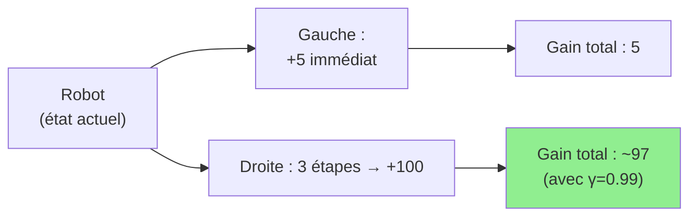

Pour raisonner ainsi, l'agent a besoin d'une fonction qui **évalue chaque état** du monde en tenant compte des récompenses futures possibles. C'est le rôle des fonctions de valeur et des équations de Bellman.

---

### Les fondations historiques

Les équations de Bellman ont été développées par le mathématicien **Richard Bellman** dans les années **1950**, dans le contexte de la **programmation dynamique** (*Dynamic Programming*). Bellman cherchait un moyen mathématique rigoureux de résoudre des problèmes d'optimisation séquentielle.

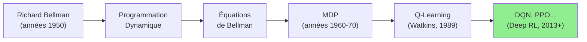

> _Les équations de Bellman sont si fondamentales qu'elles sont présentes dans **tous les algorithmes RL modernes**, des plus simples (Q-Learning) aux plus avancés (PPO, AlphaZero)._

---

### Le principe de la récursivité optimale

L'idée centrale de Bellman tient en une phrase, son fameux **principe d'optimalité** :

> « **Une politique optimale a la propriété que, quel que soit l'état initial et la décision initiale, les décisions restantes forment elles-mêmes une politique optimale** depuis l'état résultant de la première décision. »

En clair : **pour prendre la meilleure décision maintenant, il suffit de connaître la valeur des états futurs**. On n'a pas besoin de refaire tous les calculs depuis le début à chaque fois.

C'est cette propriété de **décomposition récursive** qui rend les équations de Bellman si puissantes.

</details>

<p align="right"><a href="#top">↑ Retour en haut</a></p>

---

<a id="section-2"></a>

<details>
<summary>2 — La fonction de valeur d'état — V(s)</summary>

<br/>

Avant d'écrire les équations de Bellman, il faut comprendre ce que l'on cherche à calculer : **la valeur d'un état**.

---

### 2.1 — Définition intuitive

La **fonction de valeur d'état** V(s) répond à la question :

> **« Si je me trouve dans l'état s et que je suis la politique π, combien de récompenses cumulées puis-je espérer obtenir à partir de maintenant ? »**

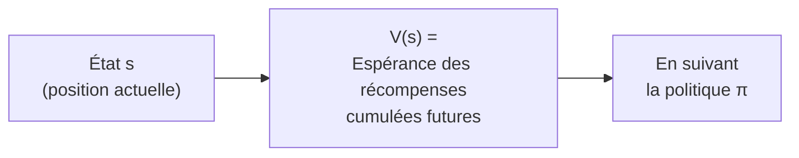

- V(s) **élevé** → l'état est « favorable » → il mène à de bonnes récompenses futures.
- V(s) **faible ou négatif** → l'état est « dangereux » ou peu prometteur.

---

### 2.2 — Définition formelle

Sous une politique π, la fonction de valeur est définie par :

$$
V^\pi(s) = \mathbb{E}_\pi \left[ \sum_{k=0}^{\infty} \gamma^k r_{t+k} \;\Big|\; s_t = s \right]
$$

**Décryptage terme par terme :**

| Symbole | Signification |
|---|---|
| $V^\pi(s)$ | Valeur de l'état s sous la politique π |
| $\mathbb{E}_\pi[\cdot]$ | Espérance mathématique — moyenne sur tous les scénarios possibles |
| $\sum_{k=0}^{\infty}$ | Somme de toutes les récompenses futures |
| $\gamma^k$ | Facteur d'actualisation (γ entre 0 et 1) — les récompenses lointaines pèsent moins |
| $r_{t+k}$ | Récompense reçue k étapes après l'étape actuelle |
| $s_t = s$ | En partant de l'état s à l'instant t |

---

### 2.3 — Exemples concrets

**Exemple 1 : Le robot dans un labyrinthe**

```
┌───────────────────────┐
│  A    B    C    D    │   A = entrée
│                  E   │   E = sortie (+100)
│  F    G    H    I    │   X = mur
│                      │
│  J    K    L    M    │
│                  N   │   N = piège (-50)
└───────────────────────┘
```

- V(E) ≈ +100 (on est à la sortie, la récompense est immédiate)
- V(D) ≈ +95 (un pas de la sortie — très bonne valeur)
- V(A) ≈ +60 (loin de la sortie, valeur moindre mais positive)
- V(N) ≈ -50 (piège — valeur très négative)

**Exemple 2 : La partie d'échecs**

| État de jeu | V(s) approximatif |
|---|---|
| Mat en 1 coup disponible | Très élevée (+∞ ou +1000) |
| Position dominante au milieu | Élevée (+50) |
| Position équilibrée | Neutre (0) |
| En train de perdre une pièce majeure | Négative (-30) |
| Échec et mat inévitable | Très négative (-1000) |

---

### 2.4 — V(s) optimale vs V(s) sous une politique

Il est important de distinguer deux notions :

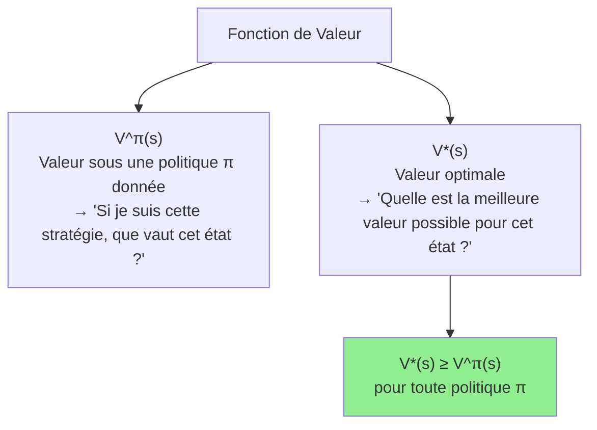

> _L'objectif du RL est de trouver la politique π* telle que V^π*(s) = V*(s) pour tout état s — c'est-à-dire la politique qui **maximise la valeur de chaque état**._

</details>

<p align="right"><a href="#top">↑ Retour en haut</a></p>

---

<a id="section-3"></a>

<details>
<summary>3 — La fonction de valeur d'action — Q(s, a)</summary>

<br/>

La fonction V(s) évalue un **état**. Mais pour prendre des décisions, l'agent doit évaluer les **actions disponibles dans cet état**. C'est le rôle de la **fonction Q**.

---

### 3.1 — Définition intuitive

La **fonction de valeur d'action** Q(s, a) répond à la question :

> **« Si je me trouve dans l'état s, que je prends l'action a, et que je suis ensuite la politique π de manière optimale — combien de récompenses cumulées puis-je espérer ? »**

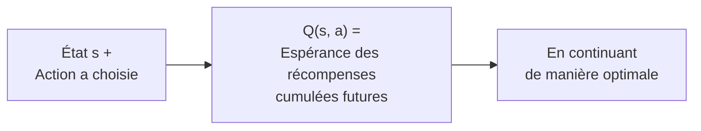

| Concept | Question répondue | Usage |
|---|---|---|
| **V(s)** | « Quelle est la valeur de cet état ? » | Évaluer une situation |
| **Q(s, a)** | « Quelle est la valeur de faire cette action dans cet état ? » | Choisir une action |

---

### 3.2 — Définition formelle

$$
Q^\pi(s, a) = \mathbb{E}_\pi \left[ \sum_{k=0}^{\infty} \gamma^k r_{t+k} \;\Big|\; s_t = s,\; a_t = a \right]
$$

La différence avec V(s) : on conditionne également sur l'**action a** prise à l'instant t.

---

### 3.3 — La relation fondamentale entre V et Q

V et Q sont profondément liées. On peut passer de l'une à l'autre facilement :

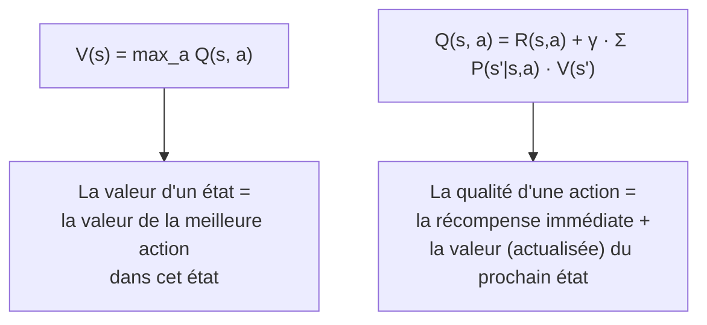

**Exemple concret :**

Un agent de jeu a trois actions possibles depuis l'état s :
- Q(s, gauche) = 30
- Q(s, droite) = 75
- Q(s, attendre) = 10

→ V(s) = max(30, 75, 10) = **75** (valeur de l'état = valeur de la meilleure action)
→ La politique optimale π*(s) = **droite** (choisir l'action de Q maximal)

---

### 3.4 — Pourquoi Q est plus pratique que V en pratique ?

En RL, l'agent doit **choisir une action**. Avec V(s) seulement, il faudrait connaître le modèle de l'environnement (les probabilités de transition P(s'|s,a)) pour calculer quelle action est optimale. Avec Q(s,a), l'agent **choisit directement** l'action avec la Q-valeur la plus haute — sans avoir besoin du modèle.

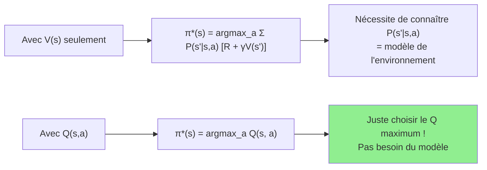

> _C'est pourquoi Q-Learning est un algorithme **model-free** — il apprend directement Q(s,a) sans jamais modéliser les transitions P(s'|s,a)._

</details>

<p align="right"><a href="#top">↑ Retour en haut</a></p>

---

<a id="section-4"></a>

<details>
<summary>4 — L'équation de Bellman — le cœur du RL</summary>

<br/>

Nous avons défini V(s) et Q(s,a). Mais comment les **calculer** ? C'est là qu'interviennent les équations de Bellman, qui expriment ces fonctions de valeur de manière **récursive**.

---

### 4.1 — L'intuition : « Le présent vaut la récompense immédiate + le meilleur futur »

Le génie de Bellman est d'avoir reconnu que la valeur d'un état peut s'exprimer simplement :

> **Valeur de l'état actuel = Récompense immédiate + Valeur (actualisée) du meilleur état futur**

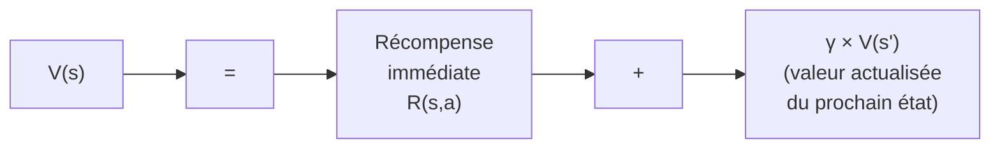

C'est une **décomposition récursive** : pour connaître la valeur de l'état actuel, il suffit de connaître la récompense maintenant et la valeur de l'état suivant. Et pour connaître la valeur de l'état suivant, on applique la même logique — et ainsi de suite.

---

### 4.2 — Équation de Bellman pour V(s)

#### Version sous une politique π (Bellman Expectation Equation)

$$
V^\pi(s) = \sum_a \pi(a|s) \sum_{s'} P(s'|s,a) \left[ R(s,a,s') + \gamma V^\pi(s') \right]
$$

**Traduction étape par étape :**

| Terme | Signification |
|---|---|
| $\sum_a \pi(a|s)$ | On pondère par la probabilité de choisir l'action a sous la politique π |
| $\sum_{s'} P(s'\|s,a)$ | On pondère par la probabilité d'arriver dans s' |
| $R(s,a,s')$ | La récompense obtenue lors de cette transition |
| $\gamma V^\pi(s')$ | La valeur future actualisée de l'état suivant s' |

#### Version optimale (Bellman Optimality Equation)

$$
V^*(s) = \max_a \sum_{s'} P(s'|s,a) \left[ R(s,a,s') + \gamma V^*(s') \right]
$$

La différence : au lieu de pondérer par π(a|s), on prend directement le **maximum sur toutes les actions** — car on cherche la politique optimale.

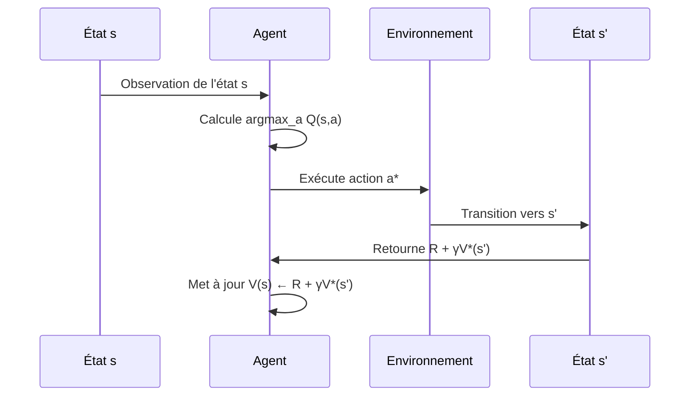

---

### 4.3 — Équation de Bellman pour Q(s, a)

#### Version sous une politique π

$$
Q^\pi(s, a) = \sum_{s'} P(s'|s,a) \left[ R(s,a,s') + \gamma \sum_{a'} \pi(a'|s') Q^\pi(s', a') \right]
$$

#### Version optimale — la plus utilisée en RL

$$
Q^*(s, a) = \sum_{s'} P(s'|s,a) \left[ R(s,a,s') + \gamma \max_{a'} Q^*(s', a') \right]
$$

**C'est cette formule qui est au cœur du Q-Learning.**

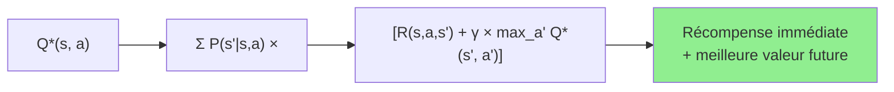

---

### 4.4 — La récursivité illustrée pas à pas

Prenons un exemple numérique simple. Un agent peut aller à droite ou à gauche. γ = 0.9.

```
État A → (droite) → État B → (droite) → État C [Récompense +10]
État A → (gauche) → État D [Récompense +2]
```

**Calcul par récursion Bellman :**

1. V(C) = **+10** (état terminal, récompense directe)
2. V(B) = R(B→C) + γ·V(C) = 0 + 0.9 × 10 = **+9**
3. V(A) via droite = R(A→B) + γ·V(B) = 0 + 0.9 × 9 = **+8.1**
4. V(A) via gauche = R(A→D) + γ·V(D) = 2 + 0.9 × 0 = **+2**
5. V*(A) = max(8.1, 2) = **+8.1** → aller à droite est optimal

> _Sans Bellman, l'agent devrait tester chaque chemin complet à chaque fois. Avec Bellman, il stocke les valeurs des états intermédiaires et **réutilise les calculs passés** — c'est le principe de la programmation dynamique._

</details>

<p align="right"><a href="#top">↑ Retour en haut</a></p>

---

<a id="section-5"></a>

<details>
<summary>5 — Le facteur d'actualisation γ (gamma)</summary>

<br/>

Le paramètre **γ (gamma)**, appelé **facteur d'actualisation** (*discount factor*), est l'un des paramètres les plus importants dans les équations de Bellman. Il détermine **l'importance que l'agent accorde aux récompenses futures** par rapport aux récompenses immédiates.

---

### 5.1 — Rôle et interprétation

$$
G_t = r_t + \gamma r_{t+1} + \gamma^2 r_{t+2} + \gamma^3 r_{t+3} + \ldots = \sum_{k=0}^{\infty} \gamma^k r_{t+k}
$$

| Valeur de γ | Comportement de l'agent | Analogie |
|---|---|---|
| **γ = 0** | Complètement myope — ignore les récompenses futures | L'enfant qui veut le bonbon maintenant |
| **γ proche de 0** | Fortement orienté récompense immédiate | Le trader qui ne pense qu'au profit d'aujourd'hui |
| **γ = 0.9** | Équilibre : tient compte des récompenses jusqu'à ~10 étapes | L'investisseur qui planifie sur quelques mois |
| **γ = 0.99** | Très prévoyant — planifie sur le long terme | L'épargnant retraite qui pense sur 30 ans |
| **γ = 1** | Horizon infini — toutes les récompenses comptent également | Un agent immortel qui optimise sa vie entière |

---

### 5.2 — Impact de γ sur le comportement : exemple chiffré

Un agent reçoit une récompense de **+100** dans 10 étapes. Quelle est sa valeur actualisée selon γ ?

$$
\text{Valeur actualisée} = \gamma^{10} \times 100
$$

| γ | γ^10 | Valeur actualisée de +100 dans 10 étapes |
|---|---|---|
| 0 | 0 | 0 (la récompense future est ignorée) |
| 0.5 | 0.001 | 0.1 (quasi ignorée) |
| 0.9 | 0.349 | 34.9 (encore significative) |
| 0.99 | 0.904 | 90.4 (presque aussi bonne qu'immédiate) |
| 1.0 | 1 | 100 (aucune actualisation) |

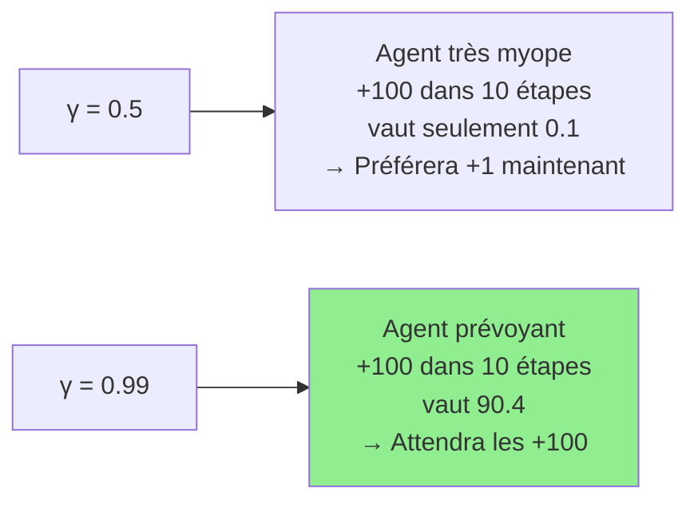

---

### 5.3 — Pourquoi γ < 1 est nécessaire (en général)

Deux raisons pour utiliser γ < 1 :

1. **Mathématique** : avec γ < 1, la somme infinie $\sum_{k=0}^{\infty} \gamma^k r_{t+k}$ **converge** (reste bornée). Avec γ = 1 dans un environnement sans fin, la somme peut diverger vers l'infini.

2. **Économique / comportemental** : une récompense future est **incertaine** — l'environnement peut changer, l'agent peut ne jamais y arriver. γ modélise cette incertitude : un gain certain maintenant vaut plus qu'un gain hypothétique plus tard.

> _C'est le même principe que la valeur temporelle de l'argent en finance : 100€ aujourd'hui valent plus que 100€ dans un an, car on peut investir ces 100€ aujourd'hui._

---

### 5.4 — γ dans les équations de Bellman

L'impact de γ sur l'équation de Bellman est direct :

$$
V^*(s) = \max_a \left[ R(s,a) + \underbrace{\gamma}_{\text{ici}} V^*(s') \right]
$$

- **γ petit** → le terme V*(s') pèse peu → l'agent est guidé surtout par R(s,a)
- **γ grand** → le terme V*(s') pèse beaucoup → l'agent planifie en profondeur

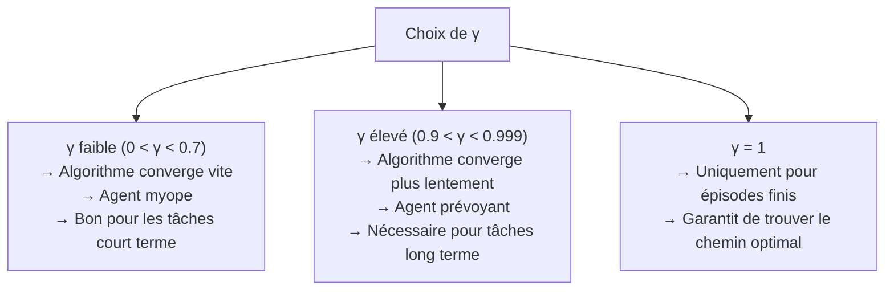

</details>

<p align="right"><a href="#top">↑ Retour en haut</a></p>

---

<a id="section-6"></a>

<details>
<summary>6 — Bellman et la programmation dynamique</summary>

<br/>

Les équations de Bellman ne sont pas seulement une définition mathématique — elles fournissent un **algorithme** pour calculer les valeurs optimales. Cette famille d'algorithmes s'appelle la **programmation dynamique** (*Dynamic Programming*, DP).

> _La programmation dynamique utilise les équations de Bellman pour résoudre les MDP lorsque le modèle de l'environnement (les probabilités de transition P et les récompenses R) est **connu à l'avance**._

---

### 6.1 — Value Iteration (Itération sur les valeurs)

**Value Iteration** applique l'équation de Bellman optimale de manière itérative, jusqu'à convergence.

**L'algorithme :**

```
1. Initialiser V(s) = 0 pour tous les états s
2. Répéter jusqu'à convergence :
   Pour chaque état s :
       V(s) ← max_a Σ P(s'|s,a) [R(s,a,s') + γ · V(s')]
3. Extraire la politique : π*(s) = argmax_a Σ P(s'|s,a) [R(s,a,s') + γ · V(s')]
```

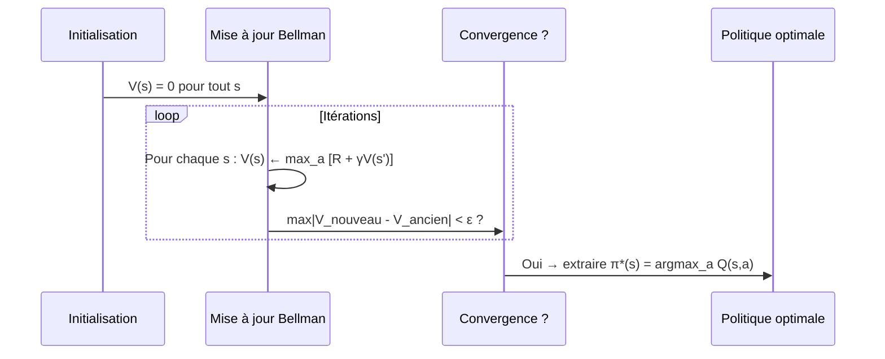

**Exemple numérique — Value Iteration sur 3 états :**

```
États : A, B, C (terminal, R=+10)
Transitions : A→B avec prob 1 (action droite), A→C impossible directement
              B→C avec prob 1 (action droite)
γ = 0.9

Itération 1 :
  V(C) = 10  (état terminal)
  V(B) = R(B→C) + γ·V(C) = 0 + 0.9×10 = 9
  V(A) = R(A→B) + γ·V(B) = 0 + 0.9×9 = 8.1

Itération 2 :
  V(C) = 10 (inchangé)
  V(B) = 0 + 0.9×10 = 9 (inchangé)
  V(A) = 0 + 0.9×9 = 8.1 (inchangé)
→ Convergé !
```

---

### 6.2 — Policy Iteration (Itération sur les politiques)

**Policy Iteration** alterne entre deux étapes : évaluer la politique courante, puis l'améliorer.

```
1. Initialiser une politique π aléatoire
2. Répéter jusqu'à convergence :
   a. Évaluation de la politique :
      Calculer V^π(s) pour tout s (résoudre le système linéaire)
   b. Amélioration de la politique :
      π'(s) ← argmax_a Σ P(s'|s,a) [R(s,a,s') + γ · V^π(s')]
   c. Si π' = π → convergé → π est optimale
```

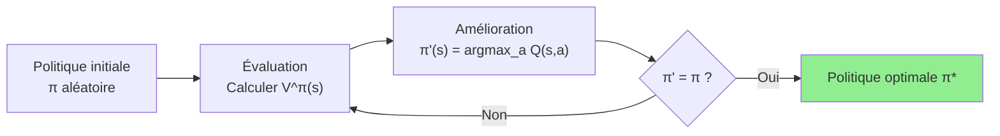

---

### 6.3 — Comparaison Value Iteration vs Policy Iteration

| Critère | Value Iteration | Policy Iteration |
|---|---|---|
| **Principe** | Met à jour V(s) à chaque itération | Évalue V^π puis améliore π |
| **Convergence** | Plus lente (many iterations needed) | Plus rapide en général |
| **Complexité par itération** | O(\|S\| × \|A\|) | O(\|S\|² × \|A\|) pour l'évaluation |
| **Résultat intermédiaire** | V(s) approximée à chaque étape | Politique stable (non nécessairement optimale) |
| **Usage** | Quand on veut une valeur approchée rapidement | Quand on veut la politique optimale exacte |

> _En pratique, quand le modèle n'est **pas connu** (la majorité des cas réels), on utilise des algorithmes **model-free** comme Q-Learning ou SARSA, qui estiment directement Q(s,a) sans avoir besoin de P(s'|s,a). Ces algorithmes **sont des approximations stochastiques des équations de Bellman**._

---

### 6.4 — De Bellman au Q-Learning

Q-Learning est la version **model-free** de Value Iteration. À chaque expérience (s, a, r, s'), il applique une mise à jour inspirée de Bellman :

$$
Q(s,a) \leftarrow Q(s,a) + \alpha \left[ r + \gamma \max_{a'} Q(s', a') - Q(s,a) \right]
$$

| Terme | Rôle |
|---|---|
| $\alpha$ | Taux d'apprentissage (learning rate) |
| $r + \gamma \max_{a'} Q(s', a')$ | **Cible Bellman** — ce que Q(s,a) devrait valoir |
| $r + \gamma \max_{a'} Q(s', a') - Q(s,a)$ | **Erreur de Bellman (TD error)** — l'écart à corriger |

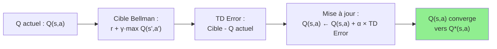

</details>

<p align="right"><a href="#top">↑ Retour en haut</a></p>

---

<a id="section-7"></a>

<details>
<summary>7 — Applications concrètes des équations de Bellman</summary>

<br/>

Les équations de Bellman ne sont pas de la théorie abstraite — elles ont des applications directes dans des systèmes concrets que vous utilisez ou entendez parler chaque jour.

---

### 7.1 — Navigation dans un labyrinthe

C'est l'exemple pédagogique classique pour illustrer Bellman.

**Configuration :**

```
┌───┬───┬───┬───┐
│ S │   │   │   │  S = Départ
├───┼───┼───┼───┤  G = But (+10)
│   │███│   │   │  X = Piège (-1 par étape)
├───┼───┼───┼───┤  ███ = Mur (inaccessible)
│   │   │███│ G │  γ = 0.9
└───┴───┴───┴───┘
```

**Calcul des V(s) par Value Iteration :**

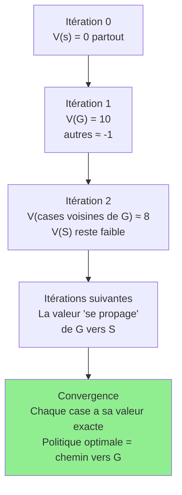

**Résultat : les valeurs se propagent comme une onde depuis la récompense**

Après convergence, chaque case a une valeur V(s) qui indique « à quelle distance » elle est de la récompense. L'agent suit simplement les flèches vers les cases de plus haute valeur.

---

### 7.2 — Q-Learning et DQN

**Q-Learning** (Watkins, 1989) est l'algorithme RL le plus fondamental. Il estime directement Q*(s,a) en utilisant la mise à jour de Bellman de manière incrémentale.

**DQN** (Deep Q-Network, DeepMind 2013) étend Q-Learning aux **espaces d'états continus et de grande dimension** (images de pixels) en utilisant un réseau de neurones pour approximer Q(s,a).

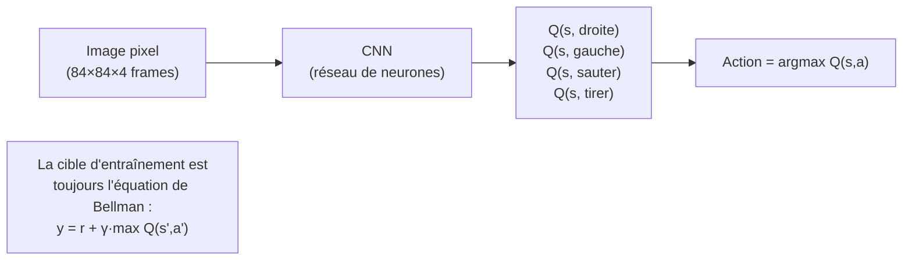

**La formule de DQN est directement issue de Bellman :**

La fonction de perte entraîne le réseau à minimiser :

$$
\mathcal{L} = \left[ \underbrace{r + \gamma \max_{a'} Q_{\theta^-}(s', a')}_{\text{Cible Bellman}} - Q_\theta(s, a) \right]^2
$$

---

### 7.3 — Jeux vidéo (AlphaGo, Atari, StarCraft)

**AlphaGo et AlphaZero** de DeepMind utilisent les équations de Bellman dans leur phase d'évaluation (*value network*) :

| Composant | Rôle | Lien avec Bellman |
|---|---|---|
| **Policy Network** | Proposer les actions prometteuses | Approxime π*(a\|s) |
| **Value Network** | Estimer V(s) de la position actuelle | Approxime directement V*(s) via Bellman |
| **MCTS** | Simuler les coups futurs | Utilise les valeurs Bellman pour remonter les scores |

**Atari (DQN)** : l'agent voit des frames de pixels et apprend Q(s,a) pour chaque action de manette — basé entièrement sur la cible Bellman.

---

### 7.4 — Robotique

Dans la manipulation robotique, les équations de Bellman permettent à un bras robotisé d'apprendre à **saisir des objets** de formes variables :

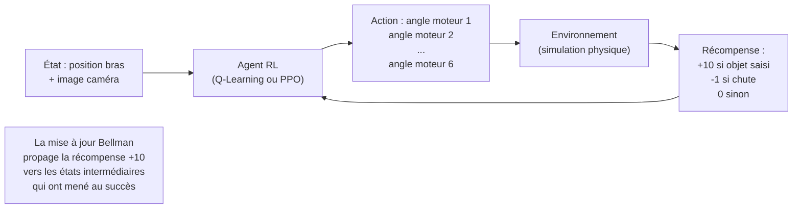

---

### 7.5 — Finance — Gestion de portefeuille

L'équation de Bellman modélise le problème du trader :

| Concept RL | Correspondance Finance |
|---|---|
| État s | Portefeuille actuel (actions détenues, liquidités, indicateurs marché) |
| Action a | Acheter X, Vendre Y, Conserver Z |
| Récompense r | Profit/perte sur la période |
| V(s) | Valeur espérée du portefeuille sur l'horizon d'investissement |
| Q(s, a) | Valeur d'une décision de trading dans la situation actuelle |
| γ | Taux d'actualisation financier (valeur temps de l'argent) |

$$
V^*(portefeuille_t) = \max_{action} \left[ profit_t + \gamma V^*(portefeuille_{t+1}) \right]
$$

</details>

<p align="right"><a href="#top">↑ Retour en haut</a></p>

---

<a id="section-8"></a>

<details>
<summary>8 — Quiz 1 — Concepts fondamentaux de Bellman</summary>

<br/>

Ce quiz évalue votre compréhension des concepts de base des équations de Bellman. Répondez à chaque question, puis cliquez sur **💡 Voir la solution** pour vérifier votre réponse.

---

#### 1. Fondamentaux

**Question 1 :** Quelle est l'intuition centrale derrière les équations de Bellman ?

a) La valeur d'un état est uniquement déterminée par la récompense immédiate

b) La valeur d'un état est égale à la récompense immédiate plus la valeur actualisée des états futurs

c) La valeur d'un état dépend uniquement des actions passées de l'agent

d) La valeur d'un état est toujours positive

<details>
<summary>💡 Voir la solution</summary>

✅ **Réponse : b)**

L'équation de Bellman exprime que **V(s) = R immédiate + γ × V(s')**. C'est la décomposition récursive fondamentale : la valeur actuelle inclut ce qu'on gagne maintenant **et** ce qu'on peut espérer gagner en continuant de manière optimale.

</details>

---

**Question 2 :** Quelle est la différence entre V(s) et Q(s, a) ?

a) V(s) évalue une action dans un état, Q(s,a) évalue un état sans action

b) V(s) évalue la valeur globale d'un état, Q(s,a) évalue la valeur d'une action spécifique dans cet état

c) V(s) et Q(s,a) sont identiques avec des notations différentes

d) V(s) est utilisé uniquement en Deep Learning, Q(s,a) en RL classique

<details>
<summary>💡 Voir la solution</summary>

✅ **Réponse : b)**

V(s) répond à « Quelle est la valeur de me trouver dans cet état, en suivant la politique π ? ». Q(s,a) répond à « Quelle est la valeur de prendre cette **action spécifique** dans cet état, puis de continuer de manière optimale ? ». V(s) = max_a Q(s,a).

</details>

---

**Question 3 :** Qu'est-ce que le facteur d'actualisation γ (gamma) dans les équations de Bellman ?

a) Le taux d'apprentissage qui contrôle la vitesse de mise à jour des paramètres

b) La probabilité de transition entre deux états

c) Un paramètre entre 0 et 1 qui pondère l'importance des récompenses futures par rapport aux récompenses immédiates

d) La récompense maximale que l'agent peut recevoir

<details>
<summary>💡 Voir la solution</summary>

✅ **Réponse : c)**

γ ∈ [0,1] est le **facteur d'actualisation**. Avec γ = 0, l'agent ignore complètement le futur. Avec γ = 0.99, l'agent est très prévoyant. γ modélise aussi l'incertitude sur le futur : une récompense certaine maintenant vaut plus qu'une récompense incertaine plus tard.

</details>

---

**Question 4 :** Qui a développé les équations qui portent son nom et dans quel contexte ?

a) Alan Turing, dans le cadre de la théorie de l'information

b) Richard Bellman, dans le cadre de la programmation dynamique dans les années 1950

c) John Nash, dans le cadre de la théorie des jeux

d) Norbert Wiener, dans le cadre de la cybernétique

<details>
<summary>💡 Voir la solution</summary>

✅ **Réponse : b)**

**Richard Bellman** a développé ces équations dans les années **1950** lors de ses travaux sur la **programmation dynamique** — une méthode pour décomposer des problèmes d'optimisation complexes en sous-problèmes plus simples. Son principe d'optimalité est la fondation théorique de tout l'apprentissage par renforcement moderne.

</details>

---

**Question 5 :** Dans la formule de Bellman optimale pour V*(s), que signifie l'opérateur max_a ?

a) On choisit l'action qui minimise les risques

b) On choisit l'action aléatoirement pour explorer l'environnement

c) On choisit l'action qui maximise la somme (récompense immédiate + valeur future actualisée)

d) On calcule la moyenne de toutes les actions possibles

<details>
<summary>💡 Voir la solution</summary>

✅ **Réponse : c)**

L'opérateur **max_a** exprime qu'on choisit la meilleure action possible, c'est-à-dire celle qui maximise la somme de la récompense immédiate et de la valeur future actualisée. C'est cette optimisation qui rend l'équation « optimale » — elle suppose un comportement parfaitement rationnel.

</details>

---

#### 2. Propriétés

**Question 6 :** Quelle est la relation entre V*(s) et Q*(s,a) ?

a) V*(s) = Q*(s, a) pour toute action a

b) V*(s) = max_a Q*(s, a) — la valeur optimale d'un état est la valeur de la meilleure action dans cet état

c) V*(s) = Σ_a Q*(s, a) — la valeur d'un état est la somme des Q-valeurs

d) Il n'existe pas de relation directe entre V et Q

<details>
<summary>💡 Voir la solution</summary>

✅ **Réponse : b)**

V*(s) = **max_a Q*(s, a)**. La valeur optimale d'un état est égale à la valeur de la meilleure action disponible dans cet état. Cette relation permet d'extraire la politique optimale directement depuis Q* : π*(s) = argmax_a Q*(s, a).

</details>

---

**Question 7 :** Pourquoi dit-on que les équations de Bellman sont **récursives** ?

a) Parce qu'elles nécessitent de répéter le même calcul plusieurs fois avant de converger

b) Parce que la valeur d'un état est définie en fonction de la valeur d'autres états — l'équation se référence elle-même

c) Parce qu'elles utilisent des réseaux de neurones récurrents

d) Parce que l'agent doit parcourir tous les états plusieurs fois pour calculer les valeurs

<details>
<summary>💡 Voir la solution</summary>

✅ **Réponse : b)**

La récursivité de Bellman signifie que **V(s) est défini en fonction de V(s')** — qui est lui-même défini en fonction de V(s'') — et ainsi de suite. C'est cette structure récursive qui permet de calculer efficacement les valeurs : on part des états terminaux (où V est connu) et on remonte progressivement vers les états de départ.

</details>

---

**Question 8 :** Pourquoi est-il généralement préférable d'utiliser γ < 1 (plutôt que γ = 1) en pratique ?

a) Parce que γ = 1 rend l'algorithme trop rapide et instable

b) Parce qu'avec γ = 1 dans un environnement non épisodique, la somme des récompenses peut diverger vers l'infini

c) Parce que γ = 1 signifie que l'agent ignore toutes les récompenses futures

d) Parce que γ = 1 est mathématiquement incorrect dans les MDP

<details>
<summary>💡 Voir la solution</summary>

✅ **Réponse : b)**

Avec γ = 1, la somme $\sum_{k=0}^{\infty} r_{t+k}$ peut **diverger** si l'épisode n'a pas de fin claire. On utilise γ = 1 uniquement dans des environnements épisodiques (avec un état terminal garanti). Dans les environnements continus, γ < 1 est nécessaire pour assurer la **convergence mathématique** des équations de Bellman.

</details>

---

**Question 9 :** Qu'est-ce que la **Bellman Optimality Equation** garantit si elle est résolue ?

a) Que l'agent converge vers la politique qui minimise le temps d'exploration

b) Que les fonctions V*(s) et Q*(s,a) obtenues correspondent à la politique optimale — celle qui maximise les récompenses à long terme

c) Que l'agent ne fera plus jamais d'erreurs

d) Que l'environnement ne changera plus après l'entraînement

<details>
<summary>💡 Voir la solution</summary>

✅ **Réponse : b)**

Si on résout l'équation de Bellman optimale exactement, on obtient V*(s) et Q*(s,a) qui correspondent à la **politique optimale π***. En extrayant π*(s) = argmax_a Q*(s,a), on obtient la politique qui maximise les récompenses cumulées sur le long terme — c'est la preuve mathématique de l'optimalité.

</details>

---

**Question 10 :** Lequel de ces algorithmes utilise **directement** l'équation de Bellman optimale comme règle de mise à jour ?

a) L'algorithme de rétropropagation (backpropagation)

b) K-Means

c) Q-Learning — mise à jour Q(s,a) ← Q(s,a) + α[r + γ·max Q(s',a') - Q(s,a)]

d) L'algorithme de Viterbi

<details>
<summary>💡 Voir la solution</summary>

✅ **Réponse : c)**

Le **Q-Learning** applique directement l'équation de Bellman optimale de manière incrémentale. La cible `r + γ·max Q(s',a')` est exactement le membre droit de l'équation de Bellman. La différence avec cette cible `[r + γ·max Q(s',a') - Q(s,a)]` est appelée **erreur TD (Temporal Difference error)** — le signal d'apprentissage fondamental du RL.

</details>

</details>

<p align="right"><a href="#top">↑ Retour en haut</a></p>

---

<a id="section-9"></a>

<details>
<summary>9 — Quiz 2 — Calculs et applications</summary>

<br/>

Ce quiz teste votre capacité à appliquer les équations de Bellman dans des situations concrètes. Répondez, puis cliquez sur **💡 Voir la solution** pour vérifier.

---

**Question 1 :** Un agent est dans l'état A. Il peut aller à droite (état B, récompense +5) ou à gauche (état C, récompense +2). V*(B) = 20, V*(C) = 50, γ = 0.9. Quelle est la meilleure action et V*(A) ?

a) Droite — V*(A) = 5 + 0.9×20 = 23

b) Gauche — V*(A) = 2 + 0.9×50 = 47

c) Droite — V*(A) = 5 + 20 = 25

d) Gauche — V*(A) = 50

<details>
<summary>💡 Voir la solution</summary>

✅ **Réponse : b)**

En appliquant Bellman : 
- Droite : Q(A, droite) = 5 + 0.9 × 20 = **23**
- Gauche : Q(A, gauche) = 2 + 0.9 × 50 = **47**

V*(A) = max(23, 47) = **47**. Malgré une récompense immédiate plus faible (+2 vs +5), aller à gauche est optimal car l'état C est bien meilleur à long terme (V*(C) = 50 >> V*(B) = 20).

</details>

---

**Question 2 :** Un agent reçoit une récompense de +100 dans 5 étapes, avec γ = 0.9. Quelle est la valeur actualisée de cette récompense ?

a) 100

b) 0.9 × 100 = 90

c) 0.9⁵ × 100 ≈ 59

d) 5 × 0.9 = 4.5

<details>
<summary>💡 Voir la solution</summary>

✅ **Réponse : c)**

La valeur actualisée d'une récompense dans k étapes est **γᵏ × r**. Ici : 0.9⁵ × 100 = 0.59049 × 100 ≈ **59**. La récompense de +100 dans 5 étapes ne « vaut » que ~59 maintenant. C'est le principe de la valeur temporelle des récompenses futures.

</details>

---

**Question 3 :** Dans la mise à jour Q-Learning, quel terme représente la « cible Bellman » ?

a) Q(s, a) — la Q-valeur actuelle

b) r + γ · max_a' Q(s', a') — la récompense plus la meilleure valeur future actualisée

c) α · Q(s, a) — le taux d'apprentissage multiplié par la valeur actuelle

d) r - Q(s, a) — l'erreur de prédiction

<details>
<summary>💡 Voir la solution</summary>

✅ **Réponse : b)**

La **cible Bellman** est `r + γ · max_a' Q(s', a')`. C'est ce que Q(s,a) *devrait* valoir selon l'équation de Bellman. La différence entre cette cible et la valeur actuelle Q(s,a) est l'**erreur TD**, qui guide la mise à jour : Q(s,a) ← Q(s,a) + α × [cible - Q(s,a)].

</details>

---

**Question 4 :** Un état terminal T a une récompense de +50. Quel est V*(T) ?

a) 0 (les états terminaux ont toujours une valeur nulle)

b) γ × 50

c) 50 (la valeur d'un état terminal = sa récompense, sans terme futur)

d) ∞ (état terminal = récompense illimitée)

<details>
<summary>💡 Voir la solution</summary>

✅ **Réponse : c)**

Pour un état terminal, il n'y a **pas d'état futur** — donc V*(T) = R(T) = **50**. L'équation de Bellman devient V*(T) = R(T) + γ × V(∅) = R(T) + 0 = R(T). C'est le cas de base de la récursion — c'est depuis les états terminaux que les valeurs se propagent vers l'arrière.

</details>

---

**Question 5 :** Avec γ = 0, que devient l'équation de Bellman V*(s) = max_a [R(s,a) + γ·V*(s')] ?

a) V*(s) = V*(s') — la valeur actuelle est identique à la valeur future

b) V*(s) = max_a R(s,a) — l'agent ne cherche que la meilleure récompense immédiate

c) V*(s) = 0 pour tous les états

d) V*(s) = R(s,a) × V*(s')

<details>
<summary>💡 Voir la solution</summary>

✅ **Réponse : b)**

Avec γ = 0, le terme γ·V*(s') disparaît : V*(s) = max_a R(s,a). L'agent **ignore complètement le futur** et optimise uniquement la récompense immédiate. C'est un agent « greedy » pur — il choisit toujours l'action qui donne la plus grande récompense maintenant, sans aucune planification.

</details>

---

**Question 6 :** Dans un labyrinthe 2D, pourquoi les valeurs V(s) des cases proches de la sortie sont-elles plus élevées que les cases éloignées ?

a) Parce que ces cases sont visitées plus souvent par l'agent

b) Parce que l'équation de Bellman propage la récompense terminale vers l'arrière : V(s voisin sortie) = R_sortie + γ·V(sortie), et cette valeur se propage récursivement à tous les états

c) Parce que les cases proches de la sortie ont des récompenses immédiates plus élevées

d) Parce que l'agent commence toujours à côté de la sortie

<details>
<summary>💡 Voir la solution</summary>

✅ **Réponse : b)**

L'équation de Bellman crée un **gradient de valeurs** : la récompense de la sortie (+100) se propage vers les états voisins (+90, +81, +73...) via V(s) = R + γ·V(s'). Ce mécanisme de **rétropropagation des récompenses** est le mécanisme fondamental par lequel l'agent apprend quels états sont « bons » même si la récompense est distante.

</details>

---

**Question 7 :** Pourquoi Q(s,a) est-il plus utile que V(s) pour un agent qui doit prendre des décisions sans connaître le modèle de l'environnement ?

a) Parce que Q(s,a) est plus facile à calculer mathématiquement

b) Parce que Q(s,a) indique directement quelle action choisir (argmax_a Q(s,a)) sans nécessiter P(s'|s,a)

c) Parce que V(s) ne fonctionne que pour les environnements discrets

d) Parce que Q(s,a) converge toujours plus vite que V(s)

<details>
<summary>💡 Voir la solution</summary>

✅ **Réponse : b)**

Pour extraire la meilleure action depuis V(s), il faut calculer **argmax_a Σ P(s'|s,a) [R + γV(s')]** — ce qui nécessite de connaître les probabilités de transition P. Depuis Q(s,a), il suffit de calculer **argmax_a Q(s,a)** — pas besoin du modèle. C'est pourquoi Q-Learning est un algorithme **model-free**.

</details>

---

**Question 8 :** Un agent a la table Q suivante pour l'état s :

| Action | Q(s, action) |
|---|---|
| Gauche | 12 |
| Droite | 45 |
| Haut | 30 |
| Bas | -5 |

Selon la politique greedy (sans exploration), quelle action choisit l'agent ?

a) Gauche (première action de la liste)

b) Droite (valeur Q maximale = 45)

c) Haut (valeur intermédiaire)

d) Une action aléatoire parmi les quatre

<details>
<summary>💡 Voir la solution</summary>

✅ **Réponse : b)**

La politique **greedy** choisit l'action qui maximise Q(s,a) : **argmax_a Q(s,a) = Droite** avec Q(s, Droite) = 45. Notez que Bas est évité (Q = -5, valeur négative). La politique greedy est l'exploitation pure — elle utilise toujours la meilleure connaissance actuelle.

</details>

---

**Question 9 :** Dans la mise à jour Q-Learning, que représente l'erreur TD (Temporal Difference error) ?

a) La différence entre la Q-valeur actuelle et la cible Bellman — l'écart à corriger

b) La différence entre la récompense actuelle et la récompense maximale possible

c) L'erreur de l'agent lors de la phase d'exploration

d) La différence entre γ = 1 et la valeur de γ choisie

<details>
<summary>💡 Voir la solution</summary>

✅ **Réponse : a)**

L'**erreur TD** = `r + γ·max Q(s',a') - Q(s,a)` mesure l'écart entre ce que l'agent **croyait** que valait (s,a) — Q(s,a) actuel — et ce qu'il **observe maintenant** — r + γ·max Q(s',a'). C'est ce signal d'erreur qui guide l'apprentissage : si l'erreur est positive, l'agent sous-estimait la valeur ; si négative, il la surestimait.

</details>

---

**Question 10 :** Value Iteration et Policy Iteration nécessitent toutes deux de connaître les probabilités de transition P(s'|s,a). Pourquoi Q-Learning n'en a-t-il pas besoin ?

a) Parce que Q-Learning ignore les probabilités de transition

b) Parce que Q-Learning estime Q(s,a) directement à partir d'expériences réelles (s, a, r, s') sans jamais calculer P(s'|s,a) explicitement

c) Parce que Q-Learning utilise un réseau de neurones qui calcule automatiquement P

d) Parce que Q-Learning fonctionne uniquement dans des environnements déterministes

<details>
<summary>💡 Voir la solution</summary>

✅ **Réponse : b)**

Q-Learning est **model-free** : il apprend Q(s,a) directement depuis les transitions observées (s, a, r, s') sans jamais estimer P(s'|s,a). Les probabilités de transition sont implicitement capturées dans la distribution des transitions observées — si P(s'|s,a) = 0.7, l'agent verra s' 70% du temps et s'' 30% du temps, et la moyenne des mises à jour convergera vers la bonne valeur.

</details>

</details>

<p align="right"><a href="#top">↑ Retour en haut</a></p>

---

<a id="section-10"></a>

<details>
<summary>10 — Quiz 3 — Bellman avancé et algorithmes</summary>

<br/>

Ce quiz approfondit les nuances avancées des équations de Bellman et leur lien avec les algorithmes RL modernes.

---

**Question 1 :** Quelle est la différence entre l'équation de Bellman pour V^π(s) (espérance) et V*(s) (optimale) ?

a) V^π(s) utilise le max_a, V*(s) utilise la somme pondérée par π

b) V^π(s) utilise la somme pondérée par π(a|s), V*(s) utilise le max_a — la différence est entre suivre une politique fixe et optimiser

c) Elles sont mathématiquement identiques

d) V^π(s) s'applique aux états, V*(s) aux actions

<details>
<summary>💡 Voir la solution</summary>

✅ **Réponse : b)**

- **V^π(s)** = Σ_a π(a|s) Σ_s' P(s'|s,a) [R + γV^π(s')] → évalue la valeur **sous une politique π donnée** (qui peut être sous-optimale)
- **V*(s)** = max_a Σ_s' P(s'|s,a) [R + γV*(s')] → cherche la valeur **optimale** en choisissant la meilleure action

La différence est conceptuellement majeure : V^π évalue, V* optimise.

</details>

---

**Question 2 :** Qu'est-ce que la convergence de Value Iteration garantit mathématiquement ?

a) Que l'algorithme termine en un nombre fini d'itérations exactement

b) Que les valeurs V_k(s) convergent vers V*(s) de manière monotone quand k → ∞, sous réserve que γ < 1

c) Que l'agent apprend la politique optimale en exactement |S| × |A| itérations

d) Que les Q-valeurs convergeront si l'agent explore suffisamment

<details>
<summary>💡 Voir la solution</summary>

✅ **Réponse : b)**

L'opérateur de Bellman est une **contraction** (avec coefficient γ < 1). Par le théorème du point fixe de Banach, les itérations convergent vers l'unique point fixe V* quand k → ∞. La distance entre V_k et V* décroît géométriquement : ||V_{k+1} - V*|| ≤ γ ||V_k - V*||.

</details>

---

**Question 3 :** DQN introduit un « réseau cible » (*target network*) pour stabiliser l'apprentissage. Pourquoi est-ce nécessaire du point de vue de Bellman ?

a) Parce que le réseau cible permet d'explorer l'environnement plus efficacement

b) Parce que sans réseau cible, la cible Bellman change à chaque mise à jour (le réseau qui génère la cible et celui qu'on entraîne sont les mêmes) — créant une instabilité

c) Parce que le réseau cible est plus précis que le réseau principal

d) Parce que les équations de Bellman nécessitent deux fonctions Q différentes

<details>
<summary>💡 Voir la solution</summary>

✅ **Réponse : b)**

Sans target network, la cible Bellman `r + γ·max Q_θ(s',a')` change en même temps que Q_θ — c'est comme viser une cible mouvante. Le target network θ⁻ est une copie gelée de θ, mise à jour périodiquement : la cible devient `r + γ·max Q_{θ⁻}(s',a')` — **fixe** pendant plusieurs étapes, stabilisant drastiquement l'entraînement.

</details>

---

**Question 4 :** SARSA et Q-Learning utilisent tous deux des mises à jour TD basées sur Bellman. Quelle est leur différence fondamentale ?

a) SARSA utilise V(s), Q-Learning utilise Q(s,a)

b) Q-Learning utilise max_a' Q(s',a') (politique greedy hors-politique), SARSA utilise Q(s', a') avec a' réellement choisi (sur-politique)

c) SARSA converge plus vite que Q-Learning

d) Q-Learning ne peut fonctionner qu'avec des récompenses positives

<details>
<summary>💡 Voir la solution</summary>

✅ **Réponse : b)**

- **Q-Learning** : `Q(s,a) ← Q(s,a) + α[r + γ·**max**_a' Q(s',a') - Q(s,a)]` → **off-policy** : la cible suppose toujours l'action optimale
- **SARSA** : `Q(s,a) ← Q(s,a) + α[r + γ·Q(s',**a'**) - Q(s,a)]` où a' est l'action **réellement choisie** → **on-policy** : la cible reflète la vraie politique suivie (incluant l'exploration ε-greedy)

SARSA est plus conservateur car il tient compte des actions d'exploration — Q-Learning peut overestimer en ignorant les erreurs d'exploration.

</details>

---

**Question 5 :** Qu'est-ce que le « reward shaping » et pourquoi est-il lié aux équations de Bellman ?

a) Un technique pour modifier l'architecture du réseau de neurones

b) La technique consistant à ajouter des récompenses intermédiaires artificielles pour guider l'agent — doit être faite prudemment car elle modifie les V(s) et peut changer la politique optimale

c) La normalisation des récompenses entre -1 et +1

d) L'annulation des récompenses négatives pour stabiliser l'apprentissage

<details>
<summary>💡 Voir la solution</summary>

✅ **Réponse : b)**

Le **reward shaping** consiste à ajouter des récompenses intermédiaires R'(s,a,s') pour guider l'agent vers des états prometteurs (ex : +0.1 à chaque pas vers le but). Mais attention : modifier R change les équations de Bellman et donc les V(s) optimaux — cela peut créer de nouveaux comportements non désirés si mal conçu. Le reward shaping n'est correct (préserve la politique optimale) que sous certaines conditions mathématiques liées au potentiel de Bellman.

</details>

---

**Question 6 :** Dans le contexte de l'Actor-Critic (A2C, PPO), le « Critic » estime V(s). Quel est l'avantage par rapport à Q-Learning qui estime Q(s,a) ?

a) Le Critic converge toujours plus vite que Q(s,a)

b) Estimer V(s) est plus efficace quand l'espace d'actions est continu ou très grand, car on évite d'estimer Q pour chaque action

c) Le Critic ne nécessite pas les équations de Bellman

d) V(s) est toujours plus précis que Q(s,a)

<details>
<summary>💡 Voir la solution</summary>

✅ **Réponse : b)**

Quand l'espace d'actions est continu (angles de moteur, force appliquée...), il est impossible de calculer max_a Q(s,a) — il y a une infinité d'actions. En estimant V(s) via le Critic et en utilisant l'Actor pour choisir directement l'action, on contourne ce problème. L'**Advantage A(s,a) = Q(s,a) - V(s)** permet quand même d'évaluer les actions sans Q explicite.

</details>

---

**Question 7 :** Qu'est-ce que le problème du « credit assignment » (*attribution de la récompense*) et comment Bellman y répond-il ?

a) Le problème de distribuer équitablement les récompenses entre plusieurs agents

b) Le problème de déterminer quelles actions passées méritent le crédit pour une récompense reçue plus tard — Bellman y répond en propageant récursivement la valeur depuis la récompense vers les états antérieurs

c) Le problème de choisir le bon taux d'apprentissage α

d) Le problème de normaliser les récompenses dans un environnement à sparse rewards

<details>
<summary>💡 Voir la solution</summary>

✅ **Réponse : b)**

Si un agent gagne +100 après 50 actions, laquelle méritait cette récompense ? C'est le **credit assignment problem**. L'équation de Bellman y répond via la **rétropropagation temporelle** : V(s_49) = 100, V(s_48) = γ×100, V(s_47) = γ²×100... La valeur se propage vers l'arrière, attribuant un crédit décroissant aux actions plus anciennes (via γ).

</details>

---

**Question 8 :** Dans AlphaGo, comment les équations de Bellman sont-elles utilisées dans l'arbre de recherche MCTS (Monte Carlo Tree Search) ?

a) MCTS n'utilise pas les équations de Bellman — c'est un algorithme complètement différent

b) Les équations de Bellman sont utilisées pour remonter les valeurs dans l'arbre : la valeur d'un nœud = R + γ × max(valeurs enfants), propageant les évaluations vers la racine

c) Bellman est uniquement utilisé dans la phase d'apprentissage supervisé d'AlphaGo

d) AlphaGo résout exactement les équations de Bellman pour l'ensemble du jeu de Go

<details>
<summary>💡 Voir la solution</summary>

✅ **Réponse : b)**

MCTS explore l'arbre de jeu et remonte les évaluations des feuilles vers la racine en utilisant le principe de Bellman : la valeur d'une position = valeur estimée par le Value Network + γ × max(valeurs des positions suivantes explorées). Cette **rétropropagation de valeur** est directement inspirée de Bellman — MCTS en est une approximation stochastique.

</details>

---

**Question 9 :** Qu'est-ce que le « bootstrapping » en RL et quel est son lien avec Bellman ?

a) Une technique d'augmentation des données d'entraînement par rééchantillonnage

b) L'utilisation des estimations actuelles de V ou Q pour calculer la cible — on « s'appuie sur sa propre estimation » plutôt que d'attendre la vraie récompense terminale

c) L'initialisation aléatoire des poids du réseau de neurones

d) L'arrêt prématuré de l'entraînement pour éviter le surapprentissage

<details>
<summary>💡 Voir la solution</summary>

✅ **Réponse : b)**

Le **bootstrapping** (Q-Learning, TD-Learning) utilise l'estimation actuelle `γ·max Q(s',a')` comme partie de la cible — au lieu d'attendre la vraie récompense cumulative (comme Monte Carlo). C'est l'essence de l'équation de Bellman appliquée de manière incrémentale : on « tire profit » des estimations actuelles pour améliorer les estimations actuelles. Cela permet d'apprendre à chaque étape sans attendre la fin de l'épisode.

</details>

---

**Question 10 :** Pourquoi dit-on que PPO (Proximal Policy Optimization) résout **indirectement** les équations de Bellman ?

a) Parce que PPO utilise une règle de mise à jour complètement différente de Bellman

b) Parce que PPO utilise un Critic qui estime V^π(s) via des mises à jour TD (Bellman), et utilise l'Advantage A(s,a) = Q(s,a) - V(s) pour guider la mise à jour de l'Actor

c) Parce que PPO ne converge pas vers la politique optimale au sens de Bellman

d) Parce que PPO utilise uniquement des méthodes Monte Carlo sans Bellman

<details>
<summary>💡 Voir la solution</summary>

✅ **Réponse : b)**

PPO est un algorithme Actor-Critic. Le **Critic** est entraîné via des mises à jour TD issues de Bellman : V(s) ← r + γ·V(s'). L'**Advantage** A(s,a) = r + γ·V(s') - V(s) est l'erreur TD de Bellman — il mesure si l'action choisie était meilleure ou moins bonne que la valeur espérée. C'est ce signal Bellman qui guide la mise à jour de l'Actor vers la politique optimale.

</details>

</details>

<p align="right"><a href="#top">↑ Retour en haut</a></p>

---

<a id="section-11"></a>

<details>
<summary>11 — Pratique 1 — Calculer les valeurs d'états dans un labyrinthe</summary>

<br/>

### Objectifs d'apprentissage

À la fin de cette pratique, vous serez capable de :

- Appliquer manuellement l'équation de Bellman pour calculer V*(s) de chaque état.
- Comprendre comment les valeurs se propagent depuis les récompenses vers les états éloignés.
- Dériver la politique optimale à partir des valeurs calculées.

---

### Mise en situation

Vous avez un robot dans un labyrinthe simplifié de 4 cases en ligne :

```
┌────┬────┬────┬────┐
│ A  │ B  │ C  │ D  │
│    │    │    │ +10│
└────┴────┴────┴────┘
```

- L'agent commence en **A** et doit atteindre **D** (récompense **+10**).
- L'agent peut seulement se déplacer **à droite** (une seule action possible, déterministe).
- Chaque déplacement coûte **-1** (pénalité de mouvement).
- **γ = 0.9**
- D est un état terminal.

---

### Questions

**1.** Calculez V*(D), V*(C), V*(B) et V*(A) en appliquant l'équation de Bellman de droite à gauche.

**2.** Si l'agent était en C et pouvait aussi aller à gauche (vers B, récompense -1 et V*(B) = ?), quelle action serait optimale ?

**3.** Que se passe-t-il si on change γ = 0.5 ? Recalculez V*(A).

---

### Correction détaillée — Pratique 1

**Question 1 — Calcul des V*(s) avec γ = 0.9 :**

Règle : V*(s) = R(s → s') + γ × V*(s')

**Étape 1 : État D (terminal)**
- V*(D) = **+10** (récompense directe, pas d'état suivant)

**Étape 2 : État C → D**
- R(C→D) = -1 (coût du déplacement) + 10 (récompense en D) ... Non — clarifions :
- R(C→D) = **-1** (la récompense de transition est le coût du déplacement)
- V*(C) = R(C→D) + γ × V*(D) = -1 + 0.9 × 10 = -1 + 9 = **+8**

**Étape 3 : État B → C**
- V*(B) = R(B→C) + γ × V*(C) = -1 + 0.9 × 8 = -1 + 7.2 = **+6.2**

**Étape 4 : État A → B**
- V*(A) = R(A→B) + γ × V*(B) = -1 + 0.9 × 6.2 = -1 + 5.58 = **+4.58**

| État | V*(s) | Interprétation |
|---|---|---|
| D | +10 | État terminal — récompense maximale |
| C | +8 | Un pas de D — bonne position |
| B | +6.2 | Deux pas de D — position correcte |
| A | +4.58 | Trois pas de D — position de départ |

Les valeurs diminuent de D vers A — c'est le **gradient de valeurs** créé par Bellman.

---

**Question 2 — Action optimale depuis C avec choix :**

Si depuis C, l'agent peut aller à **droite** (D) ou à **gauche** (B) :

- Q(C, droite) = R(C→D) + γ × V*(D) = -1 + 0.9 × 10 = **+8**
- Q(C, gauche) = R(C→B) + γ × V*(B) = -1 + 0.9 × 6.2 = **+4.58**

V*(C) = max(+8, +4.58) = **+8** → **Aller à droite est optimal**

Raisonnement : retourner en arrière nous éloigne de la récompense — les valeurs plus faibles de B reflètent cette distance plus grande.

---

**Question 3 — Impact de γ = 0.5 :**

Avec γ = 0.5 :

- V*(D) = +10
- V*(C) = -1 + 0.5 × 10 = **+4**
- V*(B) = -1 + 0.5 × 4 = **+1**
- V*(A) = -1 + 0.5 × 1 = **-0.5**

**Comparaison :**

| État | V* (γ=0.9) | V* (γ=0.5) |
|---|---|---|
| D | +10 | +10 |
| C | +8 | +4 |
| B | +6.2 | +1 |
| A | +4.58 | **-0.5** |

Avec γ = 0.5, V*(A) est **négatif** ! Cela signifie que l'agent avec γ = 0.5 juge qu'il vaut mieux « ne rien faire » (valeur 0) que de se déplacer vers D, car les récompenses futures sont tellement dévalorisées que les pénalités de déplacement dominent.

> _Cet exemple illustre à quel point γ influence le comportement : avec γ faible, l'agent peut éviter de poursuivre des objectifs distants même s'ils sont intrinsèquement désirables._

</details>

<p align="right"><a href="#top">↑ Retour en haut</a></p>

---

<a id="section-12"></a>

<details>
<summary>12 — Pratique 2 — Modéliser un problème de décision avec Bellman</summary>

<br/>

### Objectifs d'apprentissage

À la fin de cette pratique, vous serez capable de :

- Formaliser un problème réel en termes d'états, d'actions, de récompenses et d'équations de Bellman.
- Calculer les Q-valeurs manuellement pour une situation donnée.
- Interpréter les résultats pour en dériver une stratégie.

---

### Mise en situation : Le dilemme du trader

Un trader doit décider chaque jour s'il **achète**, **vend** ou **conserve** une action. Les états représentent les tendances du marché, les actions correspondent aux décisions de trading, et les récompenses sont les profits/pertes résultants.

**États possibles :**
- **Haussier** (H) : marché en hausse
- **Stable** (S) : marché stable
- **Baissier** (B) : marché en baisse

**Actions possibles :** Acheter (A), Conserver (K), Vendre (V)

**Récompenses observées :**

| État | Action | Récompense | État suivant probable |
|---|---|---|---|
| Haussier | Acheter | +5 | Haussier (60%), Stable (40%) |
| Haussier | Conserver | +3 | Haussier (60%), Stable (40%) |
| Haussier | Vendre | +8 | Stable (100%) |
| Stable | Acheter | -1 | Haussier (30%), Stable (40%), Baissier (30%) |
| Stable | Conserver | 0 | Haussier (30%), Stable (40%), Baissier (30%) |
| Stable | Vendre | +2 | Stable (100%) |
| Baissier | Acheter | -5 | Stable (50%), Baissier (50%) |
| Baissier | Conserver | -3 | Stable (50%), Baissier (50%) |
| Baissier | Vendre | -1 | Stable (100%) |

**γ = 0.9. On suppose V*(Haussier) = 20, V*(Stable) = 5, V*(Baissier) = -10 (valeurs déjà estimées).**

---

### Questions

**1.** Calculez Q*(Haussier, Acheter), Q*(Haussier, Conserver) et Q*(Haussier, Vendre). Quelle est la meilleure action dans l'état Haussier ?

**2.** Calculez Q*(Stable, Acheter), Q*(Stable, Conserver) et Q*(Stable, Vendre). Quelle est la meilleure action dans l'état Stable ?

**3.** Calculez Q*(Baissier, Vendre) et Q*(Baissier, Conserver). Quelle est la meilleure action dans l'état Baissier ?

**4.** Dérivez la politique optimale π* (une action pour chaque état).

---

### Correction complète — Pratique 2

**Question 1 — État Haussier :**

Formule : Q*(s, a) = R(s,a) + γ × Σ P(s'|s,a) × V*(s')

**Q*(Haussier, Acheter) :**
- R = +5
- V* futur = 0.6 × V*(H) + 0.4 × V*(S) = 0.6 × 20 + 0.4 × 5 = 12 + 2 = 14
- Q = 5 + 0.9 × 14 = 5 + 12.6 = **17.6**

**Q*(Haussier, Conserver) :**
- R = +3
- V* futur = 0.6 × 20 + 0.4 × 5 = 14
- Q = 3 + 0.9 × 14 = 3 + 12.6 = **15.6**

**Q*(Haussier, Vendre) :**
- R = +8
- V* futur = 1.0 × V*(S) = 5
- Q = 8 + 0.9 × 5 = 8 + 4.5 = **12.5**

| Action | Q*(Haussier, a) |
|---|---|
| Acheter | **17.6** ← Optimal |
| Conserver | 15.6 |
| Vendre | 12.5 |

**En état Haussier → π*(H) = Acheter**

Raisonnement : même si Vendre donne la récompense immédiate la plus élevée (+8), Acheter est optimal car le marché a 60% de chances de rester haussier — les gains futurs compensent largement.

---

**Question 2 — État Stable :**

**Q*(Stable, Acheter) :**
- R = -1
- V* futur = 0.3 × 20 + 0.4 × 5 + 0.3 × (-10) = 6 + 2 - 3 = 5
- Q = -1 + 0.9 × 5 = -1 + 4.5 = **3.5**

**Q*(Stable, Conserver) :**
- R = 0
- V* futur = 5 (même distribution)
- Q = 0 + 0.9 × 5 = **4.5**

**Q*(Stable, Vendre) :**
- R = +2
- V* futur = 1.0 × V*(S) = 5
- Q = 2 + 0.9 × 5 = 2 + 4.5 = **6.5**

| Action | Q*(Stable, a) |
|---|---|
| Acheter | 3.5 |
| Conserver | 4.5 |
| Vendre | **6.5** ← Optimal |

**En état Stable → π*(S) = Vendre**

---

**Question 3 — État Baissier :**

**Q*(Baissier, Vendre) :**
- R = -1
- V* futur = 1.0 × V*(S) = 5
- Q = -1 + 0.9 × 5 = -1 + 4.5 = **3.5**

**Q*(Baissier, Conserver) :**
- R = -3
- V* futur = 0.5 × V*(S) + 0.5 × V*(B) = 0.5 × 5 + 0.5 × (-10) = 2.5 - 5 = -2.5
- Q = -3 + 0.9 × (-2.5) = -3 - 2.25 = **-5.25**

**En état Baissier → π*(B) = Vendre** (Q = 3.5 >> Q = -5.25)

---

**Question 4 — Politique optimale π* :**

| État du marché | Action optimale | Q* optimal |
|---|---|---|
| Haussier | **Acheter** | 17.6 |
| Stable | **Vendre** | 6.5 |
| Baissier | **Vendre** | 3.5 |

**Interprétation stratégique :**
- Marché haussier → **Acheter** pour profiter de la dynamique positive attendue
- Marché stable → **Vendre** pour cristalliser les gains et éviter l'incertitude
- Marché baissier → **Vendre** immédiatement pour stopper les pertes et passer à l'état stable

> _Notez que ces décisions tiennent compte du **long terme** grâce à γ. Sans actualisation (γ = 0), l'agent vendrait toujours en état Haussier (récompense immédiate +8 > +5 de l'achat) — une stratégie sous-optimale à long terme._

</details>

<p align="right"><a href="#top">↑ Retour en haut</a></p>

---

<a id="section-13"></a>

<details>
<summary>13 — Ressources supplémentaires — Vidéos, Projets et Outils</summary>

<br/>

Pour approfondir les équations de Bellman et leur implémentation pratique, voici une sélection de ressources essentielles.

---

### 1 — Références académiques fondamentales

| Ressource | Contenu | Niveau |
|---|---|---|
| **Sutton & Barto — Reinforcement Learning: An Introduction (2e éd.)** | Chapitres 3-4 : MDP, équations de Bellman, DP | Intermédiaire |
| **Richard Bellman — Dynamic Programming (1957)** | L'ouvrage original — pour les curieux historiques | Avancé |
| **Watkins — Q-Learning (1989)** | Article fondateur du Q-Learning | Avancé |
| **Mnih et al. — Playing Atari with Deep Reinforcement Learning (2013)** | DQN — Bellman appliqué aux réseaux de neurones | Avancé |

🔗 Sutton & Barto disponible gratuitement : [incompleteideas.net/book/the-book-2nd.html](http://incompleteideas.net/book/the-book-2nd.html)

---

### 2 — Cours en ligne recommandés

| Plateforme | Cours | Contenu Bellman |
|---|---|---|
| **Coursera** | Reinforcement Learning Specialization (Alberta) | Semaines 2-3 : Bellman, DP, Q-Learning |
| **DeepMind** | RL Lecture Series 2021 (YouTube) | Lectures 2-3 sur les fonctions de valeur |
| **David Silver** | UCL Course on RL (YouTube) | Lecture 2 : MDP, Lecture 3 : Bellman et DP |

---

### 3 — Implémentation pratique : Value Iteration en Python

```python
import numpy as np

def value_iteration(states, actions, transitions, rewards, gamma=0.9, epsilon=1e-6):
    """
    Value Iteration — résolution des équations de Bellman
    
    states     : liste des états
    actions    : liste des actions
    transitions: dict {(s,a): {s': prob}} — probabilités de transition
    rewards    : dict {(s,a,s'): r} — récompenses
    gamma      : facteur d'actualisation
    """
    V = {s: 0 for s in states}
    
    while True:
        delta = 0
        V_new = {}
        for s in states:
            # Équation de Bellman optimale
            q_values = []
            for a in actions:
                q = sum(
                    transitions[(s,a)].get(s2, 0) * (rewards.get((s,a,s2), 0) + gamma * V[s2])
                    for s2 in states
                )
                q_values.append(q)
            V_new[s] = max(q_values)
            delta = max(delta, abs(V_new[s] - V[s]))
        V = V_new
        if delta < epsilon:
            break
    
    # Extraire la politique optimale
    policy = {}
    for s in states:
        best_action = max(actions, key=lambda a: sum(
            transitions[(s,a)].get(s2, 0) * (rewards.get((s,a,s2), 0) + gamma * V[s2])
            for s2 in states
        ))
        policy[s] = best_action
    
    return V, policy
```

---

### 4 — Implémentation pratique : Q-Learning en Python

```python
import numpy as np
import gymnasium as gym

def q_learning(env_name="FrozenLake-v1", episodes=10000, alpha=0.1, gamma=0.99, epsilon=0.1):
    """
    Q-Learning — approximation stochastique des équations de Bellman
    Mise à jour : Q(s,a) ← Q(s,a) + α[r + γ·max Q(s',a') - Q(s,a)]
    """
    env = gym.make(env_name)
    n_states = env.observation_space.n
    n_actions = env.action_space.n
    
    # Table Q initialisée à zéro
    Q = np.zeros((n_states, n_actions))
    
    for episode in range(episodes):
        state, _ = env.reset()
        done = False
        
        while not done:
            # Politique epsilon-greedy (exploration vs exploitation)
            if np.random.random() < epsilon:
                action = env.action_space.sample()   # Exploration
            else:
                action = np.argmax(Q[state])          # Exploitation
            
            next_state, reward, terminated, truncated, _ = env.step(action)
            done = terminated or truncated
            
            # Mise à jour de Bellman (erreur TD)
            td_target = reward + gamma * np.max(Q[next_state]) * (not done)
            td_error = td_target - Q[state, action]
            Q[state, action] += alpha * td_error   # ← Équation de Bellman appliquée
            
            state = next_state
    
    return Q

# Politique optimale extraite de Q
Q = q_learning()
policy = {s: np.argmax(Q[s]) for s in range(Q.shape[0])}
print("Politique optimale :", policy)
```

---

### 5 — Environnements pour pratiquer Bellman

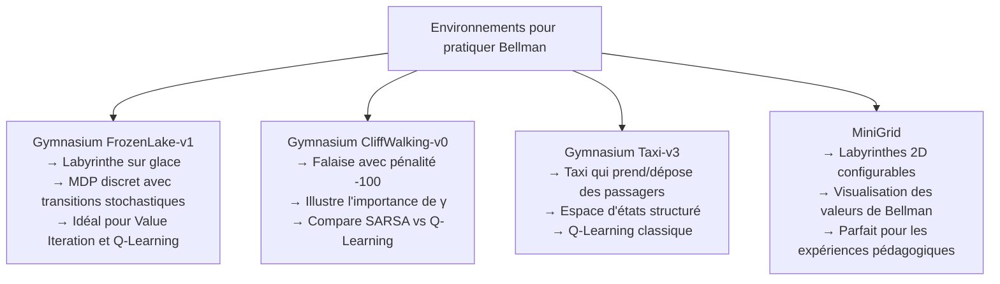

| Environnement | Taille S×A | Difficulté | Idéal pour |
|---|---|---|---|
| FrozenLake-v1 | 16×4 | Débutant | Value Iteration, Q-Learning de base |
| CliffWalking-v0 | 48×4 | Débutant | Comparer γ, SARSA vs Q-Learning |
| Taxi-v3 | 500×6 | Intermédiaire | Q-Learning sur espace plus grand |
| CartPole-v1 | Continu | Intermédiaire | DQN — Bellman + réseau de neurones |
| LunarLander-v2 | Continu | Avancé | DQN ou PPO — Actor-Critic |

---

### 6 — Bibliothèques Python essentielles

```python
# Environnements RL standardisés
import gymnasium as gym

# Algorithmes RL pré-implémentés (Q-Learning, DQN, PPO...)
from stable_baselines3 import DQN, PPO, A2C

# Visualisation des valeurs de Bellman dans un labyrinthe
import matplotlib.pyplot as plt
import numpy as np

# Pour les calculs matriciels de Value/Policy Iteration
import scipy.linalg  # Résolution de systèmes linéaires pour Policy Evaluation
```

</details>

<p align="right"><a href="#top">↑ Retour en haut</a></p>

---

<a id="section-14"></a>

<details>
<summary>14 — Synthèse du chapitre</summary>

<br/>

### Ce que vous avez appris dans ce chapitre

---

#### Les équations de Bellman en un coup d'œil

```mermaid
mindmap
  root((Équations de Bellman))
    Fonctions de Valeur
      V-s — valeur d un état
      Q-s-a — valeur d une action
      V-optimal — meilleure politique
      Q-optimal — meilleure action
    Formules clés
      V*(s) = max_a [R + γ V*(s')]
      Q*(s,a) = R + γ max_a' Q*(s',a')
      V*(s) = max_a Q*(s,a)
      π*(s) = argmax_a Q*(s,a)
    Facteur γ
      0 = agent myope
      0.9 = équilibre
      1 = horizon infini
      impact sur la convergence
    Algorithmes DP
      Value Iteration
      Policy Iteration
      Convergence garantie
      Nécessite modèle P
    Algorithmes Model-Free
      Q-Learning — off-policy
      SARSA — on-policy
      DQN — réseau de neurones
      TD Error = signal Bellman
    Applications
      Navigation robotique
      Jeux AlphaGo DQN Atari
      Finance trading
      Contrôle industriel
```

---

#### Tableau récapitulatif — Équations clés

| Concept | Formule | Description |
|---|---|---|
| **Retour cumulé** | $G_t = \sum_{k=0}^{\infty} \gamma^k r_{t+k}$ | Ce que l'agent cherche à maximiser |
| **V^π(s) — Espérance** | $V^\pi(s) = \sum_a \pi(a\|s) \sum_{s'} P(s'\|s,a)[R + \gamma V^\pi(s')]$ | Valeur d'un état sous politique π |
| **V*(s) — Optimal** | $V^*(s) = \max_a \sum_{s'} P(s'\|s,a)[R + \gamma V^*(s')]$ | Valeur optimale d'un état |
| **Q*(s,a) — Optimal** | $Q^*(s,a) = \sum_{s'} P(s'\|s,a)[R + \gamma \max_{a'} Q^*(s',a')]$ | Q-valeur optimale |
| **Relation V-Q** | $V^*(s) = \max_a Q^*(s,a)$ | Lien entre les deux fonctions |
| **Politique optimale** | $\pi^*(s) = \arg\max_a Q^*(s,a)$ | Dériver la politique depuis Q* |
| **Mise à jour Q-Learning** | $Q(s,a) \leftarrow Q(s,a) + \alpha[r + \gamma \max_{a'} Q(s',a') - Q(s,a)]$ | Approximation stochastique de Bellman |

---

#### Relation entre tous les concepts

```mermaid
flowchart LR
    A["Principe d'optimalité\nde Bellman"] --> B["Équations de Bellman\npour V*(s) et Q*(s,a)"]
    B --> C["Algorithmes DP\n(Value/Policy Iteration)\nAvec modèle connu"]
    B --> D["Q-Learning / SARSA\n(TD Learning)\nSans modèle"]
    D --> E["Deep Q-Network (DQN)\nBellman + réseau de neurones"]
    B --> F["Actor-Critic (PPO, A2C)\nCritic estime V(s) via Bellman"]

    style A fill:#FFD700
    style E fill:#90EE90
    style F fill:#90EE90
```

---

#### Points à retenir absolument

1. **V(s) et Q(s,a) sont les deux faces de la même médaille.** V(s) évalue un état, Q(s,a) évalue une action dans un état. La relation V*(s) = max_a Q*(s,a) les relie directement.

2. **L'équation de Bellman est récursive.** La valeur de l'état actuel est définie en fonction de la valeur des états futurs — ce qui permet de calculer toutes les valeurs efficacement à partir des états terminaux.

3. **γ est un paramètre critique qui définit le comportement de l'agent.** Un γ faible crée un agent myope, un γ élevé crée un planificateur à long terme. Le choix de γ influence profondément la politique optimale.

4. **Q-Learning est une approximation stochastique des équations de Bellman.** Chaque mise à jour TD corrige progressivement Q(s,a) vers sa valeur optimale — exactement comme si on résolvait Bellman de manière incrémentale.

5. **Tout algorithme RL moderne est construit sur les équations de Bellman.** DQN, PPO, SAC, AlphaZero — tous utilisent les mises à jour Bellman sous une forme ou une autre. Maîtriser Bellman, c'est comprendre le cœur de tout le Deep RL.

---

#### Ce qui arrive dans la suite du cours

Dans les prochains chapitres, nous construisons directement sur les équations de Bellman :

- **Q-Learning en profondeur** : implémentation complète, convergence, hyperparamètres
- **Deep Q-Network (DQN)** : Bellman avec réseaux de neurones, experience replay, target networks
- **SARSA et les méthodes on-policy** : nuances par rapport au Q-Learning
- **Projets pratiques** : entraîner un agent sur FrozenLake, CartPole, LunarLander
- **Policy Gradient et Actor-Critic** : au-delà de Q-Learning, vers les algorithmes état de l'art

</details>

<p align="right"><a href="#top">↑ Retour en haut</a></p>

---

<p align="center">
  <em>Tous droits réservés. Toute reproduction, diffusion, utilisation ou adaptation de ce cours, en tout ou en partie, est strictement interdite sans l'autorisation écrite préalable de Dr. Haythem REHOUMA.</em>
</p>

<p align="center">
  <strong>Cours créé par Dr. Haythem REHOUMA — Apprentissage par Renforcement</strong>
</p>

<br/>

<p align="center">
  <a href="#top" style="display: inline-block; background: #2563eb; color: #ffffff; text-decoration: none; font-size: 1.1rem; font-weight: 700; padding: 14px 40px; border-radius: 10px; letter-spacing: 0.3px;">
    ↑ Retour en haut du cours
  </a>
</p>
