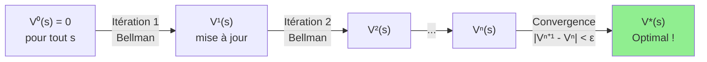
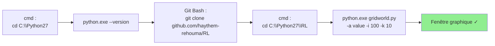
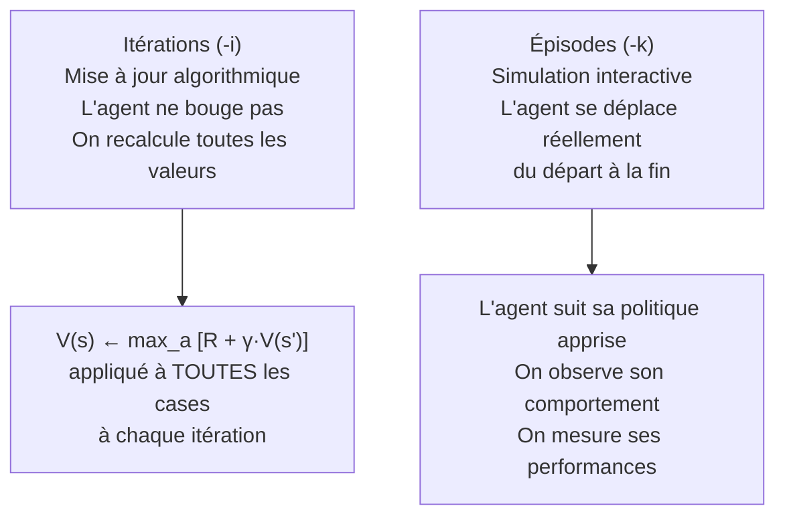
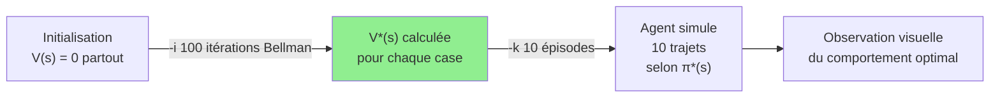
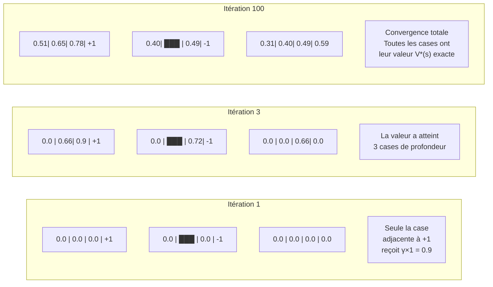
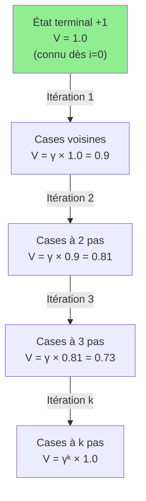
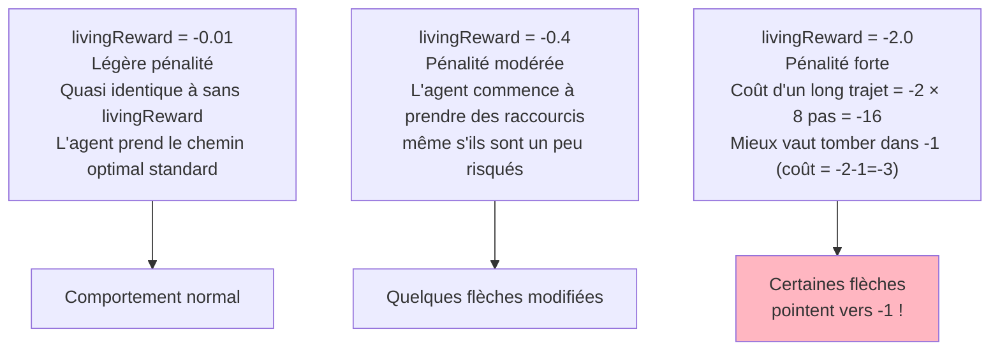
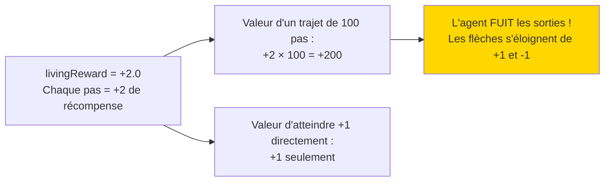
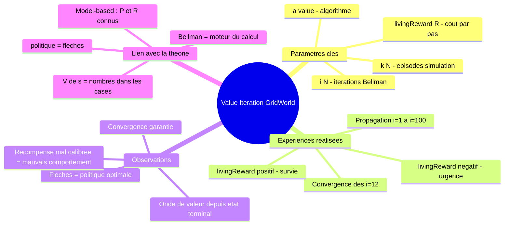

<a id="top"></a>

# Démonstration Pratique — Fonction de Valeur et Value Iteration avec GridWorld

## Table des matières

| # | Section |
|---|---|
| 1 | [Contexte et objectifs](#section-1) |
| 1a | &nbsp;&nbsp;&nbsp;↳ [Rappel : qu'est-ce que la fonction de valeur ?](#section-1) |
| 1b | &nbsp;&nbsp;&nbsp;↳ [Installation et mise en place](#section-1) |
| 2 | [L'environnement GridWorld — BookGrid](#section-2) |
| 2a | &nbsp;&nbsp;&nbsp;↳ [Description de la grille et des états](#section-2) |
| 2b | &nbsp;&nbsp;&nbsp;↳ [Les paramètres de Value Iteration](#section-2) |
| 2c | &nbsp;&nbsp;&nbsp;↳ [Différence fondamentale : itérations vs épisodes](#section-2) |
| 3 | [Démonstration de base — Value Iteration](#section-3) |
| 3a | &nbsp;&nbsp;&nbsp;↳ [Commande de référence](#section-3) |
| 3b | &nbsp;&nbsp;&nbsp;↳ [Exploration des paramètres avancés](#section-3) |
| 4 | [Expérience 1 — Observer la propagation de Bellman](#section-4) |
| 4a | &nbsp;&nbsp;&nbsp;↳ [Série progressive : i=1 à i=100](#section-4) |
| 4b | &nbsp;&nbsp;&nbsp;↳ [Analyse et observations attendues](#section-4) |
| 5 | [Expérience 2 — Impact de la récompense de survie (`--livingReward`)](#section-5) |
| 5a | &nbsp;&nbsp;&nbsp;↳ [livingReward négatif — urgence d'agir](#section-5) |
| 5b | &nbsp;&nbsp;&nbsp;↳ [livingReward positif — l'agent veut survivre](#section-5) |
| 5c | &nbsp;&nbsp;&nbsp;↳ [Tableau comparatif des comportements](#section-5) |
| 6 | [Quiz 1 — Comprendre Value Iteration](#section-6) |
| 7 | [Quiz 2 — Interpréter les résultats visuels](#section-7) |
| 8 | [Pratique guidée — Séries d'expériences à réaliser](#section-8) |
| 8a | &nbsp;&nbsp;&nbsp;↳ [Correction et analyse attendue](#section-8) |
| 9 | [Ressources — Toutes les commandes de référence](#section-9) |
| 10 | [Synthu{00e8}se de la du{00e9}monstration](#section-10) |
| u{1f9d1}u{200d}u{1f91d}u{200d}u{1f9d1} | [**Travail en groupe — Exploration guidu{00e9}e**](#travail-groupe) |

---


## Équation de référence

<a id="eq-valeur"></a>

**Éq. (1)** — Équation de Bellman optimale (Value Iteration)

$$V^{\ast}(s) = \max_a \sum_{s'} P(s'|s,a) \left[ R(s,a,s') + \gamma \cdot V^{\ast}(s') \right]$$

---

<a id="travail-groupe"></a>

<details>
<summary>🧑‍🤝‍🧑 Travail en groupe — Exploration guidée de Value Iteration</summary>

## Travail en groupe — Exploration guidée de Value Iteration

> **Consignes générales**
> - Ce travail se fait en groupes de 2 à 4 personnes.
> - Vous n'avez **pas besoin d'être mathématicien** — ce qui compte, c'est d'**observer, décrire et expliquer**.
> - Chaque groupe documente ses observations et rédige un **rapport de groupe** à remettre.
> - Durée estimée : **90 à 120 minutes**.

---

### Contexte — Ce que vous allez explorer

Vous allez faire tourner l'algorithme **Value Iteration** dans l'environnement **GridWorld** avec différents paramètres. À chaque fois, vous observerez comment les **valeurs des cases changent**, comment les **flèches (politique)** évoluent, et quel effet chaque paramètre a sur le comportement de l'agent.

L'interface GridWorld affiche :
- Des **chiffres dans chaque case** → la valeur V(s) estimée de cet état
- Des **flèches** → la politique optimale suggérée (quelle direction aller)
- Des **couleurs** → plus la case est verte/chaude, plus sa valeur est élevée

---

### Tâche 0 — Mise en place (10 min)

Avant de commencer, vérifiez que Python 2.7 et GridWorld sont installés.

```cmd
cd C:\Python27
python.exe --version
cd C:\Python27\RL
C:\Python27\python.exe gridworld.py -a value -i 100 -k 10
```

**Questions de départ :**
1. Que voyez-vous à l'écran quand vous lancez la commande ? Décrivez en 3-4 phrases.
2. Combien de cases y a-t-il dans la grille ? Lesquelles semblent importantes (récompenses) ?
3. Quelles couleurs distinguez-vous ? Quelle case est la plus verte ? Pourquoi selon vous ?
4. Y a-t-il des flèches ? Dans quelles directions pointent-elles ?
5. Notez la valeur approximative de chaque case visible.

---

### Tâche 1 — Observer l'effet du nombre d'itérations (30 min)

Lancez les commandes suivantes **une par une**, et observez attentivement ce qui change entre chaque commande.

```cmd
C:\Python27\python.exe gridworld.py -a value -i 1
C:\Python27\python.exe gridworld.py -a value -i 2
C:\Python27\python.exe gridworld.py -a value -i 3
C:\Python27\python.exe gridworld.py -a value -i 5
C:\Python27\python.exe gridworld.py -a value -i 7
C:\Python27\python.exe gridworld.py -a value -i 12
C:\Python27\python.exe gridworld.py -a value -i 100
```

**Tableau à remplir — Observations par itération :**

| `-i` | Cases avec des valeurs ? | Des flèches visibles ? | La case de départ a une valeur ? | Notes libres |
|---|---|---|---|---|
| 1 | | | | |
| 2 | | | | |
| 3 | | | | |
| 5 | | | | |
| 7 | | | | |
| 12 | | | | |
| 100 | | | | |

**Questions d'analyse :**

1. À quelle itération les premières valeurs apparaissent-elles dans les cases ? Pourquoi pas dès `-i 1` pour toutes les cases ?
2. À quelle itération les flèches de direction apparaissent-elles ? Qu'est-ce que cela signifie ?
3. Entre `-i 12` et `-i 100`, y a-t-il une différence visible ? Qu'est-ce que cela nous dit sur la **convergence** ?
4. Décrivez en vos propres mots comment les valeurs semblent "se propager" dans la grille.
5. Si vous étiez l'agent, à quelle itération seriez-vous prêt à agir de façon raisonnable ? Justifiez.
6. Pourquoi utiliser `-i 100` si `-i 12` donne déjà le même résultat ?

---

### Tâche 2 — Comprendre les épisodes vs les itérations (15 min)

```cmd
C:\Python27\python.exe gridworld.py -a value -i 100 -k 10
C:\Python27\python.exe gridworld.py -a value -i 1 -k 10
C:\Python27\python.exe gridworld.py -a value -i 100 -k 1
```

**Questions :**

1. Dans la première commande (`-i 100 -k 10`), combien d'épisodes l'agent joue-t-il ? Où le voyez-vous dans l'interface ?
2. Comparez `-i 1 -k 10` et `-i 100 -k 10` : les valeurs des cases changent-elles ? Pourquoi ?
3. Comparez `-i 100 -k 1` et `-i 100 -k 10` : les valeurs changent-elles ? Pourquoi ?
4. Complétez ce tableau de distinction :

| Paramètre | Ce que ça contrôle | Impact sur les valeurs V(s) ? | Impact sur les flèches ? |
|---|---|---|---|
| `-i N` | | | |
| `-k N` | | | |

5. Dans vos mots : quelle est la différence fondamentale entre une **itération** et un **épisode** ?

---

### Tâche 3 — L'impact de la récompense de survie `--livingReward` (30 min)

> Le paramètre `--livingReward` donne une **récompense (ou pénalité) à chaque pas** de l'agent — même s'il ne touche aucun état terminal.

```cmd
C:\Python27\python.exe gridworld.py -a value -i 12 -k 2 --livingReward -0.01
C:\Python27\python.exe gridworld.py -a value -i 12 -k 2 --livingReward -0.3
C:\Python27\python.exe gridworld.py -a value -i 12 -k 2 --livingReward -0.4
C:\Python27\python.exe gridworld.py -a value -i 12 -k 2 --livingReward -2.0
C:\Python27\python.exe gridworld.py -a value -i 12 -k 2 --livingReward 2.0
```

**Tableau à remplir — Effet du livingReward :**

| `--livingReward` | Les flèches pointent vers le +1 ? | L'agent évite-t-il le chemin long ? | L'agent semble "pressé" ? | Notes |
|---|---|---|---|---|
| -0.01 | | | | |
| -0.3 | | | | |
| -0.4 | | | | |
| -2.0 | | | | |
| 2.0 | | | | |

**Questions :**

1. Avec `--livingReward -0.01` (pénalité très faible), l'agent prend-il le chemin le plus court ou le plus long ? Pourquoi ?
2. Avec `--livingReward -2.0` (pénalité forte), que se passe-t-il ? L'agent préfère-t-il encore aller vers la récompense +1 ? Expliquez.
3. Avec `--livingReward 2.0` (récompense positive à chaque pas), comment l'agent se comporte-t-il ? Veut-il arriver à l'état terminal ou rester dans la grille ?
4. À quel moment l'agent change-t-il de comportement (entre -0.3 et -0.4) ? Qu'est-ce que cela révèle sur l'importance du calibrage de la récompense ?
5. Dans la vraie vie, à quoi correspondrait un `--livingReward -2.0` pour un robot livreur ? Et un `--livingReward 2.0` ?
6. Si vous conceviez un jeu vidéo avec un personnage RL, quel `--livingReward` utiliseriez-vous et pourquoi ?

---

### Tâche 4 — Expérience libre en groupe (20 min)

Chaque groupe choisit **une question originale** et conçoit sa propre expérience pour y répondre.

**Exemples de questions** :
- "À partir de quel nombre d'itérations les valeurs ne changent-elles plus ?"
- "Quel `--livingReward` fait que l'agent hésite entre deux chemins ?"
- "Que se passe-t-il avec `-i 0` ?"

**Instructions :**
1. Formulez votre question en une phrase claire.
2. Décrivez la commande (ou les commandes) que vous allez lancer.
3. Notez vos observations.
4. Répondez à votre question en vous basant sur ce que vous avez vu.

---

### Tâche 5 — Questions de réflexion pour le rapport (à rendre)

Répondez à ces questions par écrit (3-5 lignes chacune) dans votre rapport de groupe.

**Partie A — Compréhension des paramètres**

1. Qu'est-ce qu'une **itération** dans Value Iteration ? Donnez un exemple concret avec GridWorld.
2. Qu'est-ce qu'un **épisode** ? En quoi est-il différent d'une itération ?
3. Expliquez le rôle du paramètre `--livingReward` avec vos propres mots et un exemple.
4. Pourquoi l'algorithme s'appelle-t-il **"Value Iteration"** (Itération de Valeur) ? Qu'est-ce qui "itère" exactement ?
5. Pourquoi les cases les plus proches de la récompense ont-elles des valeurs plus élevées ?

**Partie B — Analyse critique**

6. Si vous deviez expliquer la fonction de valeur V(s) à un enfant de 10 ans, que diriez-vous ?
7. D'après vos expériences, combien d'itérations sont nécessaires pour que l'agent soit "bon" sur BookGrid ? Comment avez-vous déterminé ce nombre ?
8. Quel paramètre a eu **le plus grand impact** sur le comportement de l'agent selon vos observations ? Justifiez avec 2 exemples de vos expériences.
9. Si la récompense terminale passait de +1 à +100, pensez-vous que l'agent changerait de comportement ? Qu'est-ce qui changerait vraiment ?
10. Dans quel domaine réel (robotique, jeux, finance...) imaginez-vous utiliser Value Iteration ? Identifiez ce qui serait : les états, les actions, et la récompense de survie.

**Partie C — Observation visuelle**

11. Faites une capture d'écran de GridWorld avec `-i 1` et une autre avec `-i 12`. Annotez les différences que vous observez (flèches, couleurs, valeurs).
12. Avec `--livingReward -2.0`, capturez l'écran et expliquez pourquoi l'agent agit comme il le fait.
13. Dessinez (à main levée ou en ASCII) comment vous imaginez les valeurs se propager dans une grille 3x3 simple avec une récompense en coin.

---

### Format du rapport à rendre

**Structure attendue :**

```
1. Page de titre
   - Noms des membres du groupe
   - Date
   - Titre : "Exploration de Value Iteration avec GridWorld"

2. Introduction (5-10 lignes)
   - Ce que vous avez fait
   - Ce que vous avez appris

3. Résultats des Tâches 1 à 3
   - Tableaux remplis
   - Réponses aux questions

4. Expérience libre (Tâche 4)
   - Question choisie
   - Méthode
   - Résultats
   - Conclusion

5. Réflexions (Tâche 5)
   - Réponses aux 13 questions

6. Conclusion générale (5-10 lignes)
   - Ce qui vous a surpris
   - Ce que vous n'avez pas compris et ce que vous aimeriez explorer
```

**Critères d'évaluation :**

| Critère | Points |
|---|---|
| Tableaux correctement remplis (observations précises) | /20 |
| Qualité des réponses aux questions (clarté, pertinence) | /30 |
| Expérience libre (originalité, méthode, conclusion) | /20 |
| Réflexions (profondeur, exemples personnels) | /20 |
| Présentation et clarté du rapport | /10 |
| **Total** | **/100** |

</details>

---

<a id="section-1"></a>

<details>
<summary>1 — Contexte et objectifs</summary>


Cette démonstration pratique vous permet de **visualiser en direct** le fonctionnement de la **fonction de valeur V(s)** et de l'algorithme **Value Iteration** — les concepts théoriques vus dans le chapitre sur les équations de Bellman.

Vous n'allez pas seulement lire des formules : vous allez **voir les valeurs se propager case par case** dans une grille, observer comment la politique optimale émerge, et comprendre l'effet de chaque paramètre sur le comportement de l'agent.

---

### Rappel — Qu'est-ce que la fonction de valeur ?

La **fonction de valeur V(s)** associe à chaque état s un nombre qui représente les **récompenses cumulées espérées** si l'agent suit la politique optimale depuis cet état.

> **[→ Éq. 1 — Équation de Bellman optimale](#eq-valeur)**

**Value Iteration** applique cette équation de manière répétée sur tous les états jusqu'à convergence :



> _GridWorld rend ce processus **visible** : à chaque itération, vous voyez les chiffres dans les cases changer et les flèches de politique s'affiner progressivement._

---

### Objectifs pédagogiques

À la fin de cette démonstration, vous serez capable de :

1. **Lancer** Value Iteration sur GridWorld et interpréter l'affichage.
2. **Observer** visuellement comment la valeur de Bellman se propage depuis les états terminaux.
3. **Comprendre** la différence entre itérations (`-i`) et épisodes (`-k`).
4. **Analyser** l'impact du paramètre `--livingReward` sur la politique optimale.
5. **Prédire** le comportement de l'agent avant de lancer une commande.

---

### Installation et mise en place

#### Étape 1 — Ouvrir l'invite de commandes (cmd)

> Toutes les commandes ci-dessous s'exécutent dans **cmd Windows**, sauf `git clone` qui s'exécute dans **Git Bash**.

#### Étape 2 — Vérifier Python 2.7

```cmd
cd C:\Python27
python.exe --version
```

#### Étape 3 — Cloner le dépôt (Git Bash)

```bash
git clone https://github.com/haythem-rehouma/RL.git
```

#### Étape 4 — Se placer dans le dossier du projet

```cmd
cd C:\Python27\RL
```

#### Étape 5 — Lancer le premier test

```cmd
C:\Python27\python.exe gridworld.py -a value -i 100 -k 10
```

Si une fenêtre graphique s'ouvre avec une grille colorée et des flèches, tout est prêt.



</details>

<p align="right"><a href="#top">↑ Retour en haut</a></p>

---

<a id="section-2"></a>

<details>
<summary>2 — L'environnement GridWorld — BookGrid</summary>


GridWorld est un environnement de simulation développé par l'**Université de Californie à Berkeley** pour enseigner les algorithmes de RL. La grille par défaut, **BookGrid**, est la plus simple et la mieux adaptée pour observer Value Iteration.

---

### 2.1 — Description de BookGrid

```
┌────┬────┬────┬────┐
│    │    │    │ +1 │  ← État terminal positif (but)
├────┼────┼────┼────┤
│    │████│    │ -1 │  ← État terminal négatif (piège)
├────┼────┼────┼────┤
│    │    │    │    │
└────┴────┴────┴────┘
      ████ = mur (case inaccessible)
```

**Éléments de la grille :**

| Élément | Description | Valeur |
|---|---|---|
| Case blanche | État normal — l'agent peut s'y trouver | V(s) calculé par Bellman |
| **+1** (vert) | État terminal positif — but à atteindre | +1 |
| **-1** (rouge) | État terminal négatif — piège à éviter | -1 |
| ████ (gris) | Mur — case infranchissable | — |

**Ce que GridWorld affiche :**
- Le **chiffre** dans chaque case = la valeur V(s) calculée
- Les **flèches** = la politique optimale π*(s) — quelle direction prendre depuis chaque case
- Les **couleurs** = gradient de valeur (vert = haute valeur, rouge = basse valeur)

---

### 2.2 — Les paramètres de Value Iteration

| Paramètre | Flag | Signification | Exemple |
|---|---|---|---|
| **Algorithme** | `-a value` | Utilise Value Iteration (itération sur les valeurs) | `-a value` |
| **Itérations** | `-i N` | Nombre de passes de mise à jour Bellman sur toutes les cases | `-i 100` |
| **Épisodes** | `-k N` | Nombre de trajets complets de l'agent après l'apprentissage | `-k 10` |
| **Récompense de survie** | `--livingReward R` | Pénalité ou récompense reçue à **chaque pas** | `--livingReward -2` |
| **Discount** | `-d γ` | Facteur d'actualisation des récompenses futures | `-d 0.9` |
| **Bruit** | `-n p` | Probabilité de glisser vers une direction non voulue | `-n 0.2` |
| **Grille** | `-g NOM` | Choisir une grille différente | `-g BookGrid` |

---

### 2.3 — Différence fondamentale : itérations vs épisodes

C'est la distinction la plus importante à comprendre dans cette démonstration :

| Critère | Itérations (`-i`) | Épisodes (`-k`) |
|---|---|---|
| **Définition** | Nombre de fois que les valeurs V(s) de **tous les états** sont mises à jour simultanément | Nombre de fois que l'agent parcourt la grille du départ à l'état terminal |
| **Algorithme affecté** | Value Iteration principalement | Simulation post-apprentissage |
| **Objectif** | Améliorer les estimations des valeurs d'états | Tester et visualiser la politique apprise |
| **Convergence** | Plus d'itérations = valeurs plus précises, plus proches de V*(s) | Plus d'épisodes = meilleure évaluation statistique de la politique |
| **Analogie** | Réviser ses fiches de cours pour mémoriser | Passer des examens blancs pour tester ses connaissances |



> _Pour cette démonstration, l'essentiel se passe dans les **itérations** : c'est là que Value Iteration fait son travail. Les épisodes servent uniquement à vérifier que la politique apprise est correcte._

</details>

<p align="right"><a href="#top">↑ Retour en haut</a></p>

---

<a id="section-3"></a>

<details>
<summary>3 — Démonstration de base — Value Iteration</summary>


### 3.1 — Commande de référence

```cmd
C:\Python27\python.exe gridworld.py -a value -i 100 -k 10
```

**Ce que fait cette commande :**

- **`-a value`** → Algorithme : **Itération de Valeur** (Value Iteration)
- **`-i 100`** → Effectue **100 itérations** de mise à jour des valeurs d'états selon Bellman
- **`-k 10`** → Lance **10 épisodes** de simulation pour observer la politique résultante

**Ce que vous observez dans la fenêtre :**

1. Chaque case affiche sa **valeur V(s)** (un nombre décimal)
2. Des **flèches** indiquent π*(s) — la meilleure direction à prendre depuis chaque case
3. Les cases terminales (+1 et -1) sont en couleur
4. Après les 10 épisodes, vous voyez l'agent suivre le chemin optimal



---

### 3.2 — Exploration des paramètres avancés

#### Avec BookGrid, discount et bruit explicites :

```cmd
C:\Python27\python.exe gridworld.py -g BookGrid -d 0.9 -r 0.1 -n 0.2 -a value -i 100 -k 10
```

**Paramètres détaillés :**

| Flag | Valeur | Signification |
|---|---|---|
| `-g BookGrid` | BookGrid | Grille par défaut explicitement spécifiée |
| `-d 0.9` | γ = 0.9 | Discount : les récompenses futures valent 90% des immédiates |
| `-r 0.1` | reward = 0.1 | Récompense de transition positive (légère) |
| `-n 0.2` | noise = 0.2 | 20% de probabilité de glisser perpendiculairement |
| `-a value` | value | Algorithme Value Iteration |
| `-i 100` | 100 | 100 itérations de Bellman |
| `-k 10` | 10 | 10 épisodes de simulation |

#### Avec récompense de survie :

```cmd
C:\Python27\python.exe gridworld.py -a value -i 100 -k 10 --livingReward -2
```

**Paramètres détaillés :**

- **`-a value`** → Itération de Valeur
- **`-i 100`** → 100 itérations pour évaluer les valeurs des états
- **`-k 10`** → 10 épisodes
- **`--livingReward -2`** → **Pénalité de -2 à chaque pas** — l'agent est fortement incité à terminer rapidement

> _Comparez les flèches entre la commande de base et celle avec `--livingReward -2`. Certaines flèches changeront de direction — l'agent modifie sa stratégie pour éviter les trajets trop longs._

#### Version avec peu d'itérations :

```cmd
C:\Python27\python.exe gridworld.py -a value -i 10 -k 2 --livingReward -2
```

- **`-i 10`** → Seulement 10 itérations — valeurs partiellement convergées
- **`-k 2`** → 2 épisodes seulement
- **`--livingReward -2`** → Forte pénalité de survie

**Observation attendue :** avec seulement 10 itérations, certaines cases éloignées ont encore des valeurs imprécises. La politique peut sembler incohérente pour les cases loin de +1 car la propagation de Bellman n'a pas encore atteint ces cases.

</details>

<p align="right"><a href="#top">↑ Retour en haut</a></p>

---

<a id="section-4"></a>

<details>
<summary>4 — Expérience 1 — Observer la propagation de Bellman</summary>


Cette expérience est la plus fondamentale de la démonstration. Elle vous permet de **voir en temps réel** comment l'équation de Bellman propage la récompense +1 depuis l'état terminal vers tous les autres états.

---

### 4.1 — Série progressive : i=1 à i=100

Lancez ces commandes **dans l'ordre**, en observant l'évolution à chaque fois :

```cmd
C:\Python27\python.exe gridworld.py -a value -i 1
C:\Python27\python.exe gridworld.py -a value -i 2
C:\Python27\python.exe gridworld.py -a value -i 3
C:\Python27\python.exe gridworld.py -a value -i 5
C:\Python27\python.exe gridworld.py -a value -i 7
C:\Python27\python.exe gridworld.py -a value -i 12
C:\Python27\python.exe gridworld.py -a value -i 100
```

**Algorithme :** Itération de Valeur (`-a value`)  
**Variable :** nombre d'itérations Bellman — de 1 à 100

---

### 4.2 — Analyse et observations attendues

#### Comment la valeur se propage — visualisation



#### Tableau des observations attendues par itération

| Itérations | Cases avec valeur non nulle | Flèches cohérentes | État de convergence |
|---|---|---|---|
| `i=1` | Uniquement les 2 cases voisines directes de +1 | Aucune ou 1-2 | Non convergé |
| `i=2` | Cases à distance ≤ 2 de +1 | Quelques-unes | Non convergé |
| `i=3` | Cases à distance ≤ 3 | Partiellement | Non convergé |
| `i=5` | La plupart des cases accessibles | Majorité cohérentes | Quasi convergé pour cases proches |
| `i=7` | Presque toutes les cases | Politique claire | Quasi convergé |
| `i=12` | Toutes les cases | Politique complète et stable | Convergé pour cette grille |
| `i=100` | Toutes les cases (idem i=12) | Identique à i=12 | Convergé (pas de changement depuis i≈8) |

#### Pourquoi cela se passe-t-il ainsi ?

L'équation de Bellman propage la valeur **d'un seul pas** à chaque itération. C'est comme une **onde sonore** qui se diffuse depuis la source (l'état terminal +1) :



> _C'est exactement l'équation de Bellman en action : V(s) = R + γ·V(s'). Pour calculer la valeur d'une case à k pas de +1, il faut k itérations pour que la propagation l'atteigne._

#### Conséquence pratique : combien d'itérations faut-il ?

Pour une grille de taille n×m, la convergence est garantie en au plus **n×m itérations** (nombre d'états). En pratique, pour BookGrid (3×4 = 12 cases), **~8-12 itérations suffisent**. Les itérations supplémentaires (jusqu'à 100) ne changent plus rien — on est déjà convergé.

</details>

<p align="right"><a href="#top">↑ Retour en haut</a></p>

---

<a id="section-5"></a>

<details>
<summary>5 — Expérience 2 — Impact de la récompense de survie (--livingReward)</summary>


La **récompense de survie** (*living reward*) est une récompense (ou pénalité) reçue par l'agent à **chaque pas effectué**, indépendamment de l'état terminal. Elle modélise le **coût ou bénéfice de l'action elle-même**.

---

### 5.1 — livingReward négatif — urgence d'agir

Un `livingReward` négatif signifie que **chaque pas coûte quelque chose**. L'agent est donc incité à terminer l'épisode le plus vite possible.

#### Série d'expériences :

```cmd
C:\Python27\python.exe gridworld.py -a value -i 100 -k 10
C:\Python27\python.exe gridworld.py -a value -i 1 -k 2 --livingReward -2
C:\Python27\python.exe gridworld.py -a value -i 2 -k 2 --livingReward -2
C:\Python27\python.exe gridworld.py -a value -i 10 -k 2 --livingReward -2
```

**Observation clé :** comparez `-i 1`, `-i 2` et `-i 10` avec `--livingReward -2`.
- Avec `-i 1` : valeurs incomplètes → politique incohérente
- Avec `-i 10` : valeurs convergées → politique adaptée à la pénalité forte

#### Série fine avec différentes intensités :

```cmd
C:\Python27\python.exe gridworld.py -a value -i 12 -k 2 --livingReward -0.01
C:\Python27\python.exe gridworld.py -a value -i 12 -k 2 --livingReward -0.03
C:\Python27\python.exe gridworld.py -a value -i 12 -k 2 --livingReward -0.4
C:\Python27\python.exe gridworld.py -a value -i 12 -k 2 --livingReward -2.0
```

**Paramètres communs :** 12 itérations, 2 épisodes — seul `--livingReward` change.



#### Calcul illustrant pourquoi l'agent préfère le piège avec `livingReward -2` :

| Stratégie | Calcul du gain total | Résultat |
|---|---|---|
| Aller vers +1 via 8 pas | -2×8 + 1 = **-15** | Très négatif |
| Aller vers +1 via 4 pas | -2×4 + 1 = **-7** | Négatif |
| Tomber dans -1 en 1 pas | -2×1 + (-1) = **-3** | **Moins mauvais !** |

> _C'est contre-intuitif mais mathématiquement correct : une pénalité de survie trop forte peut rendre le piège préférable à un long voyage vers la récompense positive._

---

### 5.2 — livingReward positif — l'agent veut survivre

```cmd
C:\Python27\python.exe gridworld.py -a value -i 10 -k 2 --livingReward 2
C:\Python27\python.exe gridworld.py -a value -i 12 -k 2 --livingReward 2.0
```

Avec `--livingReward 2.0`, chaque pas **rapporte +2**. L'agent rationnel préfère donc **ne jamais terminer l'épisode** — chaque pas supplémentaire lui rapporte +2, bien plus que la récompense terminale +1.



**Observation attendue :** les flèches ne pointent plus vers +1 — elles pointent **à l'opposé**, vers les cases qui permettent de rester en vie le plus longtemps.

---

### 5.3 — Tableau comparatif des comportements

| `--livingReward` | Urgence | Comportement de l'agent | Flèches observées |
|---|---|---|---|
| `0` (défaut) | Neutre | Chemin optimal standard vers +1 | Toutes vers +1, évitent -1 |
| `-0.01` | Très faible | Quasi identique à 0 | Idem défaut |
| `-0.03` | Faible | Légère préférence pour les raccourcis | Très légère modification |
| `-0.4` | Modérée | Préfère les chemins courts, même s'ils passent près de -1 | Quelques flèches modifiées |
| `-2.0` | Forte | Peut préférer le piège (-1) à un long trajet | Certaines flèches vers **-1** |
| `+2.0` | Inversée | Évite les sorties — veut rester en vie indéfiniment | Flèches **s'éloignent** de +1 et -1 |

> _Cette expérience illustre l'importance cruciale de bien définir la **fonction de récompense** en RL. Une récompense mal calibrée produit systématiquement un comportement non désiré — même si l'algorithme fonctionne parfaitement._

</details>

<p align="right"><a href="#top">↑ Retour en haut</a></p>

---

<a id="section-6"></a>

<details>
<summary>6 — Quiz 1 — Comprendre Value Iteration</summary>


Ce quiz évalue votre compréhension des concepts de Value Iteration dans GridWorld. Répondez à chaque question, puis cliquez sur **💡 Voir la solution**.

---

**Question 1 :** Dans la commande `gridworld.py -a value -i 100 -k 10`, que calcule réellement `-i 100` ?

a) L'agent effectue 100 déplacements dans la grille

b) L'algorithme applique 100 fois l'équation de Bellman V(s) ← max_a [R + γV(s')] sur toutes les cases

c) La simulation dure 100 secondes

d) L'agent explore 100 chemins différents

<details>
<summary>💡 Voir la solution</summary>

✅ **Réponse : b)**

`-i 100` signifie **100 itérations** de mise à jour de Bellman. À chaque itération, l'équation V(s) ← max_a Σ P(s'|s,a)[R + γV(s')] est appliquée à **chaque état de la grille**. L'agent ne se déplace pas pendant ces calculs — ce sont des mises à jour algorithmiques pures.

</details>

---

**Question 2 :** Quelle est la principale différence entre `-i 5` et `-i 100` sur BookGrid ?

a) `-i 100` est 20 fois plus lent mais le résultat est identique

b) Avec `-i 5`, seules les cases proches de +1 ont une valeur propagée. Avec `-i 100`, toutes les cases ont atteint leur valeur V*(s) exacte (convergence)

c) `-i 5` explore 5 chemins, `-i 100` en explore 100

d) Avec `-i 100`, l'agent fait plus d'erreurs car il sur-apprend

<details>
<summary>💡 Voir la solution</summary>

✅ **Réponse : b)**

L'équation de Bellman propage la valeur de **un pas** à chaque itération. Avec `-i 5`, la valeur n'a atteint que les cases à distance ≤ 5 de +1. Avec `-i 100`, la propagation a atteint toutes les cases et les valeurs sont stables (convergées) — bien que pour BookGrid, la convergence réelle se produise dès ~8-12 itérations.

</details>

---

**Question 3 :** Pourquoi avec `--livingReward -2.0` certaines flèches pointent-elles vers l'état -1 (piège) ?

a) C'est un bug de l'algorithme qui ne gère pas les récompenses négatives

b) Parce qu'un long chemin vers +1 coûte -2 × (nombre de pas) + 1 = très négatif, ce qui peut être pire que tomber dans -1 en peu de pas

c) Parce que l'algorithme confond +1 et -1 avec une pénalité forte

d) Parce que `--livingReward` désactive la récompense terminale +1

<details>
<summary>💡 Voir la solution</summary>

✅ **Réponse : b)**

Avec `--livingReward -2`, chaque pas coûte -2. Pour une case à 8 pas de +1 : gain = -2×8 + 1 = **-15**. Pour tomber dans -1 en 1 pas depuis cette case : gain = -2×1 - 1 = **-3**. L'agent rationnel choisit -3 plutôt que -15 — le piège est moins mauvais. C'est mathématiquement correct mais pédagogiquement révélateur : la fonction de récompense mal calibrée produit des comportements non désirés.

</details>

---

**Question 4 :** Que se passe-t-il si vous utilisez `--livingReward 2.0` (positif) ?

a) L'agent converge plus vite vers +1

b) L'agent préfère rester en vie indéfiniment car chaque pas rapporte +2 — il fuit les états terminaux

c) La récompense +1 devient +3 (1 + 2)

d) L'algorithme ne fonctionne plus avec des récompenses positives

<details>
<summary>💡 Voir la solution</summary>

✅ **Réponse : b)**

Avec `--livingReward +2`, survivre est rentable : 100 pas = +200 de récompense, bien plus que les +1 ou -1 des sorties. L'agent rationnel **évite toutes les sorties** et cherche à rester en vie le plus longtemps possible. Les flèches s'éloignent de +1 et -1. Cela illustre parfaitement le problème du *reward hacking* : l'agent optimise la récompense définie, pas nécessairement l'objectif souhaité.

</details>

---

**Question 5 :** Pourquoi `-i 12` et `-i 100` donnent-ils des résultats identiques sur BookGrid ?

a) Car l'algorithme s'arrête automatiquement à 12 itérations

b) Car BookGrid a ~12 cases accessibles — la convergence est atteinte dès que la propagation de Bellman a atteint toutes les cases (environ 8-12 itérations)

c) Car `-i 100` utilise un algorithme différent au-delà de 12

d) Car le facteur γ = 0.9 empêche les valeurs de changer après 12 itérations

<details>
<summary>💡 Voir la solution</summary>

✅ **Réponse : b)**

Value Iteration converge quand les valeurs ne changent plus entre deux itérations consécutives. Pour BookGrid (~11 cases accessibles), la propagation de Bellman atteint toutes les cases en environ 8-12 itérations. Au-delà, les valeurs sont stables — les itérations supplémentaires ne modifient rien. C'est le critère de convergence : max|V_{k+1}(s) - V_k(s)| < ε.

</details>

---

**Question 6 :** Dans la commande `gridworld.py -g BookGrid -d 0.9 -n 0.2 -a value -i 100 -k 10`, que modélise `-n 0.2` ?

a) L'agent apprend à 20% de sa vitesse normale

b) 20% des itérations sont aléatoires

c) À chaque déplacement, l'agent a 20% de probabilité de glisser perpendiculairement à la direction voulue

d) La grille est modifiée aléatoirement à 20% des étapes

<details>
<summary>💡 Voir la solution</summary>

✅ **Réponse : c)**

`-n 0.2` (noise = 0.2) signifie que l'environnement est **stochastique** : si l'agent choisit d'aller à droite, il y a 80% de chances qu'il aille à droite, et 20% de chances qu'il glisse vers le haut ou le bas. Value Iteration tient compte de cette incertitude via les probabilités de transition P(s'|s,a) dans l'équation de Bellman.

</details>

---

**Question 7 :** Quelle commande permet d'observer les valeurs de Bellman après seulement **1 pas de propagation** ?

a) `gridworld.py -a value -i 100 -k 1`

b) `gridworld.py -a value -i 1`

c) `gridworld.py -a value -k 1`

d) `gridworld.py -a value -i 0`

<details>
<summary>💡 Voir la solution</summary>

✅ **Réponse : b)**

`-i 1` effectue une seule itération de Bellman. Seules les cases **directement adjacentes** à l'état terminal +1 reçoivent une valeur non nulle (environ γ × 1 = 0.9). Toutes les autres cases restent à 0. C'est l'état initial de la propagation — c'est le point de départ idéal pour observer l'onde de Bellman.

</details>

---

**Question 8 :** Si BookGrid a 11 cases accessibles et γ = 0.9, quelle est la valeur approximative de la case la plus éloignée de +1 (à 6 pas) après convergence ?

a) 0.0 — trop loin pour avoir une valeur

b) 0.9 — toutes les cases ont la même valeur

c) γ⁶ × 1 = 0.9⁶ ≈ **0.53**

d) −1 — toutes les cases éloignées sont négatives

<details>
<summary>💡 Voir la solution</summary>

✅ **Réponse : c)**

La valeur d'une case à k pas de +1 (via le chemin optimal) est approximativement γᵏ × 1. À 6 pas avec γ = 0.9 : 0.9⁶ ≈ **0.53**. Les cases plus proches ont des valeurs plus élevées (0.9, 0.81, 0.73...). C'est le **gradient de valeurs** créé par Bellman — une carte de « distance espérée » à la récompense.

</details>

---

**Question 9 :** Quel est l'objectif des `-k 10` épisodes **après** que Value Iteration a convergé ?

a) Continuer à améliorer les valeurs V(s)

b) Observer visuellement l'agent suivre la politique optimale π*(s) sur 10 trajets complets

c) Vérifier si l'algorithme peut converger en moins de 10 itérations

d) Mettre à jour les Q-valeurs avec Q-Learning

<details>
<summary>💡 Voir la solution</summary>

✅ **Réponse : b)**

Une fois que Value Iteration a calculé V*(s) (en `-i 100` itérations), la politique optimale π*(s) est extraite. Les `-k 10` épisodes **ne modifient pas les valeurs** — ils servent uniquement à **simuler** l'agent qui suit cette politique, permettant de l'observer visuellement traverser la grille vers +1.

</details>

---

**Question 10 :** Pourquoi Value Iteration nécessite-t-il de connaître P(s'|s,a) et R(s,a,s') à l'avance ?

a) Car il utilise un réseau de neurones qui nécessite des données structurées

b) Car l'équation de Bellman calcule explicitement la somme Σ P(s'|s,a)[R + γV(s')] — impossible sans connaître P et R

c) Car c'est un algorithme supervisé qui apprend depuis des exemples étiquetés

d) Car sans P et R, l'agent ne peut pas se déplacer dans la grille

<details>
<summary>💡 Voir la solution</summary>

✅ **Réponse : b)**

Value Iteration est un algorithme **model-based** : il applique directement V(s) ← max_a Σ P(s'|s,a)[R(s,a,s') + γV(s')]. Ce calcul **nécessite de connaître** les probabilités de transition P et les récompenses R de chaque case — c'est le modèle complet de l'environnement. C'est ce qui le distingue de Q-Learning (model-free), qui n'a pas besoin de P et R explicites.

</details>

</details>

<p align="right"><a href="#top">↑ Retour en haut</a></p>

---

<a id="section-7"></a>

<details>
<summary>7 — Quiz 2 — Interpréter les résultats visuels</summary>


Ce quiz teste votre capacité à interpréter les affichages de la fenêtre GridWorld et à relier ce que vous voyez aux concepts théoriques.

---

**Question 1 :** Après `gridworld.py -a value -i 3`, vous voyez que la case en bas à gauche affiche `0.00`. Qu'est-ce que cela signifie ?

a) Cette case a une valeur réelle de zéro — c'est correct

b) La propagation de Bellman n'a pas encore atteint cette case en 3 itérations

c) Cette case est un mur inaccessible

d) L'agent a évité cette case pendant les épisodes

<details>
<summary>💡 Voir la solution</summary>

✅ **Réponse : b)**

Avec seulement 3 itérations, la valeur de +1 n'a pu se propager qu'à 3 cases de profondeur. Si la case en bas à gauche est à plus de 3 pas de +1 (ce qui est le cas dans BookGrid), elle n'a pas encore reçu de propagation — sa valeur reste à l'initialisation (0.00). Ce n'est pas sa vraie valeur optimale, juste une estimation incomplète.

</details>

---

**Question 2 :** Les flèches dans la fenêtre GridWorld changent de direction entre `i=5` et `i=12`. Que cela indique-t-il ?

a) L'algorithme a un bug qui instabilise la politique

b) La politique s'affine au fur et à mesure que les valeurs V(s) deviennent plus précises — les cases éloignées reçoivent enfin leur vraie valeur

c) L'agent a appris par épisodes entre les deux runs

d) Le facteur γ change automatiquement entre les itérations

<details>
<summary>💡 Voir la solution</summary>

✅ **Réponse : b)**

Entre `i=5` et `i=12`, les cases éloignées reçoivent des valeurs de plus en plus précises. Des cases qui affichaient 0 obtiennent maintenant une vraie valeur positive — ce qui modifie l'argmax et donc la direction de la flèche. C'est l'algorithme qui converge progressivement vers la politique optimale.

</details>

---

**Question 3 :** Avec `--livingReward -2`, vous voyez une case dont la flèche pointe vers -1 au lieu de +1. Quel calcul explique cela ?

a) L'algorithme a mal convergé avec une pénalité de survie

b) Si le chemin vers +1 depuis cette case nécessite 8 pas : gain = -2×8 + 1 = -15, alors que tomber dans -1 en 1 pas donne -2-1 = -3. L'algorithme choisit -3 > -15

c) La case -1 vaut en réalité +1 avec une pénalité de survie

d) Le discount γ rend +1 inaccessible avec une pénalité forte

<details>
<summary>💡 Voir la solution</summary>

✅ **Réponse : b)**

L'équation de Bellman est purement mathématique : elle choisit l'action qui maximise la récompense totale. Avec `--livingReward -2` et une distance de 8 pas vers +1 : V = -2×8 + 1 = **-15**. Vers -1 en 1 pas : V = -2×1 - 1 = **-3**. L'algorithme choisit correctement -3 > -15. La flèche vers -1 est donc le **comportement optimal** selon la récompense définie.

</details>

---

**Question 4 :** Avec `--livingReward 2.0`, toutes les flèches s'éloignent de +1. Comment interpréter visuellement les valeurs affichées dans les cases ?

a) Toutes les valeurs sont nulles car l'agent n'atteint jamais +1

b) Les valeurs sont très élevées car l'agent accumule des récompenses de survie +2 à chaque pas — les cases « loin des sorties » ont les valeurs les plus élevées

c) Les valeurs sont négatives car +2 dépasse le maximum autorisé

d) Les valeurs sont identiques partout — la politique est aléatoire

<details>
<summary>💡 Voir la solution</summary>

✅ **Réponse : b)**

Avec `livingReward = +2`, la valeur d'une case dépend du nombre de pas qu'on peut effectuer avant d'être forcé de sortir. Les cases centrales (loin de +1 et -1) ont les valeurs les plus élevées car elles permettent de « tourner » longtemps en accumulant +2 par pas. Les valeurs affichées seront grandes et positives partout.

</details>

---

**Question 5 :** Vous comparez visuellement `i=12` et `i=100`. Les deux affichent des valeurs identiques et les mêmes flèches. Quelle conclusion en tirez-vous ?

a) L'algorithme a planté à partir de l'itération 13

b) Value Iteration a convergé avant l'itération 12 — les itérations supplémentaires jusqu'à 100 n'ont rien changé. BookGrid est résolu dès ~8-12 itérations.

c) Il faut ajouter plus d'épisodes (-k) pour voir la différence

d) Le facteur γ a annulé l'effet des itérations supplémentaires

<details>
<summary>💡 Voir la solution</summary>

✅ **Réponse : b)**

Quand `i=12` et `i=100` donnent des résultats identiques, cela prouve que **Value Iteration a convergé** avant l'itération 12. Pour BookGrid avec ~11 cases accessibles, la propagation de Bellman atteint toutes les cases en ~8-12 itérations. Au-delà, le critère de convergence max|V_{k+1}(s) - V_k(s)| < ε est satisfait — les valeurs ne bougent plus.

</details>

</details>

<p align="right"><a href="#top">↑ Retour en haut</a></p>

---

<a id="section-8"></a>

<details>
<summary>8 — Pratique guidée — Séries d'expériences à réaliser</summary>


### Objectifs d'apprentissage

À la fin de cette pratique, vous serez capable de :
- Lancer et interpréter Value Iteration à différents stades de convergence.
- Prédire l'effet d'un paramètre avant de lancer la commande.
- Documenter vos observations de manière structurée.

---

### Instructions

Pour chaque expérience :
1. **Prédisez** le comportement attendu avant de lancer.
2. **Lancez** la commande et observez la fenêtre.
3. **Documentez** : quelles cases ont une valeur ? Quelles directions les flèches indiquent-elles ?
4. **Comparez** votre prédiction avec l'observation.

---

### Série A — Propagation de Bellman

Lancez ces commandes dans l'ordre. Pour chacune, notez : combien de cases ont une valeur non nulle ? Les flèches sont-elles cohérentes ?

```cmd
C:\Python27\python.exe gridworld.py -a value -i 1
C:\Python27\python.exe gridworld.py -a value -i 2
C:\Python27\python.exe gridworld.py -a value -i 3
C:\Python27\python.exe gridworld.py -a value -i 5
C:\Python27\python.exe gridworld.py -a value -i 7
C:\Python27\python.exe gridworld.py -a value -i 12
C:\Python27\python.exe gridworld.py -a value -i 100
```

**Questions à répondre :**

1. À partir de quelle valeur de `-i` toutes les cases ont-elles une valeur non nulle ?
2. À partir de quelle valeur de `-i` les flèches ne changent plus (convergence) ?
3. Quelle est la valeur approximative de la case la plus proche de +1 après `i=1` ? (formule : γ × 1)
4. `i=12` et `i=100` donnent-ils des résultats différents ? Pourquoi ?

---

### Série B — Impact du livingReward

```cmd
C:\Python27\python.exe gridworld.py -a value -i 100 -k 10
C:\Python27\python.exe gridworld.py -a value -i 12 -k 2 --livingReward -0.01
C:\Python27\python.exe gridworld.py -a value -i 12 -k 2 --livingReward -0.4
C:\Python27\python.exe gridworld.py -a value -i 12 -k 2 --livingReward -2.0
C:\Python27\python.exe gridworld.py -a value -i 12 -k 2 --livingReward 2.0
```

**Questions à répondre :**

1. Avec `--livingReward -2.0`, des flèches pointent-elles vers le piège (-1) ? Expliquez par le calcul.
2. Avec `--livingReward 2.0`, l'agent veut-il atteindre +1 ? Pourquoi ?
3. Quelle valeur de `livingReward` produit le même comportement que sans ce paramètre ?
4. Pour quelle valeur de `livingReward` la politique change-t-elle pour la première fois par rapport à `livingReward=0` ?

---

### Série C — Comparaison itérations avec livingReward

```cmd
C:\Python27\python.exe gridworld.py -a value -i 1 -k 2 --livingReward -2
C:\Python27\python.exe gridworld.py -a value -i 2 -k 2 --livingReward -2
C:\Python27\python.exe gridworld.py -a value -i 10 -k 2 --livingReward -2
C:\Python27\python.exe gridworld.py -a value -i 10 -k 2 --livingReward 2
```

**Questions à répondre :**

1. Avec `i=1` et `livingReward=-2`, la politique est-elle cohérente ? Pourquoi ?
2. À partir de quelle itération la politique avec `livingReward=-2` est-elle stable ?
3. Comparez `livingReward=-2` et `livingReward=2` avec `i=10` : quelle est la différence principale dans les flèches ?

---

### Correction et analyse attendue

#### Série A :

| Itérations | Cases avec valeur ≠ 0 | Convergence des flèches |
|---|---|---|
| `i=1` | 1-2 cases (voisines immédiates de +1) | Non — quelques flèches seulement |
| `i=2` | ~3-4 cases | Partiellement |
| `i=3` | ~5-6 cases | Pour les cases proches de +1 |
| `i=5` | Majorité | Presque toutes |
| `i=7` | Toutes ou presque | Quasi-convergé |
| `i=12` | Toutes | **Convergé** — politique stable |
| `i=100` | Toutes (idem i=12) | Identique à i=12 |

**Q1 :** Toutes les cases ont une valeur à partir de `i=5` ou `i=7`.  
**Q2 :** Les flèches ne changent plus à partir de `i≈8-12`.  
**Q3 :** Case voisine de +1 après i=1 : γ × 1 = 0.9 × 1 = **0.9**.  
**Q4 :** Non — `i=12` et `i=100` donnent des résultats identiques car la convergence est atteinte avant i=12.

---

#### Série B :

**Q1 :** Oui, avec `--livingReward -2.0`, certaines flèches pointent vers -1. Calcul : depuis une case à 8 pas de +1 → -2×8 + 1 = -15 vs tomber dans -1 en 1 pas → -2-1 = -3. L'agent choisit -3 > -15.

**Q2 :** Non, avec `--livingReward 2.0`, l'agent **fuit** +1. Survivre 10 pas = +20 >> +1 terminal.

**Q3 :** `livingReward = 0` produit exactement le comportement de référence.

**Q4 :** Le changement commence à se voir vers `livingReward ≈ -0.3` à `-0.4` selon la distance des cases à +1.

</details>

<p align="right"><a href="#top">↑ Retour en haut</a></p>

---

<a id="section-9"></a>

<details>
<summary>9 — Ressources — Toutes les commandes de référence</summary>


### Récapitulatif complet des commandes de cette démonstration

#### Installation (une seule fois)

```cmd
REM Dans cmd Windows
cd C:\Python27
python.exe --version
cd C:\Python27\RL
```

```bash
# Dans Git Bash
git clone https://github.com/haythem-rehouma/RL.git
```

---

#### Commandes de base — Value Iteration

```cmd
REM Commande de référence
C:\Python27\python.exe gridworld.py -a value -i 100 -k 10

REM Avec récompense de survie négative
C:\Python27\python.exe gridworld.py -a value -i 100 -k 10 --livingReward -2

REM Avec peu d'itérations et récompense de survie
C:\Python27\python.exe gridworld.py -a value -i 10 -k 2 --livingReward -2

REM Avec paramètres explicites (discount, noise)
C:\Python27\python.exe gridworld.py -g BookGrid -d 0.9 -n 0.2 -a value -i 100 -k 10
```

---

#### Série — Propagation de Bellman (observer la convergence)

```cmd
C:\Python27\python.exe gridworld.py -a value -i 1
C:\Python27\python.exe gridworld.py -a value -i 2
C:\Python27\python.exe gridworld.py -a value -i 3
C:\Python27\python.exe gridworld.py -a value -i 5
C:\Python27\python.exe gridworld.py -a value -i 7
C:\Python27\python.exe gridworld.py -a value -i 12
C:\Python27\python.exe gridworld.py -a value -i 100
```

---

#### Série — Impact du livingReward

```cmd
REM Comparaison avec épisodes
C:\Python27\python.exe gridworld.py -a value -i 100 -k 10
C:\Python27\python.exe gridworld.py -a value -i 1 -k 2 --livingReward -2
C:\Python27\python.exe gridworld.py -a value -i 2 -k 2 --livingReward -2
C:\Python27\python.exe gridworld.py -a value -i 10 -k 2 --livingReward -2
C:\Python27\python.exe gridworld.py -a value -i 10 -k 2 --livingReward 2

REM Gradation fine du livingReward
C:\Python27\python.exe gridworld.py -a value -i 12 -k 2 --livingReward -0.01
C:\Python27\python.exe gridworld.py -a value -i 12 -k 2 --livingReward -0.03
C:\Python27\python.exe gridworld.py -a value -i 12 -k 2 --livingReward -0.4
C:\Python27\python.exe gridworld.py -a value -i 12 -k 2 --livingReward -2.0
C:\Python27\python.exe gridworld.py -a value -i 12 -k 2 --livingReward 2.0
```

---

### Tableau de référence des paramètres utilisés dans ce chapitre

| Paramètre | Flag | Valeurs typiques | Effet observé |
|---|---|---|---|
| Algorithme | `-a value` | `value` | Active Value Iteration |
| Itérations Bellman | `-i N` | 1, 2, 3, 5, 7, 12, 100 | Profondeur de la propagation de Bellman |
| Épisodes | `-k N` | 2, 10 | Nombre de trajets de simulation post-apprentissage |
| Récompense de survie | `--livingReward R` | -2.0, -0.4, -0.01, 0, 2.0 | Urgence d'agir — modifie la politique optimale |
| Discount | `-d γ` | 0.9 (défaut) | Importance des récompenses futures |
| Bruit | `-n p` | 0.2 (défaut) | Stochasticité des transitions |
| Grille | `-g NOM` | BookGrid (défaut) | Type de grille utilisé |

---

### Ressource code

Le code source de GridWorld et tous les fichiers de ce TP sont disponibles ici :

```bash
git clone https://github.com/haythem-rehouma/RL.git
```

Le fichier ZIP `RLCode1-main.zip` dans le dossier `pratique1/` contient également une copie locale du code.

</details>

<p align="right"><a href="#top">↑ Retour en haut</a></p>

---

<a id="section-10"></a>

<details>
<summary>10 — Synthèse de la démonstration</summary>


### Ce que vous avez observé dans cette démonstration

---

#### Correspondance théorie ↔ pratique

| Concept théorique | Ce que vous avez vu dans GridWorld |
|---|---|
| **Équation de Bellman V(s)** | Le chiffre dans chaque case après Value Iteration |
| **Propagation récursive** | Les valeurs apparaissent progressivement depuis +1 vers les cases éloignées à chaque `-i` |
| **Politique optimale π*(s)** | Les flèches dans chaque case après convergence |
| **Convergence de Value Iteration** | `i=12` et `i=100` donnent des résultats identiques |
| **Facteur γ (discount)** | La valeur décroît avec la distance : case à 1 pas = 0.9, à 2 pas = 0.81... |
| **Récompense de survie négative** | Flèches modifiées — peut pointer vers -1 si le chemin vers +1 est trop long |
| **Récompense de survie positive** | L'agent fuit les sorties — maximise le nombre de pas |
| **Model-based** | Value Iteration connaît P et R à l'avance — pas d'apprentissage par essais |

---

#### Synthèse visuelle



---

#### Points à retenir absolument

1. **Les valeurs se propagent comme une onde** depuis l'état terminal +1, d'un pas par itération. C'est la visualisation directe de l'équation de Bellman récursive.

2. **Value Iteration converge bien avant i=100** sur BookGrid. La convergence réelle se produit dès ~8-12 itérations — les itérations supplémentaires ne changent rien.

3. **`--livingReward` modifie profondément la politique.** Un coût de survie trop fort peut rendre le piège -1 préférable à un long voyage vers +1 — ce qui est mathématiquement correct mais pédagogiquement révélateur sur l'importance de la fonction de récompense.

4. **Value Iteration est model-based.** Il connaît P(s'|s,a) et R(s,a,s') à l'avance — c'est ce qui lui permet de calculer directement V*(s) sans essais et erreurs.

5. **Les épisodes (`-k`) ne modifient pas les valeurs.** Ils servent uniquement à simuler et visualiser l'agent suivant la politique apprise.

---

#### Ce qui vient ensuite

Le chapitre suivant (Chapitre 11) étend cette démonstration au **Q-Learning** (`-a q`) :
- L'agent **ne connaît pas** P et R à l'avance — il apprend par interactions
- Les Q-valeurs convergent **progressivement** au fil des épisodes
- Les paramètres `--epsilon`, `--learningRate` et `--noise` contrôlent la qualité de l'apprentissage

</details>

<p align="right"><a href="#top">↑ Retour en haut</a></p>

---

<p align="center">
  <em>Tous droits réservés. Toute reproduction, diffusion, utilisation ou adaptation de ce cours, en tout ou en partie, est strictement interdite sans l'autorisation écrite préalable de Dr. Haythem REHOUMA.</em>
</p>

<p align="center">
  <strong>Cours créé par Dr. Haythem REHOUMA — Apprentissage par Renforcement</strong>
</p>


<p align="center">
  <a href="#top" style="display: inline-block; background: #2563eb; color: #ffffff; text-decoration: none; font-size: 1.1rem; font-weight: 700; padding: 14px 40px; border-radius: 10px; letter-spacing: 0.3px;">
    ↑ Retour en haut du cours
  </a>
</p>
