<a id="top"></a>

# Démonstration Pratique — Q-Learning et Value Iteration avec GridWorld

## Table des matières

| # | Section |
|---|---|
| 1 | [Contexte et objectifs de la démonstration](#section-1) |
| 1a | &nbsp;&nbsp;&nbsp;↳ [Qu'est-ce que GridWorld ?](#section-1) |
| 1b | &nbsp;&nbsp;&nbsp;↳ [Installation et prérequis](#section-1) |
| 2 | [L'environnement GridWorld — les grilles disponibles](#section-2) |
| 2a | &nbsp;&nbsp;&nbsp;↳ [BookGrid, MazeGrid, BridgeGrid, DiscountGrid](#section-2) |
| 2b | &nbsp;&nbsp;&nbsp;↳ [Les paramètres de l'environnement](#section-2) |
| 3 | [Démonstration 1 — Value Iteration (`-a value`)](#section-3) |
| 3a | &nbsp;&nbsp;&nbsp;↳ [Commande de base et observation](#section-3) |
| 3b | &nbsp;&nbsp;&nbsp;↳ [Impact du nombre d'itérations (`-i`)](#section-3) |
| 3c | &nbsp;&nbsp;&nbsp;↳ [Impact de la récompense de survie (`--livingReward`)](#section-3) |
| 4 | [Démonstration 2 — Q-Learning (`-a q`)](#section-4) |
| 4a | &nbsp;&nbsp;&nbsp;↳ [Commandes de base Q-Learning](#section-4) |
| 4b | &nbsp;&nbsp;&nbsp;↳ [Impact du bruit (`--noise`)](#section-4) |
| 4c | &nbsp;&nbsp;&nbsp;↳ [Impact d'epsilon — exploration (`--epsilon`)](#section-4) |
| 4d | &nbsp;&nbsp;&nbsp;↳ [Impact du taux d'apprentissage (`--learningRate`)](#section-4) |
| 4e | &nbsp;&nbsp;&nbsp;↳ [Impact du facteur de discount (`--discount`)](#section-4) |
| 5 | [Convergence rapide vs convergence lente](#section-5) |
| 5a | &nbsp;&nbsp;&nbsp;↳ [Paramètres favorisant la convergence rapide](#section-5) |
| 5b | &nbsp;&nbsp;&nbsp;↳ [Paramètres défavorables — convergence lente](#section-5) |
| 6 | [Comparaison Value Iteration vs Q-Learning sur GridWorld](#section-6) |
| 7 | [Quiz 1 — Paramètres et commandes GridWorld](#section-7) |
| 8 | [Quiz 2 — Interpréter les résultats](#section-8) |
| 9 | [Pratique guidée — Série d'expériences à réaliser](#section-9) |
| 9a | &nbsp;&nbsp;&nbsp;↳ [Correction et analyse attendue](#section-9) |
| 10 | [Ressources supplémentaires — Code, Outils et Documentation](#section-10) |
| 11 | [Synthèse de la démonstration](#section-11) |

---

<a id="section-1"></a>

<details>
<summary>1 — Contexte et objectifs de la démonstration</summary>

<br/>

Cette démonstration pratique vous permet de **voir en action** les algorithmes que vous avez étudiés dans les chapitres précédents : **Value Iteration** (basé sur les équations de Bellman) et **Q-Learning** (apprentissage par renforcement model-free).

Au lieu de lire des formules abstraites, vous allez **lancer des expériences réelles**, observer comment les valeurs se propagent dans une grille, et comprendre l'impact de chaque paramètre sur le comportement de l'agent.

---

### Qu'est-ce que GridWorld ?

**GridWorld** est un environnement de simulation classique développé par l'**Université de Californie à Berkeley** dans le cadre du projet d'enseignement de l'IA (*Pacman Projects*). Il permet de visualiser graphiquement :

- Les **valeurs V(s)** de chaque case calculées par Value Iteration
- Les **Q-valeurs Q(s,a)** calculées par Q-Learning
- La **politique optimale** représentée par des flèches
- L'**évolution de l'apprentissage** épisode par épisode

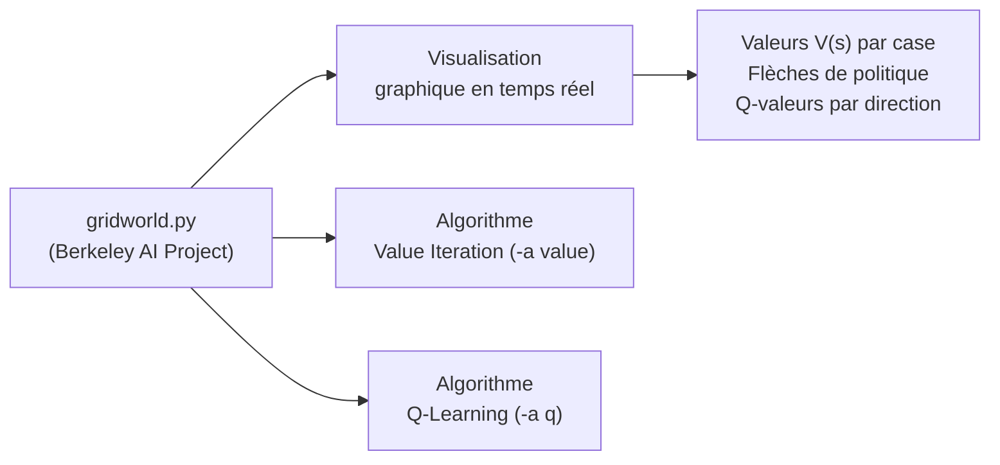

> _GridWorld est l'équivalent d'un « laboratoire virtuel » pour le RL : les règles sont simples, les résultats sont visibles immédiatement, et on peut modifier chaque paramètre pour observer son effet._

---

### Objectifs pédagogiques

À la fin de cette démonstration, vous serez capable de :

1. **Lancer** Value Iteration et Q-Learning sur différentes grilles.
2. **Observer** comment les valeurs de Bellman se propagent visuellement.
3. **Comprendre** l'impact de chaque paramètre (`-i`, `-k`, `--livingReward`, `--discount`, `--noise`, `--epsilon`, `--learningRate`).
4. **Comparer** Value Iteration et Q-Learning dans des situations concrètes.
5. **Expliquer** pourquoi certains paramètres accélèrent ou ralentissent la convergence.

---

### Installation et prérequis

#### Étape 1 — Vérifier Python 2.7

```cmd
C:\Python27\python.exe --version
```

> GridWorld du projet Berkeley fonctionne avec **Python 2.7**. Assurez-vous que Python 2.7 est installé à l'emplacement `C:\Python27\`.

#### Étape 2 — Cloner le dépôt GitHub

```bash
git clone https://github.com/haythem-rehouma/RL.git
```

> Cette commande doit être exécutée dans **Git Bash** (pas dans cmd).

#### Étape 3 — Se déplacer dans le dossier

```cmd
cd C:\Python27\RL
```

#### Étape 4 — Tester l'installation

```cmd
C:\Python27\python.exe gridworld.py -a value -i 100 -k 10
```

Si une fenêtre graphique s'ouvre avec une grille colorée et des flèches, l'installation est correcte.

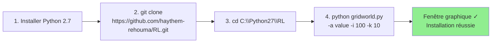

</details>

<p align="right"><a href="#top">↑ Retour en haut</a></p>

---

<a id="section-2"></a>

<details>
<summary>2 — L'environnement GridWorld — les grilles disponibles</summary>

<br/>

GridWorld propose plusieurs types de grilles, chacune conçue pour illustrer un concept particulier du RL.

---

### 2.1 — Les quatre grilles principales

#### BookGrid (par défaut)

```
┌────┬────┬────┬────┐
│    │    │    │ +1 │   ← Récompense positive
├────┼────┼────┼────┤
│    │████│    │ -1 │   ← Récompense négative
├────┼────┼────┼────┤
│    │    │    │    │
└────┴────┴────┴────┘
```

- La grille **classique** de référence — 3×4 cases
- Un mur au centre
- Deux états terminaux : **+1** (but) et **-1** (piège)
- Idéale pour observer la propagation de Bellman

#### MazeGrid

- Labyrinthe plus complexe avec plusieurs corridors
- Permet d'observer comment l'agent trouve le chemin optimal dans un environnement avec de nombreux obstacles
- Bonne pour comparer Value Iteration vs Q-Learning

#### BridgeGrid

```
┌────┬────┬────┬────┬────┬────┐
│ -1 │    │    │    │    │ +1 │
├────┼────┼────┼────┼────┼────┤
│####│    │    │    │    │####│
├────┼────┼────┼────┼────┼────┤
│ -1 │ -1 │ -1 │ -1 │ -1 │ -1 │
└────┴────┴────┴────┴────┴────┘
```

- Un « pont » étroit entre deux zones de pénalité
- Idéale pour illustrer l'impact du **bruit (`--noise`)** : avec beaucoup de bruit, l'agent risque de tomber du pont
- Illustre le **dilemme risque / récompense**

#### DiscountGrid

- Deux sorties possibles : une **proche** avec faible récompense, une **lointaine** avec forte récompense
- Idéale pour illustrer l'impact du **facteur de discount (`--discount`)** : avec γ faible, l'agent préfère la sortie proche

---

### 2.2 — Les paramètres de l'environnement

| Paramètre | Flag | Description | Valeur par défaut |
|---|---|---|---|
| **Grille** | `-g` ou `--grid` | Choisir la grille (BookGrid, MazeGrid...) | BookGrid |
| **Algorithme** | `-a` ou `--agent` | `value` pour Value Iteration, `q` pour Q-Learning | keyboard |
| **Itérations** | `-i` ou `--iterations` | Nombre de passes de Value Iteration | 10 |
| **Épisodes** | `-k` | Nombre d'épisodes de simulation | 1 |
| **Récompense de survie** | `--livingReward` | Pénalité/récompense à chaque pas (encourage à agir vite) | 0 |
| **Discount** | `-d` ou `--discount` | Facteur γ d'actualisation | 0.9 |
| **Bruit** | `-n` ou `--noise` | Probabilité de glisser vers une direction non voulue | 0.2 |
| **Epsilon** | `-e` ou `--epsilon` | Taux d'exploration ε-greedy en Q-Learning | 0.3 |
| **Taux d'apprentissage** | `-l` ou `--learningRate` | Valeur de α en Q-Learning | 0.5 |
| **Mode manuel** | `-m` | Permettre à l'humain de contrôler l'agent | — |

---

### 2.3 — Différence fondamentale : itérations vs épisodes

C'est une distinction cruciale à comprendre avant de lancer les commandes :

| Critère | Itérations (`-i`) | Épisodes (`-k`) |
|---|---|---|
| **Définition** | Nombre de passes où toutes les valeurs V(s) sont mises à jour | Nombre de fois que l'agent parcourt la grille du début à la fin |
| **Algorithme concerné** | Value Iteration principalement | Q-Learning et simulation post-apprentissage |
| **Objectif** | Améliorer les estimations des valeurs d'états | Tester la politique sur des parcours complets |
| **Convergence** | Plus d'itérations → valeurs plus précises | Plus d'épisodes → meilleure évaluation de la politique |
| **Analogie** | Réviser ses fiches de cours | Passer des examens blancs |

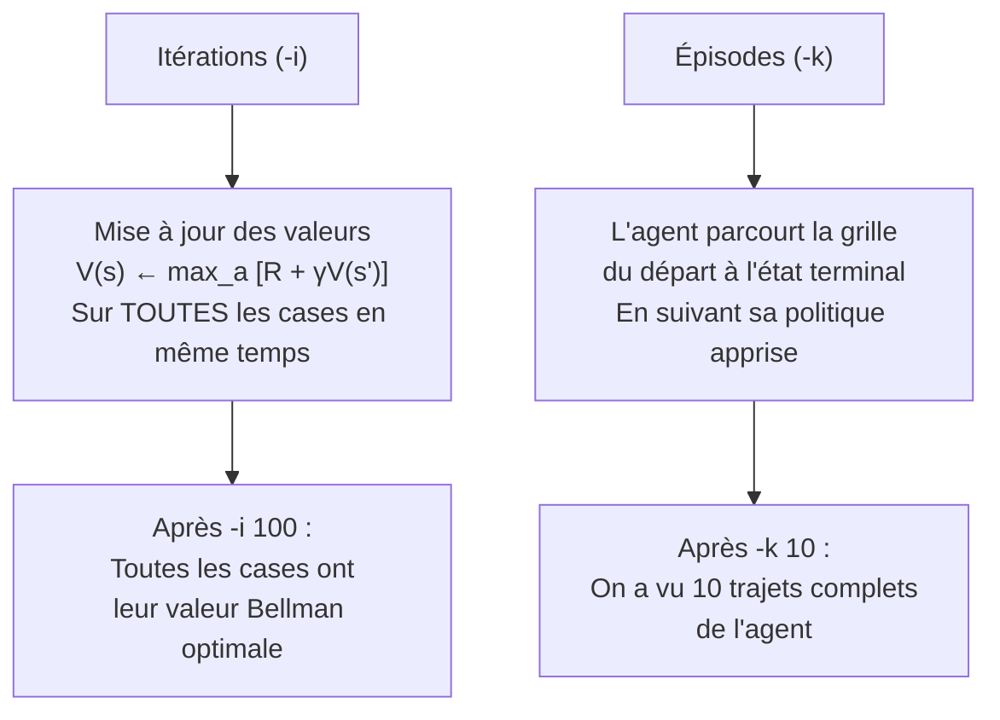

> _Pour Value Iteration, augmenter les itérations améliore la qualité des valeurs. Pour Q-Learning, augmenter les épisodes permet à l'agent d'accumuler plus d'expérience._

</details>

<p align="right"><a href="#top">↑ Retour en haut</a></p>

---

<a id="section-3"></a>

<details>
<summary>3 — Démonstration 1 — Value Iteration (-a value)</summary>

<br/>

Value Iteration applique directement les équations de Bellman de manière répétée jusqu'à convergence. GridWorld vous permet de visualiser ce processus.

---

### 3.1 — Commande de base et observation

```cmd
C:\Python27\python.exe gridworld.py -a value -i 100 -k 10
```

**Ce que fait cette commande :**
- `-a value` → utilise l'algorithme **Value Iteration**
- `-i 100` → effectue **100 itérations** de mise à jour Bellman
- `-k 10` → lance **10 épisodes** de simulation pour observer la politique

**Ce que vous verrez :**
- Chaque case affiche sa **valeur V(s)** calculée (nombre dans la case)
- Des **flèches** indiquent la politique optimale π*(s) — quelle direction aller depuis chaque case
- Les cases terminales (+1 et -1) sont en couleur

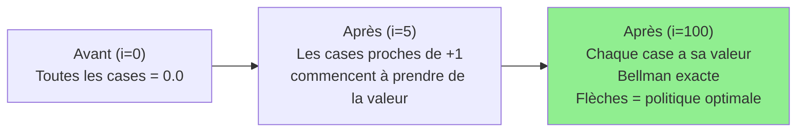

---

### 3.2 — Impact du nombre d'itérations (`-i`)

Observez comment les valeurs évoluent avec un nombre croissant d'itérations :

```cmd
C:\Python27\python.exe gridworld.py -a value -i 1
C:\Python27\python.exe gridworld.py -a value -i 2
C:\Python27\python.exe gridworld.py -a value -i 3
C:\Python27\python.exe gridworld.py -a value -i 5
C:\Python27\python.exe gridworld.py -a value -i 7
C:\Python27\python.exe gridworld.py -a value -i 12
C:\Python27\python.exe gridworld.py -a value -i 100
```

**Observations attendues :**

| Itérations | Comportement attendu |
|---|---|
| `i=1` | Seules les cases **directement adjacentes** à +1 ont une valeur non nulle. Le reste = 0. |
| `i=2` | La valeur se propage **deux cases** depuis +1. |
| `i=3` | La valeur atteint **trois cases** de profondeur. |
| `i=5` | La plupart des cases ont une valeur. Les flèches commencent à pointer vers +1. |
| `i=12` | Valeurs stabilisées pour toute la grille. Politique claire et cohérente. |
| `i=100` | **Convergence complète** — les valeurs ne changent plus. Politique optimale affichée. |

**Pourquoi cela se passe-t-il ?**

L'équation de Bellman propage la récompense +1 vers les cases voisines à chaque itération. C'est comme une **onde** qui se répand depuis l'état terminal :

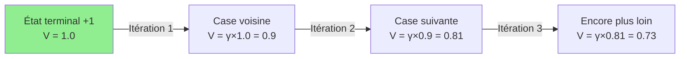

---

### 3.3 — Impact de la récompense de survie (`--livingReward`)

La récompense de survie est une **pénalité (ou récompense) reçue à chaque pas**. Elle modélise l'urgence d'agir.

#### Série d'expériences avec livingReward négatif :

```cmd
C:\Python27\python.exe gridworld.py -a value -i 12 -k 2 --livingReward -0.01
C:\Python27\python.exe gridworld.py -a value -i 12 -k 2 --livingReward -0.03
C:\Python27\python.exe gridworld.py -a value -i 12 -k 2 --livingReward -0.4
C:\Python27\python.exe gridworld.py -a value -i 12 -k 2 --livingReward -2.0
C:\Python27\python.exe gridworld.py -a value -i 12 -k 2 --livingReward 2.0
```

**Analyse de l'impact :**

| `--livingReward` | Comportement de l'agent |
|---|---|
| `-0.01` | Légère pénalité — l'agent préfère quand même le chemin optimal (peu de changement) |
| `-0.4` | Pénalité modérée — l'agent commence à prendre des **raccourcis risqués** pour éviter les pas supplémentaires |
| `-2.0` | Pénalité forte — l'agent préfère parfois tomber dans le piège (-1) **plutôt que de vivre trop longtemps** avec -2 par pas |
| `+2.0` | Récompense par survie — l'agent **évite** la sortie et préfère rester en vie le plus longtemps possible ! |

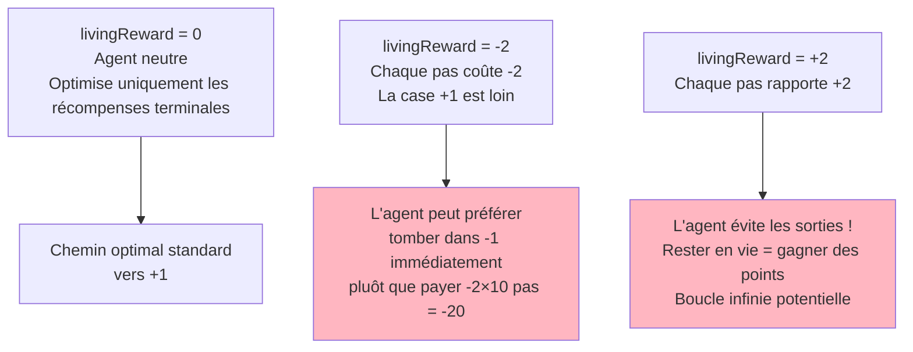

> _Le `livingReward` est un outil puissant pour modéliser l'urgence : dans un robot chirurgical, chaque seconde d'opération est coûteuse → `livingReward < 0`. Dans un jeu de survie, rester en vie est la priorité → `livingReward > 0`._

#### Commandes complémentaires avec épisodes :

```cmd
C:\Python27\python.exe gridworld.py -a value -i 100 -k 10
C:\Python27\python.exe gridworld.py -a value -i 1 -k 2 --livingReward -2
C:\Python27\python.exe gridworld.py -a value -i 2 -k 2 --livingReward -2
C:\Python27\python.exe gridworld.py -a value -i 10 -k 2 --livingReward -2
C:\Python27\python.exe gridworld.py -a value -i 10 -k 2 --livingReward 2
```

**Observation clé :** comparez `-i 1` vs `-i 10` avec `--livingReward -2`. Avec seulement 1 itération, les valeurs ne sont pas encore correctement calculées — la politique peut sembler incohérente. Avec 10 itérations, la politique s'adapte correctement à la pénalité de survie.

</details>

<p align="right"><a href="#top">↑ Retour en haut</a></p>

---

<a id="section-4"></a>

<details>
<summary>4 — Démonstration 2 — Q-Learning (-a q)</summary>

<br/>

Contrairement à Value Iteration qui connaît le modèle de l'environnement, le **Q-Learning** apprend uniquement par essais et erreurs — en interagissant avec la grille épisode après épisode.

---

### 4.1 — Commandes de base Q-Learning

```cmd
C:\Python27\python.exe gridworld.py -a q -k 100
```

**Ce que fait cette commande :**
- `-a q` → utilise l'algorithme **Q-Learning**
- `-k 100` → effectue **100 épisodes** d'apprentissage

**Ce que vous verrez :**
- Les Q-valeurs de chaque case (4 valeurs par case — une par direction)
- Les flèches de politique qui évoluent au fil des épisodes
- L'agent qui explore (parfois de manière « stupide ») puis converge

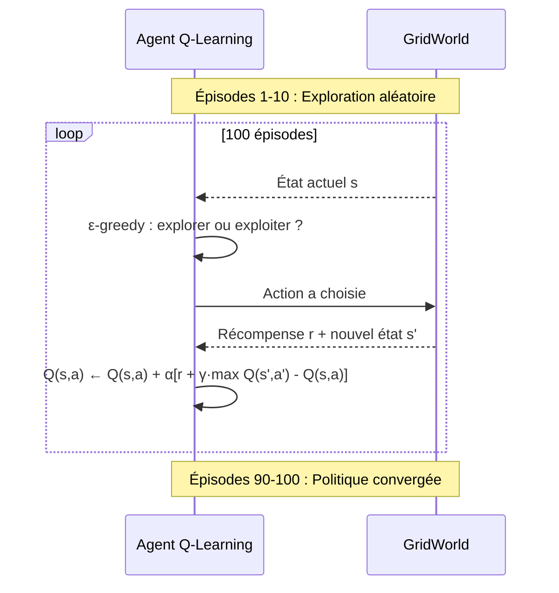

#### Q-Learning sur MazeGrid :

```cmd
C:\Python27\python.exe gridworld.py -a q -k 100 -g MazeGrid
```

MazeGrid est plus complexe — il faut plus d'épisodes pour que l'agent apprenne le chemin correct à travers le labyrinthe.

---

### 4.2 — Impact du bruit (`--noise`)

Le **bruit** modélise l'imprécision des actions : avec `--noise 0.2`, l'agent a 20% de chances de glisser perpendiculairement à la direction voulue.

```cmd
C:\Python27\python.exe gridworld.py -a q -k 50 -n 0.3 -e 0.5
```

**Exemples sur BridgeGrid :**

```cmd
C:\Python27\python.exe gridworld.py -g BridgeGrid --discount 0.9 --noise 0.2 -a value -i 100
```

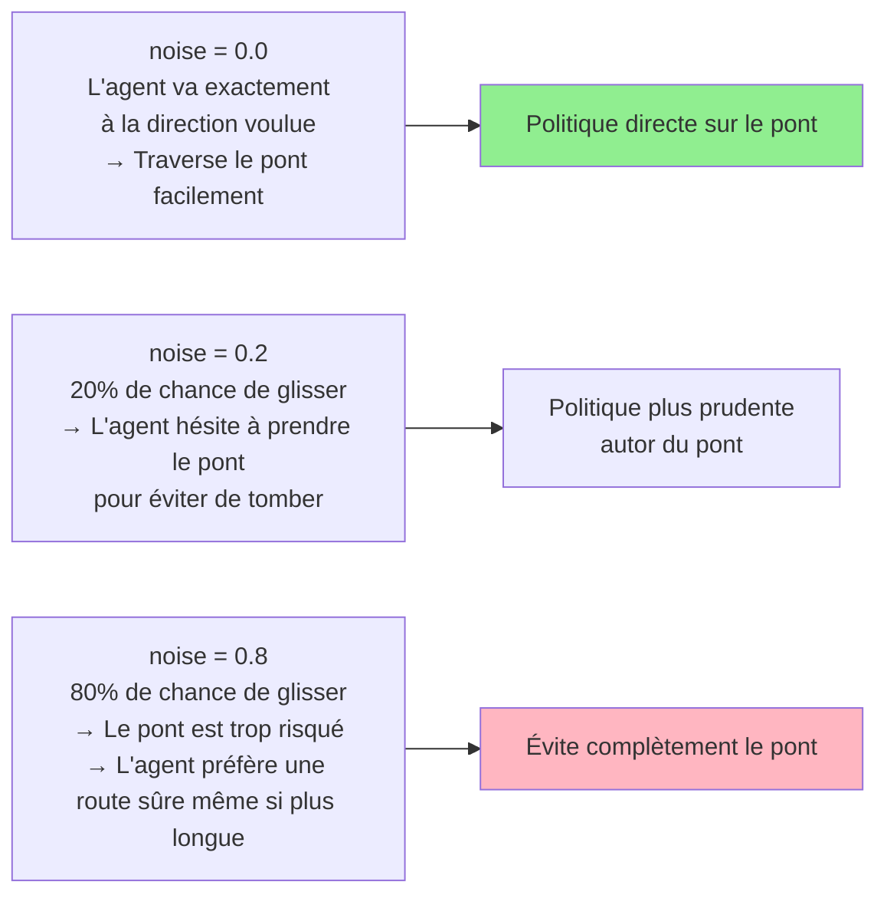

| `--noise` | Comportement |
|---|---|
| `0.0` | Déterministe — l'agent va exactement où il veut |
| `0.2` | Standard — légère incertitude (valeur par défaut) |
| `0.5` | Très incertain — la politique doit être conservative |
| `0.8` | Chaotique — l'agent ne contrôle presque plus ses déplacements |

---

### 4.3 — Impact d'epsilon — exploration (`--epsilon`)

**ε (epsilon)** contrôle la fréquence d'exploration dans la stratégie ε-greedy.

```cmd
C:\Python27\python.exe gridworld.py -a q -k 50 --learningRate 0.8 --epsilon 0.2
```

| `--epsilon` | Comportement |
|---|---|
| `0.0` | Aucune exploration — l'agent exploite uniquement ce qu'il sait (risque d'être bloqué dans un optimum local) |
| `0.1` | Faible exploration — converge vite mais peut rater des stratégies meilleures |
| `0.3` | Équilibre standard — bonne exploration sans trop de gaspillage |
| `0.5` | Exploration intense — apprend plus lentement mais explore mieux |
| `1.0` | Totalement aléatoire — aucun apprentissage utile |

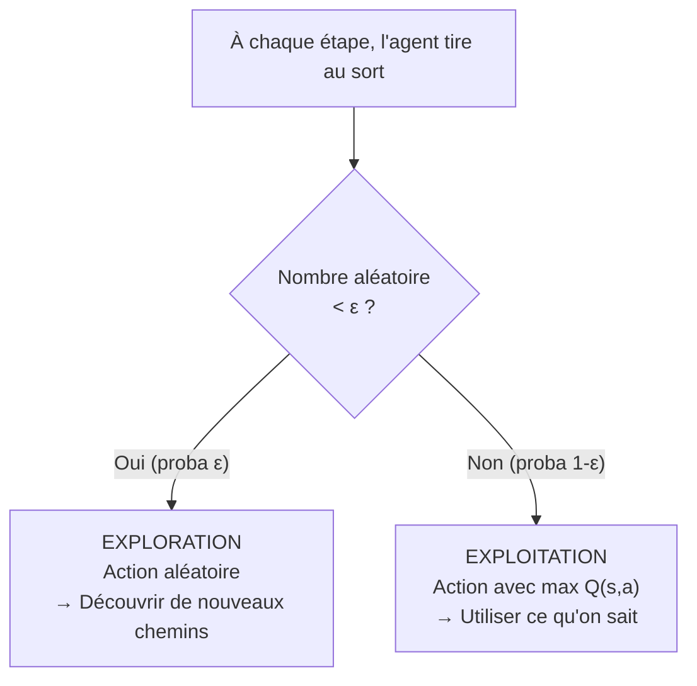

---

### 4.4 — Impact du taux d'apprentissage (`--learningRate`)

**α (alpha)** contrôle à quelle vitesse l'agent incorpore les nouvelles informations.

```cmd
C:\Python27\python.exe gridworld.py -a q -k 50 --learningRate 0.8 --epsilon 0.2
```

La mise à jour Q-Learning peut s'écrire de deux façons équivalentes :

**Forme TD-error :**
$$Q(s,a) \leftarrow Q(s,a) + \alpha \left[ r + \gamma \max_{a'} Q(s', a') - Q(s,a) \right]$$

**Forme moyenne pondérée :**
$$Q(s,a) \leftarrow (1 - \alpha) \cdot Q(s,a) + \alpha \cdot \left[ r + \gamma \max_{a'} Q(s', a') \right]$$

| Terme | Rôle |
|---|---|
| $(1 - \alpha) \cdot Q(s,a)$ | **Mémoire** — poids sur ce que l'agent sait déjà |
| $\alpha \cdot [r + \gamma \max Q(s', a')]$ | **Apprentissage** — poids sur la nouvelle observation |

| `--learningRate` (α) | Comportement |
|---|---|
| `0.1` | Apprentissage lent — l'agent change peu à chaque expérience, stable mais lent |
| `0.5` | Équilibre standard |
| `0.8` | Apprentissage rapide — chaque expérience compte beaucoup, converge vite mais peut osciller |
| `1.0` | L'agent efface complètement la mémoire passée à chaque mise à jour |

---

### 4.5 — Impact du facteur de discount (`--discount`)

**γ (gamma)** contrôle l'importance des récompenses futures.

```cmd
C:\Python27\python.exe gridworld.py -a q -k 50 -d 0.1 -g DiscountGrid
C:\Python27\python.exe gridworld.py -a q -k 50 -d 0.9 -g DiscountGrid
```

Sur DiscountGrid, il y a deux sorties :
- **Sortie proche** : faible récompense (+1) mais accessible rapidement
- **Sortie lointaine** : forte récompense (+10) mais nécessite plusieurs pas

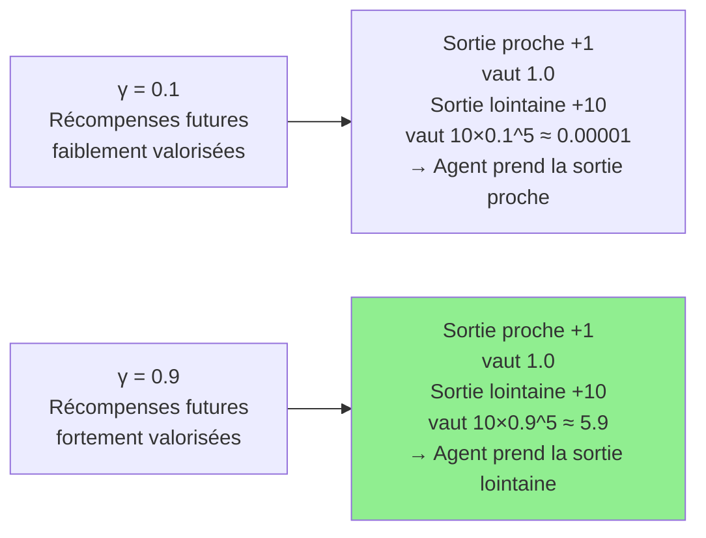

</details>

<p align="right"><a href="#top">↑ Retour en haut</a></p>

---

<a id="section-5"></a>

<details>
<summary>5 — Convergence rapide vs convergence lente</summary>

<br/>

La convergence de Q-Learning dépend directement de la combinaison des paramètres α, ε, bruit et nombre d'épisodes. Voici deux configurations opposées sur **BridgeGrid**.

---

### 5.1 — Configuration pour convergence rapide

```cmd
C:\Python27\python.exe gridworld.py -a q -k 50 -n 0.2 -e 0.1 -l 0.8 -g BridgeGrid
```

**Analyse des paramètres :**

| Paramètre | Valeur | Effet |
|---|---|---|
| `-k 50` | 50 épisodes | Suffisant pour apprendre le pont |
| `-n 0.2` | Bruit faible | L'agent contrôle bien ses actions → moins d'accidents |
| `-e 0.1` | Epsilon faible | Peu d'exploration → l'agent exploite rapidement ce qu'il sait |
| `-l 0.8` | α élevé | Chaque expérience a un fort impact → apprentissage rapide |

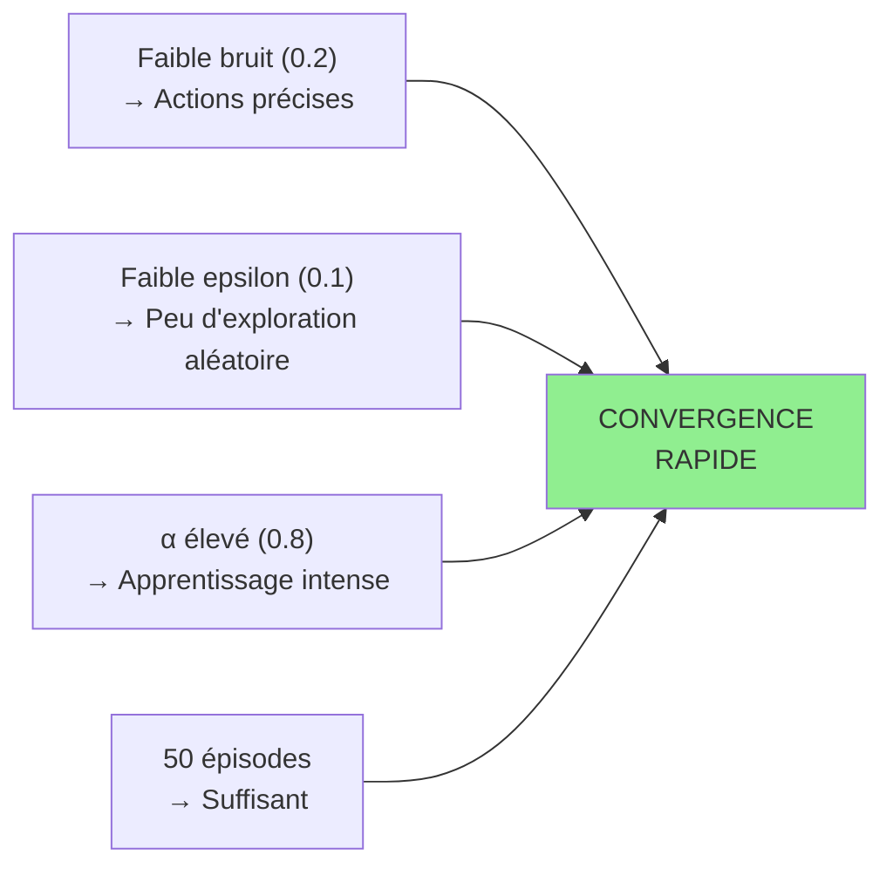

**Résultat attendu :** après ~30-40 épisodes, l'agent traverse le pont de manière fiable et atteint la récompense +1.

---

### 5.2 — Configuration pour convergence lente (ou sous-optimale)

```cmd
C:\Python27\python.exe gridworld.py -a q -k 100 -n 0.8 -e 0.5 -l 0.1 -g BridgeGrid
```

**Analyse des paramètres :**

| Paramètre | Valeur | Effet |
|---|---|---|
| `-k 100` | 100 épisodes | Même avec plus d'épisodes... |
| `-n 0.8` | Bruit très élevé | L'agent glisse souvent → impossible de traverser le pont fiablement |
| `-e 0.5` | Epsilon élevé | Beaucoup d'exploration → la politique n'est jamais stable |
| `-l 0.1` | α faible | Chaque expérience a peu d'impact → apprentissage très lent |

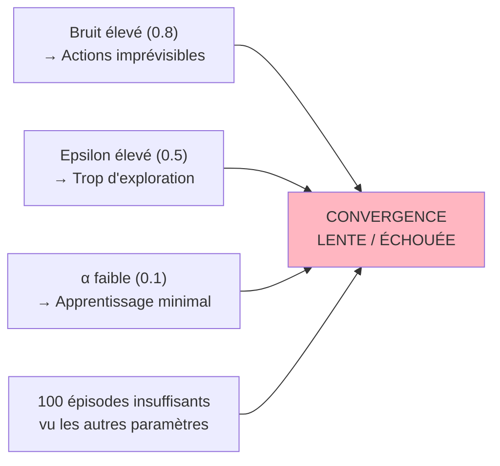

**Résultat attendu :** même après 100 épisodes, l'agent n'a pas convergé vers une politique cohérente. Les Q-valeurs sont instables, les flèches changent fréquemment.

---

### 5.3 — Tableau de synthèse : quel paramètre pour quel effet ?

| Objectif | Paramètre à modifier | Direction |
|---|---|---|
| Apprendre plus vite | `--learningRate` (α) | ↑ Augmenter |
| Mieux explorer les possibilités | `--epsilon` (ε) | ↑ Augmenter |
| Politique plus stable | `--epsilon` (ε) | ↓ Diminuer |
| Planifier à long terme | `--discount` (γ) | ↑ Augmenter |
| Récompenses immédiates uniquement | `--discount` (γ) | ↓ Diminuer |
| Réduire l'incertitude | `--noise` | ↓ Diminuer |
| Accélérer la convergence (environnement déterministe) | `--noise` + ε faible | ↓ + ↓ |

</details>

<p align="right"><a href="#top">↑ Retour en haut</a></p>

---

<a id="section-6"></a>

<details>
<summary>6 — Comparaison Value Iteration vs Q-Learning sur GridWorld</summary>

<br/>

Ces deux commandes permettent une comparaison directe sur MazeGrid :

```cmd
C:\Python27\python.exe gridworld.py -a value -i 100 -k 10 -g MazeGrid
C:\Python27\python.exe gridworld.py -a q -k 100 -g MazeGrid
```

---

### Comparaison visuelle attendue

| Critère | Value Iteration | Q-Learning |
|---|---|---|
| **Connaissance du modèle** | Requise (connaît P et R) | Non requise (apprend par interactions) |
| **Résultat après apprentissage** | Valeurs V(s) exactes après convergence | Approximations Q(s,a) issues de l'expérience |
| **Vitesse de convergence** | Rapide (itérations sur tout le modèle) | Plus lent (épisode par épisode) |
| **Politique déduite** | Flèches calculées analytiquement | Flèches = argmax des Q-valeurs apprises |
| **Qualité finale** | Optimale garantie (si convergé) | Converge vers optimal si assez d'épisodes et bonne exploration |
| **Bruit dans l'apprentissage** | Aucun — calcul déterministe | Les Q-valeurs varient selon les trajectoires |

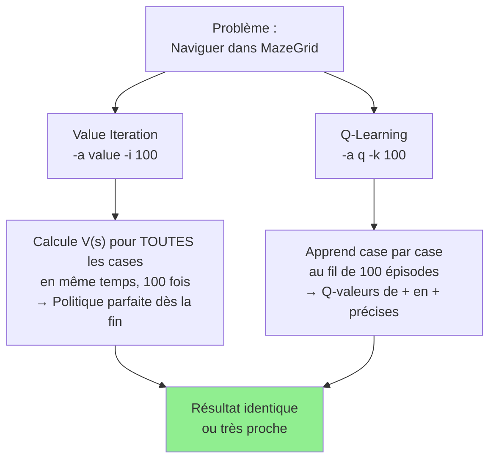

---

### Démonstration de l'apprentissage progressif (Q-Learning)

Ces commandes montrent l'évolution de la politique apprise après 1, 10 et 50 épisodes en **mode manuel** :

```cmd
C:\Python27\python.exe gridworld.py -a q -k 1  -m -g BookGrid
C:\Python27\python.exe gridworld.py -a q -k 10 -m -g BookGrid
C:\Python27\python.exe gridworld.py -a q -k 50 -m -g BookGrid
```

Le flag `-m` (mode manuel) vous permet de **contrôler l'agent vous-même** après l'apprentissage automatique, pour tester la politique apprise interactivement.

| Épisodes | Observation |
|---|---|
| `k=1` | Q-valeurs quasi nulles partout — l'agent n'a presque rien appris. Politique incohérente. |
| `k=10` | Quelques Q-valeurs non nulles autour du chemin emprunté. Politique partiellement correcte. |
| `k=50` | Q-valeurs bien propagées. Politique proche de l'optimale pour la majorité des cases. |

---

### Sur DiscountGrid — impact du discount (rappel)

```cmd
C:\Python27\python.exe gridworld.py -g DiscountGrid -a value -i 100
```

DiscountGrid illustre parfaitement le rôle de γ : avec la valeur par défaut (γ=0.9), observez quelle sortie l'agent choisit, puis modifiez avec `-d 0.1` pour voir le changement de stratégie.

---

### Sur BridgeGrid — impact du bruit (rappel)

```cmd
C:\Python27\python.exe gridworld.py -g BridgeGrid --discount 0.9 --noise 0.2 -a value -i 100
```

Modifiez progressivement `--noise` de 0.0 à 0.8 et observez comment la politique passe de « traverser le pont » à « contourner par les côtés ».

---

### Crawler — un environnement continu

```cmd
C:\Python27\python.exe crawler.py
```

`crawler.py` est un bras robotisé 2D qui apprend à se déplacer en avant par Q-Learning. C'est une démonstration spectaculaire du RL en action : au début, le bras bouge aléatoirement ; après quelques centaines d'épisodes, il a appris un mouvement efficace de reptation.

</details>

<p align="right"><a href="#top">↑ Retour en haut</a></p>

---

<a id="section-7"></a>

<details>
<summary>7 — Quiz 1 — Paramètres et commandes GridWorld</summary>

<br/>

Ce quiz évalue votre compréhension des paramètres de GridWorld et leur signification. Répondez à chaque question, puis cliquez sur **💡 Voir la solution** pour vérifier.

---

**Question 1 :** Dans la commande `gridworld.py -a value -i 100 -k 10`, que signifie `-i 100` ?

a) L'agent jouera 100 épisodes dans la grille

b) L'algorithme effectuera 100 passes de mise à jour Bellman sur toutes les cases

c) Le taux d'apprentissage sera fixé à 100

d) La simulation durera 100 secondes

<details>
<summary>💡 Voir la solution</summary>

✅ **Réponse : b)**

`-i 100` signifie **100 itérations** de Value Iteration — c'est-à-dire 100 fois où l'équation de Bellman `V(s) ← max_a [R + γV(s')]` est appliquée à **tous les états** simultanément. Ce sont des mises à jour algorithmiques, pas des interactions avec l'environnement.

</details>

---

**Question 2 :** Quelle est la différence entre `-i 100` (itérations) et `-k 10` (épisodes) ?

a) Les itérations sont pour Q-Learning, les épisodes pour Value Iteration

b) Les itérations mettent à jour les valeurs mathématiquement, les épisodes font interagir l'agent avec la grille du début à la fin

c) Ce sont deux façons identiques de spécifier la durée de l'entraînement

d) Les itérations contrôlent γ, les épisodes contrôlent α

<details>
<summary>💡 Voir la solution</summary>

✅ **Réponse : b)**

Les **itérations** (`-i`) mettent à jour les valeurs V(s) de manière algorithmique — sans que l'agent se déplace. Les **épisodes** (`-k`) font parcourir la grille à l'agent du départ à l'état terminal, en appliquant sa politique courante. C'est la différence entre « calculer sur papier » et « jouer une partie ».

</details>

---

**Question 3 :** Que fait le paramètre `--livingReward -2` ?

a) L'agent reçoit une récompense de -2 uniquement s'il tombe dans un piège

b) L'agent reçoit -2 à chaque déplacement, quelle que soit la case

c) La récompense terminale devient -2

d) L'agent est pénalisé de -2 s'il n'atteint pas le but en moins de 2 pas

<details>
<summary>💡 Voir la solution</summary>

✅ **Réponse : b)**

`--livingReward -2` applique une **pénalité de -2 à chaque pas** effectué par l'agent. C'est une façon de modéliser un « coût de l'action » : l'agent doit agir vite pour minimiser les pénalités accumulées. Avec une pénalité assez forte, l'agent peut même préférer terminer l'épisode rapidement via le piège (-1) plutôt que d'accumuler -2 par pas sur un long trajet.

</details>

---

**Question 4 :** Quelle commande permet d'observer l'apprentissage progressif du Q-Learning après seulement 1 épisode ?

a) `gridworld.py -a value -i 1`

b) `gridworld.py -a q -k 1`

c) `gridworld.py -a q -i 1`

d) `gridworld.py -k 1 --episodes 1`

<details>
<summary>💡 Voir la solution</summary>

✅ **Réponse : b)**

`-a q` sélectionne l'algorithme **Q-Learning** et `-k 1` limite à **1 épisode**. Après un seul épisode, les Q-valeurs sont quasi nulles partout sauf le long du chemin emprunté — ce qui permet d'observer le point de départ de l'apprentissage. Comparez ensuite avec `-k 10` et `-k 50` pour voir la progression.

</details>

---

**Question 5 :** Dans `gridworld.py -a q -k 50 -n 0.3 -e 0.5`, que font `-n 0.3` et `-e 0.5` respectivement ?

a) `-n 0.3` = taux d'apprentissage, `-e 0.5` = discount

b) `-n 0.3` = 30% de chances de glisser vers une direction non voulue, `-e 0.5` = 50% d'exploration aléatoire

c) `-n 0.3` = 30% des épisodes sont négatifs, `-e 0.5` = 50% d'exploitation

d) `-n 0.3` = bruit sur les récompenses, `-e 0.5` = epsilon du discount

<details>
<summary>💡 Voir la solution</summary>

✅ **Réponse : b)**

- `-n 0.3` (noise) : avec 30% de probabilité, l'agent se déplace **perpendiculairement** à la direction voulue — simule un sol glissant ou des actionneurs imprécis.
- `-e 0.5` (epsilon) : avec 50% de probabilité, l'agent choisit une **action aléatoire** au lieu de la meilleure Q-valeur — c'est la politique ε-greedy.

</details>

---

**Question 6 :** Pourquoi `--livingReward 2.0` (positif) peut-il créer un comportement indésirable ?

a) Car l'agent apprend trop vite et dépasse la valeur maximale

b) Car l'agent reçoit +2 à chaque pas — il est incité à rester en vie indéfiniment et évite les sorties

c) Car la valeur 2.0 est trop grande pour les équations de Bellman

d) Car le discount γ ne peut pas compenser une récompense de +2

<details>
<summary>💡 Voir la solution</summary>

✅ **Réponse : b)**

Avec `--livingReward 2.0`, chaque pas rapporte +2. L'agent rationnel préfère donc **ne jamais terminer l'épisode** — chaque pas supplémentaire lui rapporte +2, ce qui peut être bien supérieur à la récompense terminale +1. Ce comportement illustre l'importance de bien concevoir la fonction de récompense : une récompense de survie positive peut mener à des boucles infinies.

</details>

---

**Question 7 :** Sur BridgeGrid, avec `--noise 0.8`, pourquoi l'agent évite-t-il le pont ?

a) Car le pont est trop court pour que l'agent le détecte

b) Car avec 80% de probabilité de glisser, traverser le pont entraînerait souvent une chute dans les cases -1 en dessous

c) Car le discount γ réduit la valeur de la récompense au bout du pont

d) Car l'agent ne peut pas apprendre sur BridgeGrid avec beaucoup de bruit

<details>
<summary>💡 Voir la solution</summary>

✅ **Réponse : b)**

Avec 80% de bruit, l'agent a 80% de chances de glisser perpendiculairement. Sur le pont étroit, un glissement latéral = tomber dans une case -1. L'espérance de valeur pour traverser le pont est donc très négative. L'agent rationnel trouve une route alternative même si elle est plus longue — c'est le **dilemme risque/récompense** que BridgeGrid illustre parfaitement.

</details>

---

**Question 8 :** Quelle commande lance l'environnement **crawler** — le bras robotisé ?

a) `gridworld.py -a q -k 100 -g CrawlerGrid`

b) `crawler.py`

c) `gridworld.py --robot crawler`

d) `gridworld.py -a value -i 100 --crawler`

<details>
<summary>💡 Voir la solution</summary>

✅ **Réponse : b)**

`crawler.py` est un script séparé qui lance l'environnement du bras robotisé. Il utilise Q-Learning en temps réel et permet d'observer visuellement comment le bras apprend progressivement un mouvement de reptation efficace — sans avoir programmé ce mouvement explicitement.

</details>

---

**Question 9 :** Quelle différence observerez-vous entre `-i 1` et `-i 100` sur BookGrid avec Value Iteration ?

a) Aucune différence — Value Iteration converge en une seule itération

b) Avec `-i 1`, seules les cases adjacentes à +1 ont une valeur non nulle. Avec `-i 100`, toutes les cases ont leur valeur Bellman exacte.

c) Avec `-i 100`, l'agent joue 100 fois la grille

d) `-i 1` est plus précis car moins d'itérations = moins d'erreurs accumulées

<details>
<summary>💡 Voir la solution</summary>

✅ **Réponse : b)**

Avec `-i 1`, une seule itération de Bellman — seules les cases **directement voisines** de +1 reçoivent une valeur propagée (V = γ × 1). Avec `-i 100`, la valeur s'est propagée sur toute la grille et les cases distantes ont leur valeur exacte. C'est la propagation de l'onde de Bellman visualisée étape par étape.

</details>

---

**Question 10 :** Pourquoi le mode `-m` (manuel) est-il utile pédagogiquement ?

a) Car il permet de modifier les paramètres α et γ pendant l'exécution

b) Car il permet à l'instructeur de contrôler l'agent après l'apprentissage, pour tester la politique apprise de manière interactive

c) Car il accélère la convergence en guidant l'agent vers le but

d) Car il désactive le bruit pour des démonstrations plus propres

<details>
<summary>💡 Voir la solution</summary>

✅ **Réponse : b)**

Le mode `-m` (manuel) est idéal pour la démonstration en classe : l'instructeur prend le contrôle de l'agent **après** que Q-Learning a appris sa politique. Il peut déplacer l'agent manuellement pour tester : « est-ce que l'agent connaît la bonne direction depuis cette case ? » — ce qui permet de vérifier visuellement la qualité de la politique apprise.

</details>

</details>

<p align="right"><a href="#top">↑ Retour en haut</a></p>

---

<a id="section-8"></a>

<details>
<summary>8 — Quiz 2 — Interpréter les résultats</summary>

<br/>

Ce quiz teste votre capacité à **interpréter les résultats visuels** de GridWorld et à expliquer les comportements observés.

---

**Question 1 :** Après `gridworld.py -a value -i 1`, certaines cases affichent 0.0. Pourquoi ?

a) Car ces cases n'ont pas encore reçu de valeur propagée depuis l'état terminal

b) Car il y a un bug dans l'algorithme avec peu d'itérations

c) Car ces cases ont été visitées et leur valeur réelle est exactement 0

d) Car le discount γ = 0 par défaut

<details>
<summary>💡 Voir la solution</summary>

✅ **Réponse : a)**

Avec une seule itération, la valeur de +1 s'est propagée d'un seul « pas ». Les cases éloignées n'ont pas encore reçu la propagation de Bellman — leur valeur reste à l'initialisation (0.0). C'est la nature **locale** de chaque itération Bellman : un seul pas de propagation par itération.

</details>

---

**Question 2 :** Vous observez que les flèches de politique pointent vers la case -1 (piège). Quelle est la cause probable ?

a) L'algorithme a convergé incorrectement — c'est un bug

b) Un `--livingReward` très négatif rend le piège préférable à un long chemin vers +1

c) Le discount γ est trop élevé

d) Il n'y a pas assez d'épisodes pour Q-Learning

<details>
<summary>💡 Voir la solution</summary>

✅ **Réponse : b)**

Avec un `--livingReward` très négatif (ex. -2), chaque pas coûte -2. Si le chemin vers +1 nécessite 5 pas, le coût total est -10 + 1 = -9. Tomber dans le piège -1 en 1 pas coûte -2 + (-1) = -3. L'agent préfère donc aller vers -1 ! Ce comportement est **correct selon la récompense définie** — mais illustre qu'une mauvaise fonction de récompense mène à des comportements non désirés.

</details>

---

**Question 3 :** Vous comparez deux runs de Q-Learning : 10 épisodes vs 100 épisodes. Dans lequel les Q-valeurs sont-elles plus uniformément propagées sur toute la grille ?

a) 10 épisodes — l'agent explore plus avec moins d'épisodes

b) 100 épisodes — plus d'épisodes = plus d'expériences = Q-valeurs mises à jour pour plus de cases

c) Identique — le nombre d'épisodes n'affecte pas la propagation des Q-valeurs

d) Cela dépend uniquement d'epsilon, pas du nombre d'épisodes

<details>
<summary>💡 Voir la solution</summary>

✅ **Réponse : b)**

Avec 10 épisodes, l'agent n'a emprunté que quelques chemins — la majorité des cases n'ont jamais été visitées et leur Q-valeur reste à 0. Avec 100 épisodes (surtout avec ε élevé), l'agent a exploré beaucoup plus de cases et ses Q-valeurs sont mises à jour pour une plus grande partie de la grille.

</details>

---

**Question 4 :** Sur DiscountGrid, avec `-d 0.1`, l'agent choisit la sortie proche (+1). Avec `-d 0.9`, il choisit la sortie lointaine (+10). Pourquoi ?

a) Avec γ=0.1, l'agent ignore le futur et préfère la récompense immédiate. Avec γ=0.9, les récompenses futures comptent presque autant que les immédiates.

b) Avec γ=0.1, l'algorithme converge plus vite vers la sortie lointaine

c) Le discount n'affecte pas le choix de la sortie — c'est le bruit qui change

d) Avec γ=0.9, l'agent est plus prudent et évite les risques

<details>
<summary>💡 Voir la solution</summary>

✅ **Réponse : a)**

Avec γ=0.1 : V(sortie lointaine +10 à 5 pas) = 10 × 0.1^5 ≈ 0.0001 → **presque nulle**. La sortie proche vaut +1 × 0.1^1 = 0.1 → préférable.

Avec γ=0.9 : V(sortie lointaine) = 10 × 0.9^5 ≈ 5.9 → **toujours significative**. La sortie lointaine vaut beaucoup plus que la proche.

C'est exactement l'effet de γ sur la planification à long terme.

</details>

---

**Question 5 :** Après `gridworld.py -a q -k 100 -n 0.8 -e 0.5 -l 0.1`, la politique est incohérente et les Q-valeurs varient fortement. Quel paramètre a le plus contribué à cette instabilité ?

a) Le nombre d'épisodes (100) est trop faible

b) La combinaison bruit élevé (0.8) + α faible (0.1) : l'environnement est très incertain ET l'agent apprend très lentement

c) Epsilon 0.5 seul suffit à rendre la politique instable

d) Value Iteration aurait donné le même résultat

<details>
<summary>💡 Voir la solution</summary>

✅ **Réponse : b)**

Deux facteurs se cumulent : avec un **bruit de 0.8**, les transitions sont très aléatoires — les Q-valeurs reçoivent des signaux contradictoires selon les trajectoires. Avec **α=0.1**, chaque signal est faiblement incorporé — l'agent met beaucoup de temps à corriger ses estimations. La combinaison crée un apprentissage très lent et bruité, incapable de converger même en 100 épisodes.

</details>

</details>

<p align="right"><a href="#top">↑ Retour en haut</a></p>

---

<a id="section-9"></a>

<details>
<summary>9 — Pratique guidée — Série d'expériences à réaliser</summary>

<br/>

### Objectifs d'apprentissage

À la fin de cette pratique, vous serez capable de :

- Lancer et interpréter les résultats de Value Iteration et Q-Learning.
- Modifier les paramètres et prédire l'effet avant de lancer la commande.
- Documenter vos observations de manière structurée.

---

### Instructions générales

Pour chaque expérience :
1. **Prédisez** le comportement attendu avant de lancer la commande.
2. **Lancez** la commande et observez la fenêtre graphique.
3. **Documentez** ce que vous observez (valeurs, flèches, comportement de l'agent).
4. **Comparez** avec votre prédiction.

---

### Série A — Observer la propagation de Bellman

Lancez ces commandes dans l'ordre et notez comment les valeurs évoluent :

```cmd
C:\Python27\python.exe gridworld.py -a value -i 1
C:\Python27\python.exe gridworld.py -a value -i 2
C:\Python27\python.exe gridworld.py -a value -i 3
C:\Python27\python.exe gridworld.py -a value -i 5
C:\Python27\python.exe gridworld.py -a value -i 7
C:\Python27\python.exe gridworld.py -a value -i 12
C:\Python27\python.exe gridworld.py -a value -i 100
```

**Questions :**

1. À partir de quelle itération des flèches de politique apparaissent-elles sur la majorité des cases ?
2. À partir de quelle itération les valeurs semblent-elles stables (convergence) ?
3. La case en bas à gauche reçoit-elle une valeur positive ou négative ? Pourquoi ?

---

### Série B — Impact du livingReward

```cmd
C:\Python27\python.exe gridworld.py -a value -i 100 -k 10
C:\Python27\python.exe gridworld.py -a value -i 12 -k 2 --livingReward -0.01
C:\Python27\python.exe gridworld.py -a value -i 12 -k 2 --livingReward -0.4
C:\Python27\python.exe gridworld.py -a value -i 12 -k 2 --livingReward -2.0
C:\Python27\python.exe gridworld.py -a value -i 12 -k 2 --livingReward 2.0
```

**Questions :**

1. Avec `--livingReward -2.0`, les flèches pointent-elles encore vers +1 ? Expliquez pourquoi.
2. Avec `--livingReward 2.0`, l'agent veut-il sortir de la grille ? Pourquoi ?
3. Quelle valeur de `livingReward` donne le même comportement que sans ce paramètre ?

---

### Série C — Q-Learning et paramètres

```cmd
C:\Python27\python.exe gridworld.py -a q -k 100
C:\Python27\python.exe gridworld.py -a q -k 50 -n 0.2 -e 0.1 -l 0.8 -g BridgeGrid
C:\Python27\python.exe gridworld.py -a q -k 100 -n 0.8 -e 0.5 -l 0.1 -g BridgeGrid
C:\Python27\python.exe gridworld.py -a q -k 50 -d 0.1 -g DiscountGrid
C:\Python27\python.exe gridworld.py -a q -k 50 -d 0.9 -g DiscountGrid
```

**Questions :**

1. Sur BridgeGrid, quelle configuration (convergence rapide ou lente) traverse le pont ? Pourquoi ?
2. Sur DiscountGrid, avec `d=0.1` vs `d=0.9`, quelle sortie l'agent choisit-il dans chaque cas ?
3. Comparez Value Iteration `-a value -i 100` vs Q-Learning `-a q -k 100` sur la même grille. Quelle différence observez-vous dans les valeurs affichées ?

---

### Série D — Apprentissage progressif (Bonus)

```cmd
C:\Python27\python.exe gridworld.py -a q -k 1  -m -g BookGrid
C:\Python27\python.exe gridworld.py -a q -k 10 -m -g BookGrid
C:\Python27\python.exe gridworld.py -a q -k 50 -m -g BookGrid
```

Prenez le contrôle de l'agent après l'apprentissage (mode `-m`) et testez si l'agent « connaît » la bonne direction depuis chaque case. Avec combien d'épisodes la politique est-elle fiable ?

---

### Correction et analyse attendue

**Série A — Propagation de Bellman :**

| Itérations | Observation attendue |
|---|---|
| 1 | Seules les 2 cases voisines de +1 ont une valeur (~0.9 et ~-0.9) |
| 3-5 | La propagation atteint le centre de la grille. Premières flèches cohérentes. |
| 7-12 | La majorité des cases ont une valeur. Politique presque complète. |
| 100 | Convergence totale. Toutes les flèches pointent vers +1 via le chemin optimal. |

**Réponse Q3 :** La case en bas à gauche reçoit une valeur **positive** — elle est sur le chemin optimal vers +1. Sa valeur est plus faible que les cases proches de +1 (γ^k × 1 où k est la distance).

---

**Série B — livingReward :**

| livingReward | Comportement attendu |
|---|---|
| -0.01 | Quasi identique à sans livingReward — légère urgence |
| -0.4 | Chemin légèrement modifié, évite les détours |
| -2.0 | Certaines flèches peuvent pointer vers -1 ! Le piège immédiat est moins pire que -2 × nombreux pas |
| +2.0 | L'agent **évite les sorties** — les flèches pointent loin des états terminaux |

**Réponse Q3 :** `livingReward = 0` est équivalent à sans ce paramètre.

---

**Série C — Q-Learning paramètres :**

**BridgeGrid :**
- Convergence rapide (`n=0.2, e=0.1, α=0.8`) → L'agent traverse le pont. Bruit faible = actions précises. Epsilon faible = exploitation rapide.
- Convergence lente (`n=0.8, e=0.5, α=0.1`) → L'agent ne traverse pas le pont de manière fiable. Bruit élevé = glissades fréquentes.

**DiscountGrid :**
- `d=0.1` → Sortie proche préférée (récompenses futures fortement dévalorisées)
- `d=0.9` → Sortie lointaine préférée (récompenses futures presque aussi bonnes que immédiates)

</details>

<p align="right"><a href="#top">↑ Retour en haut</a></p>

---

<a id="section-10"></a>

<details>
<summary>10 — Ressources supplémentaires — Code, Outils et Documentation</summary>

<br/>

---

### 1 — Code source de la démonstration

**Dépôt GitHub du cours :**

```bash
git clone https://github.com/haythem-rehouma/RL.git
```

Ce dépôt contient :
- `gridworld.py` — l'environnement principal de démonstration
- `crawler.py` — le bras robotisé apprenant par Q-Learning
- Les différentes grilles (BookGrid, MazeGrid, BridgeGrid, DiscountGrid)
- Le code source des algorithmes Value Iteration et Q-Learning

---

### 2 — Documentation officielle Berkeley AI Project

Le projet GridWorld est issu du cours CS188 de Berkeley :

- 🔗 [Berkeley AI Project — Reinforcement Learning](https://ai.berkeley.edu/reinforcement.html)
- 🔗 [Documentation des paramètres gridworld.py](https://ai.berkeley.edu/reinforcement.html#Q1)

---

### 3 — Récapitulatif complet de toutes les commandes

#### Value Iteration — commandes essentielles

```cmd
REM Commande de référence
C:\Python27\python.exe gridworld.py -a value -i 100 -k 10

REM Observer la convergence progressive
C:\Python27\python.exe gridworld.py -a value -i 1
C:\Python27\python.exe gridworld.py -a value -i 5
C:\Python27\python.exe gridworld.py -a value -i 12
C:\Python27\python.exe gridworld.py -a value -i 100

REM Impact du livingReward
C:\Python27\python.exe gridworld.py -a value -i 12 -k 2 --livingReward -0.01
C:\Python27\python.exe gridworld.py -a value -i 12 -k 2 --livingReward -0.4
C:\Python27\python.exe gridworld.py -a value -i 12 -k 2 --livingReward -2.0
C:\Python27\python.exe gridworld.py -a value -i 12 -k 2 --livingReward 2.0

REM Sur BridgeGrid avec différents discounts et bruits
C:\Python27\python.exe gridworld.py -g BridgeGrid --discount 0.9 --noise 0.2 -a value -i 100
C:\Python27\python.exe gridworld.py -g DiscountGrid -a value -i 100
```

#### Q-Learning — commandes essentielles

```cmd
REM Commande de base
C:\Python27\python.exe gridworld.py -a q -k 100

REM Sur MazeGrid
C:\Python27\python.exe gridworld.py -a q -k 100 -g MazeGrid

REM Convergence rapide sur BridgeGrid
C:\Python27\python.exe gridworld.py -a q -k 50 -n 0.2 -e 0.1 -l 0.8 -g BridgeGrid

REM Convergence lente sur BridgeGrid
C:\Python27\python.exe gridworld.py -a q -k 100 -n 0.8 -e 0.5 -l 0.1 -g BridgeGrid

REM Impact du discount sur DiscountGrid
C:\Python27\python.exe gridworld.py -a q -k 50 -d 0.1 -g DiscountGrid
C:\Python27\python.exe gridworld.py -a q -k 50 -d 0.9 -g DiscountGrid

REM Apprentissage progressif en mode manuel
C:\Python27\python.exe gridworld.py -a q -k 1  -m -g BookGrid
C:\Python27\python.exe gridworld.py -a q -k 10 -m -g BookGrid
C:\Python27\python.exe gridworld.py -a q -k 50 -m -g BookGrid

REM Comparaison impact bruit et epsilon
C:\Python27\python.exe gridworld.py -a q -k 50 -n 0.3 -e 0.5
C:\Python27\python.exe gridworld.py -a q -k 50 --learningRate 0.8 --epsilon 0.2

REM Crawler — bras robotisé
C:\Python27\python.exe crawler.py
```

---

### 4 — Tableau de référence complet des paramètres

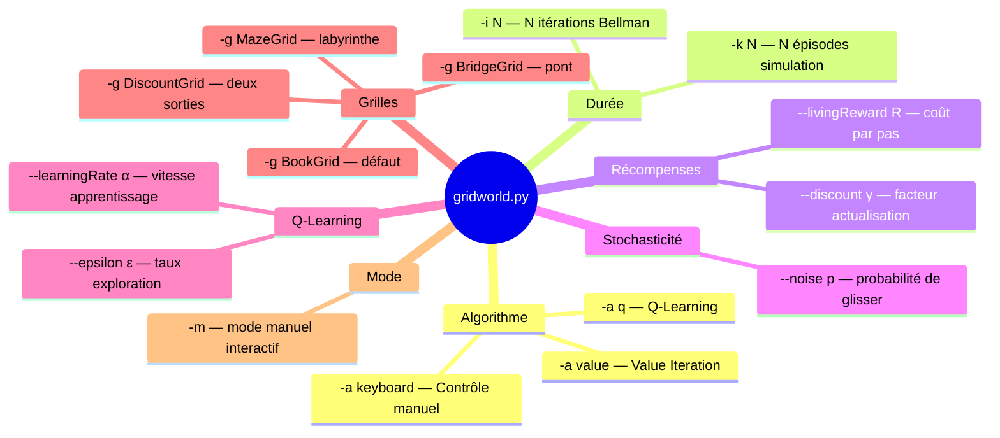

</details>

<p align="right"><a href="#top">↑ Retour en haut</a></p>

---

<a id="section-11"></a>

<details>
<summary>11 — Synthèse de la démonstration</summary>

<br/>

### Ce que vous avez appris dans cette démonstration

---

#### Vue d'ensemble des expériences réalisées

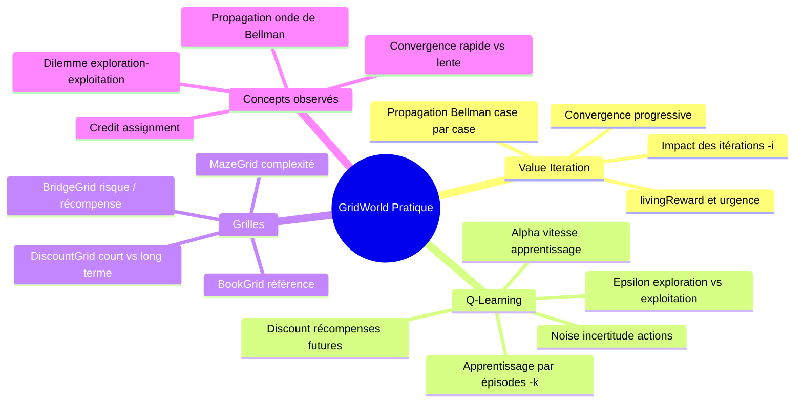

---

#### Correspondance théorie ↔ pratique

| Concept théorique | Ce que vous avez observé dans GridWorld |
|---|---|
| **Équation de Bellman V(s)** | Les chiffres dans chaque case après Value Iteration |
| **Propagation récursive** | Les valeurs se « diffusent » depuis +1 vers les cases éloignées à chaque itération |
| **Politique optimale π*(s)** | Les flèches dans chaque case après convergence |
| **Facteur γ (discount)** | Commande `-d` sur DiscountGrid : γ faible = sortie proche, γ élevé = sortie lointaine |
| **Récompense de survie** | `--livingReward` : pénalité modifie la politique, récompense crée des boucles |
| **ε-greedy** | `--epsilon` : fort = beaucoup d'exploration visible, faible = l'agent suit directement sa politique |
| **Taux d'apprentissage α** | `--learningRate` : fort = converge vite, faible = converge lentement |
| **Bruit stochastique** | `--noise` sur BridgeGrid : l'agent évite le pont quand le risque de glisser est trop élevé |
| **Credit assignment** | Avec `-k 1` les cases lointaines ont Q=0 ; avec `-k 50` la propagation a atteint tout le monde |

---

#### Points à retenir absolument

1. **Value Iteration converge en quelques dizaines d'itérations** sur des grilles simples. Les valeurs se propagent comme une onde depuis les états terminaux vers les états de départ.

2. **Q-Learning apprend progressivement, épisode par épisode.** Plus il y a d'épisodes, plus les Q-valeurs sont précises et la politique cohérente.

3. **γ détermine si l'agent pense à court ou long terme.** γ faible = sortie proche ; γ élevé = récompense maximale même distante.

4. **Un `livingReward` mal calibré crée des comportements non désirés.** Trop négatif → l'agent préfère le piège ; trop positif → l'agent évite les sorties.

5. **Sur BridgeGrid, le bruit crée un dilemme risque/récompense observable.** Un agent avec beaucoup de bruit et un pont étroit préfère une route sûre moins efficace.

6. **Crawler illustre le RL dans le monde réel** : un bras apprend à se déplacer sans programme de mouvement préétabli — uniquement par récompenses et Q-Learning.

---

#### Ce qui arrive dans la suite du cours

Dans les prochains chapitres et démonstrations :

- **Deep Q-Network (DQN)** — Q-Learning avec réseaux de neurones sur des environnements visuels (images de pixels)
- **CartPole et LunarLander** — environnements Gymnasium pour aller au-delà des grilles
- **Policy Gradient (REINFORCE, PPO)** — apprendre directement la politique sans fonction de valeur
- **Projets de session** — concevoir et entraîner votre propre agent RL

</details>

<p align="right"><a href="#top">↑ Retour en haut</a></p>

---

<p align="center">
  <em>Tous droits réservés. Toute reproduction, diffusion, utilisation ou adaptation de ce cours, en tout ou en partie, est strictement interdite sans l'autorisation écrite préalable de Dr. Haythem REHOUMA.</em>
</p>

<p align="center">
  <strong>Cours créé par Dr. Haythem REHOUMA — Apprentissage par Renforcement</strong>
</p>

<br/>

<p align="center">
  <a href="#top" style="display: inline-block; background: #2563eb; color: #ffffff; text-decoration: none; font-size: 1.1rem; font-weight: 700; padding: 14px 40px; border-radius: 10px; letter-spacing: 0.3px;">
    ↑ Retour en haut du cours
  </a>
</p>
