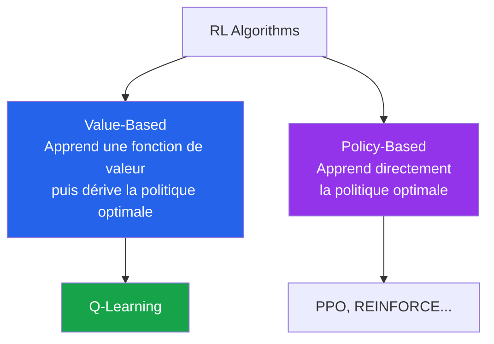
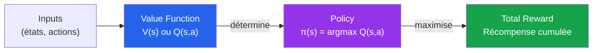
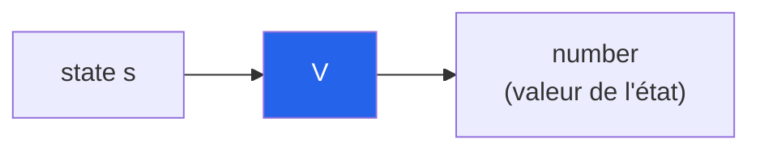
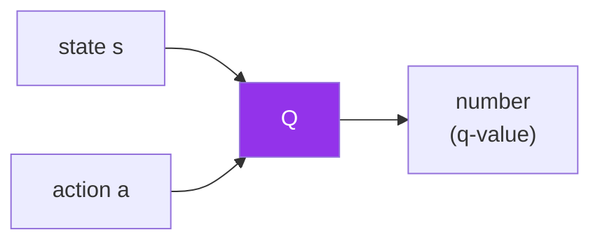
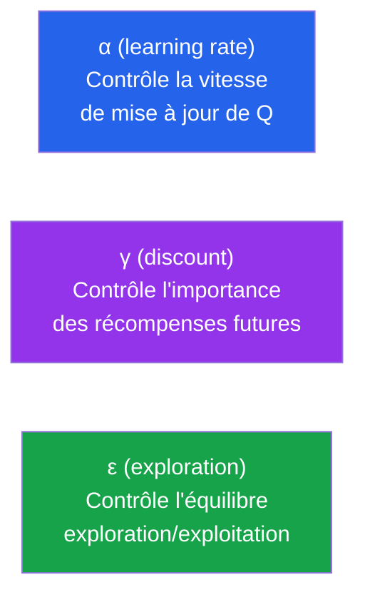
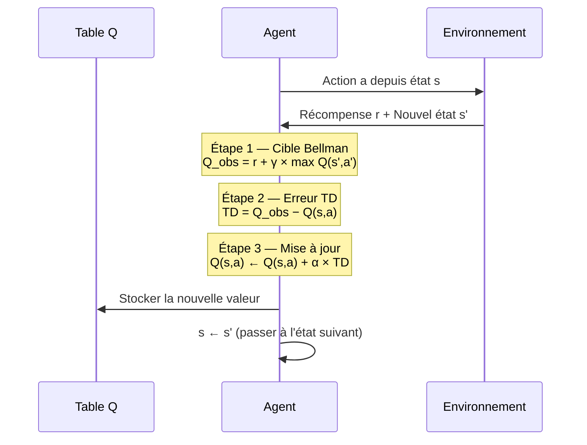
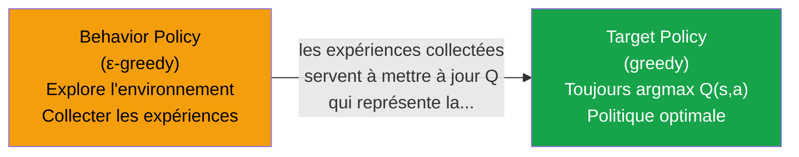
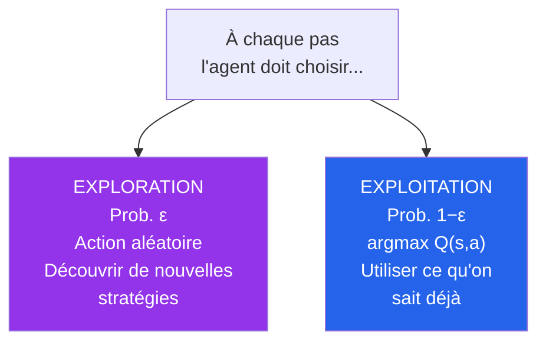
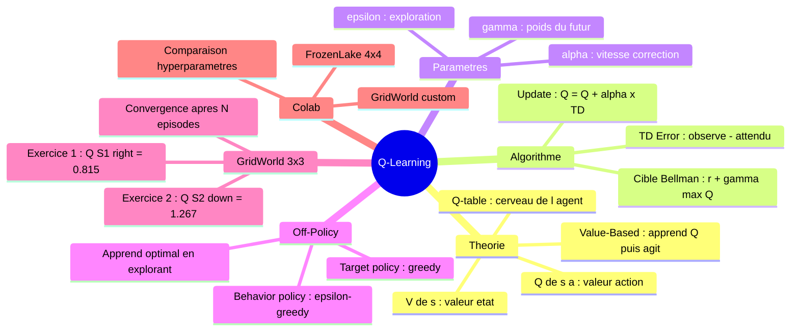

<a id="top"></a>

# Q-Learning — Théorie, Calculs pas à pas et Implémentation

## Table des matières

| # | Section |
|---|---|
| 1 | [Taxonomie RL — Value-Based vs Policy-Based](#section-1) |
| 1a | &nbsp;&nbsp;&nbsp;↳ [Value-Based : apprendre la valeur, puis agir](#section-1) |
| 1b | &nbsp;&nbsp;&nbsp;↳ [Policy-Based : apprendre l'action directement](#section-1) |
| 2 | [Les fonctions de valeur — V(s) et Q(s,a)](#section-2) |
| 2a | &nbsp;&nbsp;&nbsp;↳ [V(s) : « Est-ce un bon état ? »](#section-2) |
| 2b | &nbsp;&nbsp;&nbsp;↳ [Q(s,a) : « Est-ce une bonne action dans cet état ? »](#section-2) |
| 2c | &nbsp;&nbsp;&nbsp;↳ [La Q-table — le cerveau de l'agent](#section-2) |
| 3 | [L'algorithme Q-Learning — Pseudocode complet](#section-3) |
| 3a | &nbsp;&nbsp;&nbsp;↳ [Les 3 formules clés](#section-3) |
| 3b | &nbsp;&nbsp;&nbsp;↳ [Rôle de chaque paramètre](#section-3) |
| 4 | [Démonstration pas à pas — GridWorld 3×3](#section-4) |
| 4a | &nbsp;&nbsp;&nbsp;↳ [Exercice 1 : Mise à jour de Q(S1, droite)](#section-4) |
| 4b | &nbsp;&nbsp;&nbsp;↳ [Exercice 2 : Mise à jour de Q(S2, bas)](#section-4) |
| 4c | &nbsp;&nbsp;&nbsp;↳ [Fin de l'épisode et Q-table convergée](#section-4) |
| 5 | [Off-Policy — Target Policy vs Behavior Policy](#section-5) |
| 6 | [Exploration vs Exploitation — Stratégie ε-greedy](#section-6) |
| 7 | [Exercice Colab 1 — Q-Learning sur FrozenLake (Gym)](#section-7) |
| 8 | [Exercice Colab 2 — Q-Learning sur GridWorld personnalisé](#section-8) |
| 9 | [Exercice Colab 3 — Comparaison des hyperparamètres](#section-9) |
| 10 | [Quiz — Q-Learning](#section-10) |
| 11 | [Travail à réaliser — Calculs Q-Learning à la main](#section-11) |
| 12 | [Synthèse du chapitre](#section-12) |

---

## Équations de référence

<a id="eq-bellman-obs"></a>

**Éq. (1)** — Cible Bellman (valeur observée)

$$Q(s,a)_{\text{observé}} = R(s') + \gamma \max_{a'} Q(s',a')$$

<a id="eq-td-error"></a>

**Éq. (2)** — Erreur TD (Temporal Difference)

$$\text{TD Error} = Q(s,a)_{\text{observé}} - Q(s,a)_{\text{attendu}}$$

<a id="eq-update"></a>

**Éq. (3)** — Règle de mise à jour Q-Learning

$$Q(s,a) \leftarrow Q(s,a) + \alpha \times \text{TD Error}$$

> Forme combinée équivalente : $Q(s,a) \leftarrow (1-\alpha)\,Q(s,a) + \alpha \left[r + \gamma \max_{a'} Q(s',a')\right]$

---

<a id="section-1"></a>

<details>
<summary>1 — Taxonomie RL — Value-Based vs Policy-Based</summary>

En apprentissage par renforcement, il existe deux grandes familles d'algorithmes. La différence fondamentale : **ce qu'ils apprennent**.

---

### 1.1 — Vue d'ensemble



---

### 1.2 — Value-Based : apprendre la valeur, puis agir

Le principe des méthodes Value-Based en 3 étapes :



**L'idée :** L'agent apprend d'abord **combien vaut** chaque action dans chaque état (la Q-table). Ensuite, il choisit simplement l'action de valeur maximale.

**Exemples :** Q-Learning, SARSA, DQN

---

### 1.3 — Policy-Based : apprendre l'action directement

L'agent apprend directement **quelle action faire** dans chaque état, sans passer par une fonction de valeur.

**Exemples :** PPO, REINFORCE, TRPO

---

### 1.4 — Comparaison

| Aspect | Value-Based | Policy-Based |
|---|---|---|
| **Ce qu'on apprend** | La valeur Q(s,a) → puis on en dérive π | Directement π(a\|s) |
| **Comment agir** | argmax Q(s,a) | Échantillonner depuis π(a\|s) |
| **Espace d'actions** | Discret uniquement | Discret ou **continu** |
| **Exemple phare** | **Q-Learning** | **PPO** |

> _Ce chapitre se concentre sur Q-Learning — l'algorithme Value-Based le plus fondamental._

</details>

<p align="right"><a href="#top">↑ Retour en haut</a></p>

---

<a id="section-2"></a>

<details>
<summary>2 — Les fonctions de valeur — V(s) et Q(s,a)</summary>

Pour décider intelligemment, l'agent a besoin d'**évaluer** les situations. Il utilise deux types de fonctions de valeur.

---

### 2.1 — V(s) — Fonction de valeur d'état

**Question répondue :** *"À quel point est-il bon d'être dans l'état s ?"*



V(s) prend en entrée un **état** et retourne un **nombre** — une "photographie" de la qualité globale de cet état.

**Exemples dans GridWorld :**
- V(case adjacente au +10) ≈ élevée — bon état, on est proche du but
- V(case adjacente au -10) ≈ négative — mauvais état, danger
- V(case de départ) ≈ intermédiaire — loin de tout

**Limitation :** V(s) dit "cet état est bon", mais **ne dit pas quelle action prendre**. Pour choisir une action avec V(s) seul, il faut connaître le modèle P(s'|s,a) — ce qui n'est pas toujours possible.

---

### 2.2 — Q(s,a) — Fonction de valeur état-action

**Question répondue :** *"À quel point est-il bon d'être dans l'état s ET de faire l'action a ?"*



Q(s,a) prend en entrée un **état + une action** et retourne un **nombre** — la qualité de cette action dans cet état.

**Avantage décisif :** Pour choisir la meilleure action, il suffit de prendre `argmax_a Q(s,a)` — **pas besoin du modèle de l'environnement**. C'est pourquoi Q-Learning est **model-free**.

---

### 2.3 — La Q-table — le cerveau de l'agent

La Q-table est un **tableau à deux dimensions** qui stocke Q(s,a) pour chaque combinaison (état, action) :

```
┌─────┬────────┬────────┬──────┬──────┐
│  Q  │  a1    │  a2    │  a3  │  a4  │
├─────┼────────┼────────┼──────┼──────┤
│ S1  │ Q(S1,a1)│ Q(S1,a2)│ Q(S1,a3)│ Q(S1,a4)│
│ S2  │ Q(S2,a1)│ Q(S2,a2)│ Q(S2,a3)│ Q(S2,a4)│
│ S3  │ Q(S3,a1)│ Q(S3,a2)│ Q(S3,a3)│ Q(S3,a4)│
│  .  │   .    │   .    │  .   │  .   │
└─────┴────────┴────────┴──────┴──────┘

Goal : Apprendre ces valeurs Q de sorte que
       la récompense totale soit maximisée.
```

**Exemple concret :**

| Q | left | right | up | down |
|---|---|---|---|---|
| **S1** | -0.5 | 1 | 2.1 | 1.3 |
| **S2** | 0.5 | 0.75 | -0.5 | 1.5 |
| **S6** | -1.2 | 1.2 | 0.7 | 1.7 |

**Lecture :** Depuis S1, la meilleure action est **up** (Q=2.1). Depuis S2, la meilleure action est **down** (Q=1.5). Depuis S6, la meilleure action est **down** (Q=1.7).

</details>

<p align="right"><a href="#top">↑ Retour en haut</a></p>

---

<a id="section-3"></a>

<details>
<summary>3 — L'algorithme Q-Learning — Pseudocode complet</summary>

---

### 3.1 — Le pseudocode

```
Initialiser Q(s,a) arbitrairement (ou à 0)

Répéter (pour chaque épisode) :
    Initialiser s (état de départ)

    Répéter (pour chaque pas de l'épisode) :
        Choisir a depuis s en utilisant une politique dérivée de Q
            (ex: ε-greedy)                    ← doit explorer au début !
        Exécuter l'action a, observer r et s'
        Mettre à jour :
            Q(s,a) ← Q(s,a) + α × [r + γ max_a' Q(s',a') - Q(s,a)]
                                     └──────────────────┘
                                          learning rate (α)
        s ← s'
    Jusqu'à ce que s soit terminal
```

---

### 3.2 — Les 3 formules clés décomposées

La mise à jour Q-Learning se fait en **3 étapes** à chaque pas :

**Étape 1 — Calculer la cible Bellman** **(→ [Éq. 1](#eq-bellman-obs))**

> Cible = Récompense immédiate R(s') + γ × Meilleure valeur future max Q(s',a')
>
> "Ce que Q(s,a) **devrait** valoir d'après ce qu'on vient d'observer"

**Étape 2 — Calculer l'erreur TD** **(→ [Éq. 2](#eq-td-error))**

> TD Error = Q observé − Q attendu
>
> "De combien on s'est trompé"

**Étape 3 — Mettre à jour Q** **(→ [Éq. 3](#eq-update))**

> Q(s,a) ← Q(s,a) + α × TD Error
>
> "Corriger Q dans la direction de l'erreur, avec un pas de taille α"

---

### 3.3 — Rôle de chaque paramètre

| Paramètre | Symbole | Rôle | Si trop petit | Si trop grand |
|---|---|---|---|---|
| **Learning rate** | α | Vitesse de correction | Apprend trop lentement | Oublie l'ancien, instable |
| **Discount** | γ | Poids du futur | Agent myope (court terme) | Agent très prévoyant |
| **Exploration** | ε | Prob. d'explorer | Reste sur une solution médiocre | N'exploite jamais ce qu'il sait |



</details>

<p align="right"><a href="#top">↑ Retour en haut</a></p>

---

<a id="section-4"></a>

<details>
<summary>4 — Démonstration pas à pas — GridWorld 3×3</summary>

C'est la partie la plus importante du chapitre. On va dérouler **chaque calcul** exactement comme en cours.

---

### 4.0 — L'environnement

```
┌──────┬──────┬──────┐
│  -1  │  -1  │  -1  │
├──────┼──────┼──────┤
│  -1  │  -1  │  -1  │
├──────┼──────┼──────┤
│  -1  │ -10  │ +10  │
└──────┴──────┴──────┘

Grid World : Environnement entièrement observable de 9 cases.
Récompense de -1 pour chaque déplacement.
États terminaux : -10 (piège) et +10 (but).
```

**Q-table initiale :**

| Q | left | right | up | down |
|---|---|---|---|---|
| **S1** | -0.5 | 1 | 2.1 | 1.3 |
| **S2** | 0.5 | 0.75 | -0.5 | 1.5 |
| **S6** | -1.2 | 1.2 | 0.7 | 1.7 |

**Paramètres :** α = 0.1, γ = 0.1

---

### 4.1 — Exercice 1 : Mise à jour de Q(S1, droite)

Le robot 🤖 est dans **S1** (en haut à gauche). L'agent veut apprendre la **target policy** (politique optimale). Il prend une décision basée sur sa **behavior policy**.

```
┌──────────┬──────┬──────┐
│ 🤖 S1 →  │  -1  │  -1  │    L'agent choisit : DROITE
│     ↓    │      │      │    (2 actions possibles : droite ou bas)
├──────────┼──────┼──────┤
│   -1     │  -1  │  -1  │
├──────────┼──────┼──────┤
│   -1     │ -10  │ +10  │
└──────────┴──────┴──────┘
```

L'agent choisit **droite** et arrive en **S2** :

```
┌──────┬──────────┬──────┐
│  -1  │ 🤖 S2   │  -1  │    L'agent est maintenant en S2.
├──────┼──────────┼──────┤    Il a reçu R(S2) = -1.
│  -1  │   -1     │  -1  │
├──────┼──────────┼──────┤
│  -1  │  -10     │ +10  │
└──────┴──────────┴──────┘
```

#### Étape 1 — Cible Bellman **(→ [Éq. 1](#eq-bellman-obs))**

$$Q(S1, \text{right})_{\text{observé}} = R(S2) + \gamma \times \max_a Q(S2, a)$$

On cherche max Q(S2, a) dans la Q-table :

| Action | Q(S2, action) |
|---|---|
| left | 0.5 |
| right | 0.75 |
| up | -0.5 |
| **down** | **1.5** ← max |

$$Q(S1, \text{right})_{\text{observé}} = -1 + 0.1 \times 1.5 = -1 + 0.15 = \mathbf{-0.85}$$

#### Étape 2 — Erreur TD **(→ [Éq. 2](#eq-td-error))**

$$\text{TD Error} = Q(S1, \text{right})_{\text{observé}} - Q(S1, \text{right})_{\text{attendu}}$$

La valeur **attendue** (actuelle dans la table) est Q(S1, right) = **1**.

$$\text{TD Error} = -0.85 - 1 = \mathbf{-1.85}$$

> Le TD Error est **négatif** : l'agent surestimait la valeur de "droite" depuis S1. La réalité est pire que ce qu'il croyait.

#### Étape 3 — Mise à jour **(→ [Éq. 3](#eq-update))**

$$Q(S1, \text{right}) = Q(S1, \text{right}) + \alpha \times \text{TD Error}$$

$$Q(S1, \text{right}) = 1 + 0.1 \times (-1.85) = 1 - 0.185 = \mathbf{0.815}$$

#### Q-table mise à jour :

| Q | left | right | up | down |
|---|---|---|---|---|
| **S1** | -0.5 | **0.815** ← mis à jour | 2.1 | 1.3 |
| **S2** | 0.5 | 0.75 | -0.5 | 1.5 |
| **S6** | -1.2 | 1.2 | 0.7 | 1.7 |

> Q(S1, right) est passé de **1 → 0.815** : l'agent a corrigé sa surestimation.

---

### 4.2 — Exercice 2 : Mise à jour de Q(S2, bas)

L'agent est maintenant en **S2**. Il a 3 actions possibles (gauche, droite, bas). Il choisit **bas** et arrive en **S6**.

```
┌──────┬──────────┬──────┐
│  -1  │ 🤖 S2   │  -1  │
├──────┼────↓─────┼──────┤    L'agent choisit : BAS
│  -1  │   S6     │  -1  │    Arrive en S6, reçoit R(S6) = -1.
├──────┼──────────┼──────┤
│  -1  │  -10     │ +10  │
└──────┴──────────┴──────┘
```

#### Étape 1 — Cible Bellman

$$Q(S2, \text{down})_{\text{observé}} = R(S6) + \gamma \times \max_a Q(S6, a)$$

Max Q(S6, a) dans la table :

| Action | Q(S6, action) |
|---|---|
| left | -1.2 |
| right | 1.2 |
| up | 0.7 |
| **down** | **1.7** ← max |

$$Q(S2, \text{down})_{\text{observé}} = -1 + 0.1 \times 1.7 = -1 + 0.17 = \mathbf{-0.83}$$

#### Étape 2 — Erreur TD

La valeur attendue est Q(S2, down) = **1.5**.

$$\text{TD Error} = -0.83 - 1.5 = \mathbf{-2.33}$$

> Le TD Error est encore plus négatif : l'agent surestimait fortement la valeur de "bas" depuis S2.

#### Étape 3 — Mise à jour

$$Q(S2, \text{down}) = 1.5 + 0.1 \times (-2.33) = 1.5 - 0.233 = \mathbf{1.267}$$

#### Q-table mise à jour :

| Q | left | right | up | down |
|---|---|---|---|---|
| **S1** | -0.5 | 0.815 | 2.1 | 1.3 |
| **S2** | 0.5 | 0.75 | -0.5 | **1.267** ← mis à jour |
| **S6** | -1.2 | 1.2 | 0.7 | 1.7 |

---

### 4.3 — Fin de l'épisode et convergence

L'agent continue de se déplacer. Éventuellement, il atteint la case **+10** (bas-droite). C'est un **état terminal** — l'épisode se termine ici.

```
┌──────┬──────┬──────┐
│  -1  │  -1  │  -1  │
├──────┼──────┼──────┤    L'agent a atteint le but !
│  -1  │  -1  │  -1  │    → FIN de l'épisode ("one episode")
├──────┼──────┼──────┤
│  -1  │ -10  │ 🤖+10│
└──────┴──────┴──────┘
```

Après de **nombreux épisodes** (centaines ou milliers), la Q-table converge vers les valeurs optimales :

| Q | left | right | up | down |
|---|---|---|---|---|
| **S1** | 0.531 | **3.421** | 0.529 | 3.185 |
| **S2** | **1.695** | 1.486 | 0.925 | 1.658 |
| **S6** | 1.573 | **2.457** | 1.520 | 0.137 |

**Politique optimale (argmax Q par état) :**
- S1 → **right** (Q=3.421) → aller vers S2
- S2 → **left** (Q=1.695) → revenir ou selon la grille
- S6 → **right** (Q=2.457) → aller vers le +10

> _Après convergence, l'agent a "appris" le chemin optimal vers +10 en évitant -10._

---

### 4.4 — Résumé visuel des 3 étapes



</details>

<p align="right"><a href="#top">↑ Retour en haut</a></p>

---

<a id="section-5"></a>

<details>
<summary>5 — Off-Policy — Target Policy vs Behavior Policy</summary>

Q-Learning est un algorithme **off-policy**. Cela signifie que la politique que l'agent **suit** (pour explorer) est différente de la politique qu'il **essaie d'apprendre** (optimale).

---

### Deux politiques distinctes

| Concept | Définition | Couleur dans les slides |
|---|---|---|
| **Target Policy** | La politique que l'agent **essaie d'apprendre** — la politique optimale (greedy : toujours le max Q) | En vert |
| **Behavior Policy** | La politique que l'agent **utilise pour explorer** — ε-greedy (parfois aléatoire) | En orange |



### Pourquoi "off-policy" ?

- L'agent **suit** la behavior policy (explore avec ε-greedy)
- Mais la **cible Bellman** utilise `max Q(s',a')` → c'est la target policy (greedy)
- On apprend une politique **différente** de celle qu'on exécute → **off-policy**

### Exemple dans notre GridWorld

Depuis S1, l'agent :
- **Behavior policy (ε-greedy)** : avec 90% de chance, fait `argmax Q(S1,a)` = up (Q=2.1). Avec 10% de chance, fait une action aléatoire → choisit "right"
- **Target policy (dans la mise à jour)** : utilise `max Q(S2,a)` = 1.5 (down) → la **meilleure** action théorique depuis S2, indépendamment de ce que l'agent fera réellement

> _Q-Learning apprend la politique optimale **même en explorant**. C'est sa force par rapport à SARSA (on-policy)._

</details>

<p align="right"><a href="#top">↑ Retour en haut</a></p>

---

<a id="section-6"></a>

<details>
<summary>6 — Exploration vs Exploitation — Stratégie ε-greedy</summary>

---

### Le dilemme fondamental



**Le pseudocode mentionne :** *"must explore in first episodes"* — au début, l'agent ne sait rien, il DOIT explorer pour découvrir l'environnement.

### ε décroissant

| Phase | ε | Comportement |
|---|---|---|
| Début (épisodes 1-100) | **1.0** | 100% exploration — l'agent découvre tout |
| Milieu (épisodes 100-500) | **0.5** | Équilibre exploration/exploitation |
| Fin (épisodes 500+) | **0.1** | 90% exploitation — l'agent utilise ce qu'il a appris |
| Déploiement | **0.0** | 100% exploitation — politique pure |

### Pourquoi c'est nécessaire ?

Sans exploration, l'agent resterait bloqué sur la première solution "acceptable" trouvée — même si une bien meilleure existe de l'autre côté de la grille.

**Analogie :** C'est comme toujours manger au même restaurant (exploitation). Vous ne saurez jamais si le restaurant d'à côté est meilleur si vous n'y allez jamais (exploration).

</details>

<p align="right"><a href="#top">↑ Retour en haut</a></p>

---

<a id="section-7"></a>

<details>
<summary>7 — Exercice Colab 1 — Q-Learning sur FrozenLake (Gym)</summary>

> **Ouvrir Google Colab :** [colab.research.google.com](https://colab.research.google.com)
> Créer un nouveau notebook et copier-coller chaque cellule dans l'ordre.

---

### Cellule 1 — Installation et imports

```python
# Cellule 1 : Installation
!pip install gymnasium[toy_text] -q

import gymnasium as gym
import numpy as np
import matplotlib.pyplot as plt
import random

print("Installation terminée")
print(f"Gymnasium version : {gym.__version__}")
```

---

### Cellule 2 — Découverte de l'environnement FrozenLake

```python
# Cellule 2 : Explorer l'environnement
# FrozenLake = lac gelé 4x4
# S = départ, F = case gelée (safe), H = trou (-1), G = goal (+1)
# SFFF
# FHFH
# FFFH
# HFFG

env = gym.make("FrozenLake-v1", is_slippery=False, render_mode="ansi")
obs, info = env.reset()

print("=== Environnement FrozenLake 4x4 ===")
print(f"Nombre d'états    : {env.observation_space.n}")
print(f"Nombre d'actions  : {env.action_space.n}")
print(f"Actions : 0=Gauche, 1=Bas, 2=Droite, 3=Haut")
print()
print(env.render())
env.close()
```

---

### Cellule 3 — Algorithme Q-Learning complet

```python
# Cellule 3 : Algorithme Q-Learning
# ============================================================
# PARAMÈTRES — modifiez ces valeurs pour expérimenter !
# ============================================================
ALPHA        = 0.8     # Taux d'apprentissage
GAMMA        = 0.95    # Facteur d'actualisation
EPSILON      = 1.0     # Exploration initiale (100%)
EPSILON_MIN  = 0.01    # Exploration minimale
EPSILON_DECAY= 0.995   # Décroissance par épisode
N_EPISODES   = 2000    # Nombre d'épisodes d'entraînement
MAX_STEPS    = 100     # Pas max par épisode
# ============================================================

env = gym.make("FrozenLake-v1", is_slippery=False)
n_states  = env.observation_space.n   # 16 états
n_actions = env.action_space.n        # 4 actions

# Initialisation de la table Q à zéro
Q = np.zeros((n_states, n_actions))
print(f"Table Q initialisée : {Q.shape} ({n_states} états x {n_actions} actions)")

rewards_per_episode = []
epsilon = EPSILON

for episode in range(N_EPISODES):
    state, _ = env.reset()
    total_reward = 0
    done = False

    for step in range(MAX_STEPS):
        # ε-greedy : exploration vs exploitation
        if random.random() < epsilon:
            action = env.action_space.sample()   # Exploration
        else:
            action = np.argmax(Q[state])          # Exploitation

        next_state, reward, terminated, truncated, _ = env.step(action)
        done = terminated or truncated

        # --- MISE À JOUR Q-LEARNING (Éq. 1, 2, 3) ---
        # Étape 1 : Cible Bellman
        td_target = reward + GAMMA * np.max(Q[next_state]) * (not done)
        # Étape 2 : Erreur TD
        td_error  = td_target - Q[state, action]
        # Étape 3 : Mise à jour
        Q[state, action] += ALPHA * td_error

        state = next_state
        total_reward += reward

        if done:
            break

    epsilon = max(EPSILON_MIN, epsilon * EPSILON_DECAY)
    rewards_per_episode.append(total_reward)

    if (episode + 1) % 200 == 0:
        avg = np.mean(rewards_per_episode[-200:])
        print(f"Épisode {episode+1:4d}/{N_EPISODES} | "
              f"epsilon = {epsilon:.3f} | "
              f"Taux de succès (200 derniers) = {avg*100:.1f}%")

env.close()
print(f"\nEntraînement terminé !")
print(f"Taux de succès final : {np.mean(rewards_per_episode[-100:])*100:.1f}%")
```

---

### Cellule 4 — Affichage de la politique apprise

```python
# Cellule 4 : Politique apprise
actions_labels = ["<-", "v", "->", "^"]
grid_map = ["S","F","F","F","F","H","F","H","F","F","F","H","H","F","F","G"]

print("=== POLITIQUE OPTIMALE (grille 4x4) ===\n")
for row in range(4):
    line = ""
    for col in range(4):
        s = row * 4 + col
        if grid_map[s] in ["H", "G"]:
            line += f" {grid_map[s]:>2} "
        else:
            line += f" {actions_labels[np.argmax(Q[s])]:>2} "
    print(line)

print("\nLégende : S=départ, H=trou, G=arrivée, <-/v/->/^=actions")

print("\n=== TABLE Q (top 5 valeurs) ===")
for s in range(n_states):
    if np.max(Q[s]) > 0:
        best = np.argmax(Q[s])
        print(f"  État {s:2d} : meilleure action = {actions_labels[best]} "
              f"(Q={Q[s, best]:.4f})")
```

---

### Cellule 5 — Courbe d'apprentissage

```python
# Cellule 5 : Courbe d'apprentissage
window = 100

fig, axes = plt.subplots(1, 2, figsize=(14, 5))

# Récompenses par épisode
avg_rewards = np.convolve(rewards_per_episode,
                          np.ones(window)/window, mode='valid')
axes[0].plot(rewards_per_episode, alpha=0.3, color='steelblue')
axes[0].plot(range(window-1, N_EPISODES), avg_rewards,
             color='red', linewidth=2, label=f'Moyenne {window} épisodes')
axes[0].set_xlabel("Épisode")
axes[0].set_ylabel("Récompense (0=échec, 1=succès)")
axes[0].set_title("Courbe d'apprentissage Q-Learning")
axes[0].legend()
axes[0].grid(True, alpha=0.3)

# Heatmap des valeurs Q maximales
q_max = np.max(Q, axis=1).reshape(4, 4)
im = axes[1].imshow(q_max, cmap='RdYlGn', vmin=0, vmax=1)
plt.colorbar(im, ax=axes[1])
for i in range(4):
    for j in range(4):
        s = i * 4 + j
        if grid_map[s] == "H":
            axes[1].text(j, i, "H", ha='center', va='center',
                        fontsize=14, fontweight='bold')
        elif grid_map[s] == "G":
            axes[1].text(j, i, "G", ha='center', va='center',
                        fontsize=14, fontweight='bold')
        else:
            axes[1].text(j, i,
                        f"{actions_labels[np.argmax(Q[s])]}\n{q_max[i,j]:.2f}",
                        ha='center', va='center', fontsize=9)
axes[1].set_title("Valeurs Q max et politique optimale")
plt.tight_layout()
plt.show()
```

---

### Cellule 6 — Test de la politique apprise (sans exploration)

```python
# Cellule 6 : Test sans exploration (epsilon = 0)
env_test = gym.make("FrozenLake-v1", is_slippery=False, render_mode="ansi")
N_TEST = 10
successes = 0

print("=== TEST (epsilon = 0 : 100% exploitation) ===\n")
for ep in range(N_TEST):
    state, _ = env_test.reset()
    path = [state]
    done = False
    for step in range(MAX_STEPS):
        action = np.argmax(Q[state])
        state, reward, terminated, truncated, _ = env_test.step(action)
        path.append(state)
        done = terminated or truncated
        if done:
            break
    result = "SUCCES" if reward == 1.0 else "ECHEC"
    successes += int(reward == 1.0)
    print(f"  Episode {ep+1:2d} : {result} | Chemin : {' -> '.join(map(str, path))}")

env_test.close()
print(f"\nTaux de succès : {successes}/{N_TEST} = {successes/N_TEST*100:.0f}%")
```

</details>

<p align="right"><a href="#top">↑ Retour en haut</a></p>

---

<a id="section-8"></a>

<details>
<summary>8 — Exercice Colab 2 — Q-Learning sur GridWorld personnalisé</summary>

> Ce GridWorld est plus proche de celui vu en cours (3×3 avec piège et but).

---

### Cellule 7 — Définition du GridWorld 3×3 (comme en cours)

```python
# Cellule 7 : GridWorld 3x3 identique au cours
import numpy as np
import matplotlib.pyplot as plt

class GridWorld3x3:
    """
    GridWorld 3x3 :
    ┌──────┬──────┬──────┐
    │ (0,0)│ (0,1)│ (0,2)│   Toutes les cases : récompense -1
    ├──────┼──────┼──────┤
    │ (1,0)│ (1,1)│ (1,2)│   (2,1) = piège : -10 (terminal)
    ├──────┼──────┼──────┤
    │ (2,0)│ (2,1)│ (2,2)│   (2,2) = but   : +10 (terminal)
    └──────┴──────┴──────┘
    """
    ACTIONS = {0: (-1, 0), 1: (1, 0), 2: (0, -1), 3: (0, 1)}
    ACTION_NAMES = {0: "up", 1: "down", 2: "left", 3: "right"}
    ACTION_SYMBOLS = {0: "^", 1: "v", 2: "<", 3: ">"}

    def __init__(self):
        self.rows, self.cols = 3, 3
        self.n_states  = 9
        self.n_actions = 4
        self.start = (0, 0)
        self.traps = {(2, 1): -10}
        self.goals = {(2, 2): +10}
        self.reset()

    def reset(self):
        self.pos = self.start
        return self._state(), {}

    def _state(self):
        return self.pos[0] * self.cols + self.pos[1]

    def step(self, action):
        dr, dc = self.ACTIONS[action]
        nr, nc = self.pos[0] + dr, self.pos[1] + dc

        if 0 <= nr < self.rows and 0 <= nc < self.cols:
            self.pos = (nr, nc)

        if self.pos in self.goals:
            return self._state(), self.goals[self.pos], True, False, {}
        if self.pos in self.traps:
            return self._state(), self.traps[self.pos], True, False, {}
        return self._state(), -1.0, False, False, {}

env = GridWorld3x3()
print(f"GridWorld 3x3 : {env.n_states} états, {env.n_actions} actions")
print("Piège en (2,1) = -10, But en (2,2) = +10")
```

---

### Cellule 8 — Entraînement Q-Learning (identique au cours)

```python
# Cellule 8 : Q-Learning sur GridWorld 3x3
ALPHA        = 0.1     # Comme dans les slides du cours
GAMMA        = 0.1     # Comme dans les slides du cours
EPSILON      = 1.0
EPSILON_MIN  = 0.01
EPSILON_DECAY= 0.999
N_EPISODES   = 5000
MAX_STEPS    = 50

env = GridWorld3x3()
Q = np.zeros((env.n_states, env.n_actions))

rewards_history = []
epsilon = EPSILON

for episode in range(N_EPISODES):
    state, _ = env.reset()
    total_reward = 0
    done = False

    while not done:
        if np.random.random() < epsilon:
            action = np.random.randint(env.n_actions)
        else:
            action = np.argmax(Q[state])

        next_state, reward, terminated, truncated, _ = env.step(action)
        done = terminated or truncated

        # Les 3 étapes vues en cours :
        q_observed = reward + GAMMA * np.max(Q[next_state]) * (not done)
        td_error   = q_observed - Q[state, action]
        Q[state, action] += ALPHA * td_error

        state = next_state
        total_reward += reward

    epsilon = max(EPSILON_MIN, epsilon * EPSILON_DECAY)
    rewards_history.append(total_reward)

    if (episode + 1) % 1000 == 0:
        avg = np.mean(rewards_history[-500:])
        print(f"Épisode {episode+1:5d} | epsilon={epsilon:.3f} | "
              f"Récompense moy.={avg:+.2f}")

print("\nEntraînement terminé !")
print("\n=== Q-TABLE CONVERGÉE ===")
print(f"{'État':<6} {'left':>8} {'right':>8} {'up':>8} {'down':>8} {'best':>8}")
print("-" * 50)
for s in range(env.n_states):
    best = env.ACTION_SYMBOLS[np.argmax(Q[s])]
    print(f"  S{s:<3} {Q[s,2]:>8.3f} {Q[s,3]:>8.3f} {Q[s,0]:>8.3f} {Q[s,1]:>8.3f}   {best}")
```

---

### Cellule 9 — Visualisation de la politique

```python
# Cellule 9 : Grille avec politique et valeurs
fig, ax = plt.subplots(figsize=(6, 6))

labels = {7: "PIEGE\n-10", 8: "BUT\n+10"}
colors = {7: '#fee2e2', 8: '#d1fae5'}

for r in range(3):
    for c in range(3):
        s = r * 3 + c
        color = colors.get(s, '#f0f9ff')
        rect = plt.Rectangle([c, 2-r], 1, 1,
                              facecolor=color, edgecolor='#374151', linewidth=2)
        ax.add_patch(rect)

        if s in labels:
            ax.text(c+0.5, 2-r+0.5, labels[s],
                   ha='center', va='center', fontsize=11, fontweight='bold')
        else:
            best_a = np.argmax(Q[s])
            qval = np.max(Q[s])
            ax.text(c+0.5, 2-r+0.5,
                   f"{env.ACTION_SYMBOLS[best_a]}\nQ={qval:.2f}",
                   ha='center', va='center', fontsize=10, color='#1e40af')

ax.set_xlim(0, 3)
ax.set_ylim(0, 3)
ax.set_aspect('equal')
ax.axis('off')
ax.set_title("GridWorld 3x3 — Politique Q-Learning\n(α=0.1, γ=0.1)", fontsize=12)
plt.tight_layout()
plt.show()
```

</details>

<p align="right"><a href="#top">↑ Retour en haut</a></p>

---

<a id="section-9"></a>

<details>
<summary>9 — Exercice Colab 3 — Comparaison des hyperparamètres</summary>

---

### Cellule 10 — Comparer α, γ, ε

```python
# Cellule 10 : Impact des hyperparamètres
def train_q(alpha, gamma, eps_decay, n_ep=3000, label=""):
    env = GridWorld3x3()
    Q = np.zeros((env.n_states, env.n_actions))
    eps = 1.0
    rewards = []
    for ep in range(n_ep):
        s, _ = env.reset()
        total_r, done = 0, False
        while not done:
            a = (np.random.randint(4) if np.random.random() < eps
                 else np.argmax(Q[s]))
            ns, r, term, trunc, _ = env.step(a)
            done = term or trunc
            Q[s, a] += alpha * (r + gamma * np.max(Q[ns]) * (not done) - Q[s, a])
            s, total_r = ns, total_r + r
        eps = max(0.01, eps * eps_decay)
        rewards.append(total_r)
    print(f"  [{label:35s}] Récompense finale = {np.mean(rewards[-300:]):+.2f}")
    return rewards

configs = [
    dict(alpha=0.01, gamma=0.1,  eps_decay=0.999, label="alpha=0.01 (tres lent)"),
    dict(alpha=0.1,  gamma=0.1,  eps_decay=0.999, label="alpha=0.1  (standard cours)"),
    dict(alpha=0.5,  gamma=0.1,  eps_decay=0.999, label="alpha=0.5  (rapide)"),
    dict(alpha=0.1,  gamma=0.01, eps_decay=0.999, label="gamma=0.01 (tres myope)"),
    dict(alpha=0.1,  gamma=0.5,  eps_decay=0.999, label="gamma=0.5  (prevoyant)"),
    dict(alpha=0.1,  gamma=0.9,  eps_decay=0.999, label="gamma=0.9  (tres prevoyant)"),
    dict(alpha=0.1,  gamma=0.1,  eps_decay=0.990, label="eps_decay=0.990 (- explore)"),
    dict(alpha=0.1,  gamma=0.1,  eps_decay=0.9999,label="eps_decay=0.9999 (+ explore)"),
]

print("Comparaison des hyperparamètres...\n")
results = {c["label"]: train_q(**c) for c in configs}

fig, ax = plt.subplots(figsize=(14, 6))
window = 200
for label, r in results.items():
    ma = np.convolve(r, np.ones(window)/window, mode='valid')
    ax.plot(ma, label=label, linewidth=1.5)
ax.axhline(y=0, color='gray', linestyle='--', alpha=0.5)
ax.set_xlabel("Épisode")
ax.set_ylabel(f"Récompense moy. (fenêtre {window})")
ax.set_title("Impact des hyperparamètres sur Q-Learning")
ax.legend(loc='lower right', fontsize=8)
ax.grid(True, alpha=0.3)
plt.tight_layout()
plt.show()
```

</details>

<p align="right"><a href="#top">↑ Retour en haut</a></p>

---

<a id="section-10"></a>

<details>
<summary>10 — Quiz — Q-Learning</summary>

---

**Question 1 :** Quelle est la formule de la cible Bellman dans Q-Learning ?

a) Q(s,a) = r + α × max Q(s',a')
b) Q(s,a)_obs = R(s') + γ × max_a' Q(s',a')
c) Q(s,a) = γ × R(s') + max Q(s,a)
d) TD Error = R(s') − Q(s,a)

<details>
<summary>💡 Solution</summary>

**b)** La cible Bellman est `R(s') + γ × max_a' Q(s',a')` — la récompense immédiate plus la meilleure valeur future actualisée. C'est ce que Q(s,a) **devrait valoir** d'après l'expérience observée.

</details>

---

**Question 2 :** Dans l'exercice du cours, Q(S1, right)_obs = -0.85 et Q(S1, right)_attendu = 1. Que signifie le TD Error = -1.85 ?

a) L'agent a gagné une récompense de -1.85
b) La Q-table a une erreur de programmation
c) L'agent surestimait la valeur de "droite" depuis S1 — la réalité est bien pire
d) L'agent doit augmenter α pour corriger

<details>
<summary>💡 Solution</summary>

**c)** Le TD Error négatif signifie que l'agent **surestimait** Q(S1, right). Il pensait que cette action valait 1, mais l'observation montre qu'elle vaut seulement -0.85. La mise à jour va **diminuer** Q(S1, right) de 1 vers 0.815.

</details>

---

**Question 3 :** Avec α = 0.1 et TD Error = -1.85, de combien Q(S1, right) change-t-il ?

a) Il diminue de 1.85
b) Il diminue de 0.185
c) Il augmente de 0.185
d) Il ne change pas car l'erreur est négative

<details>
<summary>💡 Solution</summary>

**b)** Q change de α × TD Error = 0.1 × (-1.85) = **-0.185**. Donc Q(S1, right) passe de 1 à 1 - 0.185 = **0.815**. Le learning rate α contrôle l'**ampleur** de la correction.

</details>

---

**Question 4 :** Pourquoi Q-Learning est-il dit "off-policy" ?

a) Parce qu'il n'utilise pas de politique
b) Parce que la cible Bellman utilise max Q(s',a') (greedy) même si l'agent explore (ε-greedy)
c) Parce qu'il ne fonctionne qu'hors-ligne
d) Parce que α et γ sont des politiques différentes

<details>
<summary>💡 Solution</summary>

**b)** La **behavior policy** (ε-greedy, ce que l'agent fait) est différente de la **target policy** (greedy/max Q, ce qu'on apprend). L'agent explore avec des actions aléatoires mais la mise à jour vise toujours la politique optimale.

</details>

---

**Question 5 :** Un agent Q-Learning a ε = 0. Que se passe-t-il ?

a) L'agent explore 100% du temps
b) L'agent n'apprend plus rien
c) L'agent exploite toujours — il choisit toujours argmax Q(s,a) — il risque de rater de meilleures solutions
d) La Q-table se réinitialise

<details>
<summary>💡 Solution</summary>

**c)** Avec ε = 0, l'agent ne fait plus jamais d'exploration. Il suit toujours la meilleure action connue. C'est bien **après** l'entraînement (déploiement), mais **pendant** l'entraînement, il risque de rester bloqué sur une solution sous-optimale car il ne découvre pas les autres actions.

</details>

---

**Question 6 :** Dans le GridWorld 3×3 du cours, après convergence, la meilleure action depuis S1 est "right" (Q=3.421). Pourquoi, alors que aller en bas semble mener plus vite au but ?

a) C'est une erreur de l'algorithme
b) L'algorithme n'a pas assez convergé
c) La valeur Q tient compte du chemin complet vers +10 en évitant -10 — "right" mène à un chemin plus sûr/rentable vers +10
d) right mène directement au +10

<details>
<summary>💡 Solution</summary>

**c)** Q(s,a) n'est pas la récompense immédiate — c'est la récompense **cumulée** espérée. Aller en bas depuis S1 rapproche l'agent du -10 (piège), tandis que aller à droite mène vers un chemin qui contourne le piège. La valeur Q=3.421 intègre toute cette information.

</details>

</details>

<p align="right"><a href="#top">↑ Retour en haut</a></p>

---

<a id="section-11"></a>

<details>
<summary>11 — Travail à réaliser — Calculs Q-Learning à la main</summary>

## 11 — Travail à réaliser — Calculs Q-Learning à la main

> **Consignes :** Reproduisez les calculs ci-dessous en montrant **chaque étape**. Ce sont les mêmes calculs que les slides du cours — vous devez les maîtriser pour l'examen.

---

### Contexte

**Environnement :**

```
┌──────┬──────┬──────┐
│  -1  │  -1  │  -1  │
├──────┼──────┼──────┤
│  -1  │  -1  │  -1  │
├──────┼──────┼──────┤
│  -1  │ -10  │ +10  │
└──────┴──────┴──────┘
```

**Paramètres :** α = 0.1, γ = 0.1, pas de bruit

**Q-table initiale :**

```
+----+--------+--------+------+------+
| Q  | gauche | droite |  haut|  bas |
+----+--------+--------+------+------+
| S1 |  -0.5  |   1    |  2.1 |  1.3 |
| S2 |   0.5  |  0.75  | -0.5 |  1.5 |
| S3 |  -1.2  |   1.2  |  0.7 |  1.7 |
+----+--------+--------+------+------+
```

---

### Partie 1 (15 pts) — Mise à jour de Q(S1, droite)

L'agent est en **S1** (haut-gauche). Il choisit d'aller à **droite** et arrive en **S2**. R(S2) = -1.

**Montrez les 3 étapes :**

1. **Cible Bellman** : Q(S1, droite)_obs = R(S2) + γ × max_a Q(S2, a) = ?
2. **TD Error** : TD = Q_obs − Q(S1, droite)_attendu = ?
3. **Mise à jour** : Q(S1, droite) = Q_ancien + α × TD = ?

<details>
<summary>💡 Corrigé Partie 1</summary>

**Étape 1 — Cible Bellman :**

max_a Q(S2, a) = max(0.5, 0.75, -0.5, 1.5) = **1.5** (action "bas")

Q(S1, droite)_obs = -1 + 0.1 × 1.5 = **-0.85**

**Étape 2 — TD Error :**

Q(S1, droite)_attendu = 1 (valeur actuelle dans la table)

TD Error = -0.85 − 1 = **-1.85**

**Étape 3 — Mise à jour :**

Q(S1, droite) = 1 + 0.1 × (-1.85) = **0.815**

</details>

---

### Partie 2 (15 pts) — Mise à jour de Q(S2, bas)

L'agent est maintenant en **S2**. Il choisit d'aller en **bas** et arrive en **S6** (centre de la grille). R(S6) = -1.

**Q-table après Partie 1 :** Q(S1, droite) = 0.815 (les autres valeurs sont inchangées).

**Montrez les 3 étapes :**

1. **Cible Bellman** : Q(S2, bas)_obs = R(S6) + γ × max_a Q(S6, a) = ?

> Note : S6 correspond à S3 dans la table (état du milieu-centre). Utilisez les valeurs de S3 : left=-1.2, right=1.2, up=0.7, down=1.7.

2. **TD Error** : TD = Q_obs − Q(S2, bas)_attendu = ?
3. **Mise à jour** : Q(S2, bas) = Q_ancien + α × TD = ?

<details>
<summary>💡 Corrigé Partie 2</summary>

**Étape 1 — Cible Bellman :**

max_a Q(S6, a) = max(-1.2, 1.2, 0.7, 1.7) = **1.7** (action "bas")

Q(S2, bas)_obs = -1 + 0.1 × 1.7 = **-0.83**

**Étape 2 — TD Error :**

Q(S2, bas)_attendu = 1.5 (valeur actuelle dans la table)

TD Error = -0.83 − 1.5 = **-2.33**

**Étape 3 — Mise à jour :**

Q(S2, bas) = 1.5 + 0.1 × (-2.33) = **1.267**

</details>

---

### Partie 3 — Environnement stochastique (question de réflexion)

Comment le problème changerait-il si l'environnement était **stochastique**, avec une probabilité de **0.2** que l'agent glisse dans une direction aléatoire ?

**Questions :**

1. La cible Bellman changerait-elle ? Comment ?
2. La convergence serait-elle plus rapide ou plus lente ? Pourquoi ?
3. L'agent devrait-il explorer plus ou moins ? Justifiez.
4. Quelle valeur de γ recommanderiez-vous et pourquoi ?

<details>
<summary>💡 Éléments de réponse Partie 3</summary>

1. La cible Bellman ne change pas dans sa formule, mais les **expériences observées** seraient différentes à chaque épisode (l'agent n'arrive pas toujours là où il veut). La Q-table convergera vers une **espérance** incluant la stochasticité.

2. La convergence serait **plus lente** car les mises à jour contiennent plus de "bruit" — l'agent doit moyenner beaucoup plus d'expériences pour distinguer le signal du bruit.

3. L'agent devrait **explorer plus** (ε plus élevé, décroissance plus lente) pour bien échantillonner les différentes issues stochastiques de chaque action.

4. Un **γ plus élevé** (0.5-0.9) serait recommandé car l'agent doit planifier en tenant compte du risque de déviation — un chemin "sûr" même s'il est plus long vaut mieux qu'un chemin court qui passe près du -10 avec 20% de chance d'y glisser.

</details>

---

### Partie 4 — Calcul supplémentaire (défi)

Depuis la Q-table mise à jour des Parties 1 et 2, l'agent est en **S2** et choisit d'aller à **droite** vers **S3**. R(S3) = -1.

Calculez la nouvelle valeur de Q(S2, droite).

<details>
<summary>💡 Corrigé Partie 4</summary>

max_a Q(S3, a) = max(-1.2, 1.2, 0.7, 1.7) = **1.7**

Q(S2, droite)_obs = -1 + 0.1 × 1.7 = **-0.83**

Q(S2, droite)_attendu = 0.75

TD Error = -0.83 − 0.75 = **-1.58**

Q(S2, droite) = 0.75 + 0.1 × (-1.58) = **0.592**

</details>

</details>

<p align="right"><a href="#top">↑ Retour en haut</a></p>

---

<a id="section-12"></a>

<details>
<summary>12 — Synthèse du chapitre</summary>



### Les 6 points essentiels à retenir

1. **Q-Learning apprend Q(s,a)** — la valeur de chaque action dans chaque état — puis dérive la politique optimale par `argmax`.

2. **3 étapes à chaque pas :**
   - Cible Bellman = R + γ × max Q(s',a')
   - TD Error = Cible − Q actuel
   - Q ← Q + α × TD Error

3. **Off-policy** : l'agent explore (behavior policy ε-greedy) mais apprend la politique optimale (target policy greedy).

4. **α contrôle la vitesse**, **γ contrôle l'horizon**, **ε contrôle l'exploration**.

5. **Après convergence**, la Q-table contient les valeurs optimales — l'agent connaît le meilleur chemin.

6. **Model-free** : Q-Learning n'a pas besoin de connaître P(s'|s,a) — il apprend directement depuis les expériences.

### Valeurs numériques à connaître (exercices du cours)

| Calcul | Résultat |
|---|---|
| Q(S1, right)_obs = -1 + 0.1 × 1.5 | **-0.85** |
| TD Error = -0.85 − 1 | **-1.85** |
| Q(S1, right) = 1 + 0.1 × (-1.85) | **0.815** |
| Q(S2, down)_obs = -1 + 0.1 × 1.7 | **-0.83** |
| TD Error = -0.83 − 1.5 | **-2.33** |
| Q(S2, down) = 1.5 + 0.1 × (-2.33) | **1.267** |

</details>

<p align="right"><a href="#top">↑ Retour en haut</a></p>

---

<p align="center">
  <em>Tous droits réservés. Toute reproduction, diffusion, utilisation ou adaptation de ce cours, en tout ou en partie, est strictement interdite sans l'autorisation écrite préalable de Dr. Haythem REHOUMA.</em>
</p>

<p align="center">
  <strong>Cours créé par Dr. Haythem REHOUMA — Apprentissage par Renforcement</strong>
</p>

<br/>

<p align="center">
  <a href="#top" style="display: inline-block; background: #2563eb; color: #ffffff; text-decoration: none; font-size: 1.1rem; font-weight: 700; padding: 14px 40px; border-radius: 10px;">
    ↑ Retour en haut du cours
  </a>
</p>
