<a id="top"></a>

# Bellman et Q-Learning — Points essentiels à retenir

## Table des matières

| # | Section |
|---|---|
| 1 | [Rappel — Les composantes du MDP](#section-1) |
| 2 | [Value-Based vs Policy-Based — Théorie](#section-2) |
| 2a | &nbsp;&nbsp;&nbsp;↳ [Concept et analogies](#section-2) |
| 2b | &nbsp;&nbsp;&nbsp;↳ [Exemple : le soccer et le basketball](#section-2) |
| 2c | &nbsp;&nbsp;&nbsp;↳ [Exemple : Jean et les décisions juridiques](#section-2) |
| 3 | [Algorithmes Value-Based vs Policy-Based](#section-3) |
| 3a | &nbsp;&nbsp;&nbsp;↳ [Algorithmes Value-Based](#section-3) |
| 3b | &nbsp;&nbsp;&nbsp;↳ [Algorithmes Policy-Based](#section-3) |
| 3c | &nbsp;&nbsp;&nbsp;↳ [Actor-Critic — Le meilleur des deux](#section-3) |
| 4 | [Online vs Offline Learning](#section-4) |
| 4a | &nbsp;&nbsp;&nbsp;↳ [Apprentissage en ligne](#section-4) |
| 4b | &nbsp;&nbsp;&nbsp;↳ [Apprentissage hors-ligne](#section-4) |
| 4c | &nbsp;&nbsp;&nbsp;↳ [Comparaison directe](#section-4) |
| 5 | [Les fonctions de valeur — V(s) et Q(s,a)](#section-5) |
| 5a | &nbsp;&nbsp;&nbsp;↳ [Fonction de valeur d'état V(s)](#section-5) |
| 5b | &nbsp;&nbsp;&nbsp;↳ [Fonction de valeur état-action Q(s,a)](#section-5) |
| 5c | &nbsp;&nbsp;&nbsp;↳ [Relation entre V et Q](#section-5) |
| 6 | [Q-Learning — Algorithme complet](#section-6) |
| 6a | &nbsp;&nbsp;&nbsp;↳ [Étapes de l'algorithme](#section-6) |
| 6b | &nbsp;&nbsp;&nbsp;↳ [Le taux d'apprentissage α](#section-6) |
| 6c | &nbsp;&nbsp;&nbsp;↳ [Exploration vs Exploitation](#section-6) |
| 7 | [Quiz 1 — MDP, Value-Based, Policy-Based](#section-7) |
| 8 | [Quiz 2 — Q-Learning et paramètres](#section-8) |
| 9 | [Travail à réaliser — Discussion et recherche en groupe](#section-9) |
| 10 | [Ressources supplémentaires](#section-10) |
| 11 | [Synthèse du chapitre](#section-11) |

---

## Équations de référence

<a id="eq-qlearning"></a>

**Éq. (1)** — Mise à jour Q-Learning

$$Q(s,a) \leftarrow (1-\alpha)\,Q(s,a) + \alpha\!\left[r + \gamma \max_{a'} Q(s',a')\right]$$

<a id="eq-bellman-v"></a>

**Éq. (2)** — Bellman Optimality pour V

$$V^{\ast}(s) = \max_a \sum_{s'} P(s'|s,a)\left[R(s,a,s') + \gamma\, V^{\ast}(s')\right]$$

<a id="eq-bellman-q"></a>

**Éq. (3)** — Bellman Optimality pour Q

$$Q^{\ast}(s,a) = \sum_{s'} P(s'|s,a)\left[R(s,a,s') + \gamma \max_{a'} Q^{\ast}(s',a')\right]$$

---

<a id="section-1"></a>

<details>
<summary>1 — Rappel — Les composantes du MDP</summary>

Un **Processus de Décision de Markov (MDP)** est le cadre mathématique qui fonde tout l'apprentissage par renforcement. Voici les 6 composantes à maîtriser absolument.

---

### Les 6 composantes

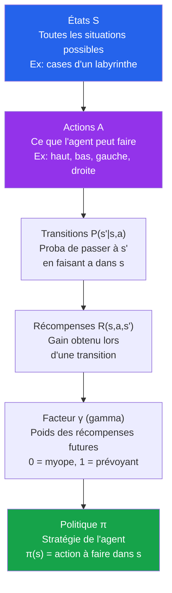

| Composante | Symbole | Définition simple |
|---|---|---|
| **États** | S | Toutes les situations où l'agent peut se trouver |
| **Actions** | A | Ce que l'agent peut faire dans chaque état |
| **Transitions** | P(s'\|s,a) | Probabilité d'arriver dans s' en faisant a depuis s |
| **Récompenses** | R(s,a,s') | Gain obtenu lors d'une transition |
| **Discount** | γ | Importance des récompenses futures (entre 0 et 1) |
| **Politique** | π | La stratégie de décision de l'agent |

---

### Quantités importantes

- **Utilité** : La somme des récompenses actualisées sur tout un parcours
  - U = r₀ + γr₁ + γ²r₂ + γ³r₃ + ...
- **Politique optimale π\*** : La politique qui maximise l'utilité espérée
- **État absorbant** : Un état terminal (fin d'épisode) — la récompense finale y est fixe

---

### Analogie — Le GPS

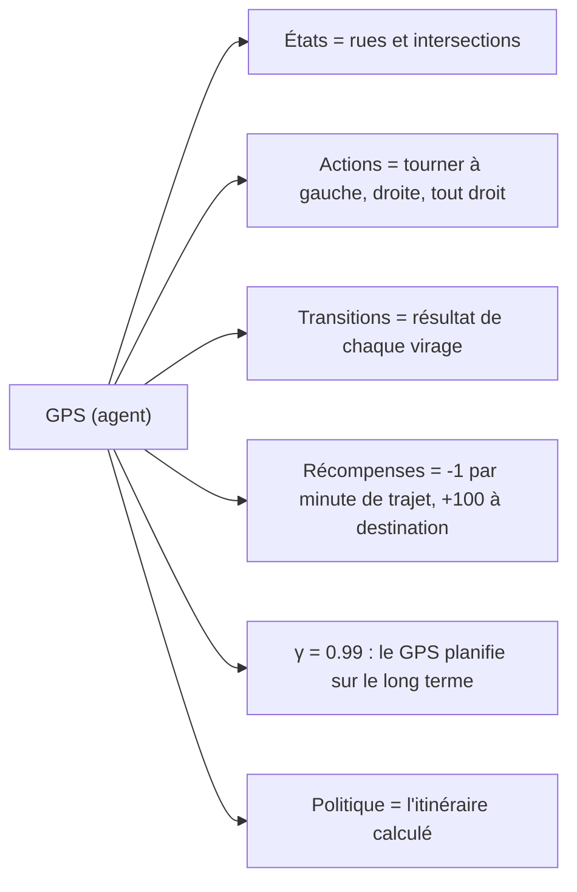

> _Comme le GPS, un agent RL cherche le chemin optimal en tenant compte de tous les états futurs possibles, pondérés par γ._

</details>

<p align="right"><a href="#top">↑ Retour en haut</a></p>

---

<a id="section-2"></a>

<details>
<summary>2 — Value-Based vs Policy-Based — Théorie</summary>

Il existe deux grandes familles d'approches en RL pour trouver la politique optimale. Elles diffèrent dans **ce qu'elles apprennent directement**.

---

### 2.1 — Concept fondamental

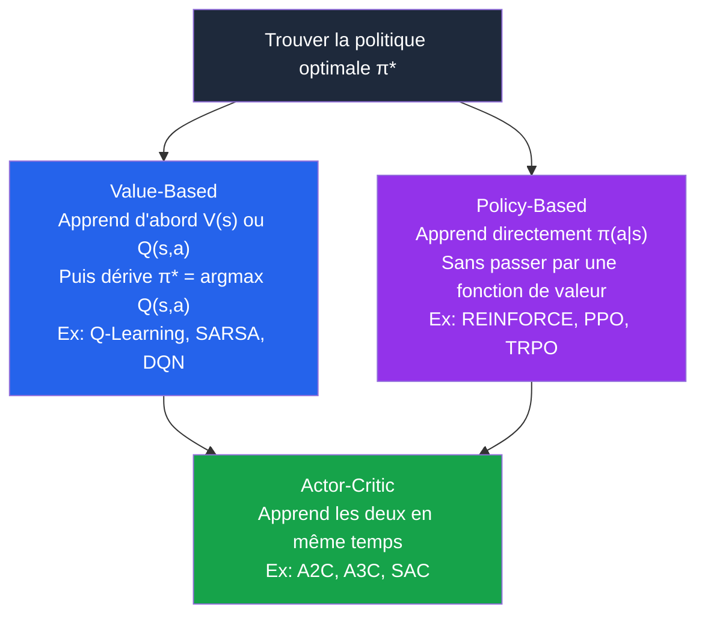

| Aspect | Value-Based | Policy-Based |
|---|---|---|
| **Ce qu'on apprend** | V(s) ou Q(s,a) — la valeur des états/actions | π(a\|s) directement — la stratégie |
| **Comment choisir une action** | argmax Q(s,a) | Échantillonner depuis π(a\|s) |
| **Espace d'actions** | Discret (fini) | Discret **ou continu** |
| **Stabilité** | Plus stable | Peut osciller |
| **Exemples** | Q-Learning, DQN, SARSA | REINFORCE, PPO, TRPO |

---

### 2.2 — Analogie : le joueur de soccer

**Value-Based dans le soccer :**

Un joueur reçoit le ballon. Il évalue mentalement chaque option :
- Passer à gauche → 60% de chance de but → valeur estimée : +6
- Tirer directement → 30% de chance de but → valeur estimée : +3
- Dribbler → 80% de perdre le ballon → valeur estimée : -2

Il **choisit l'action de valeur maximale** : passer à gauche. C'est exactement ce que fait Q-Learning avec `argmax Q(s,a)`.

**Policy-Based dans le soccer :**

Un joueur très expérimenté ne "calcule" plus rien — il a développé des **réflexes directs** : dans telle situation, il passe instinctivement. Sa politique est intériorisée, directe, sans calcul de valeur intermédiaire.

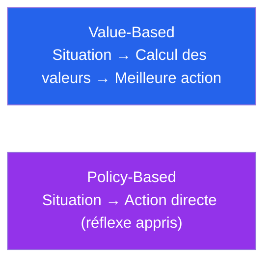

---

### 2.3 — Exemple : Jean et les décisions juridiques

Jean a reçu une assignation à comparaître pour une poursuite de **350 000 $ CAD**. Il a 30 jours pour répondre. Voici ses options :

| Option | Approche RL | Valeur estimée |
|---|---|---|
| Ignorer et voyager au Mexique | — | Très négative (jugement par défaut) |
| Répondre lui-même au tribunal | Value-Based myope | Négative (sans expertise) |
| Contacter un avocat local | **Value-Based optimal** | Positive (meilleure défense, coût modéré) |
| Contacter un avocat éloigné | Value-Based sous-optimal | Moins positive (frais de déplacement) |
| Fuir à l'étranger | — | Catastrophique à long terme |

**Lecture Value-Based** : Jean devrait évaluer chaque option sur sa valeur à **long terme** (pas juste le coût immédiat). L'avocat local donne la meilleure valeur actualisée.

**Lecture Policy-Based** : Un avocat expérimenté, face à cette situation, appliquerait directement sa **politique apprise** : "Assignation à comparaître → Contacter immédiatement un avocat spécialisé." Pas besoin de recalculer — la réponse est intériorisée.

> _La morale : Q-Learning aurait choisi l'avocat local. Un agent Policy-Based aurait répondu instantanément sans calculer. Les deux arrivent à la même action optimale — mais par des chemins différents._

</details>

<p align="right"><a href="#top">↑ Retour en haut</a></p>

---

<a id="section-3"></a>

<details>
<summary>3 — Algorithmes Value-Based vs Policy-Based</summary>

---

### 3.1 — Algorithmes Value-Based

Ces algorithmes apprennent une **fonction de valeur** et en dérivent la politique.

#### Q-Learning
- Apprend Q(s,a) directement depuis les expériences
- **Off-policy** : apprend la politique optimale même en explorant
- **→ [Éq. 1](#eq-qlearning)** pour la règle de mise à jour

#### Deep Q-Network (DQN)
- Étend Q-Learning avec un **réseau de neurones** pour approximer Q(s,a)
- Nécessaire quand l'espace d'états est trop grand pour une table Q
- Utilisé par DeepMind pour battre les humains aux jeux Atari (2013)

#### SARSA (State-Action-Reward-State-Action)
- Similaire à Q-Learning, mais **on-policy** : la cible utilise l'action réellement choisie
- Plus conservateur que Q-Learning

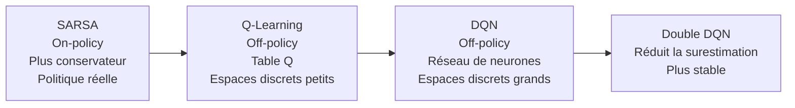

**Avantages Value-Based :**
- Convergence vers l'optimal garantie (sous certaines conditions)
- Robuste dans les environnements statiques
- Interprétable : on peut voir les valeurs Q

**Limites :**
- Uniquement pour les espaces d'actions **discrets** (finis)
- Lent sur les problèmes très complexes

---

### 3.2 — Algorithmes Policy-Based

Ces algorithmes optimisent directement la **politique π(a|s)**.

#### REINFORCE (Monte Carlo Policy Gradient)
- Collecte des épisodes complets, puis ajuste la politique dans la direction des meilleures actions
- Simple mais variance élevée

#### PPO (Proximal Policy Optimization)
- Algorithme état de l'art de OpenAI
- Stabilise l'apprentissage en limitant les changements de politique à chaque étape
- Utilisé pour ChatGPT (RLHF)

#### TRPO (Trust Region Policy Optimization)
- Précurseur de PPO, contrainte mathématique plus stricte

**Avantages Policy-Based :**
- Fonctionne pour les **espaces d'actions continus** (angles de moteur, forces...)
- Politiques stochastiques → naturellement exploratoire
- Converge vers des politiques lisses

**Limites :**
- Variance élevée dans les estimations
- Peut converger vers des optima locaux

---

### 3.3 — Actor-Critic — Le meilleur des deux mondes

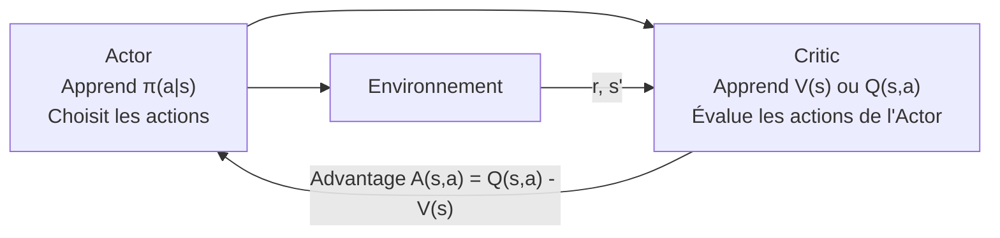

| Composant | Rôle | Lien avec Bellman |
|---|---|---|
| **Actor** | Choisit les actions via π(a\|s) | Optimise la politique |
| **Critic** | Évalue V(s) via TD updates | Utilise **→ [Éq. 2](#eq-bellman-v)** |
| **Advantage** | A(s,a) = Q(s,a) − V(s) | Signal d'erreur Bellman |

**Exemples** : A2C, A3C, SAC, TD3, PPO (version Actor-Critic)

</details>

<p align="right"><a href="#top">↑ Retour en haut</a></p>

---

<a id="section-4"></a>

<details>
<summary>4 — Online vs Offline Learning</summary>

---

### 4.1 — Apprentissage en ligne (Online Learning)

L'agent apprend **en temps réel**, en mettant à jour sa politique après **chaque interaction**.

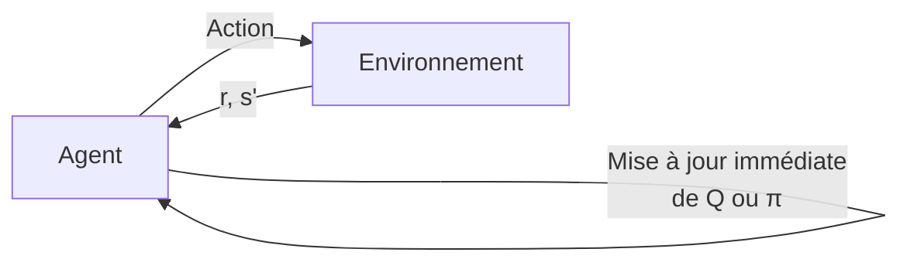

**Caractéristiques :**
- Mise à jour **après chaque pas** (ou petit lot)
- S'adapte aux **environnements changeants**
- Pas besoin de stocker de grandes quantités de données
- Q-Learning, SARSA, TD-Learning sont online

**Analogie :** Apprendre à jouer à un jeu vidéo **en jouant** — chaque erreur est corrigée immédiatement à la prochaine tentative.

---

### 4.2 — Apprentissage hors-ligne (Offline Learning)

L'agent apprend depuis un **dataset collecté à l'avance**, sans interagir avec l'environnement.

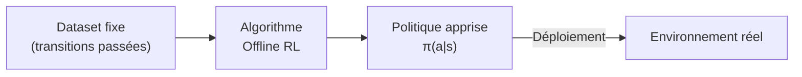

**Caractéristiques :**
- Apprend depuis un **historique de données** (ex: logs de comportement humain)
- Ne peut pas explorer — uniquement optimiser sur les données existantes
- Risque de distribution shift si le dataset est biaisé
- BCQ, CQL, IQL sont des algorithmes offline RL

**Analogie :** Apprendre à conduire en **regardant des milliers de vidéos** de conduite — sans jamais prendre le volant pendant l'apprentissage.

---

### 4.3 — Comparaison directe

| Critère | Online | Offline |
|---|---|---|
| **Accès à l'environnement** | En temps réel | Non (dataset fixe) |
| **Mise à jour** | Après chaque pas | Par lots sur tout le dataset |
| **Adaptabilité** | Oui — s'adapte aux changements | Non |
| **Quantité de données** | Peut apprendre avec peu | Nécessite un grand dataset |
| **Risque** | Peut être dangereux en production | Sûr (pas d'interaction directe) |
| **Exemples** | Q-Learning, SARSA, PPO | BCQ, CQL, Decision Transformer |
| **Usage typique** | Jeux, simulation | Médecine, conduite autonome |

---

### 4.4 — On-Policy vs Off-Policy

> Cette distinction est liée mais différente de Online/Offline.

| Aspect | On-Policy | Off-Policy |
|---|---|---|
| **Définition** | Apprend depuis la politique **qu'on suit actuellement** | Apprend depuis une politique **différente** (ex: données passées) |
| **Behavioral policy** | = Target policy | Différente de la target policy |
| **Target policy** | = Behavioral policy | Politique optimale qu'on veut apprendre |
| **Exemples** | SARSA, PPO | Q-Learning, DQN |
| **Avantage** | Plus stable, moins de biais | Peut réutiliser les expériences passées (experience replay) |

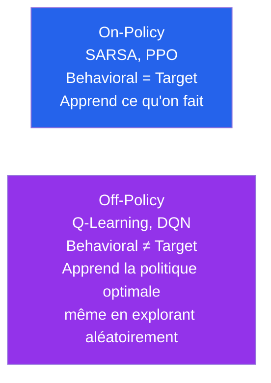

</details>

<p align="right"><a href="#top">↑ Retour en haut</a></p>

---

<a id="section-5"></a>

<details>
<summary>5 — Les fonctions de valeur — V(s) et Q(s,a)</summary>

Les fonctions de valeur sont les outils fondamentaux que l'agent utilise pour évaluer les états et les actions.

---

### 5.1 — Fonction de valeur d'état V(s)

**Question répondue :** *"À quel point est-il bon d'être dans cet état ?"*

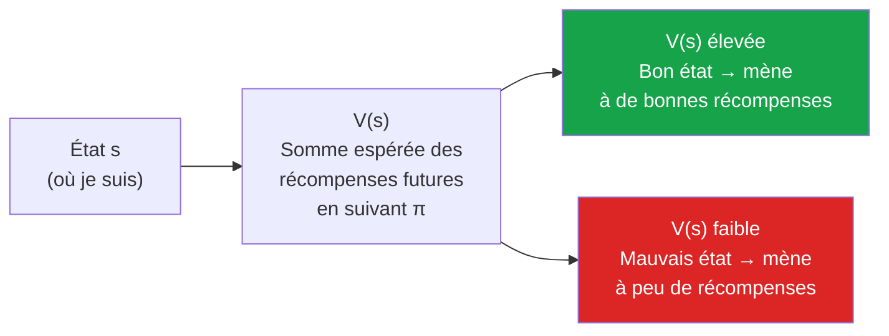

**Analogie jeu vidéo :** V(s) te dit à quel point il est bon d'être **à cet endroit de la carte**, sans te dire quelle direction aller.

**Exemples :**
- V(case adjacente à +1 dans GridWorld) ≈ +0.9
- V(case de départ dans GridWorld) ≈ +0.5
- V(case adjacente au piège -1) ≈ -0.5

---

### 5.2 — Fonction de valeur état-action Q(s,a)

**Question répondue :** *"À quel point est-il bon d'être dans cet état ET de faire cette action ?"*

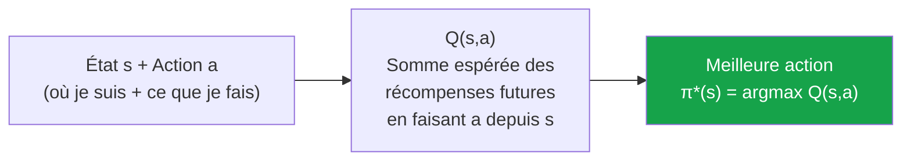

**Analogie jeu vidéo :** Q(s,a) te dit à quel point il est bon d'être **à cet endroit** ET de **faire ce mouvement** précis.

**Pourquoi Q est plus pratique que V ?**

Avec V(s) seul, pour choisir une action, il faut connaître le modèle P(s'|s,a). Avec Q(s,a), la décision est directe :

```
π*(s) = argmax_a Q(s,a)
```

Pas besoin de connaître les probabilités de transition — c'est pourquoi Q-Learning est **model-free**.

---

### 5.3 — Relation entre V et Q

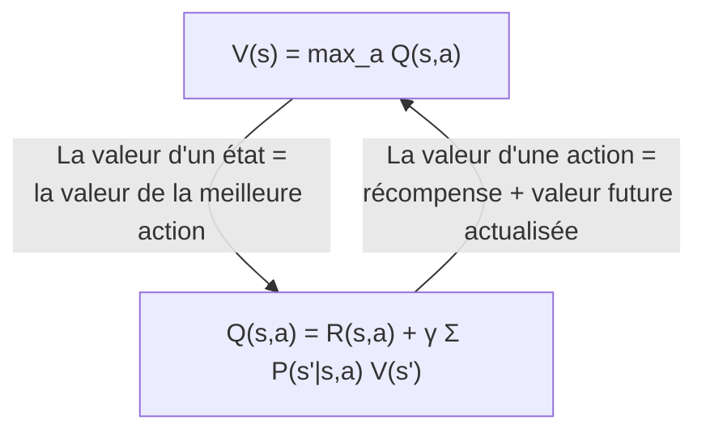

**Exemple numérique :**

| Action depuis l'état s | Q(s, action) |
|---|---|
| Aller à droite | 0.85 |
| Aller en haut | 0.40 |
| Aller à gauche | 0.15 |
| Aller en bas | -0.30 |

→ V(s) = max(0.85, 0.40, 0.15, -0.30) = **0.85**
→ π\*(s) = **Aller à droite**

</details>

<p align="right"><a href="#top">↑ Retour en haut</a></p>

---

<a id="section-6"></a>

<details>
<summary>6 — Q-Learning — Algorithme complet</summary>

---

### 6.1 — Vue d'ensemble

Q-Learning est l'algorithme fondamental du RL **model-free** et **off-policy**. Il apprend la table Q(s,a) directement depuis les expériences, sans connaître P ni R.

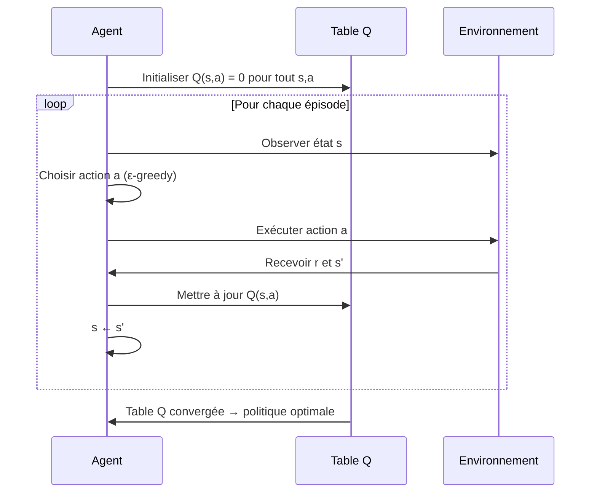

---

### 6.2 — Les étapes détaillées

**Étape 1 — Initialisation**
- Créer une table Q de taille |S| × |A|
- Initialiser toutes les valeurs à 0 (ou aléatoirement)

**Étape 2 — Boucle sur les épisodes**
- Répéter pour N épisodes
- Chaque épisode : de l'état initial jusqu'à l'état terminal

**Étape 3 — Choisir une action (ε-greedy)**

```
Avec probabilité ε  → action aléatoire (exploration)
Avec probabilité 1-ε → argmax Q(s,a) (exploitation)
```

**Étape 4 — Mise à jour Bellman**

> **(→ [Éq. 1](#eq-qlearning))**

> **Q(s,a) ← (1−α)·Q(s,a) + α·[r + γ·max Q(s',a')]**

| Terme | Signification |
|---|---|
| `(1-α)·Q(s,a)` | Ce qu'on savait avant — mémoire de l'ancien |
| `α·[...]` | Nouvelle information pondérée par le taux d'apprentissage |
| `r` | Récompense immédiate obtenue |
| `γ·max Q(s',a')` | Meilleure valeur future estimée actualisée |
| `r + γ·max Q(s',a')` | **Cible Bellman** — ce que Q(s,a) devrait valoir |
| `cible - Q(s,a)` | **Erreur TD** — l'écart à corriger |

---

### 6.3 — Le taux d'apprentissage α (alpha)

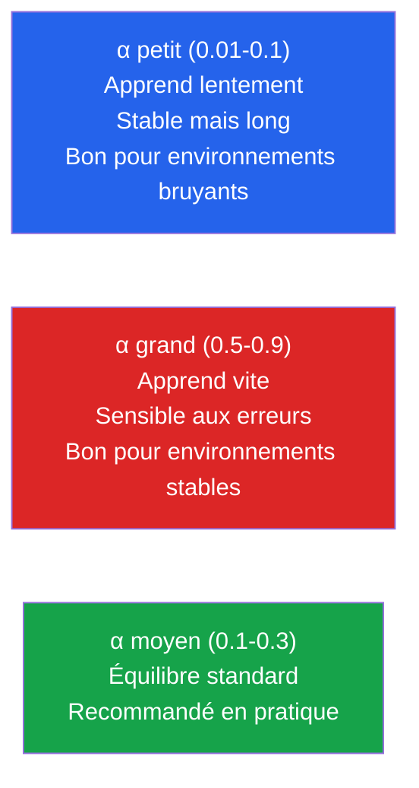

**Règle empirique :**
- Débuter avec α = 0.1
- Si l'apprentissage est trop lent → augmenter α
- Si l'agent est instable → diminuer α
- Certains algorithmes **diminuent α progressivement** (learning rate schedule)

---

### 6.4 — Exploration vs Exploitation

Le **dilemme fondamental** du RL : comment équilibrer la découverte de nouvelles stratégies et l'utilisation des stratégies connues ?

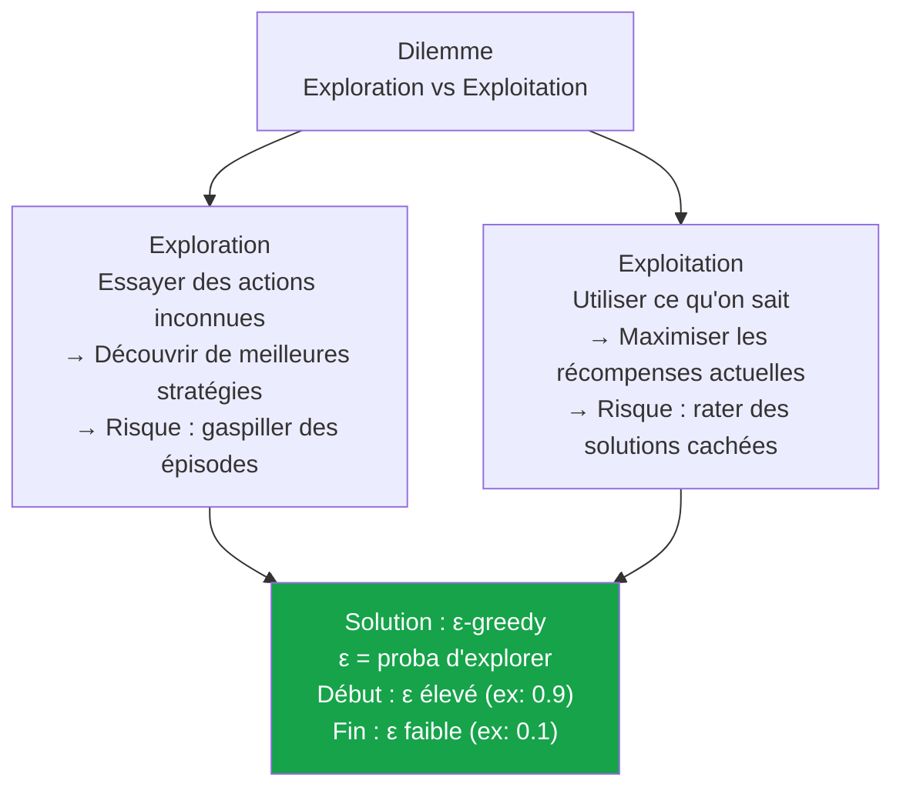

**Stratégie ε-greedy décroissant :**

| Phase | ε | Comportement |
|---|---|---|
| Début de l'entraînement | 0.9 | 90% exploration → l'agent découvre l'environnement |
| Mi-entraînement | 0.5 | Équilibre exploration/exploitation |
| Fin de l'entraînement | 0.1 | 90% exploitation → l'agent utilise ce qu'il a appris |
| Déploiement | 0.0 | 100% exploitation → politique apprise |

**Exemple concret :**

> Un robot apprend à naviguer dans un entrepôt. Au début (ε=0.9), il essaie des chemins aléatoires — certains sont des impasses, d'autres mènent à la sortie. Après 1000 épisodes (ε=0.1), il sait quel chemin est optimal et l'utilise presque toujours. Sans exploration initiale, il aurait pu rester bloqué sur le premier chemin "raisonnable" trouvé, même si un meilleur existait.

---

### 6.5 — Exemple numérique pas à pas

Grille simple : A → B → C (récompense +10). γ=0.9, α=0.1, Q initialisé à 0.

**Épisode 1, Pas 1 : État A, action "droite", arrive en B, r=0**

```
Q(A, droite) ← (1-0.1)×0 + 0.1×[0 + 0.9×max Q(B,a)]
             = 0.9×0 + 0.1×[0 + 0.9×0]
             = 0
```

**Épisode 1, Pas 2 : État B, action "droite", arrive en C, r=+10**

```
Q(B, droite) ← 0.9×0 + 0.1×[10 + 0.9×max Q(C,a)]
             = 0.1×10 = 1.0
```

**Après plusieurs épisodes :**
- Q(B, droite) converge vers ~9.0
- Q(A, droite) converge vers ~8.1
- La politique optimale : aller à droite depuis A et depuis B ✓

</details>

<p align="right"><a href="#top">↑ Retour en haut</a></p>

---

<a id="section-7"></a>

<details>
<summary>7 — Quiz 1 — MDP, Value-Based, Policy-Based</summary>

---

**Question 1 :** Dans un MDP, que représente P(s'|s,a) ?

a) La récompense obtenue en faisant l'action a dans l'état s
b) La probabilité d'arriver dans l'état s' en faisant a depuis s
c) La politique optimale de l'agent
d) Le facteur d'actualisation

<details>
<summary>💡 Solution</summary>

✅ **b)** P(s'|s,a) est la **fonction de transition** — elle donne la probabilité d'arriver dans l'état s' si on fait l'action a depuis l'état s. C'est le modèle stochastique de l'environnement.

</details>

---

**Question 2 :** Quelle est la principale différence entre Value-Based et Policy-Based ?

a) Value-Based utilise des réseaux de neurones, Policy-Based non
b) Value-Based apprend une fonction de valeur pour dériver la politique, Policy-Based apprend la politique directement
c) Value-Based est plus rapide, Policy-Based est plus lent
d) Il n'y a pas de différence réelle

<details>
<summary>💡 Solution</summary>

✅ **b)** Value-Based (Q-Learning, DQN) calcule d'abord Q(s,a), puis dérive π*(s)=argmax Q(s,a). Policy-Based (PPO, REINFORCE) optimise directement les paramètres de la politique π(a|s) sans passer par une fonction de valeur.

</details>

---

**Question 3 :** Pourquoi Q(s,a) est-il plus pratique que V(s) pour un agent model-free ?

a) Q(s,a) est plus facile à calculer
b) Q(s,a) permet de choisir directement l'action optimale sans connaître P(s'|s,a)
c) V(s) ne fonctionne que dans les environnements déterministes
d) Q(s,a) converge toujours plus vite

<details>
<summary>💡 Solution</summary>

✅ **b)** Avec V(s), extraire la meilleure action nécessite argmax_a Σ P(s'|s,a)[R+γV(s')] — ce qui exige de connaître P. Avec Q(s,a), on fait simplement argmax_a Q(s,a) — **pas besoin du modèle**.

</details>

---

**Question 4 :** Quelle est la différence entre on-policy et off-policy ?

a) On-policy apprend plus vite, off-policy apprend moins vite
b) On-policy apprend depuis la politique actuellement suivie, off-policy peut apprendre depuis n'importe quelle politique
c) On-policy utilise des réseaux de neurones, off-policy des tables
d) Il n'y a pas de différence pratique

<details>
<summary>💡 Solution</summary>

✅ **b)** SARSA (on-policy) : la cible utilise l'action réellement choisie sous la politique actuelle. Q-Learning (off-policy) : la cible utilise max_a Q(s',a) — la meilleure action possible, indépendamment de ce que l'agent fait réellement. Cela permet à Q-Learning de réutiliser des données collectées avec une autre politique (experience replay).

</details>

---

**Question 5 :** À quoi sert le facteur γ (gamma) ?

a) Contrôler la vitesse d'apprentissage
b) Pondérer l'importance des récompenses futures : γ proche de 0 = myope, γ proche de 1 = prévoyant
c) Définir la probabilité d'exploration
d) Normaliser les récompenses

<details>
<summary>💡 Solution</summary>

✅ **b)** γ ∈ [0,1] est le facteur d'actualisation. γ=0 : seule la récompense immédiate compte. γ=0.99 : l'agent planifie sur le très long terme. Une récompense de +100 dans 10 étapes vaut γ^10 × 100 maintenant.

</details>

---

**Question 6 :** Quel algorithme peut fonctionner avec un espace d'actions continu ?

a) Q-Learning classique
b) DQN standard
c) PPO (Policy-Based / Actor-Critic)
d) SARSA

<details>
<summary>💡 Solution</summary>

✅ **c)** PPO et les algorithmes Policy-Based en général peuvent gérer des espaces d'actions continus (ex: angle de rotation d'un bras robotique entre -180° et +180°). Q-Learning et DQN standard nécessitent un espace d'actions discret et fini pour pouvoir calculer argmax Q(s,a).

</details>

</details>

<p align="right"><a href="#top">↑ Retour en haut</a></p>

---

<a id="section-8"></a>

<details>
<summary>8 — Quiz 2 — Q-Learning et paramètres</summary>

---

**Question 1 :** Dans la formule Q-Learning, que représente l'erreur TD ?

a) La différence entre deux épisodes consécutifs
b) La différence entre la cible Bellman `r + γ·max Q(s',a')` et la valeur actuelle Q(s,a)
c) La différence entre α et γ
d) L'erreur de prédiction du réseau de neurones

<details>
<summary>💡 Solution</summary>

✅ **b)** L'erreur TD (Temporal Difference) = `r + γ·max Q(s',a') - Q(s,a)`. C'est l'écart entre ce que l'agent **estimait** que valait (s,a) et ce qu'il **observe maintenant**. C'est ce signal qui guide la mise à jour.

</details>

---

**Question 2 :** Que se passe-t-il si α = 1 dans Q-Learning ?

a) L'agent n'apprend jamais
b) L'agent remplace complètement l'ancienne valeur par la nouvelle cible Bellman à chaque étape
c) L'agent explore 100% du temps
d) L'algorithme diverge toujours

<details>
<summary>💡 Solution</summary>

✅ **b)** Avec α=1 : Q(s,a) ← Q(s,a) + 1×[cible - Q(s,a)] = cible. L'agent **oublie entièrement** la valeur précédente et adopte la nouvelle cible. Dans des environnements déterministes, cela peut fonctionner. Dans des environnements stochastiques, l'agent sera très instable car chaque expérience écrase la précédente.

</details>

---

**Question 3 :** Pourquoi faut-il explorer beaucoup au début de l'entraînement ?

a) Pour éviter que l'algorithme converge trop vite
b) Pour découvrir toutes les régions de l'espace d'états avant de se concentrer sur les meilleures actions
c) Parce que l'agent n'a pas encore de table Q
d) Pour satisfaire des contraintes mathématiques de convergence

<details>
<summary>💡 Solution</summary>

✅ **b)** Sans exploration suffisante, l'agent peut rester bloqué sur la première solution "raisonnable" trouvée, même si une bien meilleure existe ailleurs. L'exploration garantit que l'agent a vu suffisamment de l'espace d'états pour identifier la vraie politique optimale.

</details>

---

**Question 4 :** Quelle est la différence entre Q-Learning et SARSA ?

a) Q-Learning est off-policy (cible = max Q), SARSA est on-policy (cible = Q de l'action réellement choisie)
b) Q-Learning est plus lent que SARSA
c) SARSA utilise des réseaux de neurones, Q-Learning non
d) Il n'y a pas de différence dans la pratique

<details>
<summary>💡 Solution</summary>

✅ **a)** Q-Learning : `Q(s,a) ← Q(s,a) + α[r + γ·**max**_{a'} Q(s',a') - Q(s,a)]` — off-policy, toujours la meilleure action théorique. SARSA : `Q(s,a) ← Q(s,a) + α[r + γ·Q(s',**a'**) - Q(s,a)]` — on-policy, a' est l'action réellement choisie (incluant l'exploration). SARSA est plus conservateur car il tient compte des actions d'exploration.

</details>

---

**Question 5 :** Un agent Q-Learning a ces valeurs après entraînement dans l'état s :

Q(s, haut)=0.3, Q(s, bas)=0.8, Q(s, gauche)=0.5, Q(s, droite)=−0.2

Quelle action choisit la politique optimale ?

a) Haut
b) Bas
c) Gauche
d) Droite

<details>
<summary>💡 Solution</summary>

✅ **b) Bas** — π*(s) = argmax_a Q(s,a) = argmax(0.3, 0.8, 0.5, -0.2) = **Bas** avec Q=0.8. L'agent va toujours vers la case de valeur maximale.

</details>

</details>

<p align="right"><a href="#top">↑ Retour en haut</a></p>

---

<a id="section-9"></a>

<details>
<summary>9 — Travail à réaliser — Discussion et recherche en groupe</summary>

## 9 — Travail à réaliser — Discussion et recherche en groupe

> **Consignes :** Groupes de 3 à 5 personnes — Durée : 45 à 60 minutes — Synthèse écrite ou présentation de 5 min

---

### Sujet principal — Behavioral Policy vs Target Policy

**Question centrale :**

> Quelle est la relation entre Value-Based et Policy-Based, et les concepts de **"behavioral policy"** et **"target policy"** ? En quoi cette distinction est-elle importante dans les algorithmes off-policy comme Q-Learning, DQN ou Actor-Critic ?

**Définitions de départ :**

| Concept | Définition simple |
|---|---|
| **Behavioral policy** | La politique que l'agent **utilise pour collecter des données** (peut inclure beaucoup d'exploration) |
| **Target policy** | La politique que l'agent **cherche à optimiser** (politique idéale sans exploration) |
| **On-policy** | Behavioral = Target — on apprend depuis ce qu'on fait |
| **Off-policy** | Behavioral ≠ Target — on apprend la politique optimale depuis des données collectées autrement |

**Exemple concret :**
- Dans Q-Learning, la behavioral policy est ε-greedy (explore 10% du temps)
- La target policy est greedy (toujours le max Q)
- Q-Learning est off-policy car il apprend la target policy (greedy) même en suivant la behavioral policy (ε-greedy)

---

### Questions de discussion

**Partie A — Compréhension**

1. Pourquoi est-il utile d'avoir une **behavioral policy différente de la target policy** ?
2. Dans Q-Learning, identifiez précisément la behavioral policy et la target policy dans la formule de mise à jour.
3. SARSA est on-policy — expliquez pourquoi cela le rend plus **conservateur** que Q-Learning dans certains environnements (ex: falaise).
4. DQN utilise un **experience replay buffer** — en quoi cela force-t-il DQN à être off-policy ?

**Partie B — Online vs Offline**

5. Si vous avez accès à **1 million de parties enregistrées** d'un jeu (sans pouvoir en jouer vous-même), quelle approche choisiriez-vous : online RL ou offline RL ? Justifiez.
6. Dans quels domaines réels l'**offline RL** est-il préférable à l'online RL ? (Indice : pensez à la médecine, la conduite autonome...)
7. Pourquoi l'offline RL est-il plus difficile que l'online RL malgré la grande quantité de données ?

**Partie C — Réflexion critique**

8. Un agent Q-Learning apprend dans un environnement, puis est déployé dans un environnement légèrement différent. Que se passera-t-il ? Proposez une solution.
9. Comparez le dilemme exploration/exploitation à un dilemme de la vraie vie (travail, études, investissement...).
10. Selon vous, pourquoi PPO (Policy-Based) est-il utilisé pour entraîner les modèles de langage (ChatGPT) plutôt que Q-Learning ?

---

### Format de la synthèse

```
1. Réponses aux 10 questions (quelques lignes chacune)
2. Schéma ou tableau comparatif au choix du groupe
3. Exemple original d'application (domaine choisi par le groupe)
4. Une question que le groupe n'a pas réussi à répondre
```

</details>

<p align="right"><a href="#top">↑ Retour en haut</a></p>

---

<a id="section-10"></a>

<details>
<summary>10 — Ressources supplémentaires</summary>

### Vidéos recommandées

| Ressource | Contenu | Lien |
|---|---|---|
| **David Silver — Lecture 4 : Model-Free Prediction** | TD-Learning, Q-Learning théorie | [YouTube — UCL RL Course](https://www.youtube.com/watch?v=PnHCvfgC_ZA) |
| **Lien cours P11** | Fonctions de valeur | [YouTube](https://www.youtube.com/watch?v=9JZID-h6ZJ0) |
| **DeepMind RL Series 2021** | Value-Based, Policy-Based, Actor-Critic | YouTube |
| **Spinning Up — OpenAI** | Introduction pratique PPO, SAC | [spinningup.openai.com](https://spinningup.openai.com) |

### Référence principale

**Sutton & Barto — Reinforcement Learning: An Introduction (2e éd.)**
- Chapitre 6 : TD-Learning et Q-Learning
- Chapitre 13 : Policy Gradient Methods

Disponible gratuitement : [incompleteideas.net/book](http://incompleteideas.net/book/the-book-2nd.html)

### Code Python — Q-Learning minimal

```python
import numpy as np

def q_learning(n_states, n_actions, episodes=1000,
               alpha=0.1, gamma=0.9, epsilon=0.1):
    Q = np.zeros((n_states, n_actions))

    for episode in range(episodes):
        state = 0  # état initial
        done = False

        while not done:
            # ε-greedy : exploration vs exploitation
            if np.random.random() < epsilon:
                action = np.random.randint(n_actions)   # exploration
            else:
                action = np.argmax(Q[state])             # exploitation

            # Simuler l'environnement (à remplacer par vrai env)
            next_state, reward, done = env_step(state, action)

            # Mise à jour Bellman — Éq. (1)
            td_target = reward + gamma * np.max(Q[next_state]) * (not done)
            td_error  = td_target - Q[state, action]
            Q[state, action] += alpha * td_error

            state = next_state

    return Q

# Politique optimale
Q = q_learning(n_states=16, n_actions=4)
policy = {s: np.argmax(Q[s]) for s in range(Q.shape[0])}
```

</details>

<p align="right"><a href="#top">↑ Retour en haut</a></p>

---

<a id="section-11"></a>

<details>
<summary>11 — Synthèse du chapitre</summary>

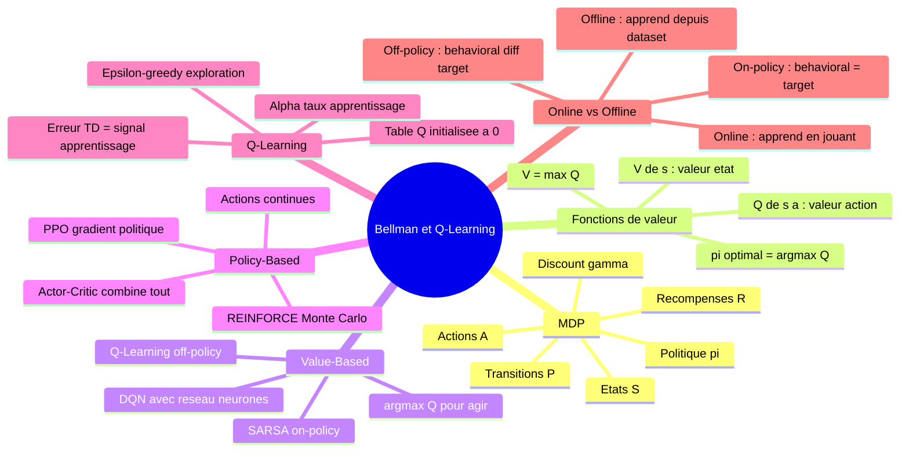

### Points absolument à retenir

1. **V(s)** évalue un état, **Q(s,a)** évalue une action dans un état — `V*(s) = max_a Q*(s,a)`.

2. **Value-Based** apprend Q puis dérive π. **Policy-Based** apprend π directement. **Actor-Critic** fait les deux.

3. **Q-Learning** est **off-policy** et **model-free** — il apprend la politique optimale (greedy) même en explorant (ε-greedy), sans connaître P ni R.

4. **α (learning rate)** contrôle la vitesse d'apprentissage. **γ (discount)** contrôle l'horizon temporel. **ε (epsilon)** contrôle l'exploration.

5. L'**erreur TD** = `r + γ·max Q(s',a') - Q(s,a)` est le signal d'apprentissage fondamental — il mesure l'écart entre ce qu'on estimait et ce qu'on observe.

6. **Behavioral policy ≠ Target policy** en off-policy : on peut apprendre la politique optimale depuis des données collectées avec une politique différente.

### Tableau de synthèse

| Algorithme | Famille | On/Off Policy | Espace actions | Usage typique |
|---|---|---|---|---|
| Q-Learning | Value-Based | Off-policy | Discret | Jeux, navigation |
| SARSA | Value-Based | On-policy | Discret | Environnements dangereux |
| DQN | Value-Based | Off-policy | Discret grand | Atari, jeux vidéo |
| REINFORCE | Policy-Based | On-policy | Discret/continu | Tâches simples |
| PPO | Actor-Critic | On-policy | Discret/continu | Robotique, LLM (RLHF) |
| SAC | Actor-Critic | Off-policy | Continu | Robotique continue |

</details>

<p align="right"><a href="#top">↑ Retour en haut</a></p>

---

<p align="center">
  <em>Tous droits réservés. Toute reproduction, diffusion, utilisation ou adaptation de ce cours, en tout ou en partie, est strictement interdite sans l'autorisation écrite préalable de Dr. Haythem REHOUMA.</em>
</p>

<p align="center">
  <strong>Cours créé par Dr. Haythem REHOUMA — Apprentissage par Renforcement</strong>
</p>

<br/>

<p align="center">
  <a href="#top" style="display: inline-block; background: #2563eb; color: #ffffff; text-decoration: none; font-size: 1.1rem; font-weight: 700; padding: 14px 40px; border-radius: 10px;">
    ↑ Retour en haut du cours
  </a>
</p>
