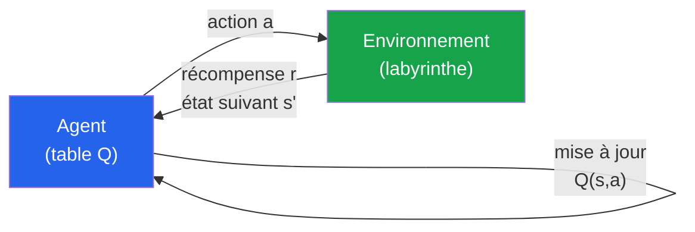
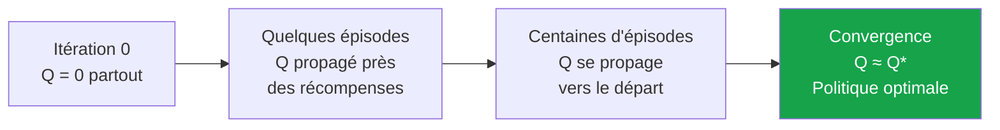
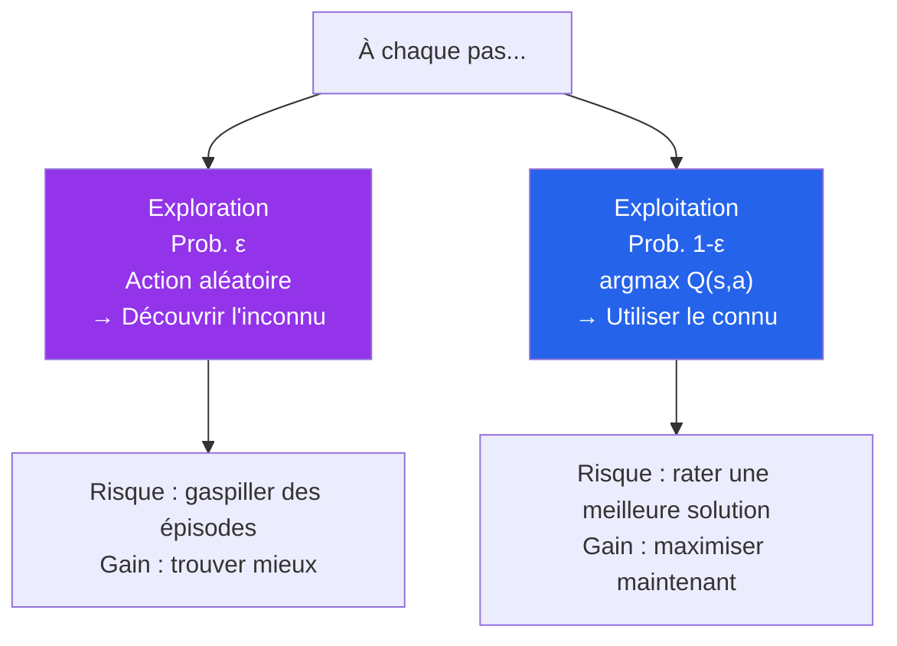
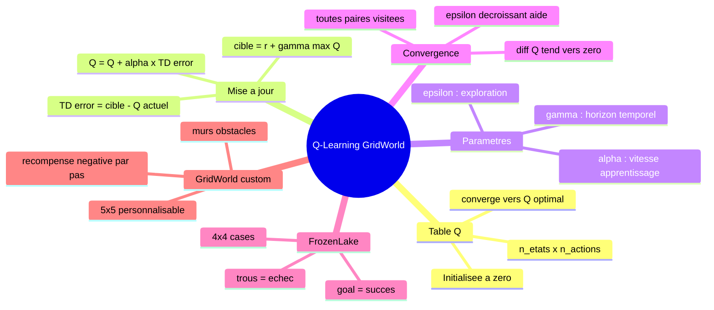

<a id="top"></a>

# Q-Learning — Implémentation dans un labyrinthe (Google Colab)

## Table des matières

| # | Section |
|---|---|
| 1 | [Notions fondamentales du Q-Learning](#section-1) |
| 2 | [Mise à jour des Q-values et convergence](#section-2) |
| 3 | [Exploration vs Exploitation — Stratégie ε-greedy](#section-3) |
| 4 | [Exercice Colab 1 — Q-Learning sur FrozenLake (Gym)](#section-4) |
| 5 | [Exercice Colab 2 — Q-Learning sur GridWorld personnalisé](#section-5) |
| 6 | [Exercice Colab 3 — Visualisation et analyse des résultats](#section-6) |
| 7 | [Questions de réflexion et travail à réaliser](#section-7) |
| 8 | [Synthèse](#section-8) |

---

## Équations de référence

<a id="eq-qlearning"></a>

**Éq. (1)** — Mise à jour Q-Learning

$$Q(s,a) \leftarrow Q(s,a) + \alpha\!\left[r + \gamma \max_{a'} Q(s',a') - Q(s,a)\right]$$

<a id="eq-greedy"></a>

**Éq. (2)** — Politique ε-greedy

$$\pi(s) = \begin{cases} \text{action aléatoire} & \text{avec probabilité } \varepsilon \\ \arg\max_a Q(s,a) & \text{avec probabilité } 1 - \varepsilon \end{cases}$$

---

<a id="section-1"></a>

<details>
<summary>1 — Notions fondamentales du Q-Learning</summary>

---

### Qu'est-ce que le Q-Learning ?

Q-Learning est un algorithme d'apprentissage par renforcement **model-free** et **off-policy** : l'agent apprend la politique optimale directement depuis ses expériences, **sans connaître** les probabilités de transition P(s'|s,a).



### La table Q

La **table Q** est un tableau de taille |S| × |A| qui stocke la **valeur espérée** de chaque action dans chaque état.

| État | Haut | Bas | Gauche | Droite |
|---|---|---|---|---|
| (0,0) | 0.0 | 0.12 | 0.0 | 0.15 |
| (0,1) | 0.0 | 0.45 | 0.12 | 0.50 |
| (0,2) | 0.72 | 0.0 | 0.45 | **+1** |
| ... | ... | ... | ... | ... |

- Au début : toutes les valeurs sont 0 (l'agent ne sait rien)
- Après l'entraînement : les valeurs reflètent la qualité de chaque action

### Pourquoi "Q" ?

Le "Q" vient de **Quality** — Q(s,a) mesure la **qualité** (utilité à long terme) de prendre l'action `a` dans l'état `s`.

### Les 4 paramètres clés

| Paramètre | Symbole | Rôle | Valeur typique |
|---|---|---|---|
| Taux d'apprentissage | α (alpha) | Vitesse d'intégration des nouvelles infos | 0.1 à 0.5 |
| Facteur d'actualisation | γ (gamma) | Poids des récompenses futures | 0.9 à 0.99 |
| Taux d'exploration | ε (epsilon) | Probabilité d'explorer | 0.1 à 1.0 (décroissant) |
| Épisodes | N | Nombre de parties jouées | 500 à 10 000 |

</details>

<p align="right"><a href="#top">↑ Retour en haut</a></p>

---

<a id="section-2"></a>

<details>
<summary>2 — Mise à jour des Q-values et convergence</summary>

---

### La règle de mise à jour (→ [Éq. 1](#eq-qlearning))

À chaque pas, après avoir observé (s, a, r, s') :

$$Q(s,a) \leftarrow \underbrace{Q(s,a)}_{\text{ancienne valeur}} + \alpha \underbrace{\Big[r + \gamma \max_{a'} Q(s',a') - Q(s,a)\Big]}_{\text{erreur TD}}$$

**Décomposition :**

| Terme | Nom | Signification |
|---|---|---|
| `Q(s,a)` | Estimation actuelle | Ce qu'on pensait que valait cette action |
| `r` | Récompense immédiate | Ce qu'on a gagné en faisant `a` |
| `γ · max Q(s',a')` | Valeur future | Meilleure valeur possible depuis l'état suivant |
| `r + γ·max Q(s',a')` | Cible Bellman | Ce que Q(s,a) devrait valoir |
| `cible − Q(s,a)` | Erreur TD | L'écart à corriger |
| `α × erreur TD` | Correction | De combien on ajuste Q(s,a) |

### Exemple numérique

```
État : case (0,2), Action : Droite → arrive en case (+1), r = +1
Q actuel : Q((0,2), Droite) = 0.0
γ = 0.9, α = 0.1
max Q(s', a') = 0 (état terminal)

Mise à jour :
Q((0,2), Droite) ← 0.0 + 0.1 × [1 + 0.9×0 − 0.0]
                  = 0.0 + 0.1 × 1
                  = 0.1
```

Après cet épisode, Q = 0.1. Après 10 épisodes ≈ 0.65. Après 100 épisodes ≈ 0.90.

### Convergence

Q-Learning **converge vers Q\*(s,a)** si :
1. Toutes les paires (s,a) sont visitées infiniment souvent
2. α diminue au fil du temps (ou est suffisamment petit)
3. γ < 1



</details>

<p align="right"><a href="#top">↑ Retour en haut</a></p>

---

<a id="section-3"></a>

<details>
<summary>3 — Exploration vs Exploitation — Stratégie ε-greedy</summary>

---

### Le dilemme fondamental



### Stratégie ε décroissant (recommandée)

| Phase | ε | Comportement |
|---|---|---|
| Début (épisodes 1-100) | 1.0 | 100% exploration — l'agent découvre tout |
| Milieu (épisodes 100-500) | 0.5 | Équilibre |
| Fin (épisodes 500+) | 0.1 | 90% exploitation — l'agent utilise ce qu'il a appris |

**Formule de décroissance :**
```python
epsilon = max(epsilon_min, epsilon * epsilon_decay)
# Exemple : epsilon_decay = 0.995, epsilon_min = 0.01
```

</details>

<p align="right"><a href="#top">↑ Retour en haut</a></p>

---

<a id="section-4"></a>

<details>
<summary>4 — Exercice Colab 1 — Q-Learning sur FrozenLake (Gym)</summary>

> **Ouvrir Google Colab :** [colab.research.google.com](https://colab.research.google.com)
> Créer un nouveau notebook et copier-coller chaque cellule dans l'ordre.

---

### Cellule 1 — Installation et imports

```python
# Cellule 1 : Installation
!pip install gymnasium[toy_text] -q

import gymnasium as gym
import numpy as np
import matplotlib.pyplot as plt
import random

print("✅ Installation terminée")
print(f"Gymnasium version : {gym.__version__}")
```

---

### Cellule 2 — Découverte de l'environnement FrozenLake

```python
# Cellule 2 : Explorer l'environnement
# FrozenLake = lac gelé 4x4
# S = départ, F = case gelée (sûre), H = trou (-1), G = goal (+1)
# SFFF
# FHFH
# FFFH
# HFFG

env = gym.make("FrozenLake-v1", is_slippery=False, render_mode="ansi")
obs, info = env.reset()

print("=== Environnement FrozenLake 4x4 ===")
print(f"Nombre d'états    : {env.observation_space.n}")
print(f"Nombre d'actions  : {env.action_space.n}")
print(f"Actions : 0=Gauche, 1=Bas, 2=Droite, 3=Haut")
print()

# Afficher la grille
env_render = gym.make("FrozenLake-v1", is_slippery=False, render_mode="ansi")
obs, _ = env_render.reset()
print(env_render.render())
env_render.close()
```

---

### Cellule 3 — Algorithme Q-Learning complet

```python
# Cellule 3 : Algorithme Q-Learning
# ============================================================
# PARAMÈTRES — modifiez ces valeurs pour expérimenter !
# ============================================================
ALPHA        = 0.8     # Taux d'apprentissage (0 < α ≤ 1)
GAMMA        = 0.95    # Facteur d'actualisation (0 < γ ≤ 1)
EPSILON      = 1.0     # Exploration initiale (commence à 100%)
EPSILON_MIN  = 0.01    # Exploration minimale (ne jamais aller sous 1%)
EPSILON_DECAY= 0.995   # Décroissance de l'exploration par épisode
N_EPISODES   = 2000    # Nombre d'épisodes d'entraînement
MAX_STEPS    = 100     # Nombre max de pas par épisode
# ============================================================

# Environnement
env = gym.make("FrozenLake-v1", is_slippery=False)
n_states  = env.observation_space.n   # 16 états
n_actions = env.action_space.n        # 4 actions

# Initialisation de la table Q à zéro
Q = np.zeros((n_states, n_actions))
print(f"Table Q initialisée : {Q.shape} ({n_states} états × {n_actions} actions)")

# ============================================================
# BOUCLE D'ENTRAÎNEMENT
# ============================================================
rewards_per_episode = []   # Pour tracer la courbe d'apprentissage
epsilon = EPSILON

for episode in range(N_EPISODES):
    state, _ = env.reset()
    total_reward = 0
    done = False

    for step in range(MAX_STEPS):
        # --- Choix de l'action : ε-greedy ---
        if random.random() < epsilon:
            action = env.action_space.sample()   # Exploration
        else:
            action = np.argmax(Q[state])          # Exploitation

        # --- Interaction avec l'environnement ---
        next_state, reward, terminated, truncated, _ = env.step(action)
        done = terminated or truncated

        # --- Mise à jour Q-Learning (Éq. 1) ---
        td_target = reward + GAMMA * np.max(Q[next_state]) * (not done)
        td_error  = td_target - Q[state, action]
        Q[state, action] += ALPHA * td_error

        state = next_state
        total_reward += reward

        if done:
            break

    # Décroissance de ε après chaque épisode
    epsilon = max(EPSILON_MIN, epsilon * EPSILON_DECAY)
    rewards_per_episode.append(total_reward)

    # Affichage de la progression
    if (episode + 1) % 200 == 0:
        avg = np.mean(rewards_per_episode[-200:])
        print(f"Épisode {episode+1:4d}/{N_EPISODES} | "
              f"ε = {epsilon:.3f} | "
              f"Taux de succès (200 derniers) = {avg*100:.1f}%")

env.close()
print("\n✅ Entraînement terminé !")
print(f"Taux de succès final : {np.mean(rewards_per_episode[-100:])*100:.1f}%")
```

---

### Cellule 4 — Affichage de la table Q et de la politique

```python
# Cellule 4 : Visualiser la table Q et la politique apprise
actions_labels = ["←", "↓", "→", "↑"]

print("=" * 50)
print("TABLE Q APPRISE")
print("=" * 50)
print(f"{'État':<6} {'Gauche←':>10} {'Bas↓':>10} {'Droite→':>10} {'Haut↑':>10} {'Meilleure':>12}")
print("-" * 60)
for s in range(n_states):
    best_action = np.argmax(Q[s])
    print(f"  {s:2d}   "
          f"{Q[s,0]:>10.4f} "
          f"{Q[s,1]:>10.4f} "
          f"{Q[s,2]:>10.4f} "
          f"{Q[s,3]:>10.4f}   "
          f"  {actions_labels[best_action]}")

# Politique optimale sous forme de grille 4x4
print("\n" + "=" * 30)
print("POLITIQUE OPTIMALE (grille 4x4)")
print("=" * 30)
grid_map = ["S", "F", "F", "F",
            "F", "H", "F", "H",
            "F", "F", "F", "H",
            "H", "F", "F", "G"]

policy_grid = []
for s in range(n_states):
    if grid_map[s] in ["H", "G"]:
        policy_grid.append(grid_map[s])
    else:
        policy_grid.append(actions_labels[np.argmax(Q[s])])

for row in range(4):
    print(" ".join(f"{policy_grid[row*4 + col]:>3}" for col in range(4)))

print("\nLégende : S=départ, F=sûr, H=trou, G=arrivée")
```

---

### Cellule 5 — Courbe d'apprentissage

```python
# Cellule 5 : Tracer la courbe d'apprentissage
window = 100  # Moyenne glissante sur 100 épisodes

def moving_average(data, window):
    return np.convolve(data, np.ones(window)/window, mode='valid')

fig, axes = plt.subplots(1, 2, figsize=(14, 5))

# Graphique 1 : Récompenses par épisode
axes[0].plot(rewards_per_episode, alpha=0.3, color='steelblue', label='Épisode')
axes[0].plot(range(window-1, N_EPISODES),
             moving_average(rewards_per_episode, window),
             color='red', linewidth=2, label=f'Moyenne {window} épisodes')
axes[0].set_xlabel("Épisode")
axes[0].set_ylabel("Récompense (0 = échec, 1 = succès)")
axes[0].set_title("Courbe d'apprentissage Q-Learning")
axes[0].legend()
axes[0].grid(True, alpha=0.3)

# Graphique 2 : Heatmap des valeurs Q maximales
q_max = np.max(Q, axis=1).reshape(4, 4)
im = axes[1].imshow(q_max, cmap='RdYlGn', vmin=0, vmax=1)
plt.colorbar(im, ax=axes[1])
for i in range(4):
    for j in range(4):
        s = i * 4 + j
        if grid_map[s] == "H":
            axes[1].text(j, i, "H", ha='center', va='center',
                        fontsize=14, fontweight='bold', color='black')
        elif grid_map[s] == "G":
            axes[1].text(j, i, "G\n+1", ha='center', va='center',
                        fontsize=10, fontweight='bold', color='black')
        else:
            axes[1].text(j, i,
                        f"{actions_labels[np.argmax(Q[s])]}\n{q_max[i,j]:.2f}",
                        ha='center', va='center', fontsize=9)
axes[1].set_title("Valeurs Q max et politique optimale")
axes[1].set_xticks(range(4))
axes[1].set_yticks(range(4))

plt.tight_layout()
plt.savefig("q_learning_frozenlake.png", dpi=150, bbox_inches='tight')
plt.show()
print("✅ Graphiques générés !")
```

---

### Cellule 6 — Test de la politique apprise

```python
# Cellule 6 : Tester la politique apprise (sans exploration)
env_test = gym.make("FrozenLake-v1", is_slippery=False, render_mode="ansi")
N_TEST = 20
successes = 0

print("=== TEST DE LA POLITIQUE APPRISE ===")
print("(ε = 0 : 100% exploitation)\n")

for episode in range(N_TEST):
    state, _ = env_test.reset()
    path = [state]
    done = False

    for step in range(MAX_STEPS):
        action = np.argmax(Q[state])   # Toujours la meilleure action
        next_state, reward, terminated, truncated, _ = env_test.step(action)
        done = terminated or truncated
        path.append(next_state)
        state = next_state
        if done:
            break

    result = "✅ SUCCÈS" if reward == 1.0 else "❌ ÉCHEC"
    successes += int(reward == 1.0)
    path_str = " → ".join(str(s) for s in path)
    print(f"Épisode {episode+1:2d} : {result} | Chemin : {path_str}")

env_test.close()
print(f"\nTaux de succès : {successes}/{N_TEST} = {successes/N_TEST*100:.0f}%")
```

</details>

<p align="right"><a href="#top">↑ Retour en haut</a></p>

---

<a id="section-5"></a>

<details>
<summary>5 — Exercice Colab 2 — Q-Learning sur GridWorld personnalisé</summary>

> Cet exercice implémente un GridWorld **custom** : plus simple à visualiser et à modifier.

---

### Cellule 7 — Définition du GridWorld personnalisé

```python
# Cellule 7 : GridWorld personnalisé
# ============================================================
# Grille 5x5 :
#  S . . . .       S = départ (0,0)
#  . X . X .       X = mur (inaccessible)
#  . . . . .       T = piège (-1, épisode terminé)
#  . X . X .       G = but (+10, épisode terminé)
#  . . . . G       . = case libre (récompense -0.1)
# ============================================================

import numpy as np
import matplotlib.pyplot as plt
import matplotlib.patches as mpatches
from IPython.display import clear_output
import time

class GridWorld:
    """GridWorld 5x5 personnalisé pour l'apprentissage Q-Learning."""

    # Carte de la grille : 0=libre, -1=mur, -10=piège, +10=but
    GRID = np.array([
        [ 0,  0,  0,  0,  0],
        [ 0, -1,  0, -1,  0],
        [ 0,  0,  0,  0,  0],
        [ 0, -1,  0, -1,  0],
        [ 0,  0,  0,  0, 10],
    ])

    ACTIONS = {0: (-1, 0), 1: (1, 0), 2: (0, -1), 3: (0, 1)}
    ACTION_NAMES = {0: "↑ Haut", 1: "↓ Bas", 2: "← Gauche", 3: "→ Droite"}
    ACTION_SYMBOLS = {0: "↑", 1: "↓", 2: "←", 3: "→"}

    def __init__(self):
        self.rows, self.cols = self.GRID.shape
        self.n_states  = self.rows * self.cols
        self.n_actions = 4
        self.start     = (0, 0)
        self.reset()

    def reset(self):
        self.pos = self.start
        return self._state(), {}

    def _state(self):
        """Convertit (row, col) en index d'état."""
        return self.pos[0] * self.cols + self.pos[1]

    def step(self, action):
        dr, dc = self.ACTIONS[action]
        new_r = self.pos[0] + dr
        new_c = self.pos[1] + dc

        # Vérifier les limites et les murs
        if (0 <= new_r < self.rows and
            0 <= new_c < self.cols and
            self.GRID[new_r, new_c] != -1):
            self.pos = (new_r, new_c)

        cell_value = self.GRID[self.pos]

        # Récompenses et fin d'épisode
        if cell_value == 10:
            return self._state(), +10.0, True, False, {}    # But atteint !
        elif cell_value == -10:
            return self._state(), -10.0, True, False, {}    # Piège !
        else:
            return self._state(), -0.1, False, False, {}    # Pas normal

    def render(self, Q=None, episode=None, total_reward=None):
        """Affiche la grille avec la politique courante."""
        fig, ax = plt.subplots(figsize=(6, 6))

        colors = {0: '#f0f9ff', -1: '#374151', 10: '#d1fae5', -10: '#fee2e2'}

        for r in range(self.rows):
            for c in range(self.cols):
                val  = self.GRID[r, c]
                color = colors.get(val, '#f0f9ff')
                rect = plt.Rectangle([c, self.rows-1-r], 1, 1,
                                     facecolor=color, edgecolor='#94a3b8', linewidth=1.5)
                ax.add_patch(rect)

                # Contenu de la case
                if val == -1:
                    ax.text(c+0.5, self.rows-1-r+0.5, "MUR",
                           ha='center', va='center', fontsize=8,
                           color='white', fontweight='bold')
                elif val == 10:
                    ax.text(c+0.5, self.rows-1-r+0.5, "BUT\n+10",
                           ha='center', va='center', fontsize=10,
                           color='#065f46', fontweight='bold')
                elif Q is not None:
                    s = r * self.cols + c
                    best = np.argmax(Q[s])
                    qval = np.max(Q[s])
                    ax.text(c+0.5, self.rows-1-r+0.5,
                           f"{self.ACTION_SYMBOLS[best]}\n{qval:.2f}",
                           ha='center', va='center', fontsize=9, color='#1e40af')

        # Position de l'agent
        pr, pc = self.pos
        circle = plt.Circle([pc+0.5, self.rows-1-pr+0.5], 0.3,
                            color='#f59e0b', zorder=5)
        ax.add_patch(circle)
        ax.text(pc+0.5, self.rows-1-pr+0.5, "A",
               ha='center', va='center', fontsize=10,
               color='white', fontweight='bold', zorder=6)

        ax.set_xlim(0, self.cols)
        ax.set_ylim(0, self.rows)
        ax.set_aspect('equal')
        ax.axis('off')

        title = "GridWorld 5×5"
        if episode is not None:
            title += f" — Épisode {episode}"
        if total_reward is not None:
            title += f" | Récompense = {total_reward:.1f}"
        ax.set_title(title, fontsize=12, pad=10)
        plt.tight_layout()
        plt.show()

env_gw = GridWorld()
print(f"GridWorld créé : {env_gw.n_states} états, {env_gw.n_actions} actions")
print("Grille :")
print(GridWorld.GRID)
env_gw.render()
```

---

### Cellule 8 — Entraînement Q-Learning sur GridWorld

```python
# Cellule 8 : Entraînement Q-Learning sur GridWorld personnalisé
# ============================================================
ALPHA        = 0.3
GAMMA        = 0.95
EPSILON      = 1.0
EPSILON_MIN  = 0.05
EPSILON_DECAY= 0.998
N_EPISODES   = 3000
MAX_STEPS    = 200
# ============================================================

env_gw = GridWorld()
Q_gw = np.zeros((env_gw.n_states, env_gw.n_actions))

rewards_history = []
steps_history   = []
epsilon = EPSILON

print("Démarrage de l'entraînement...")
print(f"Paramètres : α={ALPHA}, γ={GAMMA}, ε_init={EPSILON}, ε_min={EPSILON_MIN}")
print("-" * 60)

for episode in range(N_EPISODES):
    state, _ = env_gw.reset()
    total_reward = 0
    done = False
    steps = 0

    while not done and steps < MAX_STEPS:
        # ε-greedy
        if np.random.random() < epsilon:
            action = np.random.randint(env_gw.n_actions)   # Exploration
        else:
            action = np.argmax(Q_gw[state])                  # Exploitation

        next_state, reward, terminated, truncated, _ = env_gw.step(action)
        done = terminated or truncated

        # Mise à jour Q-Learning
        td_target = reward + GAMMA * np.max(Q_gw[next_state]) * (not done)
        Q_gw[state, action] += ALPHA * (td_target - Q_gw[state, action])

        state = next_state
        total_reward += reward
        steps += 1

    epsilon = max(EPSILON_MIN, epsilon * EPSILON_DECAY)
    rewards_history.append(total_reward)
    steps_history.append(steps)

    if (episode + 1) % 500 == 0:
        avg_reward = np.mean(rewards_history[-500:])
        avg_steps  = np.mean(steps_history[-500:])
        print(f"Épisode {episode+1:5d} | ε={epsilon:.3f} | "
              f"Récompense moy.={avg_reward:+.2f} | Pas moy.={avg_steps:.1f}")

print("\n✅ Entraînement terminé !")
```

---

### Cellule 9 — Visualisation de la politique apprise

```python
# Cellule 9 : Politique apprise sur GridWorld
print("=== POLITIQUE OPTIMALE APPRISE ===\n")

# Afficher la grille avec la politique
env_gw.reset()
env_gw.render(Q=Q_gw, episode="Après entraînement")

# Afficher la table Q
print("\nTable Q (valeurs maximales par état) :")
q_max_gw = np.max(Q_gw, axis=1).reshape(5, 5)
print(np.round(q_max_gw, 2))
```

---

### Cellule 10 — Courbes d'apprentissage GridWorld

```python
# Cellule 10 : Courbes d'apprentissage
window = 200

fig, axes = plt.subplots(1, 2, figsize=(14, 5))

# Récompenses
axes[0].plot(rewards_history, alpha=0.2, color='steelblue')
ma = np.convolve(rewards_history, np.ones(window)/window, mode='valid')
axes[0].plot(range(window-1, N_EPISODES), ma, color='red', linewidth=2,
            label=f'Moyenne sur {window} épisodes')
axes[0].axhline(y=0, color='gray', linestyle='--', alpha=0.5)
axes[0].set_xlabel("Épisode")
axes[0].set_ylabel("Récompense cumulée")
axes[0].set_title("Évolution des récompenses")
axes[0].legend()
axes[0].grid(True, alpha=0.3)

# Nombre de pas
axes[1].plot(steps_history, alpha=0.2, color='orange')
ma_steps = np.convolve(steps_history, np.ones(window)/window, mode='valid')
axes[1].plot(range(window-1, N_EPISODES), ma_steps, color='darkred', linewidth=2,
            label=f'Moyenne sur {window} épisodes')
axes[1].set_xlabel("Épisode")
axes[1].set_ylabel("Nombre de pas")
axes[1].set_title("Évolution du nombre de pas par épisode")
axes[1].legend()
axes[1].grid(True, alpha=0.3)

plt.suptitle("Q-Learning sur GridWorld 5×5", fontsize=13, fontweight='bold')
plt.tight_layout()
plt.savefig("q_learning_gridworld.png", dpi=150, bbox_inches='tight')
plt.show()
```

</details>

<p align="right"><a href="#top">↑ Retour en haut</a></p>

---

<a id="section-6"></a>

<details>
<summary>6 — Exercice Colab 3 — Visualisation et analyse des résultats</summary>

---

### Cellule 11 — Comparaison des hyperparamètres

```python
# Cellule 11 : Comparer l'effet de α et γ
# ============================================================
# EXPÉRIENCE : changer UN paramètre à la fois et observer l'effet
# ============================================================

def train_q_learning(alpha, gamma, epsilon_decay, n_episodes=2000, label=""):
    """Entraîne Q-Learning avec les paramètres donnés et retourne les récompenses."""
    env = GridWorld()
    Q = np.zeros((env.n_states, env.n_actions))
    epsilon = 1.0
    rewards = []

    for ep in range(n_episodes):
        state, _ = env.reset()
        total_r = 0
        done = False
        steps = 0

        while not done and steps < 200:
            if np.random.random() < epsilon:
                action = np.random.randint(env.n_actions)
            else:
                action = np.argmax(Q[state])

            ns, r, term, trunc, _ = env.step(action)
            done = term or trunc
            Q[state, action] += alpha * (r + gamma * np.max(Q[ns]) * (not done) - Q[state, action])
            state = ns
            total_r += r
            steps += 1

        epsilon = max(0.05, epsilon * epsilon_decay)
        rewards.append(total_r)

    print(f"[{label:30s}] Récompense finale moy. = {np.mean(rewards[-200:]):+.2f}")
    return rewards

# Lancer les expériences
print("Comparaison des hyperparamètres (patience ~30s)...\n")
configs = [
    {"alpha": 0.1,  "gamma": 0.95, "epsilon_decay": 0.998, "label": "α=0.1 (lent)"},
    {"alpha": 0.5,  "gamma": 0.95, "epsilon_decay": 0.998, "label": "α=0.5 (standard)"},
    {"alpha": 0.9,  "gamma": 0.95, "epsilon_decay": 0.998, "label": "α=0.9 (rapide)"},
    {"alpha": 0.5,  "gamma": 0.5,  "epsilon_decay": 0.998, "label": "γ=0.5 (myope)"},
    {"alpha": 0.5,  "gamma": 0.99, "epsilon_decay": 0.998, "label": "γ=0.99 (prévoyant)"},
    {"alpha": 0.5,  "gamma": 0.95, "epsilon_decay": 0.990, "label": "ε_decay=0.990 (moins exp.)"},
    {"alpha": 0.5,  "gamma": 0.95, "epsilon_decay": 0.9999,"label": "ε_decay=0.9999 (plus exp.)"},
]

results = {}
for cfg in configs:
    r = train_q_learning(**cfg, n_episodes=2000)
    results[cfg["label"]] = r

# Graphique de comparaison
fig, ax = plt.subplots(figsize=(14, 6))
window = 100
for label, r in results.items():
    ma = np.convolve(r, np.ones(window)/window, mode='valid')
    ax.plot(ma, label=label, linewidth=1.5)

ax.axhline(y=0, color='gray', linestyle='--', alpha=0.5)
ax.set_xlabel("Épisode")
ax.set_ylabel(f"Récompense moy. (fenêtre {window})")
ax.set_title("Impact des hyperparamètres sur l'apprentissage")
ax.legend(loc='lower right', fontsize=9)
ax.grid(True, alpha=0.3)
plt.tight_layout()
plt.savefig("comparaison_hyperparametres.png", dpi=150, bbox_inches='tight')
plt.show()
```

---

### Cellule 12 — Analyse de la convergence

```python
# Cellule 12 : Analyser la convergence de la table Q
# Mesure : différence entre Q_k et Q_{k-1}

env_conv = GridWorld()
Q_conv = np.zeros((env_conv.n_states, env_conv.n_actions))
epsilon = 1.0
q_diffs = []      # Norme de la différence entre deux tables Q successives
checkpoints = []  # Épisodes aux checkpoints

for episode in range(3000):
    Q_prev = Q_conv.copy()
    state, _ = env_conv.reset()
    done = False
    steps = 0

    while not done and steps < 200:
        action = (np.random.randint(env_conv.n_actions)
                  if np.random.random() < epsilon
                  else np.argmax(Q_conv[state]))
        ns, r, term, trunc, _ = env_conv.step(action)
        done = term or trunc
        Q_conv[state, action] += 0.3 * (
            r + 0.95 * np.max(Q_conv[ns]) * (not done) - Q_conv[state, action])
        state = ns
        steps += 1

    epsilon = max(0.05, epsilon * 0.998)
    diff = np.max(np.abs(Q_conv - Q_prev))   # Convergence = diff → 0
    q_diffs.append(diff)

fig, ax = plt.subplots(figsize=(10, 4))
ax.plot(q_diffs, alpha=0.4, color='steelblue')
ma_diff = np.convolve(q_diffs, np.ones(100)/100, mode='valid')
ax.plot(range(99, 3000), ma_diff, color='red', linewidth=2, label='Moyenne 100 épisodes')
ax.set_xlabel("Épisode")
ax.set_ylabel("max|Q_k − Q_{k−1}|")
ax.set_title("Convergence de la table Q (différence entre deux mises à jour successives)")
ax.set_yscale('log')
ax.legend()
ax.grid(True, alpha=0.3)
plt.tight_layout()
plt.savefig("convergence_q.png", dpi=150, bbox_inches='tight')
plt.show()

print("→ Quand la courbe converge vers 0 : la table Q a convergé ✅")
```

</details>

<p align="right"><a href="#top">↑ Retour en haut</a></p>

---

<a id="section-7"></a>

<details>
<summary>7 — Questions de réflexion et travail à réaliser</summary>

## 7 — Travail à réaliser

> **Consignes :** Exécutez d'abord toutes les cellules dans l'ordre. Ensuite, répondez aux questions en modifiant les paramètres du code.

---

### Tâche 1 — Observer l'effet de α (Cellule 11)

Modifiez `ALPHA` dans la Cellule 8 pour tester les valeurs : `0.01`, `0.1`, `0.5`, `0.9`, `1.0`

| α | Vitesse d'apprentissage | Stabilité | Récompense finale |
|---|---|---|---|
| 0.01 | _(à compléter)_ | _(à compléter)_ | _(à compléter)_ |
| 0.1 | _(à compléter)_ | _(à compléter)_ | _(à compléter)_ |
| 0.5 | _(à compléter)_ | _(à compléter)_ | _(à compléter)_ |
| 0.9 | _(à compléter)_ | _(à compléter)_ | _(à compléter)_ |
| 1.0 | _(à compléter)_ | _(à compléter)_ | _(à compléter)_ |

<details>
<summary>💡 Exemples de réponses attendues</summary>

| α | Comportement attendu |
|---|---|
| 0.01 | Très lent — des milliers d'épisodes pour converger |
| 0.1 | Apprentissage stable et progressif — bonne valeur de départ |
| 0.5 | Rapide et efficace dans cet environnement déterministe |
| 0.9 | Très rapide mais peut osciller si l'environnement est stochastique |
| 1.0 | Oublie entièrement l'ancienne valeur — instable sur environments stochastiques |

</details>

---

### Tâche 2 — Observer l'effet de γ (Cellule 11)

Testez : `γ = 0.0`, `0.5`, `0.9`, `0.99`, `1.0`

**Questions :**
1. Avec γ = 0 : l'agent atteint-il le but ? Pourquoi ?
2. Avec γ = 0.5 vs γ = 0.99 : quelle différence observez-vous dans la politique ?
3. Pourquoi γ = 1.0 peut-il poser problème dans cet environnement ?

---

### Tâche 3 — Observer l'effet de ε et la courbe d'apprentissage

Testez deux configurations extrêmes :

**Config A :** ε constant = 0.0 (jamais d'exploration)
```python
EPSILON = 0.0
EPSILON_MIN = 0.0
EPSILON_DECAY = 1.0
```

**Config B :** ε constant = 1.0 (toujours exploration)
```python
EPSILON = 1.0
EPSILON_MIN = 1.0
EPSILON_DECAY = 1.0
```

| Configuration | Récompense finale | Explication |
|---|---|---|
| ε = 0 (aucune exploration) | _(à compléter)_ | _(à compléter)_ |
| ε = 1 (toujours exploration) | _(à compléter)_ | _(à compléter)_ |
| ε décroissant (standard) | _(à compléter)_ | _(à compléter)_ |

---

### Tâche 4 — Modifier la grille (défi)

Modifiez la grille `GRID` dans la Cellule 7 pour créer votre propre labyrinthe :
- Ajoutez des murs supplémentaires
- Déplacez le but
- Changez la récompense du but (ex: +5 au lieu de +10)

Observez comment l'agent s'adapte à votre nouvelle configuration.

---

### Tâche 5 — Questions théoriques

1. Pourquoi l'erreur TD diminue-t-elle au fil des épisodes (Cellule 12) ?
2. Dans la politique apprise, l'agent fait-il toujours le chemin le plus court ? Pourquoi ?
3. Quelle est la différence entre Q-Learning et Value Iteration dans ce contexte ?
4. Si vous augmentez la taille de la grille à 10×10, que se passerait-il ?

</details>

<p align="right"><a href="#top">↑ Retour en haut</a></p>

---

<a id="section-8"></a>

<details>
<summary>8 — Synthèse</summary>



### Ce que vous avez appris

| Compétence | Description |
|---|---|
| Implémenter Q-Learning | Table Q, boucle d'entraînement, mise à jour Bellman |
| Utiliser Gymnasium | `gym.make()`, `env.reset()`, `env.step()` |
| ε-greedy | Exploration/exploitation avec décroissance |
| Visualiser l'apprentissage | Courbe de récompenses, heatmap Q, politique |
| Analyser la convergence | Différence max entre tables Q successives |
| Comparer les hyperparamètres | Impact de α, γ, ε sur l'apprentissage |

### Lien vers le notebook Google Colab

> Pour ouvrir directement dans Colab : [colab.research.google.com](https://colab.research.google.com)
> → Fichier → Nouveau notebook → Copier-coller les cellules dans l'ordre

</details>

<p align="right"><a href="#top">↑ Retour en haut</a></p>

---

<p align="center">
  <em>Tous droits réservés. Toute reproduction, diffusion, utilisation ou adaptation de ce cours, en tout ou en partie, est strictement interdite sans l'autorisation écrite préalable de Dr. Haythem REHOUMA.</em>
</p>

<p align="center">
  <strong>Cours créé par Dr. Haythem REHOUMA — Apprentissage par Renforcement</strong>
</p>

<br/>

<p align="center">
  <a href="#top" style="display: inline-block; background: #2563eb; color: #ffffff; text-decoration: none; font-size: 1.1rem; font-weight: 700; padding: 14px 40px; border-radius: 10px;">
    ↑ Retour en haut du cours
  </a>
</p>
