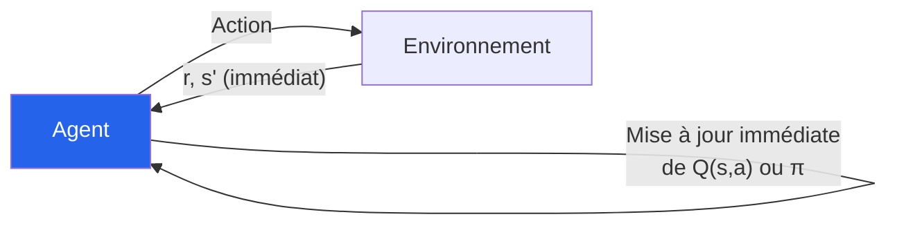
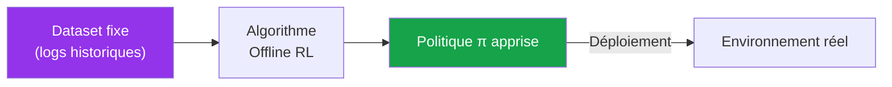
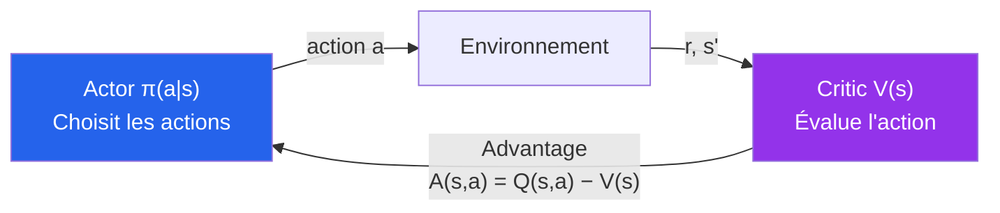
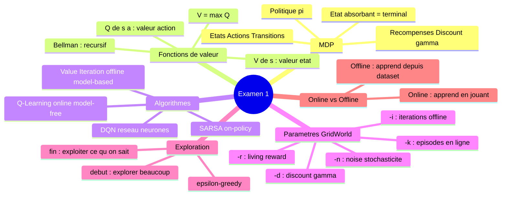

<a id="top"></a>

# Chapitre 15 - Révision 2 du Deuxième Quart du Cours


## Table des matières

| # | Section |
|---|---|
| 1 | [Révision — Online vs Offline Learning](#section-1) |
| 1a | &nbsp;&nbsp;&nbsp;↳ [Apprentissage en ligne](#section-1) |
| 1b | &nbsp;&nbsp;&nbsp;↳ [Apprentissage hors-ligne](#section-1) |
| 1c | &nbsp;&nbsp;&nbsp;↳ [Comparaison et quand utiliser chaque méthode](#section-1) |
| 2 | [Révision — Approches Value-Based, Policy-Based et Hybrides](#section-2) |
| 2a | &nbsp;&nbsp;&nbsp;↳ [Value-Based](#section-2) |
| 2b | &nbsp;&nbsp;&nbsp;↳ [Policy-Based](#section-2) |
| 2c | &nbsp;&nbsp;&nbsp;↳ [Actor-Critic](#section-2) |
| 2d | &nbsp;&nbsp;&nbsp;↳ [Comparaison et guide de choix](#section-2) |
| 3 | [Formatif style 1 — Exploration pratique avec GridWorld et Pacman](#section-3) |
| 3a | &nbsp;&nbsp;&nbsp;↳ [Objectif et environnement](#section-3) |
| 3b | &nbsp;&nbsp;&nbsp;↳ [Tableau d'expérimentation à compléter](#section-3) |
| 3c | &nbsp;&nbsp;&nbsp;↳ [Questions d'analyse](#section-3) |
| 4 | [Formatif style 2 — Examen théorique et pratique](#section-4) |
| 4a | &nbsp;&nbsp;&nbsp;↳ [Partie 0 — Flash questions (20 pts)](#section-4) |
| 4b | &nbsp;&nbsp;&nbsp;↳ [Partie A — Compréhension des paramètres (20 pts)](#section-4) |
| 4c | &nbsp;&nbsp;&nbsp;↳ [Partie B — Calculs (20 pts)](#section-4) |
| 4d | &nbsp;&nbsp;&nbsp;↳ [Partie C — Mini-expériences GridWorld (25 pts)](#section-4) |
| 4e | &nbsp;&nbsp;&nbsp;↳ [Partie D — Synthèse (15 pts)](#section-4) |
| 5 | [Corrigé — Parties 1 et 2 théoriques](#section-5) |
| 6 | [Synthèse visuelle — Ce qu'il faut absolument savoir](#section-6) |

---

## Équations de référence

<a id="eq-bellman-v"></a>

**Éq. (1)** — Value Iteration (Bellman Optimality)

$$V^{\ast}(s) = \max_a \sum_{s'} T(s,a,s')\left[R(s,a,s') + \gamma\, V^{\ast}(s')\right]$$

<a id="eq-qlearning"></a>

**Éq. (2)** — Mise à jour Q-Learning

$$Q(s,a) \leftarrow Q(s,a) + \alpha\left[r + \gamma \max_{a'} Q(s',a') - Q(s,a)\right]$$

---

<a id="section-1"></a>

<details>
<summary>1 — Révision — Online vs Offline Learning</summary>

---

### 1.1 — Apprentissage en ligne (Online Learning)

L'agent apprend **en temps réel**, en ajustant sa stratégie **après chaque interaction** avec l'environnement.



**Caractéristiques :**
- Mises à jour immédiates après chaque pas
- S'adapte si l'environnement change
- Exploration et exploitation **simultanées**
- Requiert un accès continu à l'environnement

**Exemples concrets :**
- Robot qui apprend à marcher en testant chaque mouvement en temps réel
- Système de recommandation YouTube/Netflix qui adapte ses suggestions au fil des clics

---

### 1.2 — Apprentissage hors-ligne (Offline Learning)

L'agent apprend depuis un **dataset pré-collecté**, sans interagir avec l'environnement pendant l'apprentissage.



**Caractéristiques :**
- Données fixes — pas de nouvelles interactions
- Moins d'exploration possible (limité au dataset)
- Utilisé quand les interactions réelles sont coûteuses ou dangereuses

**Exemples concrets :**
- Modèle de conduite autonome entraîné sur des vidéos (sans conduire réellement)
- Système de détection de fraude bancaire entraîné sur l'historique des transactions

---

### 1.3 — Comparaison complète

| Critère | Online | Offline |
|---|---|---|
| **Accès à l'environnement** | En temps réel | Non (dataset fixe) |
| **Mises à jour** | Immédiates | Différées (batch) |
| **Adaptabilité** | Très élevée | Faible |
| **Exploration** | Continue et active | Limitée au dataset |
| **Risque** | Peut échouer en production | Plus sûr à déployer |
| **Usages** | Jeux, robotique, systèmes dynamiques | Santé, finance, conduite |

---

### 1.4 — On-Policy vs Off-Policy (distinction liée)

| Aspect | On-Policy | Off-Policy |
|---|---|---|
| **Behavioral policy** | = Target policy | ≠ Target policy |
| **Exemples** | SARSA, PPO | Q-Learning, DQN |
| **Avantage** | Plus stable | Peut réutiliser les données passées |

> _Q-Learning est off-policy : il peut apprendre la politique optimale (greedy) même en explorant avec ε-greedy._

</details>

<p align="right"><a href="#top">↑ Retour en haut</a></p>

---

<a id="section-2"></a>

<details>
<summary>2 — Révision — Approches Value-Based, Policy-Based et Hybrides</summary>

---

### 2.1 — Value-Based

Apprend une **fonction de valeur** (V(s) ou Q(s,a)), puis dérive la politique.

| Algorithme | Description | Type |
|---|---|---|
| **Q-Learning** | Apprend Q(s,a) directement depuis les expériences | Off-policy |
| **SARSA** | Comme Q-Learning mais on-policy | On-policy |
| **DQN** | Q-Learning avec réseau de neurones | Off-policy |

**Avantages :**
- Convergence vers l'optimal garantie (sous conditions)
- Interprétable (on peut inspecter les valeurs Q)

**Limites :**
- Espace d'actions **discret uniquement**
- Table Q impraticable pour grands espaces d'états

---

### 2.2 — Policy-Based

Apprend directement **π(a|s)** — la politique — sans passer par une fonction de valeur.

| Algorithme | Description |
|---|---|
| **REINFORCE** | Monte Carlo Policy Gradient |
| **PPO** | Proximal Policy Optimization — standard moderne |
| **TRPO** | Contrainte mathématique stricte sur les mises à jour |

**Avantages :**
- Fonctionne avec des **espaces d'actions continus**
- Exploration naturelle (distributions de probabilité)

**Limites :**
- Variance élevée dans les estimations
- Peut converger vers des optima locaux

---

### 2.3 — Actor-Critic (hybride)

Combine une **fonction de valeur (Critic)** et une **politique (Actor)**.



**Exemples :** A2C, A3C, SAC, PPO (version Actor-Critic), TD3

---

### 2.4 — Guide de choix

| Situation | Méthode recommandée |
|---|---|
| Actions discrètes, environnement simple | Q-Learning, SARSA |
| Actions discrètes, grand espace d'états | DQN |
| Actions continues | PPO, SAC, DDPG |
| Environnement complexe non linéaire | Actor-Critic (A2C, TD3) |
| Transfert simulation → réel | SAC, PPO |

</details>

<p align="right"><a href="#top">↑ Retour en haut</a></p>

---

<a id="section-3"></a>

<details>
<summary>3 — Formatif style 1 — Exploration pratique avec GridWorld et Pacman</summary>

---

### Objectif

Se familiariser avec les agents RL du projet `pratique1`, les manipuler, comparer leurs comportements, et rédiger un rapport structuré.

**Référence :** [https://github.com/haythem-rehouma/RL.git](https://github.com/haythem-rehouma/RL.git)

---

### Exemple de départ

```bash
python pacman.py -p ValueIterationAgent -a iterations=100 -k 5 -l smallGrid
```

| Option | Signification |
|---|---|
| `-p ValueIterationAgent` | Agent basé sur l'itération de valeur |
| `-a iterations=100` | 100 mises à jour de la fonction de valeur |
| `-k 5` | 5 épisodes joués |
| `-l smallGrid` | Layout grille simple |

---

### Questions d'analyse obligatoires

**Q 3.1** — Quel agent avez-vous utilisé ? Décrivez son rôle en 1-2 phrases.

**Q 3.2** — Pour chaque paramètre utilisé, expliquez sa signification :
- `iterations = ?`
- `epsilon = ?`
- `alpha = ?`
- `gamma = ?`
- `--livingReward = ?`

**Q 3.3** — Votre agent utilise-t-il un apprentissage en ligne ou hors-ligne ? Justifiez.

**Q 3.4** — L'approche est-elle Value-Based, Policy-Based ou Actor-Critic ? Justifiez avec des exemples précis :
- Utilise-t-il Q(s,a) ou V(s) ?
- Cherche-t-il directement à optimiser π(a|s) ?
- Contient-il deux modules distincts (Actor + Critic) ?

**Q 3.5** — Pensez-vous que l'approche utilisée est adaptée ? Dans quels cas auriez-vous préféré un autre agent ?

---

### Tableau d'expérimentation à compléter

> Exécutez **chaque commande** et notez le comportement observé.

| # | Agent | Iterations | Epsilon | Alpha | Gamma | LivingReward | Comportement observé |
|---|---|---|---|---|---|---|---|
| 1 | `ValueIterationAgent` | 10 | — | — | 0.9 | 0 | _(à compléter)_ |
| 2 | `ValueIterationAgent` | 100 | — | — | 0.9 | 0 | _(à compléter)_ |
| 3 | `ValueIterationAgent` | 100 | — | — | 0.9 | -1 | _(à compléter)_ |
| 4 | `QLearningAgent` | — | 0.3 | 0.5 | 0.9 | 0 | _(à compléter)_ |
| 5 | `QLearningAgent` | — | 0.05 | 0.5 | 0.9 | 0 | _(à compléter)_ |
| 6 | `QLearningAgent` | — | 0.3 | 0.1 | 0.9 | 0 | _(à compléter)_ |
| 7 | `QLearningAgent` | — | 0.3 | 0.5 | 0.5 | 0 | _(à compléter)_ |
| 8 | `QLearningAgent` | — | 0.3 | 0.5 | 0.9 | -1 | _(à compléter)_ |
| 9 | `QLearningAgent` | — | 0.3 | 0.5 | 0.9 | +2 | _(à compléter)_ |

<details>
<summary>💡 Exemples de réponses attendues</summary>

| # | Comportement type attendu |
|---|---|
| 1 | Pacman hésite, tourne en rond — pas assez d'itérations pour converger |
| 2 | Pacman va directement à la nourriture — valeurs bien convergées |
| 3 | Pacman termine plus vite — pénalité de survie l'incite à agir rapidement |
| 4 | Exploration active — Pacman prend parfois des chemins inattendus |
| 5 | Peu d'exploration (ε faible) — Pacman reste dans le comportement appris |
| 6 | Apprentissage lent (α faible) — actions peu efficaces au début |
| 7 | Comportement myope (γ faible) — Pacman ne planifie pas à long terme |
| 8 | Cherche à finir vite pour éviter la pénalité constante |
| 9 | Prend des chemins plus longs, profite de la récompense de vivre |

</details>

---

### Format du rapport

```
1. Objectif : quel comportement vouliez-vous tester ou comparer ?
2. Liste des commandes exécutées avec explication de chaque paramètre
3. Réponses aux questions Q3.1 à Q3.5
4. Tableau d'observations complété (au moins 4 configurations)
5. Conclusion : ce que vous avez appris sur le RL
```

</details>

<p align="right"><a href="#top">↑ Retour en haut</a></p>

---

<a id="section-4"></a>

<details>
<summary>4 — Formatif style 2 — Examen théorique et pratique (100 pts)</summary>

---

### Partie 0 — Flash questions (20 pts)

Répondez par **Vrai/Faux** + 1 ligne de justification.

| # | Affirmation | V/F |
|---|---|---|
| 1 | Dans Value Iteration, `-i N` signifie N épisodes joués dans l'environnement | _(à répondre)_ |
| 2 | Q-Learning est un algorithme off-policy | _(à répondre)_ |
| 3 | γ = 0 signifie que l'agent ignore complètement les récompenses futures | _(à répondre)_ |
| 4 | SARSA utilise max Q(s',a') comme cible de mise à jour | _(à répondre)_ |
| 5 | Dans GridWorld, une livingReward négative pousse l'agent à se dépêcher | _(à répondre)_ |

<details>
<summary>💡 Corrigé Partie 0</summary>

| # | Réponse | Justification |
|---|---|---|
| 1 | **Faux** | `-i N` = N **itérations** de Value Iteration (mises à jour offline). `-k M` = M épisodes. |
| 2 | **Vrai** | Q-Learning apprend la politique optimale (greedy) même en explorant avec une autre politique (ε-greedy). |
| 3 | **Vrai** | Avec γ=0 : Q(s,a) ← r. L'agent optimise uniquement la récompense immédiate. |
| 4 | **Faux** | SARSA utilise Q(s', **a'**) où a' est l'action réellement choisie. C'est Q-Learning qui utilise max Q(s',a'). |
| 5 | **Vrai** | La livingReward pénalise chaque pas supplémentaire — l'agent veut atteindre +1 le plus vite possible. |

</details>

---

### Partie A — Compréhension des paramètres (20 pts)

**A1 (10 pts)** — Dans la commande suivante, expliquez le rôle de chaque paramètre :

```bash
python gridworld.py -a value -i 12 -k 2 --livingReward -0.2 --noise 0.2 -d 0.9
```

| Paramètre | Signification |
|---|---|
| `-a value` | _(à compléter)_ |
| `-i 12` | _(à compléter)_ |
| `-k 2` | _(à compléter)_ |
| `--livingReward -0.2` | _(à compléter)_ |
| `--noise 0.2` | _(à compléter)_ |
| `-d 0.9` | _(à compléter)_ |

<details>
<summary>💡 Corrigé A1</summary>

| Paramètre | Signification |
|---|---|
| `-a value` | Utilise l'algorithme Value Iteration pour calculer les valeurs des états |
| `-i 12` | Effectue 12 itérations de Value Iteration (mises à jour offline des valeurs) |
| `-k 2` | Lance 2 épisodes — l'agent suit la politique dérivée des valeurs calculées |
| `--livingReward -0.2` | Pénalité de -0.2 à chaque pas — incite l'agent à atteindre la récompense terminale rapidement |
| `--noise 0.2` | 20% de chance que l'action choisie dévie perpendiculairement (stochasticité) |
| `-d 0.9` | Facteur d'actualisation γ=0.9 — les récompenses lointaines valent 90% des récompenses immédiates |

</details>

**A2 (5 pts)** — Expliquez intuitivement pourquoi les valeurs V(s) ne sont pas nulles dès la 1ère itération seulement pour les cases adjacentes à +1 ou -1.

**A3 (5 pts)** — Donnez un exemple concret où augmenter γ de 0.5 à 0.9 **change la politique optimale** de l'agent.

---

### Partie B — Calculs (20 pts)

**Contexte :** BookGrid, livingReward = 0, γ = 0.9, noise = 0.2

Les issues stochastiques : direction choisie = 0.8, perpendiculaire gauche = 0.1, perpendiculaire droite = 0.1

**B1 (10 pts)** — Reproduire le calcul de la case **juste à gauche du +1** à k=2 :

> **(→ [Éq. 1](#eq-bellman-v))**

En visant Est : 80% → V(+1) = 1, Nord 10% → V = 0, Sud 10% → V = 0

```
Q_2(s, Est) = 0.8 × [0 + 0.9 × 1] + 0.1 × [0 + 0.9 × 0] + 0.1 × [0 + 0.9 × 0]
            = 0.8 × 0.9
            = 0.72
```

**V_2(s) = max_a Q_2(s,a) = 0.72**

**B2 (10 pts)** — Montrer pourquoi la case **une colonne plus à gauche** vaut ≈ **0.52** à k=3 :

En visant Est depuis cette case : 80% → case à 0.72, Nord 10% → V=0, Sud 10% → V=0

```
Q_3(s, Est) = 0.8 × [0 + 0.9 × 0.72] + 0.1 × 0 + 0.1 × 0
            = 0.8 × 0.648
            = 0.5184 ≈ 0.52
```

**V_3(s) ≈ 0.52**

---

### Partie C — Mini-expériences GridWorld (25 pts)

Pour chaque commande : fournir la commande exacte + capture/résultat + 2-3 lignes d'explication.

**C1 (10 pts) — Propagation des valeurs :**

```bash
python gridworld.py -a value -i 1 --text
python gridworld.py -a value -i 2 --text
python gridworld.py -a value -i 3 --text
```

Expliquer la **propagation** des valeurs depuis +1 et -1.

**C2 (5 pts) — Trajectoire après convergence :**

```bash
python gridworld.py -a value -i 12 -k 2 --text
```

Décrire la **trajectoire** suivie et son lien avec les valeurs V.

**C3 (10 pts) — Impact des paramètres :**

```bash
python gridworld.py -a value -i 12 -k 2 --livingReward -0.2 --text
python gridworld.py -a value -i 12 -k 2 --noise 0.0 --text
python gridworld.py -a value -i 12 -k 2 --noise 0.4 --text
```

Comparer qualitativement les trajectoires et expliquer **pourquoi**.

<details>
<summary>💡 Éléments de réponse attendus C3</summary>

| Commande | Comportement attendu |
|---|---|
| `--livingReward -0.2` | Trajectoire plus directe — l'agent pénalisé à chaque pas cherche le chemin le plus court |
| `--noise 0.0` | Trajectoire déterministe — l'agent va exactement là où il veut |
| `--noise 0.4` | Trajectoire plus prudente — l'agent évite les cases dangereuses car il risque de dévier vers -1 |

</details>

---

### Partie D — Synthèse (15 pts)

**D1 (8 pts)** — Proposer une **règle intuitive** décrivant la politique dans BookGrid avec noise=0.2 (4-6 lignes).

**D2 (7 pts)** — Prédire l'effet de `--livingReward +0.1` sur la politique en 3-5 lignes.

<details>
<summary>💡 Éléments de réponse D</summary>

**D1** — Avec noise=0.2, l'agent évite les cases adjacentes au -1 car il risque d'y tomber. Il préfère un chemin légèrement plus long mais plus sûr. La politique suit le "gradient" des valeurs V(s) — toujours vers la case voisine de plus haute valeur.

**D2** — Avec livingReward +0.1, chaque pas **rapporte** au lieu de coûter. L'agent n'est plus pressé d'atteindre +1 — il peut même faire des détours pour "profiter" de la récompense de survie. Avec une récompense de survie suffisamment élevée, il pourrait même éviter l'état terminal et rester en vie indéfiniment.

</details>

---

### Annexe — Commandes utiles de référence

```bash
# Value Iteration — calcul des valeurs uniquement
python gridworld.py -a value -i 12 --text

# Value Iteration + épisodes
python gridworld.py -a value -i 12 -k 2 --text

# Configuration complète BookGrid
python gridworld.py -a value -i 100 -k 10 -d 0.9 -r 0.0 -n 0.2 -g BookGrid --text

# Q-Learning
python gridworld.py -a q -k 50 -d 0.9 -l 0.5 -e 0.3 --text

# Voir la propagation pas à pas
python gridworld.py -a value -i 1 -v
python gridworld.py -a value -i 5 -v
python gridworld.py -a value -i 12 -v
```

</details>

<p align="right"><a href="#top">↑ Retour en haut</a></p>

---

<a id="section-5"></a>

<details>
<summary>5 — Corrigé — Concepts théoriques clés</summary>

---

### MDP — Définition

**Q : Qu'est-ce qu'un MDP ?**

Un MDP est un modèle mathématique pour la **prise de décision séquentielle**. Il comprend : états S, actions A, transitions P(s'|s,a), récompenses R, discount γ. L'objectif est de maximiser la récompense cumulée à long terme.

---

### Propriété de Markov

**Q : Qu'est-ce que la propriété de Markov ?**

Le futur dépend **uniquement de l'état présent**, pas de l'historique. Si on est dans l'état s, ce qui se passera ensuite est entièrement déterminé par s et l'action a — peu importe comment on est arrivé dans s.

---

### Exploration vs Exploitation

**Q : Différence entre exploration et exploitation ?**

- **Exploitation** : choisir l'action connue comme optimale — maximise les gains à court terme
- **Exploration** : essayer de nouvelles actions — peut découvrir de meilleures stratégies

La stratégie **ε-greedy** équilibre les deux : avec prob. ε → action aléatoire (exploration) ; avec prob. 1-ε → meilleure action connue (exploitation).

---

### Discount γ

**Q : Rôle du facteur de discount ?**

γ ∈ [0,1] pondère l'importance des récompenses futures.

| γ | Comportement | Analogie |
|---|---|---|
| 0 | Myope — ignore le futur | L'enfant qui veut le bonbon maintenant |
| 0.9 | Équilibre | L'investisseur qui planifie sur quelques mois |
| 1 | Horizon infini | Planification à très long terme |

---

### État absorbant

**Q : Qu'est-ce qu'un état absorbant ?**

Un état terminal où l'agent reste bloqué — peu importe l'action choisie. Ce sont les états de fin d'épisode (victoire, défaite). Ce sont les **cas de base** de la récursion Bellman — les valeurs se propagent **depuis** ces états vers l'arrière.

---

### V(s) vs Q(s,a)

**Q : Différence entre V(s) et Q(s,a) ?**

- **V(s)** : valeur globale d'un état = récompense espérée en partant de s sous politique π
- **Q(s,a)** : valeur d'une action spécifique dans un état = récompense espérée en faisant a depuis s

Relation : V*(s) = max_a Q*(s,a)

---

### Value Iteration

**Q : Comment fonctionne Value Iteration ?**

**(→ [Éq. 1](#eq-bellman-v))**

1. Initialiser V(s) = 0 pour tout s
2. Répéter jusqu'à convergence : pour chaque s, mettre à jour V(s) via Bellman
3. Extraire π*(s) = argmax_a Σ P(s'|s,a)[R + γV(s')]

La valeur se **propage depuis les états terminaux** vers les états de départ.

---

### Q-Learning vs Value Iteration

| Aspect | Value Iteration | Q-Learning |
|---|---|---|
| **Type** | Model-based (connaît P et R) | Model-free (apprend depuis les expériences) |
| **Stockage** | Table V(s) | Table Q(s,a) |
| **Apprentissage** | Offline (calcul mathématique) | Online (interactions avec l'environnement) |
| **Convergence** | Garantie avec calcul exact | Garantie si toutes les paires (s,a) visitées |

</details>

<p align="right"><a href="#top">↑ Retour en haut</a></p>

---

<a id="section-6"></a>

<details>
<summary>6 — Synthèse visuelle — Ce qu'il faut absolument savoir</summary>



### Checklist avant l'examen

- [ ] Je sais définir un MDP et ses 5 composantes
- [ ] Je comprends la différence entre V(s) et Q(s,a)
- [ ] Je peux appliquer l'équation de Bellman à la main pour 2-3 cases
- [ ] Je comprends la mise à jour Q-Learning et le rôle de α, γ, ε
- [ ] Je sais distinguer on-policy (SARSA) vs off-policy (Q-Learning)
- [ ] Je comprends la différence entre `-i` et `-k` dans GridWorld
- [ ] Je peux expliquer l'impact de `--livingReward`, `--noise`, `-d` sur le comportement
- [ ] Je sais quand utiliser Value-Based vs Policy-Based vs Actor-Critic

</details>

<p align="right"><a href="#top">↑ Retour en haut</a></p>

---

<p align="center">
  <em>Tous droits réservés. Toute reproduction, diffusion, utilisation ou adaptation de ce cours, en tout ou en partie, est strictement interdite sans l'autorisation écrite préalable de Dr. Haythem REHOUMA.</em>
</p>

<p align="center">
  <strong>Cours créé par Dr. Haythem REHOUMA — Apprentissage par Renforcement</strong>
</p>

<br/>

<p align="center">
  <a href="#top" style="display: inline-block; background: #2563eb; color: #ffffff; text-decoration: none; font-size: 1.1rem; font-weight: 700; padding: 14px 40px; border-radius: 10px;">
    ↑ Retour en haut du cours
  </a>
</p>
