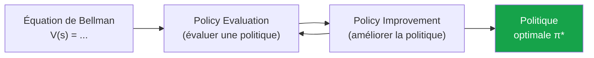
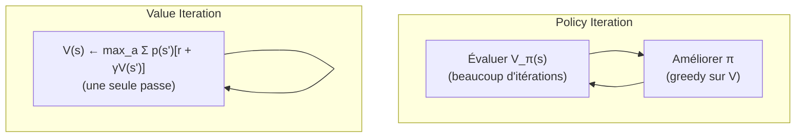
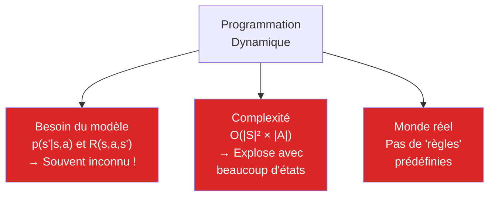
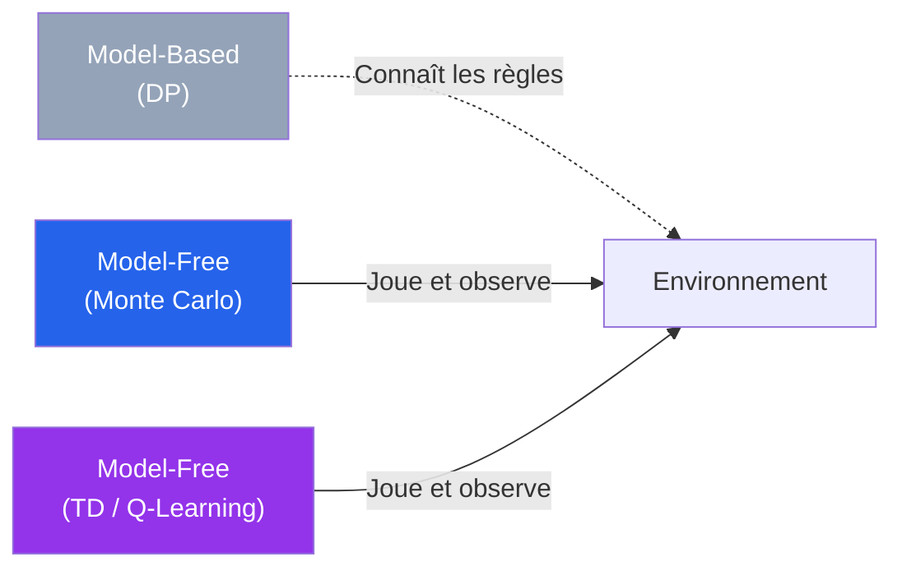
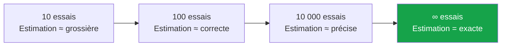
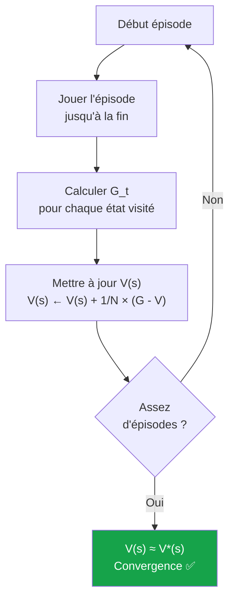
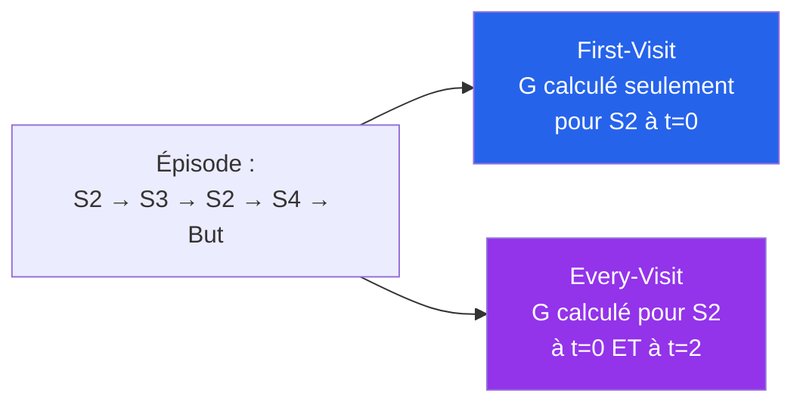
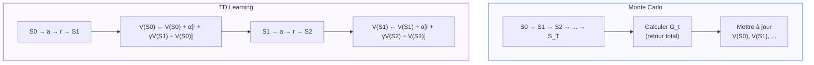
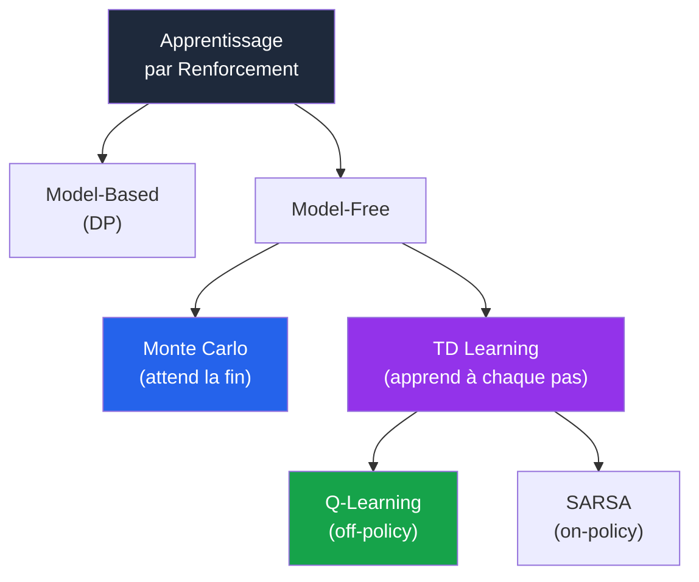
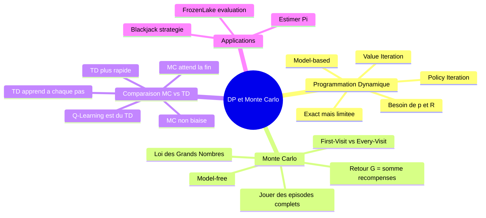

<a id="top"></a>

# Chapitre 16 — Programmation Dynamique et Méthodes Monte Carlo

## Table des matières

| # | Section |
|---|---|
| 1 | [Programmation Dynamique (DP) — Principes fondamentaux](#section-1) |
| 2 | [Limites de la DP et motivation pour Monte Carlo](#section-2) |
| 3 | [Méthodes Monte Carlo — Intuition et vulgarisation](#section-3) |
| 4 | [Exercice Colab 1 — Estimer π par Monte Carlo](#section-4) |
| 5 | [Monte Carlo en RL — Évaluation de politique](#section-5) |
| 6 | [First-Visit MC vs Every-Visit MC](#section-6) |
| 7 | [Monte Carlo vs TD (Temporal Difference)](#section-7) |
| 8 | [Exercice Colab 2 — Monte Carlo sur FrozenLake](#section-8) |
| 9 | [Exercice Colab 3 — Monte Carlo sur Blackjack](#section-9) |
| 10 | [Quiz de validation](#section-10) |
| 11 | [Synthèse](#section-11) |

---

## Équations de référence

<a id="eq-bellman-v"></a>

**Éq. (1)** — Équation de Bellman pour V(s)

$$V(s) = \sum_{a} \pi(a|s) \sum_{s',r} p(s',r|s,a)\left[r + \gamma\,V(s')\right]$$

<a id="eq-return"></a>

**Éq. (2)** — Retour (Return) d'un épisode

$$G_t = R_{t+1} + \gamma\,R_{t+2} + \gamma^2\,R_{t+3} + \dots = \sum_{k=0}^{\infty} \gamma^k\,R_{t+k+1}$$

<a id="eq-mc-update"></a>

**Éq. (3)** — Mise à jour Monte Carlo (moyenne incrémentale)

$$V(s) \leftarrow V(s) + \frac{1}{N(s)}\Big[G_t - V(s)\Big]$$

<a id="eq-mc-alpha"></a>

**Éq. (4)** — Mise à jour MC avec taux d'apprentissage α

$$V(s) \leftarrow V(s) + \alpha\Big[G_t - V(s)\Big]$$

<a id="eq-td-update"></a>

**Éq. (5)** — Mise à jour TD(0)

$$V(s) \leftarrow V(s) + \alpha\Big[r + \gamma\,V(s') - V(s)\Big]$$

---

<a id="section-1"></a>

<details>
<summary>1 — Programmation Dynamique (DP) — Principes fondamentaux</summary>

---

### 1.1 — Qu'est-ce que la Programmation Dynamique ?

La **Programmation Dynamique (DP)** est une famille de méthodes qui résolvent des problèmes en les décomposant en **sous-problèmes plus petits**, puis en combinant les solutions.

En RL, la DP utilise les **équations de Bellman** pour calculer de manière itérative la valeur optimale de chaque état.



### 1.2 — Ce dont la DP a besoin

Pour fonctionner, la DP nécessite un **modèle complet** de l'environnement :

| Élément | Notation | Description |
|---|---|---|
| Probabilités de transition | p(s'\|s,a) | Probabilité d'atterrir en s' si on fait a depuis s |
| Récompenses | R(s,a,s') | Récompense obtenue pour chaque transition |
| Facteur d'actualisation | γ | Poids des récompenses futures (0 < γ < 1) |

C'est une approche **model-based** : on connaît les règles du jeu à l'avance.

### 1.3 — Policy Evaluation (évaluation itérative)

On calcule V(s) pour chaque état en appliquant l'équation de Bellman **(→ [Éq. 1](#eq-bellman-v))** de manière répétée jusqu'à convergence :

```
Répéter jusqu'à convergence :
    Pour chaque état s :
        V(s) ← Σ_a π(a|s) × Σ_s' p(s'|s,a) × [r + γ × V(s')]
```

### 1.4 — Policy Iteration vs Value Iteration

| Méthode | Principe | Avantage |
|---|---|---|
| **Policy Iteration** | Alterner : évaluer π → améliorer π → évaluer → … | Converge en peu d'itérations |
| **Value Iteration** | Combiner évaluation et amélioration en une seule étape | Plus simple à implémenter |



### 1.5 — Exemple concret : GridWorld 4×4

Prenons une grille 4×4 où l'agent veut atteindre le coin bas-droit (+1). Récompense de -0.04 par pas.

**Après convergence de Value Iteration :**

```
┌──────┬──────┬──────┬──────┐
│ 0.81 │ 0.87 │ 0.92 │ 0.96 │
├──────┼──────┼──────┼──────┤
│ 0.76 │      │ 0.66 │ 0.54 │
├──────┼──────┼──────┼──────┤
│ 0.71 │ 0.66 │ 0.61 │ 0.38 │
├──────┼──────┼──────┼──────┤
│ 0.66 │ 0.61 │ 0.54 │ +1.0 │
└──────┴──────┴──────┴──────┘
```

La DP calcule ces valeurs **exactement**, mais elle a besoin de connaître p(s'|s,a) pour chaque case.

</details>

<p align="right"><a href="#top">↑ Retour en haut</a></p>

---

<a id="section-2"></a>

<details>
<summary>2 — Limites de la DP et motivation pour Monte Carlo</summary>

---

### 2.1 — Les 3 problèmes de la Programmation Dynamique



| Problème | Explication | Exemple |
|---|---|---|
| **Modèle requis** | Il faut connaître toutes les transitions et récompenses | Un robot dans une ville : on ne connaît pas la météo, le trafic, etc. |
| **Passage à l'échelle** | Calculer V(s) pour des millions d'états est très coûteux | Le jeu de Go a plus de 10^170 états possibles |
| **Monde réel** | Les règles ne sont pas toujours formalisables | Conduire une voiture, jouer à un jeu vidéo inconnu |

### 2.2 — La solution : les méthodes sans modèle

> Et si on pouvait apprendre **directement en essayant**, sans connaître les règles ?

C'est exactement ce que font les méthodes **model-free** :

| Approche | Modèle requis ? | Apprend comment ? |
|---|---|---|
| **Programmation Dynamique** | Oui (model-based) | En calculant avec les équations |
| **Monte Carlo** | Non (model-free) | En jouant des épisodes complets |
| **TD Learning / Q-Learning** | Non (model-free) | En apprenant à chaque pas |



</details>

<p align="right"><a href="#top">↑ Retour en haut</a></p>

---

<a id="section-3"></a>

<details>
<summary>3 — Méthodes Monte Carlo — Intuition et vulgarisation</summary>

---

### 3.1 — C'est quoi Monte Carlo ?

> **Monte Carlo, c'est la science du "je teste plein de fois et je regarde ce que ça donne".**

Le nom vient du célèbre **casino de Monte Carlo** à Monaco — la méthode repose sur le **hasard** et la **répétition**, comme les jeux de casino.

**Le principe en une phrase :** Au lieu de calculer une réponse exacte (souvent impossible), on **simule des milliers d'expériences aléatoires** et on fait la **moyenne** des résultats.

### 3.2 — Analogies pour comprendre

| Situation | Ce que tu fais | C'est du Monte Carlo ! |
|---|---|---|
| Estimer ta chance de rater le bus | Tu notes pendant 30 jours si tu arrives à temps | Fréquence observée → probabilité |
| Savoir si un restaurant est bon | Tu y manges 10 fois et tu notes la qualité | Moyenne des expériences → estimation |
| Deviner combien de bonbons dans un bocal | 1000 personnes devinent, tu fais la moyenne | Loi des Grands Nombres |
| Estimer la surface d'un lac sur une carte | Lancer des points au hasard, compter ceux dans l'eau | Ratio de points → ratio d'aires |

### 3.3 — Le fondement mathématique : la Loi des Grands Nombres

> Plus on répète une expérience aléatoire, plus la **moyenne observée** converge vers la **valeur vraie**.



### 3.4 — Pourquoi Monte Carlo est utile en RL ?

En RL, l'agent ne connaît pas les règles de l'environnement. Alors il fait comme toi quand tu découvres un jeu vidéo :

1. **Tu joues une partie complète** (un épisode)
2. **À la fin**, tu regardes ta récompense totale
3. **Tu ajustes ta stratégie** : les actions qui ont mené à de bonnes récompenses → tu les refais ; les mauvaises → tu les évites
4. **Tu rejoues** encore et encore

C'est exactement ce que fait la méthode Monte Carlo en RL :
- **Jouer des épisodes complets** (du début à la fin)
- **Calculer le retour** G_t **(→ [Éq. 2](#eq-return))** pour chaque état visité
- **Mettre à jour V(s)** en faisant la moyenne des retours observés **(→ [Éq. 3](#eq-mc-update))**

</details>

<p align="right"><a href="#top">↑ Retour en haut</a></p>

---

<a id="section-4"></a>

<details>
<summary>4 — Exercice Colab 1 — Estimer π par Monte Carlo</summary>

> **Ouvrir Google Colab :** [colab.research.google.com](https://colab.research.google.com)
> Créer un nouveau notebook et copier-coller chaque cellule dans l'ordre.

Avant d'appliquer Monte Carlo au RL, on va comprendre la méthode sur un **exemple classique** : estimer la valeur de π.

---

### Principe géométrique

On inscrit un cercle de rayon 1 dans un carré de côté 2 :

```
     ┌──────────────────┐
     │   ╭──────────╮   │  Carré : aire = 4
     │  ╱            ╲  │
     │ │   Cercle     │ │  Cercle : aire = π
     │ │   aire = π   │ │
     │  ╲            ╱  │  Ratio = π/4
     │   ╰──────────╯   │
     └──────────────────┘
```

Si on lance des points au hasard dans le carré :

$$\frac{\text{Points dans le cercle}}{\text{Points totaux}} \approx \frac{\pi}{4} \quad\Longrightarrow\quad \pi \approx 4 \times \frac{\text{Points dans le cercle}}{\text{Points totaux}}$$

---

### Cellule 1 — Estimation de π (version simple)

```python
import numpy as np
import matplotlib.pyplot as plt

np.random.seed(42)

N_POINTS = 5000

x = np.random.uniform(-1, 1, N_POINTS)
y = np.random.uniform(-1, 1, N_POINTS)

distances = np.sqrt(x**2 + y**2)
inside = distances <= 1.0

pi_estimate = 4 * np.sum(inside) / N_POINTS

# --- Visualisation ---
fig, ax = plt.subplots(figsize=(6, 6))
ax.scatter(x[inside],  y[inside],  s=1, c='blue', label='Dans le cercle')
ax.scatter(x[~inside], y[~inside], s=1, c='red',  label='Hors du cercle')

theta = np.linspace(0, 2*np.pi, 100)
ax.plot(np.cos(theta), np.sin(theta), 'g-', linewidth=2)

ax.set_xlim(-1.2, 1.2)
ax.set_ylim(-1.2, 1.2)
ax.set_aspect('equal')
ax.legend(loc='upper right')
ax.set_title(f"Estimation de π par Monte Carlo\n"
             f"{N_POINTS} points → π ≈ {pi_estimate:.4f} (vrai : {np.pi:.4f})")
ax.grid(True, alpha=0.3)
plt.tight_layout()
plt.show()

print(f"π estimé = {pi_estimate:.4f}")
print(f"π réel   = {np.pi:.4f}")
print(f"Erreur   = {abs(pi_estimate - np.pi):.4f}")
```

---

### Cellule 2 — Convergence de l'estimation

```python
def estimate_pi_progressive(n_points):
    """Estime π progressivement et retourne l'historique."""
    n_inside = 0
    estimates = []
    for i in range(1, n_points + 1):
        x = np.random.uniform(-1, 1)
        y = np.random.uniform(-1, 1)
        if x**2 + y**2 <= 1:
            n_inside += 1
        estimates.append(4 * n_inside / i)
    return estimates

N = 20000
estimates = estimate_pi_progressive(N)

fig, ax = plt.subplots(figsize=(12, 4))
ax.plot(estimates, alpha=0.6, color='steelblue', linewidth=0.5)
ax.axhline(y=np.pi, color='red', linestyle='--', linewidth=2, label=f'π = {np.pi:.4f}')
ax.set_xlabel("Nombre de points")
ax.set_ylabel("Estimation de π")
ax.set_title("Convergence de l'estimation de π — Loi des Grands Nombres")
ax.legend()
ax.grid(True, alpha=0.3)
ax.set_ylim(2.5, 4.0)
plt.tight_layout()
plt.show()

print(f"Après {N} points : π ≈ {estimates[-1]:.5f}")
print("→ Plus on augmente les points, plus on converge vers π ✅")
```

> **Observation :** Au début, l'estimation oscille beaucoup. Après des milliers de points, elle se **stabilise** autour de 3.14159. C'est la **Loi des Grands Nombres** en action.

---

### Cellule 3 — Effet du nombre de points

```python
sizes = [100, 500, 1000, 5000, 10000, 50000, 100000]
results = []

for n in sizes:
    x = np.random.uniform(-1, 1, n)
    y = np.random.uniform(-1, 1, n)
    pi_est = 4 * np.sum(x**2 + y**2 <= 1) / n
    error = abs(pi_est - np.pi)
    results.append((n, pi_est, error))
    print(f"  {n:>7d} points → π ≈ {pi_est:.5f}  (erreur = {error:.5f})")

print(f"\n→ L'erreur diminue quand le nombre de points augmente.")
print(f"→ C'est exactement le même principe en RL :")
print(f"   plus d'épisodes = meilleure estimation de V(s)")
```

</details>

<p align="right"><a href="#top">↑ Retour en haut</a></p>

---

<a id="section-5"></a>

<details>
<summary>5 — Monte Carlo en RL — Évaluation de politique</summary>

---

### 5.1 — Le passage de π (le nombre) à π (la politique)

On vient de voir que Monte Carlo estime π (le nombre) en **répétant des expériences**. En RL, on fait exactement pareil pour estimer **V(s)** — la valeur d'un état sous une politique π.

| Estimer π (nombre) | Estimer V(s) (RL) |
|---|---|
| Lancer des points au hasard | Jouer des épisodes complets |
| Compter les points dans le cercle | Calculer le retour G_t de chaque épisode |
| Moyenne des ratios → π | Moyenne des retours → V(s) |

### 5.2 — Le retour G_t (→ [Éq. 2](#eq-return))

Le **retour** est la récompense totale accumulée à partir du temps t, avec actualisation :

> G_t = R_{t+1} + γ × R_{t+2} + γ² × R_{t+3} + ...

**Exemple concret :** Un épisode de 4 pas avec γ = 0.9

| Temps | Action | Récompense |
|---|---|---|
| t=0 | droite | -1 |
| t=1 | bas | -1 |
| t=2 | droite | -1 |
| t=3 | but ! | +10 |

G_0 = -1 + 0.9×(-1) + 0.9²×(-1) + 0.9³×(10) = -1 - 0.9 - 0.81 + 7.29 = **4.58**

### 5.3 — L'algorithme Monte Carlo pour V(s)

```
Initialiser V(s) = 0 et N(s) = 0 pour tous les états s

Répéter (pour chaque épisode) :
    1. Générer un épisode complet : S0, A0, R1, S1, A1, R2, ..., S_T
    
    2. Calculer le retour G pour chaque pas (en partant de la fin) :
       G ← 0
       Pour t = T-1, T-2, ..., 0 :
           G ← R_{t+1} + γ × G
           
    3. Pour chaque état S_t visité :
           N(S_t) ← N(S_t) + 1
           V(S_t) ← V(S_t) + (1/N(S_t)) × [G_t - V(S_t)]
```



### 5.4 — Point clé : on attend la fin de l'épisode

> **Monte Carlo ne met à jour V(s) qu'une fois l'épisode terminé.**
> C'est sa caractéristique principale (et sa limitation — voir section 7).

C'est comme un étudiant qui ne regarde ses notes qu'**à la fin du semestre**, au lieu de vérifier après chaque examen.

</details>

<p align="right"><a href="#top">↑ Retour en haut</a></p>

---

<a id="section-6"></a>

<details>
<summary>6 — First-Visit MC vs Every-Visit MC</summary>

---

### 6.1 — Le problème des visites multiples

Dans un épisode, un même état peut être visité **plusieurs fois**. Comment calculer le retour ?

**Exemple :** l'épisode passe par S2 → S3 → S2 → S4 → But

L'état S2 est visité **deux fois** (à t=0 et t=2).

### 6.2 — Deux approches

| Méthode | Principe | Quand mettre à jour V(S2) ? |
|---|---|---|
| **First-Visit MC** | Ne compter que la **première** visite d'un état dans l'épisode | Seulement pour t=0 |
| **Every-Visit MC** | Compter **toutes** les visites | Pour t=0 et t=2 |



### 6.3 — Lequel choisir ?

| Critère | First-Visit | Every-Visit |
|---|---|---|
| Biais | Non biaisé | Légèrement biaisé |
| Variance | Plus élevée | Plus faible |
| Convergence | Garantie | Garantie |
| Simplicité | Simple | Simple |
| **Recommandé** | **Pour la plupart des cas** | Pour des environnements avec beaucoup de boucles |

> **En pratique**, First-Visit MC est le plus utilisé car il est simple et théoriquement non biaisé.

### 6.4 — Pseudocode First-Visit MC

```
Pour chaque épisode :
    Générer épisode complet : S0, A0, R1, S1, ...
    G ← 0
    Pour t = T-1 vers 0 :
        G ← γ × G + R_{t+1}
        Si S_t n'apparaît PAS dans S0, S1, ..., S_{t-1} :  ← FIRST VISIT
            N(S_t) ← N(S_t) + 1
            V(S_t) ← V(S_t) + (1/N(S_t)) × (G - V(S_t))
```

</details>

<p align="right"><a href="#top">↑ Retour en haut</a></p>

---

<a id="section-7"></a>

<details>
<summary>7 — Monte Carlo vs TD (Temporal Difference)</summary>

---

### 7.1 — La grande comparaison

> **Monte Carlo** = J'attends la fin de la partie pour apprendre.
> **TD Learning** = J'apprends après chaque action.

### 7.2 — Analogie Netflix

| Monte Carlo | TD Learning |
|---|---|
| Tu termines **toute la série** avant de décider si c'était bien | Après **5 minutes** d'un épisode, tu sais déjà si tu continues |
| Tu ajustes ton goût après la fin | Tu ajustes ton goût immédiatement |

### 7.3 — Comparaison technique

| Critère | Monte Carlo (MC) | TD Learning (TD) |
|---|---|---|
| **Quand met-on à jour ?** | Fin de l'épisode | Après chaque pas |
| **Formule** | V(s) ← V(s) + α[G_t − V(s)] | V(s) ← V(s) + α[r + γV(s') − V(s)] |
| **Utilise G_t (retour complet) ?** | Oui | Non (utilise r + γV(s')) |
| **Besoin d'épisodes terminaux ?** | Oui | Non |
| **Biais** | Non biaisé | Biaisé (bootstrap) |
| **Variance** | Élevée | Plus faible |
| **Vitesse d'apprentissage** | Lent (attend la fin) | Rapide (chaque pas) |

### 7.4 — Illustration visuelle



### 7.5 — Quand utiliser quoi ?

| Situation | Méthode recommandée |
|---|---|
| Épisodes courts et bien définis (Blackjack, FrozenLake) | **Monte Carlo** |
| Épisodes longs ou sans fin (jeu continu, robot) | **TD Learning** |
| On veut des estimations non biaisées | **Monte Carlo** |
| On veut apprendre rapidement | **TD Learning** |
| On veut combiner les deux | **TD(λ)** — compromis MC/TD |

### 7.6 — Positionnement dans la famille RL



</details>

<p align="right"><a href="#top">↑ Retour en haut</a></p>

---

<a id="section-8"></a>

<details>
<summary>8 — Exercice Colab 2 — Monte Carlo sur FrozenLake</summary>

> **Ouvrir Google Colab :** [colab.research.google.com](https://colab.research.google.com)
> Créer un nouveau notebook et copier-coller chaque cellule dans l'ordre.

---

### Cellule 4 — Installation et découverte de FrozenLake

```python
!pip install gymnasium[toy_text] -q

import gymnasium as gym
import numpy as np
import matplotlib.pyplot as plt
from collections import defaultdict

print("✅ Installation terminée")

env = gym.make("FrozenLake-v1", is_slippery=False, render_mode="ansi")
obs, _ = env.reset()

print("\n=== FrozenLake 4×4 ===")
print(f"États  : {env.observation_space.n}")
print(f"Actions: {env.action_space.n} (0=←, 1=↓, 2=→, 3=↑)")
print()
print("Grille :")
print("  S F F F    S = Départ")
print("  F H F H    F = Gelé (sûr)")
print("  F F F H    H = Trou (fin, r=0)")
print("  H F F G    G = But (fin, r=1)")
print()
env_vis = gym.make("FrozenLake-v1", is_slippery=False, render_mode="ansi")
env_vis.reset()
print(env_vis.render())
env_vis.close()
```

---

### Cellule 5 — Générer un épisode

```python
def generate_episode(env, policy, max_steps=100):
    """Joue un épisode complet et retourne la trajectoire."""
    episode = []
    state, _ = env.reset()

    for _ in range(max_steps):
        action = policy(state)
        next_state, reward, terminated, truncated, _ = env.step(action)
        episode.append((state, action, reward))
        state = next_state
        if terminated or truncated:
            break

    return episode

def random_policy(state):
    """Politique aléatoire : chaque action a la même probabilité."""
    return np.random.randint(4)

# Test : générer un épisode avec politique aléatoire
env_test = gym.make("FrozenLake-v1", is_slippery=False)
episode = generate_episode(env_test, random_policy)
print("Épisode généré :")
for i, (s, a, r) in enumerate(episode):
    actions = ["←", "↓", "→", "↑"]
    print(f"  t={i} : état={s:2d}, action={actions[a]}, récompense={r}")
print(f"  Longueur : {len(episode)} pas")
env_test.close()
```

---

### Cellule 6 — First-Visit Monte Carlo pour V(s)

```python
def first_visit_mc(env, policy, n_episodes=10000, gamma=0.99):
    """First-Visit Monte Carlo : estime V(s) pour la politique donnée."""
    V = defaultdict(float)
    N = defaultdict(int)
    rewards_history = []

    for ep in range(n_episodes):
        episode = generate_episode(env, policy)

        G = 0
        visited = set()
        total_reward = sum(r for _, _, r in episode)

        for t in range(len(episode) - 1, -1, -1):
            state, action, reward = episode[t]
            G = gamma * G + reward

            if state not in visited:
                visited.add(state)
                N[state] += 1
                V[state] += (G - V[state]) / N[state]

        rewards_history.append(total_reward)

        if (ep + 1) % 2000 == 0:
            avg = np.mean(rewards_history[-2000:])
            print(f"Épisode {ep+1:5d} | Taux de succès (2000 derniers) = {avg*100:.1f}%")

    return dict(V), rewards_history

env_mc = gym.make("FrozenLake-v1", is_slippery=False)
print("=== First-Visit MC — Politique aléatoire ===\n")
V_random, rewards = first_visit_mc(env_mc, random_policy, n_episodes=10000, gamma=0.99)
env_mc.close()

print(f"\nTaux de succès global : {np.mean(rewards)*100:.1f}%")
```

---

### Cellule 7 — Visualiser V(s) sur la grille

```python
grid_map = ["S", "F", "F", "F",
            "F", "H", "F", "H",
            "F", "F", "F", "H",
            "H", "F", "F", "G"]

v_grid = np.zeros((4, 4))
for s in range(16):
    v_grid[s // 4, s % 4] = V_random.get(s, 0.0)

fig, ax = plt.subplots(figsize=(6, 6))
im = ax.imshow(v_grid, cmap='RdYlGn', vmin=0)
plt.colorbar(im, ax=ax, label="V(s)")

for i in range(4):
    for j in range(4):
        s = i * 4 + j
        label = grid_map[s]
        val = V_random.get(s, 0.0)
        if label in ["H", "G"]:
            ax.text(j, i, f"{label}", ha='center', va='center',
                   fontsize=14, fontweight='bold')
        else:
            ax.text(j, i, f"{val:.3f}", ha='center', va='center', fontsize=10)

ax.set_title("V(s) estimé par First-Visit MC\n(politique aléatoire)")
ax.set_xticks(range(4))
ax.set_yticks(range(4))
plt.tight_layout()
plt.show()

print("→ Les cases proches du but (G) ont une valeur plus élevée")
print("→ Les cases proches des trous (H) ont une valeur plus faible")
```

---

### Cellule 8 — MC avec politique semi-optimale

```python
def semi_optimal_policy(state):
    """Politique construite à la main : essaie d'aller vers le but G=(3,3)."""
    row, col = state // 4, state % 4
    if col < 3:
        return 2
    else:
        return 1

env_mc2 = gym.make("FrozenLake-v1", is_slippery=False)
print("=== First-Visit MC — Politique semi-optimale ===\n")
V_semi, rewards_semi = first_visit_mc(env_mc2, semi_optimal_policy,
                                       n_episodes=5000, gamma=0.99)
env_mc2.close()

print(f"\nTaux de succès : {np.mean(rewards_semi)*100:.1f}%")

# Comparaison
fig, axes = plt.subplots(1, 2, figsize=(12, 5))
for ax, V, title in [(axes[0], V_random, "Politique aléatoire"),
                       (axes[1], V_semi, "Politique semi-optimale")]:
    v_grid = np.zeros((4, 4))
    for s in range(16):
        v_grid[s // 4, s % 4] = V.get(s, 0.0)
    im = ax.imshow(v_grid, cmap='RdYlGn', vmin=0, vmax=1)
    for i in range(4):
        for j in range(4):
            s = i * 4 + j
            if grid_map[s] in ["H", "G"]:
                ax.text(j, i, grid_map[s], ha='center', va='center',
                       fontsize=14, fontweight='bold')
            else:
                ax.text(j, i, f"{V.get(s, 0):.3f}", ha='center', va='center', fontsize=9)
    ax.set_title(title)
    ax.set_xticks(range(4))
    ax.set_yticks(range(4))

plt.colorbar(im, ax=axes, label="V(s)")
plt.suptitle("Comparaison V(s) — Monte Carlo", fontsize=13, fontweight='bold')
plt.tight_layout()
plt.show()

print("\n→ La politique semi-optimale a des V(s) beaucoup plus élevés")
print("→ Monte Carlo évalue correctement : bonne politique = bonnes valeurs")
```

</details>

<p align="right"><a href="#top">↑ Retour en haut</a></p>

---

<a id="section-9"></a>

<details>
<summary>9 — Exercice Colab 3 — Monte Carlo sur Blackjack</summary>

> Le Blackjack est l'exemple classique de Monte Carlo en RL — épisodes courts, résultat clair (gagné/perdu), environnement stochastique.

---

### Rappel des règles du Blackjack

| Élément | Description |
|---|---|
| **But** | Avoir une main proche de 21 sans dépasser |
| **Cartes** | 2-10 = valeur nominale, Figures = 10, As = 1 ou 11 |
| **Actions** | **Hit** (tirer une carte) ou **Stand** (rester) |
| **Adversaire** | Le croupier (pas les autres joueurs) |
| **Victoire** | Main > croupier ET ≤ 21, ou croupier > 21 |

---

### Cellule 9 — Découverte de l'environnement Blackjack

```python
env_bj = gym.make("Blackjack-v1", render_mode=None)
obs, _ = env_bj.reset()

print("=== Environnement Blackjack-v1 ===")
print(f"Observation : {obs}")
print(f"  → Somme du joueur : {obs[0]}")
print(f"  → Carte visible du croupier : {obs[1]}")
print(f"  → As utilisable (=11) ? : {obs[2]}")
print(f"Actions : 0=Stand (rester), 1=Hit (tirer)")

print("\n--- 5 épisodes de démonstration ---")
for i in range(5):
    obs, _ = env_bj.reset()
    done = False
    actions_taken = []
    while not done:
        action = 1 if obs[0] < 17 else 0
        actions_taken.append("Hit" if action == 1 else "Stand")
        obs, reward, terminated, truncated, _ = env_bj.step(action)
        done = terminated or truncated
    result = "Victoire" if reward > 0 else ("Nul" if reward == 0 else "Défaite")
    print(f"  Partie {i+1}: main finale={obs[0]:2d}, "
          f"actions={actions_taken}, résultat={result} (r={reward})")
env_bj.close()
```

---

### Cellule 10 — MC First-Visit sur Blackjack

```python
def simple_policy(obs):
    """Politique simple : tirer si somme < 18, sinon rester."""
    return 1 if obs[0] < 18 else 0

def mc_blackjack(env, policy, n_episodes=100000, gamma=1.0):
    """First-Visit MC pour estimer V(s) dans Blackjack."""
    V = defaultdict(float)
    N = defaultdict(int)
    wins = 0

    for ep in range(n_episodes):
        episode = []
        obs, _ = env.reset()
        done = False

        while not done:
            action = policy(obs)
            next_obs, reward, terminated, truncated, _ = env.step(action)
            episode.append((obs, action, reward))
            obs = next_obs
            done = terminated or truncated

        if reward > 0:
            wins += 1

        G = 0
        visited = set()
        for t in range(len(episode) - 1, -1, -1):
            state, action, reward = episode[t]
            G = gamma * G + reward
            if state not in visited:
                visited.add(state)
                N[state] += 1
                V[state] += (G - V[state]) / N[state]

        if (ep + 1) % 20000 == 0:
            print(f"Épisode {ep+1:6d} | Taux victoire = {wins/(ep+1)*100:.1f}%")

    return dict(V), wins / n_episodes

env_bj = gym.make("Blackjack-v1")
print("=== MC First-Visit sur Blackjack (100 000 épisodes) ===\n")
V_bj, win_rate = mc_blackjack(env_bj, simple_policy, n_episodes=100000)
env_bj.close()

print(f"\nTaux de victoire final : {win_rate*100:.1f}%")
print(f"Nombre d'états découverts : {len(V_bj)}")
```

---

### Cellule 11 — Visualiser la fonction de valeur du Blackjack

```python
def plot_blackjack_values(V, title, usable_ace):
    """Heatmap de V(s) pour le Blackjack."""
    player_range = range(12, 22)
    dealer_range = range(1, 11)
    values = np.zeros((len(player_range), len(dealer_range)))

    for i, player in enumerate(player_range):
        for j, dealer in enumerate(dealer_range):
            state = (player, dealer, usable_ace)
            values[i, j] = V.get(state, 0.0)

    fig, ax = plt.subplots(figsize=(8, 6))
    im = ax.imshow(values, cmap='RdYlGn', aspect='auto',
                   extent=[0.5, 10.5, 21.5, 11.5])
    plt.colorbar(im, ax=ax, label="V(s)")
    ax.set_xlabel("Carte visible du croupier")
    ax.set_ylabel("Somme du joueur")
    ax.set_title(title)
    ax.set_xticks(range(1, 11))
    ax.set_yticks(range(12, 22))
    plt.tight_layout()
    plt.show()

plot_blackjack_values(V_bj, "V(s) Blackjack — Sans as utilisable", usable_ace=False)
plot_blackjack_values(V_bj, "V(s) Blackjack — Avec as utilisable", usable_ace=True)

print("Lecture des heatmaps :")
print("  → Vert = états favorables (le joueur a tendance à gagner)")
print("  → Rouge = états défavorables (le joueur a tendance à perdre)")
print("  → Quand le joueur a 20-21, V(s) est élevé (logique !)")
print("  → Quand le croupier montre un As (10), c'est dangereux pour le joueur")
```

---

### Cellule 12 — Comparer deux politiques

```python
def conservative_policy(obs):
    """Politique prudente : rester dès 15."""
    return 1 if obs[0] < 15 else 0

def aggressive_policy(obs):
    """Politique agressive : tirer jusqu'à 19."""
    return 1 if obs[0] < 19 else 0

policies = {
    "Prudente (< 15)": conservative_policy,
    "Standard (< 18)": simple_policy,
    "Agressive (< 19)": aggressive_policy,
}

print("=== Comparaison de 3 politiques (50 000 épisodes chacune) ===\n")
for name, policy in policies.items():
    env_cmp = gym.make("Blackjack-v1")
    _, win_rate = mc_blackjack(env_cmp, policy, n_episodes=50000)
    env_cmp.close()
    print(f"  {name:25s} → Victoire = {win_rate*100:.1f}%\n")

print("→ Monte Carlo permet de COMPARER des politiques empiriquement")
print("→ La meilleure politique est celle avec le meilleur taux de victoire")
```

</details>

<p align="right"><a href="#top">↑ Retour en haut</a></p>

---

<a id="section-10"></a>

<details>
<summary>10 — Quiz de validation</summary>

---

**Question 1 :** Quel est le principal avantage de Monte Carlo par rapport à la Programmation Dynamique ?

a) MC est toujours plus rapide
b) MC ne nécessite pas de connaître le modèle de l'environnement (p(s'|s,a))
c) MC converge toujours en moins d'épisodes
d) MC fonctionne sans récompenses

<details>
<summary>💡 Solution</summary>

**b)** Monte Carlo est **model-free** : l'agent apprend en jouant des épisodes, sans connaître les probabilités de transition ni les récompenses à l'avance. C'est son avantage principal sur la DP.

</details>

---

**Question 2 :** Quelle est la différence entre First-Visit MC et Every-Visit MC ?

a) First-Visit utilise γ, Every-Visit non
b) First-Visit ne compte que la première visite d'un état dans un épisode
c) Every-Visit ne fonctionne que pour les épisodes courts
d) Il n'y a aucune différence

<details>
<summary>💡 Solution</summary>

**b)** First-Visit MC ne met à jour V(s) que pour la **première fois** qu'un état s est visité dans un épisode. Every-Visit met à jour pour **chaque** visite de s dans l'épisode.

</details>

---

**Question 3 :** Monte Carlo met à jour V(s) :

a) Après chaque action
b) Après chaque épisode complet
c) Après chaque récompense positive
d) Seulement si l'agent gagne

<details>
<summary>💡 Solution</summary>

**b)** Monte Carlo attend la **fin de l'épisode** pour calculer le retour G_t et mettre à jour V(s). C'est ce qui le distingue de TD Learning, qui met à jour après chaque pas.

</details>

---

**Question 4 :** Dans l'estimation de π par Monte Carlo avec 100 points, on obtient π ≈ 3.08. Avec 100 000 points, on obtient π ≈ 3.1412. Quel principe mathématique explique cette amélioration ?

a) Le théorème de Bayes
b) La Loi des Grands Nombres
c) Le gradient descent
d) L'équation de Bellman

<details>
<summary>💡 Solution</summary>

**b)** La **Loi des Grands Nombres** garantit que la moyenne d'un grand nombre d'expériences aléatoires converge vers la valeur espérée. Plus on lance de points, plus le ratio converge vers π/4.

</details>

---

**Question 5 :** TD Learning est souvent préféré à Monte Carlo quand :

a) Les épisodes sont très courts
b) On veut des estimations non biaisées
c) Les épisodes sont très longs ou n'ont pas de fin définie
d) On a accès au modèle complet de l'environnement

<details>
<summary>💡 Solution</summary>

**c)** TD Learning apprend **à chaque pas**, sans attendre la fin de l'épisode. C'est crucial quand les épisodes sont longs (un robot qui fonctionne en continu) ou n'ont pas de fin naturelle.

</details>

---

**Question 6 :** Dans l'exercice Blackjack, un épisode de 3 pas donne les récompenses : R1 = 0, R2 = 0, R3 = +1 (victoire). Avec γ = 1, quel est le retour G_0 ?

a) 0
b) 1
c) 3
d) γ²

<details>
<summary>💡 Solution</summary>

**b)** G_0 = R_1 + γ×R_2 + γ²×R_3 = 0 + 1×0 + 1²×1 = **1**. Avec γ = 1, le retour est simplement la somme des récompenses.

</details>

---

**Question 7 :** Dans le diagramme de la famille RL, où se situe Q-Learning ?

a) Model-Based → Programmation Dynamique
b) Model-Free → Monte Carlo
c) Model-Free → TD Learning → Off-Policy
d) Model-Free → TD Learning → On-Policy

<details>
<summary>💡 Solution</summary>

**c)** Q-Learning est un algorithme **model-free**, de la famille **TD Learning** (apprend à chaque pas), et **off-policy** (la politique d'exploration ≠ politique apprise).

</details>

</details>

<p align="right"><a href="#top">↑ Retour en haut</a></p>

---

<a id="section-11"></a>

<details>
<summary>11 — Synthèse</summary>



### Ce que vous avez appris

| Compétence | Description |
|---|---|
| Comprendre la DP | Principes, Policy Iteration, Value Iteration, limites |
| Comprendre Monte Carlo | Intuition, Loi des Grands Nombres, retour G_t |
| Estimer π | Application classique de MC (exercice Colab) |
| First-Visit MC | Évaluer V(s) pour une politique donnée |
| FrozenLake avec MC | Comparer V(s) sous différentes politiques |
| Blackjack avec MC | Estimer V(s) et comparer des stratégies |
| MC vs TD | Savoir quand utiliser l'un ou l'autre |
| Famille RL | Positionner DP, MC, TD, Q-Learning, SARSA |

### Résumé en 5 points

1. **La DP** calcule V(s) exactement mais nécessite un modèle complet → rarement disponible en pratique.

2. **Monte Carlo** apprend V(s) en jouant des épisodes complets et en calculant la moyenne des retours → **model-free**.

3. **La Loi des Grands Nombres** garantit que plus on joue d'épisodes, plus l'estimation de V(s) est précise.

4. **First-Visit MC** est le plus courant : on ne compte que la première visite d'un état par épisode.

5. **TD Learning** (dont Q-Learning) est plus rapide car il apprend à chaque pas, mais MC reste utile pour les épisodes courts et quand on veut des estimations non biaisées.

</details>

<p align="right"><a href="#top">↑ Retour en haut</a></p>

---

<p align="center">
  <em>Tous droits réservés. Toute reproduction, diffusion, utilisation ou adaptation de ce cours, en tout ou en partie, est strictement interdite sans l'autorisation écrite préalable de Dr. Haythem REHOUMA.</em>
</p>

<p align="center">
  <strong>Cours créé par Dr. Haythem REHOUMA — Apprentissage par Renforcement</strong>
</p>

<br/>

<p align="center">
  <a href="#top" style="display: inline-block; background: #2563eb; color: #ffffff; text-decoration: none; font-size: 1.1rem; font-weight: 700; padding: 14px 40px; border-radius: 10px;">
    ↑ Retour en haut du cours
  </a>
</p>
