<a id="top"></a>

# TD-Learning — Théorie, Équations, TD(n) vs TD(λ), SARSA et Q-Learning

## Table des matières

| # | Section |
|---|---|
| 1 | [Pourquoi le TD-Learning ?](#section-1) |
| 1a | &nbsp;&nbsp;&nbsp;↳ [Limites de Monte Carlo](#section-1) |
| 1b | &nbsp;&nbsp;&nbsp;↳ [Idée centrale : apprendre au fil de l'expérience](#section-1) |
| 1c | &nbsp;&nbsp;&nbsp;↳ [Analogies de la vie courante](#section-1) |
| 2 | [Concepts clés et notations](#section-2) |
| 2a | &nbsp;&nbsp;&nbsp;↳ [V(s), Q(s,a), α, γ, bootstrap](#section-2) |
| 2b | &nbsp;&nbsp;&nbsp;↳ [Erreur TD (Temporal Difference Error)](#section-2) |
| 3 | [TD(0) — Mise à jour à un pas](#section-3) |
| 3a | &nbsp;&nbsp;&nbsp;↳ [Équation et intuition](#section-3) |
| 3b | &nbsp;&nbsp;&nbsp;↳ [Forme « mélange » avec (1−α)](#section-3) |
| 4 | [TD(n) — Mises à jour à n pas](#section-4) |
| 4a | &nbsp;&nbsp;&nbsp;↳ [TD(1), TD(2), TD(3), …, TD(n)](#section-4) |
| 4b | &nbsp;&nbsp;&nbsp;↳ [Compromis biais ↔ variance](#section-4) |
| 5 | [Attention — TD(n) **n'est pas** TD(λ)](#section-5) |
| 5a | &nbsp;&nbsp;&nbsp;↳ [n entier vs λ ∈ [0,1]](#section-5) |
| 5b | &nbsp;&nbsp;&nbsp;↳ [Tableau de comparaison](#section-5) |
| 6 | [TD(λ) — combinaison pondérée d'horizons](#section-6) |
| 6a | &nbsp;&nbsp;&nbsp;↳ [Analogie de l'employé (jour +1, +2, +3, …)](#section-6) |
| 6b | &nbsp;&nbsp;&nbsp;↳ [Analogie alimentaire — la semaine saine et le McDo](#section-6) |
| 6c | &nbsp;&nbsp;&nbsp;↳ [Cas limites λ = 0 et λ → 1](#section-6) |
| 6d | &nbsp;&nbsp;&nbsp;↳ [Comment choisir la valeur de λ ?](#section-6) |
| 7 | [De TD vers le contrôle — SARSA et Q-Learning](#section-7) |
| 7a | &nbsp;&nbsp;&nbsp;↳ [Pourquoi passer de V(s) à Q(s,a) ?](#section-7) |
| 7b | &nbsp;&nbsp;&nbsp;↳ [SARSA — décomposition de l'acronyme et intuition](#section-7) |
| 7c | &nbsp;&nbsp;&nbsp;↳ [SARSA — pseudo-code complet](#section-7) |
| 7d | &nbsp;&nbsp;&nbsp;↳ [SARSA — exemple numérique pas à pas](#section-7) |
| 7e | &nbsp;&nbsp;&nbsp;↳ [SARSA vs TD(0) — quelle parenté ?](#section-7) |
| 7f | &nbsp;&nbsp;&nbsp;↳ [Q-Learning (off-policy)](#section-7) |
| 7g | &nbsp;&nbsp;&nbsp;↳ [SARSA vs Q-Learning — l'exemple Cliff Walking](#section-7) |
| 7h | &nbsp;&nbsp;&nbsp;↳ [Tableau récapitulatif](#section-7) |
| 8 | [Bellman — fondement théorique du TD](#section-8) |
| 8a | &nbsp;&nbsp;&nbsp;↳ [Bellman pour V et Q sous une politique π](#section-8) |
| 8b | &nbsp;&nbsp;&nbsp;↳ [Bellman optimalité — V★(s) et Q★(s,a)](#section-8) |
| 8c | &nbsp;&nbsp;&nbsp;↳ [Lien avec TD et Q-Learning](#section-8) |
| 9 | [Exemples numériques pas à pas](#section-9) |
| 9a | &nbsp;&nbsp;&nbsp;↳ [Exemple 1 — TD(0) avec récompense](#section-9) |
| 9b | &nbsp;&nbsp;&nbsp;↳ [Exemple 2 — Bootstrap TD(1) vs Monte Carlo](#section-9) |
| 9c | &nbsp;&nbsp;&nbsp;↳ [Exemple 3 — Q-Learning](#section-9) |
| 10 | [Note pédagogique — la convention TD(0) « bootstrap pur »](#section-10) |
| 11 | [Model-based vs Model-free](#section-11) |
| 12 | [Applications industrielles](#section-12) |
| 12a | &nbsp;&nbsp;&nbsp;↳ [Détection de fraude bancaire](#section-12) |
| 12b | &nbsp;&nbsp;&nbsp;↳ [Cybersécurité (IDS/IPS, SIEM, forensic)](#section-12) |
| 12c | &nbsp;&nbsp;&nbsp;↳ [Data centers, trading, robotique, recommandation](#section-12) |
| 12d | &nbsp;&nbsp;&nbsp;↳ [Le rôle de SARSA — politiques prudentes](#section-12) |
| 13 | [Exemples de la vie quotidienne](#section-13) |
| 14 | [Quiz 1 — TD(0) et TD(n)](#section-14) |
| 15 | [Quiz 2 — TD(λ), SARSA / Q-Learning et applications](#section-15) |
| 16 | [Travail à réaliser — Activité TP](#section-16) |
| 17 | [Synthèse du chapitre](#section-17) |

---

## Équations de référence

> _Pour chaque méthode TD, on donne **les deux formes équivalentes** :_
> _- **Forme « erreur TD »** : $\text{ancien} + \alpha \times (\text{cible} - \text{ancien})$_
> _- **Forme « mélange pondéré »** $(1-\alpha)$ : $(1-\alpha)\cdot \text{ancien} + \alpha\cdot \text{cible}$_
> _Les deux donnent **exactement le même résultat numérique** ; la seconde rend explicite la part « ancien savoir » conservée._

---

<a id="eq-td0"></a>

**Éq. (1)** — TD(0) — mise à jour à un pas

**(1a) Forme « erreur TD » :**

$$V(S_t) \leftarrow V(S_t) + \alpha \left[ R_{t+1} + \gamma\, V(S_{t+1}) - V(S_t) \right]$$

**(1b) Forme « mélange pondéré » $(1-\alpha)$ :**

$$V(S_t) \leftarrow (1-\alpha)\, V(S_t) + \alpha \left[ R_{t+1} + \gamma\, V(S_{t+1}) \right]$$

---

<a id="eq-tdn"></a>

**Éq. (2)** — TD(n) — mise à jour à n pas

**(2a) Forme « erreur TD » :**

$$V(S_t) \leftarrow V(S_t) + \alpha \left[ \sum_{k=1}^{n} \gamma^{k-1}\, R_{t+k} + \gamma^{n}\, V(S_{t+n}) - V(S_t) \right]$$

**(2b) Forme « mélange pondéré » $(1-\alpha)$ :**

$$V(S_t) \leftarrow (1-\alpha)\, V(S_t) + \alpha \left[ \sum_{k=1}^{n} \gamma^{k-1}\, R_{t+k} + \gamma^{n}\, V(S_{t+n}) \right]$$

---

<a id="eq-tdlambda"></a>

**Éq. (3)** — TD(λ) — combinaison pondérée des retours à n pas (forward view)

Cible λ-pondérée : $G_t^{\lambda} = (1-\lambda)\sum_{n=1}^{\infty} \lambda^{\,n-1}\, G_t^{(n)}$, où $G_t^{(n)} = \sum_{k=1}^{n} \gamma^{k-1} R_{t+k} + \gamma^{n} V(S_{t+n})$.

**(3a) Forme « erreur TD » :**

$$V(S_t) \leftarrow V(S_t) + \alpha \left[ G_t^{\lambda} - V(S_t) \right]$$

**(3b) Forme « mélange pondéré » $(1-\alpha)$ :**

$$V(S_t) \leftarrow (1-\alpha)\, V(S_t) + \alpha\, G_t^{\lambda}$$

---

<a id="eq-sarsa"></a>

**Éq. (4)** — SARSA (on-policy)

**(4a) Forme « erreur TD » :**

$$Q(S_t, A_t) \leftarrow Q(S_t, A_t) + \alpha \left[ R_{t+1} + \gamma\, Q(S_{t+1}, A_{t+1}) - Q(S_t, A_t) \right]$$

**(4b) Forme « mélange pondéré » $(1-\alpha)$ :**

$$Q(S_t, A_t) \leftarrow (1-\alpha)\, Q(S_t, A_t) + \alpha \left[ R_{t+1} + \gamma\, Q(S_{t+1}, A_{t+1}) \right]$$

---

<a id="eq-qlearning"></a>

**Éq. (5)** — Q-Learning (off-policy)

**(5a) Forme « erreur TD » :**

$$Q(S_t, A_t) \leftarrow Q(S_t, A_t) + \alpha \left[ R_{t+1} + \gamma \max_{a'} Q(S_{t+1}, a') - Q(S_t, A_t) \right]$$

**(5b) Forme « mélange pondéré » $(1-\alpha)$ :**

$$Q(S_t, A_t) \leftarrow (1-\alpha)\, Q(S_t, A_t) + \alpha \left[ R_{t+1} + \gamma \max_{a'} Q(S_{t+1}, a') \right]$$

<a id="eq-bellman-v-pi"></a>

**Éq. (6)** — Bellman pour $V^{\pi}$

$$V^{\pi}(s) = \mathbb{E}_{\pi}\!\left[\, R_{t+1} + \gamma\, V^{\pi}(S_{t+1}) \mid S_t = s \,\right]$$

<a id="eq-bellman-q-pi"></a>

**Éq. (7)** — Bellman pour $Q^{\pi}$

$$Q^{\pi}(s,a) = \mathbb{E}_{\pi}\!\left[\, R_{t+1} + \gamma\, Q^{\pi}(S_{t+1}, A_{t+1}) \mid S_t = s,\, A_t = a \,\right]$$

<a id="eq-bellman-v-star"></a>

**Éq. (8)** — Bellman optimalité pour $V^{\ast}$

$$V^{\ast}(s) = \max_a \mathbb{E}\!\left[\, R_{t+1} + \gamma\, V^{\ast}(S_{t+1}) \mid S_t = s,\, A_t = a \,\right]$$

<a id="eq-bellman-q-star"></a>

**Éq. (9)** — Bellman optimalité pour $Q^{\ast}$

$$Q^{\ast}(s,a) = \mathbb{E}\!\left[\, R_{t+1} + \gamma \max_{a'} Q^{\ast}(S_{t+1}, a') \mid S_t = s,\, A_t = a \,\right]$$

---

<a id="section-1"></a>

<details>
<summary>1 — Pourquoi le TD-Learning ?</summary>

<br/>

Le **TD-Learning** (*Temporal Difference Learning*) est une famille de méthodes d'apprentissage par renforcement qui combinent deux idées :

- **Monte Carlo** : apprendre à partir de **l'expérience réelle** de l'agent.
- **Programmation dynamique** : utiliser **les estimations actuelles** pour s'auto-corriger (bootstrap).

> _Plutôt que d'attendre la fin d'un épisode pour apprendre (Monte Carlo), TD ajuste les estimations **après chaque pas** — en temps réel._

---

### 1a — Limites de Monte Carlo

Les méthodes Monte Carlo ont deux faiblesses dans beaucoup d'environnements réalistes :

1. **Il faut attendre la fin de l'épisode** pour mettre à jour les valeurs.
2. **Inadaptées aux environnements continus ou très longs** (un robot qui tourne 24h/24, un jeu sans fin claire, etc.).

Le TD-Learning permet :

- **Apprentissage en ligne** : mises à jour dès la première transition.
- Adaptation aux environnements **continus** ou de très longue durée.
- Combinaison des forces de **Monte Carlo** et de **la programmation dynamique**.

---

### 1b — Idée centrale : apprendre au fil de l'expérience

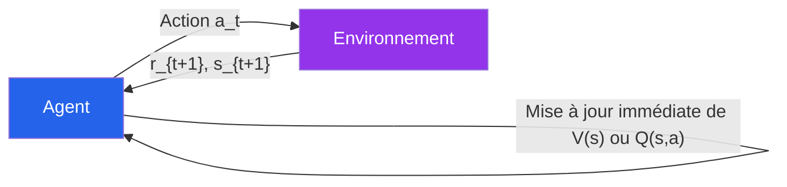

> _En français très simple : « regarde, ajuste, puis apprends — pas l'inverse. »_

---

### 1c — Analogies de la vie courante

- **Saler ses pâtes** : on goûte à 3 min, on ajoute du sel, on regoûte à 5 min, on ajuste. On corrige à chaque étape (TD), on n'attend pas la fin.
- **Régler la température de la douche** : on teste, on tourne le robinet, on retesta. On ne reste **pas** 10 min à attendre que ça s'arrange.
- **Karaoké** : à chaque fausse note, on ajuste le ton. Pas besoin de finir la chanson pour corriger.

> _Et un proverbe ancien qui résume bien l'idée : « Tes yeux sont ta balance » — on ajuste en fonction de ce qu'on voit, ici et maintenant._

</details>

<p align="right"><a href="#top">↑ Retour en haut</a></p>

---

<a id="section-2"></a>

<details>
<summary>2 — Concepts clés et notations</summary>

<br/>

### 2a — V(s), Q(s,a), α, γ, bootstrap

| Symbole | Nom | Rôle |
|---|---|---|
| $V(s)$ | Valeur d'un état | « À quel point cet état est-il bon ? » |
| $Q(s,a)$ | Valeur état-action | « À quel point faire l'action $a$ depuis $s$ est-il bon ? » |
| $R_{t+1}$ | Récompense immédiate | Signal reçu juste après l'action |
| $\alpha \in [0,1]$ | Taux d'apprentissage | Vitesse de mise à jour (gros = on apprend vite, petit = on est prudent) |
| $\gamma \in [0,1]$ | Facteur de discount | Importance des récompenses futures (myope vs prévoyant) |
| **Bootstrap** | Auto-référence | On utilise une **estimation** (ex. $V(S_{t+1})$) à l'intérieur d'une mise à jour, au lieu d'attendre la vraie observation finale |

---

### 2b — Erreur TD (Temporal Difference Error)

L'**erreur TD** mesure la **surprise** entre ce que l'agent croyait et ce qu'il observe maintenant :

$$\delta_t = \underbrace{R_{t+1} + \gamma\, V(S_{t+1})}_{\text{cible bootstrapée}} - \underbrace{V(S_t)}_{\text{estimé courant}}$$

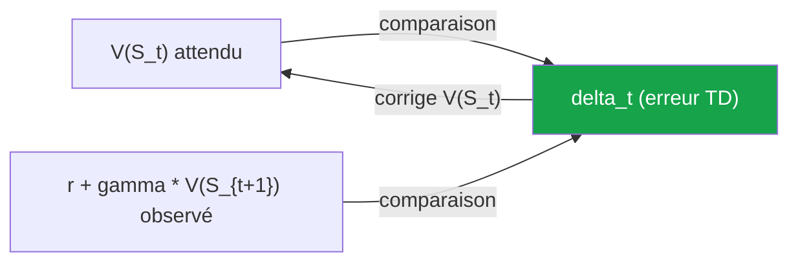

> _Si $\delta_t > 0$, l'agent était trop pessimiste → il monte la valeur._
> _Si $\delta_t < 0$, l'agent était trop optimiste → il baisse la valeur._
> _Si $\delta_t = 0$, l'agent avait déjà raison → rien ne change._

</details>

<p align="right"><a href="#top">↑ Retour en haut</a></p>

---

<a id="section-3"></a>

<details>
<summary>3 — TD(0) — Mise à jour à un pas</summary>

<br/>

### 3a — Équation et intuition

C'est la version la plus simple du TD-Learning. **(→ [Éq. 1](#eq-td0))**

$$V(S_t) \leftarrow V(S_t) + \alpha \left[ R_{t+1} + \gamma\, V(S_{t+1}) - V(S_t) \right]$$

> _Le « 0 » dans **TD(0)** signifie qu'on ne regarde **qu'un seul pas** dans le futur : l'état suivant et la récompense immédiate, pas plus loin._

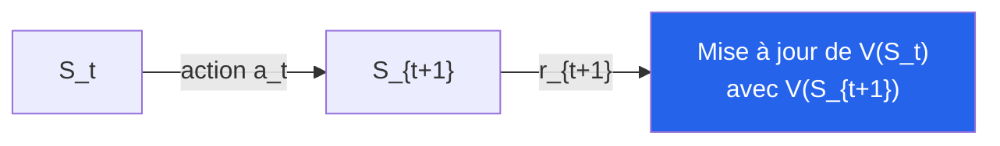

---

### 3b — Forme « mélange » avec (1 − α)

La même équation peut s'écrire de manière plus parlante :

$$V(S_t) \leftarrow (1-\alpha)\, V(S_t) + \alpha \left[ R_{t+1} + \gamma\, V(S_{t+1}) \right]$$

| α | (1 − α) | Lecture intuitive |
|---|---|---|
| 0,1 | 0,9 | On garde **90 %** de l'ancienne estimation, on n'apprend que **10 %** du nouveau |
| 0,5 | 0,5 | Mi-confiance ancien / nouveau |
| 0,9 | 0,1 | On **oublie** vite l'ancien : 10 % gardé, 90 % recalculé sur la dernière info |

> _Avantage pédagogique : on voit explicitement l'**équilibre** entre « ce que je savais » et « ce que je viens d'apprendre »._

</details>

<p align="right"><a href="#top">↑ Retour en haut</a></p>

---

<a id="section-4"></a>

<details>
<summary>4 — TD(n) — Mises à jour à n pas</summary>

<br/>

### 4a — TD(1), TD(2), TD(3), …, TD(n)

Au lieu de regarder un seul pas comme TD(0), on peut accumuler **n récompenses futures** avant de bootstraper avec la valeur de l'état atteint.

| Méthode | Combien d'étapes futures regardées avant de bootstraper ? |
|---|---|
| **TD(0)** | 1 récompense + valeur de l'état suivant |
| **TD(1)** | 2 récompenses + valeur deux pas plus loin |
| **TD(2)** | 3 récompenses + valeur trois pas plus loin |
| **TD(n)** | n récompenses + valeur n pas plus loin |

> _Note de notation : suivant les ouvrages, certains comptent TD(0) = 1 pas, TD(1) = 2 pas. Ce qui compte, c'est l'idée : **plus n grandit, plus on s'éloigne du bootstrap pur et plus on se rapproche de Monte Carlo**._

**Forme générale (→ [Éq. 2](#eq-tdn)) :**

$$V(S_t) \leftarrow V(S_t) + \alpha \left[ \underbrace{\sum_{k=1}^{n} \gamma^{k-1}\, R_{t+k}}_{\text{récompenses observées}} + \underbrace{\gamma^{n}\, V(S_{t+n})}_{\text{bootstrap final}} - V(S_t) \right]$$

---

### 4b — Compromis biais ↔ variance

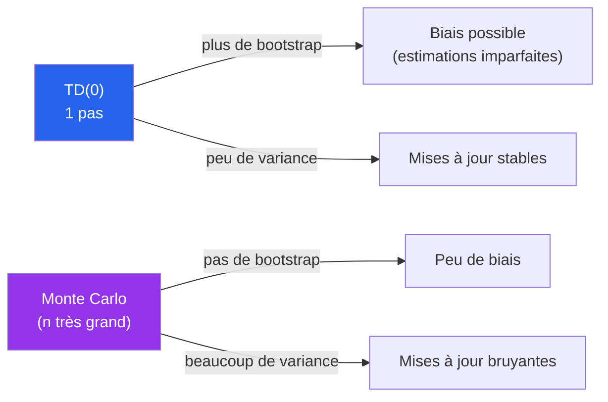

| Méthode | Biais | Variance | Vitesse d'apprentissage |
|---|---|---|---|
| **TD(0)** | Plus élevé | Faible | Rapide, mais vue courte |
| **TD(n)** intermédiaire | Modéré | Modérée | Bon compromis |
| **Monte Carlo** | Faible | Élevée | Lent, demande la fin de l'épisode |

> _TD(n) est un curseur entre **bootstrap pur** (TD(0)) et **observation pure** (Monte Carlo)._

</details>

<p align="right"><a href="#top">↑ Retour en haut</a></p>

---

<a id="section-5"></a>

<details>
<summary>5 — Attention — TD(n) n'est PAS TD(λ)</summary>

<br/>

C'est une **confusion classique** chez les étudiants. **Il ne faut surtout pas lire `TD(0.3)` comme si c'était `TD(3)`.**

---

### 5a — n entier vs λ ∈ [0,1]

#### TD(n) — `n` est un **nombre entier** de pas

> « Pour mettre à jour la note d'aujourd'hui, je regarde **exactement** $n$ pas dans le futur, et **rien** au-delà. »

Exemple — TD(3) avec l'analogie de l'employé :

> « Pour ajuster la note d'aujourd'hui, je regarde sa performance sur **exactement 3 jours** suivants. Le 4ᵉ jour, le 5ᵉ jour, etc., **n'entrent pas** dans cette mise à jour. »

#### TD(λ) — `λ` est un **coefficient de décroissance** (réel ∈ [0, 1])

> « Je tiens compte de **toutes** les étapes futures, mais avec une **importance qui diminue** au fur et à mesure qu'on s'éloigne. La vitesse de cette diminution est contrôlée par λ. »

Exemple — TD(λ = 0,3) :

> « Je donne du poids au jour +1, un peu moins au jour +2, encore moins au jour +3… avec des poids qui suivent $1, 0{,}3, 0{,}3^2, 0{,}3^3, \ldots$ »

---

### 5b — Tableau de comparaison

| Aspect | **TD(n)** | **TD(λ)** |
|---|---|---|
| Type du paramètre | **Entier** $n \in \{1, 2, 3, \ldots\}$ | **Réel** $\lambda \in [0, 1]$ |
| Lecture intuitive | « Bloc fixe de $n$ pas » | « Mémoire qui s'efface progressivement » |
| Ce qu'on prend en compte | **Exactement** $n$ pas, **rien** au-delà | **Tous** les pas, mais avec poids décroissants |
| Cas limites | TD(1), TD(2), …, $n \to \infty$ ≈ Monte Carlo | $\lambda = 0$ ≈ TD(0), $\lambda \to 1$ ≈ Monte Carlo |
| Ex. d'écriture | TD(3) | TD(0.3) |
| Confusion à éviter | TD(0.3) **n'est pas** TD(3) | TD(3) **n'est pas** TD(λ = 3) (impossible : λ ≤ 1) |

> ⚠️ **Règle à retenir :** TD(n) → un nombre **entier** de pas. TD(λ) → un **coefficient** de décroissance entre 0 et 1.

</details>

<p align="right"><a href="#top">↑ Retour en haut</a></p>

---

<a id="section-6"></a>

<details>
<summary>6 — TD(λ) — combinaison pondérée d'horizons</summary>

<br/>

L'idée de TD(λ) est de **combiner** plusieurs horizons (1 pas, 2 pas, 3 pas, …) en un seul retour, avec des poids qui décroissent géométriquement selon λ. **(→ [Éq. 3](#eq-tdlambda))**

$$G_t^{\lambda} = (1-\lambda)\sum_{n=1}^{\infty} \lambda^{\,n-1}\, G_t^{(n)}$$

> _On ne choisit **pas** un seul $n$ : on les **mélange tous**, avec une importance qui décroît._

---

### 6a — Analogie de l'employé (jour +1, +2, +3, …)

> Pour ajuster la note d'aujourd'hui, on tient compte de la performance de l'employé **demain, dans deux jours, dans trois jours, dans quatre jours, etc.**, mais avec une **importance décroissante** au fur et à mesure que l'on s'éloigne dans le temps.

#### Exemple — λ = 0,3 (mémoire courte)

On donne **beaucoup de poids** au Jour +1, puis **de moins en moins** aux jours suivants.

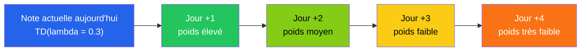

> 💡 **Pourquoi le bloc Mermaid plantait-il avant ?** Parce qu'**aujourd'hui** contient une apostrophe, et que les libellés Mermaid contenant des caractères spéciaux **doivent être entre guillemets** : `["Note actuelle aujourd'hui"]` au lieu de `[Note actuelle aujourd'hui]`. La version ci-dessus rend correctement sur GitHub.

#### Exemple — λ = 0,7 (mémoire plus longue)

Les jours plus lointains gardent encore une **importance non négligeable**.

| Jour à venir | Poids relatif si λ = 0,3 | Poids relatif si λ = 0,7 |
|---|---|---|
| Jour +1 | 1 | 1 |
| Jour +2 | 0,30 | 0,70 |
| Jour +3 | 0,09 | 0,49 |
| Jour +4 | 0,027 | 0,343 |
| Jour +5 | 0,008 | 0,240 |

> _Plus λ est grand, **plus l'historique futur compte** dans la mise à jour._

---

### 6b — Analogie alimentaire — la semaine saine et le McDo

> « J'ai mangé sainement toute la semaine, mais hier j'ai mangé un McDo. Suis-je en mauvaise santé alimentaire ? »

| Méthode | Comment elle juge | Verdict |
|---|---|---|
| **TD(0)** | Ne regarde **qu'hier** | « Tu as mangé un McDo hier → ta semaine est mauvaise. » |
| **TD(λ)** | Combine **plusieurs jours** avec des poids décroissants | « Tu as mangé sainement 6 jours, **un** McDo ne suffit pas à annuler tous tes efforts. » |

- **Plus λ est grand**, plus les repas passés (lundi, mardi, mercredi…) **continuent d'influencer** la note d'aujourd'hui.
- **Plus λ est petit**, plus on se rapproche de **TD(0)** où le **dernier jour domine**.

> _Moralité : TD(λ) lisse le jugement, TD(0) réagit brutalement à la dernière observation._

---

### 6c — Cas limites λ = 0 et λ → 1

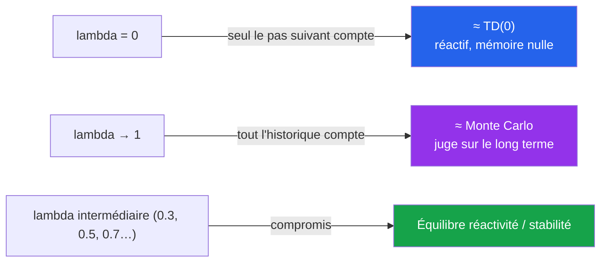

> _Donc λ = 1 ne veut **pas** dire « 1 semaine » ; cela veut dire « je prends pratiquement tout l'historique en compte »._

---

### 6d — Comment choisir la valeur de λ ?

**Bonne nouvelle / mauvaise nouvelle :** il **n'existe pas** de formule magique.

> _λ est un **hyperparamètre**, comme α ou γ. On le choisit par **expérimentation**._

**Recette en 4 étapes (style « projet ») :**

1. **Fixer une plage candidate.** Ex. λ ∈ {0,0 ; 0,3 ; 0,5 ; 0,7 ; 0,9}.
2. **Choisir un critère de performance.** Erreur de prédiction moyenne, récompense cumulée, stabilité (variance des courbes), etc.
3. **Lancer plusieurs entraînements** par valeur de λ pour lisser l'aléa, puis **tracer les courbes** d'apprentissage.
4. **Choisir la λ** qui :
   - **converge assez vite** (réactivité),
   - **sans osciller ni diverger** (stabilité),
   - donne une **bonne performance finale**.

| Valeur de λ | Lecture intuitive | Quand est-ce raisonnable ? |
|---|---|---|
| 0 | Mémoire nulle, type TD(0) | Environnement très non-stationnaire, signal très bruité localement |
| 0,3 | Mémoire courte | On veut réagir vite mais éviter le « sur-collage » au tout dernier pas |
| 0,5 – 0,7 | Compromis classique | Bonne valeur par défaut |
| 0,9 | Mémoire longue | Récompenses très différées, comportement proche Monte Carlo |
| 1 | Mémoire infinie | Équivalent Monte Carlo (épisodes finis recommandés) |

> _Phrase à dire en classe :_
> _« Dans nos exemples, λ = 0,3 est choisi pour illustrer un cas de mémoire très courte. En pratique, on choisit λ **expérimentalement**, comme n'importe quel hyperparamètre. »_

</details>

<p align="right"><a href="#top">↑ Retour en haut</a></p>

---

<a id="section-7"></a>

<details>
<summary>7 — De TD vers le contrôle — SARSA et Q-Learning</summary>

<br/>

TD(0) met à jour des **valeurs d'état** $V(s)$. Pour **prendre des décisions**, on a souvent besoin de **valeurs état-action** $Q(s,a)$. C'est ici qu'arrivent **SARSA** et **Q-Learning** — les deux méthodes de **contrôle** TD les plus importantes.

---

### 7a — Pourquoi passer de V(s) à Q(s,a) ?

| | $V(s)$ | $Q(s,a)$ |
|---|---|---|
| **Question répondue** | « Cet état est-il bon ? » | « Faire telle action depuis cet état est-il bon ? » |
| **Permet de décider sans modèle ?** | ❌ Non — il faudrait connaître les transitions pour savoir vers quel $s'$ chaque action mène | ✅ Oui — il suffit de prendre $\arg\max_a Q(s,a)$ |
| **Méthodes** | TD(0), TD(n), TD(λ), Monte Carlo (évaluation) | **SARSA, Q-Learning, Expected SARSA** (contrôle) |

> _C'est pour cela que **SARSA et Q-Learning travaillent sur $Q(s,a)$** : à partir d'une $Q$-table, on peut directement choisir une action, **sans connaître $P(s'|s,a)$**._

---

### 7b — SARSA — décomposition de l'acronyme et intuition

**SARSA** est l'acronyme du **quintuplet** utilisé à chaque mise à jour :

| Lettre | Symbole | Sens |
|---|---|---|
| **S** | $s$ | **State** — état actuel |
| **A** | $a$ | **Action** exécutée dans $s$ |
| **R** | $r$ | **Reward** reçu |
| **S** | $s'$ | **State'** — nouvel état atteint |
| **A** | $a'$ | **Action'** — action suivante effectivement choisie par la politique courante (par ex. ε-greedy) |

**(→ [Éq. 4](#eq-sarsa))**

$$Q(s, a) \leftarrow Q(s, a) + \alpha \left[ r + \gamma\, Q(s', a') - Q(s, a) \right]$$

ou de manière équivalente :

$$Q(s, a) \leftarrow (1-\alpha)\,Q(s, a) + \alpha \left[ r + \gamma\, Q(s', a') \right]$$

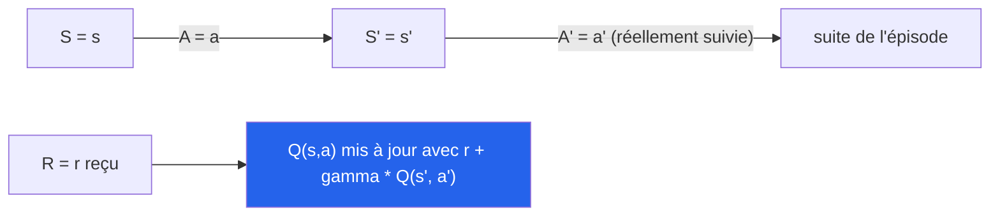

#### Intuition — un apprentissage **réaliste**

> Imagine un enfant qui apprend à marcher dans une pièce inconnue :
>
> - Il agit selon **sa stratégie actuelle** (parfois aléatoire, parfois prudente).
> - À chaque pas, il reçoit un retour (récompense / chute).
> - Il apprend en fonction des actions qu'il **effectue vraiment**, même si elles ne sont pas parfaites.

**SARSA est on-policy : il apprend la valeur de la politique *vraiment* suivie, exploration ε comprise.**

> _Si la politique est ε-greedy avec ε = 0,1, SARSA estime $Q^{\pi_{\varepsilon}}$ — pas $Q^*$. C'est plus **prudent** mais aussi plus **fidèle** au comportement réel._

---

### 7c — SARSA — pseudo-code complet

```text
Initialiser Q(s, a) arbitrairement pour tout (s, a)
Initialiser Q(état_terminal, ·) ← 0

Pour chaque épisode :
    s ← état_initial
    a ← choisir_action(s, Q, epsilon)        # politique ε-greedy
    Tant que s n'est pas terminal :
        Exécuter a, observer r et s'
        a' ← choisir_action(s', Q, epsilon)   # déjà la PROCHAINE action
        Q(s, a) ← Q(s, a) + α [ r + γ Q(s', a') − Q(s, a) ]
        s ← s'
        a ← a'                                 # on AVANCE avec la même action
```

> ⚠️ **Détail crucial :** dans SARSA, on **choisit $a'$ avant** de mettre à jour $Q(s,a)$. C'est cette $a'$ — celle qui **sera vraiment exécutée au prochain pas** — qui est utilisée dans la cible.

---

### 7d — SARSA — exemple numérique pas à pas

**Contexte :** GridWorld, politique ε-greedy.

**Données à un pas $t$ :**

| Élément | Valeur |
|---|---|
| $Q(s, a)$ avant mise à jour | $5{,}0$ |
| Récompense reçue $r$ | $-1$ (coût de pas) |
| État suivant $s'$ : valeurs Q disponibles | $Q(s', \text{nord}) = 3{,}0,\; Q(s', \text{sud}) = 7{,}0,\; Q(s', \text{est}) = 2{,}0,\; Q(s', \text{ouest}) = 4{,}0$ |
| Action $a'$ **effectivement choisie** par la politique ε-greedy | **est** (par exploration aléatoire) → $Q(s', a') = 2{,}0$ |
| $\alpha$, $\gamma$ | $0{,}1$ ; $0{,}9$ |

#### Étape 1 — Cible SARSA

$$\text{cible} = r + \gamma\, Q(s', a') = -1 + 0{,}9 \times 2{,}0 = -1 + 1{,}8 = 0{,}8$$

#### Étape 2 — Erreur TD

$$\delta = \text{cible} - Q(s,a) = 0{,}8 - 5{,}0 = -4{,}2$$

#### Étape 3 — Mise à jour

$$Q(s, a) \leftarrow 5{,}0 + 0{,}1 \times (-4{,}2) = \mathbf{4{,}58}$$

> _Comparaison : si on avait fait du Q-Learning ici, on aurait pris $\max_{a'} Q(s', a') = 7{,}0$ (sud) au lieu de $2{,}0$ (est). La cible aurait été $-1 + 0{,}9 \times 7{,}0 = 5{,}3$, et la mise à jour donnerait $Q(s,a) \leftarrow 5{,}03$. **Q-Learning est plus optimiste** parce qu'il suppose qu'on aurait pris la **meilleure** action ensuite._

---

### 7e — SARSA vs TD(0) — quelle parenté ?

| | **TD(0)** | **SARSA** |
|---|---|---|
| Met à jour | $V(s)$ | $Q(s, a)$ |
| Granularité | État seul | Couple (état, action) |
| Politique | Évaluation passive | **Contrôle** (apprend ET améliore) |
| Action utilisée pour bootstraper | Aucune | $a'$ **réellement suivie** |
| Forme « erreur TD » | $V(s) \leftarrow V(s) + \alpha[r + \gamma V(s') - V(s)]$ | $Q(s,a) \leftarrow Q(s,a) + \alpha[r + \gamma Q(s', a') - Q(s,a)]$ |

> _On peut voir **SARSA comme un TD(0) sur les couples (état, action)** : même principe de bootstrap à un pas, mais granularité plus fine **et** politique active._

---

### 7f — Q-Learning (off-policy)

**(→ [Éq. 5](#eq-qlearning))**

$$Q(s, a) \leftarrow Q(s, a) + \alpha \left[ r + \gamma \max_{a'} Q(s', a') - Q(s, a) \right]$$

> _Q-Learning utilise $\max_{a'} Q(s', a')$ : il met à jour **comme si** l'agent allait toujours choisir la **meilleure** action ensuite, **même si** dans la réalité il explore (ε-greedy)._

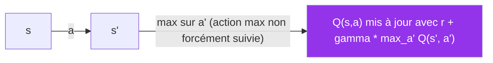

> _On dit que Q-Learning est **off-policy** : la politique **cible** (greedy sur $Q$) diffère de la politique **de comportement** (ε-greedy)._

#### Différence clé en une ligne

$$\boxed{\;\text{SARSA}: r + \gamma\, Q(s', \mathbf{a'_{\text{suivie}}}) \quad\text{vs}\quad \text{Q-Learning}: r + \gamma \max_{a'} Q(s', a')\;}$$

---

### 7g — SARSA vs Q-Learning — l'exemple Cliff Walking

> _C'est **l'exemple canonique** pour comprendre la différence pratique entre on-policy et off-policy (Sutton & Barto, exemple 6.6)._

#### Le décor

```text
S . . . . . . . . . . G          S = départ, G = but
F F F F F F F F F F F F          F = falaise (récompense -100, retour à S)
                                  Récompense par défaut : -1 (coût de pas)
```

- L'agent peut aller en **N, S, E, O**.
- Tomber dans la falaise donne **−100** et l'agent est renvoyé au départ.
- Politique d'exploration : **ε-greedy avec ε = 0,1** (10 % d'aléa).

#### Ce que **chaque algorithme** apprend

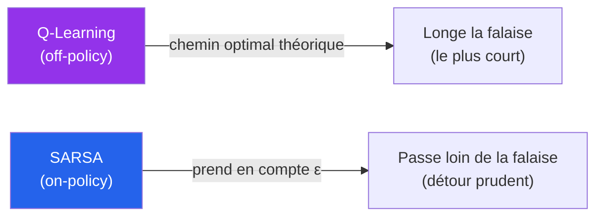

| | **Q-Learning** | **SARSA** |
|---|---|---|
| Chemin appris | **Le plus court** : longe la falaise | **Détour** : passe par la rangée du dessus |
| Récompense moyenne **pendant l'apprentissage** | **Plus mauvaise** (chute fréquente à cause de l'ε) | **Meilleure** (l'agent évite la falaise) |
| Politique greedy finale (sans ε) | **Optimale** ($Q^*$) | Légèrement sous-optimale, mais **safe** |

#### Pourquoi cette différence ?

- **Q-Learning** met à jour avec $\max_{a'} Q(s', a')$ — donc **« je suppose que je joue parfaitement la suite »**. Il ignore que sa propre politique d'exploration le fera tomber 10 % du temps.
- **SARSA** met à jour avec $Q(s', a')$ — l'action **vraiment** prise, qui inclut le risque de chute aléatoire. Il **internalise** le coût de l'exploration et apprend une politique **prudente**.

> _Moralité industrielle :_
> _- Pour un **trader agressif** ou un agent qui sera ensuite déployé en mode greedy pur → **Q-Learning** (politique optimale)._
> _- Pour un **cobot collaboratif**, un système anti-fraude **prudent** ou tout système où l'**exploration coûte cher pendant le déploiement** → **SARSA** (politique sûre vis-à-vis de l'exploration)._

---

### 7h — Tableau récapitulatif

| Méthode | Met à jour | Politique | Action utilisée pour bootstraper | Forme |
|---|---|---|---|---|
| **TD(0)** | $V(s)$ | (évaluation) | aucune (pas de choix d'action) | $V(s) \leftarrow V(s) + \alpha[r + \gamma V(s') - V(s)]$ |
| **TD(n)** | $V(s)$ | (évaluation) | aucune | $V(s) \leftarrow V(s) + \alpha[\sum \gamma^{k-1} r_{t+k} + \gamma^n V(s_{t+n}) - V(s)]$ |
| **TD(λ)** | $V(s)$ | (évaluation) | combinaison de tous les horizons | $V(s) \leftarrow V(s) + \alpha[G_t^{\lambda} - V(s)]$ |
| **SARSA** | $Q(s,a)$ | **on-policy** | $A_{t+1}$ **réellement suivie** | $Q(s,a) \leftarrow Q(s,a) + \alpha[r + \gamma Q(s', a') - Q(s,a)]$ |
| **Q-Learning** | $Q(s,a)$ | **off-policy** | $\arg\max_{a'} Q(s', a')$ | $Q(s,a) \leftarrow Q(s,a) + \alpha[r + \gamma \max_{a'} Q(s', a') - Q(s,a)]$ |

</details>

<p align="right"><a href="#top">↑ Retour en haut</a></p>

---

<a id="section-8"></a>

<details>
<summary>8 — Bellman — fondement théorique du TD</summary>

<br/>

> _Toutes les méthodes TD que nous venons de voir sont en fait des **versions empiriques** des **équations de Bellman**. C'est important de relier les deux pour comprendre **pourquoi** ces algorithmes fonctionnent._

---

### 8a — Bellman pour V et Q sous une politique π

> **« La valeur d'un état aujourd'hui = récompense immédiate attendue + valeur actualisée de l'état suivant. »**

**(→ [Éq. 6](#eq-bellman-v-pi))**

$$V^{\pi}(s) = \mathbb{E}_{\pi}\!\left[\, R_{t+1} + \gamma\, V^{\pi}(S_{t+1}) \mid S_t = s \,\right]$$

**(→ [Éq. 7](#eq-bellman-q-pi))**

$$Q^{\pi}(s,a) = \mathbb{E}_{\pi}\!\left[\, R_{t+1} + \gamma\, Q^{\pi}(S_{t+1}, A_{t+1}) \mid S_t = s,\, A_t = a \,\right]$$

> _Lecture intuitive :_
> _« Un bon investissement = ce qu'il rapporte un peu maintenant + ce qu'il rapportera encore plus à l'avenir. »_

---

### 8b — Bellman optimalité — $V^{\ast}(s)$ et $Q^{\ast}(s,a)$

Quand on cherche **la meilleure politique**, on prend le `max` sur les actions :

**(→ [Éq. 8](#eq-bellman-v-star))**

$$V^{\ast}(s) = \max_a \mathbb{E}\!\left[\, R_{t+1} + \gamma\, V^{\ast}(S_{t+1}) \mid S_t = s,\, A_t = a \,\right]$$

**(→ [Éq. 9](#eq-bellman-q-star))**

$$Q^{\ast}(s,a) = \mathbb{E}\!\left[\, R_{t+1} + \gamma \max_{a'} Q^{\ast}(S_{t+1}, a') \mid S_t = s,\, A_t = a \,\right]$$

> ⚠️ **Bellman exact ↔ programmation dynamique :** ces équations supposent qu'on **connaît** $P(s'|s,a)$ et $R(s,a)$. Elles sont la base de **Value Iteration / Policy Iteration**.

---

### 8c — Lien avec TD et Q-Learning

| Bellman (théorie) | Méthode empirique correspondante |
|---|---|
| $V^{\pi}(s) = \mathbb{E}_{\pi}[R + \gamma V^{\pi}(s')]$ | **TD(0)** — on remplace l'espérance par un **échantillon** + bootstrap |
| $Q^{\pi}(s,a) = \mathbb{E}_{\pi}[R + \gamma Q^{\pi}(s', a')]$ | **SARSA** — on échantillonne l'action $a'$ réellement suivie |
| $Q^{\ast}(s,a) = \mathbb{E}[R + \gamma \max_{a'} Q^{\ast}(s', a')]$ | **Q-Learning** — on échantillonne et on prend le `max` |

> _En une phrase : **TD = Bellman appliqué à l'expérience**, sans connaître le modèle._

</details>

<p align="right"><a href="#top">↑ Retour en haut</a></p>

---

<a id="section-9"></a>

<details>
<summary>9 — Exemples numériques pas à pas</summary>

<br/>

### 9a — Exemple 1 — TD(0) avec récompense

**Données :**

- État courant $s_1$ avec $V(s_1) = 10$
- Récompense reçue $R = 5$
- État suivant $s_2$ avec $V(s_2) = 20$
- $\alpha = 0{,}1$, $\gamma = 0{,}9$

**Étape 1 — Erreur TD :**

$$\delta_t = R + \gamma\, V(s_2) - V(s_1) = 5 + 0{,}9 \times 20 - 10 = 5 + 18 - 10 = 13$$

**Étape 2 — Mise à jour :**

$$V(s_1) \leftarrow V(s_1) + \alpha \cdot \delta_t = 10 + 0{,}1 \times 13 = \mathbf{11{,}3}$$

> _Interprétation : l'agent était trop pessimiste ($V(s_1)=10$ alors que la cible est $5+18=23$). Il **monte** sa valeur._

---

### 9b — Exemple 2 — Bootstrap TD(1) vs Monte Carlo

**Données :**

$$V(s_t) = 5{,}0 \;;\; V(s_{t+1}) = 7{,}0 \;;\; R_{t+1} = 2{,}0 \;;\; \gamma = 0{,}9 \;;\; \alpha = 0{,}1$$

#### Hypothèse — retour Monte Carlo observé $G_t = 15{,}0$

$$V(s_t) \leftarrow 5{,}0 + 0{,}1 \times (15{,}0 - 5{,}0) = 5{,}0 + 1{,}0 = \mathbf{6{,}0}$$

> _La cible $G_t = 15{,}0$ est construite **uniquement** sur des récompenses **réelles** observées jusqu'à la fin de l'épisode. **Pas** de bootstrap._

#### TD(1) — bootstrap

$$\text{cible}_{TD(1)} = R_{t+1} + \gamma\, V(s_{t+1}) = 2{,}0 + 0{,}9 \times 7{,}0 = 8{,}3$$

$$V(s_t) \leftarrow 5{,}0 + 0{,}1 \times (8{,}3 - 5{,}0) = 5{,}0 + 0{,}33 = \mathbf{5{,}33}$$

> _La cible 8,3 utilise **l'estimation** $V(s_{t+1}) = 7{,}0$ : c'est précisément **du bootstrap**._

| Méthode | Cible | $V(s_t)$ après mise à jour |
|---|---|---|
| Monte Carlo | $G_t = 15{,}0$ (récompenses réelles uniquement) | **6,0** |
| TD(1) | $R + \gamma V(s_{t+1}) = 8{,}3$ (bootstrap) | **5,33** |

---

### 9c — Exemple 3 — Q-Learning

**Données :**

- $Q(s_t, a_t) = 10$
- $R_{t+1} = 4$
- $\max_{a'} Q(s_{t+1}, a') = 20$
- $\alpha = 0{,}1$, $\gamma = 0{,}9$

**Forme « mélange pondéré » :**

$$Q(s_t, a_t) \leftarrow (1-\alpha)\,Q(s_t, a_t) + \alpha \left[ R_{t+1} + \gamma \max_{a'} Q(s_{t+1}, a') \right]$$

$$Q(s_t, a_t) \leftarrow 0{,}9 \times 10 + 0{,}1 \times (4 + 0{,}9 \times 20) = 9 + 0{,}1 \times 22 = 9 + 2{,}2 = \mathbf{11{,}2}$$

> _Forme « erreur TD » équivalente :_
> _$\delta = 4 + 18 - 10 = 12 \Rightarrow Q \leftarrow 10 + 0{,}1 \times 12 = 11{,}2$._

</details>

<p align="right"><a href="#top">↑ Retour en haut</a></p>

---

<a id="section-10"></a>

<details>
<summary>10 — Note pédagogique — la convention TD(0) « bootstrap pur »</summary>

<br/>

> _Cette note clarifie une **subtilité de notation** que tu rencontreras dans certains documents PDF du cours._

Dans **certains documents** (notamment les annexes-équations utilisées dans ce cours), une convention pédagogique alternative présente :

| Notation | Cible utilisée |
|---|---|
| **TD(0)** (convention « bootstrap pur ») | $\gamma\, V(S_{t+1})$ — **sans** $R_{t+1}$ |
| **TD(1)** | $R_{t+1} + \gamma\, V(S_{t+1})$ — **avec** $R_{t+1}$ |
| **TD(n)** | $\sum_{k=1}^{n} \gamma^{k-1} R_{t+k} + \gamma^n V(S_{t+n})$ |

Soit l'équation TD(0) **alternative** :

$$V(S_t) \leftarrow (1-\alpha)\, V(S_t) + \alpha\, \gamma\, V(S_{t+1})$$

> _Cette convention met l'accent sur le **bootstrap pur** (« on n'utilise que l'estimation de l'état suivant »). Elle est utile pour expliquer ce qu'est **vraiment** le bootstrap._

⚠️ **Convention « standard » Sutton & Barto** (la plus répandue dans la littérature) :

$$\textbf{TD(0)} \,:\; V(S_t) \leftarrow V(S_t) + \alpha\,[R_{t+1} + \gamma V(S_{t+1}) - V(S_t)]$$

Dans cette convention :

- TD(0) **inclut déjà** $R_{t+1}$.
- TD(n) regarde **n+1** récompenses ($R_{t+1}, \ldots, R_{t+n}$) et bootstrap sur $V(S_{t+n})$.

---

### Tableau de correspondance (pour ne plus se perdre)

| | Convention « cours / PDFs » | Convention « Sutton & Barto » |
|---|---|---|
| TD(0) | $\gamma V(S_{t+1})$ (bootstrap pur) | $R_{t+1} + \gamma V(S_{t+1})$ |
| TD(1) | $R_{t+1} + \gamma V(S_{t+1})$ | $R_{t+1} + \gamma R_{t+2} + \gamma^2 V(S_{t+2})$ |
| TD(2) | $R_{t+1} + \gamma R_{t+2} + \gamma^2 V(S_{t+2})$ | $R_{t+1} + \gamma R_{t+2} + \gamma^2 R_{t+3} + \gamma^3 V(S_{t+3})$ |

> 💡 **Règle pratique :** le sens **général** ne change pas — plus le numéro grandit, plus on regarde loin. **Vérifie toujours la définition** de l'auteur avant de comparer des résultats.

</details>

<p align="right"><a href="#top">↑ Retour en haut</a></p>

---

<a id="section-11"></a>

<details>
<summary>11 — Model-based vs Model-free</summary>

<br/>

### Qu'est-ce qu'un « modèle » de l'environnement ?

C'est la **connaissance explicite** de :

- la fonction de **transition** $P(s'|s,a)$ — *« Quelle est la probabilité d'arriver dans $s'$ ? »*
- la fonction de **récompense** $R(s,a)$ — *« Que vais-je gagner en moyenne ? »*

Avec un modèle, on peut **simuler** l'environnement sans interagir réellement avec lui.

---

### Model-based — *« je connais les règles »*

| | |
|---|---|
| Exemples | **Value Iteration**, **Policy Iteration**, **Dyna-Q** |
| Avantages | Convergence rapide, planification possible **avant d'agir** |
| Inconvénients | Requiert une connaissance complète, **rarement disponible** dans le monde réel |

---

### Model-free — *« j'apprends sur le tas »*

| | |
|---|---|
| Exemples | **TD(0)**, **TD(n)**, **TD(λ)**, **SARSA**, **Q-Learning**, **Monte Carlo** |
| Avantages | S'adapte à n'importe quel environnement, applicable **directement** sur des systèmes réels (robot, jeu, recommandation) |
| Inconvénients | Apprentissage **plus lent** (empirique), moins de planification |

---

### Comparaison synthétique

| Critère | Model-based | Model-free |
|---|---|---|
| Connaissance des transitions | **Requise** | Non |
| Connaissance des récompenses | **Requise** | Apprise par expérience |
| Vitesse de convergence | Rapide | Plus lente |
| Applicabilité en pratique | Limitée aux systèmes connus | Très large |
| Simulation mentale possible | Oui | Non |

---

### Analogie « échecs »

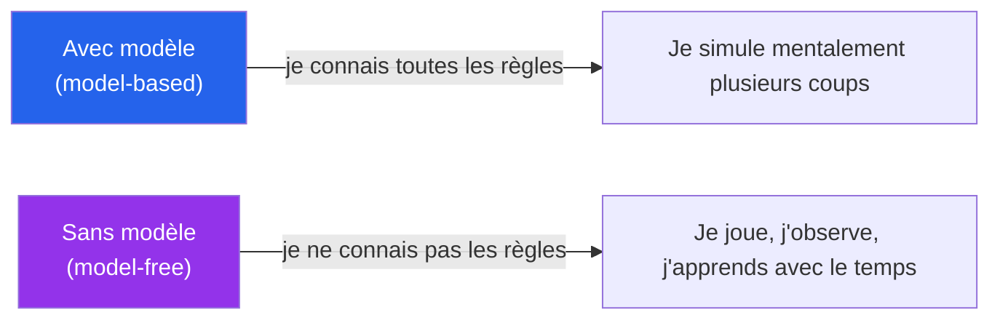

> _Aujourd'hui, dans des environnements complexes et inconnus (robotique, jeux vidéo, recommandation, finance), les méthodes **model-free** dominent — précisément parce qu'on n'a **pas** le modèle._

</details>

<p align="right"><a href="#top">↑ Retour en haut</a></p>

---

<a id="section-12"></a>

<details>
<summary>12 — Applications industrielles</summary>

<br/>

> _Les méthodes TD ne sont pas que des concepts abstraits. Elles sont **massivement déployées** dans l'industrie._

---

### 12a — Détection de fraude bancaire

| Méthode | Cas concret | Logique |
|---|---|---|
| **TD(0)** | Transaction de 3000$ à Tokyo alors que l'utilisateur est à Montréal → **carte gelée immédiatement** | Décision sur **un seul** signal |
| **TD(1–3)** | 1ʳᵉ transaction suspecte → flag ; 2ᵉ → score augmenté ; 3ᵉ → **blocage / 2FA** | Corrélation **courte** de signaux |
| **TD(n)** | Fenêtre glissante 5–30 min — attaques coordonnées multi-comptes | Horizon **court / moyen** |
| **Monte Carlo** | Audit / conformité — analyse de 6 mois d'historique | Verdict **après** la séquence complète |

---

### 12b — Cybersécurité (IDS/IPS, SIEM, forensic)

| Méthode | Cas concret |
|---|---|
| **TD(0)** | **Snort / Suricata / WAF** — un paquet malveillant → blocage instantané ; 100 tentatives SSH en 5 s → bannissement |
| **TD(1–3)** | Splunk / Sentinel — scan de ports → log ; brute force → alerte ; tentative `/wp-login.php` → blocage |
| **TD(n)** | **Kill-chain MITRE ATT&CK** — Recon → Phishing → Accès VPN → Mouvement latéral → Exfiltration. Détection après n événements |
| **Monte Carlo** | **Forensic** post-incident — timeline complète, analyse globale |

---

### 12c — Data centers, trading, robotique, recommandation

| Domaine | TD(0) | TD(1–3) | TD(n) | Monte Carlo |
|---|---|---|---|---|
| **Data centers** (Kubernetes HPA, Google Borg, MS) | Autoscaling immédiat (CPU > seuil → +1 pod) | Prévision 1–3 min, anti-oscillation | Optimisation énergétique 10 min | Analyse globale jobs HPC |
| **Trading algorithmique** | Décisions à la milliseconde, mise à jour par tick | Arbitrage court 2–3 ticks | Tendances 10–30 ticks | **Backtesting** sur 10 ans |
| **Robotique / conduite autonome** | Contrôle continu, anti-collision | Prédiction 1–3 frames, stabilisation bras | Planification 6–12 m | Simulation d'un trajet complet |
| **Recommandation** (YouTube, TikTok, Netflix) | Mise à jour score sur 1 clic / 1 like / 1 s vue | Rétention à 3 s | Watch-time 10–30 s | Watch-time **réel** complet |

---

### 12d — Le rôle de SARSA — politiques prudentes

> _**SARSA** est on-policy : il met à jour selon **l'action réellement effectuée**. Il est utilisé là où la **prudence** est essentielle._

| Domaine | Pourquoi SARSA plutôt que Q-Learning ? |
|---|---|
| **Cybersécurité (auto-blocage)** | Éviter les faux positifs, ne pas verrouiller trop agressivement |
| **Robotique collaborative** (cobots) | Apprendre seulement les politiques **réellement sûres**, pas celles « théoriquement » optimales mais dangereuses |
| **Finance — stratégies prudentes** | Q-Learning tend vers des stratégies agressives ; SARSA reste sous le risque limité |

---

### Tableau comparatif final (industriel)

| Méthode | Quand l'utiliser ? |
|---|---|
| **TD(0)** | Décision **immédiate** : fraude en ligne, IDS/IPS, autoscaling, trading μs, robotique instantanée |
| **TD(1–3)** | Prévision **courte** : signaux successifs, trajectoires courtes, rétention courte |
| **TD(n)** | Horizon **moyen** : kill-chain cyber, maintenance prédictive 10 s, trading 10–30 ticks |
| **Monte Carlo** | Analyse **complète** : forensic, audit, backtesting, simulation d'un trajet entier |
| **SARSA** | Politique **prudente** : sécurité sensible, cobots, stratégies à risque limité |
| **Q-Learning** | Politique **optimale agressive** : trading opportuniste, agents compétitifs, optimisation extrême |

</details>

<p align="right"><a href="#top">↑ Retour en haut</a></p>

---

<a id="section-13"></a>

<details>
<summary>13 — Exemples de la vie quotidienne</summary>

<br/>

> _Les mêmes méthodes correspondent à des **façons humaines** de prendre des décisions. C'est très utile pour les introduire en classe._

---

### TD(0) — *Décision immédiate*

| Situation | Logique TD(0) |
|---|---|
| **Conduire** | Un piéton apparaît → **freinage immédiat** |
| **Météo instantanée** | Une goutte → **parapluie** |
| **Urgence médicale** | Personne inconsciente → action immédiate |
| **Saler ses pâtes** | Goûter une fourchette → ajouter du sel |
| **Douche** | Tester la température → ajuster le robinet |

---

### TD(1–3) — *Quelques signaux avant de décider*

| Situation | Logique TD(1–3) |
|---|---|
| **Choisir un film** | Bande-annonce + premières minutes → décision |
| **Juger le comportement d'une personne** | 2–3 interactions |
| **Jauger un restaurant** | Accueil + odeur + carte |
| **Karaoké** | 2–3 fausses notes → ajuster le ton |

---

### Monte Carlo — *Attendre la fin*

| Situation | Logique Monte Carlo |
|---|---|
| **Évaluer un étudiant** | Verdict en **fin de session** |
| **Juger une relation** | Après plusieurs **années** |
| **Bilan financier** | À la **fin** de l'année |
| **Critique d'un film** | Après le film **en entier** |

---

### Tableau récapitulatif vie quotidienne

| Méthode | Quand l'utiliser ? |
|---|---|
| **TD(0)** | Décision immédiate : urgence, conduite, saler/douche |
| **TD(1–3)** | Décision après **quelques** signaux : film, restaurant, première impression |
| **TD(n)** | Scénarios **multi-étapes** : prévision météo 3–5 jours, plan de carrière sur quelques mois |
| **Monte Carlo** | Décision **à la fin** : bulletin, bilan, critique complète |
| **SARSA** | Comportement **prudent** : un parent qui apprend de ce qu'il **fait vraiment** avec son enfant, pas de la théorie |
| **Q-Learning** | Apprendre **« ce qu'il aurait fallu faire »** : analyse post-action d'un coach sportif |

</details>

<p align="right"><a href="#top">↑ Retour en haut</a></p>

---

<a id="section-14"></a>

<details>
<summary>14 — Quiz 1 — TD(0) et TD(n)</summary>

<br/>

> Choisissez **la meilleure réponse**. Justifiez en une ou deux phrases.

---

**Q1.** Que signifie le « 0 » dans **TD(0)** ?

a) On ne regarde aucune récompense future
b) **On regarde un seul pas dans le futur (récompense + état suivant)**
c) Le taux d'apprentissage α vaut 0
d) Le facteur γ vaut 0

---

**Q2.** Avec la forme $V(s) \leftarrow (1-\alpha) V(s) + \alpha [r + \gamma V(s')]$, si α = 0,1 :

a) On garde 10 % de l'ancienne valeur
b) **On garde 90 % de l'ancienne valeur, on apprend 10 % du nouveau**
c) On apprend 100 % du nouveau
d) On ne fait aucune mise à jour

---

**Q3.** TD(0) **vs** Monte Carlo : quelle affirmation est **vraie** ?

a) Monte Carlo met à jour à chaque pas, TD(0) à la fin de l'épisode
b) **TD(0) met à jour à chaque pas, Monte Carlo attend la fin de l'épisode**
c) Les deux nécessitent un modèle complet de l'environnement
d) Aucune des deux n'utilise de récompense

---

**Q4.** TD(n) avec un **n grand** :

a) Se rapproche de TD(0)
b) **Se rapproche de Monte Carlo**
c) Annule l'effet de γ
d) N'utilise plus de bootstrap **et** ignore les récompenses

---

**Q5.** Le terme **bootstrap** dans TD signifie :

a) Démarrer l'environnement
b) **Utiliser une estimation actuelle (V ou Q) à l'intérieur d'une mise à jour**
c) Ré-échantillonner les transitions
d) Choisir aléatoirement les actions

</details>

<p align="right"><a href="#top">↑ Retour en haut</a></p>

---

<a id="section-15"></a>

<details>
<summary>15 — Quiz 2 — TD(λ), SARSA / Q-Learning et applications</summary>

<br/>

**Q1.** Dans **TD(λ)**, le paramètre λ est :

a) Un nombre entier de pas
b) **Un coefficient réel entre 0 et 1 qui contrôle la décroissance**
c) Le taux d'apprentissage
d) Le facteur de discount

---

**Q2.** **TD(0,3)** signifie :

a) On regarde 3 pas dans le futur
b) **λ = 0,3 → on combine tous les pas avec des poids décroissants 1, 0,3, 0,3², …**
c) Le taux d'apprentissage est 0,3
d) On ignore les 3 premiers pas

---

**Q3.** Quand λ → 1, le comportement de TD(λ) :

a) Devient identique à TD(0)
b) **Se rapproche d'une mise à jour de type Monte Carlo**
c) Cesse d'apprendre
d) Force ε = 0

---

**Q4.** L'analogie « semaine saine + McDo hier » illustre que :

a) TD(0) est plus réaliste que TD(λ) pour ce cas
b) **TD(λ) lisse le jugement en tenant compte des jours précédents, TD(0) sur-réagit au dernier jour**
c) Les deux méthodes donnent toujours le même résultat
d) λ doit valoir 0 dans ce cas

---

**Q5.** **SARSA** est dit **on-policy** parce que :

a) Il apprend toujours la politique optimale, peu importe l'exploration
b) **La mise à jour utilise l'action $A_{t+1}$ réellement effectuée selon la politique en cours**
c) Il n'utilise pas de γ
d) Il est équivalent à TD(0)

---

**Q6.** **Q-Learning** est dit **off-policy** parce que :

a) Il ne met jamais à jour Q
b) **La cible utilise $\max_{a'} Q(s', a')$ — l'action optimale, pas celle réellement suivie**
c) Il ne dépend pas de l'environnement
d) α doit être égal à 1

---

**Q7.** Quel domaine industriel relève typiquement d'un comportement **TD(0)** ?

a) Backtesting d'une stratégie sur 10 ans
b) **Système IDS/IPS qui bloque un paquet malveillant en temps réel**
c) Audit de fraude à la fin du trimestre
d) Critique d'un film après l'avoir vu en entier

---

**Q8.** Pourquoi utiliser **SARSA** plutôt que Q-Learning sur un **cobot industriel** ?

a) SARSA est plus rapide
b) **SARSA apprend la politique réellement suivie → on évite d'apprendre des comportements optimaux mais dangereux**
c) Q-Learning n'utilise pas γ
d) SARSA n'utilise pas de récompense

---

**Q9.** Une équipe **forensic** qui analyse 6 mois de logs après un incident utilise une logique :

a) TD(0)
b) TD(1)
c) **Monte Carlo (analyse complète après la séquence)**
d) Bellman exact

</details>

<p align="right"><a href="#top">↑ Retour en haut</a></p>

---

<a id="section-16"></a>

<details>
<summary>16 — Travail à réaliser — Activité TP</summary>

<br/>

### Activité 1 — Comparer λ ∈ {0 ; 0,3 ; 0,7 ; 0,9}

**Contexte :** GridWorld (ou FrozenLake), épisodes de 100 pas, 200 épisodes, α = 0,1, γ = 0,9.

1. Implémentez TD(λ) (vue *forward* ou *backward* avec traces d'éligibilité).
2. Pour chaque λ, **lancez 5 entraînements** indépendants.
3. Tracez la **courbe moyenne** de récompense cumulée par épisode.
4. Concluez :
   - Quelle valeur de λ converge **le plus vite** ?
   - Laquelle donne le **meilleur score final** ?
   - Y a-t-il une λ qui **oscille** ou diverge ?

---

### Activité 2 — TD(n) à n choisi

1. Comparez **TD(0)**, **TD(3)**, **TD(10)** sur la même tâche.
2. Reliez vos observations à la discussion **biais ↔ variance**.
3. Question d'analyse : à quoi ressemble TD(n) avec **n très grand** ? Pourquoi ?

---

### Activité 3 — SARSA vs Q-Learning sur le « cliff walking »

> *Cliff Walking* est un GridWorld classique avec une falaise mortelle juste sous le chemin le plus court.

1. Implémentez SARSA et Q-Learning avec une politique **ε-greedy** (ε = 0,1).
2. Comparez **les trajectoires apprises** (collé à la falaise vs longe la falaise par sécurité ?).
3. Expliquez le résultat à partir de la différence **on-policy / off-policy**.

</details>

<p align="right"><a href="#top">↑ Retour en haut</a></p>

---

<a id="section-17"></a>

<details>
<summary>17 — Synthèse du chapitre</summary>

<br/>

### Ce qu'il faut absolument retenir

1. **TD-Learning** = apprendre **au fil de l'expérience**, en bootstrappant sur ses propres estimations.
2. **TD(0)** ne regarde **qu'un pas**. **TD(n)** étend à **n pas**.
3. **TD(n)** : `n` est un **entier**. **TD(λ)** : `λ` est un **réel ∈ [0, 1]** — **deux notions différentes**.
4. **TD(λ)** combine **tous** les horizons avec des poids $1, \lambda, \lambda^2, \ldots$ qui décroissent.
   - λ = 0 ≈ TD(0), λ → 1 ≈ Monte Carlo.
5. **λ se choisit expérimentalement** (grid search, validation, courbes).
6. **SARSA** (on-policy) utilise l'action **réellement suivie** ; **Q-Learning** (off-policy) utilise le **max**.
7. La forme **(1 − α)** rend explicite l'équilibre entre **ancien savoir** et **nouvelle information**.
8. **Bellman** est la **base théorique** : TD est l'**implémentation empirique** quand on n'a **pas** le modèle.
9. **Model-based** (Bellman exact, Value Iteration) suppose le modèle **connu** ; **model-free** (TD, Q-Learning, MC) apprend par expérience.
10. **Industrie :** TD(0) → décision immédiate (fraude, IDS/IPS) ; TD(n) → kill-chain, prévision moyenne ; Monte Carlo → forensic / backtesting ; SARSA → systèmes prudents (cobots, cybersécurité douce) ; Q-Learning → optimisation agressive.

---

### Carte mentale du chapitre

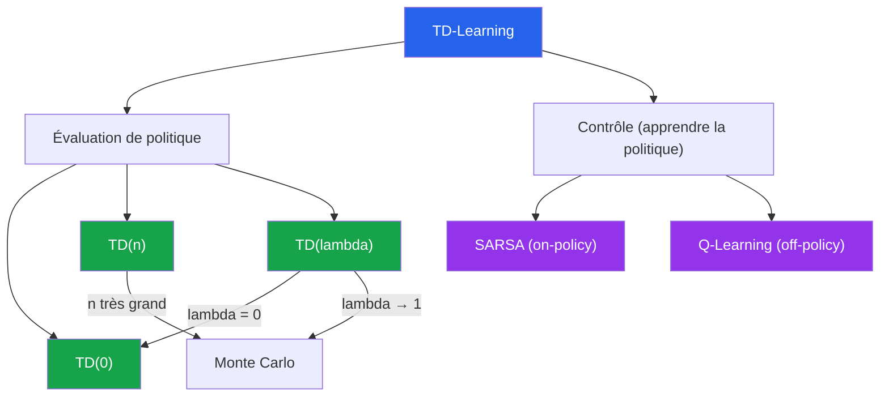

---

### Phrase à graver

> **« TD(n), c'est un nombre de pas. TD(λ), c'est une vitesse d'oubli. »**

</details>

<p align="right"><a href="#top">↑ Retour en haut</a></p>
