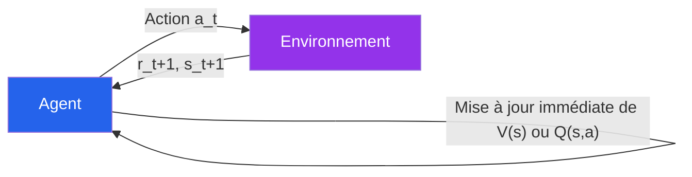
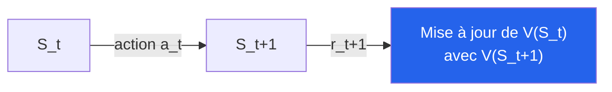
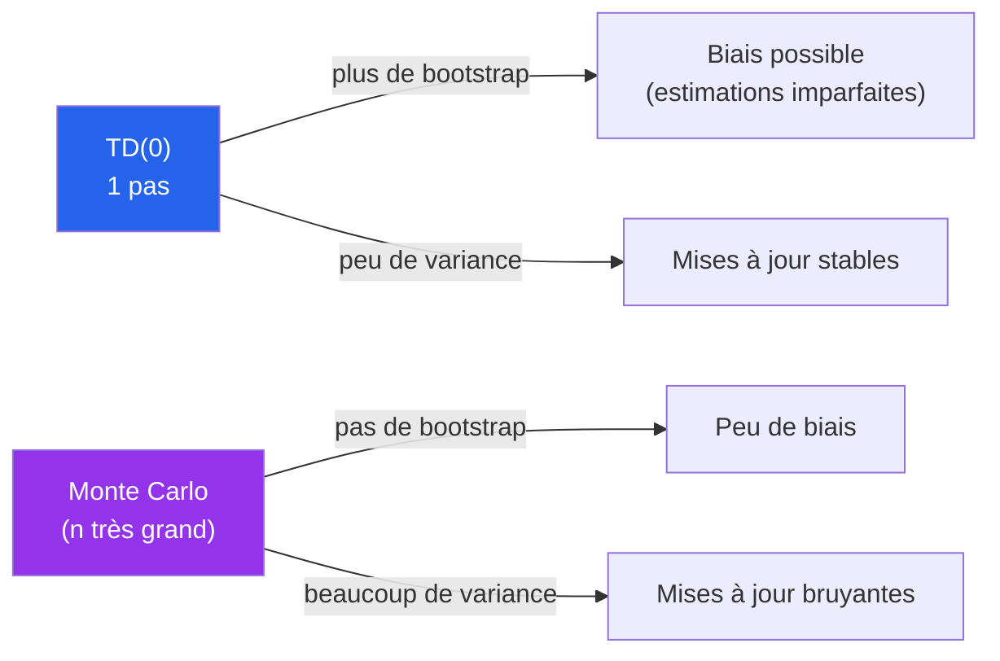
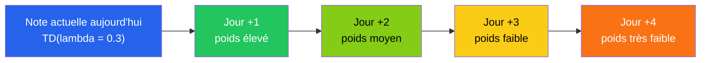
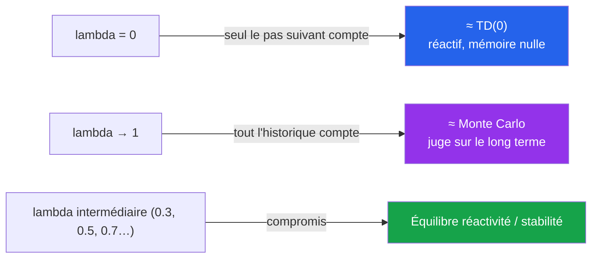
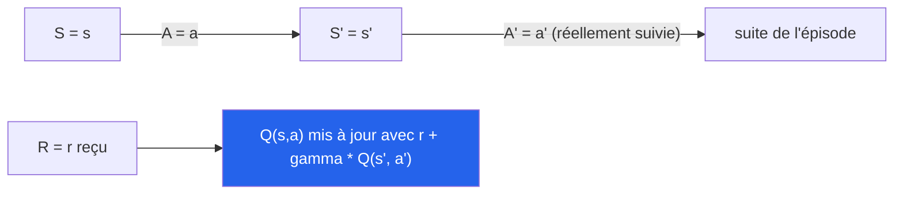
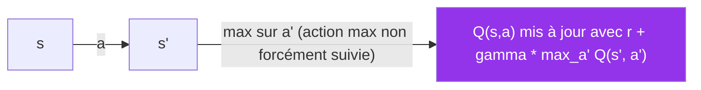
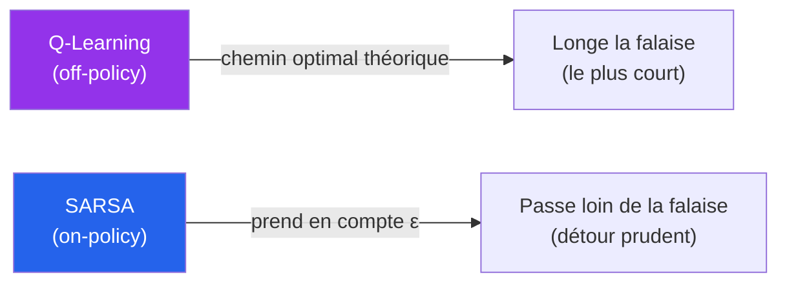
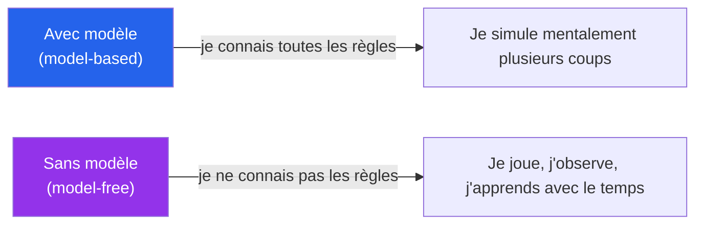
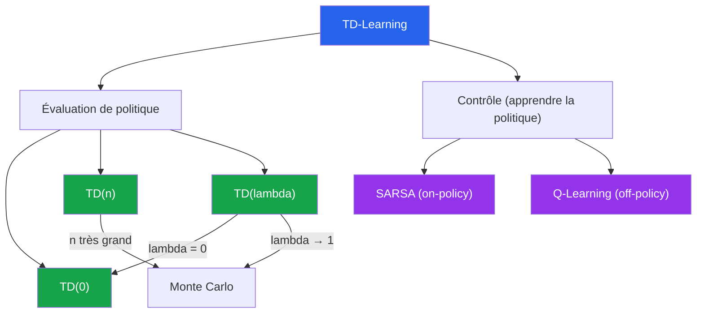

<a id="top"></a>

# TD-Learning — Théorie, Équations, TD(n) vs TD(λ), SARSA et Q-Learning

## Table des matières

| # | Section |
|---|---|
| 1 | [Pourquoi le TD-Learning ?](#section-1) |
| 1a | &nbsp;&nbsp;&nbsp;↳ [Limites de Monte Carlo](#section-1) |
| 1b | &nbsp;&nbsp;&nbsp;↳ [Idée centrale : apprendre au fil de l'expérience](#section-1) |
| 1c | &nbsp;&nbsp;&nbsp;↳ [Analogies de la vie courante](#section-1) |
| 2 | [Concepts clés et notations](#section-2) |
| 2a | &nbsp;&nbsp;&nbsp;↳ [V(s), Q(s,a), α, γ, bootstrap](#section-2) |
| 2b | &nbsp;&nbsp;&nbsp;↳ [Bootstrap — c'est quoi exactement ?](#section-2) |
| 2c | &nbsp;&nbsp;&nbsp;↳ [Erreur TD (Temporal Difference Error)](#section-2) |
| 3 | [TD(0) — Mise à jour à un pas](#section-3) |
| 3a | &nbsp;&nbsp;&nbsp;↳ [Équation et intuition](#section-3) |
| 3b | &nbsp;&nbsp;&nbsp;↳ [Forme « mélange » avec (1−α)](#section-3) |
| 4 | [TD(n) — Mises à jour à n pas](#section-4) |
| 4a | &nbsp;&nbsp;&nbsp;↳ [TD(1), TD(2), TD(3), …, TD(n)](#section-4) |
| 4b | &nbsp;&nbsp;&nbsp;↳ [Compromis biais ↔ variance](#section-4) |
| 5 | [Attention — TD(n) **n'est pas** TD(λ)](#section-5) |
| 5a | &nbsp;&nbsp;&nbsp;↳ [n entier vs λ ∈ [0,1]](#section-5) |
| 5b | &nbsp;&nbsp;&nbsp;↳ [Tableau de comparaison](#section-5) |
| 6 | [TD(λ) — combinaison pondérée d'horizons](#section-6) |
| 6a | &nbsp;&nbsp;&nbsp;↳ [Analogie de l'employé (jour +1, +2, +3, …)](#section-6) |
| 6b | &nbsp;&nbsp;&nbsp;↳ [Analogie alimentaire — la semaine saine et le McDo](#section-6) |
| 6c | &nbsp;&nbsp;&nbsp;↳ [Cas limites λ = 0 et λ → 1](#section-6) |
| 6d | &nbsp;&nbsp;&nbsp;↳ [Comment choisir la valeur de λ ?](#section-6) |
| 6e | &nbsp;&nbsp;&nbsp;↳ [Exemple TD(λ) : l'investisseur sur le marché financier](#section-6) |
| 6f | &nbsp;&nbsp;&nbsp;↳ [Deux exemples : « le début compte » vs « la fin compte »](#section-6) |
| 7 | [De TD vers le contrôle — SARSA et Q-Learning](#section-7) |
| 7a | &nbsp;&nbsp;&nbsp;↳ [Pourquoi passer de V(s) à Q(s,a) ?](#section-7) |
| 7b | &nbsp;&nbsp;&nbsp;↳ [SARSA — décomposition de l'acronyme et intuition](#section-7) |
| 7c | &nbsp;&nbsp;&nbsp;↳ [SARSA — pseudo-code complet](#section-7) |
| 7d | &nbsp;&nbsp;&nbsp;↳ [SARSA — exemple numérique pas à pas](#section-7) |
| 7e | &nbsp;&nbsp;&nbsp;↳ [SARSA vs TD(0) — quelle parenté ?](#section-7) |
| 7f | &nbsp;&nbsp;&nbsp;↳ [Q-Learning (off-policy)](#section-7) |
| 7g | &nbsp;&nbsp;&nbsp;↳ [SARSA vs Q-Learning — l'exemple Cliff Walking](#section-7) |
| 7h | &nbsp;&nbsp;&nbsp;↳ [Tableau récapitulatif](#section-7) |
| 8 | [Bellman — fondement théorique du TD](#section-8) |
| 8a | &nbsp;&nbsp;&nbsp;↳ [Bellman pour V et Q sous une politique π](#section-8) |
| 8b | &nbsp;&nbsp;&nbsp;↳ [Bellman optimalité — V★(s) et Q★(s,a)](#section-8) |
| 8c | &nbsp;&nbsp;&nbsp;↳ [Lien avec TD et Q-Learning](#section-8) |
| 9 | [Exemples numériques pas à pas](#section-9) |
| 9a | &nbsp;&nbsp;&nbsp;↳ [Exemple 1 — TD(0) avec récompense](#section-9) |
| 9b | &nbsp;&nbsp;&nbsp;↳ [Exemple 2 — Bootstrap TD(1) vs Monte Carlo](#section-9) |
| 9c | &nbsp;&nbsp;&nbsp;↳ [Exemple 3 — Q-Learning](#section-9) |
| 10 | [Note pédagogique — la convention TD(0) « bootstrap pur »](#section-10) |
| 11 | [Model-based vs Model-free](#section-11) |
| 12 | [Applications industrielles](#section-12) |
| 12a | &nbsp;&nbsp;&nbsp;↳ [Détection de fraude bancaire](#section-12) |
| 12b | &nbsp;&nbsp;&nbsp;↳ [Cybersécurité (IDS/IPS, SIEM, forensic)](#section-12) |
| 12c | &nbsp;&nbsp;&nbsp;↳ [Data centers, trading, robotique, recommandation](#section-12) |
| 12d | &nbsp;&nbsp;&nbsp;↳ [Le rôle de SARSA — politiques prudentes](#section-12) |
| 13 | [Exemples de la vie quotidienne](#section-13) |
| 14 | [Quiz 1 — TD(0) et TD(n)](#section-14) |
| 15 | [Quiz 2 — TD(λ), SARSA / Q-Learning et applications](#section-15) |
| 16 | [Travail à réaliser — Activité TP](#section-16) |
| 17 | [Pratiques sur Colab — Code Python prêt à l'emploi](#section-17) |
| 17a | &nbsp;&nbsp;&nbsp;↳ [Setup — Installer les dépendances](#section-17) |
| 17b | &nbsp;&nbsp;&nbsp;↳ [Pratique 1 — TD(0) sur GridWorld minimal](#section-17) |
| 17c | &nbsp;&nbsp;&nbsp;↳ [Pratique 2 — TD(n) avec n variable](#section-17) |
| 17d | &nbsp;&nbsp;&nbsp;↳ [Pratique 3 — TD(λ) avec traces d'éligibilité](#section-17) |
| 17e | &nbsp;&nbsp;&nbsp;↳ [Pratique 4 — SARSA sur FrozenLake](#section-17) |
| 17f | &nbsp;&nbsp;&nbsp;↳ [Pratique 5 — Q-Learning sur FrozenLake](#section-17) |
| 17g | &nbsp;&nbsp;&nbsp;↳ [Pratique 6 — SARSA vs Q-Learning sur Cliff Walking](#section-17) |
| 17h | &nbsp;&nbsp;&nbsp;↳ [Pratique 7 — Comparer α, γ, ε (hyperparamètres)](#section-17) |
| 18 | [Synthèse du chapitre](#section-18) |

---

## Équations de référence

### Description des termes (à connaître par cœur)

| Symbole | Nom | Rôle / lecture intuitive |
|---|---|---|
| $V(s)$ | Valeur d'un état | « À quel point cet état est-il bon ? » |
| $Q(s,a)$ | Valeur état-action | « Faire l'action $a$ depuis $s$ est-il bon ? » |
| $R\_{t+1}$ | Récompense immédiate | Signal **observé** juste après l'action |
| $\gamma \in [0,1]$ | Facteur de discount | Importance des récompenses futures (0 = myope, 1 = prévoyant) |
| $\alpha \in [0,1]$ | Taux d'apprentissage | **Vitesse de mise à jour** — combien on tient compte du nouveau |
| $1 - \alpha$ | Inertie | **Part de l'ancien savoir conservée** |
| $\delta_t$ | Erreur TD | **Surprise** : différence entre cible bootstrapée et estimé courant |
| $G_t^{(n)}$ | Retour à $n$ pas | $n$ récompenses observées + bootstrap sur $V(S\_{t+n})$ |
| $G_t^{\lambda}$ | Retour λ-pondéré | Combinaison de tous les $G_t^{(n)}$ avec poids $\lambda^{n-1}$ |
| $\pi$ | Politique | Stratégie de choix d'action — $\pi(a \mid s)$ |

> _Lecture clé pour les équations TD :_ **« $\alpha$ contrôle combien on **intègre du nouveau**, $1-\alpha$ combien on **garde du passé** »**.

---

### Pour chaque méthode TD : trois écritures équivalentes

Pour chaque méthode TD, on donne **trois formes équivalentes** :

- **(a) Forme « erreur TD »** — la plus courante en littérature :
  $$\text{nouveau} = \text{ancien} + \alpha \times (\text{cible} - \text{ancien})$$
- **(b) Forme « mélange pondéré »** $(1-\alpha)$ — la plus pédagogique :
  $$\text{nouveau} = (1-\alpha) \cdot \text{ancien} + \alpha \cdot \text{cible}$$
- **(c) Forme annotée** — la même que (b), avec **les rôles de chaque terme explicités** sous l'équation (avec `\underbrace`).

Les trois donnent **exactement le même résultat numérique**.

---

<a id="eq-td0"></a>

**Éq. (1)** — TD(0) — mise à jour à un pas

**(1a) Forme « erreur TD » :**

$$V(S_t) \leftarrow V(S_t) + \alpha \left[ R\_{t+1} + \gamma V(S\_{t+1}) - V(S_t) \right]$$

**(1b) Forme « mélange pondéré » $(1-\alpha)$ :**

$$V(S_t) \leftarrow (1-\alpha) \cdot V(S_t) + \alpha \cdot \left[ R\_{t+1} + \gamma V(S\_{t+1}) \right]$$

**(1c) Forme annotée :**

$$V(S_t) \leftarrow \underbrace{(1-\alpha) \cdot V(S_t)}\_{\text{garder le passé}} + \underbrace{\alpha \cdot \left[ R\_{t+1} + \gamma V(S\_{t+1}) \right]}\_{\text{intégrer le nouveau}}$$

**Description des termes (rappel) :**

| Terme | Rôle |
|---|---|
| $V(S_t)$ (côté gauche) | **Nouvelle estimation** de la valeur de l'état $S_t$ |
| $(1-\alpha) \cdot V(S_t)$ | **Garder le passé** — part de l'ancienne valeur conservée |
| $\alpha \cdot [\ldots]$ | **Intégrer le nouveau** — part actualisée à partir de l'expérience |
| $R\_{t+1}$ | Récompense **observée** après l'action |
| $\gamma V(S\_{t+1})$ | **Bootstrap** — estimation de la valeur de l'état suivant |
| $\alpha$ | Taux d'apprentissage (vitesse de mise à jour) |
| $\gamma$ | Facteur de discount (importance du futur) |

---

<a id="eq-tdn"></a>

**Éq. (2)** — TD(n) — mise à jour à n pas

**(2a) Forme « erreur TD » :**

$$V(S_t) \leftarrow V(S_t) + \alpha \left[ \sum\_{k=1}^{n} \gamma^{k-1} R\_{t+k} + \gamma^{n} V(S\_{t+n}) - V(S_t) \right]$$

**(2b) Forme « mélange pondéré » $(1-\alpha)$ :**

$$V(S_t) \leftarrow (1-\alpha) \cdot V(S_t) + \alpha \cdot \left[ \sum\_{k=1}^{n} \gamma^{k-1} R\_{t+k} + \gamma^{n} V(S\_{t+n}) \right]$$

**(2c) Forme annotée :**

$$V(S_t) \leftarrow \underbrace{(1-\alpha) \cdot V(S_t)}\_{\text{garder le passé}} + \underbrace{\alpha \cdot \left[ \sum\_{k=1}^{n} \gamma^{k-1} R\_{t+k} + \gamma^{n} V(S\_{t+n}) \right]}\_{\text{intégrer le nouveau}}$$

**Description des termes :**

| Terme | Rôle |
|---|---|
| $(1-\alpha) \cdot V(S_t)$ | **Garder le passé** |
| $\alpha \cdot [\ldots]$ | **Intégrer le nouveau** |
| $\sum\_{k=1}^{n} \gamma^{k-1} R\_{t+k}$ | **n récompenses observées** ($R\_{t+1}, R\_{t+2}, \ldots, R\_{t+n}$) pondérées par $\gamma^{k-1}$ |
| $\gamma^{n} V(S\_{t+n})$ | **Bootstrap final** — estimation de la valeur de l'état atteint $n$ pas plus loin |

---

<a id="eq-tdlambda"></a>

**Éq. (3)** — TD(λ) — combinaison pondérée des retours à n pas (forward view)

Cible λ-pondérée :

$$G_t^{\lambda} = (1-\lambda)\sum\_{n=1}^{\infty} \lambda^{n-1} G_t^{(n)}$$

avec $G_t^{(n)} = \sum\_{k=1}^{n} \gamma^{k-1} R\_{t+k} + \gamma^{n} V(S\_{t+n})$ — le retour à $n$ pas.

**(3a) Forme « erreur TD » :**

$$V(S_t) \leftarrow V(S_t) + \alpha \left[ G_t^{\lambda} - V(S_t) \right]$$

**(3b) Forme « mélange pondéré » $(1-\alpha)$ :**

$$V(S_t) \leftarrow (1-\alpha) \cdot V(S_t) + \alpha \cdot G_t^{\lambda}$$

**(3c) Forme annotée :**

$$V(S_t) \leftarrow \underbrace{(1-\alpha) \cdot V(S_t)}\_{\text{garder le passé}} + \underbrace{\alpha \cdot G_t^{\lambda}}\_{\text{intégrer le nouveau (tous horizons mélangés)}}$$

**Description des termes :**

| Terme | Rôle |
|---|---|
| $\lambda \in [0,1]$ | **Coefficient de décroissance** (mémoire de l'historique) |
| $\lambda^{n-1}$ | Poids du retour à $n$ pas |
| $G_t^{(n)}$ | Retour à $n$ pas (cf. [Éq. (2)](#eq-tdn)) |
| $G_t^{\lambda}$ | **Cible λ-pondérée** — combinaison de **tous** les horizons |
| $(1-\alpha) \cdot V(S_t)$ | Garder le passé |
| $\alpha \cdot G_t^{\lambda}$ | Intégrer le nouveau (mélange de tous les horizons) |

---

<a id="eq-sarsa"></a>

**Éq. (4)** — SARSA (on-policy)

**(4a) Forme « erreur TD » :**

$$Q(S_t, A_t) \leftarrow Q(S_t, A_t) + \alpha \left[ R\_{t+1} + \gamma Q(S\_{t+1}, A\_{t+1}) - Q(S_t, A_t) \right]$$

**(4b) Forme « mélange pondéré » $(1-\alpha)$ :**

$$Q(S_t, A_t) \leftarrow (1-\alpha) \cdot Q(S_t, A_t) + \alpha \cdot \left[ R\_{t+1} + \gamma Q(S\_{t+1}, A\_{t+1}) \right]$$

**(4c) Forme annotée :**

$$Q(S_t, A_t) \leftarrow \underbrace{(1-\alpha) \cdot Q(S_t, A_t)}\_{\text{garder le passé}} + \underbrace{\alpha \cdot \left[ R\_{t+1} + \gamma Q(S\_{t+1}, A\_{t+1}) \right]}\_{\text{intégrer le nouveau (on-policy)}}$$

**Description des termes :**

| Terme | Rôle |
|---|---|
| $Q(S_t, A_t)$ | Valeur estimée du couple **(état, action)** courant |
| $(1-\alpha) \cdot Q(S_t, A_t)$ | **Garder le passé** |
| $\alpha \cdot [\ldots]$ | **Intégrer le nouveau** (on-policy) |
| $R\_{t+1}$ | Récompense observée |
| $Q(S\_{t+1}, A\_{t+1})$ | Valeur de l'**action $A\_{t+1}$ réellement suivie** par la politique courante |
| $\gamma$ | Facteur de discount |

---

<a id="eq-qlearning"></a>

**Éq. (5)** — Q-Learning (off-policy)

**(5a) Forme « erreur TD » :**

$$Q(S_t, A_t) \leftarrow Q(S_t, A_t) + \alpha \left[ R\_{t+1} + \gamma \max\_{a'} Q(S\_{t+1}, a') - Q(S_t, A_t) \right]$$

**(5b) Forme « mélange pondéré » $(1-\alpha)$ :**

$$Q(S_t, A_t) \leftarrow (1-\alpha) \cdot Q(S_t, A_t) + \alpha \cdot \left[ R\_{t+1} + \gamma \max\_{a'} Q(S\_{t+1}, a') \right]$$

**(5c) Forme annotée :**

$$Q(S_t, A_t) \leftarrow \underbrace{(1-\alpha) \cdot Q(S_t, A_t)}\_{\text{garder le passé}} + \underbrace{\alpha \cdot \left[ R\_{t+1} + \gamma \max\_{a'} Q(S\_{t+1}, a') \right]}\_{\text{intégrer le nouveau (off-policy)}}$$

**Description des termes :**

| Terme | Rôle |
|---|---|
| $Q(S_t, A_t)$ | Valeur estimée du couple (état, action) courant |
| $(1-\alpha) \cdot Q(S_t, A_t)$ | **Garder le passé** |
| $\alpha \cdot [\ldots]$ | **Intégrer le nouveau** (off-policy) |
| $R\_{t+1}$ | Récompense observée |
| $\max\_{a'} Q(S\_{t+1}, a')$ | Valeur de la **meilleure action possible** dans $S\_{t+1}$ — *même si l'agent ne la prend pas réellement* |
| $\gamma$ | Facteur de discount |

---

### Lecture en image — α et 1−α côte à côte

Toutes les méthodes TD partagent la **même structure de mise à jour** :

$$V(s) \leftarrow \underbrace{(1-\alpha) \cdot V(s)}\_{\text{garder le passé}} + \underbrace{\alpha \cdot G_t}\_{\text{intégrer le nouveau}}$$

| Bloc | Lecture |
|---|---|
| $(1-\alpha) \cdot V(s)$ | **Ancien savoir conservé** |
| $\alpha \cdot G_t$ | **Nouveau intégré** |

(La même structure tient pour $Q(s,a)$ : remplacer $V(s)$ par $Q(s,a)$, et $G_t$ par la cible appropriée — $r + \gamma Q(s',a')$ pour SARSA, $r + \gamma \max\_{a'} Q(s',a')$ pour Q-Learning.)

| α | $1-\alpha$ | Effet |
|---|---|---|
| 0,01 | 0,99 | **Apprentissage très lent** : l'agent fait à peine bouger sa Q-table |
| 0,1 | 0,9 | **Stable et progressif** : on garde 90 % du savoir, on apprend 10 % de neuf (valeur classique) |
| 0,5 | 0,5 | **Mi-passé / mi-nouveau** : grande mise à jour à chaque pas |
| 0,9 | 0,1 | **Apprentissage très rapide mais instable** : on oublie quasi tout l'ancien |
| 1,0 | 0,0 | **Aucune mémoire** : on remplace intégralement par la dernière cible |

> ⚠️ **Règle pratique :** $\alpha$ trop grand → oscillations / divergence ; $\alpha$ trop petit → convergence trop lente. Valeur de départ saine : **$\alpha \approx 0{,}1$**, à ajuster expérimentalement.

---

### Équations de Bellman (théoriques — sans $\alpha$)

> _Bellman exprime des **espérances** sous une politique. Il n'y a **pas** de taux d'apprentissage ici : ce sont les équations **exactes** de la valeur._

<a id="eq-bellman-v-pi"></a>

**Éq. (6)** — Bellman pour $V^{\pi}$

$$V^{\pi}(s) = \mathbb{E}\_{\pi}\left[ R\_{t+1} + \gamma V^{\pi}(S\_{t+1}) \mid S\_t = s \right]$$

<a id="eq-bellman-q-pi"></a>

**Éq. (7)** — Bellman pour $Q^{\pi}$

$$Q^{\pi}(s,a) = \mathbb{E}\_{\pi}\left[ R\_{t+1} + \gamma Q^{\pi}(S\_{t+1}, A\_{t+1}) \mid S\_t = s, A\_t = a \right]$$

<a id="eq-bellman-v-star"></a>

**Éq. (8)** — Bellman optimalité pour $V^{\ast}$

$$V^{\ast}(s) = \max\_a \mathbb{E}\left[ R\_{t+1} + \gamma V^{\ast}(S\_{t+1}) \mid S\_t = s, A\_t = a \right]$$

<a id="eq-bellman-q-star"></a>

**Éq. (9)** — Bellman optimalité pour $Q^{\ast}$

$$Q^{\ast}(s,a) = \mathbb{E}\left[ R\_{t+1} + \gamma \max\_{a'} Q^{\ast}(S\_{t+1}, a') \mid S\_t = s, A\_t = a \right]$$

> _Lecture intuitive Bellman :_ « **valeur d'aujourd'hui = récompense immédiate attendue + valeur actualisée de l'état suivant** »

---

<a id="section-1"></a>

<details>
<summary>1 — Pourquoi le TD-Learning ?</summary>

<br/>

Le **TD-Learning** (*Temporal Difference Learning*) est une famille de méthodes d'apprentissage par renforcement qui combinent deux idées :

- **Monte Carlo** : apprendre à partir de **l'expérience réelle** de l'agent.
- **Programmation dynamique** : utiliser **les estimations actuelles** pour s'auto-corriger (bootstrap).

> _Plutôt que d'attendre la fin d'un épisode pour apprendre (Monte Carlo), TD ajuste les estimations **après chaque pas** — en temps réel._

---

### 1a — Limites de Monte Carlo

Les méthodes Monte Carlo ont deux faiblesses dans beaucoup d'environnements réalistes :

1. **Il faut attendre la fin de l'épisode** pour mettre à jour les valeurs.
2. **Inadaptées aux environnements continus ou très longs** (un robot qui tourne 24h/24, un jeu sans fin claire, etc.).

Le TD-Learning permet :

- **Apprentissage en ligne** : mises à jour dès la première transition.
- Adaptation aux environnements **continus** ou de très longue durée.
- Combinaison des forces de **Monte Carlo** et de **la programmation dynamique**.

---

#### 📌 Rappel rapide — Monte Carlo et Programmation dynamique

Avant d'aller plus loin, deux notions à avoir en tête :

##### Monte Carlo (MC)

- **Définition :** méthode qui apprend uniquement à partir d'**expériences complètes** — on attend la **fin de l'épisode** pour calculer le retour total $G_t$ et mettre à jour les valeurs.
- **Caractéristique clé :** **pas de modèle requis**, mais on doit **attendre la fin** pour apprendre.

> **Exemple — un match de la Coupe du Monde :** *« Je regarde France contre Brésil. Pour dire **quelle équipe a bien joué** et juger la performance de chaque joueur, je ne peux pas décider après 5 minutes : je dois **attendre la fin du match** (90 minutes + prolongations + tirs au but si nécessaire). C'est seulement à la fin, en voyant le score final et toute la performance, que je peux évaluer **les deux équipes**. »*

> **Exemple — un film au cinéma :** *« Pour dire si c'est un **bon film** ou pas, je ne peux pas trancher après les 10 premières minutes. Beaucoup de films démarrent lentement et deviennent excellents à la fin (ou l'inverse — ils commencent fort puis s'écroulent). Je dois **regarder le film en entier** pour donner une vraie note. »*

> _C'est exactement ça Monte Carlo : **on attend la fin** de l'épisode (match, film, partie, trajet) pour évaluer la valeur de chaque action prise pendant l'épisode._

---

##### Programmation dynamique (DP)

- **Définition :** méthode **planificatrice** qui calcule les valeurs **directement** à partir des équations de Bellman, en utilisant un **modèle complet** de l'environnement (probabilités de transition $P(s' \mid s, a)$ et récompenses $R(s, a)$ connues).
- **Caractéristique clé :** **diviser un gros problème en petits sous-problèmes** plus simples, et combiner leurs solutions. **Pas besoin d'expérimenter**, mais il faut **connaître les règles** à l'avance.

> **L'idée centrale :** *« Un gros problème compliqué = la somme de plusieurs petits sous-problèmes plus simples, dont les solutions se combinent. C'est le principe « **diviser pour régner** ». »*

> **Exemple — faire un doctorat (PhD) :** *« Faire un doctorat en 5 ans est un projet **énorme**. Personne ne le résout d'un seul coup. On le **divise en sous-problèmes** : (1) trouver un sujet de recherche, (2) faire la revue de littérature, (3) publier 3 articles, (4) écrire la thèse, (5) la soutenir. Chaque sous-problème est lui-même divisé : pour publier un article, il faut concevoir l'expérience, collecter les données, écrire, soumettre, réviser. La solution finale (le PhD obtenu) **combine** toutes les solutions des sous-problèmes. »*

> **Exemple — jouer aux échecs avec les règles connues :** *« On peut analyser une position en se demandant : « quelle est la valeur de ma position après mon prochain coup ? ». Pour répondre, on simule tous les coups possibles, puis pour chacun on se redemande la même question récursivement. Le gros problème « quel est mon meilleur coup ? » se décompose en plein de petits sous-problèmes « quelle est la valeur de cette position ? », qui se résolvent à leur tour par décomposition. C'est exactement ce que fait Bellman. »*

> **Exemple — le GPS :** *« Pour aller de Montréal à Vancouver, le GPS ne calcule pas le trajet complet d'un coup. Il **divise** : « Quel est le meilleur trajet de Montréal à chaque ville intermédiaire ? Puis de chaque ville intermédiaire à Vancouver ? ». Il combine ensuite ces sous-trajets optimaux pour reconstruire l'itinéraire global. »*

---

##### Tableau de synthèse — TD = MC + DP

| | Monte Carlo | Programmation dynamique | **TD-Learning** |
|---|---|---|---|
| **Modèle requis ?** | ❌ Non | ✅ Oui | ❌ Non |
| **Attendre la fin ?** | ✅ Oui (épisode complet) | ❌ Non (planification) | ❌ Non (mise à jour à chaque pas) |
| **Bootstrap ?** | ❌ Non (vraies récompenses) | ✅ Oui (utilise $V(s')$) | ✅ Oui (utilise $V(s')$ ou $Q(s', a')$) |
| **Type d'apprentissage** | Empirique, lent | Théorique, calculé | Empirique, rapide |

> 💡 **TD-Learning prend le meilleur des deux :**
> - de **Monte Carlo** : il **n'a pas besoin de modèle** (apprend par expérience).
> - de **Programmation dynamique** : il utilise le **bootstrap** (n'attend pas la fin de l'épisode).

---

### 1b — Idée centrale : apprendre au fil de l'expérience



> _En français très simple : « regarde, ajuste, puis apprends — pas l'inverse. »_

---

### 1c — Analogies de la vie courante

- **Saler ses pâtes** : on goûte à 3 min, on ajoute du sel, on regoûte à 5 min, on ajuste. On corrige à chaque étape (TD), on n'attend pas la fin.
- **Régler la température de la douche** : on teste, on tourne le robinet, on retesta. On ne reste **pas** 10 min à attendre que ça s'arrange.
- **Karaoké** : à chaque fausse note, on ajuste le ton. Pas besoin de finir la chanson pour corriger.

> _Et un proverbe ancien qui résume bien l'idée : « Tes yeux sont ta balance » — on ajuste en fonction de ce qu'on voit, ici et maintenant._

---

### 1d — Exemple-clé : « ce que je pensais vs ce que j'observe »

**Le cœur du TD-Learning, c'est l'écart entre une prédiction et la réalité observée.**

#### Exemple 1 — Le sommeil

Le soir, je me dis :

> *« Je vais bien dormir cette nuit, demain matin je me sentirai en pleine forme. »* — **prédiction**

Le lendemain matin, je me réveille fatigué·e :

> *« En fait, je me sens groggy. »* — **observation**

L'écart entre les deux = **erreur TD** $\delta$.

- Si $\delta < 0$ (j'attendais mieux que ce que j'ai eu) → la prochaine fois, je **baisse** ma prédiction (« mieux dormir ne suffira peut-être pas »).
- Si $\delta > 0$ (mieux que prévu) → je **monte** ma prédiction.

> _C'est exactement ce que fait un agent TD : il **ajuste sa croyance** en fonction de la **différence** entre ce qu'il pensait et ce qu'il observe vraiment._

---

#### Exemple 2 — L'investisseur amateur

> *« J'achète cette action à 1000 $. Je pense qu'elle vaudra 1200 $ dans une semaine. »* — **prédiction $V(s) = 1200$**

Au bout d'une semaine, l'action vaut 1100 $ :

> Erreur TD : $\delta = 1100 - 1200 = -100$

L'investisseur ajuste sa prédiction pour la prochaine fois :

$$V(s) \leftarrow V(s) + \alpha \times \delta = 1200 + 0{,}1 \times (-100) = 1190$$

Avec $\alpha = 0{,}1$, il **descend** sa prédiction de 10 $ — pas de 100 $ d'un coup, par prudence.

> _Plus il fera ce type d'écart, plus sa prédiction se rapprochera progressivement de la vraie valeur du marché._

---

#### Exemple 3 — La météo

> *« Je prédis 25 °C et soleil pour demain. »* — **prédiction $V(s)$**

Le lendemain : **18 °C et pluie**.

- Erreur TD énorme et négative.
- Le modèle météo **corrige** ses paramètres pour la prochaine prédiction (sans attendre la fin du mois pour faire un bilan global — c'est ça la **mise à jour temporelle**).

> _Tous les systèmes de prédiction « en ligne » (météo, fraude, recommandation) suivent cette logique TD._

</details>

<p align="right"><a href="#top">↑ Retour en haut</a></p>

---

<a id="section-2"></a>

<details>
<summary>2 — Concepts clés et notations</summary>

<br/>

### 2a — V(s), Q(s,a), α, γ, bootstrap

| Symbole | Nom | Rôle |
|---|---|---|
| $V(s)$ | Valeur d'un état | « À quel point cet état est-il bon ? » |
| $Q(s,a)$ | Valeur état-action | « À quel point faire l'action $a$ depuis $s$ est-il bon ? » |
| $R\_{t+1}$ | Récompense immédiate | Signal reçu juste après l'action |
| $\alpha \in [0,1]$ | Taux d'apprentissage | Vitesse de mise à jour (gros = on apprend vite, petit = on est prudent) |
| $\gamma \in [0,1]$ | Facteur de discount | Importance des récompenses futures (myope vs prévoyant) |
| **Bootstrap** | Auto-référence | On utilise une **estimation** (ex. $V(S\_{t+1})$) à l'intérieur d'une mise à jour, au lieu d'attendre la vraie observation finale |

---

### 2b — Bootstrap — c'est quoi exactement ?

Le mot **bootstrap** vient de l'expression anglaise « *to pull oneself up by one's bootstraps* » → littéralement *« se hisser soi-même par ses propres lacets de bottes »*.

> _En apprentissage par renforcement, **bootstrap = utiliser ses propres estimations actuelles pour s'auto-corriger**._

#### Sans bootstrap (Monte Carlo)

> *« J'attends la fin de l'épisode pour voir le vrai retour total, et seulement là je mets à jour. »*

- Avantage : on utilise **uniquement** des récompenses **réelles** observées.
- Inconvénient : on doit **attendre** très longtemps (parfois des heures ou jamais si l'épisode est infini).

#### Avec bootstrap (TD-Learning)

> *« Je n'attends pas. J'utilise ma propre estimation actuelle de la valeur de l'état suivant pour m'ajuster maintenant. »*

- Avantage : mise à jour **immédiate**, dès la première transition.
- Inconvénient : on s'appuie sur des estimations qui peuvent être **fausses au début** → biais possible.

#### Analogie concrète — l'apprenti chef

Tu apprends à cuisiner sans avoir encore fini ton plat :

| Situation | Sans bootstrap (Monte Carlo) | Avec bootstrap (TD) |
|---|---|---|
| Tu goûtes ta sauce à mi-cuisson | « J'attends que ce soit fini pour juger » | « Je goûte maintenant, je trouve ça déjà trop salé → j'ajuste tout de suite » |
| Tu prédis si le plat sera bon | À la fin seulement | À chaque étape, avec ton **estimation actuelle** |

> 💡 **Lecture-clé :** dans la formule TD(0) `V(s) ← V(s) + α [r + γ V(s') − V(s)]`, le terme **`γ V(s')`** est le **bootstrap** — on utilise notre **propre estimation** de la valeur de `s'` (qui peut être fausse), au lieu d'attendre la vraie valeur.

#### Phrase à graver

> **« Bootstrap = corriger une estimation avec une autre estimation, sans attendre la vraie réponse. »**

---

### 2c — Erreur TD (Temporal Difference Error)

L'**erreur TD** mesure la **surprise** entre ce que l'agent croyait et ce qu'il observe maintenant :

$$\delta_t = \underbrace{R\_{t+1} + \gamma V(S\_{t+1})}\_{\text{cible bootstrapée}} - \underbrace{V(S_t)}\_{\text{estimé courant}}$$

| Terme | Sens |
|---|---|
| $R\_{t+1} + \gamma V(S\_{t+1})$ | **Cible bootstrapée** : récompense observée + estimation de la valeur future |
| $V(S_t)$ | **Estimé courant** : ce que l'agent croyait avant d'agir |
| $\delta_t$ | **Erreur TD** : différence entre les deux (la « surprise ») |

> _Voir aussi **(→ [Éq. (1a)](#eq-td0))** : $V(S_t) \leftarrow V(S_t) + \alpha\, \delta_t$ — la mise à jour TD(0) est juste un pas dans la direction de l'erreur._


> _Si $\delta_t > 0$, l'agent était trop pessimiste → il monte la valeur._
> _Si $\delta_t < 0$, l'agent était trop optimiste → il baisse la valeur._
> _Si $\delta_t = 0$, l'agent avait déjà raison → rien ne change._

</details>

<p align="right"><a href="#top">↑ Retour en haut</a></p>

---

<a id="section-3"></a>

<details>
<summary>3 — TD(0) — Mise à jour à un pas</summary>

<br/>

### 3a — Équation et intuition

C'est la version la plus simple du TD-Learning. **(→ [Éq. 1](#eq-td0))**

$$V(S_t) \leftarrow V(S_t) + \alpha \left[ R\_{t+1} + \gamma  V(S\_{t+1}) - V(S_t) \right]$$

> _Le « 0 » dans **TD(0)** signifie qu'on ne regarde **qu'un seul pas** dans le futur : l'état suivant et la récompense immédiate, pas plus loin._



---

### 3b — Forme « mélange » avec (1 − α)

La même équation peut s'écrire de manière plus parlante :

$$V(S_t) \leftarrow (1-\alpha)  V(S_t) + \alpha \left[ R\_{t+1} + \gamma  V(S\_{t+1}) \right]$$

| α | (1 − α) | Lecture intuitive |
|---|---|---|
| 0,1 | 0,9 | On garde **90 %** de l'ancienne estimation, on n'apprend que **10 %** du nouveau |
| 0,5 | 0,5 | Mi-confiance ancien / nouveau |
| 0,9 | 0,1 | On **oublie** vite l'ancien : 10 % gardé, 90 % recalculé sur la dernière info |

> _Avantage pédagogique : on voit explicitement l'**équilibre** entre « ce que je savais » et « ce que je viens d'apprendre »._

</details>

<p align="right"><a href="#top">↑ Retour en haut</a></p>

---

<a id="section-4"></a>

<details>
<summary>4 — TD(n) — Mises à jour à n pas</summary>

<br/>

### 4a — TD(1), TD(2), TD(3), …, TD(n)

Au lieu de regarder un seul pas comme TD(0), on peut accumuler **n récompenses futures** avant de bootstraper avec la valeur de l'état atteint.

| Méthode | Combien d'étapes futures regardées avant de bootstraper ? |
|---|---|
| **TD(0)** | 1 récompense + valeur de l'état suivant |
| **TD(1)** | 2 récompenses + valeur deux pas plus loin |
| **TD(2)** | 3 récompenses + valeur trois pas plus loin |
| **TD(n)** | n récompenses + valeur n pas plus loin |

> _Note de notation : suivant les ouvrages, certains comptent TD(0) = 1 pas, TD(1) = 2 pas. Ce qui compte, c'est l'idée : **plus n grandit, plus on s'éloigne du bootstrap pur et plus on se rapproche de Monte Carlo**._

**Forme générale (→ [Éq. 2](#eq-tdn)) :**

$$V(S_t) \leftarrow V(S_t) + \alpha \left[ \sum\_{k=1}^{n} \gamma^{k-1} R\_{t+k} + \gamma^{n} V(S\_{t+n}) - V(S_t) \right]$$

**Forme annotée :**

$$V(S_t) \leftarrow V(S_t) + \alpha \left[ \underbrace{\sum\_{k=1}^{n} \gamma^{k-1} R\_{t+k}}\_{\text{récompenses observées}} + \underbrace{\gamma^{n} V(S\_{t+n})}\_{\text{bootstrap final}} - V(S_t) \right]$$

| Bloc de l'équation | Lecture |
|---|---|
| $\sum\_{k=1}^{n} \gamma^{k-1} R\_{t+k}$ | $n$ **récompenses observées** ($R\_{t+1}, R\_{t+2}, \ldots, R\_{t+n}$) — partie réelle |
| $\gamma^{n} V(S\_{t+n})$ | **Bootstrap final** — estimation à partir de l'état atteint $n$ pas plus loin |
| $V(S_t)$ (à droite, dans le crochet) | Estimé courant qu'on cherche à corriger |

---

### 4b — Compromis biais ↔ variance



| Méthode | Biais | Variance | Vitesse d'apprentissage |
|---|---|---|---|
| **TD(0)** | Plus élevé | Faible | Rapide, mais vue courte |
| **TD(n)** intermédiaire | Modéré | Modérée | Bon compromis |
| **Monte Carlo** | Faible | Élevée | Lent, demande la fin de l'épisode |

> _TD(n) est un curseur entre **bootstrap pur** (TD(0)) et **observation pure** (Monte Carlo)._

---

### 4c — Exemple détaillé : prédire le prix du baril « Pétrolex »

> *« Imagine un baril de pétrole fictif appelé **Pétrolex** qui cotait autour de **90 $** en début de semaine. Comment un modèle apprend-il à prédire son évolution avec TD(0), TD(1), TD(2), TD(3) ? »*

#### Contexte

Un trader prédit la valeur **future** du baril Pétrolex. À chaque jour, il observe le prix réel et ajuste sa prédiction.

| Jour | Prix observé (USD) |
|---|---|
| Jour 0 (lundi) | 90 |
| Jour 1 (mardi) | 92 |
| Jour 2 (mercredi) | 95 |
| Jour 3 (jeudi) | 88 |
| Jour 4 (vendredi) | 75 ⚠️ (annonce surprise — chute brutale) |

Sa prédiction initiale du **lundi** : $V(\text{lundi}) = 100$ (il pensait que ça monterait).
Paramètres : $\alpha = 0{,}1$, $\gamma = 0{,}9$.

---

#### TD(0) — Ajustement le mardi seulement

Le mardi soir, on observe $R = 92$ et $V(\text{mardi}) = 95$ (estimé du jour suivant).

$$\delta = R + \gamma V(\text{mardi}) - V(\text{lundi}) = 92 + 0{,}9 \times 95 - 100 = 77{,}5$$

$$V(\text{lundi}) \leftarrow 100 + 0{,}1 \times 77{,}5 = \mathbf{107{,}75}$$

> *Le modèle remonte sa prédiction (cible plus haute que prévu).*

---

#### TD(1) — On attend **2 jours** avant d'ajuster

Cible : $R\_{t+1} + \gamma R\_{t+2} + \gamma^2 V(\text{mercredi})$
$= 92 + 0{,}9 \times 95 + 0{,}9^2 \times 88 = 92 + 85{,}5 + 71{,}28 = 248{,}78$

$$V(\text{lundi}) \leftarrow 100 + 0{,}1 \times (248{,}78 - 100) = 114{,}88$$

> *On a plus d'information, mais on a attendu 2 jours.*

---

#### TD(3) — On attend **4 jours** : on voit la chute du vendredi !

Cible : $R\_{t+1} + \gamma R\_{t+2} + \gamma^2 R\_{t+3} + \gamma^3 R\_{t+4} + \gamma^4 V(\text{lundi suivant})$

$= 92 + 0{,}9(95) + 0{,}81(88) + 0{,}729(75) + \ldots$

$\approx 92 + 85{,}5 + 71{,}28 + 54{,}68 + \ldots \approx \mathbf{303{,}5}$ (avec un bootstrap final)

$$V(\text{lundi}) \leftarrow 100 + 0{,}1 \times (303{,}5 - 100) = 120{,}35$$

> *Mais attention : on a **attendu 4 jours** pour apprendre. Si on doit décider lundi, c'est trop tard !*

---

#### Tableau récapitulatif

| Méthode | Combien de jours d'attente ? | Information utilisée | Verdict |
|---|---|---|---|
| **TD(0)** | 1 jour | Mardi uniquement | **Très réactif**, mais ignore la chute du vendredi |
| **TD(1)** | 2 jours | Mardi + Mercredi | Compromis |
| **TD(3)** | 4 jours | Mardi → Vendredi | **Très précis**, mais info **trop tardive** pour décider lundi |
| **Monte Carlo** | Toute la semaine | Tous les jours observés | Précis mais **très en retard** |

> ⚠️ **Leçon-clé :** dans le **trading** (et la fraude bancaire, la cybersécurité, etc.), on **n'a pas** le luxe d'attendre 4 jours. C'est pourquoi **TD(0)** ou **TD(1)** sont privilégiés en production. TD(3) est utile pour le **backtesting** ou les analyses **a posteriori**.

---

### 4d — Exemple : prédiction météo

Les modèles de météo utilisent du TD-Learning massivement. Prenons une prédiction sur **5 jours** :

| Jour | Prédit (matin) | Observé (soir) |
|---|---|---|
| Lundi | 25 °C, soleil | 25 °C ✓ |
| Mardi | 26 °C, soleil | 22 °C, nuageux ⚠️ |
| Mercredi | 24 °C, soleil | **18 °C, pluie** ⚠️⚠️ |

- **TD(0)** : ajuste **chaque soir** dès qu'on observe l'écart. Très réactif aux changements brusques (orage soudain).
- **TD(3)** : ajuste après 3 jours, lisse les fluctuations. Plus stable mais plus lent à réagir.
- **Monte Carlo** : attend la fin du mois pour faire un bilan global. **Inutile** pour décider de prendre son parapluie demain.

> _Conclusion : pour des **décisions immédiates** (prendre un parapluie, sortir un drone, geler une transaction bancaire), on veut **TD(0)** ou **TD(1)**. Pour de l'**analyse climatique sur l'année**, Monte Carlo._

</details>

<p align="right"><a href="#top">↑ Retour en haut</a></p>

---

<a id="section-5"></a>

<details>
<summary>5 — Attention — TD(n) n'est PAS TD(λ)</summary>

<br/>

C'est une **confusion classique** chez les étudiants. **Il ne faut surtout pas lire `TD(0.3)` comme si c'était `TD(3)`.**

---

### 5a — n entier vs λ ∈ [0,1]

#### TD(n) — `n` est un **nombre entier** de pas

> « Pour mettre à jour la note d'aujourd'hui, je regarde **exactement** $n$ pas dans le futur, et **rien** au-delà. »

Exemple — TD(3) avec l'analogie de l'employé :

> « Pour ajuster la note d'aujourd'hui, je regarde sa performance sur **exactement 3 jours** suivants. Le 4ᵉ jour, le 5ᵉ jour, etc., **n'entrent pas** dans cette mise à jour. »

#### TD(λ) — `λ` est un **coefficient de décroissance** (réel ∈ [0, 1])

> « Je tiens compte de **toutes** les étapes futures, mais avec une **importance qui diminue** au fur et à mesure qu'on s'éloigne. La vitesse de cette diminution est contrôlée par λ. »

Exemple — TD(λ = 0,3) :

> « Je donne du poids au jour +1, un peu moins au jour +2, encore moins au jour +3… avec des poids qui suivent $1, 0{,}3, 0{,}3^2, 0{,}3^3, \ldots$ »

---

### 5b — Tableau de comparaison

| Aspect | **TD(n)** | **TD(λ)** |
|---|---|---|
| Type du paramètre | **Entier** $n \in \{1, 2, 3, \ldots\}$ | **Réel** $\lambda \in [0, 1]$ |
| Lecture intuitive | « Bloc fixe de $n$ pas » | « Mémoire qui s'efface progressivement » |
| Ce qu'on prend en compte | **Exactement** $n$ pas, **rien** au-delà | **Tous** les pas, mais avec poids décroissants |
| Cas limites | TD(1), TD(2), …, $n \to \infty$ ≈ Monte Carlo | $\lambda = 0$ ≈ TD(0), $\lambda \to 1$ ≈ Monte Carlo |
| Ex. d'écriture | TD(3) | TD(0.3) |
| Confusion à éviter | TD(0.3) **n'est pas** TD(3) | TD(3) **n'est pas** TD(λ = 3) (impossible : λ ≤ 1) |

> ⚠️ **Règle à retenir :** TD(n) → un nombre **entier** de pas. TD(λ) → un **coefficient** de décroissance entre 0 et 1.

</details>

<p align="right"><a href="#top">↑ Retour en haut</a></p>

---

<a id="section-6"></a>

<details>
<summary>6 — TD(λ) — combinaison pondérée d'horizons</summary>

<br/>

L'idée de TD(λ) est de **combiner** plusieurs horizons (1 pas, 2 pas, 3 pas, …) en un seul retour, avec des poids qui décroissent géométriquement selon λ. **(→ [Éq. 3](#eq-tdlambda))**

$$G_t^{\lambda} = (1-\lambda)\sum\_{n=1}^{\infty} \lambda^{ n-1}  G_t^{(n)}$$

> _On ne choisit **pas** un seul n : on les **mélange tous**, avec une importance qui décroît._

---

### 6a — Analogie de l'employé (jour +1, +2, +3, …)

> Pour ajuster la note d'aujourd'hui, on tient compte de la performance de l'employé **demain, dans deux jours, dans trois jours, dans quatre jours, etc.**, mais avec une **importance décroissante** au fur et à mesure que l'on s'éloigne dans le temps.

#### Exemple — λ = 0,3 (mémoire courte)

On donne **beaucoup de poids** au Jour +1, puis **de moins en moins** aux jours suivants.



> 💡 **Pourquoi le bloc Mermaid plantait-il avant ?** Parce qu'**aujourd'hui** contient une apostrophe, et que les libellés Mermaid contenant des caractères spéciaux **doivent être entre guillemets** : `["Note actuelle aujourd'hui"]` au lieu de `[Note actuelle aujourd'hui]`. La version ci-dessus rend correctement sur GitHub.

#### Exemple — λ = 0,7 (mémoire plus longue)

Les jours plus lointains gardent encore une **importance non négligeable**.

| Jour à venir | Poids relatif si λ = 0,3 | Poids relatif si λ = 0,7 |
|---|---|---|
| Jour +1 | 1 | 1 |
| Jour +2 | 0,30 | 0,70 |
| Jour +3 | 0,09 | 0,49 |
| Jour +4 | 0,027 | 0,343 |
| Jour +5 | 0,008 | 0,240 |

> _Plus λ est grand, **plus l'historique futur compte** dans la mise à jour._

---

### 6b — Analogie alimentaire — la semaine saine et le McDo

> « J'ai mangé sainement toute la semaine, mais hier j'ai mangé un McDo. Suis-je en mauvaise santé alimentaire ? »

| Méthode | Comment elle juge | Verdict |
|---|---|---|
| **TD(0)** | Ne regarde **qu'hier** | « Tu as mangé un McDo hier → ta semaine est mauvaise. » |
| **TD(λ)** | Combine **plusieurs jours** avec des poids décroissants | « Tu as mangé sainement 6 jours, **un** McDo ne suffit pas à annuler tous tes efforts. » |

- **Plus λ est grand**, plus les repas passés (lundi, mardi, mercredi…) **continuent d'influencer** la note d'aujourd'hui.
- **Plus λ est petit**, plus on se rapproche de **TD(0)** où le **dernier jour domine**.

> _Moralité : TD(λ) lisse le jugement, TD(0) réagit brutalement à la dernière observation._

---

### 6c — Cas limites λ = 0 et λ → 1



> _Donc λ = 1 ne veut **pas** dire « 1 semaine » ; cela veut dire « je prends pratiquement tout l'historique en compte »._

---

### 6d — Comment choisir la valeur de λ ?

**Bonne nouvelle / mauvaise nouvelle :** il **n'existe pas** de formule magique.

> _λ est un **hyperparamètre**, comme α ou γ. On le choisit par **expérimentation**._

**Recette en 4 étapes (style « projet ») :**

1. **Fixer une plage candidate.** Ex. λ ∈ {0,0 ; 0,3 ; 0,5 ; 0,7 ; 0,9}.
2. **Choisir un critère de performance.** Erreur de prédiction moyenne, récompense cumulée, stabilité (variance des courbes), etc.
3. **Lancer plusieurs entraînements** par valeur de λ pour lisser l'aléa, puis **tracer les courbes** d'apprentissage.
4. **Choisir la λ** qui :
   - **converge assez vite** (réactivité),
   - **sans osciller ni diverger** (stabilité),
   - donne une **bonne performance finale**.

| Valeur de λ | Lecture intuitive | Quand est-ce raisonnable ? |
|---|---|---|
| 0 | Mémoire nulle, type TD(0) | Environnement très non-stationnaire, signal très bruité localement |
| 0,3 | Mémoire courte | On veut réagir vite mais éviter le « sur-collage » au tout dernier pas |
| 0,5 – 0,7 | Compromis classique | Bonne valeur par défaut |
| 0,9 | Mémoire longue | Récompenses très différées, comportement proche Monte Carlo |
| 1 | Mémoire infinie | Équivalent Monte Carlo (épisodes finis recommandés) |

> _Phrase à dire en classe :_
> _« Dans nos exemples, λ = 0,3 est choisi pour illustrer un cas de mémoire très courte. En pratique, on choisit λ **expérimentalement**, comme n'importe quel hyperparamètre. »_

---

### 6e — Exemple TD(λ) : l'investisseur sur le marché financier

> *« Reprenons le baril de pétrole. TD(n) regardait n jours fixes. TD(λ) combine **tous** les jours, avec des poids qui décroissent. »*

Reprenons les données :

| Jour | Prix observé |
|---|---|
| Mardi | 92 |
| Mercredi | 95 |
| Jeudi | 88 |
| Vendredi | **75** ⚠️ |
| Lundi suivant | 78 |

Prédiction initiale lundi : $V = 100$.

#### Cas λ = 0,3 (mémoire courte)

L'investisseur donne :
- **Beaucoup de poids** au mardi (poids ≈ 1)
- **Un peu** au mercredi (poids ≈ 0,3)
- **Très peu** au jeudi (poids ≈ 0,09)
- **Quasi rien** au vendredi (poids ≈ 0,027) → **il « rate » presque la chute du vendredi !**

Conséquence : la mise à jour de $V(\text{lundi})$ ressemble surtout à TD(0) — réactive, mais myope.

#### Cas λ = 0,9 (mémoire longue)

- Mardi : poids 1
- Mercredi : 0,9
- Jeudi : 0,81
- Vendredi : **0,729** → la chute est **bien intégrée**
- Lundi : 0,656

Conséquence : la mise à jour **prend en compte** la chute du vendredi → l'investisseur baisse fortement sa prédiction.

#### Cas λ = 0 vs λ = 1

| λ | Comportement | Avec notre exemple |
|---|---|---|
| **0** | Comme TD(0) | Réagit seulement à mardi, ignore la chute |
| **0,3** | Mémoire courte | Voit un peu mercredi, oublie vendredi |
| **0,7** | Compromis | Intègre les 3-4 jours principaux |
| **0,9** | Mémoire longue | Intègre toute la semaine, vendredi compris |
| **1** | Comme Monte Carlo | Attend la fin → moyenne complète, mais arrive trop tard |

> 💡 **Moralité :** dans un marché **stable**, λ petit (~0,3) est suffisant. Dans un marché **volatil avec événements rares mais énormes** (chocs économiques, krachs, annonces brutales), λ grand (~0,9) protège mieux car il **garde en mémoire** le vrai choc qui va arriver.

---

### 6f — Deux exemples de la vraie vie : « le début compte » vs « la fin compte »

> _TD(λ) permet de **régler quel passé compte le plus** — selon le contexte, on veut donner du poids au **début** d'un parcours ou à sa **fin**. Voici deux exemples qui illustrent ces deux logiques opposées._

---

#### Exemple A — Quand le **début** compte le plus : la première impression

**Contexte :** un recruteur évalue un candidat lors d'un entretien d'1 heure.

| Moment | Ce que le candidat fait |
|---|---|
| 0–10 min | **Très bonne entrée**, sourire franc, poignée de main ferme |
| 10–30 min | Réponses correctes, sans plus |
| 30–50 min | Hésite sur une question technique |
| 50–60 min | Sortie banale |

**Verdict du recruteur :** *« Je l'ai trouvé excellent ! »* — alors qu'objectivement le milieu et la fin étaient moyens.

> 🧠 **Pourquoi ?** Notre cerveau pondère les **premières secondes** très fort (effet de **première impression / effet de halo**), puis le reste s'efface vite. Les psychologues appellent ça la **primauté**.

**En TD(λ) — c'est l'équivalent d'un λ petit dans une vue inversée :**

| Moment | Poids effectif dans le jugement final |
|---|---|
| 0–10 min | **1,00** (très fort) |
| 10–30 min | 0,30 |
| 30–50 min | 0,09 |
| 50–60 min | 0,03 |

> _Toute l'évaluation est dominée par la **première observation**, le reste est presque oublié._

---

#### Exemple B — Quand la **fin** compte le plus : l'évaluation d'un employé sur 6 mois

**Contexte :** un manager doit évaluer un employé en fin d'année. L'employé a travaillé pendant 6 mois.

| Mois | Performance |
|---|---|
| Mois 1 (juillet) | 9/10 — démarrage exceptionnel, projet livré en avance |
| Mois 2 (août) | 9/10 — formations brillamment réussies |
| Mois 3 (septembre) | 8/10 — bon travail régulier |
| Mois 4 (octobre) | 7/10 — quelques retards |
| Mois 5 (novembre) | 5/10 — baisse de motivation |
| Mois 6 (décembre) | **3/10** — projet majeur raté, conflit avec un client |

**Verdict du manager :** *« Cette année, sa performance est décevante. »* — alors qu'objectivement la moyenne arithmétique est `(9+9+8+7+5+3)/6 = 6,8 / 10`, ce qui est correct.

> 🧠 **Pourquoi ?** En contexte d'évaluation annuelle, le **récent** pèse beaucoup plus lourd. C'est l'effet de **récence** (*recency bias*) — *« qu'est-ce que tu as fait pour moi dernièrement ? »*.

**En TD(λ) — c'est exactement l'effet d'un λ grand qui privilégie le bootstrap récent :**

| Mois | Poids effectif dans le verdict final |
|---|---|
| Mois 6 (décembre) | **1,00** (le plus récent → le plus important) |
| Mois 5 (novembre) | 0,90 |
| Mois 4 (octobre) | 0,81 |
| Mois 3 (septembre) | 0,73 |
| Mois 2 (août) | 0,66 |
| Mois 1 (juillet) | 0,59 |

#### Calcul du score « TD(λ) » pour cet employé (avec λ = 0,9, normalisé)

$$\text{score} = \frac{1{,}00 \cdot 3 + 0{,}90 \cdot 5 + 0{,}81 \cdot 7 + 0{,}73 \cdot 8 + 0{,}66 \cdot 9 + 0{,}59 \cdot 9}{1{,}00 + 0{,}90 + 0{,}81 + 0{,}73 + 0{,}66 + 0{,}59}$$

$$= \frac{3{,}00 + 4{,}50 + 5{,}67 + 5{,}84 + 5{,}94 + 5{,}31}{4{,}69} = \frac{30{,}26}{4{,}69} \approx \mathbf{6{,}45 / 10}$$

> _Score TD(λ = 0,9) ≈ **6,45** vs moyenne arithmétique = **6,80** → la pondération **descend** légèrement la note à cause du décembre catastrophique._

#### Et avec λ = 0,3 (mémoire courte) — le décembre **écrase tout** :

| Mois | Poids |
|---|---|
| Mois 6 (décembre) | 1,00 |
| Mois 5 | 0,30 |
| Mois 4 | 0,09 |
| Mois 3 | 0,027 |
| Mois 2 | 0,008 |
| Mois 1 | 0,002 |

$$\text{score} \approx \frac{3 \cdot 1 + 5 \cdot 0{,}3 + 7 \cdot 0{,}09 + \ldots}{1 + 0{,}3 + 0{,}09 + \ldots} = \frac{5{,}24}{1{,}43} \approx \mathbf{3{,}66 / 10}$$

> _Score TD(λ = 0,3) ≈ **3,66** → quasiment la note de décembre seule. La performance des 5 premiers mois est presque **invisible**._

---

#### Tableau de synthèse — quel λ pour quelle situation ?

| Situation | λ recommandé | Pourquoi |
|---|---|---|
| **Première impression** (entretien, rendez-vous, présentation) | λ petit + observation **dans l'ordre inverse** | Le début pèse le plus, le reste s'efface |
| **Évaluation d'employé annuel** | λ grand (~0,7–0,9) | On veut équilibrer historique et performance récente |
| **Évaluation strictement « récente »** (bonus de fin d'année) | λ petit (~0,1–0,3) | Le dernier trimestre domine |
| **Bilan de carrière sur 20 ans** | λ très grand (~0,95) | Tout l'historique compte presque autant |

> ⚙️ **Lien avec TD(λ) en RL :** dans un agent qui apprend, λ détermine si la mise à jour de $V(S_t)$ donne du poids au **prochain pas seul** (λ→0) ou à **toute la suite de l'épisode** (λ→1). C'est exactement la même tension qu'entre « première impression » et « évaluation annuelle » dans la vraie vie.

</details>

<p align="right"><a href="#top">↑ Retour en haut</a></p>

---

<a id="section-7"></a>

<details>
<summary>7 — De TD vers le contrôle — SARSA et Q-Learning</summary>

<br/>

TD(0) met à jour des **valeurs d'état** $V(s)$. Pour **prendre des décisions**, on a souvent besoin de **valeurs état-action** $Q(s,a)$. C'est ici qu'arrivent **SARSA** et **Q-Learning** — les deux méthodes de **contrôle** TD les plus importantes.

---

### 7a — Pourquoi passer de V(s) à Q(s,a) ?

| | $V(s)$ | $Q(s,a)$ |
|---|---|---|
| **Question répondue** | « Cet état est-il bon ? » | « Faire telle action depuis cet état est-il bon ? » |
| **Permet de décider sans modèle ?** | ❌ Non — il faudrait connaître les transitions pour savoir vers quel $s'$ chaque action mène | ✅ Oui — il suffit de prendre $\arg\max_a Q(s,a)$ |
| **Méthodes** | TD(0), TD(n), TD(λ), Monte Carlo (évaluation) | **SARSA, Q-Learning, Expected SARSA** (contrôle) |

> _C'est pour cela que **SARSA et Q-Learning travaillent sur $Q(s,a)$** : à partir d'une $Q$-table, on peut directement choisir une action, **sans connaître $P(s' \mid s,a)$**._

---

### 7b — SARSA — décomposition de l'acronyme et intuition

**SARSA** est l'acronyme du **quintuplet** utilisé à chaque mise à jour :

| Lettre | Symbole | Sens |
|---|---|---|
| **S** | $s$ | **State** — état actuel |
| **A** | $a$ | **Action** exécutée dans $s$ |
| **R** | $r$ | **Reward** reçu |
| **S** | $s'$ | **State'** — nouvel état atteint |
| **A** | $a'$ | **Action'** — action suivante effectivement choisie par la politique courante (par ex. ε-greedy) |

**(→ [Éq. 4](#eq-sarsa))**

$$Q(s, a) \leftarrow Q(s, a) + \alpha \left[ r + \gamma  Q(s', a') - Q(s, a) \right]$$

ou de manière équivalente :

$$Q(s, a) \leftarrow (1-\alpha) Q(s, a) + \alpha \left[ r + \gamma  Q(s', a') \right]$$



#### Intuition — un apprentissage **réaliste**

> Imagine un enfant qui apprend à marcher dans une pièce inconnue :
>
> - Il agit selon **sa stratégie actuelle** (parfois aléatoire, parfois prudente).
> - À chaque pas, il reçoit un retour (récompense / chute).
> - Il apprend en fonction des actions qu'il **effectue vraiment**, même si elles ne sont pas parfaites.

**SARSA est on-policy : il apprend la valeur de la politique *vraiment* suivie, exploration ε comprise.**

**Précision technique :** si la politique est ε-greedy avec ε = 0,1, SARSA estime la valeur $Q$ de **cette politique d'exploration** (avec ses 10 % d'aléa), et **pas** $Q^{\ast}$ — la valeur de la politique optimale théorique. C'est plus **prudent**, mais aussi plus **fidèle** au comportement réel de l'agent.

---

#### ⚠️ Question fréquente — « Pourquoi pas de récompense suivante $R\_{t+2}$ ? »

> *« État, action, récompense, état suivant, action suivante… mais pas de récompense suivante ? »*

**Réponse : non, et c'est normal.** Voici pourquoi :

| Quintuplet SARSA | Sens |
|---|---|
| $S_t$ | État actuel — **observé** |
| $A_t$ | Action **choisie** par la politique |
| $R\_{t+1}$ | Récompense **observée** après l'action |
| $S\_{t+1}$ | État suivant — **observé** |
| $A\_{t+1}$ | Action suivante — **choisie**, **pas encore exécutée** |

**On n'attend pas $R\_{t+2}$** parce que :

1. **Une seule récompense est observée par pas** ($R\_{t+1}$). C'est tout ce qu'on a après l'action $A_t$.
2. La **valeur future** des récompenses suivantes est déjà **estimée** par $Q(S\_{t+1}, A\_{t+1})$ — c'est exactement le rôle du **bootstrap**.
3. $Q(S\_{t+1}, A\_{t+1})$ représente *« combien je vais gagner en moyenne à partir de $S\_{t+1}$ si je prends $A\_{t+1}$ et que je suis ma politique ensuite »* — donc toutes les futures récompenses **sont déjà incluses dans cette estimation**.

> 💡 **En une phrase :**
> $r$ = **observé** (1 seule récompense), $Q(s', a')$ = **estimé** (résume toutes les récompenses futures espérées). On n'a **pas** besoin de $R\_{t+2}$, car le bootstrap fait le travail.

#### Comparaison avec un quintuplet « idéal »

| Si on attendait toutes les récompenses futures… | …on aurait Monte Carlo (pas TD) |
|---|---|
| $R\_{t+1}, R\_{t+2}, R\_{t+3}, \ldots$ | C'est **Monte Carlo** : il faut attendre la fin de l'épisode pour tout calculer |
| $r + \gamma Q(s', a')$ (SARSA) | Le bootstrap **remplace** toutes les futures récompenses par une **estimation rapide** |

---

### 7c — SARSA — pseudo-code complet

```text
Initialiser Q(s, a) arbitrairement pour tout (s, a)
Initialiser Q(état_terminal, ·) ← 0

Pour chaque épisode :
    s ← état_initial
    a ← choisir_action(s, Q, epsilon)        # politique ε-greedy
    Tant que s n'est pas terminal :
        Exécuter a, observer r et s'
        a' ← choisir_action(s', Q, epsilon)   # déjà la PROCHAINE action
        Q(s, a) ← Q(s, a) + α [ r + γ Q(s', a') − Q(s, a) ]
        s ← s'
        a ← a'                                 # on AVANCE avec la même action
```

> ⚠️ **Détail crucial :** dans SARSA, on **choisit $a'$ avant** de mettre à jour $Q(s,a)$. C'est cette $a'$ — celle qui **sera vraiment exécutée au prochain pas** — qui est utilisée dans la cible.

---

### 7d — SARSA — exemple numérique pas à pas

**Contexte :** GridWorld, politique ε-greedy.

**Données à un pas $t$ :**

| Élément | Valeur |
|---|---|
| $Q(s, a)$ avant mise à jour | $5{,}0$ |
| Récompense reçue $r$ | $-1$ (coût de pas) |
| État suivant $s'$ : valeurs Q disponibles | $Q(s', \text{nord}) = 3{,}0,\; Q(s', \text{sud}) = 7{,}0,\; Q(s', \text{est}) = 2{,}0,\; Q(s', \text{ouest}) = 4{,}0$ |
| Action $a'$ **effectivement choisie** par la politique ε-greedy | **est** (par exploration aléatoire) → $Q(s', a') = 2{,}0$ |
| $\alpha$, $\gamma$ | $0{,}1$ ; $0{,}9$ |

#### Étape 1 — Cible SARSA

$$\text{cible} = r + \gamma  Q(s', a') = -1 + 0{,}9 \times 2{,}0 = -1 + 1{,}8 = 0{,}8$$

#### Étape 2 — Erreur TD

$$\delta = \text{cible} - Q(s,a) = 0{,}8 - 5{,}0 = -4{,}2$$

#### Étape 3 — Mise à jour

$$Q(s, a) \leftarrow 5{,}0 + 0{,}1 \times (-4{,}2) = \mathbf{4{,}58}$$

> _Comparaison : si on avait fait du Q-Learning ici, on aurait pris $\max\_{a'} Q(s', a') = 7{,}0$ (sud) au lieu de $2{,}0$ (est). La cible aurait été $-1 + 0{,}9 \times 7{,}0 = 5{,}3$, et la mise à jour donnerait $Q(s,a) \leftarrow 5{,}03$. **Q-Learning est plus optimiste** parce qu'il suppose qu'on aurait pris la **meilleure** action ensuite._

---

### 7e — SARSA vs TD(0) — quelle parenté ?

| | **TD(0)** | **SARSA** |
|---|---|---|
| Met à jour | $V(s)$ | $Q(s, a)$ |
| Granularité | État seul | Couple (état, action) |
| Politique | Évaluation passive | **Contrôle** (apprend ET améliore) |
| Action utilisée pour bootstraper | Aucune | $a'$ **réellement suivie** |
| Forme « erreur TD » | $V(s) \leftarrow V(s) + \alpha[r + \gamma V(s') - V(s)]$ | $Q(s,a) \leftarrow Q(s,a) + \alpha[r + \gamma Q(s', a') - Q(s,a)]$ |

> _On peut voir **SARSA comme un TD(0) sur les couples (état, action)** : même principe de bootstrap à un pas, mais granularité plus fine **et** politique active._

---

### 7e bis — SARSA dans la vraie vie : 4 exemples parlants

#### Exemple 1 — Le cuisinier qui apprend une recette

- **État $s$** : ingrédients sur le plan de travail (oignon, ail, viande, ...)
- **Action $a$** : « ajouter du sel »
- **Récompense $r$** : feedback du goûteur (+1 si bon, −1 si trop salé)
- **État suivant $s'$** : le plat avec un peu de sel
- **Action suivante $a'$** : « ajouter du poivre » (l'action qu'il VA réellement faire)

Le cuisinier met à jour son intuition $Q(\text{ingrédients}, \text{saler})$ en fonction de :
- la récompense observée (+1 ou −1)
- l'estimation de ce qu'il va gagner ensuite avec « poivrer » → $Q(s', a')$

> _Il **n'imagine pas** ce qui aurait été optimal (« ajouter du curcuma serait peut-être mieux »). Il apprend selon **ce qu'il fait réellement**._

#### Exemple 2 — Le médecin urgentiste

Un patient arrive aux urgences :
- **$s$** : symptômes observés
- **$a$** : « donner du paracétamol » (choix du médecin selon protocole + un peu d'exploration)
- **$r$** : amélioration légère
- **$s'$** : nouvel état du patient
- **$a'$** : « ordonner une prise de sang » (prochaine action prévue)

Le médecin met à jour sa croyance $Q(\text{symptômes}, \text{paracétamol})$ en fonction de **ce qu'il va vraiment faire ensuite**, pas de l'action « idéale ».

> _C'est typiquement on-policy : on apprend la valeur du **protocole réel**, pas d'un protocole théorique parfait._

#### Exemple 3 — Le robot collaboratif (cobot)

Un cobot dans une usine :
- **$s$** : pièce détectée à 50 cm
- **$a$** : « avancer doucement de 10 cm »
- **$r$** : pas de collision (+1)
- **$s'$** : pièce à 40 cm
- **$a'$** : « tourner légèrement » (par sécurité)

> _Q-Learning aurait dit : « la meilleure action serait d'avancer vite ». **Mais c'est dangereux !** SARSA apprend que la stratégie réellement appliquée (avancer doucement + tourner) est sûre._

#### Exemple 4 — Le trader prudent

- **$s$** : marché baissier
- **$a$** : « vendre 30 % du portefeuille » (politique conservatrice)
- **$r$** : −2 % de perte (mais limitée)
- **$s'$** : marché toujours baissier
- **$a'$** : « attendre » (action conservatrice prévue)

> _Q-Learning aurait recommandé « vendre tout d'un coup » (action théoriquement optimale en cas de chute). SARSA apprend la valeur de la **vraie politique** : prudente, on ne vend pas tout en panique._

---

### 7f — Q-Learning (off-policy)

**(→ [Éq. 5](#eq-qlearning))**

$$Q(s, a) \leftarrow Q(s, a) + \alpha \left[ r + \gamma \max\_{a'} Q(s', a') - Q(s, a) \right]$$

> _Q-Learning utilise $\max\_{a'} Q(s', a')$ : il met à jour **comme si** l'agent allait toujours choisir la **meilleure** action ensuite, **même si** dans la réalité il explore (ε-greedy)._



> _On dit que Q-Learning est **off-policy** : la politique **cible** (greedy sur $Q$) diffère de la politique **de comportement** (ε-greedy)._

#### Différence clé en une ligne

$$\boxed{\;\text{SARSA}: r + \gamma  Q(s', \mathbf{a'\_{\text{suivie}}}) \quad\text{vs}\quad \text{Q-Learning}: r + \gamma \max\_{a'} Q(s', a')\;}$$

---

### 7g — SARSA vs Q-Learning — l'exemple Cliff Walking

> _C'est **l'exemple canonique** pour comprendre la différence pratique entre on-policy et off-policy (Sutton & Barto, exemple 6.6)._

#### Le décor

```text
S . . . . . . . . . . G          S = départ, G = but
F F F F F F F F F F F F          F = falaise (récompense -100, retour à S)
                                  Récompense par défaut : -1 (coût de pas)
```

- L'agent peut aller en **N, S, E, O**.
- Tomber dans la falaise donne **−100** et l'agent est renvoyé au départ.
- Politique d'exploration : **ε-greedy avec ε = 0,1** (10 % d'aléa).

#### Ce que **chaque algorithme** apprend



| | **Q-Learning** | **SARSA** |
|---|---|---|
| Chemin appris | **Le plus court** : longe la falaise | **Détour** : passe par la rangée du dessus |
| Récompense moyenne **pendant l'apprentissage** | **Plus mauvaise** (chute fréquente à cause de l'ε) | **Meilleure** (l'agent évite la falaise) |
| Politique greedy finale (sans ε) | **Optimale** ($Q^*$) | Légèrement sous-optimale, mais **safe** |

#### Pourquoi cette différence ?

- **Q-Learning** met à jour avec $\max\_{a'} Q(s', a')$ — donc **« je suppose que je joue parfaitement la suite »**. Il ignore que sa propre politique d'exploration le fera tomber 10 % du temps.
- **SARSA** met à jour avec $Q(s', a')$ — l'action **vraiment** prise, qui inclut le risque de chute aléatoire. Il **internalise** le coût de l'exploration et apprend une politique **prudente**.

> _Moralité industrielle :_
> _- Pour un **trader agressif** ou un agent qui sera ensuite déployé en mode greedy pur → **Q-Learning** (politique optimale)._
> _- Pour un **cobot collaboratif**, un système anti-fraude **prudent** ou tout système où l'**exploration coûte cher pendant le déploiement** → **SARSA** (politique sûre vis-à-vis de l'exploration)._

---

### 7h — Tableau récapitulatif

| Méthode | Met à jour | Politique | Action utilisée pour bootstraper | Forme |
|---|---|---|---|---|
| **TD(0)** | $V(s)$ | (évaluation) | aucune (pas de choix d'action) | $V(s) \leftarrow V(s) + \alpha[r + \gamma V(s') - V(s)]$ |
| **TD(n)** | $V(s)$ | (évaluation) | aucune | $V(s) \leftarrow V(s) + \alpha[\sum \gamma^{k-1} r\_{t+k} + \gamma^n V(s\_{t+n}) - V(s)]$ |
| **TD(λ)** | $V(s)$ | (évaluation) | combinaison de tous les horizons | $V(s) \leftarrow V(s) + \alpha[G_t^{\lambda} - V(s)]$ |
| **SARSA** | $Q(s,a)$ | **on-policy** | $A\_{t+1}$ **réellement suivie** | $Q(s,a) \leftarrow Q(s,a) + \alpha[r + \gamma Q(s', a') - Q(s,a)]$ |
| **Q-Learning** | $Q(s,a)$ | **off-policy** | $\arg\max\_{a'} Q(s', a')$ | $Q(s,a) \leftarrow Q(s,a) + \alpha[r + \gamma \max\_{a'} Q(s', a') - Q(s,a)]$ |

</details>

<p align="right"><a href="#top">↑ Retour en haut</a></p>

---

<a id="section-8"></a>

<details>
<summary>8 — Bellman — fondement théorique du TD</summary>

<br/>

> _Toutes les méthodes TD que nous venons de voir sont en fait des **versions empiriques** des **équations de Bellman**. C'est important de relier les deux pour comprendre **pourquoi** ces algorithmes fonctionnent._

---

### 8a — Bellman pour V et Q sous une politique π

> **« La valeur d'un état aujourd'hui = récompense immédiate attendue + valeur actualisée de l'état suivant. »**

**(→ [Éq. 6](#eq-bellman-v-pi))**

$$V^{\pi}(s) = \mathbb{E}\_{\pi}\left[ R\_{t+1} + \gamma V^{\pi}(S\_{t+1}) \mid S\_t = s \right]$$

**(→ [Éq. 7](#eq-bellman-q-pi))**

$$Q^{\pi}(s,a) = \mathbb{E}\_{\pi}\left[ R\_{t+1} + \gamma Q^{\pi}(S\_{t+1}, A\_{t+1}) \mid S\_t = s, A\_t = a \right]$$

> _Lecture intuitive :_
> _« Un bon investissement = ce qu'il rapporte un peu maintenant + ce qu'il rapportera encore plus à l'avenir. »_

---

### 8b — Bellman optimalité — $V^{\ast}(s)$ et $Q^{\ast}(s,a)$

Quand on cherche **la meilleure politique**, on prend le `max` sur les actions :

**(→ [Éq. 8](#eq-bellman-v-star))**

$$V^{\ast}(s) = \max\_a \mathbb{E}\left[ R\_{t+1} + \gamma V^{\ast}(S\_{t+1}) \mid S\_t = s, A\_t = a \right]$$

**(→ [Éq. 9](#eq-bellman-q-star))**

$$Q^{\ast}(s,a) = \mathbb{E}\left[ R\_{t+1} + \gamma \max\_{a'} Q^{\ast}(S\_{t+1}, a') \mid S\_t = s, A\_t = a \right]$$

> ⚠️ **Bellman exact ↔ programmation dynamique :** ces équations supposent qu'on **connaît** $P(s' \mid s,a)$ et $R(s,a)$. Elles sont la base de **Value Iteration / Policy Iteration**.

---

### 8c — Lien avec TD et Q-Learning

| Bellman (théorie) | Méthode empirique correspondante |
|---|---|
| $V^{\pi}(s) = \mathbb{E}\_{\pi}[R + \gamma V^{\pi}(s')]$ | **TD(0)** — on remplace l'espérance par un **échantillon** + bootstrap |
| $Q^{\pi}(s,a) = \mathbb{E}\_{\pi}[R + \gamma Q^{\pi}(s', a')]$ | **SARSA** — on échantillonne l'action $a'$ réellement suivie |
| $Q^{\ast}(s,a) = \mathbb{E}[R + \gamma \max\_{a'} Q^{\ast}(s', a')]$ | **Q-Learning** — on échantillonne et on prend le `max` |

> _En une phrase : **TD = Bellman appliqué à l'expérience**, sans connaître le modèle._

</details>

<p align="right"><a href="#top">↑ Retour en haut</a></p>

---

<a id="section-9"></a>

<details>
<summary>9 — Exemples numériques pas à pas</summary>

<br/>

### 9a — Exemple 1 — TD(0) avec récompense

**Données :**

- État courant $s_1$ avec $V(s_1) = 10$
- Récompense reçue $R = 5$
- État suivant $s_2$ avec $V(s_2) = 20$
- $\alpha = 0{,}1$, $\gamma = 0{,}9$

**Étape 1 — Erreur TD :**

$$\delta_t = R + \gamma  V(s_2) - V(s_1) = 5 + 0{,}9 \times 20 - 10 = 5 + 18 - 10 = 13$$

**Étape 2 — Mise à jour :**

$$V(s_1) \leftarrow V(s_1) + \alpha \cdot \delta_t = 10 + 0{,}1 \times 13 = \mathbf{11{,}3}$$

> _Interprétation : l'agent était trop pessimiste ($V(s_1)=10$ alors que la cible est $5+18=23$). Il **monte** sa valeur._

---

### 9b — Exemple 2 — Bootstrap TD(1) vs Monte Carlo

**Données :**

$$V(s_t) = 5{,}0 \;;\; V(s\_{t+1}) = 7{,}0 \;;\; R\_{t+1} = 2{,}0 \;;\; \gamma = 0{,}9 \;;\; \alpha = 0{,}1$$

#### Hypothèse — retour Monte Carlo observé $G_t = 15{,}0$

$$V(s_t) \leftarrow 5{,}0 + 0{,}1 \times (15{,}0 - 5{,}0) = 5{,}0 + 1{,}0 = \mathbf{6{,}0}$$

> _La cible $G_t = 15{,}0$ est construite **uniquement** sur des récompenses **réelles** observées jusqu'à la fin de l'épisode. **Pas** de bootstrap._

#### TD(1) — bootstrap

$$\text{cible}\_{TD(1)} = R\_{t+1} + \gamma  V(s\_{t+1}) = 2{,}0 + 0{,}9 \times 7{,}0 = 8{,}3$$

$$V(s_t) \leftarrow 5{,}0 + 0{,}1 \times (8{,}3 - 5{,}0) = 5{,}0 + 0{,}33 = \mathbf{5{,}33}$$

> _La cible 8,3 utilise **l'estimation** $V(s\_{t+1}) = 7{,}0$ : c'est précisément **du bootstrap**._

| Méthode | Cible | $V(s_t)$ après mise à jour |
|---|---|---|
| Monte Carlo | $G_t = 15{,}0$ (récompenses réelles uniquement) | **6,0** |
| TD(1) | $R + \gamma V(s\_{t+1}) = 8{,}3$ (bootstrap) | **5,33** |

---

### 9c — Exemple 3 — Q-Learning

**Données :**

- $Q(s_t, a_t) = 10$
- $R\_{t+1} = 4$
- $\max\_{a'} Q(s\_{t+1}, a') = 20$
- $\alpha = 0{,}1$, $\gamma = 0{,}9$

**Forme « mélange pondéré » :**

$$Q(s_t, a_t) \leftarrow (1-\alpha) Q(s_t, a_t) + \alpha \left[ R\_{t+1} + \gamma \max\_{a'} Q(s\_{t+1}, a') \right]$$

$$Q(s_t, a_t) \leftarrow 0{,}9 \times 10 + 0{,}1 \times (4 + 0{,}9 \times 20) = 9 + 0{,}1 \times 22 = 9 + 2{,}2 = \mathbf{11{,}2}$$

> _Forme « erreur TD » équivalente :_
> _$\delta = 4 + 18 - 10 = 12 \Rightarrow Q \leftarrow 10 + 0{,}1 \times 12 = 11{,}2$._

</details>

<p align="right"><a href="#top">↑ Retour en haut</a></p>

---

<a id="section-10"></a>

<details>
<summary>10 — Note pédagogique — la convention TD(0) « bootstrap pur »</summary>

<br/>

> _Cette note clarifie une **subtilité de notation** que tu rencontreras dans certains documents PDF du cours._

Dans **certains documents** (notamment les annexes-équations utilisées dans ce cours), une convention pédagogique alternative présente :

| Notation | Cible utilisée |
|---|---|
| **TD(0)** (convention « bootstrap pur ») | $\gamma  V(S\_{t+1})$ — **sans** $R\_{t+1}$ |
| **TD(1)** | $R\_{t+1} + \gamma  V(S\_{t+1})$ — **avec** $R\_{t+1}$ |
| **TD(n)** | $\sum\_{k=1}^{n} \gamma^{k-1} R\_{t+k} + \gamma^n V(S\_{t+n})$ |

Soit l'équation TD(0) **alternative** :

$$V(S_t) \leftarrow (1-\alpha)  V(S_t) + \alpha  \gamma  V(S\_{t+1})$$

> _Cette convention met l'accent sur le **bootstrap pur** (« on n'utilise que l'estimation de l'état suivant »). Elle est utile pour expliquer ce qu'est **vraiment** le bootstrap._

⚠️ **Convention « standard » Sutton & Barto** (la plus répandue dans la littérature) :

$$\textbf{TD(0)}  :\; V(S_t) \leftarrow V(S_t) + \alpha [R\_{t+1} + \gamma V(S\_{t+1}) - V(S_t)]$$

Dans cette convention :

- TD(0) **inclut déjà** $R\_{t+1}$.
- TD(n) regarde **n+1** récompenses ($R\_{t+1}, \ldots, R\_{t+n}$) et bootstrap sur $V(S\_{t+n})$.

---

### Tableau de correspondance (pour ne plus se perdre)

| | Convention « cours / PDFs » | Convention « Sutton & Barto » |
|---|---|---|
| TD(0) | $\gamma V(S\_{t+1})$ (bootstrap pur) | $R\_{t+1} + \gamma V(S\_{t+1})$ |
| TD(1) | $R\_{t+1} + \gamma V(S\_{t+1})$ | $R\_{t+1} + \gamma R\_{t+2} + \gamma^2 V(S\_{t+2})$ |
| TD(2) | $R\_{t+1} + \gamma R\_{t+2} + \gamma^2 V(S\_{t+2})$ | $R\_{t+1} + \gamma R\_{t+2} + \gamma^2 R\_{t+3} + \gamma^3 V(S\_{t+3})$ |

> 💡 **Règle pratique :** le sens **général** ne change pas — plus le numéro grandit, plus on regarde loin. **Vérifie toujours la définition** de l'auteur avant de comparer des résultats.

</details>

<p align="right"><a href="#top">↑ Retour en haut</a></p>

---

<a id="section-11"></a>

<details>
<summary>11 — Model-based vs Model-free</summary>

<br/>

### Qu'est-ce qu'un « modèle » de l'environnement ?

C'est la **connaissance explicite** de :

- la fonction de **transition** $P(s' \mid s,a)$ — *« Quelle est la probabilité d'arriver dans $s'$ ? »*
- la fonction de **récompense** $R(s,a)$ — *« Que vais-je gagner en moyenne ? »*

Avec un modèle, on peut **simuler** l'environnement sans interagir réellement avec lui.

---

### Model-based — *« je connais les règles »*

| | |
|---|---|
| Exemples | **Value Iteration**, **Policy Iteration**, **Dyna-Q** |
| Avantages | Convergence rapide, planification possible **avant d'agir** |
| Inconvénients | Requiert une connaissance complète, **rarement disponible** dans le monde réel |

---

### Model-free — *« j'apprends sur le tas »*

| | |
|---|---|
| Exemples | **TD(0)**, **TD(n)**, **TD(λ)**, **SARSA**, **Q-Learning**, **Monte Carlo** |
| Avantages | S'adapte à n'importe quel environnement, applicable **directement** sur des systèmes réels (robot, jeu, recommandation) |
| Inconvénients | Apprentissage **plus lent** (empirique), moins de planification |

---

### Comparaison synthétique

| Critère | Model-based | Model-free |
|---|---|---|
| Connaissance des transitions | **Requise** | Non |
| Connaissance des récompenses | **Requise** | Apprise par expérience |
| Vitesse de convergence | Rapide | Plus lente |
| Applicabilité en pratique | Limitée aux systèmes connus | Très large |
| Simulation mentale possible | Oui | Non |

---

### Analogie « échecs »



> _Aujourd'hui, dans des environnements complexes et inconnus (robotique, jeux vidéo, recommandation, finance), les méthodes **model-free** dominent — précisément parce qu'on n'a **pas** le modèle._

</details>

<p align="right"><a href="#top">↑ Retour en haut</a></p>

---

<a id="section-12"></a>

<details>
<summary>12 — Applications industrielles</summary>

<br/>

> _Les méthodes TD ne sont pas que des concepts abstraits. Elles sont **massivement déployées** dans l'industrie._

---

### 12a — Détection de fraude bancaire

| Méthode | Cas concret | Logique |
|---|---|---|
| **TD(0)** | Transaction de 3000$ à Tokyo alors que l'utilisateur est à Montréal → **carte gelée immédiatement** | Décision sur **un seul** signal |
| **TD(1–3)** | 1ʳᵉ transaction suspecte → flag ; 2ᵉ → score augmenté ; 3ᵉ → **blocage / 2FA** | Corrélation **courte** de signaux |
| **TD(n)** | Fenêtre glissante 5–30 min — attaques coordonnées multi-comptes | Horizon **court / moyen** |
| **Monte Carlo** | Audit / conformité — analyse de 6 mois d'historique | Verdict **après** la séquence complète |

---

### 12b — Cybersécurité (IDS/IPS, SIEM, forensic)

| Méthode | Cas concret |
|---|---|
| **TD(0)** | **Snort / Suricata / WAF** — un paquet malveillant → blocage instantané ; 100 tentatives SSH en 5 s → bannissement |
| **TD(1–3)** | Splunk / Sentinel — scan de ports → log ; brute force → alerte ; tentative `/wp-login.php` → blocage |
| **TD(n)** | **Kill-chain MITRE ATT&CK** — Recon → Phishing → Accès VPN → Mouvement latéral → Exfiltration. Détection après n événements |
| **Monte Carlo** | **Forensic** post-incident — timeline complète, analyse globale |

---

### 12c — Data centers, trading, robotique, recommandation

| Domaine | TD(0) | TD(1–3) | TD(n) | Monte Carlo |
|---|---|---|---|---|
| **Data centers** (Kubernetes HPA, Google Borg, MS) | Autoscaling immédiat (CPU > seuil → +1 pod) | Prévision 1–3 min, anti-oscillation | Optimisation énergétique 10 min | Analyse globale jobs HPC |
| **Trading algorithmique** | Décisions à la milliseconde, mise à jour par tick | Arbitrage court 2–3 ticks | Tendances 10–30 ticks | **Backtesting** sur 10 ans |
| **Robotique / conduite autonome** | Contrôle continu, anti-collision | Prédiction 1–3 frames, stabilisation bras | Planification 6–12 m | Simulation d'un trajet complet |
| **Recommandation** (YouTube, TikTok, Netflix) | Mise à jour score sur 1 clic / 1 like / 1 s vue | Rétention à 3 s | Watch-time 10–30 s | Watch-time **réel** complet |

---

### 12d — Le rôle de SARSA — politiques prudentes

> _**SARSA** est on-policy : il met à jour selon **l'action réellement effectuée**. Il est utilisé là où la **prudence** est essentielle._

| Domaine | Pourquoi SARSA plutôt que Q-Learning ? |
|---|---|
| **Cybersécurité (auto-blocage)** | Éviter les faux positifs, ne pas verrouiller trop agressivement |
| **Robotique collaborative** (cobots) | Apprendre seulement les politiques **réellement sûres**, pas celles « théoriquement » optimales mais dangereuses |
| **Finance — stratégies prudentes** | Q-Learning tend vers des stratégies agressives ; SARSA reste sous le risque limité |

---

### Tableau comparatif final (industriel)

| Méthode | Quand l'utiliser ? |
|---|---|
| **TD(0)** | Décision **immédiate** : fraude en ligne, IDS/IPS, autoscaling, trading μs, robotique instantanée |
| **TD(1–3)** | Prévision **courte** : signaux successifs, trajectoires courtes, rétention courte |
| **TD(n)** | Horizon **moyen** : kill-chain cyber, maintenance prédictive 10 s, trading 10–30 ticks |
| **Monte Carlo** | Analyse **complète** : forensic, audit, backtesting, simulation d'un trajet entier |
| **SARSA** | Politique **prudente** : sécurité sensible, cobots, stratégies à risque limité |
| **Q-Learning** | Politique **optimale agressive** : trading opportuniste, agents compétitifs, optimisation extrême |

</details>

<p align="right"><a href="#top">↑ Retour en haut</a></p>

---

<a id="section-13"></a>

<details>
<summary>13 — Exemples de la vie quotidienne</summary>

<br/>

> _Les mêmes méthodes correspondent à des **façons humaines** de prendre des décisions. C'est très utile pour les introduire en classe._

---

### TD(0) — *Décision immédiate*

| Situation | Logique TD(0) |
|---|---|
| **Conduire** | Un piéton apparaît → **freinage immédiat** |
| **Météo instantanée** | Une goutte → **parapluie** |
| **Urgence médicale** | Personne inconsciente → action immédiate |
| **Saler ses pâtes** | Goûter une fourchette → ajouter du sel |
| **Douche** | Tester la température → ajuster le robinet |

---

### TD(1–3) — *Quelques signaux avant de décider*

| Situation | Logique TD(1–3) |
|---|---|
| **Choisir un film** | Bande-annonce + premières minutes → décision |
| **Juger le comportement d'une personne** | 2–3 interactions |
| **Jauger un restaurant** | Accueil + odeur + carte |
| **Karaoké** | 2–3 fausses notes → ajuster le ton |

---

### Monte Carlo — *Attendre la fin*

| Situation | Logique Monte Carlo |
|---|---|
| **Évaluer un étudiant** | Verdict en **fin de session** |
| **Juger une relation** | Après plusieurs **années** |
| **Bilan financier** | À la **fin** de l'année |
| **Critique d'un film** | Après le film **en entier** |

---

### Tableau récapitulatif vie quotidienne

| Méthode | Quand l'utiliser ? |
|---|---|
| **TD(0)** | Décision immédiate : urgence, conduite, saler/douche |
| **TD(1–3)** | Décision après **quelques** signaux : film, restaurant, première impression |
| **TD(n)** | Scénarios **multi-étapes** : prévision météo 3–5 jours, plan de carrière sur quelques mois |
| **Monte Carlo** | Décision **à la fin** : bulletin, bilan, critique complète |
| **SARSA** | Comportement **prudent** : un parent qui apprend de ce qu'il **fait vraiment** avec son enfant, pas de la théorie |
| **Q-Learning** | Apprendre **« ce qu'il aurait fallu faire »** : analyse post-action d'un coach sportif |

</details>

<p align="right"><a href="#top">↑ Retour en haut</a></p>

---

<a id="section-14"></a>

<details>
<summary>14 — Quiz 1 — TD(0) et TD(n)</summary>

<br/>

> Choisissez **la meilleure réponse**. Justifiez en une ou deux phrases.

---

**Q1.** Que signifie le « 0 » dans **TD(0)** ?

a) On ne regarde aucune récompense future
b) **On regarde un seul pas dans le futur (récompense + état suivant)**
c) Le taux d'apprentissage α vaut 0
d) Le facteur γ vaut 0

---

**Q2.** Avec la forme $V(s) \leftarrow (1-\alpha) V(s) + \alpha [r + \gamma V(s')]$, si α = 0,1 :

a) On garde 10 % de l'ancienne valeur
b) **On garde 90 % de l'ancienne valeur, on apprend 10 % du nouveau**
c) On apprend 100 % du nouveau
d) On ne fait aucune mise à jour

---

**Q3.** TD(0) **vs** Monte Carlo : quelle affirmation est **vraie** ?

a) Monte Carlo met à jour à chaque pas, TD(0) à la fin de l'épisode
b) **TD(0) met à jour à chaque pas, Monte Carlo attend la fin de l'épisode**
c) Les deux nécessitent un modèle complet de l'environnement
d) Aucune des deux n'utilise de récompense

---

**Q4.** TD(n) avec un **n grand** :

a) Se rapproche de TD(0)
b) **Se rapproche de Monte Carlo**
c) Annule l'effet de γ
d) N'utilise plus de bootstrap **et** ignore les récompenses

---

**Q5.** Le terme **bootstrap** dans TD signifie :

a) Démarrer l'environnement
b) **Utiliser une estimation actuelle (V ou Q) à l'intérieur d'une mise à jour**
c) Ré-échantillonner les transitions
d) Choisir aléatoirement les actions

</details>

<p align="right"><a href="#top">↑ Retour en haut</a></p>

---

<a id="section-15"></a>

<details>
<summary>15 — Quiz 2 — TD(λ), SARSA / Q-Learning et applications</summary>

<br/>

**Q1.** Dans **TD(λ)**, le paramètre λ est :

a) Un nombre entier de pas
b) **Un coefficient réel entre 0 et 1 qui contrôle la décroissance**
c) Le taux d'apprentissage
d) Le facteur de discount

---

**Q2.** **TD(0,3)** signifie :

a) On regarde 3 pas dans le futur
b) **λ = 0,3 → on combine tous les pas avec des poids décroissants 1, 0,3, 0,3², …**
c) Le taux d'apprentissage est 0,3
d) On ignore les 3 premiers pas

---

**Q3.** Quand λ → 1, le comportement de TD(λ) :

a) Devient identique à TD(0)
b) **Se rapproche d'une mise à jour de type Monte Carlo**
c) Cesse d'apprendre
d) Force ε = 0

---

**Q4.** L'analogie « semaine saine + McDo hier » illustre que :

a) TD(0) est plus réaliste que TD(λ) pour ce cas
b) **TD(λ) lisse le jugement en tenant compte des jours précédents, TD(0) sur-réagit au dernier jour**
c) Les deux méthodes donnent toujours le même résultat
d) λ doit valoir 0 dans ce cas

---

**Q5.** **SARSA** est dit **on-policy** parce que :

a) Il apprend toujours la politique optimale, peu importe l'exploration
b) **La mise à jour utilise l'action $A\_{t+1}$ réellement effectuée selon la politique en cours**
c) Il n'utilise pas de γ
d) Il est équivalent à TD(0)

---

**Q6.** **Q-Learning** est dit **off-policy** parce que :

a) Il ne met jamais à jour Q
b) **La cible utilise $\max\_{a'} Q(s', a')$ — l'action optimale, pas celle réellement suivie**
c) Il ne dépend pas de l'environnement
d) α doit être égal à 1

---

**Q7.** Quel domaine industriel relève typiquement d'un comportement **TD(0)** ?

a) Backtesting d'une stratégie sur 10 ans
b) **Système IDS/IPS qui bloque un paquet malveillant en temps réel**
c) Audit de fraude à la fin du trimestre
d) Critique d'un film après l'avoir vu en entier

---

**Q8.** Pourquoi utiliser **SARSA** plutôt que Q-Learning sur un **cobot industriel** ?

a) SARSA est plus rapide
b) **SARSA apprend la politique réellement suivie → on évite d'apprendre des comportements optimaux mais dangereux**
c) Q-Learning n'utilise pas γ
d) SARSA n'utilise pas de récompense

---

**Q9.** Une équipe **forensic** qui analyse 6 mois de logs après un incident utilise une logique :

a) TD(0)
b) TD(1)
c) **Monte Carlo (analyse complète après la séquence)**
d) Bellman exact

</details>

<p align="right"><a href="#top">↑ Retour en haut</a></p>

---

<a id="section-16"></a>

<details>
<summary>16 — Travail à réaliser — Activité TP</summary>

<br/>

### Activité 1 — Comparer λ ∈ {0 ; 0,3 ; 0,7 ; 0,9}

**Contexte :** GridWorld (ou FrozenLake), épisodes de 100 pas, 200 épisodes, α = 0,1, γ = 0,9.

1. Implémentez TD(λ) (vue *forward* ou *backward* avec traces d'éligibilité).
2. Pour chaque λ, **lancez 5 entraînements** indépendants.
3. Tracez la **courbe moyenne** de récompense cumulée par épisode.
4. Concluez :
   - Quelle valeur de λ converge **le plus vite** ?
   - Laquelle donne le **meilleur score final** ?
   - Y a-t-il une λ qui **oscille** ou diverge ?

---

### Activité 2 — TD(n) à n choisi

1. Comparez **TD(0)**, **TD(3)**, **TD(10)** sur la même tâche.
2. Reliez vos observations à la discussion **biais ↔ variance**.
3. Question d'analyse : à quoi ressemble TD(n) avec **n très grand** ? Pourquoi ?

---

### Activité 3 — SARSA vs Q-Learning sur le « cliff walking »

> *Cliff Walking* est un GridWorld classique avec une falaise mortelle juste sous le chemin le plus court.

1. Implémentez SARSA et Q-Learning avec une politique **ε-greedy** (ε = 0,1).
2. Comparez **les trajectoires apprises** (collé à la falaise vs longe la falaise par sécurité ?).
3. Expliquez le résultat à partir de la différence **on-policy / off-policy**.

</details>

<p align="right"><a href="#top">↑ Retour en haut</a></p>

---

<a id="section-17"></a>

<details>
<summary>17 — Pratiques sur Colab — Code Python prêt à l'emploi</summary>

<br/>

> 👋 **Bienvenue dans la partie pratique !**
>
> Dans cette section, **vous allez** mettre en œuvre tous les concepts vus dans le chapitre — TD(0), TD(n), TD(λ), SARSA et Q-Learning — sur **vos propres environnements**. Pas besoin d'installer quoi que ce soit sur votre machine : **Google Colab** vous fournit tout dans le navigateur.
>
> 🔗 **Ouvrez Colab maintenant :** [colab.research.google.com](https://colab.research.google.com)
>
> Pour chaque pratique :
> 1. **Créez une nouvelle cellule** dans votre notebook.
> 2. **Copiez le code** ci-dessous tel quel.
> 3. **Exécutez** (touche **Maj+Entrée**).
> 4. **Observez** les courbes et les résultats.
> 5. **Modifiez** ensuite les hyperparamètres (α, γ, ε, λ) pour voir comment ça change le comportement.

---

### 17a — Setup — Installer les dépendances

**Avant de commencer**, vous devez installer les bibliothèques nécessaires. Copiez ces deux cellules en haut de votre notebook :

**Cellule 1 — Installation (à exécuter une seule fois) :**

```python
!pip install gymnasium numpy matplotlib --quiet
print("✓ Dépendances installées")
```

**Cellule 2 — Imports :**

```python
import numpy as np
import matplotlib.pyplot as plt
import gymnasium as gym
from collections import defaultdict
np.random.seed(42)
```

> ✅ **Vérification :** la cellule 1 doit afficher `✓ Dépendances installées`. Si elle échoue, redémarrez le runtime Colab (menu **Exécution → Redémarrer**).

---

### 17b — Pratique 1 — TD(0) sur un GridWorld minimal

**Ce que vous allez faire :** voir la valeur $V(s)$ **se propager** case par case dans une petite grille.

**Consignes :**
1. Copiez le code ci-dessous dans une nouvelle cellule.
2. Exécutez-le.
3. Observez le graphique : la valeur doit **augmenter** vers le but (case 4).
4. **À vous de jouer :** changez `alpha` à 0.5, puis à 0.01. Que se passe-t-il ?

```python
# GridWorld 1D : 5 cases, but à droite (case 4)
# Actions : -1 (gauche), +1 (droite)
N_STATES = 5
GOAL = 4

def step(s, a):
    s_next = max(0, min(N_STATES - 1, s + a))
    reward = 1.0 if s_next == GOAL else 0.0
    done = (s_next == GOAL)
    return s_next, reward, done

def td0(alpha=0.1, gamma=0.9, n_episodes=500):
    V = np.zeros(N_STATES)
    for _ in range(n_episodes):
        s = 0
        done = False
        while not done:
            a = np.random.choice([-1, +1])  # politique aléatoire
            s_next, r, done = step(s, a)
            # Mise à jour TD(0)
            target = r + gamma * V[s_next] * (not done)
            V[s] += alpha * (target - V[s])
            s = s_next
    return V

V_appris = td0()
print("Valeurs apprises V(s) :", V_appris.round(3))
plt.bar(range(N_STATES), V_appris)
plt.xlabel("État"); plt.ylabel("V(s)")
plt.title("TD(0) sur GridWorld 1D")
plt.show()
```

> 🔍 **Ce que vous devez observer :** une **valeur croissante** vers la case 4 (le but). C'est la **propagation Bellman** en action — l'information de la récompense se diffuse de proche en proche.
>
> ❓ **Question pour vous :** pourquoi la case 0 a-t-elle la plus petite valeur ? *(Indice : elle est la plus loin du but.)*

---

### 17c — Pratique 2 — TD(n) avec n variable

**Ce que vous allez faire :** comparer **TD(0)**, **TD(2)** et **TD(5)** sur la même tâche pour voir l'effet du nombre de pas.

**Consignes :**
1. Copiez et exécutez la cellule.
2. Comparez les **3 courbes** sur le même graphique.
3. **Question :** quelle valeur de n donne la convergence la plus rapide ? La plus stable ?

```python
def td_n(n=1, alpha=0.1, gamma=0.9, n_episodes=500):
    V = np.zeros(N_STATES)
    for _ in range(n_episodes):
        s = 0
        rewards, states = [], [s]
        done = False
        while not done:
            a = np.random.choice([-1, +1])
            s_next, r, done = step(s, a)
            rewards.append(r)
            states.append(s_next)
            s = s_next
        # Mise à jour n-step après l'épisode
        T = len(rewards)
        for t in range(T):
            G = 0.0
            end = min(t + n, T)
            for k in range(t, end):
                G += (gamma ** (k - t)) * rewards[k]
            if end < T:
                G += (gamma ** n) * V[states[end]]
            V[states[t]] += alpha * (G - V[states[t]])
    return V

# Comparer 3 valeurs de n
for n in [1, 2, 5]:
    V = td_n(n=n)
    plt.plot(V, label=f"TD({n})", marker="o")
plt.xlabel("État"); plt.ylabel("V(s)")
plt.legend(); plt.title("Comparaison TD(n)")
plt.show()
```

---

### 17d — Pratique 3 — TD(λ) avec traces d'éligibilité (backward view)

**Ce que vous allez faire :** implémenter **TD(λ)** et comparer plusieurs valeurs de λ ∈ {0, 0.3, 0.7, 0.9}.

**Consignes :**
1. Copiez la cellule. **Vous devriez voir 4 courbes** correspondant à chaque λ.
2. **Comparez** : pour quel λ la valeur converge-t-elle le plus vite ? Et le plus précisément ?
3. **À vous :** essayez **λ = 1** — vous verrez que ça se rapproche d'un comportement Monte Carlo.

```python
def td_lambda(lam=0.5, alpha=0.1, gamma=0.9, n_episodes=500):
    V = np.zeros(N_STATES)
    for _ in range(n_episodes):
        E = np.zeros(N_STATES)  # traces d'éligibilité
        s = 0
        done = False
        while not done:
            a = np.random.choice([-1, +1])
            s_next, r, done = step(s, a)
            delta = r + gamma * V[s_next] * (not done) - V[s]
            E[s] += 1.0  # incrémenter la trace de s
            V += alpha * delta * E
            E *= gamma * lam  # décroissance des traces
            s = s_next
    return V

for lam in [0.0, 0.3, 0.7, 0.9]:
    V = td_lambda(lam=lam)
    plt.plot(V, label=f"λ={lam}", marker="o")
plt.xlabel("État"); plt.ylabel("V(s)")
plt.legend(); plt.title("TD(λ) — différentes valeurs de λ")
plt.show()
```

> 🔍 **Rappel :** λ = 0 → comportement TD(0) (très réactif). λ = 1 → comportement Monte Carlo (toute la séquence compte).
>
> ❓ **Question :** dans votre graphique, laquelle des courbes ressemble le plus à TD(0) ? À Monte Carlo ?

---

### 17e — Pratique 4 — SARSA sur FrozenLake

**Ce que vous allez faire :** entraîner un agent **SARSA** (on-policy) sur le célèbre environnement **FrozenLake** de Gymnasium. L'agent doit traverser un lac gelé sans tomber dans les trous.

**Consignes :**
1. Copiez et exécutez la cellule.
2. Observez la courbe d'apprentissage : la récompense moyenne doit **augmenter** progressivement.
3. **Vérifiez la politique apprise** affichée à la fin (matrice 4×4 d'actions).
4. **À vous :** modifiez `epsilon=0.1` à `epsilon=0.5` (plus d'exploration). Que se passe-t-il sur la courbe ?

```python
env = gym.make("FrozenLake-v1", is_slippery=False)
n_S, n_A = env.observation_space.n, env.action_space.n

def epsilon_greedy(Q, s, epsilon):
    if np.random.random() < epsilon:
        return np.random.randint(n_A)
    return int(np.argmax(Q[s]))

def sarsa(alpha=0.1, gamma=0.99, epsilon=0.1, n_episodes=2000):
    Q = np.zeros((n_S, n_A))
    rewards_hist = []
    for ep in range(n_episodes):
        s, _ = env.reset()
        a = epsilon_greedy(Q, s, epsilon)
        total = 0
        done = False
        while not done:
            s_next, r, terminated, truncated, _ = env.step(a)
            done = terminated or truncated
            a_next = epsilon_greedy(Q, s_next, epsilon)
            # Mise à jour SARSA — on utilise Q[s_next, a_next] (pas le max !)
            Q[s, a] += alpha * (r + gamma * Q[s_next, a_next] * (not done) - Q[s, a])
            s, a = s_next, a_next
            total += r
        rewards_hist.append(total)
    return Q, rewards_hist

Q_sarsa, rewards = sarsa()
# Lisser et tracer
window = 100
moving_avg = np.convolve(rewards, np.ones(window)/window, mode="valid")
plt.plot(moving_avg)
plt.title("SARSA — Récompense moyenne (fenêtre 100 épisodes)")
plt.xlabel("Épisode"); plt.ylabel("Récompense")
plt.show()
print("Politique apprise :", np.argmax(Q_sarsa, axis=1).reshape(4, 4))
```

---

### 17f — Pratique 5 — Q-Learning sur FrozenLake

**Ce que vous allez faire :** entraîner un agent **Q-Learning** (off-policy) sur le même environnement, et **comparer** avec SARSA.

> ⚠️ **La différence clé avec SARSA** est dans **une seule ligne** : on utilise `np.max(Q[s_next])` au lieu de `Q[s_next, a_next]`. Repérez cette ligne dans le code.

**Consignes :**
1. Copiez et exécutez.
2. Comparez la **forme** de la courbe avec celle de SARSA — sont-elles identiques ?
3. **À vous :** affichez les **deux courbes** (SARSA et Q-Learning) sur le même graphique pour visualiser la différence.

```python
def q_learning(alpha=0.1, gamma=0.99, epsilon=0.1, n_episodes=2000):
    Q = np.zeros((n_S, n_A))
    rewards_hist = []
    for ep in range(n_episodes):
        s, _ = env.reset()
        total = 0
        done = False
        while not done:
            a = epsilon_greedy(Q, s, epsilon)
            s_next, r, terminated, truncated, _ = env.step(a)
            done = terminated or truncated
            # Mise à jour Q-Learning — on utilise max(Q[s_next, :])
            Q[s, a] += alpha * (r + gamma * np.max(Q[s_next]) * (not done) - Q[s, a])
            s = s_next
            total += r
        rewards_hist.append(total)
    return Q, rewards_hist

Q_ql, rewards_ql = q_learning()
plt.plot(np.convolve(rewards_ql, np.ones(100)/100, mode="valid"))
plt.title("Q-Learning — Récompense moyenne")
plt.xlabel("Épisode"); plt.ylabel("Récompense")
plt.show()
```

---

### 17g — Pratique 6 — SARSA vs Q-Learning sur Cliff Walking ⭐

**Ce que vous allez faire :** la pratique **la plus parlante** du chapitre. Vous allez voir, en image, **pourquoi** SARSA est qualifié de « prudent » et Q-Learning d'« agressif ».

> 🌊 **Cliff Walking** : l'agent doit traverser une grille avec une **falaise mortelle** sur tout le bord du bas. Le chemin le plus court longe la falaise (récompense −1 par pas), mais une seule chute = −100 et retour au départ.

**Consignes :**
1. Copiez et exécutez.
2. Observez les **deux courbes** : laquelle est meilleure pendant l'apprentissage ?
3. **Question piège :** laquelle apprend la **vraie politique optimale** ? *(Indice : ce n'est pas forcément celle qui a la meilleure courbe d'apprentissage.)*

```python
env_cliff = gym.make("CliffWalking-v0")
n_S_cliff, n_A_cliff = env_cliff.observation_space.n, env_cliff.action_space.n

def run_agent(algo="sarsa", alpha=0.1, gamma=1.0, epsilon=0.1, n_episodes=500):
    Q = np.zeros((n_S_cliff, n_A_cliff))
    rewards_hist = []
    for _ in range(n_episodes):
        s, _ = env_cliff.reset()
        if algo == "sarsa":
            a = epsilon_greedy(Q, s, epsilon)
        total, done = 0, False
        while not done:
            if algo == "q_learning":
                a = epsilon_greedy(Q, s, epsilon)
            s_next, r, terminated, truncated, _ = env_cliff.step(a)
            done = terminated or truncated
            if algo == "sarsa":
                a_next = epsilon_greedy(Q, s_next, epsilon)
                Q[s, a] += alpha * (r + gamma * Q[s_next, a_next] * (not done) - Q[s, a])
                s, a = s_next, a_next
            else:  # q_learning
                Q[s, a] += alpha * (r + gamma * np.max(Q[s_next]) * (not done) - Q[s, a])
                s = s_next
            total += r
        rewards_hist.append(total)
    return Q, rewards_hist

# Patcher epsilon_greedy pour CliffWalking
def epsilon_greedy(Q, s, epsilon):
    if np.random.random() < epsilon:
        return np.random.randint(Q.shape[1])
    return int(np.argmax(Q[s]))

_, r_sarsa = run_agent("sarsa")
_, r_ql = run_agent("q_learning")

plt.plot(np.convolve(r_sarsa, np.ones(20)/20, mode="valid"), label="SARSA (prudent)")
plt.plot(np.convolve(r_ql, np.ones(20)/20, mode="valid"), label="Q-Learning (agressif)")
plt.xlabel("Épisode"); plt.ylabel("Récompense moyenne")
plt.title("Cliff Walking : SARSA vs Q-Learning")
plt.legend(); plt.show()
```

> 💡 **Ce que vous devez observer :** SARSA a une **meilleure récompense moyenne pendant l'apprentissage** (il évite la falaise), Q-Learning a des **chutes fréquentes** (il essaie le chemin le plus court trop tôt). Mais une fois passé en mode greedy (sans exploration), Q-Learning connaît le chemin **optimal**.
>
> 🎯 **Réponse à la question piège :** Q-Learning apprend $Q^\ast$ — la politique optimale **théorique**. SARSA apprend la politique optimale **réellement suivie** (qui inclut l'exploration ε). Les deux sont « optimales » mais selon des critères différents.

---

### 17h — Pratique 7 — Comparer α, γ, ε (hyperparamètres)

**Ce que vous allez faire :** trouver expérimentalement les **meilleurs hyperparamètres** avec la méthode du **grid search** (test de toutes les combinaisons).

**Consignes :**
1. Copiez et exécutez. La cellule teste **9 combinaisons** (3 valeurs de α × 3 valeurs de ε).
2. Observez la **matrice finale** affichée.
3. **Question d'analyse :** quelle combinaison (α, ε) donne le meilleur score ? Pourquoi un α trop grand est-il instable ? Pourquoi un ε trop petit empêche-t-il d'explorer ?
4. **Pour aller plus loin :** ajoutez `gamma` au grid search.

```python
results = {}
for alpha in [0.01, 0.1, 0.5]:
    for epsilon in [0.05, 0.1, 0.3]:
        Q, hist = q_learning(alpha=alpha, epsilon=epsilon, n_episodes=1500)
        # Évaluer la politique greedy après apprentissage
        s, _ = env.reset()
        total, done = 0, False
        while not done:
            a = int(np.argmax(Q[s]))
            s, r, term, trunc, _ = env.step(a)
            done = term or trunc
            total += r
        results[(alpha, epsilon)] = total
        print(f"α={alpha}, ε={epsilon} → récompense finale = {total}")

# Affichage matriciel
import pandas as pd
df = pd.Series(results).unstack()
df.index.name, df.columns.name = "α", "ε"
print("\nMatrice de performances :")
print(df)
```

> 🎯 **Question d'analyse :** quelle combinaison (α, ε) donne le meilleur résultat ? Pourquoi un α trop grand est-il instable ? Pourquoi un ε trop petit empêche-t-il d'explorer ?

---

### Pour aller plus loin — votre projet personnel

**Maintenant que vous avez fait les 7 pratiques**, voici comment **consolider** ce que vous avez appris.

#### Mini-projet à rendre

**Vous allez** assembler les 7 pratiques en **un seul notebook Colab** structuré, et y ajouter :

1. **Une cellule Markdown** au début, avec votre **nom**, le **titre du projet** et un **résumé** de ce qu'est le TD-Learning (5 lignes max).
2. **Une cellule Markdown** entre chaque pratique pour **expliquer** ce que vous attendez du résultat.
3. **À la fin de chaque pratique**, une cellule Markdown avec :
   - **Vos observations** (ce que vous voyez dans les courbes).
   - **Votre interprétation** (pourquoi ça se passe comme ça ?).
4. **Une conclusion finale** où vous répondez aux questions :
   - *Quelle méthode préférez-vous (TD(0), TD(n), TD(λ), SARSA, Q-Learning) et pourquoi ?*
   - *Dans quel contexte industriel chacune est-elle la plus utile ?*

#### Critères d'évaluation

| Critère | Points |
|---|---|
| Le notebook s'exécute **sans erreur** de bout en bout | 4 |
| Les **7 pratiques** sont présentes et fonctionnelles | 7 |
| Les **observations et interprétations** sont pertinentes | 5 |
| La **conclusion finale** est claire et argumentée | 2 |
| La **présentation** (titres, commentaires, lisibilité) | 2 |
| **Total** | **20** |

#### Conseils pour réussir

- **Modifiez les hyperparamètres** (α, γ, ε, λ) et observez l'impact sur les courbes — c'est ce qui ancre vraiment les concepts.
- **Lisez les codes ligne par ligne** : ne vous contentez pas de copier-coller. Ajoutez vos propres commentaires.
- **Si une cellule plante**, lisez l'erreur Python : 90 % du temps, c'est un import oublié ou un nom de variable mal écrit.
- **Posez des questions** sur le forum si vous bloquez — pas de honte à demander de l'aide !

</details>

<p align="right"><a href="#top">↑ Retour en haut</a></p>

---

<a id="section-18"></a>

<details>
<summary>18 — Synthèse du chapitre</summary>

<br/>

### Ce qu'il faut absolument retenir

1. **TD-Learning** = apprendre **au fil de l'expérience**, en bootstrappant sur ses propres estimations.
2. **TD(0)** ne regarde **qu'un pas**. **TD(n)** étend à **n pas**.
3. **TD(n)** : `n` est un **entier**. **TD(λ)** : `λ` est un **réel ∈ [0, 1]** — **deux notions différentes**.
4. **TD(λ)** combine **tous** les horizons avec des poids $1, \lambda, \lambda^2, \ldots$ qui décroissent.
   - λ = 0 ≈ TD(0), λ → 1 ≈ Monte Carlo.
5. **λ se choisit expérimentalement** (grid search, validation, courbes).
6. **SARSA** (on-policy) utilise l'action **réellement suivie** ; **Q-Learning** (off-policy) utilise le **max**.
7. La forme **(1 − α)** rend explicite l'équilibre entre **ancien savoir** et **nouvelle information**.
8. **Bellman** est la **base théorique** : TD est l'**implémentation empirique** quand on n'a **pas** le modèle.
9. **Model-based** (Bellman exact, Value Iteration) suppose le modèle **connu** ; **model-free** (TD, Q-Learning, MC) apprend par expérience.
10. **Industrie :** TD(0) → décision immédiate (fraude, IDS/IPS) ; TD(n) → kill-chain, prévision moyenne ; Monte Carlo → forensic / backtesting ; SARSA → systèmes prudents (cobots, cybersécurité douce) ; Q-Learning → optimisation agressive.

---

### Carte mentale du chapitre



---

### Phrase à graver

> **« TD(n), c'est un nombre de pas. TD(λ), c'est une vitesse d'oubli. »**

</details>

<p align="right"><a href="#top">↑ Retour en haut</a></p>
