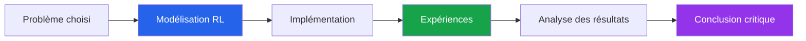
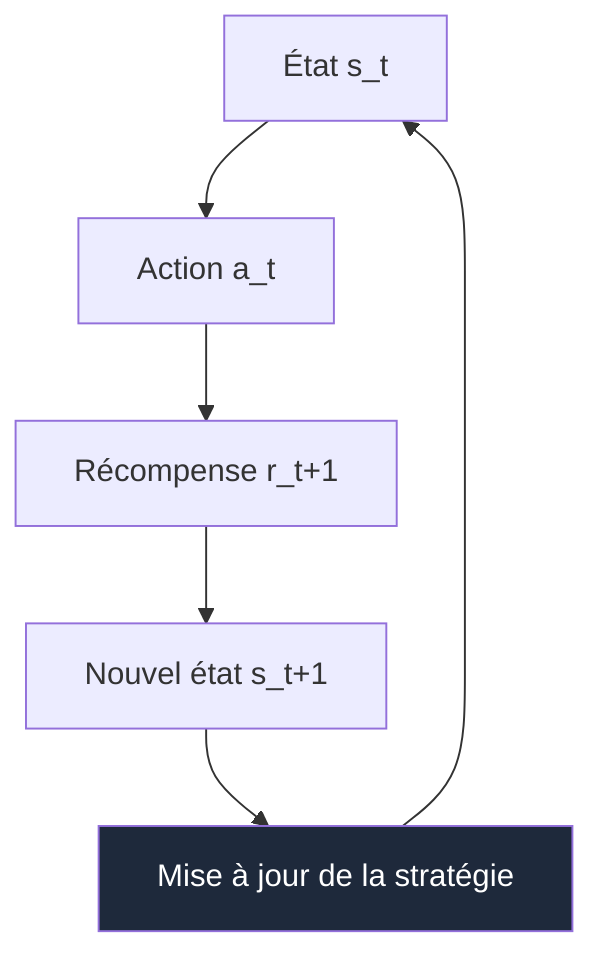

<a id="top"></a>


# Guide Partie 1 / 4

> Projet de session - Apprentissage par Renforcement


## Table des matières 


| # | Section |
|---|---|
| 1 | [Vue d'ensemble du projet](#section-1) |
| 2 | [Objectifs pédagogiques](#section-2) |
| 3 | [Choix du sujet et du concept RL](#section-3) |
| 4 | [Livrables attendus](#section-4) |
| 5 | [Structure recommandée du projet](#section-5) |
| 6 | [Grille d'évaluation](#section-6) |
| 7 | [Conseils pour réussir](#section-7) |
| 8 | [Annexe - Concepts RL possibles](#section-8) |
| 9 | [Checklist finale avant remise](#section-9) |

---

<a id="section-1"></a>

<details open>
<summary>1 - Vue d'ensemble du projet</summary>

<br/>

Chers étudiantes et étudiants,

Dans le cadre de ce projet final, vous devez concevoir une solution originale mettant en oeuvre un concept d'**apprentissage par renforcement** abordé pendant la session.

L'objectif n'est pas seulement de produire du code fonctionnel. Vous devez aussi démontrer que vous comprenez le problème, l'environnement, l'agent, la stratégie d'apprentissage, les résultats obtenus et les limites de votre approche.

> _Un bon projet RL répond clairement à trois questions : **quel problème l'agent doit-il résoudre ?**, **comment apprend-il à prendre de meilleures décisions ?**, et **comment démontrez-vous que l'apprentissage fonctionne ?**_



---

### Résultat attendu

Votre projet doit présenter une démarche complète :

| Étape | Ce qui est attendu |
|---|---|
| **Concevoir** | Définir un problème RL clair, un agent, un environnement, des états, des actions et des récompenses |
| **Implémenter** | Produire un code propre, exécutable et suffisamment documenté |
| **Expérimenter** | Lancer des essais, comparer des comportements ou mesurer la progression de l'agent |
| **Analyser** | Interpréter les résultats, expliquer les réussites, les limites et les pistes d'amélioration |

</details>

<p align="right"><a href="#top">Retour en haut</a></p>

---

<a id="section-2"></a>

<details>
<summary>2 - Objectifs pédagogiques</summary>

<br/>

Ce projet vous permet de mobiliser les notions centrales du cours dans une réalisation concrète.

| Objectif | Description |
|---|---|
| **Comprendre un problème décisionnel** | Identifier les décisions prises par l'agent et les conséquences de ses actions |
| **Formuler un environnement RL** | Définir les états, actions, récompenses, transitions et conditions de fin |
| **Choisir un algorithme pertinent** | Justifier le choix de Q-Learning, SARSA, Monte Carlo, TD-Learning, DQN ou autre approche vue en cours |
| **Tester expérimentalement** | Observer l'évolution des performances et documenter les résultats |
| **Communiquer clairement** | Présenter le projet de manière professionnelle, structurée et reproductible |

---

### Compétence principale visée

À la fin du projet, vous devez être capable d'expliquer comment un agent apprend par essai-erreur à améliorer son comportement dans un environnement donné.



</details>

<p align="right"><a href="#top">Retour en haut</a></p>

---

<a id="section-3"></a>

<details>
<summary>3 - Choix du sujet et du concept RL</summary>

<br/>

Vous pouvez choisir un sujet libre, à condition qu'il permette de démontrer un mécanisme réel d'apprentissage par renforcement.

Votre projet peut porter sur :

| Type de projet | Exemples possibles |
|---|---|
| **Jeu ou grille** | Labyrinthe, GridWorld, agent qui trouve une sortie, jeu simple à récompenses |
| **Simulation** | Robot virtuel, navigation, gestion d'énergie, file d'attente, optimisation de trajet |
| **Décision séquentielle** | Choix d'actions dans un contexte avec gains, pertes ou risques |
| **Comparaison d'algorithmes** | Q-Learning vs SARSA, Monte Carlo vs TD-Learning |
| **Exploration d'un concept avancé** | DQN, bandits multi-bras, politique epsilon-greedy, exploration vs exploitation |

---

### Algorithmes ou approches acceptés

Vous pouvez utiliser, par exemple :

- **Q-Learning**
- **SARSA**
- **Méthodes Monte Carlo**
- **TD-Learning**
- **Bandits multi-bras**
- **DQN**
- **Policy Gradient**
- Tout autre algorithme pertinent vu en cours ou approuvé par l'enseignant

> _Le choix de l'algorithme doit être justifié. Il ne suffit pas d'indiquer "nous avons utilisé Q-Learning" : vous devez expliquer pourquoi cet algorithme convient au problème choisi._

---

### Questions à clarifier dès le départ

| Question | Exemple de réponse attendue |
|---|---|
| Qui est l'agent ? | Un robot, un joueur, un système de recommandation, un contrôleur |
| Quel est l'environnement ? | Une grille, un jeu, une simulation, un système dynamique |
| Quels sont les états ? | Position, score, énergie, situation observée |
| Quelles sont les actions ? | Avancer, tourner, choisir une option, acheter, attendre |
| Quelle est la récompense ? | Gain positif, pénalité, objectif atteint, erreur évitée |
| Quand l'épisode se termine-t-il ? | Sortie atteinte, nombre maximal d'étapes, échec, victoire |

</details>

<p align="right"><a href="#top">Retour en haut</a></p>

---

<a id="section-4"></a>

<details>
<summary>4 - Livrables attendus</summary>

<br/>

Vous devez remettre **trois éléments distincts**.

---

### 1. Code source

Le code doit être fonctionnel, propre, bien structuré et facile à exécuter.

| Élément | Attente |
|---|---|
| **Fonctionnement** | Le projet s'exécute sans erreur majeure |
| **Organisation** | Les fichiers sont nommés clairement et rangés logiquement |
| **Lisibilité** | Les variables, fonctions et classes sont compréhensibles |
| **Commentaires** | Les parties importantes du raisonnement sont expliquées |
| **Dépendances** | Les bibliothèques nécessaires sont indiquées clairement |

---

### 2. Rapport écrit ou présentation PowerPoint

Le rapport ou la présentation doit expliquer votre démarche et vos résultats.

Contenu minimal attendu :

- Le problème choisi et sa motivation.
- Le concept RL ou l'algorithme utilisé.
- La modélisation : agent, environnement, états, actions, récompenses.
- L'architecture générale de la solution.
- Les expériences réalisées.
- Les résultats obtenus.
- Une analyse critique : limites, améliorations possibles, alternatives.

---

### 3. Guide d'utilisation

Le guide d'utilisation doit permettre à une autre personne de lancer votre projet sans deviner les étapes.

Il doit inclure :

- Les prérequis techniques : version de Python, bibliothèques, environnement recommandé.
- Les étapes d'installation.
- Les commandes pour exécuter le projet.
- Les fichiers importants à connaître.
- Les instructions pour reproduire les résultats.
- Les limites connues ou problèmes possibles.

</details>

<p align="right"><a href="#top">Retour en haut</a></p>

---

<a id="section-5"></a>

<details>
<summary>5 - Structure recommandée du projet</summary>

<br/>

Vous pouvez organiser votre remise de la façon suivante :

```text
projet-rl/
├── README.md
├── requirements.txt
├── rapport.pdf ou presentation.pptx
├── src/
│   ├── main.py
│   ├── agent.py
│   ├── environment.py
│   └── utils.py
├── experiments/
│   └── results.csv
└── figures/
    └── courbe-apprentissage.png
```

---

### README.md recommandé

Votre `README.md` devrait répondre rapidement à ces questions :

| Section | Contenu |
|---|---|
| **Titre du projet** | Nom clair et court |
| **Description** | Ce que l'agent apprend à faire |
| **Algorithme utilisé** | Q-Learning, SARSA, Monte Carlo, etc. |
| **Installation** | Commandes nécessaires |
| **Exécution** | Comment lancer l'expérience |
| **Résultats** | Ce qu'on doit observer |
| **Auteurs** | Noms des membres de l'équipe |

</details>

<p align="right"><a href="#top">Retour en haut</a></p>

---

<a id="section-6"></a>

<details>
<summary>6 - Grille d'évaluation</summary>

<br/>

| Critère | Description | Points |
|---|---|---|
| **Choix et justification du concept** | Pertinence de l'algorithme choisi, justification claire et compréhension démontrée | **/10** |
| **Implémentation technique** | Qualité du code, structure, lisibilité, efficacité, documentation et fonctionnement général | **/20** |
| **Analyse et interprétation** | Clarté de l'analyse des résultats, interprétation des performances et réflexion sur les limites | **/15** |
| **Qualité du rapport ou de la présentation** | Structure logique, clarté de l'expression, maîtrise des concepts théoriques | **/15** |
| **Guide d'utilisation** | Clarté, exhaustivité et accessibilité des instructions pour exécuter et reproduire le projet | **/40** |
| **Total** |  | **/100** |

---

### Ce qui distingue un excellent projet

| Niveau | Caractéristiques |
|---|---|
| **Minimal** | Le code fonctionne et l'algorithme est identifié |
| **Bon** | La modélisation RL est claire et les résultats sont expliqués |
| **Excellent** | Le projet est reproductible, bien analysé, visuellement clair et critique sur ses limites |

</details>

<p align="right"><a href="#top">Retour en haut</a></p>

---

<a id="section-7"></a>

<details>
<summary>7 - Conseils pour réussir</summary>

<br/>

### 1. Commencez simple

Un projet simple, bien expliqué et bien exécuté vaut mieux qu'un projet trop ambitieux qui ne fonctionne pas.

> _Exemple : un GridWorld avec Q-Learning, une fonction de récompense claire et une bonne analyse peut être un excellent projet._

---

### 2. Justifiez vos choix

Expliquez pourquoi votre algorithme convient au problème :

| Choix | Question à poser |
|---|---|
| **Q-Learning** | Est-ce un problème à actions discrètes ? |
| **SARSA** | Voulez-vous apprendre en suivant la politique d'exploration ? |
| **Monte Carlo** | Pouvez-vous attendre la fin d'un épisode complet ? |
| **TD-Learning** | Voulez-vous apprendre étape par étape ? |
| **DQN** | L'espace d'états est-il trop grand pour une table Q ? |

---

### 3. Soignez la présentation

Votre rapport ou votre présentation doit aider le lecteur à comprendre rapidement :

- Le problème.
- L'agent.
- L'environnement.
- L'algorithme.
- Les résultats.
- Les limites.

---

### 4. Préparez-vous à expliquer votre projet

Vous devez être capables d'expliquer simplement :

- Ce que l'agent observe.
- Ce que l'agent peut faire.
- Ce qui est récompensé ou pénalisé.
- Comment l'agent améliore sa stratégie.
- Pourquoi les résultats obtenus sont cohérents ou non.

</details>

<p align="right"><a href="#top">Retour en haut</a></p>

---

<a id="section-8"></a>

<details>
<summary>8 - Annexe - Concepts RL possibles</summary>

<br/>

Vous pouvez choisir un ou plusieurs concepts parmi la liste suivante. Chaque concept est suffisamment riche pour développer un projet intéressant, à condition de bien définir le problème et les résultats attendus.

| # | Concept | Piste de projet |
|---|---|---|
| 1 | **Interaction agent-environnement** | Modéliser une boucle d'apprentissage par essai-erreur |
| 2 | **Exploration vs exploitation** | Comparer epsilon-greedy, softmax ou une stratégie greedy |
| 3 | **Environnement stochastique ou dynamique** | Étudier un problème où les résultats sont incertains ou variables |
| 4 | **Processus Décisionnel de Markov (MDP)** | Définir états, actions, récompenses et transitions |
| 5 | **Politique** | Comparer une politique aléatoire, déterministe ou optimale |
| 6 | **Fonctions de valeur V(s) et Q(s,a)** | Visualiser l'évolution des valeurs apprises |
| 7 | **Équations de Bellman** | Mettre à jour les valeurs d'état ou d'action |
| 8 | **Programmation dynamique** | Utiliser Value Iteration ou Policy Iteration dans un environnement connu |
| 9 | **Méthodes Monte Carlo** | Apprendre à partir d'épisodes complets |
| 10 | **TD-Learning** | Mettre à jour les valeurs à chaque transition |
| 11 | **Q-Learning** | Apprendre une politique optimale sans modèle de l'environnement |
| 12 | **SARSA** | Apprendre en suivant la politique réellement utilisée |
| 13 | **Bandits multi-bras** | Maximiser une récompense dans un problème de choix répétés |
| 14 | **DQN** | Utiliser un réseau de neurones pour approximer Q(s,a) |
| 15 | **Policy Gradient** | Optimiser directement une politique paramétrée |
| 16 | **Méthodes avancées** | Explorer PPO, A3C, DDPG ou une autre approche avancée |
| 17 | **Approximation par réseaux neuronaux** | Traiter un espace d'états ou d'actions trop grand pour une table |

---

### Rappel important

Le concept choisi doit être visible dans votre projet. Par exemple, si vous choisissez **exploration vs exploitation**, votre rapport devrait montrer comment le comportement change selon le taux d'exploration.

</details>

<p align="right"><a href="#top">Retour en haut</a></p>

---

<a id="section-9"></a>

<details>
<summary>9 - Checklist finale avant remise</summary>

<br/>

Avant de remettre votre projet, vérifiez les points suivants.

| Vérification | Statut |
|---|---|
| Le code s'exécute correctement sur une machine propre | [ ] |
| Les dépendances sont listées dans `requirements.txt` ou dans le guide | [ ] |
| Le problème RL est clairement décrit | [ ] |
| L'agent, l'environnement, les états, les actions et les récompenses sont définis | [ ] |
| L'algorithme choisi est justifié | [ ] |
| Les résultats sont présentés avec tableaux, captures ou graphiques au besoin | [ ] |
| Les limites du projet sont expliquées | [ ] |
| Le guide d'utilisation permet de reproduire l'expérience | [ ] |
| Les noms des membres de l'équipe sont indiqués | [ ] |

---

### Dernier conseil

Votre projet doit être compréhensible par quelqu'un qui n'a pas suivi tout votre processus de développement. Si une personne peut lire votre guide, lancer votre code et comprendre vos résultats, votre remise est bien préparée.

</details>

<p align="right"><a href="#top">Retour en haut</a></p>

