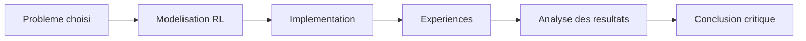
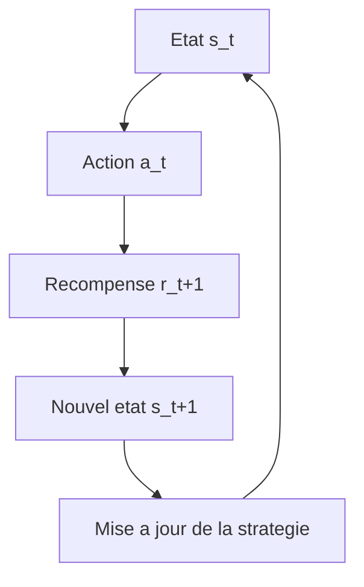
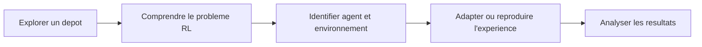
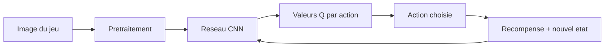
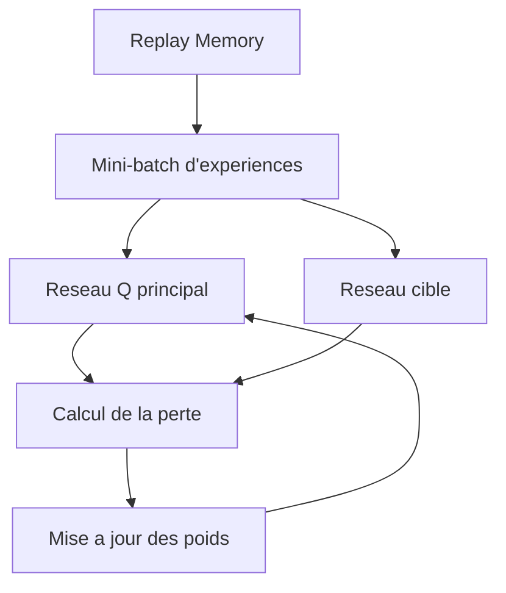
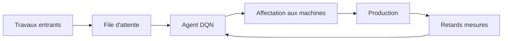
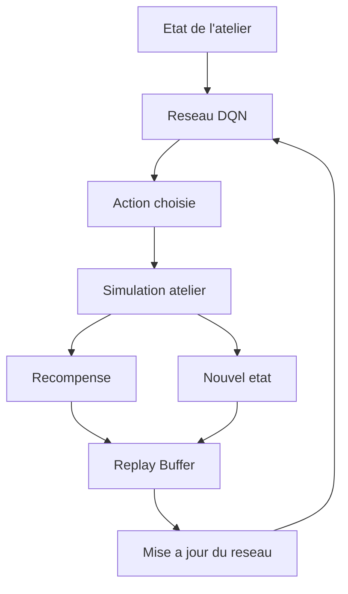

# Guide Partie 2 / 4

Ce document regroupe en un seul guide tout ce qui est nécessaire pour concevoir, choisir, structurer et réussir le **mini-projet de session** en apprentissage par renforcement.

Il propose :

- une démarche pédagogique générale,
- un catalogue d'idées de projets,
- une procédure d'utilisation d'un dépôt GitHub existant,
- deux études de cas détaillées,
- une synthèse comparative et une checklist finale.

> _Le ton de ce document est neutre et académique. L'objectif est de fournir un cadre clair, applicable à tout projet d'apprentissage par renforcement réalisable dans le temps imparti._

---

## Table des matières

| # | Section |
|---|---|
| 1 | [Vue d'ensemble du mini-projet](#section-1) |
| 2 | [Démarche pédagogique recommandée](#section-2) |
| 3 | [Comment choisir son projet](#section-3) |
| 4 | [Tableau comparatif global des projets proposés](#section-4) |
| 5 | [Catalogue détaillé des projets](#section-5) |
| 5a | &nbsp;&nbsp;&nbsp;↳ [Projets avec environnements Gym](#section-5) |
| 5b | &nbsp;&nbsp;&nbsp;↳ [Projets de jeux classiques](#section-5) |
| 5c | &nbsp;&nbsp;&nbsp;↳ [Projets avancés](#section-5) |
| 5d | &nbsp;&nbsp;&nbsp;↳ [Projets sur mesure](#section-5) |
| 6 | [Utiliser un dépôt GitHub comme point de départ](#section-6) |
| 6a | &nbsp;&nbsp;&nbsp;↳ [Critères de sélection et signaux d'alerte](#section-6) |
| 6b | &nbsp;&nbsp;&nbsp;↳ [Sélection de dépôts proposés](#section-6) |
| 6c | &nbsp;&nbsp;&nbsp;↳ [Comment adapter un projet existant](#section-6) |
| 7 | [Étude de cas n°1 - Agent DQN pour un jeu Atari](#section-7) |
| 7a | &nbsp;&nbsp;&nbsp;↳ [Vue d'ensemble et modélisation RL](#section-7) |
| 7b | &nbsp;&nbsp;&nbsp;↳ [Architecture DQN et hyperparamètres](#section-7) |
| 7c | &nbsp;&nbsp;&nbsp;↳ [Étapes de réalisation et résultats attendus](#section-7) |
| 8 | [Étude de cas n°2 - Optimisation dynamique des ateliers avec DQN](#section-8) |
| 8a | &nbsp;&nbsp;&nbsp;↳ [Contexte, problématique et modélisation](#section-8) |
| 8b | &nbsp;&nbsp;&nbsp;↳ [Environnement simulé et états](#section-8) |
| 8c | &nbsp;&nbsp;&nbsp;↳ [Agent DQN, actions et récompense](#section-8) |
| 8d | &nbsp;&nbsp;&nbsp;↳ [Étapes, livrables et métriques](#section-8) |
| 9 | [Synthèse comparative des deux études de cas](#section-9) |
| 10 | [Checklist finale et conseils pour réussir](#section-10) |
| 11 | [Ressources utiles](#section-11) |

---

1 - Vue d'ensemble du mini-projet

 

Le mini-projet de session vise à mettre en pratique les concepts d'**apprentissage par renforcement** vus en cours. L'apprenant doit concevoir un agent capable d'apprendre par essai-erreur dans un environnement défini, puis analyser le comportement obtenu.

L'objectif n'est pas uniquement de produire du code fonctionnel. Le projet doit démontrer la **compréhension du problème**, la **modélisation RL**, la **stratégie d'apprentissage** choisie, ainsi qu'une **analyse critique** des résultats.

---

### Ce que le projet doit montrer

| Élément | Question à poser |
|---|---|
| **Agent** | Qui prend les décisions ? |
| **Environnement** | Dans quel monde l'agent agit-il ? |
| **États** | Quelles informations l'agent observe-t-il ? |
| **Actions** | Quels choix l'agent peut-il faire ? |
| **Récompenses** | Qu'est-ce qui est encouragé ou pénalisé ? |
| **Apprentissage** | Comment l'agent améliore-t-il sa stratégie ? |

> _Un projet simple, bien modélisé et bien expliqué démontre généralement une meilleure compréhension qu'un projet trop ambitieux mais incomplet._

<a href="#top">Retour en haut</a>

---

2 - Démarche pédagogique recommandée

 

Le projet peut être abordé en quatre grandes étapes successives.

| Étape | Description |
|---|---|
| **Concevoir** | Définir le problème RL : agent, environnement, états, actions, récompenses, conditions de fin |
| **Implémenter** | Construire un code propre et exécutable, avec une organisation claire |
| **Expérimenter** | Lancer plusieurs essais et mesurer la progression de l'agent |
| **Analyser** | Interpréter les résultats, identifier les limites et proposer des améliorations |

---

### Boucle d'apprentissage de référence

> _Cette boucle est commune à tous les projets RL, qu'il s'agisse d'un labyrinthe simple ou d'un agent DQN sur un jeu Atari._

<a href="#top">Retour en haut</a>

---

3 - Comment choisir son projet

 

Le choix du projet dépend du niveau visé, des intérêts de l'équipe et des outils disponibles.

### Recommandation selon le profil

| Profil ou objectif | Projets conseillés |
|---|---|
| Débuter avec une base simple et solide | Taxi-v3, FrozenLake, MountainCar |
| Obtenir un rendu visuel motivant | Snake, Flappy Bird, LunarLander |
| Pratiquer le Deep Reinforcement Learning | Pong, Flappy Bird, Snake |
| Créer son propre environnement | Labyrinthe, Robot Cleaner, Tic-Tac-Toe |
| Explorer un défi avancé | BipedalWalker, Pong avec DQN, LunarLander continu |
| Travailler sur un cas industriel | Optimisation dynamique d'atelier (étude de cas n°2) |

---

### Questions à se poser avant de valider un sujet

| Question | Objectif |
|---|---|
| Le problème peut-il être formulé avec des états, actions et récompenses ? | Vérifier la compatibilité RL |
| L'environnement est-il disponible ou facile à créer ? | Limiter le coût d'entrée |
| L'algorithme choisi correspond-il au type d'actions ? | Cohérence technique |
| Les résultats seront-ils observables et mesurables ? | Permettre l'analyse |
| Le projet est-il réalisable dans le temps disponible ? | Faisabilité |

<a href="#top">Retour en haut</a>

---

4 - Tableau comparatif global des projets proposés

 

Le tableau ci-dessous synthétise les principaux projets décrits dans le catalogue. Il sert de point de départ pour comparer rapidement les options disponibles.

| Projet | Difficulté | Environnement | Algorithme recommandé | Idéal pour pratiquer |
|---|---|---|---|---|
| **LunarLander** | Facile à moyen | `LunarLander-v2` | PPO, DDPG | Contrôle, physique, gestion de ressources |
| **MountainCar** | Facile | `MountainCar-v0` | Q-Learning, PPO | Récompenses différées |
| **Flappy Bird** | Moyen | PyGame ou `gym-flappy-bird` | DQN avec CNN | Observations visuelles |
| **Snake Game** | Moyen | PyGame ou environnement maison | DQN | Planification court et long terme |
| **Taxi-v3** | Facile | `Taxi-v3` | Q-Learning, SARSA | États discrets, grille, politique optimale |
| **FrozenLake** | Facile | `FrozenLake-v1` | Q-Learning | Stochasticité, exploration / exploitation |
| **Pong** | Moyen à avancé | `PongNoFrameskip-v4` | DQN, PPO | Deep RL, images, décisions rapides |
| **BipedalWalker** | Avancé | `BipedalWalker-v3` | PPO, DDPG | Actions continues, contrôle moteur |
| **Projet sur mesure** | Variable | Créé par l'équipe | Q-Learning, SARSA, DQN | Créativité et modélisation |

> _La difficulté indiquée est relative et dépend aussi du niveau d'analyse attendu, pas seulement de la complexité du code._

<a href="#top">Retour en haut</a>

---

5 - Catalogue détaillé des projets

 

Cette section présente, projet par projet, les caractéristiques principales et les raisons pédagogiques pour lesquelles chacun peut être pertinent.

---

### 5a - Projets avec environnements Gym

#### LunarLander - Facile à moyen

| Aspect | Description |
|---|---|
| **Description** | Un agent contrôle un module lunaire et doit le poser en sécurité sur une plateforme |
| **Objectif** | Minimiser le carburant, éviter les collisions et atterrir au centre |
| **Bibliothèque** | OpenAI Gym / Gymnasium |
| **Environnement** | `gym.make("LunarLander-v2")` |
| **Algorithme recommandé** | PPO ou DDPG |

Intérêts pédagogiques :

- Introduction au contrôle physique et à la gestion de ressources.
- États composés de la position, de la vitesse, de l'inclinaison et du contact avec le sol.
- Résultat visuel facile à présenter dans un rapport.

---

#### MountainCar - Facile

| Aspect | Description |
|---|---|
| **Description** | Une voiture doit sortir d'une vallée en utilisant son inertie pour atteindre un sommet |
| **Objectif** | Atteindre l'objectif en un minimum d'étapes |
| **Bibliothèque** | OpenAI Gym / Gymnasium |
| **Environnement** | `gym.make("MountainCar-v0")` |
| **Algorithme recommandé** | Q-Learning ou PPO |

Intérêts pédagogiques :

- Excellent exemple de **récompense différée** : il faut parfois s'éloigner du but pour réussir.
- États simples (position, vitesse) qui facilitent l'analyse.

---

#### Taxi-v3 - Facile

| Aspect | Description |
|---|---|
| **Description** | Un taxi doit prendre et déposer des passagers dans une grille |
| **Objectif** | Minimiser les déplacements inutiles et les mauvaises actions |
| **Bibliothèque** | OpenAI Gym / Gymnasium |
| **Environnement** | `gym.make("Taxi-v3")` |
| **Algorithme recommandé** | Q-Learning ou SARSA |

Intérêts pédagogiques :

- Environnement discret, clair et très pédagogique.
- Très adapté pour visualiser une **table Q**.
- Permet de comparer concrètement exploration et exploitation.

---

#### FrozenLake - Facile

| Aspect | Description |
|---|---|
| **Description** | Un agent traverse un lac gelé sans tomber dans les trous |
| **Objectif** | Trouver le chemin optimal vers l'objectif |
| **Bibliothèque** | OpenAI Gym / Gymnasium |
| **Environnement** | `gym.make("FrozenLake-v1")` |
| **Algorithme recommandé** | Q-Learning |

Intérêts pédagogiques :

- Introduit la **stochasticité** : une même action peut produire un résultat inattendu.
- Bon support pour discuter des probabilités, de l'exploration et de l'exploitation.

---

### 5b - Projets de jeux classiques

#### Flappy Bird - Moyen

| Aspect | Description |
|---|---|
| **Description** | L'agent fait passer un oiseau entre des tuyaux sans tomber |
| **Objectif** | Maximiser le score en franchissant le plus d'obstacles possible |
| **Environnement recommandé** | `gym-flappy-bird` ou environnement PyGame simplifié |
| **Algorithme recommandé** | DQN avec CNN |

Intérêts pédagogiques :

- Introduit les **observations visuelles**.
- Permet d'utiliser des réseaux convolutifs.
- Donne une démonstration motivante.

---

#### Snake Game - Moyen

| Aspect | Description |
|---|---|
| **Description** | L'agent joue à Snake en mangeant la nourriture sans heurter les murs ou son corps |
| **Objectif** | Maximiser le score et la longueur du serpent |
| **Environnement recommandé** | Jeu maison avec PyGame ou package existant |
| **Algorithme recommandé** | DQN |

Intérêts pédagogiques :

- Combine planification à court terme et long terme.
- L'état évolue avec la longueur du serpent.
- Compréhensible par un public non spécialiste.

---

#### Pong - Moyen à avancé

| Aspect | Description |
|---|---|
| **Description** | L'agent contrôle une raquette pour renvoyer une balle |
| **Objectif** | Maximiser le score contre l'adversaire |
| **Bibliothèque** | OpenAI Gym / Gymnasium Atari |
| **Environnement** | `gym.make("PongNoFrameskip-v4")` |
| **Algorithme recommandé** | DQN ou PPO |

Intérêts pédagogiques :

- Excellent cas d'**apprentissage profond par renforcement**.
- Décisions rapides et répétées.
- Permet d'utiliser le prétraitement d'images et les CNN.

---

### 5c - Projets avancés

#### BipedalWalker - Avancé

| Aspect | Description |
|---|---|
| **Description** | Un robot à deux jambes apprend à marcher sur un terrain accidenté |
| **Objectif** | Optimiser les mouvements pour avancer sans tomber |
| **Bibliothèque** | OpenAI Gym / Gymnasium |
| **Environnement** | `gym.make("BipedalWalker-v3")` |
| **Algorithme recommandé** | PPO ou DDPG |

Intérêts pédagogiques :

- Environnement complexe avec **actions continues**.
- Introduit le contrôle moteur et la stabilité.

> _Ce projet demande plus de temps, plus d'essais et une bonne gestion des hyperparamètres. Il est recommandé uniquement si l'équipe est à l'aise avec le RL._

---

### 5d - Projets sur mesure

L'apprenant peut également construire son propre environnement. Cette option convient pour un projet plus personnel, à condition de garder la modélisation simple et claire.

| Projet | Description | Algorithme recommandé |
|---|---|---|
| **Labyrinthe (Maze Solver)** | Créer un labyrinthe où l'agent doit atteindre une sortie, avec pièges ou raccourcis | Q-Learning |
| **Robot Cleaner** | Simuler un robot aspirateur qui nettoie toutes les cases en minimisant les mouvements | SARSA ou Q-Learning |
| **Tic-Tac-Toe** | Créer un agent capable de jouer contre un humain ou un autre agent | Minimax ou Q-Learning |

Conseils pour un projet maison :

- Garder un espace d'états raisonnable.
- Définir une fonction de récompense simple.
- Prévoir une visualisation de l'environnement.
- Comparer l'agent entraîné avec une politique aléatoire.
- Expliquer clairement les règles du jeu ou de la simulation.

<a href="#top">Retour en haut</a>

---

6 - Utiliser un dépôt GitHub comme point de départ

 

Il est possible de s'appuyer sur un dépôt GitHub existant pour gagner du temps. Cette pratique est acceptable, à condition de **comprendre** le code, de l'**adapter** et de produire une **analyse personnelle**.

---

### 6a - Critères de sélection et signaux d'alerte

| Critère | Pourquoi c'est important |
|---|---|
| **README clair** | Permet de comprendre rapidement comment installer et exécuter le projet |
| **Code lisible** | Indispensable pour pouvoir expliquer les fichiers principaux |
| **Dépendances raisonnables** | Évite les configurations trop lourdes |
| **Lien avec le RL** | Le projet doit contenir un agent, un environnement, des actions et des récompenses |
| **Résultats observables** | Doit permettre de mesurer ou visualiser l'apprentissage |
| **Possibilité d'adaptation** | Doit autoriser la modification d'un paramètre, d'une récompense ou d'un environnement |

#### Signaux d'alerte

| Signal | Risque associé |
|---|---|
| Dépôt non maintenu depuis longtemps | Dépendances incompatibles |
| Aucune instruction d'installation | Temps perdu en configuration |
| Code très complexe ou mal documenté | Difficile à expliquer dans le rapport |
| Projet sans métriques | Impossible de prouver que l'agent apprend |
| Dépôt trop avancé | Risque de ne pas terminer dans les délais |

---

### 6b - Sélection de dépôts proposés

| # | Projet | Description | Lien |
|---|---|---|---|
| 1 | **Apprentissage par renforcement humain** | Intégration de signaux humains dans une boucle d'apprentissage par renforcement | [human-reinforcement-learning](https://github.com/JulienDesvergnes/human-reinforcement-learning) |
| 2 | **Deep Reinforcement Learning avec VizDoom** | Approches de RL profond dans des environnements de jeux de tir à la première personne | [TP_DRL](https://github.com/asolayman/TP_DRL) |
| 3 | **IA et apprentissage par renforcement** | Dépôt pédagogique associé à un cours, avec application au problème du voyageur de commerce | [ia-apprentissage-par-renforcement-4469575](https://github.com/LinkedInLearning/ia-apprentissage-par-renforcement-4469575) |
| 4 | **Apprentissage par renforcement en Python** | Implémentation RL dans un labyrinthe où l'agent apprend à trouver une sortie | [Apprentissage-par-renforcement-en-python](https://github.com/nguembu/Apprentissage-par-renforcement-en-python) |
| 5 | **RL profond pour problèmes combinatoires** | Projet de Master 2 appliquant le Deep RL à des décisions combinatoires | [Projet_M2_Data](https://github.com/jonathangraff/Projet_M2_Data) |
| 6 | **Exemple Q-Learning** | Application du Q-Learning avec déplacement, bonus et score | [Q-learning-AI](https://github.com/Wandrille990/Q-learning-AI) |
| 7 | **Implémentations DeepRL** | Implémentations combinant RL et Deep Learning sur des environnements OpenAI Gym | [DeepRL](https://github.com/vintel38/DeepRL) |

#### Lecture rapide des options

| Si l'on cherche... | Dépôt conseillé |
|---|---|
| Un projet simple à comprendre | `Q-learning-AI` ou `Apprentissage-par-renforcement-en-python` |
| Un projet de labyrinthe ou grille | `Apprentissage-par-renforcement-en-python` |
| Un projet plus avancé avec Deep Learning | `DeepRL` ou `TP_DRL` |
| Un projet plus théorique ou combinatoire | `Projet_M2_Data` |
| Une approche avec interaction humaine | `human-reinforcement-learning` |

---

### 6c - Comment adapter un projet existant

Reprendre un dépôt ne dispense pas d'apporter une **contribution personnelle**.

#### Travail minimal attendu

| Étape | Action |
|---|---|
| **Comprendre** | Identifier l'agent, l'environnement, les états, les actions et les récompenses |
| **Exécuter** | Faire fonctionner le projet localement ou dans Colab |
| **Documenter** | Expliquer l'installation et les fichiers principaux |
| **Adapter** | Modifier un paramètre, une fonction de récompense, un environnement ou une expérience |
| **Analyser** | Comparer les résultats avant/après ou selon plusieurs configurations |

#### Exemples d'adaptations possibles

- Modifier le taux d'exploration `epsilon`.
- Comparer Q-Learning et SARSA si le projet le permet.
- Changer la fonction de récompense.
- Ajouter une visualisation des récompenses cumulées.
- Mesurer le temps d'entraînement.
- Comparer l'agent entraîné avec une politique aléatoire.
- Ajouter un guide d'utilisation clair.

> _Le rapport doit indiquer précisément ce qui provient du dépôt original et ce qui a été ajouté, modifié ou analysé par l'équipe._

<a href="#top">Retour en haut</a>

---

7 - Étude de cas n°1 - Agent DQN pour un jeu Atari

 

Cette première étude de cas illustre un projet **académique et ludique** : entraîner un agent à jouer à un jeu Atari, par exemple **Pong**, à partir des images du jeu. L'algorithme central est le **Deep Q-Network (DQN)**.

---

### 7a - Vue d'ensemble et modélisation RL

L'agent observe l'écran de jeu et doit apprendre à choisir les actions qui maximisent le score. Au lieu de stocker une table Q pour chaque état possible, le DQN approxime la fonction Q à l'aide d'un **réseau de neurones convolutif**.

#### Composantes du problème

| Composante | Description |
|---|---|
| **Agent** | Joueur contrôlé par l'algorithme DQN |
| **Environnement** | Jeu Atari choisi (par exemple Pong) |
| **État** | Séquence d'images prétraitées représentant la situation actuelle |
| **Action** | Commande possible dans le jeu |
| **Récompense** | Score gagné, point marqué, pénalité ou progression |
| **Politique** | Stratégie epsilon-greedy basée sur les valeurs Q prédites |

#### Prétraitement des observations

Les images brutes sont souvent trop grandes et bruitées. Quatre transformations sont généralement appliquées :

| Étape | Rôle |
|---|---|
| **Conversion en niveaux de gris** | Réduit la complexité des images |
| **Redimensionnement** | Accélère l'entraînement |
| **Normalisation** | Stabilise les valeurs d'entrée |
| **Empilement de frames** | Donne à l'agent une notion de mouvement |

> _Une seule image ne suffit pas à connaître la direction d'une balle. En empilant plusieurs images successives, l'agent peut déduire la vitesse et la trajectoire._

---

### 7b - Architecture DQN et hyperparamètres

Un agent DQN repose sur quatre éléments principaux.

| Élément | Rôle |
|---|---|
| **Réseau CNN principal** | Analyse les images et prédit les valeurs Q |
| **Replay Memory** | Stocke les expériences `(s, a, r, s')` pour les rejouer |
| **Target Network** | Fournit des cibles stables pour le calcul de la perte |
| **Stratégie epsilon-greedy** | Équilibre exploration et exploitation |

#### Hyperparamètres à documenter

| Hyperparamètre | Rôle |
|---|---|
| **Learning rate** | Vitesse d'ajustement du réseau |
| **Gamma** | Importance des récompenses futures |
| **Epsilon initial / final** | Niveau d'exploration |
| **Batch size** | Nombre d'expériences utilisées par mise à jour |
| **Taille du replay buffer** | Quantité d'expériences conservées |
| **Fréquence de mise à jour du target network** | Stabilité de l'apprentissage |

---

### 7c - Étapes de réalisation et résultats attendus

| Étape | Travail à réaliser |
|---|---|
| **1. Configurer l'environnement** | Charger le jeu Atari et vérifier qu'il fonctionne |
| **2. Prétraiter les observations** | Ajouter les wrappers nécessaires (gris, redimensionnement, frame stacking) |
| **3. Implémenter l'agent DQN** | Construire le réseau CNN et la logique de choix d'action |
| **4. Ajouter la mémoire de relecture** | Stocker et échantillonner les transitions |
| **5. Entraîner l'agent** | Lancer plusieurs épisodes et ajuster les hyperparamètres |
| **6. Évaluer l'agent** | Tester la politique entraînée avec peu ou pas d'exploration |
| **7. Analyser les résultats** | Présenter courbes, observations et limites |

#### Livrables et métriques recommandées

| Livrable | Contenu attendu |
|---|---|
| **Code complet et fonctionnel** | Environnement, agent, entraînement et évaluation |
| **Rapport d'analyse** | Choix techniques, hyperparamètres, résultats et limites |
| **Démo optionnelle** | Vidéo, GIF ou démonstration montrant l'agent en action |

| Métrique | Utilité |
|---|---|
| **Récompense cumulée par épisode** | Mesurer la progression globale |
| **Score moyen sur N épisodes** | Réduire l'effet du hasard |
| **Courbe d'epsilon** | Montrer la transition exploration → exploitation |
| **Temps d'entraînement** | Discuter du coût computationnel |
| **Comparaison avec politique aléatoire** | Démontrer que l'agent apprend |

#### Questions auxquelles le rapport doit répondre

- L'agent s'améliore-t-il au fil des épisodes ?
- Les récompenses sont-elles stables ou très variables ?
- Quels hyperparamètres ont eu le plus d'impact ?
- Quelles limites observe-t-on ?
- Que faudrait-il améliorer avec plus de temps ?

<a href="#top">Retour en haut</a>

---

8 - Étude de cas n°2 - Optimisation dynamique des ateliers avec DQN

 

Cette deuxième étude de cas illustre un projet **plus industriel** : utiliser un agent DQN pour planifier dynamiquement les opérations dans un atelier de production.

---

### 8a - Contexte, problématique et modélisation

Dans une usine, plusieurs **travaux** doivent être exécutés sur des **machines** en respectant des règles précises. Un travail correspond à une commande qui passe par plusieurs étapes (découpage, assemblage, peinture, inspection, emballage). Chaque étape, appelée **opération**, doit être réalisée dans un ordre donné, et plusieurs machines peuvent parfois la traiter avec des durées différentes.

#### Défis principaux

| Défi | Description |
|---|---|
| **Optimisation des ressources** | Affecter les travaux aux machines sans créer de goulots d'étranglement |
| **Gestion des imprévus** | Réagir à l'arrivée de nouveaux travaux ou à l'indisponibilité d'une machine |
| **Respect des délais** | Minimiser les retards par rapport aux dates limites |
| **Décisions séquentielles** | Chaque choix influence les décisions futures |

> _Problème central : comment construire un système intelligent capable de planifier dynamiquement les opérations dans un atelier, en minimisant les retards globaux, même en présence d'imprévus ?_

#### Éléments du système

| Élément | Définition |
|---|---|
| **Travail** | Commande composée d'une séquence d'opérations |
| **Opération** | Étape à exécuter dans un ordre précis |
| **Machine** | Ressource capable de traiter une ou plusieurs opérations |
| **Date limite** | Temps maximal souhaité pour terminer un travail |
| **Retard** | Temps dépassant la date limite |

#### Exemple simple

| Travail | Séquence d'opérations |
|---|---|
| **Travail 1** | Découpage → Assemblage → Peinture |
| **Travail 2** | Assemblage → Inspection |
| **Travail 3** | Découpage → Peinture → Emballage |

#### Formulation RL

| Composante RL | Application dans l'atelier |
|---|---|
| **Agent** | Système de planification |
| **Environnement** | Atelier simulé avec travaux, machines et événements |
| **État** | Situation actuelle : machines libres, retards, opérations disponibles, charges |
| **Action** | Choisir quelle opération affecter à quelle machine |
| **Récompense** | Bonus pour terminer à temps, pénalité pour les retards |
| **Objectif** | Maximiser les récompenses cumulées, donc minimiser les retards |

---

### 8b - Environnement simulé et états

L'environnement simule un atelier dynamique dans lequel les travaux arrivent, les machines deviennent libres, les opérations progressent et les retards sont calculés.

#### Fonctionnement proposé

| Aspect | Description |
|---|---|
| **Arrivée des travaux** | Les travaux arrivent dynamiquement, par exemple selon un processus de Poisson |
| **Compatibilité machines** | Une opération peut être réalisée par une ou plusieurs machines |
| **Durées de traitement** | Chaque machine peut avoir une durée différente pour la même opération |
| **Perturbations** | Nouveaux travaux ou indisponibilités peuvent modifier la planification |
| **Épisodes** | Un épisode correspond à une journée, un lot de travaux ou une simulation complète |

#### Variables d'état possibles

| Variable | Information apportée |
|---|---|
| **Taux de retard actuel** | Pourcentage de travaux déjà en retard |
| **Retard attendu** | Estimation des retards futurs selon les tâches restantes |
| **Progression des travaux** | Nombre d'opérations terminées par travail |
| **Durées restantes** | Temps restant avant la fin d'une opération ou d'un travail |
| **Charge des machines** | Temps avant que chaque machine devienne disponible |
| **Marge temporelle** | Différence entre date limite et temps restant estimé |

> _Un bon état doit contenir suffisamment d'information pour prendre une décision utile, sans devenir inutilement complexe._

---

### 8c - Agent DQN, actions et récompense

L'agent DQN apprend à choisir les décisions de planification à partir de l'état courant.

#### Actions possibles

| Action | Description |
|---|---|
| **Choisir une machine** | Sélectionner une machine disponible |
| **Choisir une opération** | Affecter une opération admissible à cette machine |
| **Choisir une règle heuristique** | Sélectionner SPT, EDD ou SLK comme règle de priorité |

#### Heuristiques de comparaison

| Heuristique | Signification | Intuition |
|---|---|---|
| **SPT** | Shortest Processing Time | Traiter d'abord l'opération la plus courte |
| **EDD** | Earliest Due Date | Prioriser le travail dont la date limite est la plus proche |
| **SLK** | Slack Time | Prioriser le travail avec la plus faible marge |

#### Fonction de récompense

| Situation | Signal possible |
|---|---|
| Opération terminée avant la date limite | Récompense positive |
| Travail terminé à temps | Récompense positive plus forte |
| Retard accumulé | Pénalité proportionnelle |
| Machine inutilement inactive | Petite pénalité |
| Action impossible ou mauvaise affectation | Pénalité forte |

#### Mécanisme DQN appliqué à l'atelier

---

### 8d - Étapes, livrables et métriques

| Étape | Travail à réaliser |
|---|---|
| **1. Définir le scénario d'atelier** | Nombre de machines, types de travaux, opérations et durées |
| **2. Construire le simulateur** | Gérer files, machines, opérations, événements et dates limites |
| **3. Définir l'état et les actions** | Transformer la situation en vecteur utilisable par le DQN |
| **4. Définir la récompense** | Relier récompenses et pénalités aux retards et aux décisions |
| **5. Implémenter l'agent DQN** | Réseau, replay buffer, epsilon-greedy, entraînement |
| **6. Comparer aux heuristiques** | Évaluer DQN contre SPT, EDD et SLK |
| **7. Visualiser les résultats** | Courbes de retard, récompenses cumulées, diagrammes de Gantt |
| **8. Analyser les limites** | Discuter complexité, stabilité, généralisation et données nécessaires |

#### Livrables

| Livrable | Contenu attendu |
|---|---|
| **Code fonctionnel** | Simulateur d'atelier, agent DQN, entraînement et évaluation |
| **Rapport technique** | Description du problème, modélisation RL, choix techniques et résultats |
| **Comparaison expérimentale** | DQN comparé à au moins une heuristique classique |
| **Visualisations** | Diagramme de Gantt, courbes de récompense, retard moyen ou taux de ponctualité |
| **Guide d'utilisation** | Installation, exécution, paramètres importants et reproduction des résultats |

#### Métriques recommandées

| Métrique | Utilité |
|---|---|
| **Retard moyen** | Mesure directement l'objectif principal |
| **Nombre de travaux en retard** | Évalue la ponctualité |
| **Taux d'utilisation des machines** | Vérifie si les ressources sont bien utilisées |
| **Makespan** | Temps total pour terminer l'ensemble des travaux |
| **Récompense cumulée** | Suit la progression de l'apprentissage |

<a href="#top">Retour en haut</a>

---

9 - Synthèse comparative des deux études de cas

 

Les deux études de cas reposent sur le même algorithme (DQN) mais s'appliquent à des contextes très différents. Le tableau ci-dessous met en parallèle leurs principales caractéristiques pour aider à choisir l'orientation la plus adaptée.

| Critère | Étude de cas 1 - Atari (Pong) | Étude de cas 2 - Atelier dynamique |
|---|---|---|
| **Type d'environnement** | Jeu vidéo, simulé via Gym | Système industriel simulé |
| **Type d'observations** | Images (pixels prétraités) | Vecteur numérique (charges, retards, progression) |
| **Type d'actions** | Discrètes (commandes du jeu) | Discrètes (affectation opération-machine) |
| **Type de récompense** | Score du jeu | Bonus de ponctualité, pénalité de retard |
| **Stochasticité** | Comportement de l'adversaire et dynamique du jeu | Arrivées aléatoires, perturbations, durées variables |
| **Réseau utilisé** | CNN (entrée image) | MLP ou réseau dense (entrée vectorielle) |
| **Difficulté technique** | Moyenne à avancée (vision + DQN) | Moyenne à avancée (simulateur + DQN) |
| **Difficulté de modélisation RL** | Standard (action classique de jeu) | Plus exigeante (états et actions à concevoir) |
| **Type d'application** | Démonstration académique et ludique | Cas industriel proche de la recherche opérationnelle |
| **Comparaison naturelle** | Politique aléatoire ou agent humain | Heuristiques classiques (SPT, EDD, SLK) |
| **Visualisation typique** | Vidéo de jeu, courbes de score | Diagrammes de Gantt, courbes de retard |

---

### Quand privilégier l'une ou l'autre

| Situation | Étude de cas conseillée |
|---|---|
| Volonté d'expérimenter le **Deep RL sur images** | Étude de cas n°1 |
| Recherche d'un **rendu visuel impressionnant** | Étude de cas n°1 |
| Intérêt pour la **recherche opérationnelle** | Étude de cas n°2 |
| Volonté de comparer DQN à des **heuristiques classiques** | Étude de cas n°2 |
| Disponibilité de ressources GPU | Étude de cas n°1 |
| Préférence pour un environnement entièrement contrôlé et personnalisable | Étude de cas n°2 |

> _Les deux études de cas restent ambitieuses. Une équipe peut très bien adapter ces idées à une version simplifiée (par exemple un Pong "MiniPong" ou un atelier réduit à 2 machines et 3 travaux) afin de garantir la faisabilité du projet._

<a href="#top">Retour en haut</a>

---

10 - Checklist finale et conseils pour réussir

 

### Conseils transversaux

| Conseil | Raison |
|---|---|
| **Commencer simple** | Un projet réduit, qui fonctionne et qui est bien expliqué, vaut mieux qu'un projet ambitieux mais incomplet |
| **Justifier les choix** | Indiquer pourquoi tel algorithme et telle modélisation ont été retenus |
| **Soigner la présentation** | Le rapport et le code doivent être lisibles et organisés |
| **Préparer l'oral** | Être capable d'expliquer simplement ce que l'agent observe, fait, apprend et obtient |
| **Mesurer plutôt que supposer** | Les conclusions doivent s'appuyer sur des courbes, scores ou statistiques |

---

### Checklist finale avant remise

| Vérification | Statut |
|---|---|
| Le sujet est clairement défini, avec un agent, un environnement et un objectif | [ ] |
| Les états, actions et récompenses sont explicitement décrits | [ ] |
| L'algorithme choisi est justifié | [ ] |
| Le code s'exécute correctement sur une machine propre | [ ] |
| Les dépendances sont listées dans `requirements.txt` ou dans le guide | [ ] |
| Au moins une expérience d'entraînement est documentée | [ ] |
| Les résultats sont présentés avec tableaux, captures ou graphiques | [ ] |
| Une comparaison est proposée (politique aléatoire, heuristique, autre algo) | [ ] |
| Les limites du projet sont expliquées | [ ] |
| Le guide d'utilisation permet de reproduire l'expérience | [ ] |
| Les noms des membres de l'équipe sont indiqués | [ ] |

> _Si une personne extérieure peut lire le guide, lancer le code et comprendre les résultats, le projet est prêt pour la remise._

<a href="#top">Retour en haut</a>

---

11 - Ressources utiles

 

### Bibliothèques et environnements

| Ressource | Lien |
|---|---|
| **OpenAI Gym / Gymnasium** | [https://www.gymlibrary.dev](https://www.gymlibrary.dev) |
| **Documentation Keras** | [https://keras.io](https://keras.io) |
| **Tutoriel DQN PyTorch** | [Reinforcement Q-Learning](https://pytorch.org/tutorials/intermediate/reinforcement_q_learning.html) |

### Lectures de référence

| Ressource | Lien ou indication |
|---|---|
| **Article DQN original (DeepMind)** | [Playing Atari with Deep Reinforcement Learning](https://arxiv.org/abs/1312.5602) |
| **Livre Sutton & Barto** | [Reinforcement Learning: An Introduction](http://incompleteideas.net/book/the-book.html) |
| **Dynamic Job Shop Scheduling** | Termes-clés à rechercher pour la planification dynamique d'ateliers |
| **Diagrammes de Gantt en Python** | Bibliothèques recommandées : Matplotlib, Plotly |
| **Implémentations open-source de Job Shop** | Explorer GitHub avec les mots-clés `job shop scheduling reinforcement learning` |

---

### Conseil final

Il est recommandé de commencer par une version simplifiée du projet : peu d'états, peu d'actions, environnement minimal. Une fois la boucle d'apprentissage stable, l'apprenant peut enrichir progressivement la complexité, ajouter des visualisations et approfondir l'analyse.

<a href="#top">Retour en haut</a>

