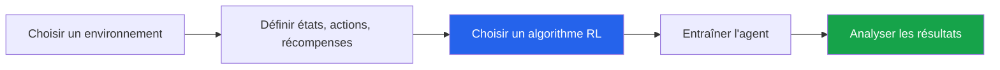

# Votre mini-projet de session - Propositions de projets

## Table des matières

| # | Section |
|---|---|
| 1 | [Vue d'ensemble](#section-1) |
| 2 | [Tableau comparatif des projets](#section-2) |
| 3 | [Projets avec environnements Gym](#section-3) |
| 4 | [Projets de jeux classiques](#section-4) |
| 5 | [Projets avancés](#section-5) |
| 6 | [Projets sur mesure](#section-6) |
| 7 | [Comment choisir son projet](#section-7) |

---

1 - Vue d'ensemble

 

Cette liste propose plusieurs idées de mini-projets en **apprentissage par renforcement**. Chaque projet permet d'explorer un agent qui apprend à prendre de meilleures décisions à partir d'interactions avec un environnement.

> _Le meilleur choix n'est pas nécessairement le projet le plus complexe. Un projet simple, bien modélisé, bien entraîné et bien expliqué peut démontrer une excellente compréhension du cours._

### Ce que votre projet doit montrer

| Élément | Question à se poser |
|---|---|
| **Agent** | Qui prend les décisions ? |
| **Environnement** | Dans quel monde l'agent agit-il ? |
| **États** | Quelles informations l'agent observe-t-il ? |
| **Actions** | Quels choix l'agent peut-il faire ? |
| **Récompenses** | Qu'est-ce qui est encouragé ou pénalisé ? |
| **Apprentissage** | Comment l'agent améliore-t-il sa stratégie ? |

<a href="#top">Retour en haut</a>

---

2 - Tableau comparatif des projets

 

| Projet | Difficulté | Environnement | Algorithme recommandé | Idéal pour pratiquer |
|---|---|---|---|---|
| **LunarLander** | Facile à moyen | `LunarLander-v2` | PPO, DDPG | Contrôle, physique, gestion de ressources |
| **MountainCar** | Facile | `MountainCar-v0` | Q-Learning, PPO | Récompenses différées |
| **Flappy Bird** | Moyen | PyGame ou `gym-flappy-bird` | DQN avec CNN | Observations visuelles |
| **Snake Game** | Moyen | PyGame ou environnement maison | DQN | Planification court et long terme |
| **Taxi-v3** | Facile | `Taxi-v3` | Q-Learning, SARSA | États discrets, grille, politique optimale |
| **FrozenLake** | Facile | `FrozenLake-v1` | Q-Learning | Stochasticité, exploration/exploitation |
| **Pong** | Moyen à avancé | `PongNoFrameskip-v4` | DQN, PPO | Deep RL, images, décisions rapides |
| **BipedalWalker** | Avancé | `BipedalWalker-v3` | PPO, DDPG | Actions continues, contrôle moteur |
| **Projet sur mesure** | Variable | Créé par l'équipe | Q-Learning, SARSA, DQN | Créativité et modélisation |

<a href="#top">Retour en haut</a>

---

3 - Projets avec environnements Gym

 

### 1. LunarLander - Facile à moyen

| Aspect | Description |
|---|---|
| **Description** | L'agent contrôle un module lunaire et doit le poser en sécurité sur une plateforme |
| **Objectif** | Minimiser le carburant, éviter les collisions et atterrir au centre |
| **Bibliothèque** | OpenAI Gym / Gymnasium |
| **Environnement** | `gym.make("LunarLander-v2")` |
| **Algorithme recommandé** | PPO ou DDPG |

**Pourquoi c'est intéressant ?**

- Introduit le contrôle physique et la gestion de ressources.
- Les états incluent la position, la vitesse, l'inclinaison et le contact avec le sol.
- Le résultat est visuel et facile à présenter.

---

### 2. MountainCar - Facile

| Aspect | Description |
|---|---|
| **Description** | Une voiture doit sortir d'une vallée en utilisant son inertie pour atteindre le sommet |
| **Objectif** | Atteindre l'objectif en un minimum d'étapes |
| **Bibliothèque** | OpenAI Gym / Gymnasium |
| **Environnement** | `gym.make("MountainCar-v0")` |
| **Algorithme recommandé** | Q-Learning ou PPO |

**Pourquoi c'est intéressant ?**

- Très bon exemple de récompense différée.
- L'agent doit parfois s'éloigner temporairement du but pour réussir.
- Les états sont simples : position et vitesse.

---

### 3. Taxi-v3 - Facile

| Aspect | Description |
|---|---|
| **Description** | Un taxi doit prendre et déposer des passagers dans une grille |
| **Objectif** | Minimiser les déplacements inutiles et les mauvaises actions |
| **Bibliothèque** | OpenAI Gym / Gymnasium |
| **Environnement** | `gym.make("Taxi-v3")` |
| **Algorithme recommandé** | Q-Learning ou SARSA |

**Pourquoi c'est intéressant ?**

- Environnement discret, clair et très pédagogique.
- Excellent pour visualiser une table Q.
- Idéal pour comparer exploration et exploitation.

---

### 4. FrozenLake - Facile

| Aspect | Description |
|---|---|
| **Description** | Un agent traverse un lac gelé sans tomber dans les trous |
| **Objectif** | Trouver le chemin optimal vers l'objectif |
| **Bibliothèque** | OpenAI Gym / Gymnasium |
| **Environnement** | `gym.make("FrozenLake-v1")` |
| **Algorithme recommandé** | Q-Learning |

**Pourquoi c'est intéressant ?**

- Introduit la stochasticité : une action peut produire un résultat inattendu.
- Permet de discuter de l'exploration, de l'exploitation et des probabilités.
- Projet simple mais riche pour l'analyse.

<a href="#top">Retour en haut</a>

---

4 - Projets de jeux classiques

 

### 1. Flappy Bird - Moyen

| Aspect | Description |
|---|---|
| **Description** | L'agent apprend à faire passer un oiseau entre des tuyaux sans tomber |
| **Objectif** | Maximiser le score en franchissant le plus d'obstacles possible |
| **Environnement recommandé** | `gym-flappy-bird` ou environnement PyGame simplifié |
| **Algorithme recommandé** | DQN avec CNN |

**Pourquoi c'est intéressant ?**

- Introduit les observations visuelles.
- Permet d'utiliser des réseaux convolutifs.
- Donne une démonstration visuelle motivante.

---

### 2. Snake Game - Moyen

| Aspect | Description |
|---|---|
| **Description** | L'agent joue à Snake en mangeant la nourriture sans heurter les murs ou son propre corps |
| **Objectif** | Maximiser le score et la longueur du serpent |
| **Environnement recommandé** | Jeu maison avec PyGame ou package existant |
| **Algorithme recommandé** | DQN |

**Pourquoi c'est intéressant ?**

- Combine planification à court terme et long terme.
- L'état évolue avec la longueur du serpent.
- Le projet est facile à comprendre pour un public non spécialiste.

---

### 3. Pong - Moyen à avancé

| Aspect | Description |
|---|---|
| **Description** | L'agent apprend à contrôler une raquette pour renvoyer une balle |
| **Objectif** | Maximiser le score contre l'adversaire |
| **Bibliothèque** | OpenAI Gym / Gymnasium Atari |
| **Environnement** | `gym.make("PongNoFrameskip-v4")` |
| **Algorithme recommandé** | DQN ou PPO |

**Pourquoi c'est intéressant ?**

- Très bon cas d'apprentissage profond par renforcement.
- Les décisions doivent être rapides et répétées.
- Permet d'utiliser le prétraitement d'images et les CNN.

<a href="#top">Retour en haut</a>

---

5 - Projets avancés

 

### BipedalWalker - Avancé

| Aspect | Description |
|---|---|
| **Description** | Un robot à deux jambes apprend à marcher sur un terrain accidenté |
| **Objectif** | Optimiser les mouvements pour avancer sans tomber |
| **Bibliothèque** | OpenAI Gym / Gymnasium |
| **Environnement** | `gym.make("BipedalWalker-v3")` |
| **Algorithme recommandé** | PPO ou DDPG |

**Pourquoi c'est intéressant ?**

- Environnement complexe avec actions continues.
- Introduit le contrôle moteur et la stabilité.
- Bon choix pour une équipe qui veut explorer des algorithmes plus avancés.

> _Attention : ce projet demande plus de temps, plus d'essais et une bonne gestion des hyperparamètres._

<a href="#top">Retour en haut</a>

---

6 - Projets sur mesure

 

Vous pouvez aussi créer votre propre environnement. Cette option est excellente si vous voulez un projet plus personnalisé, à condition de garder la modélisation simple et claire.

| Projet | Description | Algorithme recommandé |
|---|---|---|
| **Labyrinthe (Maze Solver)** | Créer un labyrinthe où l'agent doit atteindre une sortie, avec pièges ou raccourcis | Q-Learning |
| **Robot Cleaner** | Simuler un robot aspirateur qui nettoie toutes les cases en minimisant les mouvements | SARSA ou Q-Learning |
| **Tic-Tac-Toe** | Créer un agent capable de jouer contre un humain ou un autre agent | Minimax ou Q-Learning |

---

### Conseils pour un projet maison

- Gardez un espace d'états raisonnable.
- Définissez une fonction de récompense simple.
- Prévoyez une visualisation de l'environnement.
- Comparez l'agent entraîné avec une politique aléatoire.
- Expliquez clairement les règles du jeu ou de la simulation.

<a href="#top">Retour en haut</a>

---

7 - Comment choisir son projet

 

### Recommandation selon votre niveau

| Votre situation | Projet conseillé |
|---|---|
| Vous voulez un projet simple et solide | Taxi-v3, FrozenLake, MountainCar |
| Vous voulez une démonstration visuelle | Snake, Flappy Bird, LunarLander |
| Vous voulez pratiquer le Deep Learning | Pong, Flappy Bird, Snake |
| Vous voulez créer votre propre environnement | Labyrinthe, Robot Cleaner, Tic-Tac-Toe |
| Vous voulez un défi avancé | BipedalWalker, Pong avec DQN, LunarLander continu |

---

### Checklist de décision

Avant de confirmer votre choix, assurez-vous de pouvoir répondre à ces questions :

| Question | Statut |
|---|---|
| Le problème peut-il être formulé avec des états, actions et récompenses ? | [ ] |
| L'environnement est-il disponible ou facile à créer ? | [ ] |
| L'algorithme choisi correspond-il au type d'actions ? | [ ] |
| Les résultats seront-ils observables ou mesurables ? | [ ] |
| Le projet est-il réalisable dans le temps disponible ? | [ ] |

<a href="#top">Retour en haut</a>

  
