<a id="top"></a>

# Chapitre 22 - Les Problèmes de Bandits — Le RL dans sa forme la plus pure

## Table des matières

| # | Section |
|---|---|
| 1 | [Vue d'ensemble — Qu'est-ce qu'un problème de bandit ?](#section-1) |
| 1a | &nbsp;&nbsp;&nbsp;↳ [L'origine du nom : la machine à sous](#section-1) |
| 1b | &nbsp;&nbsp;&nbsp;↳ [Différence entre bandit et MDP](#section-1) |
| 2 | [Le bandit multi-bras (k-armed bandit) — Définition formelle](#section-2) |
| 3 | [Applications industrielles des bandits simples](#section-3) |
| 4 | [Algorithmes basés sur la valeur (Value-Based)](#section-4) |
| 4a | &nbsp;&nbsp;&nbsp;↳ [ε-greedy](#section-4) |
| 4b | &nbsp;&nbsp;&nbsp;↳ [Optimistic Initial Values](#section-4) |
| 4c | &nbsp;&nbsp;&nbsp;↳ [UCB (Upper Confidence Bound)](#section-4) |
| 4d | &nbsp;&nbsp;&nbsp;↳ [Thompson Sampling (bayésien)](#section-4) |
| 5 | [Algorithmes par gradients — Gradient Bandit](#section-5) |
| 6 | [Comparaison directe des algorithmes de bandits](#section-6) |
| 7 | [Paramètres vs Hyperparamètres](#section-7) |
| 8 | [Implémentation Python complète et exécutable](#section-8) |
| 8a | &nbsp;&nbsp;&nbsp;↳ [Simulation de l'environnement statique](#section-8) |
| 8b | &nbsp;&nbsp;&nbsp;↳ [Code des 5 algorithmes apprenants](#section-8) |
| 8c | &nbsp;&nbsp;&nbsp;↳ [Comparaison expérimentale et graphiques](#section-8) |
| 9 | [Bandits complexes — Combinatoires et Contextuels](#section-9) |
| 9a | &nbsp;&nbsp;&nbsp;↳ [Bandits combinatoires](#section-9) |
| 9b | &nbsp;&nbsp;&nbsp;↳ [Bandits contextuels](#section-9) |
| 10 | [Applications industrielles des bandits complexes](#section-10) |
| 11 | [Défis et limites des bandits complexes](#section-11) |
| 12 | [Quiz — Les problèmes de bandits](#section-12) |
| 13 | [Synthèse du chapitre](#section-13) |

---

## Équations de référence

<a id="eq-objectif"></a>

**Éq. (1)** — Objectif du bandit (maximisation de la récompense cumulée)

$$\text{maximiser} \quad \mathbb{E}\left[\sum_{t=1}^{T} R_t\right]$$

<a id="eq-q-star"></a>

**Éq. (2)** — Vraie valeur d'une action

$$q_{\ast}(a) = \mathbb{E}[R_t \mid A_t = a]$$

<a id="eq-q-empirique"></a>

**Éq. (3)** — Estimation par moyenne empirique

$$Q_t(a) = \frac{\sum_{i=1}^{t-1} R_i \cdot \mathbb{1}_{A_i = a}}{N_t(a)}$$

<a id="eq-q-incremental"></a>

**Éq. (4)** — Mise à jour incrémentale (sans tout stocker)

$$Q_{n+1}(a) = Q_n(a) + \frac{1}{n}\left[R_n - Q_n(a)\right]$$

<a id="eq-q-alpha"></a>

**Éq. (5)** — Mise à jour avec taux d'apprentissage α (forme TD)

$$Q_{n+1}(a) \leftarrow Q_n(a) + \alpha \left[R_n - Q_n(a)\right]$$

<a id="eq-regret"></a>

**Éq. (6)** — Regret cumulé

$$\mathcal{R}(T) = T \cdot q_{\ast}(a^{\ast}) - \mathbb{E}\left[\sum_{t=1}^{T} R_t\right]$$

avec $a^{\ast} = \arg\max_a q_{\ast}(a)$.

<a id="eq-epsilon-greedy"></a>

**Éq. (7)** — Décision ε-greedy

- Avec probabilité $1 - \varepsilon$ : $A_t = \arg\max_a Q_t(a)$ (exploitation)
- Avec probabilité $\varepsilon$ : $A_t \sim \mathcal{U}(\{1,\dots,k\})$ (exploration uniforme)

<a id="eq-epsilon-decay"></a>

**Éq. (8)** — ε avec décroissance

$$\varepsilon_t = \max\left(\varepsilon_{\min}, \, \varepsilon_0 \cdot \text{decay}^t\right)$$

<a id="eq-ucb"></a>

**Éq. (9)** — Sélection UCB (Upper Confidence Bound)

$$A_t = \arg\max_a \left[\, Q_t(a) + c \sqrt{\frac{\ln t}{N_t(a)}} \,\right]$$

<a id="eq-softmax"></a>

**Éq. (10)** — Politique softmax (Gradient Bandit)

$$\pi_t(a) = \frac{e^{H_t(a)}}{\sum_{b=1}^{k} e^{H_t(b)}}$$

<a id="eq-gradient-chosen"></a>

**Éq. (11)** — Mise à jour Gradient Bandit pour l'action choisie $A_t$

$$H_{t+1}(A_t) \leftarrow H_t(A_t) + \alpha (R_t - \bar{R}_t)(1 - \pi_t(A_t))$$

<a id="eq-gradient-others"></a>

**Éq. (12)** — Mise à jour Gradient Bandit pour les autres actions $a \neq A_t$

$$H_{t+1}(a) \leftarrow H_t(a) - \alpha (R_t - \bar{R}_t) \pi_t(a)$$

<a id="eq-contextual-objectif"></a>

**Éq. (13)** — Objectif d'un bandit contextuel

$$\text{maximiser} \quad \mathbb{E}\left[\sum_{t=1}^T r_t \mid \pi\right]$$

<a id="eq-linucb"></a>

**Éq. (14)** — Sélection LinUCB

$$a_t = \arg\max_a \left[\, x_t^T \hat{\theta}_a + \alpha \sqrt{x_t^T A_a^{-1} x_t} \,\right]$$

<a id="eq-non-stationnaire"></a>

**Éq. (15)** — Forme exponentielle pondérée (bandit non-stationnaire)

$$Q_{n+1}(a) = (1-\alpha)^n Q_0(a) + \sum_{i=1}^{n} \alpha (1-\alpha)^{n-i} R_i$$

> _Toutes les équations utilisées dans le chapitre sont rassemblées ci-dessus. Dans le texte, on renvoie systématiquement à leur numéro plutôt que de les réécrire._

---

<a id="section-1"></a>

<details>
<summary>1 — Vue d'ensemble — Qu'est-ce qu'un problème de bandit ?</summary>

<br/>

Un **problème de bandit** est la **forme la plus simple** d'apprentissage par renforcement. Il représente le **dilemme exploration vs exploitation à l'état pur**, sans la complexité supplémentaire des états multiples ou des décisions séquentielles.

> _Si l'apprentissage par renforcement complet (MDP) est comme un jeu d'échecs avec des centaines de positions différentes, le **bandit** est comme un casino avec **plusieurs machines à sous identiques visuellement, mais avec des taux de gains cachés différents**. Votre seule décision : quelle machine jouer maintenant ?_

> **💡 Astuce**
> **Vie réelle — Vous êtes un bandit tous les jours sans le savoir !**
>
> - 🍕 Vous arrivez dans un nouveau quartier : **5 restaurants à essayer**. Chaque dîner = un essai. Comment trouver votre préféré sans gaspiller 6 mois à manger « moyen » ?
> - ☕ Vous testez une nouvelle marque de café : achetez-vous toujours la même (exploitation) ou variez-vous pour découvrir mieux (exploration) ?
> - 🎵 Spotify vous propose 3 playlists : laquelle choisir aujourd'hui ?
>
> **Toutes ces situations sont des bandits multi-bras**. Votre cerveau les résout intuitivement. Dans ce chapitre, on apprend à les résoudre **mathématiquement et à grande échelle**.

---

### L'origine du nom : la machine à sous

Le nom **« bandit manchot »** (*one-armed bandit*) vient de l'argot américain désignant les **machines à sous des casinos** — celles qui « volent l'argent des joueurs » avec leur **unique bras** (la manivelle).

Un **bandit multi-bras** (*multi-armed bandit*, ou **MAB**) est l'extension naturelle : imaginez un casino avec **k machines à sous différentes**, chacune ayant une probabilité de gain inconnue. Votre objectif : **maximiser vos gains totaux** sur un nombre limité d'essais.

> **ℹ️ Remarque**
> **Pourquoi « manchot » ?** Les anciennes machines à sous mécaniques avaient une seule manivelle (un seul bras), d'où *one-armed bandit*. Quand on a voulu modéliser le problème avec **plusieurs choix simultanés**, on a parlé de *multi-armed bandit* — comme s'il y avait plusieurs leviers à tirer.

> **❓ FAQ**
>
> **Q : D'où provient l'usage du terme « bandit » dans cette classe de problèmes ?**
> R : C'est une référence au **« bandit manchot »**, surnom américain des machines à sous. Avec leur **bras mécanique unique** (la manivelle latérale), elles te prenaient ton argent essai après essai. Le mot « bandit » est **imagé et humoristique** — la machine ne « vole » rien d'illégal, mais sur le long terme **le casino a un avantage statistique**, donc le joueur perd un peu à chaque tour. D'où l'image du braquage en douceur.
>
> **Q : Quelle est l'origine du qualificatif « manchot » associé aux machines à sous ?**
> R : Au départ non — *manchot* signifie ici « **qui n'a qu'un seul bras** ». Mais l'image est d'autant plus drôle que le mot désigne aussi le **pingouin** (cet oiseau d'Antarctique aux ailes atrophiées qui ne vole pas). Une machine à sous = un « bandit » avec un seul bras = un manchot. **Le double sens est volontairement amusant.**
>
> **Q : Que désigne précisément le qualificatif « multi-bras » (multi-armed) ?**
> R : Plusieurs leviers, donc **plusieurs options possibles**. Un bandit multi-bras, c'est un casino imaginaire avec **k machines** alignées : à chaque tour tu choisis **un seul** levier à tirer, et tu observes la récompense. Chaque bras = une **action possible**.
>
> **Q : La métaphore du « vol » par la machine reflète-t-elle un mécanisme réel ?**
> R : Non, c'est juste de la **probabilité**. Les machines sont calibrées pour rendre, en moyenne, **un peu moins** que ce que tu mises. Sur 1 000 joueurs, le casino gagne. Sur **un** joueur chanceux, il peut perdre. Le « banditisme » est juste une métaphore pour dire « **avantage statistique du casino sur le long terme** ».
>
> **Q : Quelle est la distinction formelle entre un bandit à un bras et un bandit multi-bras ?**
> R :
> - **1 bras** = **1 seule action possible** à chaque tour. Trivial : tu n'as pas de choix.
> - **Multi-bras** = **plusieurs actions possibles** à chaque tour, à partir du même état. **C'est là que le dilemme exploration/exploitation apparaît.** C'est ce qu'on étudie dans ce chapitre.
>
> **Q : Dans quelle mesure le formalisme du bandit s'applique-t-il aux décisions humaines quotidiennes ?**
> R : Oui, **chaque jour**, sans le savoir. Choisir un restaurant, accepter ou refuser un job, tester une nouvelle marque de café : à chaque fois, **vous arbitrez entre l'exploitation** (rester dans ce que vous connaissez et qui fonctionne) **et l'exploration** (tenter quelque chose de nouveau, en risquant de moins bien). Notre cerveau résout ce dilemme **en permanence et intuitivement** — ici, on apprend à le résoudre **mathématiquement et à grande échelle**.

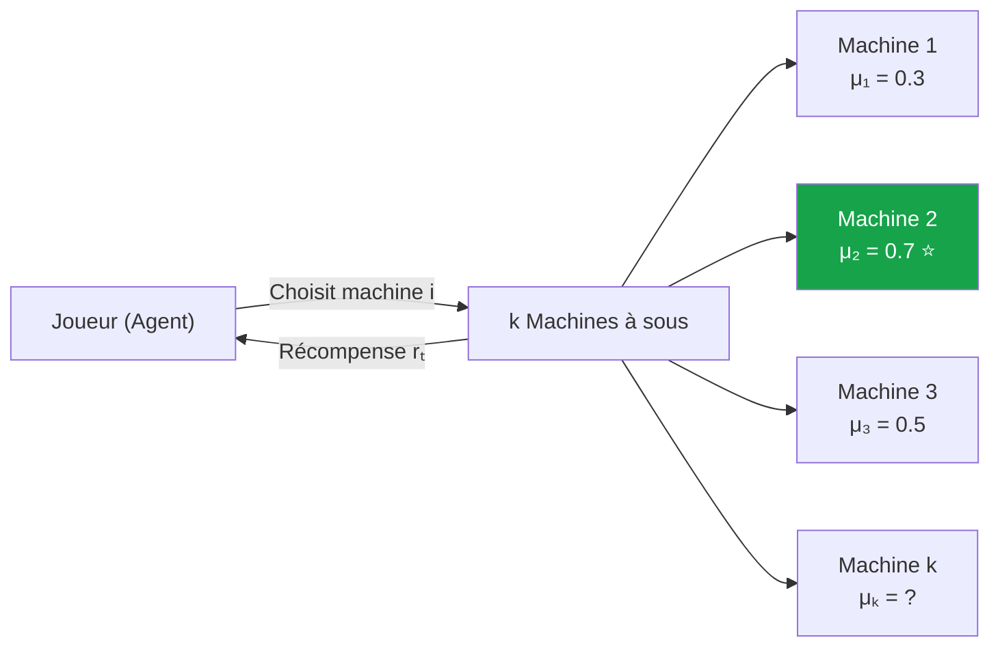

> _Le défi : vous ne connaissez pas à l'avance quelle machine est la meilleure. Pour le découvrir, vous devez **explorer** (essayer plusieurs machines), mais chaque essai « gaspillé » sur une machine médiocre est une récompense perdue. C'est le **dilemme exploration/exploitation** à l'état pur._

---

### Différence entre bandit et MDP

| Caractéristique | Problème de Bandit | MDP complet (RL classique) |
|---|---|---|
| **Nombre d'états** | **1 seul** (ou contexte simple) | Plusieurs (potentiellement infinis) |
| **Décisions séquentielles** | Non — chaque essai est indépendant | Oui — chaque action change l'état |
| **Conséquences à long terme** | Aucune — l'action n'influence pas le futur | Oui — γ (discount) joue un rôle clé |
| **Récompense** | Immédiate, stochastique | Peut être différée, dépend de la trajectoire |
| **Complexité** | Faible — pas de planification | Élevée — nécessite Bellman, Q-Learning, etc. |
| **Difficulté principale** | Exploration vs Exploitation | Exploration + crédit assignment + planification |

> _Un bandit est un MDP avec **|S| = 1**. C'est pourquoi les bandits sont étudiés en premier dans tous les cours de RL (notamment dans **Sutton & Barto, Chapitre 2**) : ils permettent d'isoler le dilemme exploration/exploitation sans la complexité du **credit assignment** (savoir quelle action passée mérite quelle récompense future)._

> **💡 Astuce**
> **C'est quoi exactement $S$ et pourquoi $|S| = 1$ ?**
>
> Dans un **MDP**, la lettre $S$ (en majuscule) désigne **l'ensemble de tous les états possibles** du système. C'est l'**univers** dans lequel l'agent peut se trouver à un instant donné.
>
> L'écriture $|S| = 1$ se lit « **le cardinal de $S$ vaut 1** », c'est-à-dire :
>
> $$|S| = 1 \quad \Longleftrightarrow \quad \text{il n'existe qu'un seul état possible}$$
>
> Le symbole $|\cdot|$ (deux barres verticales) signifie **le nombre d'éléments** de l'ensemble. Donc :
>
> | Notation | Signification |
> |---|---|
> | $S$ | l'**ensemble** des états |
> | $|S|$ | le **nombre** d'états dans $S$ |
> | $|S| = 1$ | il y a **un seul** état (l'agent est toujours « au même endroit ») |
>
> Dans un problème de bandit, l'agent n'a pas vraiment d'évolution d'état à gérer. À chaque tour, il se retrouve **exactement dans la même situation** :
>
> > « Je dois choisir une action parmi plusieurs bras / machines / options. »

> **ℹ️ Remarque**
> **Exemple ultra-concret — 3 machines à sous.**
>
> Imagine que tu as **3 machines** devant toi :
>
> ```
> Machine A
> Machine B
> Machine C
> ```
>
> À chaque essai, tu choisis une machine, tu reçois une récompense, **puis tu reviens exactement à la même situation** — la même salle, les mêmes 3 machines, les mêmes choix :
>
> ```
> État unique S₀ :
>   « Choisir A, B ou C »
> ```
>
> Donc l'ensemble des états ne contient qu'**un seul élément** :
>
> $$S = \{S_0\} \quad\Rightarrow\quad |S| = 1$$
>
> Concrètement :
>
> ```
> S    = ensemble des états
> |S|  = nombre d'états
> |S|  = 1   →  un seul état
> ```
>
> C'est pour ça qu'un bandit est **plus simple** qu'un vrai MDP :
>
> - **Pas de chemin** entre états (tu ne te déplaces pas)
> - **Pas de transition** complexe à modéliser
> - **Pas de récompense future** à attribuer à une action passée (pas de credit assignment)
>
> Il ne reste alors qu'**une seule grande question** à résoudre :
>
> > **Dois-je exploiter** l'action que je crois la meilleure pour l'instant,
> > **ou explorer** une autre action pour apprendre ?

> **⚠️ Attention — Ne pas confondre $S$ (ensemble) et $s$ (élément)**
>
> En convention RL standard :
>
> - $S$ (majuscule) = l'**ensemble** des états → $S = \{s_0, s_1, \dots\}$
> - $s$ (minuscule) = un état **particulier** → $s \in S$
> - $S_t$ = l'**état observé au pas de temps** $t$ (variable aléatoire) → $S_t \in S$
>
> Dans un bandit, peu importe le pas de temps $t$, on a toujours $S_t = s_0$. C'est pour cela qu'on **omet l'état dans les notations** : on écrit simplement $Q(a)$ au lieu de $Q(s, a)$. L'état est **implicite** car il n'y en a qu'un seul.

> **📌 À retenir**
> **Règle pour ne jamais confondre :**
>
> - **Bandit** = « Quelle pizza commander ce soir ? » → choix indépendants, sans conséquences futures
> - **MDP / RL complet** = « Quel coup jouer aux échecs ? » → chaque choix change la situation et influence les coups suivants
>
> Si votre problème **n'a pas d'état qui change** au fil des décisions, c'est un **bandit**, et vous n'avez pas besoin de Q-Learning ou PPO. Un simple ε-greedy suffit (et bat souvent les méthodes complexes en production !).

> **❓ FAQ**
> **La différence bandit ↔ MDP en 30 secondes.**
>
> **Q : Quelle est la différence formelle entre un bandit multi-bras et un MDP complet ?**
> R : C'est le **temps** et **les conséquences futures** qui changent tout :
> - **Bandit** = **un coup à la fois**. Tu choisis ta pizza ce soir → tu reçois une récompense (tu aimes ou pas) → demain, c'est un nouveau choix indépendant. **Aucune conséquence sur la suite.**
> - **MDP** = **toute une stratégie dans le temps**. Tu joues un coup d'échecs → l'échiquier change → ton prochain coup dépend de la nouvelle position. Chaque action **influence l'état suivant**.
>
> **Q : La temporalité est-elle l'unique critère qui distingue ces deux modèles ?**
> R : Plus précisément, c'est la **séquence d'états**. Dans un bandit, il y a **un seul état** (toujours le même, ou pas d'état du tout). Dans un MDP, il y a **plusieurs états**, et tes actions **font transiter** entre eux. Un bandit, c'est un MDP avec **|S| = 1**.
>
> **Q : Le bandit n'accumule-t-il pas, lui aussi, des récompenses sur l'horizon de décision ?**
> R : Oui, exactement. **Les deux maximisent une somme de récompenses.** La différence, c'est que dans le bandit chaque récompense est **indépendante** (le choix d'aujourd'hui ne change pas les options de demain), alors que dans le MDP chaque action **modifie le futur** (donc il faut planifier).

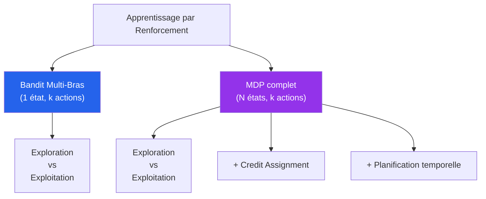

</details>

<p align="right"><a href="#top">↑ Retour en haut</a></p>

---

<a id="section-2"></a>

<details>
<summary>2 — Le bandit multi-bras (k-armed bandit) — Définition formelle</summary>

<br/>

### Formulation mathématique

Un **k-armed bandit** est défini par :

- Un ensemble de **k actions** (les « bras ») : $\mathcal{A} = \{a_1, a_2, \dots, a_k\}$
- Pour chaque action $a$, une **distribution de récompense inconnue** $R_a$ avec une moyenne $q_{\ast}(a) = \mathbb{E}[R_a]$
- À chaque pas de temps $t$, l'agent choisit une action $A_t \in \mathcal{A}$ et reçoit une récompense $R_t \sim R_{A_t}$

L'**objectif** de l'agent est de maximiser la **récompense cumulée** sur un horizon $T$ :

$$\text{maximiser} \quad \mathbb{E}\left[\sum_{t=1}^{T} R_t\right]$$

> **❓ FAQ**
> **Comment expliquer simplement « maximiser une somme de récompenses » ?**
>
> **Q : Comment interpréter l'expression « espérance d'une somme de récompenses » E[Σ R_t] ?**
> R : Imagine qu'**à chaque action choisie, tu reçois une petite récompense**. La somme des R, c'est tout simplement **l'accumulation de toutes ces petites récompenses** au fil du temps. L'objectif n'est pas de gagner gros une fois, c'est que **sur le long terme, le total soit le plus grand possible**.
>
> **Q : Pourquoi l'objectif est-il formulé en espérance E[…] plutôt qu'en somme déterministe ?**
> R : Parce que les récompenses sont **stochastiques** (aléatoires). Si tu joues 1 000 fois, tu n'auras pas exactement la même somme à chaque simulation. L'espérance E[…] = **la moyenne sur un très grand nombre de simulations**. C'est cette moyenne que l'agent cherche à rendre maximale.
>
> **Q : Comment formuler l'objectif du bandit en une phrase synthétique ?**
> R : « **Tu prends une décision pas pour le plaisir immédiat d'un gros gain, mais pour qu'au fil du temps, tu accumules un maximum de bénéfices.** » C'est l'inverse de la mentalité « tout, tout de suite » : on accepte de **tester un peu** au début pour gagner **beaucoup plus** ensuite.

---

### La fonction de valeur d'action $q_{\ast}(a)$

La **vraie valeur** d'une action $a$ est l'**espérance de récompense** lorsqu'on choisit cette action :

$$q_{\ast}(a) = \mathbb{E}[R_t \mid A_t = a]$$

L'agent ne connaît pas $q_{\ast}(a)$ — il doit l'**estimer** à partir de ses observations. On note $Q_t(a)$ son estimation au temps $t$.

> _Si l'agent connaissait parfaitement $q_{\ast}(a)$ pour chaque action, le problème serait trivial : il suffirait de toujours choisir $a^{\ast} = \arg\max_a q_{\ast}(a)$. **Tout le défi du bandit est dans cette ignorance initiale**._

> **💡 Astuce**
> **Vulgarisation — Qu'est-ce que $q_{\ast}(a)$ dans la vraie vie ?**
>
> Imaginez que vous évaluez **5 restaurants** sur une échelle de 1 à 10. Si Dieu vous chuchotait à l'oreille « Le restaurant n°3 a une vraie qualité moyenne de 8.7/10, le n°1 de 6.2/10... » — ces nombres seraient $q_{\ast}(a)$.
>
> Mais Dieu ne parle pas. **Vous devez aller manger** dans chaque restaurant pour estimer ces notes. Et chaque dîner est bruité (un soir le chef est fatigué, un autre c'est exceptionnel). Votre estimation $Q_t(a)$ s'améliore à chaque visite, mais ne sera **jamais parfaitement égale** à la vérité $q_{\ast}(a)$.

---

### L'estimation par moyenne empirique

L'estimation la plus naturelle est la **moyenne des récompenses** observées pour chaque action :

$$Q_t(a) = \frac{\text{somme des récompenses obtenues avec } a \text{ avant } t}{\text{nombre de fois où } a \text{ a été choisie avant } t} = \frac{\sum_{i=1}^{t-1} R_i \cdot \mathbb{1}_{A_i = a}}{N_t(a)}$$

où $N_t(a)$ = nombre de fois où l'action $a$ a été choisie avant le temps $t$.

#### Mise à jour incrémentale (sans tout stocker)

Au lieu de tout garder en mémoire, on peut mettre à jour $Q$ de manière **incrémentale** :

$$Q_{n+1}(a) = Q_n(a) + \frac{1}{n}\left[R_n - Q_n(a)\right]$$

Forme générale avec un **taux d'apprentissage** $\alpha$ :

$$Q_{n+1}(a) \leftarrow Q_n(a) + \alpha \left[R_n - Q_n(a)\right]$$

> _Vous reconnaissez ici la **structure classique des mises à jour TD** (Temporal Difference) que l'on retrouve dans Q-Learning et SARSA. Le bandit est le **terrain d'entraînement** pour comprendre cette équation fondamentale._

> **ℹ️ Remarque**
> **Vie réelle — La mise à jour incrémentale, vous la faites déjà.**
>
> Quand un ami vous dit « Tu sais, ce restaurant que je trouvais excellent, j'y suis retourné hier et c'était décevant... », vous mettez à jour mentalement votre opinion. Votre nouvelle estimation est **un mélange entre l'ancienne et la nouvelle expérience**, pas un remplacement total.
>
> C'est exactement la formule : $Q_{nouveau} = Q_{ancien} + \alpha \cdot (\text{surprise})$. Avec $\alpha = 0.1$, une visite décevante ne suffit pas à tout détruire (10% de poids), mais elle compte. Notre cerveau utilise probablement $\alpha \approx 0.1\text{-}0.3$ — nous sommes des bandits stochastiques ambulants !

---

### Le concept central : le regret

Le **regret cumulé** mesure la « perte » par rapport à l'agent oracle qui connaîtrait toujours la meilleure action.

➡️ Voir [**Éq. (6) — Regret cumulé**](#eq-regret) en haut du document, où $a^{\ast} = \arg\max_a q_{\ast}(a)$ est la meilleure action.

| Type de regret | Comportement souhaité |
|---|---|
| **Regret linéaire** $\mathcal{R}(T) \sim T$ | ❌ Mauvais — l'agent ne s'améliore jamais |
| **Regret logarithmique** $\mathcal{R}(T) \sim \log T$ | ✅ Excellent — borne théorique optimale |
| **Regret en racine** $\mathcal{R}(T) \sim \sqrt{T}$ | ⚠️ Acceptable mais sous-optimal |

> _Les bons algorithmes de bandit (UCB, Thompson Sampling) atteignent la borne **logarithmique** — cela signifie que **plus le temps passe, plus l'agent fait des choix optimaux**, à un rythme idéal._

> **🛑 Danger**
> **Danger — Le piège du regret linéaire.**
>
> Un agent qui choisit **toujours au hasard** (random) a un regret **linéaire** : à chaque pas il perd la même chose en moyenne. Sur 1 million d'utilisateurs, cela représente des **millions d'euros perdus** pour une plateforme comme Spotify ou Amazon.
>
> Le passage de **regret linéaire → logarithmique** est ce qui justifie économiquement tout l'effort d'ingénierie d'un système de bandits. C'est aussi pourquoi déployer **un mauvais bandit** (mal calibré) peut être pire que **pas de bandit du tout** — vous bloquez l'agent sur de mauvaises actions.

> **❓ FAQ**
> **Les types de regret expliqués avec un joueur de casino.**
>
> **Q : Comment définit-on formellement le regret cumulé R(T) ?**
> R : C'est la **différence entre ce que tu aurais pu gagner** si tu avais toujours joué la **meilleure machine** (l'oracle qui connaît toutes les vraies probas), **et ce que tu as réellement gagné**. C'est le **« manque à gagner »** lié à tes choix imparfaits, surtout au début quand tu explores. **Plus tu apprends vite, plus ton regret diminue vite.**
>
> **Q : Quelles sont les différences entre les régimes de regret linéaire, logarithmique et en racine ?**
> R : Avant de comparer les courbes, posons un **exemple ultra-concret** pour bien voir ce qu'est « perdre 1 $ de regret ».
>
> **Setup — 3 machines à sous :**
>
> ```
> Machine A : 10 $ en moyenne par essai   ← LA MEILLEURE
> Machine B :  7 $ en moyenne par essai
> Machine C :  2 $ en moyenne par essai
> ```
>
> La **meilleure action**, c'est **A** (récompense optimale $q_\ast = 10$ dollars).
>
> - Si l'agent choisit **B** → manque à gagner = $10 - 7 = 3$ → **3 $ de regret** sur ce coup-là
> - Si l'agent choisit **C** → manque à gagner = $10 - 2 = 8$ → **8 $ de regret** sur ce coup-là
> - Si l'agent choisit **A** → **0 $ de regret** (choix optimal)
>
> Le **regret cumulé** $R(T)$ est la **somme** de ces manques à gagner sur les $T$ premiers essais. On distingue 3 grands régimes selon **à quelle vitesse** ce regret grandit avec $T$ :
>
> **Hypothèse pour les exemples ci-dessous** : à chaque mauvais essai, l'agent perd en moyenne **3 $ de regret** (par exemple il choisit B au lieu de A).
>
> | Type | Loi | Après 10 essais | Après 100 essais | Après 1 000 essais | Comportement |
> |---|---|---|---|---|---|
> | **Linéaire** $R(T) \propto T$ | $R(T) = 3T$ | **30 $** | **300 $** | **3 000 $** | L'agent **n'apprend rien** : il choisit B (ou pire) à chaque essai → perte **constante de 3 $/essai**. C'est le pire cas. ❌ |
> | **Racine** $R(T) \propto \sqrt{T}$ | $R(T) \approx 3\sqrt{T}$ | **≈ 10 $** | **≈ 30 $** | **≈ 95 $** | L'agent **apprend lentement** : il se trompe encore parfois, mais ses pertes augmentent **de moins en moins vite**. ⚠️ |
> | **Logarithmique** $R(T) \propto \log T$ | $R(T) \approx 10 \log_{10}(T)$ | **≈ 10 $** | **≈ 20 $** | **≈ 30 $** | L'agent **apprend très vite** : après 1 000 essais, il a **à peine 30 $** de regret. ✅ |
>
> **La différence est vertigineuse à long terme :**
>
> ```
> Après 1 000 essais
> ───────────────────
>   Linéaire        :  3 000 $   ← perd 3 $/essai, toujours
>   Racine √T       :  ~ 95 $    ← s'améliore mais lentement
>   Logarithmique   :  ~ 30 $    ← excellent : converge vers l'optimal
> ```
>
> **Visualisation des 3 courbes :**
>
> ```mermaid
> xychart-beta
>     title "Regret cumulé R(T) selon le régime"
>     x-axis "Essais T" [10, 100, 1000, 5000, 10000]
>     y-axis "Regret cumulé R(T) en $" 0 --> 3000
>     line "Linéaire R(T) = 3T" [30, 300, 3000, 15000, 30000]
>     line "Racine R(T) = 3√T" [9, 30, 95, 212, 300]
>     line "Logarithmique R(T) = 10 log T" [10, 20, 30, 37, 40]
> ```
>
> _Schéma intuitif (ASCII)_ :
>
> ```
> R(T)
>  ↑
> 3000│                                          ╱  Linéaire (3T)
>     │                                       ╱
> 2000│                                    ╱
>     │                                 ╱
> 1000│                              ╱
>     │                           ╱
>  300│                        ╱ ___________________  √T (~ √T)
>     │                  ____/
>   30│___________ _____/    ────────────────────────  log T
>     │
>     └──────┬───────┬───────┬───────┬────────────→ T
>           10     100     1000   10000  (échelle log)
> ```
>
> → On voit clairement que **la linéaire explose** alors que **le log reste presque plat**. C'est exactement pour ça qu'**UCB et Thompson Sampling**, qui atteignent le régime logarithmique, sont les algorithmes prouvés **optimaux**.
>
> **Q : Quel régime de regret est le plus défavorable pour l'agent ?**
> R : Le **regret linéaire**. Tes pertes **continuent d'augmenter au même rythme** sans jamais ralentir. C'est ce qu'on veut **absolument éviter**. Les regrets **log et racine** sont **doux** : on perd encore un peu, mais **de moins en moins vite** parce qu'on apprend.
>
> **Q : Comment classer ces régimes du plus optimal au moins optimal ?**
> R : **Log < Racine < Linéaire** (du moins de regret au plus de regret). Le but de toute la théorie des bandits, c'est d'**atteindre la borne logarithmique** (UCB et Thompson y arrivent — voir [Section 4](#section-4)).
>
> **Q : Pourquoi ε-greedy à ε constant produit-il un regret linéaire ?**
> R : Parce que même après avoir trouvé la meilleure action, l'agent continue de **gaspiller ε% du temps en exploration aléatoire** — donc il continue de perdre une petite somme **constante à chaque pas**. Avec **ε-greedy decay** (ε qui diminue avec le temps), on s'approche du **regret logarithmique**.

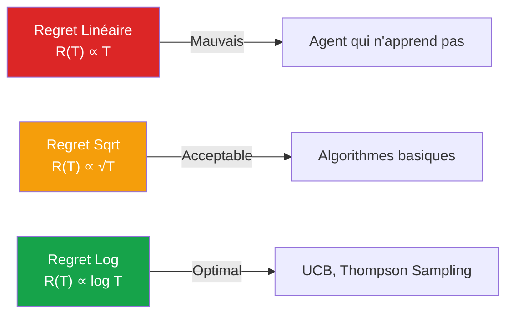

</details>

<p align="right"><a href="#top">↑ Retour en haut</a></p>

---

<a id="section-3"></a>

<details>
<summary>3 — Applications industrielles des bandits simples</summary>

<br/>

Les bandits ne sont **pas un jouet académique** — ils sont **massivement déployés** dans l'industrie depuis les années 2000. Leur simplicité et leur robustesse en font l'**outil RL le plus utilisé en production** dans le monde réel.

> _Anecdote : Dès **2010**, **Microsoft Research** (avec Yahoo! Labs et John Langford) a publié des travaux fondateurs montrant que la recommandation d'articles sur **MSN.com** se traite comme un problème de **bandit contextuel** : le système choisit séquentiellement quel article afficher selon des informations sur l'utilisateur et l'article, puis apprend du clic ou non-clic. Aujourd'hui, ces systèmes servent **plusieurs millions de décisions par jour** — une stack RL plus simple que le Deep RL, mais infiniment plus rentable à grande échelle._

> **💡 Astuce — L'anecdote MSN.com expliquée pas à pas**
> **Pourquoi un « petit » bandit contextuel rapporte plus qu'un gros Deep RL ?**
>
> **1) Le problème de MSN.com**
>
> Imagine la page d'accueil de **MSN.com**. À chaque visiteur, le système doit décider :
>
> > « Quel article montrer à **cette** personne, **maintenant** ? »
>
> Par exemple :
>
> ```
> Article A : politique
> Article B : sport
> Article C : finance
> Article D : météo
> Article E : technologie
> ```
>
> Le système **ne sait pas** à l'avance ce que l'utilisateur va aimer. Il doit :
>
> 1. **Choisir** un article (action)
> 2. **Observer** si l'utilisateur clique (récompense)
> 3. **Apprendre** pour la prochaine fois
>
> C'est **exactement** un problème de bandit.
>
> **2) Pourquoi « contextuel » ?**
>
> Un bandit **classique** choisit simplement entre plusieurs actions (« A, B, C ou D »). Un bandit **contextuel** ajoute du **contexte** $x_t$ avant la décision :
>
> | Contexte | Exemple de valeurs |
> |---|---|
> | Pays / langue | `FR-CA`, `EN-US`, `JP` |
> | Heure de la journée | `matin`, `soir` |
> | Type d'appareil | `mobile`, `desktop`, `tablet` |
> | Historique de clics | « lit beaucoup de sport » |
> | Catégorie préférée | `tech`, `finance` |
> | Popularité récente | trending news |
>
> Le système ne dit plus seulement « l'article A est bon », il dit :
>
> > « **Pour ce type d'utilisateur, à ce moment précis, dans ce contexte précis**, l'article A semble être le meilleur choix. »

> **ℹ️ Remarque — Où est le RL dans tout ça ?**
>
> C'est bien du RL parce qu'on retrouve les 4 ingrédients classiques :
>
> ```
> agent          → le système de recommandation MSN
> action         → choisir quel article afficher
> récompense     → clic / lecture / engagement
> apprentissage  → améliorer les prochains choix
> ```
>
> Mais **ce n'est pas du Deep RL complexe** avec beaucoup d'états, de transitions et de récompenses futures. Ici l'objectif est **direct** :
>
> ```
> 1. Je montre un article
> 2. L'utilisateur clique ou ne clique pas
> 3. J'apprends
> ```
>
> → Un RL **très pratique, très industriel, très rentable**.

> **💡 Astuce — Pourquoi c'est rentable ?**
>
> Parce que la décision est **répétée des millions de fois par jour**. Même une **petite** amélioration produit un effet énorme :
>
> ```
> Avant le bandit : taux de clic = 5,0 %
> Après bandit    : taux de clic = 5,5 %
> ```
>
> La différence semble minuscule. Mais à l'échelle de MSN.com :
>
> $$+0{,}5\% \text{ de clics} \times \text{millions de décisions/jour} = \text{beaucoup} + \text{de pages vues} = \text{plus de revenus publicitaires}$$
>
> C'est pour cela que les **bandits contextuels** dominent dans :
>
> - 📰 Recommandation de news (MSN, Yahoo!, LinkedIn)
> - 🛒 Layout de pages produits (Amazon, Booking)
> - 📧 Lignes d'objet d'emails marketing
> - 🎯 Choix de créatifs publicitaires (Google Ads)
> - 🎨 Variantes de bouton / image / titre

> **⚠️ Attention — Pourquoi pas directement du Deep RL ?**
>
> Le Deep RL est souvent :
>
> | Deep RL (DQN, PPO...) | Bandit contextuel |
> |---|---|
> | ❌ Plus complexe | ✅ Plus simple |
> | ❌ Plus coûteux à entraîner | ✅ Plus rapide |
> | ❌ Plus difficile à stabiliser | ✅ Plus facile à déployer |
> | ❌ Risqué en production | ✅ Facile à mesurer |
> | ❌ Difficile à expliquer | ✅ Adapté aux décisions immédiates |
>
> Pour MSN.com, **pas besoin de planifier 50 actions dans le futur**. Il faut juste répondre à :
>
> > « Quel article dois-je montrer **maintenant** pour maximiser la probabilité de clic ? »
>
> → C'est exactement ce qu'un bandit contextuel fait, **mieux et moins cher** qu'un Deep RL.

> **📌 À retenir — La phrase pédagogique**
>
> > Un **bandit contextuel** est une forme **simple** de RL utilisée pour prendre des **décisions personnalisées en temps réel**. Sur MSN.com, il sert à choisir quel article afficher à chaque utilisateur **selon son contexte**, puis apprend à partir des clics. C'est **moins spectaculaire** que le Deep RL, mais **souvent beaucoup plus rentable** en production.
>
> Encore plus court :
>
> > **Deep RL** résout des problèmes très complexes.
> > **Bandits contextuels** résolvent des problèmes **simples mais répétés des millions de fois**.
> > C'est là qu'est leur valeur industrielle.

> **📌 À retenir**
> Choisissez un bandit AVANT un Deep RL
>
> Quand on découvre le RL, la tentation est de tout faire avec PPO ou DQN. **Erreur classique en industrie**. Avant de sortir l'artillerie lourde, demandez-vous :
>
> 1. Est-ce que mon problème **a vraiment plusieurs états** qui changent avec mes décisions ?
> 2. Si non → **bandit suffit** (et apprendra 100× plus vite avec 100× moins de données).
>
> 90% des cas d'usage industriels « RL » sont en réalité des **bandits déguisés**. Spotify, Amazon, Microsoft Personalizer, Vowpal Wabbit... tous tournent sur des bandits, pas sur du Deep RL exotique.


<details>
    
<summary> Description des algorithmes de Bandits </summary>

Le vrai problème derrière tous ces algorithmes est toujours le même :

* Est-ce que je continue à utiliser ce qui marche déjà ? → exploitation
* Ou est-ce que je teste encore d’autres options ? → exploration

Chaque algorithme gère ça différemment.

| Algorithme                | Idée principale                       | Comment il explore                                               | Comment il exploite                                 | Style de comportement     |
| ------------------------- | ------------------------------------- | ---------------------------------------------------------------- | --------------------------------------------------- | ------------------------- |
| ε-greedy                  | Explore au hasard un petit % du temps | Exploration aléatoire avec ε                                     | Le reste du temps, prend la meilleure option connue | Simple, direct            |
| Optimistic Initial Values | Commence en étant “trop optimiste”    | Explore parce qu’il croit que tout est potentiellement excellent | Ensuite garde les meilleures options réelles        | Curieux au début          |
| UCB                       | Utilise l’incertitude mathématique    | Explore les options peu testées                                  | Exploite celles avec bonne moyenne                  | Intelligent et méthodique |
| Thompson Sampling         | Utilise des probabilités              | Explore selon les chances probabilistes                          | Exploite les options probablement bonnes            | Naturel et adaptatif      |

Maintenant, vulgarisons chaque un.

---

# 1. ε-greedy

Imagine :

* 90 % du temps → tu fais ce qui marche déjà
* 10 % du temps → tu testes quelque chose au hasard

Exemple :

Tu commandes toujours le même café car tu l’aimes.
Mais parfois tu testes une nouvelle boisson “juste pour voir”.

Formule mentale :

> “Je garde mon meilleur choix…
> mais parfois je tente ma chance.”

Pourquoi il est célèbre ?

* ultra simple
* facile à coder
* fonctionne “assez bien”
* parfait pour apprendre

Faiblesse :

Même après 1 million d’essais…
il continue parfois à faire des choix stupides au hasard.

---

# 2. Optimistic Initial Values

Ici, on “ment” au système au début.

On dit :

> “Toutes les options semblent incroyables.”

Donc l’algorithme veut toutes les tester.

Exemple :

Tu arrives dans une nouvelle ville.
Tu supposes que TOUS les restaurants sont excellents.

Donc :

* tu testes restaurant A
* puis B
* puis C
* etc.

Puis la réalité corrige ton optimisme.

Pourquoi c’est intelligent ?

Parce qu’on force l’exploration naturellement,
sans utiliser ε aléatoire.

Faiblesse :

Si les premières expériences sont mauvaises,
il peut devenir biaisé rapidement.

---

# 3. UCB (Upper Confidence Bound)

Celui-ci est plus “scientifique”.

Il se dit :

> “Cette option semble bonne…
> MAIS je ne l’ai pas assez testée.”

Donc il ajoute un bonus aux options peu explorées.

Idée :

Score final =

* moyenne observée
  PLUS
* bonus d’incertitude

Donc :

* si une option est peu testée → gros bonus
* si elle est très testée → petit bonus

Exemple humain :

Tu as :

* un resto que tu connais bien → note 8/10
* un nouveau resto testé une seule fois → peut-être 9/10 ?

UCB dit :

> “Je vais peut-être re-tester le nouveau,
> car je manque encore d’informations.”

Pourquoi il est fort ?

* exploration intelligente
* pas aléatoire
* très bon théoriquement

Faiblesse :

* plus mathématique
* moins intuitif
* parfois rigide

---

# 4. Thompson Sampling

Celui-ci est très élégant.

Il fonctionne avec des probabilités.

Il se dit :

> “Quelle option a probablement la plus grande chance d’être la meilleure ?”

Puis il tire aléatoirement selon ces probabilités.

Exemple :

Tu hésites entre :

* Sushi : 70 % de chance d’être meilleur
* Pizza : 20 %
* Burger : 10 %

Alors :

* souvent sushi
* parfois pizza
* rarement burger

C’est une exploration “naturelle”.

Pourquoi il est très aimé aujourd’hui ?

Parce qu’il :

* apprend très bien
* s’adapte rapidement
* équilibre naturellement exploration/exploitation
* performe extrêmement bien en pratique

Très utilisé en :

* publicité
* recommandations
* A/B testing
* systèmes IA modernes

---

# Résumé 

| Algorithme | Mentalité                                  |
| ---------- | ------------------------------------------ |
| ε-greedy   | “Parfois je tente au hasard.”              |
| Optimistic | “Je crois que tout est génial au début.”   |
| UCB        | “Je vais explorer ce qui reste incertain.” |
| Thompson   | “Je vais suivre les probabilités.”         |

---

# Intuition humaine

Imagine restaurants ou investissements.

| Situation                                          | Algorithme        |
| -------------------------------------------------- | ----------------- |
| Tu testes parfois au hasard                        | ε-greedy          |
| Tu crois que tout le monde est incroyable au début | Optimistic        |
| Tu explores les personnes ou endroits que tu connais moins     | UCB               |
| Tu suis ton intuition probabiliste                 | Thompson Sampling |

- Voilà pourquoi ces algorithmes sont fascinants :
- ils modélisent presque le comportement humain face à l’incertitude.


</details>


> **❓ FAQ**
> **Concrètement : qui utilise ça et pourquoi ?**
>
> **Q : MSN.com, Yahoo! et LinkedIn utilisent-ils effectivement des bandits pour la personnalisation de contenu ?**
> R : Oui — dès **2010**, **Yahoo! Labs** (Lihong Li et al.) a publié l'article fondateur _"A Contextual-Bandit Approach to Personalized News Article Recommendation"_, et **Microsoft Research** a depuis appliqué la même approche à **MSN.com** pour servir **plusieurs millions de décisions par jour**. C'est une stack RL **plus simple que le Deep RL**, mais **infiniment plus rentable à grande échelle** : on personnalise, on teste, on optimise en continu, et avec des millions d'utilisateurs **les gains s'accumulent vite**.
>
> **Q : Google Ads et Facebook Ads s'appuient-ils sur des bandits pour l'allocation budgétaire en temps réel ?**
> R : Oui. Au lieu de répartir un budget publicitaire **à parts égales** entre plusieurs créations, le bandit **identifie celle qui marche le mieux** (taux de clic le plus élevé) et **réoriente automatiquement plus de budget dessus**. On **explore au début** (toutes les pubs sont testées un peu), puis on **exploite ce qui marche** (les pubs gagnantes reçoivent presque tout le budget).
>
> **Q : Quelle est l'intuition sous-jacente à l'allocation budgétaire par bandit ?**
> R : « Tu as **5 affiches publicitaires**, mais tu ne sais pas laquelle attire le plus de clients. Tu commences par les tester **toutes un peu**. Dès que tu vois laquelle marche le mieux, tu **mets plus d'argent sur celle-là**. C'est exactement ça qu'un bandit fait, **automatiquement**, des milliers de fois par seconde. »
>
> **Q : Ce mécanisme introduit-il une inégalité de traitement entre les annonceurs ?**
> R : Au contraire — c'est **plus efficace pour tout le monde**. Si deux annonceurs paient 4 $ et que la pub de l'un performe mieux (les utilisateurs cliquent plus), la plateforme va lui donner **plus de visibilité**. Les annonceurs avec de **bonnes pubs** ont **plus de résultats**, et les utilisateurs voient des pubs qui les **intéressent davantage**. C'est gagnant–gagnant : **pas une question d'équité, mais d'efficacité**.
>
> **Q : Quel est l'intérêt des bandits dans le contexte des essais cliniques adaptatifs ?**
> R : Oui — c'est la magie des **essais cliniques adaptatifs**. Imagine deux traitements à comparer :
> - **Essai classique** : tu testes le traitement A sur 500 patients et le traitement B sur 500 autres, **pendant 2 ans**, puis tu compares.
> - **Essai adaptatif (bandit)** : tu testes les deux sur **quelques patients d'abord**. Dès que tu vois que **le traitement A semble mieux marcher**, tu **donnes A à plus de patients** dans la suite de l'essai. Tu **augmentes ainsi les chances d'aider plus de monde rapidement**, et tu **arrêtes plus tôt** ce qui ne marche pas.
>
> **Q : Existe-t-il un exemple documenté d'application clinique récente ?**
> R : Pendant la pandémie de **COVID-19**, plusieurs essais (notamment **RECOVERY** au UK) ont utilisé des designs adaptatifs proches des bandits pour **identifier vite la dexaméthasone** (efficace) et **abandonner l'hydroxychloroquine** (non efficace). **Cela a probablement sauvé des milliers de vies** par rapport à un essai classique qui aurait pris des mois de plus.

---

### 3.1 — Tests A/B intelligents (publicité, e-commerce)

Le **test A/B classique** divise le trafic 50/50 entre deux versions et mesure les performances. Inefficace ! Pendant tout le test, on **gaspille** la moitié du trafic sur la version perdante.

Les **bandits remplacent les tests A/B** : le trafic est **réorienté dynamiquement** vers les versions qui performent mieux, en **temps réel**.

| | Test A/B classique | Bandit |
|---|---|---|
| **Allocation** | 50/50 figé | Adaptative selon performance |
| **Coût d'opportunité** | Élevé (50% sur la version perdante) | Faible (peu de trafic gaspillé) |
| **Vitesse de décision** | Long (attendre fin du test) | Continue, en temps réel |
| **Utilisé par** | Tout le monde (par défaut) | Google Ads, Microsoft, Optimizely |

> _Économie typique : un bandit bien réglé fait gagner **20-30% de revenus supplémentaires** par rapport à un test A/B classique sur la même durée._

> **ℹ️ Remarque — C'est quoi exactement un test A/B ?**
>
> Un **test A/B** est une méthode simple pour comparer **deux versions** d'une même chose afin de voir laquelle fonctionne le mieux.
>
> **Exemple — quel bouton donne plus de clics ?**
>
> ```
> Version A : bouton bleu    « Commencer »
> Version B : bouton orange  « Télécharger gratuitement »
> ```
>
> On montre **A** à une partie des utilisateurs, **B** à une autre partie. Puis on mesure :
>
> ```
> Version A : 1 000 visiteurs →  80 clics  →  8 %
> Version B : 1 000 visiteurs → 120 clics  → 12 %
> ```
>
> → La version B est meilleure car elle obtient plus de clics.
>
> **Autre exemple — un PDF gratuit avec 2 titres :**
>
> ```
> Titre A : "Download the free AI guide"
> Titre B : "Learn AI faster with this free guide"
> ```
>
> Après un certain temps :
>
> ```
> Titre A → 5 % des visiteurs donnent leur courriel
> Titre B → 9 % des visiteurs donnent leur courriel
> ```
>
> → On garde le titre B.
>
> **À quoi ça sert ?** À améliorer un **titre**, un **bouton**, une **image**, une **publicité**, une **page d'inscription**, un **email marketing**, une **page de vente**, une **recommandation de produit**, etc.
>
> > L'idée centrale : **ne pas deviner, tester avec des données réelles**.

> **💡 Astuce — Test A/B vs Bandit : la vraie différence**
>
> Un **test A/B classique** sépare les utilisateurs de manière **fixe** :
>
> ```
> 50 % voient A
> 50 % voient B
> ```
>
> Même si **B devient clairement meilleur** au bout de 2 jours, on continue souvent **jusqu'à la fin du test** (par exemple 2 semaines). → **Trafic gaspillé sur la version perdante.**
>
> Un **bandit** est plus malin :
>
> 1. Au début, il teste A et B équitablement.
> 2. Dès qu'il voit que **B marche mieux**, il **montre B plus souvent** automatiquement.
>
> | Méthode | Idée centrale |
> |---|---|
> | **Test A/B** | Comparer 2 versions avec une **répartition fixe** |
> | **Bandit** | Tester plusieurs options, puis **favoriser progressivement la meilleure** |
>
> > **Phrase simple pour étudiants :** _Un test A/B montre 2 versions à 2 groupes pour mesurer laquelle marche le mieux. C'est une **décision basée sur des données réelles** plutôt que sur l'intuition. Un bandit fait pareil, mais s'adapte en temps réel et ne gaspille pas de trafic._

> **💡 Astuce**
> **Vie réelle — Pourquoi votre boutique en ligne préférée vous propose toujours « le bon produit ».**
>
> Quand Amazon teste 5 designs différents pour son bouton « Acheter », un test A/B classique enverrait 20% des utilisateurs sur chaque design pendant 2 semaines. Un bandit envoie **automatiquement** plus de visiteurs sur le design qui convertit le mieux, **dès la première heure**.
>
> Résultat : si le design n°3 est clairement meilleur, après 1 jour seuls 5% des visiteurs voient encore les designs perdants — vs 80% avec un test A/B classique. **C'est cette mécanique invisible qui finance les ingénieurs ML.**

---

### 3.2 — Recommandation de contenu (news, vidéos)

**Yahoo!**, **Microsoft (MSN)**, **LinkedIn**, **Spotify** utilisent des bandits pour décider **quel article afficher** en haut de page :

- Chaque article = **un bras**
- Récompense = clic (1) ou pas de clic (0)
- L'algorithme apprend en quelques heures quels articles « performent »

> _Avantage clé : le bandit s'adapte aux **événements imprévus**. Si une actualité éclate (ex : élection, catastrophe), l'algorithme bascule rapidement vers les articles correspondants sans intervention humaine._

---

### 3.3 — Optimisation de campagnes publicitaires

**Google Ads**, **Facebook Ads**, **Criteo** utilisent des bandits pour répartir le budget entre plusieurs créations publicitaires :

- Chaque variante de pub = **un bras**
- Récompense = taux de clic × valeur de conversion
- Le budget se concentre **automatiquement** sur la pub gagnante

---

### 3.4 — Essais cliniques adaptatifs

**Domaine médical** : au lieu de fixer à l'avance combien de patients reçoivent chaque traitement (essai randomisé classique), un essai **adaptatif** alloue plus de patients aux traitements qui semblent les plus efficaces — **sauvant potentiellement des vies** pendant l'essai lui-même.

> _Exemple concret : pendant la pandémie de COVID-19, plusieurs essais cliniques (ex : RECOVERY au UK) ont utilisé des designs adaptatifs proches des bandits pour identifier rapidement les traitements efficaces (dexaméthasone) et abandonner les non-efficaces (hydroxychloroquine)._

---

### 3.5 — Pricing dynamique

**Amazon**, **Uber**, **Airbnb** utilisent des bandits pour tester différents prix sur des sous-populations :

- Chaque niveau de prix = **un bras**
- Récompense = revenu (prix × probabilité d'achat)
- L'algorithme converge vers le **prix optimal** qui maximise le revenu

---

### 3.6 — Allocation de ressources réseau

Routeurs Internet, antennes 5G, datacenters — tous utilisent des bandits pour décider **quelle ressource allouer** quand plusieurs serveurs ou canaux sont disponibles avec des performances variables.

---

### Carte des applications industrielles des bandits

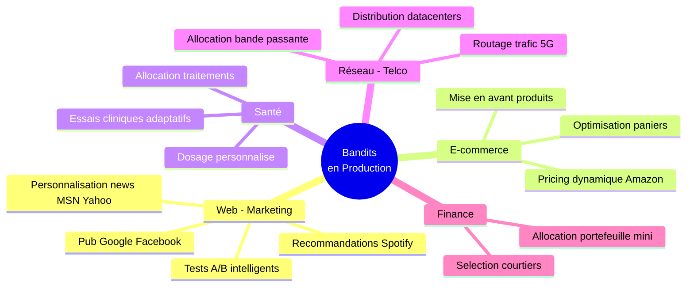

> _Pourquoi les bandits dominent en production ? Trois raisons : **(1)** Implémentation simple — quelques lignes de code suffisent ; **(2)** Garanties théoriques fortes — le regret logarithmique est mathématiquement prouvé ; **(3)** Robustesse — les bandits dégradent gracieusement même si les hypothèses ne sont pas parfaites._

</details>

<p align="right"><a href="#top">↑ Retour en haut</a></p>

---

<a id="section-4"></a>

<details>
<summary>4 — Algorithmes basés sur la valeur (Value-Based)</summary>

<br/>

Les **algorithmes value-based** suivent tous le même principe : **estimer $Q(a)$** pour chaque action, puis utiliser ces estimations pour choisir l'action suivante. Ils diffèrent uniquement dans leur **stratégie d'exploration**.

```mermaid
flowchart TD
    A["Toutes les méthodes Value-Based"] --> B["Étape 1 : Estimer Q(a)<br/>via moyenne empirique"]
    B --> C["Étape 2 : Choisir l'action<br/>selon une stratégie d'exploration"]
    C --> D["ε-greedy<br/>(aléatoire avec proba ε)"]
    C --> E["Optimistic Init<br/>(exploration initiale forcée)"]
    C --> F["UCB<br/>(bonus d'incertitude)"]
    C --> G["Thompson Sampling<br/>(échantillonnage bayésien)"]
    style D fill:#2563eb,color:#fff
    style E fill:#0ea5e9,color:#fff
    style F fill:#9333ea,color:#fff
    style G fill:#16a34a,color:#fff
```

> **❓ FAQ**
> **Les 4 algorithmes en une phrase chacun.**
>
> **Q : Quelle est la différence entre ε-greedy, Optimistic, UCB et Thompson Sampling ?**
> R : Tous résolvent le même problème (équilibrer exploration/exploitation), **mais avec une philosophie différente** :
>
> | Algorithme | En une phrase | Métaphore humaine |
> |---|---|---|
> | **ε-greedy** | « La plupart du temps je joue mon favori, **de temps en temps au hasard** » | Le pragmatique : **routine + curiosité contrôlée** |
> | **Optimistic** | « Je suppose que **tout est super** au début, j'ajuste après essai » | L'optimiste naïf : **donne sa chance à tout le monde** |
> | **UCB** | « Je joue ce qui est prometteur **ET incertain** (bonus d'exploration calculé)» | Le **manager rationnel** : « ce candidat est bon **et je le connais peu** → essayons-le » |
> | **Thompson Sampling** | « Je tire **au hasard intelligemment** selon mes croyances bayésiennes » | Le **joueur intuitif** qui parie selon sa **confiance probabiliste** |
>
> **Version encore plus pédagogique — idée détaillée :**
>
> | Algorithme | Idée simple (en mots) | Métaphore humaine |
> |---|---|---|
> | **ε-greedy** | La plupart du temps je choisis la **meilleure action connue**. Mais parfois, avec une petite probabilité $\varepsilon$, je choisis **au hasard** pour continuer à explorer. | Le **pragmatique** : il a ses habitudes, mais garde un peu de curiosité. |
> | **Optimistic Init** | Au début, je donne une **très bonne note artificielle** à toutes les actions. Comme elles semblent toutes prometteuses, je suis **obligé** de les tester. | L'**optimiste naïf** : il croit que tout le monde est excellent jusqu'à preuve du contraire. |
> | **UCB** | Je choisis l'action qui combine **bonne performance connue** + **forte incertitude**. Plus une action est peu testée, plus je lui donne un **bonus d'exploration**. | Le **manager rationnel** : « ce candidat semble bon mais je ne l'ai pas assez testé, je lui donne sa chance ». |
> | **Thompson Sampling** | Je maintiens une **croyance probabiliste** sur chaque action, puis je **tire au hasard** une option selon ces croyances. Les actions prometteuses ont plus de chances d'être choisies. | Le **joueur intuitif** : il parie selon sa confiance, mais accepte l'incertitude. |
>
> **La nuance subtile entre les 4 :**
>
> - **ε-greedy** explore de manière **simple, parfois presque bête** : avec proba $\varepsilon$, il choisit **n'importe quoi au hasard** — y compris une action manifestement mauvaise.
> - **Optimistic Init** **force l'exploration au début** car toutes les actions commencent avec une valeur trop élevée. Après quelques essais, les valeurs deviennent réalistes — **l'exploration s'éteint d'elle-même**.
> - **UCB** explore de manière **intelligente et déterministe** : il ne choisit **jamais au hasard**, il choisit les actions **intéressantes ET encore mal connues**.
> - **Thompson Sampling** est **encore plus probabiliste** : il raisonne avec des **croyances bayésiennes**. Il se dit : « je ne suis pas certain que cette action soit la meilleure, mais selon mes données actuelles, elle a une bonne probabilité de l'être ».
>
> **Phrase à donner aux étudiants :**
>
> > Ces 4 algorithmes sont **différentes façons de répondre à la même question** : _dois-je choisir l'action que je crois déjà meilleure, ou tester une autre action pour apprendre davantage ?_
>
> **Version ultra-courte (mémo) :**
>
> ```
> ε-greedy     →  explore parfois au hasard
> Optimistic   →  force l'exploration au début
> UCB          →  explore ce qui est prometteur mais incertain
> Thompson     →  explore selon des probabilités de confiance
> ```
>
> **Q : Quelles sont les performances comparées de ces algorithmes sur le 10-armed testbed standard ?**
> R : Sur le **10-armed testbed standard** (Sutton & Barto), après **1000 pas** :
> - Random (baseline) : récompense moyenne **≈ 1.0**
> - ε-greedy (ε = 0.01) : **≈ 1.42** — peu d'exploration, performance modérée
> - ε-greedy (ε = 0.10) : **≈ 1.55** — un peu plus d'exploration → meilleur à long terme
> - **UCB** et **Thompson Sampling** : encore plus haut (regret logarithmique)
>
> Conclusion : **un peu d'exploration améliore les résultats** sur la durée. **Trop peu** = on reste bloqué sur une bonne mais pas optimale. **Trop** = on gaspille des essais.
>
> **Q : Que désigne précisément le qualificatif « optimiste » dans Optimistic Initial Values ?**
> R : Au lieu de partir avec Q(a) = 0 pour toutes les actions (« je ne connais rien »), tu pars avec Q(a) = 5 pour tout le monde (« **je suppose que tout est top** »). Du coup, dès qu'une action déçoit, sa valeur **chute** et l'agent essaie spontanément les actions encore non testées (qui sont **toujours au max optimiste**). **L'exploration est intégrée dans l'initialisation** — pas besoin de hasard.
>
> **Q : Quelle est l'intuition sous-jacente au bonus d'exploration de UCB ?**
> R : Imagine que tu es dans un parc d'attractions avec **plusieurs stands de glaces**. Chaque stand a un goût différent, mais tu ne sais pas encore lequel est le meilleur. À chaque fois que tu choisis un stand, tu regardes **deux choses** :
> 1. **Combien de bonnes glaces tu as eues en moyenne** dans ce stand jusqu'à présent (la moyenne Q(a)).
> 2. **À quel point tu as encore besoin de le tester** : si tu y es allé seulement 1 fois, tu n'es pas vraiment sûr de la qualité, donc tu lui ajoutes un **« bonus de doute »** ; si tu y es allé 50 fois, ce bonus est minuscule.
>
> Le stand que tu choisis à chaque tour est celui qui a la **somme moyenne + bonus** la plus élevée. Résultat : les stands prometteurs sont vite re-testés, **les stands peu visités gardent une chance** (à cause du bonus), et au fil du temps tu finis par concentrer tes visites sur **le meilleur stand** sans jamais avoir laissé tomber les autres trop tôt. C'est ça UCB : **équilibrer ce que tu sais déjà avec ce qu'il te reste à apprendre**, mais en le calculant **avec une formule mathématique précise** au lieu d'un simple tirage au hasard comme ε-greedy.
>
> **Q : La distinction entre ces algorithmes se réduit-elle au seul dosage exploration/exploitation ?**
> R : Oui — fondamentalement, **tous** les algorithmes de bandit résolvent **le même dilemme exploration / exploitation**, mais chacun avec une **mécanique différente** :
> - **ε-greedy** explore avec une probabilité fixe ε (par exemple 10 %) en tirant **au hasard** parmi toutes les actions, et exploite le reste du temps.
> - **Optimistic Init** ne fait **aucun tirage aléatoire** : il triche sur les valeurs initiales pour forcer l'agent à tout tester au moins une fois.
> - **UCB** explore en privilégiant **mathématiquement** les actions peu testées via un bonus calculé, sans tirage aléatoire.
> - **Thompson Sampling** explore via des **tirages probabilistes** dans une distribution de croyance, l'exploration diminuant naturellement au fil des essais.
> - **Gradient Bandit** ajuste directement les **probabilités de chaque action** selon la récompense reçue, sans calculer de Q(a).
>
> Donc oui, c'est « **comment je dose la curiosité** » qui change d'un algo à l'autre — mais la différence de **performance** entre ces approches peut être énorme (jusqu'à 5-10× sur le regret cumulé).
>
> **Q : Pourquoi ε-greedy demeure-t-il l'algorithme le plus utilisé en industrie malgré sa sub-optimalité théorique ?**
> R : Pour **trois raisons concrètes** qui pèsent plus lourd que la théorie en production :
> 1. **Simplicité extrême** : trois lignes de code, **un seul hyperparamètre** à régler (ε), aucune mathématique avancée. N'importe quel développeur le code et le débogue en 10 minutes.
> 2. **Robustesse** : il donne des résultats **corrects dans énormément de contextes**, même quand il n'est pas optimal. C'est rarement le meilleur, mais c'est rarement catastrophique.
> 3. **Pédagogie et adoption** : il est facile à expliquer en réunion, à un produit, à un manager non-technique. Cela facilite son **adoption dans les équipes**, ce qui compte plus en industrie qu'un gain théorique de 10 % de performance.
>
> En général, on commence par ε-greedy comme **baseline**, on mesure ses limites sur le vrai problème, et **seulement si ça ne suffit pas**, on passe à UCB ou Thompson. C'est le « pragmatisme avant l'élégance ».
>
> **Q : Quel algorithme occupe la deuxième place en termes d'adoption après ε-greedy ?**
> R : C'est **UCB**, sans hésitation. Il est très populaire pour deux raisons : il offre un **équilibre exploration/exploitation automatique** (pas de paramètre ε à régler à la main, tout est dans la formule), et il est **prouvé optimal** au sens du regret logarithmique. Il est massivement cité en milieu **académique** (cours, papiers de recherche) et utilisé dans plein de systèmes industriels (Microsoft Personalizer, Vowpal Wabbit). Si ε-greedy est l'algo « par défaut » qu'on essaie en premier, **UCB est l'algo « sérieux » qu'on essaie juste après** quand on veut une vraie garantie de performance.

---

### 4a — ε-greedy : Le plus simple et le plus utilisé

#### Principe

ε-greedy est de loin l'algorithme de bandit **le plus simple à comprendre et à coder** : à chaque pas de temps, l'agent tire un nombre au hasard entre 0 et 1, et si ce nombre est **inférieur à ε** (typiquement 0.1, soit 10 % du temps), il choisit une action **complètement au hasard** parmi toutes les actions possibles, sinon il choisit l'action ayant la **meilleure valeur estimée Q(a)** jusqu'à présent. Le paramètre ε contrôle ainsi de manière directe et lisible le **dosage entre exploration et exploitation** : plus ε est grand, plus l'agent passe de temps à tester des choses au hasard, et plus il est petit, plus il se contente d'exploiter ce qu'il sait déjà. Toute la logique tient en **trois lignes de code**, ne demande aucune mathématique avancée et fonctionne raisonnablement bien dans énormément de contextes — c'est précisément cette **robustesse minimaliste** qui en a fait le standard de fait dans l'industrie. Sa limite principale est que l'exploration est **non informative** : quand le tirage aléatoire se déclenche, l'agent peut tout aussi bien retester une action déjà identifiée comme catastrophique qu'une action prometteuse mais peu testée, ce qui gaspille des essais. Pour corriger en partie ce défaut, on combine souvent ε-greedy avec une décroissance progressive d'ε (variante decay) ou avec une initialisation optimiste, deux astuces vues juste après.

➡️ Voir [**Éq. (7) — Décision ε-greedy**](#eq-epsilon-greedy) en haut du document.

#### Choix de ε

| Valeur de ε | Comportement | Cas d'usage |
|---|---|---|
| **ε = 0** | Pure exploitation — risque de rester bloqué | À éviter (pas d'exploration !) |
| **ε = 0.01** | Très peu d'exploration | Environnements bien connus |
| **ε = 0.1** | Standard, bon compromis | Référence par défaut |
| **ε = 0.3** | Beaucoup d'exploration | Environnements très bruités |
| **ε = 1** | Exploration pure (random) | Baseline pour comparaison |

> **🛑 Danger**
> **Piège classique — Ne JAMAIS utiliser ε = 0.**
>
> Avec ε = 0, l'agent **n'explore plus jamais**. Si les premières observations malchanceuses lui font croire qu'une action est mauvaise, il **ne lui redonnera jamais sa chance** — même si en réalité elle était excellente.
>
> **Exemple réel :** un système de recommandation Netflix qui décide après 2 affichages malchanceux qu'un film est nul. Ce film **disparaît à jamais** de l'algorithme alors qu'il aurait pu plaire à des millions d'utilisateurs. C'est **une perte de revenus permanente** par excès de confiance.

> **💡 Astuce**
> **Vie réelle — ε-greedy, c'est votre comportement au resto.**
>
> Vous avez un restaurant favori où vous allez **9 fois sur 10** (exploitation, $1-\varepsilon = 0.9$). Mais **1 fois sur 10**, vous tentez quelque chose de nouveau (exploration, $\varepsilon = 0.1$). Si la nouvelle adresse est meilleure, elle deviendra votre nouveau favori. Sinon, vous n'avez « gaspillé » qu'un seul dîner.
>
> ε-greedy = **routine + curiosité contrôlée**. C'est le compromis le plus naturel et le plus utilisé en production.

#### ε-greedy avec décroissance (decay)

Idée : **explorer beaucoup au début**, puis exploiter de plus en plus à mesure qu'on apprend :

$$\varepsilon_t = \max\left(\varepsilon_{\min}, \, \varepsilon_0 \cdot \text{decay}^t\right)$$

Exemple : $\varepsilon_0 = 1.0$, $\text{decay} = 0.995$, $\varepsilon_{\min} = 0.01$. Après 1000 itérations, $\varepsilon \approx 0.007$ → quasi-pure exploitation.

> _Avantages d'ε-greedy : trivial à implémenter (3 lignes de code), aucun hyperparamètre exotique. Inconvénients : exploration **non informative** — il essaie aussi des actions clairement mauvaises avec la même probabilité que des actions prometteuses-mais-incertaines._

> **❓ FAQ**
> **« ε-greedy classique » vs « ε-greedy decay » : quelle différence ?**
>
> **Q : Quelle est la différence entre ε-greedy normal et ε-greedy decay ?**
> R :
> - **ε-greedy normal** : tu gardes **toujours le même petit pourcentage d'exploration**, par exemple **10 %** à chaque pas, **du début à la fin**. C'est simple, mais tu **continues de gaspiller** une partie du temps même quand tu as **déjà trouvé** la meilleure action.
> - **ε-greedy decay** : au début tu **explores beaucoup** (par ex. ε = 1, 100 % aléatoire), puis ε **diminue progressivement** (ε → 0.5 → 0.1 → 0.01) au fil des essais. Tu deviens **de plus en plus concentré** sur ce qui marche déjà bien.
>
> **Q : Quel critère guide le choix entre ε constant et ε décroissant ?**
> R : **Decay**, presque toujours, **si tu connais ton horizon** (le nombre de tours total). Pour un problème **stationnaire** (la meilleure action ne change pas dans le temps), decay donne un **regret bien meilleur** (proche du logarithmique). Pour un problème **non-stationnaire** (la meilleure action évolue), garde **ε-greedy fixe** : tu as besoin d'**explorer en permanence** au cas où la situation change.
>
> **Q : Existe-t-il une analogie pratique pour illustrer la décroissance d'ε ?**
> R : « **Au début de tes études tu explores beaucoup** (cours variés, stages, expériences). Plus tu avances dans ta carrière, **plus tu te spécialises** sur ce qui marche pour toi (exploitation). C'est exactement ε-greedy decay : exploration intense au début, exploitation progressive ensuite. »
>
> **Q : Quel est le risque associé à ε = 0 (exploitation pure) ?**
> R : Mets ton **ε à zéro** : pure exploitation, plus aucune exploration. **Mais attention** : si la situation peut changer (le resto change de chef, ton job perd son intérêt), tu **rateras les nouvelles bonnes options**. C'est précisément le **piège du ε = 0** vu dans l'encadré ⚠️ ci-dessus.

---

### 4b — Optimistic Initial Values

#### Principe

L'astuce d'**Optimistic Initial Values** est aussi élégante qu'inattendue : au lieu d'initialiser l'estimation Q(a) à zéro pour toutes les actions (« je ne connais rien »), on l'initialise à une valeur **artificiellement très haute** (par exemple Q₀(a) = 5 alors que les vraies récompenses oscillent autour de 0). Comme toutes les actions semblent **également excellentes** au départ, l'agent les essaie toutes au moins une fois — et à chaque test, la valeur Q(a) baisse vers la réalité, ce qui pousse spontanément l'agent à essayer les actions encore non testées (qui sont toujours « au sommet » de l'optimisme initial). Petit à petit, les estimations convergent vers les vraies récompenses, et l'agent finit par exploiter la meilleure action **sans jamais avoir eu besoin d'une seule décision aléatoire**. C'est donc une forme d'exploration **complètement déterministe**, intégrée dans l'initialisation, ce qui la rend particulièrement efficace dans les premiers pas et explique pourquoi elle bat souvent ε-greedy sur le 10-armed testbed standard. Sa grande faiblesse : elle ne fonctionne **qu'en environnement stationnaire** — dès que la distribution des récompenses change après convergence, l'agent n'explore plus du tout et reste aveugle au changement.

> _Anecdote : Sutton & Barto montrent que sur le 10-armed testbed standard, **Optimistic Init** ($Q_0 = 5$, ε = 0) bat **ε-greedy** ($Q_0 = 0$, ε = 0.1) après ~1000 itérations._

> **⚠️ Attention**
> **Limite à connaître — Optimistic Init échoue en environnement non-stationnaire.**
>
> Imaginez que vous évaluez 5 nouveaux smartphones en partant du principe que tous valent 10/10 (optimisme). Vous testez chacun, vous baissez vos notes, et vous concluez que le n°2 est le meilleur. Parfait... **jusqu'à ce que le constructeur sorte une mise à jour qui rend le n°4 bien meilleur** 6 mois plus tard.
>
> L'astuce optimiste **ne fonctionne qu'au démarrage**. Une fois que les valeurs $Q$ ont convergé vers le « vrai » niveau bas, l'agent n'a plus aucune raison d'explorer. **Si le monde change**, il est aveugle au changement. Préférez ε-greedy avec α constant ou UCB pour ces cas.

---

### 4c — UCB (Upper Confidence Bound) — L'optimisme face à l'incertitude

#### Principe

UCB (**Upper Confidence Bound**, ou borne supérieure de confiance) est l'aristocrate théorique des algorithmes de bandits : au lieu d'explorer **au hasard** comme ε-greedy, il explore **intelligemment** en privilégiant systématiquement les actions à la fois prometteuses **et mal connues**. Sa formule additionne deux termes — la valeur estimée Q(a) actuelle, et un **bonus mathématique** qui croît quand l'action a été peu testée et qui décroît à mesure qu'on accumule des essais sur elle — concrètement, plus l'agent a peu d'information sur une action, plus il lui donne le **bénéfice du doute**. Ce mécanisme garantit, sur le plan théorique, un **regret logarithmique** R(T) ∝ log T, qui est la borne **optimale** prouvée par Lai et Robbins (1985), ce qu'aucune méthode plus simple ne peut atteindre. Contrairement à ε-greedy, UCB n'a besoin **d'aucun tirage aléatoire** : à chaque pas, le choix est entièrement déterministe, ce qui le rend reproductible, facile à déboguer et stable d'une exécution à l'autre. Il est massivement utilisé dans des systèmes industriels comme Microsoft Personalizer ou Vowpal Wabbit, et reste le **standard académique** quand on veut prouver formellement les propriétés d'un système de décision.

$$A_t = \arg\max_a \left[ Q_t(a) + c \sqrt{\frac{\ln t}{N_t(a)}} \right]$$

| Terme | Signification |
|---|---|
| $Q_t(a)$ | **Exploitation** — valeur estimée actuelle |
| $c \sqrt{\frac{\ln t}{N_t(a)}}$ | **Exploration** — bonus d'incertitude |
| $c$ | Hyperparamètre contrôlant l'exploration (typique : $c = 2$) |
| $N_t(a)$ | Nombre de fois où $a$ a été choisie |
| $\ln t / N_t(a)$ | Petit pour les actions souvent essayées, grand pour les actions rarement essayées |

#### Intuition

- Plus une action est **peu testée** → plus son **bonus est grand** → l'agent veut la tester
- Plus le **temps passe** ($\ln t$ croît) → exploration légèrement augmentée pour rester curieux

> _**UCB est mathématiquement prouvé optimal** : il atteint la borne logarithmique du regret $\mathcal{R}(T) = O(\log T)$. C'est pourquoi UCB est massivement utilisé en pratique (Microsoft Personalizer, par exemple)._

> **💡 Astuce**
> **Vie réelle — UCB, c'est l'attitude du bon manager.**
>
> Un bon manager qui répartit les missions :
>
> - Donne plus de missions à ses **collaborateurs éprouvés** (exploitation : $Q(a)$ élevé)
> - Mais donne aussi **régulièrement leur chance aux nouveaux** ou aux moins testés (exploration : bonus $\sqrt{\ln t / N(a)}$ élevé)
> - Diminue le bonus à mesure que la personne se prouve (ou se dément) après plusieurs missions
>
> UCB = « **donner le bénéfice du doute aux options peu testées** », pondéré exactement comme il faut. Aucun autre algorithme aussi simple n'atteint cette élégance théorique.

---

### 4d — Thompson Sampling (TS) — L'approche bayésienne

#### Principe

Thompson Sampling adopte une **philosophie radicalement différente** des trois précédents : au lieu de maintenir une seule estimation Q(a) par action, on garde **toute une distribution de probabilité** sur les valeurs possibles de Q(a) — typiquement une distribution Beta pour les récompenses binaires (0/1) — ce qui encode naturellement l'**incertitude** sur cette valeur. À chaque pas, l'agent **tire une valeur au hasard** dans la distribution de chaque action et choisit celle dont le tirage est le plus haut, ce qui revient à interroger une « foule d'avis internes » plutôt qu'un seul expert. Plus une action est peu testée, plus sa distribution est large et plus la valeur tirée peut varier, ce qui produit naturellement de l'**exploration** ; plus une action est bien testée, plus sa distribution se resserre, ce qui produit naturellement de l'**exploitation**, sans qu'aucun paramètre ε ou bonus c n'ait à être réglé manuellement. Cette approche est mathématiquement **bayésienne**, ce qui permet d'intégrer une connaissance a priori (par exemple « historiquement, le bouton rouge convertit à 5 % ») directement dans la distribution initiale, faisant démarrer l'algorithme **déjà informé**. En pratique, Thompson Sampling **bat souvent UCB** sur les benchmarks réels (essais cliniques, recommandation, real-time bidding), tout en restant calculatoirement très léger — c'est pourquoi il est devenu le choix par défaut chez Yahoo!, Microsoft Personalizer, Stitch Fix et Netflix.

**À chaque étape :**
1. Pour chaque action $a$, **échantillonner** une valeur $\tilde{Q}(a) \sim \text{Beta}(\alpha_a, \beta_a)$
2. Choisir $A_t = \arg\max_a \tilde{Q}(a)$
3. Observer $R_t$
4. Mettre à jour la distribution : si $R_t = 1$, $\alpha_a \leftarrow \alpha_a + 1$ ; sinon $\beta_a \leftarrow \beta_a + 1$

> _Anecdote : Thompson Sampling a été inventé par **William R. Thompson en 1933** — soit **40 ans avant la formalisation moderne du RL**. Longtemps oublié, il a été redécouvert dans les années 2010 et est aujourd'hui un standard industriel._

> **📌 À retenir**
> **Pourquoi Thompson est utilisé chez Microsoft, Yahoo!, Stitch Fix, Netflix ?**
>
> Trois raisons techniques :
>
> 1. **Performance pure** : il bat UCB sur la majorité des benchmarks réels (essais cliniques, recommandation, RTB)
> 2. **Intégration d'a priori** : si vous savez que « le bouton rouge convertit historiquement à 5% », vous l'encodez dans la distribution Beta initiale → l'algorithme démarre informé
> 3. **Calcul léger** : un échantillonnage Beta = 2 lignes de code, scalable à des milliards de décisions/jour
>
> **Vulgarisation :** TS = « je n'ai pas une opinion ferme, j'ai une **distribution d'opinions** ». Et au moment de décider, je tire **au hasard dans cette distribution**, comme si je consultais une foule d'experts internes plutôt qu'un seul.

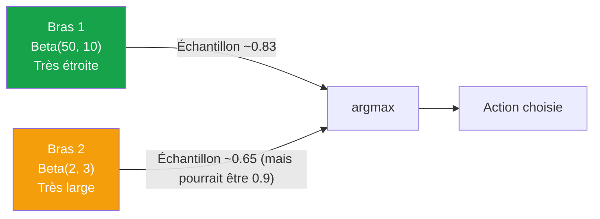

</details>

<p align="right"><a href="#top">↑ Retour en haut</a></p>

---

<a id="section-5"></a>

<details>
<summary>5 — Algorithmes par gradients — Gradient Bandit</summary>

<br/>

Les algorithmes vus précédemment apprennent **les valeurs $Q(a)$** des actions. Une approche **fondamentalement différente** consiste à apprendre **directement une préférence** $H(a)$ pour chaque action, puis à dériver une politique probabiliste — **c'est l'ancêtre direct des méthodes Policy-Based** (REINFORCE, PPO).

> _Si Value-Based dit « cette action vaut 0.8 », Gradient Bandit dit **« je préfère cette action avec un score de 2.4 »** — la valeur absolue n'a pas de sens, seules les **différences relatives** entre actions comptent._

---

### Principe : préférences et softmax

Gradient Bandit suit une logique **complètement à part** des quatre algorithmes précédents : au lieu d'estimer la valeur Q(a) de chaque action, on maintient pour chaque action une **préférence numérique** H(a) qui n'a aucune signification absolue, mais qui est comparée aux autres préférences via la fonction **softmax** pour produire une distribution de probabilité π(a). À chaque essai, l'agent **tire son action selon ces probabilités** (donc sans argmax brutal), observe la récompense, puis ajuste les préférences par **montée de gradient stochastique** : la préférence de l'action choisie augmente si la récompense dépasse la moyenne historique R̄, diminue sinon, et symétriquement les préférences des actions non choisies bougent dans le sens opposé. Ce mécanisme est l'**ancêtre direct** des méthodes Policy-Based modernes (REINFORCE, PPO, A2C) où l'on apprend directement la politique sans passer par une fonction de valeur. Sa force principale : Gradient Bandit fonctionne très bien quand les **récompenses sont biaisées** (par exemple toutes positives ou toutes négatives), là où les algorithmes value-based ont tendance à mal calibrer leur exploration. Sa limite principale : la convergence est plus sensible au taux d'apprentissage α et à la **présence d'une baseline** (la moyenne historique R̄), sans laquelle l'algorithme peut devenir très instable.

Pour chaque action $a$, on maintient une **préférence numérique** $H_t(a)$. La probabilité de choisir l'action $a$ est donnée par la **distribution softmax** :

$$\pi_t(a) = \frac{e^{H_t(a)}}{\sum_{b=1}^{k} e^{H_t(b)}}$$

| Caractéristique | Description |
|---|---|
| **$H_t(a)$ grand** | L'action $a$ a une forte probabilité d'être choisie |
| **$H_t(a)$ petit** | L'action $a$ a une faible probabilité |
| **Différences** | Seules les différences $H_t(a) - H_t(b)$ comptent |
| **Initialisation** | $H_0(a) = 0$ pour tout $a$ → politique uniforme au départ |

---

### Mise à jour par gradient ascendant

Après avoir reçu une récompense $R_t$, on met à jour les préférences :

#### Action choisie $A_t$ :

$$H_{t+1}(A_t) \leftarrow H_t(A_t) + \alpha (R_t - \bar{R}_t)(1 - \pi_t(A_t))$$

#### Toutes les autres actions $a \neq A_t$ :

$$H_{t+1}(a) \leftarrow H_t(a) - \alpha (R_t - \bar{R}_t) \pi_t(a)$$

| Symbole | Signification |
|---|---|
| $\alpha$ | Taux d'apprentissage |
| $R_t$ | Récompense observée |
| $\bar{R}_t$ | **Baseline** — moyenne des récompenses jusqu'à $t$ |
| $R_t - \bar{R}_t$ | **Avantage** — récompense par rapport à la moyenne |

---

### Intuition

- Si la récompense $R_t$ est **meilleure que la moyenne** ($R_t > \bar{R}_t$) → on **augmente** $H(A_t)$ et **diminue** $H(a)$ pour les autres → l'action choisie devient plus probable
- Si la récompense est **pire que la moyenne** → on **diminue** $H(A_t)$ et augmente les autres → l'action choisie devient moins probable

> _C'est exactement le principe du **gradient de politique** vu au Chapitre 8 (REINFORCE), appliqué au cas dégénéré $|S| = 1$. Maîtriser le gradient bandit vous prépare directement aux méthodes Policy-Based en RL profond._

> **ℹ️ Remarque**
> **Vie réelle — Le Gradient Bandit, c'est apprendre une langue par immersion.**
>
> Quand vous apprenez l'anglais en immersion, vous ne mémorisez pas une « table » du sens de chaque mot ($Q(a)$). Vous développez plutôt des **préférences instinctives** ($H(a)$) sur ce qui « sonne juste ». Quand vous tentez une phrase et qu'on vous comprend (récompense > moyenne), vous renforcez ce style de phrase. Quand on vous regarde bizarrement, vous le diminuez.
>
> Vous n'avez **pas de note explicite** par mot, juste une **distribution de probabilités** d'usage. C'est exactement ce que fait le Gradient Bandit — et c'est la même mécanique au cœur de **ChatGPT** (entraîné par PPO, descendant du Gradient Bandit).

---

### Pourquoi la baseline $\bar{R}_t$ est-elle critique ?

Sans baseline, l'algorithme augmenterait $H(A_t)$ à **chaque** récompense positive, même si cette action est **inférieure à la moyenne**. La baseline introduit une notion de **« mieux ou pire que la normale »** — exactement comme dans REINFORCE.

| Sans baseline | Avec baseline |
|---|---|
| Toute récompense renforce l'action | Seules les récompenses **supérieures à la moyenne** renforcent |
| Convergence lente, instable | Convergence rapide, stable |
| Fonctionne mal si récompenses biaisées | Robuste à toute échelle de récompense |

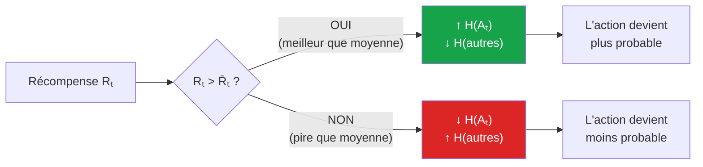

</details>

<p align="right"><a href="#top">↑ Retour en haut</a></p>

---

<a id="section-6"></a>

<details>
<summary>6 — Comparaison directe des algorithmes de bandits</summary>

<br/>

### Tableau comparatif complet

| Algorithme | Famille | Idée maîtresse | Hyperparamètre clé | Regret théorique | Force | Faiblesse |
|---|---|---|---|---|---|---|
| **ε-greedy** | Value-Based | Explorer aléatoirement avec proba ε | $\varepsilon$ | Linéaire (sauf decay) | Trivial à implémenter | Exploration aveugle |
| **ε-greedy decay** | Value-Based | ε qui diminue avec le temps | $\varepsilon_0$, decay | Logarithmique | Bon compromis | Hyperparamètres à régler |
| **Optimistic Init** | Value-Based | Initialiser Q très haut | $Q_0$ | Logarithmique (stationnaire) | Aucune randomisation | Échec en non-stationnaire |
| **UCB** | Value-Based | Bonus = √(ln t / N(a)) | $c$ | $O(\log T)$ — optimal | Garantie théorique forte | Hypothèse de récompenses bornées |
| **Thompson Sampling** | Value-Based bayésien | Échantillonnage des distributions Beta/Normal | Aucun (a priori conjugué) | $O(\log T)$ — optimal | Performance pratique excellente | Plus complexe à coder |
| **Gradient Bandit** | Policy-Based | Préférences $H(a)$ + softmax | $\alpha$ | $O(\sqrt{T})$ | Précurseur de PPO/REINFORCE | Pas de bornes théoriques fortes |

---

### Vue graphique — Performances typiques sur le 10-armed testbed

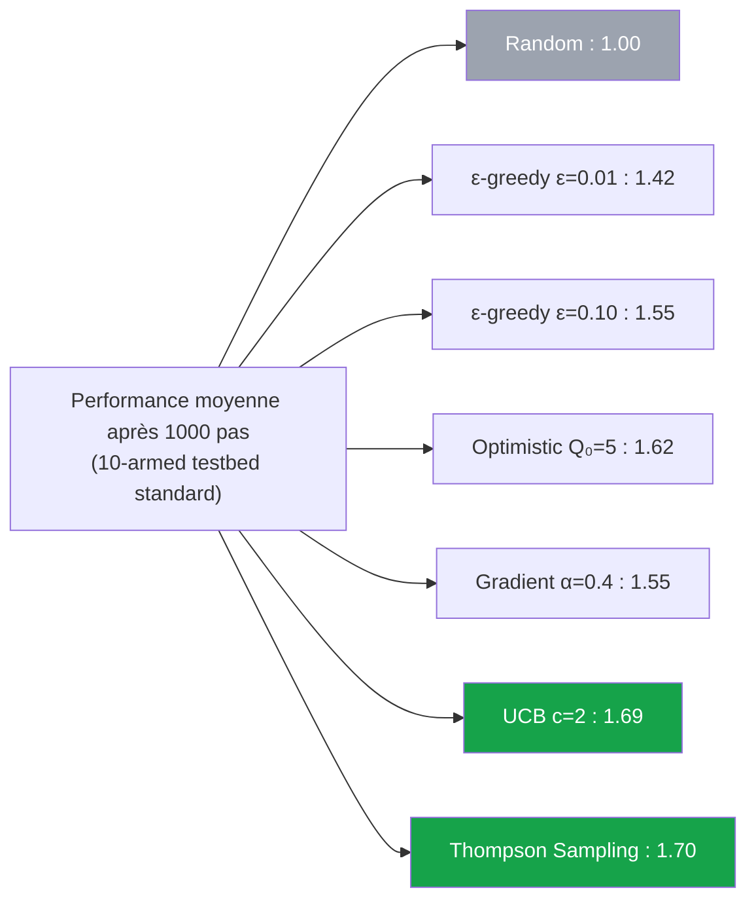

> _Ces chiffres reflètent l'expérience classique de **Sutton & Barto, Section 2.3** : récompenses tirées d'une $\mathcal{N}(q_{\ast}(a), 1)$ avec $q_{\ast}(a) \sim \mathcal{N}(0, 1)$. **UCB et Thompson Sampling dominent** ; ε-greedy reste compétitif et largement déployé pour sa simplicité._

---

### Quand utiliser quel algorithme ?

| Situation | Algorithme recommandé | Raison |
|---|---|---|
| **Premier prototype, exploration rapide** | ε-greedy | Trivial, fonctionne « assez bien » |
| **Production avec garantie théorique** | UCB | Bornes prouvées, robuste |
| **Production avec performance maximale** | Thompson Sampling | Bat UCB en pratique |
| **A priori expert disponible (ex : médecine)** | Thompson Sampling | A priori bayésien naturel |
| **Bandit non-stationnaire** | ε-greedy avec α constant | Pondère les récompenses récentes |
| **Préparation à Policy-Based RL** | Gradient Bandit | Pédagogique, prépare REINFORCE |

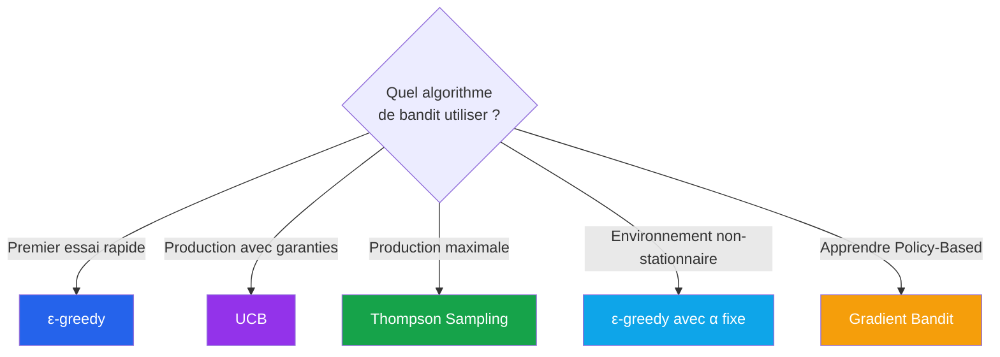

</details>

<p align="right"><a href="#top">↑ Retour en haut</a></p>

---

<a id="section-7"></a>

<details>
<summary>7 — Paramètres vs Hyperparamètres</summary>

<br/>

Cette distinction est **cruciale** pour comprendre tout modèle d'apprentissage automatique, et particulièrement clair dans le contexte des bandits.

---

### Définitions

| Notion | Définition | Exemple bandit |
|---|---|---|
| **Paramètre** | Variable **apprise automatiquement** par l'algorithme à partir des données | $Q(a)$, $H(a)$, $N(a)$ |
| **Hyperparamètre** | Variable **fixée par l'utilisateur** avant l'apprentissage | $\varepsilon$, $\alpha$, $c$ (UCB), $Q_0$ (optimistic) |

> _Règle simple : si l'algorithme la calcule lui-même → **paramètre**. Si vous devez la choisir avant de lancer le code → **hyperparamètre**._

---

### Tableau comparatif détaillé

| Critère | Paramètre | Hyperparamètre |
|---|---|---|
| **Qui le détermine ?** | L'algorithme (par mise à jour itérative) | L'utilisateur (par expérience ou recherche) |
| **Quand est-il fixé ?** | Pendant l'apprentissage | Avant l'apprentissage |
| **Évolue-t-il ?** | Oui, à chaque étape | Non (sauf scheduling explicite : ε decay) |
| **Influence sur le modèle** | Définit la solution finale | Influence la **vitesse** et la **qualité** de l'apprentissage |
| **Stockage** | Souvent grand (k valeurs $Q$ pour k actions) | Quelques valeurs scalaires |
| **Validation** | Mesurée sur les données d'entraînement | Recherchée par grid search, random search, optimisation bayésienne |

---

### Exemples pour chaque algorithme de bandit

| Algorithme | Paramètres (appris) | Hyperparamètres (fixés) |
|---|---|---|
| **ε-greedy** | $Q(a)$, $N(a)$ | $\varepsilon$, $\alpha$ (si pondéré) |
| **ε-greedy decay** | $Q(a)$, $N(a)$ | $\varepsilon_0$, $\varepsilon_{\min}$, decay rate |
| **Optimistic Init** | $Q(a)$, $N(a)$ | $Q_0$ initial |
| **UCB** | $Q(a)$, $N(a)$ | $c$ (constante d'exploration) |
| **Thompson Sampling** | $\alpha_a$, $\beta_a$ (paramètres Beta) | A priori $\alpha_0$, $\beta_0$ |
| **Gradient Bandit** | $H(a)$, $\bar{R}$ | $\alpha$ (taux d'apprentissage) |

---

### Comment choisir les hyperparamètres ?

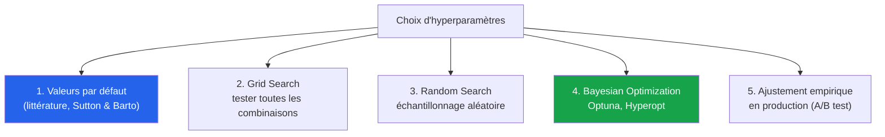

| Méthode | Avantage | Inconvénient |
|---|---|---|
| **Valeurs par défaut** | Rapide, point de départ raisonnable | Pas optimal pour votre cas |
| **Grid Search** | Exhaustif, simple | Très coûteux (explosion combinatoire) |
| **Random Search** | Plus efficace que grid | Pas guidé par les résultats |
| **Bayesian Opt.** | Très efficace, guidé par les résultats | Complexe à mettre en place |
| **A/B en production** | Reflète la réalité | Lent, risqué si mal calibré |

> _Pour les bandits, les hyperparamètres par défaut suivants fonctionnent dans 80% des cas : **ε = 0.1**, **c = 2** pour UCB, **α = 0.1** pour le gradient. Commencez par là, ajustez ensuite avec validation croisée si nécessaire._

> **💡 Astuce**
> **Règles d'or pour ne pas perdre du temps en tuning :**
>
> | Algorithme | Valeur de départ | Quand augmenter | Quand diminuer |
> |---|---|---|---|
> | ε-greedy | $\varepsilon = 0.1$ | Récompenses très bruitées | Vous avez beaucoup de pas |
> | UCB | $c = 2$ | Vous voulez plus d'exploration | Vous avez peu de pas |
> | Gradient | $\alpha = 0.1$ | Récompenses stables | Apprentissage instable |
> | Optimistic | $Q_0 = 5$ × max attendu | Démarrage froid | Quasi-jamais |
>
> **Règle pratique :** ne touchez aux hyperparamètres **qu'après** avoir prouvé que les valeurs par défaut ne suffisent pas. 80% des « problèmes de tuning » sont en réalité des bugs d'implémentation cachés.

> **⚠️ Attention**
> **Erreur classique — Confondre le tuning d'hyperparamètres avec « tester sur les données de production ».**
>
> Si vous changez $\varepsilon$ et observez que ça améliore votre métrique sur 1 semaine en production, vous **biaisez** vos prochaines mesures (l'environnement a vu votre modification, vos utilisateurs ont changé de comportement). Toujours valider sur :
>
> 1. **Simulation hors-ligne** (replay des logs) — gratuit, rapide, reproductible
> 2. **A/B test contrôlé** sur un petit % de trafic — vrai test, mais risque limité
> 3. **Déploiement complet** — seulement après les deux étapes précédentes

</details>

<p align="right"><a href="#top">↑ Retour en haut</a></p>

---

<a id="section-8"></a>

<details>
<summary>8 — Implémentation Python complète et exécutable</summary>

<br/>

Cette section fournit une **implémentation complète et exécutable** d'un environnement de bandit multi-bras et de **5 algorithmes apprenants**. Vous pouvez **copier-coller le code dans un notebook Jupyter** ou exécuter le fichier `bandits.py` fourni dans ce dossier.

#### Prérequis

```bash
pip install numpy matplotlib
```

> **🛑 Danger**
> **Pièges classiques d'implémentation à éviter à tout prix :**
>
> 1. **Oublier de fixer la `seed`** → vos résultats varient à chaque exécution, impossible de comparer correctement deux algorithmes
> 2. **Diviser par zéro dans UCB** quand $N(a) = 0$ → toujours forcer une **première visite** de chaque action avant la formule
> 3. **Softmax non stabilisé** dans le Gradient Bandit → faire `exp(H - max(H))` pour éviter les overflow
> 4. **Confondre $\arg\max$ avec $\max$** : np.argmax retourne **l'indice**, np.max retourne **la valeur**
> 5. **Oublier d'incrémenter $N(a)$ et $t$** dans `update()` → le bonus UCB devient incohérent
>
> Le code ci-dessous **gère tous ces pièges**. Lisez-le ligne par ligne avant de l'adapter.

---

### 8a — Simulation de l'environnement statique

L'environnement est un **bandit stationnaire** : la vraie moyenne $q_{\ast}(a)$ de chaque bras est tirée une fois pour toute, et les récompenses suivent une loi normale $\mathcal{N}(q_{\ast}(a), 1)$.

```python
import numpy as np

class BanditEnvironment:
    """
    Environnement de bandit multi-bras stationnaire.

    À l'initialisation, la vraie valeur q*(a) de chaque bras est tirée
    d'une loi normale N(0, 1). À chaque appel à step(action), la
    récompense est tirée d'une loi N(q*(a), 1).
    """

    def __init__(self, k: int = 10, seed: int | None = None):
        self.k = k
        self.rng = np.random.default_rng(seed)
        self.q_star = self.rng.normal(loc=0.0, scale=1.0, size=k)
        self.optimal_action = int(np.argmax(self.q_star))

    def step(self, action: int) -> float:
        """Retourne une récompense stochastique pour l'action choisie."""
        return float(self.rng.normal(loc=self.q_star[action], scale=1.0))

    def reset(self, seed: int | None = None) -> None:
        """Réinitialise les vraies valeurs des bras."""
        if seed is not None:
            self.rng = np.random.default_rng(seed)
        self.q_star = self.rng.normal(loc=0.0, scale=1.0, size=self.k)
        self.optimal_action = int(np.argmax(self.q_star))
```

> _Cet environnement reproduit exactement le **« 10-armed testbed »** de Sutton & Barto, Section 2.3 — un standard académique pour comparer les algorithmes de bandit._

---

### 8b — Code des 5 algorithmes apprenants

Tous les agents partagent une interface commune : `select_action()` choisit la prochaine action, `update(action, reward)` met à jour les paramètres internes.

#### Agent 1 — ε-greedy

```python
class EpsilonGreedyAgent:
    """Agent ε-greedy avec moyenne empirique des récompenses."""

    def __init__(self, k: int, epsilon: float = 0.1, seed: int | None = None):
        self.k = k
        self.epsilon = epsilon
        self.Q = np.zeros(k)
        self.N = np.zeros(k, dtype=int)
        self.rng = np.random.default_rng(seed)

    def select_action(self) -> int:
        if self.rng.random() < self.epsilon:
            return int(self.rng.integers(0, self.k))
        return int(np.argmax(self.Q))

    def update(self, action: int, reward: float) -> None:
        self.N[action] += 1
        self.Q[action] += (reward - self.Q[action]) / self.N[action]
```

#### Agent 2 — Optimistic Initial Values

```python
class OptimisticAgent:
    """Initialise Q à une valeur optimiste pour forcer l'exploration."""

    def __init__(self, k: int, q_init: float = 5.0, alpha: float = 0.1):
        self.k = k
        self.alpha = alpha
        self.Q = np.full(k, q_init, dtype=float)

    def select_action(self) -> int:
        return int(np.argmax(self.Q))

    def update(self, action: int, reward: float) -> None:
        self.Q[action] += self.alpha * (reward - self.Q[action])
```

#### Agent 3 — UCB (Upper Confidence Bound)

```python
class UCBAgent:
    """Sélection par borne supérieure de confiance."""

    def __init__(self, k: int, c: float = 2.0):
        self.k = k
        self.c = c
        self.Q = np.zeros(k)
        self.N = np.zeros(k, dtype=int)
        self.t = 0

    def select_action(self) -> int:
        self.t += 1
        untried = np.where(self.N == 0)[0]
        if len(untried) > 0:
            return int(untried[0])
        bonus = self.c * np.sqrt(np.log(self.t) / self.N)
        return int(np.argmax(self.Q + bonus))

    def update(self, action: int, reward: float) -> None:
        self.N[action] += 1
        self.Q[action] += (reward - self.Q[action]) / self.N[action]
```

#### Agent 4 — Thompson Sampling (récompenses gaussiennes)

```python
class ThompsonSamplingAgent:
    """Thompson Sampling avec a priori gaussien (récompenses continues)."""

    def __init__(self, k: int, sigma: float = 1.0, seed: int | None = None):
        self.k = k
        self.sigma = sigma
        self.mu = np.zeros(k)
        self.tau = np.full(k, 1.0 / sigma**2)
        self.rng = np.random.default_rng(seed)

    def select_action(self) -> int:
        sampled = self.rng.normal(loc=self.mu, scale=1.0 / np.sqrt(self.tau))
        return int(np.argmax(sampled))

    def update(self, action: int, reward: float) -> None:
        prior_tau = self.tau[action]
        prior_mu = self.mu[action]
        likelihood_tau = 1.0 / self.sigma**2
        new_tau = prior_tau + likelihood_tau
        new_mu = (prior_tau * prior_mu + likelihood_tau * reward) / new_tau
        self.mu[action] = new_mu
        self.tau[action] = new_tau
```

#### Agent 5 — Gradient Bandit

```python
class GradientBanditAgent:
    """Apprend des préférences H(a) via softmax + ascension de gradient."""

    def __init__(self, k: int, alpha: float = 0.1, seed: int | None = None):
        self.k = k
        self.alpha = alpha
        self.H = np.zeros(k)
        self.avg_reward = 0.0
        self.t = 0
        self.rng = np.random.default_rng(seed)

    def _softmax(self) -> np.ndarray:
        exp_H = np.exp(self.H - np.max(self.H))
        return exp_H / np.sum(exp_H)

    def select_action(self) -> int:
        probs = self._softmax()
        return int(self.rng.choice(self.k, p=probs))

    def update(self, action: int, reward: float) -> None:
        self.t += 1
        self.avg_reward += (reward - self.avg_reward) / self.t
        probs = self._softmax()
        baseline = self.avg_reward
        for a in range(self.k):
            if a == action:
                self.H[a] += self.alpha * (reward - baseline) * (1 - probs[a])
            else:
                self.H[a] -= self.alpha * (reward - baseline) * probs[a]
```

---

### 8c — Comparaison expérimentale et graphiques

Lance chaque agent sur **2000 environnements indépendants** pendant **1000 pas** chacun, puis trace la récompense moyenne et le pourcentage d'actions optimales.

```python
import matplotlib.pyplot as plt

def run_experiment(
    agent_factory,
    n_runs: int = 2000,
    n_steps: int = 1000,
    k: int = 10,
):
    """
    Exécute n_runs expériences indépendantes et retourne :
      - rewards : récompense moyenne à chaque pas (moyennée sur runs)
      - optimal_pct : % d'actions optimales à chaque pas
    """
    rewards = np.zeros(n_steps)
    optimal_pct = np.zeros(n_steps)

    for run in range(n_runs):
        env = BanditEnvironment(k=k, seed=run)
        agent = agent_factory(k)
        for t in range(n_steps):
            a = agent.select_action()
            r = env.step(a)
            agent.update(a, r)
            rewards[t] += r
            if a == env.optimal_action:
                optimal_pct[t] += 1.0

    rewards /= n_runs
    optimal_pct = 100.0 * optimal_pct / n_runs
    return rewards, optimal_pct


def main():
    np.random.seed(42)

    agents = {
        "ε-greedy (ε=0.1)": lambda k: EpsilonGreedyAgent(k, epsilon=0.1),
        "ε-greedy (ε=0.01)": lambda k: EpsilonGreedyAgent(k, epsilon=0.01),
        "Optimistic (Q₀=5)": lambda k: OptimisticAgent(k, q_init=5.0, alpha=0.1),
        "UCB (c=2)": lambda k: UCBAgent(k, c=2.0),
        "Thompson Sampling": lambda k: ThompsonSamplingAgent(k),
        "Gradient (α=0.1)": lambda k: GradientBanditAgent(k, alpha=0.1),
    }

    results = {}
    for name, factory in agents.items():
        print(f"Exécution de {name}...")
        results[name] = run_experiment(factory, n_runs=500, n_steps=1000)

    fig, axes = plt.subplots(2, 1, figsize=(12, 10))

    for name, (rewards, _) in results.items():
        axes[0].plot(rewards, label=name)
    axes[0].set_xlabel("Pas de temps")
    axes[0].set_ylabel("Récompense moyenne")
    axes[0].set_title("Comparaison des algorithmes de bandit — Récompense moyenne")
    axes[0].legend()
    axes[0].grid(True, alpha=0.3)

    for name, (_, optimal_pct) in results.items():
        axes[1].plot(optimal_pct, label=name)
    axes[1].set_xlabel("Pas de temps")
    axes[1].set_ylabel("% d'actions optimales")
    axes[1].set_title("Comparaison des algorithmes de bandit — Action optimale")
    axes[1].legend()
    axes[1].grid(True, alpha=0.3)
    axes[1].set_ylim(0, 100)

    plt.tight_layout()
    plt.savefig("bandits_comparison.png", dpi=120)
    plt.show()


if __name__ == "__main__":
    main()
```

---

### Résultats attendus (interprétation)

Après exécution, vous observerez les patterns suivants :

| Observation | Interprétation |
|---|---|
| **Random horizontal autour de 0** | Aucun apprentissage |
| **ε=0.01 démarre lent puis dépasse ε=0.1** | Trop peu d'exploration au début, mais excellente exploitation à long terme |
| **Optimistic explose tôt puis se stabilise** | L'initialisation force l'exploration initiale |
| **UCB et Thompson dominent dès ~200 pas** | Exploration informée, regret logarithmique |
| **Gradient Bandit compétitif sans Q-values** | Validation du concept Policy-Based |

> _Cette expérience reproduit la **Figure 2.4 de Sutton & Barto** — un classique. Si vos courbes ressemblent à celles du livre, votre implémentation est correcte !_

---

### Variations à explorer

Pour aller plus loin, modifiez le code ci-dessus pour tester :

1. **Bandit non-stationnaire** : faire dériver $q_{\ast}(a)$ avec le temps (random walk). Comparer ε-greedy avec $\alpha$ constant vs $1/n$.
2. **k variable** : tester avec $k = 5, 10, 50, 100$. Quelle méthode résiste le mieux ?
3. **Récompenses binaires** (0/1) : adapter Thompson Sampling avec distributions Beta.
4. **Régret cumulé** : tracer $\mathcal{R}(T) = T \cdot q_{\ast}(a^{\ast}) - \sum R_t$ en log-log pour vérifier les bornes.

</details>

<p align="right"><a href="#top">↑ Retour en haut</a></p>

---

<a id="section-9"></a>

<details>
<summary>9 — Bandits complexes — Combinatoires et Contextuels</summary>

<br/>

Les bandits multi-bras simples ($k$ bras, 1 état) ne capturent pas toutes les situations réelles. Deux extensions majeures permettent de modéliser des problèmes industriels beaucoup plus riches : les **bandits combinatoires** et les **bandits contextuels**.

---

### 9a — Bandits combinatoires (Combinatorial Bandits)

#### Définition

Au lieu de choisir **une seule action** parmi $k$, l'agent choisit un **sous-ensemble** d'actions à chaque étape. La récompense dépend de la **combinaison** choisie.

| Bandit simple | Bandit combinatoire |
|---|---|
| Choisir 1 article à recommander parmi 1000 | Choisir **10 articles** à afficher en page d'accueil |
| Choisir 1 traitement | Choisir une **combinaison** de médicaments |
| Choisir 1 prix | Choisir un **bundle** de prix sur N produits |

#### Formulation

À chaque pas $t$, l'agent choisit un **super-bras** $S_t \subseteq \{1, \dots, k\}$ avec $|S_t| = m$ (ex: top 10 parmi 1000).

La récompense observée peut prendre plusieurs formes :

- **Semi-bandit** : on observe la récompense individuelle de chaque action de $S_t$
- **Full-bandit** : on observe seulement la récompense totale du super-bras
- **Cascade** : on observe les récompenses jusqu'au premier « clic » (typique en recherche web)

#### Le défi : explosion combinatoire

| $k$ actions | $m$ choisies | Nombre de super-bras |
|---|---|---|
| 10 | 3 | 120 |
| 100 | 10 | $\sim 1.7 \times 10^{13}$ |
| 1000 | 10 | $\sim 2.6 \times 10^{23}$ |

> _Avec 1000 articles et un top-10 à choisir, il est **impossible** de traiter chaque combinaison comme un bras indépendant. Les algorithmes combinatoires (CombUCB, CascadeUCB1, ColocadingUCB) exploitent la **structure** du problème pour rester efficaces._

> **🛑 Danger**
> **Danger — L'explosion combinatoire tue les approches naïves.**
>
> Imaginez que vous voulez composer le **menu parfait d'un restaurant** : 5 entrées + 8 plats + 4 desserts à choisir parmi un catalogue. Au lieu de 17 décisions indépendantes, vous avez en théorie $\binom{50}{5} \times \binom{50}{8} \times \binom{50}{4} \approx 10^{18}$ menus possibles.
>
> Si vous testez **un menu par jour**, il vous faudrait **3000 milliards d'années** pour tous les essayer. C'est pourquoi tous les algorithmes combinatoires industriels font une **hypothèse simplificatrice** (ex : « la qualité d'un menu = somme des qualités des plats individuels »). Sans cette hypothèse, le problème est **mathématiquement intractable**.

#### Algorithmes principaux

| Algorithme | Particularité |
|---|---|
| **CUCB (Combinatorial UCB)** | UCB appliqué à chaque sous-action, sélection greedy du top-m |
| **CascadeUCB1** | Modèle en cascade pour la recherche web |
| **Thompson Sampling combinatoire** | Échantillonnage par sous-action puis sélection optimale |

---

### 9b — Bandits contextuels (Contextual Bandits)

#### Définition

À chaque pas, **avant de choisir une action**, l'agent observe un **contexte** $x_t$ (vecteur de caractéristiques). La meilleure action **dépend du contexte**.

| Bandit simple | Bandit contextuel |
|---|---|
| Recommander la même news à tout le monde | Recommander selon **profil utilisateur** (âge, historique...) |
| Tester un seul prix global | Adapter le prix selon **lieu, heure, segment client** |
| Une dose unique de médicament | Dose **selon poids, âge, biomarqueurs** du patient |

#### Formulation

| Élément | Notation | Exemple |
|---|---|---|
| **Contexte** | $x_t \in \mathbb{R}^d$ | Vecteur de features utilisateur (âge, historique, géo) |
| **Action** | $a_t \in \{1, \dots, k\}$ | Article à afficher |
| **Récompense** | $r_t \mid x_t, a_t$ | Clic (1) ou pas de clic (0) |
| **Politique** | $\pi(a \mid x)$ | Mappe contexte → action |

L'objectif devient :

$$\text{maximiser} \quad \mathbb{E}\left[\sum_{t=1}^T r_t \mid \pi\right]$$

#### Pont entre bandit et RL complet


> _Les bandits contextuels sont la **passerelle naturelle** entre les bandits simples et le RL complet. Mathématiquement, c'est un MDP **sans transition d'état** (chaque contexte est tiré indépendamment) — donc plus simple que Q-Learning, mais bien plus puissant qu'un bandit basique._

> **📌 À retenir**
> **Vie réelle — Le bandit contextuel = la vraie personnalisation web.**
>
> - **YouTube** ne montre pas la même thumbnail à tout le monde pour la même vidéo. Selon votre âge, votre historique, votre device, l'algorithme choisit **la miniature** la plus susceptible de vous faire cliquer
> - **Amazon** n'affiche pas le même prix « recommandé » à tous (légal en e-commerce, illégal en assurance)
> - **Tinder** réordonne les profils selon votre comportement passé
>
> Tout cela = **bandits contextuels** avec un vecteur de contexte $x_t$ = votre profil utilisateur. La même action (« afficher cette miniature ») a une récompense différente selon $x_t$. **Si vous travaillez en growth marketing ou data, c'est l'algo le plus rentable à maîtriser.**

#### Algorithmes principaux

| Algorithme | Modèle de récompense | Année |
|---|---|---|
| **LinUCB** | Linéaire : $r = \theta^T x$ | 2010 (Yahoo!) |
| **LinTS (Linear Thompson Sampling)** | Linéaire bayésien | 2013 |
| **Neural Bandits** | Réseau de neurones | 2020+ |
| **Microsoft Personalizer (Vowpal Wabbit)** | LinUCB / Cover Tree avec features hashing | Production Microsoft |

#### Exemple : LinUCB en une équation

LinUCB suppose $r = x_t^T \theta_a + \text{bruit}$ pour chaque action $a$, et choisit :

$$a_t = \arg\max_a \left[ x_t^T \hat{\theta}_a + \alpha \sqrt{x_t^T A_a^{-1} x_t} \right]$$

| Terme | Rôle |
|---|---|
| $x_t^T \hat{\theta}_a$ | **Exploitation** — récompense estimée pour ce contexte |
| $\alpha \sqrt{x_t^T A_a^{-1} x_t}$ | **Exploration** — bonus d'incertitude (matrice de covariance) |

> _LinUCB a été déployé en production par **Yahoo!** dès 2010 pour la personnalisation de la page d'accueil — un des **premiers grands succès industriels du RL**, bien avant AlphaGo._

</details>

<p align="right"><a href="#top">↑ Retour en haut</a></p>

---

<a id="section-10"></a>

<details>
<summary>10 — Applications industrielles des bandits complexes</summary>

<br/>

Les bandits combinatoires et contextuels sont **déployés à très grande échelle** dans l'industrie. Voici les cas les plus emblématiques.

---

### 10.1 — Recommandation contextuelle de news (Yahoo!, MSN)

**Problème :** quel article afficher en haut de la page d'accueil pour **chaque visiteur**, en fonction de son profil ?

- **Contexte** $x_t$ : âge, géolocalisation, historique de clics, heure, device
- **Actions** : ~100 articles candidats (renouvelés constamment)
- **Récompense** : clic (1) ou pas de clic (0)
- **Algorithme** : LinUCB (Yahoo!) ou Vowpal Wabbit (Microsoft)

> _Yahoo! a publié en 2010 un papier fondateur (Li et al., "A Contextual-Bandit Approach to Personalized News Article Recommendation") montrant **+12.5% de CTR** par rapport à un système non personnalisé._

> **💡 Astuce**
> **Vie réelle — Comment Spotify choisit votre playlist du lundi matin.**
>
> Spotify n'a pas un éditeur humain qui choisit votre Discover Weekly. Un bandit contextuel :
>
> 1. Observe votre **contexte** : heure de la journée, jour de la semaine, dernier morceau écouté, genre préféré récent
> 2. Choisit parmi **des milliers de morceaux candidats** ceux qui ont la plus grande probabilité de vous garder à l'écoute
> 3. Mesure la **récompense** : avez-vous écouté > 30 secondes ? Liké ? Skippé ?
> 4. Met à jour ses paramètres en temps réel pour vous **et tous les utilisateurs au profil similaire**
>
> Résultat : votre playlist est différente d'il y a 6 mois, **sans que personne chez Spotify n'ait écrit une ligne de code spécifique pour vous**.

---

### 10.2 — Personnalisation de pages e-commerce

**Amazon**, **Netflix**, **Booking.com** utilisent des bandits contextuels pour décider :

- Quels produits mettre en avant (combinatoire : top-N)
- Quelle image afficher (action) selon le profil (contexte)
- Quel ordre dans le carrousel (combinatoire avec position)

| Société | Usage typique des bandits |
|---|---|
| **Netflix** | Choix de l'image de couverture des films selon utilisateur |
| **Booking.com** | Tri et mise en avant des hôtels |
| **Amazon** | Bandeaux promotionnels personnalisés |
| **Spotify** | Ordre des playlists recommandées |

---

### 10.3 — Optimisation de prix dynamique multi-produits

**Problème combinatoire** : fixer simultanément le prix de N produits pour maximiser le revenu **global** (les ventes des produits sont corrélées).

- Choisir un prix sur 100 produits avec 5 niveaux possibles → $5^{100}$ combinaisons impossibles à explorer naïvement
- Algorithmes combinatoires + structure (graphes de produits substituables/complémentaires)

---

### 10.4 — Essais cliniques contextuels

**Médecine personnalisée** : adapter le traitement au patient.

- **Contexte** : âge, génotype, biomarqueurs, comorbidités
- **Actions** : médicaments candidats avec différentes doses
- **Récompense** : amélioration clinique mesurée

> _De plus en plus d'essais cliniques (notamment en oncologie de précision) utilisent des designs basés sur des bandits contextuels pour identifier rapidement les sous-populations qui bénéficient le plus d'un traitement._

---

### 10.5 — Allocation publicitaire en temps réel (RTB)

**Real-Time Bidding** : décider en **moins de 100 ms** quelle pub afficher à chaque impression.

- **Contexte** : profil utilisateur, page visitée, heure
- **Actions combinatoires** : choisir une création + prix d'enchère
- **Récompense** : clic, conversion, ROI

---

### 10.6 — Routage et CDN intelligents

**Cloudflare**, **Akamai**, **Netflix CDN** utilisent des bandits contextuels pour décider **quel serveur** servira chaque requête.

- **Contexte** : géolocalisation client, charge actuelle de chaque serveur
- **Actions** : N serveurs candidats
- **Récompense** : latence inversée

---

### 10.7 — Chatbots et tuning d'agents conversationnels

**Microsoft Personalizer** (basé sur des bandits contextuels) est intégré à des chatbots et assistants pour adapter :

- Le ton de réponse (formel/casual)
- Les suggestions de prochaines questions
- La sélection de templates de réponse

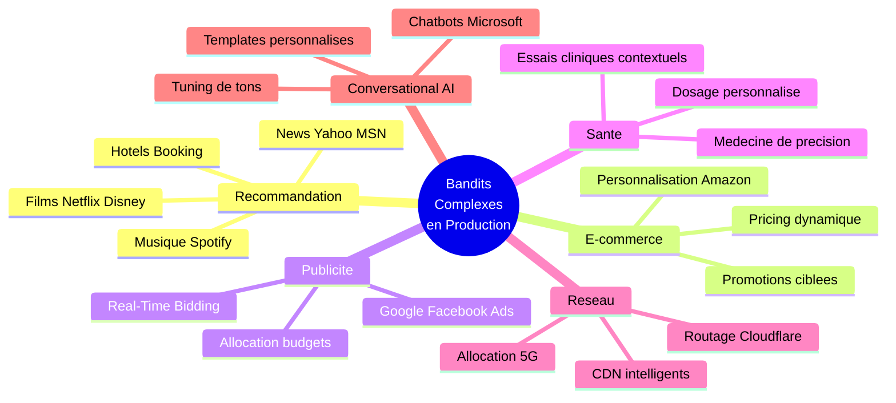

</details>

<p align="right"><a href="#top">↑ Retour en haut</a></p>

---

<a id="section-11"></a>

<details>
<summary>11 — Défis et limites des bandits complexes</summary>

<br/>

Si les bandits complexes sont massivement utilisés en production, ils ne sont **pas une solution miracle**. Voici les **principaux défis** que rencontrent les ingénieurs MLOps qui les déploient.

---

### 11.1 — Explosion combinatoire

**Problème :** dans un bandit combinatoire avec $k = 1000$ et $m = 10$, le nombre de super-bras dépasse $10^{23}$. Impossible d'explorer chaque combinaison.

**Solutions :**
- Hypothèse de **récompense linéaire** (CombLinUCB)
- Décomposition par sous-action (semi-bandit)
- Échantillonnage stochastique (Thompson)

> _Sans hypothèse structurelle, les bandits combinatoires explosent : c'est pourquoi 100% des déploiements industriels supposent une **structure** (linéarité, indépendance partielle, sous-modularité)._

---

### 11.2 — Malédiction de la dimensionnalité (contextes haute dimension)

**Problème :** dans un bandit contextuel avec $x_t \in \mathbb{R}^{10000}$ (ex: profil utilisateur dense), même LinUCB devient lent : il faut inverser une matrice $10000 \times 10000$ par action et par étape.

**Solutions :**
- Réduction de dimension (PCA, embeddings)
- Feature hashing (Vowpal Wabbit)
- Approximations sparses (matrices creuses)
- Neural Bandits (réseaux de neurones)

---

### 11.3 — Non-stationnarité

**Problème :** dans la vraie vie, les **préférences évoluent** :
- Un article vieillit (perd en pertinence)
- Le comportement utilisateur change selon la saison
- Les concurrents lancent de nouveaux produits

Les algorithmes de bandits classiques **convergent vers une politique fixe** — quand l'environnement change, ils sont **lents à s'adapter**.

**Solutions :**
- Pondération exponentielle des observations récentes (sliding window)
- Discounted UCB
- Détection de changement (CUSUM, Page-Hinkley)
- Ré-initialisation périodique

> **⚠️ Attention**
> **Vie réelle — Pourquoi votre fil Instagram devient « bizarre » après les fêtes.**
>
> Si vous avez beaucoup liké des contenus de Noël en décembre, l'algo continue à vous proposer ce type de contenu en janvier — alors que vous n'avez plus envie. **C'est de la non-stationnarité non gérée**. Les bons systèmes oublient progressivement les vieilles données ; les mauvais vous enferment dans une bulle obsolète.
>
> **Test simple** : si votre algo recommande encore aujourd'hui des choses que vous aimiez **il y a 6 mois mais plus aujourd'hui**, il a un problème de gestion de la non-stationnarité.

---

### 11.4 — Biais de sélection (selection bias)

**Problème :** les algorithmes de bandits **ne voient que les récompenses des actions choisies**. Si une action n'est jamais choisie, on n'apprend rien sur elle. Cela peut créer des **boucles de rétroaction négatives**.

**Exemple :** un système de recommandation qui décide qu'un article est mauvais après 2 essais malchanceux et ne le re-propose plus jamais — alors qu'il aurait pu performer.

**Solutions :**
- Garantir un **minimum d'exploration** par action (UCB, ε-greedy)
- **Inverse Propensity Scoring (IPS)** pour évaluation off-policy
- **Doubly Robust estimation**

---

### 11.5 — Contraintes de production en temps réel

**Problème :** beaucoup d'applications exigent une **décision en moins de 100 ms** (Real-Time Bidding, recommandations web). Cela impose :
- Modèles **légers** (pas de Deep Q-Network gigantesque)
- Inférence **vectorisée**
- Mise à jour **asynchrone** des paramètres
- **Caching** des décisions pour les requêtes similaires

> _Microsoft Personalizer garantit un SLA de **<100ms** pour la sélection — cela impose des contraintes sur le choix d'algorithme (LinUCB plutôt que Neural Bandit complexe)._

---

### 11.6 — Évaluation off-policy

**Problème :** comment savoir qu'un nouveau modèle de bandit serait **meilleur** que celui en production, **sans le déployer en production** ?

- On ne peut pas faire un test A/B classique : trop coûteux et risqué
- On a uniquement les **logs** de l'ancien système

**Techniques :**
- **Inverse Propensity Scoring (IPS)** — réajuste l'estimation selon la probabilité que l'ancien système ait choisi cette action
- **Doubly Robust** — combine IPS et un modèle régressif
- **Counterfactual Risk Minimization**

---

### 11.7 — Problèmes éthiques et équité (fairness)

**Problème :** un bandit qui maximise le clic peut **discriminer** sans le vouloir :
- Recommandations contextuelles biaisées par la géographie ou le sexe
- Pricing dynamique qui exploite les utilisateurs moins informés
- Essais cliniques sous-représentant certaines populations

**Solutions :**
- Bandits sous **contraintes d'équité** (Constrained Bandits)
- Audit régulier des décisions par sous-population
- Régulation : RGPD, AI Act européen, FDA pour le médical

> **🛑 Danger**
> **Danger éthique majeur — Discrimination invisible par boucle de rétroaction.**
>
> Cas réels documentés :
>
> - **Recrutement Amazon (2018)** : un bandit qui apprenait à filtrer les CV s'est mis à **pénaliser les candidats féminins** (mot « women's chess club » = malus) parce que l'historique était majoritairement masculin. Amazon a abandonné l'outil.
> - **Pricing dynamique iOS vs Android** : certains sites affichaient des prix plus élevés aux utilisateurs iPhone (présumés plus fortunés). Légal, mais éthiquement contestable.
> - **Bulles d'information** : YouTube/TikTok enferment les utilisateurs dans un type de contenu, contribuant à la polarisation sociale.
>
> **Règle déontologique :** chaque déploiement de bandit en production doit avoir un **audit régulier par sous-population** (genre, âge, géo, ethnie quand mesurable). Sinon vous **automatisez vos biais à grande échelle**.

---

### 11.8 — Synthèse des défis

| Défi | Impact | Atténuation principale |
|---|---|---|
| **Explosion combinatoire** | Calcul impossible | Hypothèses structurelles |
| **Haute dimension** | Lenteur d'inférence | Réduction de dimension, hashing |
| **Non-stationnarité** | Performance dégradée dans le temps | Sliding window, détection de changement |
| **Biais de sélection** | Boucles de rétroaction négatives | Exploration minimale garantie |
| **Latence temps réel** | Algorithmes complexes inutilisables | Modèles légers, vectorisation |
| **Évaluation off-policy** | Risque lors des mises à jour | IPS, Doubly Robust |
| **Équité / éthique** | Discrimination, problèmes légaux | Contraintes, audits, régulation |

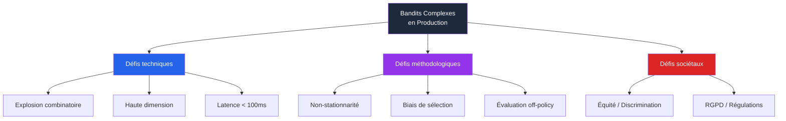

> _Les bandits complexes sont **puissants mais exigeants**. Les déployer en production demande des compétences à l'intersection du machine learning, du génie logiciel à grande échelle, et de l'éthique. C'est l'une des compétences les plus recherchées en 2026._

</details>

<p align="right"><a href="#top">↑ Retour en haut</a></p>

---

<a id="section-12"></a>

<details>
<summary>12 — Quiz — Les problèmes de bandits</summary>

<br/>

Ce quiz évalue votre compréhension complète des problèmes de bandits — du concept de base aux variantes complexes. Répondez à chaque question, puis cliquez sur **💡 Voir la solution** pour vérifier.

---

#### 1. Concepts fondamentaux

**Question 1 :** Qu'est-ce qui distingue principalement un problème de **bandit** d'un MDP complet ?

a) Le bandit utilise des réseaux de neurones, le MDP non

b) Le bandit n'a qu'**un seul état** (ou un contexte simple), donc pas de décisions séquentielles

c) Le bandit est plus complexe à résoudre

d) Le bandit n'a pas de récompense

<details>
<summary>💡 Voir la solution</summary>

✅ **Réponse : b)**

Un bandit est un MDP avec $|S| = 1$. Il n'y a **pas de transitions d'état** : chaque essai est indépendant des précédents. Cela isole le **dilemme exploration/exploitation à l'état pur**, sans la complexité du *credit assignment* (savoir quelle action passée mérite quelle récompense future).

</details>

---

**Question 2 :** D'où vient le nom **« bandit multi-bras »** ?

a) D'un livre de science-fiction des années 1970

b) Des **machines à sous** des casinos, surnommées « bandits manchots » car leur unique bras volait l'argent des joueurs

c) D'un algorithme inventé en 2010

d) D'une analogie avec les bras d'un robot

<details>
<summary>💡 Voir la solution</summary>

✅ **Réponse : b)**

Les machines à sous étaient appelées **« one-armed bandits »** (bandits manchots) en argot américain car elles « volaient » l'argent des joueurs avec leur **unique bras** (la manivelle). Le **multi-armed bandit** est l'extension : un casino avec plusieurs machines, chacune ayant un taux de gain inconnu et différent.

</details>

---

#### 2. Algorithmes value-based

**Question 3 :** Dans l'algorithme **ε-greedy**, que signifie le paramètre $\varepsilon = 0.1$ ?

a) L'agent choisit toujours la meilleure action connue

b) L'agent choisit une action aléatoire 10% du temps, et la meilleure action 90% du temps

c) L'agent choisit la meilleure action avec un bonus de 10%

d) L'agent réduit ses récompenses de 10%

<details>
<summary>💡 Voir la solution</summary>

✅ **Réponse : b)**

Avec $\varepsilon = 0.1$ :
- **90% du temps** ($1 - \varepsilon$) → exploitation : choisir $\arg\max_a Q(a)$
- **10% du temps** ($\varepsilon$) → exploration : choisir une action **uniformément aléatoire**

C'est l'algorithme d'exploration le plus simple, et il reste largement utilisé en production pour sa robustesse.

</details>

---

**Question 4 :** Pourquoi l'algorithme **UCB (Upper Confidence Bound)** est-il considéré comme **mathématiquement optimal** pour les bandits stochastiques stationnaires ?

a) Parce qu'il est plus rapide à calculer

b) Parce qu'il atteint une borne de **regret logarithmique** $O(\log T)$, qui est la meilleure possible

c) Parce qu'il utilise des réseaux de neurones

d) Parce qu'il n'a pas d'hyperparamètres

<details>
<summary>💡 Voir la solution</summary>

✅ **Réponse : b)**

UCB atteint un regret cumulé $\mathcal{R}(T) = O(\log T)$, et il est **mathématiquement prouvé** (Lai & Robbins, 1985) que **aucun algorithme ne peut faire mieux asymptotiquement**. Cette garantie théorique forte explique son adoption en production (Microsoft Personalizer, par exemple).

La formule clé : $A_t = \arg\max_a \left[ Q_t(a) + c \sqrt{\frac{\ln t}{N_t(a)}} \right]$

Le terme $\sqrt{\ln t / N_t(a)}$ est un **bonus d'incertitude** : grand pour les actions peu testées, petit pour les actions bien connues.

</details>

---

**Question 5 :** L'astuce **Optimistic Initial Values** consiste à initialiser $Q_0(a) = 5$ alors que les vraies récompenses sont autour de 0. Pourquoi ça **force naturellement l'exploration** ?

a) Parce que ça augmente la récompense

b) Parce que toutes les actions semblent attractives au départ, et l'agent va naturellement les essayer toutes pour vérifier — leur valeur baissera ensuite progressivement vers la vraie

c) Parce que ça désactive l'exploitation

d) Parce que ça multiplie ε par 5

<details>
<summary>💡 Voir la solution</summary>

✅ **Réponse : b)**

Avec $Q_0(a) = 5$ pour toute action $a$, et des récompenses réelles autour de 0 :
- L'agent choisit l'action $a_0 = \arg\max Q$ → toutes ont la même valeur, il en prend une
- Il observe $R \approx 0$ → met à jour $Q(a_0)$ → diminue
- Maintenant les **autres actions** semblent meilleures (toujours à 5), il les essaie
- Le processus se répète jusqu'à ce que tous les $Q(a)$ convergent vers leurs vraies valeurs

**Élégance de la méthode :** aucune randomisation explicite n'est nécessaire — l'exploration est **encodée dans l'initialisation**. **Limite :** ne fonctionne que pour les bandits **stationnaires** (la dérive temporelle « efface » l'effet initial).

</details>

---

**Question 6 :** **Thompson Sampling** est aujourd'hui utilisé en production par Yahoo!, Microsoft et Stitch Fix. Quelle est son idée maîtresse ?

a) Calculer la moyenne de chaque action et choisir la meilleure

b) Maintenir une **distribution de probabilité** (Beta ou gaussienne) sur la valeur de chaque action, **échantillonner** une valeur pour chaque action, puis choisir l'action avec le plus grand échantillon

c) Suivre toujours la dernière action gagnante

d) Mélanger UCB et ε-greedy

<details>
<summary>💡 Voir la solution</summary>

✅ **Réponse : b)**

Thompson Sampling est une approche **bayésienne** :
1. Pour chaque action $a$, on maintient une distribution Beta($\alpha_a, \beta_a$) sur sa probabilité de récompense
2. À chaque étape, on **échantillonne** $\tilde{Q}(a) \sim \text{Beta}(\alpha_a, \beta_a)$
3. On choisit $A_t = \arg\max_a \tilde{Q}(a)$
4. On met à jour : si $R = 1$, $\alpha_a += 1$ ; sinon $\beta_a += 1$

**Pourquoi c'est élégant :** plus une action est peu testée, plus la distribution est **large** → la valeur échantillonnée varie beaucoup → exploration naturelle. Plus une action est bien testée, plus la distribution est concentrée → exploitation naturelle.

**Anecdote historique :** Thompson Sampling a été inventé par **William R. Thompson en 1933** — soit 40 ans avant le RL moderne ! Longtemps oublié, redécouvert dans les années 2010, c'est aujourd'hui un standard industriel.

</details>

---

#### 3. Algorithmes par gradients

**Question 7 :** L'algorithme **Gradient Bandit** utilise une distribution **softmax** sur les préférences $H(a)$ :

$$\pi_t(a) = \frac{e^{H_t(a)}}{\sum_b e^{H_t(b)}}$$

Pourquoi cet algorithme est-il considéré comme un **précurseur direct des méthodes Policy-Based** modernes (REINFORCE, PPO) ?

a) Parce qu'il utilise des réseaux de neurones

b) Parce qu'il **apprend directement une politique** $\pi(a)$ via ascension de gradient, sans passer par des valeurs $Q(a)$ — c'est exactement le principe de REINFORCE appliqué au cas $|S| = 1$

c) Parce qu'il est plus rapide

d) Parce qu'il converge mieux que UCB

<details>
<summary>💡 Voir la solution</summary>

✅ **Réponse : b)**

Le **Gradient Bandit** est l'incarnation la plus simple du **Policy Gradient** :

- Il maintient des préférences $H(a)$ (équivalent des paramètres $\theta$ dans REINFORCE)
- Il dérive une politique probabiliste via softmax (équivalent de $\pi_\theta(a|s)$ dans REINFORCE)
- Il met à jour par ascension de gradient sur l'avantage $R_t - \bar{R}_t$ (équivalent du return $G_t$ dans REINFORCE)

L'équation de mise à jour :
$$H_{t+1}(A_t) \leftarrow H_t(A_t) + \alpha (R_t - \bar{R}_t)(1 - \pi_t(A_t))$$

est mathématiquement équivalente à $\theta \leftarrow \theta + \alpha \nabla_\theta \log \pi_\theta(a) \cdot (R - \bar{R})$ — la formule du gradient de politique.

**Comprendre le Gradient Bandit, c'est avoir 80% de l'intuition pour comprendre REINFORCE et PPO.**

</details>

---

**Question 8 :** Pourquoi est-il critique d'utiliser une **baseline** $\bar{R}_t$ dans la mise à jour du Gradient Bandit ?

<details>
<summary>💡 Voir la solution</summary>

✅ **Réponse :**

Sans baseline, l'algorithme augmenterait $H(A_t)$ à **chaque** récompense positive, **même si l'action est inférieure à la moyenne**. Conséquences :

1. **Convergence très lente** — toutes les actions sont renforcées, l'algorithme a du mal à différencier les bonnes des moyennes
2. **Sensibilité à l'échelle** — si on multiplie toutes les récompenses par 100, l'algorithme se comporte différemment
3. **Variance énorme du gradient** — l'apprentissage devient instable

Avec baseline ($R_t - \bar{R}_t$) :
- Seules les récompenses **supérieures à la moyenne** renforcent l'action
- Les récompenses **inférieures à la moyenne** la dé-renforcent
- L'apprentissage devient **invariant à l'échelle** et bien plus stable

**Analogie :** sans baseline, tout étudiant qui obtient une bonne note au-dessus de 50% est récompensé pareil. Avec baseline, on récompense différentiellement selon que l'élève dépasse ou non sa moyenne personnelle. La nuance fait toute la différence.

</details>

---

#### 4. Paramètres vs Hyperparamètres

**Question 9 :** Parmi les éléments suivants d'un agent UCB, lesquels sont des **paramètres** (appris) et lesquels des **hyperparamètres** (fixés) ?

- $Q(a)$ : estimation de la valeur de chaque action
- $N(a)$ : nombre de fois que chaque action a été choisie
- $c$ : constante d'exploration (typiquement 2)
- $k$ : nombre d'actions

<details>
<summary>💡 Voir la solution</summary>

✅ **Réponse :**

| Élément | Type | Pourquoi ? |
|---|---|---|
| $Q(a)$ | **Paramètre** (appris) | Mis à jour à chaque étape par moyenne empirique |
| $N(a)$ | **Paramètre** (appris) | Compteur incrémenté à chaque sélection |
| $c$ | **Hyperparamètre** (fixé) | Vous le choisissez avant de lancer l'algorithme |
| $k$ | **Hyperparamètre** (structure du problème) | Défini par l'environnement, pas appris |

**Règle simple :**
- Si l'algorithme le calcule lui-même → **paramètre**
- Si vous devez le choisir avant → **hyperparamètre**

Pour un bandit avec $k = 10$ actions, l'agent UCB stocke **20 paramètres** ($Q(a)$ et $N(a)$ pour chaque $a$) et accepte **1 hyperparamètre principal** ($c$).

</details>

---

#### 5. Bandits complexes

**Question 10 :** Quelle est la **différence fondamentale** entre un bandit **simple** et un bandit **contextuel** ?

a) Le bandit contextuel utilise plus de mémoire

b) Dans le bandit contextuel, l'agent observe un **contexte $x_t$** (vecteur de caractéristiques) **avant** de choisir une action — la meilleure action **dépend du contexte**

c) Le bandit contextuel n'a pas de récompense

d) Le bandit contextuel a moins d'actions

<details>
<summary>💡 Voir la solution</summary>

✅ **Réponse : b)**

| Bandit simple | Bandit contextuel |
|---|---|
| Une seule « situation » → trouver la meilleure action **globalement** | À chaque étape, un **contexte** $x_t$ → trouver la meilleure action **pour ce contexte** |
| Recommander la même news à tous | Recommander selon profil utilisateur |
| Pricing global | Pricing selon segment client / heure / lieu |
| Politique : $\pi(a)$ | Politique : $\pi(a \mid x)$ |

Le bandit contextuel est la **passerelle naturelle** entre les bandits simples et le RL complet. Mathématiquement, c'est un MDP **sans transition d'état** (chaque contexte est tiré indépendamment).

**Algorithme phare :** **LinUCB** (Yahoo!, 2010), qui suppose une récompense linéaire $r = x_t^T \theta_a$ et choisit l'action avec :
$$a_t = \arg\max_a \left[ x_t^T \hat{\theta}_a + \alpha \sqrt{x_t^T A_a^{-1} x_t} \right]$$

</details>

---

**Question 11 :** Dans un bandit **combinatoire** où on choisit $m = 10$ articles parmi $k = 1000$, combien de « super-bras » faudrait-il considérer si on traitait chaque combinaison comme un bras indépendant ?

a) 10 000

b) 1 000

c) Environ $2.6 \times 10^{23}$ (impossible à explorer)

d) 10 × 1000 = 10 000

<details>
<summary>💡 Voir la solution</summary>

✅ **Réponse : c)**

Le nombre de combinaisons est $\binom{1000}{10} \approx 2.6 \times 10^{23}$ — un nombre astronomique. **Impossible d'explorer** chaque combinaison comme un bras séparé, même en explorant 1 milliard de combinaisons par seconde pendant l'âge de l'univers.

**Solution :** les algorithmes combinatoires (CombUCB, CascadeUCB1) **exploitent la structure** :
- On suppose que la récompense d'un super-bras se décompose (somme/produit des sous-actions)
- On apprend les valeurs **des sous-actions individuelles**
- On choisit le top-$m$ glouton à chaque étape

**Sans hypothèses structurelles, les bandits combinatoires sont mathématiquement intractables.** C'est pourquoi 100% des déploiements industriels font une hypothèse de structure (linéarité, indépendance partielle, sous-modularité).

</details>

---

#### 6. Défis et applications industrielles

**Question 12 :** Quel est le **principal avantage** d'un bandit par rapport à un test A/B classique en marketing digital ?

a) Le bandit est plus simple à comprendre

b) Le bandit **alloue dynamiquement** plus de trafic vers les versions performantes en temps réel, **réduisant le coût d'opportunité** (pas de gaspillage de 50% du trafic sur la version perdante)

c) Le bandit est plus rapide à programmer

d) Le bandit donne des résultats statistiquement significatifs en moins d'essais

<details>
<summary>💡 Voir la solution</summary>

✅ **Réponse : b)**

| | Test A/B classique | Bandit |
|---|---|---|
| **Allocation** | 50/50 figé pendant tout le test | Adaptative : plus de trafic vers les versions performantes |
| **Coût d'opportunité** | Élevé : 50% du trafic gaspillé | Faible |
| **Vitesse** | Long (attendre fin du test) | Continu, ajustement temps réel |
| **Réversibilité** | Difficile à arrêter mi-parcours | Naturelle |
| **Gain typique** | Référence | **+20-30% de revenus** vs A/B |

**Exemple concret :** Microsoft a publié que ses systèmes basés sur des bandits sur MSN.com servent plusieurs millions de décisions par jour avec un ROI nettement supérieur aux tests A/B traditionnels. C'est devenu le standard de l'industrie pour la personnalisation à grande échelle.

</details>

---

**Question 13 :** Quel défi industriel des bandits complexes pose le plus de problèmes de **discrimination algorithmique** ?

a) L'explosion combinatoire

b) La latence temps réel

c) Le **biais de sélection** combiné aux récompenses observées seulement pour les actions choisies — peut créer des **boucles de rétroaction** qui amplifient des disparités initiales

d) La haute dimensionnalité

<details>
<summary>💡 Voir la solution</summary>

✅ **Réponse : c)**

Un bandit qui maximise un objectif neutre (ex : taux de clic) peut **discriminer sans le vouloir** :

1. **Initialement**, certaines populations cliquent plus sur certains contenus
2. L'algorithme **renforce** ces patterns
3. Il propose **moins** d'autres contenus à ces populations
4. Les **données futures** confirment le biais initial — boucle de rétroaction

**Exemples documentés :**
- Bandits de recrutement qui sous-recommandent des postes techniques aux femmes
- Systèmes de pricing qui exploitent les utilisateurs moins informés (ex : iOS vs Android)
- Algos de news qui enferment les utilisateurs dans des bulles idéologiques

**Solutions :**
- **Bandits sous contraintes d'équité** (Constrained Bandits)
- **Audit régulier** des décisions par sous-population (genre, ethnie, géographie)
- **Régulations** : RGPD (Europe), AI Act (2025), guidelines FDA pour le médical

C'est devenu un sujet **critique** en MLOps responsable, et les régulateurs européens et américains commencent à exiger des audits formels.

</details>

---

**Question 14 :** Un ingénieur souhaite déployer un système de recommandation de news personnalisée avec un SLA de **moins de 100ms** et environ 1 million d'utilisateurs/jour. Quelle approche recommandez-vous ?

<details>
<summary>💡 Voir la solution</summary>

✅ **Réponse : Bandit contextuel — LinUCB ou Linear Thompson Sampling**

#### Justification technique

1. **Contexte disponible** : profil utilisateur (âge, géo, historique) → bandit **contextuel** plutôt que simple
2. **Latence < 100ms** : exclut les Neural Bandits complexes → préférer **LinUCB** (modèle linéaire, inférence en O(d²))
3. **Volume élevé** : favorise un modèle qui **apprend en ligne** (pas de batch retraining)
4. **A priori nécessaire** : Thompson Sampling permet d'intégrer des connaissances expertes (popularité globale)

#### Solution recommandée — pile technique typique

| Composant | Choix |
|---|---|
| **Algorithme** | LinUCB (production-proven by Yahoo!) ou Linear Thompson Sampling |
| **Bibliothèque** | Vowpal Wabbit (Microsoft) ou implémentation maison sklearn |
| **Service** | Microsoft Personalizer (Azure) ou self-hosted |
| **Évaluation off-policy** | Inverse Propensity Scoring + Doubly Robust |
| **Monitoring équité** | Audit hebdomadaire par segment (genre, géo, âge) |
| **Mécanisme de fallback** | Top-N populaire si modèle indisponible |

#### Ce qu'il faut **éviter**

- ❌ Deep Q-Network ou PPO complet — overkill, latence trop élevée
- ❌ Test A/B classique — gaspillage de trafic massif à cette échelle
- ❌ Bandit non-contextuel — impossible de personnaliser

Cette architecture est exactement celle que **Yahoo!** a utilisée pour son papier fondateur de 2010, et que **Microsoft Personalizer** propose en SaaS aujourd'hui.

</details>

---

**Question 15 :** Quelle est la **différence pratique** entre un bandit **stationnaire** et un bandit **non-stationnaire**, et comment adapter l'algorithme ε-greedy au cas non-stationnaire ?

<details>
<summary>💡 Voir la solution</summary>

✅ **Réponse :**

#### Distinction

| | Bandit stationnaire | Bandit non-stationnaire |
|---|---|---|
| **Vraies valeurs $q_{\ast}(a)$** | Fixes pour toujours | Évoluent avec le temps (random walk, dérive) |
| **Exemple** | Casino avec machines fixes | Recommandations news (un article vieillit) |
| **Mise à jour optimale** | Moyenne empirique : $\alpha_n = 1/n$ | **Moyenne pondérée exponentielle : $\alpha$ constant** |

#### Adaptation : utiliser un $\alpha$ constant au lieu de $1/n$

**Mise à jour standard (stationnaire) :**
$$Q_{n+1}(a) \leftarrow Q_n(a) + \frac{1}{n}\left[R_n - Q_n(a)\right]$$

→ Chaque récompense compte **également**, peu importe son âge.

**Mise à jour non-stationnaire :**
$$Q_{n+1}(a) \leftarrow Q_n(a) + \alpha \left[R_n - Q_n(a)\right] \quad \text{avec } \alpha = 0.1 \text{ constant}$$

→ Les récompenses récentes ont **plus de poids** que les anciennes (poids exponentiellement décroissant).

#### Démonstration mathématique du poids exponentiel

En développant la récurrence avec $\alpha$ constant :
$$Q_{n+1}(a) = (1-\alpha)^n Q_0(a) + \sum_{i=1}^{n} \alpha (1-\alpha)^{n-i} R_i$$

Le poids de la récompense $R_i$ est $\alpha (1-\alpha)^{n-i}$ — il **décroît exponentiellement** avec l'âge $n - i$.

**Choix typique :** $\alpha = 0.1$ donne une « demi-vie » d'environ 7 itérations — l'agent « oublie » progressivement les vieilles données.

</details>

</details>

<p align="right"><a href="#top">↑ Retour en haut</a></p>

---

<a id="section-13"></a>

<details>
<summary>13 — Synthèse du chapitre</summary>

<br/>

### Ce que vous avez appris

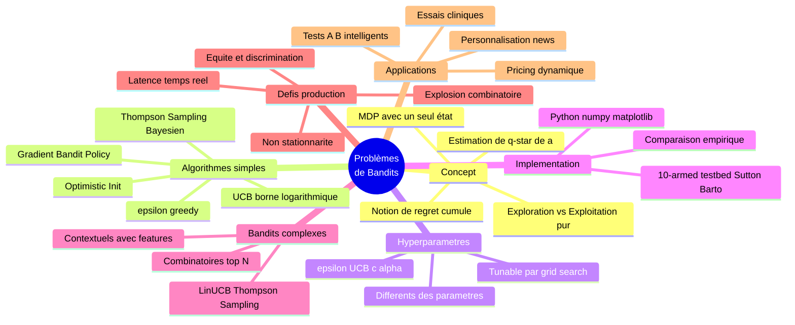

---

### Les points à retenir absolument

| # | Point clé |
|---|---|
| **1** | Un **bandit** est un MDP avec un seul état → c'est l'**exploration vs exploitation à l'état pur** |
| **2** | La **vraie valeur** $q_{\ast}(a)$ est inconnue → on l'**estime** par $Q(a)$ via moyenne empirique |
| **3** | Le **regret optimal** est **logarithmique** $O(\log T)$ — atteint par UCB et Thompson Sampling |
| **4** | **ε-greedy** est trivial mais largement utilisé en production pour sa robustesse |
| **5** | **UCB** ajoute un bonus d'incertitude → action = $Q(a) + c\sqrt{\ln t / N(a)}$ |
| **6** | **Thompson Sampling** maintient des distributions Beta/Normal → échantillonne pour décider |
| **7** | **Gradient Bandit** apprend des préférences $H(a)$ via softmax → ancêtre direct de REINFORCE |
| **8** | **Paramètres** (appris : $Q$, $H$, $N$) ≠ **Hyperparamètres** (fixés : $\varepsilon$, $\alpha$, $c$) |
| **9** | **Bandits contextuels** : action dépend d'un contexte $x_t$ → passerelle vers le RL complet |
| **10** | **Bandits combinatoires** : choisir un sous-ensemble → explosion combinatoire à gérer |
| **11** | Les bandits sont **massivement déployés en production** : Yahoo!, Microsoft, Netflix, Amazon |
| **12** | Défis : non-stationnarité, biais de sélection, équité, latence temps réel |

---

### Carte des algorithmes de bandits

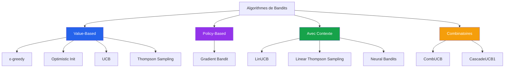

---

### Connexion avec le reste du cours

| Chapitre | Lien avec les bandits |
|---|---|
| **Chapitre 1** (Intro RL) | Le bandit illustre les concepts : agent, action, récompense, exploration/exploitation |
| **Chapitre 4-5** (MDP) | Le bandit = MDP avec $\|S\| = 1$ → simplification pédagogique |
| **Chapitre 8** (Value vs Policy) | ε-greedy / UCB sont Value-Based ; Gradient Bandit est Policy-Based |
| **Chapitre 9** (Bellman) | Les équations de mise à jour de $Q(a)$ sont le **degré 0** de l'équation de Bellman |
| **P12** (Q-Learning) | Q-Learning généralise les bandits aux MDP avec plusieurs états |
| **P19** (PPO) | PPO est l'extension Deep RL du Gradient Bandit |

---

### Pour aller plus loin

- 📘 **Sutton & Barto, Chapitre 2** — référence absolue sur les bandits
- 📘 **Bandit Algorithms** (Lattimore & Szepesvári, 2020) — disponible gratuitement en PDF, **la** bible des bandits
- 🛠️ **Vowpal Wabbit** (Microsoft) — bibliothèque open-source pour bandits contextuels en production
- 🛠️ **Azure Personalizer** — service managé Microsoft basé sur des bandits contextuels
- 📄 Li et al., 2010 — "A Contextual-Bandit Approach to Personalized News Article Recommendation" (papier fondateur Yahoo!)

> **💡 Astuce**
> **Dernière pensée — Pourquoi ce chapitre est probablement le plus rentable du cours.**
>
> Si vous êtes en transition vers le ML / data science, **les bandits sont l'algorithme RL le plus demandé en entretien** (start-ups, growth marketing, e-commerce, AdTech). Plus que Q-Learning ou PPO. Pourquoi ?
>
> 1. **Implémentation rapide** : un MVP en quelques jours, pas en mois
> 2. **ROI immédiat et mesurable** : +10-30% de revenus typiquement
> 3. **Transversal** : utilisable dans tous les secteurs (web, finance, santé, télécoms)
> 4. **Pédagogique** : c'est aussi la meilleure base pour comprendre tout le reste du RL
>
> **Action concrète :** prenez un projet personnel (votre playlist Spotify, vos courses, vos investissements) et modélisez-le comme un bandit. Implémentez ε-greedy en 30 lignes de Python. C'est **le meilleur exercice** pour ancrer les concepts.

> **📌 À retenir**
> **Erreurs à ne plus faire après ce chapitre :**
>
> - ❌ « J'utilise Deep Q-Learning pour mon problème » → vérifiez d'abord si c'est un bandit déguisé
> - ❌ « Je fais un test A/B 50/50 sur mon site » → un bandit est presque toujours plus rentable
> - ❌ « Je ne fixe pas de seed dans mes expériences » → résultats non reproductibles
> - ❌ « ε = 0 c'est plus efficace » → vous bloquez l'exploration à jamais
> - ❌ « Mon bandit en production tourne tout seul » → audit fairness obligatoire

</details>

<p align="right"><a href="#top">↑ Retour en haut</a></p>

---

<p align="center">
  <em>Tous droits réservés. Toute reproduction, diffusion, utilisation ou adaptation de ce cours, en tout ou en partie, est strictement interdite sans l'autorisation écrite préalable de Dr. Haythem REHOUMA.</em>
</p>

<p align="center">
  <strong>Cours créé par Dr. Haythem REHOUMA — Apprentissage par Renforcement</strong>
</p>

<br/>

<p align="center">
  <a href="#top" style="display: inline-block; background: #2563eb; color: #ffffff; text-decoration: none; font-size: 1.1rem; font-weight: 700; padding: 14px 40px; border-radius: 10px; letter-spacing: 0.3px;">
    ↑ Retour en haut du cours
  </a>
</p>
