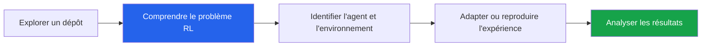

# Sélection de projets GitHub - Apprentissage par Renforcement

## Table des matières

| # | Section |
|---|---|
| 1 | [Objectif du document](#section-1) |
| 2 | [Critères pour choisir un dépôt GitHub](#section-2) |
| 3 | [Sélection de dépôts proposés](#section-3) |
| 4 | [Comment utiliser un projet existant](#section-4) |
| 5 | [Checklist avant de choisir](#section-5) |

---

1 - Objectif du document

 

Ce document propose une sélection de projets GitHub liés à l'**apprentissage par renforcement**. Ces dépôts peuvent servir d'inspiration, de point de départ ou de comparaison pour votre mini-projet.

> _Important : utiliser un dépôt GitHub ne signifie pas simplement copier un projet existant. Vous devez comprendre le code, l'adapter, expliquer les choix techniques et produire votre propre analyse._

<a href="#top">Retour en haut</a>

---

2 - Critères pour choisir un dépôt GitHub

 

Avant de choisir un dépôt, vérifiez qu'il est exploitable dans le cadre du cours.

| Critère | Pourquoi c'est important |
|---|---|
| **README clair** | Vous devez comprendre rapidement comment installer et exécuter le projet |
| **Code lisible** | Vous devez être capables d'expliquer les fichiers principaux |
| **Dépendances raisonnables** | Un projet trop lourd peut être difficile à faire fonctionner |
| **Lien avec le RL** | Le projet doit contenir un agent, un environnement, des actions et des récompenses |
| **Résultats observables** | Il doit être possible de mesurer ou visualiser l'apprentissage |
| **Possibilité d'adaptation** | Vous devez pouvoir modifier un paramètre, une récompense ou un environnement |

---

### Signaux d'alerte

| Signal | Risque |
|---|---|
| Le dépôt n'a pas été mis à jour depuis très longtemps | Dépendances incompatibles |
| Aucune instruction d'installation | Temps perdu à configurer |
| Code très complexe ou mal documenté | Difficile à expliquer dans le rapport |
| Projet sans métriques | Difficile de prouver que l'agent apprend |
| Dépôt trop avancé | Risque de ne pas terminer dans les délais |

<a href="#top">Retour en haut</a>

---

3 - Sélection de dépôts proposés

 

| # | Projet | Description | Lien |
|---|---|---|---|
| 1 | **Apprentissage par renforcement humain** | Explore l'intégration de signaux humains dans une boucle d'apprentissage par renforcement | [human-reinforcement-learning](https://github.com/JulienDesvergnes/human-reinforcement-learning) |
| 2 | **Deep Reinforcement Learning avec VizDoom** | Implémente des approches de RL profond dans des environnements de jeux vidéo de type tir à la première personne | [TP_DRL](https://github.com/asolayman/TP_DRL) |
| 3 | **IA et apprentissage par renforcement** | Dépôt pédagogique associé à un cours, avec application au problème du voyageur de commerce | [ia-apprentissage-par-renforcement-4469575](https://github.com/LinkedInLearning/ia-apprentissage-par-renforcement-4469575) |
| 4 | **Apprentissage par renforcement en Python** | Implémentation RL dans un labyrinthe où l'agent apprend à trouver une sortie | [Apprentissage-par-renforcement-en-python](https://github.com/nguembu/Apprentissage-par-renforcement-en-python) |
| 5 | **RL profond pour problèmes combinatoires** | Projet de Master 2 appliquant le Deep RL à des décisions combinatoires | [Projet_M2_Data](https://github.com/jonathangraff/Projet_M2_Data) |
| 6 | **Exemple Q-Learning** | Exemple d'application du Q-Learning avec déplacement, bonus et score | [Q-learning-AI](https://github.com/Wandrille990/Q-learning-AI) |
| 7 | **Implémentations DeepRL** | Ensemble d'implémentations combinant RL et Deep Learning sur des environnements OpenAI Gym | [DeepRL](https://github.com/vintel38/DeepRL) |

---

### Lecture rapide des options

| Si vous cherchez... | Dépôt conseillé |
|---|---|
| Un projet simple à comprendre | `Q-learning-AI` ou `Apprentissage-par-renforcement-en-python` |
| Un projet de labyrinthe ou grille | `Apprentissage-par-renforcement-en-python` |
| Un projet plus avancé avec Deep Learning | `DeepRL` ou `TP_DRL` |
| Un projet plus théorique ou combinatoire | `Projet_M2_Data` |
| Une approche avec interaction humaine | `human-reinforcement-learning` |

<a href="#top">Retour en haut</a>

---

4 - Comment utiliser un projet existant

 

Vous pouvez vous inspirer d'un dépôt GitHub, mais votre travail doit contenir une contribution personnelle.

### Travail minimal attendu

| Étape | Ce que vous devez faire |
|---|---|
| **Comprendre** | Identifier l'agent, l'environnement, les états, les actions et les récompenses |
| **Exécuter** | Faire fonctionner le projet localement ou dans Colab |
| **Documenter** | Expliquer l'installation et les fichiers principaux |
| **Adapter** | Modifier un paramètre, une fonction de récompense, un environnement ou une expérience |
| **Analyser** | Comparer les résultats avant/après ou selon plusieurs configurations |

---

### Exemples d'adaptations possibles

- Modifier le taux d'exploration `epsilon`.
- Comparer Q-Learning et SARSA si le projet le permet.
- Changer la fonction de récompense.
- Ajouter une visualisation des récompenses cumulées.
- Mesurer le temps d'entraînement.
- Comparer l'agent entraîné avec une politique aléatoire.
- Ajouter un guide d'utilisation clair.

> _Votre rapport doit indiquer précisément ce qui vient du dépôt original et ce que vous avez ajouté, modifié ou analysé._

<a href="#top">Retour en haut</a>

---

5 - Checklist avant de choisir

 

Avant de valider votre choix de dépôt, vérifiez les éléments suivants :

| Vérification | Statut |
|---|---|
| Le dépôt contient un vrai problème d'apprentissage par renforcement | [ ] |
| Le README explique comment installer ou exécuter le projet | [ ] |
| Les dépendances semblent accessibles | [ ] |
| Vous comprenez le rôle des fichiers principaux | [ ] |
| Vous pouvez identifier agent, environnement, états, actions et récompenses | [ ] |
| Vous avez une idée claire d'adaptation ou d'analyse personnelle | [ ] |
| Vous pourrez expliquer le projet sans lire le code ligne par ligne | [ ] |

---

### Conseil final

Choisissez un projet GitHub qui vous aide à apprendre, pas un projet qui vous cache la logique. Si vous ne pouvez pas expliquer comment l'agent apprend, le dépôt est probablement trop complexe pour ce mini-projet.

<a href="#top">Retour en haut</a>

