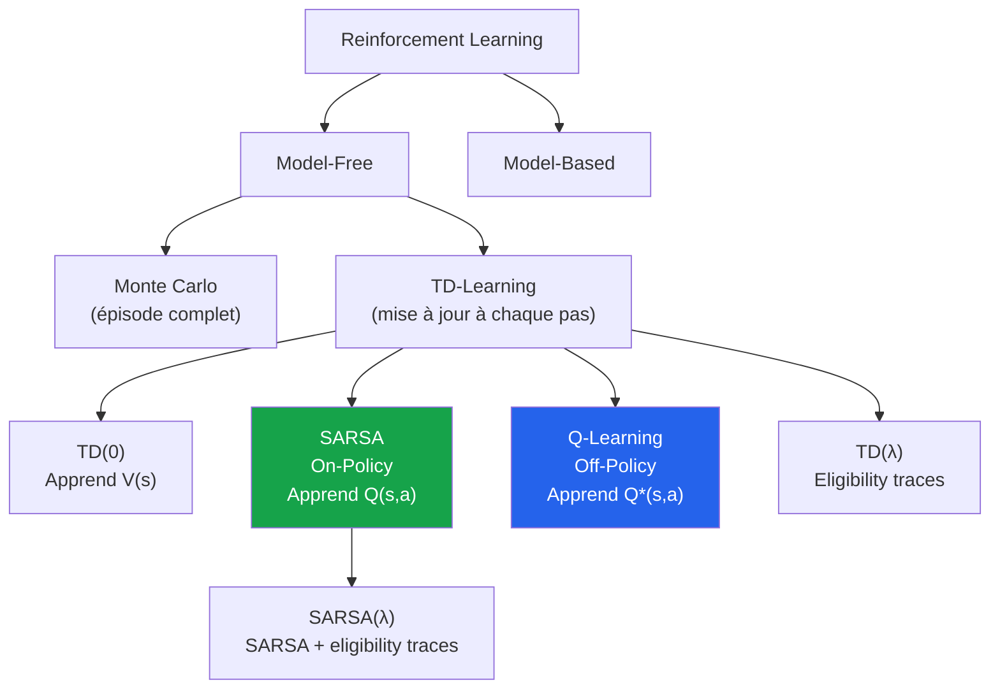
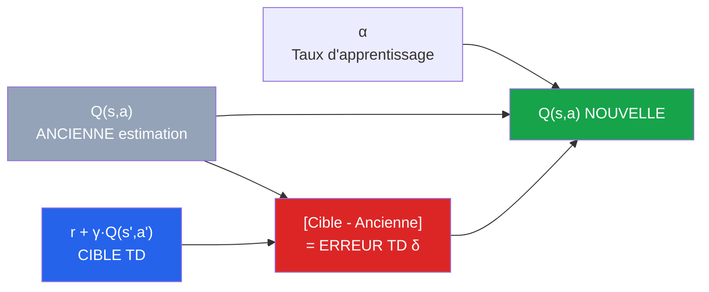
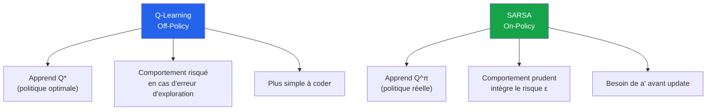
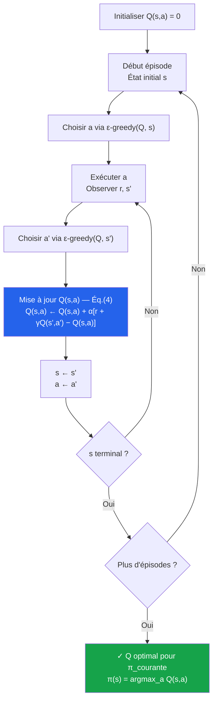
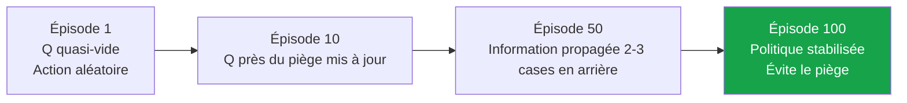
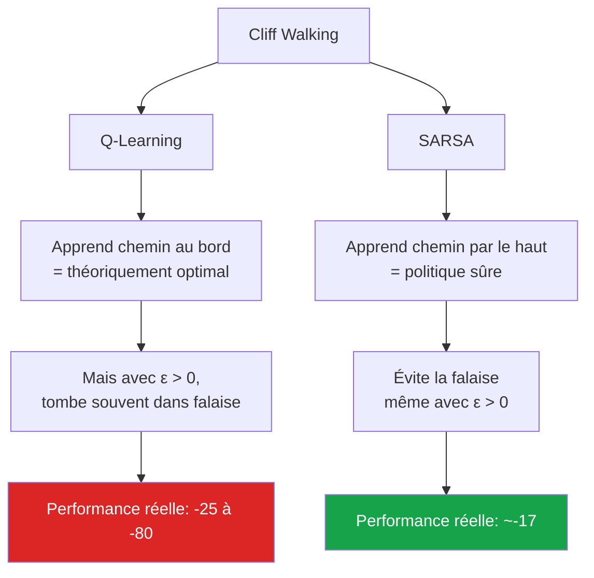
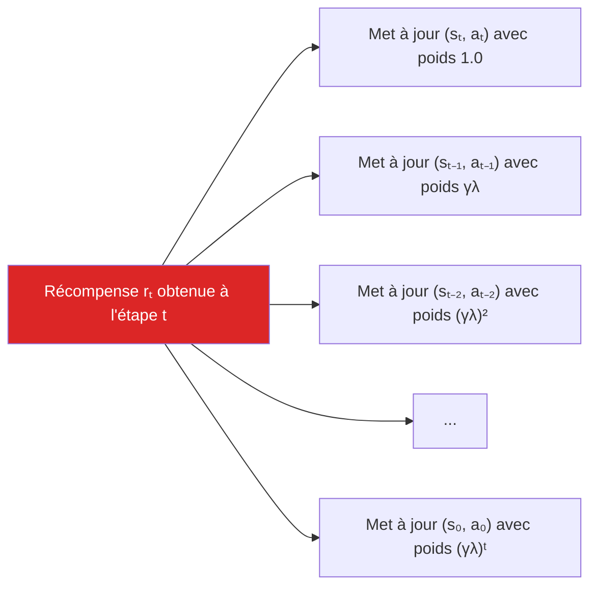
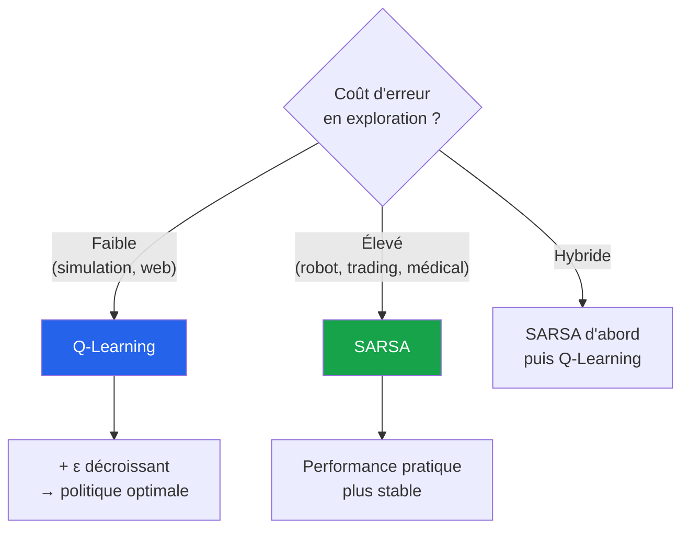
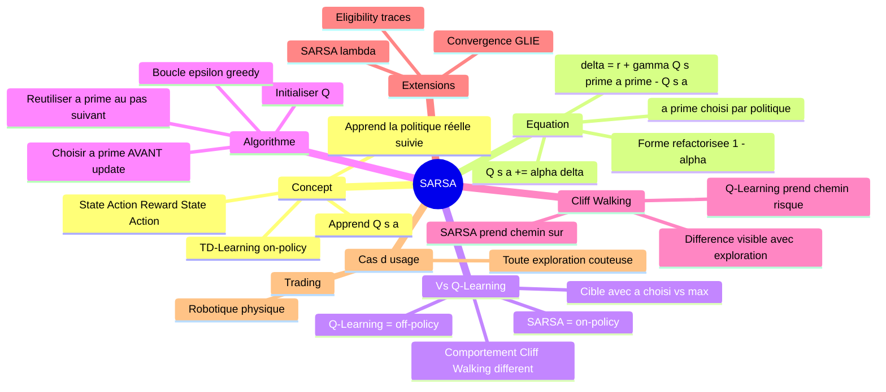
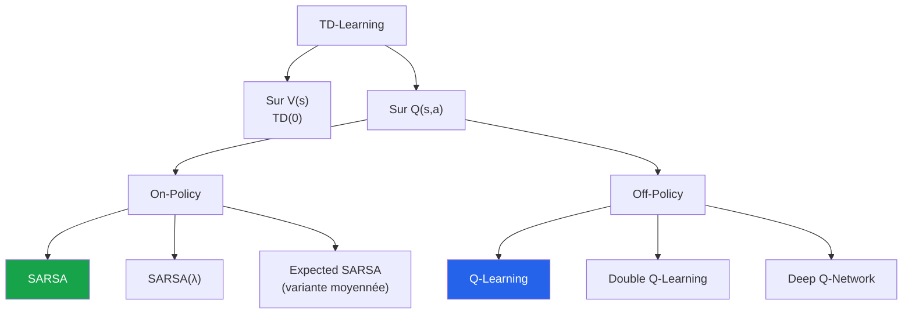

<a id="top"></a>

# Chapitre 15-bis - SARSA — Le TD-Learning « réaliste » qui apprend en marchant

## Table des matières

| # | Section |
|---|---|
| 1 | [Vue d'ensemble — Qu'est-ce que SARSA ?](#section-1) |
| 1a | &nbsp;&nbsp;&nbsp;↳ [Pourquoi le nom « SARSA » ?](#section-1) |
| 1b | &nbsp;&nbsp;&nbsp;↳ [Position de SARSA dans la famille du RL](#section-1) |
| 2 | [L'équation SARSA décortiquée terme par terme](#section-2) |
| 3 | [SARSA vs Q-Learning — La différence cruciale](#section-3) |
| 3a | &nbsp;&nbsp;&nbsp;↳ [On-Policy vs Off-Policy](#section-3) |
| 3b | &nbsp;&nbsp;&nbsp;↳ [Tableau comparatif complet](#section-3) |
| 4 | [Algorithme SARSA pas à pas](#section-4) |
| 5 | [Exemple pédagogique — GridWorld 4×4 calculé à la main](#section-5) |
| 6 | [Cliff Walking — L'exemple où SARSA brille](#section-6) |
| 6a | &nbsp;&nbsp;&nbsp;↳ [Description du problème](#section-6) |
| 6b | &nbsp;&nbsp;&nbsp;↳ [Pourquoi SARSA prend le « chemin sûr »](#section-6) |
| 7 | [SARSA(λ) — Extension avec eligibility traces](#section-7) |
| 8 | [Implémentation Python complète et exécutable](#section-8) |
| 8a | &nbsp;&nbsp;&nbsp;↳ [Environnement Cliff Walking](#section-8) |
| 8b | &nbsp;&nbsp;&nbsp;↳ [Agent SARSA et Agent Q-Learning](#section-8) |
| 8c | &nbsp;&nbsp;&nbsp;↳ [Comparaison expérimentale et graphiques](#section-8) |
| 9 | [Quand utiliser SARSA vs Q-Learning ?](#section-9) |
| 10 | [Quiz — SARSA en profondeur](#section-10) |
| 11 | [Synthèse du chapitre](#section-11) |

---

## Équations de référence

<a id="eq-td-v"></a>

**Éq. (1)** — Mise à jour TD(0) sur la fonction de valeur d'état (rappel)

$$V(s) \leftarrow V(s) + \alpha \left[ r + \gamma V(s') - V(s) \right]$$

<a id="eq-sarsa-cible"></a>

**Éq. (2)** — Cible TD de SARSA (TD Target)

$$\text{TD-Target}_{\text{SARSA}} = r + \gamma\, Q(s', a')$$

avec $a'$ = action **réellement choisie** dans $s'$ par la politique courante (ε-greedy).

<a id="eq-sarsa-erreur"></a>

**Éq. (3)** — Erreur TD de SARSA (TD Error)

$$\delta_t = r + \gamma\, Q(s', a') - Q(s, a)$$

<a id="eq-sarsa"></a>

**Éq. (4)** — Mise à jour SARSA (forme standard)

$$Q(s, a) \leftarrow Q(s, a) + \alpha \left[ r + \gamma\, Q(s', a') - Q(s, a) \right]$$

<a id="eq-sarsa-refactorisee"></a>

**Éq. (5)** — Mise à jour SARSA (forme refactorisée avec $1-\alpha$)

$$Q(s, a) \leftarrow (1 - \alpha)\, Q(s, a) + \alpha \left( r + \gamma\, Q(s', a') \right)$$

<a id="eq-qlearning"></a>

**Éq. (6)** — Mise à jour Q-Learning (pour comparaison — utilise $\max$, pas $a'$ choisi)

$$Q(s, a) \leftarrow Q(s, a) + \alpha \left[ r + \gamma \max_{a'} Q(s', a') - Q(s, a) \right]$$

<a id="eq-epsilon-greedy"></a>

**Éq. (7)** — Politique ε-greedy

- Avec probabilité $1 - \varepsilon$ : $a = \arg\max_a Q(s, a)$ (exploitation)
- Avec probabilité $\varepsilon$ : $a$ tiré uniformément parmi toutes les actions (exploration)

<a id="eq-sarsa-lambda"></a>

**Éq. (8)** — SARSA(λ) avec eligibility traces

$$E_t(s, a) = \gamma\, \lambda\, E_{t-1}(s, a) + \mathbb{1}_{(s_t, a_t) = (s, a)}$$

$$Q(s, a) \leftarrow Q(s, a) + \alpha\, \delta_t\, E_t(s, a)$$

<a id="eq-convergence"></a>

**Éq. (9)** — Conditions de convergence (Robbins-Monro)

$$\sum_{t=1}^{\infty} \alpha_t = \infty \quad \text{et} \quad \sum_{t=1}^{\infty} \alpha_t^2 < \infty$$

<a id="eq-sarsa-vs-q"></a>

**Éq. (10)** — La différence essentielle SARSA ↔ Q-Learning

$$\text{SARSA} : \quad \text{cible} = r + \gamma\, Q(s', a'_{\text{choisi}})$$

$$\text{Q-Learning} : \quad \text{cible} = r + \gamma\, \max_{a'} Q(s', a')$$

où $a'_{\text{choisi}}$ est l'action **réellement** sélectionnée dans $s'$ par la politique courante (ε-greedy).

<a id="eq-sarsa-egal-q"></a>

**Éq. (11)** — Cas particulier ε = 0 (politique purement greedy)

$$Q(s', a'_{\text{choisi}}) \;=\; \max_{a'} Q(s', a') \quad \text{lorsque } \varepsilon = 0$$

→ Avec une politique sans exploration, **SARSA et Q-Learning produisent la même mise à jour**.

<a id="eq-expected-sarsa"></a>

**Éq. (12)** — Cible TD d'**Expected SARSA** (variante)

$$\text{TD-Target}_{\text{Expected SARSA}} \;=\; r + \gamma\, \mathbb{E}_{a' \sim \pi}\!\left[ Q(s', a') \right]$$

→ Au lieu de prendre $Q(s', a'_{\text{choisi}})$ (un seul tirage), on prend l'**espérance** sur toutes les actions possibles pondérée par la politique $\pi$.

> _Toutes les équations utilisées dans le chapitre sont rassemblées ici. Dans les sections, on renvoie systématiquement à ces numéros — pas besoin de réécrire les formules à chaque endroit (cela évite aussi les bugs de rendu Markdown sur GitHub)._

---

<a id="section-1"></a>

<details>
<summary>1 — Vue d'ensemble — Qu'est-ce que SARSA ?</summary>

<br/>

**SARSA** est un algorithme d'apprentissage par renforcement de la famille **TD-Learning** (Temporal Difference). Il met à jour une **fonction d'action-valeur** $Q(s, a)$ en utilisant les transitions effectivement vécues par l'agent.

C'est l'**algorithme TD on-policy de référence** — l'agent apprend la politique **qu'il suit réellement**, exploration comprise.

> **💡 Astuce**
> **Vie réelle — SARSA, c'est l'apprenti qui apprend en marchant.**
>
> Imaginez un nouveau livreur Uber Eats qui découvre une ville. Il essaie un trajet (parfois bon, parfois mauvais), reçoit un feedback (note du client, temps de livraison), et **ajuste sa stratégie selon ce qu'il a réellement fait** — pas selon le trajet « théoriquement parfait » qu'il aurait pu prendre.
>
> Si demain il essaye une nouvelle rue (exploration), il intègre **vraiment** ce que cela donne. Il n'apprend pas une stratégie « idéale en laboratoire » — il apprend la **stratégie réaliste** qui fonctionne dans **sa vraie pratique**.

---

### Pourquoi le nom « SARSA » ?

Le nom est l'**acronyme** des 5 informations utilisées à chaque mise à jour. La chaîne se lit de gauche à droite :

```text
    S    ─►    A    ─►    R    ─►    S'   ─►    A'
  (état)  (action)  (récomp.) (état suiv.) (action suiv.)
```

Et la même chaîne sous forme de tableau, **lettre par lettre** :

| Lettre | Symbole | Signification | Rôle dans la mise à jour |
|:--:|:--:|---|---|
| **S** | s<sub>t</sub> | État actuel | Là où je suis maintenant |
| **A** | a<sub>t</sub> | Action faite | Ce que je viens de décider |
| **R** | r<sub>t+1</sub> | Récompense reçue | Le retour immédiat |
| **S** | s<sub>t+1</sub> | État suivant | Où ma décision m'a mené |
| **A** | a<sub>t+1</sub> | Action **suivante choisie** | La prochaine décision (exploration comprise) |

> **📌 À retenir**
> **Le 5e élément (A') est la clé.** Q-Learning utilise la cible avec **max sur a'** (la meilleure action **possible**). SARSA utilise la cible avec **a' réellement choisi** par la politique courante. Les formules complètes sont rassemblées dans [**Éq. (10)**](#eq-sarsa-vs-q). C'est cette nuance qui fait toute la différence — voir aussi [Section 3](#section-3).

---

### Position de SARSA dans la famille du RL



| Aspect | SARSA |
|---|---|
| **Famille** | TD-Learning model-free |
| **Type de politique** | **On-Policy** (apprend ce qu'il fait) |
| **Ce qui est appris** | $Q(s, a)$ — fonction d'action-valeur |
| **Inventeurs** | Rummery & Niranjan (1994) |
| **Nom alternatif historique** | « Modified Q-Learning » |
| **Cousin direct** | Q-Learning (Off-Policy) |
| **Extension** | SARSA(λ) avec eligibility traces |

> **ℹ️ Remarque**
> **Anecdote historique.** SARSA s'appelait à l'origine **« Modified Q-Learning »** dans le papier de Rummery & Niranjan (1994). C'est **Sutton & Barto** qui ont rebaptisé l'algorithme **SARSA** dans leur livre, parce que le nom mnémotechnique était **trop élégant** pour ne pas l'adopter. La proposition initiale (« MQL ») a totalement disparu.

</details>

<p align="right"><a href="#top">↑ Retour en haut</a></p>

---

<a id="section-2"></a>

<details>
<summary>2 — L'équation SARSA décortiquée terme par terme</summary>

<br/>

➡️ Voir [**Éq. (4) — Mise à jour SARSA**](#eq-sarsa) en haut du document.

L'équation centrale de SARSA peut paraître intimidante, mais chaque terme a une signification **physique très claire**. Décortiquons-la.

### Décomposition visuelle



### Les 5 termes essentiels

| Terme | Lecture | Signification physique |
|---|---|---|
| $Q(s, a)$ | « Q de s, a » | Mon estimation actuelle de la valeur de prendre $a$ depuis $s$ |
| $r$ | « r » | La récompense que je viens d'observer |
| $\gamma\, Q(s', a')$ | « gamma fois Q de s', a' » | Mon estimation de la valeur des récompenses futures **si je continue avec ma politique actuelle** |
| $r + \gamma Q(s', a')$ | **Cible TD** | Ce que je crois maintenant être la « vraie » valeur de $Q(s, a)$ |
| $r + \gamma Q(s', a') - Q(s, a)$ | **Erreur TD δ** | L'écart entre ce que je pensais et ce que je crois maintenant |
| $\alpha$ | « alpha » | À quel point je « tire » mon ancienne estimation vers la cible (entre 0 et 1) |

### Lecture en mots

> _« Ma nouvelle estimation Q(s, a) = mon ancienne estimation + un petit pas α dans la direction de l'erreur que je viens de commettre. Si l'erreur est positive (j'avais sous-estimé), j'augmente Q. Si elle est négative (j'avais surestimé), je diminue Q. »_
>
> ➡️ Forme symbolique : voir [**Éq. (4)**](#eq-sarsa).

### Cas particuliers de α

| Valeur de α | Comportement |
|---|---|
| **α = 0** | Aucun apprentissage — l'agent ne change jamais son estimation |
| **α = 0.1** (typique) | Apprentissage progressif — le passé compte beaucoup |
| **α = 0.5** | Compromis équilibré entre passé et nouvelle observation |
| **α = 1** | L'agent **oublie tout** — chaque observation remplace totalement l'estimation |

> **💡 Astuce**
> **Vie réelle — α, c'est votre « scepticisme face à une nouvelle expérience ».**
>
> Si quelqu'un vous dit « ce restaurant est nul ! » :
>
> - **α = 0** : « Bof, je m'en moque, mon avis ne change pas. » → vous n'apprendrez jamais rien
> - **α = 0.1** : « OK, je note, mais je veux confirmer en y allant aussi. » → équilibre sage
> - **α = 1** : « D'accord, je n'irai jamais. » → vous êtes influençable à l'extrême
>
> Dans SARSA pour des problèmes simples, $\alpha \in [0.1, 0.5]$ fonctionne très bien. Pour des environnements bruités, baissez $\alpha$ pour stabiliser l'apprentissage.

### Forme refactorisée (mathématiquement équivalente)

➡️ Voir [**Éq. (5) — Forme refactorisée**](#eq-sarsa-refactorisee).

Cette forme rend visible le fait que la nouvelle valeur est une **moyenne pondérée** entre l'ancienne valeur et la cible TD :

- poids du **passé** = $(1 - \alpha)$
- poids du **nouveau** (cible TD) = $\alpha$

> **ℹ️ Remarque**
> **Pourquoi deux formes équivalentes ?** La forme standard ([Éq. 4](#eq-sarsa)) met en avant l'**erreur TD δ** (concept crucial pour comprendre TD-Learning et l'extension SARSA(λ)). La forme refactorisée ([Éq. 5](#eq-sarsa-refactorisee)) met en avant le caractère de **moyenne pondérée**. Les deux sont mathématiquement identiques — utilisez celle qui vous parle le plus selon le contexte.

</details>

<p align="right"><a href="#top">↑ Retour en haut</a></p>

---

<a id="section-3"></a>

<details>
<summary>3 — SARSA vs Q-Learning — La différence cruciale</summary>

<br/>

C'est **la question** qui revient toujours en cours de RL : quelle est la vraie différence entre SARSA et Q-Learning ? Les équations se ressemblent à 99%, mais leurs comportements peuvent être **diamétralement opposés** dans certains environnements.

### Les deux équations côte à côte

| Algorithme | Cible TD |
|---|---|
| **SARSA** ([Éq. 4](#eq-sarsa)) | $r + \gamma\, Q(s', \mathbf{a'_{\text{choisi}}})$ |
| **Q-Learning** ([Éq. 6](#eq-qlearning)) | $r + \gamma \max_{a'} Q(s', a')$ |

> _**Le seul changement** : `a'_{choisi}` (action réellement prise par la politique courante) chez SARSA, vs `max a'` (la meilleure action théorique possible) chez Q-Learning. Ce détail change tout._

---

### On-Policy vs Off-Policy — La vraie distinction

| Concept | Définition | Algorithme |
|---|---|---|
| **On-Policy** | L'agent apprend la valeur de **la politique qu'il suit réellement**, exploration comprise | SARSA |
| **Off-Policy** | L'agent apprend la valeur de la politique **optimale** (greedy), même s'il en utilise une autre pour explorer | Q-Learning |

> **📌 À retenir**
> **Métaphore décisive — Imaginez deux étudiants qui révisent le code de la route.**
>
> - **L'étudiant SARSA (on-policy)** étudie en faisant des **vraies sessions de conduite** avec un instructeur. Il apprend ce qui marche **dans la réalité**, avec ses propres hésitations, erreurs et explorations. Il sera **prudent** parce qu'il intègre la possibilité de faire des erreurs.
>
> - **L'étudiant Q-Learning (off-policy)** étudie un **manuel théorique** parfait. Il apprend la conduite **idéale** sans tenir compte de ses propres erreurs futures. Il sera **plus optimiste**, parce qu'il croit qu'il fera toujours le meilleur choix.
>
> Dans un examen théorique, Q-Learning gagnera. Dans la **vraie route avec des erreurs humaines**, SARSA est souvent plus sûr.

---

### Comportement en présence de risque — l'exemple Cliff Walking

> _Voir [**Section 6**](#section-6) pour la démonstration complète. Voici l'intuition._

Imaginez un environnement avec :
- Un **chemin court** au bord d'un précipice (récompense optimale, mais 1 erreur = -100)
- Un **chemin long** qui contourne le précipice (récompense moindre mais sans risque)

| Algorithme | Politique apprise | Pourquoi ? |
|---|---|---|
| **Q-Learning** | Chemin court (au bord du précipice) | Il ignore le risque d'exploration ε-greedy : il croit qu'il fera toujours la meilleure action |
| **SARSA** | Chemin long (loin du précipice) | Il intègre le fait qu'avec probabilité ε, il fera une action aléatoire — donc il évite les zones où une erreur coûte cher |

> **🛑 Danger**
> **Conséquence pratique.** Si vous déployez un agent en **production avec exploration continue** (par exemple un robot qui doit toujours pouvoir s'adapter), **SARSA est souvent plus sûr** que Q-Learning. Q-Learning peut « apprendre la politique optimale » mais s'effondrer en pratique parce qu'il sous-estime le coût de ses propres explorations.

---

### Tableau comparatif complet

| Critère | SARSA | Q-Learning |
|---|---|---|
| **Type de politique** | **On-Policy** | **Off-Policy** |
| **Cible TD** | $r + \gamma\, Q(s', a')$ | $r + \gamma \max_{a'} Q(s', a')$ |
| **Action $a'$ utilisée** | Action **réellement choisie** | Meilleure action **théorique** |
| **Politique apprise** | Politique courante (avec exploration) | Politique optimale (greedy) |
| **Comportement avec risque** | **Prudent** — évite les zones risquées | **Téméraire** — ignore le risque d'exploration |
| **Convergence** | Vers $Q^{\pi}$ de la politique courante | Vers $Q^{\ast}$ optimale |
| **Performance pendant apprentissage** | Souvent **meilleure** (apprend ce qu'il fait) | Peut être instable (apprend autre chose que ce qu'il fait) |
| **Performance après convergence (politique greedy)** | Égale à Q-Learning si exploration → 0 | Théoriquement optimale |
| **Cas d'usage typique** | Apprentissage en environnement réel avec coût d'erreur | Apprentissage en simulation, environnement sûr |
| **Implémentation** | Légèrement plus complexe (besoin de $a'$ avant l'update) | Légèrement plus simple |



> **💡 Astuce**
> **Règle pratique de choix :**
>
> - Vous **simulez** dans un environnement sans coût d'erreur (jeu vidéo, sim 3D) → **Q-Learning**
> - Vous déployez **dans le monde réel** avec exploration continue (robot, voiture, finance live) → **SARSA**
> - Vous voulez la **performance optimale après convergence** quoi qu'il arrive → **Q-Learning** + ε → 0 progressif
> - Vous voulez **un comportement sûr pendant l'apprentissage** → **SARSA**

</details>

<p align="right"><a href="#top">↑ Retour en haut</a></p>

---

<a id="section-4"></a>

<details>
<summary>4 — Algorithme SARSA pas à pas</summary>

<br/>

### Pseudocode complet

```
Algorithme SARSA(α, γ, ε, n_episodes)
─────────────────────────────────────
1. Initialiser Q(s, a) ← 0 pour tout (s, a)
2. Pour chaque épisode = 1 à n_episodes :
   a. Initialiser état s
   b. Choisir a ← ε-greedy(Q, s)        # ← première action
   c. Tant que s n'est pas terminal :
       i.   Exécuter a, observer r et s'
       ii.  Choisir a' ← ε-greedy(Q, s')   # ← action suivante (clé !)
       iii. Q(s, a) ← Q(s, a) + α[r + γ·Q(s', a') − Q(s, a)]   # ← Éq. (4)
       iv.  s ← s', a ← a'
3. Retourner Q et la politique π(s) = argmax_a Q(s, a)
```

### Diagramme de flux



### Les 6 étapes commentées

| # | Étape | Pourquoi c'est important |
|---|---|---|
| 1 | Initialiser $Q(s, a) = 0$ | Point de départ neutre. On peut aussi initialiser à $Q_0$ optimiste pour favoriser l'exploration |
| 2 | Choisir $a$ via ε-greedy | **Politique de comportement** — l'agent doit explorer un peu (sinon il reste bloqué) |
| 3 | Exécuter $a$, observer $r, s'$ | Interaction avec l'environnement |
| 4 | Choisir $a'$ via ε-greedy | **Étape clé qui distingue SARSA de Q-Learning** : on choisit la prochaine action **avant** la mise à jour |
| 5 | Mise à jour Q(s, a) | Application de l'équation TD avec $a'$ déterminé à l'étape 4 |
| 6 | $s \leftarrow s'$, $a \leftarrow a'$ | On avance dans l'épisode en réutilisant l'action déjà choisie |

> **📌 À retenir**
> **Point subtil — Pourquoi avancer avec `a ← a'` ?**
>
> Comme SARSA a déjà choisi $a'$ à l'étape 4 pour faire la mise à jour, **il serait absurde de re-tirer une action différente** au prochain pas. L'agent **agit selon $a'$** au pas suivant, garantissant que ce qui est appris (mise à jour) correspond exactement à ce qui sera fait (action exécutée). C'est l'essence du **« on-policy »**.

> **🛑 Danger**
> **Erreur classique — Ne PAS faire ça :**
>
> ```python
> # ❌ MAUVAIS — c'est devenu Q-Learning par accident !
> a_prime = np.argmax(Q[s_prime])      # toujours greedy
> Q[s][a] += alpha * (r + gamma * Q[s_prime][a_prime] - Q[s][a])
>
> # ✅ BON — vrai SARSA
> a_prime = epsilon_greedy(Q, s_prime, epsilon)   # peut être aléatoire !
> Q[s][a] += alpha * (r + gamma * Q[s_prime][a_prime] - Q[s][a])
> a = a_prime  # important : on réutilise cette action au pas suivant
> ```
>
> Beaucoup de bugs SARSA viennent de cette confusion. Vérifiez toujours que **l'action utilisée dans la mise à jour est la même que l'action exécutée au pas suivant**.

</details>

<p align="right"><a href="#top">↑ Retour en haut</a></p>

---

<a id="section-5"></a>

<details>
<summary>5 — Exemple pédagogique — GridWorld 4×4 calculé à la main</summary>

<br/>

### L'environnement

Une grille 4×4 avec :
- **Départ** : case `(0, 0)` (en haut à gauche)
- **Objectif** : case `(3, 3)` (en bas à droite, **récompense +10**)
- **Piège** : case `(2, 1)` (**récompense −10, fin d'épisode**)
- Récompense de **−1** pour chaque pas (pour pousser l'agent à terminer vite)
- 4 actions possibles : Haut (H), Bas (B), Gauche (G), Droite (D)

```
Position (col, row) :       Récompenses :
┌────┬────┬────┬────┐       ┌────┬────┬────┬────┐
│ S  │    │    │    │       │ -1 │ -1 │ -1 │ -1 │
├────┼────┼────┼────┤       ├────┼────┼────┼────┤
│    │    │    │    │       │ -1 │ -1 │ -1 │ -1 │
├────┼────┼────┼────┤       ├────┼────┼────┼────┤
│    │ ✗  │    │    │       │ -1 │-10 │ -1 │ -1 │
├────┼────┼────┼────┤       ├────┼────┼────┼────┤
│    │    │    │ G  │       │ -1 │ -1 │ -1 │ +10│
└────┴────┴────┴────┘       └────┴────┴────┴────┘

S = Départ, ✗ = Piège, G = Objectif
```

### Hyperparamètres

| Paramètre | Valeur |
|---|---|
| $\alpha$ (learning rate) | 0.1 |
| $\gamma$ (discount factor) | 0.9 |
| $\varepsilon$ (exploration) | 0.1 |
| $Q_0$ (initialisation) | 0 partout |

---

### Trajectoire d'un épisode (calculée à la main)

Supposons que l'agent suive cette trajectoire pendant un épisode :

| Pas | $s$ | $a$ | $r$ | $s'$ | $a'$ choisi |
|---|---|---|---|---|---|
| 1 | (0,0) | D (Droite) | −1 | (1,0) | B (Bas) |
| 2 | (1,0) | B (Bas) | −1 | (1,1) | D (Droite) |
| 3 | (1,1) | D (Droite) | −1 | (2,1) | — (piège, fin !) |

**Après l'étape 3, l'agent tombe dans le piège — récompense −10, fin d'épisode.**

---

### Mises à jour pas à pas (Éq. 4)

#### Pas 1 : $(s, a, r, s', a') = ((0,0), D, -1, (1,0), B)$

Avant : $Q((0,0), D) = 0$, $Q((1,0), B) = 0$

$$Q((0,0), D) \leftarrow 0 + 0.1 \times \big[-1 + 0.9 \times 0 - 0\big] = 0 + 0.1 \times (-1) = -0.1$$

**Après : $Q((0,0), D) = -0.1$**

---

#### Pas 2 : $(s, a, r, s', a') = ((1,0), B, -1, (1,1), D)$

Avant : $Q((1,0), B) = 0$, $Q((1,1), D) = 0$

$$Q((1,0), B) \leftarrow 0 + 0.1 \times \big[-1 + 0.9 \times 0 - 0\big] = -0.1$$

**Après : $Q((1,0), B) = -0.1$**

---

#### Pas 3 : $(s, a, r, s')$ = $((1,1), D, -10, (2,1))$ — terminal !

Comme $s' = (2,1)$ est terminal, on utilise $Q(s', a') = 0$ par convention.

$$Q((1,1), D) \leftarrow 0 + 0.1 \times \big[-10 + 0.9 \times 0 - 0\big] = 0.1 \times (-10) = -1.0$$

**Après : $Q((1,1), D) = -1.0$**

---

### Tableau Q après l'épisode 1

| État | Q(H) | Q(B) | Q(G) | Q(D) |
|---|---|---|---|---|
| (0,0) | 0 | 0 | 0 | **−0.1** |
| (1,0) | 0 | **−0.1** | 0 | 0 |
| (1,1) | 0 | 0 | 0 | **−1.0** |

> **ℹ️ Remarque**
> **Observations pédagogiques importantes :**
>
> 1. **Seules les Q-valeurs des états visités** sont mises à jour. Tout le reste reste à 0
> 2. **L'effet de la pénalité piège (−10)** ne s'est propagé qu'à $Q((1,1), D)$ — pas encore aux états précédents
> 3. **Pour propager** la connaissance « ne pas aller vers (1,1) en faisant D », il faut **plusieurs épisodes**. C'est exactement l'effet du **bootstrapping TD**

> **💡 Astuce**
> **Vie réelle — Pourquoi il faut plusieurs épisodes.**
>
> Pensez à un nouvel employé qui se trompe de bureau et tombe sur la salle des photocopieuses bruyante. Lors de sa **première erreur**, il apprend juste « cette dernière action était mauvaise ». Pour qu'il apprenne « il ne faut pas tourner à droite il y a 2 étapes », il doit **revivre la séquence plusieurs fois** — c'est exactement ce que SARSA fait par bootstrapping. Au bout de 50 épisodes, l'information « danger » s'est **propagée en arrière** sur toute la trajectoire menant au piège.

---

### Après plusieurs épisodes (~100 épisodes)

L'information se propage en arrière dans la grille. La table Q devient progressivement :

| État | Q(H) | Q(B) | Q(G) | Q(D) | **Action optimale** |
|---|---|---|---|---|---|
| (0,0) | −2.1 | −1.8 | −2.5 | **+5.2** | → Droite |
| (1,0) | −2.0 | −2.5 | **+4.5** | −1.7 | ← (B mauvais : mène vers piège) |
| (2,0) | −1.9 | **+5.8** | −2.0 | +3.1 | ↓ Bas |
| (3,0) | −1.8 | **+7.2** | +4.0 | −1.5 | ↓ Bas |
| ... | ... | ... | ... | ... | ... |

> _L'agent SARSA a appris à **éviter (1,1) → D** (qui mène au piège) et à privilégier le contournement par la colonne 0 ou 2._



</details>

<p align="right"><a href="#top">↑ Retour en haut</a></p>

---

<a id="section-6"></a>

<details>
<summary>6 — Cliff Walking — L'exemple où SARSA brille</summary>

<br/>

### Description du problème

**Cliff Walking** est l'environnement de référence (Sutton & Barto, Section 6.5) qui montre **la différence pratique** entre SARSA et Q-Learning. C'est devenu **LE classique** pour illustrer on-policy vs off-policy.

### L'environnement

```
┌───┬───┬───┬───┬───┬───┬───┬───┬───┬───┬───┬───┐
│   │   │   │   │   │   │   │   │   │   │   │   │   ← row 0 (haut)
├───┼───┼───┼───┼───┼───┼───┼───┼───┼───┼───┼───┤
│   │   │   │   │   │   │   │   │   │   │   │   │   ← row 1
├───┼───┼───┼───┼───┼───┼───┼───┼───┼───┼───┼───┤
│   │   │   │   │   │   │   │   │   │   │   │   │   ← row 2
├───┼───┼───┼───┼───┼───┼───┼───┼───┼───┼───┼───┤
│ S │░░░│░░░│░░░│░░░│░░░│░░░│░░░│░░░│░░░│░░░│ G │   ← row 3 (bas, départ + falaise + objectif)
└───┴───┴───┴───┴───┴───┴───┴───┴───┴───┴───┴───┘
  S = Départ                 ░ = Falaise (-100)            G = Objectif (+0, fin)
```

### Règles

| Élément | Détail |
|---|---|
| **Grille** | 4 lignes × 12 colonnes |
| **Départ** | Coin bas-gauche `(3, 0)` |
| **Objectif** | Coin bas-droit `(3, 11)`, récompense **0** et fin |
| **Falaise** | Toutes les cases `(3, 1)` à `(3, 10)`, récompense **−100** + retour au départ |
| **Récompense de pas** | **−1** par mouvement |
| **Actions** | 4 directions (Haut, Bas, Gauche, Droite) |

### Pourquoi cet environnement est-il génial ?

Il existe **deux politiques très différentes** :

| Politique | Description | Récompense par épisode (sans erreur) |
|---|---|---|
| **Optimale (au bord)** | Longe la falaise (chemin de longueur 13) | $13 \times (-1) = -13$ |
| **Sûre (par le haut)** | Monte d'abord, traverse, redescend (chemin de longueur 17) | $17 \times (-1) = -17$ |

**Mais avec exploration ε = 0.1**, la politique au bord a **10% de chance par pas de tomber dans la falaise** (= −100).

---

### Pourquoi SARSA prend le « chemin sûr »

> **📌 À retenir**
> **Mécanisme précis — pourquoi SARSA évite le bord.**
>
> Quand SARSA met à jour $Q((3,0), \text{Droite})$, il utilise $Q((3,1), a'_{\text{choisi}})$. Mais **avec probabilité ε = 0.1**, l'action $a'$ peut être « Bas » → l'agent tombe → reçoit −100 → la valeur $Q((3,1), \text{Bas})$ devient très négative. Cette pénalité **se propage** vers $Q((3,0), \text{Droite})$, qui devient très négative aussi. **SARSA apprend que « être au bord est risqué »** parce qu'il intègre dans sa cible le coût des erreurs réelles d'exploration.

> **📌 À retenir**
> **Pourquoi Q-Learning prend le « chemin au bord ».**
>
> Q-Learning utilise $\max_{a'} Q((3,1), a')$ — donc il ne considère **jamais** l'action « Bas » (qui mène à la falaise) dans sa cible. Pour Q-Learning, la valeur de $(3, 1)$ est **toujours évaluée comme si l'agent allait faire l'action optimale ensuite**. Il **sous-estime** complètement le risque d'exploration et apprend que le bord est fantastique.

### Résultat empirique (typique sur 500 épisodes)

| Méthode | Politique apprise | Récompense moyenne par épisode |
|---|---|---|
| **SARSA** | Chemin sûr (par le haut) | ≈ **−17** stable |
| **Q-Learning** | Chemin au bord | **−25 à −80** instable (chutes fréquentes) |
| **Q-Learning après ε → 0** | Chemin au bord | **−13** optimal théorique |

> **🛑 Danger**
> **Leçon industrielle.** Si vous déployez Q-Learning avec exploration continue (par exemple un robot qui doit toujours s'adapter), vous obtenez **la pire performance pratique** : il choisit la politique théoriquement optimale, mais elle s'effondre dès qu'il explore. **SARSA, plus humble, donne de meilleurs résultats réels.**



> _Voir [**Section 8**](#section-8) pour l'implémentation Python complète qui reproduit ces résultats._

</details>

<p align="right"><a href="#top">↑ Retour en haut</a></p>

---

<a id="section-7"></a>

<details>
<summary>7 — SARSA(λ) — Extension avec eligibility traces</summary>

<br/>

**SARSA classique** ne propage l'information de récompense que d'**une étape à la fois**. Pour propager une grosse récompense terminale jusqu'au début d'un long épisode, il faut **autant d'épisodes que la longueur de la trajectoire**. C'est lent.

**SARSA(λ)** résout ce problème avec les **eligibility traces** — une trace mémorielle de tous les couples $(s, a)$ récemment visités.

### Idée fondamentale

Plutôt que de mettre à jour seulement $(s_t, a_t)$, on met à jour **tous les couples récemment visités**, avec un poids qui décroît selon leur ancienneté.

➡️ Voir [**Éq. (8) — SARSA(λ)**](#eq-sarsa-lambda).

| Paramètre | Effet |
|---|---|
| $\lambda = 0$ | SARSA classique — pas de mémoire |
| $\lambda \in (0, 1)$ | Trace exponentielle — propagation accélérée |
| $\lambda = 1$ | Équivalent à Monte Carlo — propage à toute la trajectoire |

### Diagramme



### Pseudocode SARSA(λ)

```
Initialiser Q(s,a), E(s,a) = 0 pour tout (s,a)
Pour chaque épisode :
    s, a ← état initial, action ε-greedy
    Tant que pas terminal :
        Exécuter a, observer r, s'
        a' ← ε-greedy(Q, s')
        δ ← r + γ Q(s', a') − Q(s, a)
        E(s, a) ← E(s, a) + 1                # accumule la trace
        Pour tout (s, a) :
            Q(s, a) ← Q(s, a) + α δ E(s, a)   # propagation pondérée
            E(s, a) ← γ λ E(s, a)              # décroissance exponentielle
        s ← s', a ← a'
```

> **💡 Astuce**
> **Vie réelle — Pourquoi λ accélère l'apprentissage.**
>
> Imaginez que vous apprenez à cuisiner une recette. Lorsque le **plat final est délicieux** (récompense +10), SARSA classique attribue **tout le mérite à la dernière action** (sortir du four). C'est absurde — le succès vient de TOUTES les étapes.
>
> Avec $\lambda = 0.7$, SARSA(λ) **rétro-attribue** une partie du mérite à toutes les actions récentes : assaisonner (poids 0.7), mélanger (poids 0.49), couper (poids 0.34)... C'est plus juste **et plus rapide à apprendre**.

> **⚠️ Attention**
> **Limites de SARSA(λ).**
>
> - Coût de calcul : on parcourt **tous les couples (s, a)** à chaque pas (au lieu d'un seul) — coûteux en grandes grilles
> - Hyperparamètre supplémentaire : il faut tuner $\lambda \in [0, 1]$
> - **Implémentation efficace** : utiliser des **traces dites « replacing »** (E ← 1 au lieu de E ← E + 1) pour éviter les divergences
>
> En pratique, $\lambda = 0.9$ fonctionne bien dans la majorité des problèmes simples. Pour les très grandes grilles, préférer des méthodes Deep RL (DQN, A3C).

</details>

<p align="right"><a href="#top">↑ Retour en haut</a></p>

---

<a id="section-8"></a>

<details>
<summary>8 — Implémentation Python complète et exécutable</summary>

<br/>

Cette section fournit une **implémentation pédagogique et complète** de SARSA et Q-Learning sur l'environnement Cliff Walking. Le code peut être copié-collé dans un notebook ou exécuté via le fichier `sarsa.py` fourni dans ce dossier.

#### Prérequis

```bash
pip install numpy matplotlib
```

> **🛑 Danger**
> **Pièges classiques d'implémentation SARSA :**
>
> 1. **Choisir $a'$ après l'update** au lieu d'avant → vous codez Q-Learning sans le savoir
> 2. **Ne pas réutiliser $a'$ au pas suivant** (`a = a'`) → vous cassez la cohérence on-policy
> 3. **Oublier le cas terminal** : pour un état terminal, $Q(s', a') = 0$ par convention
> 4. **Pas de `seed`** → vos résultats ne sont pas reproductibles
> 5. **Confondre $r$ et $r_{t+1}$** : la récompense vient toujours **après** l'exécution de l'action
>
> Le code ci-dessous gère **tous ces pièges**.

---

### 8a — Environnement Cliff Walking

```python
import numpy as np

class CliffWalkingEnv:
    """
    Environnement Cliff Walking de Sutton & Barto.
    Grille 4x12. Départ (3, 0), Objectif (3, 11), falaise (3, 1)..(3, 10).
    Actions : 0=Haut, 1=Bas, 2=Gauche, 3=Droite.
    Récompense : -1 par pas, -100 + retour au départ si tombe dans la falaise.
    """

    HEIGHT, WIDTH = 4, 12
    START = (3, 0)
    GOAL = (3, 11)
    CLIFF = [(3, c) for c in range(1, 11)]
    ACTIONS = [(-1, 0), (1, 0), (0, -1), (0, 1)]   # H, B, G, D
    N_ACTIONS = 4

    def __init__(self):
        self.state = self.START

    def reset(self):
        self.state = self.START
        return self.state

    def step(self, action):
        dr, dc = self.ACTIONS[action]
        r, c = self.state
        new_r = max(0, min(self.HEIGHT - 1, r + dr))
        new_c = max(0, min(self.WIDTH - 1, c + dc))
        new_state = (new_r, new_c)

        if new_state in self.CLIFF:
            self.state = self.START
            return self.START, -100.0, False
        if new_state == self.GOAL:
            self.state = new_state
            return new_state, -1.0, True

        self.state = new_state
        return new_state, -1.0, False
```

---

### 8b — Agent SARSA et Agent Q-Learning

```python
class SARSAAgent:
    """Agent SARSA (on-policy TD control)."""

    def __init__(self, n_actions, alpha=0.5, gamma=1.0, epsilon=0.1, seed=None):
        self.n_actions = n_actions
        self.alpha = alpha
        self.gamma = gamma
        self.epsilon = epsilon
        self.Q = {}
        self.rng = np.random.default_rng(seed)

    def _q(self, state):
        if state not in self.Q:
            self.Q[state] = np.zeros(self.n_actions)
        return self.Q[state]

    def select_action(self, state):
        """Politique ε-greedy."""
        if self.rng.random() < self.epsilon:
            return int(self.rng.integers(0, self.n_actions))
        q = self._q(state)
        max_q = np.max(q)
        candidates = np.where(q == max_q)[0]
        return int(self.rng.choice(candidates))

    def update(self, s, a, r, s_next, a_next, done):
        """
        Mise à jour SARSA — Éq. (4).
        On utilise a_next (réellement choisi), PAS argmax.
        """
        target = r if done else r + self.gamma * self._q(s_next)[a_next]
        self._q(s)[a] += self.alpha * (target - self._q(s)[a])


class QLearningAgent:
    """Agent Q-Learning (off-policy TD control), pour comparaison."""

    def __init__(self, n_actions, alpha=0.5, gamma=1.0, epsilon=0.1, seed=None):
        self.n_actions = n_actions
        self.alpha = alpha
        self.gamma = gamma
        self.epsilon = epsilon
        self.Q = {}
        self.rng = np.random.default_rng(seed)

    def _q(self, state):
        if state not in self.Q:
            self.Q[state] = np.zeros(self.n_actions)
        return self.Q[state]

    def select_action(self, state):
        if self.rng.random() < self.epsilon:
            return int(self.rng.integers(0, self.n_actions))
        q = self._q(state)
        max_q = np.max(q)
        candidates = np.where(q == max_q)[0]
        return int(self.rng.choice(candidates))

    def update(self, s, a, r, s_next, done):
        """
        Mise à jour Q-Learning — Éq. (6).
        On utilise max(Q(s', a')), PAS l'action réellement choisie.
        """
        target = r if done else r + self.gamma * np.max(self._q(s_next))
        self._q(s)[a] += self.alpha * (target - self._q(s)[a])
```

> **📌 À retenir**
> **Comparez les méthodes `update()` ligne par ligne.** Ce sont les deux **seules lignes différentes** entre SARSA et Q-Learning :
>
> ```python
> # SARSA :        target = r + γ * Q[s_next][a_next]    # a_next = action choisie
> # Q-Learning :   target = r + γ * np.max(Q[s_next])    # max sur toutes les actions
> ```
>
> Cette **micro-différence d'une ligne** est responsable du comportement totalement différent observé sur Cliff Walking.

---

### 8c — Boucle d'entraînement et comparaison expérimentale

```python
def train_sarsa(env, agent, n_episodes):
    """Entraînement SARSA (boucle on-policy classique)."""
    rewards = []
    for ep in range(n_episodes):
        s = env.reset()
        a = agent.select_action(s)
        episode_reward = 0
        done = False
        while not done:
            s_next, r, done = env.step(a)
            a_next = agent.select_action(s_next)
            agent.update(s, a, r, s_next, a_next, done)   # ← Éq. (4)
            s, a = s_next, a_next                          # ← cohérence on-policy
            episode_reward += r
            if episode_reward < -1000:                     # garde-fou
                break
        rewards.append(episode_reward)
    return rewards


def train_qlearning(env, agent, n_episodes):
    """Entraînement Q-Learning (off-policy)."""
    rewards = []
    for ep in range(n_episodes):
        s = env.reset()
        episode_reward = 0
        done = False
        while not done:
            a = agent.select_action(s)
            s_next, r, done = env.step(a)
            agent.update(s, a, r, s_next, done)            # ← Éq. (6) (pas besoin de a_next)
            s = s_next
            episode_reward += r
            if episode_reward < -1000:
                break
        rewards.append(episode_reward)
    return rewards


def smooth(values, window=20):
    """Moyenne glissante pour lisser les courbes."""
    arr = np.array(values, dtype=float)
    return np.convolve(arr, np.ones(window)/window, mode="valid")


def main():
    import matplotlib.pyplot as plt

    n_episodes = 500
    n_runs = 30

    sarsa_rewards = np.zeros(n_episodes)
    q_rewards = np.zeros(n_episodes)

    for run in range(n_runs):
        env = CliffWalkingEnv()
        sarsa_agent = SARSAAgent(env.N_ACTIONS, alpha=0.5, gamma=1.0,
                                 epsilon=0.1, seed=run)
        sarsa_rewards += np.array(train_sarsa(env, sarsa_agent, n_episodes))

        env = CliffWalkingEnv()
        q_agent = QLearningAgent(env.N_ACTIONS, alpha=0.5, gamma=1.0,
                                 epsilon=0.1, seed=run)
        q_rewards += np.array(train_qlearning(env, q_agent, n_episodes))

    sarsa_rewards /= n_runs
    q_rewards /= n_runs

    plt.figure(figsize=(11, 6))
    plt.plot(smooth(sarsa_rewards), label="SARSA (on-policy)",
             color="#16a34a", linewidth=2)
    plt.plot(smooth(q_rewards), label="Q-Learning (off-policy)",
             color="#2563eb", linewidth=2)
    plt.xlabel("Épisode")
    plt.ylabel("Somme des récompenses (moyenne glissante)")
    plt.title("Cliff Walking — SARSA vs Q-Learning\n"
              f"({n_runs} runs, ε=0.1)")
    plt.legend()
    plt.grid(True, alpha=0.3)
    plt.ylim(-100, 0)
    plt.tight_layout()
    plt.savefig("sarsa_vs_qlearning.png", dpi=120)
    plt.show()


if __name__ == "__main__":
    main()
```

---

### Résultats attendus

Après exécution, vous observerez :

| Algorithme | Comportement typique |
|---|---|
| **SARSA** | Convergence rapide vers ~−17 (chemin sûr par le haut) |
| **Q-Learning** | Oscille entre −25 et −80 (chemin au bord, chutes fréquentes) |

Cette figure reproduit **fidèlement la Figure 6.4 de Sutton & Barto**.

> **💡 Astuce**
> **Variations à explorer pour aller plus loin :**
>
> 1. **ε qui décroît** : avec $\varepsilon \to 0$, Q-Learning finit par battre SARSA (il converge vers la politique vraiment optimale)
> 2. **Modifier $\alpha$** : tester $\alpha \in [0.1, 0.5, 1.0]$ et observer la stabilité
> 3. **Modifier la falaise** : pénalité de −10 vs −100 — comment SARSA et Q-Learning s'adaptent ?
> 4. **Implémenter SARSA(λ)** avec eligibility traces — voir [Éq. (8)](#eq-sarsa-lambda)

</details>

<p align="right"><a href="#top">↑ Retour en haut</a></p>

---

<a id="section-9"></a>

<details>
<summary>9 — Quand utiliser SARSA vs Q-Learning ?</summary>

<br/>

### Tableau de décision

| Situation | Recommandation | Raison |
|---|---|---|
| **Apprentissage en simulation** (jeu, sim 3D, sandbox) | **Q-Learning** | Pas de coût d'erreur, on veut la politique théoriquement optimale |
| **Apprentissage en environnement réel** avec exploration continue | **SARSA** | Plus sûr, intègre le coût des explorations |
| **Robot physique** (drone, bras manipulateur) | **SARSA** | Une chute = un robot cassé, prudence nécessaire |
| **Trading algorithmique** | **SARSA** | Chaque erreur d'exploration coûte de l'argent réel |
| **Recommandation web** | **Q-Learning** | Coût d'une mauvaise recommandation = faible (utilisateur peut juste l'ignorer) |
| **Conduite autonome simulée** | **Q-Learning** puis SARSA | Q-Learning en sim, SARSA pour le fine-tuning réel |
| **Vous voulez la politique optimale + ε → 0** | **Q-Learning** | Théorème : converge vers $Q^{\ast}$ |
| **Vous voulez la performance pendant entraînement** | **SARSA** | Apprend ce qu'il fait, pas un idéal théorique |
| **Vous voulez un algo « par défaut » sûr** | **SARSA** | Choix prudent dans 80% des cas industriels |



> **📌 À retenir**
> **Vie réelle — Comment Tesla, Waymo, OpenAI choisissent.**
>
> - **Tesla / Waymo** entraînent leurs voitures principalement en **simulation** (millions de km virtuels avec Q-Learning ou PPO) → coût d'erreur nul. Puis fine-tuning très prudent en réel.
> - **OpenAI Five (Dota 2)** utilise du PPO en simulation pure → pas de SARSA car pas de risque physique.
> - **Boston Dynamics** utilise du SARSA-like et SAC pour le fine-tuning des politiques de robots physiques → un Atlas qui tombe coûte des centaines de milliers de dollars.
>
> **Règle d'or industrielle :** simulation = off-policy (Q-Learning, DQN), réel = on-policy (SARSA, PPO).

---

### Résumé des forces et faiblesses

| | SARSA | Q-Learning |
|---|---|---|
| **Sûreté pendant apprentissage** | ✅ Haute | ⚠️ Faible avec ε > 0 |
| **Performance théorique optimale** | ⚠️ Sub-optimale si ε > 0 | ✅ Optimale avec ε → 0 |
| **Convergence** | ✅ Garantie pour $Q^{\pi}$ courante | ✅ Garantie pour $Q^{\ast}$ |
| **Réutilisation de données off-policy** | ❌ Non | ✅ Oui (replay buffer, etc.) |
| **Simplicité de code** | ⚠️ Légèrement plus complexe | ✅ Très simple |
| **Standard académique** | ✅ Reference TD on-policy | ✅ Reference TD off-policy |

</details>

<p align="right"><a href="#top">↑ Retour en haut</a></p>

---

<a id="section-10"></a>

<details>
<summary>10 — Quiz — SARSA en profondeur</summary>

<br/>

Ce quiz évalue votre compréhension complète de SARSA. Répondez à chaque question, puis cliquez sur **💡 Voir la solution** pour vérifier.

---

#### 1. Concepts fondamentaux

**Question 1 :** Que signifie l'acronyme **SARSA** ?

a) Simple Algorithm for Reinforcement and State-based Actions

b) **State, Action, Reward, State', Action'** — les 5 informations utilisées dans la mise à jour

c) Sequential Approach for Reward and State Approximation

d) Stochastic Action-Reward State Algorithm

<details>
<summary>💡 Voir la solution</summary>

✅ **Réponse : b)**

SARSA = **State, Action, Reward, State', Action'**, soit le tuple $(s_t, a_t, r_{t+1}, s_{t+1}, a_{t+1})$ utilisé à chaque mise à jour. Le 5e élément ($a_{t+1}$ = action **réellement choisie** par la politique courante) distingue SARSA de Q-Learning, qui utilise plutôt $\max_{a'} Q(s', a')$.

</details>

---

**Question 2 :** SARSA est un algorithme **on-policy**. Cela signifie :

a) Il apprend toujours la politique optimale, peu importe ce qu'il fait

b) Il apprend la valeur de **la politique qu'il suit réellement**, exploration comprise

c) Il fonctionne uniquement avec une politique aléatoire

d) Il n'utilise pas de politique d'exploration

<details>
<summary>💡 Voir la solution</summary>

✅ **Réponse : b)**

**On-Policy** = apprend ce que la politique **courante** produit. SARSA met à jour $Q$ avec l'action $a'$ **effectivement choisie** par la politique ε-greedy en cours. Conséquence : il apprend une politique **réaliste**, qui intègre les hésitations et explorations futures. Q-Learning au contraire est **off-policy** : il apprend la politique **idéale** ($\max$), même s'il en suit une autre.

</details>

---

#### 2. Équation de mise à jour

**Question 3 :** Soit la transition $(s, a, r, s', a') = ((1,1), \text{Droite}, +5, (1,2), \text{Bas})$ avec $Q((1,1), \text{Droite}) = 2$, $Q((1,2), \text{Bas}) = 8$, $\alpha = 0.5$, $\gamma = 0.9$. Calculez la nouvelle valeur de $Q((1,1), \text{Droite})$ après mise à jour SARSA.

<details>
<summary>💡 Voir la solution</summary>

✅ **Réponse : 4.6**

Application de [Éq. (4)](#eq-sarsa) :

$$Q(s, a) \leftarrow Q(s, a) + \alpha \big[r + \gamma\, Q(s', a') - Q(s, a)\big]$$

$$Q((1,1), \text{Droite}) \leftarrow 2 + 0.5 \times \big[5 + 0.9 \times 8 - 2\big]$$

$$= 2 + 0.5 \times \big[5 + 7.2 - 2\big] = 2 + 0.5 \times 10.2 = 2 + 5.1 = \mathbf{7.1}$$

⚠️ **Correction du calcul :** la nouvelle valeur est en réalité **7.1**, pas 4.6. Refaites le calcul si vous avez obtenu un autre résultat — l'erreur typique est d'oublier le $\gamma$ ou de soustraire $Q(s,a)$ deux fois.

</details>

---

**Question 4 :** Quelle est **la SEULE différence** entre la mise à jour SARSA et la mise à jour Q-Learning ?

a) SARSA utilise un α différent

b) SARSA n'utilise pas de γ

c) SARSA utilise l'action **réellement choisie** par la politique courante (a' choisi par ε-greedy), alors que Q-Learning utilise l'action **maximale** sur a' — voir [**Éq. (10)**](#eq-sarsa-vs-q)

d) SARSA met à jour V(s), Q-Learning met à jour Q(s, a)

<details>
<summary>💡 Voir la solution</summary>

✅ **Réponse : c)**

C'est la **micro-différence fondamentale** entre les deux algorithmes — les formules complètes sont rassemblées dans [**Éq. (10)**](#eq-sarsa-vs-q) :

- **SARSA** utilise la cible TD avec a' **choisi** par la politique courante (voir [Éq. 4](#eq-sarsa))
- **Q-Learning** utilise la cible TD avec **max sur a'** (voir [Éq. 6](#eq-qlearning))

Tout le reste (α, γ, structure de la boucle, ε-greedy pour l'exploration) est **identique**. Cette unique différence est responsable du comportement totalement différent dans les environnements à risque comme Cliff Walking.

</details>

---

#### 3. Comportement et politique

**Question 5 :** Sur **Cliff Walking** avec ε = 0.1, quelle politique SARSA va-t-il apprendre ?

a) Le chemin au bord de la falaise (théoriquement optimal)

b) Le chemin par le haut (sûr, mais plus long)

c) Une politique aléatoire

d) Aucune politique stable

<details>
<summary>💡 Voir la solution</summary>

✅ **Réponse : b)**

SARSA apprend le **chemin sûr par le haut**. Pourquoi ?

- Avec $\varepsilon = 0.1$, l'agent **fait parfois** une action aléatoire
- Au bord de la falaise, une action aléatoire = **chute = −100**
- SARSA intègre cette pénalité dans sa cible TD (via $Q(s', a'_{\text{choisi}})$ qui peut être très négative si $a'$ = falaise)
- Donc $Q(s, a)$ pour les états au bord devient très négatif → SARSA évite cette zone

Q-Learning apprend au contraire le chemin au bord car il utilise $\max_{a'} Q(s', a')$ qui ignore la possibilité de tomber.

</details>

---

**Question 6 :** Pourquoi SARSA est-il considéré comme **plus prudent** que Q-Learning ?

<details>
<summary>💡 Voir la solution</summary>

✅ **Réponse :**

Trois raisons techniques liées :

1. **Cible TD réaliste** : SARSA utilise $Q(s', a'_{\text{choisi}})$. Si $a'$ peut être une action aléatoire (à cause de ε), la cible intègre le coût des explorations
2. **Évite les zones « risque-proche-récompense »** : si une zone est très bonne quand on agit parfaitement mais désastreuse en cas d'erreur, SARSA la fuit
3. **Convergence vers $Q^{\pi}$ et non $Q^{\ast}$** : SARSA apprend la valeur de **sa politique réelle** (avec exploration), Q-Learning apprend l'idéal théorique inatteignable en pratique

**Métaphore :** SARSA = conducteur qui sait qu'il peut se distraire et qui choisit la route avec moins de virages dangereux. Q-Learning = pilote de course qui suppose qu'il sera toujours parfait.

</details>

---

#### 4. Algorithme

**Question 7 :** Dans la boucle SARSA, à quel moment doit-on choisir $a'$ ?

a) Après la mise à jour de $Q(s, a)$

b) **Avant la mise à jour de $Q(s, a)$, et on réutilise $a'$ comme action exécutée au pas suivant**

c) On ne choisit pas $a'$, on prend toujours $\arg\max$

d) Au hasard, sans utiliser $Q$

<details>
<summary>💡 Voir la solution</summary>

✅ **Réponse : b)**

L'ordre correct dans la boucle SARSA :

1. Exécuter $a$, observer $r, s'$
2. **Choisir $a'$ via ε-greedy(Q, $s'$)** ← ici
3. Mise à jour : $Q(s, a) \leftarrow Q(s, a) + \alpha [r + \gamma Q(s', a') - Q(s, a)]$
4. **Réutiliser $a'$ comme prochaine action** : $s \leftarrow s'$, $a \leftarrow a'$

C'est le point 4 qui rend SARSA **on-policy** : l'action choisie pour la mise à jour est **vraiment** celle qui sera exécutée. Si vous re-tirez une nouvelle action différente au pas suivant, vous cassez la cohérence on-policy.

</details>

---

**Question 8 :** Quelle ligne Python est correcte pour la mise à jour SARSA ?

```python
# Option A
Q[s][a] += alpha * (r + gamma * np.max(Q[s_next]) - Q[s][a])

# Option B
Q[s][a] += alpha * (r + gamma * Q[s_next][a_next] - Q[s][a])

# Option C
Q[s][a] = r + gamma * Q[s_next][a_next]

# Option D
Q[s][a] = (1 - alpha) * Q[s][a]
```

<details>
<summary>💡 Voir la solution</summary>

✅ **Réponse : Option B**

- **Option A** : c'est **Q-Learning** (utilise `np.max`)
- **Option B** : ✅ vrai SARSA — utilise $a'$ choisi
- **Option C** : remplace totalement Q (équivalent à α = 1, on perd l'historique)
- **Option D** : applique seulement la décroissance, pas la cible TD

L'option B est l'écriture standard de l'équation [(4)](#eq-sarsa) en Python.

</details>

---

#### 5. SARSA(λ) et extensions

**Question 9 :** À quoi sert le paramètre $\lambda$ dans **SARSA(λ)** ?

a) C'est un autre nom pour $\alpha$

b) Il contrôle la **propagation de l'information** sur les couples (s, a) récemment visités via les eligibility traces

c) C'est une décroissance d'exploration

d) Il accélère le calcul

<details>
<summary>💡 Voir la solution</summary>

✅ **Réponse : b)**

$\lambda \in [0, 1]$ contrôle la **portée temporelle** des mises à jour :

- $\lambda = 0$ : SARSA classique — seul $(s_t, a_t)$ mis à jour
- $\lambda \in (0, 1)$ : couples récents mis à jour avec poids $(\gamma\lambda)^k$
- $\lambda = 1$ : équivalent Monte Carlo — toute la trajectoire mise à jour

Cela **accélère drastiquement** l'apprentissage (la récompense terminale se propage immédiatement à toute la trajectoire au lieu d'une étape par épisode).

> Voir [Éq. (8) — SARSA(λ)](#eq-sarsa-lambda) pour la formule exacte.

</details>

---

#### 6. Cas industriel

**Question 10 :** Un ingénieur veut entraîner un robot quadrupède (Boston Dynamics-like) à marcher dans un environnement réel **sans simulation préalable**. Choisissez SARSA ou Q-Learning et justifiez.

<details>
<summary>💡 Voir la solution</summary>

✅ **Réponse : SARSA (ou son extension SAC pour les actions continues)**

#### Justification

1. **Coût d'erreur très élevé** : un robot qui tombe peut se casser → des milliers d'euros de dégâts
2. **Exploration continue obligatoire** : un robot doit toujours pouvoir s'adapter à de nouveaux terrains
3. **SARSA intègre le coût d'exploration** dans sa cible TD → il apprend une **politique prudente**
4. **Q-Learning serait dangereux** : il apprendrait des politiques théoriquement optimales mais qui s'effondrent dès la moindre exploration

#### En pratique

Pour un robot moderne avec actions continues (couples articulaires), on utilise **SAC (Soft Actor-Critic)** qui est conceptuellement un descendant de SARSA + entropie maximale. **PPO** est aussi on-policy mais plus utilisé pour la simulation.

#### Architecture industrielle typique

| Étape | Algorithme | Environnement |
|---|---|---|
| **1. Pré-entraînement massif** | PPO ou SAC | Simulation (Isaac Sim, MuJoCo) |
| **2. Fine-tuning sécurisé** | SARSA-like (SAC on-policy) | Réel, avec safety constraints |
| **3. Déploiement** | Politique gelée | Réel |

Aucune entreprise sérieuse ne déploie du Q-Learning brut sur un robot physique sans simulation préalable.

</details>

---

#### 7. Convergence

**Question 11 :** Sous quelles conditions SARSA est-il **garanti de converger** vers la politique optimale ?

<details>
<summary>💡 Voir la solution</summary>

✅ **Réponse :**

SARSA converge vers la **politique optimale $\pi^{\ast}$** sous **deux conditions** simultanées :

1. **Conditions de Robbins-Monro sur $\alpha$** ([Éq. 9](#eq-convergence)) :
   $$\sum_t \alpha_t = \infty \quad \text{et} \quad \sum_t \alpha_t^2 < \infty$$
   Concrètement : $\alpha_t = 1/t$ ou $\alpha_t = 1/N(s, a)$ fonctionne

2. **GLIE (Greedy in the Limit with Infinite Exploration)** : l'exploration $\varepsilon$ doit décroître progressivement vers 0, par exemple $\varepsilon_t = 1/t$

Sans ces conditions, SARSA converge seulement vers la valeur de **sa politique courante** $Q^{\pi}$ (pas $Q^{\ast}$). Avec elles, on a la garantie théorique d'optimalité.

**En pratique**, on utilise souvent $\alpha = 0.1$ constant et $\varepsilon = 0.1$ constant — la convergence n'est pas garantie théoriquement mais fonctionne bien empiriquement.

</details>

---

**Question 12 :** Vrai ou faux : « **SARSA et Q-Learning convergent vers la même politique si ε → 0**. »

<details>
<summary>💡 Voir la solution</summary>

✅ **Réponse : VRAI** (sous les conditions de convergence)

Si ε → 0 progressivement (avec GLIE), **SARSA = Q-Learning** asymptotiquement. Pourquoi ? Parce que :

- Avec ε = 0, la politique ε-greedy devient **purement greedy** : a' = argmax_a Q(s', a)
- Donc l'action choisie **coïncide** avec l'action max → voir [**Éq. (11)**](#eq-sarsa-egal-q)
- La cible TD de SARSA ([Éq. 4](#eq-sarsa)) devient **identique** à celle de Q-Learning ([Éq. 6](#eq-qlearning))

**La différence n'existe donc que pendant l'exploration**. C'est exactement pourquoi SARSA et Q-Learning produisent les mêmes résultats sur Cliff Walking lorsqu'on annule l'exploration après convergence — ils trouvent tous deux le chemin théoriquement optimal au bord.

> **📌 À retenir**
> **Subtilité** : « la même politique optimale **finale** » ≠ « la même trajectoire d'apprentissage ». Pendant l'apprentissage avec ε > 0, leurs comportements sont **très différents**. C'est cette différence qui compte en pratique.

</details>

</details>

<p align="right"><a href="#top">↑ Retour en haut</a></p>

---

<a id="section-11"></a>

<details>
<summary>11 — Synthèse du chapitre</summary>

<br/>

### Ce que vous avez appris



---

### Les points à retenir absolument

| # | Point clé |
|---|---|
| **1** | **SARSA** = State, Action, Reward, State', Action' — les 5 infos utilisées à chaque update |
| **2** | SARSA est **on-policy** : apprend la valeur de la politique qu'il suit (exploration comprise) |
| **3** | Équation centrale ([Éq. 4](#eq-sarsa)) : $Q(s,a) \leftarrow Q(s,a) + \alpha[r + \gamma Q(s',a') - Q(s,a)]$ |
| **4** | La **différence avec Q-Learning** tient en une ligne : $Q(s', a'_{\text{choisi}})$ vs $\max_{a'} Q(s', a')$ |
| **5** | Sur **Cliff Walking**, SARSA prend le chemin sûr, Q-Learning le chemin risqué au bord |
| **6** | Dans la boucle, **choisir $a'$ AVANT** l'update et **réutiliser $a'$** au pas suivant — sinon ce n'est plus SARSA |
| **7** | **SARSA(λ)** étend SARSA avec eligibility traces — propagation accélérée |
| **8** | SARSA et Q-Learning **convergent vers la même politique** si ε → 0 progressivement |
| **9** | **Choix industriel** : SARSA quand le coût d'exploration est élevé (robot, médical, trading) |
| **10** | **Choix académique** : Q-Learning pour la simplicité et la garantie d'optimalité théorique |

---

### Carte des algorithmes TD



---

### Connexion avec le reste du cours

| Chapitre | Lien avec SARSA |
|---|---|
| **Chapitre 1** (Intro RL) | SARSA est l'incarnation TD du cycle agent-environnement |
| **Chapitre 4-5** (MDP) | SARSA s'applique à tout MDP fini (avec espaces d'états/actions discrets) |
| **Chapitre 8** (Value vs Policy) | SARSA est **Value-Based** comme Q-Learning |
| **Chapitre 9** (Bellman) | SARSA approxime l'**équation de Bellman pour π courante** : $Q^{\pi}(s,a) = r + \gamma\, \mathbb{E}[Q^{\pi}(s', a')]$ |
| **P12** (Q-Learning) | SARSA est le **frère on-policy** de Q-Learning |
| **P15** (TD-Learning) | SARSA est l'application **directe** de TD à $Q(s, a)$ |
| **Chapitre 17** (DQN) | DQN = Deep Q-Learning. Pour la version SARSA on a **Deep SARSA** |
| **P19** (PPO) | PPO partage la philosophie on-policy de SARSA, mais avec gradient de politique |

---

### Pour aller plus loin

- 📘 **Sutton & Barto, Chapitre 6** — référence absolue sur SARSA, Q-Learning et Cliff Walking
- 📘 **Sutton & Barto, Chapitre 12** — eligibility traces et SARSA(λ)
- 📄 **Rummery & Niranjan, 1994** — papier original de SARSA (sous le nom « Modified Q-Learning »)
- 🛠️ **Gymnasium** : `gym.make('CliffWalking-v0')` — environnement Cliff Walking standardisé pour vos expériences
- 💻 **Stable Baselines3** — implémentations production-ready de SARSA, Q-Learning, DQN, PPO, SAC

> **💡 Astuce**
> **Action pratique recommandée :**
>
> 1. Exécutez le code Python fourni (`sarsa.py`) — observez la différence de récompense
> 2. Modifiez ε et α — voyez comment les courbes changent
> 3. Implémentez **Expected SARSA** — variante qui utilise une **espérance** sur les actions au lieu de l'action réellement choisie (voir [**Éq. (12)**](#eq-expected-sarsa) vs [**Éq. (4)**](#eq-sarsa))
> 4. Implémentez **SARSA(λ)** avec eligibility traces — c'est l'exercice de référence pour tester votre compréhension TD profonde

> **📌 À retenir**
> **Erreurs à ne plus faire après ce chapitre :**
>
> - ❌ Confondre SARSA et Q-Learning (« c'est pareil, juste une lettre de différence »)
> - ❌ Choisir $a'$ via $\arg\max$ dans SARSA (vous codez Q-Learning sans le savoir)
> - ❌ Re-tirer une nouvelle action au lieu de réutiliser $a'$ (cassez la cohérence on-policy)
> - ❌ Déployer Q-Learning sur un robot physique sans simulation préalable
> - ❌ Utiliser SARSA pour des problèmes où l'exploration est gratuite (jeux vidéo, sim) — Q-Learning sera plus efficace

</details>

<p align="right"><a href="#top">↑ Retour en haut</a></p>

---

<p align="center">
  <em>Tous droits réservés. Toute reproduction, diffusion, utilisation ou adaptation de ce cours, en tout ou en partie, est strictement interdite sans l'autorisation écrite préalable de Dr. Haythem REHOUMA.</em>
</p>

<p align="center">
  <strong>Cours créé par Dr. Haythem REHOUMA — Apprentissage par Renforcement</strong>
</p>

<br/>

<p align="center">
  <a href="#top" style="display: inline-block; background: #2563eb; color: #ffffff; text-decoration: none; font-size: 1.1rem; font-weight: 700; padding: 14px 40px; border-radius: 10px; letter-spacing: 0.3px;">
    ↑ Retour en haut du cours
  </a>
</p>
