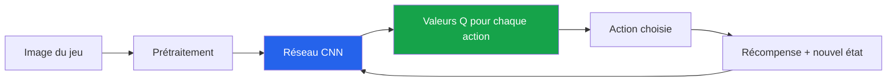
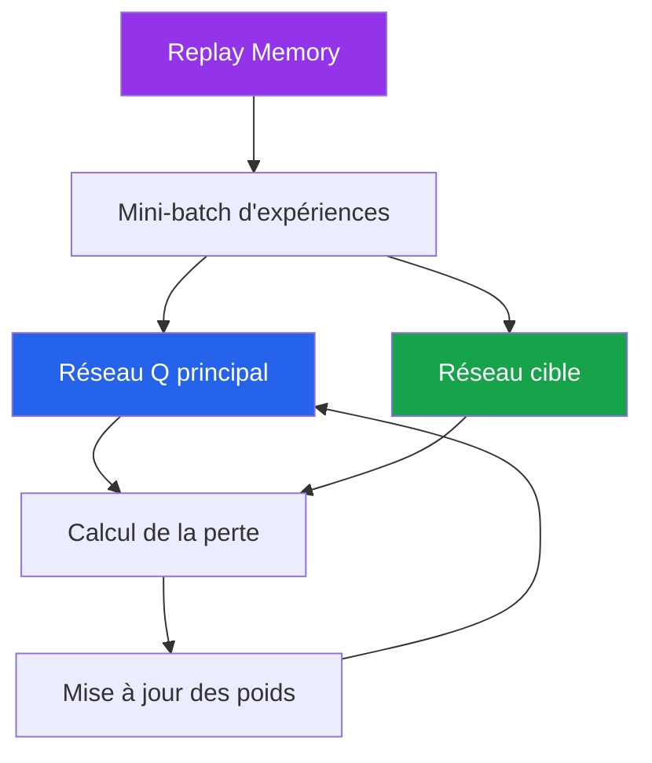
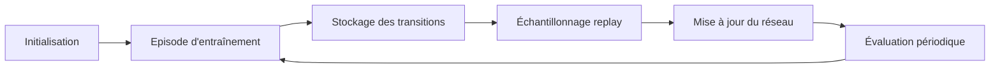

# Exemple de projet - Agent DQN pour un jeu Atari

## Table des matières

| # | Section |
|---|---|
| 1 | [Vue d'ensemble du projet](#section-1) |
| 2 | [Objectifs d'apprentissage](#section-2) |
| 3 | [Modélisation RL](#section-3) |
| 4 | [Architecture DQN](#section-4) |
| 5 | [Étapes de réalisation](#section-5) |
| 6 | [Résultats attendus](#section-6) |
| 7 | [Pourquoi ce projet est important](#section-7) |
| 8 | [Ressources utiles](#section-8) |

---

1 - Vue d'ensemble du projet

 

Dans ce projet, vous développez un agent capable de jouer à un jeu Atari, par exemple **Pong**, en apprenant à partir de ses propres actions. L'agent utilise un **Deep Q-Network (DQN)**, c'est-à-dire une version du Q-Learning où la fonction Q est approximée par un réseau de neurones profond.

> _L'idée principale : au lieu de stocker une table Q pour chaque état possible, l'agent apprend à estimer la valeur des actions directement à partir des images du jeu._

### Mission du projet

| Élément | Description |
|---|---|
| **Environnement** | Jeu Atari via OpenAI Gym / Gymnasium |
| **Agent** | Agent DQN |
| **Observation** | Images du jeu après prétraitement |
| **Actions** | Actions disponibles dans le jeu : monter, descendre, ne rien faire, etc. |
| **Objectif** | Maximiser les récompenses cumulées |
| **Difficulté** | Moyen à avancé |

<a href="#top">Retour en haut</a>

---

2 - Objectifs d'apprentissage

 

Ce projet permet de pratiquer plusieurs notions importantes en apprentissage par renforcement profond.

| Objectif | Description |
|---|---|
| **Comprendre DQN** | Utiliser un réseau neuronal pour approximer Q(s,a) |
| **Prétraiter des observations visuelles** | Convertir, redimensionner et empiler les images |
| **Utiliser l'expérience replay** | Réutiliser les transitions passées pour stabiliser l'apprentissage |
| **Gérer exploration et exploitation** | Utiliser une stratégie epsilon-greedy |
| **Évaluer un agent entraîné** | Mesurer la progression avec des récompenses cumulées |

---

### Concepts clés à expliquer dans le rapport

- Pourquoi une table Q classique n'est pas adaptée aux images.
- Comment le réseau neuronal estime les valeurs Q.
- Pourquoi la mémoire de relecture améliore la stabilité.
- Comment `epsilon` influence le comportement de l'agent.
- Comment mesurer si l'agent apprend réellement.

<a href="#top">Retour en haut</a>

---

3 - Modélisation RL

 

### Composantes du problème

| Composante | Description dans le projet |
|---|---|
| **Agent** | Le joueur contrôlé par l'algorithme DQN |
| **Environnement** | Le jeu Atari choisi, par exemple Pong |
| **État** | Une séquence d'images prétraitées représentant la situation actuelle |
| **Action** | Une commande possible dans le jeu |
| **Récompense** | Score gagné, point marqué, pénalité ou progression dans le jeu |
| **Politique** | Stratégie epsilon-greedy basée sur les valeurs Q prédites |

---

### Prétraitement des observations

Les images brutes du jeu sont souvent trop grandes et contiennent des informations inutiles. Il faut donc les transformer avant de les donner au réseau.

| Étape | Rôle |
|---|---|
| **Conversion en niveaux de gris** | Réduire la complexité des images |
| **Redimensionnement** | Accélérer l'entraînement |
| **Normalisation** | Stabiliser les valeurs d'entrée |
| **Empilement de frames** | Donner à l'agent une notion de mouvement |

> _Une seule image ne suffit pas toujours à connaître la direction d'une balle. En empilant plusieurs images successives, l'agent peut déduire la vitesse et la trajectoire._

<a href="#top">Retour en haut</a>

---

4 - Architecture DQN

 

Un agent DQN repose généralement sur quatre éléments principaux.

| Élément | Rôle |
|---|---|
| **Réseau CNN** | Analyse les images et prédit les valeurs Q |
| **Replay Memory** | Stocke les expériences `(s, a, r, s')` |
| **Target Network** | Stabilise l'apprentissage en fournissant des cibles moins instables |
| **Stratégie epsilon-greedy** | Équilibre exploration et exploitation |

### Hyperparamètres à documenter

| Hyperparamètre | Exemple de rôle |
|---|---|
| **Learning rate** | Vitesse d'ajustement du réseau |
| **Gamma** | Importance des récompenses futures |
| **Epsilon initial/final** | Niveau d'exploration |
| **Batch size** | Nombre d'expériences utilisées par mise à jour |
| **Taille du replay buffer** | Quantité d'expériences conservées |
| **Fréquence de mise à jour du target network** | Stabilité de l'apprentissage |

<a href="#top">Retour en haut</a>

---

5 - Étapes de réalisation

 

| Étape | Travail à réaliser |
|---|---|
| **1. Configurer l'environnement** | Charger le jeu Atari et vérifier que l'environnement fonctionne |
| **2. Prétraiter les observations** | Ajouter les wrappers : niveaux de gris, redimensionnement, frame stacking |
| **3. Implémenter l'agent DQN** | Construire le réseau CNN et la logique de choix d'action |
| **4. Ajouter la mémoire de relecture** | Stocker et échantillonner les transitions |
| **5. Entraîner l'agent** | Lancer plusieurs épisodes et ajuster les hyperparamètres |
| **6. Évaluer l'agent** | Tester la politique entraînée avec peu ou pas d'exploration |
| **7. Analyser les résultats** | Présenter courbes, observations et limites |

---

### Exemple de pipeline expérimental

<a href="#top">Retour en haut</a>

---

6 - Résultats attendus

 

### Livrables

| Livrable | Contenu attendu |
|---|---|
| **Code complet et fonctionnel** | Environnement configuré, agent DQN, entraînement et évaluation |
| **Rapport d'analyse** | Explication des choix techniques, hyperparamètres, résultats et limites |
| **Démo optionnelle** | Vidéo, GIF ou démonstration montrant l'agent en action |

---

### Métriques recommandées

| Métrique | Utilité |
|---|---|
| **Récompense cumulée par épisode** | Mesurer la progression globale |
| **Score moyen sur N épisodes** | Réduire l'effet du hasard |
| **Courbe d'epsilon** | Montrer la transition exploration → exploitation |
| **Temps d'entraînement** | Discuter du coût computationnel |
| **Comparaison avec politique aléatoire** | Montrer que l'agent apprend mieux qu'un hasard pur |

### Analyse attendue

Votre rapport doit répondre à ces questions :

- L'agent s'améliore-t-il au fil des épisodes ?
- Les récompenses sont-elles stables ou très variables ?
- Quels hyperparamètres ont eu le plus d'impact ?
- Quelles limites observez-vous ?
- Que faudrait-il améliorer avec plus de temps ?

<a href="#top">Retour en haut</a>

---

7 - Pourquoi ce projet est important

 

Ce projet est une introduction concrète à l'un des concepts les plus influents de l'intelligence artificielle moderne : l'**apprentissage par renforcement profond**.

| Domaine | Exemple d'application |
|---|---|
| **Jeux vidéo** | Agents capables d'apprendre à jouer à partir de pixels |
| **Robotique** | Contrôle moteur à partir de capteurs |
| **Finance** | Décisions séquentielles sous incertitude |
| **Transport** | Navigation autonome et prise de décision |
| **Systèmes industriels** | Optimisation de processus complexes |

> _Même si l'environnement est un jeu, les concepts appris sont transférables à plusieurs problèmes réels : perception, décision, apprentissage par essai-erreur et optimisation à long terme._

<a href="#top">Retour en haut</a>

---

8 - Ressources utiles

 

| Ressource | Lien |
|---|---|
| **OpenAI Gym / Gymnasium** | [https://www.gymlibrary.dev](https://www.gymlibrary.dev) |
| **Article DQN original** | [Playing Atari with Deep Reinforcement Learning](https://arxiv.org/abs/1312.5602) |
| **Documentation Keras** | [https://keras.io](https://keras.io) |
| **Tutoriel DQN PyTorch** | [Reinforcement Q-Learning](https://pytorch.org/tutorials/intermediate/reinforcement_q_learning.html) |

---

### Conseil final

Commencez avec une version simple et vérifiez rapidement que l'agent peut interagir avec l'environnement. Ajoutez ensuite progressivement le prétraitement, le replay buffer, le réseau cible et les visualisations.

<a href="#top">Retour en haut</a>

