<a id="top"></a>

# Chapitre 24 - DQN — Quand le Deep Learning rencontre le Q-Learning

## Table des matières

| # | Section |
|---|---|
| 1 | [Vue d'ensemble — Qu'est-ce que DQN ?](#section-1) |
| 1a | &nbsp;&nbsp;&nbsp;↳ [Pourquoi le nom « DQN » ?](#section-1) |
| 1b | &nbsp;&nbsp;&nbsp;↳ [Position de DQN dans la famille du RL](#section-1) |
| 1c | &nbsp;&nbsp;&nbsp;↳ [Le moment historique : Atari 2013](#section-1) |
| 2 | [Pourquoi DQN ? Les limites du Q-Learning tabulaire](#section-2) |
| 2a | &nbsp;&nbsp;&nbsp;↳ [L'explosion combinatoire des états](#section-2) |
| 2b | &nbsp;&nbsp;&nbsp;↳ [De la table à la fonction approximée](#section-2) |
| 3 | [L'équation DQN décortiquée terme par terme](#section-3) |
| 3a | &nbsp;&nbsp;&nbsp;↳ [La fonction de perte (loss)](#section-3) |
| 3b | &nbsp;&nbsp;&nbsp;↳ [La descente de gradient](#section-3) |
| 4 | [Les 3 innovations clés de DQN](#section-4) |
| 4a | &nbsp;&nbsp;&nbsp;↳ [Experience Replay (Replay Buffer)](#section-4) |
| 4b | &nbsp;&nbsp;&nbsp;↳ [Target Network (Réseau cible)](#section-4) |
| 4c | &nbsp;&nbsp;&nbsp;↳ [Preprocessing & Frame Stacking](#section-4) |
| 5 | [Architecture du réseau de neurones](#section-5) |
| 5a | &nbsp;&nbsp;&nbsp;↳ [MLP pour CartPole (états simples)](#section-5) |
| 5b | &nbsp;&nbsp;&nbsp;↳ [CNN pour Atari (états images)](#section-5) |
| 6 | [Algorithme DQN pas à pas](#section-6) |
| 7 | [Exemple pédagogique — Une mise à jour DQN calculée à la main](#section-7) |
| 8 | [Extensions modernes — La famille Rainbow](#section-8) |
| 8a | &nbsp;&nbsp;&nbsp;↳ [Double DQN (résout la surestimation)](#section-8) |
| 8b | &nbsp;&nbsp;&nbsp;↳ [Dueling DQN (sépare V et A)](#section-8) |
| 8c | &nbsp;&nbsp;&nbsp;↳ [Prioritized Experience Replay (PER)](#section-8) |
| 8d | &nbsp;&nbsp;&nbsp;↳ [Rainbow DQN — Tout combiné](#section-8) |
| 9 | [Implémentation Python complète et exécutable](#section-9) |
| 9a | &nbsp;&nbsp;&nbsp;↳ [Le réseau Q en PyTorch](#section-9) |
| 9b | &nbsp;&nbsp;&nbsp;↳ [Le Replay Buffer](#section-9) |
| 9c | &nbsp;&nbsp;&nbsp;↳ [L'agent DQN complet](#section-9) |
| 9d | &nbsp;&nbsp;&nbsp;↳ [Boucle d'entraînement sur CartPole](#section-9) |
| 10 | [Quand utiliser DQN ? Forces, limites et alternatives](#section-10) |
| 11 | [Quiz — DQN en profondeur](#section-11) |
| 12 | [Synthèse du chapitre](#section-12) |

---

## Équations de référence

<a id="eq-q-bellman"></a>

**Éq. (1)** — Équation de Bellman optimale pour Q (rappel)

$$Q^{\ast}(s, a) = \mathbb{E}\left[ r + \gamma \max_{a'} Q^{\ast}(s', a') \,\middle|\, s, a \right]$$

<a id="eq-qlearning-tabulaire"></a>

**Éq. (2)** — Mise à jour Q-Learning tabulaire (rappel)

$$Q(s, a) \leftarrow Q(s, a) + \alpha \left[ r + \gamma \max_{a'} Q(s', a') - Q(s, a) \right]$$

<a id="eq-q-approx"></a>

**Éq. (3)** — Approximation par un réseau de neurones

$$Q(s, a) \approx Q_\theta(s, a)$$

où $\theta$ représente l'ensemble des **poids du réseau de neurones**.

<a id="eq-dqn-target"></a>

**Éq. (4)** — Cible TD de DQN (TD Target)

$$y_t = r_t + \gamma \max_{a'} Q_{\theta^{-}}(s_{t+1}, a')$$

avec $\theta^{-}$ = poids du **target network** (réseau cible figé), distinct de $\theta$.

<a id="eq-dqn-loss"></a>

**Éq. (5)** — Fonction de perte de DQN (MSE / Huber)

$$\mathcal{L}(\theta) = \mathbb{E}_{(s, a, r, s') \sim \mathcal{D}} \left[ \left( y_t - Q_\theta(s, a) \right)^2 \right]$$

où $\mathcal{D}$ = **replay buffer** (mémoire d'expériences).

<a id="eq-dqn-gradient"></a>

**Éq. (6)** — Mise à jour des poids par descente de gradient

$$\theta \leftarrow \theta - \eta \, \nabla_\theta \mathcal{L}(\theta)$$

avec $\eta$ = **learning rate** de l'optimiseur (Adam, RMSProp...).

<a id="eq-td-error-dqn"></a>

**Éq. (7)** — Erreur TD de DQN (utile pour PER)

$$\delta_t = r_t + \gamma \max_{a'} Q_{\theta^{-}}(s_{t+1}, a') - Q_\theta(s_t, a_t)$$

<a id="eq-target-update"></a>

**Éq. (8)** — Mise à jour du target network (hard update)

$$\theta^{-} \leftarrow \theta \quad \text{tous les } C \text{ pas}$$

ou en variante **soft update** (Polyak averaging) :

$$\theta^{-} \leftarrow \tau\, \theta + (1 - \tau)\, \theta^{-}, \quad \tau \ll 1$$

<a id="eq-epsilon-greedy-dqn"></a>

**Éq. (9)** — Politique ε-greedy (utilisée par DQN)

- Avec probabilité $1 - \varepsilon$ : $a_t = \arg\max_a Q_\theta(s_t, a)$ (exploitation)
- Avec probabilité $\varepsilon$ : $a_t$ tiré uniformément (exploration)

<a id="eq-epsilon-decay"></a>

**Éq. (10)** — Décroissance linéaire de ε

$$\varepsilon_t = \max(\varepsilon_{\min},\; \varepsilon_0 - t \cdot \Delta\varepsilon)$$

ou en décroissance exponentielle : $\varepsilon_t = \max(\varepsilon_{\min},\; \varepsilon_0 \cdot \kappa^t)$.

<a id="eq-double-dqn"></a>

**Éq. (11)** — Cible de **Double DQN** (corrige la surestimation)

$$y_t^{\text{Double}} = r_t + \gamma\, Q_{\theta^{-}}\!\left(s_{t+1},\, \arg\max_{a'} Q_\theta(s_{t+1}, a')\right)$$

→ Le choix de l'action utilise $\theta$ (réseau en ligne), l'évaluation utilise $\theta^{-}$ (réseau cible). C'est **le seul changement** vs DQN standard.

<a id="eq-dueling"></a>

**Éq. (12)** — Décomposition **Dueling DQN** : $Q = V + A$

$$Q_\theta(s, a) = V_\theta(s) + \left( A_\theta(s, a) - \frac{1}{|\mathcal{A}|} \sum_{a'} A_\theta(s, a') \right)$$

où $V(s)$ = valeur de l'état, $A(s, a)$ = avantage de l'action sur la moyenne.

<a id="eq-per-priority"></a>

**Éq. (13)** — Priorité dans **Prioritized Experience Replay (PER)**

$$p_i = |\delta_i| + \epsilon, \qquad P(i) = \frac{p_i^{\alpha}}{\sum_k p_k^{\alpha}}$$

où $\alpha$ contrôle le degré de priorisation ($\alpha = 0$ = uniforme, $\alpha = 1$ = entièrement proportionnel).

<a id="eq-huber"></a>

**Éq. (14)** — Perte de **Huber** (utilisée en pratique pour la stabilité)

$$\mathcal{L}_{\text{Huber}}(\delta) = \begin{cases} \frac{1}{2} \delta^2 & \text{si } |\delta| \leq 1 \\ |\delta| - \frac{1}{2} & \text{sinon} \end{cases}$$

→ Quadratique près de 0, linéaire pour grandes erreurs : **robuste aux outliers** dans le replay buffer.

<a id="eq-dqn-vs-q"></a>

**Éq. (15)** — La différence essentielle Q-Learning tabulaire ↔ DQN

$$\text{Q-Learning tabulaire :} \quad Q(s, a) \in \mathbb{R}^{|\mathcal{S}| \times |\mathcal{A}|} \text{ (table)}$$

$$\text{DQN :} \quad Q_\theta(s, a) \text{ approximé par un réseau de neurones de poids } \theta$$

→ DQN **généralise** : un état jamais vu peut être évalué grâce à la similarité avec des états appris.

> _Toutes les équations utilisées dans le chapitre sont rassemblées ci-dessus. Dans les sections, on renvoie à leur numéro plutôt que de les réécrire à chaque endroit._

---

<a id="section-1"></a>

<details>
<summary>1 — Vue d'ensemble — Qu'est-ce que DQN ?</summary>

<br/>

**DQN** (*Deep Q-Network*) est un algorithme d'apprentissage par renforcement qui **fusionne deux mondes** : le **Q-Learning** classique (du chapitre 12) et le **Deep Learning** (réseaux de neurones profonds). C'est l'algorithme historique qui a permis, pour la première fois en 2013, à une IA d'**apprendre à jouer à des jeux vidéo Atari directement à partir des pixels de l'écran**, au niveau d'un joueur humain expert.

> **💡 Astuce**
> **Vie réelle — DQN, c'est Q-Learning avec un cerveau au lieu d'un cahier.**
>
> Imaginez un débutant aux échecs qui note dans un cahier la meilleure réponse pour **chaque position** rencontrée. Avec 10⁴⁵ positions d'échecs possibles, son cahier serait plus grand que l'univers — c'est ce que fait Q-Learning **tabulaire** (une case par couple état-action).
>
> Maintenant, imaginez un joueur expérimenté qui **n'a jamais vu cette position exacte**, mais qui sait reconnaître des **structures** : « le roi est exposé, l'adversaire a deux tours alignées, donc je dois défendre cette colonne ». Il **généralise** depuis ses expériences passées vers des situations nouvelles. C'est ce que fait **DQN** avec son réseau de neurones : un « cerveau » qui apprend les **patterns** au lieu de mémoriser chaque cas.

> **❓ FAQ**
>
> **Q : Pourquoi a-t-on besoin de DQN si Q-Learning existe déjà ?**
> R : Q-Learning fonctionne très bien dans des **petits environnements** (GridWorld, CliffWalking, FrozenLake). Mais dès que l'état devient complexe (image 84×84 pixels en niveaux de gris = $256^{84 \times 84} \approx 10^{16985}$ états possibles !), la **table Q devient inutilisable**. DQN remplace la table par un **réseau de neurones** qui apprend une **fonction continue** de l'état vers la valeur Q. Plus besoin de stocker chaque cas — le réseau **généralise**.
>
> **Q : DQN remplace-t-il complètement Q-Learning ?**
> R : Non. DQN est une **extension** : il garde la **logique mathématique** de Q-Learning (équation de Bellman, cible $r + \gamma \max Q$, politique ε-greedy) mais change la **représentation** de Q (table → réseau de neurones). C'est pourquoi on parle parfois de **« Deep Q-Learning »** comme synonyme de DQN.
>
> **Q : Quelle est la grande idée révolutionnaire de DQN ?**
> R : Combiner trois ingrédients pour stabiliser l'entraînement :
> 1. **Experience Replay** (rejouer des expériences passées au lieu d'apprendre seulement sur la transition courante)
> 2. **Target Network** (un réseau « cible » figé qui sert de référence stable)
> 3. **Preprocessing d'images** (CNN pour Atari, frame stacking pour capturer le mouvement)
>
> Sans ces 3 innovations, le simple fait de remplacer la table par un réseau **diverge presque toujours**. C'est l'apport principal du papier DeepMind 2013/2015.

---

### Pourquoi le nom « DQN » ?

**DQN = Deep Q-Network** — littéralement « **réseau Q profond** ».

| Lettre | Signification | Rôle |
|:--:|---|---|
| **D** | Deep (profond) | Le réseau a plusieurs couches (typiquement 2-3 pour les états vectoriels, 5+ pour les images) |
| **Q** | Q-function | C'est la **fonction d'action-valeur** $Q(s, a)$ que l'on approxime |
| **N** | Network (réseau) | Réseau de neurones (MLP, CNN, ou Transformer selon le cas) |

> **📌 À retenir**
> **L'équation centrale.** DQN remplace simplement la **table Q** par une **fonction paramétrée** : $Q(s, a) \approx Q_\theta(s, a)$ (voir [**Éq. (3)**](#eq-q-approx)). Tout le reste — la cible TD, la politique ε-greedy, l'idée de Bellman — reste **identique** à Q-Learning. La grande nouveauté n'est pas mathématique, elle est **algorithmique** : comment entraîner ce réseau **sans qu'il diverge**.

---

### Position de DQN dans la famille du RL

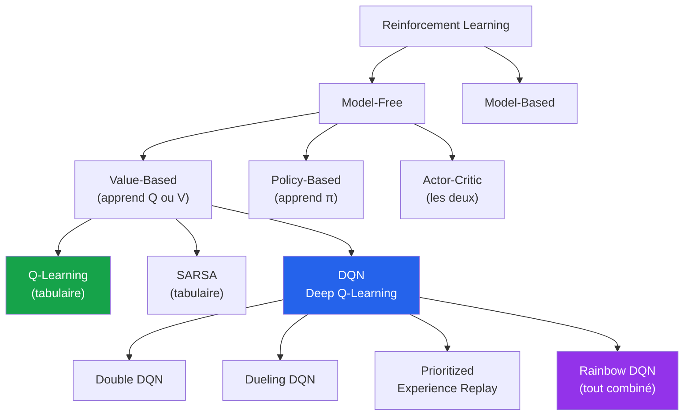

| Aspect | DQN |
|---|---|
| **Famille** | Deep Reinforcement Learning, Value-Based, Off-Policy |
| **Type de politique** | **Off-Policy** (comme Q-Learning) |
| **Ce qui est appris** | $Q_\theta(s, a)$ — fonction d'action-valeur approximée par un réseau |
| **Inventeurs** | Mnih, Kavukcuoglu et al. (DeepMind, 2013/2015) |
| **Papier fondateur** | « Playing Atari with Deep Reinforcement Learning » (NIPS 2013), puis « Human-level control through deep reinforcement learning » (Nature 2015) |
| **Cousin direct** | Double DQN, Dueling DQN, Rainbow |
| **Successeurs modernes** | C51, IQN, R2D2, MuZero (lignée DeepMind) |

---

### Le moment historique : Atari 2013

En **décembre 2013**, l'équipe **DeepMind** (alors une petite startup londonienne d'une trentaine de personnes) publie un papier qui change l'histoire de l'IA. Pour la première fois, **un seul algorithme** apprend à jouer à **49 jeux Atari différents** (Breakout, Space Invaders, Pong, Q*bert...) sans qu'on lui dise les règles, **uniquement à partir des pixels et du score**.

| Jeu | Score humain expert | Score DQN | Performance |
|---|---|---|---|
| **Breakout** | 31 | 401 | **1295%** |
| **Pong** | 9.3 | 18.9 | **203%** |
| **Boxing** | 12.1 | 71.8 | **594%** |
| **Space Invaders** | 1652 | 1976 | **121%** |
| **Q\*bert** | 13455 | 4500 | 33% (échec relatif) |
| **Montezuma's Revenge** | 4367 | 0 | **0% (échec total)** |

> **ℹ️ Remarque**
> **Anecdote.** En janvier 2014, **3 semaines après la publication du papier**, Google rachète DeepMind pour **500 millions de dollars** — sans même qu'ils aient un produit commercial. Le pari de Google : si une IA peut apprendre à jouer à Breakout sans qu'on lui montre comment, elle pourra **apprendre n'importe quoi**. Cet investissement a directement mené à **AlphaGo (2016)**, **AlphaZero (2017)**, **AlphaFold (2020)** et plus récemment **Gemini**.

> **💡 Astuce**
> **Vie réelle — Pourquoi Atari et pas un « vrai » problème ?**
>
> Les jeux Atari sont **parfaits pour la recherche en RL** :
>
> - **Simples visuellement** (210×160 pixels) mais riches en stratégies
> - **Récompense bien définie** (le score à l'écran)
> - **Reproductibles** (un émulateur, pas un robot qui casse)
> - **Diversifiés** (49 jeux différents = test de généralisation)
> - **Référence connue** (scores humains documentés depuis 30 ans)
>
> C'est l'équivalent de **MNIST en computer vision** : le benchmark de référence sur lequel **tous les nouveaux algorithmes de RL** se comparent encore aujourd'hui.

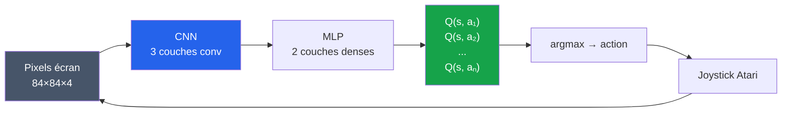

</details>

<p align="right"><a href="#top">↑ Retour en haut</a></p>

---

<a id="section-2"></a>

<details>
<summary>2 — Pourquoi DQN ? Les limites du Q-Learning tabulaire</summary>

<br/>

Pour comprendre **pourquoi DQN existe**, il faut comprendre **pourquoi Q-Learning tabulaire échoue** dans les environnements réalistes. C'est une histoire d'**explosion combinatoire** et de **généralisation**.

### L'explosion combinatoire des états

Q-Learning classique stocke une valeur dans une **table** : une case par couple $(s, a)$. Tant que l'environnement reste petit, ça fonctionne. Mais regardez ce qui se passe quand on monte en complexité :

| Environnement | Nombre d'états | Nombre d'actions | Taille de la table Q | Faisable ? |
|---|---|---|---|---|
| **GridWorld 4×4** | 16 | 4 | 64 | ✅ Trivial |
| **CliffWalking 4×12** | 48 | 4 | 192 | ✅ Trivial |
| **Échecs** | $\approx 10^{45}$ | $\approx 35$ | $\approx 10^{47}$ | ❌ Impossible |
| **Go** | $\approx 10^{170}$ | $\approx 250$ | $\approx 10^{172}$ | ❌ Impossible |
| **Atari (84×84 pixels niveaux de gris)** | $256^{84 \times 84} \approx 10^{16985}$ | $\leq 18$ | $\approx 10^{16986}$ | ❌ Impossible |
| **Voiture autonome (image caméra)** | $\approx 256^{640 \times 480 \times 3} \approx 10^{2 \times 10^6}$ | continu | infini | ❌ Impossible |

> **🛑 Danger**
> **L'univers entier contient $\approx 10^{80}$ atomes.** Stocker une table Q pour Atari demanderait **plus d'« atomes virtuels » que d'atomes physiques existants**. Q-Learning tabulaire est **mathématiquement impossible** sur ces problèmes — il faut absolument changer d'approche.

> **❓ FAQ**
>
> **Q : Pourquoi parle-t-on d'« explosion combinatoire » ?**
> R : Parce que le nombre d'états **explose exponentiellement** quand on ajoute de l'information :
> - 1 case 4×4 → 16 états
> - 4 cases 4×4 indépendantes → $16^4 = 65\,536$ états
> - Image 84×84 avec 256 niveaux de gris → $256^{84 \times 84}$ états
>
> À chaque pixel ajouté, le nombre d'états est **multiplié par 256**. C'est ce qu'on appelle la **« malédiction de la dimensionnalité »** (curse of dimensionality, Bellman 1957).
>
> **Q : Ne pourrait-on pas juste avoir une « grosse » table Q sur un cluster de serveurs ?**
> R : **Non, même pas sur tous les serveurs du monde.** Et ce n'est pas le seul problème :
>
> 1. **Mémoire** : $10^{16985}$ valeurs ne tiennent dans aucun ordinateur
> 2. **Visites nécessaires** : pour estimer une valeur Q correctement, il faut **visiter chaque case plusieurs fois**. Atari : visiter $10^{16985}$ états plusieurs fois = **temps d'entraînement supérieur à l'âge de l'univers**
> 3. **Aucune généralisation** : si vous avez vu un état proche mais pas exactement le même, la table ne vous aide pas du tout
>
> C'est pour ça que la solution n'est pas « plus de mémoire » mais « **un autre paradigme** » : la **fonction approximative**.

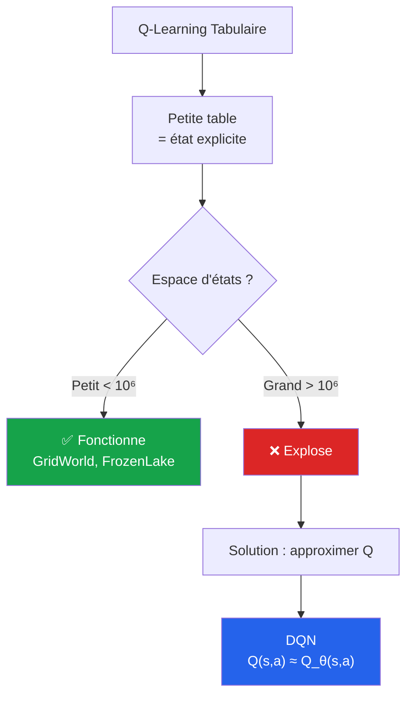

---

### De la table à la fonction approximée

L'idée révolutionnaire (mais simple) de DQN : **remplacer la table par une fonction paramétrée** — voir [**Éq. (3)**](#eq-q-approx).

| Aspect | Q-Learning tabulaire | DQN |
|---|---|---|
| **Représentation de Q** | Table de taille $\|\mathcal{S}\| \times \|\mathcal{A}\|$ | Réseau de neurones de poids $\theta$ |
| **Mémoire requise** | $\propto \|\mathcal{S}\| \times \|\mathcal{A}\|$ | $\propto$ taille du réseau (fixe) |
| **Visite des états** | Chaque état doit être visité plusieurs fois | Le réseau **généralise** à partir d'états voisins |
| **États jamais vus** | $Q(s, a) = 0$ (valeur initiale, inutile) | $Q_\theta(s, a)$ raisonnable par généralisation |
| **Convergence** | Garantie sous Robbins-Monro | **Aucune garantie** (heuristiques nécessaires) |
| **Calculs par update** | $O(1)$ — accès direct à la case | $O(\text{taille réseau})$ — forward + backward pass |

> **💡 Astuce**
> **Métaphore — Du dictionnaire au traducteur.**
>
> - **Q-Learning tabulaire** = un **dictionnaire bilingue** : pour chaque mot français, une entrée précise donnant la traduction anglaise. Précis, mais inutile si le mot n'est pas dans le dictionnaire.
> - **DQN** = un **traducteur humain** : il a appris des **règles grammaticales et patterns** depuis des milliers d'exemples. Même un mot jamais vu (« smartphone »), il peut le traduire raisonnablement par **généralisation**.
>
> C'est exactement le passage paradigmatique : **mémoriser → apprendre à généraliser**. DQN est l'algorithme qui formalise ce passage pour le RL.

> **📌 À retenir**
> **Le prix de la généralisation.** En remplaçant la table par un réseau, on **gagne** :
>
> - ✅ La capacité à traiter des espaces d'états gigantesques (Atari, robots, voitures)
> - ✅ La **généralisation** à des états jamais vus
> - ✅ Une **mémoire bornée** (fixée par la taille du réseau)
>
> Mais on **perd** :
>
> - ❌ Les **garanties théoriques** de convergence (un réseau peut diverger)
> - ❌ La **lecture explicite** des valeurs (les poids du réseau ne sont pas interprétables)
> - ❌ La **rapidité d'apprentissage** sur les petits problèmes (overhead du réseau)
>
> C'est pourquoi DQN doit ajouter **3 innovations clés** (Section 4) pour compenser les pertes — sans elles, l'entraînement diverge.

### Pourquoi un réseau de neurones « diverge » naturellement ?

Trois problèmes apparaissent quand on remplace naïvement la table par un réseau :

| Problème | Description | Solution dans DQN |
|---|---|---|
| **1. Données corrélées** | Les transitions successives $(s_t, a_t, s_{t+1})$ sont **fortement corrélées**. Un réseau entraîné sur des données corrélées **overfit** sur la séquence courante | **Experience Replay** (Section 4a) |
| **2. Cible mobile** | La cible TD $r + \gamma \max_{a'} Q_\theta(s', a')$ utilise **les mêmes poids** $\theta$ que ceux qu'on optimise → on « court derrière soi-même » | **Target Network** (Section 4b) |
| **3. Distribution non i.i.d.** | Le RL viole l'hypothèse d'indépendance des échantillons (la distribution des états change avec la politique) | **Replay aléatoire** + **ε-greedy** + **frame stacking** |

> **🛑 Danger**
> **Erreur fréquente en première implémentation.** Beaucoup de débutants codent DQN « naïvement » — un réseau + Q-Learning standard, sans replay buffer ni target network — et observent que **la performance s'écroule après quelques épisodes**. Le réseau diverge littéralement (les valeurs Q explosent vers ±∞). Les 3 innovations de DeepMind ne sont **pas optionnelles**, elles sont **indispensables**.

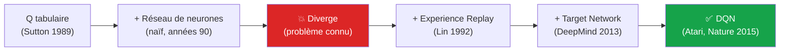

</details>

<p align="right"><a href="#top">↑ Retour en haut</a></p>

---

<a id="section-3"></a>

<details>
<summary>3 — L'équation DQN décortiquée terme par terme</summary>

<br/>

➡️ Voir [**Éq. (5) — Fonction de perte de DQN**](#eq-dqn-loss) en haut du document.

Contrairement à Q-Learning tabulaire qui a une **mise à jour directe** ([Éq. 2](#eq-qlearning-tabulaire)), DQN passe par une **fonction de perte** (loss) qu'on minimise par **descente de gradient**. C'est le passage du « j'écris la nouvelle valeur dans la case » au « j'ajuste les poids du réseau pour que la prédiction se rapproche de la cible ».

### Décomposition visuelle

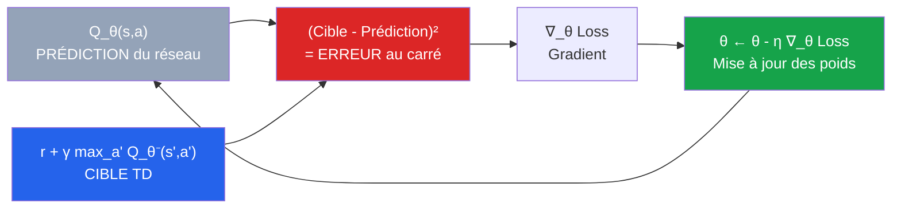

### Les 6 termes essentiels

| Terme | Lecture | Signification physique |
|---|---|---|
| $Q_\theta(s, a)$ | « Q-thêta de s, a » | La **prédiction du réseau** : ce qu'il pense actuellement valoir l'action $a$ depuis $s$ |
| $r$ | « r » | La **récompense** observée |
| $\gamma$ | « gamma » | Le facteur d'escompte (0 à 1, typiquement 0.99) |
| $\max_{a'} Q_{\theta^{-}}(s', a')$ | « max sur a' de Q-thêta-moins » | La **meilleure valeur estimée** dans l'état suivant, par le **target network** |
| $y_t = r + \gamma \max_{a'} Q_{\theta^{-}}(s', a')$ | **Cible TD** | Ce que l'on **voudrait** que $Q_\theta(s, a)$ vaille |
| $\mathcal{L}(\theta) = (y_t - Q_\theta(s, a))^2$ | **Loss MSE** | L'erreur quadratique entre prédiction et cible |

> **📌 À retenir**
> **Différence fondamentale avec Q-Learning tabulaire.** Dans Q-Learning, on **écrit** directement la nouvelle valeur dans une case ([Éq. 2](#eq-qlearning-tabulaire)). Dans DQN, on calcule une **erreur** ([Éq. 5](#eq-dqn-loss)), on calcule son **gradient par rapport aux poids du réseau**, et on **descend** dans la direction du gradient. La valeur Q n'est jamais « écrite » — elle **émerge** des poids du réseau.

### Lecture en mots

> _« Mon réseau prédit que $Q_\theta(s, a) = 3.2$. Mais d'après l'expérience qui vient de se passer (récompense $r$, état suivant $s'$), je crois maintenant que ça vaut plutôt $y_t = 4.1$. Donc je calcule l'erreur $(4.1 - 3.2)^2 = 0.81$ et je modifie **légèrement** les poids du réseau pour que sa prochaine prédiction sur $(s, a)$ soit plus proche de 4.1. »_

---

### La fonction de perte (loss)

➡️ Voir [**Éq. (5)**](#eq-dqn-loss). La loss de DQN est typiquement la **MSE (Mean Squared Error)** :

$$\mathcal{L}(\theta) = \frac{1}{|\mathcal{B}|} \sum_{(s,a,r,s') \in \mathcal{B}} \left[ y_t - Q_\theta(s, a) \right]^2$$

où $\mathcal{B}$ est un **mini-batch** d'expériences tirées au hasard du replay buffer.

> **⚠️ Attention**
> **MSE vs Huber.** En pratique, on utilise souvent la **perte de Huber** ([Éq. 14](#eq-huber)) au lieu de la MSE pure. Pourquoi ?
>
> - La MSE pénalise **quadratiquement** les grosses erreurs → si une transition rare a une cible TD très différente, son gradient est énorme → le réseau saute brutalement
> - La Huber est **quadratique près de 0** mais **linéaire pour les grosses erreurs** → robuste aux outliers, gradients bornés
>
> Sur Atari, la perte de Huber **améliore significativement la stabilité**. C'est un des « petits secrets » qui ne sont pas dans le papier original mais qui font la différence en pratique.

### Pourquoi pas un simple `Q[s][a] = target` ?

C'est **la question naturelle** que se posent tous les débutants. Réponse :

| Approche | Problème |
|---|---|
| **« Forcer » $Q_\theta(s, a) = y_t$** | Le réseau a des **poids partagés** entre tous les $(s, a)$. Modifier un poids pour parfaire un cas casse **tous les autres cas** déjà appris |
| **Descente de gradient** | On bouge les poids dans la direction qui **améliore la prédiction** $(s, a)$ **sans détruire** les autres prédictions (apprentissage progressif) |

> **💡 Astuce**
> **Métaphore — Pourquoi un réseau n'est pas une table.**
>
> Imaginez un sculpteur qui modélise un visage en argile :
>
> - **Table Q (sculpteur Lego)** : chaque trait du visage est une brique indépendante. Vous modifiez un trait → les autres ne bougent pas. Mais il faut **autant de briques que de configurations** possibles.
> - **Réseau de neurones (sculpteur d'argile)** : tout le visage est **une seule pièce d'argile**. Si vous pressez sur le nez, **tout le visage se déforme un peu**. C'est pour ça qu'on doit y aller **doucement, petite touche par petite touche** (= petit learning rate, descente de gradient). Et c'est aussi pour ça qu'on peut sculpter **un visage qu'on n'a jamais vu** en interpolant — c'est la **généralisation**.

---

### La descente de gradient

➡️ Voir [**Éq. (6)**](#eq-dqn-gradient).

À chaque étape d'entraînement :

1. **Forward pass** : on calcule $Q_\theta(s, a)$ pour le batch
2. **Cible** : on calcule $y_t = r + \gamma \max_{a'} Q_{\theta^{-}}(s', a')$ (avec le target network, voir Section 4b)
3. **Loss** : on calcule $\mathcal{L} = \frac{1}{|\mathcal{B}|} \sum (y_t - Q_\theta(s, a))^2$
4. **Backward pass** : on calcule $\nabla_\theta \mathcal{L}$ (gradient automatique avec PyTorch/TF)
5. **Update** : $\theta \leftarrow \theta - \eta \nabla_\theta \mathcal{L}$ (avec Adam, RMSProp, etc.)

> **❓ FAQ**
>
> **Q : Quelle est la différence entre `α` (learning rate de Q-Learning) et `η` (learning rate de DQN) ?**
> R : Conceptuellement, **c'est la même chose** : un coefficient qui contrôle la vitesse d'apprentissage. Mais ils opèrent à des niveaux différents :
> - **α** (Q-Learning) : « **de combien je bouge la valeur Q** vers la cible TD » — directement sur la valeur
> - **η** (DQN) : « **de combien je bouge les poids θ** dans la direction du gradient » — sur les poids du réseau
>
> En pratique, $\eta$ est **beaucoup plus petit** que $\alpha$ : typiquement $\eta = 10^{-4}$ pour DQN, alors qu'on utilise $\alpha = 0.1$ en Q-Learning tabulaire. C'est parce qu'un même $\eta$ modifie **plusieurs millions de poids** simultanément — il faut être **beaucoup plus prudent**.
>
> **Q : Pourquoi a-t-on besoin d'Adam ou RMSProp et pas juste de SGD ?**
> R : Le RL est **bruité** : la même action peut donner des récompenses très différentes (transitions stochastiques, exploration). Adam et RMSProp **adaptent automatiquement** le learning rate par poids, ce qui stabilise l'apprentissage. Sur Atari, Adam ou RMSProp donnent **2 à 5× plus de performance finale** que SGD vanilla — ce n'est pas un détail.
>
> **Q : Que signifie « $\theta^{-}$ » avec le « moins » ?**
> R : C'est la notation pour les **poids du target network** — un réseau **identique** mais **figé** qui n'est mis à jour que **tous les $C$ pas** (typiquement $C = 10\,000$). Voir Section 4b. Le « moins » est un héritage notatif du papier original — certains auteurs préfèrent $\theta^{\text{old}}$ ou $\theta_{\text{target}}$.

### Cas particuliers de $\eta$

| Valeur de $\eta$ | Comportement |
|---|---|
| **$\eta = 10^{-2}$** | Trop grand — le réseau **diverge** (explose) |
| **$\eta = 10^{-3}$** | Limite supérieure pour Adam — peut marcher sur problèmes simples |
| **$\eta = 10^{-4}$** | **Valeur standard DeepMind** — fonctionne pour Atari, CartPole, LunarLander |
| **$\eta = 10^{-5}$** | Très prudent — pour fine-tuning ou problèmes très bruités |

> **🛑 Danger**
> **Erreurs classiques d'implémentation DQN :**
>
> 1. **Learning rate trop élevé** → divergence (les valeurs Q explosent à ±∞ en quelques épisodes)
> 2. **Pas de gradient clipping** → un gradient gigantesque détruit tous les poids en un pas
> 3. **Pas de target network** → l'optimisation tourne en rond, jamais convergente
> 4. **Replay buffer trop petit** → données corrélées, apprentissage instable
> 5. **Pas de normalisation des récompenses Atari** → certains jeux ont des récompenses de ±1 (Pong) d'autres de ±10⁴ (Q*bert) → un seul réseau pour tous les jeux nécessite **clip rewards in [-1, 1]**

</details>

<p align="right"><a href="#top">↑ Retour en haut</a></p>

---

<a id="section-4"></a>

<details>
<summary>4 — Les 3 innovations clés de DQN</summary>

<br/>

Comme vu en Section 2, un réseau de neurones « naïf » sur du Q-Learning **diverge**. Les chercheurs DeepMind ont introduit **3 mécanismes** pour stabiliser l'entraînement. Sans eux, DQN ne fonctionne pas — avec eux, il bat les humains à Atari.

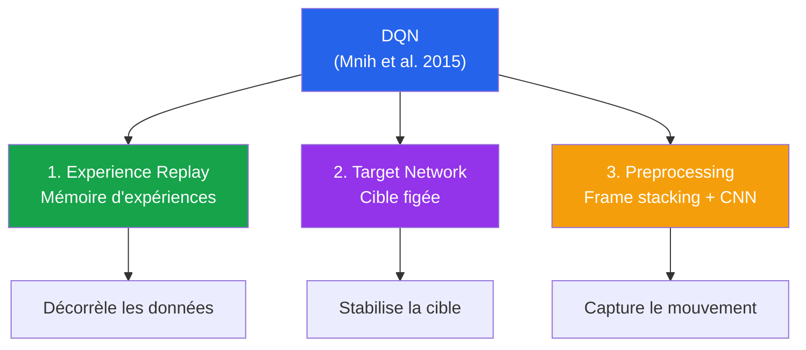

---

### 4a — Experience Replay (Replay Buffer)

**Idée** : au lieu d'apprendre **uniquement** sur la transition qui vient d'arriver, on **stocke toutes les transitions** $(s, a, r, s', \text{done})$ dans un grand **buffer mémoire**, et on **tire des mini-batches au hasard** à chaque étape d'entraînement.

#### Pourquoi c'est crucial ?

| Problème (sans replay) | Solution (avec replay) |
|---|---|
| **Données corrélées** : 2 frames Atari successifs sont quasi identiques → biais d'apprentissage | Tirage **aléatoire** → données décorrélées comme en supervised learning |
| **Apprentissage online** : chaque transition n'est utilisée **qu'une fois** → gaspillage | Chaque transition est rejouée **plusieurs fois** → sample efficiency × 10 |
| **Catastrophic forgetting** : le réseau oublie ce qu'il a appris il y a longtemps | Le buffer **conserve les anciennes expériences** → revoit régulièrement |
| **Distribution non-stationnaire** : la politique change → la distribution des états aussi | Buffer **lissé temporellement** → moyenne sur plusieurs politiques récentes |

#### Structure du buffer

```python
# Pseudo-code
class ReplayBuffer:
    def __init__(self, capacity=100_000):
        self.buffer = deque(maxlen=capacity)
    
    def push(self, s, a, r, s_next, done):
        self.buffer.append((s, a, r, s_next, done))
    
    def sample(self, batch_size=32):
        return random.sample(self.buffer, batch_size)
```

#### Hyperparamètres typiques

| Paramètre | Valeur Atari | Valeur CartPole |
|---|---|---|
| **Taille du buffer** | 1 000 000 transitions | 10 000 à 100 000 |
| **Batch size** | 32 | 32 à 128 |
| **Warm-up** (avant de commencer à apprendre) | 50 000 transitions | 1 000 transitions |
| **Update fréquence** | toutes les 4 frames | tous les pas |

> **💡 Astuce**
> **Vie réelle — Pourquoi le replay buffer ressemble à votre mémoire.**
>
> Quand vous **apprenez une nouvelle compétence** (par exemple, conduire), vous ne réfléchissez pas seulement à ce qui vient de se passer. Votre cerveau **revisite mentalement** les expériences passées — surtout pendant le sommeil REM. C'est exactement le rôle du replay buffer.
>
> Une étude (Lin, 1992) a montré que les rats qui dorment **rejouent dans leur cortex** les trajectoires apprises pendant la journée, à **20× la vitesse réelle**. Le mécanisme du replay buffer s'inspire **directement de la neuroscience** — c'est une vraie inspiration biologique.

> **📌 À retenir**
> **Différence philosophique avec SARSA.** SARSA est **strictly on-policy** : il apprend uniquement sur ce qu'il vient de faire (« je marche et j'apprends en marchant »). DQN, grâce au replay buffer, est **off-policy** : il peut apprendre sur des **expériences anciennes**, voire générées par d'autres politiques (apprentissage par imitation, transfer learning). **C'est cette flexibilité qui rend DQN si puissant** en pratique.

---

### 4b — Target Network (Réseau cible)

**Idée** : utiliser **deux réseaux identiques** :

1. Le réseau **online** ($\theta$) qu'on entraîne à chaque pas
2. Le réseau **target** ($\theta^{-}$) qui sert à **calculer la cible** $y_t$

Le target network est **figé** pendant $C$ pas, puis **synchronisé** avec le réseau online : $\theta^{-} \leftarrow \theta$ (voir [**Éq. (8)**](#eq-target-update)).

#### Pourquoi c'est crucial ?

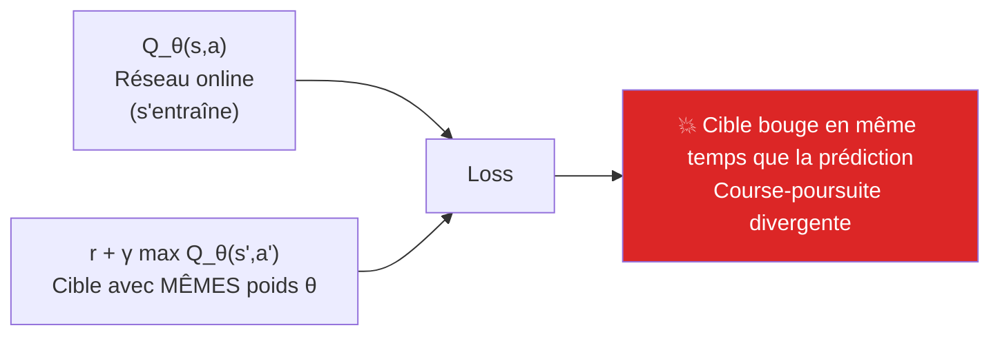

Sans target network : à chaque update, on modifie $\theta$, ce qui **modifie aussi la cible** $y_t$. C'est comme **tirer sur une cible qui bouge en même temps que vous bougez le viseur** — instable.

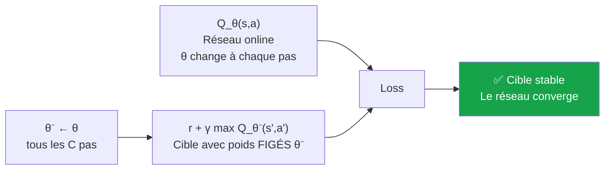

Avec target network : la cible est **stable** pendant $C$ pas. Le réseau online a le temps de **converger vers cette cible** avant qu'elle ne change. C'est comme **tirer sur une cible immobile pendant 10 secondes, puis la déplacer**.

#### Hard update vs Soft update

| Méthode | Formule | Avantage |
|---|---|---|
| **Hard update** | $\theta^{-} \leftarrow \theta$ tous les $C$ pas | Simple, papier original |
| **Soft update (Polyak)** | $\theta^{-} \leftarrow \tau\, \theta + (1 - \tau)\, \theta^{-}$ à chaque pas, $\tau \approx 0.005$ | Plus lisse, utilisé dans DDPG/SAC |

> **❓ FAQ**
>
> **Q : Combien vaut typiquement $C$ ?**
> R : Sur Atari, **$C = 10\,000$** dans le papier original. Sur des problèmes plus simples (CartPole, LunarLander), **$C = 100$ à 1000** suffit. Trop petit ($C < 100$) → cible instable. Trop grand ($C > 50\,000$) → apprentissage très lent (le réseau attend trop longtemps avant de mettre à jour sa cible).
>
> **Q : Le target network double-t-il la mémoire utilisée ?**
> R : **Oui**, il faut stocker deux copies des poids. En pratique, c'est négligeable (un réseau DQN fait quelques MB, même deux copies tiennent largement en mémoire). Le coût computationnel est plus important : le forward pass du target network ajoute ~10-20% au temps d'entraînement.
>
> **Q : Pourquoi ne pas juste utiliser une cible plus ancienne d'1 ou 2 pas ?**
> R : Trop peu d'écart → la cible bouge presque autant. Les expériences DeepMind ont montré que **$C = 10\,000$** donne le meilleur compromis stabilité/vitesse sur Atari. C'est un **hyperparamètre fondamental** à régler par jeu.

> **🛑 Danger**
> **Erreur fatale — utiliser le même réseau pour prédiction et cible.**
>
> ```python
> # ❌ MAUVAIS - même réseau partout
> target = r + gamma * Q_net(s_next).max()  # ← utilise Q_net !
> loss = (Q_net(s)[a] - target) ** 2
> 
> # ✅ BON - target network distinct
> with torch.no_grad():
>     target = r + gamma * target_net(s_next).max()  # ← target_net
> loss = (Q_net(s)[a] - target) ** 2
> ```
>
> L'omission du `with torch.no_grad()` est aussi une **erreur classique** : sans ça, le gradient se propage à travers la cible, ce qui **double l'instabilité** et le coût mémoire.

---

### 4c — Preprocessing & Frame Stacking

**Idée** : les images brutes d'Atari sont trop riches et trop bruitées. On les **prétraite** drastiquement avant de les donner au réseau.

#### Pipeline de preprocessing Atari (papier original)

| Étape | Description | Effet |
|---|---|---|
| **1. Conversion** | RGB (210×160×3) → Niveau de gris (210×160) | Divise les pixels à traiter par 3 |
| **2. Crop** | On garde uniquement la zone de jeu (210×160 → 84×84) | Élimine score, vies, marges |
| **3. Resize** | Bilinéaire vers 84×84 | Taille fixe attendue par le CNN |
| **4. Frame stacking** | 4 frames consécutifs empilés → tenseur 4×84×84 | **Permet de capter le mouvement** |
| **5. Max pooling temporel** | Pour chaque pixel : max sur 2 frames consécutifs | Élimine le clignotement Atari (sprite blink) |
| **6. Skip frames** | L'agent prend une décision toutes les **4 frames** | × 4 vitesse d'entraînement |
| **7. Clip rewards** | $r \in [-1, +1]$ | Normalise tous les jeux à la même échelle |

#### Pourquoi le frame stacking ?

> **❓ FAQ**
>
> **Q : Pourquoi empiler 4 frames au lieu d'en donner une seule au réseau ?**
> R : Avec **une seule image**, le réseau ne peut pas savoir **dans quelle direction bouge la balle** ! Regardez ce frame Pong :
>
> ```
> |     ●           |   ← balle au centre
> |                 |
> | █             █ |   ← raquettes
> ```
>
> Va-t-elle à gauche ? À droite ? Vers le haut ? Impossible à dire avec un seul frame. Avec **4 frames empilés**, le réseau voit l'historique et déduit la trajectoire :
>
> ```
> Frame -3 : balle à gauche
> Frame -2 : balle un peu à droite
> Frame -1 : balle au milieu
> Frame  0 : balle un peu plus à droite
> → conclusion : balle se dirige vers la droite
> ```
>
> C'est l'équivalent du « **observable d'état Markovien** » nécessaire en théorie RL. Une image seule **viole la propriété de Markov** ; 4 frames empilés la **rétablissent**.
>
> **Q : Pourquoi 4 et pas 2 ou 8 ?**
> R : Choix empirique. 2 frames suffisent pour la **vitesse**. 4 frames permettent en plus de capter l'**accélération**. Au-delà de 4-8, le gain devient marginal pour Atari. Pour des jeux 3D plus complexes (DOOM, robotique), on peut aller jusqu'à 16 frames ou utiliser des **architectures récurrentes** (LSTM, DRQN).

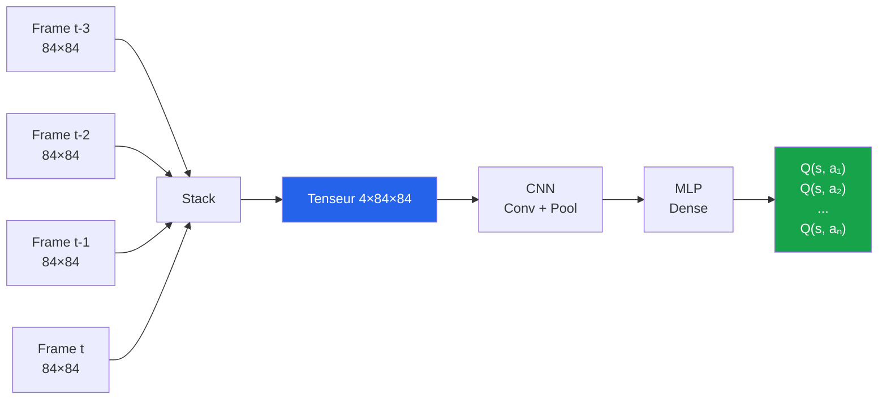

> **💡 Astuce**
> **Vie réelle — Pourquoi nous percevons aussi en frames.**
>
> Votre cerveau fait **exactement la même chose** ! Vos yeux saccadent (mouvements de fixation) et votre cortex visuel **intègre les dernières fractions de seconde** pour percevoir le mouvement. C'est pour ça que le cinéma à 24 fps « marche » : votre cerveau fait du **frame stacking biologique**.
>
> Une expérience célèbre : si on montre **un seul frame d'une scène** à une personne (10 ms), elle reconnaît les objets mais **pas le mouvement**. Avec 4 frames consécutifs (40 ms total), elle perçoit le mouvement et la profondeur. Le frame stacking de DQN reproduit littéralement ce mécanisme cognitif.

> **⚠️ Attention**
> **Sur CartPole, on ne fait pas de frame stacking.** L'état CartPole est déjà un **vecteur structuré** (position du chariot, vitesse, angle du poteau, vitesse angulaire) qui contient **explicitement** la vitesse et l'angle. Pas besoin de stacking. Idem pour LunarLander, MountainCar, etc. Le stacking est spécifique aux **observations d'images**.

</details>

<p align="right"><a href="#top">↑ Retour en haut</a></p>

---

<a id="section-5"></a>

<details>
<summary>5 — Architecture du réseau de neurones</summary>

<br/>

L'architecture du réseau Q dépend du **type d'observation** : vecteur d'état ou image. DQN a fixé des conventions qui restent **standards aujourd'hui**.

### 5a — MLP pour CartPole (états simples)

Pour des environnements à **état vectoriel** (CartPole, LunarLander, Pendulum), un **MLP simple** (perceptron multicouche) suffit.

#### Architecture CartPole

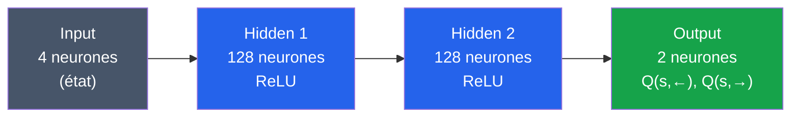

#### Détail des couches

| Couche | Taille entrée | Taille sortie | Fonction d'activation |
|---|---|---|---|
| **Input** | — | 4 (état CartPole) | — |
| **FC1** | 4 | 128 | ReLU |
| **FC2** | 128 | 128 | ReLU |
| **Output** | 128 | 2 (nb actions) | **Linear** (pas d'activation !) |

> **📌 À retenir**
> **La couche de sortie est LINÉAIRE.** C'est une erreur fréquente que de mettre un sigmoïde ou softmax à la sortie d'un réseau Q. **NON** : les Q-valeurs peuvent être **n'importe quel nombre réel** (positif ou négatif, sans borne). Le softmax ne s'applique qu'aux **politiques** (Policy Gradient, PPO), pas aux Q-valeurs.

#### Implémentation PyTorch minimale

```python
import torch.nn as nn

class QNetworkMLP(nn.Module):
    def __init__(self, state_dim=4, action_dim=2, hidden=128):
        super().__init__()
        self.net = nn.Sequential(
            nn.Linear(state_dim, hidden),
            nn.ReLU(),
            nn.Linear(hidden, hidden),
            nn.ReLU(),
            nn.Linear(hidden, action_dim),  # ← pas d'activation finale
        )
    
    def forward(self, x):
        return self.net(x)
```

---

### 5b — CNN pour Atari (états images)

Pour des observations en **images** (Atari, jeux 3D, robotique avec caméra), on utilise un **CNN** (Convolutional Neural Network).

#### Architecture DQN original (Nature 2015)

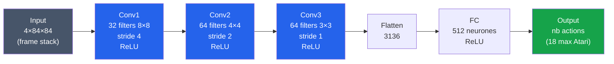

#### Détail des couches

| Couche | Filtres | Taille filtre | Stride | Output shape | Activation |
|---|---|---|---|---|---|
| **Input** | — | — | — | 4×84×84 | — |
| **Conv1** | 32 | 8×8 | 4 | 32×20×20 | ReLU |
| **Conv2** | 64 | 4×4 | 2 | 64×9×9 | ReLU |
| **Conv3** | 64 | 3×3 | 1 | 64×7×7 = **3136 valeurs** | ReLU |
| **Flatten** | — | — | — | 3136 | — |
| **FC** | 512 | — | — | 512 | ReLU |
| **Output** | nb actions | — | — | nb actions | **Linear** |

> **ℹ️ Remarque**
> **Pas de Max Pooling.** Contrairement aux CNNs classiques (LeNet, VGG, ResNet) qui utilisent du Max Pooling, le CNN de DQN utilise **uniquement du downsampling par stride > 1**. Pourquoi ? Parce qu'en RL, **la position spatiale exacte** des objets compte (où est la balle, où est la raquette). Le Max Pooling **perd cette information**. C'est une différence fondamentale entre **CNN pour classification** et **CNN pour RL**.

#### Implémentation PyTorch

```python
class QNetworkCNN(nn.Module):
    def __init__(self, n_actions=4):
        super().__init__()
        self.conv = nn.Sequential(
            nn.Conv2d(4, 32, kernel_size=8, stride=4),
            nn.ReLU(),
            nn.Conv2d(32, 64, kernel_size=4, stride=2),
            nn.ReLU(),
            nn.Conv2d(64, 64, kernel_size=3, stride=1),
            nn.ReLU(),
        )
        self.fc = nn.Sequential(
            nn.Linear(64 * 7 * 7, 512),
            nn.ReLU(),
            nn.Linear(512, n_actions),
        )
    
    def forward(self, x):
        x = x / 255.0          # ← normalisation pixels [0,255] → [0,1]
        x = self.conv(x)
        x = x.flatten(1)
        return self.fc(x)
```

> **🛑 Danger**
> **Normalisation des pixels.** Toujours diviser les pixels par 255 avant l'inférence ! Sans ça, les entrées sont entre 0 et 255 — les gradients **explosent** et le réseau diverge. C'est un piège classique qui n'apparaît pas dans le pseudo-code mais qui est **essentiel en pratique**.

#### Pourquoi cette architecture précise ?

| Choix | Justification |
|---|---|
| **3 couches conv** | Suffisant pour extraire des features hiérarchiques (bord → forme → objet). Pas besoin d'un ResNet profond — les images Atari sont simples |
| **Stride > 1 (au lieu de pool)** | Conserve l'information spatiale précise |
| **Filtres 8x8 → 4x4 → 3x3** | Filtres larges au début (vue globale), petits ensuite (détails locaux) |
| **512 neurones dans la FC** | Compromis capacité/temps de calcul — assez pour capter les patterns Atari |
| **ReLU partout (sauf sortie)** | Standard moderne, évite le vanishing gradient |

> **💡 Astuce**
> **Évolution depuis 2015.** Depuis le DQN original, plusieurs améliorations :
>
> - **Impala CNN (DeepMind 2018)** : architecture plus profonde, ResNet-like, meilleure performance
> - **NatureCNN** (toujours utilisée dans Stable-Baselines3 par défaut)
> - **R2D2 (DeepMind 2019)** : CNN + LSTM pour les jeux nécessitant de la mémoire à long terme
> - **MuZero (2020)** : CNN + Transformer + model-based — état de l'art absolu sur Atari
>
> Pour 95% des projets DQN, la **NatureCNN d'origine** suffit largement.

---

### Comparaison MLP vs CNN

| Critère | MLP (CartPole) | CNN (Atari) |
|---|---|---|
| **Entrée** | Vecteur (4-50 dimensions) | Tenseur 4×84×84 |
| **Paramètres** | ~30K à 100K | ~1.7M |
| **Temps d'entraînement** | Minutes (CPU) | Heures à jours (GPU) |
| **Inference** | < 1 ms | 1-10 ms |
| **Quand utiliser** | États tabulaires/structurés | États visuels (caméra, écran) |

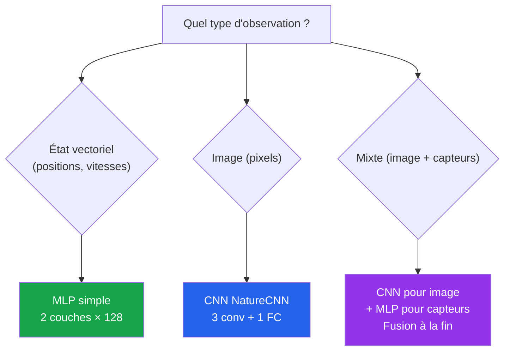

</details>

<p align="right"><a href="#top">↑ Retour en haut</a></p>

---

<a id="section-6"></a>

<details>
<summary>6 — Algorithme DQN pas à pas</summary>

<br/>

### Pseudocode complet (DQN avec target network et replay buffer)

```
Algorithme DQN(η, γ, ε, n_episodes, C, batch_size)
────────────────────────────────────────────────
1. Initialiser le réseau Q_θ aléatoirement
2. Initialiser le target network θ⁻ ← θ
3. Initialiser le replay buffer D (capacité N)
4. Pour chaque épisode = 1 à n_episodes :
   a. Initialiser s
   b. Tant que s n'est pas terminal :
       i.   Choisir a ← ε-greedy(Q_θ, s)             # exploration
       ii.  Exécuter a, observer r et s'
       iii. Stocker (s, a, r, s', done) dans D
       iv.  Si |D| > batch_size :
            • Échantillonner B ← {(sj, aj, rj, sj', dj)} ⊂ D
            • Pour chaque transition de B :
                - yj = rj                  si dj (terminal)
                - yj = rj + γ·max(Q_θ⁻(sj')) sinon
            • Loss = (1/|B|) Σ (yj - Q_θ(sj, aj))²       # ← Éq. (5)
            • θ ← θ - η·∇θ(Loss)                          # ← Éq. (6)
       v.   Tous les C pas : θ⁻ ← θ                       # ← Éq. (8)
       vi.  Décroître ε                                   # ← Éq. (10)
       vii. s ← s'
5. Retourner Q_θ et la politique π(s) = argmax_a Q_θ(s, a)
```

### Diagramme de flux complet

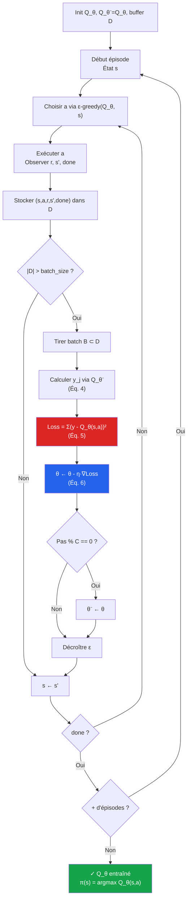

### Les 7 étapes commentées

| # | Étape | Pourquoi c'est important |
|---|---|---|
| 1 | Initialiser $Q_\theta$ aléatoirement | Point de départ neutre. Idéalement, **petits poids gaussiens** (Xavier/He init) |
| 2 | Initialiser le target network | Indispensable pour la stabilité — voir Section 4b |
| 3 | Initialiser le buffer | Capacité typique : 100K (CartPole) à 1M (Atari) |
| 4 | Choisir $a$ via ε-greedy | Identique à Q-Learning tabulaire — voir [**Éq. (9)**](#eq-epsilon-greedy-dqn) |
| 5 | Stocker et échantillonner du buffer | Décorrèle les données, permet la sample efficiency |
| 6 | Calculer la loss et faire backprop | **C'est ici que l'apprentissage profond entre en jeu** |
| 7 | Synchroniser le target network | Hard update tous les $C$ pas |

> **📌 À retenir**
> **Différences clés avec Q-Learning tabulaire :**
>
> | Q-Learning tabulaire | DQN |
> |---|---|
> | Update à chaque transition | Update après accumulation d'expériences (buffer) |
> | Calcul direct : `Q[s][a] += ...` | Loss + gradient descent |
> | Pas de target network | Target network obligatoire |
> | Pas de batch | Mini-batches de 32-128 transitions |
> | $\alpha$ direct sur les valeurs | $\eta$ sur les poids du réseau |

### Hyperparamètres typiques

#### Pour CartPole

| Paramètre | Valeur | Notation |
|---|---|---|
| Learning rate | $5 \times 10^{-4}$ | $\eta$ |
| Discount factor | $0.99$ | $\gamma$ |
| ε initial / final | $1.0$ / $0.01$ | $\varepsilon$ |
| Décroissance ε | sur 1000 pas | linéaire |
| Buffer size | $10\,000$ | $|\mathcal{D}|$ |
| Batch size | $64$ | $|\mathcal{B}|$ |
| Target update | tous les $100$ pas | $C$ |
| Optimiseur | Adam | |

#### Pour Atari (Nature 2015)

| Paramètre | Valeur |
|---|---|
| Learning rate | $2.5 \times 10^{-4}$ |
| Discount factor | $0.99$ |
| ε initial / final | $1.0$ / $0.1$ |
| Décroissance ε | sur $10^6$ pas |
| Buffer size | $10^6$ |
| Batch size | $32$ |
| Target update | tous les $10\,000$ pas |
| Warm-up (no learning) | $50\,000$ pas |
| Frame skip | $4$ |
| Optimiseur | RMSProp |

> **🛑 Danger**
> **Hyperparamètres et tuning — Ne pas négliger.**
>
> DQN est **notoirement sensible** aux hyperparamètres. Les valeurs ci-dessus ont été trouvées par DeepMind après **des semaines de tuning sur 49 jeux Atari**. Pour un nouveau problème :
>
> 1. **Toujours commencer par les valeurs standards** (ci-dessus)
> 2. **Surveiller la loss et les Q-valeurs** pendant l'entraînement
> 3. **Si Q diverge** (explose vers ±∞) → diminuer $\eta$
> 4. **Si la performance stagne** → augmenter le buffer, augmenter ε, diminuer $C$
> 5. **Si le réseau oscille** → augmenter $C$, utiliser le soft update

> **❓ FAQ**
>
> **Q : DQN est-il on-policy ou off-policy ?**
> R : **Off-policy** — comme Q-Learning tabulaire. La preuve : on apprend sur des transitions **anciennes** du buffer, générées par des **politiques anciennes** (avec un ε plus élevé). Cette propriété off-policy est ce qui **permet d'utiliser le replay buffer** — un algorithme on-policy comme SARSA ou PPO ne pourrait pas utiliser ainsi des données obsolètes.
>
> **Q : Combien d'épisodes/pas pour entraîner DQN ?**
> R : **Dépend complètement** du problème :
> - **CartPole** : 200-500 épisodes, ~10 000 pas, quelques minutes sur CPU
> - **LunarLander** : 1000-2000 épisodes, ~500 000 pas, ~30 min sur CPU
> - **Atari (un jeu)** : 10-50 millions de frames, 1-5 jours sur GPU
> - **Atari (49 jeux du papier)** : ~3 mois × cluster de GPU
>
> **Q : Pourquoi décroître $\varepsilon$ ?**
> R : Au début, le réseau **n'a rien appris** → il faut explorer beaucoup pour collecter des expériences variées. À la fin, le réseau **est bon** → il faut exploiter ce qu'il a appris pour atteindre des performances élevées. La décroissance linéaire ou exponentielle de $\varepsilon$ ([Éq. 10](#eq-epsilon-decay)) gère ce compromis.

### Bonnes pratiques d'implémentation

> **💡 Astuce**
> **Checklist pour une implémentation DQN qui fonctionne :**
>
> 1. ✅ **Replay buffer** d'au moins 10x la taille de l'épisode moyen
> 2. ✅ **Target network** synchronisé tous les $C$ pas (jamais à chaque pas)
> 3. ✅ **Loss de Huber** (pas MSE pure) pour la robustesse
> 4. ✅ **Gradient clipping** : `clip_grad_norm_(parameters, max_norm=10)` empêche les gradients d'exploser
> 5. ✅ **Normalisation des entrées** : pixels /255, état vectoriel centré-réduit
> 6. ✅ **Decay de ε** linéaire ou exponentiel
> 7. ✅ **Seed fixe** pour la reproductibilité
> 8. ✅ **Monitoring** : log de la loss, des Q-valeurs moyennes, du reward
> 9. ✅ **Évaluation séparée** avec $\varepsilon = 0$ (sans exploration) tous les X épisodes
> 10. ✅ **Checkpoints réguliers** : sauvegarder le modèle pendant l'entraînement

</details>

<p align="right"><a href="#top">↑ Retour en haut</a></p>

---

<a id="section-7"></a>

<details>
<summary>7 — Exemple pédagogique — Une mise à jour DQN calculée à la main</summary>

<br/>

Pour bien comprendre DQN, calculons **à la main** une étape d'apprentissage sur un mini-exemple. On choisit CartPole car son état est un simple vecteur de 4 nombres.

### Le problème : CartPole-v1

```
                  ▲ Poteau
                  │ angle θ
                  │ vit. angulaire θ̇
              ┌───┴───┐
              │       │
       ◄──────┤   ●   ├──────►
              │       │       Chariot
              └───┬───┘       position x
                  ▼           vitesse ẋ
       ═══════════╧═══════════════
                 Rail
```

| Élément | Valeur |
|---|---|
| **État** $s \in \mathbb{R}^4$ | $(x, \dot{x}, \theta, \dot{\theta})$ — position, vitesse, angle, vitesse angulaire |
| **Actions** | 2 : Gauche (0), Droite (1) |
| **Récompense** | +1 par pas où le poteau reste debout |
| **Fin d'épisode** | $|\theta| > 12°$ ou $|x| > 2.4$ |

### Setup de notre exemple

Imaginons un mini-réseau DQN très simplifié pour illustrer **un seul update**.

#### État de départ

| Élément | Valeur |
|---|---|
| **État** $s$ | $(0.1, 0.5, 0.05, 0.3)$ — chariot un peu à droite, poteau légèrement penché à droite |
| **Action choisie** $a$ | 1 (Droite) |
| **Récompense** $r$ | +1 |
| **État suivant** $s'$ | $(0.15, 0.6, 0.04, 0.25)$ — poteau a un peu corrigé |
| **Done** | False |

#### Prédictions actuelles du réseau (forward pass)

| Calcul | Valeur |
|---|---|
| $Q_\theta(s, 0)$ | 3.2 (action Gauche) |
| $Q_\theta(s, 1)$ | **4.7** (action Droite, choisie) |
| $Q_{\theta^{-}}(s', 0)$ | 5.1 (target network, action Gauche) |
| $Q_{\theta^{-}}(s', 1)$ | 5.4 (target network, action Droite) |

#### Hyperparamètres

| Paramètre | Valeur |
|---|---|
| $\gamma$ | 0.99 |
| $\eta$ | $5 \times 10^{-4}$ |

---

### Étape 1 — Calculer la cible TD

➡️ Voir [**Éq. (4)**](#eq-dqn-target).

Comme $\text{done} = \text{False}$ :

$$y = r + \gamma \cdot \max_{a'} Q_{\theta^{-}}(s', a')$$

$$y = 1 + 0.99 \cdot \max(5.1, 5.4) = 1 + 0.99 \cdot 5.4$$

$$\boxed{y = 1 + 5.346 = 6.346}$$

> **📌 À retenir**
> **On utilise le target network $\theta^{-}$ pour la cible**, pas le réseau online $\theta$. C'est l'innovation clé de la Section 4b. Si on utilisait $\theta$, on serait dans la situation « course-poursuite » qui mène à la divergence.

---

### Étape 2 — Calculer l'erreur TD

➡️ Voir [**Éq. (7)**](#eq-td-error-dqn).

$$\delta = y - Q_\theta(s, a) = 6.346 - 4.7 = \boxed{1.646}$$

> **Interprétation :** notre réseau a sous-estimé la valeur de l'action « Droite » en $s$. Il pensait que ça valait 4.7, mais l'expérience suggère que ça vaut plutôt 6.346. **Il faut augmenter la prédiction.**

---

### Étape 3 — Calculer la loss (pour ce seul échantillon)

➡️ Voir [**Éq. (5)**](#eq-dqn-loss).

Avec la MSE (un seul échantillon, $|\mathcal{B}| = 1$) :

$$\mathcal{L} = (y - Q_\theta(s, a))^2 = (1.646)^2 = \boxed{2.71}$$

Avec la Huber ([Éq. 14](#eq-huber)), comme $|\delta| = 1.646 > 1$ :

$$\mathcal{L}_{\text{Huber}} = |\delta| - 0.5 = 1.646 - 0.5 = \boxed{1.146}$$

> _On voit que la Huber est **plus douce** que la MSE pour les grosses erreurs (1.146 < 2.71). C'est pour ça qu'elle est préférée en pratique._

---

### Étape 4 — Calculer le gradient (chain rule)

Le gradient de la loss MSE par rapport à $\theta$ s'écrit :

$$\nabla_\theta \mathcal{L} = -2 \cdot (y - Q_\theta(s, a)) \cdot \nabla_\theta Q_\theta(s, a) = -2 \cdot 1.646 \cdot \nabla_\theta Q_\theta(s, a)$$

$$\nabla_\theta \mathcal{L} = -3.292 \cdot \nabla_\theta Q_\theta(s, a)$$

Le gradient $\nabla_\theta Q_\theta(s, a)$ est calculé **automatiquement par PyTorch** via la backpropagation — il a la même dimension que $\theta$ (par exemple, $\sim$100 000 valeurs si le réseau est petit).

> **💡 Astuce**
> **Métaphore visuelle.** Imaginez que $\theta$ est un **paysage à 100 000 dimensions** (chaque poids = une dimension). $\mathcal{L}(\theta)$ est l'**altitude** de ce paysage. Le gradient $\nabla_\theta \mathcal{L}$ est le **vecteur qui pointe vers la pente la plus raide** vers le haut. On va dans la **direction opposée** (descente) pour réduire la loss.

---

### Étape 5 — Mettre à jour les poids

➡️ Voir [**Éq. (6)**](#eq-dqn-gradient).

$$\theta \leftarrow \theta - \eta \cdot \nabla_\theta \mathcal{L}$$

$$\theta \leftarrow \theta - 5 \times 10^{-4} \cdot (-3.292) \cdot \nabla_\theta Q_\theta(s, a)$$

$$\theta \leftarrow \theta + 1.646 \times 10^{-3} \cdot \nabla_\theta Q_\theta(s, a)$$

**Concrètement** : on bouge les poids **dans la direction qui augmente** $Q_\theta(s, a)$, d'un pas proportionnel à l'erreur $\delta = 1.646$ et au learning rate $\eta$.

---

### Étape 6 — Vérification (après l'update)

Si on refait le forward pass après cet update, on aura **typiquement** :

| Avant update | Après update |
|---|---|
| $Q_\theta(s, 1) = 4.7$ | $Q_\theta(s, 1) \approx 4.71$ (légèrement augmenté) |

> **❗ Important :** la prédiction n'a **pas sauté de 4.7 à 6.346** d'un coup. Elle a juste **avancé d'un tout petit peu** vers la cible. Pourquoi ? Parce que :
>
> 1. Le **learning rate est petit** ($\eta = 5 \times 10^{-4}$)
> 2. Le réseau a **plusieurs poids partagés** — modifier un poids affecte aussi d'autres prédictions
> 3. Modifier brutalement détruirait tout ce que le réseau a appris pour d'autres états
>
> Il faudra **plusieurs centaines d'updates** pour que $Q_\theta(s, 1)$ se rapproche significativement de 6.346.

---

### Comparaison avec Q-Learning tabulaire

Faisons le même calcul en Q-Learning tabulaire pour bien voir la différence — voir [**Éq. (2)**](#eq-qlearning-tabulaire).

| | Q-Learning tabulaire ($\alpha = 0.1$) | DQN ($\eta = 5 \times 10^{-4}$) |
|---|---|---|
| **Cible** | $y = 6.346$ | $y = 6.346$ |
| **Erreur** | $\delta = 1.646$ | $\delta = 1.646$ |
| **Avant** | $Q(s, 1) = 4.7$ | $Q_\theta(s, 1) = 4.7$ |
| **Update** | $Q(s, 1) \mathrel{+}= 0.1 \cdot 1.646 = 0.1646$ | Backprop sur tous les poids du réseau |
| **Après** | $Q(s, 1) = 4.8646$ (changement direct) | $Q_\theta(s, 1) \approx 4.71$ (changement émergent) |
| **Effets de bord** | Aucun — autres cases inchangées | Les prédictions sur **d'autres états voisins** changent aussi (généralisation) |

> **📌 À retenir**
> **C'est la généralisation qui change tout.** Dans DQN, l'update sur $(s, a)$ modifie aussi les prédictions de **tous les états voisins** dans l'espace des features. Si vous voyez **un état similaire** $s'' \approx s$, sa Q-valeur sera **automatiquement** mise à jour proportionnellement. C'est ce qui permet à DQN de fonctionner avec $10^{16985}$ états possibles.

### Visualisation : 1000 updates plus tard

Si on répète cet exercice **1000 fois** sur des trajectoires CartPole, voici ce qui se passe :

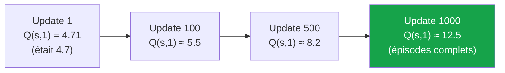

Les Q-valeurs **augmentent** progressivement parce que :
1. CartPole donne +1 par pas, $\gamma = 0.99$
2. Un épisode optimal dure 500 pas → $Q^* \approx \sum_{t=0}^{499} 0.99^t \approx 100$
3. Pour un agent moyen qui dure 200 pas → $Q \approx 100 \times 0.99^{200} \approx 13$

> **❓ FAQ**
>
> **Q : Pourquoi $Q$ ne saute-t-il pas directement à la valeur cible ?**
> R : Parce que **les poids du réseau sont partagés**. Imaginez 1000 mots dans un dictionnaire. Modifier la définition d'**un seul mot** dans un livre relié — c'est facile. Mais dans un **réseau de neurones**, chaque poids influence **toutes les prédictions**. Pour ne pas tout casser, on bouge **doucement**, avec un petit $\eta$.
>
> **Q : Combien faut-il d'updates pour résoudre CartPole ?**
> R : Typiquement **5 000 à 30 000 updates**, soit **200 à 500 épisodes**. Sur un CPU moderne, cela prend **2 à 10 minutes**.

</details>

<p align="right"><a href="#top">↑ Retour en haut</a></p>

---

<a id="section-8"></a>

<details>
<summary>8 — Extensions modernes — La famille Rainbow</summary>

<br/>

DQN original (2015) a été suivi de **nombreuses améliorations** entre 2015 et 2018, chacune corrigeant un défaut spécifique. En 2017, DeepMind a publié **Rainbow DQN**, qui combine **6 extensions** simultanément et reste un des plus forts algorithmes Value-Based à ce jour.

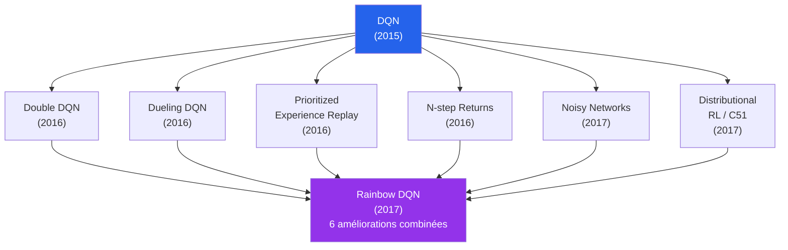

---

### 8a — Double DQN (résout la surestimation)

#### Le problème de la surestimation

DQN utilise $\max_{a'} Q_{\theta^{-}}(s', a')$ dans sa cible. Or, le **max** d'estimations bruitées **surestime systématiquement** la vraie valeur. C'est un **biais positif** bien connu en statistiques.

> **❓ FAQ**
>
> **Q : Pourquoi le max d'estimations bruitées surestime ?**
> R : Intuition simple. Imaginez 4 actions ayant toutes la **vraie valeur 5.0**, mais le réseau les estime avec un bruit gaussien $\epsilon \sim \mathcal{N}(0, 1)$ :
> - $Q(s, a_1) = 5.3$
> - $Q(s, a_2) = 4.7$
> - $Q(s, a_3) = 6.1$
> - $Q(s, a_4) = 4.5$
>
> $\max_a Q(s, a) = 6.1$ — mais la vraie valeur est **5.0**. Le max introduit un **biais positif de +1.1**. Ce biais s'amplifie au fil des updates (target = r + γ × max → biais propagé).

#### La solution Double DQN

➡️ Voir [**Éq. (11)**](#eq-double-dqn).

**Idée** : **séparer** le choix de l'action (avec $\theta$) et l'évaluation de l'action (avec $\theta^{-}$).

```python
# DQN standard
target = r + gamma * Q_target(s_next).max(dim=1)

# Double DQN
best_action = Q_online(s_next).argmax(dim=1)              # choix avec online
target = r + gamma * Q_target(s_next).gather(1, best_action)  # éval avec target
```

| Aspect | DQN | Double DQN |
|---|---|---|
| Choix de l'action | $\arg\max_{a'} Q_{\theta^{-}}(s', a')$ | $\arg\max_{a'} Q_\theta(s', a')$ |
| Évaluation | $Q_{\theta^{-}}(s', a^*)$ | $Q_{\theta^{-}}(s', a^*)$ |
| Coût supplémentaire | — | Forward pass de $\theta$ et $\theta^{-}$ sur $s'$ |

> **📌 À retenir**
> **Double DQN est presque gratuit.** Le coût supplémentaire est minime, mais le gain de stabilité et de performance est important. Sur Atari, Double DQN améliore les scores de **20% en moyenne**. **C'est l'extension la plus recommandée pour tout projet DQN.**

> **ℹ️ Remarque**
> **Histoire — Hado van Hasselt (2010).** L'idée de Double DQN vient en réalité de l'algorithme **Double Q-Learning** tabulaire publié par van Hasselt en 2010 — bien avant DQN. En 2016, le même chercheur l'a adapté à DQN après avoir rejoint DeepMind. **L'idée tabulaire de 2010 a sauvé l'algorithme profond de 2015.**

---

### 8b — Dueling DQN (sépare V et A)

#### L'idée

Décomposer $Q(s, a)$ en deux quantités :

- **$V(s)$** : la valeur de l'état (indépendante de l'action)
- **$A(s, a)$** : l'**avantage** de l'action sur la moyenne des actions

➡️ Voir [**Éq. (12)**](#eq-dueling).

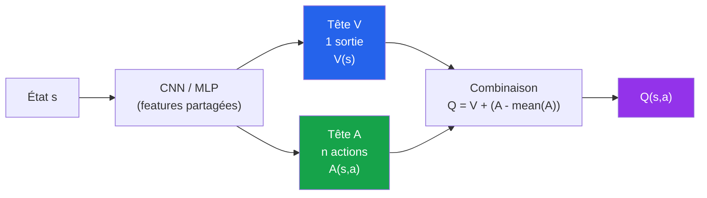

#### Pourquoi c'est utile

> **💡 Astuce**
> **Vie réelle — Différencier « cet endroit est bon » et « ce mouvement est bon ».**
>
> Imaginez que vous jouez à Pac-Man :
>
> - $V(s)$ = « **À quel point l'état actuel est-il avantageux ?** » (ex. : je suis dans un couloir avec 5 pacgums, c'est bien)
> - $A(s, a)$ = « **Cette action est-elle meilleure ou pire que la moyenne ?** » (ex. : aller à droite est légèrement mieux car il y a un fantôme à gauche)
>
> Dans certains états, **toutes les actions sont équivalentes** (couloir vide), donc $A(s, a) \approx 0$ pour tout $a$. Le Dueling DQN apprend alors **uniquement $V$**, ce qui est **beaucoup plus efficace** que d'apprendre 4 valeurs Q quasi-identiques.

| Avantage | Description |
|---|---|
| **Meilleure efficacité d'apprentissage** | Beaucoup d'états ont peu d'impact sur l'action choisie — Dueling apprend $V$ globalement, $A$ localement |
| **Robustesse au bruit** | Erreur sur $V$ n'affecte pas le choix d'action (seul $A$ compte pour `argmax`) |
| **Meilleure interprétabilité** | $V$ et $A$ sont lisibles séparément |

> **🛑 Danger**
> **Pourquoi soustraire la moyenne de $A$ ?**
>
> L'équation $Q = V + A$ a **un problème d'identifiabilité** : on peut ajouter $c$ à $V$ et soustraire $c$ à $A$ sans changer $Q$. Cela rend l'apprentissage instable. La soustraction de la moyenne $\frac{1}{|\mathcal{A}|}\sum_{a'} A(s, a')$ **fixe** ce problème en imposant que la moyenne des avantages soit zéro.

---

### 8c — Prioritized Experience Replay (PER)

#### L'idée

Le replay buffer standard tire les transitions **uniformément**. Mais certaines transitions sont **plus informatives** que d'autres (celles où l'agent a fait une grosse erreur de prédiction). **PER** les échantillonne avec une probabilité plus élevée.

➡️ Voir [**Éq. (13)**](#eq-per-priority).

```python
# Replay uniforme (DQN standard)
batch = random.sample(buffer, batch_size)

# PER : probabilité proportionnelle à |δ|^α
priorities = np.abs(td_errors) ** alpha
probabilities = priorities / priorities.sum()
batch_indices = np.random.choice(len(buffer), batch_size, p=probabilities)
```

#### Le compromis

| Aspect | Replay uniforme | PER |
|---|---|---|
| **Échantillonnage** | $P(i) = 1/N$ | $P(i) \propto |\delta_i|^\alpha$ |
| **Biais** | Aucun (estimateur non-biaisé) | Biais positif vers transitions difficiles |
| **Correction du biais** | Pas nécessaire | **Importance sampling weights** : $w_i = (N \cdot P(i))^{-\beta}$ |
| **Performance Atari** | Référence | +30% en moyenne |
| **Implémentation** | Trivial (deque) | Complexe (sum-tree binary heap) |

> **⚠️ Attention**
> **PER nécessite un correcteur de biais.** Comme on échantillonne plus souvent les transitions à grande erreur, on biaise l'estimation. Pour corriger, on multiplie chaque gradient par un **poids d'importance** $w_i = (N \cdot P(i))^{-\beta}$, où $\beta$ croît de 0.4 vers 1.0 pendant l'entraînement. Sans ce correcteur, **PER peut être pire que le replay uniforme**.

> **💡 Astuce**
> **Vie réelle — Pourquoi PER est intuitif.**
>
> Quand vous **étudiez pour un examen**, vous ne révisez pas uniformément tout le cours. Vous **insistez sur les chapitres où vous vous trompez le plus**. C'est exactement PER : « **passez plus de temps sur les exemples où votre modèle se trompe** ».

---

### 8d — Rainbow DQN — Tout combiné

**Rainbow DQN** (DeepMind, 2017) combine **6 améliorations** de DQN :

| # | Extension | Apport |
|---|---|---|
| 1 | **Double DQN** | Corrige la surestimation |
| 2 | **Dueling Network** | Sépare V et A |
| 3 | **Prioritized Experience Replay** | Échantillonnage informé |
| 4 | **Multi-step learning** ($n$-step returns) | Propage plus vite l'info |
| 5 | **Distributional RL (C51)** | Apprend la **distribution** des récompenses au lieu de la moyenne |
| 6 | **Noisy Networks** | Remplace ε-greedy par du bruit dans les poids |

#### Performance sur Atari

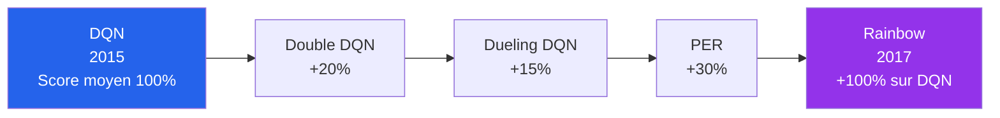

| Algorithme | Score humain normalisé moyen sur 57 jeux Atari |
|---|---|
| **Random** | 0% |
| **Human** | 100% |
| **DQN (2015)** | 79% |
| **Double DQN** | 117% |
| **Dueling DQN** | 151% |
| **PER** | 156% |
| **Distributional** | 178% |
| **Rainbow** | **223%** |
| **MuZero (2020)** | 1000%+ (état de l'art) |

> **ℹ️ Remarque**
> **Anecdote — Les 6 améliorations sont presque toutes orthogonales.** L'élégance de Rainbow est que chaque amélioration corrige un **défaut différent**, donc elles s'**additionnent** sans interférer. C'est rare en deep learning — d'habitude, combiner 6 techniques donne des résultats imprévisibles. Rainbow a montré que **DQN avait beaucoup de marge d'amélioration** que personne n'avait exploité simultanément.

> **📌 À retenir**
> **En 2026, que choisir ?**
>
> Pour la plupart des problèmes RL avec **espace d'action discret** :
>
> | Si... | Utiliser |
> |---|---|
> | Vous débutez en RL profond | **DQN classique** |
> | Vous voulez de meilleurs résultats sans trop d'effort | **Double DQN + Dueling** |
> | Vous voulez le meilleur algorithme value-based | **Rainbow DQN** |
> | Vous voulez l'état de l'art absolu (research) | **MuZero / Agent57** |
> | Vous avez un espace d'action **continu** | Sortir de DQN → **DDPG, SAC, TD3** |

### Au-delà de Rainbow

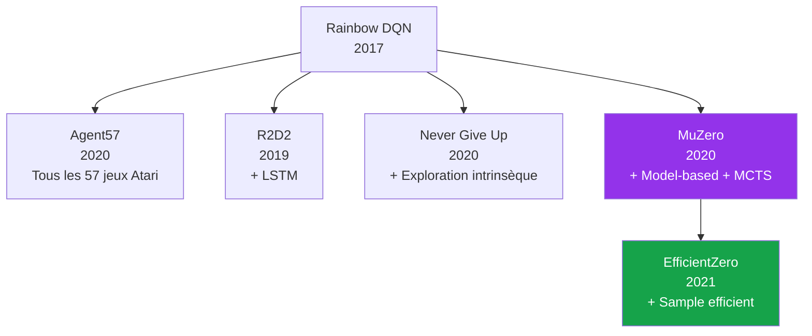

</details>

<p align="right"><a href="#top">↑ Retour en haut</a></p>

---

<a id="section-9"></a>

<details>
<summary>9 — Implémentation Python complète et exécutable</summary>

<br/>

Cette section fournit une **implémentation pédagogique et complète** de DQN sur l'environnement **CartPole-v1**. Le code utilise **PyTorch** et **Gymnasium** (le successeur officiel d'OpenAI Gym). Il peut être copié-collé dans un notebook ou exécuté tel quel.

### Prérequis

```bash
pip install torch numpy gymnasium matplotlib
```

> **🛑 Danger**
> **Pièges classiques d'implémentation DQN :**
>
> 1. **Oublier `with torch.no_grad()` pour la cible** → le gradient passe à travers le target → divergence
> 2. **Oublier `.detach()` ou `.no_grad()` sur le target network** → même problème
> 3. **Mauvaise gestion de `done`** : oublier que pour un état terminal, $y = r$ (pas de bootstrap)
> 4. **Tenseurs non sur le bon device** → erreur CUDA ou calcul sur CPU
> 5. **Pas de seed** → résultats non reproductibles
> 6. **ε qui ne décroît pas** → l'agent explore éternellement
> 7. **Update du target network trop fréquent** → instabilité
> 8. **Pas de normalisation des entrées** → divergence
>
> Le code ci-dessous gère **tous ces pièges**.

---

### 9a — Le réseau Q en PyTorch

```python
import torch
import torch.nn as nn
import torch.optim as optim
import numpy as np

class QNetwork(nn.Module):
    """
    Réseau Q pour CartPole-v1.
    Entrée  : état de dimension 4
    Sortie  : Q-valeurs pour chaque action (2 actions)
    """
    def __init__(self, state_dim=4, n_actions=2, hidden=128):
        super().__init__()
        self.net = nn.Sequential(
            nn.Linear(state_dim, hidden),
            nn.ReLU(),
            nn.Linear(hidden, hidden),
            nn.ReLU(),
            nn.Linear(hidden, n_actions),
        )

    def forward(self, x):
        return self.net(x)
```

---

### 9b — Le Replay Buffer

```python
from collections import deque
import random

class ReplayBuffer:
    """Mémoire d'expériences avec échantillonnage uniforme."""

    def __init__(self, capacity=10_000):
        self.buffer = deque(maxlen=capacity)

    def push(self, state, action, reward, next_state, done):
        self.buffer.append((state, action, reward, next_state, done))

    def sample(self, batch_size):
        batch = random.sample(self.buffer, batch_size)
        states, actions, rewards, next_states, dones = zip(*batch)
        return (
            np.array(states, dtype=np.float32),
            np.array(actions, dtype=np.int64),
            np.array(rewards, dtype=np.float32),
            np.array(next_states, dtype=np.float32),
            np.array(dones, dtype=np.float32),
        )

    def __len__(self):
        return len(self.buffer)
```

---

### 9c — L'agent DQN complet

```python
class DQNAgent:
    """
    Agent DQN avec :
    - Réseau Q + Target Network
    - Replay Buffer
    - ε-greedy avec décroissance
    - Huber loss + Gradient clipping
    """

    def __init__(
        self,
        state_dim=4,
        n_actions=2,
        lr=5e-4,
        gamma=0.99,
        epsilon_start=1.0,
        epsilon_end=0.01,
        epsilon_decay_steps=1000,
        buffer_size=10_000,
        batch_size=64,
        target_update=100,
        seed=42,
    ):
        torch.manual_seed(seed)
        np.random.seed(seed)
        random.seed(seed)

        self.device = "cuda" if torch.cuda.is_available() else "cpu"
        self.n_actions = n_actions
        self.gamma = gamma
        self.batch_size = batch_size
        self.target_update = target_update

        self.q_net = QNetwork(state_dim, n_actions).to(self.device)
        self.target_net = QNetwork(state_dim, n_actions).to(self.device)
        self.target_net.load_state_dict(self.q_net.state_dict())
        self.target_net.eval()

        self.optimizer = optim.Adam(self.q_net.parameters(), lr=lr)
        self.buffer = ReplayBuffer(buffer_size)

        self.epsilon = epsilon_start
        self.epsilon_end = epsilon_end
        self.epsilon_decay = (epsilon_start - epsilon_end) / epsilon_decay_steps

        self.steps = 0

    def select_action(self, state):
        """Politique ε-greedy — Éq. (9)."""
        if random.random() < self.epsilon:
            return random.randint(0, self.n_actions - 1)
        with torch.no_grad():
            s = torch.as_tensor(state, dtype=torch.float32, device=self.device).unsqueeze(0)
            q = self.q_net(s)
            return int(q.argmax(dim=1).item())

    def update(self):
        """Une étape de mise à jour des poids — Éq. (5) + Éq. (6)."""
        if len(self.buffer) < self.batch_size:
            return None

        states, actions, rewards, next_states, dones = self.buffer.sample(self.batch_size)

        states_t = torch.as_tensor(states, device=self.device)
        actions_t = torch.as_tensor(actions, device=self.device)
        rewards_t = torch.as_tensor(rewards, device=self.device)
        next_states_t = torch.as_tensor(next_states, device=self.device)
        dones_t = torch.as_tensor(dones, device=self.device)

        # Q(s, a) — prédiction du réseau online
        q_pred = self.q_net(states_t).gather(1, actions_t.unsqueeze(1)).squeeze(1)

        # Cible TD — utilise le target network — Éq. (4)
        with torch.no_grad():
            q_next = self.target_net(next_states_t).max(dim=1).values
            y = rewards_t + self.gamma * q_next * (1.0 - dones_t)

        # Loss Huber — Éq. (14) — plus robuste que MSE
        loss = nn.functional.smooth_l1_loss(q_pred, y)

        self.optimizer.zero_grad()
        loss.backward()
        # Gradient clipping pour la stabilité
        torch.nn.utils.clip_grad_norm_(self.q_net.parameters(), max_norm=10.0)
        self.optimizer.step()

        self.steps += 1

        # Hard update du target network — Éq. (8)
        if self.steps % self.target_update == 0:
            self.target_net.load_state_dict(self.q_net.state_dict())

        # Décroissance de ε — Éq. (10)
        self.epsilon = max(self.epsilon_end, self.epsilon - self.epsilon_decay)

        return float(loss.item())
```

> **📌 À retenir**
> **Les 5 lignes critiques :**
>
> ```python
> q_pred = self.q_net(states_t).gather(1, actions_t.unsqueeze(1)).squeeze(1)  # 1. Prédiction Q(s,a)
> with torch.no_grad():                                                       # 2. Pas de gradient pour la cible !
>     q_next = self.target_net(next_states_t).max(dim=1).values               # 3. Target network !
>     y = rewards_t + self.gamma * q_next * (1.0 - dones_t)                   # 4. Si done → pas de bootstrap
> loss = nn.functional.smooth_l1_loss(q_pred, y)                              # 5. Huber loss
> ```
>
> Ces 5 lignes contiennent **l'intégralité de la logique DQN**. Le reste est de la plomberie (buffer, ε-greedy, devices).

---

### 9d — Boucle d'entraînement sur CartPole

```python
import gymnasium as gym

def train_dqn(n_episodes=500, seed=42):
    env = gym.make("CartPole-v1")
    env.reset(seed=seed)
    state_dim = env.observation_space.shape[0]
    n_actions = env.action_space.n

    agent = DQNAgent(
        state_dim=state_dim,
        n_actions=n_actions,
        lr=5e-4,
        gamma=0.99,
        epsilon_start=1.0,
        epsilon_end=0.01,
        epsilon_decay_steps=10_000,
        buffer_size=10_000,
        batch_size=64,
        target_update=100,
        seed=seed,
    )

    episode_rewards = []
    losses = []

    for episode in range(n_episodes):
        state, _ = env.reset(seed=seed + episode)
        total_reward = 0.0
        done = False
        ep_losses = []

        while not done:
            action = agent.select_action(state)
            next_state, reward, terminated, truncated, _ = env.step(action)
            done = terminated or truncated

            agent.buffer.push(state, action, reward, next_state, float(done))
            loss = agent.update()
            if loss is not None:
                ep_losses.append(loss)

            state = next_state
            total_reward += reward

        episode_rewards.append(total_reward)
        if ep_losses:
            losses.append(np.mean(ep_losses))

        if (episode + 1) % 20 == 0:
            recent = np.mean(episode_rewards[-20:])
            print(f"Ep {episode+1:4d} | Reward = {total_reward:6.1f} | "
                  f"Avg-20 = {recent:6.1f} | ε = {agent.epsilon:.3f}")

    env.close()
    return agent, episode_rewards, losses


def plot_results(rewards, losses):
    import matplotlib.pyplot as plt
    fig, axes = plt.subplots(1, 2, figsize=(13, 4))

    axes[0].plot(rewards, alpha=0.3, label="Reward / épisode")
    if len(rewards) >= 20:
        smooth = np.convolve(rewards, np.ones(20) / 20, mode="valid")
        axes[0].plot(range(19, len(rewards)), smooth, color="C0", label="Moyenne 20 ép.")
    axes[0].axhline(195, color="red", linestyle="--", label="Seuil 'résolu' (195)")
    axes[0].set_xlabel("Épisode")
    axes[0].set_ylabel("Reward")
    axes[0].set_title("DQN sur CartPole-v1")
    axes[0].legend()
    axes[0].grid(alpha=0.3)

    axes[1].plot(losses, color="C3", alpha=0.7)
    axes[1].set_xlabel("Épisode")
    axes[1].set_ylabel("Loss moyenne")
    axes[1].set_title("Loss DQN au fil des épisodes")
    axes[1].grid(alpha=0.3)

    plt.tight_layout()
    plt.savefig("dqn_cartpole.png", dpi=120)
    plt.show()


if __name__ == "__main__":
    agent, rewards, losses = train_dqn(n_episodes=500)
    plot_results(rewards, losses)
```

---

### Résultats attendus

Sur **CartPole-v1**, vous observerez :

| Épisode | Reward moyenne | Statut |
|---|---|---|
| 1-50 | ~20 | Agent random, échoue rapidement |
| 50-150 | 50-150 | Apprentissage en cours |
| 150-300 | 200-500 | Convergence vers la performance optimale |
| 300-500 | ~500 | Maintien stable (limite max CartPole-v1) |

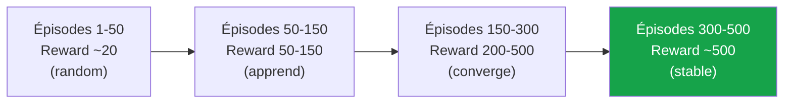

> **💡 Astuce**
> **CartPole-v1 est considéré « résolu » quand la reward moyenne sur 100 épisodes dépasse 195.**
> DQN bien configuré atteint cela en **150-250 épisodes**. Si après 500 épisodes vous êtes toujours en dessous, vérifiez :
>
> 1. Que vous utilisez bien le target network
> 2. Que `done` est correctement géré
> 3. Que `with torch.no_grad()` entoure le calcul de la cible
> 4. Que le learning rate n'est pas trop élevé (essayez $10^{-4}$)
> 5. Que le buffer est suffisamment grand (au moins 10K)

> **🛑 Danger**
> **Reward d'épisode qui s'effondre après avoir convergé.**
>
> C'est un phénomène **fréquent** en DQN appelé **catastrophic forgetting**. Possible causes :
>
> 1. ε trop bas trop vite → l'agent n'explore plus
> 2. Target network mis à jour avec des poids encore instables
> 3. Buffer trop petit → cycle dans les mêmes expériences
> 4. Bug : target network qui partage la mémoire avec le réseau online
>
> **Solution** : `early stopping` — sauvegardez le meilleur modèle quand la reward dépasse 450 et arrêtez ensuite.

---

### Extension vers Atari (LunarLander, MountainCar...)

Pour utiliser ce code sur **LunarLander-v2** ou **MountainCar-v0**, il suffit de changer :

```python
env = gym.make("LunarLander-v2")     # ou "MountainCar-v0"
# Le reste du code reste IDENTIQUE — DQN est générique
```

Pour **Atari** (Breakout, Pong...), il faut remplacer le `QNetwork` par un CNN (voir Section 5b) et ajouter le **preprocessing** (frame stacking, resize, grayscale). C'est généralement plus simple d'utiliser **Stable-Baselines3** qui implémente tout ça :

```python
from stable_baselines3 import DQN
model = DQN("CnnPolicy", "BreakoutNoFrameskip-v4", verbose=1)
model.learn(total_timesteps=1_000_000)
```

> **⚠️ Attention**
> **Atari demande beaucoup de ressources.** Un seul jeu Atari nécessite **plusieurs millions de frames** (1-10 jours sur GPU). Pour expérimenter rapidement, restez sur CartPole, LunarLander, ou Acrobot.

---

### Variations à explorer

> **💡 Astuce**
> **Exercices pour approfondir :**
>
> 1. **Double DQN** : remplacez la cible par `Q_target(s')[Q_online(s').argmax()]` — voir [Éq. (11)](#eq-double-dqn)
> 2. **Dueling DQN** : modifiez `QNetwork` pour avoir 2 têtes (V et A) — voir [Éq. (12)](#eq-dueling)
> 3. **Soft target update** : remplacez le hard update par $\theta^- \leftarrow 0.005\,\theta + 0.995\,\theta^-$ à chaque pas
> 4. **PER** : implémentez un sum-tree pour le replay prioritisé
> 5. **Atari Pong** : tentez le saut vers les images — exigeant mais formateur

</details>

<p align="right"><a href="#top">↑ Retour en haut</a></p>

---

<a id="section-10"></a>

<details>
<summary>10 — Quand utiliser DQN ? Forces, limites et alternatives</summary>

<br/>

DQN est puissant mais pas universel. Voici quand l'utiliser, et quand préférer un autre algorithme.

### Tableau de décision

| Situation | Recommandation | Raison |
|---|---|---|
| **Actions discrètes + état complexe (image)** | **DQN** ou **Rainbow** | Conçu pour ce cas |
| **Actions discrètes + état simple (vecteur)** | **DQN** | Simple et efficace |
| **Actions continues** (robot, voiture, etc.) | **DDPG, TD3, SAC** | DQN ne gère pas les actions continues |
| **Politique stochastique souhaitée** | **PPO, A2C, SAC** | DQN est déterministe après ε-greedy |
| **Apprentissage par imitation** | **Behavioral Cloning + DQN fine-tuning** | DQN off-policy peut apprendre depuis des données expert |
| **Problème safety-critical** | **SARSA, PPO, CPO** | DQN ne gère pas naturellement les contraintes |
| **Espace d'action très grand (>1000 actions)** | **Action embedding + DQN** ou **Policy Gradient** | DQN scale mal avec |A| |
| **Données limitées** | **Model-based RL** (Dyna, MuZero, World Models) | DQN nécessite beaucoup d'expériences |
| **Coopération multi-agent** | **MADDPG, QMIX** | DQN seul n'est pas conçu pour |
| **Récompenses très clairsemées** | **DQN + Curiosity / RND** | DQN seul peine sur Montezuma's Revenge |

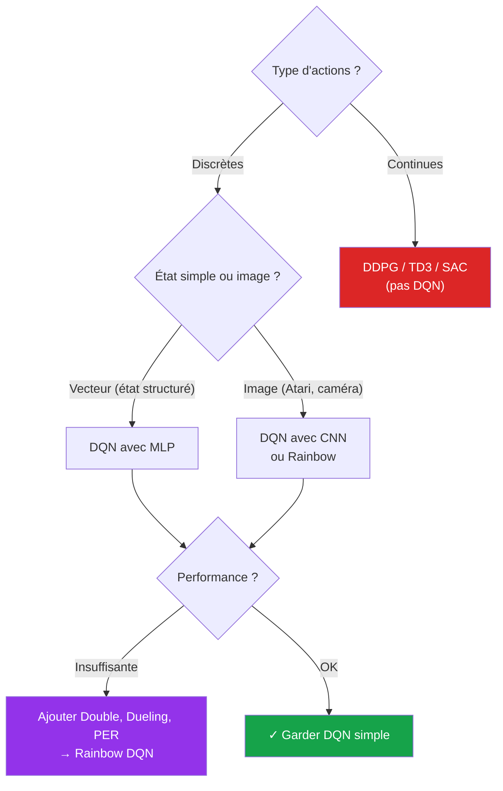

---

### Forces de DQN

> **📌 À retenir**
> **Pourquoi DQN reste pertinent en 2026 :**
>
> 1. **Algorithmic simplicity** : 200 lignes Python, conceptuellement simple
> 2. **Off-policy** : peut utiliser des données anciennes (replay buffer)
> 3. **Bien étudié** : 10+ ans de littérature, hyperparamètres bien connus
> 4. **Implémentations production-ready** : Stable-Baselines3, RLlib, ACME
> 5. **Base de nombreux algorithmes plus avancés** (Rainbow, R2D2, MuZero)
> 6. **Excellent pour les jeux et environnements discrets**

---

### Limites de DQN

> **🛑 Danger**
> **Ce que DQN ne sait pas (bien) faire :**
>
> 1. **Actions continues** : DQN nécessite $\arg\max$, impossible sur $\mathbb{R}^n$ continu. Solution : DDPG, TD3, SAC.
> 2. **Très grand nombre d'actions** : si $|\mathcal{A}| > 1000$, le forward pass coûte cher.
> 3. **Récompenses clairsemées** : DQN est mauvais sur Montezuma's Revenge (où la récompense arrive très tard). Solution : exploration intrinsèque, curiosity-driven RL.
> 4. **Apprentissage instable** : peut diverger sans hyperparams bien réglés.
> 5. **Sample inefficient** : DQN nécessite des **millions de transitions**. Pour le robot réel : impraticable sans simulation.
> 6. **Pas de garantie théorique** : la convergence dépend des hyperparamètres et de la chance.
> 7. **Politique déterministe** : après ε-greedy, DQN est figé. Inadapté quand on veut une politique stochastique (Poker, jeux à information imparfaite).
> 8. **Non-stationnarité** : DQN ne s'adapte pas bien si l'environnement change pendant l'entraînement.

---

### Alternatives modernes (2026)

| Algorithme | Année | Caractéristiques | Cas d'usage |
|---|---|---|---|
| **DQN** | 2015 | Off-policy, value-based, actions discrètes | Jeux Atari, problèmes discrets |
| **Rainbow** | 2017 | DQN + 6 améliorations | Atari state-of-the-art classique |
| **A3C / A2C** | 2016 | Actor-critic, on-policy, parallèle | Atari sans GPU |
| **PPO** | 2017 | On-policy, stable, polyvalent | **Standard industriel** (ChatGPT RLHF) |
| **SAC** | 2018 | Off-policy + entropy + actions continues | Robotique |
| **TD3** | 2018 | DDPG amélioré | Robotique précise |
| **MuZero** | 2020 | Model-based + MCTS + DQN | State-of-the-art (Atari, Go) |
| **Decision Transformer** | 2021 | RL comme problème de séquence | Apprentissage par imitation |
| **DreamerV3** | 2023 | World model + actor-critic | Robotique réelle, sample-efficient |

```mermaid
flowchart LR
    DQN["DQN<br/>(2015)"] --> R["Rainbow<br/>(2017)"]
    R --> M["MuZero<br/>(2020)"]
    M --> E["EfficientZero<br/>(2021)"]
    DQN --> AC["A2C / A3C<br/>(2016)"]
    AC --> PPO["PPO<br/>(2017)"]
    PPO --> SAC["SAC<br/>(2018)"]
    PPO --> DT["Decision Transformer<br/>(2021)"]
    DT --> DV3["DreamerV3<br/>(2023)"]
    style DQN fill:#2563eb,color:#fff
    style PPO fill:#16a34a,color:#fff
    style DV3 fill:#9333ea,color:#fff
```

---

### Comparaison sur cas d'usage typiques

| Cas d'usage | Meilleur choix | Pourquoi |
|---|---|---|
| **Apprendre Atari** | **Rainbow** | Le mieux étudié, équilibré |
| **Robot quadrupède (sim → réel)** | **SAC** | Actions continues, robuste |
| **ChatGPT RLHF** | **PPO** | Standard industriel, stable |
| **Voiture autonome (sim)** | **SAC + safety constraints** | Actions continues, sécurité |
| **AlphaGo / AlphaZero like** | **MuZero** | Model-based + MCTS |
| **Apprentissage offline (batch RL)** | **CQL, IQL, Decision Transformer** | Pas d'interaction supplémentaire |
| **Petit projet pédagogique** | **DQN simple** | Le plus accessible |

> **💡 Astuce**
> **Règle d'or industrielle (2026) :**
>
> | Si vous avez | Utilisez |
> |---|---|
> | < 100 000 expériences | Model-based (DreamerV3) |
> | Actions discrètes simples | DQN ou Rainbow |
> | Actions continues + simu | SAC |
> | Politique stochastique | PPO |
> | LLM ou fine-tuning | PPO (RLHF) ou DPO |
> | Industrie / production | Stable-Baselines3 |

> **❓ FAQ**
>
> **Q : DQN est-il obsolète en 2026 ?**
> R : **Non, mais ce n'est plus la première option** dans la plupart des cas. PPO et SAC ont pris la couronne pour les nouveaux projets. Mais DQN reste **fondamental à comprendre** : c'est l'algorithme qui a lancé l'ère du Deep RL. Beaucoup d'algorithmes plus modernes (Rainbow, R2D2, MuZero) en héritent.
>
> **Q : Faut-il toujours utiliser Rainbow plutôt que DQN ?**
> R : Pas forcément. Si vous **débutez**, commencez par DQN simple — c'est plus facile à débugger. Si vous voulez **les meilleures performances**, oui, Rainbow ou SAC. Pour la **production**, Stable-Baselines3 implémente les deux.
>
> **Q : DQN est-il utilisé en industrie ?**
> R : Oui, dans certains cas spécifiques (jeux, simulations, A/B testing avec actions discrètes). Mais la **majorité de l'industrie en 2026 utilise PPO** (notamment pour RLHF avec les LLMs) ou **SAC** pour la robotique. DQN reste très présent dans la **recherche** et l'**enseignement**.

</details>

<p align="right"><a href="#top">↑ Retour en haut</a></p>

---

<a id="section-11"></a>

<details>
<summary>11 — Quiz — DQN en profondeur</summary>

<br/>

Ce quiz évalue votre compréhension complète de DQN. Répondez à chaque question, puis cliquez sur **💡 Voir la solution** pour vérifier.

---

#### 1. Concepts fondamentaux

**Question 1 :** Que signifie l'acronyme **DQN** ?

a) Deep Quality Network

b) **Deep Q-Network** — réseau de neurones profond pour approximer la fonction Q

c) Deep Quantum Network

d) Distributed Q-Network

<details>
<summary>💡 Voir la solution</summary>

✅ **Réponse : b)**

**DQN = Deep Q-Network**. C'est l'algorithme historique (DeepMind 2013/2015) qui combine **Q-Learning** avec un **réseau de neurones profond**. La table Q de Q-Learning classique est remplacée par une fonction approximée $Q_\theta(s, a)$ où $\theta$ représente les poids du réseau — voir [**Éq. (3)**](#eq-q-approx).

</details>

---

**Question 2 :** Quel est le principal problème de Q-Learning tabulaire qui motive l'invention de DQN ?

a) Il converge trop lentement

b) **L'explosion combinatoire de l'espace d'états** rend la table inutilisable sur des problèmes complexes (Atari, robotique)

c) Il ne fonctionne pas avec des récompenses négatives

d) Il nécessite une politique stochastique

<details>
<summary>💡 Voir la solution</summary>

✅ **Réponse : b)**

Pour Atari, l'espace d'états (84×84 pixels en niveaux de gris) contient $256^{84\times84} \approx 10^{16985}$ états possibles — c'est **plus que le nombre d'atomes dans l'univers** ($\approx 10^{80}$) ! Une table Q est mathématiquement impossible. DQN remplace la table par un **réseau de neurones** qui apprend à **généraliser** depuis des états similaires.

</details>

---

#### 2. Équation et fonction de perte

**Question 3 :** Quelle est la **cible TD de DQN** ?

a) $y = r$

b) $y = r + \gamma\, Q_\theta(s', a)$

c) **$y = r + \gamma \max_{a'} Q_{\theta^{-}}(s', a')$** (avec target network)

d) $y = r + \gamma\, Q_\theta(s', a'_{\text{choisi}})$

<details>
<summary>💡 Voir la solution</summary>

✅ **Réponse : c)** — voir [**Éq. (4)**](#eq-dqn-target).

La cible DQN utilise :
- **$\max$** sur toutes les actions (comportement off-policy, comme Q-Learning)
- **$\theta^{-}$** = poids du **target network** (réseau figé pour la stabilité)

Le choix de l'option d) (avec $a'$ choisi) serait l'équivalent de **Deep SARSA**, mais c'est rarement utilisé en pratique. L'option b) serait du DQN **sans target network** — qui diverge en pratique.

</details>

---

**Question 4 :** Calculez la cible $y$ pour la transition suivante :
- $r = 2$, $\gamma = 0.9$, $\text{done} = \text{False}$
- $Q_{\theta^{-}}(s', a_1) = 3$, $Q_{\theta^{-}}(s', a_2) = 5$, $Q_{\theta^{-}}(s', a_3) = 4$

<details>
<summary>💡 Voir la solution</summary>

✅ **Réponse : $y = 6.5$**

Application de [Éq. (4)](#eq-dqn-target) :

$$y = r + \gamma \cdot \max_{a'} Q_{\theta^{-}}(s', a')$$

$$y = 2 + 0.9 \cdot \max(3, 5, 4) = 2 + 0.9 \cdot 5 = 2 + 4.5 = \boxed{6.5}$$

**Piège classique :** ne pas oublier le $\max$ ! Beaucoup confondent avec Deep SARSA qui utiliserait $Q(s', a'_{\text{choisi}})$.

**Cas terminal :** si $\text{done} = \text{True}$, alors $y = r = 2$ (pas de bootstrap).

</details>

---

**Question 5 :** Quelle fonction de perte utilise typiquement DQN ?

a) **MSE ou Huber loss** entre la prédiction et la cible TD

b) Cross-entropy

c) Hinge loss

d) Une fonction de log-vraisemblance

<details>
<summary>💡 Voir la solution</summary>

✅ **Réponse : a)** — voir [**Éq. (5)**](#eq-dqn-loss) et [**Éq. (14)**](#eq-huber).

DQN minimise :

$$\mathcal{L}(\theta) = \mathbb{E}_{(s,a,r,s')\sim\mathcal{D}} \left[ (y - Q_\theta(s,a))^2 \right]$$

C'est une **régression** (prédire un nombre réel), donc on utilise la **MSE** ou la **Huber loss** (plus robuste aux outliers). On n'utilise **jamais** de cross-entropy ou softmax sur les Q-valeurs, car ce ne sont pas des probabilités.

</details>

---

#### 3. Les 3 innovations clés

**Question 6 :** Quelle est la fonction du **replay buffer** ?

a) Sauvegarder le modèle régulièrement

b) **Stocker les expériences passées et permettre l'échantillonnage aléatoire pour décorréler les données et améliorer la sample efficiency**

c) Accélérer le forward pass

d) Permettre la parallélisation

<details>
<summary>💡 Voir la solution</summary>

✅ **Réponse : b)**

Le **replay buffer** résout 4 problèmes simultanément :

1. **Décorrélation** : transitions successives en RL sont fortement corrélées → réseau overfit. Tirage aléatoire = données i.i.d. comme en supervised learning.
2. **Sample efficiency** : chaque expérience est rejouée plusieurs fois (~×10).
3. **Stabilité** : les anciennes expériences gardent la trace de ce qu'il faut continuer à savoir (évite le catastrophic forgetting).
4. **Off-policy** : permet d'apprendre depuis des transitions générées par d'anciennes politiques.

</details>

---

**Question 7 :** Quel est le rôle du **target network** $\theta^{-}$ ?

<details>
<summary>💡 Voir la solution</summary>

✅ **Réponse :**

Le target network **figé** sert à calculer la **cible TD** $y = r + \gamma \max_{a'} Q_{\theta^{-}}(s', a')$.

**Pourquoi c'est crucial ?** Sans target network :
- La cible $y$ est calculée avec $\theta$ (les poids qu'on modifie à chaque pas)
- À chaque update, on modifie $\theta$ → la cible $y$ change aussi
- Le réseau **« court après lui-même »** → divergence

Avec target network :
- La cible est **stable** pendant $C$ pas (typiquement $C = 10\,000$)
- Tous les $C$ pas : synchronisation $\theta^{-} \leftarrow \theta$ ([**Éq. (8)**](#eq-target-update))
- Apprentissage **stable**

C'est l'**innovation la plus importante** de DQN — sans elle, l'algorithme ne fonctionne pas.

</details>

---

**Question 8 :** Pourquoi DQN empile-t-il **4 frames consécutifs** sur Atari ?

a) Pour économiser de la mémoire

b) **Parce qu'une seule image ne contient pas l'information de mouvement (vitesse, direction). 4 frames permettent au réseau de déduire la trajectoire des objets, satisfaisant la propriété de Markov**

c) Parce que le GPU traite mieux les tenseurs 4D

d) Parce que ça améliore la qualité visuelle

<details>
<summary>💡 Voir la solution</summary>

✅ **Réponse : b)**

Une seule image Atari **ne contient pas** d'information sur le **mouvement** : on ne sait pas si la balle va à gauche ou à droite. Sans cette info, la propriété de Markov est **violée** — le même état (visuel) peut conduire à des conséquences différentes selon le passé.

Avec 4 frames empilés (4×84×84) :
- Le réseau **déduit** la vitesse et la direction
- La propriété de Markov est **rétablie**
- L'apprentissage devient possible

C'est l'équivalent d'un **observable d'état Markovien** complet. Sur des environnements à état vectoriel (CartPole, LunarLander), pas besoin de stacking — l'état contient déjà position et vitesse explicitement.

</details>

---

#### 4. Architecture

**Question 9 :** Quelle est l'architecture **standard** d'un DQN pour Atari (Nature 2015) ?

a) MLP à 4 couches denses

b) **3 couches convolutives + 1 couche dense, avec ReLU partout sauf à la sortie (linéaire)**

c) Transformer

d) RNN avec LSTM

<details>
<summary>💡 Voir la solution</summary>

✅ **Réponse : b)**

Architecture **NatureCNN** de DQN :

| Couche | Détails |
|---|---|
| Input | 4 × 84 × 84 (frame stack) |
| Conv1 | 32 filtres 8×8, stride 4, ReLU |
| Conv2 | 64 filtres 4×4, stride 2, ReLU |
| Conv3 | 64 filtres 3×3, stride 1, ReLU |
| Flatten | 3136 valeurs |
| FC | 512 neurones, ReLU |
| Output | nb_actions, **linéaire** (PAS de softmax !) |

**Piège classique :** mettre une activation sigmoïde ou softmax à la sortie. **NON** : les Q-valeurs sont des nombres réels quelconques.

**Particularité :** pas de Max Pooling ! En RL, la position spatiale exacte compte. On downsample uniquement via le stride > 1.

</details>

---

#### 5. Algorithme

**Question 10 :** Dans la boucle DQN, dans quel ordre se déroulent les opérations à chaque pas ?

<details>
<summary>💡 Voir la solution</summary>

✅ **Réponse — ordre canonique :**

1. **Observer** l'état $s$
2. **Choisir** $a$ via ε-greedy sur $Q_\theta(s, \cdot)$ — voir [Éq. (9)](#eq-epsilon-greedy-dqn)
3. **Exécuter** $a$ dans l'environnement, observer $r$, $s'$, $\text{done}$
4. **Stocker** $(s, a, r, s', \text{done})$ dans le replay buffer
5. **Si** $|\mathcal{D}| > \text{batch\_size}$ :
   - a. **Échantillonner** un mini-batch $\mathcal{B}$ du buffer
   - b. **Calculer la cible** $y$ via le target network — [Éq. (4)](#eq-dqn-target)
   - c. **Calculer la loss** entre prédiction et cible — [Éq. (5)](#eq-dqn-loss)
   - d. **Backward pass** : $\theta \leftarrow \theta - \eta \nabla_\theta \mathcal{L}$ — [Éq. (6)](#eq-dqn-gradient)
6. **Tous les $C$ pas** : synchroniser $\theta^{-} \leftarrow \theta$ — [Éq. (8)](#eq-target-update)
7. **Décroître** $\varepsilon$ — [Éq. (10)](#eq-epsilon-decay)
8. **$s \leftarrow s'$**, répéter

**Erreur fréquente :** faire l'update **avant** de stocker dans le buffer (on doit toujours avoir des données fraîches dans le buffer avant d'apprendre).

</details>

---

**Question 11 :** Quelle ligne Python est **correcte** pour calculer la cible TD de DQN ?

```python
# Option A
target = r + gamma * Q_online(s_next).max(dim=1)[0]

# Option B
with torch.no_grad():
    target = r + gamma * Q_target(s_next).max(dim=1)[0] * (1 - done)

# Option C
target = r + gamma * Q_target(s_next).gather(1, a_next)

# Option D
target = r * gamma + Q_target(s_next).max()
```

<details>
<summary>💡 Voir la solution</summary>

✅ **Réponse : Option B**

- **Option A** : ❌ Utilise `Q_online` au lieu de `Q_target` → divergence
- **Option B** : ✅ Vrai DQN — `Q_target`, `with torch.no_grad()`, et gestion correcte de `done`
- **Option C** : ❌ Utilise `gather(1, a_next)` → c'est Deep SARSA, pas DQN
- **Option D** : ❌ Mauvaise structure, multiplie $r$ par $\gamma$

Les **5 éléments critiques** de l'option B :
1. `with torch.no_grad()` → pas de gradient à travers la cible
2. `Q_target` → target network (pas online)
3. `.max(dim=1)[0]` → max sur les actions
4. `* (1 - done)` → si done, pas de bootstrap (la cible vaut juste $r$)
5. Pas de produit étrange entre `r` et `gamma`

</details>

---

#### 6. Extensions

**Question 12 :** Quelle est la **seule différence** entre DQN et Double DQN ?

a) Double DQN utilise 2 réseaux complètement différents

b) Double DQN n'utilise pas de replay buffer

c) **Double DQN sépare le choix de l'action (avec $\theta$) et son évaluation (avec $\theta^{-}$) — voir Éq. (11)**

d) Double DQN double le nombre de couches

<details>
<summary>💡 Voir la solution</summary>

✅ **Réponse : c)** — voir [**Éq. (11)**](#eq-double-dqn).

```python
# DQN standard (Éq. 4)
target = r + gamma * Q_target(s_next).max(dim=1)[0]

# Double DQN (Éq. 11)
best_action = Q_online(s_next).argmax(dim=1)         # ← choix avec θ
target = r + gamma * Q_target(s_next).gather(1, best_action)  # ← éval avec θ⁻
```

**Pourquoi cette modification simple aide ?** Le max d'estimations bruitées **surestime** la vraie valeur (biais positif statistique). Séparer choix et évaluation **casse** ce biais. Sur Atari, Double DQN améliore les scores de **20% en moyenne** pour un coût computationnel négligeable.

C'est l'extension **la plus recommandée** pour tout projet DQN.

</details>

---

**Question 13 :** Que représente le paramètre $\alpha$ dans **Prioritized Experience Replay** ?

a) Le learning rate

b) Le facteur d'escompte

c) **Le degré de priorisation** : $\alpha = 0$ donne du replay uniforme, $\alpha = 1$ donne du replay strictement proportionnel à $|\delta|$

d) Le taux d'exploration

<details>
<summary>💡 Voir la solution</summary>

✅ **Réponse : c)** — voir [**Éq. (13)**](#eq-per-priority).

Dans PER, on échantillonne avec probabilité :

$$P(i) = \frac{p_i^{\alpha}}{\sum_k p_k^{\alpha}}, \qquad p_i = |\delta_i| + \epsilon$$

- $\alpha = 0$ → $P(i) = 1/N$ uniforme (équivalent au replay standard)
- $\alpha \in (0, 1)$ → priorisation douce (compromis)
- $\alpha = 1$ → priorisation forte (transitions à grande erreur très favorisées)

En pratique, $\alpha \approx 0.6$. **Attention** : PER introduit un biais qu'il faut corriger via les **importance sampling weights** $w_i = (N P(i))^{-\beta}$, avec $\beta$ qui croît de 0.4 à 1.0 pendant l'entraînement.

</details>

---

#### 7. Cas pratique

**Question 14 :** Un ingénieur veut utiliser DQN pour entraîner un robot quadrupède (Boston Dynamics-like) à marcher. Pourquoi ce choix est **mauvais** ?

<details>
<summary>💡 Voir la solution</summary>

✅ **Réponse — 3 raisons principales :**

1. **Actions continues, pas discrètes** : les couples articulaires sont des nombres réels (par ex. 12 articulations × valeur continue de couple). DQN nécessite $\arg\max$ sur un ensemble **discret** d'actions — impossible sur $\mathbb{R}^{12}$. **Solution** : utiliser **SAC** (Soft Actor-Critic) ou **TD3**, conçus pour les actions continues.

2. **Sample inefficient** : DQN nécessite **millions de transitions** pour converger. Sur un robot physique, ça représente des **mois d'expériences** avec des risques de casse à chaque exploration. **Solution** : pré-entraînement en simulation (PyBullet, Isaac Sim) avant le déploiement.

3. **Pas de garantie de sûreté** : DQN avec ε-greedy peut prendre des actions désastreuses pendant l'exploration. Un robot qui tombe = des milliers d'euros de dégâts. **Solution** : ajouter des **safety constraints** (Lagrangian SAC, CPO).

**Architecture industrielle typique :**

| Étape | Algorithme | Environnement |
|---|---|---|
| 1. Pré-entraînement | **PPO ou SAC** | Simulation (Isaac Sim, MuJoCo) |
| 2. Fine-tuning sécurisé | **SAC avec safety** | Réel, vitesse réduite |
| 3. Déploiement | Politique gelée | Réel |

**DQN n'a aucune place** dans ce pipeline.

</details>

---

#### 8. Histoire et contexte

**Question 15 :** Quelle réalisation a popularisé DQN auprès du grand public ?

a) Battre le champion du monde de Go en 2016

b) **Jouer à 49 jeux Atari différents à partir des pixels seuls (DeepMind 2013/2015), avec une performance souvent supérieure à des joueurs humains experts**

c) Conduire une voiture autonome en simulation

d) Résoudre Rubik's Cube

<details>
<summary>💡 Voir la solution</summary>

✅ **Réponse : b)**

En **décembre 2013**, DeepMind publie « Playing Atari with Deep Reinforcement Learning » (NIPS). En **février 2015**, ils publient la version finale dans **Nature** : « Human-level control through deep reinforcement learning ». DQN apprend à jouer à **49 jeux Atari** à partir des **pixels et du score uniquement**, sans aucune information sur les règles.

- **Breakout** : 1295% du niveau humain
- **Pong** : 203% du niveau humain
- **Boxing** : 594% du niveau humain

**Conséquence historique :** en janvier 2014, **Google rachète DeepMind pour 500 M$**, lançant l'ère du Deep RL moderne. AlphaGo (2016) et AlphaZero (2017) sont des descendants directs de DQN.

**Anecdote :** l'option a) (AlphaGo) est venue **3 ans après** DQN, en s'inspirant des techniques de DeepMind développées pour DQN.

</details>

---

#### 9. Convergence et stabilité

**Question 16 :** Vrai ou faux : **« DQN est garanti de converger vers la politique optimale comme Q-Learning tabulaire. »**

<details>
<summary>💡 Voir la solution</summary>

✅ **Réponse : FAUX**

Q-Learning tabulaire converge sous les conditions de **Robbins-Monro** (Watkins 1992). DQN **n'a aucune garantie théorique de convergence** — il peut diverger.

**Pourquoi ?** Trois raisons :

1. **Approximation fonctionnelle** : un réseau de neurones n'est pas un opérateur de contraction (contrairement à la table)
2. **Données non i.i.d.** : malgré le replay buffer, la distribution change avec la politique
3. **Cible mobile** : même avec target network, la cible bouge encore tous les $C$ pas

DeepMind a **démontré empiriquement** que DQN fonctionne avec les 3 innovations clés (replay + target + preprocessing) sur de nombreux jeux. Mais **personne n'a prouvé** mathématiquement la convergence.

C'est pour ça que :
- DQN est **sensible aux hyperparamètres**
- Il faut **monitorer** loss et Q-valeurs en permanence
- Le **catastrophic forgetting** peut survenir même après convergence apparente

</details>

---

**Question 17 :** Vous entraînez DQN sur CartPole et observez que la **reward chute brutalement** après avoir atteint 500. Que faire ?

<details>
<summary>💡 Voir la solution</summary>

✅ **Réponse — diagnostic + solutions :**

C'est probablement du **catastrophic forgetting** ou de l'**instabilité d'apprentissage**. Causes possibles :

| Cause | Solution |
|---|---|
| ε décroît trop vite | Garder un $\varepsilon_{\min} \geq 0.05$ |
| Target network non utilisé | Vérifier que `Q_target` est bien utilisé pour $y$ |
| Learning rate trop élevé | Réduire $\eta$ de $10^{-3}$ à $5 \times 10^{-4}$ ou $10^{-4}$ |
| Buffer trop petit | Augmenter à 50K ou 100K |
| Pas de gradient clipping | Ajouter `clip_grad_norm_(parameters, 10.0)` |
| Random seed malchanceux | Tester avec différents seeds (DQN est stochastique) |

**Solution pratique courante :** **early stopping**. Quand la reward atteint un niveau jugé satisfaisant (par ex. > 450 sur CartPole pendant 10 épisodes consécutifs), **sauvegarder le modèle et arrêter**. Pas la peine de risquer un effondrement.

**En production**, on garde toujours le **meilleur modèle** rencontré pendant l'entraînement, pas le dernier.

</details>

---

#### 10. Comprendre l'algorithme

**Question 18 :** Quelle est la **différence fondamentale** entre la cible TD de DQN et celle de Q-Learning tabulaire ?

<details>
<summary>💡 Voir la solution</summary>

✅ **Réponse :**

**Aucune différence mathématique** ! Les deux cibles sont :

$$y = r + \gamma \max_{a'} Q(s', a')$$

La seule différence est **opérationnelle** :

| | Q-Learning tabulaire | DQN |
|---|---|---|
| $Q$ représenté par | Table | Réseau de neurones $Q_\theta$ |
| Cible utilise | $Q(s', a')$ — lecture directe dans la table | $Q_{\theta^{-}}(s', a')$ — forward pass dans le target network |
| Mise à jour | `Q[s][a] += α(y - Q[s][a])` | `θ ← θ - η ∇θ(y - Q_θ(s,a))²` |

**Conceptuellement, DQN = Q-Learning tabulaire + réseau de neurones + 3 stabilisateurs (replay, target, preprocessing).** C'est l'**ingénierie** qui change, pas la théorie de Bellman.

</details>

---

**Question 19 :** Pourquoi DQN est **off-policy** ?

<details>
<summary>💡 Voir la solution</summary>

✅ **Réponse :**

DQN est **off-policy** pour **deux raisons** :

1. **Utilisation du $\max$ dans la cible** : la politique d'évaluation (cible) est **toujours greedy**, indépendamment de la politique de comportement (ε-greedy). On apprend la **politique optimale**, pas la politique courante.

2. **Replay buffer** : on apprend depuis des **transitions anciennes** générées par des **politiques anciennes** (avec un ε plus élevé). C'est seulement possible parce que la cible n'utilise pas l'action réellement choisie par la politique courante.

**Conséquence pratique :**
- DQN peut **apprendre depuis des données expert** (imitation + RL)
- DQN peut utiliser un **replay buffer géant**
- DQN apprend la politique **optimale**, pas la politique réelle (contrairement à SARSA)

C'est cette propriété qui rend DQN **plus puissant que SARSA** sur Atari — il converge vers la politique théoriquement optimale.

</details>

---

**Question 20 :** Vous voulez utiliser DQN pour optimiser le **réglage des feux rouges d'une ville**. Le système a 50 intersections, chacune avec 4 phases possibles. Pourquoi DQN simple ne marchera pas, et que faire à la place ?

<details>
<summary>💡 Voir la solution</summary>

✅ **Réponse :**

**Pourquoi ça ne marche pas :**

L'**espace d'action combinatoire** est de $4^{50} \approx 10^{30}$ actions possibles (chaque intersection a 4 phases, 50 intersections indépendantes). DQN nécessite un **forward pass** qui produit une Q-valeur par action — impossible avec $10^{30}$ sorties.

**Solutions modernes :**

1. **Multi-agent DQN** : un réseau Q **par intersection** (50 agents indépendants). Chaque agent voit son état local + état des voisins. Algos : **QMIX, MADDPG, VDN**.

2. **Action factorization** : décomposer l'action en sous-actions indépendantes (par intersection). Chaque sortie du réseau Q est une intersection.

3. **Policy Gradient** : utiliser **PPO** avec une politique factorisée. PPO scale beaucoup mieux que DQN sur de grands espaces d'action.

4. **Hierarchical RL** : structurer la décision en niveaux (stratégie globale → tactique locale).

**En production réelle :** Google DeepMind a déployé en 2023 un système RL pour optimiser le **refroidissement des data centers** — ils utilisent **PPO avec une politique factorisée**, pas DQN, exactement pour cette raison de scalabilité.

</details>

</details>

<p align="right"><a href="#top">↑ Retour en haut</a></p>

---

<a id="section-12"></a>

<details>
<summary>12 — Synthèse du chapitre</summary>

<br/>

### Ce que vous avez appris

```mermaid
mindmap
  root((DQN))
    Concept
      Deep Q-Network
      Q-Learning + Réseau de neurones
      Off-Policy Value-Based
      Approxime Q s a
    Equation
      Loss MSE ou Huber
      Cible y = r + gamma max Q_target
      Gradient descent sur theta
      Backprop standard
    3 Innovations
      Experience Replay
      Target Network
      Preprocessing CNN
    Architecture
      MLP pour états vectoriels
      CNN NatureCNN pour images
      Pas d activation finale
      Frame stacking 4x84x84
    Algorithme
      Boucle epsilon greedy
      Buffer puis batch
      Backprop puis sync target
      C 10000 pas typique
    Extensions
      Double DQN biais max
      Dueling V plus A
      PER priorisation
      Rainbow tout combiné
    Cas d usage
      Jeux Atari
      Actions discrètes
      Pas pour continues
      PPO et SAC alternatives
```

---

### Les 12 points à retenir absolument

| # | Point clé |
|---|---|
| **1** | **DQN** = Deep Q-Network = Q-Learning + Réseau de neurones profond |
| **2** | DQN remplace la **table Q** (impossible sur Atari : $10^{16985}$ états) par une **fonction approximée** $Q_\theta(s, a)$ |
| **3** | DQN est **off-policy** (comme Q-Learning) : utilise $\max$ dans la cible, replay buffer possible |
| **4** | Cible TD : $y = r + \gamma \max_{a'} Q_{\theta^{-}}(s', a')$ — voir [**Éq. (4)**](#eq-dqn-target) |
| **5** | Loss : MSE ou Huber entre $Q_\theta(s, a)$ et la cible — voir [**Éq. (5)**](#eq-dqn-loss) |
| **6** | Update : descente de gradient $\theta \leftarrow \theta - \eta \nabla_\theta \mathcal{L}$ |
| **7** | **3 innovations clés indispensables** : Experience Replay, Target Network, Preprocessing (CNN + Frame Stacking) |
| **8** | **Sans target network**, DQN diverge — le réseau « court après lui-même » |
| **9** | **Sans replay buffer**, DQN diverge — données corrélées comme en supervised learning défaillant |
| **10** | **Extensions modernes** : Double DQN (anti-surestimation), Dueling (V + A), PER (priorisation), Rainbow (tout combiné) |
| **11** | DQN ne fonctionne **PAS** sur actions continues — utiliser DDPG, TD3, SAC à la place |
| **12** | Choix industriel 2026 : DQN pour pédagogie/jeux, PPO/SAC pour production, MuZero/Rainbow pour SOTA |

---

### Différences fondamentales avec Q-Learning tabulaire

| Aspect | Q-Learning tabulaire | DQN |
|---|---|---|
| **Représentation** | Table $\|\mathcal{S}\|\times\|\mathcal{A}\|$ | Réseau de neurones $\theta$ |
| **Mémoire** | $O(\|\mathcal{S}\|\|\mathcal{A}\|)$ | $O(\text{taille réseau})$ (fixe) |
| **Généralisation** | Aucune (état non vu → $Q=0$) | ✅ Par similarité de features |
| **Mise à jour** | Directe : `Q[s][a] += α(δ)` | Gradient descent sur $\theta$ |
| **Stabilité** | Garantie (Robbins-Monro) | Pas garantie (heuristiques) |
| **Target network** | Pas besoin | **Indispensable** |
| **Replay buffer** | Pas utilisé | **Indispensable** |
| **Hyperparamètres clés** | $\alpha$, $\gamma$, $\varepsilon$ | $\eta$, $\gamma$, $\varepsilon$, $C$, $\|\mathcal{D}\|$, batch size |
| **Cas d'usage** | Petits MDPs discrets | États complexes (images, vecteurs grands) |
| **Garantie de convergence** | ✅ Sous conditions | ❌ Aucune |

---

### Carte de la famille Deep Q-Learning

```mermaid
flowchart TD
    QL["Q-Learning tabulaire<br/>Watkins 1989"] --> DQN["DQN<br/>DeepMind 2015"]
    DQN --> DDQN["Double DQN<br/>van Hasselt 2016"]
    DQN --> DUEL["Dueling DQN<br/>Wang 2016"]
    DQN --> PER["Prioritized Experience<br/>Replay 2016"]
    DDQN --> RAINBOW["Rainbow DQN<br/>Hessel 2017<br/>(6 améliorations)"]
    DUEL --> RAINBOW
    PER --> RAINBOW
    RAINBOW --> R2D2["R2D2<br/>+ LSTM<br/>Kapturowski 2019"]
    RAINBOW --> NGU["Never Give Up<br/>+ Intrinsic motivation<br/>2020"]
    NGU --> AGENT57["Agent57<br/>Tous les 57 jeux<br/>Atari battus<br/>2020"]
    RAINBOW --> MUZERO["MuZero<br/>+ Model-based + MCTS<br/>Schrittwieser 2020"]
    style DQN fill:#2563eb,color:#fff
    style RAINBOW fill:#9333ea,color:#fff
    style MUZERO fill:#16a34a,color:#fff
```

---

### Connexion avec le reste du cours

| Chapitre | Lien avec DQN |
|---|---|
| **Chapitre 1** (Intro RL) | DQN reste dans le cadre du cycle agent-environnement |
| **Chapitre 4-5** (MDP) | DQN s'applique à tout MDP fini (discrétisé si nécessaire) |
| **Chapitre 8** (Value vs Policy) | DQN est **Value-Based** (comme Q-Learning et SARSA) |
| **Chapitre 9** (Bellman) | DQN approxime l'**équation de Bellman optimale** ($\max$) avec un réseau |
| **P12** (Q-Learning) | DQN = Q-Learning tabulaire + réseau de neurones |
| **P15-bis** (SARSA) | SARSA = on-policy, DQN = off-policy (différence essentielle de famille) |
| **P18** (Policy Gradient) | Alternative à DQN — apprend $\pi$ directement, pas $Q$ |
| **P19** (PPO) | Successeur **on-policy** moderne, plus stable que DQN sur gros problèmes |
| **P20** (Actor-Critic) | Fusion de Value-Based (comme DQN) et Policy-Based |
| **P21** (SAC / DDPG) | Cousins de DQN pour les **actions continues** |

---

### Pour aller plus loin

- 📘 **Mnih et al., 2015** — « Human-level control through deep reinforcement learning » (Nature) — papier fondateur, à lire absolument
- 📘 **Hessel et al., 2017** — « Rainbow: Combining Improvements in Deep Reinforcement Learning » (AAAI) — combinaison des 6 améliorations
- 📘 **Sutton & Barto, Chapitre 16** — couverture théorique de l'approximation fonctionnelle en RL
- 📄 **DeepMind blog posts** — « Atari, AlphaGo, AlphaZero, MuZero » — la grande lignée d'innovation
- 🛠️ **Stable-Baselines3** — `from stable_baselines3 import DQN` — implémentations production-ready
- 🛠️ **Gymnasium** — `gym.make('CartPole-v1')` et `gym.make('Breakout-v4')` — environnements standardisés
- 💻 **CleanRL** — implémentations **single-file** de DQN, Rainbow, PPO, SAC — idéal pour comprendre le code
- 🎥 **DeepMind blog 2015** — vidéos de DQN jouant à Atari, encore impressionnantes 10 ans plus tard

> **💡 Astuce**
> **Action pratique recommandée :**
>
> 1. **Exécutez le code Python fourni** sur CartPole — observez la courbe de reward
> 2. **Implémentez Double DQN** en 2 lignes — voir [Éq. (11)](#eq-double-dqn)
> 3. **Implémentez Dueling DQN** en modifiant `QNetwork` — voir [Éq. (12)](#eq-dueling)
> 4. **Testez sur LunarLander-v2** — un peu plus dur que CartPole
> 5. **Comparez DQN vs PPO** sur le même problème — observez la différence on/off-policy
> 6. **Pour les ambitieux** : implémentez Rainbow ou utilisez Stable-Baselines3 sur Atari

> **📌 À retenir**
> **Erreurs à ne plus faire après ce chapitre :**
>
> - ❌ Oublier le `with torch.no_grad()` autour de la cible (gradient qui se propage = divergence)
> - ❌ Utiliser `Q_online` au lieu de `Q_target` pour la cible
> - ❌ Mettre un softmax/sigmoid à la sortie du réseau Q
> - ❌ Utiliser DQN sur des actions continues
> - ❌ Synchroniser le target network à chaque pas (instabilité)
> - ❌ Oublier de gérer `done` (target = $r$ pour les états terminaux)
> - ❌ Penser que DQN est garanti de converger comme Q-Learning tabulaire
> - ❌ Confondre DQN avec Deep SARSA (DQN utilise $\max$, Deep SARSA utilise $a'$ choisi)

> **🛑 Danger**
> **L'erreur philosophique à éviter :** penser que « DQN = Q-Learning, c'est facile ».
>
> Conceptuellement, oui, DQN reprend les idées de Q-Learning. **Mais** :
>
> - Q-Learning tabulaire a des **garanties théoriques**, DQN **non**
> - Q-Learning tabulaire est **stable**, DQN est **fragile**
> - Q-Learning tabulaire fonctionne **sans hyperparamètres** (presque), DQN **dépend criticallement** des hyperparams
>
> **80% du travail sur DQN, c'est de l'ingénierie de stabilité**, pas de la théorie. Les 3 innovations clés (replay, target, preprocessing) **ne sont pas optionnelles** — elles sont l'essence même de l'algorithme. C'est pour ça que le papier de DeepMind a été révolutionnaire : pas pour l'idée (Q + NN existait), mais pour avoir trouvé **comment la stabiliser**.

---

### Le mot de la fin

DQN est l'**algorithme qui a relancé le RL** en 2013-2015. Avant lui, le Deep RL était considéré comme **intraitable** : trop instable, trop coûteux, trop sensible. DeepMind a montré qu'avec **3 idées simples** (replay, target, preprocessing), on pouvait obtenir des performances **surhumaines** sur des problèmes complexes.

Aujourd'hui (2026), DQN a été dépassé par **PPO, SAC, Rainbow, MuZero**, mais il reste :

- **L'algorithme pédagogique fondamental** pour comprendre le Deep RL
- **Le point de départ** de toute la lignée Atari → AlphaGo → AlphaZero → MuZero
- **Une référence pratique** pour les problèmes à actions discrètes
- **Une preuve historique** qu'un algorithme **conceptuellement simple** peut être révolutionnaire si **bien implémenté**

> _« Atari was the breakthrough that convinced the world that deep RL works. »_ — David Silver, DeepMind, 2018

</details>

<p align="right"><a href="#top">↑ Retour en haut</a></p>

---

<p align="center">
  <em>Tous droits réservés. Toute reproduction, diffusion, utilisation ou adaptation de ce cours, en tout ou en partie, est strictement interdite sans l'autorisation écrite préalable de Dr. Haythem REHOUMA.</em>
</p>

<p align="center">
  <strong>Cours créé par Dr. Haythem REHOUMA — Apprentissage par Renforcement</strong>
</p>

<br/>

<p align="center">
  <a href="#top" style="display: inline-block; background: #2563eb; color: #ffffff; text-decoration: none; font-size: 1.1rem; font-weight: 700; padding: 14px 40px; border-radius: 10px; letter-spacing: 0.3px;">
    ↑ Retour en haut du cours
  </a>
</p>

