<a id="top"></a>

# Chapitre 25 - PPO — La méthode de référence du Deep RL moderne

## Table des matières

| # | Section |
|---|---|
| 1 | [Vue d'ensemble — Qu'est-ce que PPO ?](#section-1) |
| 1a | &nbsp;&nbsp;&nbsp;↳ [Pourquoi le nom « PPO » ?](#section-1) |
| 1b | &nbsp;&nbsp;&nbsp;↳ [Position de PPO dans la famille du RL](#section-1) |
| 1c | &nbsp;&nbsp;&nbsp;↳ [Le moment historique : OpenAI 2017 → ChatGPT 2022](#section-1) |
| 2 | [Pourquoi PPO ? Limites de Vanilla Policy Gradient et TRPO](#section-2) |
| 2a | &nbsp;&nbsp;&nbsp;↳ [Le problème de Vanilla Policy Gradient (REINFORCE)](#section-2) |
| 2b | &nbsp;&nbsp;&nbsp;↳ [TRPO — l'ancêtre théoriquement parfait mais lourd](#section-2) |
| 2c | &nbsp;&nbsp;&nbsp;↳ [L'idée géniale de PPO : remplacer la contrainte par un clip](#section-2) |
| 3 | [L'équation PPO décortiquée terme par terme](#section-3) |
| 3a | &nbsp;&nbsp;&nbsp;↳ [Le ratio de probabilité](#section-3) |
| 3b | &nbsp;&nbsp;&nbsp;↳ [Le clipping — l'idée centrale](#section-3) |
| 3c | &nbsp;&nbsp;&nbsp;↳ [La loss totale (policy + value + entropy)](#section-3) |
| 4 | [Les concepts clés de PPO](#section-4) |
| 4a | &nbsp;&nbsp;&nbsp;↳ [L'avantage GAE (Generalized Advantage Estimation)](#section-4) |
| 4b | &nbsp;&nbsp;&nbsp;↳ [Le bonus d'entropie](#section-4) |
| 4c | &nbsp;&nbsp;&nbsp;↳ [Les mini-batches et époques](#section-4) |
| 5 | [Architecture Actor-Critic](#section-5) |
| 5a | &nbsp;&nbsp;&nbsp;↳ [Réseaux séparés vs réseau partagé](#section-5) |
| 5b | &nbsp;&nbsp;&nbsp;↳ [Politique discrète vs continue (Gaussian)](#section-5) |
| 6 | [Algorithme PPO pas à pas](#section-6) |
| 7 | [Exemple pédagogique — Une mise à jour PPO calculée à la main](#section-7) |
| 8 | [PPO en pratique — Variantes, RLHF et trucs d'ingénieur](#section-8) |
| 8a | &nbsp;&nbsp;&nbsp;↳ [PPO-Clip vs PPO-Penalty](#section-8) |
| 8b | &nbsp;&nbsp;&nbsp;↳ [PPO pour RLHF (ChatGPT, Claude, Gemini)](#section-8) |
| 8c | &nbsp;&nbsp;&nbsp;↳ [Les 37 « implementation tricks »](#section-8) |
| 9 | [Implémentation Python complète et exécutable](#section-9) |
| 9a | &nbsp;&nbsp;&nbsp;↳ [Le réseau Actor-Critic en PyTorch](#section-9) |
| 9b | &nbsp;&nbsp;&nbsp;↳ [Calcul de l'avantage GAE](#section-9) |
| 9c | &nbsp;&nbsp;&nbsp;↳ [L'agent PPO complet](#section-9) |
| 9d | &nbsp;&nbsp;&nbsp;↳ [Boucle d'entraînement sur CartPole](#section-9) |
| 10 | [Quand utiliser PPO ? Forces, limites et alternatives](#section-10) |
| 11 | [Quiz — PPO en profondeur](#section-11) |
| 12 | [Synthèse du chapitre](#section-12) |

---

## Équations de référence

<a id="eq-objectif-rl"></a>

**Éq. (1)** — Objectif général de RL (rappel)

$$J(\pi_\theta) = \mathbb{E}_{\tau \sim \pi_\theta} \left[ \sum_{t=0}^{T} \gamma^t r_t \right]$$

où $\tau = (s_0, a_0, r_0, s_1, a_1, r_1, \dots)$ est une trajectoire échantillonnée selon la politique $\pi_\theta$.

<a id="eq-policy-gradient"></a>

**Éq. (2)** — Gradient de la politique (REINFORCE / Vanilla Policy Gradient)

$$\nabla_\theta J(\theta) = \mathbb{E}_{\tau \sim \pi_\theta} \left[ \sum_t \nabla_\theta \log \pi_\theta(a_t | s_t) \cdot \hat{A}_t \right]$$

où $\hat{A}_t$ est l'**avantage estimé** (à quel point l'action a été meilleure que la moyenne).

<a id="eq-ratio"></a>

**Éq. (3)** — Ratio de probabilité (au cœur de PPO)

$$r_t(\theta) = \frac{\pi_\theta(a_t | s_t)}{\pi_{\theta_{\text{old}}}(a_t | s_t)}$$

→ Mesure de **combien la nouvelle politique** $\pi_\theta$ est **différente** de l'ancienne $\pi_{\theta_{\text{old}}}$ pour cette action.

<a id="eq-cpi"></a>

**Éq. (4)** — Objectif Conservative Policy Iteration (CPI) — base de TRPO

$$L^{\text{CPI}}(\theta) = \mathbb{E}_t \left[ r_t(\theta) \cdot \hat{A}_t \right]$$

→ Forme de surrogate non-clippée. Risque de divergence si $r_t$ explose.

<a id="eq-trpo"></a>

**Éq. (5)** — Objectif TRPO (avec contrainte KL)

$$\max_\theta \mathbb{E}_t \left[ r_t(\theta) \hat{A}_t \right] \quad \text{tel que} \quad \mathbb{E}_t \big[ D_{\text{KL}}\!\left( \pi_{\theta_{\text{old}}}(\cdot \mid s_t) \,\Vert\, \pi_\theta(\cdot \mid s_t) \right) \big] \leq \delta$$

→ Garantie théorique de monotone improvement, mais coûteux (calcul de la Hessienne).

<a id="eq-ppo-clip"></a>

**Éq. (6)** — Objectif **PPO-Clip** (équation centrale)

$$L^{\text{CLIP}}(\theta) = \mathbb{E}_t \left[ \min\Big( r_t(\theta) \hat{A}_t,\; \text{clip}\big(r_t(\theta),\, 1-\epsilon,\, 1+\epsilon\big) \hat{A}_t \Big) \right]$$

→ Remplace la contrainte KL de TRPO par un **clip** simple. **C'est l'innovation clé de PPO**, typiquement $\epsilon = 0.2$.

<a id="eq-ppo-penalty"></a>

**Éq. (7)** — Objectif **PPO-Penalty** (variante moins utilisée)

$$L^{\text{KLPEN}}(\theta) = \mathbb{E}_t \left[ r_t(\theta) \hat{A}_t - \beta \cdot D_{\text{KL}}\!\left( \pi_{\theta_{\text{old}}}(\cdot \mid s_t) \,\Vert\, \pi_\theta(\cdot \mid s_t) \right) \right]$$

→ Pénalité KL adaptative à la place du clip. Utilisée notamment dans RLHF.

<a id="eq-value-loss"></a>

**Éq. (8)** — Loss du critic (value function)

$$L^{\text{VF}}(\theta) = \mathbb{E}_t \left[ \big( V_\theta(s_t) - V_t^{\text{target}} \big)^2 \right]$$

où la cible TD-return est donnée par :

$$V_t^{\text{target}} = \hat{A}_t + V_{\theta_{\text{old}}}(s_t)$$

<a id="eq-entropy"></a>

**Éq. (9)** — Bonus d'entropie (encourage l'exploration)

$$H\big(\pi_\theta(\cdot \mid s_t)\big) = -\sum_a \pi_\theta(a \mid s_t) \log \pi_\theta(a \mid s_t)$$

<a id="eq-ppo-total"></a>

**Éq. (10)** — Loss totale de PPO (combinaison policy + value + entropy)

$$L^{\text{TOTAL}}(\theta) = \mathbb{E}_t \left[ L^{\text{CLIP}}(\theta) - c_1 L^{\text{VF}}(\theta) + c_2 H\big(\pi_\theta(\cdot \mid s_t)\big) \right]$$

avec typiquement $c_1 = 0.5$ et $c_2 = 0.01$.

<a id="eq-gae"></a>

**Éq. (11)** — Generalized Advantage Estimation (GAE)

$$\hat{A}_t^{\text{GAE}(\gamma, \lambda)} = \sum_{l=0}^{\infty} (\gamma \lambda)^l \, \delta_{t+l}$$

avec l'erreur TD à chaque pas :

$$\delta_t = r_t + \gamma V(s_{t+1}) - V(s_t)$$

→ Compromis **biais-variance** : $\lambda = 0$ (TD pur, biais), $\lambda = 1$ (Monte Carlo, variance).

<a id="eq-gae-recursive"></a>

**Éq. (12)** — Forme récursive de GAE (utilisée en pratique pour le calcul)

$$\hat{A}_t^{\text{GAE}} = \delta_t + \gamma \lambda \, \hat{A}_{t+1}^{\text{GAE}}$$

avec $\hat{A}_T^{\text{GAE}} = 0$ (fin de trajectoire). Permet un calcul **$O(T)$** en remontant la trajectoire.

<a id="eq-policy-gaussian"></a>

**Éq. (13)** — Politique stochastique gaussienne (actions continues)

$$\pi_\theta(a | s) = \mathcal{N}\big(\mu_\theta(s),\, \sigma_\theta(s)^2\big)$$

où $\mu_\theta(s)$ et $\sigma_\theta(s)$ sont produits par le réseau actor.

<a id="eq-update-rule"></a>

**Éq. (14)** — Règle de mise à jour des paramètres

$$\theta \leftarrow \theta + \eta \, \nabla_\theta L^{\text{TOTAL}}(\theta)$$

→ **Ascension de gradient** (on maximise la loss, contrairement à DQN qui minimise).

<a id="eq-ppo-vs-trpo"></a>

**Éq. (15)** — La différence essentielle TRPO ↔ PPO

$$\text{TRPO :} \quad \max_\theta L^{\text{CPI}} \quad \text{s.t.} \quad D_{\text{KL}} \leq \delta \quad \text{(contrainte dure, coûteuse)}$$

$$\text{PPO :} \quad \max_\theta L^{\text{CLIP}} \quad \text{(clip simple, gradient pas à pas)}$$

→ PPO obtient **~95% de la performance de TRPO** pour **10× moins de complexité d'implémentation**.

> _Toutes les équations utilisées dans le chapitre sont rassemblées ci-dessus. Dans les sections, on renvoie à leur numéro plutôt que de les réécrire à chaque endroit._

---

<a id="section-1"></a>

<details>
<summary>1 — Vue d'ensemble — Qu'est-ce que PPO ?</summary>

<br/>

**PPO** (*Proximal Policy Optimization*) est un algorithme d'apprentissage par renforcement de la famille **Policy Gradient** publié par **OpenAI en 2017**. C'est l'algorithme le plus utilisé en production aujourd'hui (2026) : il alimente **ChatGPT, Claude, Gemini** (via RLHF), les **robots Boston Dynamics**, **OpenAI Five**, **Dactyl** et la plupart des projets de Deep RL industriels.

Son secret ? Un **équilibre presque parfait** entre :
- **Simplicité d'implémentation** (200 lignes Python)
- **Stabilité d'entraînement** (rarement diverge)
- **Performance compétitive** (proche de l'état de l'art)
- **Polyvalence** (actions discrètes ou continues, MLP ou CNN ou Transformer)

> **💡 Astuce**
> **Vie réelle — PPO, c'est l'élève prudent qui ne change pas trop d'opinion d'un coup.**
>
> Imaginez un étudiant qui révise ses opinions politiques après avoir lu **un seul article**. S'il est **trop influençable** (Vanilla Policy Gradient), un article extrême le fera basculer complètement → il oscille en permanence. S'il est **trop rigide** (politique fixe), il n'apprend rien.
>
> **PPO** est l'élève qui dit : « D'accord, je peux légèrement changer mon avis, mais **pas plus de 20% par lecture**. Si l'article me pousse à un changement extrême, je m'arrête là. » Cette **limite douce** (le clip à $\pm \epsilon$) garantit qu'il apprend **régulièrement et sans crise**. C'est exactement ce que fait PPO avec la politique d'un agent.

> **❓ FAQ**
>
> **Q : Pourquoi PPO est-il devenu si populaire ?**
> R : Parce qu'il atteint un **sweet spot** unique :
> - Plus stable que **Vanilla Policy Gradient** (REINFORCE)
> - Plus simple que **TRPO** (pas besoin de calcul de Hessienne ni de conjugate gradient)
> - Plus polyvalent que **DQN** (gère actions discrètes ET continues, politiques stochastiques)
> - Plus robuste que **DDPG** (moins sensible aux hyperparams)
>
> Résultat : c'est le choix par défaut dans **Stable-Baselines3**, **RLlib**, **CleanRL**, et la base de **RLHF** pour les LLMs.
>
> **Q : Qu'est-ce que ça signifie « Proximal » dans PPO ?**
> R : « **Proximal** » = « proche ». L'idée est de **ne pas trop s'éloigner** de la politique précédente à chaque update. La nouvelle politique $\pi_\theta$ doit rester **dans une zone proche** ($\pm \epsilon$) de l'ancienne $\pi_{\theta_{\text{old}}}$. C'est cette **proximité** qui garantit la stabilité.
>
> **Q : PPO est-il on-policy ou off-policy ?**
> R : **On-policy**, comme SARSA. Il apprend uniquement sur des **trajectoires fraîches** générées par la **politique courante**. Une fois les paramètres mis à jour, les anciennes trajectoires deviennent **obsolètes** et doivent être jetées. C'est ce qui rend PPO plus **sample-inefficient** que DQN (off-policy avec replay buffer), mais **beaucoup plus stable**.

---

### Pourquoi le nom « PPO » ?

**PPO = Proximal Policy Optimization** — littéralement « **optimisation de politique proximale** ».

| Lettre | Signification | Rôle |
|:--:|---|---|
| **P** | Proximal (proche) | La nouvelle politique reste **proche** de l'ancienne |
| **P** | Policy (politique) | On optimise **directement** la politique $\pi_\theta(a \mid s)$ |
| **O** | Optimization | Optimisation par **ascension de gradient** |

> **📌 À retenir**
> **Le secret de PPO en une équation.** PPO remplace la **contrainte dure KL** de TRPO ([Éq. 5](#eq-trpo)) par une **fonction objectif clippée** ([**Éq. 6**](#eq-ppo-clip)) :
>
> $$L^{\text{CLIP}}(\theta) = \mathbb{E}_t \left[ \min\Big( r_t(\theta) \hat{A}_t,\; \text{clip}(r_t(\theta), 1-\epsilon, 1+\epsilon) \hat{A}_t \Big) \right]$$
>
> Ce simple `min` + `clip` capture **95% des bénéfices de TRPO** avec **10× moins de code**. C'est l'élégance maximale.

---

### Position de PPO dans la famille du RL

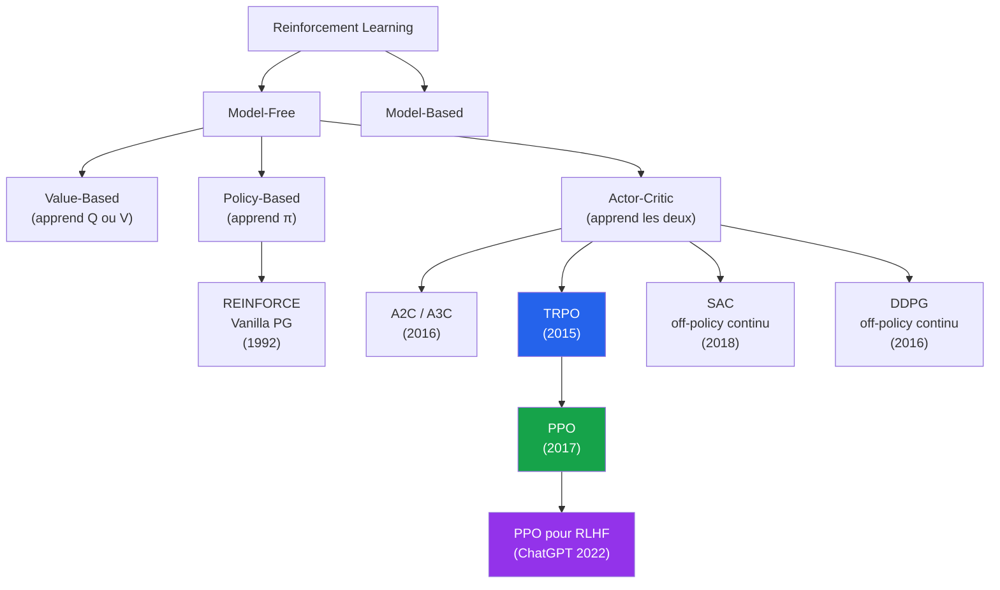

| Aspect | PPO |
|---|---|
| **Famille** | Actor-Critic, Policy-Based, On-Policy |
| **Type de politique** | **On-Policy** (apprend en suivant sa politique courante) |
| **Ce qui est appris** | $\pi_\theta(a \mid s)$ (acteur) + $V_\theta(s)$ (critique) |
| **Inventeurs** | Schulman, Wolski, Dhariwal, Radford, Klimov (OpenAI, 2017) |
| **Papier fondateur** | « Proximal Policy Optimization Algorithms » (arXiv, 2017) |
| **Ancêtre direct** | TRPO (Schulman et al., 2015) |
| **Successeur célèbre** | PPO + RLHF → ChatGPT (2022), Claude, Gemini |
| **Variantes** | PPO-Clip (la plus utilisée), PPO-Penalty, PPO+ICM, MAPPO |

---

### Le moment historique : OpenAI 2017 → ChatGPT 2022

**Juillet 2017** : John Schulman et son équipe à **OpenAI** publient « Proximal Policy Optimization Algorithms ». L'article révèle que PPO atteint des performances **comparables ou supérieures à TRPO** sur les benchmarks MuJoCo, avec une implémentation **dramatiquement plus simple**.

#### Performances initiales sur MuJoCo (2017)

| Environnement | TRPO | A2C | PPO |
|---|---|---|---|
| **HalfCheetah** | 1914 | 1000 | **3700** |
| **Hopper** | 2700 | 1000 | **3600** |
| **Walker2D** | 3500 | 2300 | **4800** |
| **Humanoid** | 600 | 600 | **3500** |

#### Les grandes réussites de PPO

| Année | Réalisation | Détails |
|---|---|---|
| **2017** | OpenAI Five (Dota 2) | Bat des équipes professionnelles, 180 ans d'expérience simulée |
| **2018** | OpenAI Dactyl | Manipulation d'un Rubik's Cube avec une main robotique |
| **2019** | Hide-and-Seek | Émergence spontanée de stratégies multi-agent |
| **2020** | GPT-3 (RLHF preview) | Premiers fine-tunings de LLMs avec PPO |
| **2022** | **ChatGPT** | Fine-tuning RLHF avec PPO sur GPT-3.5 |
| **2023** | GPT-4, Claude, Gemini | Tous utilisent PPO pour leur alignement |
| **2024** | Robots Figure AI, Tesla Optimus | Contrôle bas-niveau via PPO ou variantes |

> **ℹ️ Remarque**
> **Anecdote — Le papier qui a changé l'IA générative.**
>
> Le papier PPO de 2017 fait **15 pages** et a été reçu avec un enthousiasme modéré à l'époque. Personne n'aurait imaginé qu'en 2022, **5 ans plus tard**, cette même technique serait au cœur de **ChatGPT** et déclencherait la révolution des LLMs. Aujourd'hui, **PPO est cité dans plus de 25 000 articles scientifiques** et est devenu **l'algorithme de RL le plus utilisé au monde**.

> **💡 Astuce**
> **Vie réelle — Pourquoi PPO est partout en 2026.**
>
> | Domaine | Application |
> |---|---|
> | **LLMs alignés** | ChatGPT, Claude, Gemini — RLHF avec PPO sur récompense humaine |
> | **Jeux vidéo** | OpenAI Five (Dota), AlphaStar (StarCraft variant), Atari |
> | **Robotique** | Dactyl, Boston Dynamics Spot (fine-tuning), drones autonomes |
> | **Finance** | Trading algorithmique (Jane Street, Two Sigma) |
> | **Réseaux** | Optimisation de routage Google data centers |
> | **Science** | AlphaFold-like protein folding (variant), molecule design |
>
> Si vous lancez un projet de RL en 2026 et que vous ne savez pas par où commencer : **PPO**, dans 80% des cas.

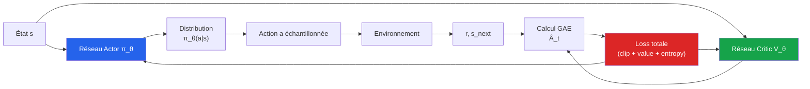

</details>

<p align="right"><a href="#top">↑ Retour en haut</a></p>

---

<a id="section-2"></a>

<details>
<summary>2 — Pourquoi PPO ? Limites de Vanilla Policy Gradient et TRPO</summary>

<br/>

Pour comprendre **pourquoi PPO existe**, il faut comprendre les **deux familles antérieures** dont il hérite : **Vanilla Policy Gradient (REINFORCE)** et **TRPO**. Chacune avait des problèmes — PPO les résout simultanément.

### 2a — Le problème de Vanilla Policy Gradient (REINFORCE)

**REINFORCE** (Williams, 1992) est l'ancêtre simple : on calcule directement le gradient de l'objectif RL par rapport aux paramètres de la politique.

➡️ Voir [**Éq. (2)**](#eq-policy-gradient).

#### L'algorithme en 4 lignes

```
1. Collecter une trajectoire τ = (s_0, a_0, r_0, ..., s_T) avec π_θ
2. Calculer le retour R_t = Σ γ^k r_{t+k} pour chaque pas
3. Calculer le gradient ∇_θ J = Σ ∇_θ log π_θ(a_t|s_t) · R_t
4. Mise à jour : θ ← θ + η · ∇_θ J
```

#### Les 3 problèmes majeurs

| Problème | Conséquence |
|---|---|
| **Variance énorme** | Le gradient varie énormément d'une trajectoire à l'autre → apprentissage très instable |
| **Sample inefficient** | Chaque trajectoire est utilisée **une seule fois** → besoin de millions d'épisodes |
| **Pas de garde-fou sur les updates** | Une grosse récompense peut **détruire** complètement une bonne politique d'un coup |

> **🛑 Danger**
> **L'instabilité de Vanilla PG en pratique.**
>
> Imaginez que la politique vient d'apprendre quelque chose de bon (score moyen ~80). Soudain, lors d'une trajectoire, l'agent obtient un score exceptionnel de **+500** par chance. Le gradient amplifie **massivement** les actions de cette trajectoire (même si elles étaient médiocres). Résultat : le score chute à **20** au prochain épisode. C'est le **phénomène d'oscillation** classique de REINFORCE.
>
> Cette instabilité est ce qui empêchait, avant 2015-2017, les méthodes Policy Gradient d'être prises au sérieux face à DQN.

> **❓ FAQ**
>
> **Q : Pourquoi la variance est-elle si grande en Policy Gradient ?**
> R : Parce qu'on multiplie par le **retour complet** $R_t$ (somme des récompenses futures). Si l'épisode dure 1000 pas avec des récompenses ±1, $R_t$ peut varier de -1000 à +1000. Multiplier le gradient par un nombre aussi variable → **explosion ou disparition** du gradient.
>
> **Solution intermédiaire** : utiliser une **baseline** (par exemple $V(s)$) pour soustraire au retour. C'est ce que fait **Actor-Critic**. Et ce que PPO étend avec **GAE** ([Section 4a](#section-4)).
>
> **Q : Pourquoi REINFORCE est-il si sample-inefficient ?**
> R : Parce qu'il est **on-policy strict** : chaque trajectoire est utilisée **une seule fois** pour un seul gradient, puis jetée. Pas de replay buffer. Pour un robot, ça veut dire **des semaines d'interaction physique** juste pour quelques mises à jour utiles.

---

### 2b — TRPO — l'ancêtre théoriquement parfait mais lourd

**TRPO** (*Trust Region Policy Optimization*, Schulman et al. 2015) résout le problème de stabilité de REINFORCE en **garantissant mathématiquement** que la nouvelle politique n'est pas trop éloignée de l'ancienne.

➡️ Voir [**Éq. (5)**](#eq-trpo).

#### L'idée géniale (mais coûteuse) de TRPO

Au lieu d'optimiser librement, TRPO **maximise** la fonction objectif **sous une contrainte de divergence KL** :

$$\max_\theta \quad L^{\text{CPI}}(\theta) \quad \text{sous la contrainte} \quad D_{\text{KL}}(\pi_{\text{old}} \,\Vert\, \pi_\theta) \leq \delta$$

| Avantage | Détail |
|---|---|
| **Garantie théorique** | Monotone improvement (la politique ne se dégrade JAMAIS) |
| **Empêche l'effondrement** | Updates trop grandes interdites par la contrainte |
| **Théorie élégante** | Liée à l'inégalité de **performance bound** de Kakade & Langford (2002) |

#### Mais les inconvénients sont gros

| Problème | Détail |
|---|---|
| **Calcul de la Hessienne** | Coûteux pour les gros réseaux |
| **Conjugate Gradient** | Algorithme numérique complexe |
| **Line search** | Backtracking pour respecter la contrainte |
| **Implémentation lourde** | ~500 lignes de code, beaucoup de pièges |
| **Mémoire** | Doit garder plusieurs réseaux en mémoire |

> **⚠️ Attention**
> **Pourquoi TRPO n'a jamais conquis l'industrie.**
>
> Même si TRPO est **théoriquement supérieur** à PPO, son implémentation correcte demande **un PhD en optimisation numérique**. Un ingénieur lambda met **des semaines** à coder TRPO correctement, alors qu'il code PPO en **un après-midi**. En 2026, TRPO est quasi-abandonné en pratique — **PPO l'a complètement remplacé** dans toutes les bibliothèques.

---

### 2c — L'idée géniale de PPO : remplacer la contrainte par un clip

**John Schulman** (le même chercheur qui a inventé TRPO) a réalisé en 2017 qu'on pouvait obtenir **presque le même bénéfice** que la contrainte KL avec un **simple `clip()`** sur le ratio de probabilité.

➡️ Voir [**Éq. (6)**](#eq-ppo-clip).

$$L^{\text{CLIP}}(\theta) = \mathbb{E}_t \left[ \min\Big( r_t(\theta) \hat{A}_t,\; \text{clip}\big(r_t(\theta), 1-\epsilon, 1+\epsilon\big) \hat{A}_t \Big) \right]$$

#### Pourquoi c'est génial

| Aspect | TRPO | PPO |
|---|---|---|
| **Mécanisme de stabilité** | Contrainte KL dure | Clip sur le ratio |
| **Calcul de la Hessienne** | ✅ Nécessaire | ❌ Pas besoin |
| **Conjugate Gradient** | ✅ Nécessaire | ❌ Pas besoin |
| **Optimiseur** | Custom (CG + line search) | **Adam standard** |
| **Lignes de code** | ~500 | ~200 |
| **Performance MuJoCo** | Référence (100%) | ~95-110% |
| **Multi-époques (réutilisation)** | Risqué (contrainte fragile) | **Sûr (clip garantit la stabilité)** |

> **📌 À retenir**
> **L'innovation de PPO en une phrase.**
>
> > **« Le clip est un substitut empirique à la contrainte KL : on rend la fonction objectif plate au-delà de $\pm \epsilon$, ce qui désincite l'optimiseur à s'éloigner trop. »**
>
> Mathématiquement, ce n'est **pas équivalent** à la contrainte KL. Mais empiriquement, ça donne **les mêmes bénéfices** (stabilité, monotone improvement quasi-garanti) avec **une fraction du coût**.


> **💡 Astuce**
> **Métaphore — Du Code Civil à la « règle du gros bon sens ».**
>
> - **TRPO** = un système juridique avec un Code Civil de **500 pages** qui définit exactement ce qu'on a le droit de faire (contrainte KL formelle). **Théoriquement parfait**, mais nécessite des avocats spécialisés pour l'appliquer.
>
> - **PPO** = la **règle du gros bon sens** : « **Ne change pas ton opinion de plus de 20% d'un coup.** » Pas aussi rigoureux que le Code Civil, mais **n'importe qui peut l'appliquer**, et dans la pratique ça fonctionne aussi bien.
>
> C'est pourquoi PPO a **gagné** : la simplicité l'emporte sur la perfection théorique.

> **❓ FAQ**
>
> **Q : PPO est-il vraiment meilleur que TRPO, ou juste plus simple ?**
> R : **Les deux**, généralement. Sur les benchmarks MuJoCo, PPO obtient souvent des scores **équivalents ou supérieurs** à TRPO. Et il le fait avec **10× moins de code** et **2-3× plus rapidement**. C'est ce qu'on appelle un **Pareto improvement** : strictement meilleur sur tous les axes pratiques.
>
> **Q : Y a-t-il des cas où TRPO bat PPO ?**
> R : Oui, sur des problèmes **très complexes avec des paysages de récompense très non-convexes**. TRPO offre des garanties théoriques que PPO n'a pas. Mais en pratique, on préfère **PPO + tuning d'hyperparamètres** (par ex. plusieurs runs avec différents seeds) plutôt que TRPO.

</details>

<p align="right"><a href="#top">↑ Retour en haut</a></p>

---

<a id="section-3"></a>

<details>
<summary>3 — L'équation PPO décortiquée terme par terme</summary>

<br/>

➡️ Voir [**Éq. (6) — Objectif PPO-Clip**](#eq-ppo-clip).

L'équation PPO peut sembler intimidante au premier coup d'œil, mais chaque morceau a un **rôle physique précis**. Décomposons-la.

### Décomposition visuelle

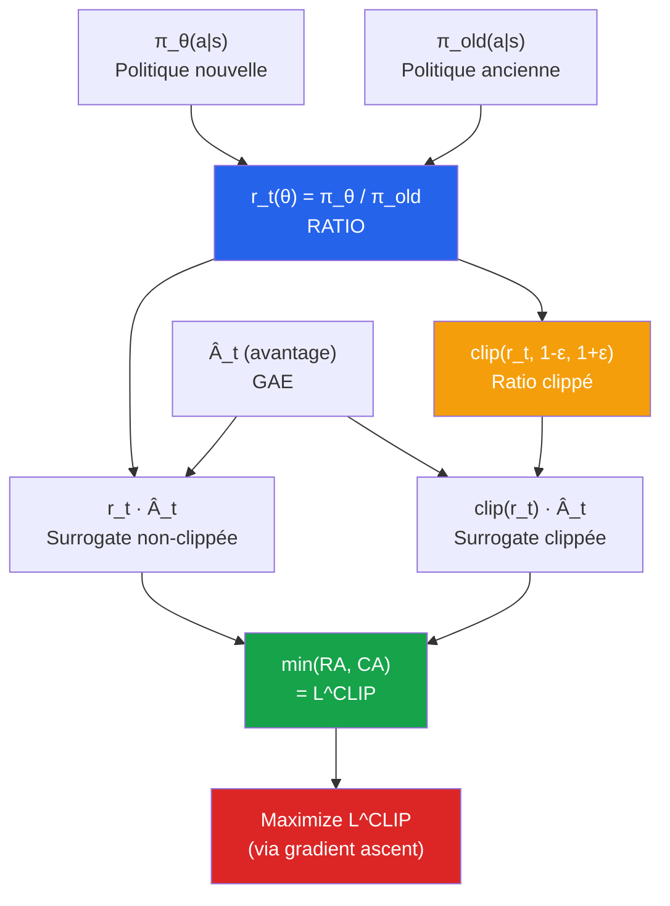

---

### 3a — Le ratio de probabilité

➡️ Voir [**Éq. (3)**](#eq-ratio).

$$r_t(\theta) = \frac{\pi_\theta(a_t | s_t)}{\pi_{\theta_{\text{old}}}(a_t | s_t)}$$

#### Que signifie ce ratio ?

C'est le **rapport** entre :
- $\pi_\theta(a_t | s_t)$ : la probabilité que la **nouvelle politique** choisisse l'action $a_t$
- $\pi_{\theta_{\text{old}}}(a_t | s_t)$ : la probabilité que l'**ancienne politique** ait choisi cette action

| Valeur de $r_t(\theta)$ | Interprétation |
|---|---|
| $r_t = 1$ | La politique n'a pas changé pour cet état-action |
| $r_t = 1.2$ | La nouvelle politique est **20% plus encline** à prendre cette action |
| $r_t = 0.8$ | La nouvelle politique est **20% moins encline** à prendre cette action |
| $r_t = 2.0$ | **Changement énorme** : la politique a doublé la probabilité de cette action |
| $r_t = 0.5$ | **Changement énorme** : la politique a divisé par 2 la probabilité |

> **📌 À retenir**
> **Le ratio est l'« unité de mesure » du changement.** Si $r_t = 1.5$, l'agent a augmenté de **50%** la probabilité de cette action. PPO veut **limiter** ce changement à $\pm \epsilon$ (typiquement 20%).

> **❓ FAQ**
>
> **Q : Pourquoi utiliser un ratio plutôt que de comparer directement les log-probabilités ?**
> R : Parce que c'est l'**importance sampling correction** issue de la théorie. Quand on a échantillonné une action avec $\pi_{\text{old}}$ mais qu'on veut estimer l'effet sur $\pi_\theta$, le ratio **corrige** mathématiquement le biais. C'est une astuce statistique classique (utilisée aussi dans IS estimation, Monte Carlo, etc.).
>
> **Q : Au début de l'entraînement, à quoi vaut $r_t$ ?**
> R : Exactement **1**, partout. Pourquoi ? Parce qu'au tout premier update, **on n'a pas encore changé** $\theta$ — donc $\pi_\theta = \pi_{\text{old}}$, donc le ratio vaut 1. C'est seulement après les premières étapes d'optimisation à l'intérieur d'une itération que $r_t$ commence à s'écarter de 1.

---

### 3b — Le clipping — l'idée centrale

#### Sans clip (CPI / TRPO base)

L'objectif **CPI (Conservative Policy Iteration)** non-clippé — voir [**Éq. (4)**](#eq-cpi) — est :

$$L^{\text{CPI}}(\theta) = \mathbb{E}_t \left[ r_t(\theta) \hat{A}_t \right]$$

**Problème** : si $\hat{A}_t > 0$ (bonne action) et que l'optimiseur découvre qu'augmenter $r_t$ augmente la loss, il poussera $r_t$ vers **+∞** sans aucune limite. Catastrophe !

#### Avec clip — l'invention de PPO

$$L^{\text{CLIP}}(\theta) = \mathbb{E}_t \left[ \min\Big( r_t(\theta) \hat{A}_t,\; \text{clip}(r_t(\theta), 1-\epsilon, 1+\epsilon) \hat{A}_t \Big) \right]$$

Comprendre cette équation demande de séparer les **2 cas** selon le signe de $\hat{A}_t$ :

#### Cas 1 : $\hat{A}_t > 0$ (action meilleure que la moyenne)

| Valeur de $r_t$ | $r_t \hat{A}_t$ | $\text{clip}(r_t) \hat{A}_t$ | $\min(...)$ | Effet sur le gradient |
|---|---|---|---|---|
| $r_t < 1 - \epsilon$ | petit positif | petit positif (clippé) | **petit positif** | ✅ Push pour augmenter $r_t$ |
| $1 - \epsilon \leq r_t \leq 1 + \epsilon$ | positif | identique | **positif (=** $r_t \hat{A}_t$) | ✅ Push normal |
| $r_t > 1 + \epsilon$ | **GROS positif** | clippé à $(1+\epsilon)\hat{A}_t$ | **petit positif (clippé)** | ❌ Bloqué — pas d'incitation à augmenter |

**Conclusion** : si l'action est bonne, on l'encourage **jusqu'à $r_t = 1 + \epsilon$**. Au-delà, le gradient devient **plat** → l'optimiseur arrête de pousser.

#### Cas 2 : $\hat{A}_t < 0$ (action pire que la moyenne)

| Valeur de $r_t$ | $r_t \hat{A}_t$ | $\text{clip}(r_t) \hat{A}_t$ | $\min(...)$ | Effet sur le gradient |
|---|---|---|---|---|
| $r_t < 1 - \epsilon$ | **TRÈS négatif** (gros en valeur abs) | clippé à $(1-\epsilon)\hat{A}_t$ | **TRÈS négatif** | ❌ Bloqué (parce que le min prend la plus petite valeur, ici on prend la non-clippée) |
| $1 - \epsilon \leq r_t \leq 1 + \epsilon$ | négatif | identique | **négatif** | ✅ Push pour diminuer $r_t$ |
| $r_t > 1 + \epsilon$ | petit négatif | clippé négatif | **petit négatif** | ✅ Push pour diminuer $r_t$ |

**Conclusion** : si l'action est mauvaise, on la décourage **jusqu'à $r_t = 1 - \epsilon$**. En dessous, le gradient devient plat.

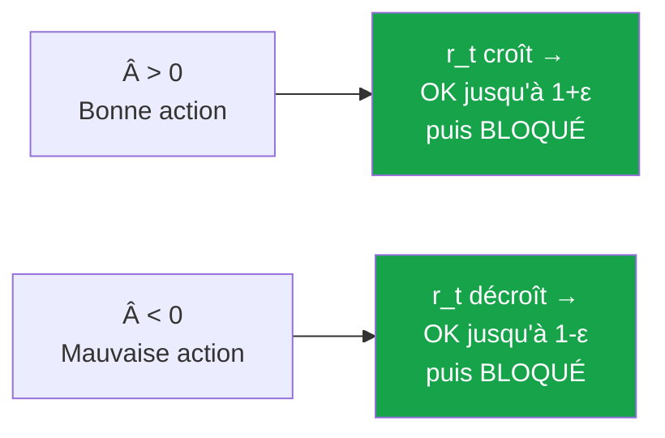

> **💡 Astuce**
> **Métaphore — Le coach sportif raisonnable.**
>
> Imaginez un coach de tennis qui veut améliorer votre service :
>
> - **Si tu fais un bon service** (Â > 0), le coach dit : « Bien ! Refais-le encore plus. **Mais ne change pas trop ton geste d'un coup**, sinon tu vas perdre tes repères. » → c'est le clip à $1 + \epsilon$.
> - **Si tu fais un mauvais service** (Â < 0), le coach dit : « Évite ce mouvement. **Mais ne le rends pas non plus impossible**, garde un peu de variabilité. » → c'est le clip à $1 - \epsilon$.
>
> Cette **prudence dans les corrections** est exactement ce que fait PPO. Pas trop de changements d'un coup = stabilité.

> **🛑 Danger**
> **L'erreur de comprehension classique.**
>
> Beaucoup d'étudiants pensent que **le clip empêche $r_t$ d'aller au-delà de $1 \pm \epsilon$**. **C'est FAUX**. Le clip ne change **rien** au ratio lui-même : il change seulement le **gradient**.
>
> Concrètement : si $r_t = 1.5$ et $\epsilon = 0.2$, le gradient sera celui de $\text{clip}(1.5, 0.8, 1.2) \cdot \hat{A}_t = 1.2 \cdot \hat{A}_t$ — donc **constant en $r_t$**, donc **gradient nul** par rapport à $r_t$. L'optimiseur **n'est pas incité** à augmenter encore $r_t$, mais rien ne l'empêche techniquement de le faire.

#### Valeurs typiques de $\epsilon$

| Valeur | Comportement |
|---|---|
| $\epsilon = 0.1$ | Très conservateur — apprentissage lent mais super stable |
| **$\epsilon = 0.2$** | **Valeur standard OpenAI** — fonctionne pour la plupart des problèmes |
| $\epsilon = 0.3$ | Plus agressif — peut accélérer mais risque d'instabilité |
| $\epsilon = 0.5$ | Trop grand — PPO ne se distingue plus de Vanilla PG |

---

### 3c — La loss totale (policy + value + entropy)

➡️ Voir [**Éq. (10)**](#eq-ppo-total).

PPO n'optimise pas seulement le clip — il optimise une **combinaison de 3 termes** :

$$L^{\text{TOTAL}}(\theta) = \mathbb{E}_t \left[ \underbrace{L^{\text{CLIP}}(\theta)}_{\text{politique}} - c_1 \underbrace{L^{\text{VF}}(\theta)}_{\text{valeur}} + c_2 \underbrace{H(\pi_\theta)}_{\text{entropie}} \right]$$

| Terme | Symbole | Rôle | Valeur typique de $c$ |
|---|---|---|---|
| **Policy loss (clip)** | $L^{\text{CLIP}}$ | Améliorer la politique | Coefficient 1 |
| **Value loss** | $L^{\text{VF}}$ | Améliorer le critic ($V_\theta$) — voir [Éq. 8](#eq-value-loss) | $c_1 = 0.5$ |
| **Entropy bonus** | $H(\pi_\theta)$ | Encourager l'exploration — voir [Éq. 9](#eq-entropy) | $c_2 = 0.01$ |

#### Pourquoi le bonus d'entropie ?

Le bonus d'entropie **maximise** $-\sum_a \pi_\theta(a|s) \log \pi_\theta(a|s)$, ce qui **encourage** une politique stochastique. Sans ce bonus, PPO converge **trop vite** vers une politique déterministe et **arrête d'explorer**.

> **💡 Astuce**
> **Vie réelle — Pourquoi rester curieux est important.**
>
> Imaginez un employé qui découvre qu'une certaine routine de travail fonctionne **bien** (récompense moyenne). Sans **curiosité**, il va répéter cette routine éternellement → il ne découvrira jamais des routines **encore meilleures**. Le bonus d'entropie de PPO **force l'agent** à garder un peu de hasard dans ses actions, exactement comme une « personnalité ouverte d'esprit » force un humain à essayer de nouvelles choses.

> **❓ FAQ**
>
> **Q : Pourquoi soustraire $c_1 L^{\text{VF}}$ et pas additionner ?**
> R : Parce qu'on **maximise** $L^{\text{TOTAL}}$ mais on veut **minimiser** la value loss (erreur de prédiction). Si on l'ajoutait, on **maximiserait l'erreur** — désastreux. La convention dans le papier OpenAI est de l'écrire avec un signe **-** pour faire apparaître que c'est une **régression** qu'on veut minimiser.
>
> **Q : Pourquoi le coefficient $c_2$ est-il si petit (0.01) ?**
> R : Parce que l'entropie a une **échelle naturelle élevée** ($\log$ d'une distribution) qui peut écraser les autres termes. $c_2 = 0.01$ est l'équilibre empirique qui **encourage l'exploration sans dominer l'objectif principal**. Pour des actions continues, on prend parfois $c_2 = 0$ ou très petit (la distribution gaussienne a déjà une entropie élevée naturellement).
>
> **Q : Que se passe-t-il si on retire le critic et qu'on garde juste le clip ?**
> R : Mathématiquement, ça reste **valide** (on peut utiliser le retour Monte Carlo $R_t$ comme avantage). Mais en pratique, **GAE avec un critic** réduit énormément la variance — l'apprentissage est **5-10× plus rapide**. C'est pourquoi PPO est **toujours** implémenté en architecture Actor-Critic.

</details>

<p align="right"><a href="#top">↑ Retour en haut</a></p>

---

<a id="section-4"></a>

<details>
<summary>4 — Les concepts clés de PPO</summary>

<br/>

PPO repose sur **3 concepts** qui doivent être bien compris pour implémenter et debugger correctement : **GAE** (avantage), **entropie** (exploration), **mini-batches + époques** (réutilisation des données).

### 4a — L'avantage GAE (Generalized Advantage Estimation)

➡️ Voir [**Éq. (11)**](#eq-gae) et [**Éq. (12)**](#eq-gae-recursive).

L'**avantage** $\hat{A}_t$ mesure **à quel point une action a été meilleure que la moyenne** dans cet état :

$$\hat{A}_t = Q(s_t, a_t) - V(s_t)$$

#### Pourquoi pas juste utiliser $R_t$ (Monte Carlo) ?

| Méthode | Calcul | Biais | Variance |
|---|---|---|---|
| **Monte Carlo** | $\hat{A}_t = R_t - V(s_t)$ | **Aucun** (vrai retour) | **Énorme** (somme de récompenses bruitées) |
| **TD(0)** | $\hat{A}_t = r_t + \gamma V(s_{t+1}) - V(s_t)$ | **Élevé** (dépend de $V$) | **Faible** |
| **GAE($\lambda$)** | Voir [Éq. 11](#eq-gae) | **Modulable** par $\lambda$ | **Modulable** |

#### Le compromis biais-variance avec $\lambda$

| $\lambda$ | Comportement | Biais | Variance |
|---|---|---|---|
| $\lambda = 0$ | TD(0) pur | Élevé | Faible |
| $\lambda = 0.5$ | Compromis | Moyen | Moyenne |
| **$\lambda = 0.95$** | **Standard PPO** | Faible | Modérée |
| $\lambda = 1$ | Monte Carlo pur | Aucun | Très élevée |

> **📌 À retenir**
> **GAE est un compromis intelligent.** Avec $\lambda = 0.95$ et $\gamma = 0.99$ (valeurs standard), GAE donne **le meilleur des deux mondes** : peu de biais (presque Monte Carlo) **et** variance modérée (le critic stabilise). C'est l'un des **secrets** de la performance de PPO.

#### Calcul efficient (récursif)

La forme [Éq. (12)](#eq-gae-recursive) permet un calcul en **$O(T)$** en remontant la trajectoire :

```python
# Pseudo-code GAE
advantages = np.zeros(T)
gae = 0
for t in reversed(range(T)):
    delta = rewards[t] + gamma * values[t+1] * (1 - dones[t]) - values[t]
    gae = delta + gamma * lam * (1 - dones[t]) * gae
    advantages[t] = gae
```

> **💡 Astuce**
> **Vie réelle — Pourquoi GAE marche.**
>
> Imaginez que vous évaluez **vos décisions de la semaine** :
>
> - **Monte Carlo** : « J'attends de voir comment se finit ma semaine, puis je jugerai toutes mes décisions. » → précis mais **trop d'événements aléatoires** entre temps. Variance énorme.
>
> - **TD(0)** : « Pour chaque décision, je regarde juste ce qui s'est passé **le lendemain**. » → rapide mais **myope**. Biais élevé.
>
> - **GAE(0.95)** : « Pour chaque décision, je regarde **les 3-4 prochains jours** avec un poids qui décroît exponentiellement. » → balance parfaite entre **précision** et **stabilité**.

> **🛑 Danger**
> **Normalisation de l'avantage.**
>
> En pratique, on **normalise** toujours l'avantage avant de l'utiliser :
>
> ```python
> advantages = (advantages - advantages.mean()) / (advantages.std() + 1e-8)
> ```
>
> Pourquoi ? Parce que l'**échelle absolue** des avantages varie énormément d'un environnement à l'autre. Cette normalisation rend PPO **robuste** à l'échelle des récompenses (Atari à $\pm 1$, MuJoCo à $\pm 100$, RLHF à $\pm 10$, etc.). Sans normalisation, $\epsilon = 0.2$ peut être **trop strict ou trop laxiste** selon l'environnement.

---

### 4b — Le bonus d'entropie

➡️ Voir [**Éq. (9)**](#eq-entropy).

$$H\big(\pi_\theta(\cdot \mid s_t)\big) = -\sum_a \pi_\theta(a \mid s_t) \log \pi_\theta(a \mid s_t)$$

#### Comportement selon l'entropie

| Distribution $\pi(a|s)$ | Entropie | Comportement |
|---|---|---|
| **Uniforme** ($\pi = (0.5, 0.5)$) | $\log 2 \approx 0.69$ | **Maximum** d'exploration |
| **Biaisée** ($\pi = (0.8, 0.2)$) | $\approx 0.50$ | Exploration modérée |
| **Quasi-déterministe** ($\pi = (0.99, 0.01)$) | $\approx 0.06$ | Peu d'exploration |
| **Déterministe** ($\pi = (1, 0)$) | $0$ | Aucune exploration |

#### Pourquoi c'est essentiel

Sans bonus d'entropie, **PPO converge trop vite** vers une politique déterministe. Imaginez un agent qui découvre une stratégie « OK » dès l'épisode 50 : sans entropy bonus, il va **figer** cette stratégie et ne plus jamais en chercher de meilleure.

Avec bonus d'entropie ($c_2 = 0.01$) :
- La politique reste **stochastique** plus longtemps
- L'agent **continue d'explorer** d'autres actions
- Au final, l'entropie **décroît naturellement** mais pas trop vite

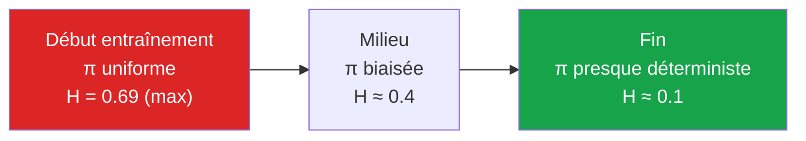

> **⚠️ Attention**
> **L'entropie ne doit pas chuter trop vite.** Un signe de problème dans PPO : si vous monitorez `entropy` pendant l'entraînement et qu'elle chute à 0 en **moins de 100 itérations**, vous avez probablement un bug ou $c_2$ trop bas. Une entropie qui décroît **lentement** sur 1000+ itérations est le signe d'un apprentissage sain.

---

### 4c — Les mini-batches et époques

C'est ici que PPO **diffère fondamentalement** de Vanilla Policy Gradient.

#### Vanilla PG vs PPO : utilisation des données

| | Vanilla PG | PPO |
|---|---|---|
| **Trajectoire collectée** | 1 fois | 1 fois |
| **Updates de gradient** | 1 update sur toute la trajectoire | **K époques** × **N mini-batches** |
| **Réutilisation des données** | ❌ Aucune | ✅ **Multiple** |

#### Pourquoi c'est possible

Vanilla PG est **strictement** on-policy : le gradient n'est valide **que pour la politique courante**. Dès qu'on modifie $\theta$, les anciennes trajectoires deviennent biaisées.

PPO **assouplit** cette contrainte grâce au **clip** : tant que $r_t(\theta) \in [1-\epsilon, 1+\epsilon]$, on peut **réutiliser** les trajectoires plusieurs fois sans introduire trop de biais. C'est ce qui rend PPO **bien plus sample-efficient** que Vanilla PG.

#### Boucle PPO typique

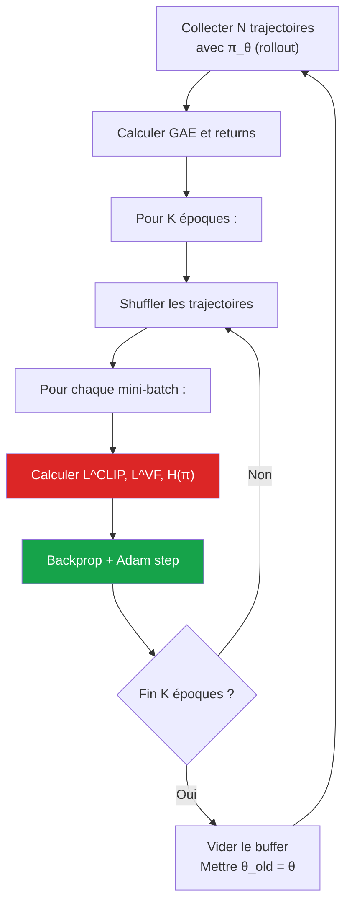

#### Hyperparamètres typiques

| Paramètre | Symbole | Valeur typique |
|---|---|---|
| **Pas de rollout** | $T$ | 2048 (CartPole) à 128 (Atari par env) |
| **Nombre d'environnements parallèles** | $N$ | 1 (simple) à 8-64 (efficace) |
| **Époques par rollout** | $K$ | **10** (standard) |
| **Taille mini-batch** | $B$ | 64 (simple) à 256 (Atari) |
| **Clip range** | $\epsilon$ | **0.2** (standard) |
| **GAE lambda** | $\lambda$ | **0.95** |
| **Discount** | $\gamma$ | **0.99** |
| **Learning rate** | $\eta$ | $3 \times 10^{-4}$ |
| **Coef value loss** | $c_1$ | **0.5** |
| **Coef entropy** | $c_2$ | **0.01** (discret) ou 0 (continu) |

> **❓ FAQ**
>
> **Q : Pourquoi 10 époques ? Pourquoi pas 50 ou 1 ?**
> R : Compromis empirique. **Trop peu (1-2 époques)** : on n'extrait pas assez d'info des trajectoires → PPO ressemble à Vanilla PG. **Trop (>20 époques)** : les ratios $r_t$ s'éloignent trop de 1, le clip devient inefficace, et la politique peut **diverger**. La valeur **K=10** est le sweet spot trouvé par OpenAI sur de nombreux benchmarks.
>
> **Q : Pourquoi shuffler les mini-batches à chaque époque ?**
> R : Pour éviter que l'optimiseur **overfit** sur l'ordre des transitions. Comme en supervised learning standard, le shuffling donne des gradients **moins corrélés** entre mini-batches → optimisation plus stable.
>
> **Q : Peut-on faire du PPO avec un seul environnement (pas parallèle) ?**
> R : Oui, et c'est même recommandé pour **débuter**. Mais en production, on utilise **plusieurs environnements en parallèle** (8 à 64) pour collecter des trajectoires plus **diversifiées**. Cela améliore drastiquement l'apprentissage. Les bibliothèques comme Stable-Baselines3 le font par défaut via `VecEnv`.

</details>

<p align="right"><a href="#top">↑ Retour en haut</a></p>

---

<a id="section-5"></a>

<details>
<summary>5 — Architecture Actor-Critic</summary>

<br/>

PPO est presque toujours implémenté en architecture **Actor-Critic** : **deux réseaux** (ou deux têtes d'un même réseau) qui apprennent en parallèle.

| Réseau | Sortie | Rôle |
|---|---|---|
| **Actor** ($\pi_\theta$) | Distribution sur les actions | Politique stochastique : « que faire ? » |
| **Critic** ($V_\theta$) | Valeur scalaire $V(s)$ | Estimation de la valeur de l'état : « est-ce bon d'être ici ? » |

### 5a — Réseaux séparés vs réseau partagé

#### Option 1 : Deux réseaux séparés

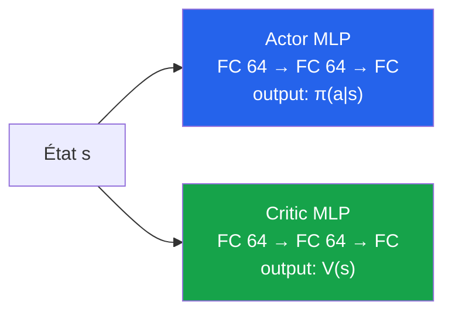

| Avantage | Inconvénient |
|---|---|
| Plus simple à coder | Pas de partage de features |
| Pas d'interférence entre actor et critic | Plus de paramètres |
| Standard pour CartPole, LunarLander, MuJoCo simple | |

#### Option 2 : Réseau partagé (avec deux têtes)

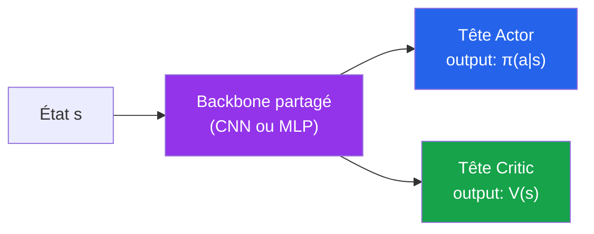

| Avantage | Inconvénient |
|---|---|
| **Beaucoup moins de paramètres** | **Interférence** entre actor et critic |
| Partage des features de bas niveau (utile pour Atari) | Plus difficile à équilibrer |
| Standard pour DQN et A3C | Demande un tuning fin de $c_1$ |

> **📌 À retenir**
> **Quand utiliser quoi ?**
>
> | Situation | Choix |
> |---|---|
> | Petit problème (CartPole, MuJoCo) | **Deux réseaux séparés** — plus simple, plus stable |
> | Images (Atari) | **Réseau partagé** avec CNN backbone — économise des paramètres |
> | RLHF sur LLMs | **Réseau partagé** (le LLM lui-même) — on ne peut pas dupliquer un modèle de 100B+ paramètres |
> | Robotique haute performance | **Deux réseaux séparés** — interférences trop problématiques en production |

---

### 5b — Politique discrète vs continue (Gaussian)

PPO gère **les deux** types d'actions naturellement, ce qui est l'une de ses forces majeures.

#### Cas 1 : Actions discrètes (CartPole, Atari)

L'actor produit un **vecteur de logits**, transformé en **distribution catégorique** via softmax :

```python
# Architecture pour actions discrètes
class ActorDiscrete(nn.Module):
    def __init__(self, state_dim, n_actions):
        super().__init__()
        self.net = nn.Sequential(
            nn.Linear(state_dim, 64), nn.Tanh(),
            nn.Linear(64, 64), nn.Tanh(),
            nn.Linear(64, n_actions),  # logits
        )
    
    def forward(self, x):
        logits = self.net(x)
        return torch.distributions.Categorical(logits=logits)
```

Échantillonnage :
```python
dist = actor(state)
action = dist.sample()
log_prob = dist.log_prob(action)
```

#### Cas 2 : Actions continues (MuJoCo, robotique)

➡️ Voir [**Éq. (13)**](#eq-policy-gaussian).

L'actor produit la **moyenne** $\mu$ et l'**écart-type** $\sigma$ d'une gaussienne :

```python
class ActorContinuous(nn.Module):
    def __init__(self, state_dim, action_dim):
        super().__init__()
        self.net = nn.Sequential(
            nn.Linear(state_dim, 64), nn.Tanh(),
            nn.Linear(64, 64), nn.Tanh(),
        )
        self.mean_head = nn.Linear(64, action_dim)
        # log_std est souvent un paramètre indépendant
        self.log_std = nn.Parameter(torch.zeros(action_dim))
    
    def forward(self, x):
        h = self.net(x)
        mean = self.mean_head(h)
        std = self.log_std.exp()
        return torch.distributions.Normal(mean, std)
```

> **⚠️ Attention**
> **Pourquoi `log_std` au lieu de `std` directement ?**
>
> Parce que `std` doit être **strictement positif**. Si on apprend directement `std`, l'optimiseur peut le faire passer en négatif (ce qui n'a pas de sens). On apprend donc `log_std` (qui peut être n'importe quel réel) et on prend l'exponentielle pour obtenir un `std` positif. **C'est le truc standard** en deep RL pour les distributions gaussiennes.
>
> Variante moderne (utilisée dans SAC) : `log_std` est **prédit par le réseau** (state-dependent) au lieu d'être un paramètre global. Cela permet à l'agent d'être **plus prudent dans certains états** et **plus exploratoire dans d'autres**.

#### Comparaison

| Aspect | Discret | Continu (Gaussian) |
|---|---|---|
| **Distribution** | Catégorique | Normale (Gaussian) |
| **Sortie actor** | $n$ logits | $n$ moyennes + $n$ log-std |
| **Échantillonnage** | `Categorical(logits).sample()` | `Normal(mu, sigma).sample()` |
| **Log-probabilité** | `dist.log_prob(action)` | Somme des log-probas par dim |
| **Cas d'usage** | Atari, CartPole, jeux à actions discrètes | MuJoCo, robotique, contrôle continu |
| **Bonus entropy** | $c_2 = 0.01$ standard | Souvent $c_2 = 0$ (l'entropie gaussienne est déjà élevée) |

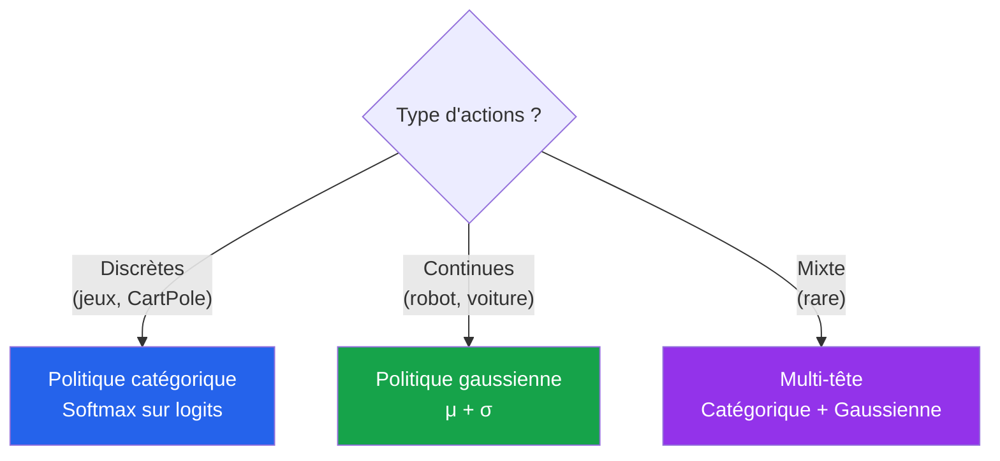

> **💡 Astuce**
> **Bornes des actions continues.** En MuJoCo, les actions sont souvent dans $[-1, 1]$. Pour éviter qu'une gaussienne produise des actions hors-bornes :
>
> 1. **`tanh` squashing** : appliquer $a = \tanh(\hat{a})$ après l'échantillonnage. Utilisé dans **SAC**.
> 2. **Clipping** : `action = action.clip(-1, 1)`. Simple mais introduit un biais.
> 3. **Beta distribution** : utiliser une distribution **bornée** au lieu d'une gaussienne. Plus rare mais théoriquement plus propre.
>
> Pour la majorité des cas (Stable-Baselines3, CleanRL), le **clipping simple** suffit.

</details>

<p align="right"><a href="#top">↑ Retour en haut</a></p>

---

<a id="section-6"></a>

<details>
<summary>6 — Algorithme PPO pas à pas</summary>

<br/>

### Pseudocode complet

```
Algorithme PPO(η, γ, λ, ε, K, B, n_iterations)
─────────────────────────────────────────────
1. Initialiser π_θ (actor) et V_φ (critic) aléatoirement
2. Pour chaque itération = 1 à n_iterations :
   a. Collecter T pas avec π_θ (rollout)
      Pour t = 1 à T :
        a_t ← π_θ(s_t), s_{t+1}, r_t = env.step(a_t)
        Stocker (s_t, a_t, r_t, log π_θ(a_t|s_t), V_φ(s_t))
   b. Calculer GAE et returns (équations 11-12)
      δ_t = r_t + γ V(s_{t+1}) - V(s_t)
      Â_t = δ_t + γλ Â_{t+1}    (récursif, à rebours)
      R_t = Â_t + V(s_t)         (target pour le critic)
   c. Normaliser les avantages : Â_t ← (Â_t - mean) / std
   d. θ_old ← θ (figer l'ancienne politique)
   e. Pour k = 1 à K époques :
      Shuffler les T transitions
      Pour chaque mini-batch B :
         • Calculer r_t(θ) = π_θ(a_t|s_t) / π_old(a_t|s_t)
         • L_CLIP = mean(min(r·Â, clip(r, 1-ε, 1+ε)·Â))     ← Éq. (6)
         • L_VF   = mean((V_φ(s) - R)²)                       ← Éq. (8)
         • L_S    = mean(entropy(π_θ))                        ← Éq. (9)
         • L_total = L_CLIP - c_1·L_VF + c_2·L_S              ← Éq. (10)
         • θ, φ ← Adam(-∇ L_total)                            ← Éq. (14)
3. Retourner π_θ
```

### Diagramme de flux

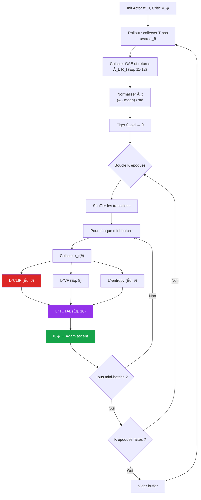

### Les 6 étapes clés commentées

| # | Étape | Pourquoi c'est important |
|---|---|---|
| 1 | **Rollout** | Collecter $T$ transitions avec **la politique courante** (on-policy) |
| 2 | **GAE** | Calcul efficient de l'avantage avec compromis biais-variance |
| 3 | **Normalisation** | Rend PPO robuste à l'échelle des récompenses |
| 4 | **Figer $\theta_{\text{old}}$** | Référence pour le ratio $r_t(\theta)$ — voir [Éq. (3)](#eq-ratio) |
| 5 | **K époques** | Réutilisation des données = sample efficiency |
| 6 | **Loss combinée** | Optimise actor, critic et entropy **simultanément** |

> **📌 À retenir**
> **Différences clés avec DQN :**
>
> | DQN | PPO |
> |---|---|
> | Off-policy (replay buffer) | On-policy (vider après chaque itération) |
> | Apprend $Q(s,a)$ | Apprend $\pi(a \mid s)$ ET $V(s)$ |
> | ε-greedy | Politique stochastique naturelle |
> | Target network | Pas de target network (mais $\theta_{\text{old}}$ joue un rôle similaire) |
> | Update à chaque pas | Update **par lot** après rollout complet |
> | Minimise loss (descente) | Maximise loss (ascension) |

### Hyperparamètres standards (recommandations OpenAI)

#### Pour CartPole / LunarLander (problèmes simples)

| Paramètre | Valeur |
|---|---|
| Learning rate $\eta$ | $3 \times 10^{-4}$ |
| Discount $\gamma$ | 0.99 |
| GAE $\lambda$ | 0.95 |
| Clip $\epsilon$ | 0.2 |
| Époques $K$ | 10 |
| Mini-batch size | 64 |
| Steps per rollout $T$ | 2048 |
| Coef value loss $c_1$ | 0.5 |
| Coef entropy $c_2$ | 0.01 |
| Optimiseur | Adam |

#### Pour Atari (images)

| Paramètre | Valeur |
|---|---|
| Learning rate $\eta$ | $2.5 \times 10^{-4}$ (avec linear decay) |
| GAE $\lambda$ | 0.95 |
| Clip $\epsilon$ | 0.1 |
| Époques $K$ | 4 |
| Mini-batch size | 256 |
| Envs parallèles | 8 |
| Steps per env per rollout | 128 (= 1024 total) |
| Frame stacking | 4 |

#### Pour MuJoCo (actions continues)

| Paramètre | Valeur |
|---|---|
| Learning rate $\eta$ | $3 \times 10^{-4}$ |
| GAE $\lambda$ | 0.95 |
| Clip $\epsilon$ | 0.2 |
| Époques $K$ | 10 |
| Mini-batch size | 64 |
| Politique | Gaussienne, `log_std` apprenable global |
| Coef entropy $c_2$ | 0 (l'entropie gaussienne suffit) |

> **🛑 Danger**
> **Pièges classiques d'implémentation PPO :**
>
> 1. **Oublier de normaliser les avantages** → PPO devient instable
> 2. **Oublier de figer $\theta_{\text{old}}$** entre les époques → ratio toujours = 1 → pas de clip
> 3. **Faire trop d'époques (K > 20)** → la politique diverge, le clip ne suffit plus
> 4. **Mauvais GAE (oublier `(1 - done)`)** → bootstrap à travers des transitions terminales
> 5. **Mélanger les rollouts entre itérations** → biais on-policy non respecté
> 6. **Pas de gradient clipping** → instabilité en cas de gradient extrême
> 7. **Mauvais `log_prob` après échantillonnage** → torch.distributions est subtil

> **❓ FAQ**
>
> **Q : Combien d'itérations pour résoudre CartPole avec PPO ?**
> R : Environ **30-50 itérations** (chacune avec un rollout de 2048 pas), soit **~100 000 transitions au total**. Temps : **2-5 minutes sur CPU**. Beaucoup plus rapide que DQN qui demande des centaines d'épisodes pour les mêmes performances.
>
> **Q : Combien d'itérations pour Atari avec PPO ?**
> R : Pour atteindre le niveau humain sur Breakout : **10-40 millions de frames**, soit **1-3 jours sur GPU**. C'est comparable à DQN mais avec une **politique plus stable** (moins de catastrophic forgetting).
>
> **Q : Pourquoi PPO maximise alors que DQN minimise ?**
> R : Convention. PPO optimise une **fonction objectif** ($J(\theta)$, retour attendu) qu'on **maximise**. DQN optimise une **erreur** (TD error) qu'on **minimise**. En pratique, dans le code, on écrit `loss = -L_total` pour pouvoir utiliser `.backward()` qui fait toujours une descente. Mais conceptuellement, **on monte le gradient** pour PPO.

</details>

<p align="right"><a href="#top">↑ Retour en haut</a></p>

---

<a id="section-7"></a>

<details>
<summary>7 — Exemple pédagogique — Une mise à jour PPO calculée à la main</summary>

<br/>

Pour bien comprendre PPO, calculons **à la main** une étape complète sur un mini-exemple CartPole. C'est l'exercice qui révèle si on a vraiment compris l'algorithme.

### Le setup

#### Environnement

CartPole-v1, mini-rollout de **3 pas**.

| Pas $t$ | État $s_t$ | Action $a_t$ | Récompense $r_t$ | $V_\phi(s_t)$ (prédiction du critic) | $\log \pi_{\theta_{\text{old}}}(a_t \mid s_t)$ |
|---|---|---|---|---|---|
| 0 | $s_0$ | 1 (Droite) | +1 | 7.2 | $-0.51$ ($\pi = 0.6$) |
| 1 | $s_1$ | 0 (Gauche) | +1 | 5.5 | $-0.92$ ($\pi = 0.4$) |
| 2 | $s_2$ | 1 (Droite) | +1 | 3.8 | $-0.69$ ($\pi = 0.5$) |
| **3 (terminal)** | $s_3$ | — | — | 0 (terminal) | — |

#### Hyperparamètres

| Paramètre | Valeur |
|---|---|
| $\gamma$ | 0.99 |
| $\lambda$ | 0.95 |
| $\epsilon$ (clip) | 0.2 |
| $c_1$ (value coef) | 0.5 |
| $c_2$ (entropy coef) | 0.01 |

---

### Étape 1 — Calculer les erreurs TD ($\delta_t$)

$$\delta_t = r_t + \gamma V(s_{t+1}) - V(s_t)$$

Notez que $s_3$ est **terminal**, donc $V(s_3) = 0$.

| Pas | Calcul | $\delta_t$ |
|---|---|---|
| 0 | $1 + 0.99 \times 5.5 - 7.2$ | $= 1 + 5.445 - 7.2 = \boxed{-0.755}$ |
| 1 | $1 + 0.99 \times 3.8 - 5.5$ | $= 1 + 3.762 - 5.5 = \boxed{-0.738}$ |
| 2 | $1 + 0.99 \times 0 - 3.8$ | $= 1 + 0 - 3.8 = \boxed{-2.800}$ |

> _Interprétation : les erreurs TD sont **négatives** car le critic **surestime** systématiquement les états — il prédit 7.2 mais le retour réel suggère moins._

---

### Étape 2 — Calculer GAE (récursif, à rebours)

➡️ Voir [**Éq. (12)**](#eq-gae-recursive).

$$\hat{A}_t = \delta_t + \gamma \lambda \, \hat{A}_{t+1}$$

avec $\hat{A}_3 = 0$ (terminal).

| Pas | Calcul | $\hat{A}_t$ |
|---|---|---|
| 2 | $-2.800 + 0.99 \times 0.95 \times 0$ | $= \boxed{-2.800}$ |
| 1 | $-0.738 + 0.99 \times 0.95 \times (-2.800)$ | $= -0.738 + 0.9405 \times (-2.800) = -0.738 - 2.633 = \boxed{-3.371}$ |
| 0 | $-0.755 + 0.99 \times 0.95 \times (-3.371)$ | $= -0.755 + 0.9405 \times (-3.371) = -0.755 - 3.171 = \boxed{-3.926}$ |

> _Observations : les avantages sont **négatifs** → toutes les actions prises étaient en réalité **pires que la moyenne attendue par le critic**. Le critic va devoir **diminuer** ses prédictions, et l'actor va **diminuer** la probabilité de ces actions._

---

### Étape 3 — Calculer les returns (cibles pour le critic)

$$R_t = \hat{A}_t + V(s_t)$$

| Pas | $\hat{A}_t$ | $V(s_t)$ | $R_t$ |
|---|---|---|---|
| 0 | $-3.926$ | $7.2$ | $\boxed{3.274}$ |
| 1 | $-3.371$ | $5.5$ | $\boxed{2.129}$ |
| 2 | $-2.800$ | $3.8$ | $\boxed{1.000}$ |

> _Note : $R_t$ est ce que le critic **devrait prédire**. Comme il prédit $V(s_0) = 7.2$ mais la cible est 3.274, il y a une grosse erreur — le critic est très optimiste._

---

### Étape 4 — Normaliser les avantages

$$\hat{A}_t \leftarrow \frac{\hat{A}_t - \text{mean}}{\text{std} + \epsilon_{\text{num}}}$$

- Mean = $(-3.926 - 3.371 - 2.800) / 3 = -3.366$
- Std = $\sqrt{((-0.560)^2 + (-0.005)^2 + (0.566)^2)/3} = \sqrt{0.106} \approx 0.460$

| Pas | $\hat{A}_t$ (brut) | $\hat{A}_t$ (normalisé) |
|---|---|---|
| 0 | $-3.926$ | $(-3.926 + 3.366) / 0.460 = \boxed{-1.217}$ |
| 1 | $-3.371$ | $(-3.371 + 3.366) / 0.460 = \boxed{-0.011}$ |
| 2 | $-2.800$ | $(-2.800 + 3.366) / 0.460 = \boxed{+1.230}$ |

> _Après normalisation, les avantages ont **mean = 0** et **std = 1**. Les deux premières actions étaient les plus mauvaises (avantage négatif), la troisième relativement meilleure._

---

### Étape 5 — Une étape d'optimisation (1 mini-batch, 1 époque)

Supposons qu'après une étape d'Adam, les nouvelles log-probabilités sont :

| Pas | $\log \pi_{\theta_{\text{old}}}$ | $\log \pi_\theta$ (après step) | $r_t(\theta)$ |
|---|---|---|---|
| 0 | $-0.51$ | $-0.40$ | $e^{(-0.40) - (-0.51)} = e^{0.11} = \boxed{1.116}$ |
| 1 | $-0.92$ | $-0.85$ | $e^{(-0.85) - (-0.92)} = e^{0.07} = \boxed{1.073}$ |
| 2 | $-0.69$ | $-0.65$ | $e^{(-0.65) - (-0.69)} = e^{0.04} = \boxed{1.041}$ |

> _On voit qu'**aucun** ratio ne dépasse $1 + \epsilon = 1.2$. Le clip n'est donc **pas activé** pour cet update — toutes les actions sont dans la « zone de confort »._

---

### Étape 6 — Calculer la loss L^CLIP par échantillon

$$L_t^{\text{CLIP}} = \min\big( r_t \hat{A}_t,\; \text{clip}(r_t, 0.8, 1.2) \hat{A}_t \big)$$

| Pas | $r_t$ | $\hat{A}_t$ | $r_t \hat{A}_t$ | $\text{clip}(r_t) \hat{A}_t$ | $\min(\cdot)$ |
|---|---|---|---|---|---|
| 0 | 1.116 | $-1.217$ | $-1.358$ | $-1.358$ (clip = 1.116, dans la zone) | $-1.358$ |
| 1 | 1.073 | $-0.011$ | $-0.012$ | $-0.012$ | $-0.012$ |
| 2 | 1.041 | $+1.230$ | $+1.280$ | $+1.280$ | $+1.280$ |

**Moyenne** $L^{\text{CLIP}} = (-1.358 - 0.012 + 1.280) / 3 = \boxed{-0.030}$

> _Interprétation : la loss est **légèrement négative**, ce qui signifie qu'après ce step, la politique n'a **pas encore amélioré** son objectif. C'est normal au début — il faudra de nombreuses itérations pour converger._

---

### Étape 7 — Si on dépasse le clip ?

Pour illustrer le **rôle du clip**, supposons qu'à un autre step, $r_t = 1.5$ et $\hat{A}_t = +2$ (une action très bonne mais qu'on essaie de pousser trop fort).

| Sans clip | Avec clip |
|---|---|
| $L = 1.5 \times 2 = 3.0$ | $L = \min(3.0,\; \text{clip}(1.5, 0.8, 1.2) \times 2) = \min(3.0, 2.4) = 2.4$ |

→ Le clip **plafonne** la loss à 2.4 au lieu de 3.0. **Le gradient par rapport à $r_t$ devient 0** au-delà de $r_t = 1.2$ → l'optimiseur **arrête de pousser**. C'est la **garantie de stabilité** de PPO.

---

### Étape 8 — Calculer L^VF (value loss)

$$L^{\text{VF}} = \frac{1}{T} \sum_t (V_\phi(s_t) - R_t)^2$$

Supposons après le step, $V_\phi(s_t) = (7.0, 5.3, 3.6)$ (légèrement plus bas qu'avant) :

| Pas | $V_\phi(s_t)$ | $R_t$ | Erreur² |
|---|---|---|---|
| 0 | 7.0 | 3.274 | $(7.0 - 3.274)^2 = 13.88$ |
| 1 | 5.3 | 2.129 | $(5.3 - 2.129)^2 = 10.05$ |
| 2 | 3.6 | 1.000 | $(3.6 - 1.000)^2 = 6.76$ |

$L^{\text{VF}} = (13.88 + 10.05 + 6.76) / 3 = \boxed{10.23}$

> _Le critic a encore beaucoup à apprendre — son erreur quadratique moyenne est de 10.23. Au fil des itérations, cette erreur diminuera vers 0._

---

### Étape 9 — Loss totale

$$L^{\text{TOTAL}} = L^{\text{CLIP}} - c_1 L^{\text{VF}} + c_2 H(\pi)$$

Supposons $H(\pi) = 0.65$ (entropie moyenne, politique encore stochastique).

$$L^{\text{TOTAL}} = -0.030 - 0.5 \times 10.23 + 0.01 \times 0.65$$
$$= -0.030 - 5.115 + 0.0065 = \boxed{-5.138}$$

> _On voit que le **terme value** ($-5.115$) domine la loss à ce stade. Le critic apprend rapidement au début, et seulement après que l'actor commence à progresser de manière significative._

---

### Étape 10 — Mise à jour

$$\theta \leftarrow \theta + \eta \nabla_\theta L^{\text{TOTAL}}$$

Adam calcule automatiquement le gradient par backpropagation, et la mise à jour augmente les probabilités des actions à avantage positif (pas 2 ici) et diminue celles à avantage négatif (pas 0).

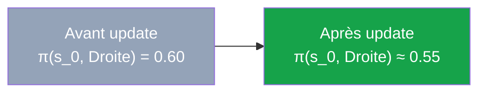

> **📌 À retenir**
> **Ce qu'on apprend de ce calcul :**
>
> 1. **GAE se calcule à rebours** (du dernier au premier pas) — c'est efficient en $O(T)$
> 2. **Les avantages sont normalisés** avant utilisation — robustesse à l'échelle
> 3. **Le ratio $r_t$** mesure le changement de politique — $r_t = 1$ au début, s'éloigne de 1 au fil des époques
> 4. **Le clip n'agit que si $|r_t - 1| > \epsilon$** — pendant les premières époques, il est inactif
> 5. **Le critic apprend plus vite que l'actor au début** — $L^{\text{VF}}$ domine la loss

> **💡 Astuce**
> **Comparaison avec DQN.**
>
> Pour la même transition CartPole, DQN ferait :
> - 1 update de gradient
> - Sur 1 batch de 64 transitions du replay buffer
> - Cible : $r + \gamma \max_{a'} Q_{\theta^{-}}(s', a')$
>
> PPO fait :
> - **K époques** × **N mini-batches** updates de gradient (par ex. 10 × 32 = 320 updates par rollout)
> - Sur **les transitions fraîches** uniquement (vidées après le rollout)
> - Optimise **actor + critic + entropie** simultanément
>
> PPO **réutilise plus** chaque trajectoire, ce qui compense partiellement son côté on-policy. Mais DQN reste plus sample-efficient absolument (réutilise des transitions vieilles de milliers d'étapes).

</details>

<p align="right"><a href="#top">↑ Retour en haut</a></p>

---

<a id="section-8"></a>

<details>
<summary>8 — PPO en pratique — Variantes, RLHF et trucs d'ingénieur</summary>

<br/>

Le papier PPO de 2017 est **simple**, mais l'implémentation efficace cache **des dizaines de détails subtils** qui font la différence entre un PPO qui marche et un PPO qui échoue. Cette section explore les variantes principales et les **tricks d'ingénieur** essentiels.

### 8a — PPO-Clip vs PPO-Penalty

Le papier d'origine d'OpenAI propose **deux variantes** :

#### PPO-Clip (la plus populaire)

➡️ Voir [**Éq. (6)**](#eq-ppo-clip).

$$L^{\text{CLIP}} = \mathbb{E}_t \left[ \min(r_t \hat{A}_t, \text{clip}(r_t, 1-\epsilon, 1+\epsilon) \hat{A}_t) \right]$$

| Avantage | Inconvénient |
|---|---|
| **Simple** à implémenter | Pas de garantie théorique stricte |
| **Hyperparamètre stable** ($\epsilon = 0.2$ marche partout) | |
| **Utilisée par défaut** dans Stable-Baselines3, RLlib, CleanRL | |

#### PPO-Penalty (variante KL adaptative)

➡️ Voir [**Éq. (7)**](#eq-ppo-penalty).

$$L^{\text{KLPEN}} = \mathbb{E}_t \left[ r_t \hat{A}_t - \beta \cdot D_{\text{KL}}(\pi_{\text{old}} \,\Vert\, \pi_\theta) \right]$$

avec $\beta$ **adaptatif** :
- Si $\text{KL} > 1.5 \delta_{\text{target}}$ : augmenter $\beta$ (pénalité plus forte)
- Si $\text{KL} < 0.67 \delta_{\text{target}}$ : diminuer $\beta$

| Avantage | Inconvénient |
|---|---|
| **Plus proche de TRPO** théoriquement | $\beta$ adaptatif est délicat à régler |
| Garantie sur la divergence KL | Performance souvent légèrement inférieure |

> **📌 À retenir**
> **Choix moderne (2026) :** quasi-tous les projets utilisent **PPO-Clip**. PPO-Penalty est plus utilisée dans **RLHF** parce que la pénalité KL est intuitive pour les LLMs (« ne dévie pas trop du modèle pré-entraîné »).

---

### 8b — PPO pour RLHF (ChatGPT, Claude, Gemini)

**RLHF** (*Reinforcement Learning from Human Feedback*) est l'application la plus médiatisée de PPO. Elle est utilisée pour **aligner les LLMs** avec les préférences humaines.

#### Le pipeline RLHF en 3 étapes

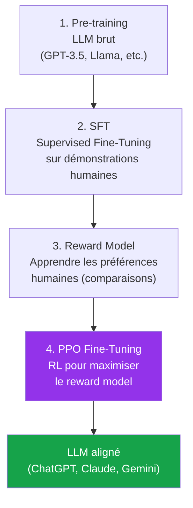

#### Spécificités de PPO en RLHF

| Aspect | PPO classique | PPO RLHF |
|---|---|---|
| **Modèle** | MLP 64 neurones | LLM 7B-175B paramètres |
| **État** | Vecteur ou image | Séquence de tokens |
| **Action** | Direction, force | Token suivant |
| **Récompense** | Fournie par l'env | Sortie du **Reward Model** |
| **Régularisation** | Entropy bonus | **KL penalty vers le SFT** (cf. PPO-Penalty) |
| **Hyperparamètres** | Standards | $\epsilon = 0.2$, mais souvent + KL penalty très forte |

> **💡 Astuce**
> **Pourquoi la KL penalty est-elle critique en RLHF ?**
>
> Sans KL penalty, PPO « **récompense-hack** » le Reward Model. L'agent découvre des phrases qui **maximisent** la récompense (par ex. en répétant certains mots flatteurs) mais qui sont **incohérentes** ou **trompeuses**. La KL penalty force la nouvelle politique à rester **proche du modèle pré-entraîné**, qui sait au moins parler français correctement.
>
> C'est pourquoi tous les LLMs alignés ont ce terme **dans leur loss** :
>
> $$L_{\text{RLHF}} = \mathbb{E}_t [\text{reward}] - \beta \cdot \text{KL}(\pi_\theta || \pi_{\text{SFT}})$$

#### Algorithmes successeurs à PPO en RLHF

| Algorithme | Année | Différence |
|---|---|---|
| **PPO (RLHF)** | 2022 | Standard ChatGPT |
| **DPO** (Direct Preference Optimization) | 2023 | **Pas besoin de reward model**, optimise directement sur les comparaisons |
| **IPO, KTO, ORPO** | 2024 | Variantes de DPO |
| **GRPO** (Group Relative Policy Optimization) | 2024 | Variante PPO sans critic — utilisée par DeepSeek-R1 |

> **❓ FAQ**
>
> **Q : Pourquoi pas DQN pour RLHF ?**
> R : Parce que les actions sont **un vocabulaire de 50 000+ tokens** — l'argmax serait inefficient et le forward pass produirait 50 000 Q-valeurs par étape. Et surtout, on veut une **politique stochastique** (le LLM doit pouvoir générer plusieurs réponses différentes pour la même question), ce que DQN ne fait pas naturellement.
>
> **Q : Combien de GPU pour entraîner un LLM avec PPO RLHF ?**
> R : Énorme. Pour aligner un modèle 7B :
> - **SFT** : 8-16 GPUs A100, quelques jours
> - **Reward Model** : 16-32 GPUs, 1-2 jours
> - **PPO RLHF** : 32-64 GPUs, 1-2 semaines (le critic + le SFT + le reward model + l'actor en mémoire = très lourd)
>
> Pour GPT-4 ou Claude Opus, on parle de **clusters de milliers de GPUs**.
>
> **Q : DPO va-t-il remplacer PPO ?**
> R : Probablement, oui. DPO est **plus simple** (pas de reward model, pas de PPO), **moins cher**, et donne des résultats **comparables** à PPO RLHF. Mais PPO reste utilisé pour les modèles les plus avancés (GPT-4, Claude Opus) où l'on veut le **contrôle fin** offert par PPO + reward model.

---

### 8c — Les 37 « implementation tricks »

En 2022, des chercheurs ont publié un papier célèbre intitulé **« The 37 Implementation Details of Proximal Policy Optimization »** (Andrew et al.). Voici les **plus importants** :

#### Tricks essentiels (sans eux, PPO marche mal)

| # | Trick | Impact |
|---|---|---|
| 1 | **Normalisation des avantages** | Critique — sans elle, l'apprentissage diverge |
| 2 | **Gradient clipping** (`max_norm=0.5`) | Empêche les gradients d'exploser |
| 3 | **Orthogonal initialization** | Initialisation des poids spéciale, accélère la convergence |
| 4 | **Learning rate annealing** (linéaire vers 0) | Stabilise la fin de l'entraînement |
| 5 | **Vectorized environments** (`VecEnv`) | Parallélisation, ×N speedup |
| 6 | **Observation normalization** | Running mean/std des observations |
| 7 | **Reward scaling** (pas clip) | Diviser par std des retours |

#### Tricks intermédiaires (utiles)

| # | Trick | Impact |
|---|---|---|
| 8 | **Value loss clipping** | Empêche le critic de bouger trop d'un coup |
| 9 | **Early stopping sur KL** | Stoppe les époques si KL trop grande |
| 10 | **Frame stacking** (Atari) | 4 frames empilés (comme DQN) |
| 11 | **Tanh activation** (au lieu de ReLU) pour MuJoCo | Marche mieux empiriquement |
| 12 | **Mini-batch shuffling** à chaque époque | Décorrèle les gradients |

#### Tricks avancés (production)

| # | Trick | Impact |
|---|---|---|
| 13 | **`log_std` global vs state-dependent** | Choix d'archi |
| 14 | **Activation orthogonale pour la dernière couche** | gain spécifique |
| 15 | **Adam epsilon = 1e-5** (au lieu du défaut 1e-8) | Stabilité numérique |
| 16 | **Bias init = 0** | Standard mais critique |
| 17 | **Atari : reward clipping [-1, 1]** | Comme DQN |

> **🛑 Danger**
> **Pourquoi tous ces tricks ?**
>
> PPO **dans le papier** est élégant et simple. Mais **PPO dans Stable-Baselines3** est bien plus complexe — il contient des dizaines de petites optimisations qui font la différence entre « ça marche un peu » et « ça marche super bien ».
>
> Si vous écrivez votre PPO from scratch et qu'il **ne marche pas**, ce n'est pas que vous avez mal compris l'algorithme — c'est probablement que vous avez oublié **3-5 de ces tricks**. La leçon : **utilisez Stable-Baselines3 pour la production**.

> **💡 Astuce**
> **Pour aller plus loin sur les tricks :**
>
> - 📘 **The 37 Implementation Details of PPO** — Andrew et al., 2022 (cours interactif sur ICLR Blog Track)
> - 💻 **CleanRL** — implémentation single-file de PPO **avec tous les tricks** documentés
> - 💻 **Stable-Baselines3** — production-ready, tricks intégrés par défaut
> - 📺 **Conférence ICLR 2022 « PPO trick by trick »** sur YouTube

---

### Variantes modernes de PPO (2024-2026)

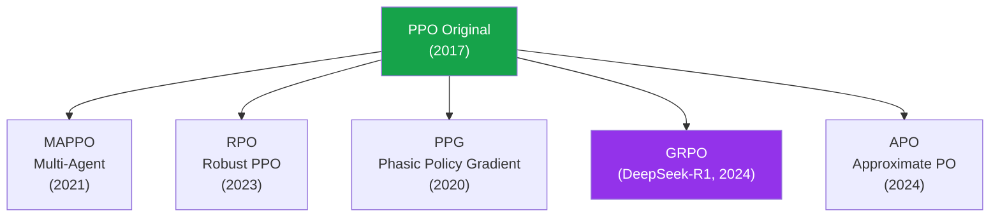

| Variante | Apport |
|---|---|
| **MAPPO** | PPO pour multi-agents (StarCraft, jeux coopératifs) |
| **PPG** | Sépare actor et critic dans des phases distinctes |
| **GRPO** | Pas de critic, calcule l'avantage relatif au groupe (DeepSeek) |
| **RPO** | Bruit dans les actions pour robustness |
| **TPPO** | PPO + Transformers pour les séquences |

</details>

<p align="right"><a href="#top">↑ Retour en haut</a></p>

---

<a id="section-9"></a>

<details>
<summary>9 — Implémentation Python complète et exécutable</summary>

<br/>

Cette section fournit une **implémentation pédagogique et complète** de PPO sur l'environnement **CartPole-v1**. Le code utilise **PyTorch** et **Gymnasium**. Il intègre les tricks essentiels (normalisation des avantages, gradient clipping) pour fonctionner du premier coup.

### Prérequis

```bash
pip install torch numpy gymnasium matplotlib
```

> **🛑 Danger**
> **Pièges classiques d'implémentation PPO :**
>
> 1. **Oublier `with torch.no_grad()` lors du rollout** → graphe de calcul énorme, OOM
> 2. **Oublier de figer `log_prob_old.detach()`** → le ratio devient 1 partout, le clip ne fait rien
> 3. **Mauvais GAE** : oublier le `(1 - done)` pour les transitions terminales
> 4. **Pas de normalisation des avantages** → instabilité massive
> 5. **K trop grand (>20 époques)** → la politique diverge malgré le clip
> 6. **Mauvais `log_prob` après échantillonnage** → torch.distributions est subtil
> 7. **Mélange entre rollouts** → biais on-policy violé
>
> Le code ci-dessous gère **tous ces pièges**.

---

### 9a — Le réseau Actor-Critic en PyTorch

```python
import torch
import torch.nn as nn
import torch.optim as optim
import torch.distributions as distributions
import numpy as np
import gymnasium as gym
from typing import List, Tuple


def layer_init(layer, std=np.sqrt(2), bias_const=0.0):
    """Orthogonal init — trick #3 du papier 37."""
    nn.init.orthogonal_(layer.weight, std)
    nn.init.constant_(layer.bias, bias_const)
    return layer


class ActorCritic(nn.Module):
    """
    Actor-Critic avec deux réseaux séparés (recommandé pour les petits problèmes).
    Pour Atari/RLHF, on partagerait un backbone CNN/Transformer.
    """
    def __init__(self, state_dim: int, n_actions: int, hidden: int = 64):
        super().__init__()
        # Actor : politique catégorique discrète
        self.actor = nn.Sequential(
            layer_init(nn.Linear(state_dim, hidden)),
            nn.Tanh(),
            layer_init(nn.Linear(hidden, hidden)),
            nn.Tanh(),
            layer_init(nn.Linear(hidden, n_actions), std=0.01),  # init petite pour la dernière couche
        )
        # Critic : valeur scalaire V(s)
        self.critic = nn.Sequential(
            layer_init(nn.Linear(state_dim, hidden)),
            nn.Tanh(),
            layer_init(nn.Linear(hidden, hidden)),
            nn.Tanh(),
            layer_init(nn.Linear(hidden, 1), std=1.0),
        )

    def get_value(self, state):
        return self.critic(state).squeeze(-1)

    def get_action_and_value(self, state, action=None):
        """
        Forward pass complet. Si action est fournie, retourne sa log-proba
        (pour le calcul du ratio durant l'optimisation).
        """
        logits = self.actor(state)
        dist = distributions.Categorical(logits=logits)
        if action is None:
            action = dist.sample()
        return action, dist.log_prob(action), dist.entropy(), self.get_value(state)
```

> **📌 À retenir**
> **Pourquoi `Tanh` et pas `ReLU` pour PPO ?**
>
> Empiriquement, **Tanh** fonctionne mieux sur les problèmes de contrôle continu (MuJoCo) et la plupart des problèmes simples. Pour les images (Atari), on utilise **ReLU** dans un CNN. C'est l'un des « 37 tricks » que beaucoup ignorent.

---

### 9b — Calcul de l'avantage GAE

```python
def compute_gae(
    rewards: torch.Tensor,
    values: torch.Tensor,
    next_values: torch.Tensor,
    dones: torch.Tensor,
    gamma: float = 0.99,
    lam: float = 0.95,
) -> Tuple[torch.Tensor, torch.Tensor]:
    """
    Calcule GAE et returns — Éq. (11) et (12).
    
    Args:
        rewards: [T] récompenses
        values: [T] valeurs prédites V(s_t)
        next_values: [T] valeurs prédites V(s_{t+1})
        dones: [T] flag terminal (1.0 si done sinon 0.0)
    
    Returns:
        advantages: [T] avantages GAE
        returns: [T] cibles pour le critic (R_t = Â_t + V(s_t))
    """
    T = rewards.shape[0]
    advantages = torch.zeros_like(rewards)
    last_gae = 0.0
    
    # Calcul récursif à rebours
    for t in reversed(range(T)):
        delta = rewards[t] + gamma * next_values[t] * (1 - dones[t]) - values[t]
        advantages[t] = last_gae = delta + gamma * lam * (1 - dones[t]) * last_gae
    
    returns = advantages + values
    return advantages, returns
```

---

### 9c — L'agent PPO complet

```python
class PPOAgent:
    """
    Agent PPO complet avec :
    - GAE pour l'avantage
    - Clipping du ratio (Éq. 6)
    - Bonus d'entropie (Éq. 9)
    - Gradient clipping
    - Normalisation des avantages
    """

    def __init__(
        self,
        state_dim: int,
        n_actions: int,
        lr: float = 3e-4,
        gamma: float = 0.99,
        gae_lambda: float = 0.95,
        clip_eps: float = 0.2,
        value_coef: float = 0.5,
        entropy_coef: float = 0.01,
        max_grad_norm: float = 0.5,
        n_epochs: int = 10,
        batch_size: int = 64,
        seed: int = 42,
    ):
        torch.manual_seed(seed)
        np.random.seed(seed)
        self.device = "cuda" if torch.cuda.is_available() else "cpu"
        
        self.network = ActorCritic(state_dim, n_actions).to(self.device)
        self.optimizer = optim.Adam(self.network.parameters(), lr=lr, eps=1e-5)
        
        self.gamma = gamma
        self.gae_lambda = gae_lambda
        self.clip_eps = clip_eps
        self.value_coef = value_coef
        self.entropy_coef = entropy_coef
        self.max_grad_norm = max_grad_norm
        self.n_epochs = n_epochs
        self.batch_size = batch_size

    def select_action(self, state: np.ndarray):
        """Sélectionne une action stochastique (pendant le rollout)."""
        with torch.no_grad():
            s = torch.as_tensor(state, dtype=torch.float32, device=self.device)
            action, log_prob, _, value = self.network.get_action_and_value(s)
        return int(action.item()), float(log_prob.item()), float(value.item())

    def update(
        self,
        states: np.ndarray,
        actions: np.ndarray,
        log_probs_old: np.ndarray,
        advantages: np.ndarray,
        returns: np.ndarray,
    ):
        """
        Une itération PPO : K époques sur les données collectées.
        """
        # Conversion en tenseurs
        states = torch.as_tensor(states, dtype=torch.float32, device=self.device)
        actions = torch.as_tensor(actions, dtype=torch.int64, device=self.device)
        log_probs_old = torch.as_tensor(log_probs_old, dtype=torch.float32, device=self.device)
        advantages = torch.as_tensor(advantages, dtype=torch.float32, device=self.device)
        returns = torch.as_tensor(returns, dtype=torch.float32, device=self.device)
        
        # CRUCIAL : normaliser les avantages
        advantages = (advantages - advantages.mean()) / (advantages.std() + 1e-8)
        
        T = states.shape[0]
        indices = np.arange(T)
        
        stats = {"L_clip": [], "L_value": [], "L_entropy": [], "kl": []}
        
        # K époques d'optimisation
        for epoch in range(self.n_epochs):
            np.random.shuffle(indices)
            
            # Mini-batches
            for start in range(0, T, self.batch_size):
                idx = indices[start:start + self.batch_size]
                
                # Forward pass avec les nouveaux paramètres
                _, log_probs_new, entropy, values_new = self.network.get_action_and_value(
                    states[idx], actions[idx]
                )
                
                # Ratio (Éq. 3)
                ratio = torch.exp(log_probs_new - log_probs_old[idx])
                
                # L^CLIP (Éq. 6) — on prend l'opposé car PPO maximise
                surr1 = ratio * advantages[idx]
                surr2 = torch.clamp(ratio, 1 - self.clip_eps, 1 + self.clip_eps) * advantages[idx]
                L_clip = -torch.min(surr1, surr2).mean()  # négatif car .backward() minimise
                
                # L^VF (Éq. 8)
                L_value = 0.5 * ((values_new - returns[idx]) ** 2).mean()
                
                # L^entropy (Éq. 9) — on prend l'opposé car on veut maximiser l'entropie
                L_entropy = -entropy.mean()
                
                # Loss totale (Éq. 10) — note le signe pour respecter .backward()
                loss = L_clip + self.value_coef * L_value + self.entropy_coef * L_entropy
                
                # Backprop + gradient clipping
                self.optimizer.zero_grad()
                loss.backward()
                nn.utils.clip_grad_norm_(self.network.parameters(), self.max_grad_norm)
                self.optimizer.step()
                
                # KL approximative pour monitoring
                with torch.no_grad():
                    approx_kl = ((ratio - 1) - (log_probs_new - log_probs_old[idx])).mean().item()
                
                stats["L_clip"].append(L_clip.item())
                stats["L_value"].append(L_value.item())
                stats["L_entropy"].append(L_entropy.item())
                stats["kl"].append(approx_kl)
        
        return {k: float(np.mean(v)) for k, v in stats.items()}
```

> **📌 À retenir**
> **Les 5 lignes critiques de PPO :**
>
> ```python
> ratio = torch.exp(log_probs_new - log_probs_old)         # 1. Ratio
> surr1 = ratio * advantages                                # 2. Surrogate non-clip
> surr2 = torch.clamp(ratio, 1-eps, 1+eps) * advantages    # 3. Surrogate clip
> L_clip = -torch.min(surr1, surr2).mean()                  # 4. Min des deux (Éq. 6)
> loss = L_clip + c1*L_value + c2*L_entropy                # 5. Loss totale (Éq. 10)
> ```
>
> Ces 5 lignes contiennent **toute la magie de PPO**. Le reste est de la plomberie (rollout, GAE, optimisation).

---

### 9d — Boucle d'entraînement sur CartPole

```python
def train_ppo(
    n_iterations: int = 50,
    rollout_steps: int = 2048,
    seed: int = 42,
):
    env = gym.make("CartPole-v1")
    env.reset(seed=seed)
    
    state_dim = env.observation_space.shape[0]
    n_actions = env.action_space.n
    
    agent = PPOAgent(state_dim=state_dim, n_actions=n_actions, seed=seed)
    
    iteration_rewards = []  # reward moyen par itération
    
    state, _ = env.reset(seed=seed)
    episode_reward = 0
    episode_rewards = []
    
    for iteration in range(n_iterations):
        # --- 1. Rollout ---
        states, actions, log_probs, rewards, dones, values = [], [], [], [], [], []
        
        for step in range(rollout_steps):
            action, log_prob, value = agent.select_action(state)
            next_state, reward, terminated, truncated, _ = env.step(action)
            done = terminated or truncated
            
            states.append(state)
            actions.append(action)
            log_probs.append(log_prob)
            rewards.append(reward)
            dones.append(float(done))
            values.append(value)
            
            episode_reward += reward
            state = next_state
            
            if done:
                episode_rewards.append(episode_reward)
                episode_reward = 0
                state, _ = env.reset()
        
        # --- 2. Bootstrap value pour le dernier état ---
        with torch.no_grad():
            s_t = torch.as_tensor(state, dtype=torch.float32, device=agent.device)
            last_value = agent.network.get_value(s_t).item()
        
        # --- 3. Calcul GAE ---
        rewards_t = torch.as_tensor(rewards, dtype=torch.float32)
        values_t = torch.as_tensor(values + [last_value], dtype=torch.float32)
        dones_t = torch.as_tensor(dones, dtype=torch.float32)
        
        advantages, returns = compute_gae(
            rewards_t, values_t[:-1], values_t[1:], dones_t,
            gamma=agent.gamma, lam=agent.gae_lambda
        )
        
        # --- 4. Update PPO ---
        stats = agent.update(
            np.array(states, dtype=np.float32),
            np.array(actions, dtype=np.int64),
            np.array(log_probs, dtype=np.float32),
            advantages.numpy(),
            returns.numpy(),
        )
        
        # --- 5. Log ---
        if episode_rewards:
            avg_reward = np.mean(episode_rewards[-20:])
            iteration_rewards.append(avg_reward)
            print(
                f"Iter {iteration+1:3d}/{n_iterations} | "
                f"Avg-20 reward = {avg_reward:6.1f} | "
                f"L_clip = {stats['L_clip']:.4f} | "
                f"L_value = {stats['L_value']:.4f} | "
                f"KL = {stats['kl']:.4f}"
            )
    
    env.close()
    return agent, iteration_rewards, episode_rewards


def plot_results(iteration_rewards, episode_rewards):
    import matplotlib.pyplot as plt
    fig, axes = plt.subplots(1, 2, figsize=(13, 4))
    
    axes[0].plot(iteration_rewards, color="C0", linewidth=2)
    axes[0].axhline(195, color="red", linestyle="--", label="Seuil 'résolu' (195)")
    axes[0].set_xlabel("Itération")
    axes[0].set_ylabel("Reward moyenne (20 derniers ép.)")
    axes[0].set_title("PPO sur CartPole-v1 — Progression par itération")
    axes[0].legend()
    axes[0].grid(alpha=0.3)
    
    axes[1].plot(episode_rewards, alpha=0.3, color="C1", label="Reward / épisode")
    if len(episode_rewards) >= 20:
        smooth = np.convolve(episode_rewards, np.ones(20)/20, mode="valid")
        axes[1].plot(range(19, len(episode_rewards)), smooth, color="C3", label="Moyenne 20 ép.")
    axes[1].set_xlabel("Épisode")
    axes[1].set_ylabel("Reward")
    axes[1].set_title("Reward par épisode")
    axes[1].legend()
    axes[1].grid(alpha=0.3)
    
    plt.tight_layout()
    plt.savefig("ppo_cartpole.png", dpi=120)
    plt.show()


if __name__ == "__main__":
    agent, iter_rewards, ep_rewards = train_ppo(n_iterations=50)
    plot_results(iter_rewards, ep_rewards)
```

---

### Résultats attendus

Sur **CartPole-v1** avec ce code (50 itérations × 2048 pas = ~100K transitions, **2-5 min sur CPU**) :

| Itération | Reward moyenne (20 derniers ép.) | Statut |
|---|---|---|
| 1-5 | ~20-30 | Politique random |
| 5-15 | 50-200 | Apprentissage rapide |
| 15-30 | 200-500 | Convergence |
| 30-50 | ~500 (max CartPole) | Stable |

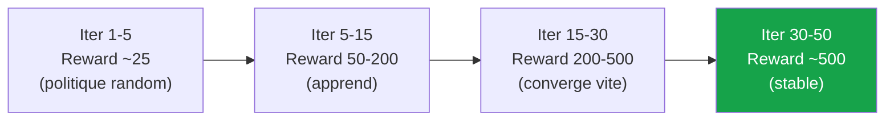

> **💡 Astuce**
> **PPO converge **plus vite** que DQN sur CartPole.** DQN demande ~150-250 épisodes pour résoudre CartPole, PPO le fait en **15-30 itérations** (~5000-10 000 transitions). C'est l'avantage de la réutilisation des données via les époques + GAE.

---

### Extension vers actions continues (LunarLanderContinuous, MuJoCo)

Pour MuJoCo, il suffit de remplacer la politique catégorique par une **gaussienne** :

```python
class ActorContinuous(nn.Module):
    def __init__(self, state_dim, action_dim, hidden=64):
        super().__init__()
        self.shared = nn.Sequential(
            layer_init(nn.Linear(state_dim, hidden)),
            nn.Tanh(),
            layer_init(nn.Linear(hidden, hidden)),
            nn.Tanh(),
        )
        self.mean_head = layer_init(nn.Linear(hidden, action_dim), std=0.01)
        # log_std est un paramètre global (state-independent)
        self.log_std = nn.Parameter(torch.zeros(action_dim))
    
    def forward(self, x):
        h = self.shared(x)
        mean = self.mean_head(h)
        std = self.log_std.exp().expand_as(mean)
        return distributions.Normal(mean, std)
```

Le reste du code reste **identique** — c'est la **polyvalence** de PPO.

> **⚠️ Attention**
> **Pour Atari, utilisez Stable-Baselines3.** Le code ci-dessus marche pour les problèmes simples, mais Atari demande **VecEnv parallèle**, **frame stacking**, **CNN spécifique**, et plusieurs tricks supplémentaires. Pour ces cas :
>
> ```python
> from stable_baselines3 import PPO
> from stable_baselines3.common.env_util import make_atari_env
> 
> env = make_atari_env("BreakoutNoFrameskip-v4", n_envs=8, seed=0)
> model = PPO("CnnPolicy", env, verbose=1)
> model.learn(total_timesteps=10_000_000)
> ```

---

### Variations à explorer

> **💡 Astuce**
> **Exercices pour approfondir :**
>
> 1. **Implémenter `log_std` state-dependent** (comme SAC) au lieu de global
> 2. **Ajouter du **value loss clipping** (trick #8) — observer la différence
> 3. **Tester sur LunarLanderContinuous-v2** — modifier l'actor pour gaussien
> 4. **Comparer PPO-Clip vs PPO-Penalty** — implémenter $\beta$ adaptatif
> 5. **Vectoriser l'environnement** avec `gym.vector.SyncVectorEnv` — ×8 vitesse
> 6. **Tracer la KL au fil du temps** — observer si elle reste bornée
> 7. **Implémenter early stopping sur KL** (trick #9) — comparer

</details>

<p align="right"><a href="#top">↑ Retour en haut</a></p>

---

<a id="section-10"></a>

<details>
<summary>10 — Quand utiliser PPO ? Forces, limites et alternatives</summary>

<br/>

PPO est l'algorithme le plus polyvalent du RL moderne, mais comme tous, il a ses cas d'usage privilégiés et ses limites.

### Tableau de décision

| Situation | Recommandation | Raison |
|---|---|---|
| **Premier projet de Deep RL** | **PPO** | Plus stable et facile à débugger que DQN |
| **Actions discrètes (jeux)** | **PPO** ou Rainbow DQN | Les deux marchent, PPO plus stable |
| **Actions continues (robot, voiture)** | **PPO** ou SAC | PPO si simulation rapide, SAC si données limitées |
| **RLHF (LLMs)** | **PPO** ou DPO | Standard industriel |
| **Politique stochastique requise** | **PPO** | DQN est déterministe |
| **Robotique réelle (peu d'expériences)** | **SAC** | Off-policy, sample-efficient |
| **Multi-agent** | **MAPPO** | Variante PPO multi-agent |
| **Environnement très bruité** | **PPO** | Plus robuste que DDPG, TD3 |
| **Très peu de samples disponibles** | Model-based (DreamerV3) | PPO demande beaucoup de transitions |
| **Atari (pixels)** | PPO ou Rainbow DQN | Les deux donnent ~même perf |
| **Reward très clairsemée** | PPO + Curiosity (RND, ICM) | PPO seul peine |

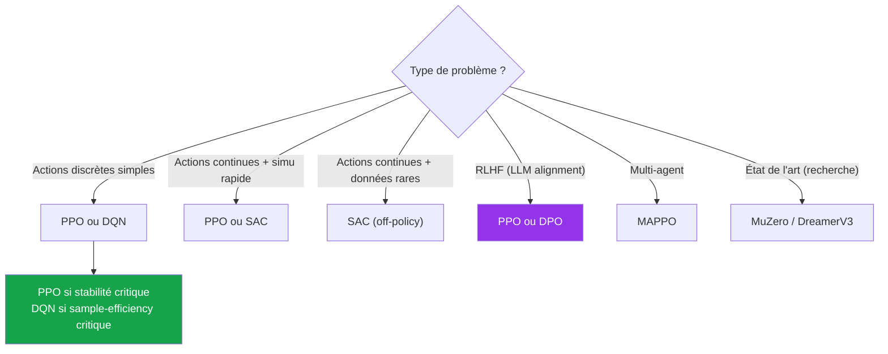

---

### Forces de PPO

> **📌 À retenir**
> **Pourquoi PPO est devenu le standard industriel :**
>
> 1. **Polyvalence** : actions discrètes, continues, mélange — PPO marche partout
> 2. **Stabilité** : le clip empêche les divergences catastrophiques
> 3. **Simplicité d'implémentation** : 200 lignes Python, comprehensible
> 4. **Hyperparamètres robustes** : les valeurs OpenAI ($\epsilon=0.2$, $\lambda=0.95$, etc.) marchent **partout**
> 5. **Politique stochastique** : utile pour exploration et incertitude
> 6. **Parallélisable** : `VecEnv` donne un speedup linéaire
> 7. **Communauté énorme** : Stable-Baselines3, RLlib, CleanRL — production-ready
> 8. **Base de RLHF** : ChatGPT, Claude, Gemini en dépendent

---

### Limites de PPO

> **🛑 Danger**
> **Ce que PPO ne sait pas (bien) faire :**
>
> 1. **Sample inefficient** : on-policy strict → demande **beaucoup** de transitions. Robot réel : impraticable sans simulation.
> 2. **Pas de replay buffer** : impossible de réutiliser des données expert ou anciennes.
> 3. **Sensible aux 37 tricks** : implémentation naïve donne 50% de la performance optimale.
> 4. **Critic interfere parfois avec l'actor** : tuning de $c_1$ critique.
> 5. **Reward hacking** : sur des récompenses mal-conçues (ex : RLHF), PPO peut « tricher » → KL penalty obligatoire.
> 6. **Convergence lente vs SAC** sur les tâches continues complexes.
> 7. **Politique stochastique forcée** : parfois on veut du déterministe → DDPG/TD3 sont meilleurs.

---

### PPO vs alternatives modernes (2026)

| Algorithme | Année | Type | Avantage | Quand l'utiliser |
|---|---|---|---|---|
| **PPO** | 2017 | On-policy, Actor-Critic | Stable, polyvalent | Choix par défaut |
| **DQN/Rainbow** | 2015/2017 | Off-policy, Value-based | Sample-efficient | Actions discrètes pures |
| **SAC** | 2018 | Off-policy, max entropy | Très sample-efficient | Robotique, données rares |
| **TD3** | 2018 | Off-policy déterministe | Précis sur continu | Contrôle fin |
| **DDPG** | 2016 | Off-policy déterministe | Simple | Souvent dépassé par SAC/TD3 |
| **DPO** | 2023 | Préférences directes | Pas de reward model | RLHF simplifié |
| **MuZero** | 2020 | Model-based + MCTS | SOTA Atari | Recherche pure |
| **DreamerV3** | 2023 | Model-based + world model | Sample-efficient | Robotique réelle |
| **GRPO** | 2024 | PPO sans critic | Plus simple | RLHF, DeepSeek-R1 |

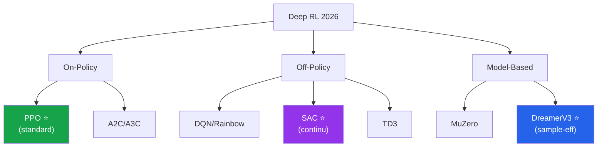

---

### Comparaison sur cas d'usage typiques

| Cas d'usage | Meilleur choix | Pourquoi |
|---|---|---|
| **Apprendre Atari** | **PPO** ou Rainbow | PPO plus simple, Rainbow plus performant |
| **Robot quadrupède (sim → réel)** | **SAC + PPO fine-tuning** | SAC pour data efficiency, PPO pour final tuning |
| **ChatGPT RLHF** | **PPO** | Standard, contrôle fin via KL |
| **Voiture autonome (sim)** | **PPO** ou SAC | PPO si politique stochastique souhaitée |
| **AlphaGo / AlphaZero like** | **MuZero** | Model-based + MCTS supérieur |
| **Apprentissage offline (batch RL)** | **CQL, IQL, DPO** | PPO n'est pas off-policy |
| **Petit projet pédagogique** | **PPO simple** | Le plus accessible et stable |
| **Course de Formule 1 simulée** | **PPO** | Standard pour les jeux de course |
| **Trading algorithmique** | **PPO + KL penalty** | Stabilité et contrôle |

> **💡 Astuce**
> **Règle d'or industrielle (2026) :**
>
> | Si vous avez | Utilisez |
> |---|---|
> | Un nouveau projet RL et pas d'idée | **PPO** (Stable-Baselines3) |
> | Beaucoup de données et besoin de précision | **SAC** (continu) ou **Rainbow** (discret) |
> | Très peu de données | **DreamerV3** (model-based) |
> | LLM ou alignement | **PPO** ou **DPO** |
> | Multi-agent | **MAPPO** |
> | Recherche cutting-edge | **MuZero**, **EfficientZero**, **R2D2** |

> **❓ FAQ**
>
> **Q : PPO est-il obsolète en 2026 avec l'émergence de DPO ?**
> R : **Pas encore**. DPO est une alternative **plus simple** pour le RLHF spécifique, mais PPO reste utilisé pour les modèles les plus avancés (GPT-4, Claude Opus, Gemini Ultra). Et en dehors du RLHF, PPO reste **le standard absolu** pour la robotique, les jeux, le contrôle continu.
>
> **Q : Faut-il apprendre PPO en 2026 si on débute en RL ?**
> R : **OUI, absolument**. PPO est **THE algorithme** à connaître. Plus polyvalent que DQN, plus stable que A3C, plus simple que TRPO. C'est le **couteau suisse du Deep RL moderne**.
>
> **Q : Combien de temps pour maîtriser PPO ?**
> R : Quelques jours pour le comprendre théoriquement. **Plusieurs semaines** pour l'implémenter correctement (les 37 tricks). **Plusieurs mois** pour le maîtriser sur des problèmes réels variés. Heureusement, Stable-Baselines3 vous évite la plupart du travail d'ingénierie.
>
> **Q : PPO est-il utilisé en industrie ?**
> R : **Oui, massivement**. Tesla, OpenAI, Anthropic, Google DeepMind, Boston Dynamics, Jane Street, Two Sigma, NVIDIA... tous l'utilisent dans leurs pipelines de production. C'est probablement **l'algorithme de RL le plus utilisé au monde** en 2026.

</details>

<p align="right"><a href="#top">↑ Retour en haut</a></p>

---

<a id="section-11"></a>

<details>
<summary>11 — Quiz — PPO en profondeur</summary>

<br/>

Ce quiz évalue votre compréhension complète de PPO. Répondez à chaque question, puis cliquez sur **💡 Voir la solution** pour vérifier.

---

#### 1. Concepts fondamentaux

**Question 1 :** Que signifie l'acronyme **PPO** ?

a) Policy Penalty Optimization

b) **Proximal Policy Optimization** — optimisation de politique proximale (qui reste proche de l'ancienne)

c) Parallel Policy Optimization

d) Predictive Policy Optimization

<details>
<summary>💡 Voir la solution</summary>

✅ **Réponse : b)**

**PPO = Proximal Policy Optimization**. Inventé par Schulman et al. à OpenAI en 2017. Le mot clé est **« Proximal »** = la nouvelle politique reste **proche** de l'ancienne, grâce au mécanisme de **clip** sur le ratio de probabilité — voir [**Éq. (6)**](#eq-ppo-clip).

</details>

---

**Question 2 :** PPO est un algorithme **on-policy** ou **off-policy** ?

a) Off-policy avec replay buffer

b) **On-policy** : il apprend uniquement sur des trajectoires fraîches générées par la politique courante

c) Hybride

d) Dépend de la configuration

<details>
<summary>💡 Voir la solution</summary>

✅ **Réponse : b)**

PPO est **strictement on-policy**. Après chaque itération :
- Les trajectoires collectées sont **utilisées K fois** (époques) pour des mises à jour
- Puis le buffer est **vidé** complètement
- L'itération suivante collecte de **nouvelles trajectoires** avec la politique mise à jour

Conséquence : PPO ne peut **pas** réutiliser des données anciennes ni d'experts, contrairement à DQN ou SAC.

</details>

---

#### 2. L'équation centrale (clip)

**Question 3 :** Quelle est l'**équation centrale** de PPO-Clip ?

a) $L = \mathbb{E}[r_t \hat{A}_t]$

b) $L = \mathbb{E}[\text{clip}(r_t, 1-\epsilon, 1+\epsilon) \hat{A}_t]$

c) **$L = \mathbb{E}[\min(r_t \hat{A}_t,\; \text{clip}(r_t, 1-\epsilon, 1+\epsilon) \hat{A}_t)]$**

d) $L = \mathbb{E}[\max(r_t \hat{A}_t,\; \text{clip}(r_t, 1-\epsilon, 1+\epsilon) \hat{A}_t)]$

<details>
<summary>💡 Voir la solution</summary>

✅ **Réponse : c)** — voir [**Éq. (6)**](#eq-ppo-clip).

C'est le **min** des deux versions (clippée et non-clippée). Le min est **crucial** :
- Si $\hat{A} > 0$ et $r_t > 1+\epsilon$ : le min prend la valeur clippée → plus d'incitation
- Si $\hat{A} > 0$ et $r_t < 1-\epsilon$ : le min prend la valeur non-clippée → on encourage l'augmentation
- Si $\hat{A} < 0$ : symétrie inverse

L'option d) (max) inverserait tout — la politique pourrait diverger. C'est une **erreur classique** dans les implémentations naïves.

</details>

---

**Question 4 :** Calculez la valeur de $L^{\text{CLIP}}$ pour un échantillon avec :
- $r_t = 1.3$, $\hat{A}_t = +2$, $\epsilon = 0.2$

<details>
<summary>💡 Voir la solution</summary>

✅ **Réponse : $L^{\text{CLIP}} = 2.4$**

- Non-clippé : $r_t \hat{A}_t = 1.3 \times 2 = 2.6$
- Clippé : $\text{clip}(1.3, 0.8, 1.2) \times 2 = 1.2 \times 2 = 2.4$
- Min : $\min(2.6, 2.4) = \boxed{2.4}$

**Conséquence** : le gradient par rapport à $r_t$ est **nul** dans cette zone — l'optimiseur arrête de pousser pour augmenter $r_t$ au-delà de 1.2. C'est l'effet **plafonnement** du clip.

</details>

---

**Question 5 :** Quel est le rôle du **ratio** $r_t(\theta) = \pi_\theta / \pi_{\text{old}}$ ?

<details>
<summary>💡 Voir la solution</summary>

✅ **Réponse :**

Le ratio mesure **à quel point la nouvelle politique a changé** par rapport à l'ancienne :

| Valeur | Interprétation |
|---|---|
| $r_t = 1$ | Pas de changement (au début de chaque itération) |
| $r_t = 1.2$ | Probabilité augmentée de 20% pour cette action |
| $r_t = 0.5$ | Probabilité divisée par 2 |

C'est aussi l'**importance sampling correction** : il permet de calculer correctement le gradient sur des données générées par $\pi_{\text{old}}$ tout en optimisant $\pi_\theta$.

Le **clip** sur ce ratio est ce qui rend PPO **stable** — voir [Éq. (6)](#eq-ppo-clip).

</details>

---

#### 3. GAE et avantage

**Question 6 :** Que signifie l'acronyme **GAE** ?

a) Gradient Advantage Estimator

b) **Generalized Advantage Estimation** — estimation généralisée de l'avantage qui balance biais et variance

c) Global Action Evaluator

d) Gaussian Action Encoder

<details>
<summary>💡 Voir la solution</summary>

✅ **Réponse : b)**

**GAE = Generalized Advantage Estimation** (Schulman et al., 2015). C'est une famille d'estimateurs paramétrée par $\lambda \in [0, 1]$ qui généralise :
- $\lambda = 0$ → TD(0), faible variance, fort biais
- $\lambda = 1$ → Monte Carlo, fort variance, sans biais
- $\lambda \in (0, 1)$ → compromis

En PPO, $\lambda = 0.95$ est standard — voir [**Éq. (11)**](#eq-gae).

</details>

---

**Question 7 :** Calculez l'avantage GAE pour ces transitions (gamma=0.99, lambda=0.95) :
- $\delta_2 = -1.0$, $\delta_1 = +0.5$, $\delta_0 = +0.8$
- Pas terminal après $\delta_2$.

<details>
<summary>💡 Voir la solution</summary>

✅ **Réponse :**

Calcul récursif à rebours (Éq. 12) : $\hat{A}_t = \delta_t + \gamma \lambda \hat{A}_{t+1}$, avec $\hat{A}_3 = 0$.

| Pas | Calcul | Résultat |
|---|---|---|
| 2 | $-1.0 + 0.99 \times 0.95 \times 0$ | $\boxed{-1.000}$ |
| 1 | $+0.5 + 0.99 \times 0.95 \times (-1.000) = 0.5 - 0.9405$ | $\boxed{-0.441}$ |
| 0 | $+0.8 + 0.99 \times 0.95 \times (-0.441) = 0.8 - 0.415$ | $\boxed{+0.385}$ |

**Observation** : la première action est jugée positive (+0.385), la deuxième mauvaise (-0.441), la troisième très mauvaise (-1.000). PPO va **augmenter** la probabilité de la première et **diminuer** celles des deux autres.

</details>

---

**Question 8 :** Pourquoi **normalise-t-on** les avantages avant l'update ?

<details>
<summary>💡 Voir la solution</summary>

✅ **Réponse :**

Trois raisons :

1. **Robustesse à l'échelle des récompenses** : un jeu peut avoir des récompenses dans $[-1, 1]$ (Atari clippé), un autre dans $[-1000, +1000]$ (MuJoCo). Sans normalisation, le **gradient varie de 1000×** d'un environnement à l'autre — impossible de garder $\epsilon = 0.2$ comme standard.

2. **Stabilité** : un avantage très grand peut faire **exploser** le gradient. La normalisation **borne** son influence.

3. **Effet implicite sur le learning rate** : normaliser revient à **rescaler** automatiquement le LR effectif.

```python
advantages = (advantages - advantages.mean()) / (advantages.std() + 1e-8)
```

C'est l'un des **« 37 tricks »** **les plus critiques** — sans cette normalisation, PPO marche souvent **5-10× moins bien**.

</details>

---

#### 4. Architecture et politique

**Question 9 :** Quelle est l'architecture standard de PPO ?

a) Un réseau Q

b) **Actor-Critic : un réseau actor pour π(a|s) et un critic pour V(s)**

c) Un seul réseau qui produit Q(s,a)

d) Un Transformer

<details>
<summary>💡 Voir la solution</summary>

✅ **Réponse : b)**

PPO utilise **toujours** une architecture Actor-Critic :
- **Actor** $\pi_\theta(a|s)$ : produit une distribution sur les actions (catégorique pour discret, gaussienne pour continu)
- **Critic** $V_\phi(s)$ : produit la valeur scalaire de l'état (utilisée dans GAE)

Les deux peuvent être **séparés** (plus simple) ou **partagés** (plus efficient pour Atari). Sans le critic, on aurait du Vanilla Policy Gradient avec Monte Carlo — **5-10× moins efficace**.

</details>

---

**Question 10 :** Pour des actions **continues** (MuJoCo), quelle distribution utilise PPO ?

a) Distribution catégorique

b) **Distribution gaussienne (Normale)** avec moyenne et écart-type

c) Distribution Beta

d) Distribution uniforme

<details>
<summary>💡 Voir la solution</summary>

✅ **Réponse : b)** — voir [**Éq. (13)**](#eq-policy-gaussian).

Pour les actions continues :

$$\pi_\theta(a | s) = \mathcal{N}\big(\mu_\theta(s),\, \sigma_\theta(s)^2\big)$$

L'actor produit la **moyenne** $\mu$ (par tête du réseau) et l'**écart-type** $\sigma$ (souvent comme paramètre global apprenable, ou state-dependent dans les variantes modernes comme SAC).

**Truc d'implémentation** : on apprend `log_std` puis on prend l'exponentielle, pour garantir un écart-type **strictement positif**.

L'option c) (Beta) est utilisée parfois pour **borner** naturellement les actions dans $[0, 1]$, mais c'est rare.

</details>

---

#### 5. Algorithme

**Question 11 :** Dans la boucle PPO, combien de fois utilise-t-on **chaque trajectoire** ?

a) Une fois (comme REINFORCE)

b) **K fois (typiquement K = 10 époques)**, en mini-batches shufflés

c) Indéfiniment (replay buffer comme DQN)

d) Jusqu'à convergence

<details>
<summary>💡 Voir la solution</summary>

✅ **Réponse : b)**

PPO réutilise chaque trajectoire **K = 10 fois** (standard OpenAI) en époques :

```
Pour chaque itération :
    Rollout (collecter T pas)
    Calculer GAE
    Pour k = 1 à K (= 10) :
        Shuffler
        Pour chaque mini-batch :
            Update PPO
    Vider le buffer
```

C'est **la clé de la sample-efficiency** de PPO par rapport à REINFORCE/A2C. Le **clip garantit** qu'on ne s'éloigne pas trop de la politique d'origine pendant ces K époques.

**Attention** : K trop grand (>20) → divergence. K=10 est le sweet spot.

</details>

---

**Question 12 :** Quelle ligne Python est **correcte** pour calculer le ratio PPO ?

```python
# Option A
ratio = log_probs_new / log_probs_old

# Option B
ratio = torch.exp(log_probs_new - log_probs_old)

# Option C
ratio = log_probs_new - log_probs_old

# Option D
ratio = torch.exp(log_probs_old - log_probs_new)
```

<details>
<summary>💡 Voir la solution</summary>

✅ **Réponse : Option B**

Le ratio est :

$$r_t(\theta) = \frac{\pi_\theta(a_t|s_t)}{\pi_{\text{old}}(a_t|s_t)} = \exp\big(\log \pi_\theta(a_t|s_t) - \log \pi_{\text{old}}(a_t|s_t)\big)$$

On utilise les **log-probabilités** (plus stables numériquement) et on prend l'exponentielle de la différence.

- Option A : faux, on ne **divise pas** des log-probabilités
- Option C : faux, c'est la log-différence, pas le ratio
- Option D : faux, inversion → $\pi_{\text{old}}/\pi_\theta$, pas l'inverse

**Piège critique** : `log_probs_old` doit avoir un `.detach()` ou être calculé hors graphe — sinon le gradient se propage à travers les deux termes et le clip ne fonctionne plus.

</details>

---

#### 6. Variantes et applications

**Question 13 :** Quelle est la **différence principale** entre PPO-Clip et PPO-Penalty ?

<details>
<summary>💡 Voir la solution</summary>

✅ **Réponse :**

| Aspect | PPO-Clip | PPO-Penalty |
|---|---|---|
| **Mécanisme** | Clip sur le ratio $r_t$ ([Éq. 6](#eq-ppo-clip)) | Pénalité KL adaptative ([Éq. 7](#eq-ppo-penalty)) |
| **Hyperparamètre** | $\epsilon$ (fixe, 0.2) | $\beta$ (adaptatif) |
| **Implémentation** | Plus simple | Plus complexe (ajuster $\beta$) |
| **Usage typique** | **Standard** (Stable-Baselines3) | **RLHF** (intuitif pour LLMs) |

PPO-Clip est la **version utilisée dans 99% des cas**. PPO-Penalty apparaît surtout dans **RLHF** parce que la KL penalty correspond intuitivement à « ne pas trop dévier du modèle pré-entraîné ».

</details>

---

**Question 14 :** Pourquoi PPO est-il l'algorithme **standard de RLHF** pour les LLMs comme ChatGPT ?

<details>
<summary>💡 Voir la solution</summary>

✅ **Réponse :**

Plusieurs raisons combinées :

1. **Politique stochastique** : un LLM doit pouvoir générer **plusieurs réponses** différentes pour la même question — PPO le fait naturellement
2. **Espace d'action gigantesque** (50K+ tokens) : PPO scale mieux que DQN dans cette situation
3. **Stabilité** : la KL penalty (variante PPO-Penalty) garantit que le modèle reste **proche du SFT** → pas de reward hacking trop fort
4. **Polyvalent** : marche avec des architectures Transformer énormes (100B+ paramètres)
5. **Précédent historique** : OpenAI a utilisé PPO depuis 2017, ils sont les pionniers de RLHF avec PPO

**Pipeline ChatGPT RLHF :**
1. Pre-training GPT-3.5
2. SFT sur démonstrations humaines
3. Reward Model sur comparaisons humaines
4. **PPO fine-tuning** sur Reward Model (avec KL penalty vers SFT)

En 2024-2026, **DPO** est apparu comme alternative plus simple. Mais PPO reste utilisé pour les modèles les plus avancés.

</details>

---

**Question 15 :** Quelle est la **règle d'or** pour choisir entre PPO et SAC ?

a) PPO si actions discrètes, SAC si actions continues

b) PPO si on a beaucoup de données, SAC si on en a peu

c) **PPO si simulation rapide (millions de transitions OK), SAC si données rares (robotique réelle)**

d) Ils sont équivalents

<details>
<summary>💡 Voir la solution</summary>

✅ **Réponse : c)**

| Critère | PPO | SAC |
|---|---|---|
| **Type** | On-policy | Off-policy |
| **Sample efficiency** | Faible | **Élevée** (replay buffer) |
| **Stabilité** | **Très élevée** | Élevée |
| **Actions** | Discrètes ou continues | Continues principalement |
| **Cas d'usage** | Simulation rapide, jeux, RLHF | Robotique réelle, données rares |

**En pratique** :
- **Jeu vidéo, simulation rapide, RLHF** → **PPO**
- **Robot physique, données coûteuses** → **SAC**

L'option a) est fausse — PPO gère **les deux** types d'actions. L'option b) est inversée. L'option c) est la bonne règle.

</details>

---

#### 7. Erreurs et debugging

**Question 16 :** Vous implémentez PPO et observez que **le ratio reste toujours à 1.0**. Quel est le problème probable ?

<details>
<summary>💡 Voir la solution</summary>

✅ **Réponse :**

Vous avez probablement **oublié de figer** `log_probs_old`. Le ratio est :

$$r_t = \exp(\log \pi_\theta - \log \pi_{\text{old}})$$

Si vous utilisez **les MÊMES log-probabilités** pour les deux (sans détacher l'ancienne), alors `log_probs_new = log_probs_old` toujours → `ratio = 1.0`.

**Bug typique** :
```python
# ❌ MAUVAIS
log_probs = net.get_log_probs(states, actions)  # même variable
ratio = torch.exp(log_probs - log_probs)         # toujours 1 !

# ✅ BON
log_probs_old = net.get_log_probs(states, actions).detach()  # ou .item() puis as_tensor
# ... pendant l'update ...
log_probs_new = net.get_log_probs(states, actions)
ratio = torch.exp(log_probs_new - log_probs_old)  # peut varier
```

**Conséquence** : si ratio = 1 partout, le clip ne s'active jamais et PPO **dégénère en Vanilla PG**.

</details>

---

**Question 17 :** Quelle est la **valeur typique** de l'hyperparamètre $\epsilon$ (clip range) dans PPO ?

a) 0.001

b) 0.01

c) **0.2** (standard OpenAI)

d) 0.5

<details>
<summary>💡 Voir la solution</summary>

✅ **Réponse : c)**

**$\epsilon = 0.2$** est la valeur standard du papier OpenAI 2017 et fonctionne **pour la quasi-totalité des problèmes**.

| Valeur | Comportement |
|---|---|
| 0.1 | Très conservateur, apprentissage lent |
| **0.2** | **Standard** — fonctionne partout |
| 0.3 | Plus agressif, parfois plus rapide |
| 0.5+ | Trop large, PPO devient instable (proche de Vanilla PG) |

Pour Atari, on utilise parfois 0.1 (politique plus rapide à diverger). Pour MuJoCo, 0.2 est universel.

</details>

---

#### 8. Histoire et impact

**Question 18 :** Vrai ou faux : **« PPO est utilisé dans l'entraînement de ChatGPT. »**

<details>
<summary>💡 Voir la solution</summary>

✅ **Réponse : VRAI**

PPO est l'algorithme utilisé dans la phase **RLHF** (Reinforcement Learning from Human Feedback) d'OpenAI pour aligner GPT-3.5 et GPT-4 (= ChatGPT). C'est ce qui rend ChatGPT « gentil » et « utile » : sans RLHF, le modèle brut produit souvent du texte toxique ou inapproprié.

La pipeline complète :
1. **GPT-3 brut** → ne suit pas les instructions
2. **+ SFT** (fine-tuning supervisé) → suit les instructions
3. **+ Reward Model** (apprend les préférences humaines)
4. **+ PPO** (optimise vers le Reward Model) → **ChatGPT** !

C'est l'une des **applications les plus importantes de PPO** en 2026, et c'est ce qui a déclenché toute la révolution des LLMs alignés.

</details>

---

#### 9. Convergence et stabilité

**Question 19 :** Que se passe-t-il si on prend $K$ (nombre d'époques) trop grand (par ex. $K = 50$) ?

<details>
<summary>💡 Voir la solution</summary>

✅ **Réponse :**

Avec $K$ trop grand, **la politique s'éloigne trop de $\pi_{\text{old}}$**, et le clip **ne suffit plus** à compenser. Plusieurs symptômes :

1. **Les ratios $r_t$** s'éloignent **dramatiquement** de 1 (par ex. 5 ou 0.1)
2. **La KL divergence** explose
3. **L'entropie** chute brutalement vers 0
4. **La reward** s'effondre ou stagne
5. **Catastrophic forgetting** : la politique « casse » ce qu'elle avait appris

**Solution** : garder $K = 10$ (standard) ou ajouter un **early stopping basé sur la KL** (trick #9 du papier 37) :

```python
if approx_kl > 0.015:
    print(f"Early stopping at epoch {epoch} due to KL = {approx_kl}")
    break
```

</details>

---

**Question 20 :** Vrai ou faux : **« PPO a une garantie théorique de convergence comme Q-Learning tabulaire. »**

<details>
<summary>💡 Voir la solution</summary>

✅ **Réponse : FAUX**

Q-Learning tabulaire converge sous les conditions de **Robbins-Monro** (Watkins 1992). PPO **n'a aucune garantie théorique de convergence**.

Cependant :
- **TRPO** (l'ancêtre de PPO) a une garantie de **monotone improvement** (la politique ne se dégrade jamais)
- **PPO approxime** cette garantie via le clip — mais **sans preuve mathématique stricte**
- En pratique, PPO converge **empiriquement très bien** sur la quasi-totalité des problèmes testés

C'est l'un des grands **trade-offs** de PPO : on échange **la rigueur théorique de TRPO** contre la **simplicité d'implémentation**. Et en pratique, c'est largement gagnant.

</details>

</details>

<p align="right"><a href="#top">↑ Retour en haut</a></p>

---

<a id="section-12"></a>

<details>
<summary>12 — Synthèse du chapitre</summary>

<br/>

### Ce que vous avez appris

```mermaid
mindmap
  root((PPO))
    Concept
      Proximal Policy Optimization
      Policy Gradient + clip
      On-Policy Actor-Critic
      Stable et polyvalent
    Equation
      L^CLIP = min(r·Â, clip(r)·Â)
      Ratio r = π_new / π_old
      Clip à 1 ± ε (typique 0.2)
      Loss = L_clip + c1·L_VF + c2·L_S
    GAE
      Compromis biais-variance
      lambda = 0.95 standard
      Calcul récursif O(T)
      Normalisation obligatoire
    Architecture
      Actor + Critic
      Politique stochastique
      Catégorique discrète
      Gaussienne continue
    Algorithme
      Rollout T pas
      GAE pour Â_t
      K époques mini-batchs
      Vider buffer puis recommencer
    Variantes
      PPO-Clip standard
      PPO-Penalty pour RLHF
      MAPPO multi-agent
      GRPO sans critic
    Applications
      Robots Boston Dynamics
      OpenAI Five Dota
      ChatGPT Claude Gemini RLHF
      Trading algorithmique
```

---

### Les 12 points à retenir absolument

| # | Point clé |
|---|---|
| **1** | **PPO** = Proximal Policy Optimization — on-policy, Actor-Critic, avec clip |
| **2** | PPO remplace la **contrainte KL dure** de TRPO par un **clip simple** sur le ratio — 10× plus simple à coder |
| **3** | Équation centrale ([Éq. 6](#eq-ppo-clip)) : $L^{\text{CLIP}} = \mathbb{E}[\min(r_t \hat{A}_t,\; \text{clip}(r_t, 1-\epsilon, 1+\epsilon) \hat{A}_t)]$ |
| **4** | Le **ratio** $r_t = \pi_\theta / \pi_{\text{old}}$ mesure le changement de politique — voir [Éq. (3)](#eq-ratio) |
| **5** | Le **clip** à $1 \pm \epsilon$ (typiquement $\epsilon = 0.2$) garantit la stabilité |
| **6** | **GAE** ($\lambda = 0.95$) calcule l'avantage avec compromis biais-variance — [Éq. (11)](#eq-gae) |
| **7** | Loss totale = **L_clip - c1·L_value + c2·L_entropy** (actor + critic + exploration) |
| **8** | **K époques** (typiquement 10) sur chaque rollout → sample efficiency |
| **9** | **Normalisation des avantages** obligatoire pour la robustesse |
| **10** | PPO marche pour **actions discrètes** (catégorique) **ET continues** (gaussienne) |
| **11** | PPO est le **standard RLHF** (ChatGPT, Claude, Gemini) et de la **robotique** moderne |
| **12** | Choix industriel 2026 : **PPO par défaut**, SAC si données rares, Rainbow si actions purement discrètes |

---

### Différences fondamentales avec DQN

| Aspect | DQN | PPO |
|---|---|---|
| **Famille** | Value-Based | Actor-Critic (Policy-Based + Value-Based) |
| **Politique** | $\pi(s) = \arg\max Q$ (déterministe + ε-greedy) | $\pi(a \mid s)$ stochastique |
| **Type** | Off-policy | On-policy |
| **Replay Buffer** | ✅ Oui | ❌ Non (sauf variantes) |
| **Target network** | ✅ Oui | ❌ Non ($\theta_{\text{old}}$ joue un rôle similaire) |
| **Actions continues** | ❌ Impossible | ✅ Naturel (gaussienne) |
| **Sample efficiency** | **Élevée** (réutilise des données anciennes) | Faible (vide après chaque iter) |
| **Stabilité** | Sensible (peut diverger) | **Très stable** (le clip protège) |
| **Convergence garantie** | Q-Learning tabulaire OUI, DQN NON | NON (mais empiriquement très bonne) |
| **Update direction** | Minimise loss | Maximise objectif |
| **Cas d'usage** | Actions discrètes, jeux Atari | Polyvalent : discret, continu, RLHF |

---

### Différences fondamentales avec TRPO

| Aspect | TRPO | PPO |
|---|---|---|
| **Contrainte** | KL ≤ δ (dure) | Clip sur $r_t$ (douce) |
| **Calcul Hessienne** | ✅ Oui | ❌ Non |
| **Conjugate Gradient** | ✅ Oui | ❌ Non |
| **Optimiseur** | Custom CG + line search | **Adam standard** |
| **Lignes de code** | ~500 | ~200 |
| **Garantie théorique** | Monotone improvement | Aucune stricte |
| **Performance MuJoCo** | Référence | ~95-110% |
| **Multi-époques** | Risqué | **Sûr (grâce au clip)** |
| **Adoption industrielle** | Très faible (trop complexe) | **Massive** (standard) |

---

### Carte de la famille Policy Gradient

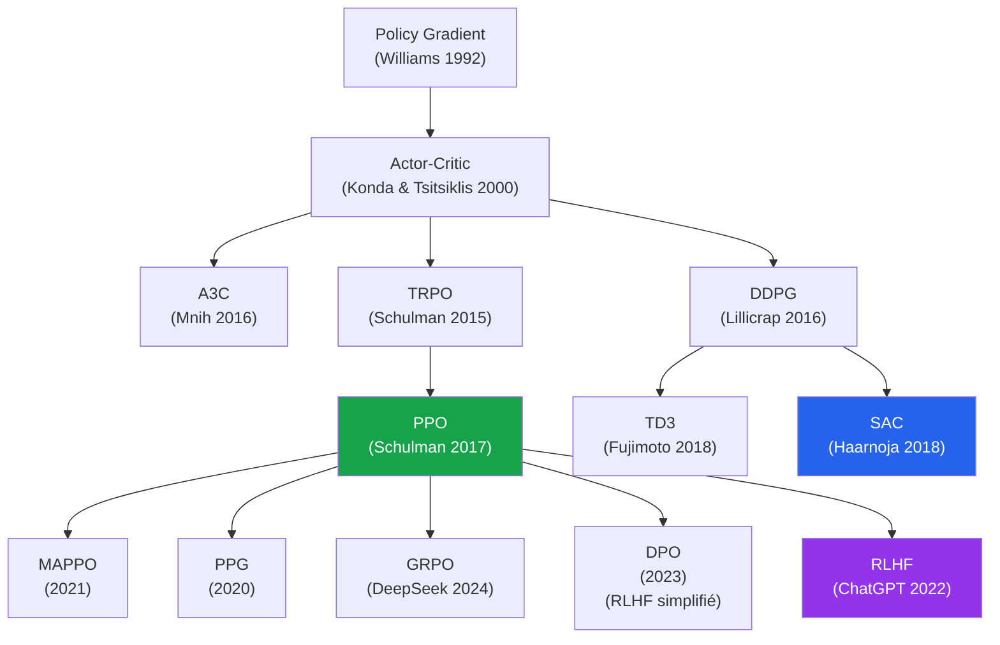

---

### Connexion avec le reste du cours

| Chapitre | Lien avec PPO |
|---|---|
| **Chapitre 1** (Intro RL) | PPO reste dans le cadre du cycle agent-environnement |
| **Chapitre 4-5** (MDP) | PPO s'applique à tout MDP fini ou continu |
| **Chapitre 8** (Value vs Policy) | PPO est **Actor-Critic** : combine les deux paradigmes |
| **Chapitre 9** (Bellman) | Le critic apprend $V$ via l'équation de Bellman |
| **P12** (Q-Learning) | DQN ≠ PPO (Value-Based vs Policy-Based) |
| **P15-bis** (SARSA) | Tous deux on-policy, mais PPO scale mieux |
| **P17-bis** (DQN) | PPO est l'alternative Policy-Based moderne |
| **P18** (Policy Gradient) | PPO est l'amélioration moderne du Policy Gradient |
| **P19** (Actor-Critic) | PPO est l'algorithme Actor-Critic le plus utilisé |
| **P24** (SAC) | Cousin **off-policy** de PPO pour actions continues |
| **P25** (RLHF/LLMs) | PPO est au cœur de l'alignement des LLMs |

---

### Pour aller plus loin

- 📘 **Schulman et al., 2017** — « Proximal Policy Optimization Algorithms » (arXiv) — papier fondateur
- 📘 **Schulman et al., 2015** — « Trust Region Policy Optimization » (TRPO) — l'ancêtre
- 📘 **Schulman et al., 2016** — « High-Dimensional Continuous Control Using GAE » — papier GAE
- 📘 **Andrew et al., 2022** — « The 37 Implementation Details of PPO » (ICLR Blog Track)
- 📘 **Christiano et al., 2017** — « Deep RL from Human Preferences » — l'origine de RLHF avec PPO
- 📄 **OpenAI Spinning Up** — tutoriel PPO accessible avec code
- 🛠️ **Stable-Baselines3** — `from stable_baselines3 import PPO` — production-ready
- 🛠️ **CleanRL** — single-file PPO avec tous les tricks documentés
- 🛠️ **RLlib (Ray)** — PPO distribué pour grands clusters
- 🛠️ **TRL (HuggingFace)** — PPO pour LLMs/RLHF
- 🎥 **OpenAI Five blog (2017)** — démonstration de PPO sur Dota 2
- 📺 **Anthropic Constitutional AI** — PPO + Constitutional methods pour Claude

> **💡 Astuce**
> **Action pratique recommandée :**
>
> 1. **Exécutez le code Python fourni** sur CartPole — observez la courbe de reward
> 2. **Modifiez $\epsilon$** (clip range) entre 0.1 et 0.5 — voyez la stabilité
> 3. **Désactivez la normalisation des avantages** — observez la dégradation
> 4. **Testez sur LunarLanderContinuous-v2** — adaptez l'actor en gaussienne
> 5. **Implémentez l'early stopping sur KL** (trick #9)
> 6. **Comparez PPO vs DQN** sur le même problème — sample efficiency vs stabilité
> 7. **Pour les ambitieux** : utilisez TRL pour fine-tuner un petit LLM (DistilGPT-2) avec PPO RLHF

> **📌 À retenir**
> **Erreurs à ne plus faire après ce chapitre :**
>
> - ❌ Oublier la **normalisation des avantages** (sans elle, PPO marche mal)
> - ❌ Oublier de **figer `log_probs_old`** (ratio toujours = 1, clip inutile)
> - ❌ Faire **K trop grand** (>20 époques → divergence)
> - ❌ Confondre `min` et `max` dans le clip (le `min` est CRUCIAL)
> - ❌ Penser que PPO peut utiliser un replay buffer comme DQN
> - ❌ Utiliser PPO sur des données offline (PPO est on-policy strict)
> - ❌ Oublier la **gestion de `done`** dans le calcul GAE
> - ❌ Sous-estimer l'importance des **37 tricks** d'implémentation

> **🛑 Danger**
> **L'erreur philosophique à éviter :** penser que « PPO est juste Vanilla PG avec un clip ».
>
> En théorie pure, oui. **Mais** :
>
> - Vanilla PG **diverge** sur la plupart des problèmes réels
> - PPO **converge** grâce au clip + GAE + normalisation + 37 tricks
> - Vanilla PG demande **millions** d'épisodes pour rien apprendre
> - PPO résout CartPole en **5 minutes**
>
> **L'apparente simplicité de PPO cache une ingénierie sophistiquée**. C'est pour ça que tout le monde utilise Stable-Baselines3 — réimplémenter PPO correctement demande des semaines.

---

### Le mot de la fin

PPO est l'algorithme qui a **prouvé qu'un Deep RL stable, simple et polyvalent était possible**. Avant lui (2015-2017), le Deep Policy Gradient était considéré comme **trop instable** pour la pratique. Schulman et son équipe à OpenAI ont montré qu'avec **une seule idée** (le clip), on pouvait obtenir des performances **comparables ou supérieures à TRPO** avec **un dixième du code**.

Aujourd'hui (2026), PPO est :

- **L'algorithme RL le plus utilisé au monde**
- **La base de RLHF** pour ChatGPT, Claude, Gemini
- **Le standard de la robotique** (Boston Dynamics, Figure AI, Tesla Optimus)
- **Le choix par défaut** dans toutes les bibliothèques (Stable-Baselines3, RLlib, CleanRL)
- **L'un des algorithmes les plus cités** en ML (25 000+ citations)

Si vous n'apprenez **qu'un seul algorithme** de Deep RL, c'est **PPO**.

> _« PPO is the workhorse of modern RL. Everything else is either simpler (DQN) or specialized (SAC, MuZero). »_ — John Schulman, OpenAI co-fondateur, 2023

</details>

<p align="right"><a href="#top">↑ Retour en haut</a></p>

---

<p align="center">
  <em>Tous droits réservés. Toute reproduction, diffusion, utilisation ou adaptation de ce cours, en tout ou en partie, est strictement interdite sans l'autorisation écrite préalable de Dr. Haythem REHOUMA.</em>
</p>

<p align="center">
  <strong>Cours créé par Dr. Haythem REHOUMA — Apprentissage par Renforcement</strong>
</p>

<br/>

<p align="center">
  <a href="#top" style="display: inline-block; background: #2563eb; color: #ffffff; text-decoration: none; font-size: 1.1rem; font-weight: 700; padding: 14px 40px; border-radius: 10px; letter-spacing: 0.3px;">
    ↑ Retour en haut du cours
  </a>
</p>

