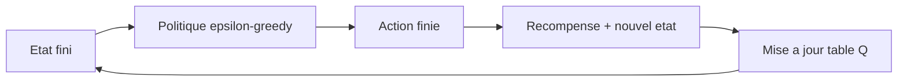
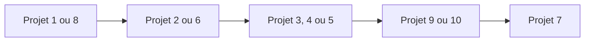

<a id="top"></a>

# Projets RL simples pour débutants - Q-Learning, SARSA, Monte Carlo

- Ce document propose une sélection de **mini-projets très simples** d'apprentissage par renforcement. 
- Tous les projets reposent **uniquement sur les notions fondamentales du cours** :

- états finis et actions finies,
- récompenses, politique, fonction de valeur,
- équations de Bellman,
- **Value Iteration**, **Q-Learning**, **SARSA**, **TD-Learning**, **Monte Carlo**.

Aucun de ces projets ne nécessite de **Deep RL**, de **DQN**, de **PPO**, ni de **réseaux de neurones**. Chaque projet est codable en quelques dizaines de lignes de Python avec NumPy uniquement.

> _L'objectif est de permettre à l'apprenant de manipuler concrètement la table Q, la mise à jour de Bellman et la stratégie epsilon-greedy, sans complexité technique additionnelle._

---

## Table des matières

| # | Section |
|---|---|
| 1 | [Vue d'ensemble et critères de simplicité](#section-1) |
| 2 | [Tableau comparatif des 10 projets](#section-2) |
| 3 | [Projet 1 - GridWorld 4×4](#section-3) |
| 4 | [Projet 2 - Labyrinthe simple avec murs](#section-4) |
| 5 | [Projet 3 - Robot aspirateur](#section-5) |
| 6 | [Projet 4 - Feu de circulation simplifié](#section-6) |
| 7 | [Projet 5 - Ascenseur à 3 étages](#section-7) |
| 8 | [Projet 6 - Lac gelé (FrozenLake)](#section-8) |
| 9 | [Projet 7 - Tic-Tac-Toe contre joueur aléatoire](#section-9) |
| 10 | [Projet 8 - Bandit multi-bras (K-armed bandit)](#section-10) |
| 11 | [Projet 9 - Cliff Walking (Q-Learning vs SARSA)](#section-11) |
| 12 | [Projet 10 - Random Walk 1D (TD vs Monte Carlo)](#section-12) |
| 13 | [Comment choisir son projet](#section-13) |
| 14 | [Squelette Python générique réutilisable](#section-14) |

---

<a id="section-1"></a>

<details open>
<summary>1 - Vue d'ensemble et critères de simplicité</summary>

<br/>

Tous les projets de ce document partagent les mêmes caractéristiques de simplicité. Cela garantit qu'ils sont accessibles, codables rapidement et compatibles avec un cours d'introduction au RL.

### Critères communs aux 10 projets

| Critère | Valeur |
|---|---|
| **Espace d'états** | Fini, généralement entre 4 et 200 états |
| **Espace d'actions** | Fini, généralement entre 2 et 9 actions |
| **Représentation interne** | Table Q sous forme de tableau NumPy ou de dictionnaire |
| **Bibliothèques requises** | Python, NumPy (Matplotlib en option) |
| **Algorithmes utilisables** | Value Iteration, Q-Learning, SARSA, TD(0), Monte Carlo |
| **Exclusions** | Réseaux de neurones, DQN, PPO, Deep RL |



> _Tous les projets se résument à la même boucle : l'agent observe un état fini, choisit une action, reçoit une récompense, et met à jour sa table Q selon Bellman._

</details>

<p align="right"><a href="#top">Retour en haut</a></p>

---

<a id="section-2"></a>

<details>
<summary>2 - Tableau comparatif des 10 projets</summary>

<br/>

| # | Projet | Difficulté | Nb d'états | Nb d'actions | Algorithme idéal |
|---|---|---|---|---|---|
| 1 | **GridWorld 4×4** | Très facile | 16 | 4 | Value Iteration, Q-Learning |
| 2 | **Labyrinthe avec murs** | Facile | ~20-50 | 4 | Q-Learning |
| 3 | **Robot aspirateur** | Facile | ~16-32 | 5 | Q-Learning |
| 4 | **Feu de circulation** | Facile | ~25 | 2 | Q-Learning, SARSA |
| 5 | **Ascenseur 3 étages** | Facile à moyen | ~24 | 3 | Q-Learning |
| 6 | **Lac gelé (FrozenLake)** | Très facile | 16 | 4 | Value Iteration, Q-Learning |
| 7 | **Tic-Tac-Toe** | Moyen | ~5000 (dictionnaire) | ≤ 9 | Monte Carlo, Q-Learning |
| 8 | **Bandit multi-bras** | Très facile | 1 | K (ex : 10) | Epsilon-greedy, UCB |
| 9 | **Cliff Walking** | Facile | 48 | 4 | Q-Learning **et** SARSA |
| 10 | **Random Walk 1D** | Très facile | 5-7 | 2 | TD(0), Monte Carlo |

> _Les projets 1, 6, 8 et 10 sont les plus accessibles pour une toute première implémentation. Les projets 7 et 9 sont parfaits pour comparer deux algorithmes (Monte Carlo vs Q-Learning, ou Q-Learning vs SARSA)._

</details>

<p align="right"><a href="#top">Retour en haut</a></p>

---

<a id="section-3"></a>

<details>
<summary>3 - Projet 1 - GridWorld 4×4</summary>

<br/>

| Élément | Description |
|---|---|
| **1. Titre** | GridWorld 4×4 - L'agent atteint l'objectif |
| **2. Contexte** | Un agent se déplace sur une grille 4×4. Une case contient un objectif. L'agent doit l'atteindre en un minimum de pas |
| **3. Agent** | Pion qui se déplace de case en case |
| **4. Environnement** | Grille 4×4 avec une case d'arrivée |
| **5. États** | 16 cases (positions discrètes), une seule case terminale |
| **6. Actions** | 4 : haut, bas, gauche, droite |
| **7. Récompenses** | -1 par déplacement, +10 quand l'objectif est atteint |
| **8. Algorithme** | **Value Iteration** ou **Q-Learning** |
| **9. Pourquoi débutant** | États et actions très peu nombreux. La table Q tient dans une matrice 16×4. Permet de visualiser directement la politique optimale sous forme de flèches sur la grille |
| **10. Idée de code Python** | Voir l'exemple ci-dessous |

```python
import numpy as np

n_states = 16
n_actions = 4
Q = np.zeros((n_states, n_actions))

alpha, gamma, epsilon = 0.1, 0.9, 0.1
goal = 15

def step(s, a):
    row, col = s // 4, s % 4
    if a == 0: row = max(row - 1, 0)
    elif a == 1: row = min(row + 1, 3)
    elif a == 2: col = max(col - 1, 0)
    elif a == 3: col = min(col + 1, 3)
    s_next = row * 4 + col
    reward = 10 if s_next == goal else -1
    done = s_next == goal
    return s_next, reward, done

for episode in range(2000):
    s = 0
    done = False
    while not done:
        a = np.random.randint(n_actions) if np.random.rand() < epsilon else int(np.argmax(Q[s]))
        s_next, r, done = step(s, a)
        Q[s, a] += alpha * (r + gamma * np.max(Q[s_next]) - Q[s, a])
        s = s_next
```

</details>

<p align="right"><a href="#top">Retour en haut</a></p>

---

<a id="section-4"></a>

<details>
<summary>4 - Projet 2 - Labyrinthe simple avec murs</summary>

<br/>

| Élément | Description |
|---|---|
| **1. Titre** | Labyrinthe simple - Trouver la sortie |
| **2. Contexte** | Une grille avec des murs internes. L'agent part d'une case de départ et doit atteindre la sortie |
| **3. Agent** | Explorateur du labyrinthe |
| **4. Environnement** | Grille (par exemple 5×5 ou 6×6) avec un ensemble de cases bloquées (murs) |
| **5. États** | Cases accessibles, soit environ 20 à 50 selon la taille |
| **6. Actions** | 4 : haut, bas, gauche, droite |
| **7. Récompenses** | -1 par pas, -10 si l'agent tente de traverser un mur, +100 à la sortie |
| **8. Algorithme** | **Q-Learning** |
| **9. Pourquoi débutant** | Variante directe du GridWorld avec un peu plus de richesse. Les murs permettent de discuter de la politique optimale et de la propagation des valeurs Q |
| **10. Idée de code Python** | Stocker la grille comme un tableau NumPy 2D où `0` = libre et `1` = mur. Vérifier la validité de chaque action avant de mettre à jour la position |

```python
import numpy as np

grid = np.array([
    [0, 0, 0, 0, 0],
    [0, 1, 1, 0, 0],
    [0, 0, 0, 1, 0],
    [0, 1, 0, 0, 0],
    [0, 0, 0, 1, 2],
])

start = (0, 0)
n_actions = 4

def step(state, a):
    r, c = state
    nr, nc = r, c
    if a == 0: nr = max(r - 1, 0)
    elif a == 1: nr = min(r + 1, 4)
    elif a == 2: nc = max(c - 1, 0)
    elif a == 3: nc = min(c + 1, 4)
    if grid[nr, nc] == 1:
        return state, -10, False
    if grid[nr, nc] == 2:
        return (nr, nc), 100, True
    return (nr, nc), -1, False
```

</details>

<p align="right"><a href="#top">Retour en haut</a></p>

---

<a id="section-5"></a>

<details>
<summary>5 - Projet 3 - Robot aspirateur</summary>

<br/>

| Élément | Description |
|---|---|
| **1. Titre** | Robot aspirateur - Nettoyer toutes les pièces |
| **2. Contexte** | Un robot doit nettoyer un appartement composé de plusieurs pièces. Il doit minimiser le nombre de mouvements |
| **3. Agent** | Robot aspirateur |
| **4. Environnement** | 4 pièces disposées en grille 2×2, chaque pièce pouvant être propre ou sale |
| **5. États** | Position du robot × état de propreté de chaque pièce. Pour 4 pièces : 4 × 2⁴ = 64 états maximum |
| **6. Actions** | 5 : haut, bas, gauche, droite, aspirer |
| **7. Récompenses** | +10 quand une pièce est nettoyée, -1 par mouvement, +50 quand tout est propre |
| **8. Algorithme** | **Q-Learning** |
| **9. Pourquoi débutant** | Très visuel. L'apprenant doit composer la position et l'état de propreté pour former l'état complet, ce qui introduit la notion d'**état composé** |
| **10. Idée de code Python** | Encoder l'état comme `(position, dirty_mask)` où `dirty_mask` est un entier dont chaque bit indique si une pièce est sale |

```python
import numpy as np

def encode(pos, dirty_mask):
    return pos * 16 + dirty_mask

n_states = 4 * 16
n_actions = 5
Q = np.zeros((n_states, n_actions))
```

> _L'apprenant peut commencer avec **2 pièces** (8 états) avant de passer à 4. C'est une excellente progression pédagogique._

</details>

<p align="right"><a href="#top">Retour en haut</a></p>

---

<a id="section-6"></a>

<details>
<summary>6 - Projet 4 - Feu de circulation simplifié</summary>

<br/>

| Élément | Description |
|---|---|
| **1. Titre** | Feu de circulation - Optimiser le passage des voitures |
| **2. Contexte** | Une intersection avec deux directions (Nord-Sud et Est-Ouest). Des voitures arrivent à chaque pas de temps. L'agent contrôle le feu |
| **3. Agent** | Contrôleur du feu de circulation |
| **4. Environnement** | Intersection avec deux files d'attente |
| **5. États** | Nombre de voitures dans chaque direction, discrétisé en niveaux (par exemple 0, 1, 2, 3, 4+). Soit 5 × 5 = 25 états |
| **6. Actions** | 2 : feu vert Nord-Sud, feu vert Est-Ouest |
| **7. Récompenses** | -nombre total de voitures en attente à chaque pas |
| **8. Algorithme** | **Q-Learning** ou **SARSA** |
| **9. Pourquoi débutant** | Excellent exemple d'application réelle. Peu d'états, peu d'actions. Permet de discuter de la **discrétisation** d'une variable continue |
| **10. Idée de code Python** | Simuler les arrivées avec une probabilité fixe à chaque pas. Mettre à jour la file d'attente selon l'action choisie |

```python
import numpy as np

def step(state, a):
    ns, ew = state
    if a == 0:
        ns = max(ns - 2, 0)
    else:
        ew = max(ew - 2, 0)
    if np.random.rand() < 0.4: ns = min(ns + 1, 4)
    if np.random.rand() < 0.4: ew = min(ew + 1, 4)
    reward = -(ns + ew)
    return (ns, ew), reward, False
```

</details>

<p align="right"><a href="#top">Retour en haut</a></p>

---

<a id="section-7"></a>

<details>
<summary>7 - Projet 5 - Ascenseur à 3 étages</summary>

<br/>

| Élément | Description |
|---|---|
| **1. Titre** | Ascenseur simplifié - Servir les appels au plus vite |
| **2. Contexte** | Un immeuble de 3 étages. Des appels arrivent depuis chaque étage. L'agent contrôle l'ascenseur |
| **3. Agent** | Ascenseur |
| **4. Environnement** | 3 étages avec un état "appel en attente" pour chacun |
| **5. États** | Étage actuel (3) × combinaisons d'appels en attente (2³ = 8). Total : 24 états |
| **6. Actions** | 3 : monter, descendre, rester (et servir l'appel) |
| **7. Récompenses** | -1 par étage parcouru, +10 par appel servi |
| **8. Algorithme** | **Q-Learning** |
| **9. Pourquoi débutant** | États composés mais peu nombreux. Permet de discuter de l'**état combiné** (position + signaux externes) |
| **10. Idée de code Python** | Utiliser un tuple `(etage, appels)` comme clé de dictionnaire pour la table Q |

```python
import numpy as np

Q = {}

def get_q(state, a, n_actions=3):
    if state not in Q:
        Q[state] = np.zeros(n_actions)
    return Q[state][a]
```

</details>

<p align="right"><a href="#top">Retour en haut</a></p>

---

<a id="section-8"></a>

<details>
<summary>8 - Projet 6 - Lac gelé (FrozenLake)</summary>

<br/>

| Élément | Description |
|---|---|
| **1. Titre** | Lac gelé - Atteindre l'objectif sans tomber dans un trou |
| **2. Contexte** | Un agent traverse un lac représenté par une grille 4×4. Certaines cases sont des trous. Les déplacements peuvent être glissants |
| **3. Agent** | Marcheur sur la glace |
| **4. Environnement** | Grille 4×4 avec une case de départ, des trous et un objectif |
| **5. États** | 16 cases |
| **6. Actions** | 4 : haut, bas, gauche, droite |
| **7. Récompenses** | +1 si l'objectif est atteint, 0 sinon. Tomber dans un trou termine l'épisode |
| **8. Algorithme** | **Value Iteration** ou **Q-Learning** |
| **9. Pourquoi débutant** | Disponible directement dans Gymnasium (`FrozenLake-v1`). Permet d'introduire la **stochasticité** très simplement |
| **10. Idée de code Python** | Utiliser Gymnasium et appliquer Q-Learning sur la table 16×4 |

```python
import numpy as np
import gymnasium as gym

env = gym.make("FrozenLake-v1", is_slippery=True)
Q = np.zeros((env.observation_space.n, env.action_space.n))

alpha, gamma, epsilon = 0.1, 0.99, 0.1

for episode in range(5000):
    s, _ = env.reset()
    done = False
    while not done:
        a = env.action_space.sample() if np.random.rand() < epsilon else int(np.argmax(Q[s]))
        s_next, r, done, truncated, _ = env.step(a)
        Q[s, a] += alpha * (r + gamma * np.max(Q[s_next]) - Q[s, a])
        s = s_next
        if truncated: break
```

</details>

<p align="right"><a href="#top">Retour en haut</a></p>

---

<a id="section-9"></a>

<details>
<summary>9 - Projet 7 - Tic-Tac-Toe contre joueur aléatoire</summary>

<br/>

| Élément | Description |
|---|---|
| **1. Titre** | Tic-Tac-Toe - Apprendre à gagner contre un adversaire aléatoire |
| **2. Contexte** | Plateau 3×3 classique. L'agent joue contre un adversaire qui choisit ses coups au hasard |
| **3. Agent** | Joueur RL |
| **4. Environnement** | Plateau 3×3 avec un adversaire intégré |
| **5. États** | Configurations possibles du plateau (environ 5000 atteignables, encodées sous forme de chaîne ou de tuple) |
| **6. Actions** | Au plus 9 (cases libres uniquement) |
| **7. Récompenses** | +1 victoire, -1 défaite, 0 nul, 0 sinon |
| **8. Algorithme** | **Monte Carlo** ou **Q-Learning** avec table Q sous forme de dictionnaire |
| **9. Pourquoi débutant** | Aucun environnement externe n'est nécessaire. Le jeu est entièrement codable en pur Python. C'est un excellent exercice pour comprendre Monte Carlo en première personne |
| **10. Idée de code Python** | Représenter le plateau comme un tuple de 9 éléments. Utiliser un dictionnaire `Q[state] = np.zeros(9)` |

```python
import numpy as np
import random

Q = {}

def state_key(board):
    return tuple(board)

def available_actions(board):
    return [i for i, v in enumerate(board) if v == 0]

def get_q(board):
    s = state_key(board)
    if s not in Q:
        Q[s] = np.zeros(9)
    return Q[s]

def choose_action(board, epsilon=0.1):
    actions = available_actions(board)
    if random.random() < epsilon:
        return random.choice(actions)
    q = get_q(board)
    return max(actions, key=lambda a: q[a])
```

</details>

<p align="right"><a href="#top">Retour en haut</a></p>

---

<a id="section-10"></a>

<details>
<summary>10 - Projet 8 - Bandit multi-bras (K-armed bandit)</summary>

<br/>

| Élément | Description |
|---|---|
| **1. Titre** | Bandit multi-bras - Choisir la meilleure machine à sous |
| **2. Contexte** | K machines à sous. Chacune donne une récompense aléatoire selon une loi inconnue. L'agent doit identifier la meilleure tout en accumulant un maximum de gains |
| **3. Agent** | Joueur de casino |
| **4. Environnement** | K bras, chacun associé à une distribution de récompense (par exemple gaussienne ou Bernoulli) |
| **5. États** | Un seul état (problème **sans état**) |
| **6. Actions** | K (par exemple K = 10) |
| **7. Récompenses** | Tirage aléatoire selon le bras choisi |
| **8. Algorithme** | **Epsilon-greedy**, **moyenne incrémentale**, **UCB** |
| **9. Pourquoi débutant** | Le projet le plus simple possible : pas de dynamique d'états, pas de transition. Idéal pour comprendre **exploration vs exploitation** |
| **10. Idée de code Python** | Stocker la valeur estimée `Q[a]` et le nombre de tirages `N[a]` pour chaque bras |

```python
import numpy as np

K = 10
true_means = np.random.normal(0, 1, K)
Q = np.zeros(K)
N = np.zeros(K)
epsilon = 0.1

for step in range(2000):
    if np.random.rand() < epsilon:
        a = np.random.randint(K)
    else:
        a = int(np.argmax(Q))
    r = np.random.normal(true_means[a], 1)
    N[a] += 1
    Q[a] += (r - Q[a]) / N[a]
```

</details>

<p align="right"><a href="#top">Retour en haut</a></p>

---

<a id="section-11"></a>

<details>
<summary>11 - Projet 9 - Cliff Walking (Q-Learning vs SARSA)</summary>

<br/>

| Élément | Description |
|---|---|
| **1. Titre** | Cliff Walking - Comparer Q-Learning et SARSA |
| **2. Contexte** | Une grille 4×12 dont le bas est une falaise. L'agent doit aller du coin bas-gauche au coin bas-droite sans tomber |
| **3. Agent** | Marcheur |
| **4. Environnement** | Grille 4×12 avec une falaise (récompense -100 et retour au départ) |
| **5. États** | 48 cases |
| **6. Actions** | 4 : haut, bas, gauche, droite |
| **7. Récompenses** | -1 par pas, -100 si l'agent tombe dans la falaise (et retour au départ), 0 quand il atteint l'arrivée |
| **8. Algorithme** | **Q-Learning** ET **SARSA** (comparaison directe) |
| **9. Pourquoi débutant** | Exemple classique du livre de Sutton & Barto. Permet de **voir concrètement la différence** entre on-policy (SARSA, chemin prudent) et off-policy (Q-Learning, chemin optimal mais risqué) |
| **10. Idée de code Python** | Implémenter une seule fonction `step()` et deux boucles d'entraînement, une pour chaque algorithme |

```python
import numpy as np

n_states = 4 * 12
n_actions = 4

def update_qlearning(Q, s, a, r, s_next, alpha, gamma):
    Q[s, a] += alpha * (r + gamma * np.max(Q[s_next]) - Q[s, a])

def update_sarsa(Q, s, a, r, s_next, a_next, alpha, gamma):
    Q[s, a] += alpha * (r + gamma * Q[s_next, a_next] - Q[s, a])
```

> _Le projet est particulièrement riche pour un rapport : il suffit de tracer la récompense moyenne par épisode pour chaque algorithme et de discuter pourquoi SARSA prend un chemin plus sûr._

</details>

<p align="right"><a href="#top">Retour en haut</a></p>

---

<a id="section-12"></a>

<details>
<summary>12 - Projet 10 - Random Walk 1D (TD vs Monte Carlo)</summary>

<br/>

| Élément | Description |
|---|---|
| **1. Titre** | Random Walk 1D - Estimer la valeur des états |
| **2. Contexte** | Une ligne d'états A, B, C, D, E avec deux extrémités terminales. Depuis chaque état, l'agent va à gauche ou à droite avec probabilité 0.5. Récompense de +1 à droite, 0 à gauche |
| **3. Agent** | Marcheur aléatoire (la politique est fixée) |
| **4. Environnement** | Ligne d'états avec deux états terminaux |
| **5. États** | 5 à 7 états (A, B, C, D, E + terminaux) |
| **6. Actions** | 2 : aller à gauche, aller à droite |
| **7. Récompenses** | +1 quand l'agent sort à droite, 0 sinon |
| **8. Algorithme** | **TD(0)** et **Monte Carlo** (comparaison) |
| **9. Pourquoi débutant** | C'est l'**exemple historique** utilisé pour expliquer TD-Learning. Permet de tracer la convergence de V(s) et de comparer les deux méthodes sur un cas trivial |
| **10. Idée de code Python** | Initialiser `V = np.zeros(7)`. Implémenter une boucle pour TD(0) et une autre pour Monte Carlo |

```python
import numpy as np

def episode():
    s = 3
    trajectory = [s]
    while s != 0 and s != 6:
        s += np.random.choice([-1, 1])
        trajectory.append(s)
    reward = 1 if s == 6 else 0
    return trajectory, reward

V = np.zeros(7)
alpha = 0.1
for _ in range(1000):
    traj, R = episode()
    for t in range(len(traj) - 1):
        s, s_next = traj[t], traj[t + 1]
        r = R if s_next in (0, 6) else 0
        V[s] += alpha * (r + V[s_next] - V[s])
```

</details>

<p align="right"><a href="#top">Retour en haut</a></p>

---

<a id="section-13"></a>

<details>
<summary>13 - Comment choisir son projet</summary>

<br/>

Le tableau ci-dessous oriente le choix selon l'objectif pédagogique principal.

| Si l'apprenant veut... | Projet conseillé |
|---|---|
| Sa **toute première** implémentation RL | Projet 1 (GridWorld) ou Projet 8 (Bandit) |
| Comprendre la **stochasticité** | Projet 6 (FrozenLake) |
| Comprendre l'**état composé** | Projet 3 (Aspirateur) ou Projet 5 (Ascenseur) |
| Comprendre **exploration vs exploitation** | Projet 8 (Bandit multi-bras) |
| Comparer **Q-Learning et SARSA** | Projet 9 (Cliff Walking) |
| Comparer **TD et Monte Carlo** | Projet 10 (Random Walk) |
| Travailler sur un **cas réel simple** | Projet 4 (Feu de circulation) |
| Coder un **jeu complet** | Projet 7 (Tic-Tac-Toe) |
| Travailler sans dépendance externe | Projets 1, 2, 7, 8, 10 |

---

### Progression recommandée



> _Cette progression permet d'aller du plus simple (table Q minimale) au plus riche (jeu complet, comparaison d'algorithmes), tout en restant dans le périmètre des notions fondamentales du cours._

</details>

<p align="right"><a href="#top">Retour en haut</a></p>

---

<a id="section-14"></a>

<details>
<summary>14 - Squelette Python générique réutilisable</summary>

<br/>

Tous les projets de ce document peuvent être implémentés en s'appuyant sur le même squelette d'entraînement. Seules les fonctions `reset()` et `step()` changent d'un projet à l'autre.

```python
import numpy as np

n_states = 16
n_actions = 4
Q = np.zeros((n_states, n_actions))

alpha = 0.1
gamma = 0.99
epsilon = 0.1
n_episodes = 2000

def reset():
    return 0

def step(state, action):
    next_state = state
    reward = 0
    done = False
    return next_state, reward, done

for episode in range(n_episodes):
    s = reset()
    done = False
    while not done:
        if np.random.rand() < epsilon:
            a = np.random.randint(n_actions)
        else:
            a = int(np.argmax(Q[s]))
        s_next, r, done = step(s, a)
        Q[s, a] += alpha * (r + gamma * np.max(Q[s_next]) - Q[s, a])
        s = s_next

print("Politique apprise :", np.argmax(Q, axis=1))
```

---

### Variante SARSA

Pour passer de Q-Learning à SARSA, il suffit de remplacer la mise à jour par :

```python
a_next = int(np.argmax(Q[s_next])) if np.random.rand() >= epsilon else np.random.randint(n_actions)
Q[s, a] += alpha * (r + gamma * Q[s_next, a_next] - Q[s, a])
```

### Variante Monte Carlo

Pour Monte Carlo, l'apprenant doit stocker l'épisode complet, puis mettre à jour rétrospectivement les valeurs Q en fonction du retour cumulé `G`.

---

### Conseil final

Il est recommandé de toujours commencer par implémenter le **Projet 1 (GridWorld 4×4)** ou le **Projet 8 (Bandit multi-bras)**. Une fois ce premier projet maîtrisé, les autres projets s'écrivent en quelques modifications du même squelette.

</details>

<p align="right"><a href="#top">Retour en haut</a></p>
